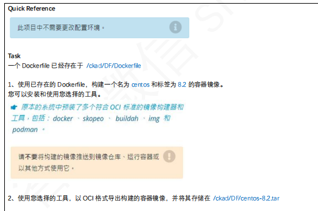

### **Dockerfile 概念**
`Dockerfile` 是一个文本文件，用于定义 Docker 容器的构建步骤和环境。通过 `Dockerfile`，你可以使用一组指令来描述容器的基础镜像、安装的依赖、执行的命令、暴露的端口等，最终构建出一个镜像。

Dockerfile 的目标是自动化和可重复地创建镜像，使应用在任何支持 Docker 的环境中运行。

---

### **1. Dockerfile 基本结构**
Dockerfile 的指令遵循以下顺序（非强制）：

1. **基础镜像**：`FROM`
2. **镜像维护者信息**：`LABEL`（可选）
3. **环境变量**：`ENV`（可选）
4. **依赖安装**：`RUN`
5. **工作目录**：`WORKDIR`
6. **复制文件**：`COPY` 和 `ADD`
7. **容器启动命令**：`CMD` 或 `ENTRYPOINT`
8. **端口暴露**：`EXPOSE`
9. **其他配置**：例如 `USER`、`VOLUME` 等。

---

### **2. Dockerfile 常用指令**
#### **1. FROM**
+ 指定基础镜像，所有 Dockerfile 必须以 `FROM` 开头。
+ 一个 Dockerfile 可以使用多个 `FROM` 构建多阶段镜像。

```dockerfile
# 以官方 Nginx 镜像为基础
FROM nginx:1.25.2
```

---

#### **2. LABEL**
+ 添加镜像的元信息，例如作者、版本、描述等。

```dockerfile
LABEL maintainer="liyedong@example.com"
LABEL version="1.0"
LABEL description="A simple web application"
```

---

#### **3. RUN**
+ 在镜像构建时执行的命令，常用于安装依赖、构建代码等。
+ 每个 `RUN` 指令会创建一个新的镜像层。

```dockerfile
RUN apt-get update && apt-get install -y curl
```

---

#### **4. COPY 和 ADD**
+ **COPY**：将本地文件或目录复制到镜像中。
+ **ADD**：功能类似 `COPY`，但支持从 URL 下载文件或自动解压归档文件（例如 `.tar`）。

```dockerfile
COPY app/ /usr/src/app/
ADD https://example.com/file.tar.gz /tmp/
```

---

#### **5. WORKDIR**
+ 设置容器的工作目录。
+ 该路径会成为后续命令的默认路径。

```dockerfile
WORKDIR /usr/src/app
```

---

#### **6. ENV**
+ 设置环境变量，在镜像或容器中使用。

```dockerfile
ENV APP_ENV=production
ENV APP_PORT=8080
```

---

#### **7. CMD**
+ 指定容器启动时执行的命令（默认）。
+ 每个 Dockerfile 只能有一个 `CMD`，如果有多个，最后一个生效。

```dockerfile
CMD ["nginx", "-g", "daemon off;"]
```

---

#### **8. ENTRYPOINT**
+ 定义容器启动时的固定入口点命令。
+ 可结合 `CMD` 设置默认参数。

```dockerfile
ENTRYPOINT ["python", "app.py"]
CMD ["--host=0.0.0.0", "--port=8080"]
```

**运行容器：**

```bash
docker run myapp --debug
```

实际执行命令：`python app.py --debug`

---

#### **9. EXPOSE**
+ 声明容器对外暴露的端口，但不映射到主机，需要 `docker run -p` 手动指定。

```dockerfile
EXPOSE 80
```

---

#### **10. USER**
+ 指定容器运行时的用户，通常用于避免以 `root` 用户运行。

```dockerfile
USER 1000
```

---

#### **11. VOLUME**
+ 定义挂载点，便于数据持久化。

```dockerfile
VOLUME ["/data"]
```

---

### **3. 实践：构建简单的 Python 应用**
#### **1. 项目结构**
```plain
myapp/
│
├── app.py           # 主程序文件
├── requirements.txt # 依赖文件
└── Dockerfile       # Dockerfile 文件
```

#### **2. **`**app.py**`
```python
from flask import Flask
app = Flask(__name__)

@app.route("/")
def hello():
    return "Hello, Docker!"

if __name__ == "__main__":
    app.run(host="0.0.0.0", port=5000)
```

#### **3. **`**requirements.txt**`
```plain
flask
```

#### **4. Dockerfile**
```dockerfile
# 使用官方 Python 基础镜像
FROM python:3.9-slim

# 设置工作目录
WORKDIR /usr/src/app

# 安装依赖
COPY requirements.txt ./
RUN pip install --no-cache-dir -r requirements.txt

# 复制代码
COPY . .

# 暴露端口
EXPOSE 5000

# 设置启动命令
CMD ["python", "app.py"]
```

#### **5. 构建和运行镜像**
```bash
# 构建镜像
docker build -t my-python-app .

# 运行容器
docker run -d -p 5000:5000 my-python-app
```

访问：`http://localhost:5000`

---

### **4. 最佳实践**
1. **选择合适的基础镜像**：
    - 优先选择官方轻量级镜像，如 `alpine` 或 `slim` 版本，减少镜像大小。
2. **减少镜像层数**：
    - 合并多个 `RUN` 命令，避免不必要的镜像层。

```dockerfile
RUN apt-get update && \
    apt-get install -y curl && \
    apt-get clean
```

1. **使用多阶段构建**： 
    - 将构建和运行分离，减少最终镜像的大小。

```dockerfile
# 构建阶段
FROM golang:1.20 AS builder
WORKDIR /app
COPY . .
RUN go build -o main .

# 运行阶段
FROM alpine:latest
COPY --from=builder /app/main /main
CMD ["/main"]
```

1. **确保镜像安全**：
    - 避免以 `root` 用户运行容器。
    - 移除不必要的工具和文件。
2. **定期更新基础镜像**：
    - 确保使用最新的镜像版本，修复已知漏洞。

---

通过 `Dockerfile` 的合理设计，可以快速构建高效、安全、稳定的容器镜像，为应用提供可靠的运行环境。


# CKA题库



```dockerfile
FROM centos:8
LABEL maintainer="test dockerfile"
LABEL test=dockerfile
USER root
RUN useradd shadow
RUN mkdir /opt/shadow

```


```bash
cd /ckad/DF/
docker build -t centos:8.2 .
docker save -o /ckad/DF/centos-8.2.tar centos:8.2
```


