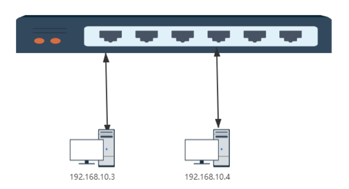
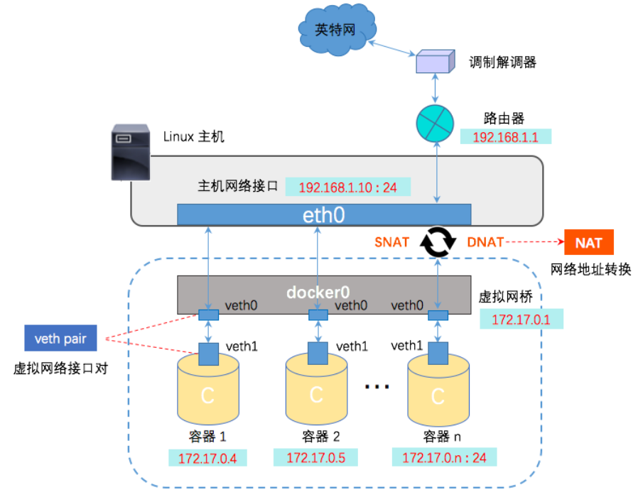
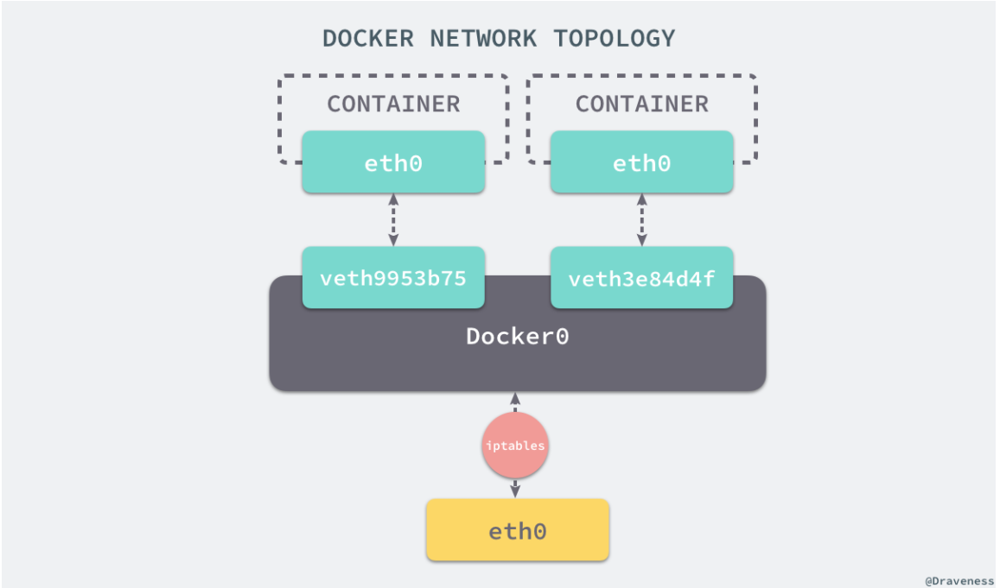
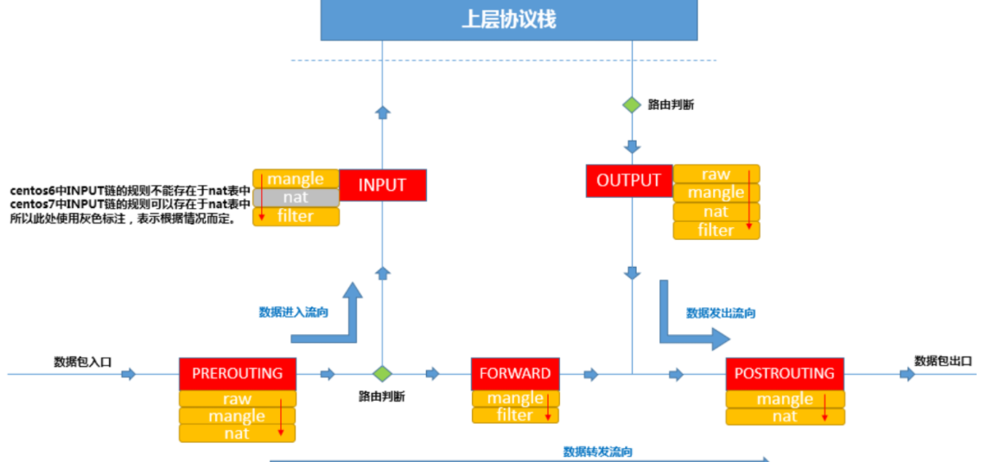
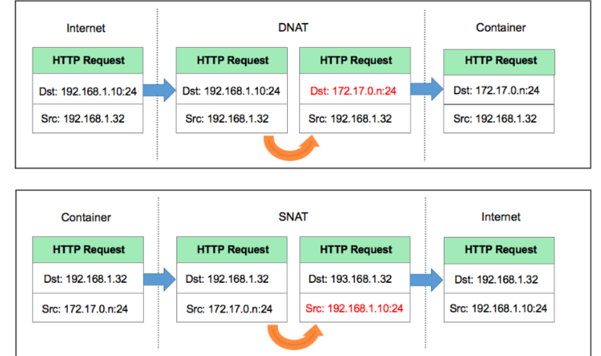
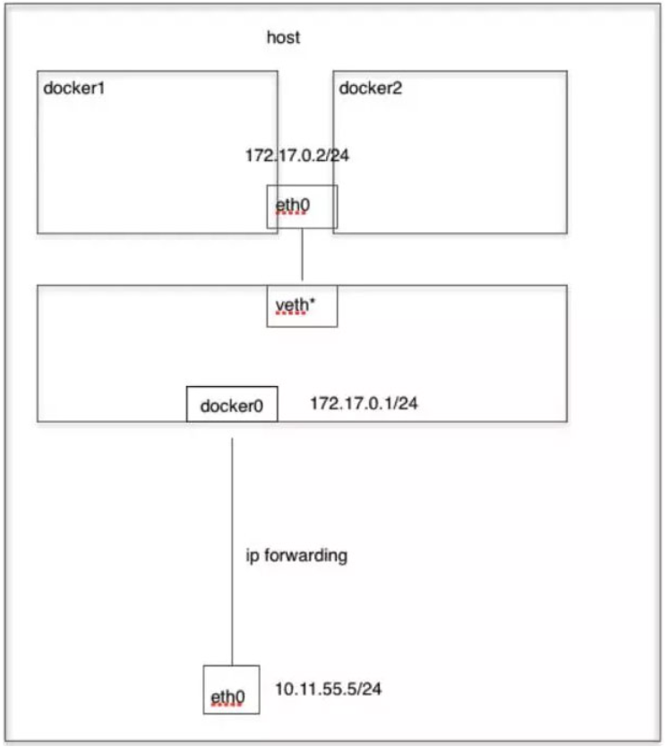

<font style="color:rgb(51, 51, 51);">docker容器是一块具有隔离性的虚拟系统，容器内可以有自己独立的网络空间，</font>

+ <font style="color:rgb(51, 51, 51);">多个容器之间是如何实现通信的呢？</font>
+ <font style="color:rgb(51, 51, 51);">容器和宿主机之间又是如何实现的通信呢？</font>
+ <font style="color:rgb(51, 51, 51);">使用-p参数是怎么实现的端口映射?</font>

<font style="color:rgb(51, 51, 51);">带着我们就这些问题，我们来学习一下docker的网络模型，最后我会通过抓包的方式，给大家演示一下数据包在容器和宿主机之间的转换过程。</font>

##### <font style="color:rgb(51, 51, 51);">网络模式</font>
<font style="color:rgb(51, 51, 51);">我们在使用docker run创建Docker容器时，可以用--net选项指定容器的网络模式，Docker有以下4种网络模式：</font>

+ <font style="color:rgb(51, 51, 51);">bridge模式，使用--net=bridge指定，默认设置</font>
+ <font style="color:rgb(51, 51, 51);">host模式，使用--net=host指定，容器内部网络空间共享宿主机的空间，效果类似直接在宿主机上启动一个进程，端口信息和宿主机共用。</font>
+ <font style="color:rgb(51, 51, 51);">container模式，使用--net=container:NAME_or_ID指定</font>

<font style="color:rgb(51, 51, 51);">指定容器与特定容器共享网络命名空间</font>

+ <font style="color:rgb(51, 51, 51);">none模式，使用--net=none指定</font>

<font style="color:rgb(51, 51, 51);">网络模式为空，即仅保留网络命名空间，但是不做任何网络相关的配置(网卡、IP、路由等)</font>

##### <font style="color:rgb(51, 51, 51);">bridge模式</font>
<font style="color:rgb(51, 51, 51);">那我们之前在演示创建docker容器的时候其实是没有指定的网络模式的，如果不指定的话默认就会使用bridge模式，bridge本意是桥的意思，其实就是网桥模式，那我们怎么理解网桥，如果需要做类比的话，我们可以把网桥看成一个二层的交换机设备，我们来看下这张图：</font>

<font style="color:rgb(51, 51, 51);">交换机通信简图</font>

  
 

<font style="color:rgb(51, 51, 51);">网桥模式示意图</font>

  
 <font style="color:rgb(51, 51, 51);">网桥在哪，查看网桥</font>

```shell
$ yum install -y bridge-utils
$ brctl show
bridge name     bridge id               STP enabled     interfaces
docker0         8000.0242b5fbe57b       no              veth3a496ed
```

<font style="color:rgb(51, 51, 51);">有了网桥之后，那我们看下docker在启动一个容器的时候做了哪些事情才能实现容器间的互联互通</font>

<font style="color:rgb(51, 51, 51);">Docker 创建一个容器的时候，会执行如下操作：</font>

+ <font style="color:rgb(51, 51, 51);">创建一对虚拟接口/网卡，也就是veth pair；</font>
+ <font style="color:rgb(51, 51, 51);">本地主机一端桥接 到默认的 docker0 或指定网桥上，并具有一个唯一的名字，如 veth9953b75；</font>
+ <font style="color:rgb(51, 51, 51);">容器一端放到新启动的容器内部，并修改名字作为 eth0，这个网卡/接口只在容器的命名空间可见；</font>
+ <font style="color:rgb(51, 51, 51);">从网桥可用地址段中（也就是与该bridge对应的network）获取一个空闲地址分配给容器的 eth0</font>
+ <font style="color:rgb(51, 51, 51);">配置默认路由到网桥</font>

<font style="color:rgb(51, 51, 51);">那整个过程其实是docker自动帮我们完成的，清理掉所有容器，来验证。</font>

```shell
## 清掉所有容器
$ docker rm -f `docker ps -aq`
$ docker ps
$ brctl show # 查看网桥中的接口，目前没有

## 创建测试容器test1
$ docker run -d --name test1 nginx:alpine
$ brctl show # 查看网桥中的接口，已经把test1的veth端接入到网桥中
$ ip a |grep veth # 已在宿主机中可以查看到
$ docker exec -ti test1 sh 
/ # ifconfig  # 查看容器的eth0网卡及分配的容器ip
/ # route -n  # 观察默认网关都指向了网桥的地址，即所有流量都转向网桥，等于是在veth pair接通了网线
Kernel IP routing table
Destination     Gateway         Genmask         Flags Metric Ref    Use Iface
0.0.0.0         172.17.0.1      0.0.0.0         UG    0      0        0 eth0
172.17.0.0      0.0.0.0         255.255.0.0     U     0      0        0 eth0

# 再来启动一个测试容器，测试容器间的通信
$ docker run -d --name test2 nginx:alpine
$ docker exec -ti test sh
/ # sed -i 's/dl-cdn.alpinelinux.org/mirrors.tuna.tsinghua.edu.cn/g' /etc/apk/repositories
/ # apk add curl
/ # curl 172.17.0.8:80

## 为啥可以通信，因为两个容器是接在同一个网桥中的，通信其实是通过mac地址和端口的的记录来做转发的。test1访问test2，通过test1的eth0发送ARP广播，网桥会维护一份mac映射表，我们可以大概通过命令来看一下，
$ brctl showmacs docker0
## 这些mac地址是主机端的veth网卡对应的mac，可以查看一下
$ ip a
```

<font style="color:rgb(51, 51, 51);">我们如何知道网桥上的这些虚拟网卡与容器端是如何对应？</font>

<font style="color:rgb(51, 51, 51);">通过ifindex，网卡索引号</font>

```shell
## 查看test1容器的网卡索引
$ docker exec -ti test1 cat /sys/class/net/eth0/ifindex

## 主机中找到虚拟网卡后面这个@ifxx的值，如果是同一个值，说明这个虚拟网卡和这个容器的eth0网卡是配对的。
$ ip a |grep @if
```

<font style="color:rgb(51, 51, 51);">整理脚本，快速查看对应：</font>

```shell
for container in $(docker ps -q); do
    iflink=`docker exec -it $container sh -c 'cat /sys/class/net/eth0/iflink'`
    iflink=`echo $iflink|tr -d '\r'`
    veth=`grep -l $iflink /sys/class/net/veth*/ifindex`
    veth=`echo $veth|sed -e 's;^.*net/\(.*\)/ifindex$;\1;'`
    echo $container:$veth
done
```

<font style="color:rgb(51, 51, 51);">上面我们讲解了容器之间的通信，那么容器与宿主机的通信是如何做的？</font><font style="color:rgb(51, 51, 51);">添加端口映射：</font>

```shell
## 启动容器的时候通过-p参数添加宿主机端口与容器内部服务端口的映射
$ docker run --name test -d -p 8088:80 nginx:alpine
$ curl localhost:8088
```

<font style="color:rgb(51, 51, 51);">端口映射如何实现的？先来回顾iptables链表图</font>

<font style="color:rgb(51, 51, 51);">访问本机的8088端口，数据包会从流入方向进入本机，因此涉及到PREROUTING和INPUT链，我们是通过做宿主机与容器之间加的端口映射，所以肯定会涉及到端口转换，那哪个表是负责存储端口转换信息的呢，就是nat表，负责维护网络地址转换信息的。因此我们来查看一下PREROUTING链的nat表：</font>

```shell
$ iptables -t nat -nvL PREROUTING
Chain PREROUTING (policy ACCEPT 159 packets, 20790 bytes)
 pkts bytes target     prot opt in     out     source               destination
    3   156 DOCKER     all  --  *      *       0.0.0.0/0            0.0.0.0/0            ADDRTYPE match dst-type LOCAL
```

<font style="color:rgb(51, 51, 51);">规则利用了iptables的addrtype拓展，匹配网络类型为本地的包，如何确定哪些是匹配本地，</font>

```shell
$ ip route show table local type local
local 127.0.0.0/8 dev lo proto kernel scope host src 127.0.0.1
local 127.0.0.1 dev lo proto kernel scope host src 127.0.0.1
local 172.17.0.1 dev docker0 proto kernel scope host src 172.17.0.1
local 192.168.136.133 dev ens33 proto kernel scope host src 192.168.136.133
```

<font style="color:rgb(51, 51, 51);">也就是说目标地址类型匹配到这些的，会转发到我们的TARGET中，TARGET是动作，意味着对符合要求的数据包执行什么样的操作，最常见的为ACCEPT或者DROP，此处的TARGET为DOCKER，很明显DOCKER不是标准的动作，那DOCKER是什么呢？我们通常会定义自定义的链，这样把某类对应的规则放在自定义链中，然后把自定义的链绑定到标准的链路中，因此此处DOCKER 是自定义的链。那我们现在就来看一下DOCKER这个自定义链上的规则。</font>

```shell
$ iptables -t nat -nvL DOCKER
Chain DOCKER (2 references)                                                                                                
 pkts bytes target     prot opt in     out     source               destination                                            
    0     0 RETURN     all  --  docker0 *       0.0.0.0/0            0.0.0.0/0                                             
    0     0 DNAT       tcp  --  !docker0 *       0.0.0.0/0            0.0.0.0/0            tcp dpt:8088 to:172.17.0.2:80
```

<font style="color:rgb(51, 51, 51);">此条规则就是对主机收到的目的端口为8088的tcp流量进行DNAT转换，将流量发往172.17.0.2:80，172.17.0.2地址是不是就是我们上面创建的Docker容器的ip地址，流量走到网桥上了，后面就走网桥的转发就ok了。</font><font style="color:rgb(51, 51, 51);">所以，外界只需访问192.168.136.133:8088就可以访问到容器中的服务了。</font>

<font style="color:rgb(51, 51, 51);">数据包在出口方向走POSTROUTING链，我们查看一下规则：</font>

```shell
$ iptables -t nat -nvL POSTROUTING
Chain POSTROUTING (policy ACCEPT 1099 packets, 67268 bytes)
 pkts bytes target     prot opt in     out     source               destination
   86  5438 MASQUERADE  all  --  *      !docker0  172.17.0.0/16        0.0.0.0/0
    0     0 MASQUERADE  tcp  --  *      *       172.17.0.4           172.17.0.4           tcp dpt:80
```

<font style="color:rgb(51, 51, 51);">大家注意MASQUERADE这个动作是什么意思，其实是一种更灵活的SNAT，把源地址转换成主机的出口ip地址，那解释一下这条规则的意思:</font>

<font style="color:rgb(51, 51, 51);">这条规则会将源地址为172.17.0.0/16的包（也就是从Docker容器产生的包），并且不是从docker0网卡发出的，进行源地址转换，转换成主机网卡的地址。大概的过程就是ACK的包在容器里面发出来，会路由到网桥docker0，网桥根据宿主机的路由规则会转给宿主机网卡eth0，这时候包就从docker0网卡转到eth0网卡了，并从eth0网卡发出去，这时候这条规则就会生效了，把源地址换成了eth0的ip地址。</font>

<font style="color:rgb(119, 119, 119);">注意一下，刚才这个过程涉及到了网卡间包的传递，那一定要打开主机的ip_forward转发服务，要不然包转不了，服务肯定访问不到。</font>

###### <font style="color:rgb(119, 119, 119);">抓包演示</font>
<font style="color:rgb(51, 51, 51);">我们先想一下，我们要抓哪个网卡的包</font>

<font style="color:rgb(51, 51, 51);">首先访问宿主机的8088端口，我们抓一下宿主机的eth0</font>

+ <font style="color:rgb(51, 51, 51);">$ tcpdump -i eth0 port 8088 -w host.cap</font>
+ <font style="color:rgb(51, 51, 51);">然后最终包会流入容器内，那我们抓一下容器内的eth0网卡</font>

```shell
# 容器内安装一下tcpdump
$ sed -i 's/dl-cdn.alpinelinux.org/mirrors.tuna.tsinghua.edu.cn/g' /etc/apk/repositories
$ apk add tcpdump
$ tcpdump -i eth0 port 80 -w container.cap
```

<font style="color:rgb(51, 51, 51);">到另一台机器访问一下，</font>

```shell
$ curl 172.21.32.6:8088/
```

<font style="color:rgb(51, 51, 51);">停止抓包，拷贝容器内的包到宿主机</font>

```shell
$ docker cp test:/root/container.cap /root/
```

<font style="color:rgb(51, 51, 51);">把抓到的内容拷贝到本地，使用wireshark进行分析。</font>

```shell
$ scp root@172.21.32.6:/root/*.cap /d/packages
```

<font style="color:rgb(51, 51, 51);">（wireshark合并包进行分析）</font>

<font style="color:rgb(51, 51, 51);">进到容器内的包做DNAT，出去的包做SNAT，这样对外面来讲，根本就不知道机器内部是谁提供服务，其实这就和一个内网多个机器公用一个外网IP地址上网的效果是一样的，对吧，那这也属于NAT功能的一个常见的应用场景。</font>

##### <font style="color:rgb(51, 51, 51);">Host模式</font>
<font style="color:rgb(51, 51, 51);">容器内部不会创建网络空间，共享宿主机的网络空间</font>

```shell
$ docker run --net host -d --name mysql mysql:5.7
```

##### <font style="color:rgb(51, 51, 51);">Conatiner模式</font>
<font style="color:rgb(51, 51, 51);">这个模式指定新创建的容器和已经存在的一个容器共享一个 Network Namespace，而不是和宿主机共享。新创建的容器不会创建自己的网卡，配置自己的 IP，而是和一个指定的容器共享 IP、端口范围等。同样，两个容器除了网络方面，其他的如文件系统、进程列表等还是隔离的。两个容器的进程可以通过 lo 网卡设备通信。 </font>

```shell
## 启动测试容器，共享mysql的网络空间
$ docker run -ti --rm --net=container:mysql busybox sh
/ # ip a
/ # netstat -tlp|grep 3306
/ # telnet localhost 3306
```


#### 实用技巧
1. 清理主机上所有退出的容器

```shell
$ docker rm  $(docker ps -aq)
```

2. 调试或者排查容器启动错误

```shell
## 若有时遇到容器启动失败的情况，可以先使用相同的镜像启动一个临时容器，先进入容器
$ docker exec -ti --rm <image_id> bash
## 进入容器后，手动执行该容器对应的ENTRYPOINT或者CMD命令，这样即使出错，容器也不会退出，因为bash作为1号进程，我们只要不退出容器，该容器就不会自动退出
```

