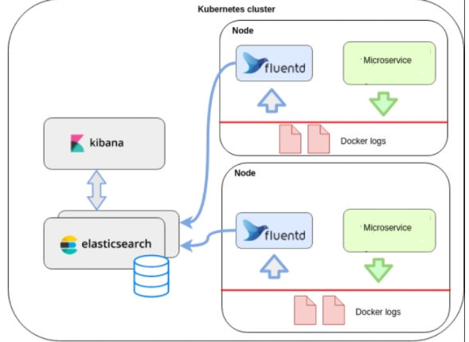
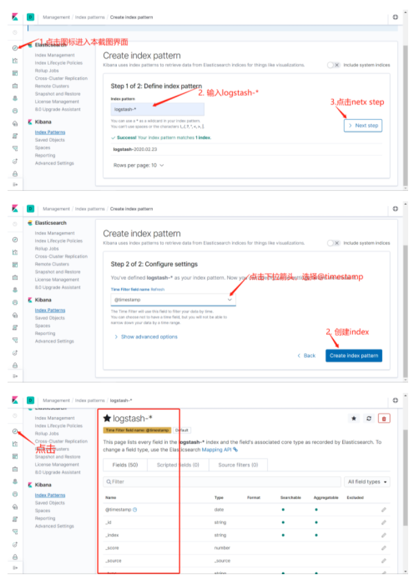
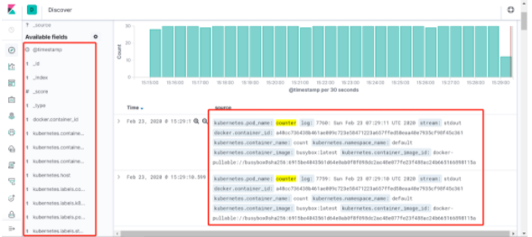

##### <font style="color:rgb(51, 51, 51);">EFK介绍</font>
<font style="color:rgb(51, 51, 51);">EFK工作示意</font>



+ <font style="color:rgb(51, 51, 51);">Elasticsearch</font>

<font style="color:rgb(51, 51, 51);">一个开源的分布式、Restful 风格的搜索和数据分析引擎，它的底层是开源库Apache Lucene。它可以被下面这样准确地形容：</font>

    - <font style="color:rgb(51, 51, 51);">一个分布式的实时文档存储，每个字段可以被索引与搜索；</font>
    - <font style="color:rgb(51, 51, 51);">一个分布式实时分析搜索引擎；</font>
    - <font style="color:rgb(51, 51, 51);">能胜任上百个服务节点的扩展，并支持 PB 级别的结构化或者非结构化数据。</font>
+ <font style="color:rgb(51, 51, 51);">Fluentd</font>

<font style="color:rgb(51, 51, 51);">一个针对日志的收集、处理、转发系统。通过丰富的插件系统，可以收集来自于各种系统或应用的日志，转化为用户指定的格式后，转发到用户所指定的日志存储系统之中。 </font>


+ <font style="color:rgb(51, 51, 51);">Fluentd 通过一组给定的数据源抓取日志数据，处理后（转换成结构化的数据格式）将它们转发给其他服务，比如 Elasticsearch、对象存储、kafka等等。Fluentd 支持超过300个日志存储和分析服务，所以在这方面是非常灵活的。主要运行步骤如下</font>
    1. <font style="color:rgb(51, 51, 51);">首先 Fluentd 从多个日志源获取数据</font>
    2. <font style="color:rgb(51, 51, 51);">结构化并且标记这些数据</font>
    3. <font style="color:rgb(51, 51, 51);">然后根据匹配的标签将数据发送到多个目标服务</font>
+ <font style="color:rgb(51, 51, 51);">Kibana</font>

<font style="color:rgb(51, 51, 51);">Kibana是一个开源的分析和可视化平台，设计用于和Elasticsearch一起工作。可以通过Kibana来搜索，查看，并和存储在Elasticsearch索引中的数据进行交互。也可以轻松地执行高级数据分析，并且以各种图标、表格和地图的形式可视化数据。</font>

##### <font style="color:rgb(51, 51, 51);">部署es服务</font>
###### <font style="color:rgb(119, 119, 119);">部署分析</font>
1. <font style="color:rgb(51, 51, 51);">es生产环境是部署es集群，通常会使用statefulset进行部署，此例由于演示环境资源问题，部署为单点</font>
2. <font style="color:rgb(51, 51, 51);">数据存储挂载主机路径</font>
3. <font style="color:rgb(51, 51, 51);">es默认使用elasticsearch用户启动进程，es的数据目录是通过宿主机的路径挂载，因此目录权限被主机的目录权限覆盖，因此可以利用init container容器在es进程启动之前把目录的权限修改掉，注意init container要用特权模式启动。</font>

###### <font style="color:rgb(119, 119, 119);">部署并验证</font>
`<font style="color:rgb(51, 51, 51);background-color:rgb(243, 244, 244);">efk/elasticsearch.yaml</font>`

```yaml
apiVersion: apps/v1
kind: StatefulSet
metadata:
  labels:
    addonmanager.kubernetes.io/mode: Reconcile
    k8s-app: elasticsearch-logging
    version: v7.4.2
  name: elasticsearch-logging
  namespace: logging
spec:
  replicas: 1
  revisionHistoryLimit: 10
  selector:
    matchLabels:
      k8s-app: elasticsearch-logging
      version: v7.4.2
  serviceName: elasticsearch-logging
  template:
    metadata:
      labels:
        k8s-app: elasticsearch-logging
        version: v7.4.2
    spec:
      nodeSelector:
        log: "true" ## 指定部署在哪个节点。需根据环境来修改
      containers:
      - env:
        - name: NAMESPACE
          valueFrom:
            fieldRef:
              apiVersion: v1
              fieldPath: metadata.namespace
        - name: cluster.initial_master_nodes
          value: elasticsearch-logging-0
        - name: ES_JAVA_OPTS
          value: "-Xms512m -Xmx512m"
        image: 172.21.32.6:5000/elasticsearch/elasticsearch:7.4.2
        name: elasticsearch-logging
        ports:
        - containerPort: 9200
          name: db
          protocol: TCP
        - containerPort: 9300
          name: transport
          protocol: TCP
        volumeMounts:
        - mountPath: /usr/share/elasticsearch/data
          name: elasticsearch-logging
      dnsConfig:
        options:
        - name: single-request-reopen
      initContainers:
      - command:
        - /sbin/sysctl
        - -w
        - vm.max_map_count=262144
        image: alpine:3.6
        imagePullPolicy: IfNotPresent
        name: elasticsearch-logging-init
        resources: {}
        securityContext:
          privileged: true
      - name: fix-permissions
        image: alpine:3.6
        command: ["sh", "-c", "chown -R 1000:1000 /usr/share/elasticsearch/data"]
        securityContext:
          privileged: true
        volumeMounts:
        - name: elasticsearch-logging
          mountPath: /usr/share/elasticsearch/data
      volumes:
      - name: elasticsearch-logging
        hostPath:
          path: /esdata
---
apiVersion: v1
kind: Service
metadata:
  labels:
    k8s-app: elasticsearch-logging
  name: elasticsearch
  namespace: logging
spec:
  ports:
  - port: 9200
    protocol: TCP
    targetPort: db
  selector:
    k8s-app: elasticsearch-logging
  type: ClusterIP
```

```yaml
$ kubectl create namespace logging
## 给slave1节点打上label，将es服务调度到slave1节点
$ kubectl label node k8s-slave1 log=true
## 部署服务，可以先去部署es的节点把镜像下载到本地
$ kubectl create -f elasticsearch.yaml
statefulset.apps/elasticsearch-logging created  
service/elasticsearch created

## 等待片刻，查看一下es的pod部署到了k8s-slave1节点，状态变为running
$ kubectl -n logging get po -o wide  
NAME                      READY   STATUS    RESTARTS   AGE   IP             NODE       
elasticsearch-logging-0   1/1     Running   0          69m   10.244.1.104   k8s-slave1   
# 然后通过curl命令访问一下服务，验证es是否部署成功
$ kubectl -n logging get svc  
NAME            TYPE        CLUSTER-IP      EXTERNAL-IP   PORT(S)    AGE  
elasticsearch   ClusterIP   10.109.174.58   <none>        9200/TCP   71m  
$ curl 10.109.174.58:9200  
{  
  "name" : "elasticsearch-logging-0",  
  "cluster_name" : "docker-cluster",  
  "cluster_uuid" : "uic8xOyNSlGwvoY9DIBT1g",  
  "version" : {  
    "number" : "7.4.2",  
    "build_flavor" : "default",  
    "build_type" : "docker",  
    "build_hash" : "2f90bbf7b93631e52bafb59b3b049cb44ec25e96",  
    "build_date" : "2019-10-28T20:40:44.881551Z",  
    "build_snapshot" : false,  
    "lucene_version" : "8.2.0",  
    "minimum_wire_compatibility_version" : "6.8.0",  
    "minimum_index_compatibility_version" : "6.0.0-beta1"  
  },  
  "tagline" : "You Know, for Search"  
}
```

##### <font style="color:rgb(51, 51, 51);">部署kibana</font>
###### <font style="color:rgb(119, 119, 119);">部署分析</font>
1. <font style="color:rgb(51, 51, 51);">kibana需要暴漏web页面给前端使用，因此使用ingress配置域名来实现对kibana的访问</font>
2. <font style="color:rgb(51, 51, 51);">kibana为无状态应用，直接使用Deployment来启动</font>
3. <font style="color:rgb(51, 51, 51);">kibana需要访问es，直接利用k8s服务发现访问此地址即可，</font>[<font style="color:rgb(51, 51, 51);">http://elasticsearch:9200</font>](http://elasticsearch:9200)

###### <font style="color:rgb(119, 119, 119);">部署并验证</font>
<font style="color:rgb(51, 51, 51);">资源文件 </font>`<font style="color:rgb(51, 51, 51);background-color:rgb(243, 244, 244);">efk/kibana.yaml</font>`

```yaml
apiVersion: apps/v1
kind: Deployment
metadata:
  name: kibana
  namespace: logging
  labels:
    app: kibana
spec:
  selector:
    matchLabels:
      app: kibana
  template:
    metadata:
      labels:
        app: kibana
    spec:
      containers:
      - name: kibana
        image: 172.21.32.6:5000/kibana/kibana:7.4.2
        resources:
          limits:
            cpu: 1000m
          requests:
            cpu: 100m
        env:
          - name: ELASTICSEARCH_URL
            value: http://elasticsearch:9200
        ports:
        - containerPort: 5601
---
apiVersion: v1
kind: Service
metadata:
  name: kibana
  namespace: logging
  labels:
    app: kibana
spec:
  ports:
  - port: 5601
    protocol: TCP
    targetPort: 5601
  type: ClusterIP
  selector:
    app: kibana
---
apiVersion: extensions/v1beta1
kind: Ingress
metadata:
  name: kibana
  namespace: logging
spec:
  rules:
  - host: kibana.devops.cn
    http:
      paths:
      - path: /
        backend:
          serviceName: kibana
          servicePort: 5601
```

```yaml
$ kubectl create -f kibana.yaml  
deployment.apps/kibana created
service/kibana created  
ingress/kibana created

# 然后查看pod，等待状态变成running
$ kubectl -n logging get po  
NAME                      READY   STATUS    RESTARTS   AGE  
elasticsearch-logging-0   1/1     Running   0          88m  
kibana-944c57766-ftlcw    1/1     Running   0          15m

## 配置域名解析 kibana.devops.cn，并访问服务进行验证，若可以访问，说明连接es成功
```

##### <font style="color:rgb(51, 51, 51);">部署fluentd</font>
###### <font style="color:rgb(119, 119, 119);">部署分析</font>
1. <font style="color:rgb(51, 51, 51);">fluentd为日志采集服务，kubernetes集群的每个业务节点都有日志产生，因此需要使用daemonset的模式进行部署</font>
2. <font style="color:rgb(51, 51, 51);">为进一步控制资源，会为daemonset指定一个选择表情，fluentd=true来做进一步过滤，只有带有此标签的节点才会部署fluentd</font>
3. <font style="color:rgb(51, 51, 51);">日志采集，需要采集哪些目录下的日志，采集后发送到es端，因此需要配置的内容比较多，我们选择使用configmap的方式把配置文件整个挂载出来</font>

###### <font style="color:rgb(119, 119, 119);">部署服务</font>
<font style="color:rgb(51, 51, 51);">配置文件，</font>`<font style="color:rgb(51, 51, 51);background-color:rgb(243, 244, 244);">efk/fluentd-es-main.yaml</font>`

```yaml
apiVersion: v1
data:
  fluent.conf: |-
    # This is the root config file, which only includes components of the actual configuration
    #
    #  Do not collect fluentd's own logs to avoid infinite loops.
    <match fluent.**>
    @type null
    </match>

    @include /fluentd/etc/config.d/*.conf
kind: ConfigMap
metadata:
  labels:
    addonmanager.kubernetes.io/mode: Reconcile
  name: fluentd-es-config-main
  namespace: logging
```

<font style="color:rgb(51, 51, 51);">配置文件，fluentd-config.yaml，注意点：</font>

1. <font style="color:rgb(51, 51, 51);">数据源source的配置，k8s会默认把容器的标准和错误输出日志重定向到宿主机中</font>
2. <font style="color:rgb(51, 51, 51);">默认集成了 </font>[<font style="color:rgb(51, 51, 51);">kubernetes_metadata_filter</font>](https://github.com/fabric8io/fluent-plugin-kubernetes_metadata_filter)<font style="color:rgb(51, 51, 51);"> 插件，来解析日志格式，得到k8s相关的元数据，raw.kubernetes</font>
3. <font style="color:rgb(51, 51, 51);">match输出到es端的flush配置</font>

```yaml
kind: ConfigMap
apiVersion: v1
metadata:
  name: fluentd-config
  namespace: logging
  labels:
    addonmanager.kubernetes.io/mode: Reconcile
data:
  system.conf: |-
    <system>
      root_dir /tmp/fluentd-buffers/
    </system>
  containers.input.conf: |-
    <source>
      @id fluentd-containers.log
      @type tail
      path /var/log/containers/*.log
      pos_file /var/log/es-containers.log.pos
      time_format %Y-%m-%dT%H:%M:%S.%NZ
      localtime
      tag raw.kubernetes.*
      format json
      read_from_head true
    </source>
    # Detect exceptions in the log output and forward them as one log entry.
    <match raw.kubernetes.**>
      @id raw.kubernetes
      @type detect_exceptions
      remove_tag_prefix raw
      message log
      stream stream
      multiline_flush_interval 5
      max_bytes 500000
      max_lines 1000
    </match>
  forward.input.conf: |-
    # Takes the messages sent over TCP
    <source>
      @type forward
    </source>
  output.conf: |-
    # Enriches records with Kubernetes metadata
    <filter kubernetes.**>
      @type kubernetes_metadata
    </filter>
    <match **>
      @id elasticsearch
      @type elasticsearch
      @log_level info
      include_tag_key true
      host elasticsearch
      port 9200
      logstash_format true
      request_timeout    30s
      <buffer>
        @type file
        path /var/log/fluentd-buffers/kubernetes.system.buffer
        flush_mode interval
        retry_type exponential_backoff
        flush_thread_count 2
        flush_interval 5s
        retry_forever
        retry_max_interval 30
        chunk_limit_size 2M
        queue_limit_length 8
        overflow_action block
      </buffer>
    </match>
```

<font style="color:rgb(51, 51, 51);">daemonset定义文件，fluentd.yaml，注意点：</font>

1. <font style="color:rgb(51, 51, 51);">需要配置rbac规则，因为需要访问k8s api去根据日志查询元数据</font>
2. <font style="color:rgb(51, 51, 51);">需要将/var/log/containers/目录挂载到容器中</font>
3. <font style="color:rgb(51, 51, 51);">需要将fluentd的configmap中的配置文件挂载到容器内</font>
4. <font style="color:rgb(51, 51, 51);">想要部署fluentd的节点，需要添加fluentd=true的标签</font>

`<font style="color:rgb(51, 51, 51);background-color:rgb(243, 244, 244);">efk/fluentd.yaml</font>`

```yaml
apiVersion: v1
kind: ServiceAccount
metadata:
  name: fluentd-es
  namespace: logging
  labels:
    k8s-app: fluentd-es
    kubernetes.io/cluster-service: "true"
    addonmanager.kubernetes.io/mode: Reconcile
---
kind: ClusterRole
apiVersion: rbac.authorization.k8s.io/v1
metadata:
  name: fluentd-es
  labels:
    k8s-app: fluentd-es
    kubernetes.io/cluster-service: "true"
    addonmanager.kubernetes.io/mode: Reconcile
rules:
- apiGroups:
  - ""
  resources:
  - "namespaces"
  - "pods"
  verbs:
  - "get"
  - "watch"
  - "list"
---
kind: ClusterRoleBinding
apiVersion: rbac.authorization.k8s.io/v1
metadata:
  name: fluentd-es
  labels:
    k8s-app: fluentd-es
    kubernetes.io/cluster-service: "true"
    addonmanager.kubernetes.io/mode: Reconcile
subjects:
- kind: ServiceAccount
  name: fluentd-es
  namespace: logging
  apiGroup: ""
roleRef:
  kind: ClusterRole
  name: fluentd-es
  apiGroup: ""
---
apiVersion: apps/v1
kind: DaemonSet
metadata:
  labels:
    addonmanager.kubernetes.io/mode: Reconcile
    k8s-app: fluentd-es
  name: fluentd-es
  namespace: logging
spec:
  selector:
    matchLabels:
      k8s-app: fluentd-es
  template:
    metadata:
      labels:
        k8s-app: fluentd-es
    spec:
      containers:
      - env:
        - name: FLUENTD_ARGS
          value: --no-supervisor -q
        image: 172.21.32.6:5000/fluentd-es-root:v1.6.2-1.0
        imagePullPolicy: IfNotPresent
        name: fluentd-es
        resources:
          limits:
            memory: 500Mi
          requests:
            cpu: 100m
            memory: 200Mi
        volumeMounts:
        - mountPath: /var/log
          name: varlog
        - mountPath: /var/lib/docker/containers
          name: varlibdockercontainers
          readOnly: true
        - mountPath: /home/docker/containers
          name: varlibdockercontainershome
          readOnly: true
        - mountPath: /fluentd/etc/config.d
          name: config-volume
        - mountPath: /fluentd/etc/fluent.conf
          name: config-volume-main
          subPath: fluent.conf
      nodeSelector:
        fluentd: "true"
      securityContext: {}
      serviceAccount: fluentd-es
      serviceAccountName: fluentd-es
      volumes:
      - hostPath:
          path: /var/log
          type: ""
        name: varlog
      - hostPath:
          path: /var/lib/docker/containers
          type: ""
        name: varlibdockercontainers
      - hostPath:
          path: /home/docker/containers
          type: ""
        name: varlibdockercontainershome
      - configMap:
          defaultMode: 420
          name: fluentd-config
        name: config-volume
      - configMap:
          defaultMode: 420
          items:
          - key: fluent.conf
            path: fluent.conf
          name: fluentd-es-config-main
        name: config-volume-main
```

```yaml
## 给slave1和slave2打上标签，进行部署fluentd日志采集服务
$ kubectl label node k8s-slave1 fluentd=true  
node/k8s-slave1 labeled  
$ kubectl label node k8s-slave2 fluentd=true  
node/k8s-slave2 labeled  

# 创建服务
$ kubectl create -f fluentd-es-config-main.yaml  
configmap/fluentd-es-config-main created  
$ kubectl create -f fluentd-configmap.yaml  
configmap/fluentd-config created  
$ kubectl create -f fluentd.yaml  
serviceaccount/fluentd-es created  
clusterrole.rbac.authorization.k8s.io/fluentd-es created  
clusterrolebinding.rbac.authorization.k8s.io/fluentd-es created  
daemonset.extensions/fluentd-es created 

## 然后查看一下pod是否已经在k8s-slave1和k8s-slave2节点启动成功
$ kubectl -n logging get po -o wide
NAME                      READY   STATUS    RESTARTS   AGE  
elasticsearch-logging-0   1/1     Running   0          123m  
fluentd-es-246pl          1/1     Running   0          2m2s  
fluentd-es-4e21w          1/1     Running   0          2m10s 
kibana-944c57766-ftlcw    1/1     Running   0          50m
```

##### <font style="color:rgb(51, 51, 51);">EFK功能验证</font>
###### <font style="color:rgb(119, 119, 119);">验证思路</font>
<font style="color:rgb(51, 51, 51);">k8s-slave1和slave2中启动服务，同时往标准输出中打印测试日志，到kibana中查看是否可以收集</font>

###### <font style="color:rgb(119, 119, 119);">创建测试容器</font>
```yaml
apiVersion: v1
kind: Pod
metadata:
  name: counter
spec:
  nodeSelector:
    fluentd: "true"
  containers:
  - name: count
    image: alpine:3.6
    args: [/bin/sh, -c,
            'i=0; while true; do echo "$i: $(date)"; i=$((i+1)); sleep 1; done']
```

```yaml
$ kubectl get po  
NAME                          READY   STATUS    RESTARTS   AGE  
counter                       1/1     Running   0          6s
```

###### <font style="color:rgb(119, 119, 119);">配置kibana</font>
<font style="color:rgb(51, 51, 51);">登录kibana界面，按照截图的顺序操作：</font>



<font style="color:rgb(51, 51, 51);">也可以通过其他元数据来过滤日志数据，比如可以单击任何日志条目以查看其他元数据，如容器名称，Kubernetes 节点，命名空间等，比如kubernetes.pod_name : counter</font>

<font style="color:rgb(51, 51, 51);">到这里，我们就在 Kubernetes 集群上成功部署了 EFK ，要了解如何使用 Kibana 进行日志数据分析，可以参考 Kibana 用户指南文档：</font>[<font style="color:rgb(51, 51, 51);">https://www.elastic.co/guide/en/kibana/current/index.html</font>](https://www.elastic.co/guide/en/kibana/current/index.html)

