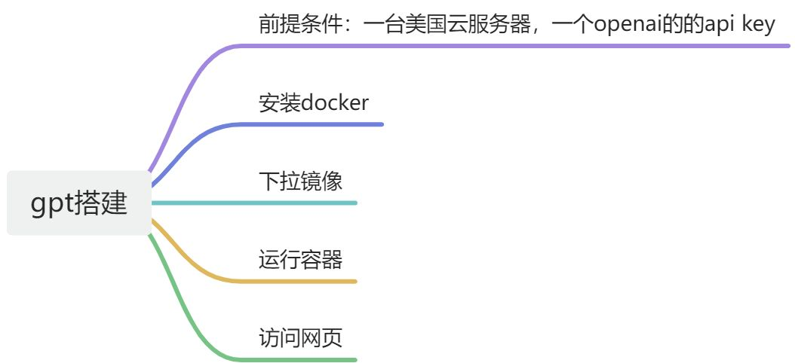

注册gpt：[https://feizhuke.com/chatgpt-zhucejiaocheng.html](https://feizhuke.com/chatgpt-zhucejiaocheng.html)




前置条件：一台云服务器（海外的最好，尽量是美国的），一个openai的的api key

### 安装docker
```python
vi dockersetup.sh
```

```plain
#!/bin/sh
yum install -y yum-utils device-mapper-persistent-data lvm2 -y
yum-config-manager --add-repo https://mirrors.tuna.tsinghua.edu.cn/docker-ce/linux/centos/docker-ce.repo
sed -i 's|https://download.docker.com/|https://mirrors.tuna.tsinghua.edu.cn/docker-ce/|g' /etc/yum.repos.d/docker-ce.repo
yum install docker-ce docker-ce-cli containerd.io -y
systemctl start docker & systemctl enable docker
```

```python
sh -x dockersetup.sh
```

### <font style="color:rgb(51, 51, 51);">下拉镜像</font>
```plain
docker pull yidadaa/chatgpt-next-web
```

### 运行，传入参数
```plain
docker run -d -p 3000:3000 --restart always -e OPENAI_API_KEY=api-key -e CODE=password yidadaa/chatgpt-next-web 
```

离线包导入运行也可以

```plain
docker save yidadaa/chatgpt-next-web:latest > chatgpt-web.tar
或者
docker save --output chatgpt-web.tar yidadaa/chatgpt-next-web
docker load < chatgpt-web.tar
```

  
 

