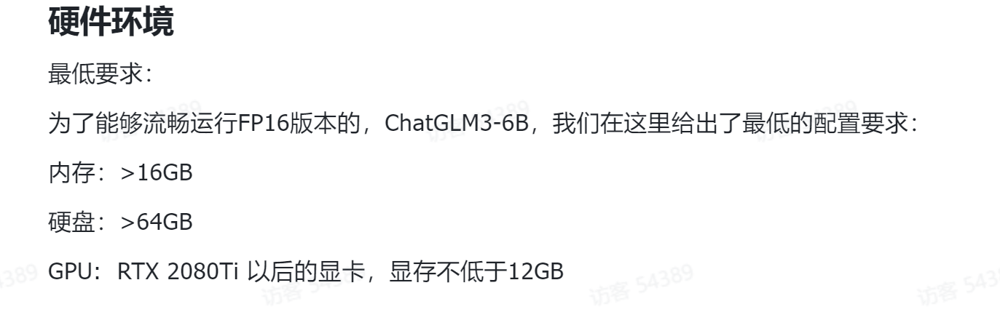

开源地址：[https://github.com/THUDM/ChatGLM3](https://github.com/THUDM/ChatGLM3)

技术文档：[https://lslfd0slxc.feishu.cn/wiki/WvQbwIJ9tiPAxGk8ywDck6yfnof](https://lslfd0slxc.feishu.cn/wiki/WvQbwIJ9tiPAxGk8ywDck6yfnof)

小白尝试：可以使用懒人包安装

高显存高算力的显卡（gpu）前提，才能在本地运行



## 懒人包安装
如果你使用的操作系统为 Windows10 / Windows11 你可以在以下链接直接下载一键安装包和观看[手把手教程](https://www.bilibili.com/video/BV1c34y1w75K/?vd_source=c083324a69ff411499cf1b5f539eaac7)。


```plain
"""
以下懒人包和教程均由开发者 十字鱼 提供
"""
模型文件百度网盘链接：https://pan.baidu.com/s/13aKdZQsUp6Si2_To6r-VRQ?pwd=glut
懒人包百度网盘链接：https://pan.baidu.com/s/1gaUPNP4xF3vIn8zxgFK4oA?pwd=glut
```

