# 安装JDK
**1，我们先把工具放到win10主机上，准备好（可以安装到win10虚拟机，也可以安装到物理机上）**

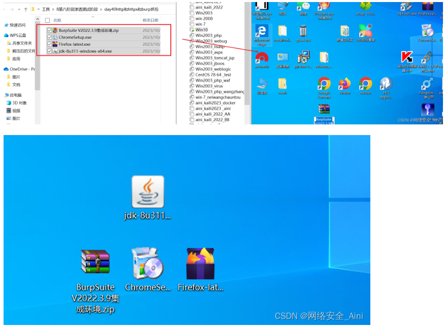

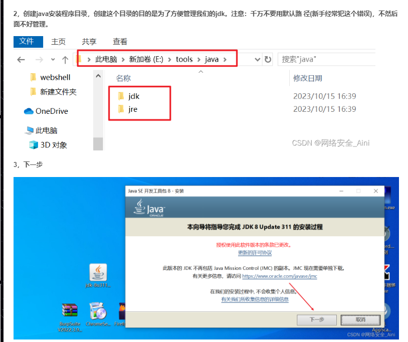

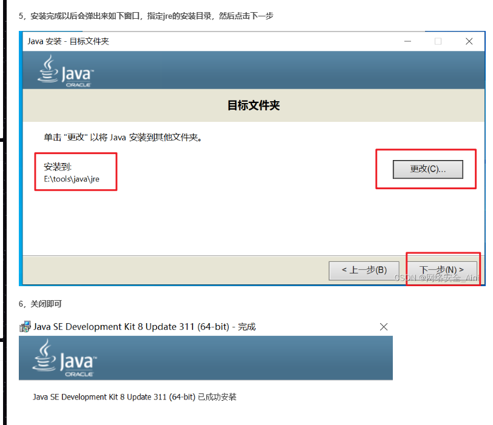

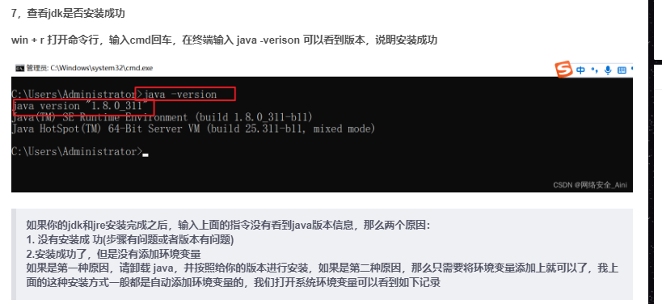

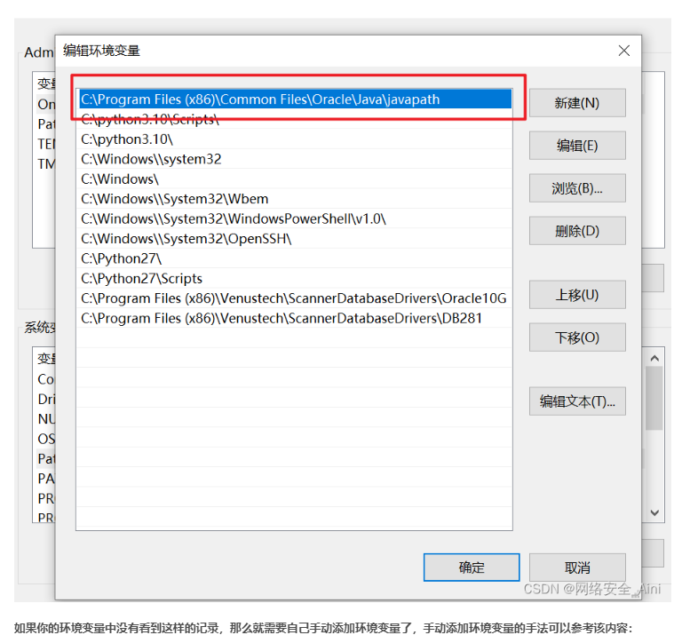

# 安装Burp Suite
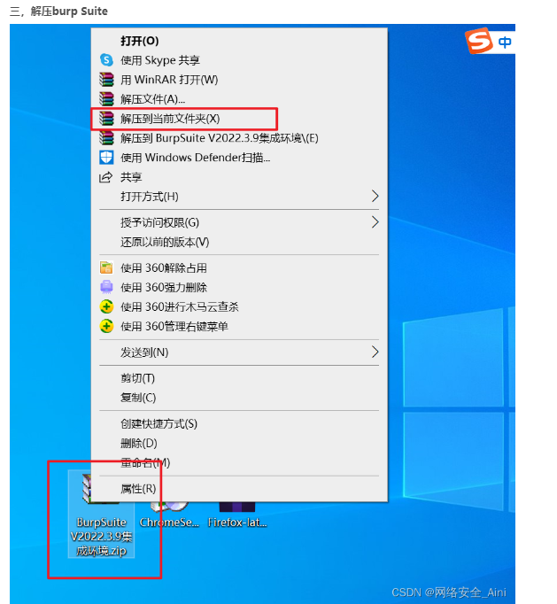

# 激活Burp Suite
**首先，打开中文版bp程序， CN-JRE Burp.bat 是启动中文版BP的， EN-JRE Brup.bat 是启动英文版BP 的，其他的文件看 当前目录注意事项.txt 文档，有说明。**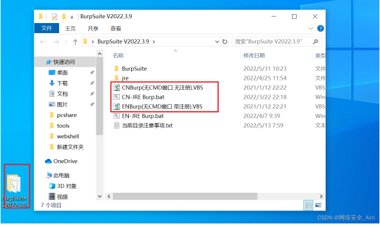

**点击 CN-JRE Burp.bat，如下，会有一个黑色的CMD窗口自动跟着打开了，这个窗口之后都不要关闭，除非我们要关闭BP。**

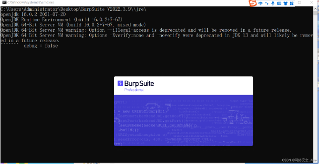

**取消勾选，点击接受**

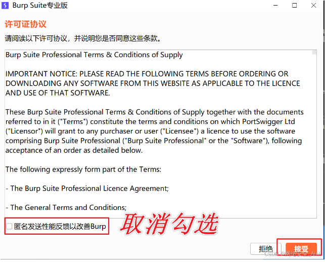

**弹出如下窗口**

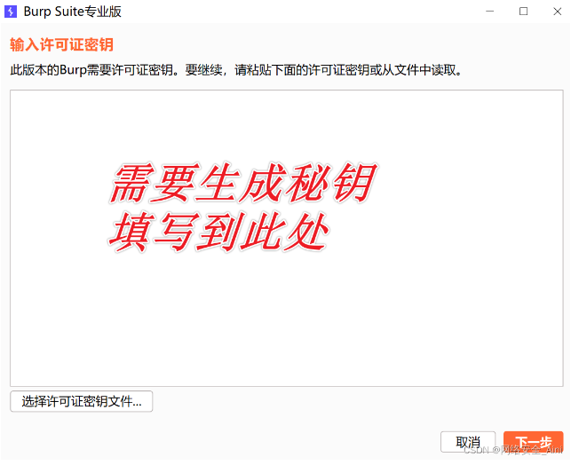

**生成许可证密钥数据，打开bp目录中的如下目录**

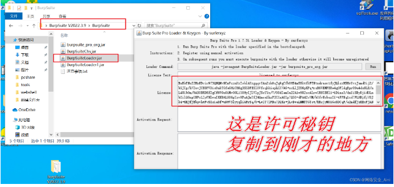

**如下，添加密钥，然后点击下一步：**

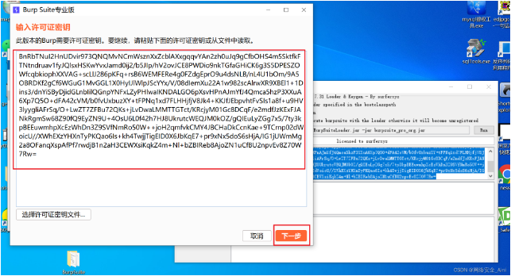

**选择手动激活**

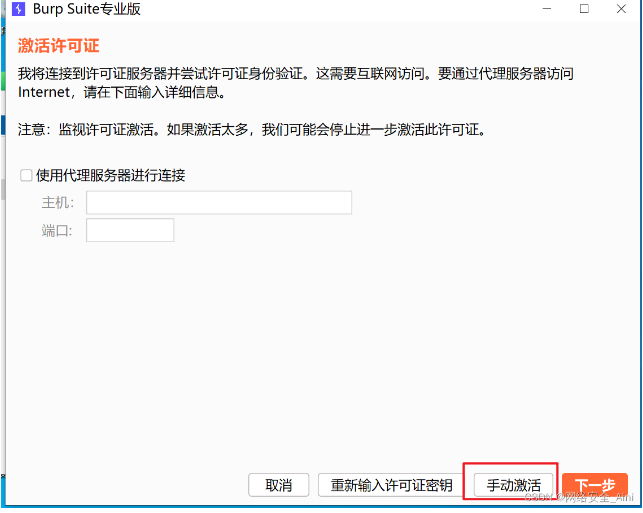

**按照如下步骤进行操作**

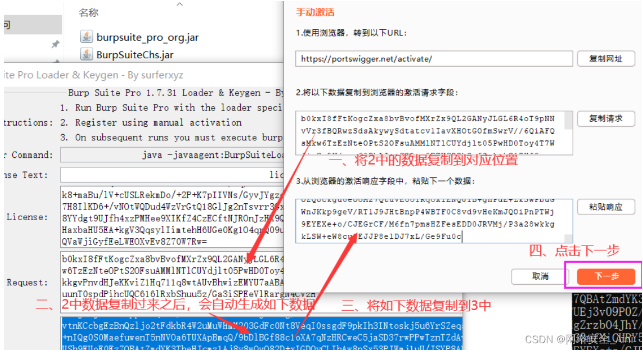

**成功安装并激活完成了**

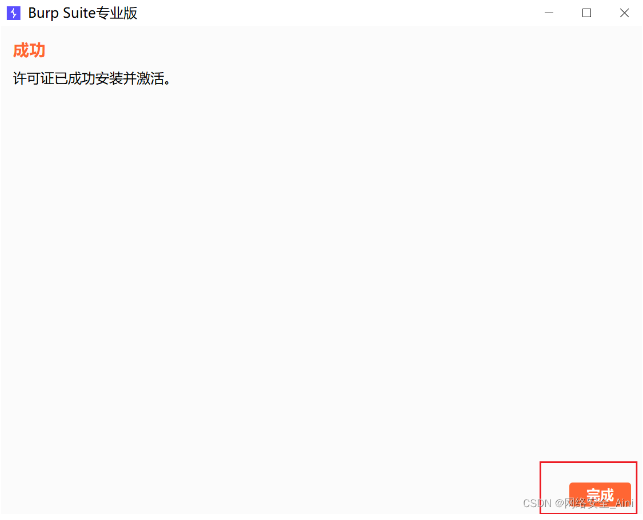

**看到如下窗口，表示BP安装并激活成功了。** **下一步**

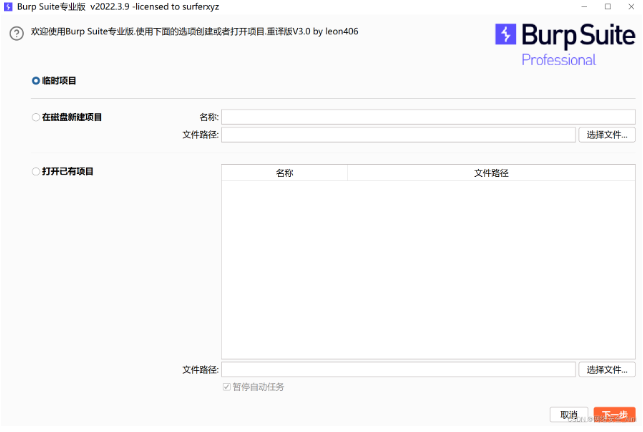

**启动burp**

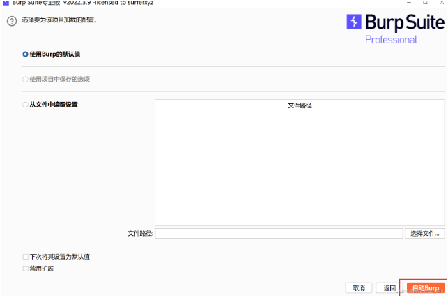

**这就是他的面板了**

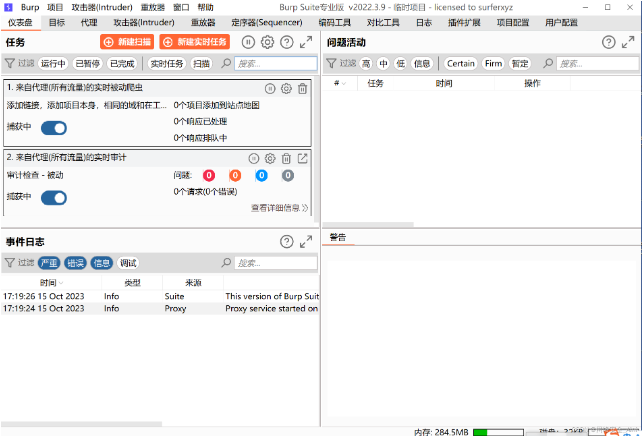

**快捷方式 CN-JRE Burp.bat就是它的启动文件，可以放到桌面上**

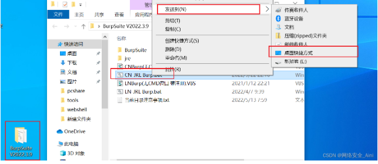

# **设置 Burp Suite 代理**
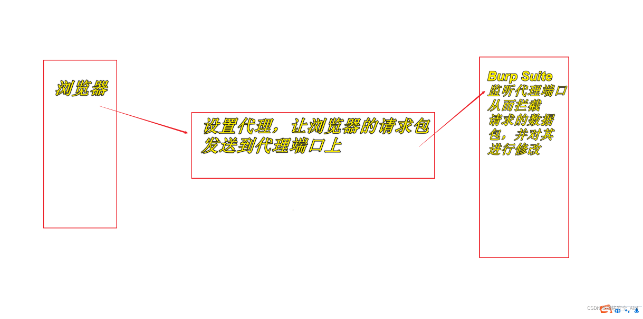

**设置代理有多种形式，我们先说两种最常用的**

#### **5-1 系统设置代理转发到****BP**
**首先，打开我们的BP，看一下BP的代理功能设置**

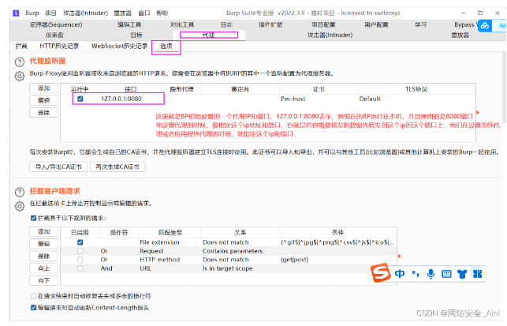

**注意上面的IP和端口，我们称之为BP代理服务器的IP和端口。 它监听本机8080端口，并对过8080端口的数据包进行拦截，修改等操作，所以我们还需要设置系统代理，让流量转发到8080端口**

**win10：**

**打开系统设置**

**搜索代理，然后是代理服务器设置**

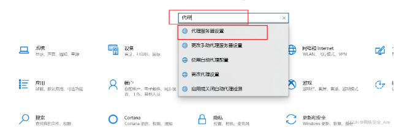

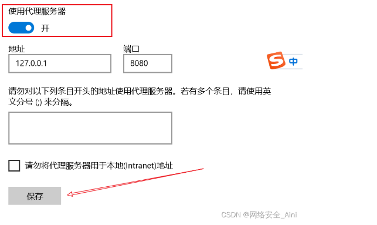

**代理服务器的IP和端口设置，要和BP代理服务器的IP和端口一致，这样就能将我们主机上的HTTP数据包 转发到BP上了。**

**win11设置代理如下，其他和win10是一样的，不做累述了：**

**打开系统设置 – 搜索代理 – 打开代理服务器设置 – 找到手动代理中的使用代理服务器 – 点击设置**

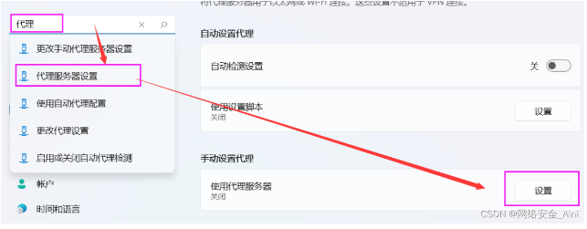

#### 5-2 **系统代理开启之后****BP****抓包**
**打开谷歌浏览器（如果没有安装的话工具里面给了，自行安装，安装很简单的）**

**浏览了一个 hebei.com.cn的网站，现在看看是否有历史记录**

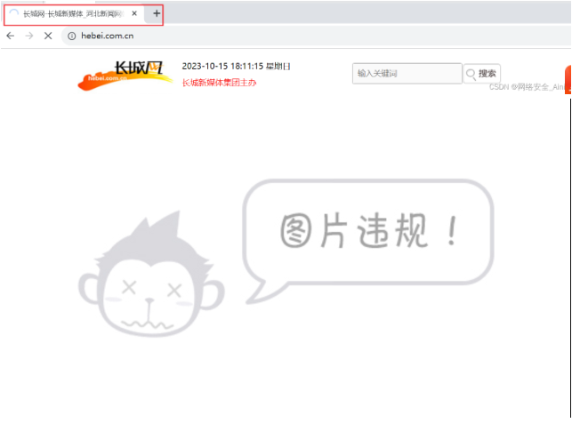

**可以看到在代理 ---- http历史记录里看到许多记录**

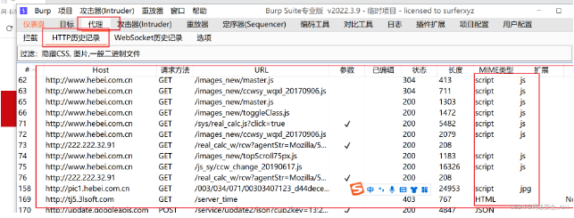

**如何拦截数据包？**

**代理 — 拦截 ----打开拦截**

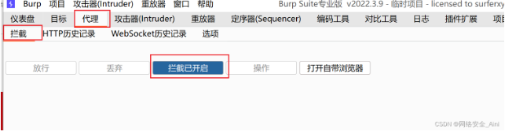

**回到浏览器刷新页面，发现页面一直在刷新，回来看看burp Suite**

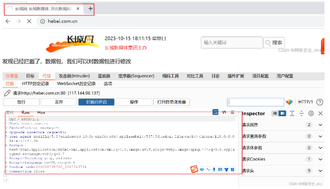

**修改完成以后可以点击‘放行’ 来放包，也可以让数据包丢弃，不让他到后端，就相当于丢失了**

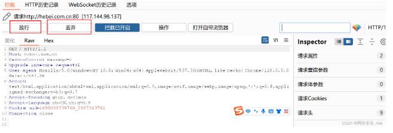

**有时候我们需要对一个数据包进行反复修改，发到后端，这时候可以把包放到重放器里面**

**右击 ---- 发动到repeater**

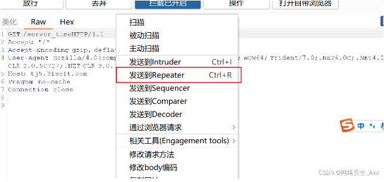

**打开重放器就可以看到数据包，可以进行反复修改**

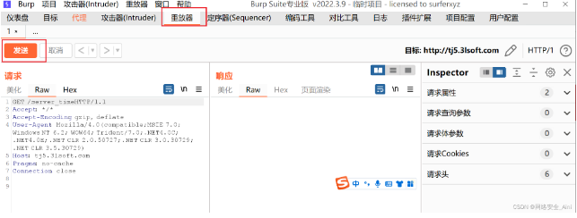

**功能差不多就讲到这里，我会出一期视频会详细讲解burpSuite的常用功能**

**但是你可以抓一下，百度，或者京东的包，发现如下情况**

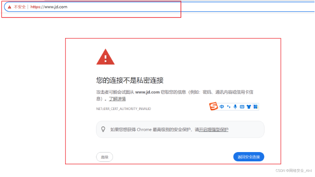

**点击高级，然后继续访问此页面，看到如下样式乱了的页面**

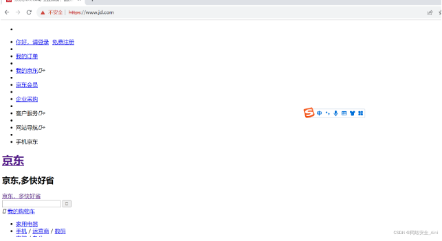

**这是为什么呢？提示不安全？并且看到网址栏中有了个红色的https，并且画了个横线，然后我们点击高级，点击继续访问，就看到了页面，但是有些数据却显示不正常，页面也乱套了，为什么呢？**

**这就不得不说HTTPS协议了，这是个网络传输的安全协议，由于我们做代理配置和抓包时，没有做 HTTPS协议的相关处理，导致了问题的出现，提示不安全的同时，导致有些数据都没有办法正常传输， 有些数据甚至都抓不到包**

**想解决如上问题，想抓到HTTPS的数据包就需要在浏览器上安装上Bp导出的证书**

#### 5-3 浏览器安装Burp Suite安全证书
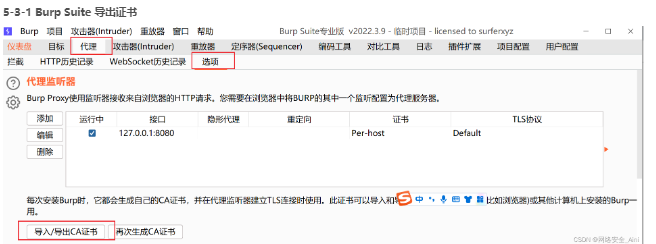

**选择 DER格式的证书，然后下一步**

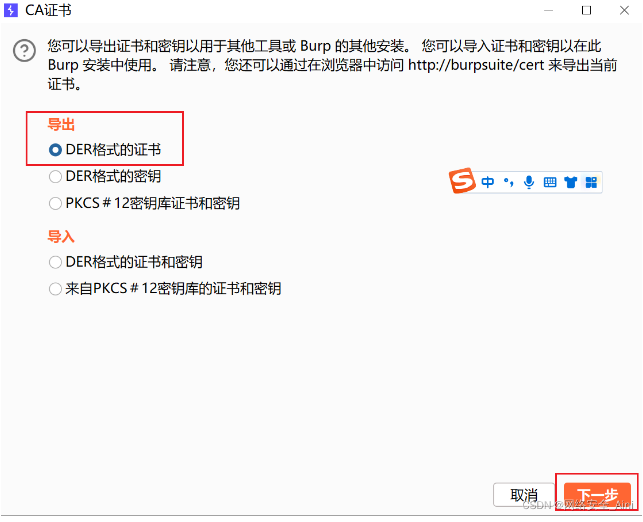

**自己选择个文件，文件名可以随便写，但是.cer后缀**

  
 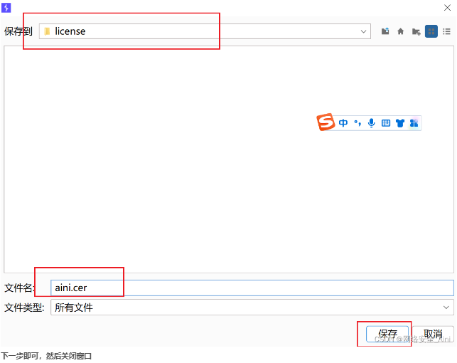

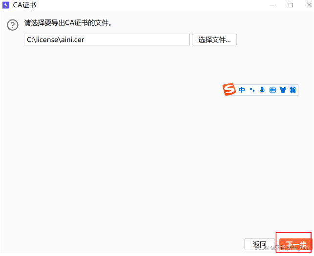

##### **5-3-2 浏览器安装证书**
**打开谷歌浏览器的设置**

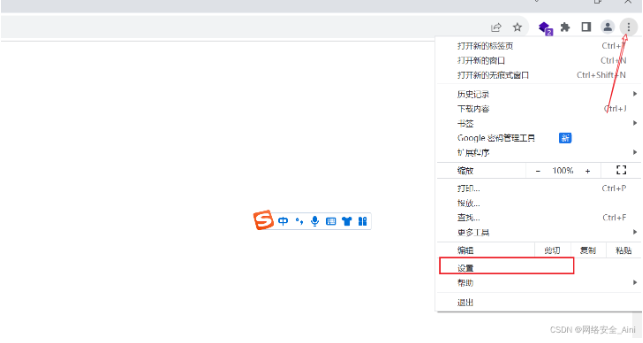

**搜索证书，然后选择安全**

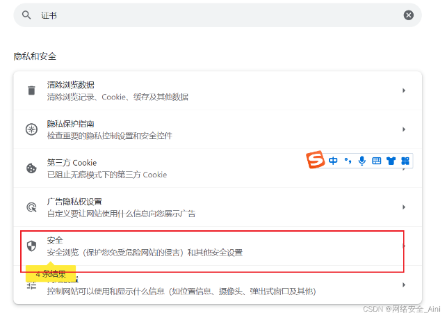

**管理证书**

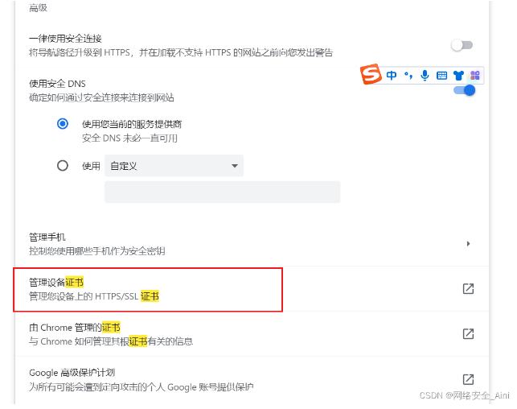

**选择导入**

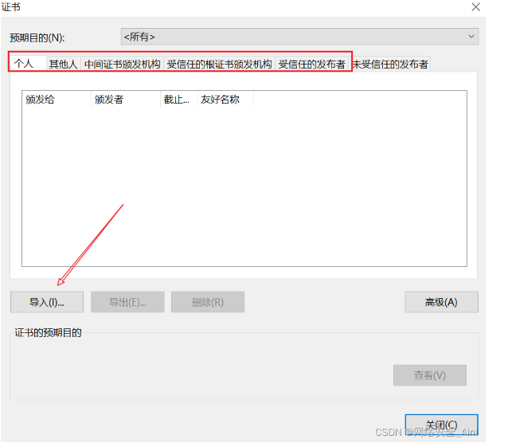

**下一步**

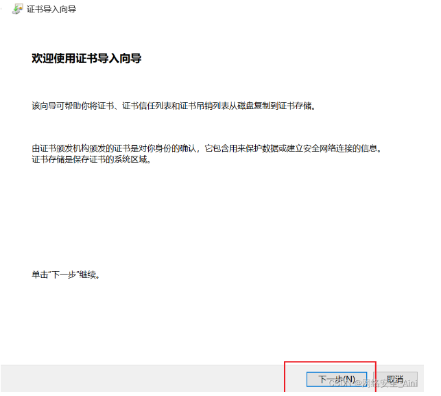

**选择刚才导出的证书，然后就下一步即可**

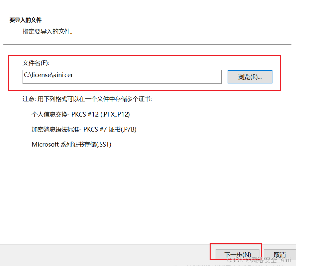

**下一步**

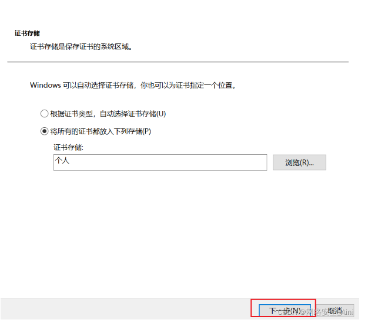

**完成**

**同样的导入方式继续导入证书**

**（注意，未受信任的发布者不用导入，导入了就抓不到包了）**

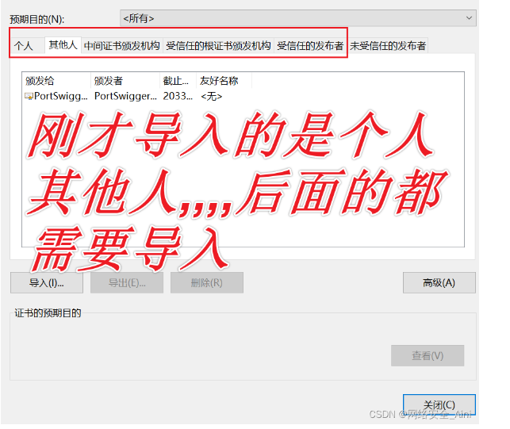

**安装受信任的根证书颁发机构的时候会有以下提示，点击是即可**

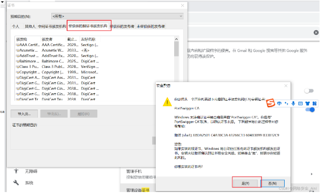

**当除了未受信任的发布者不要安装以外，其余的安装好以后可以退出**

**现在抓https的包试一试，发现正常能访问了，爆破也能看到浏览记录**  
 

#### **5-4 应用程序设置代理转发到****BP**
---

**刚才的系统代理开启然后BP抓包的方式太粗暴了，会抓取我们计算机上所有的HTTP请求请求数据包， 这样导致一个问题就是，会抓到好多我们不想看到的其他应用程序的数据包，比如我们只想抓取火狐浏览器firefox的数据包，但是如果你电脑上运行着一些其他应用程序，这些应用程序的HTTP数据包也会被抓到，很容易对我们分析数据包的时候产生混淆。**

**那么我们就可以给某个应用程序单独设置代理，那么BP就只抓这个应用程序的数据，但是有个问题就是，并不是所有的应用程序都支持单独设置代理，比如chrome浏览器就不行，火狐浏览器就可以，那么不能单独设置代理的程序如何来抓呢，就可以用上面的系统代理的形式来抓，还有一些可能不是http协议数据传输的，那么还可以用到其他的抓包工具，比如wireshark、进程抓包工具、全局代理工具等来实现抓包，这些后面我们再一一细说，先看火狐浏览器是如何单独设置代理的。**

##### 5-4-1 火狐浏览器设置代理
**（火狐浏览器自行安装一下，安装包也给你们了，工具里面有）**

**1、先关闭我们的系统代理**

**关掉刚才开的系统代理**

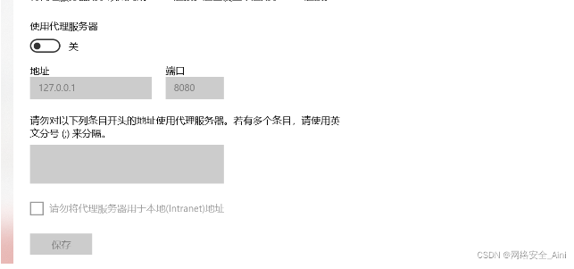

**2、打开火狐浏览器的代理设置**

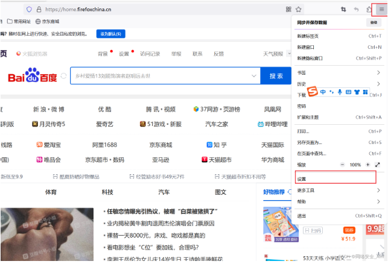

**搜索代理，然后点击设置**

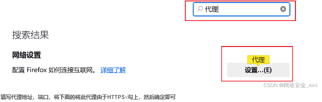

**填写代理地址，端口，将下面的将此代理由于HTTPS√勾上，然后确定即可**

  
 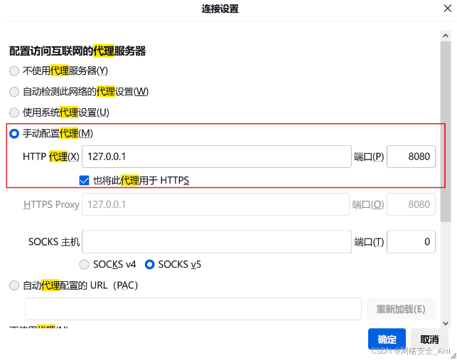

##### 5-4-2 火狐浏览器安装证书
**同样为了解决HTTPS协议的抓包问题，也需要安装证书**

  
 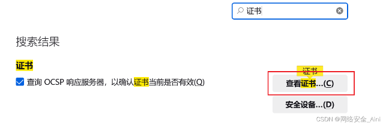

**选择导入（证书颁发机构，服务器，个人，认证决策，你的证书，凡是能安装证书的地方都安装上）**

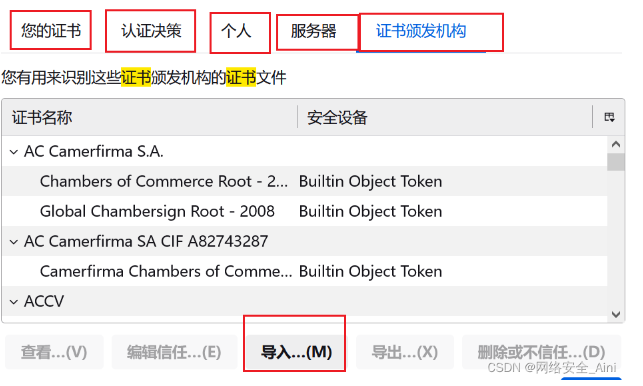

**选择导入以后，选择bp导出的证书，然后可能会有如下弹框，两个√都勾上，然后确定即可**

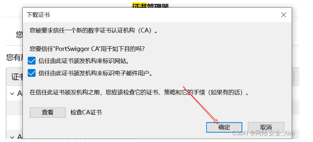

**好像只需要在证书办法机构和个人两个地方导入即可，最后点击确认即可。**

**设置完成以后浏览器重启一下**

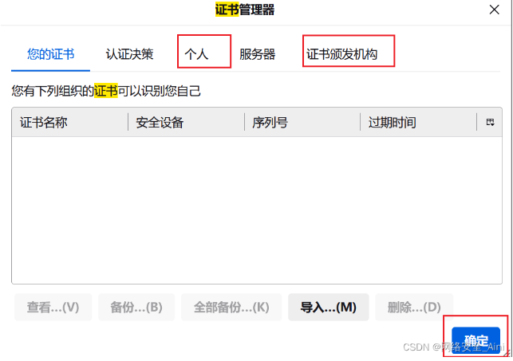

**发现Burp Suite开启拦截以后也能正常抓https的包**

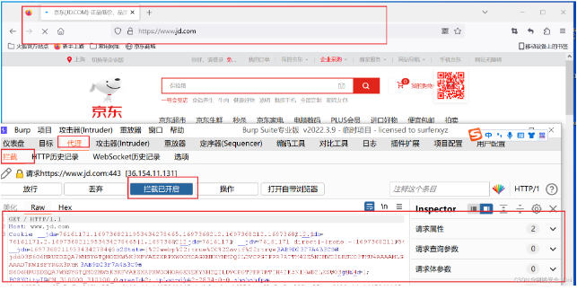  
 

