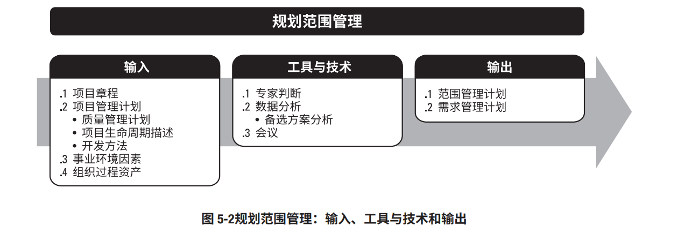
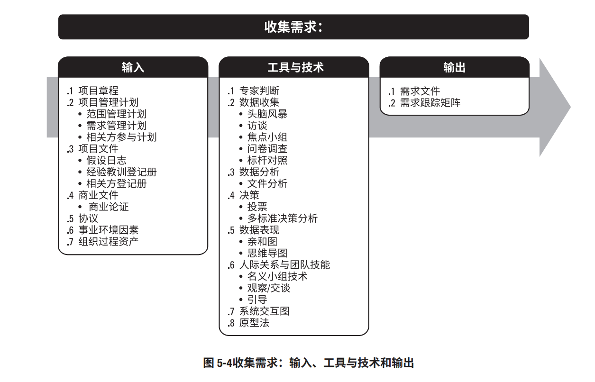
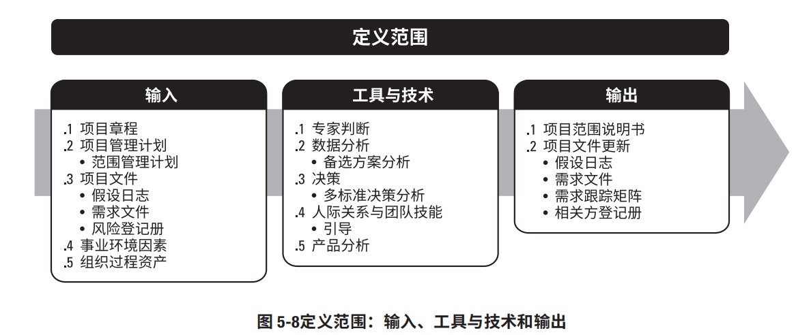
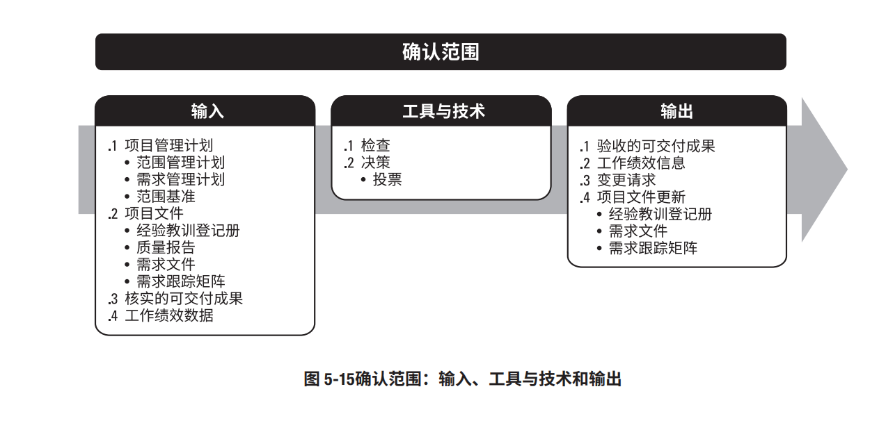
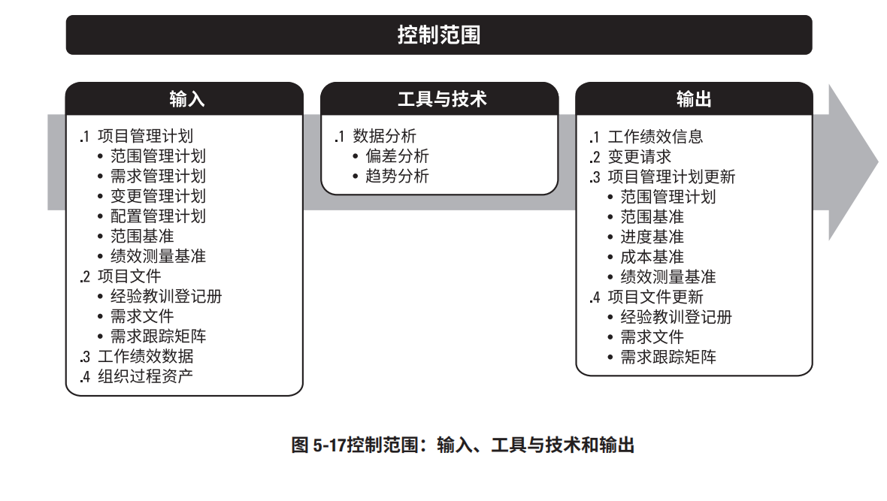
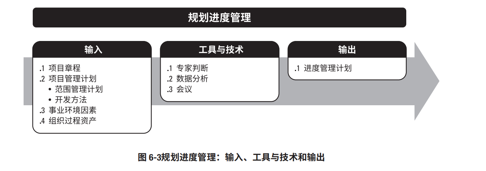
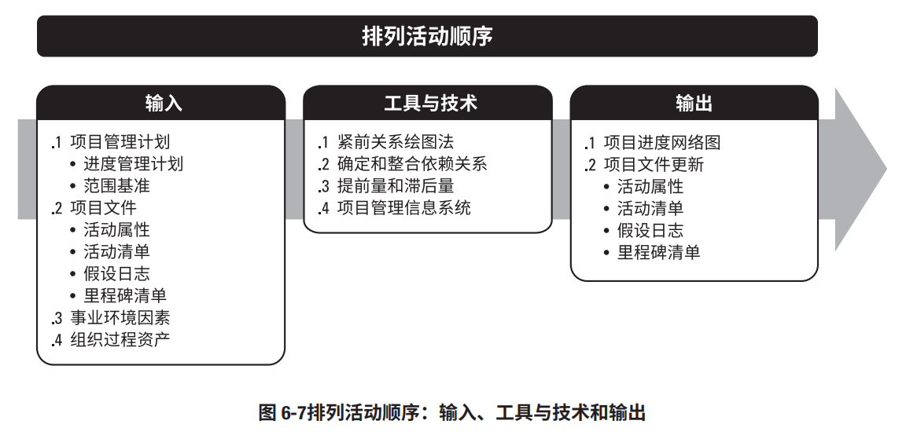
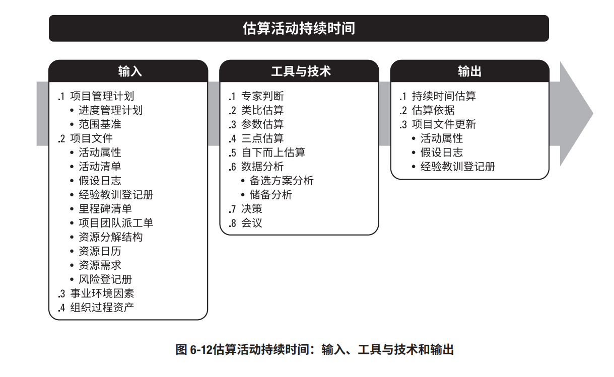
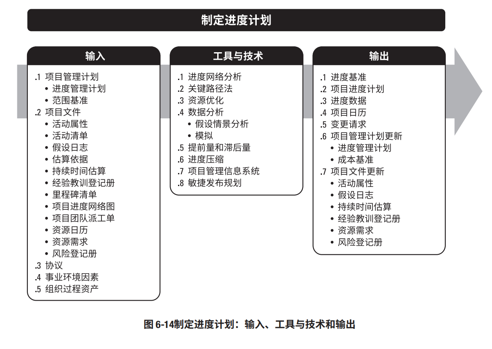
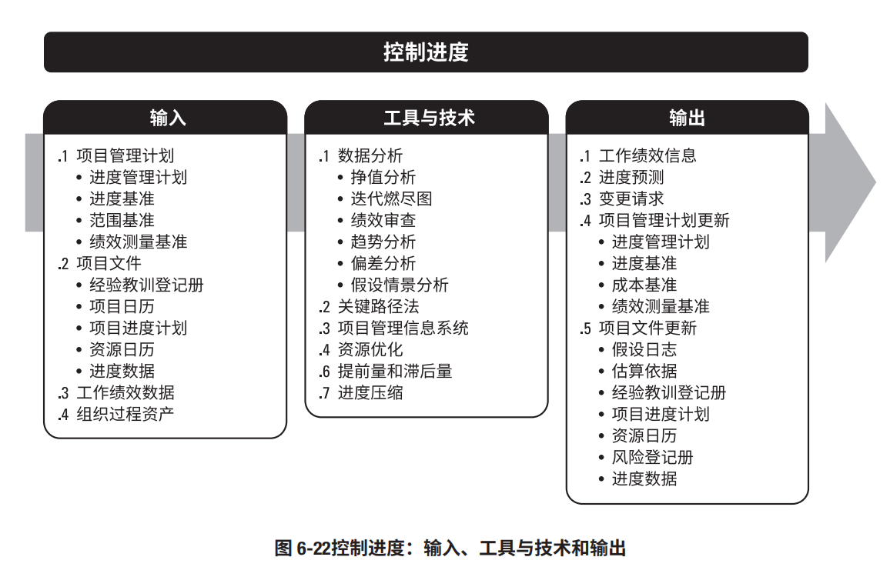

# **5.1项目范围管理**

## **项目范围管理的核心概念 **
在项目环境中，“范围”这一术语有两种含义： 

**产品范围。**某项产品、服务或成果所具有的特征和功能。 

**项目范围 。 **也包括产品范围。 为交付具有规定特性与功能的产品、服务或成果而必须完成的工作。项目范围有时

## **裁剪时需要考虑的因素 **
括（但不限于）： 因为每个项目都是独特的，所以项目经理需要裁剪项目范围管理过程。裁剪时应考虑的因素包 

**知识和需求管理。 **使用需求，项目经理应建立哪些指南？ 组织是否拥有正式或非正式的知识和需求管理体系？为了在未来项目中重复 

**确认和控制。**组织是否拥有正式或非正式的与确认和控制相关的政策、程序和指南？ 

**开发方法。 **型方法？混合型方法是否有效？ 组织是否采用敏捷方法管理项目？开发方法属于迭代型还是增量型？是否采用预测 

**需求的稳定性。 **技术来处理不稳定的需求，直至需求稳定且定义明确？ 项目中是否存在需求不稳定的领域？是否有必要采用精益、敏捷或其他适应型 

**治理。**组织是否拥有正式或非正式的审计和治理政策、程序和指南？

## **在敏捷或适应型环境中需要考虑的因素 **
对于需求不断变化、风险大或不确定性高的项目，在项目开始时通常无法明确项目的范围，而 

需要在项目期间逐渐明确。敏捷方法特意在项目早期缩短定义和协商范围的时间，并为持续探索和 

明确范围而延长创建相应过程的时间。在许多情况下，不断涌现的需求往往导致真实的业务需求 

与最初所述的业务需求之间存在差异。因此，敏捷方法有目的地构建和审查原型，并通过多次发 

布版本来明确需求。这样一来，范围会在在整个项目期间被定义和再定义。在敏捷方法中，把需求 

列入未完项。

# **5.2规划范围管理 **
:::success
规划范围管理是为记录如何定义、确认和控制项目范围及产品范围，而创建范围管理计划的过 程。本过程的主要作用是，在整个项目期间对如何管理范围提供指南和方向。本过程仅开展一次 或仅在项目的预定义点开展。

:::

## 
# **5.3收集需求**

# **5.4定义范围**

# **5.5确认范围**

# **5.6控制范围**

# **6.1规划进度管理**

# **6.2 定义活动**

# **6.3 排列活动顺序**

# **6.4 估算活动持续时间**

# **6.5 制定进度计划**

# **6.6 控制进度**

