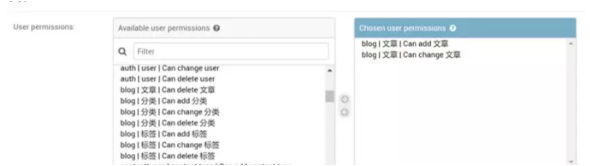

<font style="color:rgb(92, 89, 98);">如果你只是利用Django开发个人博客，大部分用户只是阅读你的文章而已，你可能根本用不到本文内容。但是如果你想开发一个内容管理系统或用户管理系统，你必需对用户的权限进行管理和控制。Django自带的权限机制(permissions)与用户组(group)可以让我们很方便地对用户权限进行管理。小编我今天就尝试以浅显的语言来讲解下如何使用Django自带的权限管理机制，并详细介绍如何使用Django-guardian实现对象级别的权限管理。</font>

## <font style="color:rgb(39, 38, 43);">什么是权限?</font>
<font style="color:rgb(92, 89, 98);">权限是能够约束用户行为和控制页面显示内容的一种机制。一个完整的权限应该包含3个要素: 用户，对象和权限，即什么用户对什么对象有什么样的权限。</font>

<font style="color:rgb(92, 89, 98);">假设我们有一个应用叫blog，其包含一个叫Article(文章)的模型。那么一个超级用户一般会有如下4种权限，而一个普通用户可能只有1种或某几种权限，比如只能查看文章，或者能查看和创建文章但是不能修改和删除。</font>

+ <font style="color:rgb(92, 89, 98);">查看文章(view)</font>
+ <font style="color:rgb(92, 89, 98);">创建文章(add)</font>
+ <font style="color:rgb(92, 89, 98);">更改文章(change)</font>
+ <font style="color:rgb(92, 89, 98);">删除文章(delete)</font>

<font style="color:rgb(92, 89, 98);">我们在Django的管理后台(admin)中是可以很轻易地给用户分配权限的。</font>

## <font style="color:rgb(39, 38, 43);">Django Admin中的权限分配</font>
<font style="color:rgb(92, 89, 98);">Django中的用户权限分配，主要通过Django自带的Admin界面进行维护的。当你编辑某个user信息时, 你可以很轻易地在User permissions栏为其设置对某些模型查看, 增加、更改和删除的权限(如下图所示)。</font>



<font style="color:rgb(92, 89, 98);">Django的权限permission本质是</font>`<font style="color:rgb(92, 89, 98);background-color:rgb(245, 246, 250);">djang.contrib.auth</font>`<font style="color:rgb(92, 89, 98);">中的一个模型, 其与User的</font>`<font style="color:rgb(92, 89, 98);background-color:rgb(245, 246, 250);">user_permissions</font>`<font style="color:rgb(92, 89, 98);">字段是多对多的关系。当我们在</font>`<font style="color:rgb(92, 89, 98);background-color:rgb(245, 246, 250);">INSTALLED_APP</font>`<font style="color:rgb(92, 89, 98);">里添加好auth应用之后，Django就会为每一个你安装的app中的模型(Model)自动创建4个可选的权限：view, add,change和delete。(注: Django 2.0前没有view权限)。随后你可以通过admin将这些权限分配给不同用户。</font>

## <font style="color:rgb(39, 38, 43);">查看用户的权限</font>
<font style="color:rgb(92, 89, 98);">权限名一般有app名(app_label)，权限动作和模型名组成。以blog应用为例，Django为Article模型自动创建的4个可选权限名分别为:</font>

+ <font style="color:rgb(92, 89, 98);">查看文章(view):</font><font style="color:rgb(92, 89, 98);"> </font>`<font style="color:rgb(92, 89, 98);background-color:rgb(245, 246, 250);">blog.view_article</font>`
+ <font style="color:rgb(92, 89, 98);">创建文章(add):</font><font style="color:rgb(92, 89, 98);"> </font>`<font style="color:rgb(92, 89, 98);background-color:rgb(245, 246, 250);">blog.add_article</font>`
+ <font style="color:rgb(92, 89, 98);">更改文章(change):</font><font style="color:rgb(92, 89, 98);"> </font>`<font style="color:rgb(92, 89, 98);background-color:rgb(245, 246, 250);">blog.change_article</font>`
+ <font style="color:rgb(92, 89, 98);">删除文章(delete):</font><font style="color:rgb(92, 89, 98);"> </font>`<font style="color:rgb(92, 89, 98);background-color:rgb(245, 246, 250);">blog.delete_article</font>`

<font style="color:rgb(92, 89, 98);">在前例中，我们已经通过Admin给用户A(user_A)分配了创建文章和修改文章的权限。我们现在可以使用</font>`<font style="color:rgb(92, 89, 98);background-color:rgb(245, 246, 250);">user.has_perm()</font>`<font style="color:rgb(92, 89, 98);">方法来判断用户是否已经拥有相应权限。下例中应该返回True。</font>

```python
user_A.has_perm('blog.add_article')
user_A.has_perm('blog.change_article')
```

<font style="color:rgb(92, 89, 98);">如果我们要查看某个用户所在用户组的权限或某个用户的所有权限(包括从用户组获得的权限)，我们可以使用</font>`<font style="color:rgb(92, 89, 98);background-color:rgb(245, 246, 250);">get_group_permissions()</font>`<font style="color:rgb(92, 89, 98);">和</font>`<font style="color:rgb(92, 89, 98);background-color:rgb(245, 246, 250);">get_all_permissions()</font>`<font style="color:rgb(92, 89, 98);">方法。</font>

```python
user_A.get_group_permissions()
user_A.get_all_permissions()
```

## <font style="color:rgb(39, 38, 43);">新增自定义权限</font>
<font style="color:rgb(92, 89, 98);">有时django创建的4种可选权限满足不了我们的要求，这时我们需要自定义权限。实现方法主要有两种。下面我们将分别使用2种方法给Article模型新增了两个权限，一个是</font>`<font style="color:rgb(92, 89, 98);background-color:rgb(245, 246, 250);">publish_article</font>`<font style="color:rgb(92, 89, 98);">, 一个是</font>`<font style="color:rgb(92, 89, 98);background-color:rgb(245, 246, 250);">comment_article</font>`<font style="color:rgb(92, 89, 98);">。</font>

### <font style="color:rgb(39, 38, 43);">方法1. 在Model的meta属性中添加权限</font>
```python
class Article(models.Model):
    ...
    class Meta:
        permissions = (
            ("publish_article", "Can publish article"),
            ("comment_article", "Can comment article"),
        )
```

### <font style="color:rgb(39, 38, 43);">方法2. 使用ContentType程序化创建权限</font>
```python
from blog.models import Article
from django.contrib.auth.models import Permission
from django.contrib.contenttypes.models import ContentType

content_type = ContentType.objects.get_for_model(article)
permission1 = Permission.objects.create(
    codename='publish_article',
    name='Can publish articles',
    content_type=content_type,
)

permission2 = Permission.objects.create(
    codename='comment_article',
    name='Can comment articles',
    content_type=content_type,
)
```

<font style="color:rgb(92, 89, 98);">当你使用</font>`<font style="color:rgb(92, 89, 98);background-color:rgb(245, 246, 250);">python manage.py migrate</font>`<font style="color:rgb(92, 89, 98);">命令后，你会发现Django admin的</font>`<font style="color:rgb(92, 89, 98);background-color:rgb(245, 246, 250);">user permissions</font>`<font style="color:rgb(92, 89, 98);">栏又多了两个可选权限。</font>

<font style="color:rgb(92, 89, 98);">## 手动分配权限</font>

<font style="color:rgb(92, 89, 98);">如果你不希望总是通过admin来给用户设置权限，你还可以通过视图函数手动给用户分配权限。这里也有两种实现方法。</font>

### <font style="color:rgb(39, 38, 43);">方法1. 使用user_permissions.add方法增加权限</font>
```python
myuser.user_permissions.add(permission1, permission2, ...)
```

### <font style="color:rgb(39, 38, 43);">方法2. 通过用户组(group)给用户增加权限</font>
```python
mygroup.permissions.add(permission1, permission2, ...)
```

### <font style="color:rgb(39, 38, 43);">方法3. 通过remove或如clear方法移除权限</font>
<font style="color:rgb(92, 89, 98);">如果你希望在代码中移除一个用户的权限，你可以使用</font>`<font style="color:rgb(92, 89, 98);background-color:rgb(245, 246, 250);">remove</font>`<font style="color:rgb(92, 89, 98);">或</font>`<font style="color:rgb(92, 89, 98);background-color:rgb(245, 246, 250);">clear</font>`<font style="color:rgb(92, 89, 98);">方法。</font>

```python
myuser.user_permissions.remove(permission1, permission2, ...)
myuser.user_permissions.clear()
```

## <font style="color:rgb(39, 38, 43);">注意权限的缓存机制</font>
<font style="color:rgb(92, 89, 98);">Django会缓存每个用户对象，包括其权限</font>`<font style="color:rgb(92, 89, 98);background-color:rgb(245, 246, 250);">user_permissions</font>`<font style="color:rgb(92, 89, 98);">。当你在代码中手动改变一个用户的权限后，你必须重新获取该用户对象，才能获取最新的权限。比如下例在代码中给用户手动增加了</font>`<font style="color:rgb(92, 89, 98);background-color:rgb(245, 246, 250);">change_blogpost</font>`<font style="color:rgb(92, 89, 98);">的权限，如果不重新载入用户，那么将显示用户还是没有</font>`<font style="color:rgb(92, 89, 98);background-color:rgb(245, 246, 250);">change_blogpost</font>`<font style="color:rgb(92, 89, 98);">的权限。</font>

```python
from django.contrib.auth.models import Permission, User
from django.contrib.contenttypes.models import ContentType
from django.shortcuts import get_object_or_404

from myapp.models import BlogPost

def user_gains_perms(request, user_id):
    user = get_object_or_404(User, pk=user_id)
    # any permission check will cache the current set of permissions
    user.has_perm('myapp.change_blogpost') 

content_type = ContentType.objects.get_for_model(BlogPost)
permission = Permission.objects.get(
    codename='change_blogpost',
    content_type=content_type,
)
user.user_permissions.add(permission)

# Checking the cached permission set
user.has_perm('myapp.change_blogpost')  # False

# Request new instance of User
# Be aware that user.refresh_from_db() won't clear the cache.
user = get_object_or_404(User, pk=user_id)

# Permission cache is repopulated from the database
user.has_perm('myapp.change_blogpost')  # True
```

## <font style="color:rgb(39, 38, 43);">用户权限的验证</font>
<font style="color:rgb(92, 89, 98);">我们前面讲解了用户权限的创建和设置，现在我们将进入关键一环，用户权限的验证。我们在分配好权限后，我们还需要在视图</font>`<font style="color:rgb(92, 89, 98);background-color:rgb(245, 246, 250);">views.py</font>`<font style="color:rgb(92, 89, 98);">和模板里验证用户是否具有相应的权限，否则前面设置的权限形同虚设。这就是为什么我们前面很多django实战案例里，没有给用户分配某个模型的add和change权限，用户还是还能创建和编辑对象的原因。</font>

### <font style="color:rgb(39, 38, 43);">视图中验证</font>
<font style="color:rgb(92, 89, 98);">在视图中你当然可以使用</font>`<font style="color:rgb(92, 89, 98);background-color:rgb(245, 246, 250);">user.has_perm</font>`<font style="color:rgb(92, 89, 98);">方法对一个用户的权限进行直接验证。当然一个更好的方法是使用</font>`<font style="color:rgb(92, 89, 98);background-color:rgb(245, 246, 250);">@permission_required</font>`<font style="color:rgb(92, 89, 98);">这个装饰器。</font>

```python
permission_required(perm, login_url=None, raise_exception=False)
```

<font style="color:rgb(92, 89, 98);">你如果指定了</font>`<font style="color:rgb(92, 89, 98);background-color:rgb(245, 246, 250);">login_url</font>`<font style="color:rgb(92, 89, 98);">, 用户会被要求先登录。如果你设置了</font>`<font style="color:rgb(92, 89, 98);background-color:rgb(245, 246, 250);">raise_exception=True</font>`<font style="color:rgb(92, 89, 98);">, 会直接返回403无权限的错误，而不会跳转到登录页面。使用方法如下所示:</font>

```python
from django.contrib.auth.decorators import permission_required

@permission_required('polls.can_vote')
def my_view(request):
    ...
```

<font style="color:rgb(92, 89, 98);">如果你使用基于类的视图(Class Based View), 而不是函数视图，你需要混入</font>`<font style="color:rgb(92, 89, 98);background-color:rgb(245, 246, 250);">PermissionRequiredMixin</font>`<font style="color:rgb(92, 89, 98);">这个类或使用</font>`<font style="color:rgb(92, 89, 98);background-color:rgb(245, 246, 250);">method_decorator</font>`<font style="color:rgb(92, 89, 98);">装饰器，如下所示:</font>

```python
from django.contrib.auth.mixins import PermissionRequiredMixin

class MyView(PermissionRequiredMixin, View):
    permission_required = 'polls.can_vote'
    # Or multiple of permissions:
    permission_required = ('polls.can_open', 'polls.can_edit')

from django.utils.decorators import method_decorator
from django.core.urlresolvers import reverse_lazy
from django.contrib.auth.decorators import user_passes_test

@method_decorator(user_passes_test(lambda u: Group.objects.get(name='admin') in u.groups.all()),name='dispatch')
class ItemDelete(DeleteView):
    model = Item
    success_url = reverse_lazy('items:index')
```

### <font style="color:rgb(39, 38, 43);">模板中验证</font>
<font style="color:rgb(92, 89, 98);">在模板中验证用户权限主要需要学会使用</font>`<font style="color:rgb(92, 89, 98);background-color:rgb(245, 246, 250);">perms</font>`<font style="color:rgb(92, 89, 98);">这个全局变量。perms对当前用户的</font>`<font style="color:rgb(92, 89, 98);background-color:rgb(245, 246, 250);">user.has_module_perms</font>`<font style="color:rgb(92, 89, 98);">和</font>`<font style="color:rgb(92, 89, 98);background-color:rgb(245, 246, 250);">user.has_perm</font>`<font style="color:rgb(92, 89, 98);">方法进行了封装。当我们需要判断当前用户是否拥有blog应用下的所有权限时，我们可以使用:</font>

```python
{{ perms.blog }}
```

<font style="color:rgb(92, 89, 98);">我们如果判断当前用户是否拥有blog应用下发表文章讨论的权限，则使用:</font>

```python
{{ perms.blog.comment_article }}
```

<font style="color:rgb(92, 89, 98);">这样结合template的if标签，我们可以通过判断当前用户所具有的权限，显示不同的内容了.</font>

```python

<p>You have permission to do something in this blog app.</p>

<p>You can add articles.</p>



<p>You can comment articles!</p>


<p>You don't have permission to do anything in the blog app.</p>

```

### <font style="color:rgb(39, 38, 43);">用户组(Group)</font>
<font style="color:rgb(92, 89, 98);">用户组(Group)和User模型是多对多的关系。其作用在权限控制时可以批量对用户的权限进行管理和分配，而不用一个一个用户分配，节省工作量。将一个用户加入到一个Group中后，该用户就拥有了该Group所分配的所有权限。例如，如果一个用户组</font>`<font style="color:rgb(92, 89, 98);background-color:rgb(245, 246, 250);">editors</font>`<font style="color:rgb(92, 89, 98);">有权限</font>`<font style="color:rgb(92, 89, 98);background-color:rgb(245, 246, 250);">change_article</font>`<font style="color:rgb(92, 89, 98);">, 那么所有属于editors组的用户都会有这个权限。</font>

<font style="color:rgb(92, 89, 98);">将用户添加到用户组或者给用户组(group)添加权限，一般建议直接通过django admin进行。如果你希望手动给group添加或删除权限，你可以使用如下方法:</font>

```python
mygroup.permissions = [permission_list]
mygroup.permissions.add(permission1, permission2, ...)
mygroup.permissions.remove(permission1, permission2, ...)
mygroup.permissions.clear()
```

<font style="color:rgb(92, 89, 98);">如果你要将某个用户移除某个用户组，可以使用如下方法:</font>

```python
myuser.groups.remove(group1, group2, ...) 
myuser.groups.clear()
```

## <font style="color:rgb(39, 38, 43);">Django自带权限机制的不足</font>
<font style="color:rgb(92, 89, 98);">Django自带的权限机制是针对模型的，这就意味着一个用户如果对Article模型有change的权限，那么该用户获得对所有文章对象进行修改的权限。如果我们希望实现对单个文章对象的权限管理，我们需要借助于第三方库比如</font>`<font style="color:rgb(92, 89, 98);background-color:rgb(245, 246, 250);">django-guardian</font>`<font style="color:rgb(92, 89, 98);">。具体扩展方式见下文。</font>

## <font style="color:rgb(39, 38, 43);">Django-guardian的使用</font>
### <font style="color:rgb(39, 38, 43);">安装与配置</font>
```python
pip install django-guardian
```

<font style="color:rgb(92, 89, 98);">安装完成后，我们可以将</font>`<font style="color:rgb(92, 89, 98);background-color:rgb(245, 246, 250);">django-guardian</font>`<font style="color:rgb(92, 89, 98);">加入到我们的项目。首先在</font>`<font style="color:rgb(92, 89, 98);background-color:rgb(245, 246, 250);">settings</font>`<font style="color:rgb(92, 89, 98);">里将guardian加入到</font>`<font style="color:rgb(92, 89, 98);background-color:rgb(245, 246, 250);">INSTALLED_APPS</font>`<font style="color:rgb(92, 89, 98);">。</font>

```python
INSTALLED_APPS = ( 
    # ... 
    'guardian',
)
```

<font style="color:rgb(92, 89, 98);">然后加入到身份验证后端</font>`<font style="color:rgb(92, 89, 98);background-color:rgb(245, 246, 250);">AUTHENTICATION_BACKENDS</font>`

```python
AUTHENTICATION_BACKENDS = ( 
    'django.contrib.auth.backends.ModelBackend', 
    'guardian.backends.ObjectPermissionBackend', # 添加
)
```

<font style="color:rgb(92, 89, 98);">注意：一旦我们将</font>`<font style="color:rgb(92, 89, 98);background-color:rgb(245, 246, 250);">django-guardian</font>`<font style="color:rgb(92, 89, 98);">配置进我们的项目，当我们调用migrate命令将会创建一个匿名用户的实例（名为</font>`<font style="color:rgb(92, 89, 98);background-color:rgb(245, 246, 250);">AnonymousUser</font>`<font style="color:rgb(92, 89, 98);"> </font><font style="color:rgb(92, 89, 98);">）。guardian的匿名用户与Django的匿名用户不同。Django匿名用户在数据库中没有条目，但是Guardian匿名用户有，这意味着以下代码将返回意外的结果。</font>

```python
request.user.is_anonymous = True
```

<font style="color:rgb(92, 89, 98);">如果你希望关闭匿名用户面向对象的权限，可以设置</font>`<font style="color:rgb(92, 89, 98);background-color:rgb(245, 246, 250);">ANONYMOUS_USER_NAME=None</font>`<font style="color:rgb(92, 89, 98);">。</font>

### <font style="color:rgb(39, 38, 43);">权限分配</font>
<font style="color:rgb(92, 89, 98);">加入我们有如下一个Task模型，我们自定义了一条</font>`<font style="color:rgb(92, 89, 98);background-color:rgb(245, 246, 250);">assign_task</font>`<font style="color:rgb(92, 89, 98);">的权限。</font>

```python
class Task(models.Model):
    summary = models.CharField(max_length=32)
    content = models.TextField()
    reported_by = models.ForeignKey(User, on_delete=models.CASCADE)
    created_at = models.DateTimeField(auto_now_add=True)

    class Meta:
        permissions = (
            ('assign_task', 'Assign task'),
        )
```

#### <font style="color:rgb(39, 38, 43);">为用户分配权限</font>
```python
# 创建用户，本来权限为False
>>> from django.contrib.auth.models import User
>>> boss = User.objects.create(username='Big Boss')
>>> joe = User.objects.create(username='joe')
>>> task = Task.objects.create(summary='Some job', content='', reported_by=boss)
>>> joe.has_perm('assign_task', task)
False

# 使用gaurdian的assign_perm方法新增taks对象的权限
>>> from guardian.shortcuts import assign_perm
>>> assign_perm('assign_task', joe, task)
>>> joe.has_perm('assign_task', task)
True
```

#### <font style="color:rgb(39, 38, 43);">为用户组分配权限</font>
<font style="color:rgb(92, 89, 98);">同样使用</font>`<font style="color:rgb(92, 89, 98);background-color:rgb(245, 246, 250);">assign_perm</font>`<font style="color:rgb(92, 89, 98);">方法即可。</font>

```python
>>> from django.contrib.auth.models import Group
>>> group = Group.objects.create(name='employees')
>>> assign_perm('change_task', group, task)
>>> joe.has_perm('change_task', task)
False
>>> # Well, joe is not yet within an *employees* group
>>> joe.groups.add(group)
>>> joe.has_perm('change_task', task)
True
```

#### <font style="color:rgb(39, 38, 43);">通过信号分配权限</font>
<font style="color:rgb(92, 89, 98);">下例展示了通过信号为新增用户分配了编辑个人资料的权限。</font>

```python
@receiver(post_save, sender=User)
def user_post_save(sender, **kwargs):
    """
    Create a Profile instance for all newly created User instances. We only
    run on user creation to avoid having to check for existence on each call
    to User.save.
    """
    user, created = kwargs["instance"], kwargs["created"]
    if created and user.username != settings.ANONYMOUS_USER_NAME:
        from profiles.models import Profile
        profile = Profile.objects.create(pk=user.pk, user=user, creator=user)
        assign_perm("change_user", user, user)
        assign_perm("change_profile", user, profile)
```

### <font style="color:rgb(39, 38, 43);">删除权限</font>
<font style="color:rgb(92, 89, 98);">使用</font>`<font style="color:rgb(92, 89, 98);background-color:rgb(245, 246, 250);">remove_perm</font>`<font style="color:rgb(92, 89, 98);">方法即可删除一个用户或用户组的权限。</font>

```python
>>> from guardian.shortcuts import remove_perm
>>> remove_perm('change_site', joe, site)
>>> joe = User.objects.get(username='joe')
>>> joe.has_perm('change_site', site)
False
```

### <font style="color:rgb(39, 38, 43);">权限验证</font>
#### <font style="color:rgb(39, 38, 43);">has_perm方法</font>
```python
# 分配对象权限前
>>> site = Site.objects.get_current()
>>> joe.has_perm('sites.change_site', site)

# 分配对象权限后
>>> from guardian.shortcuts import assign_perm
>>> assign_perm('sites.change_site', joe, site)
<UserObjectPermission: example.com | joe | change_site>
    >>> joe = User.objects.get(username='joe')
>>> joe.has_perm('sites.change_site', site)
True
```

#### <font style="color:rgb(39, 38, 43);">get_perms方法</font>
```python
>>> from guardian.shortcuts import get_perms
>>>
>>> joe = User.objects.get(username='joe')
>>> site = Site.objects.get_current()
>>>
>>> 'change_site' in get_perms(joe, site)
True
```

#### <font style="color:rgb(39, 38, 43);">get_objects_for_user方法</font>
<font style="color:rgb(92, 89, 98);">该方法可以获取用户具有权限操作的对象列表</font>

```python
from guardian.shortcuts import get_objects_for_user

def user_dashboard(request, template_name='projects/dashboard.html'):
    projects = get_objects_for_user(request.user, 'projects.view_project')
```

#### <font style="color:rgb(39, 38, 43);">ObjectPermissionChecker</font>
<font style="color:rgb(92, 89, 98);">该方法可以缓存用户对一个对象的全部权限，减少数据库查询次数。</font>

```python
>>> from guardian.core import ObjectPermissionChecker
>>> checker = ObjectPermissionChecker(joe) # 检查joe的对象权限并缓存
>>> checker.has_perm('change_site', site)
True
>>> checker.has_perm('add_site', site) # 无需再次查询数据库
False
```

#### <font style="color:rgb(39, 38, 43);">使用装饰器</font>
<font style="color:rgb(92, 89, 98);">标准的</font>`<font style="color:rgb(92, 89, 98);background-color:rgb(245, 246, 250);">permission_required</font>`<font style="color:rgb(92, 89, 98);">的装饰器不能用来检查对象权限，guardian提供了自己的装饰器。</font>

```python
>>> from guardian.decorators import permission_required_or_403
>>> from django.http import HttpResponse
>>>
>>> @permission_required_or_403('auth.change_group',
                                >>>     (Group, 'name', 'group_name'))
>>> def edit_group(request, group_name):
    >>>     return HttpResponse('some form')
```

#### <font style="color:rgb(39, 38, 43);">模板中校验</font>
<font style="color:rgb(92, 89, 98);">模板中校验对象级别权限时需要用到</font>`<font style="color:rgb(92, 89, 98);background-color:rgb(245, 246, 250);">guardian</font>`<font style="color:rgb(92, 89, 98);">提供的</font>`<font style="color:rgb(92, 89, 98);background-color:rgb(245, 246, 250);">get_obj_perms</font>`<font style="color:rgb(92, 89, 98);">模板标签。</font>

```python

```

<font style="color:rgb(92, 89, 98);">模板中可以使用如下方法获取一个用户或用户组对一个对象的权限。</font>

```python

```

<font style="color:rgb(92, 89, 98);">示例代码如下所示：</font>

```python


<a href="/pages/delete?target={{ article.url }}">Remove article</a>

```

### <font style="color:rgb(39, 38, 43);">与Django-admin的集成</font>
<font style="color:rgb(92, 89, 98);">使用</font>`<font style="color:rgb(92, 89, 98);background-color:rgb(245, 246, 250);">GuardedModelAdmin</font>`<font style="color:rgb(92, 89, 98);">，而不是Django的</font>`<font style="color:rgb(92, 89, 98);background-color:rgb(245, 246, 250);">ModelAdmin</font>`<font style="color:rgb(92, 89, 98);">。</font>

```python
from django.contrib import admin
from posts.models import Post
from guardian.admin import GuardedModelAdmin

class PostAdmin(GuardedModelAdmin):
    prepopulated_fields = {"slug": ("title",)}
    list_display = ('title', 'slug', 'created_at')
    search_fields = ('title', 'content')
    ordering = ('-created_at',)
    date_hierarchy = 'created_at'

admin.site.register(Post, PostAdmin)
```

### <font style="color:rgb(39, 38, 43);">使用定制User模型</font>
<font style="color:rgb(92, 89, 98);">如果你使用定制User模型，建议设置</font>`<font style="color:rgb(92, 89, 98);background-color:rgb(245, 246, 250);">GUARDIAN_MONKEY_PATCH = False</font>`<font style="color:rgb(92, 89, 98);">并将其继承</font>`<font style="color:rgb(92, 89, 98);background-color:rgb(245, 246, 250);">GuardianUserMixin</font>`<font style="color:rgb(92, 89, 98);">, 如下所示：</font>

```python
class User(GuardianUserMixin, AbstractUser):
    name = models.CharField(blank=True, max_length=50)
```

## <font style="color:rgb(39, 38, 43);">小结</font>
<font style="color:rgb(92, 89, 98);">本文详细总结了Django的权限管理机制，包括权限的分配、删除与校验，并详细介绍了如何使用Django-Guardian实现对象级别的权限控制。</font>

