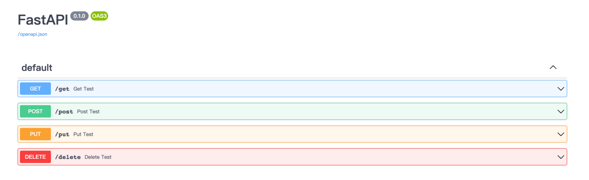
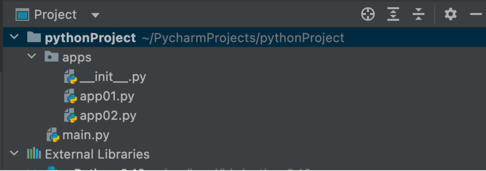
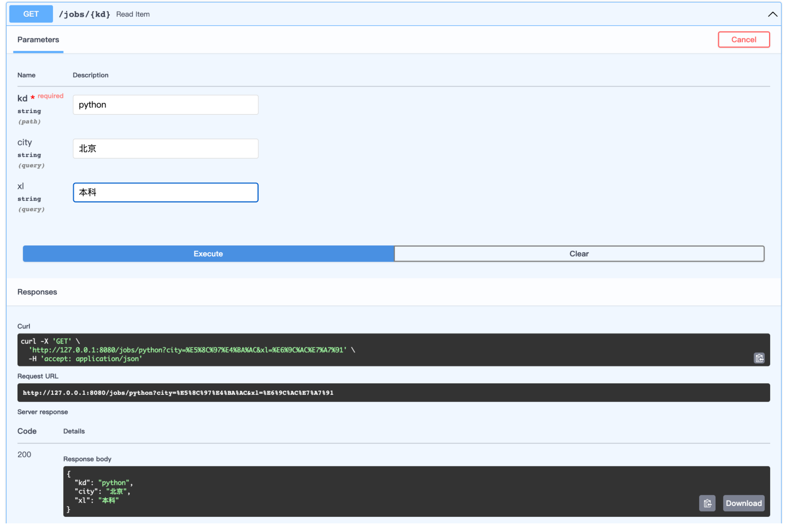
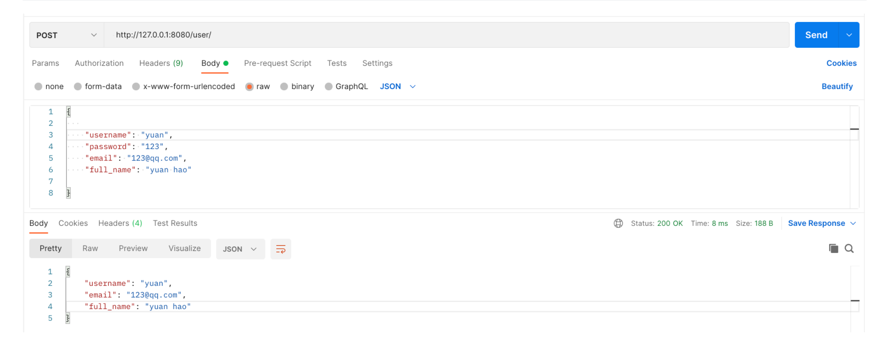
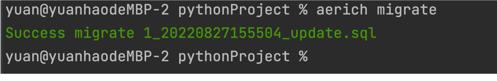
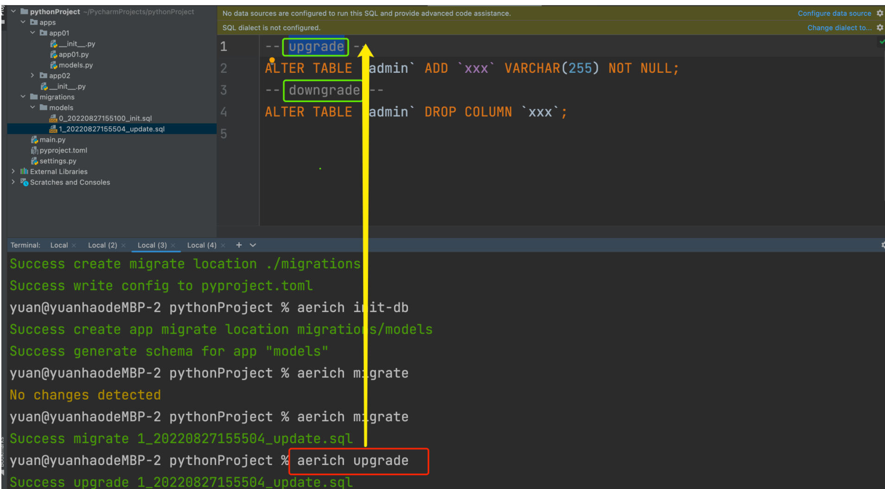

## <font style="color:rgb(51, 51, 51);background-color:rgb(243, 244, 244);">概述</font>
`<font style="color:rgb(51, 51, 51);background-color:rgb(243, 244, 244);">fastapi</font>`<font style="color:rgb(51, 51, 51);">，一个用于构建 API 的现代、快速（高性能）的web框架。</font>

`<font style="color:rgb(51, 51, 51);background-color:rgb(243, 244, 244);">fastapi</font>`<font style="color:rgb(51, 51, 51);">是建立在Starlette和Pydantic基础上的，Pydantic是一个基于Python类型提示来定义数据验证、序列化和文档的库。Starlette是一种轻量级的ASGI框架/工具包，是构建高性能Asyncio服务的理性选择。</font>

+ <font style="color:rgb(119, 119, 119);">快速：可与 NodeJS 和 Go 比肩的</font>`<font style="color:rgb(119, 119, 119);background-color:rgb(243, 244, 244);">极高性能</font>`<font style="color:rgb(119, 119, 119);">（归功于 </font>`<font style="color:rgb(119, 119, 119);background-color:rgb(243, 244, 244);">Starlette</font>`<font style="color:rgb(119, 119, 119);"> 和 </font>`<font style="color:rgb(119, 119, 119);background-color:rgb(243, 244, 244);">Pydantic</font>`<font style="color:rgb(119, 119, 119);">），是最快的 Python web 框架之一。</font>
+ <font style="color:rgb(119, 119, 119);">高效编码：提高功能开发速度约 200％ 至 300％。</font>
+ <font style="color:rgb(119, 119, 119);">更少bug：减少约 40％ 的人为（开发者）导致错误。</font>
+ <font style="color:rgb(119, 119, 119);">智能：极佳的编辑器支持。处处皆可自动补全，减少调试时间。</font>
+ <font style="color:rgb(119, 119, 119);">简单：设计的</font>`<font style="color:rgb(119, 119, 119);background-color:rgb(243, 244, 244);">易于使用和学习</font>`<font style="color:rgb(119, 119, 119);">，阅读文档的时间更短。</font>
+ <font style="color:rgb(119, 119, 119);">简短：使代码重复最小化。通过不同的参数声明实现丰富功能。</font>
+ <font style="color:rgb(119, 119, 119);">健壮：生产可用级别的代码。还有</font>`<font style="color:rgb(119, 119, 119);background-color:rgb(243, 244, 244);">自动生成的交互式文档</font>`<font style="color:rgb(119, 119, 119);">。</font>

<font style="color:rgb(51, 51, 51);">依赖：Python 3.6 及更高版本，FastAPI 站在以下巨人的肩膀之上</font>

[<font style="color:rgb(119, 119, 119);">Starlette</font>](https://www.starlette.io/)<font style="color:rgb(119, 119, 119);"> 负责 web 部分(Asyncio)</font>

[<font style="color:rgb(119, 119, 119);">Pydantic</font>](https://pydantic-docs.helpmanual.io/)<font style="color:rgb(119, 119, 119);"> 负责数据部分(类型提示)</font>

<font style="color:rgb(51, 51, 51);">FastApi是站在前人肩膀上，集成了多种框架的优点的新秀框架。它出现的比较晚，2018年底才发布在github上。广泛应用于当前各种前后端分离的项目开发，测试运维自动化以及微服务的场景中。</font>

## <font style="color:rgb(51, 51, 51);">quick start</font>
### <font style="color:rgb(51, 51, 51);">简单案例</font>
**<font style="color:rgb(51, 51, 51);">安装</font>**

```python
pip install fastapi
```

<font style="color:rgb(51, 51, 51);">你还会需要一个 ASGI 服务器，生产环境可以使用 </font>[<font style="color:rgb(51, 51, 51);">Uvicorn</font>](https://www.uvicorn.org/)

```python
pip install uvicorn
```

**<font style="color:rgb(51, 51, 51);">代码</font>**

```python
from fastapi import FastAPI  # FastAPI 是一个为你的 API 提供了所有功能的 Python 类。

app = FastAPI()  # 这个实例将是创建你所有 API 的主要交互对象。这个 app 同样在如下命令中被 uvicorn 所引用

@app.get("/")
async def root():
    return {"message": "Hello yuan"}
```

<font style="color:rgb(51, 51, 51);">通过以下命令运行服务器：</font>

<font style="color:rgb(51, 51, 51);">uvicorn main:app --reload</font>

```python
INFO:     Uvicorn running on http://127.0.0.1:8000 (Press CTRL+C to quit)
INFO:     Started reloader process [73408]
INFO:     Started server process [73408]
INFO:     Waiting for application startup
INFO:     Application startup complete
```

<font style="color:rgb(51, 51, 51);">也可以直接运行：</font>

```python
if __name__ == '__main__':
    import uvicorn

    uvicorn.run("main:app", host="127.0.0.1", port=8080, debug=True, reload=True)
```

<font style="color:rgb(119, 119, 119);">（1）导入 FastAPI。</font><font style="color:rgb(119, 119, 119);">（2）创建一个 app 实例。</font><font style="color:rgb(119, 119, 119);">（3）编写一个路径操作装饰器（如 @app.get("/")）。</font><font style="color:rgb(119, 119, 119);">（4）编写一个路径操作函数（如上面的 def root(): ...）</font><font style="color:rgb(119, 119, 119);">（5）定义返回值</font><font style="color:rgb(119, 119, 119);">（6）运行开发服务器（如 uvicorn main:app --reload）</font>

<font style="color:rgb(51, 51, 51);">此外，fastapi有着</font>**<font style="color:rgb(51, 51, 51);">非常棒的交互式 API 文档</font>**<font style="color:rgb(51, 51, 51);">，这一点很吸引人。</font>

<font style="color:rgb(51, 51, 51);">跳转到 </font>[<font style="color:rgb(51, 51, 51);">http://127.0.0.1:8080/docs</font>](http://127.0.0.1:8080/docs)<font style="color:rgb(51, 51, 51);">。你将会看到</font>**<font style="color:rgb(51, 51, 51);">自动生成</font>**<font style="color:rgb(51, 51, 51);">的交互式 API 文档。</font>

## <font style="color:rgb(51, 51, 51);">路径操作</font>
### <font style="color:rgb(51, 51, 51);">路径操作装饰器</font>
<font style="color:rgb(51, 51, 51);">fastapi支持各种请求方式：</font>

```python
@app.get()
@app.post()
@app.put()
@app.patch()
@app.delete()
@app.options()
@app.head()
@app.trace()
```

```python
from typing import Union

from fastapi import FastAPI

app = FastAPI()


@app.get("/get")
def get_test():
    return {"method": "get方法"}


@app.post("/post")
def post_test():
    return {"method": "post方法"}


@app.put("/put")
def put_test():
    return {"method": "put方法"}


@app.delete("/delete")
def delete_test():
    return {"method": "delete方法"}
```



<font style="color:rgb(51, 51, 51);">路径操作装饰器参数：</font>

```python
@app.post(
    "/items/{item_id}",
    response_model=Item,
    status_code=status.HTTP_200_OK,
    tags=["AAA"],
    summary="this is summary",
    description="this is description",
    response_description= "this is response_description",
    deprecated=False,
)
```

### <font style="color:rgb(51, 51, 51);">include_router</font>
<font style="color:rgb(51, 51, 51);">main.py</font>

```python
from typing import Union

from fastapi import FastAPI
import uvicorn

from apps import app01, app02

app = FastAPI()

app.include_router(app01, prefix="/app01", tags=["第一章节：商城接口", ])
app.include_router(app02, prefix="/app02", tags=["第二章节：用户中心接口", ])

if __name__ == '__main__':
    uvicorn.run("main:app", host="127.0.0.1", port=8080, debug=True, reload=True)
```

<font style="color:rgb(51, 51, 51);">与main.py同级目录apps：</font>

```python
# __init__.py
from .app01 import app01
from .app02 import app02
```

```python
from fastapi import APIRouter

app01 = APIRouter()


@app01.get("/shop/food")
def shop_food():
    return {"shop": "food"}


@app01.get("/shop/bed")
def shop_food():
    return {"shop": "bed"}
```

```python
from fastapi import APIRouter

app02 = APIRouter()


@app02.post("/user/login")
def user_login():
    return {"user": "login"}


@app02.post("/user/reg")
def user_reg():
    return {"user": "reg"}
```

  
 

## <font style="color:rgb(51, 51, 51);">请求与响应</font>
### <font style="color:rgb(51, 51, 51);">4.1、路径参数</font>
#### <font style="color:rgb(51, 51, 51);">（1）基本用法</font>
<font style="color:rgb(51, 51, 51);">以使用与 Python 格式化字符串相同的语法来声明路径"参数"或"变量"：</font>

```python
@app.get("/user/{user_id}")
def get_user(user_id):
    print(user_id, type(user_id))
    return {"user_id": user_id}
```

<font style="color:rgb(51, 51, 51);">路径参数 </font>`<font style="color:rgb(51, 51, 51);background-color:rgb(243, 244, 244);">user_id</font>`<font style="color:rgb(51, 51, 51);"> 的值将作为参数 </font>`<font style="color:rgb(51, 51, 51);background-color:rgb(243, 244, 244);">user_id</font>`<font style="color:rgb(51, 51, 51);"> 传递给你的函数。</font>

#### <font style="color:rgb(51, 51, 51);">（2）有类型的路径参数</font>
<font style="color:rgb(51, 51, 51);">你可以使用标准的 Python 类型标注为函数中的路径参数声明类型。</font>

```python
@app.get("/user/{user_id}")
def get_user(user_id: int):
    print(user_id, type(user_id))
    return {"user_id": user_id}
```

<font style="color:rgb(51, 51, 51);">在这个例子中，</font>`<font style="color:rgb(51, 51, 51);background-color:rgb(243, 244, 244);">user_id</font>`<font style="color:rgb(51, 51, 51);"> 被声明为 </font>`<font style="color:rgb(51, 51, 51);background-color:rgb(243, 244, 244);">int</font>`<font style="color:rgb(51, 51, 51);"> 类型。</font>

<font style="color:rgb(119, 119, 119);">这将为你的函数提供编辑器支持，包括错误检查、代码补全等等。</font>

#### <font style="color:rgb(51, 51, 51);">（3）注意顺序</font>
<font style="color:rgb(51, 51, 51);">在创建</font>_<font style="color:rgb(51, 51, 51);">路径操作</font>_<font style="color:rgb(51, 51, 51);">时，你会发现有些情况下路径是固定的。</font>

<font style="color:rgb(51, 51, 51);">比如 </font>`<font style="color:rgb(51, 51, 51);background-color:rgb(243, 244, 244);">/users/me</font>`<font style="color:rgb(51, 51, 51);">，我们假设它用来获取关于当前用户的数据.</font>

<font style="color:rgb(51, 51, 51);">然后，你还可以使用路径 </font>`<font style="color:rgb(51, 51, 51);background-color:rgb(243, 244, 244);">/user/{username}</font>`<font style="color:rgb(51, 51, 51);"> 来通过用户名 获取关于特定用户的数据。</font>

<font style="color:rgb(51, 51, 51);">由于</font>_<font style="color:rgb(51, 51, 51);">路径操作</font>_<font style="color:rgb(51, 51, 51);">是按顺序依次运行的，你需要确保路径 </font>`<font style="color:rgb(51, 51, 51);background-color:rgb(243, 244, 244);">/user/me</font>`<font style="color:rgb(51, 51, 51);"> 声明在路径 </font>`<font style="color:rgb(51, 51, 51);background-color:rgb(243, 244, 244);">/user/{username}</font>`<font style="color:rgb(51, 51, 51);">之前：</font>

```python
@app.get("/user/me")
async def read_user_me():
    return {"username": "the current user"}

@app.get("/user/{username}")
async def read_user(username: str):
    return {"username": username}
```

<font style="color:rgb(51, 51, 51);">否则，</font>`<font style="color:rgb(51, 51, 51);background-color:rgb(243, 244, 244);">/user/{username}</font>`<font style="color:rgb(51, 51, 51);"> 的路径还将与 </font>`<font style="color:rgb(51, 51, 51);background-color:rgb(243, 244, 244);">/user/me</font>`<font style="color:rgb(51, 51, 51);"> 相匹配，"认为"自己正在接收一个值为 </font>`<font style="color:rgb(51, 51, 51);background-color:rgb(243, 244, 244);">"me"</font>`<font style="color:rgb(51, 51, 51);"> 的 </font>`<font style="color:rgb(51, 51, 51);background-color:rgb(243, 244, 244);">username</font>`<font style="color:rgb(51, 51, 51);"> 参数。</font>

### <font style="color:rgb(51, 51, 51);">4.2、查询参数（请求参数）</font>
<font style="color:rgb(51, 51, 51);">路径函数中声明不属于路径参数的其他函数参数时，它们将被自动解释为"查询字符串"参数，就是 url? 之后用</font>`<font style="color:rgb(51, 51, 51);background-color:rgb(243, 244, 244);">&</font>`<font style="color:rgb(51, 51, 51);">分割的 key-value 键值对。</font>

```python
@app.get("/jobs/{kd}")
async def search_jobs(kd: str, city: Union[str, None] = None, xl: Union[str, None] = None):  # 有默认值即可选，否则必选
    if city or xl:
        return {"kd": kd, "city": city, "xl": xl}
    return {"kd": kd}
```

  
 

<font style="color:rgb(51, 51, 51);">在这个例子中，函数参数 </font>`<font style="color:rgb(51, 51, 51);background-color:rgb(243, 244, 244);">city</font>`<font style="color:rgb(51, 51, 51);">和</font>`<font style="color:rgb(51, 51, 51);background-color:rgb(243, 244, 244);">xl</font>`<font style="color:rgb(51, 51, 51);"> 是可选的，并且默认值为 </font>`<font style="color:rgb(51, 51, 51);background-color:rgb(243, 244, 244);">None</font>`<font style="color:rgb(51, 51, 51);">。</font>

<font style="color:rgb(51, 51, 51);">自python3.5开始，PEP484为python引入了类型注解(type hints)，typing的主要作用有：</font>

1. <font style="color:rgb(119, 119, 119);">类型检查，防止运行时出现参数、返回值类型不符。</font>
2. <font style="color:rgb(119, 119, 119);">作为开发文档附加说明，方便使用者调用时传入和返回参数类型。</font>
3. <font style="color:rgb(119, 119, 119);">模块加入不会影响程序的运行不会报正式的错误，pycharm支持typing检查错误时会出现黄色警告。</font>

`<font style="color:rgb(51, 51, 51);background-color:rgb(243, 244, 244);">type hints</font>`<font style="color:rgb(51, 51, 51);">主要是要指示函数的输入和输出的数据类型，数据类型在typing 包中，基本类型有str list dict等等，</font>

<font style="color:rgb(51, 51, 51);">Union 是当有多种可能的数据类型时使用，比如函数有可能根据不同情况有时返回str或返回list，那么就可以写成Union[list, str]Optional 是Union的一个简化， 当 数据类型中有可能是None时，比如有可能是str也有可能是None，则Optional[str], 相当于Union[str, None]</font>

### <font style="color:rgb(51, 51, 51);">4.3、请求体数据</font>
<font style="color:rgb(51, 51, 51);">当你需要将数据从客户端（例如浏览器）发送给 API 时，你将其作为「请求体」发送。</font>**<font style="color:rgb(51, 51, 51);">请求</font>**<font style="color:rgb(51, 51, 51);">体是客户端发送给 API 的数据。</font>**<font style="color:rgb(51, 51, 51);">响应</font>**<font style="color:rgb(51, 51, 51);">体是 API 发送给客户端的数据。</font>

<font style="color:rgb(51, 51, 51);">FastAPI 基于 </font>`<font style="color:rgb(51, 51, 51);background-color:rgb(243, 244, 244);">Pydantic</font>`<font style="color:rgb(51, 51, 51);"> ，</font>`<font style="color:rgb(51, 51, 51);background-color:rgb(243, 244, 244);">Pydantic</font>`<font style="color:rgb(51, 51, 51);"> 主要用来做类型强制检查（校验数据）。不符合类型要求就会抛出异常。</font>

<font style="color:rgb(51, 51, 51);">对于 API 服务，支持类型检查非常有用，会让服务更加健壮，也会加快开发速度，因为开发者再也不用自己写一行一行的做类型检查。</font>

<font style="color:rgb(51, 51, 51);">安装上手</font>`<font style="color:rgb(51, 51, 51);background-color:rgb(243, 244, 244);">pip install pydantic</font>`

```python
from typing import Union, List, Optional

from fastapi import FastAPI
from pydantic import BaseModel, Field, ValidationError, validator
import uvicorn
from datetime import date


class Addr(BaseModel):
    province: str
    city: str


class User(BaseModel):
    name = 'root'
    age: int = Field(default=0, lt=100, gt=0)
    birth: Optional[date] = None
    friends: List[int] = []
    description: Union[str, None] = None

    # addr: Union[Addr, None] = None  # 类型嵌套

    @validator('name')
    def name_must_alpha(cls, v):
        assert v.isalpha(), 'name must be alpha'
        return v


class Data(BaseModel):  # 类型嵌套
    users: List[User]


app = FastAPI()


@app.post("/data/")
async def create_data(data: Data):
    # 添加数据库
    return data


if __name__ == '__main__':
    try:
        User(name="",...)
    except ValidationError as e:
        print(e.json())
```

<font style="color:rgb(51, 51, 51);">测试：</font>

```python
{
  "name": "rain",
  "age": 32,
  "birth": "2022-09-29",
  "friends": [],
  "description": "最帅的讲fastapi的老师"
}
```

<font style="color:rgb(51, 51, 51);">和声明查询参数时一样，当一个模型属性具有默认值时，它不是必需的。否则它是一个必需属性。将默认值设为 </font>`<font style="color:rgb(51, 51, 51);background-color:rgb(243, 244, 244);">None</font>`<font style="color:rgb(51, 51, 51);"> 可使其成为可选属性。</font>

<font style="color:rgb(51, 51, 51);">FastAPI 会自动将定义的模型类转化为</font>`<font style="color:rgb(51, 51, 51);background-color:rgb(243, 244, 244);">JSON Schema</font>`<font style="color:rgb(51, 51, 51);">，Schema 成为 OpenAPI 生成模式的一部分，并显示在 API 交互文档中，查看 API 交互文档如下，该接口将接收</font>`<font style="color:rgb(51, 51, 51);background-color:rgb(243, 244, 244);">application/json</font>`<font style="color:rgb(51, 51, 51);">类型的参数。</font>

<font style="color:rgb(51, 51, 51);">FastAPI 支持同时定义 Path 参数、Query 参数和请求体参数，FastAPI 将会正确识别并获取数据。</font>

<font style="color:rgb(119, 119, 119);">参数在 url 中也声明了，它将被解释为 path 参数</font>

<font style="color:rgb(119, 119, 119);">参数是单一类型（例如int、float、str、bool等），它将被解释为 query 参数</font>

<font style="color:rgb(119, 119, 119);">参数类型为继承 Pydantic 模块的</font>`<font style="color:rgb(119, 119, 119);background-color:rgb(243, 244, 244);">BaseModel</font>`<font style="color:rgb(119, 119, 119);">类的数据模型类，则它将被解释为请求体参数</font>

### <font style="color:rgb(51, 51, 51);">4.4、form表单数据</font>
<font style="color:rgb(51, 51, 51);">在 OAuth2 规范的一种使用方式（密码流）中，需要将用户名、密码作为表单字段发送，而不是 JSON。</font>

<font style="color:rgb(51, 51, 51);">FastAPI 可以使用</font>**<font style="color:rgb(51, 51, 51);">Form</font>**<font style="color:rgb(51, 51, 51);">组件来接收表单数据，需要先使用</font>`<font style="color:rgb(51, 51, 51);background-color:rgb(243, 244, 244);">pip install python-multipart</font>`<font style="color:rgb(51, 51, 51);">命令进行安装。</font>

<font style="color:rgb(119, 119, 119);">pip install python-multipart</font>

```python
from fastapi import FastAPI, Form

app = FastAPI()

@app.post("/regin")
def regin(username: str = Form(..., max_length=16, min_length=8, regex='[a-zA-Z]'),
          password: str = Form(..., max_length=16, min_length=8, regex='[0-9]')):
    print(f"username:{username},password:{password}")
    return {"username": username}
```

<font style="color:rgb(51, 51, 51);">  
</font><font style="color:rgb(51, 51, 51);"> </font>

### <font style="color:rgb(51, 51, 51);">4.5、文件上传</font>
```python
from fastapi import FastAPI, File, UploadFile
from typing import List

app = FastAPI()

# file: bytes = File()：适合小文件上传
@app.post("/files/")
async def create_file(file: bytes = File()):
    print("file:", file)
    return {"file_size": len(file)}


@app.post("/multiFiles/")
async def create_files(files: List[bytes] = File()):
    return {"file_sizes": [len(file) for file in files]}


# file: UploadFile：适合大文件上传

@app.post("/uploadFile/")
async def create_upload_file(file: UploadFile):
    with open(f"{file.filename}", 'wb') as f:
        for chunk in iter(lambda: file.file.read(1024), b''):
            f.write(chunk)

    return {"filename": file.filename}


@app.post("/multiUploadFiles/")
async def create_upload_files(files: List[UploadFile]):
    return {"filenames": [file.filename for file in files]}
```

### <font style="color:rgb(51, 51, 51);">4.6、Reqeust对象</font>
<font style="color:rgb(51, 51, 51);">有些情况下我们希望能直接访问</font>_<font style="color:rgb(51, 51, 51);">Request</font>_<font style="color:rgb(51, 51, 51);">对象。例如我们在路径操作函数中想获取客户端的IP地址，需要在函数中声明</font>**<font style="color:rgb(51, 51, 51);">Request</font>**<font style="color:rgb(51, 51, 51);">类型的参数，FastAPI 就会自动传递 Request 对象给这个参数，我们就可以获取到 Request 对象及其属性信息，例如 header、url、cookie、session 等。</font>

```python
from fastapi import Request


@app.get("/items")
async def items(request: Request):
    return {
        "请求URL：": request.url,
        "请求ip：": request.client.host,
        "请求宿主：": request.headers.get("user-agent"),
        "cookies": request.cookies,
    }
```

### <font style="color:rgb(51, 51, 51);">4.7、请求静态文件</font>
<font style="color:rgb(51, 51, 51);">在 Web 开发中，需要请求很多静态资源文件（不是由服务器生成的文件），如 css/js 和图片文件等。</font>

```python
from fastapi.staticfiles import StaticFiles

app = FastAPI()
app.mount("/static",StaticFiles(directory="static"))
```

### <font style="color:rgb(51, 51, 51);">4.8、响应模型相关参数</font>
#### <font style="color:rgb(51, 51, 51);">（1）response_model</font>
<font style="color:rgb(51, 51, 51);">前面写的这么多路径函数最终 return 的都是自定义结构的字典，FastAPI 提供了 response_model 参数，声明 return 响应体的模型</font>

```python
# 路径操作
@app.post("/items/", response_model=Item)
# 路径函数
async def create_item(item: Item):
    ...
```

<font style="color:rgb(119, 119, 119);">response_model 是路径操作的参数，并不是路径函数的参数哦</font>

<font style="color:rgb(51, 51, 51);">FastAPI将使用</font>`<font style="color:rgb(51, 51, 51);background-color:rgb(243, 244, 244);">response_model</font>`<font style="color:rgb(51, 51, 51);">进行以下操作：</font>

+ <font style="color:rgb(51, 51, 51);">将输出数据转换为response_model中声明的数据类型。</font>
+ <font style="color:rgb(51, 51, 51);">验证数据结构和类型</font>
+ <font style="color:rgb(51, 51, 51);">将输出数据限制为该model定义的</font>
+ <font style="color:rgb(51, 51, 51);">添加到OpenAPI中</font>
+ <font style="color:rgb(51, 51, 51);">在自动文档系统中使用。</font>

<font style="color:rgb(51, 51, 51);">你可以在任意的路径操作中使用 </font>`<font style="color:rgb(51, 51, 51);background-color:rgb(243, 244, 244);">response_model</font>`<font style="color:rgb(51, 51, 51);"> 参数来声明用于响应的模型</font>

<font style="color:rgb(51, 51, 51);">案例：</font>

+ <font style="color:rgb(51, 51, 51);">注册功能</font>
+ <font style="color:rgb(51, 51, 51);">输入账号、密码、昵称、邮箱，注册成功后返回个人信息</font>

```python
from typing import Union

from fastapi import FastAPI
from pydantic import BaseModel, EmailStr

app = FastAPI()


class UserIn(BaseModel):
    username: str
    password: str
    email: EmailStr
    full_name: Union[str, None] = None


class UserOut(BaseModel):
    username: str
    email: EmailStr
    full_name: Union[str, None] = None


@app.post("/user/", response_model=UserOut)
async def create_user(user: UserIn):
    return user
```

  
 

#### <font style="color:rgb(51, 51, 51);">（2）response_model_exclude_unset</font>
<font style="color:rgb(51, 51, 51);">通过上面的例子，我们学到了如何用response_model控制响应体结构，但是如果它们实际上没有存储，则可能要从结果中忽略它们。例如，如果model在NoSQL数据库中具有很多可选属性，但是不想发送很长的JSON响应，其中包含默认值。</font>

<font style="color:rgb(51, 51, 51);">案例：</font>

```python
from typing import List, Union

from fastapi import FastAPI
from pydantic import BaseModel

app = FastAPI()


class Item(BaseModel):
    name: str
    description: Union[str, None] = None
    price: float
    tax: float = 10.5
    tags: List[str] = []


items = {
    "foo": {"name": "Foo", "price": 50.2},
    "bar": {"name": "Bar", "description": "The bartenders", "price": 62, "tax": 20.2},
    "baz": {"name": "Baz", "description": None, "price": 50.2, "tax": 10.5, "tags": []},
}


@app.get("/items/{item_id}", response_model=Item, response_model_exclude_unset=True)
async def read_item(item_id: str):
    return items[item_id]
```

<font style="color:rgb(51, 51, 51);">请求：</font>[<font style="color:rgb(51, 51, 51);">http://127.0.0.1:8080/items/foo</font>](http://127.0.0.1:8080/items/foo)

<font style="color:rgb(51, 51, 51);">不设置unset参数：</font>

```python
{
    "name": "Foo",
    "description": null,
    "price": 50.2,
    "tax": 10.5,
    "tags": []
}
```

<font style="color:rgb(51, 51, 51);">设置unset参数：</font>

```python
{
    "name": "Foo",
    "price": 50.2
}
```

<font style="color:rgb(51, 51, 51);">使用路径操作装饰器的 </font>`<font style="color:rgb(51, 51, 51);background-color:rgb(243, 244, 244);">response_model</font>`<font style="color:rgb(51, 51, 51);"> 参数来定义响应模型，特别是确保私有数据被过滤掉。使用 </font>`<font style="color:rgb(51, 51, 51);background-color:rgb(243, 244, 244);">response_model_exclude_unset</font>`<font style="color:rgb(51, 51, 51);"> 来仅返回显式设定的值。</font><font style="color:rgb(51, 51, 51);">除了</font>`<font style="color:rgb(51, 51, 51);background-color:rgb(243, 244, 244);">response_model_exclude_unset</font>`<font style="color:rgb(51, 51, 51);">以外，还有</font>`<font style="color:rgb(51, 51, 51);background-color:rgb(243, 244, 244);">response_model_exclude_defaults</font>`<font style="color:rgb(51, 51, 51);">和</font>`<font style="color:rgb(51, 51, 51);background-color:rgb(243, 244, 244);">response_model_exclude_none</font>`<font style="color:rgb(51, 51, 51);">，我们可以很直观的了解到他们的意思，不返回是默认值的字段和不返回是None的字段。</font>

#### <font style="color:rgb(51, 51, 51);">（3）INCLUDE和EXCLUDE</font>
```python
# response_model_exclude
@app.get("/items/{item_id}", response_model=Item, response_model_exclude={"description"}, )
async def read_item(item_id: str):
    return items[item_id]

# response_model_include  
@app.get("/items/{item_id}", response_model=Item, response_model_include={"name", "price"}, )
async def read_item(item_id: str):
    return items[item_id]
```

## <font style="color:rgb(51, 51, 51);">jinja2模板</font>
<font style="color:rgb(51, 51, 51);">要了解jinja2，那么需要先理解模板的概念。模板在Python的web开发中⼴泛使⽤，它能够有效的将业务逻辑和页⾯逻辑分开，使代码可读性增强、并且更加容易理解和维护。</font><font style="color:rgb(51, 51, 51);">模板简单来说就是⼀个其中包涵占位变量表⽰动态的部分的⽂件，模板⽂件在经过动态赋值后，返回给⽤户。</font>

<font style="color:rgb(51, 51, 51);">jinja2是Flask作者开发的⼀个模板系统，起初是仿django模板的⼀个模板引擎，为Flask提供模板⽀持，由于其灵活，快速和安全等优点被⼴泛使⽤。</font>

<font style="color:rgb(51, 51, 51);">在jinja2中，存在三种语法：</font>

1. <font style="color:rgb(119, 119, 119);">变量取值 {{ }}</font>
2. <font style="color:rgb(119, 119, 119);">控制结构 </font>

### <font style="color:rgb(51, 51, 51);">5.1、jinja2 的变量</font>
`<font style="color:rgb(51, 51, 51);background-color:rgb(243, 244, 244);">Main.py</font>`

```python
from fastapi import FastAPI, Request
from fastapi.templating import Jinja2Templates
import uvicorn

app = FastAPI()  # 实例化 FastAPI对象
templates = Jinja2Templates(directory="templates")  # 实例化Jinja2对象，并将文件夹路径设置为以templates命令的文件夹


@app.get('/')
def hello(request: Request):
    return templates.TemplateResponse(
        'index.html',
        {
            'request': request,  # 注意，返回模板响应时，必须有request键值对，且值为Request请求对象
            'user': 'yuan',
            "books": ["金瓶梅", "聊斋", "剪灯新话", "国色天香"],
            "booksDict": {
                "金瓶梅": {"price": 100, "publish": "苹果出版社"},
                "聊斋": {"price": 200, "publish": "橘子出版社"},
            }
        }
    )
if __name__ == '__main__':
    uvicorn.run("main:app", port=8080, debug=True, reload=True)
```

```python
<!DOCTYPE html>
<html lang="en">
 <head>
  <meta charset="UTF-8">
<title>Title</title>
</head>
<body>


<h1>{{ user}}</h1>

<p>{{ books.0 }}</p>
<p>{{ books.1 }}</p>
<p>{{ books.2 }}</p>
<p>{{ books.3 }}</p>

<p>{{ booksDict.金瓶梅.price }}</p>


</body>
</html>
```

### <font style="color:rgb(51, 51, 51);">5.2、jinja2 的过滤器</font>
<font style="color:rgb(51, 51, 51);">变量可以通过“过滤器”进⾏修改，过滤器可以理解为是jinja2⾥⾯的内置函数和字符串处理函数。常⽤的过滤器有：</font>

| **<font style="color:rgb(51, 51, 51);">过滤器名称</font>** | **<font style="color:rgb(51, 51, 51);">说明</font>** |
| :--- | :--- |
| <font style="color:rgb(51, 51, 51);">capitialize</font> | <font style="color:rgb(51, 51, 51);">把值的⾸字母转换成⼤写，其他⼦母转换为⼩写</font> |
| <font style="color:rgb(51, 51, 51);">lower</font> | <font style="color:rgb(51, 51, 51);">把值转换成⼩写形式</font> |
| <font style="color:rgb(51, 51, 51);">title</font> | <font style="color:rgb(51, 51, 51);">把值中每个单词的⾸字母都转换成⼤写</font> |
| <font style="color:rgb(51, 51, 51);">trim</font> | <font style="color:rgb(51, 51, 51);">把值的⾸尾空格去掉</font> |
| <font style="color:rgb(51, 51, 51);">striptags</font> | <font style="color:rgb(51, 51, 51);">渲染之前把值中所有的HTML标签都删掉</font> |
| <font style="color:rgb(51, 51, 51);">join</font> | <font style="color:rgb(51, 51, 51);">拼接多个值为字符串</font> |
| <font style="color:rgb(51, 51, 51);">round</font> | <font style="color:rgb(51, 51, 51);">默认对数字进⾏四舍五⼊，也可以⽤参数进⾏控制</font> |
| <font style="color:rgb(51, 51, 51);">safe</font> | <font style="color:rgb(51, 51, 51);">渲染时值不转义</font> |


<font style="color:rgb(51, 51, 51);">那么如何使⽤这些过滤器呢？只需要在变量后⾯使⽤管道(|)分割，多个过滤器可以链式调⽤，前⼀个过滤器的输出会作为后⼀个过滤</font><font style="color:rgb(51, 51, 51);">器的输⼊。</font>

```python
{{ 'abc'| captialize  }}  # Abc

{{ 'abc'| upper  }} # ABC

{{ 'hello world'| title  }} # Hello World

{{ "hello world"| replace('world','yuan') | upper }} # HELLO YUAN

{{ 18.18 | round | int }} # 18
```

### <font style="color:rgb(51, 51, 51);">5.3、jinja2 的控制结构</font>
#### <font style="color:rgb(51, 51, 51);">5.3.1、分支控制</font>
<font style="color:rgb(51, 51, 51);">jinja2中的if语句类似与Python的if语句，它也具有单分⽀，多分⽀等多种结构，不同的是，条件语句不需要使⽤冒号结尾，⽽结束控制语句，需要使⽤endif关键字</font>

```python


<p>成年区</p>



<p>未成年区</p>


```

#### <font style="color:rgb(51, 51, 51);">5.3.2、循环控制</font>
<font style="color:rgb(51, 51, 51);">jinja2中的for循环⽤于迭代Python的数据类型，包括列表，元组和字典。在jinja2中不存在while循环。</font>

```python

<p>{{ book }}</p>

```

## <font style="color:rgb(51, 51, 51);">ORM操作</font>
<font style="color:rgb(51, 51, 51);">在大型的web开发中，我们肯定会用到数据库操作，那么FastAPI也支持数据库的开发，你可以用 PostgreSQL、MySQL、 SQLite Oracle 等。本文用SQLite为例。我们看下在fastapi是如何操作设计数据库的。</font>

<font style="color:rgb(51, 51, 51);">fastapi是一个很优秀的框架，但是缺少一个合适的orm，官方代码里面使用的是sqlalchemy，Tortoise ORM 是受 Django 启发的易于使用的异步 ORM （对象关系映射器）。</font>

[<font style="color:rgb(51, 51, 51);">Tortoise ORM文档</font>](https://tortoise-orm.readthedocs.io/en/latest/index.html)

<font style="color:rgb(119, 119, 119);">Tortoise ORM 目前支持以下</font>[<font style="color:rgb(119, 119, 119);">数据库</font>](https://tortoise-orm.readthedocs.io/en/latest/databases.html#databases)<font style="color:rgb(119, 119, 119);">：</font>

+ <font style="color:rgb(119, 119, 119);">PostgreSQL >= 9.4（使用</font>`<font style="color:rgb(119, 119, 119);background-color:rgb(243, 244, 244);">asyncpg</font>`<font style="color:rgb(119, 119, 119);">）</font>
+ <font style="color:rgb(119, 119, 119);">SQLite（使用</font>`<font style="color:rgb(119, 119, 119);background-color:rgb(243, 244, 244);">aiosqlite</font>`<font style="color:rgb(119, 119, 119);">）</font>
+ <font style="color:rgb(119, 119, 119);">MySQL/MariaDB（使用</font>`<font style="color:rgb(119, 119, 119);background-color:rgb(243, 244, 244);">aiomysql</font>`<font style="color:rgb(119, 119, 119);">或使用</font>[<font style="color:rgb(119, 119, 119);">asyncmy</font>](https://github.com/long2ice/asyncmy)<font style="color:rgb(119, 119, 119);">）</font>

```python
安装
首先你必须像这样安装Tortoise ORM：
pip install tortoise-orm
你也可以使用你的db驱动程序来安装（aiosqlite是内置的）：
pip install tortoise-orm[asyncpg]
For MySQL:对于MySQL：
pip install tortoise-orm[asyncmy]
```

### <font style="color:rgb(51, 51, 51);">6.1、创建模型</font>
<font style="color:rgb(51, 51, 51);">以选课系统为例：</font>

`<font style="color:rgb(51, 51, 51);background-color:rgb(243, 244, 244);">models.py</font>`

```python
from tortoise.models import Model
from tortoise import fields


class Clas(Model):
    name = fields.CharField(max_length=255, description='班级名称')


class Teacher(Model):
    id = fields.IntField(pk=True)
    name = fields.CharField(max_length=255, description='姓名')
    tno = fields.IntField(description='账号')
    pwd = fields.CharField(max_length=255, description='密码')


class Student(Model):
    id = fields.IntField(pk=True)
    sno = fields.IntField(description='学号')
    pwd = fields.CharField(max_length=255, description='密码')
    name = fields.CharField(max_length=255, description='姓名')
    # 一对多
    clas = fields.ForeignKeyField('models.Clas', related_name='students')
    # 多对多
    courses = fields.ManyToManyField('models.Course', related_name='students',description='学生选课表')


class Course(Model):
    id = fields.IntField(pk=True)
    name = fields.CharField(max_length=255, description='课程名')
    teacher = fields.ForeignKeyField('models.Teacher', related_name='courses', description='课程讲师')
```

### <font style="color:rgb(51, 51, 51);">6.2、aerich迁移工具</font>
`<font style="color:rgb(51, 51, 51);background-color:rgb(243, 244, 244);">main.py</font>`

```python
import uvicorn
from fastapi import FastAPI
from tortoise.contrib.fastapi import register_tortoise
from settings import TORTOISE_ORM


app = FastAPI()

# 该方法会在fastapi启动时触发，内部通过传递进去的app对象，监听服务启动和终止事件
# 当检测到启动事件时，会初始化Tortoise对象，如果generate_schemas为True则还会进行数据库迁移
# 当检测到终止事件时，会关闭连接
register_tortoise(
    app,
    config=TORTOISE_ORM,
    # generate_schemas=True,  # 如果数据库为空，则自动生成对应表单，生产环境不要开
    # add_exception_handlers=True,  # 生产环境不要开，会泄露调试信息
)

if __name__ == '__main__':
    uvicorn.run('main:app', host='127.0.0.1', port=8000, reload=True,
                debug=True, workers=1)
```

`<font style="color:rgb(51, 51, 51);background-color:rgb(243, 244, 244);">settings.py</font>`

```python
TORTOISE_ORM = {
    'connections': {
        'default': {
            # 'engine': 'tortoise.backends.asyncpg',  PostgreSQL
            'engine': 'tortoise.backends.mysql',  # MySQL or Mariadb
            'credentials': {
                'host': '127.0.0.1',
                'port': '3306',
                'user': 'root',
                'password': 'yuan0316',
                'database': 'fastapi',
                'minsize': 1,
                'maxsize': 5,
                'charset': 'utf8mb4',
                "echo": True
            }
        },
    },
    'apps': {
        'models': {
            'models': ['models', "aerich.models"],
            'default_connection': 'default',

        }
    },
    'use_tz': False,
    'timezone': 'Asia/Shanghai'
}
```

`<font style="color:rgb(51, 51, 51);background-color:rgb(243, 244, 244);">aerich</font>`<font style="color:rgb(51, 51, 51);">是一种</font>[<font style="color:rgb(51, 51, 51);">ORM</font>](https://so.csdn.net/so/search?q=ORM&spm=1001.2101.3001.7020)<font style="color:rgb(51, 51, 51);">迁移工具，需要结合</font>`<font style="color:rgb(51, 51, 51);background-color:rgb(243, 244, 244);">tortoise</font>`<font style="color:rgb(51, 51, 51);">异步orm框架使用。安装</font>`<font style="color:rgb(51, 51, 51);background-color:rgb(243, 244, 244);">aerich</font>`

```python
pip install aerich
```

#### <font style="color:rgb(51, 51, 51);">1. 初始化配置，只需要使用一次</font>
```python
aerich init -t settings.TORTOISE_ORM  # TORTOISE_ORM配置的位置)
```

<font style="color:rgb(119, 119, 119);">初始化完会在当前目录生成一个文件：pyproject.toml和一个文件夹：migrations</font>

+ `<font style="color:rgb(119, 119, 119);background-color:rgb(243, 244, 244);">pyproject.toml</font>`<font style="color:rgb(119, 119, 119);">：保存配置文件路径，低版本可能是</font>`<font style="color:rgb(119, 119, 119);background-color:rgb(243, 244, 244);">aerich.ini</font>`
+ `<font style="color:rgb(119, 119, 119);background-color:rgb(243, 244, 244);">migrations</font>`<font style="color:rgb(119, 119, 119);">：存放迁移文件</font>
+ 

#### <font style="color:rgb(51, 51, 51);">2. 初始化数据库，一般情况下只用一次</font>
```python
> aerich init-db
Success create app migrate location migrations\models
Success generate schema for app "models"
```

1. <font style="color:rgb(119, 119, 119);">此时数据库中就有相应的表格</font>
2. <font style="color:rgb(119, 119, 119);">如果</font>`<font style="color:rgb(119, 119, 119);background-color:rgb(243, 244, 244);">TORTOISE_ORM</font>`<font style="color:rgb(119, 119, 119);">配置文件中的</font>`<font style="color:rgb(119, 119, 119);background-color:rgb(243, 244, 244);">models</font>`<font style="color:rgb(119, 119, 119);">改了名，则执行这条命令时需要增加</font>`<font style="color:rgb(119, 119, 119);background-color:rgb(243, 244, 244);">--app</font>`<font style="color:rgb(119, 119, 119);">参数，来指定你修改的名字</font>


#### <font style="color:rgb(51, 51, 51);">3. 更新模型并进行迁移</font>
<font style="color:rgb(51, 51, 51);">修改model类，重新生成迁移文件,比如添加一个字段</font>

```python
class Admin(Model):
    ...
    xxx = fields.CharField(max_length=255)
```

```python
aerich migrate [--name] (标记修改操作) #  aerich migrate --name add_column
```

<font style="color:rgb(119, 119, 119);">迁移文件名的格式为 {version_num}</font>_<font style="color:rgb(119, 119, 119);">{datetime}</font>_<font style="color:rgb(119, 119, 119);">{name|update}.json。</font><font style="color:rgb(51, 51, 51);">注意，此时sql并没有执行，数据库中admin表中没有xxx字段</font>

#### <font style="color:rgb(51, 51, 51);">4. 重新执行迁移，写入数据库</font>
```python
aerich upgrade
```



#### <font style="color:rgb(51, 51, 51);">5. 回到上一个版本</font>
```python
aerich downgrade
 
```

#### <font style="color:rgb(51, 51, 51);">6. 查看历史迁移记录</font>
```python
aerich history
```


### <font style="color:rgb(51, 51, 51);">6.3、api接口与restful规范</font>
#### <font style="color:rgb(51, 51, 51);">api接口</font>
<font style="color:rgb(51, 51, 51);">应用程序编程接口（Application Programming Interface，API接口），就是应用程序对外提供了一个操作数据的入口，这个入口可以是一个函数或类方法，也可以是一个url地址或者一个网络地址。当客户端调用这个入口，应用程序则会执行对应代码操作，给客户端完成相对应的功能。</font>


<font style="color:rgb(51, 51, 51);">当然，api接口在工作中是比较常见的开发内容，有时候，我们会调用其他人编写的api接口，有时候，我们也需要提供api接口给其他人操作。由此就会带来一个问题，api接口往往都是一个函数、类方法、或者url或其他网络地址，不断是哪一种，当api接口编写过程中，我们都要考虑一个问题就是这个接口应该怎么编写？接口怎么写的更加容易维护和清晰，这就需要大家在调用或者编写api接口的时候要有一个明确的编写规范！！！</font>

#### <font style="color:rgb(51, 51, 51);">restful规范</font>
<font style="color:rgb(51, 51, 51);">为了在团队内部形成共识、防止个人习惯差异引起的混乱，我们都需要找到一种大家都觉得很好的接口实现规范，而且这种规范能够让后端写的接口，用途一目了然，减少客户端和服务端双方之间的合作成本。</font>

<font style="color:rgb(51, 51, 51);">目前市面上大部分公司开发人员使用的接口实现规范主要有：restful、RPC。</font>

<font style="color:rgb(51, 51, 51);">REST与技术无关，代表的是一种软件架构风格，REST是Representational State Transfer的简称，中文翻译为“表征状态转移”或“表现层状态转化”。</font>

<font style="color:rgb(51, 51, 51);">简单来说，REST的含义就是客户端与Web服务器之间进行交互的时候，使用HTTP协议中的4个请求方法代表不同的动作。</font>

<font style="color:rgb(119, 119, 119);">GET用来获取资源</font>

<font style="color:rgb(119, 119, 119);">POST用来新建资源 </font>

<font style="color:rgb(119, 119, 119);">PUT用来更新资源</font>

<font style="color:rgb(119, 119, 119);">DELETE用来删除资源。</font>

<font style="color:rgb(51, 51, 51);">只要API程序遵循了REST风格，那就可以称其为RESTful API。目前在前后端分离的架构中，前后端基本都是通过RESTful API来进行交互。</font>

<font style="color:rgb(51, 51, 51);">例如，我们现在要编写一个选课系统的接口，我们可以查询对一个学生进行查询、创建、更新和删除等操作，我们在编写程序的时候就要设计客户端浏览器与我们Web服务端交互的方式和路径。</font>

<font style="color:rgb(51, 51, 51);">而对于数据资源分别使用POST、DELETE、GET、UPDATE等请求动作来表达对数据的增删查改。</font>

| **<font style="color:rgb(51, 51, 51);">GET</font>** | **<font style="color:rgb(51, 51, 51);">/students</font>** | **<font style="color:rgb(51, 51, 51);">获取所有学生</font>** |
| :--- | :--- | :--- |
| <font style="color:rgb(51, 51, 51);">请求方法</font> | <font style="color:rgb(51, 51, 51);">请求地址</font> | <font style="color:rgb(51, 51, 51);">后端操作</font> |
| <font style="color:rgb(51, 51, 51);">GET</font> | <font style="color:rgb(51, 51, 51);">/students</font> | <font style="color:rgb(51, 51, 51);">获取所有学生</font> |
| <font style="color:rgb(51, 51, 51);">POST</font> | <font style="color:rgb(51, 51, 51);">/students</font> | <font style="color:rgb(51, 51, 51);">增加学生</font> |
| <font style="color:rgb(51, 51, 51);">GET</font> | <font style="color:rgb(51, 51, 51);">/students/1</font> | <font style="color:rgb(51, 51, 51);">获取编号为1的学生</font> |
| <font style="color:rgb(51, 51, 51);">PUT</font> | <font style="color:rgb(51, 51, 51);">/students/1</font> | <font style="color:rgb(51, 51, 51);">修改编号为1的学生</font> |
| <font style="color:rgb(51, 51, 51);">DELETE</font> | <font style="color:rgb(51, 51, 51);">/students/1</font> | <font style="color:rgb(51, 51, 51);">删除编号为1的学生</font> |


### <font style="color:rgb(51, 51, 51);">6.4、选课系统接口开发</font>
`<font style="color:rgb(51, 51, 51);background-color:rgb(243, 244, 244);">api/student.py</font>`

```python
from fastapi import APIRouter
from models import *
from pydantic import BaseModel, validator
from typing import List, Union
from fastapi.templating import Jinja2Templates
from fastapi import Request

from fastapi.exceptions import HTTPException

student_api = APIRouter()


@student_api.get("/")
async def getAllStudent():
    # (1) 查询所有 all方法
    students = await Student.all()  # Queryset: [Student(),Student(),Student()]
    # print("students", students)
    #
    # for stu in students:
    #     print(stu.name, stu.sno)
    # print(students[0].name)
    # (2) 过滤查询 filter
    # students = await Student.filter(name="rain")  # Queryset: [Student(),Student(),Student()]
    # students = await Student.filter(clas_id=14)  # Queryset: [Student(),Student(),Student()]
    # print("students", students)

    # (3) 过滤查询 get方法：返回模型类型对象

    # stu = await Student.filter(id=6)  # [Student(),]
    # print(stu[0].name)
    # stu = await Student.get(id=6)  # Student()
    # print(stu.name)

    # (4) 模糊查询
    # stus = await Student.filter(sno__gt=2001)
    # stus = await Student.filter(sno__range=[1, 10000])
    # stus = await Student.filter(sno__in=[2001, 2002])
    # print(stus)  # [<Student: 7>, <Student: 8>]

    # (5) values查询
    # stus = await Student.filter(sno__range=[1, 10000])  # [Student(),Student(),Student(),...]
    # stus = await Student.all().values("name", "sno")  # [{},{},{},...]
    # print(stus)

    # (6) 一对多查询 多对多查询
    alvin = await Student.get(name="alvin")
    print(alvin.name)
    print(alvin.sno)
    print(await alvin.clas.values("name"))  # {'name': '计算机科学与技术2班'}
    students = await Student.all().values("name", "clas__name")
    print(await alvin.courses.all().values("name", "teacher__name"))
    students = await Student.all().values("name", "clas__name", "courses__name")

    return students


@student_api.get("/index.html")
async def getAllStudent(request: Request):
    templates = Jinja2Templates(directory="templates")
    students = await Student.all()  # [Student(),Student(),...]

    return templates.TemplateResponse(
        "index.html", {
            "request": request,
            "students": students
        }
    )


class StudentIn(BaseModel):
    name: str
    pwd: str
    sno: int
    clas_id: int
    courses: List[int] = []

    @validator("name")
    def name_must_alpha(cls, value):
        assert value.isalpha(), 'name must be alpha'
        return value

    @validator("sno")
    def sno_validate(cls, value):
        assert 1000 < value < 10000, '学号要在2000-10000的范围内'
        return value


@student_api.post("/")
async def addStudent(student_in: StudentIn):
    # 插入到数据库
    # 方式1
    # student = Student(name=student_in.name, pwd=student_in.pwd, sno=student_in.sno, clas_id=student_in.clas_id)
    # await student.save() # 插入到数据库student表
    # 方式2
    student = await Student.create(name=student_in.name, pwd=student_in.pwd, sno=student_in.sno,
                                   clas_id=student_in.clas_id)

    # 多对多的关系绑定
    choose_courses = await Course.filter(id__in=student_in.courses)
    await student.courses.add(*choose_courses)

    return student


@student_api.get("/{student_id}")
async def getOneStudent(student_id: int):
    student = await Student.get(id=student_id)

    return student


@student_api.put("/{student_id}")
async def updateStudent(student_id: int, student_in: StudentIn):
    data = student_in.dict()
    print("data", data)
    courses = data.pop("courses")

    await Student.filter(id=student_id).update(**data)

    #  设置多对多的选修课
    edit_stu = await Student.get(id=student_id)
    choose_courses = await Course.filter(id__in=courses)
    await edit_stu.courses.clear()
    await edit_stu.courses.add(*choose_courses)

    return edit_stu


@student_api.delete("/{student_id}")
async def deleteStudent(student_id: int):
    deleteCount = await Student.filter(id=student_id).delete()
    if not deleteCount:
        raise HTTPException(status_code=404, detail=f"主键为{student_id}的学生不存在")

    return {}

```

## <font style="color:rgb(51, 51, 51);">中间件与CORS</font>
### <font style="color:rgb(51, 51, 51);">7.1、中间件</font>
<font style="color:rgb(51, 51, 51);">你可以向 </font>**<font style="color:rgb(51, 51, 51);">FastAPI</font>**<font style="color:rgb(51, 51, 51);"> 应用添加中间件.</font>

<font style="color:rgb(51, 51, 51);">"中间件"是一个函数,它在每个</font>**<font style="color:rgb(51, 51, 51);">请求</font>**<font style="color:rgb(51, 51, 51);">被特定的路径操作处理之前,以及在每个</font>**<font style="color:rgb(51, 51, 51);">响应</font>**<font style="color:rgb(51, 51, 51);">之后工作.</font>


> 如果你使用了 `yield` 关键字依赖, 依赖中的退出代码将在执行中间件_后_执行.
>
> 如果有任何后台任务(稍后记录), 它们将在执行中间件_后_运行.
>

要创建中间件你可以在函数的顶部使用装饰器 `@app.middleware("http")`.

中间件参数接收如下参数：

> + `request`.
> + 一个函数`call_next`，它将接收request，作为参数.
>     - 这个函数将 `request` 传递给相应的 _路径操作_.
>     - 然后它将返回由相应的_路径操作_生成的 `response`.
> + 然后你可以在返回 `response` 前进一步修改它.
>

```python
import uvicorn
from fastapi import FastAPI

from fastapi import Request
from fastapi.responses import Response
import time

app = FastAPI()


@app.middleware("http")
async def m2(request: Request, call_next):
    # 请求代码块
    print("m2 request")
    response = await call_next(request)
    # 响应代码块
    response.headers["author"] = "yuan"
    print("m2 response")
    return response


@app.middleware("http")
async def m1(request: Request, call_next):
    # 请求代码块
    print("m1 request")
    # if request.client.host in ["127.0.0.1", ]:  # 黑名单
    #     return Response(content="visit forbidden")

    # if request.url.path in ["/user"]:
    #     return Response(content="visit forbidden")

    start = time.time()

    response = await call_next(request)
    # 响应代码块
    print("m1 response")
    end = time.time()
    response.headers["ProcessTimer"] = str(end - start)
    return response


@app.get("/user")
def get_user():
    time.sleep(3)
    print("get_user函数执行")
    return {
        "user": "current user"
    }


@app.get("/item/{item_id}")
def get_item(item_id: int):
    time.sleep(2)
    print("get_item函数执行")
    return {
        "item_id": item_id
    }


if __name__ == '__main__':
    uvicorn.run('main:app', host='127.0.0.1', port=8030, reload=True,
                debug=True, workers=1)

```

### <font style="color:rgb(51, 51, 51);">7.2、CORS</font>
```python
<!DOCTYPE html>
<html lang="en">
<head>
    <meta charset="UTF-8">
    <title>Title</title>
    <script src="https://cdn.bootcdn.net/ajax/libs/jquery/3.6.0/jquery.js"></script>
</head>
<body>

<p>click</p>

<script>
  
    $("p").click(function () {
        $.ajax({
            url: "http://127.0.0.1:8080/",
            success: function (res) {
                $("p").html(res.message)
            },
        })
    })

</script>
</body>
</html>
```

```python
@app.middleware("http")
async def CORSMiddleware(request: Request, call_next):
    response = await call_next(request)
    print(response.headers)
    return response
```

```python
from fastapi import FastAPI
from fastapi.middleware.cors import CORSMiddleware

app = FastAPI()
origins = [
    "http://localhost:63342"
]

app.add_middleware(
    CORSMiddleware,
    allow_origins=origins,  # *：代表所有客户端
    allow_credentials=True,
    allow_methods=["GET"],
    allow_headers=["*"],
)

@app.get("/")
def main():
    return {"message": "Hello World"}


if __name__ == '__main__':
    import uvicorn

    uvicorn.run("main:app", host="127.0.0.1", port=8080, debug=True, reload=True)
```

  
 

