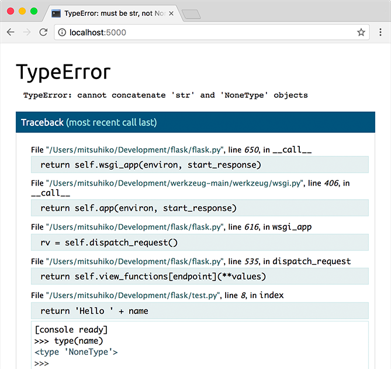

## <font style="color:black;">在生产环境中</font>
**<font style="color:rgb(62, 67, 73);">在生产环境中，不要运行开发服务器，或启用内置调试器。</font>**<font style="color:rgb(62, 67, 73);"> </font><font style="color:rgb(62, 67, 73);">调试器允许执 行来自浏览器的任意 Python 代码。 它由一个 pin 保护，但是在安全方面这 是不可依赖的。</font>

<font style="color:rgb(62, 67, 73);">使用错误记录工具，比如</font><font style="color:rgb(62, 67, 73);"> </font>[<font style="color:rgb(62, 67, 73);">错误日志工具</font>](https://dormousehole.readthedocs.io/en/2.3.2/errorhandling.html#error-logging-tools)<font style="color:rgb(62, 67, 73);"> </font><font style="color:rgb(62, 67, 73);">中提到的 Sentry ， 或者如</font><font style="color:rgb(62, 67, 73);"> </font>[<font style="color:rgb(62, 67, 73);">日志</font>](https://dormousehole.readthedocs.io/en/2.3.2/logging.html)<font style="color:rgb(62, 67, 73);"> </font><font style="color:rgb(62, 67, 73);">中提到的，开启日志记录和通知。</font>

<font style="color:rgb(62, 67, 73);">如果您有权访问服务器，</font><font style="color:rgb(62, 67, 73);"> </font>`<font style="color:rgb(34, 34, 34);background-color:rgb(232, 239, 240);">request.remote_addr</font>`<font style="color:rgb(62, 67, 73);"> </font><font style="color:rgb(62, 67, 73);">匹配您的 IP, 则可以添 加一些代码来启动外部调试器。一些 IDE 调试器还具有远程模式，因此可以在 服务器上设置断点与本地互动。 只能临时启用调试器。</font>

## <font style="color:black;">内置调试器</font>
<font style="color:rgb(62, 67, 73);">内置的 Werkzeug 开发服务器提供一个调试器，当请求中出现无法处置的错误 时会显示一个交互回溯。这个调试器应当仅在开发时使用。</font>



<font style="color:rgb(62, 67, 73);background-color:rgb(250, 250, 250);">Warning</font>

<font style="color:rgb(62, 67, 73);background-color:rgb(250, 250, 250);">调试器允许执行来自浏览器的任意 Python 代码。虽然它由一个 pin 保护， 但仍然存在巨大安全风险。不要在生产环境中运行开发服务器或调试器。</font>

<font style="color:rgb(62, 67, 73);">当开发服务器在调试模式下运行时调试器默认是开启的。</font>

```python
$ flask --app hello run --debug
```

<font style="color:rgb(62, 67, 73);">当以 Python 代码方式运行时，可以通过传递</font><font style="color:rgb(62, 67, 73);"> </font>`<font style="color:rgb(34, 34, 34);background-color:rgb(232, 239, 240);">debug=True</font>`<font style="color:rgb(62, 67, 73);"> </font><font style="color:rgb(62, 67, 73);">来开启调试模 式，这是与前述方式基本等价的。</font>

```python
app.run(debug=True)
```

[<font style="color:rgb(62, 67, 73);">开发服务器</font>](https://dormousehole.readthedocs.io/en/2.3.2/server.html)<font style="color:rgb(62, 67, 73);"> </font><font style="color:rgb(62, 67, 73);">和</font><font style="color:rgb(62, 67, 73);"> </font>[<font style="color:rgb(62, 67, 73);">命令行接口</font>](https://dormousehole.readthedocs.io/en/2.3.2/cli.html)<font style="color:rgb(62, 67, 73);"> </font><font style="color:rgb(62, 67, 73);">有更多关于运行调试器、调试模式和开发模 式的内容。更多关于调试器的信息参见</font><font style="color:rgb(62, 67, 73);"> </font>[<font style="color:rgb(62, 67, 73);">Werkzeug 文档</font>](https://werkzeug.palletsprojects.com/debug/)<font style="color:rgb(62, 67, 73);"> </font><font style="color:rgb(62, 67, 73);">。</font>

## <font style="color:black;">外部调试器</font>
<font style="color:rgb(62, 67, 73);">外部调试器，例如 IDE 提供的调试器，可以提供比内置调试器更强大的调试体 验。他们还可以用于在出错之前的请求期间进行单步代码调试。有些甚至具有 远程模式，可以调试在另一台机器上运行的代码。</font>

<font style="color:rgb(62, 67, 73);">当使用外部调试器时，应用程序应仍处于调试模式，否则 Flask 会把无法处理的 错误转化为 500 错误页面。然而，应当禁用内置调试器和重新加载器，以免干扰 外部调试器。</font>

```python
$ flask --app hello run --debug --no-debugger --no-reload
```

<font style="color:rgb(62, 67, 73);">从 Python 运行：</font>

```python
app.run(debug=True, use_debugger=False, use_reloader=False)
```

<font style="color:rgb(62, 67, 73);">禁用调试器和重载器不是必须的，但是如果不禁用的话，要注意以下问题。</font>

+ <font style="color:rgb(62, 67, 73);">如果内置调试器没有禁用，那么它会早于外部调试器捕获未处理的异常。</font>
+ <font style="color:rgb(62, 67, 73);">如果重载器没有禁用，那么在调试期间代码发生改变时会导致意外重新加载。</font>
+ <font style="color:rgb(62, 67, 73);">如果内置的调试器被禁用，开发服务器仍然会捕获未处理的异常，否则它将 在发生任何错误时崩溃。如果你想要这样的效果（ 通常不需要），那么请将</font><font style="color:rgb(62, 67, 73);"> </font>`<font style="color:rgb(34, 34, 34);background-color:rgb(232, 239, 240);">passthrough_errors=True</font>`<font style="color:rgb(62, 67, 73);"> </font><font style="color:rgb(62, 67, 73);">传递给</font><font style="color:rgb(62, 67, 73);"> </font>`<font style="color:rgb(34, 34, 34);background-color:rgb(232, 239, 240);">app.run</font>`<font style="color:rgb(62, 67, 73);"> </font><font style="color:rgb(62, 67, 73);">。</font>

```python
app.run(
    debug=True, passthrough_errors=True,
    use_debugger=False, use_reloader=False
)
```

