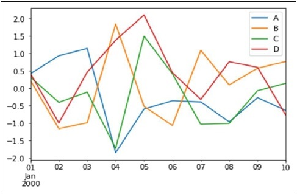
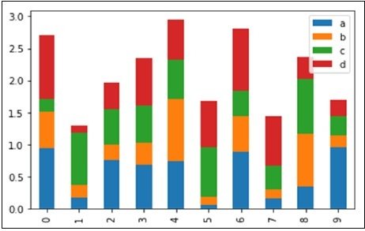
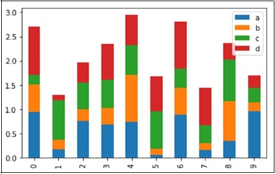
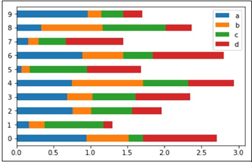
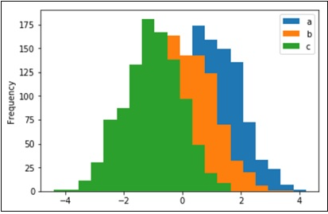
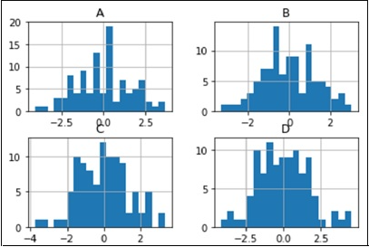
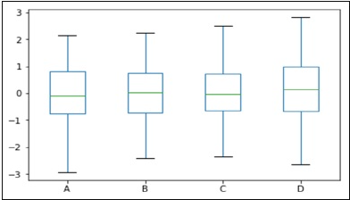
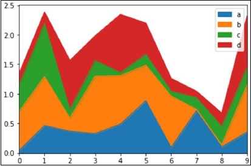
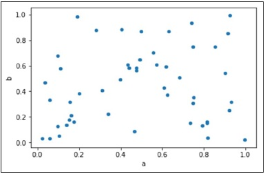

# <font style="color:rgb(51, 51, 51);">Pandas 聚合</font>
<font style="color:rgb(51, 51, 51);">Pandas 聚合的操作实例</font>

<font style="color:rgb(59, 69, 73);">创建滚动，扩展和ewm对象后，可以使用多种方法对数据执行聚合。</font>

## <font style="color:rgb(51, 51, 51);">对DataFrame聚合</font>
<font style="color:rgb(59, 69, 73);">我们创建一个DataFrame并对其应用聚合</font>

**<font style="color:rgb(51, 51, 51);background-color:rgb(239, 239, 239);">示例</font>**

```plain
import pandas as pd
 import numpy as np
 df = pd.DataFrame(np.random.randn(10, 4),
    index = pd.date_range('1/1/2000', periods=10),
    columns = ['A', 'B', 'C', 'D'])
 print df
 r = df.rolling(window=3,min_periods=1)
 print r
```

<font style="color:rgb(59, 69, 73);">运行结果如下：</font>

```plain
A           B           C           D
2000-01-01   1.088512   -0.650942   -2.547450   -0.566858
2000-01-02   0.790670   -0.387854   -0.668132    0.267283
2000-01-03  -0.575523   -0.965025    0.060427   -2.179780
2000-01-04   1.669653    1.211759   -0.254695    1.429166
2000-01-05   0.100568   -0.236184    0.491646   -0.466081
2000-01-06   0.155172    0.992975   -1.205134    0.320958
2000-01-07   0.309468   -0.724053   -1.412446    0.627919
2000-01-08   0.099489   -1.028040    0.163206   -1.274331
2000-01-09   1.639500   -0.068443    0.714008   -0.565969
2000-01-10   0.326761    1.479841    0.664282   -1.361169

Rolling [window=3,min_periods=1,center=False,axis=0]
```

<font style="color:rgb(59, 69, 73);">我们可以通过将函数传递给整个DataFrame进行聚合，也可以通过标准的get item方法选择一列。</font>

### <font style="color:rgb(51, 51, 51);">对Dataframe聚合</font>
**<font style="color:rgb(51, 51, 51);background-color:rgb(239, 239, 239);">示例</font>**

```plain
import pandas as pd
 import numpy as np
 df = pd.DataFrame(np.random.randn(10, 4),
    index = pd.date_range('1/1/2000', periods=10),
    columns = ['A', 'B', 'C', 'D'])
 print df
 r = df.rolling(window=3,min_periods=1)
 print r.aggregate(np.sum)
```

<font style="color:rgb(59, 69, 73);">运行结果如下：</font>

```plain
A           B           C           D
2000-01-01   1.088512   -0.650942   -2.547450   -0.566858
2000-01-02   1.879182   -1.038796   -3.215581   -0.299575
2000-01-03   1.303660   -2.003821   -3.155154   -2.479355
2000-01-04   1.884801   -0.141119   -0.862400   -0.483331
2000-01-05   1.194699    0.010551    0.297378   -1.216695
2000-01-06   1.925393    1.968551   -0.968183    1.284044
2000-01-07   0.565208    0.032738   -2.125934    0.482797
2000-01-08   0.564129   -0.759118   -2.454374   -0.325454
2000-01-09   2.048458   -1.820537   -0.535232   -1.212381
2000-01-10   2.065750    0.383357    1.541496   -3.201469

                    A           B           C           D
2000-01-01   1.088512   -0.650942   -2.547450   -0.566858
2000-01-02   1.879182   -1.038796   -3.215581   -0.299575
2000-01-03   1.303660   -2.003821   -3.155154   -2.479355
2000-01-04   1.884801   -0.141119   -0.862400   -0.483331
2000-01-05   1.194699    0.010551    0.297378   -1.216695
2000-01-06   1.925393    1.968551   -0.968183    1.284044
2000-01-07   0.565208    0.032738   -2.125934    0.482797
2000-01-08   0.564129   -0.759118   -2.454374   -0.325454
2000-01-09   2.048458   -1.820537   -0.535232   -1.212381
2000-01-10   2.065750    0.383357    1.541496   -3.201469
```

### <font style="color:rgb(51, 51, 51);">将聚合应用于Dataframe的单列</font>
**<font style="color:rgb(51, 51, 51);background-color:rgb(239, 239, 239);">示例</font>**

```plain
import pandas as pd
 import numpy as np
 df = pd.DataFrame(np.random.randn(10, 4),
    index = pd.date_range('1/1/2000', periods=10),
    columns = ['A', 'B', 'C', 'D'])
 print df
 r = df.rolling(window=3,min_periods=1)
 print r['A'].aggregate(np.sum)
```

<font style="color:rgb(59, 69, 73);">运行结果如下：</font>

```plain
A           B           C           D
2000-01-01   1.088512   -0.650942   -2.547450   -0.566858
2000-01-02   1.879182   -1.038796   -3.215581   -0.299575
2000-01-03   1.303660   -2.003821   -3.155154   -2.479355
2000-01-04   1.884801   -0.141119   -0.862400   -0.483331
2000-01-05   1.194699    0.010551    0.297378   -1.216695
2000-01-06   1.925393    1.968551   -0.968183    1.284044
2000-01-07   0.565208    0.032738   -2.125934    0.482797
2000-01-08   0.564129   -0.759118   -2.454374   -0.325454
2000-01-09   2.048458   -1.820537   -0.535232   -1.212381
2000-01-10   2.065750    0.383357    1.541496   -3.201469
2000-01-01   1.088512
2000-01-02   1.879182
2000-01-03   1.303660
2000-01-04   1.884801
2000-01-05   1.194699
2000-01-06   1.925393
2000-01-07   0.565208
2000-01-08   0.564129
2000-01-09   2.048458
2000-01-10   2.065750
Freq: D, Name: A, dtype: float64
```

### <font style="color:rgb(51, 51, 51);">将聚合应用于DataFrame的多个列</font>
**<font style="color:rgb(51, 51, 51);background-color:rgb(239, 239, 239);">示例</font>**

```plain
import pandas as pd
 import numpy as np
 df = pd.DataFrame(np.random.randn(10, 4),
    index = pd.date_range('1/1/2000', periods=10),
    columns = ['A', 'B', 'C', 'D'])
 print df
 r = df.rolling(window=3,min_periods=1)
 print r[['A','B']].aggregate(np.sum)
```

<font style="color:rgb(59, 69, 73);">运行结果如下：</font>

```plain
A           B           C           D
2000-01-01   1.088512   -0.650942   -2.547450   -0.566858
2000-01-02   1.879182   -1.038796   -3.215581   -0.299575
2000-01-03   1.303660   -2.003821   -3.155154   -2.479355
2000-01-04   1.884801   -0.141119   -0.862400   -0.483331
2000-01-05   1.194699    0.010551    0.297378   -1.216695
2000-01-06   1.925393    1.968551   -0.968183    1.284044
2000-01-07   0.565208    0.032738   -2.125934    0.482797
2000-01-08   0.564129   -0.759118   -2.454374   -0.325454
2000-01-09   2.048458   -1.820537   -0.535232   -1.212381
2000-01-10   2.065750    0.383357    1.541496   -3.201469
                    A           B
2000-01-01   1.088512   -0.650942
2000-01-02   1.879182   -1.038796
2000-01-03   1.303660   -2.003821
2000-01-04   1.884801   -0.141119
2000-01-05   1.194699    0.010551
2000-01-06   1.925393    1.968551
2000-01-07   0.565208    0.032738
2000-01-08   0.564129   -0.759118
2000-01-09   2.048458   -1.820537
2000-01-10   2.065750    0.383357
```

### <font style="color:rgb(51, 51, 51);">在数据框的单列上应用多个功能</font>
**<font style="color:rgb(51, 51, 51);background-color:rgb(239, 239, 239);">示例</font>**

```plain
import pandas as pd
 import numpy as np
 df = pd.DataFrame(np.random.randn(10, 4),
    index = pd.date_range('1/1/2000', periods=10),
    columns = ['A', 'B', 'C', 'D'])
 print df
 r = df.rolling(window=3,min_periods=1)
 print r['A'].aggregate([np.sum,np.mean])
```

<font style="color:rgb(59, 69, 73);">运行结果如下：</font>

```plain
A           B           C           D
2000-01-01   1.088512   -0.650942   -2.547450   -0.566858
2000-01-02   1.879182   -1.038796   -3.215581   -0.299575
2000-01-03   1.303660   -2.003821   -3.155154   -2.479355
2000-01-04   1.884801   -0.141119   -0.862400   -0.483331
2000-01-05   1.194699    0.010551    0.297378   -1.216695
2000-01-06   1.925393    1.968551   -0.968183    1.284044
2000-01-07   0.565208    0.032738   -2.125934    0.482797
2000-01-08   0.564129   -0.759118   -2.454374   -0.325454
2000-01-09   2.048458   -1.820537   -0.535232   -1.212381
2000-01-10   2.065750    0.383357    1.541496   -3.201469
                  sum       mean
2000-01-01   1.088512   1.088512
2000-01-02   1.879182   0.939591
2000-01-03   1.303660   0.434553
2000-01-04   1.884801   0.628267
2000-01-05   1.194699   0.398233
2000-01-06   1.925393   0.641798
2000-01-07   0.565208   0.188403
2000-01-08   0.564129   0.188043
2000-01-09   2.048458   0.682819
2000-01-10   2.065750   0.688583
```

### <font style="color:rgb(51, 51, 51);">在数据框的多个列上应用多个功能</font>
**<font style="color:rgb(51, 51, 51);background-color:rgb(239, 239, 239);">示例</font>**

```plain
import pandas as pd
 import numpy as np
 df = pd.DataFrame(np.random.randn(10, 4),
    index = pd.date_range('1/1/2000', periods=10),
    columns = ['A', 'B', 'C', 'D'])
 print df
 r = df.rolling(window=3,min_periods=1)
 print r[['A','B']].aggregate([np.sum,np.mean])
```

<font style="color:rgb(59, 69, 73);">运行结果如下：</font>

```plain
A           B           C           D
2000-01-01   1.088512   -0.650942   -2.547450   -0.566858
2000-01-02   1.879182   -1.038796   -3.215581   -0.299575
2000-01-03   1.303660   -2.003821   -3.155154   -2.479355
2000-01-04   1.884801   -0.141119   -0.862400   -0.483331
2000-01-05   1.194699    0.010551    0.297378   -1.216695
2000-01-06   1.925393    1.968551   -0.968183    1.284044
2000-01-07   0.565208    0.032738   -2.125934    0.482797
2000-01-08   0.564129   -0.759118   -2.454374   -0.325454
2000-01-09   2.048458   -1.820537   -0.535232   -1.212381
2000-01-10   2.065750    0.383357    1.541496   -3.201469
                    A                      B
                  sum       mean         sum        mean
2000-01-01   1.088512   1.088512   -0.650942   -0.650942
2000-01-02   1.879182   0.939591   -1.038796   -0.519398
2000-01-03   1.303660   0.434553   -2.003821   -0.667940
2000-01-04   1.884801   0.628267   -0.141119   -0.047040
2000-01-05   1.194699   0.398233    0.010551    0.003517
2000-01-06   1.925393   0.641798    1.968551    0.656184
2000-01-07   0.565208   0.188403    0.032738    0.010913
2000-01-08   0.564129   0.188043   -0.759118   -0.253039
2000-01-09   2.048458   0.682819   -1.820537   -0.606846
2000-01-10   2.065750   0.688583    0.383357    0.127786
```

### <font style="color:rgb(51, 51, 51);">将不同的功能应用于数据框的不同列</font>
**<font style="color:rgb(51, 51, 51);background-color:rgb(239, 239, 239);">示例</font>**

```plain
import pandas as pd
 import numpy as np
  
 df = pd.DataFrame(np.random.randn(3, 4),
    index = pd.date_range('1/1/2000', periods=3),
    columns = ['A', 'B', 'C', 'D'])
 print df
 r = df.rolling(window=3,min_periods=1)
 print r.aggregate({'A' : np.sum,'B' : np.mean})
```

<font style="color:rgb(59, 69, 73);">运行结果如下：</font>

```plain
A          B          C         D
2000-01-01  -1.575749  -1.018105   0.317797  0.545081
2000-01-02  -0.164917  -1.361068   0.258240  1.113091
2000-01-03   1.258111   1.037941  -0.047487  0.867371
                    A          B
2000-01-01  -1.575749  -1.018105
2000-01-02  -1.740666  -1.189587
2000-01-03  -0.482555  -0.447078
```

# <font style="color:rgb(51, 51, 51);">Pandas 数据丢失</font>
<font style="color:rgb(51, 51, 51);">Pandas 数据丢失的操作实例</font>

<font style="color:rgb(59, 69, 73);">在现实生活中，数据丢失始终是一个问题。机器学习和数据挖掘等领域在模型预测的准确性方面面临严重问题，因为缺少值会导致数据质量较差。在这些领域中，缺失值处理是使模型更准确和有效的主要重点。</font>

## <font style="color:rgb(51, 51, 51);">什么时候以及为什么会丢失数据？</font>
<font style="color:rgb(59, 69, 73);">让我们考虑一项产品的在线调查。很多时候，人们不会共享与他们有关的所有信息。很少有人会分享他们的经验，但是不会分享他们使用该产品有多长时间；很少有人分享他们使用该产品的时间，他们的经历而不是他们的联系信息。因此，以某种方式或其他方式总是会丢失一部分数据，这在实时情况下非常普遍。  
</font><font style="color:rgb(59, 69, 73);">现在让我们看看如何使用熊猫处理缺失值（例如NA或NaN）。</font>

**<font style="color:rgb(51, 51, 51);background-color:rgb(239, 239, 239);">示例</font>**

```plain
# import the pandas library
 import pandas as pd
 import numpy as np
 df = pd.DataFrame(np.random.randn(5, 3), index=['a', 'c', 'e', 'f',
 'h'],columns=['one', 'two', 'three'])
 df = df.reindex(['a', 'b', 'c', 'd', 'e', 'f', 'g', 'h'])
 print(df)
```

<font style="color:rgb(59, 69, 73);">运行结果如下：</font>

```plain
one        two     three
a  -0.576991  -0.741695  0.553172
b        NaN        NaN       NaN
c   0.744328  -1.735166  1.749580

NaN replaced with '0':
         one        two     three
a  -0.576991  -0.741695  0.553172
b   0.000000   0.000000  0.000000
c   0.744328  -1.735166  1.749580
```

<font style="color:rgb(59, 69, 73);">使用重新索引，我们创建了一个缺少值的DataFrame。在输出中，NaN表示不是数字。</font>

### <font style="color:rgb(51, 51, 51);">检查缺失值</font>
<font style="color:rgb(59, 69, 73);">为了使检测的缺失值更容易（和不同阵列dtypes），熊猫提供ISNULL()和NOTNULL()功能，这也是对系列和数据帧的对象的方法-</font>

### <font style="color:rgb(51, 51, 51);">实例 1</font>
**<font style="color:rgb(51, 51, 51);background-color:rgb(239, 239, 239);">示例</font>**

```plain
import pandas as pd
 import numpy as np
  
 df = pd.DataFrame(np.random.randn(5, 3), index=['a', 'c', 'e', 'f',
 'h'],columns=['one', 'two', 'three'])
 df = df.reindex(['a', 'b', 'c', 'd', 'e', 'f', 'g', 'h'])
 print(df['one'].isnull())
```

<font style="color:rgb(59, 69, 73);">运行结果如下：</font>

```plain
a  False
 b  True
 c  False
 d  True
 e  False
 f  False
 g  True
 h  False
 Name: one, dtype: bool
```

### <font style="color:rgb(51, 51, 51);">实例 2</font>
**<font style="color:rgb(51, 51, 51);background-color:rgb(239, 239, 239);">示例</font>**

```plain
import pandas as pd
 import numpy as np
 df = pd.DataFrame(np.random.randn(5, 3), index=['a', 'c', 'e', 'f',
 'h'],columns=['one', 'two', 'three'])
 df = df.reindex(['a', 'b', 'c', 'd', 'e', 'f', 'g', 'h'])
 print(df['one'].notnull())
```

<font style="color:rgb(59, 69, 73);">运行结果如下：</font>

```plain
a  True
 b  False
 c  True
 d  False
 e  True
 f  True
 g  False
 h  True
 Name: one, dtype: bool
```

### <font style="color:rgb(51, 51, 51);">缺少数据的计算</font>
<font style="color:rgb(51, 51, 51);">汇总数据时，NA将被视为零</font><font style="color:rgb(51, 51, 51);">如果数据均为不适用，则结果为不适用</font>

### <font style="color:rgb(51, 51, 51);">实例 1</font>
**<font style="color:rgb(51, 51, 51);background-color:rgb(239, 239, 239);">示例</font>**

```plain
import pandas as pd
 import numpy as np
 df = pd.DataFrame(np.random.randn(5, 3), index=['a', 'c', 'e', 'f',
 'h'],columns=['one', 'two', 'three'])
 df = df.reindex(['a', 'b', 'c', 'd', 'e', 'f', 'g', 'h'])
 print(df['one'].sum())
```

<font style="color:rgb(59, 69, 73);">运行结果如下：</font>

   2.02357685917

### <font style="color:rgb(51, 51, 51);">实例 2</font>
**<font style="color:rgb(51, 51, 51);background-color:rgb(239, 239, 239);">示例</font>**

```plain
import pandas as pd
 import numpy as np
 df = pd.DataFrame(index=[0,1,2,3,4,5],columns=['one','two'])
 print(df['one'].sum()
```

<font style="color:rgb(59, 69, 73);">运行结果如下：</font>

   nan

## <font style="color:rgb(51, 51, 51);">清理/填充丢失的数据</font>
<font style="color:rgb(59, 69, 73);">Pandas 提供了多种清除缺失值的方法。fillna函数可以通过以下几种方法用非空数据“填充” NA值。</font>

## <font style="color:rgb(51, 51, 51);">用标量值替换NaN</font>
<font style="color:rgb(59, 69, 73);">以下程序显示了如何将“ NaN”替换为“ 0”。</font>

**<font style="color:rgb(51, 51, 51);background-color:rgb(239, 239, 239);">示例</font>**

```plain
import pandas as pd
 import numpy as np
 df = pd.DataFrame(np.random.randn(3, 3), index=['a', 'c', 'e'],columns=['one',
 'two', 'three'])
 df = df.reindex(['a', 'b', 'c']))
 print(df)
 print(("NaN replaced with '0':"))
 print(df.fillna(0))
```

<font style="color:rgb(59, 69, 73);">运行结果如下：</font>

```plain
one        two     three
a  -0.576991  -0.741695  0.553172
b        NaN        NaN       NaN
c   0.744328  -1.735166  1.749580

NaN replaced with '0':
         one        two     three
a  -0.576991  -0.741695  0.553172
b   0.000000   0.000000  0.000000
c   0.744328  -1.735166  1.749580
```

<font style="color:rgb(59, 69, 73);">在这里，我们填充零值；相反，我们还可以填充其他任何值。</font>

## <font style="color:rgb(51, 51, 51);">向前和向后填充NA</font>
<font style="color:rgb(59, 69, 73);">使用“重新索引”一章中讨论的填充概念，我们将填充缺少的值。</font>

| <font style="color:rgb(51, 51, 51);">方法</font> | <font style="color:rgb(51, 51, 51);">操作</font> |
| --- | --- |
| **<font style="color:rgb(51, 51, 51);">pad/fill</font>** | <font style="color:rgb(51, 51, 51);">向前填充<</font> |
| **<font style="color:rgb(51, 51, 51);">bfill/backfill</font>** | <font style="color:rgb(51, 51, 51);">向后填充</font> |


### <font style="color:rgb(51, 51, 51);">实例 1</font>
**<font style="color:rgb(51, 51, 51);background-color:rgb(239, 239, 239);">示例</font>**

```plain
import pandas as pd
 import numpy as np
 df = pd.DataFrame(np.random.randn(5, 3), index=['a', 'c', 'e', 'f',
 'h'],columns=['one', 'two', 'three'])
 df = df.reindex(['a', 'b', 'c', 'd', 'e', 'f', 'g', 'h'])
 print(df.fillna(method='pad'))
```

<font style="color:rgb(59, 69, 73);">运行结果如下：</font>

```plain
one        two      three
a   0.077988   0.476149   0.965836
b   0.077988   0.476149   0.965836
c  -0.390208  -0.551605  -2.301950
d  -0.390208  -0.551605  -2.301950
e  -2.000303  -0.788201   1.510072
f  -0.930230  -0.670473   1.146615
g  -0.930230  -0.670473   1.146615
h   0.085100   0.532791   0.887415
```

### <font style="color:rgb(51, 51, 51);">实例 2</font>
**<font style="color:rgb(51, 51, 51);background-color:rgb(239, 239, 239);">示例</font>**

```plain
import pandas as pd
 import numpy as np
 df = pd.DataFrame(np.random.randn(5, 3), index=['a', 'c', 'e', 'f',
 'h'],columns=['one', 'two', 'three'])
 df = df.reindex(['a', 'b', 'c', 'd', 'e', 'f', 'g', 'h'])
 print(df.fillna(method='backfill'))
```

<font style="color:rgb(59, 69, 73);">运行结果如下：</font>

```plain
one        two      three
a   0.077988   0.476149   0.965836
b  -0.390208  -0.551605  -2.301950
c  -0.390208  -0.551605  -2.301950
d  -2.000303  -0.788201   1.510072
e  -2.000303  -0.788201   1.510072
f  -0.930230  -0.670473   1.146615
g   0.085100   0.532791   0.887415
h   0.085100   0.532791   0.887415
```

## <font style="color:rgb(51, 51, 51);">删除缺失值</font>
<font style="color:rgb(59, 69, 73);">如果只想排除丢失的值，则将dropna函数与axis参数一起使用。默认情况下，axis = 0，即沿着行，这意味着如果一行中的任何值为NA，那么将排除整行。</font>

### <font style="color:rgb(51, 51, 51);">实例 1</font>
**<font style="color:rgb(51, 51, 51);background-color:rgb(239, 239, 239);">示例</font>**

```plain
import pandas as pd
 import numpy as np
 df = pd.DataFrame(np.random.randn(5, 3), index=['a', 'c', 'e', 'f',
 'h'],columns=['one', 'two', 'three'])
 df = df.reindex(['a', 'b', 'c', 'd', 'e', 'f', 'g', 'h'])
 print(df.dropna())
```

<font style="color:rgb(59, 69, 73);">运行结果如下：</font>

```plain
one two three a 0.077988 0.476149 0.965836 c -0.390208 -0.551605 -2.301950 e -2.000303 -0.788201 1.510072 f -0.930230 -0.670473 1.146615 h 0.085100 0.532791 0.887415
```

### <font style="color:rgb(51, 51, 51);">实例 2</font>
**<font style="color:rgb(51, 51, 51);background-color:rgb(239, 239, 239);">示例</font>**

```plain
import pandas as pd
 import numpy as np
 df = pd.DataFrame(np.random.randn(5, 3), index=['a', 'c', 'e', 'f',
 'h'],columns=['one', 'two', 'three'])
 df = df.reindex(['a', 'b', 'c', 'd', 'e', 'f', 'g', 'h'])
 print(df.dropna(axis=1))
```

<font style="color:rgb(59, 69, 73);">运行结果如下：</font>

```plain
Empty DataFrame
 Columns: [ ]
 Index: [a, b, c, d, e, f, g, h]
```

## <font style="color:rgb(51, 51, 51);">替换缺失的（或）通用值</font>
<font style="color:rgb(59, 69, 73);">很多时候，我们必须用某个特定值替换一个通用值。我们可以通过应用replace方法来实现。  
</font><font style="color:rgb(59, 69, 73);">用标量值替换NA是fillna()函数的等效行为。</font>

### <font style="color:rgb(51, 51, 51);">实例 1</font>
**<font style="color:rgb(51, 51, 51);background-color:rgb(239, 239, 239);">示例</font>**

```plain
import pandas as pd
 import numpy as np
 df = pd.DataFrame({'one':[10,20,30,40,50,2000], 'two':[1000,0,30,40,50,60]})
 print(df.replace({1000:10,2000:60}))
```

<font style="color:rgb(59, 69, 73);">运行结果如下：</font>

```plain
one two
 0 10 10
 1 20 0
 2 30 30
 3 40 40
 4 50 50
 5 60 60
```

### <font style="color:rgb(51, 51, 51);">实例 2</font>
**<font style="color:rgb(51, 51, 51);background-color:rgb(239, 239, 239);">示例</font>**

```plain
import pandas as pd
 import numpy as np
 df = pd.DataFrame({'one':[10,20,30,40,50,2000], 'two':[1000,0,30,40,50,60]})
 print(df.replace({1000:10,2000:60})
```

<font style="color:rgb(59, 69, 73);">运行结果如下：</font>

```plain
one two
 0 10 10
 1 20 0
 2 30 30
 3 40 40
 4 50 50
 5 60 60
```

# <font style="color:rgb(51, 51, 51);">Pandas GroupBy</font>
<font style="color:rgb(51, 51, 51);">Pandas GroupBy的操作实例</font>

<font style="color:rgb(59, 69, 73);">任何groupby操作都会对原始对象进行以下操作：</font>

<font style="color:rgb(51, 51, 51);">拆分对象</font><font style="color:rgb(51, 51, 51);">应用函数</font><font style="color:rgb(51, 51, 51);">合并结果</font>

<font style="color:rgb(59, 69, 73);">在许多情况下，我们将数据分成几组，然后在每个子集上应用一些功能。在Apply功能中，我们可以执行以下操作-</font>

**<font style="color:rgb(51, 51, 51);">聚合</font>**<font style="color:rgb(51, 51, 51);"> </font><font style="color:rgb(51, 51, 51);">− 计算汇总统计</font>**<font style="color:rgb(51, 51, 51);">转换</font>**<font style="color:rgb(51, 51, 51);"> </font><font style="color:rgb(51, 51, 51);">− 分组操作</font>**<font style="color:rgb(51, 51, 51);">过滤</font>**<font style="color:rgb(51, 51, 51);"> </font><font style="color:rgb(51, 51, 51);">− 在某些条件下过滤数据</font>

<font style="color:rgb(59, 69, 73);">现在我们创建一个DataFrame对象并对其执行所有操作。</font>

**<font style="color:rgb(51, 51, 51);background-color:rgb(239, 239, 239);">示例</font>**

```plain
#import the pandas library
 import pandas as pd
 ipl_data = {'Team': ['Riders', 'Riders', 'Devils', 'Devils', 'Kings',
    'kings', 'Kings', 'Kings', 'Riders', 'Royals', 'Royals', 'Riders'],
    'Rank': [1, 2, 2, 3, 3,4 ,1 ,1,2 , 4,1,2],
    'Year': [2014,2015,2014,2015,2014,2015,2016,2017,2016,2014,2015,2017],
    'Points':[876,789,863,673,741,812,756,788,694,701,804,690]}
 df = pd.DataFrame(ipl_data)
 print(df)
```

<font style="color:rgb(59, 69, 73);">运行结果如下：</font>

```plain
Points   Rank     Team   Year
0      876      1   Riders   2014
1      789      2   Riders   2015
2      863      2   Devils   2014
3      673      3   Devils   2015
4      741      3    Kings   2014
5      812      4    kings   2015
6      756      1    Kings   2016
7      788      1    Kings   2017
8      694      2   Riders   2016
9      701      4   Royals   2014
10     804      1   Royals   2015
11     690      2   Riders   2017
```

## <font style="color:rgb(51, 51, 51);">将数据分成组</font>
<font style="color:rgb(59, 69, 73);">象可以拆分为任何对象。有多种分割对象的方法，例如：</font>

<font style="color:rgb(51, 51, 51);">obj.groupby('key')</font><font style="color:rgb(51, 51, 51);">obj.groupby(['key1','key2'])</font><font style="color:rgb(51, 51, 51);">obj.groupby(key,axis=1)</font>

<font style="color:rgb(59, 69, 73);">现在我们看看如何将分组对象应用于DataFrame对象</font>

### <font style="color:rgb(51, 51, 51);">实例</font>
**<font style="color:rgb(51, 51, 51);background-color:rgb(239, 239, 239);">示例</font>**

```plain
# import the pandas library
 import pandas as pd
 ipl_data = {'Team': ['Riders', 'Riders', 'Devils', 'Devils', 'Kings',
    'kings', 'Kings', 'Kings', 'Riders', 'Royals', 'Royals', 'Riders'],
    'Rank': [1, 2, 2, 3, 3,4 ,1 ,1,2 , 4,1,2],
    'Year': [2014,2015,2014,2015,2014,2015,2016,2017,2016,2014,2015,2017],
    'Points':[876,789,863,673,741,812,756,788,694,701,804,690]}
 df = pd.DataFrame(ipl_data)
 print(df.groupby('Team'))
```

<font style="color:rgb(59, 69, 73);">运行结果如下：</font>

```plain

```

## <font style="color:rgb(51, 51, 51);">查看组</font>
**<font style="color:rgb(51, 51, 51);background-color:rgb(239, 239, 239);">示例</font>**

```plain
# import the pandas library
 import pandas as pd
 ipl_data = {'Team': ['Riders', 'Riders', 'Devils', 'Devils', 'Kings',
    'kings', 'Kings', 'Kings', 'Riders', 'Royals', 'Royals', 'Riders'],
    'Rank': [1, 2, 2, 3, 3,4 ,1 ,1,2 , 4,1,2],
    'Year': [2014,2015,2014,2015,2014,2015,2016,2017,2016,2014,2015,2017],
    'Points':[876,789,863,673,741,812,756,788,694,701,804,690]}
 df = pd.DataFrame(ipl_data)
 print(df.groupby('Team').groups)
```

<font style="color:rgb(59, 69, 73);">运行结果如下：</font>

```plain
{'Kings': Int64Index([4, 6, 7], dtype='int64'),
 'Devils': Int64Index([2, 3], dtype='int64'),
 'Riders': Int64Index([0, 1, 8, 11], dtype='int64'),
 'Royals': Int64Index([9, 10], dtype='int64'),
 'kings' : Int64Index([5], dtype='int64')}
```

### <font style="color:rgb(51, 51, 51);">实例</font>
<font style="color:rgb(59, 69, 73);">用多列分组</font>

**<font style="color:rgb(51, 51, 51);background-color:rgb(239, 239, 239);">示例</font>**

```plain
# import the pandas library
 import pandas as pd
 ipl_data = {'Team': ['Riders', 'Riders', 'Devils', 'Devils', 'Kings',
    'kings', 'Kings', 'Kings', 'Riders', 'Royals', 'Royals', 'Riders'],
    'Rank': [1, 2, 2, 3, 3,4 ,1 ,1,2 , 4,1,2],
    'Year': [2014,2015,2014,2015,2014,2015,2016,2017,2016,2014,2015,2017],
    'Points':[876,789,863,673,741,812,756,788,694,701,804,690]}
 df = pd.DataFrame(ipl_data)
 print(df.groupby(['Team','Year']).groups)
```

<font style="color:rgb(59, 69, 73);">运行结果如下：</font>

```plain
{('Kings', 2014): Int64Index([4], dtype='int64'),
  ('Royals', 2014): Int64Index([9], dtype='int64'),
  ('Riders', 2014): Int64Index([0], dtype='int64'),
  ('Riders', 2015): Int64Index([1], dtype='int64'),
  ('Kings', 2016): Int64Index([6], dtype='int64'),
  ('Riders', 2016): Int64Index([8], dtype='int64'),
  ('Riders', 2017): Int64Index([11], dtype='int64'),
  ('Devils', 2014): Int64Index([2], dtype='int64'),
  ('Devils', 2015): Int64Index([3], dtype='int64'),
  ('kings', 2015): Int64Index([5], dtype='int64'),
  ('Royals', 2015): Int64Index([10], dtype='int64'),
  ('Kings', 2017): Int64Index([7], dtype='int64')}
```

## <font style="color:rgb(51, 51, 51);">遍历组</font>
<font style="color:rgb(59, 69, 73);">有了groupby对象，我们可以类似于itertools.obj遍历该对象。</font>

**<font style="color:rgb(51, 51, 51);background-color:rgb(239, 239, 239);">示例</font>**

```plain
# import the pandas library
 import pandas as pd
 ipl_data = {'Team': ['Riders', 'Riders', 'Devils', 'Devils', 'Kings',
    'kings', 'Kings', 'Kings', 'Riders', 'Royals', 'Royals', 'Riders'],
    'Rank': [1, 2, 2, 3, 3,4 ,1 ,1,2 , 4,1,2],
    'Year': [2014,2015,2014,2015,2014,2015,2016,2017,2016,2014,2015,2017],
    'Points':[876,789,863,673,741,812,756,788,694,701,804,690]}
 df = pd.DataFrame(ipl_data)
 grouped = df.groupby('Year')
 for name,group in grouped:
    print(name)
    print(group)
```

<font style="color:rgb(59, 69, 73);">运行结果如下：</font>

```plain
2014
   Points  Rank     Team   Year
0     876     1   Riders   2014
2     863     2   Devils   2014
4     741     3   Kings    2014
9     701     4   Royals   2014

2015
   Points  Rank     Team   Year
1     789     2   Riders   2015
3     673     3   Devils   2015
5     812     4    kings   2015
10    804     1   Royals   2015

2016
   Points  Rank     Team   Year
6     756     1    Kings   2016
8     694     2   Riders   2016

2017
   Points  Rank    Team   Year
7     788     1   Kings   2017
11    690     2  Riders   2017
```

<font style="color:rgb(59, 69, 73);">默认情况下，groupby对象的标签名称与组名称相同。</font>

## <font style="color:rgb(51, 51, 51);">选择组p</font>
<font style="color:rgb(59, 69, 73);">使用get_group()方法，我们可以选择一个组。</font>

**<font style="color:rgb(51, 51, 51);background-color:rgb(239, 239, 239);">示例</font>**

```plain
# import the pandas library
 import pandas as pd
 ipl_data = {'Team': ['Riders', 'Riders', 'Devils', 'Devils', 'Kings',
    'kings', 'Kings', 'Kings', 'Riders', 'Royals', 'Royals', 'Riders'],
    'Rank': [1, 2, 2, 3, 3,4 ,1 ,1,2 , 4,1,2],
    'Year': [2014,2015,2014,2015,2014,2015,2016,2017,2016,2014,2015,2017],
    'Points':[876,789,863,673,741,812,756,788,694,701,804,690]}
 df = pd.DataFrame(ipl_data)
 grouped = df.groupby('Year')
 print(grouped.get_group(2014))
```

<font style="color:rgb(59, 69, 73);">运行结果如下：</font>

```plain
Points  Rank     Team    Year
0     876     1   Riders    2014
2     863     2   Devils    2014
4     741     3   Kings     2014
9     701     4   Royals    2014
```

## <font style="color:rgb(51, 51, 51);">集合体</font>
<font style="color:rgb(59, 69, 73);">聚合函数为每个组返回一个聚合值。一旦通过组对象被创建，几个聚合操作可以在分组的数据来执行。</font>

<font style="color:rgb(59, 69, 73);">一个明显的方法是通过合计或等效的agg方法进行合计。</font>

**<font style="color:rgb(51, 51, 51);background-color:rgb(239, 239, 239);">示例</font>**

```plain
# import the pandas library
 import pandas as pd
 import numpy as np
 ipl_data = {'Team': ['Riders', 'Riders', 'Devils', 'Devils', 'Kings',
    'kings', 'Kings', 'Kings', 'Riders', 'Royals', 'Royals', 'Riders'],
    'Rank': [1, 2, 2, 3, 3,4 ,1 ,1,2 , 4,1,2],
    'Year': [2014,2015,2014,2015,2014,2015,2016,2017,2016,2014,2015,2017],
    'Points':[876,789,863,673,741,812,756,788,694,701,804,690]}
 df = pd.DataFrame(ipl_data)
 grouped = df.groupby('Year')
 print(grouped['Points'].agg(np.mean))
```

<font style="color:rgb(59, 69, 73);">运行结果如下：</font>

```plain
Year
2014   795.25
2015   769.50
2016   725.00
2017   739.00
Name: Points, dtype: float64
```

<font style="color:rgb(59, 69, 73);">查看每个组的大小的另一种方法是通过应用size()函数。</font>

**<font style="color:rgb(51, 51, 51);background-color:rgb(239, 239, 239);">示例</font>**

```plain
import pandas as pd
 import numpy as np
 ipl_data = {'Team': ['Riders', 'Riders', 'Devils', 'Devils', 'Kings',
    'kings', 'Kings', 'Kings', 'Riders', 'Royals', 'Royals', 'Riders'],
    'Rank': [1, 2, 2, 3, 3,4 ,1 ,1,2 , 4,1,2],
    'Year': [2014,2015,2014,2015,2014,2015,2016,2017,2016,2014,2015,2017],
    'Points':[876,789,863,673,741,812,756,788,694,701,804,690]}
 df = pd.DataFrame(ipl_data)
 Attribute Access in Python Pandas
 grouped = df.groupby('Team')
 print(grouped.agg(np.size))
```

<font style="color:rgb(59, 69, 73);">运行结果如下：</font>

```plain
Points   Rank   Year
Team
Devils        2      2      2
Kings         3      3      3
Riders        4      4      4
Royals        2      2      2
kings         1      1      1
```

### <font style="color:rgb(51, 51, 51);">一次应用多个聚合功能</font>
<font style="color:rgb(59, 69, 73);">借助分组的Series，您还可以传递函数的列表或字典来进行聚合，并生成DataFrame作为输出-</font>

**<font style="color:rgb(51, 51, 51);background-color:rgb(239, 239, 239);">示例</font>**

```plain
# import the pandas library
 import pandas as pd
 import numpy as np
 ipl_data = {'Team': ['Riders', 'Riders', 'Devils', 'Devils', 'Kings',
    'kings', 'Kings', 'Kings', 'Riders', 'Royals', 'Royals', 'Riders'],
    'Rank': [1, 2, 2, 3, 3,4 ,1 ,1,2 , 4,1,2],
    'Year': [2014,2015,2014,2015,2014,2015,2016,2017,2016,2014,2015,2017],
    'Points':[876,789,863,673,741,812,756,788,694,701,804,690]}
 df = pd.DataFrame(ipl_data)
 grouped = df.groupby('Team')
 print(grouped['Points'].agg([np.sum, np.mean, np.std]))
```

<font style="color:rgb(59, 69, 73);">运行结果如下：</font>

```plain
Team      sum      mean          std
Devils   1536   768.000000   134.350288
Kings    2285   761.666667    24.006943
Riders   3049   762.250000    88.567771
Royals   1505   752.500000    72.831998
kings     812   812.000000          NaN
```

## <font style="color:rgb(51, 51, 51);">转换</font>
<font style="color:rgb(59, 69, 73);">在组或列上进行转换将返回一个索引，该索引的大小与正在分组的对象的大小相同。因此，转换应返回与组块大小相同的结果。</font>

**<font style="color:rgb(51, 51, 51);background-color:rgb(239, 239, 239);">示例</font>**

```plain
# import the pandas library
 import pandas as pd
 import numpy as np
 ipl_data = {'Team': ['Riders', 'Riders', 'Devils', 'Devils', 'Kings',
    'kings', 'Kings', 'Kings', 'Riders', 'Royals', 'Royals', 'Riders'],
    'Rank': [1, 2, 2, 3, 3,4 ,1 ,1,2 , 4,1,2],
    'Year': [2014,2015,2014,2015,2014,2015,2016,2017,2016,2014,2015,2017],
    'Points':[876,789,863,673,741,812,756,788,694,701,804,690]}
 df = pd.DataFrame(ipl_data)
 grouped = df.groupby('Team')
 score = lambda x: (x - x.mean()) / x.std()*10
 print(grouped.transform(score))
```

<font style="color:rgb(59, 69, 73);">运行结果如下：</font>

```plain
Points        Rank        Year
0   12.843272  -15.000000  -11.618950
1   3.020286     5.000000   -3.872983
2   7.071068    -7.071068   -7.071068
3  -7.071068     7.071068    7.071068
4  -8.608621    11.547005  -10.910895
5        NaN          NaN         NaN
6  -2.360428    -5.773503    2.182179
7  10.969049    -5.773503    8.728716
8  -7.705963     5.000000    3.872983
9  -7.071068     7.071068   -7.071068
10  7.071068    -7.071068    7.071068
11 -8.157595     5.000000   11.618950
```

## <font style="color:rgb(51, 51, 51);">过滤</font>
<font style="color:rgb(59, 69, 73);">过滤根据定义的条件过滤数据并返回数据的子集。所述过滤器()函数是用来筛选数据。</font>

**<font style="color:rgb(51, 51, 51);background-color:rgb(239, 239, 239);">示例</font>**

```plain
import pandas as pd
 import numpy as np
 ipl_data = {'Team': ['Riders', 'Riders', 'Devils', 'Devils', 'Kings',
    'kings', 'Kings', 'Kings', 'Riders', 'Royals', 'Royals', 'Riders'],
    'Rank': [1, 2, 2, 3, 3,4 ,1 ,1,2 , 4,1,2],
    'Year': [2014,2015,2014,2015,2014,2015,2016,2017,2016,2014,2015,2017],
    'Points':[876,789,863,673,741,812,756,788,694,701,804,690]}
 df = pd.DataFrame(ipl_data)
 print(df.groupby('Team').filter(lambda x: len(x) >= 3))
```

<font style="color:rgb(59, 69, 73);">运行结果如下：</font>

```plain
Points  Rank     Team   Year
0      876     1   Riders   2014
1      789     2   Riders   2015
4      741     3   Kings    2014
6      756     1   Kings    2016
7      788     1   Kings    2017
8      694     2   Riders   2016
11     690     2   Riders   2017
```

# <font style="color:rgb(51, 51, 51);">Pandas 连接</font>
<font style="color:rgb(51, 51, 51);">Pandas 连接的操作实例</font>

<font style="color:rgb(59, 69, 73);">Pandas具有与SQL等关系数据库非常相似的功能齐全的高性能内存中连接操作。  
</font><font style="color:rgb(59, 69, 73);">Pandas提供单个功能merge作为DataFrame对象之间所有标准数据库联接操作的入口点</font>

```plain
pd.merge(left, right, how='inner', on=None, left_on=None, right_on=None,
 left_index=False, right_index=False, sort=True)
```

<font style="color:rgb(59, 69, 73);">在这里，我们使用了以下参数：</font>

**<font style="color:rgb(51, 51, 51);">left</font>**<font style="color:rgb(51, 51, 51);"> </font><font style="color:rgb(51, 51, 51);">− 一个DataFrame对象。</font>**<font style="color:rgb(51, 51, 51);">right</font>**<font style="color:rgb(51, 51, 51);"> </font><font style="color:rgb(51, 51, 51);">− 另一个DataFrame对象。</font>**<font style="color:rgb(51, 51, 51);">on</font>**<font style="color:rgb(51, 51, 51);"> </font><font style="color:rgb(51, 51, 51);">− 列（名）加入上。必须在左右DataFrame对象中都找到。</font>**<font style="color:rgb(51, 51, 51);">left_on</font>**<font style="color:rgb(51, 51, 51);"> </font><font style="color:rgb(51, 51, 51);">− 左侧DataFrame中的列用作键。可以是列名，也可以是长度等于DataFrame长度的数组。</font>**<font style="color:rgb(51, 51, 51);">right_on</font>**<font style="color:rgb(51, 51, 51);"> </font><font style="color:rgb(51, 51, 51);">− 右侧DataFrame中的列用作键。可以是列名，也可以是长度等于DataFrame长度的数组。</font>**<font style="color:rgb(51, 51, 51);">left_index</font>**<font style="color:rgb(51, 51, 51);"> </font><font style="color:rgb(51, 51, 51);">− 如果为True，则使用左侧DataFrame的索引（行标签）作为其连接键。如果DataFrame具有MultiIndex（分层），则级别数必须与右侧DataFrame中的连接键数匹配。</font>**<font style="color:rgb(51, 51, 51);">right_index</font>**<font style="color:rgb(51, 51, 51);"> </font><font style="color:rgb(51, 51, 51);">− 相同的使用作为left_index为正确的数据帧。</font>**<font style="color:rgb(51, 51, 51);">how</font>**<font style="color:rgb(51, 51, 51);"> </font><font style="color:rgb(51, 51, 51);">− “左”，“右”，“外”，“内”之一。默认为内部。每种方法已在下面描述。</font>**<font style="color:rgb(51, 51, 51);">sort</font>**<font style="color:rgb(51, 51, 51);"> </font><font style="color:rgb(51, 51, 51);">− 排序的结果数据框中加入字典顺序按键。默认情况下为True，在许多情况下，设置为False将大大提高性能。</font>

<font style="color:rgb(59, 69, 73);">现在让我们创建两个不同的DataFrame并对其执行合并操作。</font>

**<font style="color:rgb(51, 51, 51);background-color:rgb(239, 239, 239);">示例</font>**

```plain
# import the pandas library
 import pandas as pd
 left = pd.DataFrame({
    'id':[1,2,3,4,5],
    'Name': ['Alex', 'Amy', 'Allen', 'Alice', 'Ayoung'],
    'subject_id':['sub1','sub2','sub4','sub6','sub5']})
 right = pd.DataFrame(
    {'id':[1,2,3,4,5],
    'Name': ['Billy', 'Brian', 'Bran', 'Bryce', 'Betty'],
    'subject_id':['sub2','sub4','sub3','sub6','sub5']}))
 print(left
 print(right)
```

<font style="color:rgb(59, 69, 73);">运行结果如下：</font>

```plain
Name  id   subject_id
0   Alex   1         sub1
1    Amy   2         sub2
2  Allen   3         sub4
3  Alice   4         sub6
4  Ayoung  5         sub5

    Name  id   subject_id
0  Billy   1         sub2
1  Brian   2         sub4
2  Bran    3         sub3
3  Bryce   4         sub6
4  Betty   5         sub5
```

### <font style="color:rgb(51, 51, 51);">在一个键上合并两个数据框</font>
**<font style="color:rgb(51, 51, 51);background-color:rgb(239, 239, 239);">示例</font>**

```plain
import pandas as pd
 left = pd.DataFrame({
    'id':[1,2,3,4,5],
    'Name': ['Alex', 'Amy', 'Allen', 'Alice', 'Ayoung'],
    'subject_id':['sub1','sub2','sub4','sub6','sub5']})
 right = pd.DataFrame({
 'id':[1,2,3,4,5],
    'Name': ['Billy', 'Brian', 'Bran', 'Bryce', 'Betty'],
    'subject_id':['sub2','sub4','sub3','sub6','sub5']})
 print(pd.merge(left,right,on='id'))
```

<font style="color:rgb(59, 69, 73);">运行结果如下：</font>

```plain
Name_x   id  subject_id_x   Name_y   subject_id_y
0  Alex      1          sub1    Billy           sub2
1  Amy       2          sub2    Brian           sub4
2  Allen     3          sub4     Bran           sub3
3  Alice     4          sub6    Bryce           sub6
4  Ayoung    5          sub5    Betty           sub5
```

### <font style="color:rgb(51, 51, 51);">在多个键上合并两个数据框</font>
**<font style="color:rgb(51, 51, 51);background-color:rgb(239, 239, 239);">示例</font>**

```plain
import pandas as pd
 left = pd.DataFrame({
    'id':[1,2,3,4,5],
    'Name': ['Alex', 'Amy', 'Allen', 'Alice', 'Ayoung'],
    'subject_id':['sub1','sub2','sub4','sub6','sub5']})
 right = pd.DataFrame({
 'id':[1,2,3,4,5],
    'Name': ['Billy', 'Brian', 'Bran', 'Bryce', 'Betty'],
    'subject_id':['sub2','sub4','sub3','sub6','sub5']})
 print(pd.merge(left,right,on=['id','subject_id']))
```

<font style="color:rgb(59, 69, 73);">运行结果如下：</font>

```plain
Name_x   id   subject_id   Name_y
0    Alice    4         sub6    Bryce
1   Ayoung    5         sub5    Betty
```

## <font style="color:rgb(51, 51, 51);">合并使用“how”参数</font>
<font style="color:rgb(59, 69, 73);">合并的how参数指定如何确定要在结果表中包括哪些键。如果左侧或右侧表中均未出现组合键，则联接表中的值为NA。</font>

<font style="color:rgb(59, 69, 73);">这里的一个总结如何选择和他们的SQL等价的名字:</font>

| <font style="color:rgb(51, 51, 51);">合并方法</font> | <font style="color:rgb(51, 51, 51);">SQL等效</font> | <font style="color:rgb(51, 51, 51);">描述</font> |
| --- | --- | --- |
| <font style="color:rgb(51, 51, 51);">left</font> | <font style="color:rgb(51, 51, 51);">LEFT OUTER JOIN</font> | <font style="color:rgb(51, 51, 51);">使用左侧对象的key</font> |
| <font style="color:rgb(51, 51, 51);">right</font> | <font style="color:rgb(51, 51, 51);">RIGHT OUTER JOIN</font> | <font style="color:rgb(51, 51, 51);">使用正确对象的key</font> |
| <font style="color:rgb(51, 51, 51);">outer</font> | <font style="color:rgb(51, 51, 51);">FULL OUTER JOIN</font> | <font style="color:rgb(51, 51, 51);">使用联合key</font> |
| <font style="color:rgb(51, 51, 51);">inner</font> | <font style="color:rgb(51, 51, 51);">INNER JOIN</font> | <font style="color:rgb(51, 51, 51);">使用key的交集</font> |


### <font style="color:rgb(51, 51, 51);">左连接</font>
**<font style="color:rgb(51, 51, 51);background-color:rgb(239, 239, 239);">示例</font>**

```plain
import pandas as pd
 left = pd.DataFrame({
    'id':[1,2,3,4,5],
    'Name': ['Alex', 'Amy', 'Allen', 'Alice', 'Ayoung'],
    'subject_id':['sub1','sub2','sub4','sub6','sub5']})
 right = pd.DataFrame({
    'id':[1,2,3,4,5],
    'Name': ['Billy', 'Brian', 'Bran', 'Bryce', 'Betty'],
    'subject_id':['sub2','sub4','sub3','sub6','sub5']})
 print(pd.merge(left, right, on='subject_id', how='left'))
```

<font style="color:rgb(59, 69, 73);">运行结果如下：</font>

```plain
Name_x   id_x   subject_id   Name_y   id_y
0     Alex      1         sub1      NaN    NaN
1      Amy      2         sub2    Billy    1.0
2    Allen      3         sub4    Brian    2.0
3    Alice      4         sub6    Bryce    4.0
4   Ayoung      5         sub5    Betty    5.0
```

### <font style="color:rgb(51, 51, 51);">右连接</font>
**<font style="color:rgb(51, 51, 51);background-color:rgb(239, 239, 239);">示例</font>**

```plain
import pandas as pd
 left = pd.DataFrame({
    'id':[1,2,3,4,5],
    'Name': ['Alex', 'Amy', 'Allen', 'Alice', 'Ayoung'],
    'subject_id':['sub1','sub2','sub4','sub6','sub5']})
 right = pd.DataFrame({
    'id':[1,2,3,4,5],
    'Name': ['Billy', 'Brian', 'Bran', 'Bryce', 'Betty'],
    'subject_id':['sub2','sub4','sub3','sub6','sub5']})
 print(pd.merge(left, right, on='subject_id', how='right'))
```

<font style="color:rgb(59, 69, 73);">运行结果如下：</font>

```plain
Name_x  id_x   subject_id   Name_y   id_y
0      Amy   2.0         sub2    Billy      1
1    Allen   3.0         sub4    Brian      2
2    Alice   4.0         sub6    Bryce      4
3   Ayoung   5.0         sub5    Betty      5
4      NaN   NaN         sub3     Bran      3
```

### <font style="color:rgb(51, 51, 51);">外连接</font>
**<font style="color:rgb(51, 51, 51);background-color:rgb(239, 239, 239);">示例</font>**

```plain
import pandas as pd
 left = pd.DataFrame({
    'id':[1,2,3,4,5],
    'Name': ['Alex', 'Amy', 'Allen', 'Alice', 'Ayoung'],
    'subject_id':['sub1','sub2','sub4','sub6','sub5']})
 right = pd.DataFrame({
    'id':[1,2,3,4,5],
    'Name': ['Billy', 'Brian', 'Bran', 'Bryce', 'Betty'],
    'subject_id':['sub2','sub4','sub3','sub6','sub5']})
 print(pd.merge(left, right, how='outer', on='subject_id'))
```

<font style="color:rgb(59, 69, 73);">运行结果如下：</font>

```plain
Name_x  id_x   subject_id   Name_y   id_y
0     Alex   1.0         sub1      NaN    NaN
1      Amy   2.0         sub2    Billy    1.0
2    Allen   3.0         sub4    Brian    2.0
3    Alice   4.0         sub6    Bryce    4.0
4   Ayoung   5.0         sub5    Betty    5.0
5      NaN   NaN         sub3     Bran    3.0
```

### <font style="color:rgb(51, 51, 51);">内连接</font>
<font style="color:rgb(59, 69, 73);">连接将在索引上执行。联接操作接受调用它的对象。因此，a.join(b)不等于b.join(a)。</font>

**<font style="color:rgb(51, 51, 51);background-color:rgb(239, 239, 239);">示例</font>**

```plain
import pandas as pd
 left = pd.DataFrame({
    'id':[1,2,3,4,5],
    'Name': ['Alex', 'Amy', 'Allen', 'Alice', 'Ayoung'],
    'subject_id':['sub1','sub2','sub4','sub6','sub5']})
 right = pd.DataFrame({
    'id':[1,2,3,4,5],
    'Name': ['Billy', 'Brian', 'Bran', 'Bryce', 'Betty'],
    'subject_id':['sub2','sub4','sub3','sub6','sub5']})
 print(pd.merge(left, right, on='subject_id', how='inner'))
```

<font style="color:rgb(59, 69, 73);">运行结果如下：</font>

```plain
Name_x   id_x   subject_id   Name_y   id_y
0      Amy      2         sub2    Billy      1
1    Allen      3         sub4    Brian      2
2    Alice      4         sub6    Bryce      4
3   Ayoung      5         sub5    Betty      5
```

# <font style="color:rgb(51, 51, 51);">Pandas 串联</font>
<font style="color:rgb(51, 51, 51);">Pandas 连接的操作实例</font>

<font style="color:rgb(59, 69, 73);">Pandas提供了各种功能，可以轻松地将Series，DataFrame和Panel对象组合在一起。</font>

```plain
pd.concat(objs,axis=0,join='outer',join_axes=None,
 ignore_index=False)
```

**<font style="color:rgb(51, 51, 51);">objs</font>**<font style="color:rgb(51, 51, 51);"> </font><font style="color:rgb(51, 51, 51);">− 这是Series的序列或映射，DataFrame或Panel对象。</font>**<font style="color:rgb(51, 51, 51);">axis</font>**<font style="color:rgb(51, 51, 51);"> </font><font style="color:rgb(51, 51, 51);">− {0，1，...}，默认为0。这是要串联的轴。</font>**<font style="color:rgb(51, 51, 51);">join</font>**<font style="color:rgb(51, 51, 51);"> </font><font style="color:rgb(51, 51, 51);">− {'inner'，'outer'}，默认为'outer'。如何处理其他轴上的索引。外部为联合，内部为交叉。</font>**<font style="color:rgb(51, 51, 51);">ignore_index</font>**<font style="color:rgb(51, 51, 51);"> </font><font style="color:rgb(51, 51, 51);">− 布尔值，默认为False。如果为True，则不要在串联轴上使用索引值。结果轴将标记为0，...，n-1。</font>**<font style="color:rgb(51, 51, 51);">join_axes</font>**<font style="color:rgb(51, 51, 51);"> </font><font style="color:rgb(51, 51, 51);">− 这是索引对象的列表。用于其他(n-1)轴的特定索引，而不是执行内部/外部设置逻辑。</font>

## <font style="color:rgb(51, 51, 51);">连接对象</font>
<font style="color:rgb(59, 69, 73);">该CONCAT函数执行所有沿轴线进行联接操作的重任。让我们创建不同的对象并进行串联。</font>

**<font style="color:rgb(51, 51, 51);background-color:rgb(239, 239, 239);">示例</font>**

```plain
import pandas as pd
 one = pd.DataFrame({
    'Name': ['Alex', 'Amy', 'Allen', 'Alice', 'Ayoung'],
    'subject_id':['sub1','sub2','sub4','sub6','sub5'],
    'Marks_scored':[98,90,87,69,78]},
    index=[1,2,3,4,5])
 two = pd.DataFrame({
    'Name': ['Billy', 'Brian', 'Bran', 'Bryce', 'Betty'],
    'subject_id':['sub2','sub4','sub3','sub6','sub5'],
    'Marks_scored':[89,80,79,97,88]},
    index=[1,2,3,4,5])
 print(pd.concat([one,two])))
```

<font style="color:rgb(59, 69, 73);">运行结果如下：</font>

```plain
Marks_scored     Name   subject_id
1             98     Alex         sub1
2             90      Amy         sub2
3             87    Allen         sub4
4             69    Alice         sub6
5             78   Ayoung         sub5
1             89    Billy         sub2
2             80    Brian         sub4
3             79     Bran         sub3
4             97    Bryce         sub6
5             88    Betty         sub5
```

<font style="color:rgb(59, 69, 73);">假设我们想将特定的键与切碎的DataFrame的每个片段相关联。我们可以通过使用keys参数来做到这一点-</font>

**<font style="color:rgb(51, 51, 51);background-color:rgb(239, 239, 239);">示例</font>**

```plain
import pandas as pd
 one = pd.DataFrame({
    'Name': ['Alex', 'Amy', 'Allen', 'Alice', 'Ayoung'],
    'subject_id':['sub1','sub2','sub4','sub6','sub5'],
    'Marks_scored':[98,90,87,69,78]},
    index=[1,2,3,4,5])
 two = pd.DataFrame({
    'Name': ['Billy', 'Brian', 'Bran', 'Bryce', 'Betty'],
    'subject_id':['sub2','sub4','sub3','sub6','sub5'],
    'Marks_scored':[89,80,79,97,88]},
    index=[1,2,3,4,5])
 print(pd.concat([one,two],keys=['x','y']))
```

<font style="color:rgb(59, 69, 73);">运行结果如下：</font>

```plain
x  1  98    Alex    sub1
   2  90    Amy     sub2
   3  87    Allen   sub4
   4  69    Alice   sub6
   5  78    Ayoung  sub5
y  1  89    Billy   sub2
   2  80    Brian   sub4
   3  79    Bran    sub3
   4  97    Bryce   sub6
   5  88    Betty   sub5
```

<font style="color:rgb(59, 69, 73);">结果的索引是重复的；每个索引重复。</font>

<font style="color:rgb(59, 69, 73);">如果结果对象必须遵循其自己的索引，则将ignore_index设置为True。</font>

**<font style="color:rgb(51, 51, 51);background-color:rgb(239, 239, 239);">示例</font>**

```plain
import pandas as pd
 one = pd.DataFrame({
    'Name': ['Alex', 'Amy', 'Allen', 'Alice', 'Ayoung'],
    'subject_id':['sub1','sub2','sub4','sub6','sub5'],
    'Marks_scored':[98,90,87,69,78]},
    index=[1,2,3,4,5])
 two = pd.DataFrame({
    'Name': ['Billy', 'Brian', 'Bran', 'Bryce', 'Betty'],
    'subject_id':['sub2','sub4','sub3','sub6','sub5'],
    'Marks_scored':[89,80,79,97,88]},
    index=[1,2,3,4,5])
 print(pd.concat([one,two],keys=['x','y'],ignore_index=True))
```

<font style="color:rgb(59, 69, 73);">运行结果如下：</font>

```plain
Marks_scored     Name    subject_id
0             98     Alex          sub1
1             90      Amy          sub2
2             87    Allen          sub4
3             69    Alice          sub6
4             78   Ayoung          sub5
5             89    Billy          sub2
6             80    Brian          sub4
7             79     Bran          sub3
8             97    Bryce          sub6
9             88    Betty          sub5
```

<font style="color:rgb(59, 69, 73);">注意，索引完全更改，并且键也被覆盖。</font>

<font style="color:rgb(59, 69, 73);">如果需要沿axis = 1添加两个对象，则将添加新列。</font>

**<font style="color:rgb(51, 51, 51);background-color:rgb(239, 239, 239);">示例</font>**

```plain
import pandas as pd
 one = pd.DataFrame({
    'Name': ['Alex', 'Amy', 'Allen', 'Alice', 'Ayoung'],
    'subject_id':['sub1','sub2','sub4','sub6','sub5'],
    'Marks_scored':[98,90,87,69,78]},
    index=[1,2,3,4,5])
 two = pd.DataFrame({
    'Name': ['Billy', 'Brian', 'Bran', 'Bryce', 'Betty'],
    'subject_id':['sub2','sub4','sub3','sub6','sub5'],
    'Marks_scored':[89,80,79,97,88]},
    index=[1,2,3,4,5])
 print(pd.concat([one,two],axis=1))
```

<font style="color:rgb(59, 69, 73);">运行结果如下：</font>

```plain
Marks_scored    Name  subject_id   Marks_scored    Name   subject_id
1           98      Alex      sub1         89         Billy         sub2
2           90       Amy      sub2         80         Brian         sub4
3           87     Allen      sub4         79          Bran         sub3
4           69     Alice      sub6         97         Bryce         sub6
5           78    Ayoung      sub5         88         Betty         sub5
```

### <font style="color:rgb(51, 51, 51);">使用append串联</font>
<font style="color:rgb(59, 69, 73);">Concat有用的快捷方式是Series和DataFrame上的append实例方法。这些方法实际上早于concat。它们沿着轴= 0连接，即索引-</font>

**<font style="color:rgb(51, 51, 51);background-color:rgb(239, 239, 239);">示例</font>**

```plain
import pandas as pd
 one = pd.DataFrame({
    'Name': ['Alex', 'Amy', 'Allen', 'Alice', 'Ayoung'],
    'subject_id':['sub1','sub2','sub4','sub6','sub5'],
    'Marks_scored':[98,90,87,69,78]},
    index=[1,2,3,4,5])
 two = pd.DataFrame({
    'Name': ['Billy', 'Brian', 'Bran', 'Bryce', 'Betty'],
    'subject_id':['sub2','sub4','sub3','sub6','sub5'],
    'Marks_scored':[89,80,79,97,88]},
    index=[1,2,3,4,5])
 print(one.append(two))
```

<font style="color:rgb(59, 69, 73);">运行结果如下：</font>

```plain
Marks_scored    Name  subject_id
1           98      Alex      sub1
2           90       Amy      sub2
3           87     Allen      sub4
4           69     Alice      sub6
5           78    Ayoung      sub5
1           89     Billy      sub2
2           80     Brian      sub4
3           79      Bran      sub3
4           97     Bryce      sub6
5           88     Betty      sub5
```

<font style="color:rgb(59, 69, 73);">该附加功能可以采取多个对象，以及-</font>

**<font style="color:rgb(51, 51, 51);background-color:rgb(239, 239, 239);">示例</font>**

```plain
import pandas as pd
 one = pd.DataFrame({
    'Name': ['Alex', 'Amy', 'Allen', 'Alice', 'Ayoung'],
    'subject_id':['sub1','sub2','sub4','sub6','sub5'],
    'Marks_scored':[98,90,87,69,78]},
    index=[1,2,3,4,5])
 two = pd.DataFrame({
    'Name': ['Billy', 'Brian', 'Bran', 'Bryce', 'Betty'],
    'subject_id':['sub2','sub4','sub3','sub6','sub5'],
    'Marks_scored':[89,80,79,97,88]},
    index=[1,2,3,4,5])
 print(one.append([two,one,two]))
```

<font style="color:rgb(59, 69, 73);">运行结果如下：</font>

```plain
Marks_scored   Name    subject_id
1           98     Alex          sub1
2           90      Amy          sub2
3           87    Allen          sub4
4           69    Alice          sub6
5           78   Ayoung          sub5
1           89    Billy          sub2
2           80    Brian          sub4
3           79     Bran          sub3
4           97    Bryce          sub6
5           88    Betty          sub5
1           98     Alex          sub1
2           90      Amy          sub2
3           87    Allen          sub4
4           69    Alice          sub6
5           78   Ayoung          sub5
1           89    Billy          sub2
2           80    Brian          sub4
3           79     Bran          sub3
4           97    Bryce          sub6
5           88    Betty          sub5
```

## <font style="color:rgb(51, 51, 51);">时间序列</font>
<font style="color:rgb(59, 69, 73);">Pandas 提供了一个强大的工具来处理时间序列数据，特别是在金融领域。在处理时间序列数据时，我们经常遇到以下情况：</font>

<font style="color:rgb(51, 51, 51);">产生时间顺序</font><font style="color:rgb(51, 51, 51);">将时间序列转换为不同的频率</font>

<font style="color:rgb(59, 69, 73);">提供了一套相对紧凑且独立的工具来执行上述任务。</font>

### <font style="color:rgb(51, 51, 51);">获取当前时间</font>
**<font style="color:rgb(59, 69, 73);">datetime.now()</font>**<font style="color:rgb(59, 69, 73);">为您提供当前日期和时间。</font>

**<font style="color:rgb(51, 51, 51);background-color:rgb(239, 239, 239);">示例</font>**

```plain
import pandas as pd
 print(pd.datetime.now())
```

<font style="color:rgb(59, 69, 73);">运行结果如下：</font>

2017-05-11 06:10:13.393147

### <font style="color:rgb(51, 51, 51);">创建一个时间戳</font>
<font style="color:rgb(59, 69, 73);">时间戳数据是将值与时间点相关联的时间序列数据的最基本类型。对于熊猫对象，这意味着使用时间点。让我们举个实例-</font>

**<font style="color:rgb(51, 51, 51);background-color:rgb(239, 239, 239);">示例</font>**

```plain
import pandas as pd
print(pd.Timestamp('2017-03-01'))
```

<font style="color:rgb(59, 69, 73);">运行结果如下：</font>

2017-03-01 00:00:00

<font style="color:rgb(59, 69, 73);">也可以转换整数或浮点时间。这些的默认单位是纳秒（因为这是时间戳的存储方式）。但是，通常将纪元存储在可以指定的另一个单元中。再举一个实例</font>

**<font style="color:rgb(51, 51, 51);background-color:rgb(239, 239, 239);">示例</font>**

```plain
import pandas as pd
print(pd.Timestamp(1587687255,unit='s'))
```

<font style="color:rgb(59, 69, 73);">运行结果如下：</font>

 2020-04-24 00:14:15

### <font style="color:rgb(51, 51, 51);">创建时间范围</font>
**<font style="color:rgb(51, 51, 51);background-color:rgb(239, 239, 239);">示例</font>**

```plain
import pandas as pd
print(pd.date_range("11:00", "13:30", freq="30min").time)
```

<font style="color:rgb(59, 69, 73);">运行结果如下：</font>

```plain
[datetime.time(11, 0) datetime.time(11, 30) datetime.time(12, 0)
 datetime.time(12, 30) datetime.time(13, 0) datetime.time(13, 30)]
```

### <font style="color:rgb(51, 51, 51);">更改时间频率</font>
**<font style="color:rgb(51, 51, 51);background-color:rgb(239, 239, 239);">示例</font>**

```plain
import pandas as pd
print(pd.date_range("11:00", "13:30", freq="H").time)
```

<font style="color:rgb(59, 69, 73);">运行结果如下：</font>

[datetime.time(11, 0) datetime.time(12, 0) datetime.time(13, 0)]

### <font style="color:rgb(51, 51, 51);">转换为时间戳</font>
<font style="color:rgb(59, 69, 73);">若要将类似日期的对象的系列或类似列表的对象（例如字符串，历元或混合）转换，可以使用to_datetime函数。传递时，将返回一个Series（具有相同的索引），而类似列表的列表将转换为DatetimeIndex。看下面的实例-</font>

**<font style="color:rgb(51, 51, 51);background-color:rgb(239, 239, 239);">示例</font>**

```plain
import pandas as pd
print(pd.to_datetime(pd.Series(['Jul 31, 2009','2010-01-10', None])))
```

<font style="color:rgb(59, 69, 73);">运行结果如下：</font>

```plain
0 2009-07-31
 1 2010-01-10
 2 NaT
 dtype: datetime64[ns]
```

<font style="color:rgb(59, 69, 73);">NaT表示不是时间（相当于NaN）</font>

<font style="color:rgb(59, 69, 73);">让我们再举一个实例。</font>

**<font style="color:rgb(51, 51, 51);background-color:rgb(239, 239, 239);">示例</font>**

```plain
import pandas as pd
print(pd.to_datetime(['2005/11/23', '2010.12.31', None]))
```

<font style="color:rgb(59, 69, 73);">运行结果如下：</font>

```python
DatetimeIndex(['2005-11-23', '2010-12-31', 'NaT'], dtype='datetime64[ns]', freq=None)
```

# <font style="color:rgb(51, 51, 51);">Pandas 日期函数</font>
<font style="color:rgb(51, 51, 51);">Pandas 日期函数操作实例</font>

<font style="color:rgb(59, 69, 73);">扩展时间序列，日期功能在财务数据分析中起着重要作用。使用日期数据时，我们经常会遇到以下情况-</font>

<font style="color:rgb(51, 51, 51);">生成日期序列</font><font style="color:rgb(51, 51, 51);">将日期序列转换为不同的频率</font>

## <font style="color:rgb(51, 51, 51);">创建日期范围</font>
<font style="color:rgb(59, 69, 73);">通过指定日期和频率使用date.range()函数，我们可以创建日期序列。默认情况下，范围的频率为天。</font>

**<font style="color:rgb(51, 51, 51);background-color:rgb(239, 239, 239);">示例</font>**

```plain
import pandas as pd
print(pd.date_range('1/1/2011', periods=5))
```

<font style="color:rgb(59, 69, 73);">运行结果如下：</font>

DatetimeIndex(['2011-01-01', '2011-01-02', '2011-01-03', '2011-01-04', '2011-01-05'],dtype='datetime64[ns]', freq='D')

## <font style="color:rgb(51, 51, 51);">更改日期频率</font>
**<font style="color:rgb(51, 51, 51);background-color:rgb(239, 239, 239);">示例</font>**

```plain
import pandas as pd
print(pd.date_range('1/1/2011', periods=5,freq='M'))
```

<font style="color:rgb(59, 69, 73);">运行结果如下：</font>

 DatetimeIndex(['2011-01-31', '2011-02-28', '2011-03-31', '2011-04-30', '2011-05-31'],dtype='datetime64[ns]', freq='M')

## <font style="color:rgb(51, 51, 51);">bdate_range</font>
<font style="color:rgb(59, 69, 73);">bdate_range()代表营业日期范围。与date_range()不同，它不包括星期六和星期日。</font>

**<font style="color:rgb(51, 51, 51);background-color:rgb(239, 239, 239);">示例</font>**

```plain
import pandas as pd
print(pd.date_range('1/1/2011', periods=5))
```

<font style="color:rgb(59, 69, 73);">运行结果如下：</font>

```plain
DatetimeIndex(['2011-01-01', '2011-01-02', '2011-01-03', '2011-01-04', '2011-01-05'],
    dtype='datetime64[ns]', freq='D')
```

<font style="color:rgb(59, 69, 73);">请注意，3月3日之后，日期跳至3月6日（不包括4日和5日）。只需检查日历中的日期即可。  
</font><font style="color:rgb(59, 69, 73);">诸如date_range和bdate_range之类的便利功能利用了多种频率别名。date_range的默认频率是日历日，而bdate_range的默认频率是工作日。</font>

**<font style="color:rgb(51, 51, 51);background-color:rgb(239, 239, 239);">示例</font>**

```plain
import pandas as pd
 start = pd.datetime(2011, 1, 1)
 end = pd.datetime(2011, 1, 5)
 print(pd.date_range(start, end))
```

<font style="color:rgb(59, 69, 73);">运行结果如下：</font>

```plain
DatetimeIndex(['2011-01-01', '2011-01-02', '2011-01-03', '2011-01-04', '2011-01-05'],
    dtype='datetime64[ns]', freq='D')
```

## <font style="color:rgb(51, 51, 51);">偏移别名</font>
<font style="color:rgb(59, 69, 73);">为有用的通用时间序列频率提供了许多字符串别名。我们将这些别名称为偏移别名。</font>

| <font style="color:rgb(51, 51, 51);">别名</font> | <font style="color:rgb(51, 51, 51);">描述</font> | <font style="color:rgb(51, 51, 51);">别名</font> | <font style="color:rgb(51, 51, 51);">描述</font> |
| --- | --- | --- | --- |
| <font style="color:rgb(51, 51, 51);">B</font> | <font style="color:rgb(51, 51, 51);">工作日频率</font> | <font style="color:rgb(51, 51, 51);">BQS</font> | <font style="color:rgb(51, 51, 51);">业务季度开始频率</font> |
| <font style="color:rgb(51, 51, 51);">D</font> | <font style="color:rgb(51, 51, 51);">日历日频率</font> | <font style="color:rgb(51, 51, 51);">A</font> | <font style="color:rgb(51, 51, 51);">年度（年）结束频率</font> |
| <font style="color:rgb(51, 51, 51);">W</font> | <font style="color:rgb(51, 51, 51);">每周频率</font> | <font style="color:rgb(51, 51, 51);">BA</font> | <font style="color:rgb(51, 51, 51);">营业年度结束频率</font> |
| <font style="color:rgb(51, 51, 51);">M</font> | <font style="color:rgb(51, 51, 51);">月末频率</font> | <font style="color:rgb(51, 51, 51);">BAS</font> | <font style="color:rgb(51, 51, 51);">营业年度开始频率</font> |
| <font style="color:rgb(51, 51, 51);">SM</font> | <font style="color:rgb(51, 51, 51);">半月结束频率</font> | <font style="color:rgb(51, 51, 51);">BH</font> | <font style="color:rgb(51, 51, 51);">营业时间频率</font> |
| <font style="color:rgb(51, 51, 51);">BM</font> | <font style="color:rgb(51, 51, 51);">营业月结束频率</font> | <font style="color:rgb(51, 51, 51);">H</font> | <font style="color:rgb(51, 51, 51);">每小时频率</font> |
| <font style="color:rgb(51, 51, 51);">MS</font> | <font style="color:rgb(51, 51, 51);">月开始频率</font> | <font style="color:rgb(51, 51, 51);">T, min</font> | <font style="color:rgb(51, 51, 51);">分钟频率</font> |
| <font style="color:rgb(51, 51, 51);">SMS</font> | <font style="color:rgb(51, 51, 51);">信息半个月开始频率</font> | <font style="color:rgb(51, 51, 51);">S</font> | <font style="color:rgb(51, 51, 51);">其次频率</font> |
| <font style="color:rgb(51, 51, 51);">BMS</font> | <font style="color:rgb(51, 51, 51);">工作月开始频率</font> | <font style="color:rgb(51, 51, 51);">L, ms</font> | <font style="color:rgb(51, 51, 51);">毫秒</font> |
| <font style="color:rgb(51, 51, 51);">Q</font> | <font style="color:rgb(51, 51, 51);">四分之一结束频率</font> | <font style="color:rgb(51, 51, 51);">U, us</font> | <font style="color:rgb(51, 51, 51);">微秒</font> |
| <font style="color:rgb(51, 51, 51);">BQ</font> | <font style="color:rgb(51, 51, 51);">业务季度结束频率</font> | <font style="color:rgb(51, 51, 51);">N</font> | <font style="color:rgb(51, 51, 51);">纳秒</font> |
| <font style="color:rgb(51, 51, 51);">QS</font> | <font style="color:rgb(51, 51, 51);">季度开始频率</font> | <font style="color:rgb(51, 51, 51);">   </font> | <font style="color:rgb(51, 51, 51);">   </font> |


  
 

# <font style="color:rgb(51, 51, 51);">Pandas Timedelta</font>
<font style="color:rgb(51, 51, 51);">Pandas Timedelta的操作实例</font>

<font style="color:rgb(59, 69, 73);">时间增量是时间差异，以差异单位表示，例如，天，小时，分钟，秒。它们可以是正面的也可以是负面的。</font>

<font style="color:rgb(59, 69, 73);">通过传递字符串文字，我们可以创建一个timedelta对象。</font>

## <font style="color:rgb(51, 51, 51);">字符串</font>
<font style="color:rgb(59, 69, 73);">我们可以使用各种参数创建Timedelta对象，如下所示-</font>

**<font style="color:rgb(51, 51, 51);background-color:rgb(239, 239, 239);">示例</font>**

```plain
import pandas as pd
print(pd.Timedelta('2 days 2 hours 15 minutes 30 seconds'))
```

<font style="color:rgb(59, 69, 73);">运行结果如下：</font>

 2 days 02:15:30

## <font style="color:rgb(51, 51, 51);">整数</font>
<font style="color:rgb(59, 69, 73);">通过为单位传递整数值，参数将创建一个Timedelta对象。</font>

**<font style="color:rgb(51, 51, 51);background-color:rgb(239, 239, 239);">示例</font>**

```plain
import pandas as pd
print(pd.Timedelta(6,unit='h'))
```

<font style="color:rgb(59, 69, 73);">运行结果如下：</font>

 0 days 06:00:00

## <font style="color:rgb(51, 51, 51);">数据偏移</font>
<font style="color:rgb(59, 69, 73);">数据偏移量（例如-周，天，小时，分钟，秒，毫秒，微秒，纳秒）也可以在构造中使用。</font>

**<font style="color:rgb(51, 51, 51);background-color:rgb(239, 239, 239);">示例</font>**

```plain
import pandas as pd
print(pd.Timedelta(days=2))
```

<font style="color:rgb(59, 69, 73);">运行结果如下：</font>

2 days 00:00:00

## <font style="color:rgb(51, 51, 51);">to_timedelta()</font>
<font style="color:rgb(59, 69, 73);">使用pd.to_timedelta，您可以将标量，数组，列表或序列从公认的timedelta格式/值转换为Timedelta类型。如果输入为Series，则将构造Series；如果输入为标量，则将构造标量；否则，将输出TimedeltaIndex。</font>

**<font style="color:rgb(51, 51, 51);background-color:rgb(239, 239, 239);">示例</font>**

```plain
import pandas as pd
print(pd.Timedelta(days=2))
```

<font style="color:rgb(59, 69, 73);">运行结果如下：</font>

2 days 00:00:00

## <font style="color:rgb(51, 51, 51);">具体操作</font>
<font style="color:rgb(59, 69, 73);">您可以对Series / DataFrame进行操作，并通过对datetime64 [ns] Series或Timestamps 进行减法运算来构造timedelta64 [ns] Series 。  
</font><font style="color:rgb(59, 69, 73);">现在让我们创建一个带有Timedelta和datetime对象的DataFrame并对其执行一些算术运算-</font>

**<font style="color:rgb(51, 51, 51);background-color:rgb(239, 239, 239);">示例</font>**

```plain
import pandas as pd
 s = pd.Series(pd.date_range('2012-1-1', periods=3, freq='D'))
 td = pd.Series([ pd.Timedelta(days=i) for i in range(3) ])
 df = pd.DataFrame(dict(A = s, B = td))
 print(df)
```

<font style="color:rgb(59, 69, 73);">运行结果如下：</font>

```plain
A      B
0  2012-01-01 0 days
1  2012-01-02 1 days
2  2012-01-03 2 days
```

## <font style="color:rgb(51, 51, 51);">加法运算</font>
**<font style="color:rgb(51, 51, 51);background-color:rgb(239, 239, 239);">示例</font>**

```plain
import pandas as pd
 s = pd.Series(pd.date_range('2012-1-1', periods=3, freq='D'))
 td = pd.Series([ pd.Timedelta(days=i) for i in range(3) ])
 df = pd.DataFrame(dict(A = s, B = td))
 df['C']=df['A']+df['B']
 print(df)
```

<font style="color:rgb(59, 69, 73);">运行结果如下：</font>

```plain
A      B          C
0 2012-01-01 0 days 2012-01-01
1 2012-01-02 1 days 2012-01-03
2 2012-01-03 2 days 2012-01-05
```

## <font style="color:rgb(51, 51, 51);">减法运算</font>
**<font style="color:rgb(51, 51, 51);background-color:rgb(239, 239, 239);">示例</font>**

```plain
import pandas as pd
 s = pd.Series(pd.date_range('2012-1-1', periods=3, freq='D'))
 td = pd.Series([ pd.Timedelta(days=i) for i in range(3) ])
 df = pd.DataFrame(dict(A = s, B = td))
 df['C']=df['A']+df['B']
 df['D']=df['C']+df['B']
 print(df)
```

<font style="color:rgb(59, 69, 73);">运行结果如下：</font>

```plain
A      B          C          D
0 2012-01-01 0 days 2012-01-01 2012-01-01
1 2012-01-02 1 days 2012-01-03 2012-01-04
2 2012-01-03 2 days 2012-01-05 2012-01-07
```

# <font style="color:rgb(51, 51, 51);">Pandas 分类数据</font>
<font style="color:rgb(51, 51, 51);">Pandas 分类数据的操作实例</font>

<font style="color:rgb(59, 69, 73);">数据通常实时包含重复的文本列。性别，国家/地区和代码等功能始终是重复的。这些是分类数据的示例。  
</font><font style="color:rgb(59, 69, 73);">分类变量只能采用有限的且通常是固定数量的可能值。除固定长度外，分类数据可能还具有顺序，但不能执行数字运算。分类是Pandas数据类型。</font>

<font style="color:rgb(59, 69, 73);">分类数据类型在以下情况下很有用</font>

<font style="color:rgb(59, 69, 73);">一个仅包含几个不同值的字符串变量。将这样的字符串变量转换为分类变量将节省一些内存。</font>

<font style="color:rgb(59, 69, 73);">变量的词汇顺序与逻辑顺序（“一个”，“两个”，“三个”）不同。通过转换为类别并在类别上指定顺序，排序和最小/最大将使用逻辑顺序而不是词汇顺序。</font>

<font style="color:rgb(59, 69, 73);">作为其他Python库的信号，此列应视为分类变量（例如，使用适当的统计方法或绘图类型）。</font>

## <font style="color:rgb(51, 51, 51);">对象创建</font>
<font style="color:rgb(59, 69, 73);">分类对象可以通过多种方式创建。下面描述了不同的方式：</font>

### <font style="color:rgb(51, 51, 51);">类别</font>
<font style="color:rgb(59, 69, 73);">通过在熊猫对象创建中将dtype指定为“ category”。</font>

**<font style="color:rgb(51, 51, 51);background-color:rgb(239, 239, 239);">示例</font>**

```plain
import pandas as pd
 s = pd.Series(["a","b","c","a"], dtype="category")
 print(s)
```

<font style="color:rgb(59, 69, 73);">运行结果如下：</font>

```plain
0 a
 1 b
 2 c
 3 a
 dtype: category
 Categories (3, object): [a, b, c]
```

<font style="color:rgb(59, 69, 73);">传递给series对象的元素数为4，但是类别仅为3。在输出类别中观察相同。</font>

### <font style="color:rgb(51, 51, 51);">pd.Categorical</font>
<font style="color:rgb(59, 69, 73);">使用标准的熊猫分类构造器，我们可以创建一个类别对象。</font>

pandas.Categorical(values, categories, ordered)

<font style="color:rgb(59, 69, 73);">我们看一个实例-</font>

**<font style="color:rgb(51, 51, 51);background-color:rgb(239, 239, 239);">示例</font>**

```plain
import pandas as pd
 cat = pd.Categorical(['a', 'b', 'c', 'a', 'b', 'c'])
 print(cat)
```

<font style="color:rgb(59, 69, 73);">运行结果如下：</font>

```plain
[a, b, c, a, b, c]
 Categories (3, object): [a, b, c]
```

<font style="color:rgb(59, 69, 73);">让我们再看一个实例</font>

**<font style="color:rgb(51, 51, 51);background-color:rgb(239, 239, 239);">示例</font>**

```plain
import pandas as pd
 cat = cat=pd.Categorical(['a','b','c','a','b','c','d'], ['c', 'b', 'a'])
 print(cat)
```

<font style="color:rgb(59, 69, 73);">运行结果如下：</font>

```plain
[a, b, c, a, b, c, NaN]
 Categories (3, object): [c, b, a]
```

<font style="color:rgb(59, 69, 73);">在这里，第二个参数表示类别。因此，类别中不存在的任何值都将被视为NaN。  
</font><font style="color:rgb(59, 69, 73);">现在，看看以下示例：</font>

**<font style="color:rgb(51, 51, 51);background-color:rgb(239, 239, 239);">示例</font>**

```plain
import pandas as pd
 cat = cat=pd.Categorical(['a','b','c','a','b','c','d'], ['c', 'b', 'a'],ordered=True)
 print(cat)
```

<font style="color:rgb(59, 69, 73);">运行结果如下：</font>

```plain
[a, b, c, a, b, c, NaN]
 Categories (3, object): [c < b < a]
```

<font style="color:rgb(59, 69, 73);">从逻辑上讲，该顺序意味着a大于b且b大于c。</font>

### <font style="color:rgb(51, 51, 51);">描述</font>
<font style="color:rgb(59, 69, 73);">使用.describe()的分类数据的命令，我们得到相似的输出到一个系列或数据框的的类型的字符串。</font>

**<font style="color:rgb(51, 51, 51);background-color:rgb(239, 239, 239);">示例</font>**

```plain
import pandas as pd
 import numpy as np
 cat = pd.Categorical(["a", "c", "c", np.nan], categories=["b", "a", "c"])
 df = pd.DataFrame({"cat":cat, "s":["a", "c", "c", np.nan]})
 print(df.describe())
 print(df["cat"].describe())
```

<font style="color:rgb(59, 69, 73);">运行结果如下：</font>

```plain
cat s
count    3 3
unique   2 2
top      c c
freq     2 2
count     3
unique    2
top       c
freq      2
Name: cat, dtype: object
```

### <font style="color:rgb(51, 51, 51);">获取分类的属性</font>
<font style="color:rgb(59, 69, 73);">obj.cat.categories命令用于获取对象的类别。</font>

**<font style="color:rgb(51, 51, 51);background-color:rgb(239, 239, 239);">示例</font>**

```plain
import pandas as pd
 import numpy as np
 s = pd.Categorical(["a", "c", "c", np.nan], categories=["b", "a", "c"])
 print(s.categories)
```

<font style="color:rgb(59, 69, 73);">运行结果如下：</font>

  Index([u'b', u'a', u'c'], dtype='object')

<font style="color:rgb(59, 69, 73);">obj.ordered命令用于获取对象的顺序。</font>

**<font style="color:rgb(51, 51, 51);background-color:rgb(239, 239, 239);">示例</font>**

```plain
import pandas as pd
 import numpy as np
 cat = pd.Categorical(["a", "c", "c", np.nan], categories=["b", "a", "c"])
 print(cat.ordered)
```

<font style="color:rgb(59, 69, 73);">运行结果如下：</font>

   False

<font style="color:rgb(59, 69, 73);">该函数返回false，因为我们未指定任何顺序。</font>

### <font style="color:rgb(51, 51, 51);">重命名分类</font>
<font style="color:rgb(59, 69, 73);">重命名类别是通过向series.cat.categories series.cat.categories属性分配新值来完成的。</font>

**<font style="color:rgb(51, 51, 51);background-color:rgb(239, 239, 239);">示例</font>**

```plain
import pandas as pd
 s = pd.Series(["a","b","c","a"], dtype="category")
 s.cat.categories = ["Group %s" % g for g in s.cat.categories]
 print(s.cat.categories)
```

<font style="color:rgb(59, 69, 73);">运行结果如下：</font>

Index([u'Group a', u'Group b', u'Group c'], dtype='object')

<font style="color:rgb(59, 69, 73);">初始类别[a，b，c]由对象的s.cat.categories属性更新。</font>

### <font style="color:rgb(51, 51, 51);">追加新类别</font>
<font style="color:rgb(59, 69, 73);">使用Categorical.add.categories()方法，可以追加新类别。</font>

**<font style="color:rgb(51, 51, 51);background-color:rgb(239, 239, 239);">示例</font>**

```plain
import pandas as pd
 s = pd.Series(["a","b","c","a"], dtype="category")
 s = s.cat.add_categories([4])
 print(s.cat.categories)
```

<font style="color:rgb(59, 69, 73);">运行结果如下：</font>

Index([u'a', u'b', u'c', 4], dtype='object')

### <font style="color:rgb(51, 51, 51);">删除类别</font>
<font style="color:rgb(59, 69, 73);">使用Categorical.remove_categories()方法，可以删除不需要的类别。</font>

**<font style="color:rgb(51, 51, 51);background-color:rgb(239, 239, 239);">示例</font>**

```plain
import pandas as pd
 s = pd.Series(["a","b","c","a"], dtype="category")
 print(("Original object:"))
 print(s)
 print(("After removal:"))
 print(s.cat.remove_categories("a"))
```

<font style="color:rgb(59, 69, 73);">运行结果如下：</font>

```plain
Original object:
 0 a
 1 b
 2 c
 3 a
 dtype: category
 Categories (3, object): [a, b, c]
 After removal:
 0 NaN
 1 b
 2 c
 3 NaN
 dtype: category
 Categories (2, object): [b, c]
```

### <font style="color:rgb(51, 51, 51);">分类数据比较</font>
<font style="color:rgb(59, 69, 73);">在三种情况下可以将分类数据与其他对象进行比较：</font>

<font style="color:rgb(59, 69, 73);">将等于（==和！=）与长度与分类数据相同的类似列表的对象（列表，序列，数组，...）进行比较。</font>

<font style="color:rgb(59, 69, 73);">当排序== True并且类别相同时，将类别数据与另一个类别系列的所有比较（==，！=，>，> =，  <和<=）。< div>    </font>

<font style="color:rgb(51, 51, 51);">分类数据与标量的所有比较。</font>

<font style="color:rgb(59, 69, 73);">看下面的实例：</font>

**<font style="color:rgb(51, 51, 51);background-color:rgb(239, 239, 239);">示例</font>**

```plain
import pandas as pd
 cat = pd.Series([1,2,3]).astype("category", categories=[1,2,3], ordered=True)
 cat1 = pd.Series([2,2,2]).astype("category", categories=[1,2,3], ordered=True)
 print(cat>cat1)
```

<font style="color:rgb(59, 69, 73);">运行结果如下：</font>

```plain
0  False
 1  False
 2  True
 dtype: bool
```

# <font style="color:rgb(51, 51, 51);">Pandas 可视化</font>
<font style="color:rgb(51, 51, 51);"></font><font style="color:rgb(51, 51, 51);"> </font><font style="color:rgb(51, 51, 51);">Pandas 可视化操作实例</font>

## <font style="color:rgb(51, 51, 51);">基本绘图：绘图</font>
<font style="color:rgb(59, 69, 73);">Series和DataFrame上的此功能只是围绕matplotlib库plot()方法的简单包装。</font>

**<font style="color:rgb(51, 51, 51);background-color:rgb(239, 239, 239);">示例</font>**

```plain
import pandas as pd
 import numpy as np
 df = pd.DataFrame(np.random.randn(10,4),index=pd.date_range('1/1/2000',
    periods=10), columns=list('ABCD'))
 df.plot()
```

<font style="color:rgb(59, 69, 73);">运行结果如下：</font>

<font style="color:rgb(59, 69, 73);">如果索引由日期组成，它将调用gct()。autofmt_xdate()来格式化x轴，如上图所示。  
</font><font style="color:rgb(59, 69, 73);">我们可以使用x和y关键字绘制一列与另一列的关系。</font>

<font style="color:rgb(59, 69, 73);">除默认线图外，绘图方法还允许使用多种绘图样式。这些方法可以作为plot()的kind关键字参数提供。这些包括：</font>

<font style="color:rgb(51, 51, 51);">条形图直方图箱形图面积图散点图饼形图</font>

## <font style="color:rgb(51, 51, 51);">条形图</font>
<font style="color:rgb(59, 69, 73);">下面我们来看看如何创建一个条形图：</font>

**<font style="color:rgb(51, 51, 51);background-color:rgb(239, 239, 239);">示例</font>**

```plain
import pandas as pd
 import numpy as np
 df = pd.DataFrame(np.random.rand(10,4),columns=['a','b','c','d')
 df.plot.bar()
```

<font style="color:rgb(59, 69, 73);">运行结果如下：</font>



<font style="color:rgb(59, 69, 73);">产生堆叠的柱状图, 可以设置</font><font style="color:rgb(59, 69, 73);"> </font>**<font style="color:rgb(59, 69, 73);">stacked=True</font>**

**<font style="color:rgb(51, 51, 51);background-color:rgb(239, 239, 239);">示例</font>**

```plain
import pandas as pd
 df = pd.DataFrame(np.random.rand(10,4),columns=['a','b','c','d')
 df.plot.bar(stacked=True)
```

<font style="color:rgb(59, 69, 73);">运行结果如下：</font>



<font style="color:rgb(59, 69, 73);">要获取水平条形图，可以使用barh方法：</font>

**<font style="color:rgb(51, 51, 51);background-color:rgb(239, 239, 239);">示例</font>**

```plain
import pandas as pd
 import numpy as np
 df = pd.DataFrame(np.random.rand(10,4),columns=['a','b','c','d')
 df.plot.barh(stacked=True)
```

<font style="color:rgb(59, 69, 73);">运行结果如下：</font>



## <font style="color:rgb(51, 51, 51);">直方图</font>
<font style="color:rgb(59, 69, 73);">可以使用plot.hist()方法绘制直方图。我们可以指定数量。</font>

**<font style="color:rgb(51, 51, 51);background-color:rgb(239, 239, 239);">示例</font>**

```plain
import pandas as pd
 import numpy as np
 df = pd.DataFrame({'a':np.random.randn(1000)+1,'b':np.random.randn(1000),'c':
 np.random.randn(1000) - 1}, columns=['a', 'b', 'c'])
 df.plot.hist(bins=20)
```

<font style="color:rgb(59, 69, 73);">运行结果如下：</font>



<font style="color:rgb(59, 69, 73);">可以使用以下代码为每列绘制不同的直方图：</font>

**<font style="color:rgb(51, 51, 51);background-color:rgb(239, 239, 239);">示例</font>**

```plain
import pandas as pd
 import numpy as np
 df=pd.DataFrame({'a':np.random.randn(1000)+1,'b':np.random.randn(1000),'c':
 np.random.randn(1000) - 1}, columns=['a', 'b', 'c'])
 df.diff.hist(bins=20)
```

<font style="color:rgb(59, 69, 73);">运行结果如下：</font>



## <font style="color:rgb(51, 51, 51);">箱形图</font>
<font style="color:rgb(59, 69, 73);">可以通过调用Series.box.plot()和DataFrame.box.plot()或DataFrame.boxplot()来绘制Boxplot，以可视化每个列中值的分布。  
</font><font style="color:rgb(59, 69, 73);">例如，这是一个箱线图，代表对[0,1）上的一个随机变量的10个观测值的五个试验。</font>

**<font style="color:rgb(51, 51, 51);background-color:rgb(239, 239, 239);">示例</font>**

```plain
import pandas as pd
 import numpy as np
 df = pd.DataFrame(np.random.rand(10, 5), columns=['A', 'B', 'C', 'D', 'E'])
 df.plot.box()
```

<font style="color:rgb(59, 69, 73);">运行结果如下：</font>



## <font style="color:rgb(51, 51, 51);">面积图</font>
<font style="color:rgb(59, 69, 73);">可以使用Series.plot.area()或DataFrame.plot.area()方法创建面积图。</font>

**<font style="color:rgb(51, 51, 51);background-color:rgb(239, 239, 239);">示例</font>**

```plain
import pandas as pd
 import numpy as np
 df = pd.DataFrame(np.random.rand(10, 4), columns=['a', 'b', 'c', 'd'])
 df.plot.area()
```

<font style="color:rgb(59, 69, 73);">运行结果如下：</font>



## <font style="color:rgb(51, 51, 51);">散点图</font>
<font style="color:rgb(59, 69, 73);">创建散点图可以使用DataFrame.plot.scatter()方法。</font>

**<font style="color:rgb(51, 51, 51);background-color:rgb(239, 239, 239);">示例</font>**

```plain
import pandas as pd
 import numpy as np
 df = pd.DataFrame(np.random.rand(50, 4), columns=['a', 'b', 'c', 'd'])
 df.plot.scatter(x='a', y='b')
```

<font style="color:rgb(59, 69, 73);">运行结果如下：</font>



## <font style="color:rgb(51, 51, 51);">饼形图</font>
<font style="color:rgb(59, 69, 73);">创建饼图可以使用DataFrame.plot.pie()方法。</font>

**<font style="color:rgb(51, 51, 51);background-color:rgb(239, 239, 239);">示例</font>**

```plain
import pandas as pd
 import numpy as np
 df = pd.DataFrame(3 * np.random.rand(4), index=['a', 'b', 'c', 'd'], columns=['x'])
 df.plot.pie(subplots=True)
```

<font style="color:rgb(59, 69, 73);">运行结果如下：</font>


# <font style="color:rgb(51, 51, 51);">Pandas IO操作</font>
<font style="color:rgb(51, 51, 51);">Pandas IO操作实例</font>

<font style="color:rgb(59, 69, 73);">读取文本文件的两个主要功能是read_csv()和read_table()。他们都使用相同的解析代码将表格数据智能地转换为DataFrame对象：</font>

```plain
pandas.read_csv(filepath_or_buffer, sep=',', delimiter=None, header='infer',
 names=None, index_col=None, usecols=None
```

```plain
pandas.read_csv(filepath_or_buffer, sep='\t', delimiter=None, header='infer',
 names=None, index_col=None, usecols=None
```

<font style="color:rgb(59, 69, 73);">将此数据另存为temp.csv并对其进行操作。</font>

```plain
S.No,Name,Age,City,Salary
 1,Tom,28,Toronto,20000
 2,Lee,32,HongKong,3000
 3,Steven,43,Bay Area,8300
 4,Ram,38,Hyderabad,3900
```

## <font style="color:rgb(51, 51, 51);">read.csv</font>
<font style="color:rgb(59, 69, 73);">read.csv从csv文件读取数据并创建一个DataFrame对象。</font>

**<font style="color:rgb(51, 51, 51);background-color:rgb(239, 239, 239);">示例</font>**

```plain
import pandas as pd
 df=pd.read_csv("temp.csv")
 print df
```

<font style="color:rgb(59, 69, 73);">运行结果如下：</font>

```plain
S.No     Name   Age       City   Salary
0     1      Tom    28    Toronto    20000
1     2      Lee    32   HongKong     3000
2     3   Steven    43   Bay Area     8300
3     4      Ram    38  Hyderabad     3900
```

### <font style="color:rgb(51, 51, 51);">自定义索引</font>
<font style="color:rgb(59, 69, 73);">这将在csv文件中指定一列，以使用index_col自定义索引。</font>

**<font style="color:rgb(51, 51, 51);background-color:rgb(239, 239, 239);">示例</font>**

```plain
import pandas as pd
 df=pd.read_csv("temp.csv",index_col=['S.No'])
 print df
```

<font style="color:rgb(59, 69, 73);">运行结果如下：</font>

```plain
S.No   Name   Age       City   Salary
1       Tom    28    Toronto    20000
2       Lee    32   HongKong     3000
3    Steven    43   Bay Area     8300
4       Ram    38  Hyderabad     3900
```

### <font style="color:rgb(51, 51, 51);">转换器</font>
<font style="color:rgb(59, 69, 73);">列的dtype可以作为dict传递。</font>

**<font style="color:rgb(51, 51, 51);background-color:rgb(239, 239, 239);">示例</font>**

```plain
import pandas as pd
 df = pd.read_csv("temp.csv", dtype={'Salary': np.float64})
 print df.dtypes
```

<font style="color:rgb(59, 69, 73);">运行结果如下：</font>

```plain
S.No       int64
Name      object
Age        int64
City      object
Salary   float64
dtype: object
```

<font style="color:rgb(59, 69, 73);">默认情况下，Salary列的dtype为int，但结果将其显示为float，因为我们已明确转换了类型。因此，数据看起来像float。</font>

<font style="color:rgb(59, 69, 73);">Thus, the data looks like float −</font>

```plain
S.No   Name   Age      City    Salary
0   1     Tom   28    Toronto   20000.0
1   2     Lee   32   HongKong    3000.0
2   3  Steven   43   Bay Area    8300.0
3   4     Ram   38  Hyderabad    3900.0
```

### <font style="color:rgb(51, 51, 51);">标题名称</font>
<font style="color:rgb(59, 69, 73);">使用names参数指定标题的名称。</font>

**<font style="color:rgb(51, 51, 51);background-color:rgb(239, 239, 239);">示例</font>**

```plain
import pandas as pd
  
 df=pd.read_csv("temp.csv", names=['a', 'b', 'c','d','e'])
 print df
```

<font style="color:rgb(59, 69, 73);">运行结果如下：</font>

```plain
a        b    c           d        e
0   S.No     Name   Age       City   Salary
1      1      Tom   28     Toronto    20000
2      2      Lee   32    HongKong     3000
3      3   Steven   43    Bay Area     8300
4      4      Ram   38   Hyderabad     3900
```

<font style="color:rgb(59, 69, 73);">请注意，标头名称后附加了自定义名称，但是文件中的标头尚未消除。现在，我们使用header参数将其删除。</font>

<font style="color:rgb(59, 69, 73);">如果标题不在第一行中，则将行号传递给标题。这将跳过前面的行。</font>

**<font style="color:rgb(51, 51, 51);background-color:rgb(239, 239, 239);">示例</font>**

```plain
import pandas as pd 
 df=pd.read_csv("temp.csv",names=['a','b','c','d','e'],header=0)
 print df
```

<font style="color:rgb(59, 69, 73);">运行结果如下：</font>

```plain
a        b    c           d        e
0  S.No     Name   Age       City   Salary
1     1      Tom   28     Toronto    20000
2     2      Lee   32    HongKong     3000
3     3   Steven   43    Bay Area     8300
4     4      Ram   38   Hyderabad     3900
```

### <font style="color:rgb(51, 51, 51);">skiprows</font>
<font style="color:rgb(59, 69, 73);">skiprows跳过指定的行数。</font>

**<font style="color:rgb(51, 51, 51);background-color:rgb(239, 239, 239);">示例</font>**

```plain
import pandas as pd
 df=pd.read_csv("temp.csv", skiprows=2)
 print df
```

<font style="color:rgb(59, 69, 73);">运行结果如下：</font>

```plain
2      Lee   32    HongKong   3000
0   3   Steven   43    Bay Area   8300
1   4      Ram   38   Hyderabad   3900
```

# <font style="color:rgb(51, 51, 51);">Pandas 稀疏数据</font>
<font style="color:rgb(51, 51, 51);">Pandas 稀疏数据操作实例</font>

<font style="color:rgb(59, 69, 73);">当省略与特定值（NaN /缺失值，尽管可以选择任何值）匹配的任何数据时，稀疏对象将被“压缩”。一个特殊的SparseIndex对象跟踪数据被“分散”的位置。在一个示例中，这将更加有意义。所有标准的Pandas数据结构都应用to_sparse方法：</font>

**<font style="color:rgb(51, 51, 51);background-color:rgb(239, 239, 239);">示例</font>**

```plain
import pandas as pd
 import numpy as np
 ts = pd.Series(np.random.randn(10))
 ts[2:-2] = np.nan
 sts = ts.to_sparse()
 print sts
```

<font style="color:rgb(59, 69, 73);">运行结果如下：</font>

```plain
0 -0.810497
 1 -1.419954
 2 NaN
 3 NaN
 4 NaN
 5 NaN
 6 NaN
 7 NaN
 8 0.439240
 9 -1.095910
 dtype: float64
 BlockIndex
 Block locations: array([0, 8], dtype=int32)
 Block lengths: array([2, 2], dtype=int32)
```

<font style="color:rgb(59, 69, 73);">出于内存效率的原因，存在稀疏对象。  
</font><font style="color:rgb(59, 69, 73);">现在让我们假设您有一个很大的NA DataFrame并执行以下代码-</font>

**<font style="color:rgb(51, 51, 51);background-color:rgb(239, 239, 239);">示例</font>**

```plain
import pandas as pd
 import numpy as np
 df = pd.DataFrame(np.random.randn(10000, 4))
 df.ix[:9998] = np.nan
 sdf = df.to_sparse()
 print sdf.density
```

<font style="color:rgb(59, 69, 73);">运行结果如下：</font>

```python
   0.0001
```

<font style="color:rgb(59, 69, 73);">可以通过调用to_dense将任何稀疏对象转换回标准密集形式</font>

**<font style="color:rgb(51, 51, 51);background-color:rgb(239, 239, 239);">示例</font>**

```plain
import pandas as pd
 import numpy as np
 ts = pd.Series(np.random.randn(10))
 ts[2:-2] = np.nan
 sts = ts.to_sparse()
 print sts.to_dense()
```

<font style="color:rgb(59, 69, 73);">运行结果如下：</font>

```plain
0 -0.810497
 1 -1.419954
 2 NaN
 3 NaN
 4 NaN
 5 NaN
 6 NaN
 7 NaN
 8 0.439240
 9 -1.095910
 dtype: float64
```

## <font style="color:rgb(51, 51, 51);">稀疏数据类型</font>
<font style="color:rgb(59, 69, 73);">稀疏数据应具有与其密集表示相同的dtype。当前，支持float64，int64和booldtypes。取决于原始dtype，fill_value默认更改-</font>

**<font style="color:rgb(59, 69, 73);">float64</font>**<font style="color:rgb(59, 69, 73);"> </font><font style="color:rgb(59, 69, 73);">− np.nan</font>

**<font style="color:rgb(59, 69, 73);">int64</font>**<font style="color:rgb(59, 69, 73);"> </font><font style="color:rgb(59, 69, 73);">− 0</font>

**<font style="color:rgb(59, 69, 73);">bool</font>**<font style="color:rgb(59, 69, 73);"> </font><font style="color:rgb(59, 69, 73);">− False</font>

<font style="color:rgb(59, 69, 73);">下面我们执行以下代码来了解它们：</font>

**<font style="color:rgb(51, 51, 51);background-color:rgb(239, 239, 239);">示例</font>**

```plain
import pandas as pd
 import numpy as np
 s = pd.Series([1, np.nan, np.nan])
 print s
 s.to_sparse()
 print s
```

<font style="color:rgb(59, 69, 73);">运行结果如下：</font>

```plain
0 1.0
 1 NaN
 2 NaN
 dtype: float64
 0 1.0
 1 NaN
 2 NaN
 dtype: float64
```

# <font style="color:rgb(51, 51, 51);">Pandas 注意事项</font>
<font style="color:rgb(51, 51, 51);">Pandas 注意事项和陷阱</font>

## <font style="color:rgb(51, 51, 51);">在Pandas中使用If/Truth语句</font>
<font style="color:rgb(59, 69, 73);">当您使用布尔运算符if或when，or或or not，尝试将某些内容转换为bool时，有时会引发一个错误。错误是怎么发生的目前尚不清楚。Pandas提出了一个ValueError异常。</font>

**<font style="color:rgb(51, 51, 51);background-color:rgb(239, 239, 239);">示例</font>**

```plain
import pandas as pd
 if pd.Series([False, True, False]):
    print 'I am True'
```

<font style="color:rgb(59, 69, 73);">运行结果如下：</font>

```plain
ValueError: The truth value of a Series is ambiguous. 
 Use a.empty, a.bool() a.item(),a.any() or a.all().
```

<font style="color:rgb(59, 69, 73);">在这种情况下，不清楚该怎么处理。这个错误暗示了是使用None或是其中任何一个。.</font>

**<font style="color:rgb(51, 51, 51);background-color:rgb(239, 239, 239);">示例</font>**

```plain
import pandas as pd
 if pd.Series([False, True, False]).any():
    print("I am any")
```

<font style="color:rgb(59, 69, 73);">运行结果如下：</font>

I am any

<font style="color:rgb(59, 69, 73);">要在布尔上下文中评估单元素Pandas对象，请使用.bool()方法-</font>

**<font style="color:rgb(51, 51, 51);background-color:rgb(239, 239, 239);">示例</font>**

```plain
import pandas as pd
print pd.Series([True]).bool()
```

<font style="color:rgb(59, 69, 73);">运行结果如下：</font>

True

### <font style="color:rgb(51, 51, 51);">位布尔值</font>
<font style="color:rgb(59, 69, 73);">像==和!之类的按位布尔运算符=将返回一个布尔序列，这几乎总是需要的。</font>

**<font style="color:rgb(51, 51, 51);background-color:rgb(239, 239, 239);">示例</font>**

```plain
import pandas as pd
 s = pd.Series(range(5))
 print s==4
```

<font style="color:rgb(59, 69, 73);">运行结果如下：</font>

```plain
0 False
 1 False
 2 False
 3 False
 4 True
 dtype: bool
```

### <font style="color:rgb(51, 51, 51);">isin操作</font>
<font style="color:rgb(59, 69, 73);">这将返回一个布尔系列，显示布尔值中的每个元素是否完全包含在传递的值序列中。</font>

**<font style="color:rgb(51, 51, 51);background-color:rgb(239, 239, 239);">示例</font>**

```plain
import pandas as pd
 s = pd.Series(list('abc'))
 s = s.isin(['a', 'c', 'e'])
 print s
```

<font style="color:rgb(59, 69, 73);">运行结果如下：</font>

```plain
0 True
 1 False
 2 True
 dtype: bool
```

### <font style="color:rgb(51, 51, 51);">重建索引 vs ix索引</font>
<font style="color:rgb(59, 69, 73);">许多用户会发现自己使用ix索引功能作为从Pandas对象中选择数据的一种简洁方法：</font>

**<font style="color:rgb(51, 51, 51);background-color:rgb(239, 239, 239);">示例</font>**

```plain
import pandas as pd
 import numpy as np
 df = pd.DataFrame(np.random.randn(6, 4), columns=['one', 'two', 'three',
 'four'],index=list('abcdef'))
 print df
 print df.ix[['b', 'c', 'e']]
```

<font style="color:rgb(59, 69, 73);">运行结果如下：</font>

```plain
one        two      three       four
a   -1.582025   1.335773   0.961417  -1.272084
b    1.461512   0.111372  -0.072225   0.553058
c   -1.240671   0.762185   1.511936  -0.630920
d   -2.380648  -0.029981   0.196489   0.531714
e    1.846746   0.148149   0.275398  -0.244559
f   -1.842662  -0.933195   2.303949   0.677641

          one        two      three       four
b    1.461512   0.111372  -0.072225   0.553058
c   -1.240671   0.762185   1.511936  -0.630920
e    1.846746   0.148149   0.275398  -0.244559
```

<font style="color:rgb(59, 69, 73);">当然，在这种情况下，这完全等同于使用reindex方法：</font>

**<font style="color:rgb(51, 51, 51);background-color:rgb(239, 239, 239);">示例</font>**

```plain
import pandas as pd
 import numpy as np
 df = pd.DataFrame(np.random.randn(6, 4), columns=['one', 'two', 'three',
 'four'],index=list('abcdef'))
 print df
 print df.reindex(['b', 'c', 'e'])
```

<font style="color:rgb(59, 69, 73);">运行结果如下：</font>

```plain
one        two      three       four
a    1.639081   1.369838   0.261287  -1.662003
b   -0.173359   0.242447  -0.494384   0.346882
c   -0.106411   0.623568   0.282401  -0.916361
d   -1.078791  -0.612607  -0.897289  -1.146893
e    0.465215   1.552873  -1.841959   0.329404
f    0.966022  -0.190077   1.324247   0.678064

          one        two      three       four
b   -0.173359   0.242447  -0.494384   0.346882
c   -0.106411   0.623568   0.282401  -0.916361
e    0.465215   1.552873  -1.841959   0.329404
```

<font style="color:rgb(59, 69, 73);">有人可能会得出结论，ix和reindex基于此是100％等效的。除了整数索引的情况外，都是如此。例如，上述操作可以代替地表示为：</font>

**<font style="color:rgb(51, 51, 51);background-color:rgb(239, 239, 239);">示例</font>**

```plain
import pandas as pd
 import numpy as np
 df = pd.DataFrame(np.random.randn(6, 4), columns=['one', 'two', 'three',
 'four'],index=list('abcdef'))
 print df
 print df.ix[[1, 2, 4]]
 print df.reindex([1, 2, 4])
```

<font style="color:rgb(59, 69, 73);">运行结果如下：</font>

```plain
one        two      three       four
a   -1.015695  -0.553847   1.106235  -0.784460
b   -0.527398  -0.518198  -0.710546  -0.512036
c   -0.842803  -1.050374   0.787146   0.205147
d   -1.238016  -0.749554  -0.547470  -0.029045
e   -0.056788   1.063999  -0.767220   0.212476
f    1.139714   0.036159   0.201912   0.710119

          one        two      three       four
b   -0.527398  -0.518198  -0.710546  -0.512036
c   -0.842803  -1.050374   0.787146   0.205147
e   -0.056788   1.063999  -0.767220   0.212476

    one  two  three  four
1   NaN  NaN    NaN   NaN
2   NaN  NaN    NaN   NaN
4   NaN  NaN    NaN   NaN
```

<font style="color:rgb(59, 69, 73);">重要的是要记住，重新索引仅是严格的标签索引。在索引包含例如整数和字符串的出错情况下，这可能导致某些可能令人意想不到的结果。</font>

