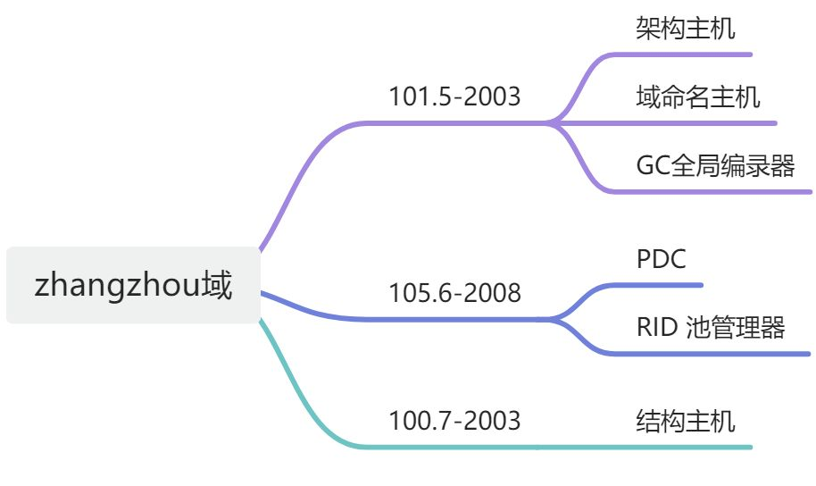
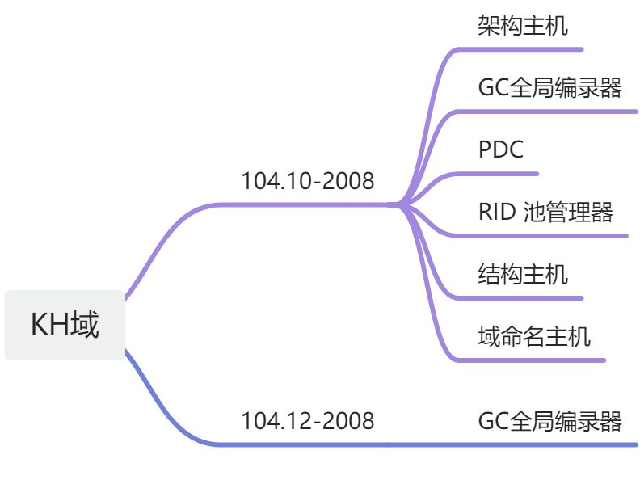

写在前面：这里所指 Windows域环境，统指Windows 2000/2003/2008环境。

Windows AD域环境中五大主机角色  
在Windows域多主机复制环境中，任何域控制器理论上都可以更改Active Directory中的任何对象。但实际上并非如此，某些AD功能不允许在多台DC上完成，否则可能会造成AD数据库一致性错误，这些特殊的功能称为“灵活单一主机操作”，常用FSMO来表示，拥有这些特殊功能执行能力的主机被称为FSMO角色主机。在Win2003 AD域中，FSMO有五种角色,分成两大类:  
Forest 森林级别(在整个林中只能有一台DC拥有访问主机角色)  
1：架构主机 (Schema Master)  
2：域命名主机 (Domain Naming Master)  
Domain域级别(在域中只有一台DC拥有该角色)  
3：PDC模拟器(PDC Emulator)  
4：角色主机/RID主机 (RID Master)  
5：基础架构主机 (Infrastructure Master)  
1：架构主机  
控制活动目录整个林中所有对象和属性的定义，具有架构主机角色的DC是可以更新目录架构的唯一 DC。这些架构更新会从架构主机复制到目录林中的所有其它域控制器中。架构主机是基于目录林的，整个目录林中只有一个架构主机。  
2：域命名主机  
向目录林中添加新域。  
从目录林中删除现有的域。  
添加或删除描述外部目录的交叉引用对象.  
3：PDC模拟器  
向后兼容低级客户端和服务器，担任NT系统中PDC角色  
时间同步服务源，作为本域权威时间服务器，为本域中其它DC以及客户机提供时间同步服务，林中根域的PDC模拟器又为其它域PDC模拟器提供时间同步!  
密码最终验证服务器，当一用户在本地DC登录，而本地DC验证本地用户输入密码无效时，本地DC会查询PDC模拟器，询问密码是否正确。  
首选的组策略存放位置，组策略对象(GPO)由两部分构成：GPT和GPC，其中GPC存放在AD数据库中，GPT默认存放PDC模拟器在\\windows\sysvol\sysvol\<domainname>目录下，然后通过DFS复制到本域其它DC中。name域主机浏览器，提供通过网上邻居查看域环境中所有主机的功能  
4：主机角色：RID主机  
Windows域环境中，所有的安全主体都有SID，SID由域SID+序列号组合而成，后者称为“相对ID”(Relative ID,RID),在Windows 域环境中，由于任何DC都可以创建安全主体，为保证整个域中每个DC所创建的安全主体对应的SID在整个域范围唯一性，设立该主机角色，负责向其它DC分配RID池(默认一次性分配500个)，所有非RID主机在创建安全实体时，都从分配给的RID池中分配RID，以保证SID不会发生冲突! 当非RID主机中分配的RID池使用到80%时，会继续RID主机，申请分配下一个RID地址池!  
5：基础架构主机  
基础结构主机的作用是负责对跨域对象引用进行更新，以确保所有域间操作对象的一致性。  
基础架构主机工作机制是定期会对没有保存在本机的引用对象信息，而对于GC来说，会保存当前林中所有对象信息。如果基础架构主机与GC在同一台机，基础架构主机就不会更新到任何对象。所以在多域情况下，强烈建议不要将基础架构主机设为GC。  
二：操作主机角色放置优化配置建议  
默认情况下，架构主机和域命名主机角色是在根域的第一台DC上，而PDC模拟器，RID主机和基础结构主机默认放置在当前域的第一台DC上。特别是在单域环境中，按默认安装，第一台DC会同时拥有这五种FSMO操作主机角色。万一这台DC损坏，会对域环境造成极大风险!  
常见的操作主机角色放置建议如下：  
1：架构主机：拥有架构主机角色的DC不需要高性能，因为在实际环境中不会经常对Schema进行操作的，除非是经常会对Schema进行扩展，不过这种情况非常的少。但要保证可用性，否则在安装Exchange等会扩展AD架构的软件时会出错。  
2：域命名主机：对占有域命名主机的DC也不需要高性能，在实际环境中也不会经常在森林里添加或者删除域的。但要保证高可用性是有必要的，以保证在添加删除当前林中域时可以使用。  
一般建议由同一台DC承担架构主机与域域命名主机角色，并由GC放置在同一台DC中。  
3：PDC模拟器：从上述PDC功能中可以看出，PDC模拟器是FSMO五种角色里任务最重的，必须保持拥有PDC的DC有高性能和高可用性。  
4：RID主机：对于占有RID Master的域控制器，没有必要一定要求高性能，因为给其它DC分配RID池的操作不是经常性发生，但要求高可用性，否则在添加用户时出错。  
5：基础架构主机：对于单域环境，基础架构主机实际上不起作用，因为基础架构主机主要作用是对跨域对象引用进行更新，对于单域，不存在跨域对象的更新。基础架构主机对性能和可用性方面的要求较低。  
PDC 和 RID不建议 和GC放置在同一台DC中  
三：标准图形界面查看和更改操作主机角色的方法  
1：查看和更改架构Schema Master主机角色：  
步骤：注册：regsvr32 schmmgmt 在MMC中添加AD架构管理单元打开MMC控制台，选中“Active Directory架构”击“右键”，选择“操作主机”  
打开更改架构页面后,点击"更改"就可以进行架构主机角色的更改  
2.查看和更改PDC模拟器,RID主机以及基础结构主机  
步骤：开始-设置-控制面板-管理工具-Active Directory用户和计算机选定当前域名，右键单击，选择“操作主机”  
在打开的页面中，通过点击“更改”按钮就可以对RID主机，PDC模拟器以及基础结构主机角色进行更改  
3.查看和更改域命名主机角色  
步骤：点击“开始-设置-控制面板-管理工具-Active Directory域和信任关系”: 选中“Active Directory域和信任关系”，右键单击，选择“操作主机”  
在打开的窗口中，点击“更改”按钮就可以实现对域命名主机角色进行更改

  
C:\Windows\System32>netdom query FSMO  
Schema masterroot-dc1.teltong.corp  
Domain naming masterroot-dc1.teltong.corp  
PDCwx-dc2.sh.teltong.corp  
RID pool managerwx-dc2.sh.teltong.corp  
Infrastructure masterwx-dc2.sh.teltong.corp  
The command completed successfully.

修改之后 

C:\Windows\System32>netdom query FSMO  
Schema masterroot-dc1.teltong.corp  
Domain naming masterroot-dc1.teltong.corp  
PDCwx-dc1.sh.teltong.corp  
RID pool managerwx-dc1.sh.teltong.corp  
Infrastructure masterwx-dc2.sh.teltong.corp  
The command completed successfully.

附：GC（Global Catalog）是一台DC，它是一台特殊的DC，它存储森林中所有对象部分只读信息的特殊DC。在森林可以有多台GC，全局编录是一数据库，它包含了在活动目录中所有对象连续请求信息的子集，例如用户登录的ID等。  
GC的主要作用有：1、存储森林对象的信息副本。2、存储能用组成员身份信息。3、提高用户主体（UPN）名称身份验证信息。4、验证林内的对象参考。  
GC正常工作时要用3268、3269（SSL），注意防火墙打开此端口。

zhangzhou域控现状

