# 1.关闭防火墙和设置远程桌面的服务端口和关闭windows自动更新和设置ntp
```shell
@echo off
setlocal enabledelayedexpansion

REM --- 获取操作系统的版本名称 ---
for /f "tokens=2 delims==" %%i in ('wmic os get Caption /value') do set osCaption=%%i
echo 操作系统版本: "!osCaption!"
echo !osCaption! | findstr /i 2016
echo !osCaption! | findstr /i 2019
echo !osCaption! | findstr /i 2022

REM --- 判断操作系统版本并设置计算机名 ---
if "!osCaption!"=="Microsoft Windows Server 2016 Standard" (
    set newComputerName=2016-template
) else if "!osCaption!"=="Microsoft Windows Server 2019 Standard" (
    set newComputerName=2019-template
) else if "!osCaption!"=="Microsoft Windows Server 2022 Standard" (
    set newComputerName=2022-template
) else (
    REM --- 检查操作系统版本是否包含特定的字符串 ---
    echo !osCaption! | find "2016" >nul
    if !errorlevel! equ 0 (
        set newComputerName=2016-template
    ) else (
        echo !osCaption! | find "2019" >nul
        if !errorlevel! equ 0 (
            set newComputerName=2019-template
        ) else (
            echo !osCaption! | find "2022" >nul
            if !errorlevel! equ 0 (
                set newComputerName=2022-template
            ) else (
                echo 未识别的操作系统版本: !osCaption!
                pause
                exit /b
            )
        )
    )
)


REM --- 修改计算机名 ---
echo 修改计算机名为 "%newComputerName%"...
wmic computersystem where caption="%COMPUTERNAME%" rename "%newComputerName%"

REM --- 查看防火墙状态 ---
echo 查看防火墙状态...
netsh advfirewall show allprofiles state

REM --- 关闭防火墙 ---
echo 关闭防火墙...
netsh advfirewall set allprofiles state off

REM --- 启用远程桌面并设置服务为自动启动 ---
echo 启用远程桌面...
reg add "HKEY_LOCAL_MACHINE\SYSTEM\CurrentControlSet\Control\Terminal Server" /v fDenyTSConnections /t REG_DWORD /d 0 /f

REM --- 设置远程桌面服务为自动启动 ---
echo 设置远程桌面服务为自动启动...
sc config TermService start= auto

REM --- 允许远程连接到此计算机 ---
echo 允许远程连接到此计算机...
reg add "HKEY_LOCAL_MACHINE\SYSTEM\CurrentControlSet\Control\Terminal Server" /v fAllowToGetHelp /t REG_DWORD /d 1 /f

REM --- 允许远程连接到此计算机，仅允许使用网络级别身份验证的远程桌面的计算机连接 ---
echo 允许远程连接到此计算机，仅允许使用网络级别身份验证的远程桌面的计算机连接...
reg add "HKEY_LOCAL_MACHINE\SYSTEM\CurrentControlSet\Control\Terminal Server\WinStations\RDP-Tcp" /v UserAuthentication /t REG_DWORD /d 1 /f

REM --- 查看第一个远程桌面服务端口 ---
set registryPath1=HKEY_LOCAL_MACHINE\SYSTEM\CurrentControlSet\Control\Terminal Server\WinStations\RDP-Tcp
set registryName1=PortNumber

echo 查看第一个远程桌面服务端口...
for /f "tokens=2*" %%i in ('reg query "%registryPath1%" /v "%registryName1%" ^| find "%registryName1%"') do (
    set /a remoteDesktopPortDecimal1=%%j
)
echo 第一个远程桌面服务端口: %remoteDesktopPortDecimal1%

REM --- 修改第一个远程桌面服务端口为 33189 ---
set newPort1=33189

echo 修改第一个远程桌面服务端口为 %newPort1%...
reg add "%registryPath1%" /v "%registryName1%" /t REG_DWORD /d %newPort1% /f

REM --- 查看第二个远程桌面服务端口 ---
set registryPath2=HKEY_LOCAL_MACHINE\SYSTEM\CurrentControlSet\Control\Terminal Server\Wds\rdpwd\Tds\tcp
set registryName2=PortNumber

echo 查看第二个远程桌面服务端口...
for /f "tokens=2*" %%i in ('reg query "%registryPath2%" /v "%registryName2%" ^| find "%registryName2%"') do (
    set /a remoteDesktopPortDecimal2=%%j
)
echo 第二个远程桌面服务端口: %remoteDesktopPortDecimal2%

REM --- 修改第二个远程桌面服务端口为 33189 ---
set newPort2=33189

echo 修改第二个远程桌面服务端口为 %newPort2%...
reg add "%registryPath2%" /v "%registryName2%" /t REG_DWORD /d %newPort2% /f

REM --- 重启远程桌面服务 ---
echo 重启远程桌面服务...
net stop TermService
net start TermService

REM --- 关闭 Windows 自动更新服务 ---
echo 关闭 Windows 自动更新服务...
sc config wuauserv start= disabled
sc stop wuauserv

REM --- 设置 NTP 服务器 ---
echo 设置 NTP 服务器为 ntp.xxx.com...
w32tm /config /manualpeerlist:"ntp.kehua.com" /syncfromflags:manual /reliable:YES /update
w32tm /resync

REM --- 暂停以便观察输出 ---
pause

```

# 2.使用vmware的自定义规范刷新SID
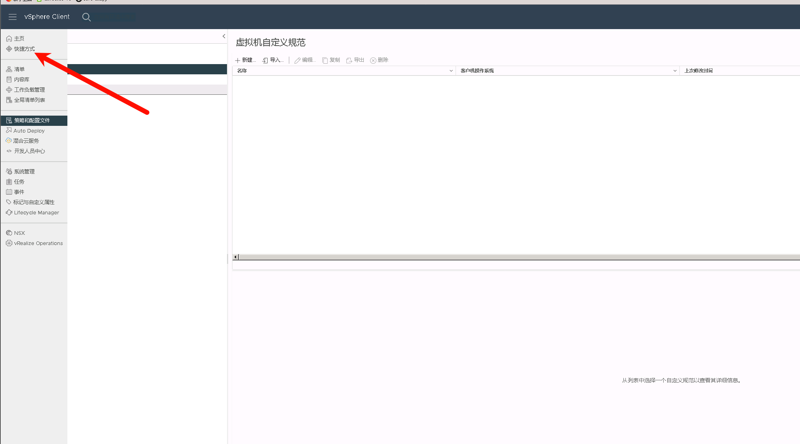


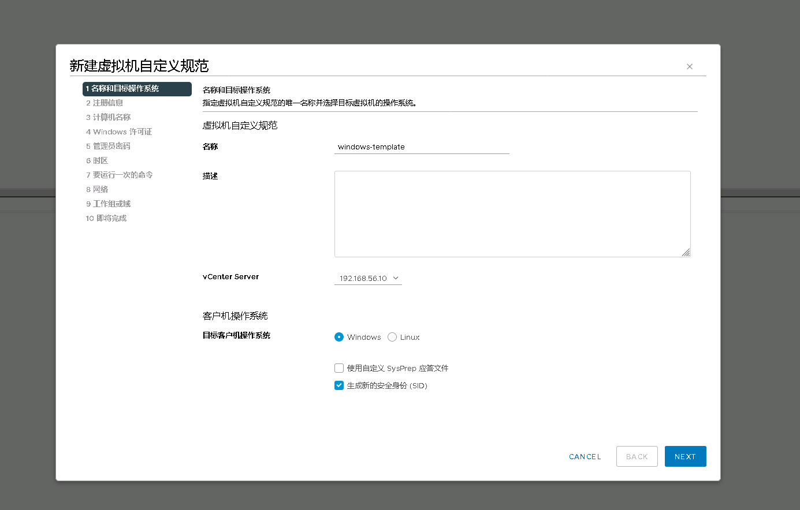

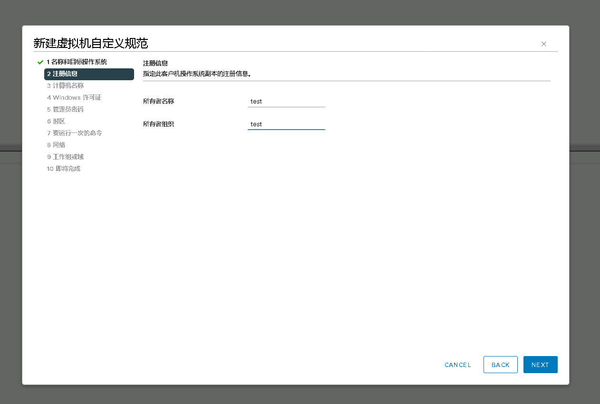

注意虚拟机名称不要超过15个字符，超过 会被截断

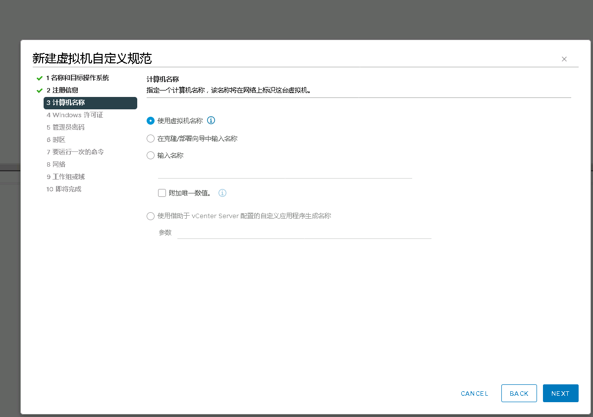

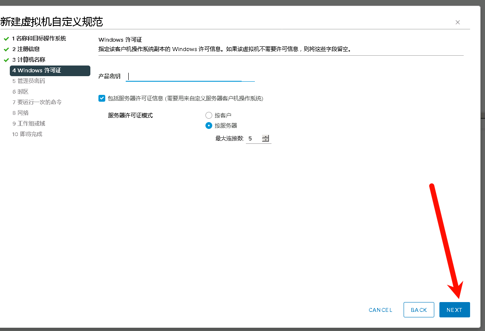

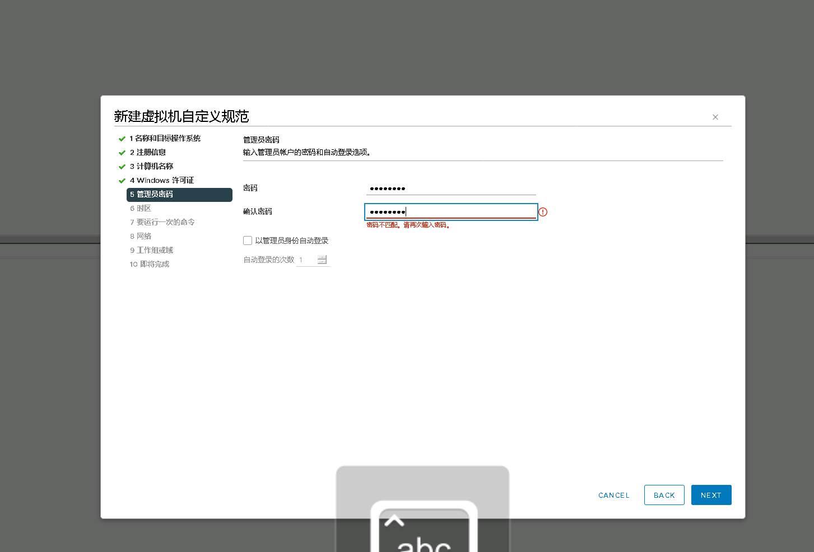

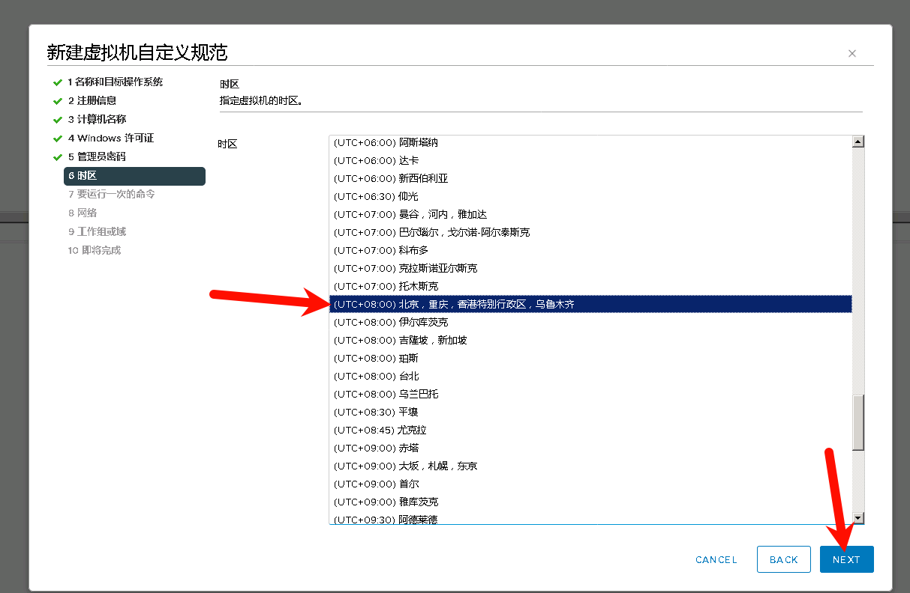

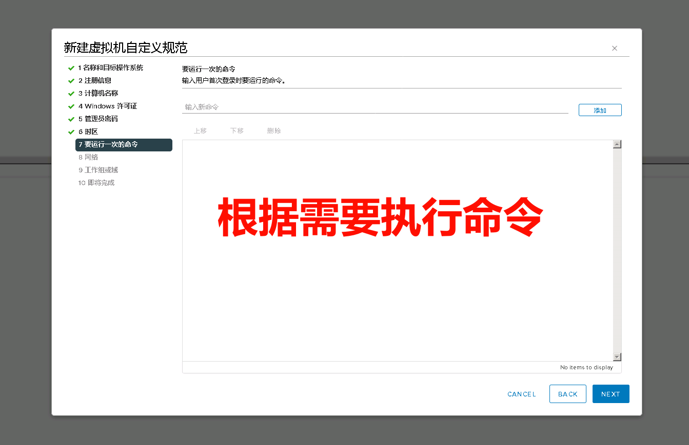

根据需要自定义网卡设置，可以通过vmware自动化脚本指定时设置

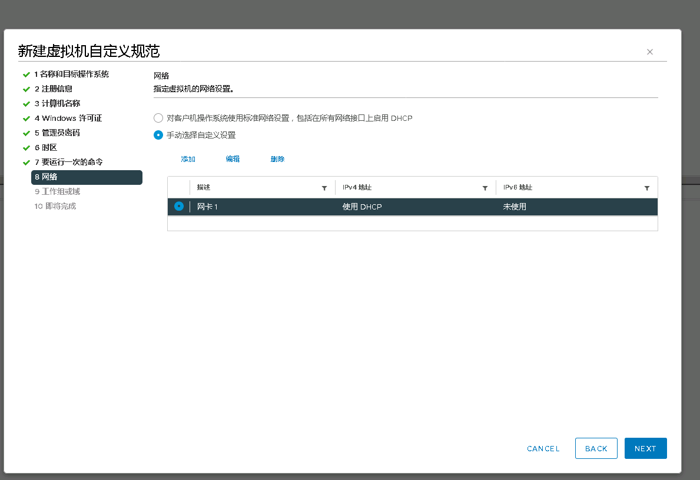

默认不加域

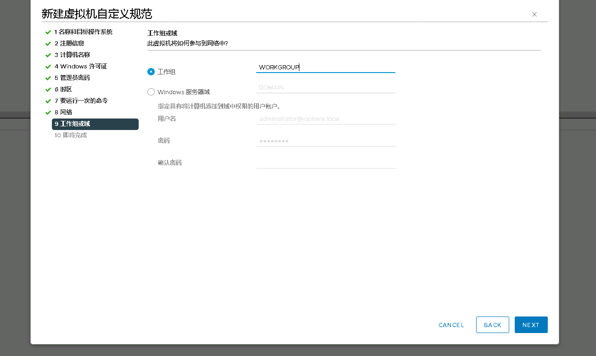

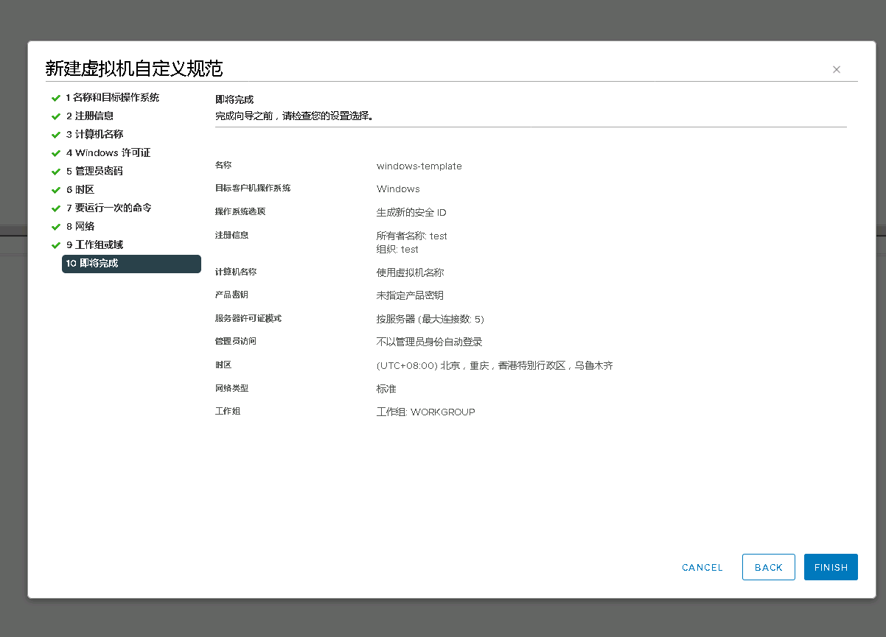

