# <font style="color:#33495D;">日志</font>
## <font style="color:#33495D;">错误日志</font>
<font style="color:#33495D;">错误日志是 MySQL 中最重要的日志之一，它记录了当 mysqld 启动和停止时，以及服务器在运行过程中发生任何严重错误时的相关信息。当数据库出现任何故障导致无法正常使用时，建议首先查看此日  志。</font>

<font style="color:#33495D;">该日志是默认开启的，默认存放目录 /var/log/，默认的日志文件名为 mysqld.log 。查看日志位置：</font>


```sql
show variables like '%log_error%';
```

## <font style="color:#33495D;">二进制日志</font>
### <font style="color:#33495D;">介绍</font>
<font style="color:#33495D;">二进制日志（BINLOG）记录了所有的   DDL（数据定义语言）语句和   DML（数据操纵语言）语句，但不包括数据查询（SELECT、SHOW）语句。</font>

<font style="color:#33495D;">作用：①. 灾难时的数据恢复；②.  MySQL的主从复制。在MySQL8版本中，默认二进制日志是开启着的，涉及到的参数如下：</font>

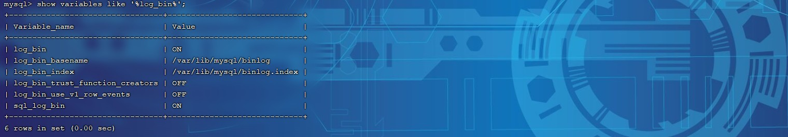


```javascript
show variables like '%log_bin%'; 
```

<font style="color:#33495D;">参数说明：</font>

<font style="color:#33495D;">log_bin_basename：当前数据库服务器的binlog日志的基础名称(前缀)，具体的binlog文  件名需要再该basename的基础上加上编号(编号从000001开始)。log_bin_index：binlog的索引文件，里面记录了当前服务器关联的binlog文件有哪些。</font>

### <font style="color:#33495D;">格式</font>
<font style="color:#33495D;">MySQL服务器中提供了多种格式来记录二进制日志，具体格式及特点如下：</font>

| **<font style="color:rgb(51, 73, 93);">日志格式</font>** | **<font style="color:rgb(51, 73, 93);">含义</font>** |
| --- | --- |
| <br/><font style="color:rgb(51, 73, 93);">STATEMENT</font> | <font style="color:rgb(51, 73, 93);">基于SQL语句的日志记录，记录的是SQL语句，对数据进行修改的SQL都会记录在 日志文件中。</font> |
| <font style="color:rgb(51, 73, 93);">ROW</font> | <font style="color:rgb(51, 73, 93);">基于行的日志记录，记录的是每一行的数据变更。（默认）</font> |
| <br/><font style="color:rgb(51, 73, 93);">MIXED</font> | <font style="color:rgb(51, 73, 93);">混合了STATEMENT和ROW两种格式，默认采用STATEMENT，在某些特殊情况下会 自动切换为ROW进行记录。</font> |


```javascript
show variables like '%binlog_format%'; 
```

<font style="color:#33495D;">如果我们需要配置二进制日志的格式，只需要在 /etc/my.cnf 中配置 binlog_format 参数即可。</font>

### <font style="color:#33495D;">查看</font>
<font style="color:#33495D;">由于日志是以二进制方式存储的，不能直接读取，需要通过二进制日志查询工具  mysqlbinlog  来查看，具体语法：</font>

```javascript
mysqlbinlog [ 参数选项 ] logfilename
参数选项：
-d 指定数据库名称，只列出指定的数据库相关操作。
-o 忽略掉日志中的前n行命令。
-v 将行事件(数据变更)重构为SQL语句
-vv 将行事件(数据变更)重构为SQL语句，并输出注释信息
```

### <font style="color:#33495D;">删除</font>
<font style="color:#33495D;">对于比较繁忙的业务系统，每天生成的binlog数据巨大，如果长时间不清除，将会占用大量磁盘空  间。可以通过以下几种方式清理日志：</font>

| **<font style="color:rgb(51, 73, 93);">指令</font>** | **<font style="color:rgb(51, 73, 93);">含义</font>** |
| --- | --- |
| <br/><font style="color:rgb(51, 73, 93);">reset master</font> | <font style="color:rgb(51, 73, 93);">删除全部 binlog 日志，删除之后，日志编号，将从 binlog.000001重新开始</font> |
| <font style="color:rgb(51, 73, 93);">purge master logs to 'binlog.*'</font> | <br/><font style="color:rgb(51, 73, 93);">删除 * 编号之前的所有日志</font> |
| <font style="color:rgb(51, 73, 93);">purge master logs before 'yyyy-mm-dd hh24:mi:ss'</font> | <font style="color:rgb(51, 73, 93);">删除日志为 "yyyy-mm-dd hh24:mi:ss" 之前产生的所有日志</font> |


<font style="color:#33495D;">也可以在mysql的配置文件中配置二进制日志的过期时间，设置了之后，二进制日志过期会自动删除。</font>

```javascript
show variables like '%binlog_expire_logs_seconds%';
```

## <font style="color:#33495D;">查询日志</font>
<font style="color:#33495D;">查询日志中记录了客户端的所有操作语句，而二进制日志不包含查询数据的SQL语句。默认情况下，  查询日志是未开启的。</font>


<font style="color:#33495D;">如果需要开启查询日志，可以修改MySQL的配置文件 /etc/my.cnf 文件，添加如下内容：</font>

```javascript
#该选项用来开启查询日志 ， 可选值 ： 0 或者 1 ； 0 代表关闭， 1 代表开启
general_log=1
#设置日志的文件名 ， 如果没有指定， 默认的文件名为 host_name.log
general_log_file=mysql_query.log
```

<font style="color:#33495D;">开启了查询日志之后，在MySQL的数据存放目录，也就是 /var/lib/mysql/ 目录下就会出现mysql_query.log 文件。之后所有的客户端的增删改查操作都会记录在该日志文件之中，长时间运行后，该日志文件将会非常大。</font>

## <font style="color:#33495D;">慢查询日志</font>
<font style="color:#33495D;">慢查询日志记录了所有执行时间超过参数 long_query_time 设置值并且扫描记录数不小于</font>

<font style="color:#33495D;">min_examined_row_limit 的所有的SQL语句的日志，默认未开启。long_query_time 默认为</font>

<font style="color:#33495D;">10 秒，最小为 0， 精度可以到微秒。</font>

<font style="color:#33495D;">如果需要开启慢查询日志，需要在MySQL的配置文件 /etc/my.cnf 中配置如下参数：</font>

```javascript
#慢查询日志
slow_query_log=1
#执行时间参数
long_query_time=2
```

<font style="color:#33495D;">默认情况下，不会记录管理语句，也不会记录不使用索引进行查找的查询。可以使用log_slow_admin_statements和   更改此行为   log_queries_not_using_indexes，如下所述。</font>

```javascript
#记录执行较慢的管理语句
log_slow_admin_statements =1
#记录执行较慢的未使用索引的语句
log_queries_not_using_indexes = 1
```

<font style="color:#777777;">上述所有的参数配置完成之后，都需要重新启动MySQL服务器才可以生效。</font>

# <font style="color:#33495D;">主从复制</font>
## <font style="color:#33495D;">概述</font>
<font style="color:#33495D;">主从复制是指将主数据库的 DDL 和 DML 操作通过二进制日志传到从库服务器中，然后在从库上对这些日志重新执行（也叫重做），从而使得从库和主库的数据保持同步。</font>

<font style="color:#33495D;">MySQL支持一台主库同时向多台从库进行复制，   从库同时也可以作为其他从服务器的主库，实现链状复制。</font>


<font style="color:#33495D;">MySQL 复制的优点主要包含以下三个方面：</font>

<font style="color:#33495D;">主库出现问题，可以快速切换到从库提供服务。实现读写分离，降低主库的访问压力。</font>

<font style="color:#33495D;">可以在从库中执行备份，以避免备份期间影响主库服务。</font>

## <font style="color:#33495D;">原理</font>
<font style="color:#33495D;">MySQL主从复制的核心就是 二进制日志，具体的过程如下：</font>


<font style="color:#33495D;">从上图来看，复制分成三步：</font>

1. <font style="color:#33495D;">Master 主库在事务提交时，会把数据变更记录在二进制日志文件 Binlog 中。</font>
2. <font style="color:#33495D;">从库读取主库的二进制日志文件 Binlog ，写入到从库的中继日志 Relay Log 。</font>
3. <font style="color:#33495D;">slave重做中继日志中的事件，将改变反映它自己的数据。</font>

## <font style="color:#33495D;">搭建</font>
### <font style="color:#33495D;">准备</font>
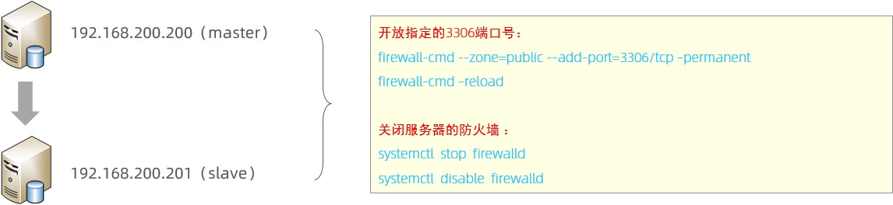


<font style="color:#33495D;">准备好两台服务器之后，在上述的两台服务器中分别安装好MySQL，并完成基础的初始化准备(安装、  密码配置等操作)工作。 其中：</font>

            1. <font style="color:#33495D;">作为主服务器master</font>
            2. <font style="color:#33495D;">作为从服务器slave</font>

### <font style="color:#33495D;">主库配置</font>
1. 修改配置文件 /etc/my.cnf

```javascript
#mysql 服务ID，保证整个集群环境中唯一，取值范围：1 – 232-1，默认为1
server-id=1
#是否只读,1 代表只读, 0 代表读写
read-only=0
#忽略的数据, 指不需要同步的数据库
#binlog-ignore-db=mysql
#指定同步的数据库
#binlog-do-db=db01
```

2. 重启MySQL服务器

```javascript
systemctl restart mysqld 1
```

3. 登录mysql，创建远程连接的账号，并授予主从复制权限

```javascript
#创建itcast用户，并设置密码，该用户可在任意主机连接该MySQL服务
CREATE USER 'itcast'@'%' IDENTIFIED WITH mysql_native_password BY 'Root@123456'
;
#为 'itcast'@'%' 用户分配主从复制权限
GRANT REPLICATION SLAVE ON *.* TO 'itcast'@'%';
```

4. 通过指令，查看二进制日志坐标

```javascript
show master status ; 
```


<font style="color:#33495D;">字段含义说明：</font>

<font style="color:#33495D;">file : 从哪个日志文件开始推送日志文件position ：  从哪个位置开始推送日志binlog_ignore_db : 指定不需要同步的数据库</font>

### <font style="color:#33495D;">从库配置</font>
1. 修改配置文件 /etc/my.cnf

```javascript
#mysql 服务ID，保证整个集群环境中唯一，取值范围：1 – 2^32-1，和主库不一样即可
server-id=2
#是否只读,1 代表只读, 0 代表读写
read-only=1
```

2. 重新启动MySQL服务

```javascript
systemctl restart mysqld 1
```

3. 登录mysql，设置主库配置

```javascript
CHANGE REPLICATION SOURCE TO SOURCE_HOST='192.168.200.200', SOURCE_USER='itcast',
SOURCE_PASSWORD='Root@123456', SOURCE_LOG_FILE='binlog.000004',
SOURCE_LOG_POS=663;
```


<font style="color:rgb(52,73,94);">上述是8.0.23中的语法。如果mysql是 8.0.23 之前的版本，执行如下SQL：</font>

```javascript
CHANGE MASTER TO MASTER_HOST='192.168.200.200', MASTER_USER='itcast',
MASTER_PASSWORD='Root@123456', MASTER_LOG_FILE='binlog.000004',
MASTER_LOG_POS=663;
```


| **<font style="color:rgb(51, 73, 93);">参数名</font>** | **<font style="color:rgb(51, 73, 93);">含义</font>** | **<font style="color:rgb(51, 73, 93);">8.0.23之前</font>** |
| --- | --- | --- |
| <font style="color:rgb(51, 73, 93);">SOURCE_HOST</font> | <font style="color:rgb(51, 73, 93);">主库IP地址</font> | <font style="color:rgb(51, 73, 93);">MASTER_HOST</font> |
| <font style="color:rgb(51, 73, 93);">SOURCE_USER</font> | <font style="color:rgb(51, 73, 93);">连接主库的用户名</font> | <font style="color:rgb(51, 73, 93);">MASTER_USER</font> |
| <font style="color:rgb(51, 73, 93);">SOURCE_PASSWORD</font> | <font style="color:rgb(51, 73, 93);">连接主库的密码</font> | <font style="color:rgb(51, 73, 93);">MASTER_PASSWORD</font> |
| <font style="color:rgb(51, 73, 93);">SOURCE_LOG_FILE</font> | <font style="color:rgb(51, 73, 93);">binlog日志文件名</font> | <font style="color:rgb(51, 73, 93);">MASTER_LOG_FILE</font> |
| <font style="color:rgb(51, 73, 93);">SOURCE_LOG_POS</font> | <font style="color:rgb(51, 73, 93);">binlog日志文件位置</font> | <font style="color:rgb(51, 73, 93);">MASTER_LOG_POS</font> |


4. <font style="color:rgb(52,73,94);">开启同步操作</font>

```javascript
start replica ; #8.0.22之后 
start slave ; #8.0.22之前 
```

5. 查看主从同步状态

```javascript
show replica status ; #8.0.22之后 
show slave status ; #8.0.22之前
```


### <font style="color:#33495D;">测试</font>
1. 在主库 192.168.200.200 上创建数据库、表，并插入数据

```javascript
create database db01;
use db01;
create table tb_user(
id int(11) primary key not null auto_increment,
name varchar(50) not null,
sex varchar(1)
)engine=innodb default charset=utf8mb4;
insert into tb_user(id,name,sex) values(null,'Tom', '1'),(null,'Trigger','0'),
(null,'Dawn','1');
```

2. 在从库 192.168.200.201 中查询数据，验证主从是否同步

# <font style="color:#33495D;">分库分表</font>
## <font style="color:#33495D;">介绍</font>
### <font style="color:#33495D;">问题分析</font>
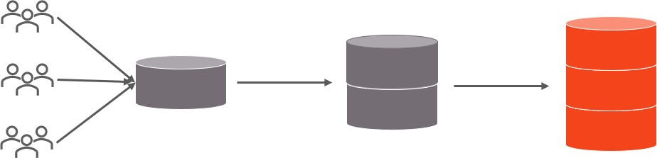

<font style="color:#33495D;">随着互联网及移动互联网的发展，应用系统的数据量也是成指数式增长，若采用单数据库进行数据存  储，存在以下性能瓶颈：</font>

	<font style="color:#33495D;">IO瓶颈：热点数据太多，数据库缓存不足，产生大量磁盘IO，效率较低。   请求数据太多，带宽不够，网络IO瓶颈。</font>

	<font style="color:#33495D;">CPU瓶颈：排序、分组、连接查询、聚合统计等SQL会耗费大量的CPU资源，请求数太多，CPU出  现瓶颈。</font>


<font style="color:#33495D;">为了解决上述问题，我们需要对数据库进行分库分表处理。</font>


<font style="color:#33495D;">分库分表的中心思想都是将数据分散存储，使得单一数据库/表的数据量变小来缓解单一数据库的性能  问题，从而达到提升数据库性能的目的。</font>


### <font style="color:#33495D;">拆分策略</font>
<font style="color:#33495D;">分库分表的形式，主要是两种：垂直拆分和水平拆分。而拆分的粒度，一般又分为分库和分表，所以组  成的拆分策略最终如下：</font>


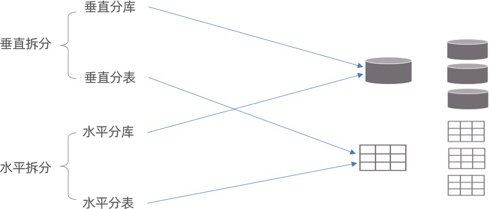


### <font style="color:#33495D;">垂直拆分</font>
<font style="color:#33495D;">垂直分库</font>

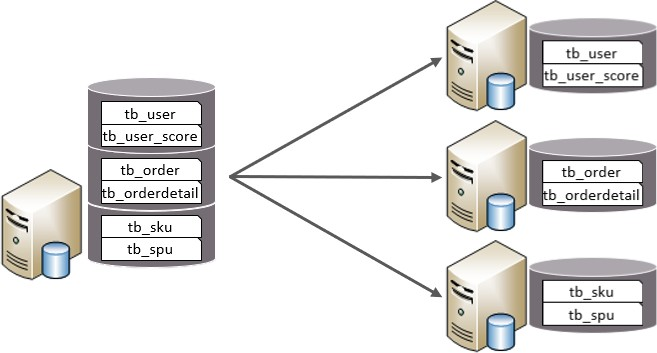

<font style="color:#33495D;">垂直分库：以表为依据，根据业务将不同表拆分到不同库中。特点：</font>

<font style="color:#33495D;">每个库的表结构都不一样。每个库的数据也不一样。所有库的并集是全量数据。</font>


<font style="color:#33495D;">垂直分表</font>

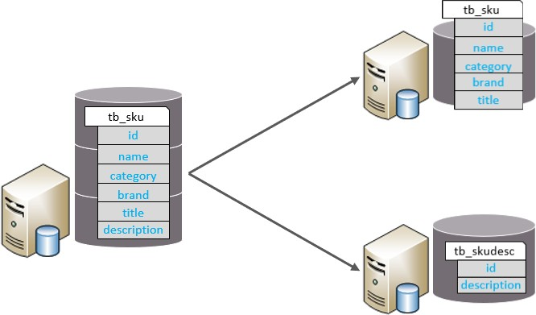


<font style="color:#33495D;">垂直分表：以字段为依据，根据字段属性将不同字段拆分到不同表中。特点：</font>

<font style="color:#33495D;">每个表的结构都不一样。</font>

<font style="color:#33495D;">每个表的数据也不一样，一般通过一列（主键/外键）关联。所有表的并集是全量数据。</font>


### <font style="color:#33495D;">水平拆分</font>
<font style="color:#33495D;">水平分库</font>

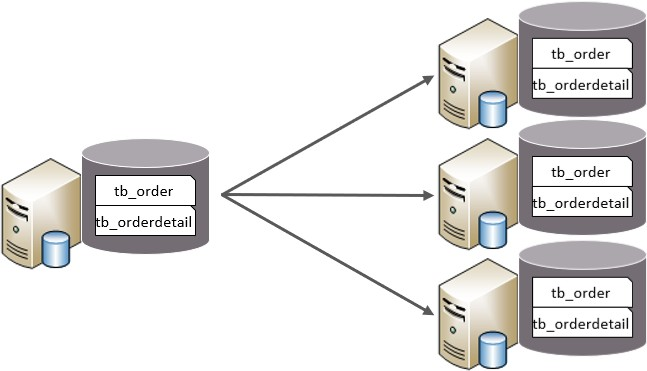

<font style="color:#33495D;">水平分库：以字段为依据，按照一定策略，将一个库的数据拆分到多个库中。特点：</font>


<font style="color:#33495D;">每个库的表结构都一样。每个库的数据都不一样。所有库的并集是全量数据。</font>


<font style="color:#33495D;">水平分表</font>

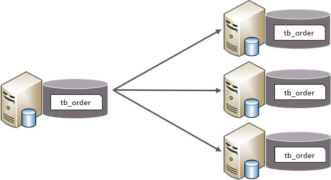


<font style="color:#33495D;">水平分表：以字段为依据，按照一定策略，将一个表的数据拆分到多个表中。特点：</font>

<font style="color:#33495D;">每个表的表结构都一样。每个表的数据都不一样。所有表的并集是全量数据。</font>

<font style="color:#777777;">在业务系统中，为了缓解磁盘IO及CPU的性能瓶颈，到底是垂直拆分，还是水平拆分；具体是分  库，还是分表，都需要根据具体的业务需求具体分析。</font>

### <font style="color:#33495D;">实现技术</font>
<font style="color:#33495D;">shardingJDBC：基于AOP原理，在应用程序中对本地执行的SQL进行拦截，解析、改写、路由处  理。需要自行编码配置实现，只支持java语言，性能较高。                                        MyCat：数据库分库分表中间件，不用调整代码即可实现分库分表，支持多种语言，性能不及前    者。</font>

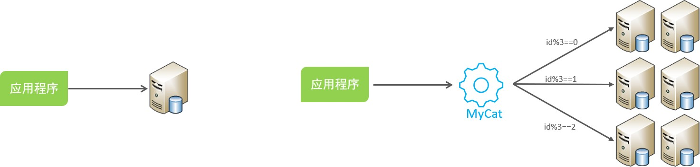

<font style="color:#33495D;">本次课程，我们选择了是MyCat数据库中间件，通过MyCat中间件来完成分库分表操作。</font>


## <font style="color:#33495D;">MyCat概述</font>
### <font style="color:#33495D;">介绍</font>
<font style="color:#33495D;">Mycat是开源的、活跃的、基于Java语言编写的MySQL数据库中间件。可以像使用mysql一样来使用mycat，对于开发人员来说根本感觉不到mycat的存在。</font>

<font style="color:#33495D;">开发人员只需要连接MyCat即可，而具体底层用到几台数据库，每一台数据库服务器里面存储了什么数  据，都无需关心。 具体的分库分表的策略，只需要在MyCat中配置即可。</font>

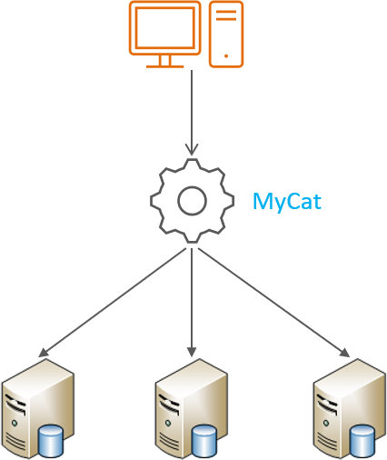


<font style="color:#33495D;">优势：</font>

<font style="color:#33495D;">性能可靠稳定强大的技术团队体系完善</font>

<font style="color:#33495D;">社区活跃</font>

### <font style="color:#33495D;">下载</font>
<font style="color:#33495D;">下载地址： </font>[**<font style="color:#41B982;">http://dl.mycat.org.cn/</font>**](http://dl.mycat.org.cn/)

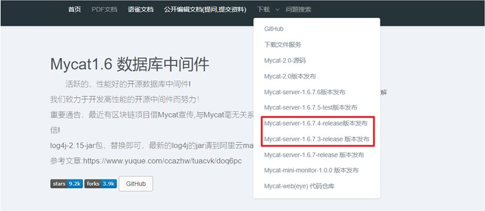


### <font style="color:#33495D;">安装</font>
<font style="color:#33495D;">Mycat是采用java语言开发的开源的数据库中间件，支持Windows和Linux运行环境，下面介绍MyCat的Linux中的环境搭建。我们需要在准备好的服务器中安装如下软件。</font>

<font style="color:#33495D;">MySQL </font>

<font style="color:#33495D;">JDK</font>

<font style="color:#33495D;">Mycat</font>

| **<font style="color:rgb(51, 73, 93);">服务器</font>** | **<font style="color:rgb(51, 73, 93);">安装软件</font>** | **<font style="color:rgb(51, 73, 93);">说明</font>** |
| --- | --- | --- |
| <font style="color:rgb(51, 73, 93);">192.168.200.210</font> | <font style="color:rgb(51, 73, 93);">JDK、Mycat</font> | <font style="color:rgb(51, 73, 93);">MyCat中间件服务器</font> |
| <font style="color:rgb(51, 73, 93);">192.168.200.210</font> | <font style="color:rgb(51, 73, 93);">MySQL</font> | <font style="color:rgb(51, 73, 93);">分片服务器</font> |
| <font style="color:rgb(51, 73, 93);">192.168.200.213</font> | <font style="color:rgb(51, 73, 93);">MySQL</font> | <font style="color:rgb(51, 73, 93);">分片服务器</font> |
| <font style="color:rgb(51, 73, 93);">192.168.200.214</font> | <font style="color:rgb(51, 73, 93);">MySQL</font> | <font style="color:rgb(51, 73, 93);">分片服务器</font> |


<font style="color:#33495D;">具体的安装步骤： 参考资料中提供的 《MyCat安装文档》即可，里面有详细的安装及配置步骤。</font>

### <font style="color:#33495D;">目录介绍</font>


<font style="color:#33495D;">bin : 存放可执行文件，用于启动停止mycat conf： 存 放 mycat 的 配 置 文 件    </font>

<font style="color:#33495D;">lib：存放mycat的项目依赖包（jar） </font>

<font style="color:#33495D;">logs：存放mycat的日志文件</font>

<font style="color:#33495D;">conf： 存 放 mycat 的 配 置 文 件     </font>

<font style="color:#33495D;">mycat conf： 存 放 mycat 的 配 置 文 件     </font>

### <font style="color:#33495D;">概念介绍</font>
<font style="color:#33495D;">在MyCat的整体结构中，分为两个部分：上面的逻辑结构、下面的物理结构。</font>

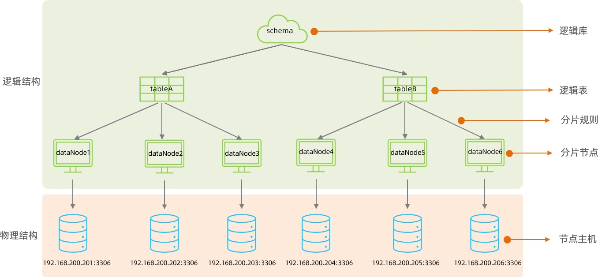

<font style="color:#33495D;">在MyCat的逻辑结构主要负责逻辑库、逻辑表、分片规则、分片节点等逻辑结构的处理，而具体的数据  存储还是在物理结构，也就是数据库服务器中存储的。</font>

<font style="color:#33495D;">在后面讲解MyCat入门以及MyCat分片时，还会讲到上面所提到的概念。</font>

## <font style="color:#33495D;">MyCat入门</font>
### <font style="color:#33495D;">需求</font>
<font style="color:#33495D;">由于 tb_order 表中数据量很大，磁盘IO及容量都到达了瓶颈，现在需要对 tb_order 表进行数据分片，分为三个数据节点，每一个节点主机位于不同的服务器上, 具体的结构，参考下图：</font>


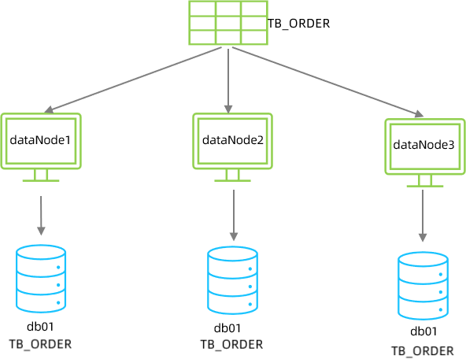

### <font style="color:#33495D;">环境准备</font>
<font style="color:#33495D;">准备3台服务器：</font>

<font style="color:#33495D;">192.168.200.210：MyCat中间件服务器，同时也是第一个分片服务器。</font>

            1. <font style="color:#33495D;">：第二个分片服务器。</font>
            2. <font style="color:#33495D;">：第三个分片服务器。</font>

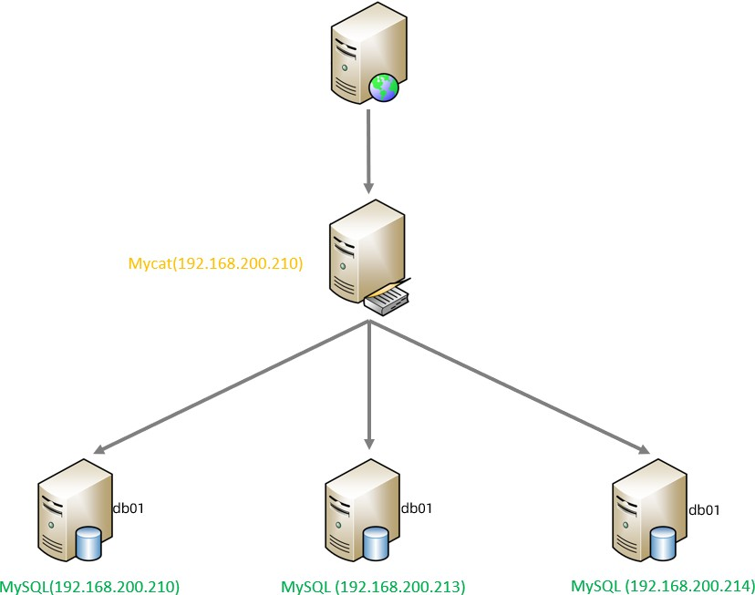

<font style="color:#33495D;">并且在上述3台数据库中创建数据库 db01 。</font>

### <font style="color:#33495D;">配置</font>
1. <font style="color:#33495D;">schema.xml</font>

<font style="color:#33495D;">在schema.xml中配置逻辑库、逻辑表、数据节点、节点主机等相关信息。具体的配置如下：</font>

```xml
<?xml version="1.0"?>
<!DOCTYPE mycat:schema SYSTEM "schema.dtd">
<mycat:schema xmlns:mycat="http://io.mycat/">
  <schema name="DB01" checkSQLschema="true" sqlMaxLimit="100">
    <table name="TB_ORDER" dataNode="dn1,dn2,dn3" rule="auto-sharding-long"
      />
  </schema>
  <dataNode name="dn1" dataHost="dhost1" database="db01" />
  <dataNode name="dn2" dataHost="dhost2" database="db01" />
  <dataNode name="dn3" dataHost="dhost3" database="db01" />
  <dataHost name="dhost1" maxCon="1000" minCon="10" balance="0"
    writeType="0" dbType="mysql" dbDriver="jdbc" switchType="1"
    slaveThreshold="100">
    <heartbeat>select user()</heartbeat>
    <writeHost host="master" url="jdbc:mysql://192.168.200.210:3306?
      useSSL=false&amp;serverTimezone=Asia/Shanghai&amp;characterEncoding=utf8"
      user="root" password="1234" />
  </dataHost>
  <dataHost name="dhost2" maxCon="1000" minCon="10" balance="0"
    writeType="0" dbType="mysql" dbDriver="jdbc" switchType="1"
    slaveThreshold="100">
    <heartbeat>select user()</heartbeat>
    <writeHost host="master" url="jdbc:mysql://192.168.200.213:3306?
      useSSL=false&amp;serverTimezone=Asia/Shanghai&amp;characterEncoding=utf8"
      user="root" password="1234" />
  </dataHost>
  <dataHost name="dhost3" maxCon="1000" minCon="10" balance="0"
    writeType="0" dbType="mysql" dbDriver="jdbc" switchType="1"
    slaveThreshold="100">
    <heartbeat>select user()</heartbeat>
    <writeHost host="master" url="jdbc:mysql://192.168.200.214:3306?
      useSSL=false&amp;serverTimezone=Asia/Shanghai&amp;characterEncoding=utf8"
      user="root" password="1234" />
  </dataHost>
</mycat:schema>
```


2. <font style="color:#33495D;">server.xml</font>

<font style="color:#33495D;">需要在server.xml中配置用户名、密码，以及用户的访问权限信息，具体的配置如下：</font>


```xml
<user name="root" defaultAccount="true">
<property name="password">123456</property>
<property name="schemas">DB01</property>
<!-- 表级 DML 权限设置 -->
<!--
<privileges check="true">
<schema name="DB01" dml="0110" >
<table name="TB_ORDER" dml="1110"></table>
</schema>
</privileges>
-->
</user>
<user name="user">
<property name="password">123456</property>
<property name="schemas">DB01</property>
<property name="readOnly">true</property>
</user>
```

<font style="color:#33495D;">上述的配置表示，定义了两个用户 root 和 user ，这两个用户都可以访问 DB01 这个逻辑库，访问密码都是123456，但是root用户访问DB01逻辑库，既可以读，又可以写，但是 user用户访问DB01逻辑库是只读的。</font>

### <font style="color:#33495D;">测试</font>
#### <font style="color:#33495D;">启动</font>
<font style="color:#33495D;">配置完毕后，先启动涉及到的3台分片服务器，然后启动MyCat服务器。切换到Mycat的安装目录，执  行如下指令，启动Mycat：</font>

```xml
#启动
bin/mycat start
#停止
bin/mycat stop
```

<font style="color:#33495D;">Mycat启动之后，占用端口号 8066。</font>

<font style="color:#33495D;">启动完毕之后，可以查看logs目录下的启动日志，查看Mycat是否启动完成。</font>

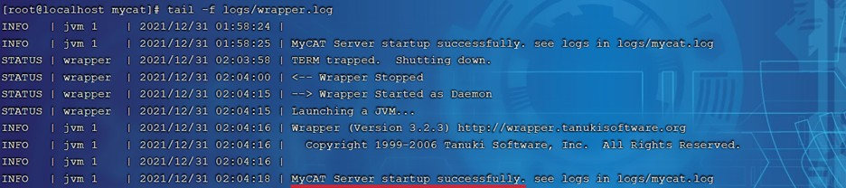

#### <font style="color:#33495D;">测试</font>
1. <font style="color:#33495D;">连接MyCat</font>

<font style="color:#33495D;">通过如下指令，就可以连接并登陆MyCat。</font>

```xml
mysql -h 192.168.200.210 -P 8066 -uroot -p123456
```

<font style="color:#33495D;">我们看到我们是通过MySQL的指令来连接的MyCat，因为MyCat在底层实际上是模拟了MySQL的协议。</font>

1. <font style="color:#33495D;">数据测试</font>

<font style="color:#33495D;">然后就可以在MyCat中来创建表，并往表结构中插入数据，查看数据在MySQL中的分布情况。</font>

```plsql
CREATE TABLE TB_ORDER (
  id BIGINT(20) NOT NULL,
  title VARCHAR(100) NOT NULL ,
  PRIMARY KEY (id)
) ENGINE=INNODB DEFAULT CHARSET=utf8 ;
INSERT INTO TB_ORDER(id,title) VALUES(1,'goods1');
INSERT INTO TB_ORDER(id,title) VALUES(2,'goods2');
INSERT INTO TB_ORDER(id,title) VALUES(3,'goods3');
INSERT INTO TB_ORDER(id,title) VALUES(1,'goods1');
INSERT INTO TB_ORDER(id,title) VALUES(2,'goods2');
INSERT INTO TB_ORDER(id,title) VALUES(3,'goods3');
INSERT INTO TB_ORDER(id,title) VALUES(5000000,'goods5000000');
INSERT INTO TB_ORDER(id,title) VALUES(10000000,'goods10000000');
INSERT INTO TB_ORDER(id,title) VALUES(10000001,'goods10000001');
INSERT INTO TB_ORDER(id,title) VALUES(15000000,'goods15000000');
INSERT INTO TB_ORDER(id,title) VALUES(15000001,'goods15000001');
```

<font style="color:#33495D;">经过测试，我们发现，在往 TB_ORDER 表中插入数据时：</font>

+ <font style="color:#33495D;">如果id的值在1-500w之间，数据将会存储在第一个分片数据库中。</font>
+ <font style="color:#33495D;">如果id的值在500w-1000w之间，数据将会存储在第二个分片数据库中。  </font>
+ <font style="color:#33495D;">如果id的值在1000w-1500w之间，数据将会存储在第三个分片数据库中。</font>
+ <font style="color:#33495D;">如果id的值超出1500w，在插入数据时，将会报错。</font>

<font style="color:#33495D;">为什么会出现这种现象，数据到底落在哪一个分片服务器到底是如何决定的呢？   这是由逻辑表配置时的一个参数  rule  决定的，而这个参数配置的就是分片规则，关于分片规则的配置，在后面的课程中会详细讲解。</font>

## <font style="color:#33495D;">MyCat配置</font>
### <font style="color:#33495D;">schema.xml</font>
<font style="color:#33495D;">schema.xml 作为MyCat中最重要的配置文件之一 , 涵盖了MyCat的逻辑库 、 逻辑表 、 分片规则、分片节点及数据源的配置。</font>

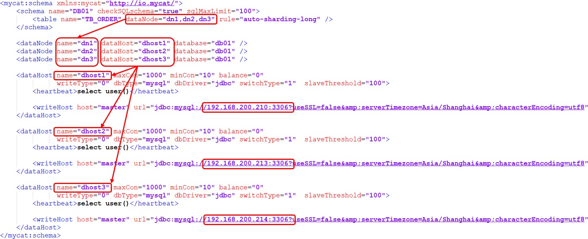

<font style="color:#33495D;">主要包含以下三组标签：</font>

<font style="color:#33495D;">schema标签datanode标签datahost标签</font>

#### <font style="color:#33495D;">schema标签</font>
1. <font style="color:#33495D;">schema 定义逻辑库</font>


<font style="color:#33495D;">schema 标签用于定义 MyCat实例中的逻辑库 , 一个MyCat实例中, 可以有多个逻辑库 , 可以通过 schema 标签来划分不同的逻辑库。MyCat中的逻辑库的概念，等同于MySQL中的database概念</font>

<font style="color:#33495D;">, 需要操作某个逻辑库下的表时, 也需要切换逻辑库(use xxx)。</font>

<font style="color:#33495D;">核心属性：</font>

<font style="color:#33495D;">name：指定自定义的逻辑库库名</font>

<font style="color:#33495D;">checkSQLschema：在SQL语句操作时指定了数据库名称，执行时是否自动去除；true：自动去  除，false：不自动去除</font>

<font style="color:#33495D;">sqlMaxLimit：如果未指定limit进行查询，列表查询模式查询多少条记录</font>

1. <font style="color:#33495D;">schema 中的table定义逻辑表</font>


<font style="color:#33495D;">table 标签定义了MyCat中逻辑库schema下的逻辑表 , 所有需要拆分的表都需要在table标签中定义 。</font>

<font style="color:#33495D;">核心属性：</font>

<font style="color:#33495D;">name： 定 义 逻 辑 表 表 名 ， 在 该 逻 辑 库 下 唯 一                                   dataNode：定义逻辑表所属的dataNode，该属性需要与dataNode标签中name对应；多个dataNode逗号分隔</font>

<font style="color:#33495D;">rule： 分 片 规 则 的 名 字 ， 分 片 规 则 名 字 是 在 rule.xml 中 定 义 的 primaryKey：逻辑表对应真实表的主键                                                                     type：逻辑表的类型，目前逻辑表只有全局表和普通表，如果未配置，就是普通表；全局表，配  置 为 global</font>

#### <font style="color:#33495D;">datanode标签</font>
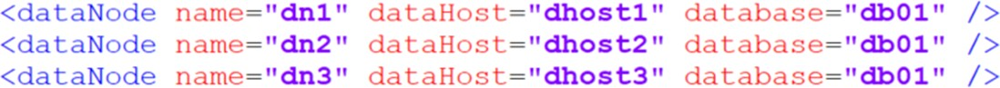

<font style="color:#33495D;">核心属性：</font>

<font style="color:#33495D;">name：定义数据节点名称</font>

<font style="color:#33495D;">dataHost：数据库实例主机名称，引用自 dataHost 标签中name属性</font>

<font style="color:#33495D;">database：定义分片所属数据库</font>

#### <font style="color:#33495D;">datahost标签</font>
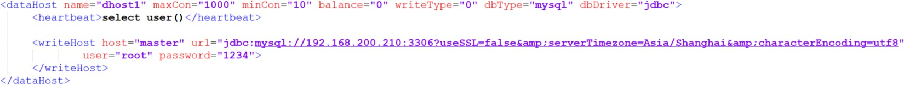

<font style="color:#33495D;">该标签在MyCat逻辑库中作为底层标签存在, 直接定义了具体的数据库实例、读写分离、心跳语句。核心属性：</font>

<font style="color:#33495D;">name：唯一标识，供上层标签使用maxCon/minCon：最大连接数/最小连接数balance：负载均衡策略，取值 0,1,2,3</font>

<font style="color:#33495D;">writeType：写操作分发方式（0：写操作转发到第一个writeHost，第一个挂了，切换到第二  个；1：写操作随机分发到配置的writeHost）</font>

<font style="color:#33495D;">dbDriver：数据库驱动，支持 native、jdbc</font>

### <font style="color:#33495D;">rule.xml</font>


<font style="color:#33495D;">rule.xml中定义所有拆分表的规则, 在使用过程中可以灵活的使用分片算法,  或者对同一个分片算法使用不同的参数, 它让分片过程可配置化。主要包含两类标签：tableRule、Function。</font>

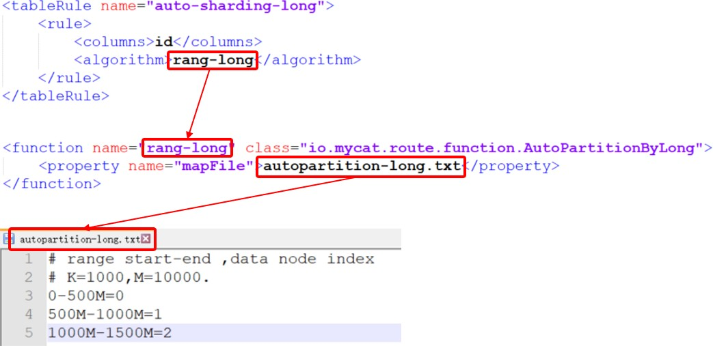

### <font style="color:#33495D;">server.xml</font>


<font style="color:#33495D;">server.xml配置文件包含了MyCat的系统配置信息，主要有两个重要的标签：system、user。1). system标签</font>

<font style="color:#33495D;">主要配置MyCat中的系统配置信息，对应的系统配置项及其含义，如下：</font>

| **<font style="color:rgb(51, 73, 93);">属性</font>** | **<font style="color:rgb(51, 73, 93);">取值</font>** | **<font style="color:rgb(51, 73, 93);">含义</font>** |
| --- | --- | --- |
| <br/><font style="color:rgb(51, 73, 93);">charset</font> | <br/><font style="color:rgb(51, 73, 93);">utf8</font> | <font style="color:rgb(51, 73, 93);">设置Mycat的字符集, 字符集需要与MySQL的字符集保持一致</font> |
| <br/><font style="color:rgb(51, 73, 93);">nonePasswordLogin</font> | <br/><font style="color:rgb(51, 73, 93);">0,1</font> | <font style="color:rgb(51, 73, 93);">0为需要密码登陆、1为不需要密码登陆 ,默认为0，设置为1则需要指定默认账户</font> |
| <br/><br/><font style="color:rgb(51, 73, 93);">useHandshakeV10</font> | <br/><br/><font style="color:rgb(51, 73, 93);">0,1</font> | <font style="color:rgb(51, 73, 93);">使用该选项主要的目的是为了能够兼容高版本的jdbc驱动, 是否采用HandshakeV10Packet来与client进行通 信, 1:是, 0:否</font> |
| <br/><br/><br/><br/><font style="color:rgb(51, 73, 93);">useSqlStat</font> | <br/><br/><br/><br/><font style="color:rgb(51, 73, 93);">0,1</font> | <font style="color:rgb(51, 73, 93);">开启SQL实时统计, 1 为开启 , 0 为关闭 ; 开启之后, MyCat会自动统计SQL语句的执行情 况 ; mysql -h 127.0.0.1 -P 9066</font><br/><font style="color:rgb(51, 73, 93);">-u root -p 查看MyCat执行的SQL, 执行效率比较低的SQL , SQL的整体执行情况、读写比例等 ; show @@sql ; show</font><br/><font style="color:rgb(51, 73, 93);">@@sql.slow ; show @@sql.sum ;</font> |
| <br/><font style="color:rgb(51, 73, 93);">useGlobleTableCheck</font> | <br/><font style="color:rgb(51, 73, 93);">0,1</font> | <font style="color:rgb(51, 73, 93);">是否开启全局表的一致性检测。1为开启 ，0 为关闭 。</font> |
| <font style="color:rgb(51, 73, 93);">sqlExecuteTimeout</font> | <font style="color:rgb(51, 73, 93);">1000</font> | <font style="color:rgb(51, 73, 93);">SQL语句执行的超时时间 , 单位为 s ;</font> |
| <br/><br/><font style="color:rgb(51, 73, 93);">sequnceHandlerType</font> | <br/><br/><font style="color:rgb(51, 73, 93);">0,1,2</font> | <font style="color:rgb(51, 73, 93);">用来指定Mycat全局序列类型，0  为本地文件，1 为数据库方式，2 为时间戳列方式，默认使用本地文件方式，文件方式主要用于测试</font> |
| <br/><font style="color:rgb(51, 73, 93);">sequnceHandlerPattern</font> | <br/><font style="color:rgb(51, 73, 93);">正则表达式</font> | <font style="color:rgb(51, 73, 93);">必须带有MYCATSEQ或者 mycatseq进入序列匹配流程 注意MYCATSEQ_有空格的情况</font> |
| <br/><font style="color:rgb(51, 73, 93);">subqueryRelationshipCheck</font> | <br/><font style="color:rgb(51, 73, 93);">true,false</font> | <font style="color:rgb(51, 73, 93);">子查询中存在关联查询的情况下,检查关联字段中是否有分片字段 .默认 false</font> |
| <br/><font style="color:rgb(51, 73, 93);">useCompression</font> | <br/><font style="color:rgb(51, 73, 93);">0,1</font> | <font style="color:rgb(51, 73, 93);">开启mysql压缩协议 , 0 : 关闭, 1 : 开启</font> |
| <font style="color:rgb(51, 73, 93);">fakeMySQLVersion</font> | <font style="color:rgb(51, 73, 93);">5.5,5.6</font> | <font style="color:rgb(51, 73, 93);">设置模拟的MySQL版本号</font> |


| **<font style="color:rgb(51, 73, 93);">属性</font>** | **<font style="color:rgb(51, 73, 93);">取值</font>** | **<font style="color:rgb(51, 73, 93);">含义</font>** |
| --- | --- | --- |
| <br/><br/><br/><br/><font style="color:rgb(51, 73, 93);">defaultSqlParser</font> |  | <font style="color:rgb(51, 73, 93);">由于MyCat的最初版本使用了FoundationDB 的SQL解析器, 在MyCat1.3后增加了Druid 解析器, 所以要设置defaultSqlParser属性来指定默认的解析器; 解析器有两个 : druidparser 和 fdbparser, 在MyCat1.4 之 后 , 默 认 是 druidparser, fdbparser已经废除了</font> |
| <br/><br/><br/><font style="color:rgb(51, 73, 93);">processors</font> | <br/><br/><br/><font style="color:rgb(51, 73, 93);">1,2....</font> | <font style="color:rgb(51, 73, 93);">指定系统可用的线程数量, 默认值为CPU核心x 每个核心运行线程数量; processors 会影响processorBufferPool,</font><br/><font style="color:rgb(51, 73, 93);">processorBufferLocalPercent,</font><br/><font style="color:rgb(51, 73, 93);">processorExecutor属性, 所有, 在性能调优时, 可以适当地修改processors值</font> |
| <br/><br/><font style="color:rgb(51, 73, 93);">processorBufferChunk</font> |  | <font style="color:rgb(51, 73, 93);">指定每次分配Socket Direct Buffer默认值为4096字节, 也会影响BufferPool长度, 如果一次性获取字节过多而导致buffer不够 用, 则会出现警告, 可以调大该值</font> |
| <br/><br/><br/><font style="color:rgb(51, 73, 93);">processorExecutor</font> |  | <font style="color:rgb(51, 73, 93);">指定NIOProcessor上共享businessExecutor固定线程池的大小; MyCat把异步任务交给 businessExecutor 线程池中, 在新版本的MyCat中这个连接池使用频次不高, 可以适当地把该值调小</font> |
| <br/><font style="color:rgb(51, 73, 93);">packetHeaderSize</font> |  | <font style="color:rgb(51, 73, 93);">指定MySQL协议中的报文头长度, 默认4个字节</font> |
| <br/><font style="color:rgb(51, 73, 93);">maxPacketSize</font> |  | <font style="color:rgb(51, 73, 93);">指定MySQL协议可以携带的数据最大大小, 默认值为16M</font> |
| <br/><font style="color:rgb(51, 73, 93);">idleTimeout</font> | <br/><font style="color:rgb(51, 73, 93);">30</font> | <font style="color:rgb(51, 73, 93);">指定连接的空闲时间的超时长度;如果超时,将关闭资源并回收, 默认30分钟</font> |


| **<font style="color:rgb(51, 73, 93);">属性</font>** | **<font style="color:rgb(51, 73, 93);">取值</font>** | **<font style="color:rgb(51, 73, 93);">含义</font>** |
| --- | --- | --- |
| <br/><br/><br/><font style="color:rgb(51, 73, 93);">txIsolation</font> | <br/><br/><br/><font style="color:rgb(51, 73, 93);">1,2,3,4</font> | <font style="color:rgb(51, 73, 93);">初始化前端连接的事务隔离级别,默认为</font><br/><font style="color:rgb(51, 73, 93);">REPEATED_READ , 对应数字为3 READ_UNCOMMITED=1;</font><br/><font style="color:rgb(51, 73, 93);">READ_COMMITTED=2; REPEATED_READ=3;</font><br/><br/><font style="color:rgb(51, 73, 93);">SERIALIZABLE=4;</font> |
| <br/><font style="color:rgb(51, 73, 93);">sqlExecuteTimeout</font> | <br/><font style="color:rgb(51, 73, 93);">300</font> | <font style="color:rgb(51, 73, 93);">执行SQL的超时时间, 如果SQL语句执行超时, 将关闭连接; 默认300秒;</font> |
| <font style="color:rgb(51, 73, 93);">serverPort</font> | <font style="color:rgb(51, 73, 93);">8066</font> | <font style="color:rgb(51, 73, 93);">定义MyCat的使用端口, 默认8066</font> |
| <font style="color:rgb(51, 73, 93);">managerPort</font> | <font style="color:rgb(51, 73, 93);">9066</font> | <font style="color:rgb(51, 73, 93);">定义MyCat的管理端口, 默认9066</font> |


<font style="color:#33495D;">2). user标签</font>

<font style="color:#33495D;">配置MyCat中的用户、访问密码，以及用户针对于逻辑库、逻辑表的权限信息，具体的权限描述方式及  配置说明如下：</font>

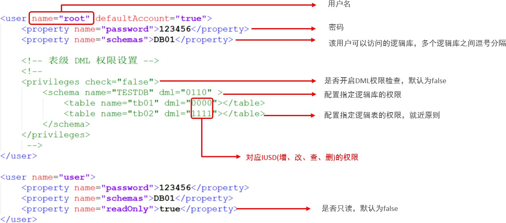


<font style="color:#33495D;">在测试权限操作时，我们只需要将 privileges 标签的注释放开。 在 privileges 下的schema 标签中配置的dml属性配置的是逻辑库的权限。   在privileges的schema下的table标签的dml属性中配置逻辑表的权限。</font>


## <font style="color:#33495D;">MyCat分片</font>
### <font style="color:#33495D;">垂直拆分</font>
#### <font style="color:#33495D;">场景</font>
<font style="color:#33495D;">在业务系统中, 涉及以下表结构 ,但是由于用户与订单每天都会产生大量的数据, 单台服务器的数据存储及处理能力是有限的, 可以对数据库表进行拆分, 原有的数据库表如下。</font>

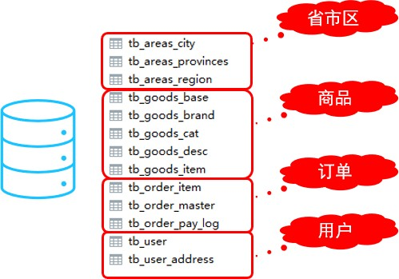


<font style="color:#33495D;">现在考虑将其进行垂直分库操作，将商品相关的表拆分到一个数据库服务器，订单表拆分的一个数据库  服务器，用户及省市区表拆分到一个服务器。最终结构如下：</font>

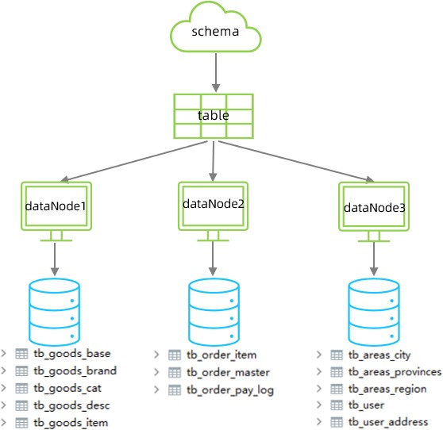


#### <font style="color:#33495D;">准备</font>
<font style="color:#33495D;">准备三台服务器，IP地址如图所示：</font>


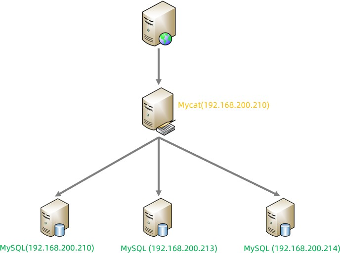

<font style="color:#33495D;">并且在192.168.200.210，192.168.200.213, 192.168.200.214上面创建数据库</font>

<font style="color:#33495D;">shopping。</font>


#### <font style="color:#33495D;">配置</font>
1. <font style="color:#33495D;">schema.xml</font>

```plsql
<schema name="SHOPPING" checkSQLschema="true" sqlMaxLimit="100">
<table name="tb_goods_base" dataNode="dn1" primaryKey="id" />
<table name="tb_goods_brand" dataNode="dn1" primaryKey="id" />
<table name="tb_goods_cat" dataNode="dn1" primaryKey="id" />
<table name="tb_goods_desc" dataNode="dn1" primaryKey="goods_id" />
<table name="tb_goods_item" dataNode="dn1" primaryKey="id" />
<table name="tb_order_item" dataNode="dn2" primaryKey="id" />
<table name="tb_order_master" dataNode="dn2" primaryKey="order_id" />
<table name="tb_order_pay_log" dataNode="dn2" primaryKey="out_trade_no" />
<table name="tb_user" dataNode="dn3" primaryKey="id" />
<table name="tb_user_address" dataNode="dn3" primaryKey="id" />
<table name="tb_areas_provinces" dataNode="dn3" primaryKey="id"/>
<table name="tb_areas_city" dataNode="dn3" primaryKey="id"/>
<table name="tb_areas_region" dataNode="dn3" primaryKey="id"/>
</schema>
<dataNode name="dn1" dataHost="dhost1" database="shopping" />
<dataNode name="dn2" dataHost="dhost2" database="shopping" />
<dataNode name="dn3" dataHost="dhost3" database="shopping" />
<dataHost name="dhost1" maxCon="1000" minCon="10" balance="0"
writeType="0" dbType="mysql" dbDriver="jdbc" switchType="1"
slaveThreshold="100">
<heartbeat>select user()</heartbeat>
<writeHost host="master" url="jdbc:mysql://192.168.200.210:3306?
useSSL=false&amp;serverTimezone=Asia/Shanghai&amp;characterEncoding=utf8"
user="root" password="1234" />
</dataHost>
<dataHost name="dhost2" maxCon="1000" minCon="10" balance="0"
writeType="0" dbType="mysql" dbDriver="jdbc" switchType="1"
slaveThreshold="100">
<heartbeat>select user()</heartbeat>
<writeHost host="master" url="jdbc:mysql://192.168.200.213:3306?
useSSL=false&amp;serverTimezone=Asia/Shanghai&amp;characterEncoding=utf8"
user="root" password="1234" />
</dataHost>
<dataHost name="dhost3" maxCon="1000" minCon="10" balance="0"
writeType="0" dbType="mysql" dbDriver="jdbc" switchType="1"
slaveThreshold="100">
<heartbeat>select user()</heartbeat>
<writeHost host="master" url="jdbc:mysql://192.168.200.214:3306?
useSSL=false&amp;serverTimezone=Asia/Shanghai&amp;characterEncoding=utf8"
user="root" password="1234" />
</dataHost>
```

2. <font style="color:#33495D;">server.xml</font>

```plsql
<user name="root" defaultAccount="true">
<property name="password">123456</property>
<property name="schemas">SHOPPING</property>
<!-- 表级 DML 权限设置 -->
<!--
<privileges check="true">
<schema name="DB01" dml="0110" >
<table name="TB_ORDER" dml="1110"></table>
</schema>
</privileges>
-->
</user>
<user name="user">
<property name="password">123456</property>
<property name="schemas">SHOPPING</property>
<property name="readOnly">true</property>
</user>
```

#### <font style="color:#33495D;">测试</font>
1. <font style="color:#33495D;">上传测试SQL脚本到服务器的/root目录</font>


1. <font style="color:#33495D;">执行指令导入测试数据</font>

<font style="color:#33495D;">重新启动MyCat后，在mycat的命令行中，通过source指令导入表结构，以及对应的数据，查看数据  分布情况。</font>

```plsql
source /root/shopping-table.sql
source /root/shopping-insert.sql
```

<font style="color:#33495D;">将表结构及对应的测试数据导入之后，可以检查一下各个数据库服务器中的表结构分布情况。   检查是否和我们准备工作中规划的服务器一致。</font>


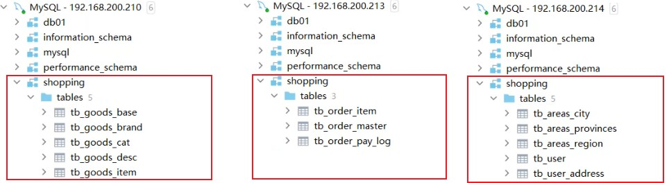


1. <font style="color:#33495D;">查询用户的收件人及收件人地址信息(包含省、市、区)。</font>

<font style="color:#33495D;">在MyCat的命令行中，当我们执行以下多表联查的SQL语句时，可以正常查询出数据。</font>

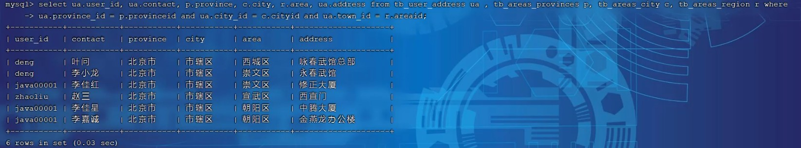


```plsql
select ua.user_id, ua.contact, p.province, c.city, r.area , 
ua.address from tb_user_address ua ,tb_areas_city c ,
tb_areas_provinces p ,tb_areas_region r where ua.province_id =
p.provinceid and ua.city_id = c.cityid and ua.town_id =r.areaid ;
```


1. <font style="color:#33495D;">查询每一笔订单及订单的收件地址信息(包含省、市、区)。实现该需求对应的SQL语句如下：</font>

```plsql
SELECT order_id , payment ,receiver, province , city , area FROM tb_order_master o
, tb_areas_provinces p , tb_areas_city c , tb_areas_region r WHERE o.receiver_province
= p.provinceid AND o.receiver_city = c.cityid AND o.receiver_region = r.areaid ;
```

<font style="color:#33495D;">但是现在存在一个问题，订单相关的表结构是在 192.168.200.213 数据库服务器中，而省市区的数</font>

<font style="color:#33495D;">据库表是在 192.168.200.214 数据库服务器中。那么在MyCat中执行是否可以成功呢？</font>


<font style="color:#33495D;">经过测试，我们看到，SQL语句执行报错。原因就是因为MyCat在执行该SQL语句时，需要往具体的数  据库服务器中路由，而当前没有一个数据库服务器完全包含了订单以及省市区的表结构，造成SQL语句  失败，报错。</font>

<font style="color:#33495D;">对于上述的这种现象，我们如何来解决呢？ 下面我们介绍的全局表，就可以轻松解决这个问题。</font>

#### <font style="color:#33495D;">全局表</font>
<font style="color:#33495D;">对于省、市、区/县表tb_areas_provinces , tb_areas_city , tb_areas_region，是属于数据字典表，在多个业务模块中都可能会遇到，可以将其设置为全局表，利于业务操作。</font>

<font style="color:#33495D;">修改schema.xml中的逻辑表的配置，修改 tb_areas_provinces、tb_areas_city、tb_areas_region 三个逻辑表，增加 type 属性，配置为global，就代表该表是全局表，就会在所涉及到的dataNode中创建给表。对于当前配置来说，也就意味着所有的节点中都有该表了。</font>

```plsql
<table name="tb_areas_provinces" dataNode="dn1,dn2,dn3" primaryKey="id" type="global"/>
<table name="tb_areas_city" dataNode="dn1,dn2,dn3" primaryKey="id" type="global"/>
<table name="tb_areas_region" dataNode="dn1,dn2,dn3" primaryKey="id" type="global"/>
```


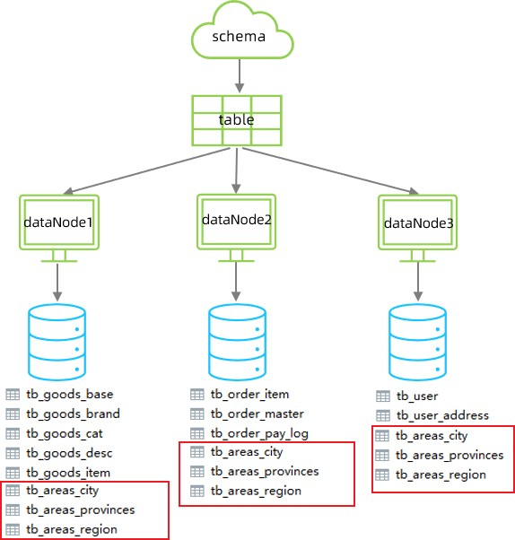

<font style="color:#33495D;">配置完毕后，重新启动MyCat。</font>

1. <font style="color:#33495D;">删除原来每一个数据库服务器中的所有表结构</font>
2. <font style="color:#33495D;">通过source指令，导入表及数据</font>


```plsql
source /root/shopping-table.sql
source /root/shopping-insert.sql
```

3. <font style="color:#33495D;">检查每一个数据库服务器中的表及数据分布，看到三个节点中都有这三张全局表</font>
4. <font style="color:#33495D;">然后再次执行上面的多表联查的SQL语句</font>

```plsql
SELECT order_id , payment ,receiver, province , city , area FROM tb_order_master o
, tb_areas_provinces p , tb_areas_city c , tb_areas_region r WHERE o.receiver_province
= p.provinceid AND o.receiver_city = c.cityid AND o.receiver_region = r.areaid ;
```


<font style="color:#33495D;">是可以正常执行成功的。</font>

5. <font style="color:#33495D;">当在MyCat中更新全局表的时候，我们可以看到，所有分片节点中的数据都发生了变化，每个节 点的全局表数据时刻保持一致。</font>


### <font style="color:#33495D;">水平拆分</font>
#### <font style="color:#33495D;">场景</font>
<font style="color:#33495D;">在业务系统中, 有一张表(日志表), 业务系统每天都会产生大量的日志数据 , 单台服务器的数据存储及处理能力是有限的, 可以对数据库表进行拆分。</font>

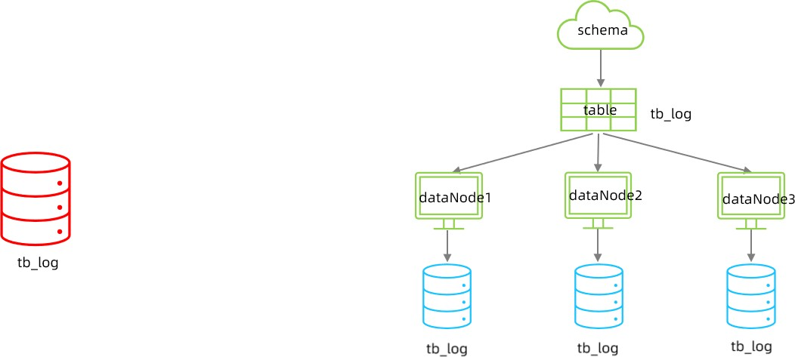

#### <font style="color:#33495D;">准备</font>
<font style="color:#33495D;">准备三台服务器，具体的结构如下：</font>

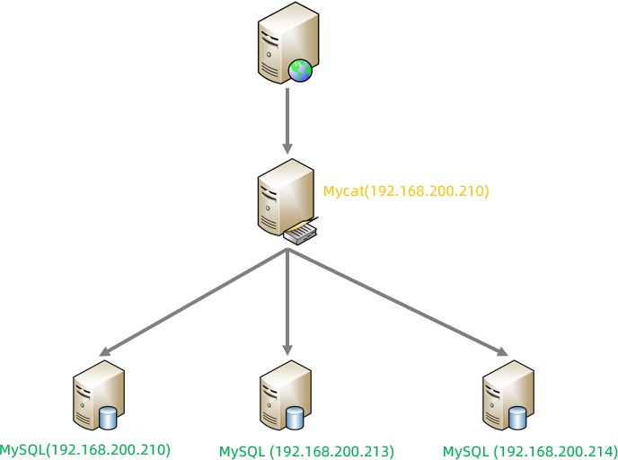

<font style="color:#33495D;">并且，在三台数据库服务器中分表创建一个数据库itcast。</font>


#### <font style="color:#33495D;">配置</font>
1. <font style="color:#33495D;">schema.xml</font>

```plsql
<schema name="ITCAST" checkSQLschema="true" sqlMaxLimit="100">
<table name="tb_log" dataNode="dn4,dn5,dn6" primaryKey="id" rule="mod-long" />
</schema>
<dataNode name="dn4" dataHost="dhost1" database="itcast" />
<dataNode name="dn5" dataHost="dhost2" database="itcast" />
<dataNode name="dn6" dataHost="dhost3" database="itcast" />
```

<font style="color:#33495D;">tb_log表最终落在3个节点中，分别是 dn4、dn5、dn6 ，而具体的数据分别存储在 dhost1、dhost2、dhost3的itcast数据库中。</font>

2. <font style="color:#33495D;">server.xml</font>

<font style="color:#33495D;">配置root用户既可以访问 SHOPPING 逻辑库，又可以访问ITCAST逻辑库。</font>


```plsql
<user name="root" defaultAccount="true">
<property name="password">123456</property>
<property name="schemas">SHOPPING,ITCAST</property>
<!-- 表级 DML 权限设置 -->
<!--
<privileges check="true">
<schema name="DB01" dml="0110" >
<table name="TB_ORDER" dml="1110"></table>
</schema>
</privileges>
-->
</user>
```

#### <font style="color:#33495D;">测试</font>
<font style="color:#33495D;">配置完毕后，重新启动MyCat，然后在mycat的命令行中，执行如下SQL创建表、并插入数据，查看数  据分布情况。</font>

```plsql
CREATE TABLE tb_log (
id bigint(20) NOT NULL COMMENT 'ID',
model_name varchar(200) DEFAULT NULL COMMENT '模块名',
model_value varchar(200) DEFAULT NULL COMMENT '模块值',
return_value varchar(200) DEFAULT NULL COMMENT '返回值',
return_class varchar(200) DEFAULT NULL COMMENT '返回值类型',
operate_user varchar(20) DEFAULT NULL COMMENT '操作用户',
operate_time varchar(20) DEFAULT NULL COMMENT '操作时间',
param_and_value varchar(500) DEFAULT NULL COMMENT '请求参数名及参数值',
operate_class varchar(200) DEFAULT NULL COMMENT '操作类',
operate_method varchar(200) DEFAULT NULL COMMENT '操作方法',
cost_time bigint(20) DEFAULT NULL COMMENT '执行方法耗时, 单位 ms',
source int(1) DEFAULT NULL COMMENT '来源 : 1 PC , 2 Android , 3 IOS',
PRIMARY KEY (id)
) ENGINE=InnoDB DEFAULT CHARSET=utf8mb4;
INSERT INTO tb_log (id, model_name, model_value, return_value, return_class,
operate_user, operate_time, param_and_value, operate_class, operate_method,
cost_time，source)
VALUES('1','user','insert','success','java.lang.String','10001','2022-01-06
18:12:28','{\"age\":\"20\",\"name\":\"Tom\",\"gender\":\"1\"}','cn.itcast.contro
ller.UserController','insert','10',1);
INSERT INTO tb_log (id, model_name, model_value, return_value, return_class,
operate_user, operate_time, param_and_value, operate_class, operate_method,
cost_time，source)
VALUES('2','user','insert','success','java.lang.String','10001','2022-01-06
18:12:27','{\"age\":\"20\",\"name\":\"Tom\",\"gender\":\"1\"}','cn.itcast.contro
ller.UserController','insert','23',1);
INSERT INTO tb_log (id, model_name, model_value, return_value, return_class,
operate_user, operate_time, param_and_value, operate_class, operate_method,
cost_time，source)
VALUES('3','user','update','success','java.lang.String','10001','2022-01-06
18:16:45','{\"age\":\"20\",\"name\":\"Tom\",\"gender\":\"1\"}','cn.itcast.contro
ller.UserController','update','34',1);
INSERT INTO tb_log (id, model_name, model_value, return_value, return_class,
operate_user, operate_time, param_and_value, operate_class, operate_method,
cost_time，source)
VALUES('4','user','update','success','java.lang.String','10001','2022-01-06
18:16:45','{\"age\":\"20\",\"name\":\"Tom\",\"gender\":\"1\"}','cn.itcast.contro
ller.UserController','update','13',2);
INSERT INTO tb_log (id, model_name, model_value, return_value, return_class,
operate_user, operate_time, param_and_value, operate_class, operate_method,
cost_time，source)
VALUES('5','user','insert','success','java.lang.String','10001','2022-01-06
18:30:31','{\"age\":\"200\",\"name\":\"TomCat\",\"gender\":\"0\"}','cn.itcast.co
ntroller.UserController','insert','29',3);
INSERT INTO tb_log (id, model_name, model_value, return_value, return_class,
operate_user, operate_time, param_and_value, operate_class, operate_method,
cost_time，source)
VALUES('6','user','find','success','java.lang.String','10001','2022-01-06
18:30:31','{\"age\":\"200\",\"name\":\"TomCat\",\"gender\":\"0\"}','cn.itcast.co
ntroller.UserController','find','29',2);
```

### <font style="color:#33495D;">分片规则</font>
#### <font style="color:#33495D;">范围分片</font>
1. <font style="color:#33495D;">介绍</font>

<font style="color:#33495D;">根据指定的字段及其配置的范围与数据节点的对应情况， 来决定该数据属于哪一个分片。</font>


2. <font style="color:#33495D;">配置</font>

<font style="color:#33495D;">schema.xml逻辑表配置：</font>

```plsql
<table name="TB_ORDER" dataNode="dn1,dn2,dn3" rule="auto-sharding-long" />
```

<font style="color:#33495D;">schema.xml数据节点配置：</font>

```plsql
<dataNode name="dn1" dataHost="dhost1" database="db01" />
<dataNode name="dn2" dataHost="dhost2" database="db01" />
<dataNode name="dn3" dataHost="dhost3" database="db01" />
```

<font style="color:#33495D;">rule.xml分片规则配置：</font>


```plsql
<tableRule name="auto-sharding-long">
<rule>
<columns>id</columns>
<algorithm>rang-long</algorithm>
</rule>
</tableRule>
<function name="rang-long" class="io.mycat.route.function.AutoPartitionByLong">
<property name="mapFile">autopartition-long.txt</property>
<property name="defaultNode">0</property>
</function>
```

<font style="color:#33495D;">分片规则配置属性含义：</font>


| **<font style="color:rgb(51, 73, 93);">属性</font>** | **<font style="color:rgb(51, 73, 93);">描述</font>** |
| --- | --- |
| <font style="color:rgb(51, 73, 93);">columns</font> | <font style="color:rgb(51, 73, 93);">标识将要分片的表字段</font> |
| <font style="color:rgb(51, 73, 93);">algorithm</font> | <font style="color:rgb(51, 73, 93);">指定分片函数与function的对应关系</font> |
| <font style="color:rgb(51, 73, 93);">class</font> | <font style="color:rgb(51, 73, 93);">指定该分片算法对应的类</font> |
| <font style="color:rgb(51, 73, 93);">mapFile</font> | <font style="color:rgb(51, 73, 93);">对应的外部配置文件</font> |
| <font style="color:rgb(51, 73, 93);">type</font> | <font style="color:rgb(51, 73, 93);">默认值为0 ; 0 表示Integer , 1 表示String</font> |
| <br/><font style="color:rgb(51, 73, 93);">defaultNode</font> | <font style="color:rgb(51, 73, 93);">默认节点 默认节点的所用:枚举分片时,如果碰到不识别的枚举值, 就让它路由到默认节点 ; 如果没有默认值,碰到不识别的则报错 。</font> |


<font style="color:#33495D;">在rule.xml中配置分片规则时，关联了一个映射配置文件   autopartition-long.txt，该配置文件的配置如下：</font>

```plsql
# range start-end ,data node index
# K=1000,M=10000.
0-500M=0
500M-1000M=1
1000M-1500M=2
```


<font style="color:#33495D;">含义：0-500万之间的值，存储在0号数据节点(数据节点的索引从0开始) ；  500万-1000万之间的数据存储在1号数据节点 ； 1000万-1500万的数据节点存储在2号节点 ；</font>


<font style="color:#33495D;">该分片规则，主要是针对于数字类型的字段适用。   在MyCat的入门程序中，我们使用的就是该分片规则。</font>


#### <font style="color:#33495D;">取模分片</font>
1. <font style="color:#33495D;">介绍</font>

<font style="color:#33495D;">根据指定的字段值与节点数量进行求模运算，根据运算结果， 来决定该数据属于哪一个分片。</font>

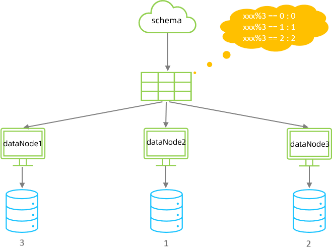


2. <font style="color:#33495D;">配置</font>

<font style="color:#33495D;">schema.xml逻辑表配置：</font>


```plsql
<table name="tb_log" dataNode="dn4,dn5,dn6" primaryKey="id" rule="mod-long" />
```


<font style="color:#33495D;">schema.xml数据节点配置：</font>

```plsql
<dataNode name="dn4" dataHost="dhost1" database="itcast" />
<dataNode name="dn5" dataHost="dhost2" database="itcast" />
<dataNode name="dn6" dataHost="dhost3" database="itcast" />
```

<font style="color:#33495D;">rule.xml分片规则配置：</font>

```plsql
<tableRule name="mod-long">
<rule>
<columns>id</columns>
<algorithm>mod-long</algorithm>
</rule>
</tableRule>
<function name="mod-long" class="io.mycat.route.function.PartitionByMod">
<property name="count">3</property>
</function>
```

<font style="color:#33495D;">分片规则属性说明如下：</font>


| **<font style="color:rgb(51, 73, 93);">属性</font>** | **<font style="color:rgb(51, 73, 93);">描述</font>** |
| --- | --- |
| <font style="color:rgb(51, 73, 93);">columns</font> | <font style="color:rgb(51, 73, 93);">标识将要分片的表字段</font> |
| <font style="color:rgb(51, 73, 93);">algorithm</font> | <font style="color:rgb(51, 73, 93);">指定分片函数与function的对应关系</font> |
| <font style="color:rgb(51, 73, 93);">class</font> | <font style="color:rgb(51, 73, 93);">指定该分片算法对应的类</font> |
| <font style="color:rgb(51, 73, 93);">count</font> | <font style="color:rgb(51, 73, 93);">数据节点的数量</font> |


<font style="color:#33495D;">该分片规则，主要是针对于数字类型的字段适用。   在前面水平拆分的演示中，我们选择的就是取模分片。</font>

3. <font style="color:#33495D;">测试</font>

<font style="color:#33495D;">配置完毕后，重新启动MyCat，然后在mycat的命令行中，执行如下SQL创建表、并插入数据，查看数  据分布情况。</font>

#### <font style="color:#33495D;">一致性hash分片</font>
1. <font style="color:#33495D;">介绍</font>

<font style="color:#33495D;">所谓一致性哈希，相同的哈希因子计算值总是被划分到相同的分区表中，不会因为分区节点的增加而改  变原来数据的分区位置，有效的解决了分布式数据的拓容问题。</font>


2. <font style="color:#33495D;">配置</font>

<font style="color:#33495D;">schema.xml中逻辑表配置：</font>

```plsql
<!-- 一致性hash -->
<table name="tb_order" dataNode="dn4,dn5,dn6" rule="sharding-by-murmur" />
```


<font style="color:#33495D;">schema.xml中数据节点配置：</font>

```plsql
<dataNode name="dn4" dataHost="dhost1" database="itcast" />
<dataNode name="dn5" dataHost="dhost2" database="itcast" />
<dataNode name="dn6" dataHost="dhost3" database="itcast" />
```

<font style="color:#33495D;">rule.xml中分片规则配置：</font>

```plsql
<tableRule name="sharding-by-murmur">
<rule>
<columns>id</columns>
<algorithm>murmur</algorithm>
</rule>
</tableRule>
<function name="murmur" class="io.mycat.route.function.PartitionByMurmurHash">
<property name="seed">0</property><!-- 默认是0 -->
<property name="count">3</property>
<property name="virtualBucketTimes">160</property>
</function>
```

<font style="color:#33495D;">分片规则属性含义：</font>


| **<font style="color:rgb(51, 73, 93);">属性</font>** | **<font style="color:rgb(51, 73, 93);">描述</font>** |
| --- | --- |
| <font style="color:rgb(51, 73, 93);">columns</font> | <font style="color:rgb(51, 73, 93);">标识将要分片的表字段</font> |
| <font style="color:rgb(51, 73, 93);">algorithm</font> | <font style="color:rgb(51, 73, 93);">指定分片函数与function的对应关系</font> |
| <font style="color:rgb(51, 73, 93);">class</font> | <font style="color:rgb(51, 73, 93);">指定该分片算法对应的类</font> |
| <font style="color:rgb(51, 73, 93);">seed</font> | <font style="color:rgb(51, 73, 93);">创建murmur_hash对象的种子，默认0</font> |
| <font style="color:rgb(51, 73, 93);">count</font> | <font style="color:rgb(51, 73, 93);">要分片的数据库节点数量，必须指定，否则没法分片</font> |
| <br/><font style="color:rgb(51, 73, 93);">virtualBucketTimes</font> | <font style="color:rgb(51, 73, 93);">一个实际的数据库节点被映射为这么多虚拟节点，默认是160倍，也就是虚拟节点数是物理节点数的160</font><br/><font style="color:rgb(51, 73, 93);">倍;virtualBucketTimes*count就是虚拟结点数量 ;</font> |
| <br/><font style="color:rgb(51, 73, 93);">weightMapFile</font> | <font style="color:rgb(51, 73, 93);">节点的权重，没有指定权重的节点默认是1。以properties文件的格式填写，以从0开始到count-1的整数值也就是节点索引为key， 以节点权重值为值。所有权重值必须是正整数，否则以1代替</font> |
| <br/><font style="color:rgb(51, 73, 93);">bucketMapPath</font> | <font style="color:rgb(51, 73, 93);">用于测试时观察各物理节点与虚拟节点的分布情况，如果指定了这个属性，会把虚拟节点的murmur hash值与物理节点的映射按行输出到这个文件，没有默认值，如果不指定，就不会输出任何东西</font> |


3. <font style="color:#33495D;">测试</font>

<font style="color:#33495D;">配置完毕后，重新启动MyCat，然后在mycat的命令行中，执行如下SQL创建表、并插入数据，查看数  据分布情况。</font>

```plsql
create table tb_order(
id varchar(100) not null primary key,
money int null,
content varchar(200) null
);
INSERT INTO tb_order (id, money, content) VALUES ('b92fdaaf-6fc4-11ec-b831-
482ae33c4a2d', 10, 'b92fdaf8-6fc4-11ec-b831-482ae33c4a2d');
INSERT INTO tb_order (id, money, content) VALUES ('b93482b6-6fc4-11ec-b831-
482ae33c4a2d', 20, 'b93482d5-6fc4-11ec-b831-482ae33c4a2d');
INSERT INTO tb_order (id, money, content) VALUES ('b937e246-6fc4-11ec-b831-
482ae33c4a2d', 50, 'b937e25d-6fc4-11ec-b831-482ae33c4a2d');
INSERT INTO tb_order (id, money, content) VALUES ('b93be2dd-6fc4-11ec-b831-
482ae33c4a2d', 100, 'b93be2f9-6fc4-11ec-b831-482ae33c4a2d');
INSERT INTO tb_order (id, money, content) VALUES ('b93f2d68-6fc4-11ec-b831-
482ae33c4a2d', 130, 'b93f2d7d-6fc4-11ec-b831-482ae33c4a2d');
INSERT INTO tb_order (id, money, content) VALUES ('b9451b98-6fc4-11ec-b831-
482ae33c4a2d', 30, 'b9451bcc-6fc4-11ec-b831-482ae33c4a2d');
INSERT INTO tb_order (id, money, content) VALUES ('b9488ec1-6fc4-11ec-b831-
482ae33c4a2d', 560, 'b9488edb-6fc4-11ec-b831-482ae33c4a2d');
INSERT INTO tb_order (id, money, content) VALUES ('b94be6e6-6fc4-11ec-b831-
482ae33c4a2d', 10, 'b94be6ff-6fc4-11ec-b831-482ae33c4a2d');
INSERT INTO tb_order (id, money, content) VALUES ('b94ee10d-6fc4-11ec-b831-
482ae33c4a2d', 123, 'b94ee12c-6fc4-11ec-b831-482ae33c4a2d');
INSERT INTO tb_order (id, money, content) VALUES ('b952492a-6fc4-11ec-b831-
482ae33c4a2d', 145, 'b9524945-6fc4-11ec-b831-482ae33c4a2d');
INSERT INTO tb_order (id, money, content) VALUES ('b95553ac-6fc4-11ec-b831-
482ae33c4a2d', 543, 'b95553c8-6fc4-11ec-b831-482ae33c4a2d');
INSERT INTO tb_order (id, money, content) VALUES ('b9581cdd-6fc4-11ec-b831-
482ae33c4a2d', 17, 'b9581cfa-6fc4-11ec-b831-482ae33c4a2d');
INSERT INTO tb_order (id, money, content) VALUES ('b95afc0f-6fc4-11ec-b831-
482ae33c4a2d', 18, 'b95afc2a-6fc4-11ec-b831-482ae33c4a2d');
INSERT INTO tb_order (id, money, content) VALUES ('b95daa99-6fc4-11ec-b831-
482ae33c4a2d', 134, 'b95daab2-6fc4-11ec-b831-482ae33c4a2d');
INSERT INTO tb_order (id, money, content) VALUES ('b9667e3c-6fc4-11ec-b831-
482ae33c4a2d', 156, 'b9667e60-6fc4-11ec-b831-482ae33c4a2d');
INSERT INTO tb_order (id, money, content) VALUES ('b96ab489-6fc4-11ec-b831-
482ae33c4a2d', 175, 'b96ab4a5-6fc4-11ec-b831-482ae33c4a2d');
INSERT INTO tb_order (id, money, content) VALUES ('b96e2942-6fc4-11ec-b831-
482ae33c4a2d', 180, 'b96e295b-6fc4-11ec-b831-482ae33c4a2d');
INSERT INTO tb_order (id, money, content) VALUES ('b97092ec-6fc4-11ec-b831-
482ae33c4a2d', 123, 'b9709306-6fc4-11ec-b831-482ae33c4a2d');
INSERT INTO tb_order (id, money, content) VALUES ('b973727a-6fc4-11ec-b831-
482ae33c4a2d', 230, 'b9737293-6fc4-11ec-b831-482ae33c4a2d');
INSERT INTO tb_order (id, money, content) VALUES ('b978840f-6fc4-11ec-b831-
482ae33c4a2d', 560, 'b978843c-6fc4-11ec-b831-482ae33c4a2d');
```

#### <font style="color:#33495D;">枚举分片</font>
1. <font style="color:#33495D;">介绍</font>

<font style="color:#33495D;">通过在配置文件中配置可能的枚举值, 指定数据分布到不同数据节点上,  本规则适用于按照省份、性别、状态拆分数据等业务 。</font>

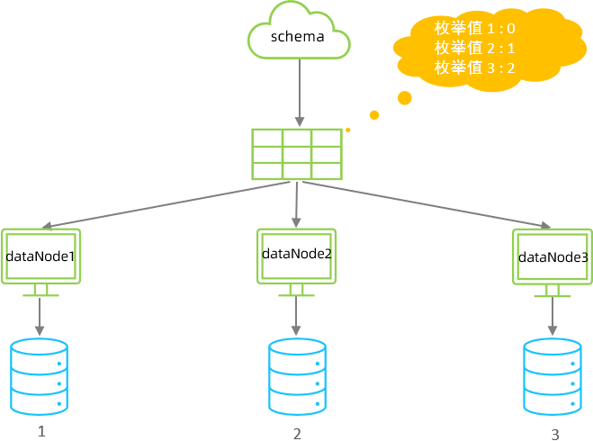


2. <font style="color:#33495D;">配置</font>

<font style="color:#33495D;">schema.xml中逻辑表配置：</font>


```plsql
<!-- 枚举 -->
<table name="tb_user" dataNode="dn4,dn5,dn6" rule="sharding-by-intfile-enumstatus"/>
```

<font style="color:#33495D;">schema.xml中数据节点配置：</font>

```plsql
<dataNode name="dn4" dataHost="dhost1" database="itcast" />
<dataNode name="dn5" dataHost="dhost2" database="itcast" />
<dataNode name="dn6" dataHost="dhost3" database="itcast" />
```

<font style="color:#33495D;">rule.xml中分片规则配置：</font>

```plsql
<tableRule name="sharding-by-intfile">
<rule>
<columns>sharding_id</columns>
<algorithm>hash-int</algorithm>
</rule>
</tableRule>
<!-- 自己增加 tableRule -->
<tableRule name="sharding-by-intfile-enumstatus">
<rule>
<columns>status</columns>
<algorithm>hash-int</algorithm>
</rule>
</tableRule>
<function name="hash-int" class="io.mycat.route.function.PartitionByFileMap">
<property name="defaultNode">2</property>
<property name="mapFile">partition-hash-int.txt</property>
</function>
```

<font style="color:#33495D;">partition-hash-int.txt ，内容如下 :</font>

<font style="color:rgb(0,0,255);">1</font><font style="color:rgb(52,73,94);">=</font><font style="color:rgb(0,153,0);">0 </font>

<font style="color:rgb(0,0,255);">2</font><font style="color:rgb(52,73,94);">=</font><font style="color:rgb(0,153,0);">1 </font>

<font style="color:rgb(0,0,255);">3</font><font style="color:rgb(52,73,94);">=</font><font style="color:rgb(0,153,0);">2</font>

<font style="color:#33495D;">分片规则属性含义：</font>


| **<font style="color:rgb(51, 73, 93);">属性</font>** | **<font style="color:rgb(51, 73, 93);">描述</font>** |
| --- | --- |
| <font style="color:rgb(51, 73, 93);">columns</font> | <font style="color:rgb(51, 73, 93);">标识将要分片的表字段</font> |
| <font style="color:rgb(51, 73, 93);">algorithm</font> | <font style="color:rgb(51, 73, 93);">指定分片函数与function的对应关系</font> |
| <font style="color:rgb(51, 73, 93);">class</font> | <font style="color:rgb(51, 73, 93);">指定该分片算法对应的类</font> |
| <font style="color:rgb(51, 73, 93);">mapFile</font> | <font style="color:rgb(51, 73, 93);">对应的外部配置文件</font> |
| <font style="color:rgb(51, 73, 93);">type</font> | <font style="color:rgb(51, 73, 93);">默认值为0 ; 0 表示Integer , 1 表示String</font> |
| <br/><font style="color:rgb(51, 73, 93);">defaultNode</font> | <font style="color:rgb(51, 73, 93);">默认节点 ; 小于0 标识不设置默认节点 , 大于等于0代表设置默认节点 ; 默认节点的所用:枚举分片时,如果碰到不识别的枚举值, 就让它路由到默认节点 ; 如果没有默认值,碰到不识别的则报错 。</font> |


3. <font style="color:#33495D;">测试</font>

<font style="color:#33495D;">配置完毕后，重新启动MyCat，然后在mycat的命令行中，执行如下SQL创建表、并插入数据，查看数  据分布情况。</font>

```plsql
CREATE TABLE tb_user (
id bigint(20) NOT NULL COMMENT 'ID',
username varchar(200) DEFAULT NULL COMMENT '姓名',
status int(2) DEFAULT '1' COMMENT '1: 未启用, 2: 已启用, 3: 已关闭',
PRIMARY KEY (`id`)
) ENGINE=InnoDB DEFAULT CHARSET=utf8mb4;
insert into tb_user (id,username ,status) values(1,'Tom',1);
insert into tb_user (id,username ,status) values(2,'Cat',2);
insert into tb_user (id,username ,status) values(3,'Rose',3);
insert into tb_user (id,username ,status) values(4,'Coco',2);
insert into tb_user (id,username ,status) values(5,'Lily',1);
insert into tb_user (id,username ,status) values(6,'Tom',1);
insert into tb_user (id,username ,status) values(7,'Cat',2);
insert into tb_user (id,username ,status) values(8,'Rose',3);
insert into tb_user (id,username ,status) values(9,'Coco',2);
insert into tb_user (id,username ,status) values(10,'Lily',1);
```

#### <font style="color:#33495D;">应用指定算法</font>
1. <font style="color:#33495D;">介绍</font>

<font style="color:#33495D;">运行阶段由应用自主决定路由到那个分片 , 直接根据字符子串（必须是数字）计算分片号。</font>

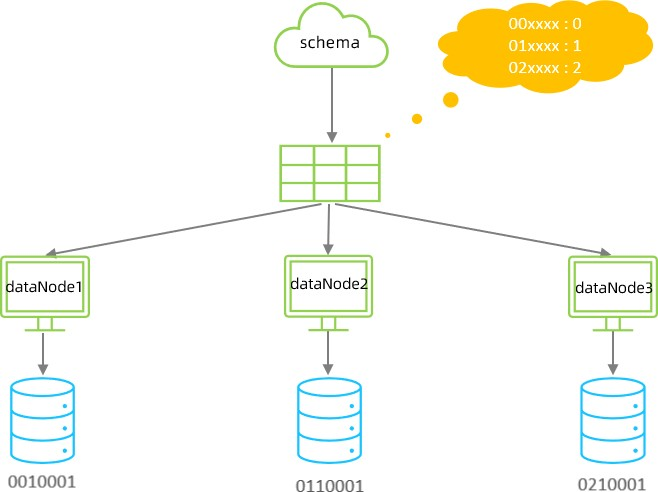


2. <font style="color:#33495D;">配置</font>

<font style="color:#33495D;">schema.xml中逻辑表配置：</font>

```plsql
<!-- 应用指定算法 -->
<table name="tb_app" dataNode="dn4,dn5,dn6" rule="sharding-by-substring" />
```

<font style="color:#33495D;">schema.xml中数据节点配置：</font>

```plsql
<dataNode name="dn4" dataHost="dhost1" database="itcast" />
<dataNode name="dn5" dataHost="dhost2" database="itcast" />
<dataNode name="dn6" dataHost="dhost3" database="itcast" />
```

<font style="color:#33495D;">rule.xml中分片规则配置：</font>

```plsql
<tableRule name="sharding-by-substring">
<rule>
<columns>id</columns>
<algorithm>sharding-by-substring</algorithm>
</rule>
</tableRule>
<function name="sharding-by-substring"
class="io.mycat.route.function.PartitionDirectBySubString">
<property name="startIndex">0</property> <!-- zero-based -->
<property name="size">2</property>
<property name="partitionCount">3</property>
<property name="defaultPartition">0</property>
</function>
```


<font style="color:#33495D;">分片规则属性含义：</font>


| **<font style="color:rgb(51, 73, 93);">属性</font>** | **<font style="color:rgb(51, 73, 93);">描述</font>** |
| --- | --- |
| <font style="color:rgb(51, 73, 93);">columns</font> | <font style="color:rgb(51, 73, 93);">标识将要分片的表字段</font> |
| <font style="color:rgb(51, 73, 93);">algorithm</font> | <font style="color:rgb(51, 73, 93);">指定分片函数与function的对应关系</font> |
| <font style="color:rgb(51, 73, 93);">class</font> | <font style="color:rgb(51, 73, 93);">指定该分片算法对应的类</font> |
| <font style="color:rgb(51, 73, 93);">startIndex</font> | <font style="color:rgb(51, 73, 93);">字符子串起始索引</font> |
| <font style="color:rgb(51, 73, 93);">size</font> | <font style="color:rgb(51, 73, 93);">字符长度</font> |
| <font style="color:rgb(51, 73, 93);">partitionCount</font> | <font style="color:rgb(51, 73, 93);">分区(分片)数量</font> |
| <br/><font style="color:rgb(51, 73, 93);">defaultPartition</font> | <font style="color:rgb(51, 73, 93);">默认分片(在分片数量定义时, 字符标示的分片编号不在分片数量内时, 使用默认分片)</font> |


<font style="color:#33495D;">示例说明 :</font>

<font style="color:#33495D;">id=05-100000002 , 在此配置中代表根据id中从 startIndex=0，开始，截取siz=2位数字即05，05就是获取的分区，如果没找到对应的分片则默认分配到defaultPartition 。</font>

3. <font style="color:#33495D;">测试</font>

<font style="color:#33495D;">配置完毕后，重新启动MyCat，然后在mycat的命令行中，执行如下SQL创建表、并插入数据，查看数  据分布情况。</font>

```plsql
CREATE TABLE tb_app (
id varchar(10) NOT NULL COMMENT 'ID',
name varchar(200) DEFAULT NULL COMMENT '名称',
PRIMARY KEY (`id`)
) ENGINE=InnoDB DEFAULT CHARSET=utf8mb4;
insert into tb_app (id,name) values('0000001','Testx00001');
insert into tb_app (id,name) values('0100001','Test100001');
insert into tb_app (id,name) values('0100002','Test200001');
insert into tb_app (id,name) values('0200001','Test300001');
insert into tb_app (id,name) values('0200002','TesT400001');
```

#### <font style="color:#33495D;">固定分片hash算法</font>
1. <font style="color:#33495D;">介绍</font>

<font style="color:#33495D;">该算法类似于十进制的求模运算，但是为二进制的操作，例如，取 id 的二进制低 10 位 与1111111111 进行位 & 运算，位与运算最小值为 0000000000，最大值为1111111111，转换为十进制，也就是位于0-1023之间。</font>


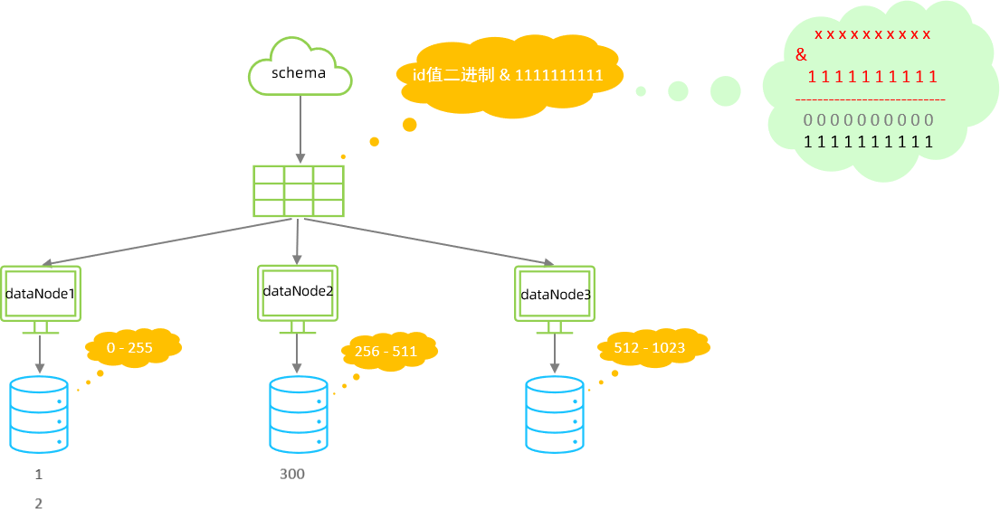


<font style="color:#33495D;">特点：</font>

+ <font style="color:rgb(52,73,94);">如果是求模，连续的值，分别分配到各个不同的分片；但是此算法会将连续的值可能分配到相同的 </font>
+ <font style="color:rgb(52,73,94);">分片，降低事务处理的难度。 </font>
+ <font style="color:rgb(52,73,94);">可以均匀分配，也可以非均匀分配。 </font>
+ <font style="color:rgb(52,73,94);">分片字段必须为数字类型。</font>
2. <font style="color:#33495D;">配置</font>

<font style="color:#33495D;">schema.xml中逻辑表配置：</font>


```plsql
<!-- 固定分片hash算法 -->
<table name="tb_longhash" dataNode="dn4,dn5,dn6" rule="sharding-by-long-hash" />
```

<font style="color:#33495D;">schema.xml中数据节点配置：</font>

```plsql
<dataNode name="dn4" dataHost="dhost1" database="itcast" />
<dataNode name="dn5" dataHost="dhost2" database="itcast" />
<dataNode name="dn6" dataHost="dhost3" database="itcast" />
```

<font style="color:#33495D;">rule.xml中分片规则配置：</font>

```plsql
<tableRule name="sharding-by-long-hash">
<rule>
<columns>id</columns>
<algorithm>sharding-by-long-hash</algorithm>
</rule>
</tableRule>
<!-- 分片总长度为1024，count与length数组长度必须一致； -->
<function name="sharding-by-long-hash"
class="io.mycat.route.function.PartitionByLong">
<property name="partitionCount">2,1</property>
<property name="partitionLength">256,512</property>
</function>
```

<font style="color:#33495D;">分片规则属性含义：</font>


| **<font style="color:rgb(51, 73, 93);">属性</font>** | **<font style="color:rgb(51, 73, 93);">描述</font>** |
| --- | --- |
| <font style="color:rgb(51, 73, 93);">columns</font> | <font style="color:rgb(51, 73, 93);">标识将要分片的表字段名</font> |
| <font style="color:rgb(51, 73, 93);">algorithm</font> | <font style="color:rgb(51, 73, 93);">指定分片函数与function的对应关系</font> |
| <font style="color:rgb(51, 73, 93);">class</font> | <font style="color:rgb(51, 73, 93);">指定该分片算法对应的类</font> |
| <font style="color:rgb(51, 73, 93);">partitionCount</font> | <font style="color:rgb(51, 73, 93);">分片个数列表</font> |
| <font style="color:rgb(51, 73, 93);">partitionLength</font> | <font style="color:rgb(51, 73, 93);">分片范围列表</font> |


<font style="color:#33495D;">约 束 :</font>

<font style="color:#33495D;">1). 分片长度 : 默认最大2^10 , 为 1024 ; 2). count, length的数组长度必须是一致的 ; 以上分为三个分区:0-255,256-511,512-1023</font>


<font style="color:#33495D;">示例说明 :</font>

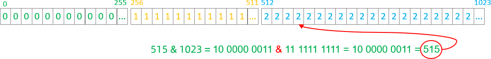


3. <font style="color:#33495D;">测试</font>

<font style="color:#33495D;">配置完毕后，重新启动MyCat，然后在mycat的命令行中，执行如下SQL创建表、并插入数据，查看数  据分布情况。</font>

```plsql
CREATE TABLE tb_longhash (
id int(11) NOT NULL COMMENT 'ID',
name varchar(200) DEFAULT NULL COMMENT '名称',
firstChar char(1) COMMENT '首字母',
PRIMARY KEY (`id`)
) ENGINE=InnoDB DEFAULT CHARSET=utf8mb4;
insert into tb_longhash (id,name,firstChar) values(1,'七匹狼','Q');
insert into tb_longhash (id,name,firstChar) values(2,'八匹狼','B');
insert into tb_longhash (id,name,firstChar) values(3,'九匹狼','J');
insert into tb_longhash (id,name,firstChar) values(4,'十匹狼','S');
insert into tb_longhash (id,name,firstChar) values(5,'六匹狼','L');
insert into tb_longhash (id,name,firstChar) values(6,'五匹狼','W');
insert into tb_longhash (id,name,firstChar) values(7,'四匹狼','S');
insert into tb_longhash (id,name,firstChar) values(8,'三匹狼','S');
insert into tb_longhash (id,name,firstChar) values(9,'两匹狼','L');
```

#### <font style="color:#33495D;">字符串hash解析算法</font>
1. <font style="color:#33495D;">介绍</font>

<font style="color:#33495D;">截取字符串中的指定位置的子字符串, 进行hash算法， 算出分片。</font>

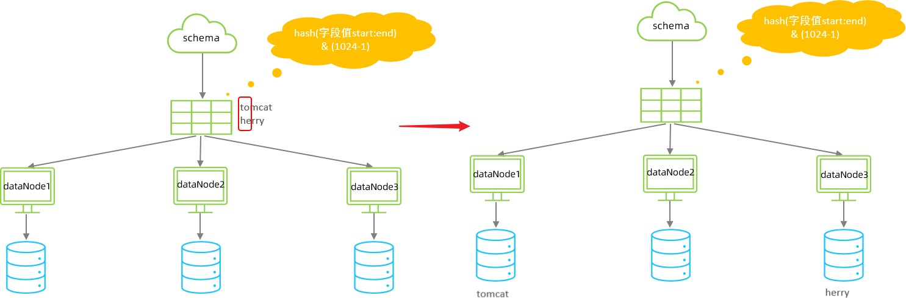


2. <font style="color:#33495D;">配置</font>

<font style="color:#33495D;">schema.xml中逻辑表配置：</font>

```plsql
<!-- 字符串hash解析算法 -->
<table name="tb_strhash" dataNode="dn4,dn5" rule="sharding-by-stringhash" />
```

<font style="color:#33495D;">schema.xml中数据节点配置：</font>

```plsql
<dataNode name="dn4" dataHost="dhost1" database="itcast" />
<dataNode name="dn5" dataHost="dhost2" database="itcast" />
```

<font style="color:#33495D;">rule.xml中分片规则配置：</font>

```plsql
<tableRule name="sharding-by-stringhash">
<rule>
<columns>name</columns>
<algorithm>sharding-by-stringhash</algorithm>
</rule>
</tableRule>
<function name="sharding-by-stringhash"
class="io.mycat.route.function.PartitionByString">
<property name="partitionLength">512</property> <!-- zero-based -->
<property name="partitionCount">2</property>
<property name="hashSlice">0:2</property>
</function>
```

<font style="color:#33495D;">分片规则属性含义：</font>

| **<font style="color:rgb(51, 73, 93);">属性</font>** | **<font style="color:rgb(51, 73, 93);">描述</font>** |
| --- | --- |
| <font style="color:rgb(51, 73, 93);">columns</font> | <font style="color:rgb(51, 73, 93);">标识将要分片的表字段</font> |
| <font style="color:rgb(51, 73, 93);">algorithm</font> | <font style="color:rgb(51, 73, 93);">指定分片函数与function的对应关系</font> |
| <font style="color:rgb(51, 73, 93);">class</font> | <font style="color:rgb(51, 73, 93);">指定该分片算法对应的类</font> |
| <font style="color:rgb(51, 73, 93);">partitionLength</font> | <font style="color:rgb(51, 73, 93);">hash求模基数 ; length*count=1024 (出于性能考虑)</font> |
| <font style="color:rgb(51, 73, 93);">partitionCount</font> | <font style="color:rgb(51, 73, 93);">分区数</font> |
| <br/><font style="color:rgb(51, 73, 93);">hashSlice</font> | <font style="color:rgb(51, 73, 93);">hash运算位 , 根据子字符串的hash运算 ; 0 代表 str.length()</font><br/><font style="color:rgb(51, 73, 93);">, -1 代表 str.length()-1 , 大于0只代表数字自身 ; 可以理解为substring（start，end），start为0则只表示0</font> |


<font style="color:#33495D;">示例说明：</font>

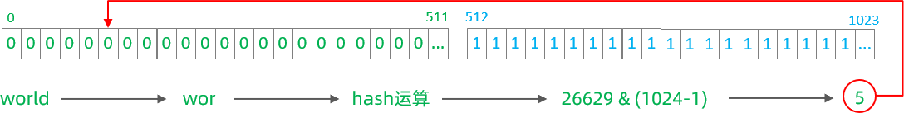


3. <font style="color:#33495D;">测试</font>

<font style="color:#33495D;">配置完毕后，重新启动MyCat，然后在mycat的命令行中，执行如下SQL创建表、并插入数据，查看数  据分布情况。</font>


```plsql
create table tb_strhash(
name varchar(20) primary key,
content varchar(100)
)engine=InnoDB DEFAULT CHARSET=utf8mb4;
INSERT INTO tb_strhash (name,content) VALUES('T1001', UUID());
INSERT INTO tb_strhash (name,content) VALUES('ROSE', UUID());
INSERT INTO tb_strhash (name,content) VALUES('JERRY', UUID());
INSERT INTO tb_strhash (name,content) VALUES('CRISTINA', UUID());
INSERT INTO tb_strhash (name,content) VALUES('TOMCAT', UUID());
```

#### <font style="color:#33495D;">按天分片算法</font>
1. <font style="color:#33495D;">介绍</font>

<font style="color:#33495D;">按照日期及对应的时间周期来分片。</font>

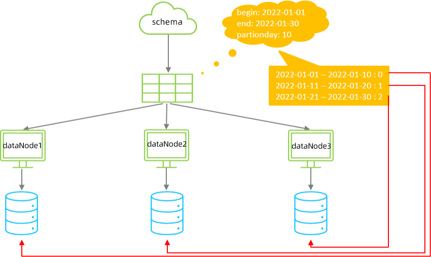


2. <font style="color:#33495D;">配置</font>

<font style="color:#33495D;">schema.xml中逻辑表配置：</font>


```plsql
<!-- 按天分片 -->
<table name="tb_datepart" dataNode="dn4,dn5,dn6" rule="sharding-by-date" />
```

<font style="color:#33495D;">schema.xml中数据节点配置：</font>

```plsql
<dataNode name="dn4" dataHost="dhost1" database="itcast" />
<dataNode name="dn5" dataHost="dhost2" database="itcast" />
<dataNode name="dn6" dataHost="dhost3" database="itcast" />
```

<font style="color:#33495D;">rule.xml中分片规则配置：</font>

```plsql
<tableRule name="sharding-by-date">
<rule>
<columns>create_time</columns>
<algorithm>sharding-by-date</algorithm>
</rule>
</tableRule>
<function name="sharding-by-date"
class="io.mycat.route.function.PartitionByDate">
<property name="dateFormat">yyyy-MM-dd</property>
<property name="sBeginDate">2022-01-01</property>
<property name="sEndDate">2022-01-30</property>
<property name="sPartionDay">10</property>
</function>
<!--
从开始时间开始，每10天为一个分片，到达结束时间之后，会重复开始分片插入
配置表的 dataNode 的分片，必须和分片规则数量一致，例如 2022-01-01 到 2022-12-31 ，每
10天一个分片，一共需要37个分片。
-->
```

<font style="color:#33495D;">分片规则属性含义：</font>

| **<font style="color:rgb(51, 73, 93);">属性</font>** | **<font style="color:rgb(51, 73, 93);">描述</font>** |
| --- | --- |
| <font style="color:rgb(51, 73, 93);">columns</font> | <font style="color:rgb(51, 73, 93);">标识将要分片的表字段</font> |
| <font style="color:rgb(51, 73, 93);">algorithm</font> | <font style="color:rgb(51, 73, 93);">指定分片函数与function的对应关系</font> |
| <font style="color:rgb(51, 73, 93);">class</font> | <font style="color:rgb(51, 73, 93);">指定该分片算法对应的类</font> |
| <font style="color:rgb(51, 73, 93);">dateFormat</font> | <font style="color:rgb(51, 73, 93);">日期格式</font> |
| <font style="color:rgb(51, 73, 93);">sBeginDate</font> | <font style="color:rgb(51, 73, 93);">开始日期</font> |
| <br/><font style="color:rgb(51, 73, 93);">sEndDate</font> | <font style="color:rgb(51, 73, 93);">结束日期，如果配置了结束日期，则代码数据到达了这个日期的分片后，会重复从开始分片插入</font> |
| <font style="color:rgb(51, 73, 93);">sPartionDay</font> | <font style="color:rgb(51, 73, 93);">分区天数，默认值 10 ，从开始日期算起，每个10天一个分区</font> |


3. <font style="color:#33495D;">测试</font>


<font style="color:#33495D;">配置完毕后，重新启动MyCat，然后在mycat的命令行中，执行如下SQL创建表、并插入数据，查看数  据分布情况。</font>

```plsql
create table tb_datepart(
id bigint not null comment 'ID' primary key,
name varchar(100) null comment '姓名',
create_time date null
);
insert into tb_datepart(id,name ,create_time) values(1,'Tom','2022-01-01');
insert into tb_datepart(id,name ,create_time) values(2,'Cat','2022-01-10');
insert into tb_datepart(id,name ,create_time) values(3,'Rose','2022-01-11');
insert into tb_datepart(id,name ,create_time) values(4,'Coco','2022-01-20');
insert into tb_datepart(id,name ,create_time) values(5,'Rose2','2022-01-21');
insert into tb_datepart(id,name ,create_time) values(6,'Coco2','2022-01-30');
insert into tb_datepart(id,name ,create_time) values(7,'Coco3','2022-01-31');
```


#### <font style="color:#33495D;">自然月分片</font>
1. <font style="color:#33495D;">介绍</font>

<font style="color:#33495D;">使用场景为按照月份来分片, 每个自然月为一个分片。</font>


2. <font style="color:#33495D;">配置</font>

<font style="color:#33495D;">schema.xml中逻辑表配置：</font>

```plsql
<!-- 按自然月分片 -->
<table name="tb_monthpart" dataNode="dn4,dn5,dn6" rule="sharding-by-month" />
```

<font style="color:#33495D;">schema.xml中数据节点配置：</font>

```plsql
<dataNode name="dn4" dataHost="dhost1" database="itcast" />
<dataNode name="dn5" dataHost="dhost2" database="itcast" />
<dataNode name="dn6" dataHost="dhost3" database="itcast" />
```

<font style="color:#33495D;">rule.xml中分片规则配置：</font>

```plsql
<tableRule name="sharding-by-month">
<rule>
<columns>create_time</columns>
<algorithm>partbymonth</algorithm>
</rule>
</tableRule>
<function name="partbymonth" class="io.mycat.route.function.PartitionByMonth">
<property name="dateFormat">yyyy-MM-dd</property>
<property name="sBeginDate">2022-01-01</property>
<property name="sEndDate">2022-03-31</property>
</function>
<!--
从开始时间开始，一个月为一个分片，到达结束时间之后，会重复开始分片插入
配置表的 dataNode 的分片，必须和分片规则数量一致，例如 2022-01-01 到 2022-12-31 ，一
共需要12个分片。
-->
```

<font style="color:#33495D;">分片规则属性含义：</font>


| **<font style="color:rgb(51, 73, 93);">属性</font>** | **<font style="color:rgb(51, 73, 93);">描述</font>** |
| --- | --- |
| <font style="color:rgb(51, 73, 93);">columns</font> | <font style="color:rgb(51, 73, 93);">标识将要分片的表字段</font> |
| <font style="color:rgb(51, 73, 93);">algorithm</font> | <font style="color:rgb(51, 73, 93);">指定分片函数与function的对应关系</font> |
| <font style="color:rgb(51, 73, 93);">class</font> | <font style="color:rgb(51, 73, 93);">指定该分片算法对应的类</font> |
| <font style="color:rgb(51, 73, 93);">dateFormat</font> | <font style="color:rgb(51, 73, 93);">日期格式</font> |
| <font style="color:rgb(51, 73, 93);">sBeginDate</font> | <font style="color:rgb(51, 73, 93);">开始日期</font> |
| <br/><font style="color:rgb(51, 73, 93);">sEndDate</font> | <font style="color:rgb(51, 73, 93);">结束日期，如果配置了结束日期，则代码数据到达了这个日期的分片后，会重复 从开始分片插入</font> |


3. <font style="color:#33495D;">测试</font>

<font style="color:#33495D;">配置完毕后，重新启动MyCat，然后在mycat的命令行中，执行如下SQL创建表、并插入数据，查看数  据分布情况。</font>

```plsql
create table tb_monthpart(
id bigint not null comment 'ID' primary key,
name varchar(100) null comment '姓名',
create_time date null
);
insert into tb_monthpart(id,name ,create_time) values(1,'Tom','2022-01-01');
insert into tb_monthpart(id,name ,create_time) values(2,'Cat','2022-01-10');
insert into tb_monthpart(id,name ,create_time) values(3,'Rose','2022-01-31');
insert into tb_monthpart(id,name ,create_time) values(4,'Coco','2022-02-20');
insert into tb_monthpart(id,name ,create_time) values(5,'Rose2','2022-02-25');
insert into tb_monthpart(id,name ,create_time) values(6,'Coco2','2022-03-10');
insert into tb_monthpart(id,name ,create_time) values(7,'Coco3','2022-03-31');
insert into tb_monthpart(id,name ,create_time) values(8,'Coco4','2022-04-10');
insert into tb_monthpart(id,name ,create_time) values(9,'Coco5','2022-04-30');
```

## <font style="color:#33495D;">MyCat管理及监控</font>
### <font style="color:#33495D;">MyCat原理</font>
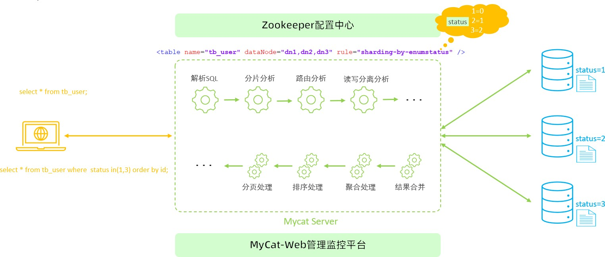


<font style="color:#33495D;">在MyCat中，当执行一条SQL语句时，MyCat需要进行SQL解析、分片分析、路由分析、读写分离分析   等操作，最终经过一系列的分析决定将当前的SQL语句到底路由到那几个(或哪一个)节点数据库，数据  库将数据执行完毕后，如果有返回的结果，则将结果返回给MyCat，最终还需要在MyCat中进行结果合  并、聚合处理、排序处理、分页处理等操作，最终再将结果返回给客户端。</font>

<font style="color:#33495D;">而在MyCat的使用过程中，MyCat官方也提供了一个管理监控平台MyCat-Web（MyCat-eye）。Mycat-web 是 Mycat 可视化运维的管理和监控平台，弥补了 Mycat 在监控上的空白。帮 Mycat 分担统计任务和配置管理任务。Mycat-web 引入了 ZooKeeper 作为配置中心，可以管理多个节</font>

<font style="color:#33495D;">点。Mycat-web 主要管理和监控 Mycat 的流量、连接、活动线程和内存等，具备 IP 白名单、邮件告警等模块，还可以统计 SQL 并分析慢 SQL 和高频 SQL 等。为优化 SQL 提供依据。</font>


### <font style="color:#33495D;">MyCat管理</font>
<font style="color:#33495D;">Mycat默认开通2个端口，可以在server.xml中进行修改。</font>


<font style="color:#33495D;">8066 数据访问端口，即进行 DML 和 DDL 操作。</font>


<font style="color:#33495D;">9066 数据库管理端口，即 mycat 服务管理控制功能，用于管理mycat的整个集群状态连接MyCat的管理控制台：</font>

```plsql
mysql	-h  192.168.200.210 -p 9066	-uroot	-p123456
```


| **<font style="color:rgb(51, 73, 93);">命令</font>** | **<font style="color:rgb(51, 73, 93);">含义</font>** |
| --- | --- |
| <font style="color:rgb(51, 73, 93);">show @@help</font> | <font style="color:rgb(51, 73, 93);">查看Mycat管理工具帮助文档</font> |
| <font style="color:rgb(51, 73, 93);">show @@version</font> | <font style="color:rgb(51, 73, 93);">查看Mycat的版本</font> |
| <font style="color:rgb(51, 73, 93);">reload @@config</font> | <font style="color:rgb(51, 73, 93);">重新加载Mycat的配置文件</font> |
| <font style="color:rgb(51, 73, 93);">show @@datasource</font> | <font style="color:rgb(51, 73, 93);">查看Mycat的数据源信息</font> |
| <font style="color:rgb(51, 73, 93);">show @@datanode</font> | <font style="color:rgb(51, 73, 93);">查看MyCat现有的分片节点信息</font> |
| <font style="color:rgb(51, 73, 93);">show @@threadpool</font> | <font style="color:rgb(51, 73, 93);">查看Mycat的线程池信息</font> |
| <font style="color:rgb(51, 73, 93);">show @@sql</font> | <font style="color:rgb(51, 73, 93);">查看执行的SQL</font> |
| <font style="color:rgb(51, 73, 93);">show @@sql.sum</font> | <font style="color:rgb(51, 73, 93);">查看执行的SQL统计</font> |


### <font style="color:#33495D;">MyCat-eye</font>
#### <font style="color:#33495D;">介绍</font>
<font style="color:#33495D;">Mycat-web(Mycat-eye)是对mycat-server提供监控服务，功能不局限于对mycat-server使  用。他通过JDBC连接对Mycat、Mysql监控，监控远程服务器(目前仅限于linux系统)的cpu、内  存、网络、磁盘。</font>

<font style="color:#33495D;">Mycat-eye运行过程中需要依赖zookeeper，因此需要先安装zookeeper。</font>

#### <font style="color:#33495D;">安装</font>
1. <font style="color:#33495D;">zookeeper安装</font>
2. <font style="color:#33495D;">Mycat-web安装</font>

<font style="color:#777777;">具体的安装步骤，请参考资料中提供的《MyCat-Web安装文档》</font>

#### <font style="color:#33495D;">访问</font>


[**<font style="color:#41B982;">http://192.168.200.210:8082/mycat</font>**](http://192.168.200.210:8082/mycat)


#### **<font style="color:#33495D;">配置</font>**
1. <font style="color:#33495D;">开启MyCat的实时统计功能(server.xml)</font>

```plsql
<property name="useSqlStat">1</property> <!-- 1为开启实时统计、0为关闭 -->
```

2. <font style="color:#33495D;">在Mycat监控界面配置服务地址</font>

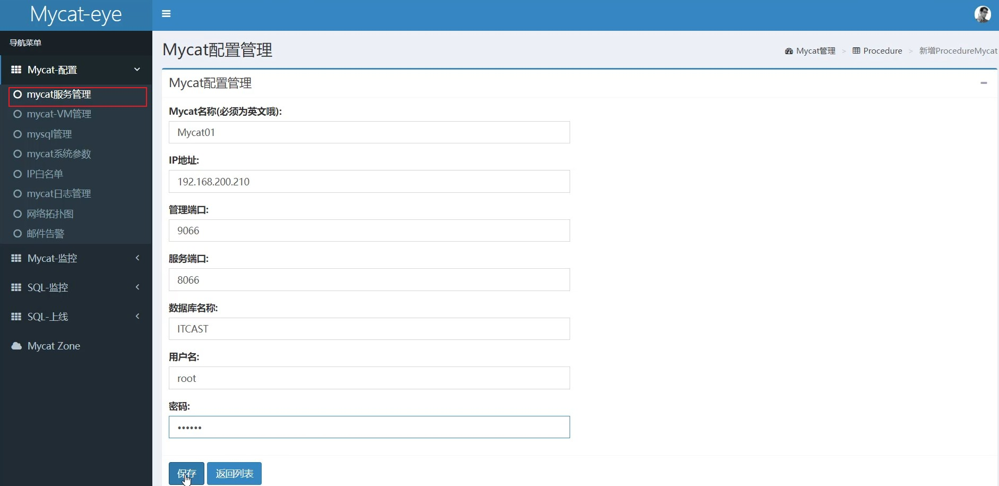

#### <font style="color:#33495D;">测试</font>
<font style="color:#33495D;">配置好了之后，我们可以通过MyCat执行一系列的增删改查的测试，然后过一段时间之后，打开</font>

<font style="color:#33495D;">mycat-eye的管理界面，查看mycat-eye监控到的数据信息。</font>

1. <font style="color:#33495D;">性能监控</font>


2. <font style="color:#33495D;">物理节点</font>


3. <font style="color:#33495D;">SQL统计</font>


4. <font style="color:#33495D;">SQL表分析</font>


5. <font style="color:#33495D;">SQL监控</font>

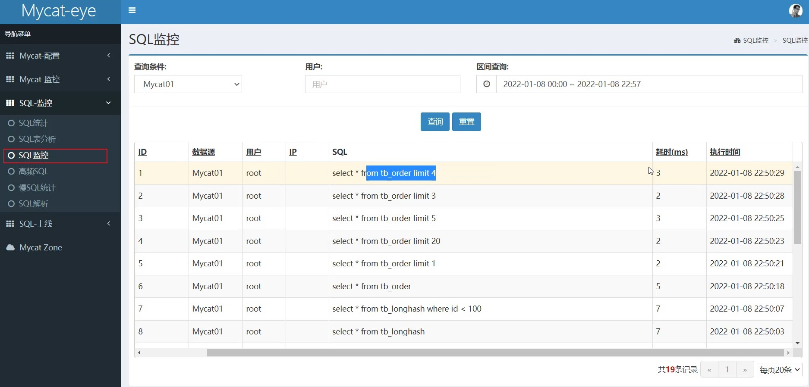


6. <font style="color:#33495D;">高频SQL</font>


# <font style="color:#33495D;">读写分离</font>
## <font style="color:#33495D;">介绍</font>
<font style="color:#33495D;">读写分离,简单地说是把对数据库的读和写操作分开,以对应不同的数据库服务器。主数据库提供写操  作，从数据库提供读操作，这样能有效地减轻单台数据库的压力。</font>

<font style="color:#33495D;">通过MyCat即可轻易实现上述功能，不仅可以支持MySQL，也可以支持Oracle和SQL Server。</font>

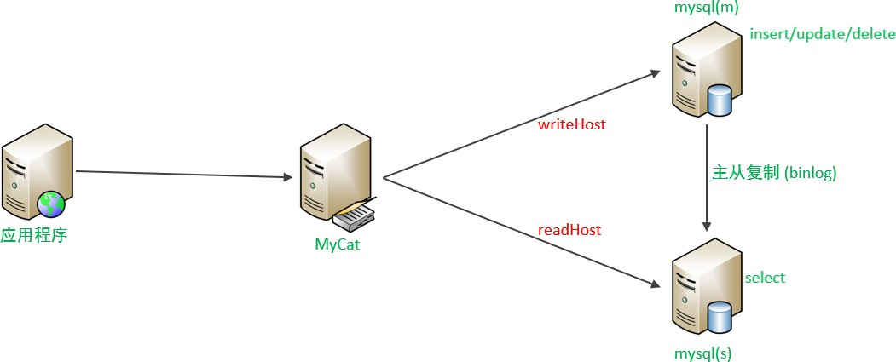


## <font style="color:#33495D;">一主一从</font>
### <font style="color:#33495D;">原理</font>
<font style="color:#33495D;">MySQL的主从复制，是基于二进制日志（binlog）实现的。</font>


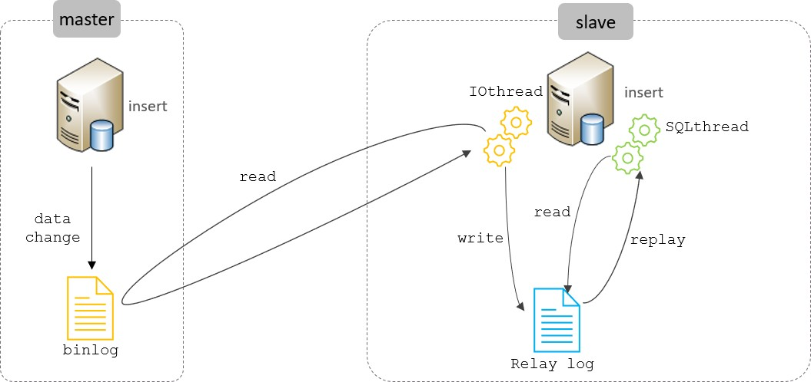


### <font style="color:#33495D;">准备</font>


| **<font style="color:rgb(51, 73, 93);">主机</font>** | **<font style="color:rgb(51, 73, 93);">角色</font>** | **<font style="color:rgb(51, 73, 93);">用户名</font>** | **<font style="color:rgb(51, 73, 93);">密码</font>** |
| --- | --- | --- | --- |
| <font style="color:rgb(51, 73, 93);">192.168.200.211</font> | <font style="color:rgb(51, 73, 93);">master</font> | <font style="color:rgb(51, 73, 93);">root</font> | <font style="color:rgb(51, 73, 93);">1234</font> |
| <font style="color:rgb(51, 73, 93);">192.168.200.212</font> | <font style="color:rgb(51, 73, 93);">slave</font> | <font style="color:rgb(51, 73, 93);">root</font> | <font style="color:rgb(51, 73, 93);">1234</font> |


<font style="color:#777777;">备注：主从复制的搭建，可以参考前面课程中 </font>**<font style="color:#777777;">主从复制 </font>**<font style="color:#777777;">章节讲解的步骤操作。</font>

## **<font style="color:#33495D;">一主一从读写分离</font>**
<font style="color:#33495D;">MyCat控制后台数据库的读写分离和负载均衡由schema.xml文件datahost标签的balance属性控  制。</font>

### <font style="color:#33495D;">schema.xml配置</font>
```plsql
<!-- 配置逻辑库 -->
<schema name="ITCAST_RW" checkSQLschema="true" sqlMaxLimit="100" dataNode="dn7">
</schema>
<dataNode name="dn7" dataHost="dhost7" database="itcast" />
<dataHost name="dhost7" maxCon="1000" minCon="10" balance="1" writeType="0"
dbType="mysql" dbDriver="jdbc" switchType="1" slaveThreshold="100">
<heartbeat>select user()</heartbeat>
<writeHost host="master1" url="jdbc:mysql://192.168.200.211:3306?
useSSL=false&amp;serverTimezone=Asia/Shanghai&amp;characterEncoding=utf8"
user="root" password="1234" >
<readHost host="slave1" url="jdbc:mysql://192.168.200.212:3306?
useSSL=false&amp;serverTimezone=Asia/Shanghai&amp;characterEncoding=utf8"
user="root" password="1234" />
</writeHost>
</dataHost>
```

<font style="color:#33495D;">上述配置的具体关联对应情况如下：</font>

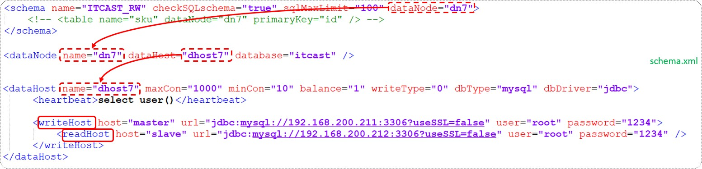

<font style="color:#33495D;">writeHost代表的是写操作对应的数据库，readHost代表的是读操作对应的数据库。   所以我们要想实现读写分离，就得配置writeHost关联的是主库，readHost关联的是从库。</font>

<font style="color:#33495D;">而仅仅配置好了writeHost以及readHost还不能完成读写分离，还需要配置一个非常重要的负责均衡  的参数 balance，取值有4种，具体含义如下：</font>


| **<font style="color:rgb(51, 73, 93);">参数值</font>** | <br/>**<font style="color:rgb(51, 73, 93);">含义</font>** |
| --- | --- |
| <font style="color:rgb(51, 73, 93);">0</font> | <font style="color:rgb(51, 73, 93);">不开启读写分离机制 , 所有读操作都发送到当前可用的writeHost上</font> |
| <br/><font style="color:rgb(51, 73, 93);">1</font> | <font style="color:rgb(51, 73, 93);">全部的readHost 与 备用的writeHost 都参与select 语句的负载均衡（主要针对于双主双从模式）</font> |
| <font style="color:rgb(51, 73, 93);">2</font> | <font style="color:rgb(51, 73, 93);">所有的读写操作都随机在writeHost , readHost上分发</font> |
| <br/><font style="color:rgb(51, 73, 93);">3</font> | <font style="color:rgb(51, 73, 93);">所有的读请求随机分发到writeHost对应的readHost上执行, writeHost不负担读压力</font> |


<font style="color:#33495D;">所以，在一主一从模式的读写分离中，balance配置1或3都是可以完成读写分离的。</font>

### <font style="color:#33495D;">server.xml配置</font>
<font style="color:#33495D;">配置root用户可以访问SHOPPING、ITCAST 以及 ITCAST_RW逻辑库。</font>

```plsql
<user name="root" defaultAccount="true">
<property name="password">123456</property>
<property name="schemas">SHOPPING,ITCAST,ITCAST_RW</property>
<!-- 表级 DML 权限设置 -->
<!--
<privileges check="true">
<schema name="DB01" dml="0110" >
<table name="TB_ORDER" dml="1110"></table>
</schema>
</privileges>
-->
</user>
```

### <font style="color:#33495D;">测试</font>
<font style="color:#33495D;">配置完毕MyCat后，重新启动MyCat。</font>

```plsql
bin/mycat stop
bin/mycat start
```

<font style="color:#33495D;">然后观察，在执行增删改操作时，对应的主库及从库的数据变化。   在执行查询操作时，检查主库及从库对应的数据变化。</font>

<font style="color:#33495D;">在测试中，我们可以发现当主节点Master宕机之后，业务系统就只能够读，而不能写入数据了。</font>


<font style="color:#33495D;">那如何解决这个问题呢？这个时候我们就得通过另外一种主从复制结构来解决了，也就是我们接下来讲  解的双主双从。</font>

## <font style="color:#33495D;">双主双从</font>
### <font style="color:#33495D;">介绍</font>
<font style="color:#33495D;">一个主机 Master1 用于处理所有写请求，它的从机 Slave1 和另一台主机 Master2 还有它的从机 Slave2 负责所有读请求。当 Master1 主机宕机后，Master2 主机负责写请求，Master1 、Master2 互为备机。架构图如下:</font>

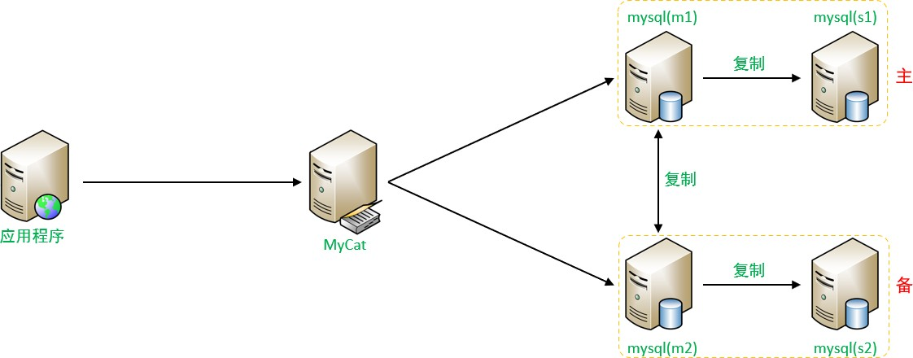


### <font style="color:#33495D;">准备</font>
<font style="color:#33495D;">我们需要准备5台服务器，具体的服务器及软件安装情况如下：</font>


| **<font style="color:rgb(51, 73, 93);">编号</font>** | **<font style="color:rgb(51, 73, 93);">IP</font>** | **<font style="color:rgb(51, 73, 93);">预装软件</font>** | **<font style="color:rgb(51, 73, 93);">角色</font>** |
| --- | --- | --- | --- |
| <font style="color:rgb(51, 73, 93);">1</font> | <font style="color:rgb(51, 73, 93);">192.168.200.210</font> | <font style="color:rgb(51, 73, 93);">MyCat、MySQL</font> | <font style="color:rgb(51, 73, 93);">MyCat中间件服务器</font> |
| <font style="color:rgb(51, 73, 93);">2</font> | <font style="color:rgb(51, 73, 93);">192.168.200.211</font> | <font style="color:rgb(51, 73, 93);">MySQL</font> | <font style="color:rgb(51, 73, 93);">M1</font> |
| <font style="color:rgb(51, 73, 93);">3</font> | <font style="color:rgb(51, 73, 93);">192.168.200.212</font> | <font style="color:rgb(51, 73, 93);">MySQL</font> | <font style="color:rgb(51, 73, 93);">S1</font> |
| <font style="color:rgb(51, 73, 93);">4</font> | <font style="color:rgb(51, 73, 93);">192.168.200.213</font> | <font style="color:rgb(51, 73, 93);">MySQL</font> | <font style="color:rgb(51, 73, 93);">M2</font> |
| <font style="color:rgb(51, 73, 93);">5</font> | <font style="color:rgb(51, 73, 93);">192.168.200.214</font> | <font style="color:rgb(51, 73, 93);">MySQL</font> | <font style="color:rgb(51, 73, 93);">S2</font> |


<font style="color:#777777;">关闭以上所有服务器的防火墙：</font>

```plsql
systemctl stop firewalld systemctl disable firewalld
```

### <font style="color:#33495D;">搭建</font>
#### <font style="color:#33495D;">主库配置</font>
##### **<font style="color:#33495D;">1). Master1(192.168.200.211)</font>**


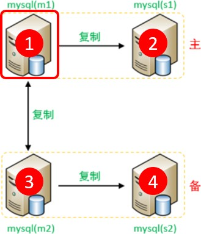

<font style="color:rgb(52,73,94);">A. 修改配置文件 /etc/my.cnf</font>

```plsql
#mysql 服务ID，保证整个集群环境中唯一，取值范围：1 – 2^32-1，默认为1
server-id=1
#指定同步的数据库
binlog-do-db=db01
binlog-do-db=db02
binlog-do-db=db03
# 在作为从数据库的时候，有写入操作也要更新二进制日志文件
log-slave-updates
```

<font style="color:rgb(52,73,94);">B. 重启MySQL服务器</font>

```plsql
systemctl restart mysqld
```

<font style="color:rgb(52,73,94);">C. 创建账户并授权</font>

```plsql
#创建itcast用户，并设置密码，该用户可在任意主机连接该MySQL服务
CREATE USER 'itcast'@'%' IDENTIFIED WITH mysql_native_password BY 'Root@123456'
;
#为 'itcast'@'%' 用户分配主从复制权限
GRANT REPLICATION SLAVE ON *.* TO 'itcast'@'%';
```

<font style="color:#33495D;">通过指令，查看两台主库的二进制日志坐标</font>

```plsql
show master status ;
```

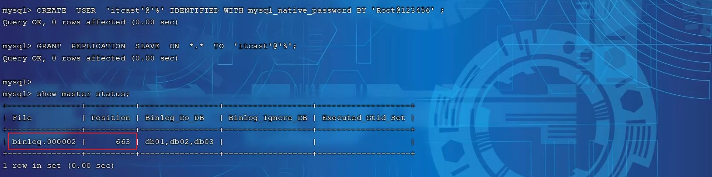


##### <font style="color:#33495D;">2). Master2(192.168.200.213)</font>


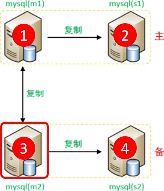


1. <font style="color:#33495D;">修改配置文件 /etc/my.cnf</font>

```plsql
#mysql 服务ID，保证整个集群环境中唯一，取值范围：1 – 2^32-1，默认为1
server-id=3
#指定同步的数据库
binlog-do-db=db01
binlog-do-db=db02
binlog-do-db=db03
# 在作为从数据库的时候，有写入操作也要更新二进制日志文件
log-slave-updates
```

2. <font style="color:#33495D;">重启MySQL服务器</font>

```plsql
systemctl restart mysqld
```

3. <font style="color:#33495D;">创建账户并授权</font>

```plsql
#创建itcast用户，并设置密码，该用户可在任意主机连接该MySQL服务
CREATE USER 'itcast'@'%' IDENTIFIED WITH mysql_native_password BY 'Root@123456'
;
#为 'itcast'@'%' 用户分配主从复制权限
GRANT REPLICATION SLAVE ON *.* TO 'itcast'@'%';
```

<font style="color:#33495D;">通过指令，查看两台主库的二进制日志坐标</font>

```plsql
show master status ;
```


#### <font style="color:#33495D;">从库配置</font>
##### **<font style="color:#33495D;">1). Slave1(192.168.200.212)</font>**


<font style="color:rgb(52,73,94);">A. 修改配置文件 /etc/my.cnf</font>

```plsql
#mysql 服务ID，保证整个集群环境中唯一，取值范围：1 – 232-1，默认为1
server-id=2
```

<font style="color:rgb(52,73,94);">B. 重新启动MySQL服务器</font>

```plsql
systemctl restart mysqld
```

##### <font style="color:#33495D;">2). Slave2(192.168.200.214)</font>
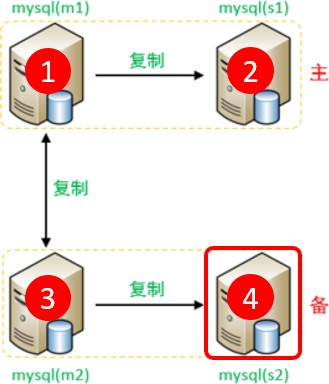


<font style="color:rgb(52,73,94);">A. 修改配置文件 /etc/my.cnf</font>

```plsql
#mysql 服务ID，保证整个集群环境中唯一，取值范围：1 – 232-1，默认为1
server-id=4
```

<font style="color:rgb(52,73,94);">B. 重新启动MySQL服务器</font>

```plsql
systemctl restart mysqld
```

#### <font style="color:#33495D;">从库关联主库</font>
1. **<font style="color:#33495D;">两台从库配置关联的主库</font>**

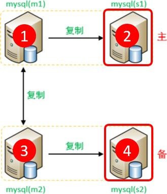


<font style="color:#777777;">需要注意slave1对应的是master1，slave2对应的是master2。</font>

<font style="color:#33495D;">A. 在 slave1(192.168.200.212)上执行</font>

```plsql
CHANGE MASTER TO MASTER_HOST='192.168.200.211', MASTER_USER='itcast',
MASTER_PASSWORD='Root@123456', MASTER_LOG_FILE='binlog.000002',
MASTER_LOG_POS=663;
```

<font style="color:rgb(52,73,94);">B. 在 slave2(192.168.200.214)上执行</font>

```plsql
CHANGE MASTER TO MASTER_HOST='192.168.200.213', MASTER_USER='itcast',
MASTER_PASSWORD='Root@123456', MASTER_LOG_FILE='binlog.000002',
MASTER_LOG_POS=663;
```

<font style="color:rgb(52,73,94);">C. 启动两台从库主从复制，查看从库状态</font>

```plsql
start slave;
show slave status \G;
```


#### <font style="color:#33495D;">两台主库相互复制</font>
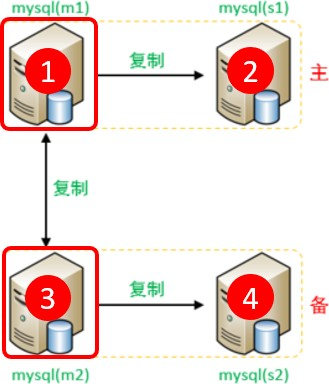

```plsql
Master2 复制 Master1，Master1 复制 Master2。
```

<font style="color:#33495D;">A. 在 Master1(192.168.200.211)上执行</font>

```plsql
CHANGE MASTER TO MASTER_HOST='192.168.200.213', MASTER_USER='itcast', 
MASTER_PASSWORD='Root@123456', MASTER_LOG_FILE='binlog.000002',
MASTER_LOG_POS=663;
```

<font style="color:#33495D;">B. 在 Master2(192.168.200.213)上执行</font>

```plsql
CHANGE MASTER TO MASTER_HOST='192.168.200.211', 
MASTER_USER='itcast', MASTER_PASSWORD='Root@123456',
MASTER_LOG_FILE='binlog.000002',
MASTER_LOG_POS=663;
```

<font style="color:#33495D;">C. 启动两台从库主从复制，查看从库状态</font>


```plsql
start slave;
show slave status \G;
```

<font style="color:#33495D;">经过上述的三步配置之后，双主双从的复制结构就已经搭建完成了。   接下来，我们可以来测试验证一下。</font>

### <font style="color:#33495D;">测试</font>
<font style="color:#33495D;">分别在两台主库Master1、Master2上执行DDL、DML语句，查看涉及到的数据库服务器的数据同步情  况。</font>

```plsql
create database db01;
use db01;
create table tb_user(
id int(11) not null primary key ,
name varchar(50) not null,
sex varchar(1)
)engine=innodb default charset=utf8mb4;
insert into tb_user(id,name,sex) values(1,'Tom','1');
insert into tb_user(id,name,sex) values(2,'Trigger','0');
insert into tb_user(id,name,sex) values(3,'Dawn','1');
insert into tb_user(id,name,sex) values(4,'Jack Ma','1');
insert into tb_user(id,name,sex) values(5,'Coco','0');
insert into tb_user(id,name,sex) values(6,'Jerry','1');
```

<font style="color:#33495D;">在Master1中执行DML、DDL操作，看看数据是否可以同步到另外的三台数据库中。 </font>

<font style="color:#33495D;">在Master2中执行DML、DDL操作，看看数据是否可以同步到另外的三台数据库中。</font>

<font style="color:#33495D;">完成了上述双主双从的结构搭建之后，接下来，我们再来看看如何完成这种双主双从的读写分离。</font>

## <font style="color:#33495D;">双主双从读写分离</font>
### <font style="color:#33495D;">配置</font>
<font style="color:#33495D;">MyCat控制后台数据库的读写分离和负载均衡由schema.xml文件datahost标签的balance属性控  制，通过writeType及switchType来完成失败自动切换的。</font>


1. <font style="color:#33495D;">schema.xml</font>

<font style="color:#33495D;">配置逻辑库：</font>

```plsql
<schema name="ITCAST_RW2" checkSQLschema="true" sqlMaxLimit="100" dataNode="dn7">
</schema>
```

<font style="color:#33495D;">配置数据节点：</font>

```plsql
<dataNode name="dn7" dataHost="dhost7" database="db01" />
```

<font style="color:#33495D;">配置节点主机：</font>

```plsql
<dataHost name="dhost7" maxCon="1000" minCon="10" balance="1" writeType="0"
dbType="mysql" dbDriver="jdbc" switchType="1" slaveThreshold="100">
<heartbeat>select user()</heartbeat>
<writeHost host="master1" url="jdbc:mysql://192.168.200.211:3306?
useSSL=false&amp;serverTimezone=Asia/Shanghai&amp;characterEncoding=utf8"
user="root" password="1234" >
<readHost host="slave1" url="jdbc:mysql://192.168.200.212:3306?
useSSL=false&amp;serverTimezone=Asia/Shanghai&amp;characterEncoding=utf8"
user="root" password="1234" />
</writeHost>
<writeHost host="master2" url="jdbc:mysql://192.168.200.213:3306?
useSSL=false&amp;serverTimezone=Asia/Shanghai&amp;characterEncoding=utf8"
user="root" password="1234" >
<readHost host="slave2" url="jdbc:mysql://192.168.200.214:3306?
useSSL=false&amp;serverTimezone=Asia/Shanghai&amp;characterEncoding=utf8"
user="root" password="1234" />
</writeHost>
</dataHost>
```

<font style="color:#33495D;">具体的对应情况如下：</font>

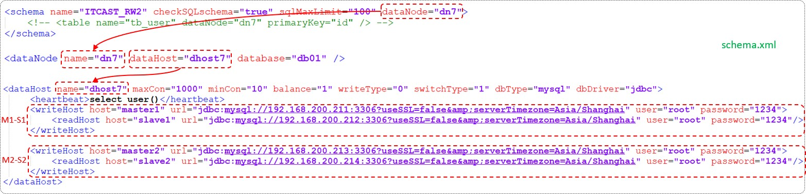

<font style="color:#33495D;">属性说明：</font>

> <font style="color:#777777;">balance="1"</font>
>
> <font style="color:#777777;">代表全部的 readHost 与 stand by writeHost 参与 select 语句的负载均衡，简单的说，当双主双从模式(M1->S1，M2->S2，并且 M1 与 M2 互为主备)，正常情况下， M2,S1,S2 都参与 select 语句的负载均衡 ;</font>
>
> <font style="color:rgb(119,119,119);">writeType </font>
>
> <font style="color:rgb(119,119,119);">0 : </font><font style="color:rgb(119,119,119);">写操作都转发到第</font><font style="color:rgb(119,119,119);">1</font><font style="color:rgb(119,119,119);">台</font><font style="color:rgb(119,119,119);">writeHost, writeHost1</font><font style="color:rgb(119,119,119);">挂了</font><font style="color:rgb(119,119,119);">, </font><font style="color:rgb(119,119,119);">会切换到</font><font style="color:rgb(119,119,119);">writeHost2</font><font style="color:rgb(119,119,119);">上</font><font style="color:rgb(119,119,119);">; </font>
>
> <font style="color:rgb(119,119,119);">1 : </font><font style="color:rgb(119,119,119);">所有的写操作都随机地发送到配置的</font><font style="color:rgb(119,119,119);">writeHost</font><font style="color:rgb(119,119,119);">上 </font><font style="color:rgb(119,119,119);">; </font>
>
> <font style="color:rgb(119,119,119);">switchType </font>
>
> <font style="color:rgb(119,119,119);">-1 : </font><font style="color:rgb(119,119,119);">不自动切换 </font>
>
> <font style="color:rgb(119,119,119);">1 : 自动切换</font>
>


2. <font style="color:#33495D;">user.xml</font>

<font style="color:#33495D;">配置root用户也可以访问到逻辑库 ITCAST_RW2。</font>

```plsql
<user name="root" defaultAccount="true">
<property name="password">123456</property>
<property name="schemas">SHOPPING,ITCAST,ITCAST_RW2</property>
<!-- 表级 DML 权限设置 -->
<!--
<privileges check="true">
<schema name="DB01" dml="0110" >
<table name="TB_ORDER" dml="1110"></table>
</schema>
</privileges>
-->
</user>
```

### <font style="color:#33495D;">测试</font>
<font style="color:#33495D;">登录MyCat，测试查询及更新操作，判定是否能够进行读写分离，以及读写分离的策略是否正确。</font>

<font style="color:#33495D;">当主库挂掉一个之后，是否能够自动切换。</font>

