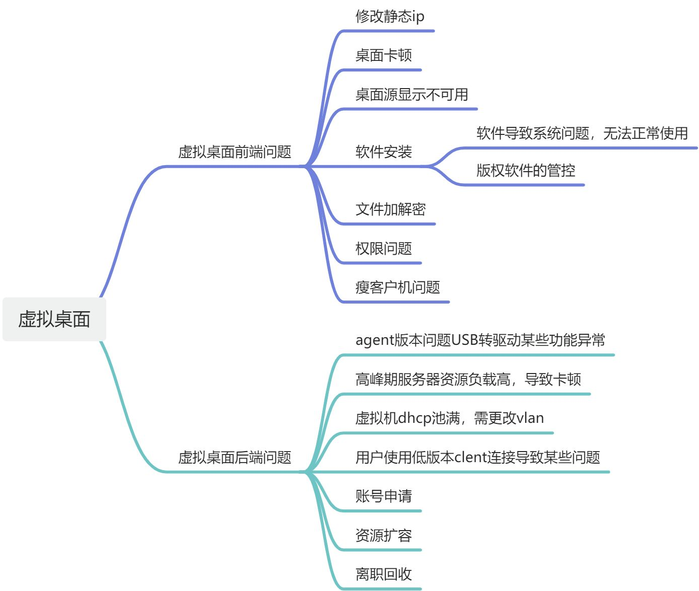

| | 问题 | 解决方案 |
| --- | --- | --- |
| 虚拟桌面前端问题 | 修改静态ip | 1.使用管理员登录到vc账户   2.搜索虚拟机名称   3.则可以通过horizon注销会话或者直接在vc控制台重启   4.进入虚拟机控制台，登录本地账户   5.修改ip为dhcp    |
| | 桌面卡顿 | 1.通过远程复现卡顿   2.根据同网段的虚拟机是否卡顿来排   除网络问题。   3.查看client版本是否是要求版本   4.根据实际情况判断 |
| | 桌面源显示不可用 | 1.进入horizon控制台查看状态   2.根据计算机名，进入vc控制台查看   虚拟机电源，网络状态是否正常   3.如果以上都没有异常，则可能是   agent代理掉线，重启虚拟机后再次    查看状态   4.如果horizon控制台还是显示代理掉线，则进入vc进入虚拟机控制台，进行agent的卸载和重装 |
| | 软件安装 | 1.根据在测试机安装该软件进行测试   2.如果安装没问题，说明可能是安装过程有问题   3.如果有问题，复现并且记录，在根据软件跟操作系统的兼容性进行判断 |
| | 文件加解密 | 1.根据文件正常打开是否乱码，以及   跟同事比较，进行判断是否是加密的问题导致   2.比较文件发送者和接受者之间的加密策略差异 |
| | 权限问题 | 1.桌面的软件安装权限管控   2.桌面的软件使用权限   3.文件服务器对应目录使用权限   4.管理员权限 |
| | 瘦客户机问题 | 1.瘦客户机dhcp网关是否为空   2.根据实际操作步骤，使用u盘将配置文件覆盖 |
| 虚拟桌面后端问题 | agent版本问题USB转驱动某些功能异常 | 1.进入horizon控制台查看对应计算机的agent版本   2.版本与预期不符   3.进入vc控制台，进入该虚拟机，进行agent的卸载，重装预期版本 |
| | 高峰期服务器资源负载高，导致卡顿 | 1.查看虚拟机所在主机的负载和虚拟机数量    2.如果负载过高，则需要进行迁移   3.如果虚拟机数量过多，会导致资源调度缓慢，从而导致卡顿   4.评估是否开起动态DRS |
| | 虚拟机dhcp池满，需更改vlan | 1.进入vc控制台查看对应虚拟机的状态，网络状态   2.网络状态异常   3.编辑虚拟机，修改虚拟机vlan |
| | 用户使用低版本clent连接导致某些问题 | 1.到现场进行版本升级   2.如果是linux的搜客户机，则需要刷上新系统 |
| | 账号申请 | 1.根据it单信息，进入horizon控制台，在对应的桌面池置备一台新计算机   2.进入ad域控，向制定安全组添加该用户   3.进入horizon控制台，将这个用户分配给这台置备好的计算机   4.将计算机名和加密备份策略交给同事进行相应的加密和备份 |
| | 资源扩容 | 1.根据it单信息，进入vc将用户的所需的资源进行扩容   2.如果是cpu内存显卡则需要关机进行扩容，需要联系用户先进行文件保存 |
| | 离职回收 | 1.根据离职表，提单给离职人员领导，进行审批   2.审批通过，进入horizon控制台，删除对应桌面 |

