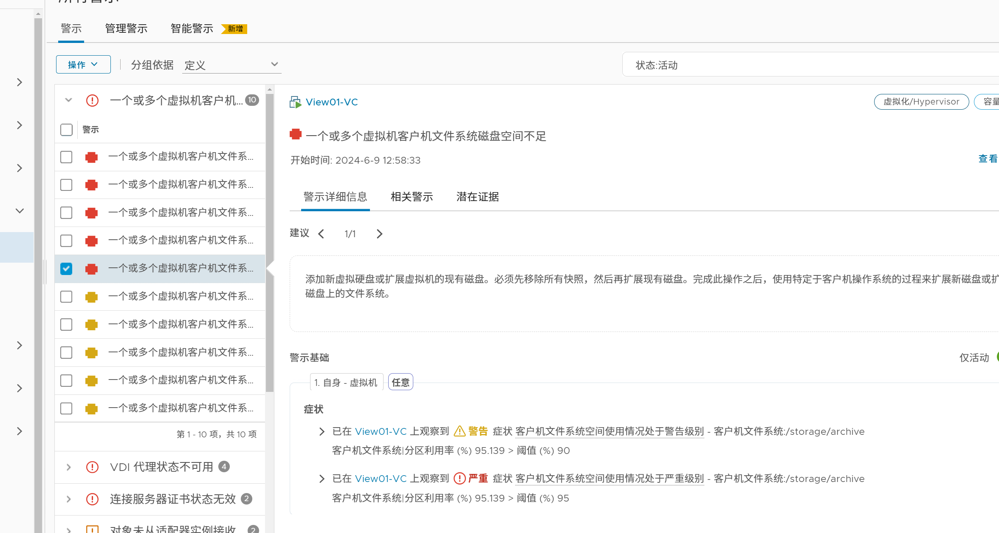
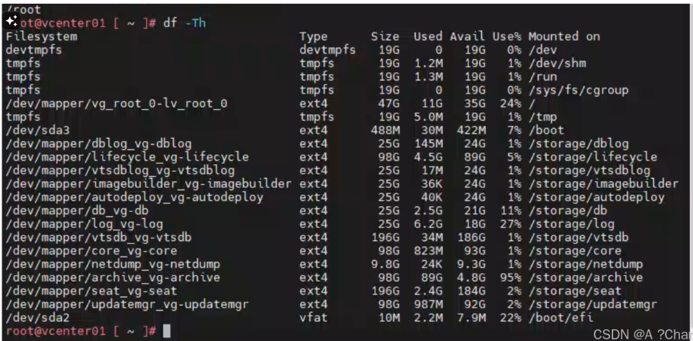
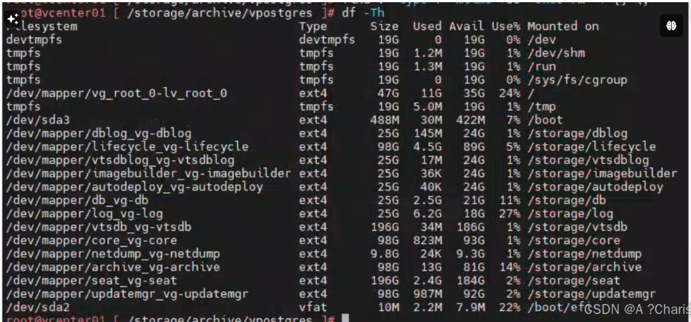

<font style="color:rgb(77, 77, 77);">一、根因</font>

1. **<font style="color:rgb(51, 51, 51);">vpostgres</font>**<font style="color:rgb(51, 51, 51);">：这个目录可能包含与 vCenter Server 使用的 PostgreSQL 数据库相关的归档文件过多，导致空间被占用。</font>

<font style="color:rgb(77, 77, 77);">二、处理过程</font>

<font style="color:rgb(77, 77, 77);">1、SSH登陆到Vcenter.</font>

<font style="color:rgb(77, 77, 77);">2、df -Th </font>



<font style="color:rgb(77, 77, 77);">**图中可以看到 /storage/archive 使用占比很高。</font>

<font style="color:rgb(79, 79, 79);background-color:rgb(238, 240, 244);">/storage/archive 目录通常用于存储归档的</font>[<font style="color:rgb(79, 79, 79);background-color:rgb(238, 240, 244);">日志文件</font>](https://so.csdn.net/so/search?q=%E6%97%A5%E5%BF%97%E6%96%87%E4%BB%B6&spm=1001.2101.3001.7020)<font style="color:rgb(79, 79, 79);background-color:rgb(238, 240, 244);">和其他历史数据。这些文件通常是由 vCenter Server 自动生成的，用于记录系统</font>

<font style="color:rgb(79, 79, 79);background-color:rgb(238, 240, 244);">操作、事件和其他重要信息。</font>

<font style="color:rgb(77, 77, 77);">处理方式选择：</font>

<font style="color:rgb(77, 77, 77);">保留近期30天的归档文件。</font>

```plain
cd /storage/archive/vpostgres
find . -type f -mtime +30 -exec rm -f {} \;
```

<font style="color:rgb(77, 77, 77);">三、处理结果</font>



