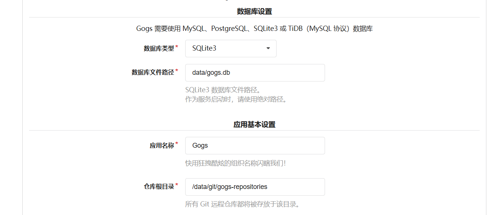
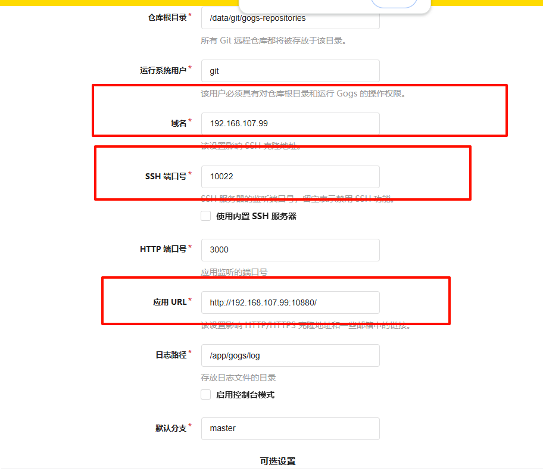
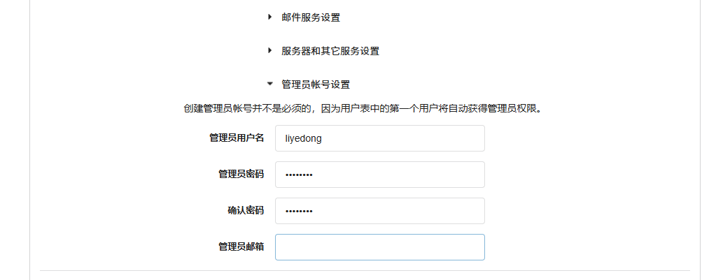
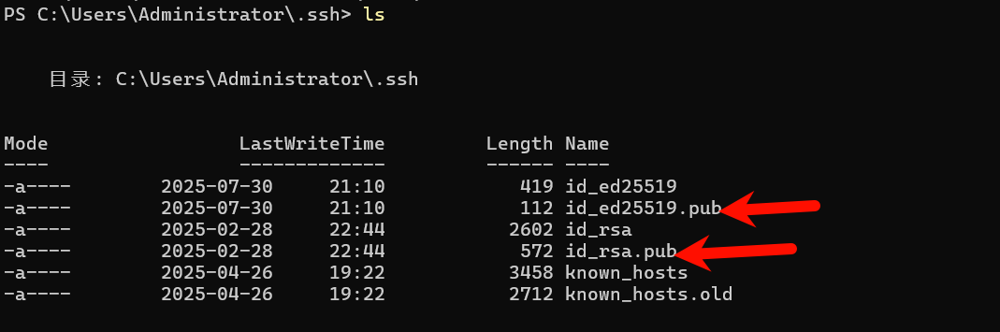
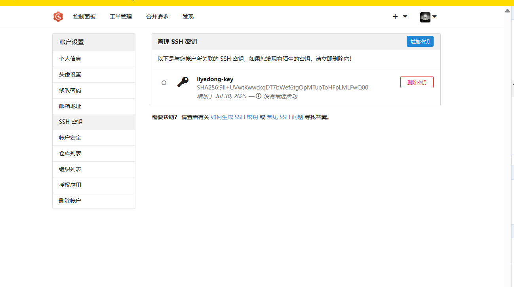
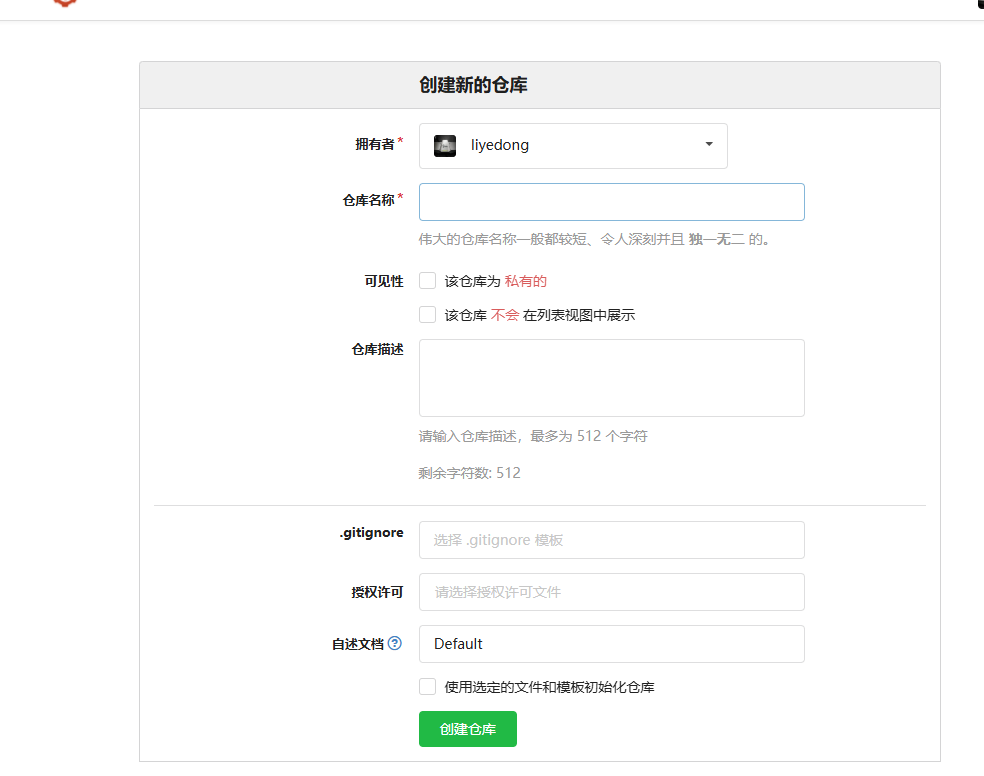
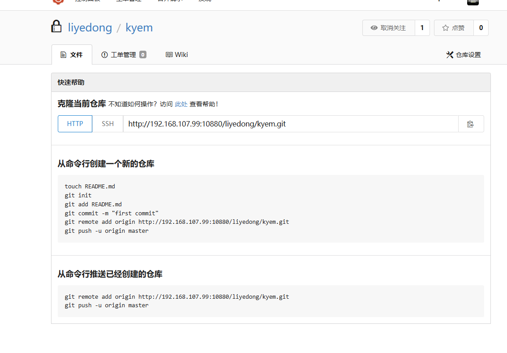

```bash
# Pull image from Docker Hub.
docker pull gogs/gogs:0.12.11
docker pull swr.cn-north-4.myhuaweicloud.com/ddn-k8s/docker.io/gogs/gogs:0.12.11
docker pull swr.cn-north-4.myhuaweicloud.com/ddn-k8s/docker.io/gogs/gogs:0.12.11
docker tag  swr.cn-north-4.myhuaweicloud.com/ddn-k8s/docker.io/gogs/gogs:0.12.11 docker.io/gogs/gogs:0.12.11# Create local directory for volume.
mkdir -p /u01/gogs

tee /u01/gogs/docker-compose.yml << 'EOF'
version: '3'

services:
  gogs:
    image: gogs/gogs:0.12.11
    container_name: gogs
    restart: always
    ports:
      - "10022:22"       # SSH 端口
      - "10880:3000"     # Web 访问端口
    volumes:
      - /u01/gogs:/data  # 数据卷挂载
EOF
cd /u01/gogs
docker-compose up -d
docker compose up -d

```

[http://192.168.107.99:10880/install](http://192.168.107.99:10880/install)








添加sshkey

```bash
PS C:\Users\Administrator\.ssh> cat .\id_ed25519.pub
ssh-ed25519 AAAAC3NzaC1lZDI1NTE5AAAAIEJtS/DdUM5mt4dEXdl07sME/Geu1HlHF4mEso2/U4Jp administrator@WIN-GKO56FN7DCD
```

两个都可以











