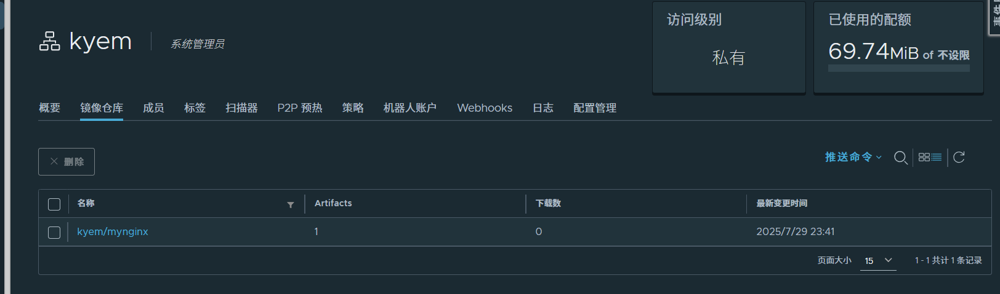

## 前提准备
一台安装docker的虚拟机

下载地址

[https://github.com/goharbor/harbor](https://github.com/goharbor/harbor)

release下载offline包

```bash
tar xzvf harbor-offline-installer-version.tgz
# tar xzvf harbor-offline-installer-v2.13.1.tgz
```

## 修改配置文件
```bash
cp harbor.yml.tmpl harbor.yml
mkdir -p /u01/harbor/data
chmod 777  /u01/harbor/data
#创建证书
mkdir -p /u01/harbor/certs
cd /u01/harbor/certs

cat > harbor-cert.conf <<EOF
[ req ]
default_bits       = 4096
prompt             = no
default_md         = sha256
distinguished_name = dn
x509_extensions    = v3_req

[ dn ]
C  = CN
ST = Beijing
L  = Beijing
O  = MyCompany
OU = IT
CN = harbor.liyedong.com

[ v3_req ]
subjectAltName = @alt_names

[ alt_names ]
DNS.1 = harbor.liyedong.com
IP.1  = 192.168.107.99
EOF
openssl req -x509 -nodes -days 365 -newkey rsa:4096 \
  -keyout harbor.key \
  -out harbor.crt \
  -config harbor-cert.conf \
  -extensions v3_req

mkdir -p /u01/harbor/certificate /u01/harbor/private/key
cp harbor.crt /u01/harbor/certificate/harbor.crt
cp harbor.key /u01/harbor/private/key/harbor.key
```

默认配置yml

```yaml
tee /u01/harbor/harbor.yml << 'EOF'
#指定hostname
hostname: harbor.liyedong.com
http:
  port: 80
https:
 port: 443
 certificate: /u01/harbor/certificate/harbor.crt
 private_key: /u01/harbor/private/key/harbor.key
harbor_admin_password: admin
database:
  password: root
  max_idle_conns: 100
  max_open_conns: 900
  conn_max_lifetime: 5m
  conn_max_idle_time: 0
#指定数据盘
data_volume: /u01/harbor/data  
trivy:
  ignore_unfixed: false
  skip_update: false
  skip_java_db_update: false
  offline_scan: false
  security_check: vuln
  insecure: false
  timeout: 5m0s
jobservice:
  max_job_workers: 10
  max_job_duration_hours: 24
  job_loggers:
    - STD_OUTPUT
    - FILE
  #必须加
  logger_sweeper_duration: 1h  
notification:
  webhook_job_max_retry: 3
  #必须加
  webhook_job_http_client_timeout: 10s
log:
  level: info
  local:
    rotate_count: 50
    rotate_size: 200M
    location: /var/log/harbor
_version: 2.13.0
proxy:
  http_proxy:
  https_proxy:
  no_proxy:
  components:
    - core
    - jobservice
    - trivy
upload_purging:
  enabled: true
  age: 168h
  interval: 24h
  dryrun: false
cache:
  enabled: false
  expire_hours: 24
EOF
```


```bash
docker pull swr.cn-north-4.myhuaweicloud.com/ddn-k8s/docker.io/goharbor/prepare:v2.13.1
docker tag  swr.cn-north-4.myhuaweicloud.com/ddn-k8s/docker.io/goharbor/prepare:v2.13.1  docker.io/goharbor/prepare:v2.13.1
docker rmi swr.cn-north-4.myhuaweicloud.com/ddn-k8s/docker.io/goharbor/prepare:v2.13.1
```


```bash
cd /u01/harbor
./prepare #生成docker-compose.yaml文件，如果更新harbor.yml文件后，需要重新执行
```

```bash
cat > /etc/systemd/system/harbor.service <<EOF
[Unit]
Description=Harbor Container Registry
After=docker.service
Requires=docker.service

[Service]
Type=oneshot
RemainAfterExit=yes
WorkingDirectory=/u01/harbor
ExecStart=/usr/bin/docker compose up -d
ExecStop=/usr/bin/docker compose down
TimeoutStartSec=0

[Install]
WantedBy=multi-user.target
EOF

# 使其生效
systemctl daemon-reload
systemctl enable --now harbor
systemctl status harbor

```

## 测试推送镜像
确保时间同步正常

推送节点操作

```bash
echo '192.168.107.99 harbor.liyedong.com' >> /etc/hosts
mkdir -p /etc/docker/certs.d/harbor.liyedong.com
#harbor节点上
cd /u01/harbor/certificate
scp harbor.crt 192.168.107.111:/etc/docker/certs.d/harbor.liyedong.com/ca.crt
#客户端
systemctl restart docker

[root@dify-app ~]# docker login harbor.liyedong.com
Username: admin
Password: 

WARNING! Your credentials are stored unencrypted in '/root/.docker/config.json'.
Configure a credential helper to remove this warning. See
https://docs.docker.com/go/credential-store/

Login Succeeded

docker tag nginx:latest harbor.liyedong.com/kyem/mynginx:1.29.0
[root@dify-app ~]# docker push harbor.liyedong.com/kyem/mynginx:1.29.0
The push refers to repository [harbor.liyedong.com/kyem/mynginx]
f17478b6e8f3: Pushed 
0662742b23b2: Pushed 
5c91a024d899: Pushed 
6b1b97dc9285: Pushed 
a6b19c3d00b1: Pushed 
30837a0774b9: Pushed 
7cc7fe68eff6: Pushed 
1.29.0: digest: sha256:3651f5785567a226fd58e33adcfb27b41a83ba0c3649d9ee9ac590acd97bad51 size: 1778
```



