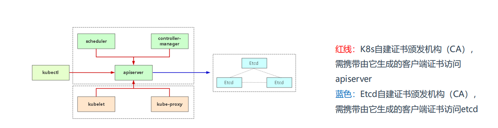

## 证书介绍
```bash
K8s证书一般分为两套：K8s组件（apiserver）和Etcd
假如按角色来分，证书分为管理节点和工作节点。
• 管理节点：如果是kubeadm部署则自动生成，如果是二进制部署一般由cfssl或者openssl生成。
• 工作节点：工作节点主要是指kubelet连接apiserver所需的客户端证书，这个证书由controller-manager组件自动颁发，默认
是一年，如果到期，kubelet将无法使用过期的证书连接apiserver，从而导致无法正常工作，日志会给出证书过期错误（x509: 
certificate has expired or is not yet valid）
```



### ✅ 1. Kubernetes 核心组件证书（控制平面）：
| 组件 | 证书文件 | 路径示例 |
| --- | --- | --- |
| kube-apiserver | `apiserver.crt`<br/> / `apiserver.key` | `/etc/kubernetes/pki/` |
| kube-controller-manager | `controller-manager.crt` | 同上 |
| kube-scheduler | `scheduler.crt` | 同上 |
| kubelet | `kubelet.crt` | `/var/lib/kubelet/pki/` |
| 集群 CA | `ca.crt`<br/> / `ca.key` | `/etc/kubernetes/pki/` |


### ✅ 2. etcd 相关证书：
| 证书 | 用途 |
| --- | --- |
| `etcd/ca.crt`<br/> / `ca.key` | etcd 的 CA 证书 |
| `etcd/server.crt`<br/> / `server.key` | etcd 对外通信 |
| `etcd/peer.crt`<br/> / `peer.key` | etcd 节点间通信（集群） |
| `etcd/healthcheck-client.crt`<br/> / `client.crt` | kube-apiserver 访问 etcd |


## kubeadm证书续签
### 方式 1：使用 `kubeadm certs renew`（**推荐**）
如果你是用 `kubeadm` 部署的 Kubernetes，可以用这个命令批量更新证书：

```bash
sudo kubeadm certs renew all
```

更新指定证书：

```bash
sudo kubeadm certs renew apiserver
```

更新后，**重启相关组件**（kubelet 会自动识别，但 docker 或 containerd 环境中组件可能需手动重启）：

```bash
systemctl restart kubelet
```

证书默认有效期为 **1年**，从 Kubernetes 1.19 起支持自动续期 kubelet 客户端证书（kubelet 自动轮换）。

```bash
[root@k8s-master pki]# kubeadm certs renew all
[renew] Reading configuration from the "kubeadm-config" ConfigMap in namespace "kube-system"...
[renew] Use 'kubeadm init phase upload-config --config your-config.yaml' to re-upload it.

certificate embedded in the kubeconfig file for the admin to use and for kubeadm itself renewed
certificate for serving the Kubernetes API renewed
certificate the apiserver uses to access etcd renewed
certificate for the API server to connect to kubelet renewed
certificate embedded in the kubeconfig file for the controller manager to use renewed
certificate for liveness probes to healthcheck etcd renewed
certificate for etcd nodes to communicate with each other renewed
certificate for serving etcd renewed
certificate for the front proxy client renewed
certificate embedded in the kubeconfig file for the scheduler manager to use renewed
certificate embedded in the kubeconfig file for the super-admin renewed

Done renewing certificates. You must restart the kube-apiserver, kube-controller-manager, kube-scheduler and etcd, so that they can use the new certificates.
[renew] 正在从 kube-system 命名空间中的 "kubeadm-config" ConfigMap 读取配置...
[renew] 若要重新上传配置文件，请使用命令 'kubeadm init phase upload-config --config your-config.yaml'

用于 admin 的 kubeconfig 文件中的证书已更新
用于 Kubernetes API 的服务证书已更新
apiserver 访问 etcd 所用的证书已更新
apiserver 与 kubelet 通信所用证书已更新
controller manager 使用的 kubeconfig 中嵌入的证书已更新
用于 etcd 健康检查的 liveness 探针证书已更新
etcd 节点间通信所用的证书已更新
etcd 对外服务的证书已更新
用于前端代理客户端（front-proxy）的证书已更新
scheduler 使用的 kubeconfig 中嵌入的证书已更新
super-admin（管理员）使用的 kubeconfig 中嵌入的证书已更新

证书更新完成。你必须 重启 kube-apiserver、kube-controller-manager、kube-scheduler 和 etcd，以便它们生效。

```

查看证书状态

```bash
[root@k8s-master pki]# kubeadm certs check-expiration
[check-expiration] Reading configuration from the "kubeadm-config" ConfigMap in namespace "kube-system"...
[check-expiration] Use 'kubeadm init phase upload-config --config your-config.yaml' to re-upload it.

CERTIFICATE                EXPIRES                  RESIDUAL TIME   CERTIFICATE AUTHORITY   EXTERNALLY MANAGED
admin.conf                 Apr 22, 2026 15:01 UTC   364d            ca                      no      
apiserver                  Apr 22, 2026 15:01 UTC   364d            ca                      no      
apiserver-etcd-client      Apr 22, 2026 15:01 UTC   364d            etcd-ca                 no      
apiserver-kubelet-client   Apr 22, 2026 15:01 UTC   364d            ca                      no      
controller-manager.conf    Apr 22, 2026 15:01 UTC   364d            ca                      no      
etcd-healthcheck-client    Apr 22, 2026 15:01 UTC   364d            etcd-ca                 no      
etcd-peer                  Apr 22, 2026 15:01 UTC   364d            etcd-ca                 no      
etcd-server                Apr 22, 2026 15:01 UTC   364d            etcd-ca                 no      
front-proxy-client         Apr 22, 2026 15:01 UTC   364d            front-proxy-ca          no      
scheduler.conf             Apr 22, 2026 15:01 UTC   364d            ca                      no      
super-admin.conf           Apr 22, 2026 15:01 UTC   364d            ca                      no      

CERTIFICATE AUTHORITY   EXPIRES                  RESIDUAL TIME   EXTERNALLY MANAGED
ca                      Apr 12, 2035 02:30 UTC   9y              no      
etcd-ca                 Apr 12, 2035 02:30 UTC   9y              no      
front-proxy-ca          Apr 12, 2035 02:30 UTC   9y              no
```

查看apiserver证书有效期

```bash
[root@k8s-master pki]# openssl x509 -in /etc/kubernetes/pki/apiserver.crt -noout -text | grep 'Not After'
            Not After : Apr 22 15:01:39 2026 GMT
```

重启kubelet

```bash
systemctl restart kubelet
```

重启apiserver etcd kube-controller-manager kube-scheduler

```bash
kubectl delete pod -n kube-system \ 
etcd-k8s-master.liyedong.com \
kube-apiserver-k8s-master.liyedong.com \
kube-controller-manager-k8s-master.liyedong.com \
kube-scheduler-k8s-master.liyedong.com
```

### **<font style="color:rgb(44,63,81);">Kubelet 证书自动续签(k8s1.19之后)</font>**
#### **<font style="color:rgb(44,63,81);">配置kube-controller-manager组件</font>**
```bash
vim /etc/kubernetes/manifests/kube-controller-manager.yaml
spec: 
containers: 
- command: 
- kube-controller-manager 
- --experimental-cluster-signing-duration=87600h0m0s 
- --feature-gates=RotateKubeletServerCertificate=true
...
添加上述两个参数：
• experimental-cluster-signing-duration=87600h0m0s 为kubelet客户端证书颁发有效期10年
• feature-gates=RotateKubeletServerCertificate=true 启用server证书颁发
配置完成后，重建pod使之生效：
kubectl delete pod kube-controller-manager-k8s-master -n kube-system
```

#### **<font style="color:rgb(44,63,81);">配置kubelet组件</font>**
```bash
默认kubelet证书轮转已启用：
# vi /var/lib/kubelet/config.yaml 
... 
rotateCertificates: true
```

#### 测试
```bash
找一台节点测试，先查看现有客户端证书有效期：
# cd /var/lib/kubelet/pki
# openssl x509 -in kubelet-client-current.pem -noout -dates
notBefore=May 25 09:01:24 2020 GMT
notAfter=May 25 09:01:24 2021 GMT
修改服务器时间，模拟证书即将到期：
# date -s "2021-5-20"
# systemctl restart kubelet
再查看证书有效期，可以看到已经是十年：
# openssl x509 -in kubelet-client-current.pem -noout -dates 
notBefore=Aug 8 15:44:55 2020 GMT 
notAfter=May 23 09:05:30 2030 GMT
```

## CA证书续签
在 Kubernetes 中，**CA 证书**（比如 `ca.crt`、`etcd-ca.crt`、`front-proxy-ca.crt`）的续签与普通 kubeadm 生成的服务证书不同，因为它们是整个集群信任链的根。如果直接更新 CA，会导致已经签发的证书失效，所以一般不推荐随意续签根 CA，而是 **在根 CA 到期前计划升级集群或重新生成证书**。

---

### **1️⃣**** 检查 CA 证书**
```bash
kubeadm certs check-expiration
```

你已经执行过，会显示 CA 证书的到期时间（你这里还有 9 年）。

---

### **2️⃣**** 续签 CA 证书的注意事项**
+ Kubernetes 官方建议 **不直接续签 CA 证书**，除非：
    - 集群根 CA 已过期或即将过期。
    - 你有完整的集群备份。
+ 更新根 CA 的步骤非常谨慎，因为：
    - 所有由这个 CA 签发的证书（apiserver、etcd、kubelet 等）都会失效。
    - 需要重新生成所有组件证书并重新部署。

---

### **3️⃣**** 如果必须续签 CA（高级操作）**
仅当集群即将到期，且有完全备份时操作：

1. **生成新的 CA**

```bash
kubeadm init phase certs ca
kubeadm init phase certs etcd-ca
kubeadm init phase certs front-proxy-ca
```

+ 这会在 `/etc/kubernetes/pki/` 下生成新的 CA 文件（`*.crt` / `*.key`）。
1. **备份旧 CA**

```bash
mkdir -p ~/k8s-pki-backup
cp -r /etc/kubernetes/pki/* ~/k8s-pki-backup/
```

1. **重新生成依赖 CA 的证书**

```bash
kubeadm init phase certs apiserver
kubeadm init phase certs apiserver-kubelet-client
kubeadm init phase certs controller-manager
kubeadm init phase certs scheduler
kubeadm init phase certs etcd-server
kubeadm init phase certs etcd-peer
kubeadm init phase certs etcd-healthcheck-client
```

1. **重新部署组件**
+ 可能需要重启 kube-apiserver、controller-manager、scheduler、etcd。

---

### **4️⃣**** 更安全的方案**
+ 如果 CA 证书还有几年有效期（像你现在的情况 9 年），**无需操作**。
+ 平时只需关注 **kubeadm 管理的服务证书**（apiserver、kubelet 等），这些可以单独续签：

```bash
kubeadm certs renew all
```

+ 这样 CA 不动，服务证书更新完成。

---

✅ **总结**：

+ **CA 证书续签非常敏感**，直接操作风险大。
+ 正常情况下只续签服务证书即可。
+ 你当前 CA 证书还有 9 年，不需要立即续签。
+ 当 CA 真的到期时，需要备份集群并计划完整的 CA 替换和证书重新生成。

---

如果你需要，我可以帮你写一份 **仅续签 Kubernetes 服务证书而不动 CA 的安全命令集合**，保证 apiserver、etcd、kubelet 等证书更新而集群不停机。

你希望我直接写吗？

