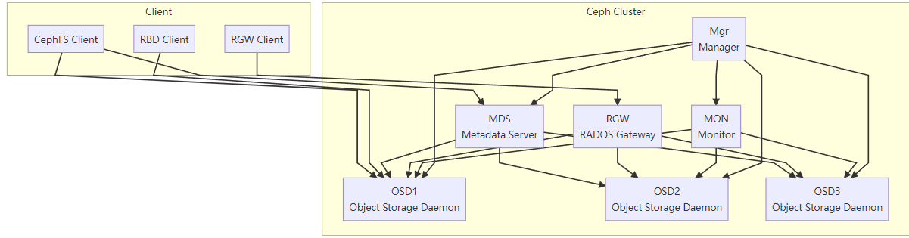

##  Ceph 核心组件简介  
### 1. **RADOS（Reliable Autonomic Distributed Object Store）**
Ceph 的底层存储系统，负责数据的存储、复制、恢复、再平衡等功能，确保数据的可靠性和一致性。[博客园](https://www.cnblogs.com/w1ng/p/13225594.html?utm_source=chatgpt.com)

### 2. **OSD（Object Storage Daemon）**
对象存储守护进程，负责实际的数据存储和处理。每个 OSD 通常对应一个物理磁盘，集群中通常部署多个 OSD 以实现数据的分布式存储。

### 3. **MON（Monitor）**
监视器，负责维护集群的状态信息，包括集群成员、映射关系等，确保集群的一致性和健康状态。

### 4. **MDS（Metadata Server）**
元数据服务器，专用于 CephFS（Ceph 文件系统），管理文件系统的元数据，如目录结构、权限等。

### 5. **RGW（RADOS Gateway）**
对象网关，提供兼容 S3 和 Swift 的 RESTful API 接口，支持对象存储服务。

### 6. **RBD（RADOS Block Device）**
块设备，提供块存储服务，常用于虚拟机磁盘、数据库等场景。

### 7. **CephFS（Ceph File System）**
分布式文件系统，支持 POSIX 接口，适用于需要共享文件系统的应用场景。

### 8. **Mgr（Manager）**
管理器，提供集群的监控、告警、负载均衡等功能，并支持插件扩展，如 Dashboard、Prometheus 等。

##  Ceph 架构图  

💡 **说明**：

+ 客户端（Client）包括 CephFS、RBD 和 RGW 三种接口。
+ Ceph 集群（Ceph Cluster）由 MON、Mgr、MDS、OSD 和 RGW 等组件组成。
+ 客户端通过相应的组件与 OSD 交互，实现数据的读写操作。
+ MON 负责集群的状态监控，Mgr 提供管理和监控功能，MDS 管理文件系统的元数据，RGW 提供对象存储服务。

## 部署
部署方式[https://docs.ceph.com/en/latest/cephadm/install/#cephadm-deploying-new-cluster](https://docs.ceph.com/en/latest/cephadm/install/#cephadm-deploying-new-cluster)

