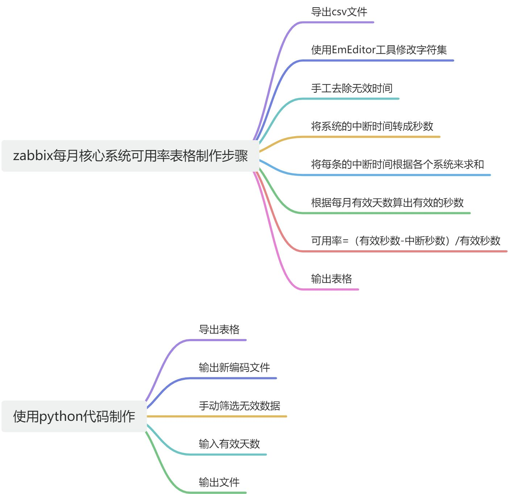

### <font style="color:rgb(51, 51, 51);">重复性的工作场景解决</font>
<font style="color:rgb(51, 51, 51);">核心系统可用率报告</font>

<font style="color:rgb(51, 51, 51);">场景：我需要通过zabbix导出的表格数据处理成核心系统可用率报告。</font>



<font style="color:rgb(51, 51, 51);">处理步骤：</font>

1. <font style="color:rgb(51, 51, 51);">需要转换编码为gb2313，导出默认为utf-8</font>
2. <font style="color:rgb(51, 51, 51);">确认无效的时间，通过动作为空确认，人为将无效时间的数据设为空</font>
3. <font style="color:rgb(51, 51, 51);">将持续时间 11h 11m 11s 这种格式数据转成秒数</font>
4. <font style="color:rgb(51, 51, 51);">将本月有效天数*14（8-22点） * 3600转成本月有效秒数</font>
5. <font style="color:rgb(51, 51, 51);">将每个系统的中断时间求和。</font>
6. <font style="color:rgb(51, 51, 51);">得出每个系统可用率，（本月有效时间-中断时间）/本月有效时间</font>
7. <font style="color:rgb(51, 51, 51);">得出可用率</font>

<font style="color:rgb(51, 51, 51);">如何让ai帮我省略这些复制过程和计算过程</font>

+ <font style="color:rgb(51, 51, 51);">计算过程告诉ai</font>
+ <font style="color:rgb(51, 51, 51);">首先我让ai通过python帮我筛选出动作列为空的数据</font>
+ <font style="color:rgb(51, 51, 51);">直接告诉 将这种格式的11h 11m 11s时间数据转为秒数</font>
+ <font style="color:rgb(51, 51, 51);">再根据本月有效天数*14（8-22点） * 3600转成本月有效秒数</font>
+ <font style="color:rgb(51, 51, 51);">根据公式计算出系统可用率</font>
+ <font style="color:rgb(51, 51, 51);">最后输出文件</font>
+ <font style="color:rgb(51, 51, 51);">打包成exe文件</font>

<font style="color:rgb(51, 51, 51);">具体自然语言</font>

```python
通过python的pandas处理csv文件，删除动作列缺省的数据
python的pandas处理csv文件，将持续时间这一列转成秒数，字符串可能为11h 11m 11s，11h 11s 和11m 11s，使用正则表达式
计算有效率
    dayNumber = int(input('*********请输入本月有效天数:'))
    sNumber = dayNumber * 14 * 3600#14小时*3600秒*本月有效天数=本月有效总秒数
使用python将主机列相同的中断时间（秒）数据进行求和
    # 使用 groupby 和 sum 来按问题列进行分组并相加持续时间
    grouped_df = df.groupby('主机', as_index=False)['中断时间（秒）'].sum()
    print(grouped_df)
    grouped_df['中断时间（秒）'] = grouped_df['中断时间（秒）'].astype(int)
    grouped_df['可用性'] = round(((sNumber - grouped_df['中断时间（秒）']) / sNumber),4)*100

```


<font style="color:rgb(51, 51, 51);">效率提升：30分钟->3分钟，而且还得跟着文档操作，现在只需要手工筛选后运行程序，exe运行点两下，最后复制结果到excel</font>

<font style="color:rgb(51, 51, 51);">后续优化，写一个定时运行爬虫直接爬取相应表格，自动进行转换编码和输出，计算输出对应表格</font>

### <font style="color:rgb(51, 51, 51);">自然语言转语言函数</font>
<font style="color:rgb(51, 51, 51);">因为每门语言都有很多的api，我们不一定知道每个api的作用，那个api适合我们的场景</font>

<font style="color:rgb(51, 51, 51);">1.JavaScript列表头插入一条数据，列表头插入一条数据</font>

<font style="color:rgb(51, 51, 51);">列表头插入api使用较少，如果查阅百度谷歌，可能需要手动筛选，直接询问ai，它会直接给出相应的api和使用示例</font>

<font style="color:rgb(51, 51, 51);">如：</font>

<font style="color:rgb(51, 51, 51);">在 JavaScript 中，你可以使用 </font><font style="color:rgb(51, 51, 51);background-color:rgb(243, 244, 244);">unshift</font><font style="color:rgb(51, 51, 51);"> 方法在列表头部插入一条数据，使用 </font><font style="color:rgb(51, 51, 51);background-color:rgb(243, 244, 244);">push</font><font style="color:rgb(51, 51, 51);"> 方法在列表尾部插入一条数据。以下是这两种操作的示例：</font>

<font style="color:rgb(51, 51, 51);">在列表头部插入一条数据：</font>

```plain
// 创建一个示例列表
let myArray = [2, 3, 4];

// 在列表头部插入一条数据
myArray.unshift(1);

// 输出结果
console.log(myArray);  // 输出 [1, 2, 3, 4]
```

<font style="color:rgb(51, 51, 51);">在列表尾部插入一条数据：</font>

```plain
// 创建一个示例列表
let myArray = [1, 2, 3];

// 在列表尾部插入一条数据
myArray.push(4);

// 输出结果
console.log(myArray);  // 输出 [1, 2, 3, 4]
```

<font style="color:rgb(51, 51, 51);">在这两个示例中，</font><font style="color:rgb(51, 51, 51);background-color:rgb(243, 244, 244);">unshift</font><font style="color:rgb(51, 51, 51);"> 方法用于在列表头部插入数据，</font><font style="color:rgb(51, 51, 51);background-color:rgb(243, 244, 244);">push</font><font style="color:rgb(51, 51, 51);"> 方法用于在列表尾部插入数据。确保替换示例中的数据和列表以适应你的实际需求。</font>

<font style="color:rgb(51, 51, 51);">并且他将注释和用户实列都给我们了，很方便我们学习和使用，下次遇到就可以直接使用了。</font>

<font style="color:rgb(51, 51, 51);">有了ai，我们就相当于有一个编程大神手把手的教我们写代码，非常方便，并且如果遇到一些异常可以问他， 他会给出异常可能引起的原因和可能可以解决方案。</font>

### <font style="color:rgb(51, 51, 51);">linux终端命令使用</font>
<font style="color:rgb(51, 51, 51);">比如我们现在需要以交互模式进入容器，可能我们不熟练的话，可能就会忘记，直接询问ai即可马上得到答案，不用我们去翻笔记和把百度，节省了很多时间，还有就是不同版本的网络ip修改，可能我们平时修改的ip是7版本的系统，使用8版本的话，可能一之间不知道如何修改，直接对ai说：我想将centos8的ip修改为xxx，网关修改为xxx，dns修改为xxx等，他就会马上给出答案，这种常见问题他是经过大量的数据训练的，大部分时候答案都是对的，以及防火墙管理，比如我们要开放指定端口的防火墙流量，就可以这样说：centos8开放8080端口的流量，允许流量进出。还有selinux的管理，有的服务或者程序可能会被selinux阻止，需要关闭，一时间又想不起来，直接对它说：centos8关闭selinux。</font>

<font style="color:rgb(51, 51, 51);">总结：ai可以教我们很方便的使用linux的命令，相当于一个知道非常多命令的一个知识库，根据我们的自然语言转换成命令实现。</font>

### <font style="color:rgb(51, 51, 51);">简易脚本的编写</font>
<font style="color:rgb(51, 51, 51);">场景1：需要批量修改hosts解析，修改注册表</font>

<font style="color:rgb(51, 51, 51);">直接对ai说，帮我把xxxxxxx解析写入到windows的hosts解析，修改xxxx的xxxx值的注册表，使用bat文件。马上就可以输出一个脚本。</font>

<font style="color:rgb(51, 51, 51);">场景2：虚拟桌面文件权限问题</font>

<font style="color:rgb(51, 51, 51);">文件权限问题1：用户旧桌面备份文件因为管控管理员权限，无法正常读写，甚至部分文件夹无法正常打开，需要解决权限问题，如果在备份时可以不带权限，还原进一个文件夹，就可以直接用脚本然后下发一个策略，建一个文件并且授权，然后还原到这个文件夹即可。</font>

<font style="color:rgb(51, 51, 51);">文件权限问题2：如果nbu还原时，无法取消权限，则可能需要脚本来进行遍历文件夹的文件进行提权。</font>

<font style="color:rgb(51, 51, 51);">像这种简单的脚本，将我们的需求准备描述给ai就可以帮我们写出脚本，自己在测试环境进行测试可行性，最后评审下发，可以提高非常多的效率。</font>

<font style="color:rgb(51, 51, 51);">等等很多重复简单的工作都可以使用脚本来执行。</font>

### <font style="color:rgb(51, 51, 51);">ai语音对话</font>
可以语音对话，像真人一样，家里有小孩的可以作为家教来使用。

演示：

除法好难啊，我该怎么办？

### 软件自动安装脚本
horizon8.0client安装

```plain
@echo off
echo Installing Horizon Client 8.0...

REM 定义安装包的路径
set INSTALLER_PATH=%~dp0VMware-Horizon-Client-2006-8.0.0-16531419.exe

REM 安装 Horizon Client
echo Installing Horizon Client...
"%INSTALLER_PATH%" /s /v/qn

REM 检查安装结果
if %errorlevel% equ 0 (
    echo Horizon Client 8.0 has been successfully installed.
) else (
    echo Failed to install Horizon Client 8.0.
)

echo Installation complete.
```

运行bat脚本自动安装

演示，虚拟机进行演示

### 其他
ai还可以教我们使用docker搭建靶机，一般的靶场都会有容器版本，使用docker搭建非常快，不用了以后直接删除容器即可。

dvwa靶场搭建

```python
docker pull vulnerables/web-dvwa
docker run -dt -p 8080:80 vulnerables/web-dvwa
```

#### <font style="color:rgb(51, 51, 51);">总结</font>
<font style="color:rgb(51, 51, 51);">ai就相当于你旁边坐着一个拥有超级大脑的人，并且这个人无偿回答你，你想问，他就在，非常方便。</font>

