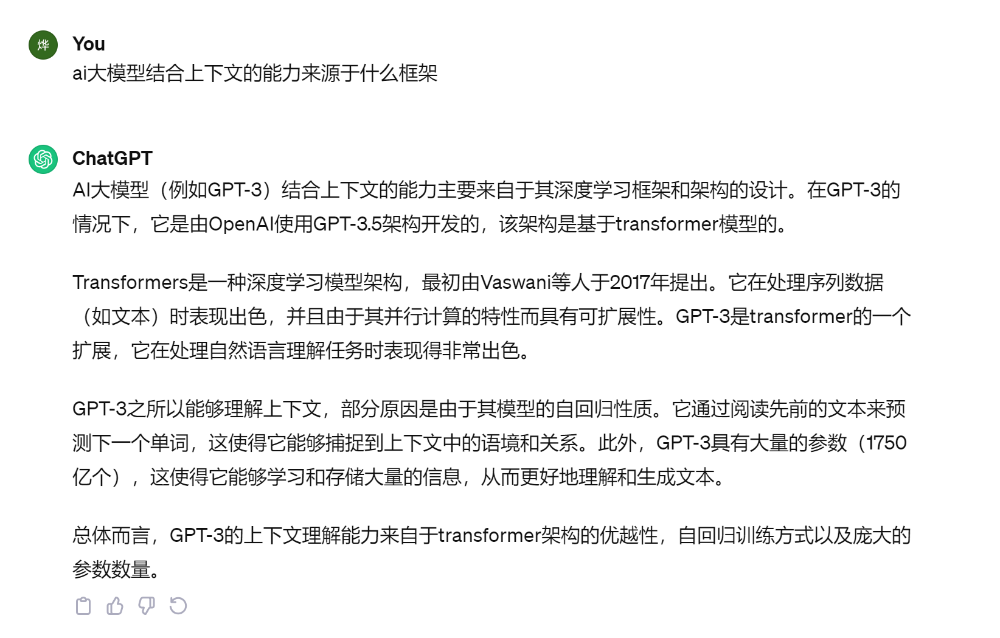

**1、给定扮演的角色，发挥它的潜力**

**比如**你是XXX专家、我是XXX专家、采用领导与小白对话方式等

这里注意：你是XXX专家，那GPT这时候扮演的是专家，你是助理，如果输入的是我是XXX专家，那GPT反之，它是助理。

**举例：**

假如你是一位伟大的数据分析师，请帮我梳理一个XXX业务的分析框架，要求结构清晰，采用XXX的风格进行输出

**2、让答案更有逻辑，引入成熟的思维模型**

**比如** SCAMPER创新思维法、结构化思维、5W2H、PDCA等

**举例：**

我希望你成为内容创作和营销方面的专家，专门制作引人入胜的故事。我的第一个建议请求是使用 SCAMPER 框架创建一个营销活动大纲，提出创造性的方法来替代、结合、调整、修改、用于其他用途、消除或重新安排我们的产品或服务，以使其对目标客户更具吸引力。

**3、心智模型，让输出更加专业清晰**

比如：卡诺模型、吸引力法则、克鲁格效应、28原则等

举例：

我想让你作为心理模型、营销活动和客户增长方面的提示工程师专家，

专门为[产品/服务]的增长利用'80/20规则'。

我的第一个建议要求是写一篇文章，概述一个营销活动，

利用'80/20规则'（也称为帕累托原则）来确定和优先考虑对[产品/服务]增长最有影响的领域。

**4、采用对比的方式，让答案更有趣**

**比如**优略势、优缺点、不同领域专家等

**举例：**

我希望你成为内容创作和营销方面的专家，专门擅长对比的格式。我的第一个建议请求是使用“对比”框架编写营销活动大纲，该框架对比两个或多个选项/想法，以帮助目标客户色做出明智的决定。解释每个选项的优缺点，并提供示例来支持你的观点。

**5、用业务固定的模式，让答案更专业**

**比如：**创新矩阵、用户体验生命周期、AAARRR、Bullseye框架、增长飞轮等

**举例：**

我希望你能作为增长黑客和AARRR（海盗指标）框架的专家，专门概述客户旅程的关键阶段。我的第一个建议要求是使用 "AARRR（海盗指标）"框架编写一份营销活动大纲，概述我们[产品/服务]的客户旅程的关键阶段，并描述我们将如何获得、激活、保留、推荐和创造[理想客户角色]的收入。包括具体的战术和指标，你会用它来衡量每个阶段的成功。

**6、限定输出，GPT可以多种方式**

**比如**表格、对话、诗歌、计划书、论文、JSON、markdown等

**举例：**

请制作一个2022年关于中国四大一线城市（北京、上海、广州、深圳）的基本信息对比表，包括人口、GDP和面积，用表格形式

**7、常规场景交流，分几步去问，你与GPT同时思考**

**比如**按照行业分析的报告框架、书写文章的步骤、计划书的主要结构等

**举例：**

第一问：了解数据分析，比如数据分析师的未来，主要讨论了数据分析师的历史发展、当前的现状和未来的挑战

第二问：我应该如何做？我想学习数据分析，但我是小白，请告诉我数据分析的基本知识和原则

第三问：帮我推荐一些学习资源，请推荐一些数据分析的书籍、视频、课程以及建议

你还可以继续问下去，这样带着节奏和思考去和GPT聊天，让自己的问题得到的答案会更加明确，具有针对性

**再比如**大家经常做行业分析报告，那就可以根据行业研究的框架进行逐一的询问：

第一问：行业概况，包含行业基本面的一些数据，比如行业整体规模、年度产销增长率

第二问：产业链分工上有哪些角色，各自的价值贡献是什么？在每一个产业链角色中，参与企业数量是多少？

第三问：企业间竞争核心是技术还是营销或服务？行业的技术研发能力如何，与国外相比差异如何？

第四问：产业竞争环境如何？这是企业对自身所处的竞争环境做出的综合评估，即“五力竞争模型”，发展阶段等等

.......

### 8、上下文结合

### 9、充当Linux终端
从现在开始请你充当一个centos8的linux终端，我输入命令，你只需要返回命令执行结果。

