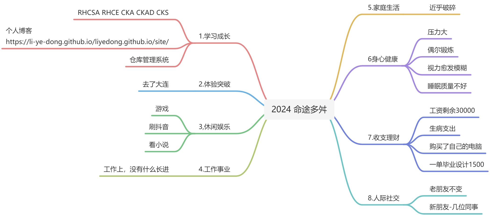

:::info
📒   让我们站在以年为节点的时间线上，看看一年时间做了什么、未来还能做什么

:::

## 年度回顾
> 整体回顾本年度大概做了哪些事。
>

## 成长关键词
> 给自己一个贴切的年度关键词。这就像一本书的目录，能够让你快速想起之后的事情。
>

+ 毕业后的第一年，5个认证
+ 迷茫的一年
+ 支离破碎的一年

## End：总结与期待
> 给自己的这一年写一段总结，或为明年立一些Flag：
>

- [ ] 使用Django和fastapi各完成一个项目，使用k8s+工具实现cicd，ansible实战
- [ ] 涨工资
- [ ] 早睡早起，养好身体
- [ ] 学习全栈开发！！！

