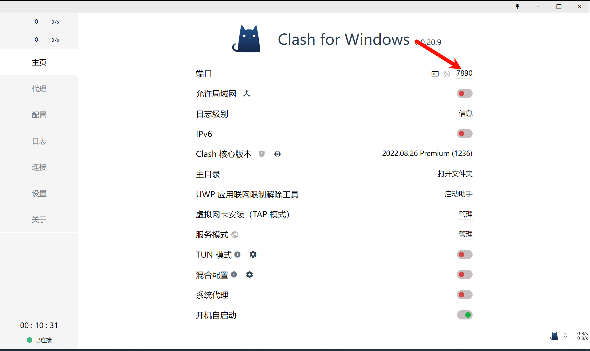
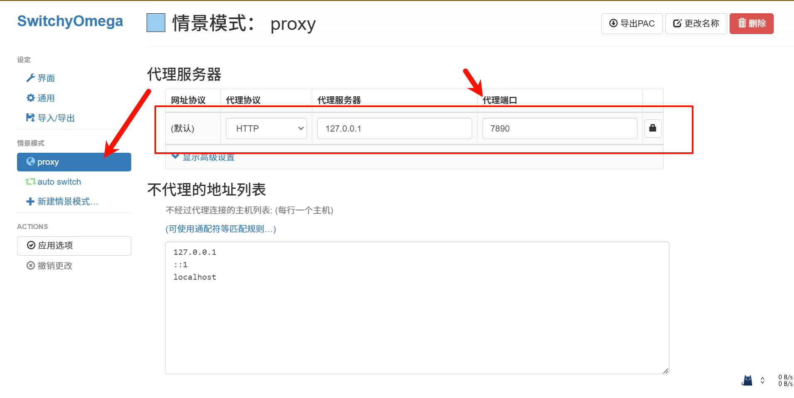
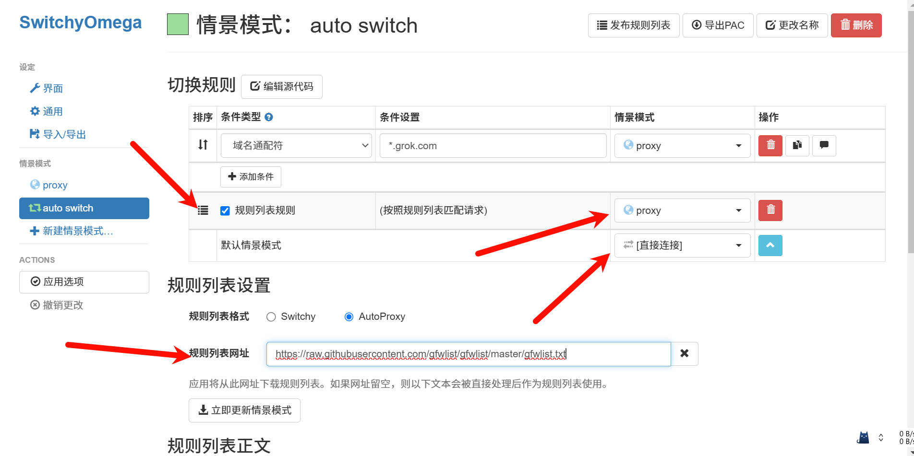
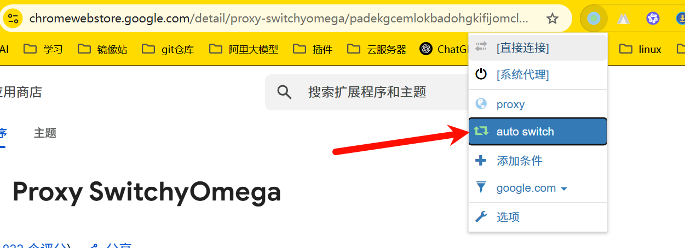
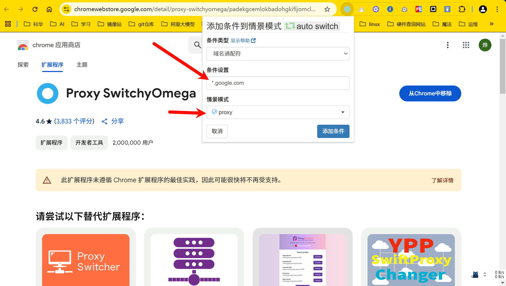

# SwitchyOmega智能代理
浏览器拓展

[https://www.chajianxw.com/developer/30451.html](https://www.chajianxw.com/developer/30451.html)

[https://chromewebstore.google.com/detail/proxy-switchyomega/padekgcemlokbadohgkifijomclgjgif?hl=zh-CN](https://chromewebstore.google.com/detail/proxy-switchyomega/padekgcemlokbadohgkifijomclgjgif?hl=zh-CN)

规则地址

[https://raw.githubusercontent.com/gfwlist/gfwlist/master/gfwlist.txt](https://raw.githubusercontent.com/gfwlist/gfwlist/master/gfwlist.txt)

查看代理使用的端口

添加代理使用的端口

添加在规则内使用代理

选中这个

手动添加域名条件到匹配规则

