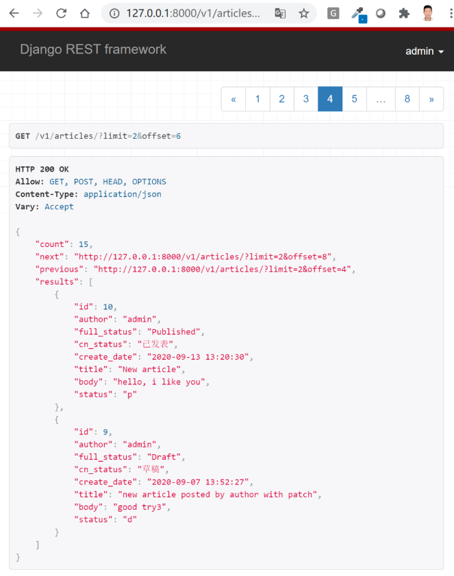

## <font style="color:rgb(39, 38, 43);">为什么要分页?</font>
<font style="color:rgb(92, 89, 98);">当你的数据库数据量非常大时，如果一次将这些数据查询出来, 必然加大了服务器内存的负载,降低系统的运行速度。一种更好的方式是将数据分段展示给用户。如果用户在展示的分段数据中没有找到自己的内容，可以通过指定页码或翻页的方式查看更多数据，直到找到自己想要的内容为止。</font>

## <font style="color:rgb(39, 38, 43);">DRF提供的分页类</font>
<font style="color:rgb(92, 89, 98);">Django REST Framework提供了3种分页类，接下来我们会分别进行演示。</font>

+ **<font style="color:rgb(92, 89, 98);">PageNumberPagination</font>**<font style="color:rgb(92, 89, 98);">：普通分页器。支持用户按?page=3&size=10这种更灵活的方式进行查询，这样用户不仅可以选择页码，还可以选择每页展示数据的数量。通常还需要设置max_page_size这个参数限制每页展示数据的最大数量，以防止用户进行恶意查询(比如size=10000), 这样一页展示1万条数据将使分页变得没有意义。</font>
+ **<font style="color:rgb(92, 89, 98);">LimitOffsetPagination</font>**<font style="color:rgb(92, 89, 98);">：偏移分页器。支持用户按?limit=20&offset=100这种方式进行查询。offset是查询数据的起始点，limit是每页展示数据的最大条数，类似于page_size。当你使用这个类时，你通常还需要设置max_limit这个参数来限制展示给用户数据的最大数量。</font>
+ **<font style="color:rgb(92, 89, 98);">CursorPagination类</font>**<font style="color:rgb(92, 89, 98);">：加密分页器。这是DRF提供的加密分页查询，仅支持用户按响应提供的上一页和下一页链接进行分页查询，每页的页码都是加密的。使用这种方式进行分页需要你的模型有”created”这个字段，否则你要手动指定ordering排序才能进行使用。</font>

### <font style="color:rgb(39, 38, 43);">PageNumberPagination类</font>
<font style="color:rgb(92, 89, 98);">DRF中使用默认分页类的最简单方式就是在</font>`<font style="color:rgb(92, 89, 98);background-color:rgb(245, 246, 250);">settings.py</font>`<font style="color:rgb(92, 89, 98);">中进行全局配置，如下所示：</font>

```python
REST_FRAMEWORK ={
    'DEFAULT_PAGINATION_CLASS':'rest_framework.pagination.PageNumberPagination',
    'PAGE_SIZE':2
}
```

<font style="color:rgb(92, 89, 98);">展示效果如下，每页展示两条记录, 不支持用户指定每页展示数据的数量。</font>

<font style="color:rgb(92, 89, 98);">但是如果你希望用户按</font>`<font style="color:rgb(92, 89, 98);background-color:rgb(245, 246, 250);">?page=3&size=10</font>`<font style="color:rgb(92, 89, 98);">这种更灵活的方式进行查询，你就要进行个性化定制。在实际开发过程中，定制比使用默认的分页类更常见，具体做法如下。</font>

<font style="color:rgb(92, 89, 98);">第一步: 在app目录下新建</font>`<font style="color:rgb(92, 89, 98);background-color:rgb(245, 246, 250);">pagination.py</font>`<font style="color:rgb(92, 89, 98);">, 添加如下代码：</font>

```python
#blog/pagination.py
from rest_framework.pagination import PageNumberPagination

class MyPageNumberPagination(PageNumberPagination):
    page_size = 2   # default page size
    page_size_query_param = 'size'  # ?page=xx&size=??
    max_page_size = 10 # max page size
```

<font style="color:rgb(92, 89, 98);">我们自定义了一个</font>`<font style="color:rgb(92, 89, 98);background-color:rgb(245, 246, 250);">MyPageNumberPagination</font>`<font style="color:rgb(92, 89, 98);">类，该类继承了</font>`<font style="color:rgb(92, 89, 98);background-color:rgb(245, 246, 250);">PageNumberPagination</font>`<font style="color:rgb(92, 89, 98);">类。我们通过</font>`<font style="color:rgb(92, 89, 98);background-color:rgb(245, 246, 250);">page_size</font>`<font style="color:rgb(92, 89, 98);">设置了每页默认展示数据的条数，通过</font>`<font style="color:rgb(92, 89, 98);background-color:rgb(245, 246, 250);">page_size_query_param</font>`<font style="color:rgb(92, 89, 98);">设置了每页size的参数名以及通过</font>`<font style="color:rgb(92, 89, 98);background-color:rgb(245, 246, 250);">max_page_size</font>`<font style="color:rgb(92, 89, 98);">设置了每个可以展示的最大数据条数。</font>

<font style="color:rgb(92, 89, 98);">第二步：使用自定义的分页类</font>

<font style="color:rgb(92, 89, 98);">在基于类的视图中，你可以使用</font>`<font style="color:rgb(92, 89, 98);background-color:rgb(245, 246, 250);">pagination_class</font>`<font style="color:rgb(92, 89, 98);">这个属性使用自定义的分页类，如下所示：</font>

```python
from rest_framework import viewsets
from .pagination import MyPageNumberPagination

class ArticleViewSet(viewsets.ModelViewSet):
    # 用一个视图集替代ArticleList和ArticleDetail两个视图
    queryset = Article.objects.all()
    serializer_class = ArticleSerializer
    pagination_class = MyPageNumberPagination

    # 自行添加，将request.user与author绑定
    def perform_create(self, serializer):
        serializer.save(author=self.request.user)

    # 自行添加，将request.user与author绑定
    def perform_update(self, serializer):
        serializer.save(author=self.request.user)
```

<font style="color:rgb(92, 89, 98);">当然定制分页类不限于指定</font>`<font style="color:rgb(92, 89, 98);background-color:rgb(245, 246, 250);">page_size</font>`<font style="color:rgb(92, 89, 98);">和</font>`<font style="color:rgb(92, 89, 98);background-color:rgb(245, 246, 250);">max_page_size</font>`<font style="color:rgb(92, 89, 98);">这些属性，你还可以改变响应数据的输出格式。比如我们这里希望把next和previous放在一个名为</font>`<font style="color:rgb(92, 89, 98);background-color:rgb(245, 246, 250);">links</font>`<font style="color:rgb(92, 89, 98);">的key里，我们可以修改</font>`<font style="color:rgb(92, 89, 98);background-color:rgb(245, 246, 250);">MyPageNumberPagination</font>`<font style="color:rgb(92, 89, 98);">类，重写</font>`<font style="color:rgb(92, 89, 98);background-color:rgb(245, 246, 250);">get_paginated_response</font>`<font style="color:rgb(92, 89, 98);">方法：</font>

```python
from rest_framework.pagination import PageNumberPagination
from rest_framework.response import Response


class MyPageNumberPagination(PageNumberPagination):
    page_size = 2   # default page size
    page_size_query_param = 'size'  # ?page=xx&size=??
    max_page_size = 10 # max page size


    def get_paginated_response(self, data):
        return Response({
            'links': {
                'next': self.get_next_link(),
                'previous': self.get_previous_link()
            },
            'count': self.page.paginator.count,
            'results': data
        })
```

<font style="color:rgb(92, 89, 98);">注意：重写</font>`<font style="color:rgb(92, 89, 98);background-color:rgb(245, 246, 250);">get_paginated_response</font>`<font style="color:rgb(92, 89, 98);">方法非常有用，你还可以给分页响应数据传递额外的内容，比如code状态码等等。</font>


<font style="color:rgb(92, 89, 98);">前面的例子中我们只在单个基于类的视图或视图集中使用到了分页类，你还可以修改</font>`<font style="color:rgb(92, 89, 98);background-color:rgb(245, 246, 250);">settings.py</font>`<font style="color:rgb(92, 89, 98);">全局使用你自定义的分页类，如下所示。展示效果是一样的，我们就不详细演示了。</font>

```python
REST_FRAMEWORK = {
    'DEFAULT_PAGINATION_CLASS':
    'blog.pagination.MyPageNumberPagination',
}
```

### <font style="color:rgb(39, 38, 43);">LimitOffsetPagination类</font>
<font style="color:rgb(92, 89, 98);">使用这个分页类最简单的方式就是在</font>`<font style="color:rgb(92, 89, 98);background-color:rgb(245, 246, 250);">settings.py</font>`<font style="color:rgb(92, 89, 98);">中进行全局配置，如下所示：</font>

```python
REST_FRAMEWORK = {
    'DEFAULT_PAGINATION_CLASS':
    'rest_framework.pagination.LimitOffsetPagination'
}
```

<font style="color:rgb(92, 89, 98);">展示效果如下所示，从第6条数据查起，每页展示2条。</font>



<font style="color:rgb(92, 89, 98);">你也可以自定义</font>`<font style="color:rgb(92, 89, 98);background-color:rgb(245, 246, 250);">MyLimitOffsetPagination</font>`<font style="color:rgb(92, 89, 98);">类，在单个视图或视图集中使用，或者全局使用。</font>

```python
from rest_framework.pagination import LimitOffsetPagination


class MyLimitOffsetPagination(LimitOffsetPagination):
    default_limit = 5   # default limit per age
    limit_query_param = 'limit'  # default is limit
    offset_query_param = 'offset'  # default param is offset
    max_limit = 10 # max limit per age
```

### <font style="color:rgb(39, 38, 43);">CursorPagination类</font>
<font style="color:rgb(92, 89, 98);">使用这个分页类最简单的方式同样是在</font>`<font style="color:rgb(92, 89, 98);background-color:rgb(245, 246, 250);">settings.py</font>`<font style="color:rgb(92, 89, 98);">中进行全局配置。</font>

```python
REST_FRAMEWORK = {
    'DEFAULT_PAGINATION_CLASS':
    'rest_framework.pagination.CursorPagination',
    'PAGE_SIZE': 2
}
```

<font style="color:rgb(92, 89, 98);">展示效果如下所示：</font>


<font style="color:rgb(92, 89, 98);">什么? 为什么会出错误? 使用</font>`<font style="color:rgb(92, 89, 98);background-color:rgb(245, 246, 250);">CursorPagination</font>`<font style="color:rgb(92, 89, 98);">类需要你的模型里有</font>`<font style="color:rgb(92, 89, 98);background-color:rgb(245, 246, 250);">created</font>`<font style="color:rgb(92, 89, 98);">这个字段，否则你需要手动指定</font>`<font style="color:rgb(92, 89, 98);background-color:rgb(245, 246, 250);">ordering</font>`<font style="color:rgb(92, 89, 98);">字段。这是因为</font>`<font style="color:rgb(92, 89, 98);background-color:rgb(245, 246, 250);">CursorPagination</font>`<font style="color:rgb(92, 89, 98);">类只能对排过序的查询集进行分页展示。我们的Article模型只有</font>`<font style="color:rgb(92, 89, 98);background-color:rgb(245, 246, 250);">create_dat</font>`<font style="color:rgb(92, 89, 98);">e字段，没有created这个字段，所以会报错。</font>

<font style="color:rgb(92, 89, 98);">为了解决这个问题，我们需要自定义一个</font>`<font style="color:rgb(92, 89, 98);background-color:rgb(245, 246, 250);">MyCursorPagination</font>`<font style="color:rgb(92, 89, 98);">类，手动指定按</font>`<font style="color:rgb(92, 89, 98);background-color:rgb(245, 246, 250);">create_date</font>`<font style="color:rgb(92, 89, 98);">排序, 如下所示：</font>

```python
#blog/pagination.py
from rest_framework.pagination import CursorPagination


class MyArticleCursorPagination(CursorPagination):
    page_size = 3 # Default number of records per age
    page_size_query_param = 'page_size' 
    cursor_query_param = 'cursor' # Default is cursor
    ordering = '-create_date'
```

<font style="color:rgb(92, 89, 98);">修改</font>`<font style="color:rgb(92, 89, 98);background-color:rgb(245, 246, 250);">settings.py</font>`<font style="color:rgb(92, 89, 98);">, 使用自己定义的分页类。</font>

```python
REST_FRAMEWORK = {
    'DEFAULT_PAGINATION_CLASS':
    'blog.pagination.MyArticleCursorPagination',
}
```

<font style="color:rgb(92, 89, 98);">响应效果如下所示，你将得到previous和next分页链接。页码都加密了, 链接里不再显示页码号码。默认每页展示3条记录, 如果使用?page_size=2进行查询，每页你将得到两条记录。</font>

<font style="color:rgb(92, 89, 98);">当然由于这个</font>`<font style="color:rgb(92, 89, 98);background-color:rgb(245, 246, 250);">ordering</font>`<font style="color:rgb(92, 89, 98);">字段与模型相关，我们并不推荐全局使用自定义的CursorPagination类，更好的方式是在GenericsAPIView或视图集viewsets中通过</font>`<font style="color:rgb(92, 89, 98);background-color:rgb(245, 246, 250);">pagination_class</font>`<font style="color:rgb(92, 89, 98);">属性指定，如下所示：</font>

```python
from rest_framework import viewsets
from .pagination import  MyArticleCursorPagination

class ArticleViewSet(viewsets.ModelViewSet):
    # 用一个视图集替代ArticleList和ArticleDetail两个视图
    queryset = Article.objects.all()
    serializer_class = ArticleSerializer
    pagination_class = MyArticleCursorPagination

    # 自行添加，将request.user与author绑定
    def perform_create(self, serializer):
        serializer.save(author=self.request.user)


    # 自行添加，将request.user与author绑定
    def perform_update(self, serializer):
        serializer.save(author=self.request.user)
```

## <font style="color:rgb(39, 38, 43);">函数类视图中使用分页类</font>
<font style="color:rgb(92, 89, 98);">注意</font>`<font style="color:rgb(92, 89, 98);background-color:rgb(245, 246, 250);">pagination_class</font>`<font style="color:rgb(92, 89, 98);">属性仅支持在</font>`<font style="color:rgb(92, 89, 98);background-color:rgb(245, 246, 250);">genericsAPIView</font>`<font style="color:rgb(92, 89, 98);">和视图集viewset中配置使用。如果你使用函数或简单的APIView开发API视图，那么你需要对你的数据进行手动分页，一个具体使用例子如下所示：</font>

```python
from rest_framework.pagination import PageNumberPagination

class ArticleList0(APIView):
    """
    List all articles, or create a new article.
    """
    def get(self, request, format=None):
        articles = Article.objects.all()

        page = PageNumberPagination()  # 产生一个分页器对象
        page.page_size = 3  # 默认每页显示的多少条记录
        page.page_query_param = 'page'  # 默认查询参数名为 page
        page.page_size_query_param = 'size'  # 前台控制每页显示的最大条数
        page.max_page_size = 10  # 后台控制显示的最大记录条数

        ret = page.paginate_queryset(articles, request)
        serializer = ArticleSerializer(ret, many=True)
        return Response(serializer.data)
```

## <font style="color:rgb(39, 38, 43);">小结</font>
<font style="color:rgb(92, 89, 98);">本文总结了DRF提供的3种分页类，介绍了如何自定义分页类并详细演示了如何使用它们。下章我们将介绍如何对DRF返回的响应数据进行过滤和排序。</font>

