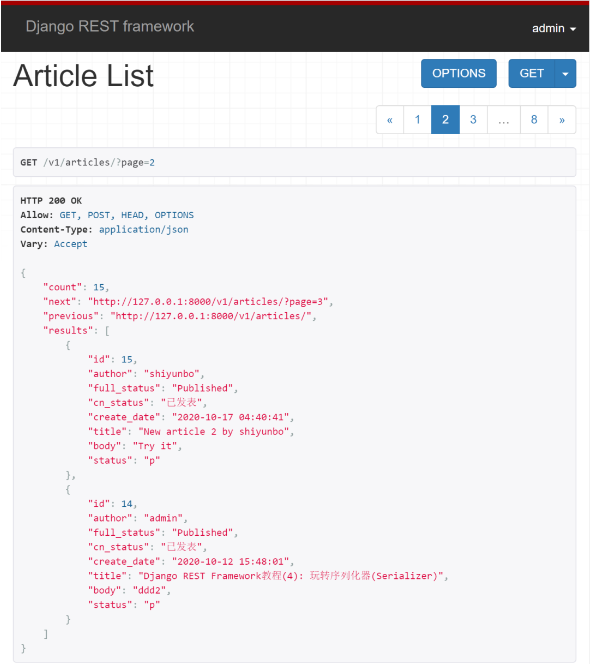
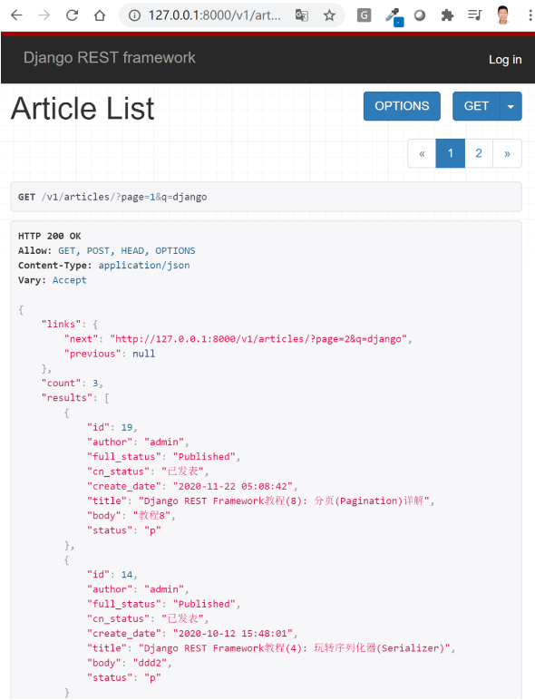
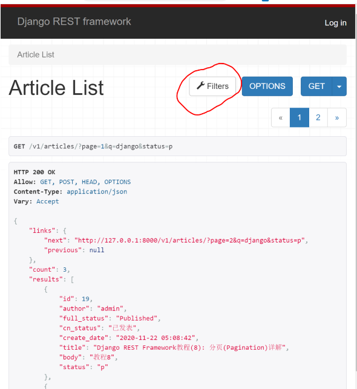
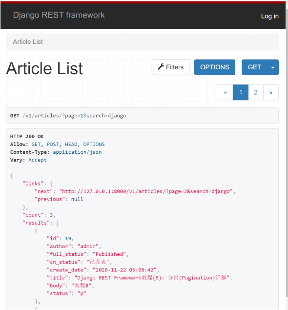
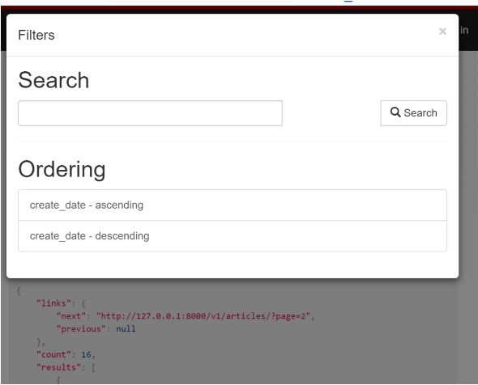

<font style="color:rgb(92, 89, 98);">在前面的DRF系列教程中，我们以博客为例介绍了序列化器(Serializer), 并使用基于类的视图APIView和ModelViewSet开发了针对文章资源进行增删查改的完整API端点，并详细对权限、认证(含jwt认证)和分页进行了总结与演示。在本篇文章中我们将向你演示如何在Django REST Framework中对分页结果进行进一步过滤和排序。</font>

## <font style="color:rgb(39, 38, 43);">前情回顾</font>
<font style="color:rgb(92, 89, 98);">前面教程中当你发送GET请求到/v1/articles?page=2时可以得到下面返回的分页数据列表。现在我们希望对结果进行进一步过滤，比如返回标题含有关键词django的文章资源列表。我们到底该怎么做呢? 本例中小编我将演示三种过滤方法, 你可以根据实际项目开发需求去使用。</font>



## <font style="color:rgb(39, 38, 43);">方法一: 重写get_queryset方法</font>
<font style="color:rgb(92, 89, 98);">此方法不依赖于任何第三方包, 只适合于需要过滤的字段比较少的模型。比如这里我们希望对文章title进行过滤，我们只需要修改ArticleList视图函数类即可。</font>

```python
# blog/views.py

from rest_framework import generics
from rest_framework import permissions
from .permissions import IsOwnerOrReadOnly
from .pagination import MyPageNumberPagination

class ArticleList(generics.ListCreateAPIView):
    serializer_class = ArticleSerializer
    permission_classes = (permissions.IsAuthenticatedOrReadOnly,)
    pagination_class = MyPageNumberPagination

    def get_queryset(self):
        keyword = self.request.query_params.get('q')
        if not keyword:
            queryset = Article.objects.all()
        else:
            queryset = Article.objects.filter(title__icontains=keyword)
        return queryset

    # associate user with article author.
    def perform_create(self, serializer):
        serializer.save(author=self.request.user)
```

<font style="color:rgb(92, 89, 98);">修改好视图类后，发送GET请求到/v1/articles?page=1&q=django, 你将得到所有标题含有django关键词的文章列表，这里显示一共有3条结果。</font>



**<font style="color:rgb(92, 89, 98);">注意</font>**<font style="color:rgb(92, 89, 98);">：DRF中你通过</font>`<font style="color:rgb(92, 89, 98);background-color:rgb(245, 246, 250);">request.query_params</font>`<font style="color:rgb(92, 89, 98);">获取GET请求发过来的参数，而不是request.GET。如果你希望获取从URL里传递的参数，你可以使用</font>`<font style="color:rgb(92, 89, 98);background-color:rgb(245, 246, 250);">self.kwargs['param1']</font>`<font style="color:rgb(92, 89, 98);">。</font>

<font style="color:rgb(92, 89, 98);">假如你的URL配置如下所示：</font>

```python
re_path('^articles/(?P<username>.+)/$', AricleList.as_view()),
```

<font style="color:rgb(92, 89, 98);">在视图中你可以通过</font>`<font style="color:rgb(92, 89, 98);background-color:rgb(245, 246, 250);">self.kwargs['username']</font>`<font style="color:rgb(92, 89, 98);">获取URL传递过来的用户名。</font>

```python
class ArticleList(generics.ListAPIView):
    serializer_class = ArticleSerializer

    def get_queryset(self):
        """
        按用户名查询发表文章清单
        """
        username = self.kwargs['username']
        return Article.objects.filter(author__username=username)
```

<font style="color:rgb(92, 89, 98);">当一个模型需要过滤的字段很多且不确定时(比如文章状态、正文等等), 重写get_queryset方法将变得非常麻烦，更好的方式是借助django-filter这个第三方库实现过滤。</font>

## <font style="color:rgb(39, 38, 43);">方法二: 使用django-filter</font>
`<font style="color:rgb(92, 89, 98);background-color:rgb(245, 246, 250);">django-filter</font>`<font style="color:rgb(92, 89, 98);">库包含一个</font>`<font style="color:rgb(92, 89, 98);background-color:rgb(245, 246, 250);">DjangoFilterBackend</font>`<font style="color:rgb(92, 89, 98);">类，该类支持REST框架的高度可定制的字段过滤。这也是小编推荐的过滤方法, 因为它自定义需要过滤的字段非常方便, 还可以对每个字段指定过滤方法(比如模糊查询和精确查询)。具体使用方式如下：</font>

### <font style="color:rgb(39, 38, 43);">安装django-filter</font>
```python
pip install django-filter
```

<font style="color:rgb(92, 89, 98);">把</font>`<font style="color:rgb(92, 89, 98);background-color:rgb(245, 246, 250);">django_filters</font>`<font style="color:rgb(92, 89, 98);">添加到INSTALLED_APPS中去。</font>

```python
INSTALLED_APPS = [
    ...,
    django_filters,
]
```

<font style="color:rgb(92, 89, 98);">接下来你还需要把</font>`<font style="color:rgb(92, 89, 98);background-color:rgb(245, 246, 250);">DjangoFilterBackend</font>`<font style="color:rgb(92, 89, 98);">设为过滤后台。你可以在</font>`<font style="color:rgb(92, 89, 98);background-color:rgb(245, 246, 250);">settings.py</font>`<font style="color:rgb(92, 89, 98);">中进行全局配置。</font>

```python
REST_FRAMEWORK = {
    'DEFAULT_FILTER_BACKENDS': ['django_filters.rest_framework.DjangoFilterBackend']
}
```

<font style="color:rgb(92, 89, 98);">还可以在单个视图中使用它。</font>

```python
from django_filters import rest_framework

class ArticleList(generics.ListCreateAPIView):

    # new: filter backends and classes
    filter_backends = (rest_framework.DjangoFilterBackend,)
```

<font style="color:rgb(92, 89, 98);">在类视图中使用django-filter时，你可以直接通过</font>`<font style="color:rgb(92, 89, 98);background-color:rgb(245, 246, 250);">filterset_fields</font>`<font style="color:rgb(92, 89, 98);">设置希望过滤的字段，如下所示：</font>

```python
from django_filters import rest_framework

class ArticleList(generics.ListCreateAPIView):

    # new: filter backends and classes
    filter_backends = (rest_framework.DjangoFilterBackend,)
    filterset_fields = ['title', 'status']
```

<font style="color:rgb(92, 89, 98);">如果你希望进行更多定制化的行为，你需要自定义FilterSet类，然后指定</font>`<font style="color:rgb(92, 89, 98);background-color:rgb(245, 246, 250);">filter_class</font>`<font style="color:rgb(92, 89, 98);">。</font>

### <font style="color:rgb(39, 38, 43);">自定义FilterSet类</font>
<font style="color:rgb(92, 89, 98);">新建</font>`<font style="color:rgb(92, 89, 98);background-color:rgb(245, 246, 250);">blog/filters.py</font>`<font style="color:rgb(92, 89, 98);">, 添加如下代码：</font>

```python
import django_filters
from .models import Article


class ArticleFilter(django_filters.FilterSet):
    q = django_filters.CharFilter(field_name='title', lookup_expr='icontains')


    class Meta:
        model = Article
        fields = ('title', 'status')
```

<font style="color:rgb(92, 89, 98);">接下来通过</font>`<font style="color:rgb(92, 89, 98);background-color:rgb(245, 246, 250);">filter_class</font>`<font style="color:rgb(92, 89, 98);">使用它。</font>

```python
# New for django-filter
from django_filters import rest_framework
from .filters import ArticleFilter


class ArticleList(generics.ListCreateAPIView):
    queryset = Article.objects.all()
    serializer_class = ArticleSerializer
    permission_classes = (permissions.IsAuthenticatedOrReadOnly,)
    pagination_class = MyPageNumberPagination


    # new: filter backends and classes
    filter_backends = (rest_framework.DjangoFilterBackend,)
    filter_class = ArticleFilter

    # associate request.user with author.
    def perform_create(self, serializer):
        serializer.save(author=self.request.user)
```

<font style="color:rgb(92, 89, 98);">发送GET请求到/v1/articles?page=2&q=django&status=p, 你将得到如下返回结果，只包含发表了的文章。</font>



<font style="color:rgb(92, 89, 98);">你还可以看到REST框架提供了一个新的Filters下拉菜单按钮，可以帮助您对结果进行过滤(见上图标红部分)。</font>

## <font style="color:rgb(39, 38, 43);">方法三: 使用SearchFilter类</font>
<font style="color:rgb(92, 89, 98);">其实DRF自带了具有过滤功能的</font>`<font style="color:rgb(92, 89, 98);background-color:rgb(245, 246, 250);">SearchFilter</font>`<font style="color:rgb(92, 89, 98);">类，其使用场景与Django-filter的单字段过滤略有不同，更侧重于使用一个关键词对模型的某个字段或多个字段同时进行搜索。</font>

<font style="color:rgb(92, 89, 98);">使用这个类，你还需要指定</font>`<font style="color:rgb(92, 89, 98);background-color:rgb(245, 246, 250);">search_fields</font>`<font style="color:rgb(92, 89, 98);">, 具体使用方式如下：</font>

```python
from rest_framework import filters

class ArticleList(generics.ListCreateAPIView):
    queryset = Article.objects.all()
    serializer_class = ArticleSerializer
    permission_classes = (permissions.IsAuthenticatedOrReadOnly,)
    pagination_class = MyPageNumberPagination

    # new: add SearchFilter and search_fields
    filter_backends = (filters.SearchFilter, )
    search_fields = ('title',)

    # associate request.user with author.
    def perform_create(self, serializer):
        serializer.save(author=self.request.user)
```

<font style="color:rgb(92, 89, 98);">发送GET请求到/v1/articles?page=1&search=django, 你将得到如下结果。</font>**<font style="color:rgb(92, 89, 98);">注意</font>**<font style="color:rgb(92, 89, 98);">：这里进行搜索查询的默认参数名为?search=xxx。</font>



<font style="color:rgb(92, 89, 98);">SearchFilter类非常有用，因为它不仅支持对模型的多个字段进行查询，还支持ForeinKey和ManyToMany字段的关联查询。按如下修改</font>`<font style="color:rgb(92, 89, 98);background-color:rgb(245, 246, 250);">search_fields</font>`<font style="color:rgb(92, 89, 98);">, 就可以同时搜索标题或用户名含有某个关键词的文章资源列表。修改好后，作者用户名里如果有django，该篇文章也会包含在搜索结果了。</font>

```python
search_fields = ('title', 'author__username')
```

<font style="color:rgb(92, 89, 98);">默认情况下，SearchFilter类搜索将使用不区分大小写的部分匹配(icontains)。你可以在search_fields中添加各种字符来指定匹配方法。</font>

+ <font style="color:rgb(92, 89, 98);">’^’开始 - 搜索。</font>
+ <font style="color:rgb(92, 89, 98);">’=’完全匹配。</font>
+ <font style="color:rgb(92, 89, 98);">’@’全文搜索。</font>
+ <font style="color:rgb(92, 89, 98);">’$’正则表达式搜索。</font>

<font style="color:rgb(92, 89, 98);">例如：search_fields = (‘=title’, )精确匹配title。</font>

### <font style="color:rgb(39, 38, 43);">自定义SearchFilter类</font>
<font style="color:rgb(92, 89, 98);">默认SearchFilter类仅支持</font>`<font style="color:rgb(92, 89, 98);background-color:rgb(245, 246, 250);">?search=xxx</font>`<font style="color:rgb(92, 89, 98);">这个传递参数，你可以通过设置</font>`<font style="color:rgb(92, 89, 98);background-color:rgb(245, 246, 250);">SEARCH_PARAM</font>`<font style="color:rgb(92, 89, 98);">覆盖。另外你还可以重写</font>`<font style="color:rgb(92, 89, 98);background-color:rgb(245, 246, 250);">get_search_fileds</font>`<font style="color:rgb(92, 89, 98);">方法改变它的行为。下例中，当你按照/?search=keyword&title_only=True提交请求时，它将只针对title进行查询。</font>

```python
from rest_framework import filters

class CustomSearchFilter(filters.SearchFilter):
    def get_search_fields(self, view, request):
        if request.query_params.get('title_only'):
            return ['title']
        return super(CustomSearchFilter, self).get_search_fields(view, request)
```

<font style="color:rgb(92, 89, 98);">前面我们详细介绍了对结果进行过滤的3种方法，接下来我们再看看如何对结果进行排序，这里主要通过DRF自带的OrderingFilter类实现。</font>

## <font style="color:rgb(39, 38, 43);">排序OrderingFilter类</font>
<font style="color:rgb(92, 89, 98);">使用</font>`<font style="color:rgb(92, 89, 98);background-color:rgb(245, 246, 250);">OrderingFilter</font>`<font style="color:rgb(92, 89, 98);">类首先要把它加入到</font>`<font style="color:rgb(92, 89, 98);background-color:rgb(245, 246, 250);">filter_backends</font>`<font style="color:rgb(92, 89, 98);">, 然后指定排序字段即可，如下所示：</font>

```python
from rest_framework import filters

class ArticleList(generics.ListCreateAPIView):
    queryset = Article.objects.all()
    serializer_class = ArticleSerializer
    permission_classes = (permissions.IsAuthenticatedOrReadOnly,)
    pagination_class = MyPageNumberPagination

    filter_backends = (filters.SearchFilter, filters.OrderingFilter,)
    search_fields = ('title',)
    ordering_fields = ('create_date')
```

<font style="color:rgb(92, 89, 98);">发送请求时只需要在参数上加上?ordering=create_date或者?ordering=-create_date即可实现对结果按文章创建时间正序和逆序进行排序。</font>

<font style="color:rgb(92, 89, 98);">点击DRF界面上的Filters按钮，你还会看到搜索和排序的选项。</font>



**<font style="color:rgb(92, 89, 98);">注意</font>**<font style="color:rgb(92, 89, 98);">：实际开发应用中OrderingFilter类，SearchFilter类和DjangoFilterBackend经常一起联用作为DRF的</font>`<font style="color:rgb(92, 89, 98);background-color:rgb(245, 246, 250);">filter_backends</font>`<font style="color:rgb(92, 89, 98);">，没有相互冲突。</font>

## <font style="color:rgb(39, 38, 43);">小结</font>
<font style="color:rgb(92, 89, 98);">本文详细总结了Django REST Framework中如何对返回的响应数据进行过滤和排序，你都学到了吗? 接下来我们将介绍Django REST Framework的限流和自定义响应数据格式。</font>

