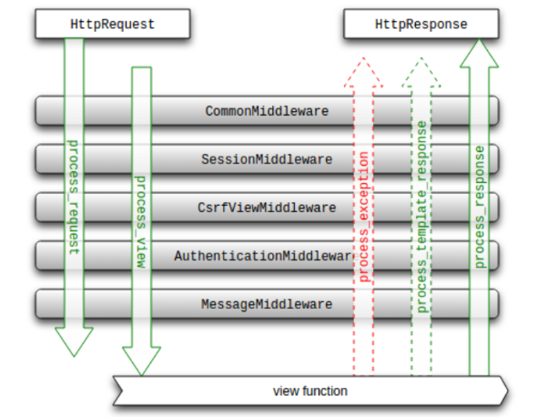
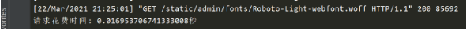
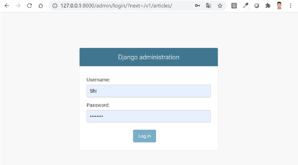

<font style="color:rgb(92, 89, 98);">中间件(middleware)允许您在一个浏览器的请求在到达Django视图之前处理它，以及在视图返回的响应到达浏览器之前处理这个响应。本文着重分析Django中间件的工作原理和应用场景，介绍如何自定义中间件并提供一些示例。</font>

## <font style="color:rgb(39, 38, 43);">什么是中间件及其应用场景</font>
_**<font style="color:rgb(92, 89, 98);">中间件(middleware)是一个镶嵌到Django的request(请求)/response(响应)处理机制中的一个钩子(hooks) 框架。它是一个可以修改Django全局输入或输出的一个底层插件系统。</font>**_

<font style="color:rgb(92, 89, 98);">上面这段话是Django官方文档中对于中间件的介绍，非常抽象难懂。小编我来尝试用浅显的语言再介绍一遍吧。我们首先要了解下Django的request/response处理机制，然后再看看中间件在整个处理机制中的角色及其工作原理。</font>

<font style="color:rgb(92, 89, 98);">HTTP Web服务器工作原理一般都是接收用户发来的请求(request), 然后给出响应(response)。Django也不例外，其一般工作方式是接收request请求和其它参数，交由视图(view)处理，然后给出它的响应(response): 渲染过的html文件或json格式的数据。然而在实际工作中Django并不是接收到request对象后，马上交给视图函数或类(view)处理，也不是在view执行后立马把response返回给用户。**一个请求在达到视图View处理前需要先经过一层一层的中间件处理，经过View处理后的响应也要经过一层一层的中间件处理才能返回给用户 **。</font>

<font style="color:rgb(92, 89, 98);">中间件(Middleware)在整个Django的request/response处理机制中的角色如下所示：</font>

```python
HttpRequest -> Middleware -> View -> Middleware -> HttpResponse
```

<font style="color:rgb(92, 89, 98);">中间件常用于权限校验、限制用户请求、打印日志、改变输出内容等多种应用场景，比如：</font>

+ <font style="color:rgb(92, 89, 98);">禁止特定IP地址的用户或未登录的用户访问我们的View视图函数</font>
+ <font style="color:rgb(92, 89, 98);">对同一IP地址单位时间内发送的请求数量做出限制</font>
+ <font style="color:rgb(92, 89, 98);">在View视图函数执行前传递额外的变量或参数</font>
+ <font style="color:rgb(92, 89, 98);">在View视图函数执行前或执行后把特定信息打印到log日志</font>
+ <font style="color:rgb(92, 89, 98);">在View视图函数执行后对response数据进行修改后返回给用户</font>

<font style="color:rgb(92, 89, 98);">注意：装饰器也经常用于用户权限校验。但与装饰器不同，中间件对Django的输入或输出的改变是全局的。比如</font>`<font style="color:rgb(92, 89, 98);background-color:rgb(245, 246, 250);">@login_required</font>`<font style="color:rgb(92, 89, 98);">装饰器仅作用于单个视图函数。如果你希望实现全站只有登录用户才能访问，编写一个中间件是一个更好的解决方案。</font>

## <font style="color:rgb(39, 38, 43);">Django自带中间件</font>
<font style="color:rgb(92, 89, 98);">当你创建一个新Django项目时，你会发现</font>`<font style="color:rgb(92, 89, 98);background-color:rgb(245, 246, 250);">settings.py</font>`<font style="color:rgb(92, 89, 98);">里的</font>`<font style="color:rgb(92, 89, 98);background-color:rgb(245, 246, 250);">MIDDLEWARE</font>`<font style="color:rgb(92, 89, 98);">列表已经注册了一些Django自带的中间件，每个中间件都负责一个特定的功能。</font>

```python
MIDDLEWARE = [
    'django.middleware.security.SecurityMiddleware',
    'django.contrib.sessions.middleware.SessionMiddleware',
    'django.middleware.common.CommonMiddleware',
    'django.middleware.csrf.CsrfViewMiddleware',
    'django.contrib.auth.middleware.AuthenticationMiddleware',
    'django.contrib.messages.middleware.MessageMiddleware',
    'django.middleware.clickjacking.XFrameOptionsMiddleware',
]
```

<font style="color:rgb(92, 89, 98);">每个中间件的功能如下,小编建议都保留:</font>

+ `<font style="color:rgb(92, 89, 98);background-color:rgb(245, 246, 250);">SecurityMiddleware</font>`<font style="color:rgb(92, 89, 98);">：为request/response提供了几种安全改进;</font>
+ `<font style="color:rgb(92, 89, 98);background-color:rgb(245, 246, 250);">SessionMiddleware</font>`<font style="color:rgb(92, 89, 98);">：开启session会话支持；</font>
+ `<font style="color:rgb(92, 89, 98);background-color:rgb(245, 246, 250);">CommonMiddleware</font>`<font style="color:rgb(92, 89, 98);">：基于APPEND_SLASH和PREPEND_WWW的设置来重写URL，如果APPEND_SLASH设为True，并且初始URL 没有以斜线结尾以及在URLconf 中没找到对应定义，这时形成一个斜线结尾的新URL；</font>
+ `<font style="color:rgb(92, 89, 98);background-color:rgb(245, 246, 250);">CsrfViewMiddleware</font>`<font style="color:rgb(92, 89, 98);">：添加跨站点请求伪造的保护，通过向POST表单添加一个隐藏的表单字段，并检查请求中是否有正确的值；</font>
+ `<font style="color:rgb(92, 89, 98);background-color:rgb(245, 246, 250);">AuthenticationMiddleware</font>`<font style="color:rgb(92, 89, 98);">：在视图函数执行前向每个接收到的user对象添加HttpRequest属性，表示当前登录的用户，无它用不了</font>`<font style="color:rgb(92, 89, 98);background-color:rgb(245, 246, 250);">request.user</font>`<font style="color:rgb(92, 89, 98);">。</font>
+ `<font style="color:rgb(92, 89, 98);background-color:rgb(245, 246, 250);">MessageMiddleware</font>`<font style="color:rgb(92, 89, 98);">：开启基于Cookie和会话的消息支持</font>
+ `<font style="color:rgb(92, 89, 98);background-color:rgb(245, 246, 250);">XFrameOptionsMiddleware</font>`<font style="color:rgb(92, 89, 98);">：对点击劫持的保护</font>

<font style="color:rgb(92, 89, 98);">除此以外, Django还提供了压缩网站内容的</font>`<font style="color:rgb(92, 89, 98);background-color:rgb(245, 246, 250);">GZipMiddleware</font>`<font style="color:rgb(92, 89, 98);">，根据用户请求语言返回不同内容的</font>`<font style="color:rgb(92, 89, 98);background-color:rgb(245, 246, 250);">LocaleMiddleware</font>`<font style="color:rgb(92, 89, 98);">和给GET请求附加条件的</font>`<font style="color:rgb(92, 89, 98);background-color:rgb(245, 246, 250);">ConditionalGetMiddleware</font>`<font style="color:rgb(92, 89, 98);">。这些中间件都是可选的。</font>

## <font style="color:rgb(39, 38, 43);">Django的中间件执行顺序</font>
<font style="color:rgb(92, 89, 98);">当你在</font>`<font style="color:rgb(92, 89, 98);background-color:rgb(245, 246, 250);">settings.py</font>`<font style="color:rgb(92, 89, 98);">注册中间件时一定要要考虑中间件的执行顺序，中间件在request到达view之前是从上向下执行的，在view执行完后返回response过程中是从下向上执行的，如下图所示。举个例子，如果你自定义的中间件有依赖于</font>`<font style="color:rgb(92, 89, 98);background-color:rgb(245, 246, 250);">request.user</font>`<font style="color:rgb(92, 89, 98);">，那么你自定义的中间件一定要放在</font>`<font style="color:rgb(92, 89, 98);background-color:rgb(245, 246, 250);">AuthenticationMiddleware</font>`<font style="color:rgb(92, 89, 98);">的后面。</font>



## <font style="color:rgb(39, 38, 43);">自定义中间件</font>
<font style="color:rgb(92, 89, 98);">自定义中间件你首先要在app所属目录下新建一个文件</font>`<font style="color:rgb(92, 89, 98);background-color:rgb(245, 246, 250);">middleware.py</font>`<font style="color:rgb(92, 89, 98);">, 添加好编写的中间件代码，然后在项目</font>`<font style="color:rgb(92, 89, 98);background-color:rgb(245, 246, 250);">settings.py</font>`<font style="color:rgb(92, 89, 98);">中把它添加到</font>`<font style="color:rgb(92, 89, 98);background-color:rgb(245, 246, 250);">MIDDLEWARE</font>`<font style="color:rgb(92, 89, 98);">列表进行注册，添加时一定要注意顺序。</font>

<font style="color:rgb(92, 89, 98);">Django提供了两种编写自定义中间件的方式：函数和类，基本框架如下所示:</font>

### <font style="color:rgb(39, 38, 43);">函数</font>
```python
def simple_middleware(get_response):
    # 一次性设置和初始化
    def middleware(request):
        # 请求在到达视图前执行的代码
        response = get_response(request)
        # 响应在返回给客户端前执行的代码
        return response
    return middleware
```

<font style="color:rgb(92, 89, 98);">当请求从浏览器发送到服务器视图时，将执行</font>`<font style="color:rgb(92, 89, 98);background-color:rgb(245, 246, 250);">response = get_response(request)</font>`<font style="color:rgb(92, 89, 98);">该行之前的所有代码。当响应从服务器返回到浏览器时，将执行</font>`<font style="color:rgb(92, 89, 98);background-color:rgb(245, 246, 250);">response = get_response(request)</font>`<font style="color:rgb(92, 89, 98);">此行之后的所有内容。</font>

<font style="color:rgb(92, 89, 98);">那么这条分界线</font>`<font style="color:rgb(92, 89, 98);background-color:rgb(245, 246, 250);">respone = get_response(request)</font>`<font style="color:rgb(92, 89, 98);">做什么的？</font>**<font style="color:rgb(92, 89, 98);">简而言之，它将调用列表中的下一个中间件。如果这是最后一个中间件，则将调用该视图。</font>**

_**<font style="color:rgb(92, 89, 98);">示例</font>**_

<font style="color:rgb(92, 89, 98);">我们现在以函数编写一个名为</font>`<font style="color:rgb(92, 89, 98);background-color:rgb(245, 246, 250);">timeit_middleware</font>`<font style="color:rgb(92, 89, 98);">的中间件，打印出执行每个请求所花费的时间，代码如下所示：</font>

```python
import time

def timeit_middleware(get_response):

    def middleware(request):
        start = time.time()
        response = get_response(request)
        end = time.time()
        print("请求花费时间: {}秒".format(end - start))
        return response

    return middleware
```

**<font style="color:rgb(92, 89, 98);">注册中间件</font>**

```python
MIDDLEWARE = [
    'django.middleware.security.SecurityMiddleware',
    'django.contrib.sessions.middleware.SessionMiddleware',
    'django.middleware.common.CommonMiddleware',
    'django.middleware.csrf.CsrfViewMiddleware',
    'django.contrib.auth.middleware.AuthenticationMiddleware',
    'django.contrib.messages.middleware.MessageMiddleware',
    'django.middleware.clickjacking.XFrameOptionsMiddleware',
    'blog.middleware.timeit_middleware', # 新增
]
```

**<font style="color:rgb(92, 89, 98);">执行效果</font>**

<font style="color:rgb(92, 89, 98);">每当Django处理一个请求时，终端(terminal)就会打印出请求花费时间，如下所示：</font>



### <font style="color:rgb(39, 38, 43);">使用类</font>
```python
class SimpleMiddleware:
    def __init__(self, get_response):
        # 一次性设置和初始化
        self.get_response = get_response

    def __call__(self, request):
        # 视图函数执行前的代码
        response = self.get_response(request)
        # 视图函数执行后的代码
        return response
```

_**<font style="color:rgb(92, 89, 98);">示例</font>**_

<font style="color:rgb(92, 89, 98);">我们现在以类来编写一个名为</font>`<font style="color:rgb(92, 89, 98);background-color:rgb(245, 246, 250);">LoginRequiredMiddleware</font>`<font style="color:rgb(92, 89, 98);">的中间件，实现全站要求登录，但是登录页面和开放白名单上的urls除外。代码如下所示：</font>

```python
from django.shortcuts import redirect
from django.conf import settings

class LoginRequiredMiddleware:
    def __init__(self, get_response):
        self.get_response = get_response
        self.login_url = settings.LOGIN_URL
        # 开放白名单，比如['/login/', '/admin/']
        self.open_urls = [self.login_url] + getattr(settings, 'OPEN_URLS', [])

    def __call__(self, request):        
        if not request.user.is_authenticated and request.path_info not in self.open_urls:
            return redirect(self.login_url + '?next=' + request.get_full_path())

        response = self.get_response(request) 
        return response
```

<font style="color:rgb(92, 89, 98);">小知识:</font><font style="color:rgb(92, 89, 98);"> </font>`<font style="color:rgb(92, 89, 98);background-color:rgb(245, 246, 250);">request.path_info</font>`<font style="color:rgb(92, 89, 98);">用于获取当前请求的相对路径，如</font>`<font style="color:rgb(92, 89, 98);background-color:rgb(245, 246, 250);">/articles/</font>`<font style="color:rgb(92, 89, 98);">，而</font>`<font style="color:rgb(92, 89, 98);background-color:rgb(245, 246, 250);">request.get_full_path()</font>`<font style="color:rgb(92, 89, 98);">用于获取当前请求完整的相对路径，包括请求参数，如</font>`<font style="color:rgb(92, 89, 98);background-color:rgb(245, 246, 250);">/articles/?page=2</font>`<font style="color:rgb(92, 89, 98);">。使用</font>`<font style="color:rgb(92, 89, 98);background-color:rgb(245, 246, 250);">request.get_full_path()</font>`<font style="color:rgb(92, 89, 98);">时别忘了加括号哦，否则返回的是uwsgi请求对象，不是字符串。</font>

**<font style="color:rgb(92, 89, 98);">注册中间件</font>**

<font style="color:rgb(92, 89, 98);">修改</font>`<font style="color:rgb(92, 89, 98);background-color:rgb(245, 246, 250);">settings.py</font>`<font style="color:rgb(92, 89, 98);">, 注册中间件，并添加</font><font style="color:rgb(92, 89, 98);"> </font>`<font style="color:rgb(92, 89, 98);background-color:rgb(245, 246, 250);">LOGIN_URL</font>`<font style="color:rgb(92, 89, 98);">和</font>`<font style="color:rgb(92, 89, 98);background-color:rgb(245, 246, 250);">OPEN_URLS</font>`<font style="color:rgb(92, 89, 98);">。</font>

```python
MIDDLEWARE = [
    'django.middleware.security.SecurityMiddleware',
    'django.contrib.sessions.middleware.SessionMiddleware',
    'django.middleware.common.CommonMiddleware',
    'django.middleware.csrf.CsrfViewMiddleware',
    'django.contrib.auth.middleware.AuthenticationMiddleware',
    'django.contrib.messages.middleware.MessageMiddleware',
    'django.middleware.clickjacking.XFrameOptionsMiddleware',
    'blog.middleware.timeit_middleware',
    'blog.middleware.LoginRequiredMiddleware',
]

LOGIN_URL = "/admin/login/"
OPEN_URLS = ["/admin/"]
```

**<font style="color:rgb(92, 89, 98);">查看效果</font>**

<font style="color:rgb(92, 89, 98);">添加完中间件后，你访问任何非LOGIN_URL和OPEN_URLS里的urls，都需要你先进行登录，如下所示：</font>



## <font style="color:rgb(39, 38, 43);">其它中间件钩子函数</font>
<font style="color:rgb(92, 89, 98);">Django还提供了其它三个中间件钩子函数，分别在执行视图函数，处理异常和进行模板渲染时调用。</font>

### <font style="color:rgb(39, 38, 43);">process_view(request, view_func, view_args, view_kwargs)</font>
<font style="color:rgb(92, 89, 98);">该方法有四个参数</font>

+ <font style="color:rgb(92, 89, 98);">request是HttpRequest对象。</font>
+ <font style="color:rgb(92, 89, 98);">view_func是Django即将使用的视图函数。 （它是实际的函数对象，而不是函数的名称作为字符串。</font>
+ <font style="color:rgb(92, 89, 98);">view_args是将传递给视图的位置参数的列表。</font>
+ <font style="color:rgb(92, 89, 98);">view_kwargs是将传递给视图的关键字参数的字典。 view_args和view_kwargs都不包含第一个视图参数（request）。</font>

<font style="color:rgb(92, 89, 98);">Django会在调用视图函数之前调用process_view方法。它应该返回None或一个HttpResponse对象。 如果返回None，Django将继续处理这个请求，执行任何其他中间件的process_view方法，然后在执行相应的视图。 如果它返回一个HttpResponse对象，Django不会调用适当的视图函数。 它将执行中间件的process_response方法并将应用到该HttpResponse并返回结果。</font>

### <font style="color:rgb(39, 38, 43);">process_exception(self, request, exception)</font>
<font style="color:rgb(92, 89, 98);">该方法两个参数:</font>

+ <font style="color:rgb(92, 89, 98);">一个HttpRequest对象</font>
+ <font style="color:rgb(92, 89, 98);">一个exception是视图函数异常产生的Exception对象。</font>

<font style="color:rgb(92, 89, 98);">这个方法只有在视图函数中出现异常了才执行，它返回的值可以是一个None也可以是一个HttpResponse对象。如果是HttpResponse对象，Django将调用模板和中间件中的process_response方法，并返回给浏览器，否则将默认处理异常。如果返回一个None，则交给下一个中间件的process_exception方法来处理异常。该方法常用于发生异常时通知管理员或将其日志的形式记录下来。</font>

### <font style="color:rgb(39, 38, 43);">process_template_response(self, request, response)</font>
<font style="color:rgb(92, 89, 98);">该方法两个参数：</font>

+ <font style="color:rgb(92, 89, 98);">一个HttpRequest对象</font>
+ <font style="color:rgb(92, 89, 98);">一个response是TemplateResponse对象（由视图函数或者中间件产生）。</font>

<font style="color:rgb(92, 89, 98);">该方法是在视图函数执行完成后立即执行，但是它有一个前提条件，那就是视图函数返回的对象有一个render()方法（或者表明该对象是一个TemplateResponse对象)。该方法常用于向模板注入变量或则直接改变模板。</font>

### <font style="color:rgb(39, 38, 43);">如何使用这3个钩子函数？</font>
<font style="color:rgb(92, 89, 98);">在函数或类的中间件中应该如何使用上面3个钩子函数呢? 具体实现方式如下：</font>

**<font style="color:rgb(92, 89, 98);">函数</font>**

```python
from django.http import HttpResponse

def timeit_middleware(get_response):

    def middleware(request):
        response = get_response(request)
        return response

    def process_view(request, view_func, view_args, view_kwargs)
        return None or HttpResponse(xx)

    def process_exception(self, request, exception):
        return None or HttpResponse(xx)

    def process_template_response(self, request, response)
        return ...

    middleware.process_view = process_view
    middleware.process_exception = process_exception
    middleware.process_template_response = process_template_response

    return middleware
```

**<font style="color:rgb(92, 89, 98);">类</font>**

```python
class MyClassMiddleware:
    def __init__(self, get_response):
        self.get_response = get_response

    def __call__(self, request):
        return self.get_response(request)

    def process_view(request, view_func, view_args, view_kwargs)
        return None or HttpResponse(xx)

    def process_exception(self, request, exception):
        return None or HttpResponse(xx)
        # 例子: 打印出异常
        return HttpResponse(<h1>str(exception)</h1)

    # 该方法仅对TemplateResponse输入有用，对render方法失效
    def process_template_response(self, request, response)
        response.context_data['title'] = 'New title'
        return response
```

## <font style="color:rgb(39, 38, 43);">小结</font>
<font style="color:rgb(92, 89, 98);">本文介绍了Django中间件(Middleware)的工作原理，执行顺序及如何自定义中间件。了解中间件一定要先对Django的request/response处理过程非常了解。当你希望在视图函数执行请求前或执行请求后添加额外的功能，且这种功能是全局性的（针对所有的request或view或response), 那么使用中间件是最好的实现方式。</font>

