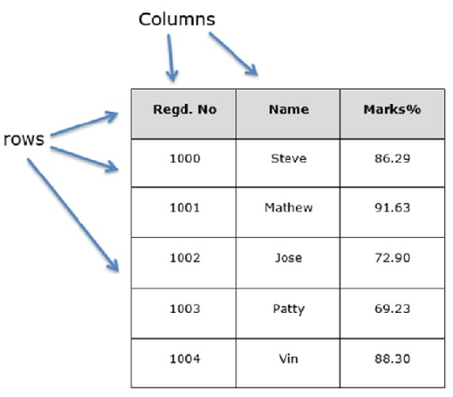

<font style="color:rgb(51, 51, 51);">Pandas DataFrame基本操作</font>

<font style="color:rgb(59, 69, 73);">DataFrame是二维数据结构，即，数据以表格形式在行和列中对齐。</font>

**<font style="color:rgb(51, 51, 51);">DataFrame的功能</font>**

<font style="color:rgb(51, 51, 51);">潜在的列是不同类型的</font><font style="color:rgb(51, 51, 51);">大小可变</font><font style="color:rgb(51, 51, 51);">标记的轴（行和列）</font><font style="color:rgb(51, 51, 51);">可以对行和列执行算术运算</font>

**<font style="color:rgb(51, 51, 51);">结构体</font>**

## <font style="color:rgb(51, 51, 51);">pandas.Series</font>
<font style="color:rgb(59, 69, 73);">Series结构如下：</font>

<font style="color:rgb(59, 69, 73);">让我们假设我们正在使用学生的数据创建一个数据框架。</font>

  
 

<font style="color:rgb(59, 69, 73);">我们可以将其视为SQL表或电子表格数据表示形式。</font>

## <font style="color:rgb(51, 51, 51);">pandas.DataFrame</font>
<font style="color:rgb(59, 69, 73);">可以使用以下构造函数创建pandas DataFrame-</font>

 pandas.DataFrame( data, index, columns, dtype, copy)

<font style="color:rgb(59, 69, 73);">参数说明：</font>

<font style="color:rgb(51, 51, 51);">data:数据采用各种形式，例如ndarray，系列，映射，列表，dict，常量以及另一个DataFrame。</font><font style="color:rgb(51, 51, 51);">index:对于行标签，如果没有传递索引，则用于结果帧的索引是Optional Default np.arange(n)。</font><font style="color:rgb(51, 51, 51);">columns:对于列标签，可选的默认语法为-np.arange(n)。仅当未传递索引时才如此。</font><font style="color:rgb(51, 51, 51);">dtype:每列的数据类型。</font><font style="color:rgb(51, 51, 51);">copy:如果默认值为False，则此命令（或任何它的命令）用于复制数据。</font>

## <font style="color:rgb(51, 51, 51);">创建DataFrame</font>
<font style="color:rgb(59, 69, 73);">可以使用各种输入来创建pandas DataFrame-</font>

<font style="color:rgb(51, 51, 51);">Lists</font><font style="color:rgb(51, 51, 51);">dict</font><font style="color:rgb(51, 51, 51);">Series</font><font style="color:rgb(51, 51, 51);">Numpy ndarrays</font><font style="color:rgb(51, 51, 51);">另一个DataFrame</font>

<font style="color:rgb(59, 69, 73);">在本章的后续部分中，我们将看到如何使用这些输入来创建DataFrame。</font>

## <font style="color:rgb(51, 51, 51);">创建空DataFrame</font>
<font style="color:rgb(59, 69, 73);">可以创建基本DataFrame是Empty Dataframe。</font>

**<font style="color:rgb(51, 51, 51);background-color:rgb(239, 239, 239);">示例</font>**

```python
# Filename : pandas.py
# author by : www.cainiaoplus.com 
# 导入pandas依赖包并起别名
import pandas as pd
df = pd.DataFrame()
print(df)
```

<font style="color:rgb(59, 69, 73);">运行结果：</font>

```python
Empty DataFrame
Columns: []
Index: []
```

## <font style="color:rgb(51, 51, 51);">从Lists创建DataFrame</font>
**<font style="color:rgb(51, 51, 51);background-color:rgb(239, 239, 239);">示例</font>**

```python
# Filename : pandas.py
# author by : www.cainiaoplus.com 
# 导入pandas依赖包并起别名
import pandas as pd
data = [1,2,3,4,5]
df = pd.DataFrame(data)
print(df)
```

<font style="color:rgb(59, 69, 73);">运行结果：</font>

```python
0
0 1
1 2
2 3
3 4
4 5
```

**<font style="color:rgb(51, 51, 51);background-color:rgb(239, 239, 239);">示例</font>**

```python
# Filename : pandas.py
# author by : www.cainiaoplus.com 
# 导入pandas依赖包并起别名
import pandas as pd
data = [['Alex',10],['Bob',12],['Clarke',13]]
df = pd.DataFrame(data,columns=['Name','Age'])
print(df)
```

<font style="color:rgb(59, 69, 73);">运行结果：</font>

```python
Name     Age
0     Alex     10
1     Bob      12
2     Clarke   13
```

**<font style="color:rgb(51, 51, 51);background-color:rgb(239, 239, 239);">示例</font>**

```python
# Filename : pandas.py
# author by : www.cainiaoplus.com 
# 导入pandas依赖包并起别名
import pandas as pd
data = [['Alex',10],['Bob',12],['Clarke',13]]
df = pd.DataFrame(data,columns=['Name','Age'],dtype=float)
print df
```

<font style="color:rgb(59, 69, 73);">运行结果：</font>

```python
Name   Age
0    Alex   10.0
1    Bob    12.0
2    Clarke 13.0
```

<font style="color:rgb(51, 51, 51);">注意：</font><font style="color:rgb(51, 51, 51);">dtype参数将Age列的类型更改为浮点。</font>

## <font style="color:rgb(51, 51, 51);">从ndarrays / List的Dict创建一个DataFrame</font>
<font style="color:rgb(59, 69, 73);">所有ndarray的长度必须相同。如果传递了index，则索引的长度应等于数组的长度。  
</font><font style="color:rgb(59, 69, 73);">如果没有传递索引，则默认情况下，索引将是range(n)，其中n是数组长度。</font>

**<font style="color:rgb(51, 51, 51);background-color:rgb(239, 239, 239);">示例</font>**

```python
# Filename : pandas.py
# author by : www.cainiaoplus.com 
# 导入pandas依赖包并起别名
import pandas as pd
data = {'Name':['Tom', 'Jack', 'Steve', 'Ricky'],'Age':[28,34,29,42]}
df = pd.DataFrame(data)
print(df)
```

<font style="color:rgb(59, 69, 73);">运行结果：</font>

```python
Age   Name
0   28   Tom
1   34   Jack
2   29   Steve
3   42   Ricky
```

<font style="color:rgb(51, 51, 51);">注意：</font><font style="color:rgb(51, 51, 51);">遵守值0、1、2、3。它们是使用功能范围(n)分配给每个对象的默认索引。</font>

<font style="color:rgb(59, 69, 73);">我们使用数组创建索引的DataFrame。</font>

**<font style="color:rgb(51, 51, 51);background-color:rgb(239, 239, 239);">示例</font>**

```python
# Filename : pandas.py
# author by : www.cainiaoplus.com 
# 导入pandas依赖包并起别名
import pandas as pd
data = {'Name':['Tom', 'Jack', 'Steve', 'Ricky'],'Age':[28,34,29,42]}
df = pd.DataFrame(data, index=['rank1','rank2','rank3','rank4'])
print(df)
```

<font style="color:rgb(59, 69, 73);">运行结果：</font>

```python
Age Name
rank1 28 Tom
rank2 34 Jack
rank3 29 Steve
rank4 42 Ricky
```

<font style="color:rgb(51, 51, 51);">注意：</font><font style="color:rgb(51, 51, 51);">index参数为每行分配一个索引。</font>

## <font style="color:rgb(51, 51, 51);">从字典列表创建DataFrame</font>
<font style="color:rgb(59, 69, 73);">字典列表可以作为输入数据传递以创建DataFrame。默认情况下，字典键被用作列名。  
</font><font style="color:rgb(59, 69, 73);">下面的示例演示如何通过传递字典列表来创建DataFrame。</font>

**<font style="color:rgb(51, 51, 51);background-color:rgb(239, 239, 239);">示例</font>**

```python
# Filename : pandas.py
# author by : www.cainiaoplus.com 
# 导入pandas依赖包并起别名
import pandas as pd
data = [{'a': 1, 'b': 2},{'a': 5, 'b': 10, 'c': 20}]
df = pd.DataFrame(data)
print(df)
```

<font style="color:rgb(59, 69, 73);">运行结果：</font>

```python
a b c
0 1 2 NaN
1 5 10 20.0
```

<font style="color:rgb(51, 51, 51);">注意：</font><font style="color:rgb(51, 51, 51);">NaN（非数字）会附加在缺失区域中。</font>

<font style="color:rgb(59, 69, 73);">下面的示例演示如何通过传递字典列表和行索引来创建DataFrame。</font>

**<font style="color:rgb(51, 51, 51);background-color:rgb(239, 239, 239);">示例</font>**

```python
# Filename : pandas.py
# author by : www.cainiaoplus.com 
# 导入pandas依赖包并起别名
import pandas as pd
data = [{'a': 1, 'b': 2},{'a': 5, 'b': 10, 'c': 20}]
df = pd.DataFrame(data, index=['first', 'second'])
print(df)
```

<font style="color:rgb(59, 69, 73);">运行结果：</font>

```python
a b c
first 1 2 NaN
second 5 10 20.0
```

<font style="color:rgb(59, 69, 73);">下面的示例演示如何创建包含字典，行索引和列索引的列表的DataFrame。</font>

**<font style="color:rgb(51, 51, 51);background-color:rgb(239, 239, 239);">示例</font>**

```python
# Filename : pandas.py
# author by : www.cainiaoplus.com 
# 导入pandas依赖包并起别名
import pandas as pd
data = [{'a': 1, 'b': 2},{'a': 5, 'b': 10, 'c': 20}]
# 有两个列索引，值与字典键相同
df1 = pd.DataFrame(data, index=['first', 'second'], columns=['a', 'b'])
# 有两个列索引
df2 = pd.DataFrame(data, index=['first', 'second'], columns=['a', 'b1'])
print(df1)
print(df2)
```

<font style="color:rgb(59, 69, 73);">运行结果：</font>

```python
#df1 output
a b
first 1 2
second 5 10
#df2 output
a b1
first 1 NaN
second 5 NaN
```

<font style="color:rgb(51, 51, 51);">注意：</font><font style="color:rgb(51, 51, 51);">df2 DataFrame是使用除字典键以外的列索引创建的；因此，将NaN附加到位。而df1是使用与字典键相同的列索引创建的，因此添加了NaN。</font>

## <font style="color:rgb(51, 51, 51);">从Dict Series创建DataFrame</font>
<font style="color:rgb(59, 69, 73);">可以传递系列字典以形成DataFrame。结果索引是所有通过的系列索引的并集。</font>

**<font style="color:rgb(51, 51, 51);background-color:rgb(239, 239, 239);">示例</font>**

```python
# Filename : pandas.py
# author by : www.cainiaoplus.com 
# 导入pandas依赖包并起别名
import pandas as pd
d = {'one' : pd.Series([1, 2, 3], index=['a', 'b', 'c']),
     'two' : pd.Series([1, 2, 3, 4], index=['a', 'b', 'c', 'd'])}
df = pd.DataFrame(d)
print(df)
```

<font style="color:rgb(59, 69, 73);">运行结果：</font>

```python
one two
a 1.0 1
b 2.0 2
c 3.0 3
d NaN 4
```

<font style="color:rgb(59, 69, 73);">对于第一个系列，没有传递标签'd'，但是结果是，对于d标签，NaN附加了NaN。  
</font><font style="color:rgb(59, 69, 73);">现在让我们通过示例了解列的选择，添加和删除。</font>

## <font style="color:rgb(51, 51, 51);">列查询</font>
<font style="color:rgb(59, 69, 73);">我们将从DataFrame中选择一列来了解这一点。</font>

**<font style="color:rgb(51, 51, 51);background-color:rgb(239, 239, 239);">示例</font>**

```python
# Filename : pandas.py
# author by : www.cainiaoplus.com 
# 导入pandas依赖包并起别名

import pandas as pd
d = {'one' : pd.Series([1, 2, 3], index=['a', 'b', 'c']),
     'two' : pd.Series([1, 2, 3, 4], index=['a', 'b', 'c', 'd'])}
df = pd.DataFrame(d)
print(df ['one'])
```

<font style="color:rgb(59, 69, 73);">运行结果：</font>

```python
a 1.0
b 2.0
c 3.0
d NaN
Name: one, dtype: float64
```

## <font style="color:rgb(51, 51, 51);">列添加</font>
<font style="color:rgb(59, 69, 73);">我们将通过在现有数据框中添加新列来了解这一点。</font>

**<font style="color:rgb(51, 51, 51);background-color:rgb(239, 239, 239);">示例</font>**

```python
# Filename : pandas.py
# author by : www.cainiaoplus.com 
# 导入pandas依赖包并起别名
import pandas as pd
d = {'one' : pd.Series([1, 2, 3], index=['a', 'b', 'c']),
     'two' : pd.Series([1, 2, 3, 4], index=['a', 'b', 'c', 'd'])}
df = pd.DataFrame(d)
#通过传递新序列，向具有列标签的现有 DataFrame 对象添加新列
print ("通过作为 Series 传递添加新列:")
df['three']=pd.Series([10,20,30],index=['a','b','c'])
print df
print ("使用 DataFrame 中的现有列添加新列:")
df['four']=df['one']+df['three']
print(df)
```

<font style="color:rgb(59, 69, 73);">运行结果：</font>

```python
通过作为 Series 传递添加新列:
one two three
a 1.0 1 10.0
b 2.0 2 20.0
c 3.0 3 30.0
d NaN 4 NaN
使用 DataFrame 中的现有列添加新列:
one two three four
a 1.0 1 10.0 11.0
b 2.0 2 20.0 22.0
c 3.0 3 30.0 33.0
d NaN 4 NaN NaN
```

## <font style="color:rgb(51, 51, 51);">列删除</font>
<font style="color:rgb(59, 69, 73);">可以删除或弹出列；让我们以一个实例来了解如何。</font>

**<font style="color:rgb(51, 51, 51);background-color:rgb(239, 239, 239);">示例</font>**

```python
# Filename : pandas.py
# author by : www.cainiaoplus.com 
# 导入pandas依赖包并起别名
import pandas as pd
d = {'one' : pd.Series([1, 2, 3], index=['a', 'b', 'c']), 
     'two' : pd.Series([1, 2, 3, 4], index=['a', 'b', 'c', 'd']), 
     'three' : pd.Series([10,20,30], index=['a','b','c'])}
df = pd.DataFrame(d)
print ("Our dataframe is:")
print(df)
# using del function
print ("Deleting the first column using del function:")
del df['one']
print(df)
# using pop function
print ("Deleting another column using POP function:")
df.pop('two')
print(df)
```

<font style="color:rgb(59, 69, 73);">运行结果：</font>

```python
Our dataframe is:
one three two
a 1.0 10.0 1
b 2.0 20.0 2
c 3.0 30.0 3
d NaN NaN 4
Deleting the first column using del function:
three two
a 10.0 1
b 20.0 2
c 30.0 3
d NaN 4
Deleting another column using POP function:
three
a 10.0
b 20.0
c 30.0
d NaN
```

## <font style="color:rgb(51, 51, 51);">行查询、添加和删除</font>
<font style="color:rgb(59, 69, 73);">现在，我们将通过示例了解行的选择，添加和删除。让我们从选择的概念开始。</font>

### <font style="color:rgb(51, 51, 51);">按标签查询</font>
<font style="color:rgb(59, 69, 73);">可以通过将行标签传递给loc函数来选择行。</font>

**<font style="color:rgb(51, 51, 51);background-color:rgb(239, 239, 239);">示例</font>**

```python
# Filename : pandas.py
# author by : www.cainiaoplus.com 
# 导入pandas依赖包并起别名
import pandas as pd
d = {'one' : pd.Series([1, 2, 3], index=['a', 'b', 'c']), 
     'two' : pd.Series([1, 2, 3, 4], index=['a', 'b', 'c', 'd'])}
df = pd.DataFrame(d)
print(df.loc['b'])
```

<font style="color:rgb(59, 69, 73);">运行结果：</font>

```python
one 2.0
two 2.0
Name: b, dtype: float64
```

<font style="color:rgb(59, 69, 73);">结果是一系列带有标签作为DataFrame列名称的系列。并且，系列的名称是用来检索它的标签。</font>

### <font style="color:rgb(51, 51, 51);">通过整数位置查询</font>
<font style="color:rgb(59, 69, 73);">结可以通过将整数位置传递给iloc函数来选择行。</font>

**<font style="color:rgb(51, 51, 51);background-color:rgb(239, 239, 239);">示例</font>**

```python
# Filename : pandas.py
# author by : www.cainiaoplus.com 
# 导入pandas依赖包并起别名
import pandas as pd
d = {'one' : pd.Series([1, 2, 3], index=['a', 'b', 'c']),
     'two' : pd.Series([1, 2, 3, 4], index=['a', 'b', 'c', 'd'])}
df = pd.DataFrame(d)
print(df.iloc[2])
```

<font style="color:rgb(59, 69, 73);">运行结果：</font>

```python
one 3.0
two 3.0
Name: c, dtype: float64
```

### <font style="color:rgb(51, 51, 51);">切片行</font>
<font style="color:rgb(59, 69, 73);">可以使用'：'运算符选择多行。</font>

**<font style="color:rgb(51, 51, 51);background-color:rgb(239, 239, 239);">示例</font>**

```python
# Filename : pandas.py
# author by : www.cainiaoplus.com 
# 导入pandas依赖包并起别名
import pandas as pd
d = {'one' : pd.Series([1, 2, 3], index=['a', 'b', 'c']), 
     'two' : pd.Series([1, 2, 3, 4], index=['a', 'b', 'c', 'd'])}
df = pd.DataFrame(d)
print(df[2:4])
```

<font style="color:rgb(59, 69, 73);">运行结果：</font>

```python
one two
c 3.0 3
d NaN 4
```

## <font style="color:rgb(51, 51, 51);">添加行</font>
<font style="color:rgb(59, 69, 73);">使用append函数将新行添加到DataFrame中。此函数将在末尾追加行。</font>

**<font style="color:rgb(51, 51, 51);background-color:rgb(239, 239, 239);">示例</font>**

```python
# Filename : pandas.py
# author by : www.cainiaoplus.com 
# 导入pandas依赖包并起别名
import pandas as pd
df = pd.DataFrame([[1, 2], [3, 4]], columns = ['a','b'])
df2 = pd.DataFrame([[5, 6], [7, 8]], columns = ['a','b'])
df = df.append(df2)
print(df)
```

<font style="color:rgb(59, 69, 73);">运行结果：</font>

```python
a b
0 1 2
1 3 4
0 5 6
1 7 8
```

## <font style="color:rgb(51, 51, 51);">删除行</font>
<font style="color:rgb(59, 69, 73);">使用索引标签从DataFrame中删除或删除行。如果标签重复，则将删除多行。  
</font><font style="color:rgb(59, 69, 73);">如果您观察到，在上面的示例中，标签是重复的。让我们删除一个标签，将看到将删除多少行。</font>

**<font style="color:rgb(51, 51, 51);background-color:rgb(239, 239, 239);">示例</font>**

```python
# Filename : pandas.py
# author by : www.cainiaoplus.com 
# 导入pandas依赖包并起别名
import pandas as pd
df = pd.DataFrame([[1, 2], [3, 4]], columns = ['a','b'])
df2 = pd.DataFrame([[5, 6], [7, 8]], columns = ['a','b'])
df = df.append(df2)
# Drop rows with label 0
df = df.drop(0)
print(df)
```

<font style="color:rgb(59, 69, 73);">运行结果：</font>

```python
a b
1 3 4
1 7 8
```

<font style="color:rgb(59, 69, 73);">在上面的示例中，删除了两行，因为这两行包含相同的标签0。</font>

