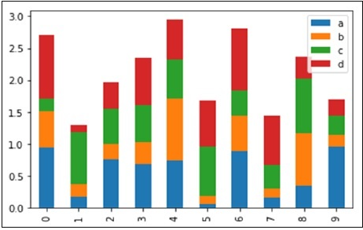
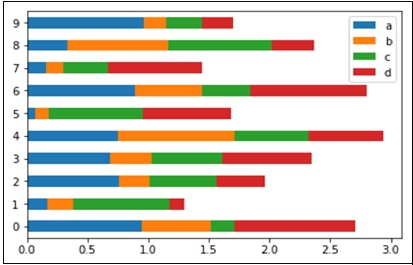
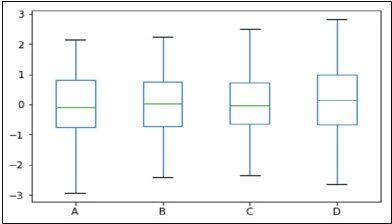
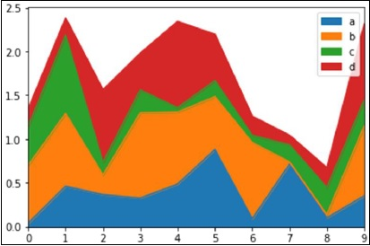

# <font style="color:rgb(51, 51, 51);">Pandas 可视化</font>
<font style="color:rgb(51, 51, 51);"> </font><font style="color:rgb(51, 51, 51);">Pandas 可视化操作实例</font>

## <font style="color:rgb(51, 51, 51);">基本绘图：绘图</font>
<font style="color:rgb(59, 69, 73);">Series和DataFrame上的此功能只是围绕matplotlib库plot()方法的简单包装。</font>

**<font style="color:rgb(51, 51, 51);background-color:rgb(239, 239, 239);">示例</font>**

```plain
import pandas as pd
 import numpy as np
 df = pd.DataFrame(np.random.randn(10,4),index=pd.date_range('1/1/2000',
    periods=10), columns=list('ABCD'))
 df.plot()
```

<font style="color:rgb(59, 69, 73);">运行结果如下：</font>

<font style="color:rgb(59, 69, 73);">如果索引由日期组成，它将调用gct()。autofmt_xdate()来格式化x轴，如上图所示。 </font><font style="color:rgb(59, 69, 73);">我们可以使用x和y关键字绘制一列与另一列的关系。</font>

<font style="color:rgb(59, 69, 73);">除默认线图外，绘图方法还允许使用多种绘图样式。这些方法可以作为plot()的kind关键字参数提供。这些包括：</font>

<font style="color:rgb(51, 51, 51);">条形图直方图箱形图面积图散点图饼形图</font>

## <font style="color:rgb(51, 51, 51);">条形图</font>
<font style="color:rgb(59, 69, 73);">下面我们来看看如何创建一个条形图：</font>

**<font style="color:rgb(51, 51, 51);background-color:rgb(239, 239, 239);">示例</font>**

```plain
import pandas as pd
 import numpy as np
 df = pd.DataFrame(np.random.rand(10,4),columns=['a','b','c','d')
 df.plot.bar()
```

<font style="color:rgb(59, 69, 73);">运行结果如下：</font>



<font style="color:rgb(59, 69, 73);">产生堆叠的柱状图, 可以设置</font><font style="color:rgb(59, 69, 73);"> </font>**<font style="color:rgb(59, 69, 73);">stacked=True</font>**

**<font style="color:rgb(51, 51, 51);background-color:rgb(239, 239, 239);">示例</font>**

```plain
import pandas as pd
 df = pd.DataFrame(np.random.rand(10,4),columns=['a','b','c','d')
 df.plot.bar(stacked=True)
```

<font style="color:rgb(59, 69, 73);">运行结果如下：</font>


<font style="color:rgb(59, 69, 73);">要获取水平条形图，可以使用barh方法：</font>

**<font style="color:rgb(51, 51, 51);background-color:rgb(239, 239, 239);">示例</font>**

```plain
import pandas as pd
 import numpy as np
 df = pd.DataFrame(np.random.rand(10,4),columns=['a','b','c','d')
 df.plot.barh(stacked=True)
```

<font style="color:rgb(59, 69, 73);">运行结果如下：</font>



## <font style="color:rgb(51, 51, 51);">直方图</font>
<font style="color:rgb(59, 69, 73);">可以使用plot.hist()方法绘制直方图。我们可以指定数量。</font>

**<font style="color:rgb(51, 51, 51);background-color:rgb(239, 239, 239);">示例</font>**

```plain
import pandas as pd
 import numpy as np
 df = pd.DataFrame({'a':np.random.randn(1000)+1,'b':np.random.randn(1000),'c':
 np.random.randn(1000) - 1}, columns=['a', 'b', 'c'])
 df.plot.hist(bins=20)
```

<font style="color:rgb(59, 69, 73);">运行结果如下：</font>


<font style="color:rgb(59, 69, 73);">可以使用以下代码为每列绘制不同的直方图：</font>

**<font style="color:rgb(51, 51, 51);background-color:rgb(239, 239, 239);">示例</font>**

```plain
import pandas as pd
 import numpy as np
 df=pd.DataFrame({'a':np.random.randn(1000)+1,'b':np.random.randn(1000),'c':
 np.random.randn(1000) - 1}, columns=['a', 'b', 'c'])
 df.diff.hist(bins=20)
```

<font style="color:rgb(59, 69, 73);">运行结果如下：</font>


## <font style="color:rgb(51, 51, 51);">箱形图</font>
<font style="color:rgb(59, 69, 73);">可以通过调用Series.box.plot()和DataFrame.box.plot()或DataFrame.boxplot()来绘制Boxplot，以可视化每个列中值的分布。 </font><font style="color:rgb(59, 69, 73);">例如，这是一个箱线图，代表对[0,1）上的一个随机变量的10个观测值的五个试验。</font>

**<font style="color:rgb(51, 51, 51);background-color:rgb(239, 239, 239);">示例</font>**

```plain
import pandas as pd
 import numpy as np
 df = pd.DataFrame(np.random.rand(10, 5), columns=['A', 'B', 'C', 'D', 'E'])
 df.plot.box()
```

<font style="color:rgb(59, 69, 73);">运行结果如下：</font>



## <font style="color:rgb(51, 51, 51);">面积图</font>
<font style="color:rgb(59, 69, 73);">可以使用Series.plot.area()或DataFrame.plot.area()方法创建面积图。</font>

**<font style="color:rgb(51, 51, 51);background-color:rgb(239, 239, 239);">示例</font>**

```plain
import pandas as pd
 import numpy as np
 df = pd.DataFrame(np.random.rand(10, 4), columns=['a', 'b', 'c', 'd'])
 df.plot.area()
```

<font style="color:rgb(59, 69, 73);">运行结果如下：</font>



## <font style="color:rgb(51, 51, 51);">散点图</font>
<font style="color:rgb(59, 69, 73);">创建散点图可以使用DataFrame.plot.scatter()方法。</font>

**<font style="color:rgb(51, 51, 51);background-color:rgb(239, 239, 239);">示例</font>**

```plain
import pandas as pd
 import numpy as np
 df = pd.DataFrame(np.random.rand(50, 4), columns=['a', 'b', 'c', 'd'])
 df.plot.scatter(x='a', y='b')
```

<font style="color:rgb(59, 69, 73);">运行结果如下：</font>


## <font style="color:rgb(51, 51, 51);">饼形图</font>
<font style="color:rgb(59, 69, 73);">创建饼图可以使用DataFrame.plot.pie()方法。</font>

**<font style="color:rgb(51, 51, 51);background-color:rgb(239, 239, 239);">示例</font>**

```plain
import pandas as pd
 import numpy as np
 df = pd.DataFrame(3 * np.random.rand(4), index=['a', 'b', 'c', 'd'], columns=['x'])
 df.plot.pie(subplots=True)
```

<font style="color:rgb(59, 69, 73);">运行结果如下：</font>


