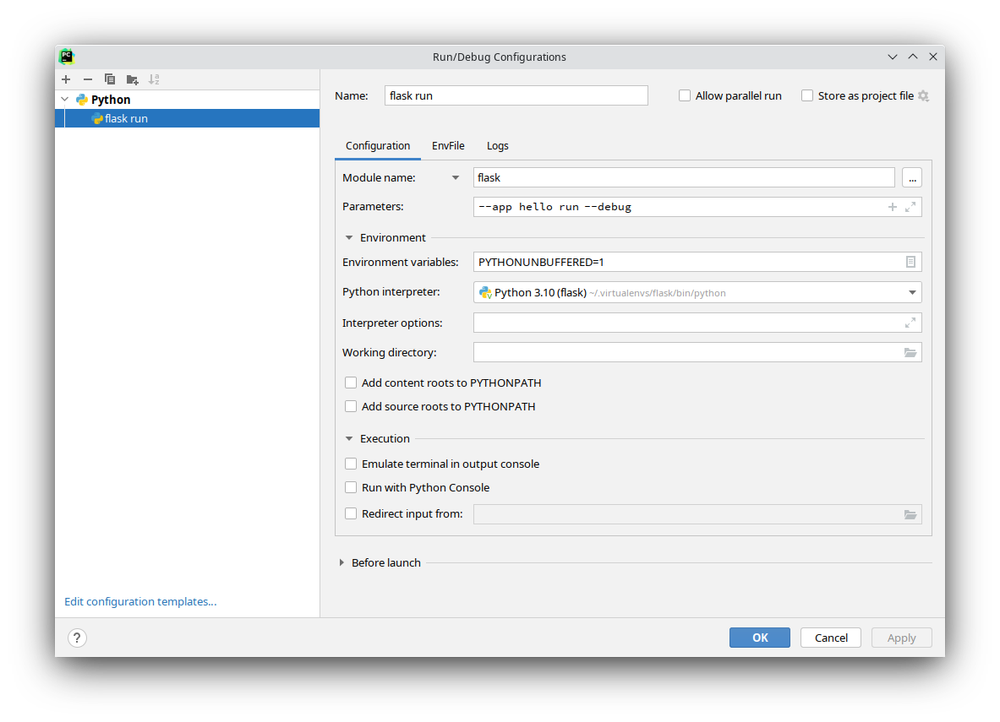

<font style="color:rgb(62, 67, 73);">在虚拟环境中安装 Flask 时会同时安装 </font>`<font style="color:rgb(34, 34, 34);background-color:rgb(232, 239, 240);">flask</font>`<font style="color:rgb(62, 67, 73);"> 脚本，这是一个 </font>[<font style="color:rgb(62, 67, 73);">Click</font>](https://click.palletsprojects.com/)<font style="color:rgb(62, 67, 73);"> 命令行接口。在终端中执行该脚本可以操作内建的、扩展的和应用定义的命令。 关于命令的更多信息和选择可以通过使用 </font>`<font style="color:rgb(34, 34, 34);background-color:rgb(232, 239, 240);">--help</font>`<font style="color:rgb(62, 67, 73);"> 参数查看。</font>

## <font style="color:black;">探索应用</font>
`<font style="color:rgb(34, 34, 34);background-color:rgb(232, 239, 240);">flask</font>`<font style="color:rgb(62, 67, 73);"> </font><font style="color:rgb(62, 67, 73);">命令由 Flask 安装，而不是你的应用。为了可以正常使用，它必须被 告知可以在哪里找到你的应用。</font><font style="color:rgb(62, 67, 73);"> </font>`<font style="color:rgb(34, 34, 34);background-color:rgb(232, 239, 240);">flask</font>`<font style="color:rgb(62, 67, 73);"> </font><font style="color:rgb(62, 67, 73);">命令的</font><font style="color:rgb(62, 67, 73);"> </font>`<font style="color:rgb(34, 34, 34);background-color:rgb(232, 239, 240);">--app</font>`<font style="color:rgb(62, 67, 73);"> </font><font style="color:rgb(62, 67, 73);">参数用于指定如 何载入应用。</font>

<font style="color:rgb(62, 67, 73);">虽然</font><font style="color:rgb(62, 67, 73);"> </font>`<font style="color:rgb(34, 34, 34);background-color:rgb(232, 239, 240);">--app</font>`<font style="color:rgb(62, 67, 73);"> </font><font style="color:rgb(62, 67, 73);">支持多种选项来定义应用，但多数情况下应该很简单。以下是典 型值：</font>

<font style="color:rgb(62, 67, 73);">(空)</font>

<font style="color:rgb(62, 67, 73);">名称“ app ”或者“ wsgi ”被导入（作为一个“ .py ”文件或者包）， 自动探测一个应用（</font><font style="color:rgb(62, 67, 73);"> </font>`<font style="color:rgb(34, 34, 34);background-color:rgb(232, 239, 240);">app</font>`<font style="color:rgb(62, 67, 73);"> </font><font style="color:rgb(62, 67, 73);">或者</font><font style="color:rgb(62, 67, 73);"> </font>`<font style="color:rgb(34, 34, 34);background-color:rgb(232, 239, 240);">application</font>`<font style="color:rgb(62, 67, 73);"> </font><font style="color:rgb(62, 67, 73);">）或者工厂（</font><font style="color:rgb(62, 67, 73);"> </font>`<font style="color:rgb(34, 34, 34);background-color:rgb(232, 239, 240);">create_app</font>`<font style="color:rgb(62, 67, 73);"> </font><font style="color:rgb(62, 67, 73);">或者</font><font style="color:rgb(62, 67, 73);"> </font>`<font style="color:rgb(34, 34, 34);background-color:rgb(232, 239, 240);">make_app</font>`<font style="color:rgb(62, 67, 73);"> </font><font style="color:rgb(62, 67, 73);">）。</font>

`<font style="color:rgb(34, 34, 34);background-color:rgb(232, 239, 240);">--app</font><font style="color:rgb(34, 34, 34);background-color:rgb(232, 239, 240);"> </font><font style="color:rgb(34, 34, 34);background-color:rgb(232, 239, 240);">hello</font>`

<font style="color:rgb(62, 67, 73);">给定的名称被导入，自动探测一个应用（</font><font style="color:rgb(62, 67, 73);"> </font>`<font style="color:rgb(34, 34, 34);background-color:rgb(232, 239, 240);">app</font>`<font style="color:rgb(62, 67, 73);"> </font><font style="color:rgb(62, 67, 73);">或者</font><font style="color:rgb(62, 67, 73);"> </font>`<font style="color:rgb(34, 34, 34);background-color:rgb(232, 239, 240);">application</font>`<font style="color:rgb(62, 67, 73);"> </font><font style="color:rgb(62, 67, 73);">）或者工厂（</font><font style="color:rgb(62, 67, 73);"> </font>`<font style="color:rgb(34, 34, 34);background-color:rgb(232, 239, 240);">create_app</font>`<font style="color:rgb(62, 67, 73);"> </font><font style="color:rgb(62, 67, 73);">或者</font><font style="color:rgb(62, 67, 73);"> </font>`<font style="color:rgb(34, 34, 34);background-color:rgb(232, 239, 240);">make_app</font>`<font style="color:rgb(62, 67, 73);"> </font><font style="color:rgb(62, 67, 73);">）。</font>

---

`<font style="color:rgb(34, 34, 34);background-color:rgb(232, 239, 240);">--app</font>`<font style="color:rgb(62, 67, 73);"> </font><font style="color:rgb(62, 67, 73);">分三个部分：一是一个可选路径，用于设置当前工作文件夹；二是一 个 Python 文件或者带点的导入路径；三是一个可选的实例或工厂的变量名称。 如果名称是工厂，则可以选择在后面的括号中加上参数。以下演示说明：</font>

`<font style="color:rgb(34, 34, 34);background-color:rgb(232, 239, 240);">--app</font><font style="color:rgb(34, 34, 34);background-color:rgb(232, 239, 240);"> </font><font style="color:rgb(34, 34, 34);background-color:rgb(232, 239, 240);">src/hello</font>`

<font style="color:rgb(62, 67, 73);">设置当前工作文件夹为</font><font style="color:rgb(62, 67, 73);"> </font>`<font style="color:rgb(34, 34, 34);background-color:rgb(232, 239, 240);">src</font>`<font style="color:rgb(62, 67, 73);"> </font><font style="color:rgb(62, 67, 73);">然后导入</font><font style="color:rgb(62, 67, 73);"> </font>`<font style="color:rgb(34, 34, 34);background-color:rgb(232, 239, 240);">hello</font>`<font style="color:rgb(62, 67, 73);"> </font><font style="color:rgb(62, 67, 73);">。</font>

`<font style="color:rgb(34, 34, 34);background-color:rgb(232, 239, 240);">--app</font><font style="color:rgb(34, 34, 34);background-color:rgb(232, 239, 240);"> </font><font style="color:rgb(34, 34, 34);background-color:rgb(232, 239, 240);">hello.web</font>`

<font style="color:rgb(62, 67, 73);">导入路径</font><font style="color:rgb(62, 67, 73);"> </font>`<font style="color:rgb(34, 34, 34);background-color:rgb(232, 239, 240);">hello.web</font>`<font style="color:rgb(62, 67, 73);"> </font><font style="color:rgb(62, 67, 73);">。</font>

`<font style="color:rgb(34, 34, 34);background-color:rgb(232, 239, 240);">--app</font><font style="color:rgb(34, 34, 34);background-color:rgb(232, 239, 240);"> </font><font style="color:rgb(34, 34, 34);background-color:rgb(232, 239, 240);">hello:app2</font>`

<font style="color:rgb(62, 67, 73);">使用</font><font style="color:rgb(62, 67, 73);"> </font>`<font style="color:rgb(34, 34, 34);background-color:rgb(232, 239, 240);">hello</font>`<font style="color:rgb(62, 67, 73);"> </font><font style="color:rgb(62, 67, 73);">中的</font><font style="color:rgb(62, 67, 73);"> </font>`<font style="color:rgb(34, 34, 34);background-color:rgb(232, 239, 240);">app2</font>`<font style="color:rgb(62, 67, 73);"> </font><font style="color:rgb(62, 67, 73);">Flask 实例。</font>

`<font style="color:rgb(34, 34, 34);background-color:rgb(232, 239, 240);">--app</font><font style="color:rgb(34, 34, 34);background-color:rgb(232, 239, 240);"> </font><font style="color:rgb(34, 34, 34);background-color:rgb(232, 239, 240);">'hello:create_app("dev")'</font>`

<font style="color:rgb(62, 67, 73);">调用</font><font style="color:rgb(62, 67, 73);"> </font>`<font style="color:rgb(34, 34, 34);background-color:rgb(232, 239, 240);">hello</font>`<font style="color:rgb(62, 67, 73);"> </font><font style="color:rgb(62, 67, 73);">中的</font><font style="color:rgb(62, 67, 73);"> </font>`<font style="color:rgb(34, 34, 34);background-color:rgb(232, 239, 240);">create_app</font>`<font style="color:rgb(62, 67, 73);"> </font><font style="color:rgb(62, 67, 73);">工厂，把</font><font style="color:rgb(62, 67, 73);"> </font>`<font style="color:rgb(34, 34, 34);background-color:rgb(232, 239, 240);">'dev'</font>`<font style="color:rgb(62, 67, 73);"> </font><font style="color:rgb(62, 67, 73);">作为参数。</font>

<font style="color:rgb(62, 67, 73);">如果没有设置</font><font style="color:rgb(62, 67, 73);"> </font>`<font style="color:rgb(34, 34, 34);background-color:rgb(232, 239, 240);">--app</font>`<font style="color:rgb(62, 67, 73);"> </font><font style="color:rgb(62, 67, 73);">，命令会尝试导入“ app ”或者“ wsgi ”（可以是 一个“ .py ”文件或者包）并尝试探测一个应用实例或者工厂。</font>

<font style="color:rgb(62, 67, 73);">根据给定的导入，命令会寻找一个名为</font><font style="color:rgb(62, 67, 73);"> </font>`<font style="color:rgb(34, 34, 34);background-color:rgb(232, 239, 240);">app</font>`<font style="color:rgb(62, 67, 73);"> </font><font style="color:rgb(62, 67, 73);">或者</font><font style="color:rgb(62, 67, 73);"> </font>`<font style="color:rgb(34, 34, 34);background-color:rgb(232, 239, 240);">application</font>`<font style="color:rgb(62, 67, 73);"> </font><font style="color:rgb(62, 67, 73);">的应用 实例。如果找不到会继续寻找任意应用实例。如果找不到任何实例，会接着寻找 名为</font><font style="color:rgb(62, 67, 73);"> </font>`<font style="color:rgb(34, 34, 34);background-color:rgb(232, 239, 240);">create_app</font>`<font style="color:rgb(62, 67, 73);"> </font><font style="color:rgb(62, 67, 73);">或者</font><font style="color:rgb(62, 67, 73);"> </font>`<font style="color:rgb(34, 34, 34);background-color:rgb(232, 239, 240);">make_app</font>`<font style="color:rgb(62, 67, 73);"> </font><font style="color:rgb(62, 67, 73);">的函数，使用该函数返回的实例。</font>

<font style="color:rgb(62, 67, 73);">如果工厂名称后面是括号，那么其中的内容会被视作为 Python 语言内容，并用 作函数的参数。这意味着字符串必须使用双引号包围。</font>

## <font style="color:black;">运行开发服务器</font>
[<font style="color:rgb(62, 67, 73);">run</font>](https://dormousehole.readthedocs.io/en/2.3.2/api.html#flask.cli.run_command)<font style="color:rgb(62, 67, 73);"> </font><font style="color:rgb(62, 67, 73);">命令可以启动开发服务器，它在大多数情况下 替代</font><font style="color:rgb(62, 67, 73);"> </font>[<font style="color:rgb(62, 67, 73);">Flask.run()</font>](https://dormousehole.readthedocs.io/en/2.3.2/api.html#flask.Flask.run)<font style="color:rgb(62, 67, 73);"> </font><font style="color:rgb(62, 67, 73);">方法。:</font>

```python
$ flask --app hello run
* Serving Flask app "hello"
* Running on http://127.0.0.1:5000/ (Press CTRL+C to quit)
```

<font style="color:rgb(62, 67, 73);background-color:rgb(250, 250, 250);">Warning</font>

<font style="color:rgb(62, 67, 73);background-color:rgb(250, 250, 250);">不要在生产中使用此命令运行应用，只能在开发过程中使用开发服 务器。开发服务器只是为了提供方便，但是不够安全、稳定和高效。有关如 何在生产中运行服务器，请参阅</font><font style="color:rgb(62, 67, 73);background-color:rgb(250, 250, 250);"> </font>[<font style="color:rgb(62, 67, 73);background-color:rgb(250, 250, 250);">生产部署</font>](https://dormousehole.readthedocs.io/en/2.3.2/deploying/index.html)<font style="color:rgb(62, 67, 73);background-color:rgb(250, 250, 250);"> </font><font style="color:rgb(62, 67, 73);background-color:rgb(250, 250, 250);">。</font>

<font style="color:rgb(62, 67, 73);">如果另一个程序已经占用了 5000 端口，那么当你尝试打开服务时会看到</font><font style="color:rgb(62, 67, 73);"> </font>`<font style="color:rgb(34, 34, 34);background-color:rgb(232, 239, 240);">OSError:</font><font style="color:rgb(34, 34, 34);background-color:rgb(232, 239, 240);"> </font><font style="color:rgb(34, 34, 34);background-color:rgb(232, 239, 240);">[Errno</font><font style="color:rgb(34, 34, 34);background-color:rgb(232, 239, 240);"> </font><font style="color:rgb(34, 34, 34);background-color:rgb(232, 239, 240);">98]</font>`<font style="color:rgb(62, 67, 73);"> </font><font style="color:rgb(62, 67, 73);">或者</font><font style="color:rgb(62, 67, 73);"> </font>`<font style="color:rgb(34, 34, 34);background-color:rgb(232, 239, 240);">OSError:</font><font style="color:rgb(34, 34, 34);background-color:rgb(232, 239, 240);"> </font><font style="color:rgb(34, 34, 34);background-color:rgb(232, 239, 240);">[WinError</font><font style="color:rgb(34, 34, 34);background-color:rgb(232, 239, 240);"> </font><font style="color:rgb(34, 34, 34);background-color:rgb(232, 239, 240);">10013]</font>`<font style="color:rgb(62, 67, 73);"> </font><font style="color:rgb(62, 67, 73);">错误。如何处 理这个问题，参见</font><font style="color:rgb(62, 67, 73);"> </font>[<font style="color:rgb(62, 67, 73);">地址已被占用</font>](https://dormousehole.readthedocs.io/en/2.3.2/server.html#address-already-in-use)<font style="color:rgb(62, 67, 73);"> </font><font style="color:rgb(62, 67, 73);">。</font>

### <font style="color:black;">调试模式</font>
<font style="color:rgb(62, 67, 73);">在调试模式下，</font><font style="color:rgb(62, 67, 73);"> </font>`<font style="color:rgb(34, 34, 34);background-color:rgb(232, 239, 240);">flask</font><font style="color:rgb(34, 34, 34);background-color:rgb(232, 239, 240);"> </font><font style="color:rgb(34, 34, 34);background-color:rgb(232, 239, 240);">run</font>`<font style="color:rgb(62, 67, 73);"> </font><font style="color:rgb(62, 67, 73);">命令会默认启用交互调试器和重载器，以方便发 现错误并进行调试。使用</font><font style="color:rgb(62, 67, 73);"> </font>`<font style="color:rgb(34, 34, 34);background-color:rgb(232, 239, 240);">--debug</font>`<font style="color:rgb(62, 67, 73);"> </font><font style="color:rgb(62, 67, 73);">选项可以启用调试模式。</font>

```python
$ flask --app hello run --debug
* Serving Flask app "hello"
* Debug mode: on
* Running on http://127.0.0.1:5000/ (Press CTRL+C to quit)
* Restarting with inotify reloader
* Debugger is active!
* Debugger PIN: 223-456-919
```

`<font style="color:rgb(34, 34, 34);background-color:rgb(232, 239, 240);">--debug</font>`<font style="color:rgb(62, 67, 73);"> </font><font style="color:rgb(62, 67, 73);">选项也可以在任何命令中被传递给顶层的</font><font style="color:rgb(62, 67, 73);"> </font>`<font style="color:rgb(34, 34, 34);background-color:rgb(232, 239, 240);">flask</font>`<font style="color:rgb(62, 67, 73);"> </font><font style="color:rgb(62, 67, 73);">命令。以下两 个命令是等价的。</font>

```python
$ flask --app hello --debug run
$ flask --app hello run --debug
```

### <font style="color:black;">使用重载器监视文件、排除文件</font>
<font style="color:rgb(62, 67, 73);">在调试模式下，当你的 Python 代码或者导入的模块发生变动时会触发重载器。 使用</font><font style="color:rgb(62, 67, 73);"> </font>`<font style="color:rgb(34, 34, 34);background-color:rgb(232, 239, 240);">--extra-files</font>`<font style="color:rgb(62, 67, 73);"> </font><font style="color:rgb(62, 67, 73);">参数可以添加额外的文件，多个文件路径使用</font><font style="color:rgb(62, 67, 73);"> </font>`<font style="color:rgb(34, 34, 34);background-color:rgb(232, 239, 240);">:</font>`<font style="color:rgb(62, 67, 73);"> </font><font style="color:rgb(62, 67, 73);">分隔，在 Windwos 下使用</font><font style="color:rgb(62, 67, 73);"> </font>`<font style="color:rgb(34, 34, 34);background-color:rgb(232, 239, 240);">;</font>`<font style="color:rgb(62, 67, 73);"> </font><font style="color:rgb(62, 67, 73);">分隔。</font>

```python
$ flask run --extra-files file1:dirA/file2:dirB/
* Running on http://127.0.0.1:8000/
* Detected change in '/path/to/file1', reloading
```

<font style="color:rgb(62, 67, 73);">重载器也可以排除监视文件，使用</font><font style="color:rgb(62, 67, 73);"> </font>`<font style="color:rgb(34, 34, 34);background-color:rgb(232, 239, 240);">--exclude-patterns</font>`<font style="color:rgb(62, 67, 73);"> </font><font style="color:rgb(62, 67, 73);">可以排除文件，这 个参数使用</font><font style="color:rgb(62, 67, 73);"> </font>[<font style="color:rgb(62, 67, 73);">fnmatch</font>](https://docs.python.org/3/library/fnmatch.html#module-fnmatch)<font style="color:rgb(62, 67, 73);"> </font><font style="color:rgb(62, 67, 73);">模式。，多个文件路径使用</font><font style="color:rgb(62, 67, 73);"> </font>`<font style="color:rgb(34, 34, 34);background-color:rgb(232, 239, 240);">:</font>`<font style="color:rgb(62, 67, 73);"> </font><font style="color:rgb(62, 67, 73);">分隔，在 Windwos 下使用</font><font style="color:rgb(62, 67, 73);"> </font>`<font style="color:rgb(34, 34, 34);background-color:rgb(232, 239, 240);">;</font>`<font style="color:rgb(62, 67, 73);"> </font><font style="color:rgb(62, 67, 73);">分隔。</font>

## <font style="color:black;">打开一个 Shell</font>
<font style="color:rgb(62, 67, 73);">为了探索应用中的数据，可以</font><font style="color:rgb(62, 67, 73);"> </font>[<font style="color:rgb(62, 67, 73);">shell</font>](https://dormousehole.readthedocs.io/en/2.3.2/api.html#flask.cli.shell_command)<font style="color:rgb(62, 67, 73);"> </font><font style="color:rgb(62, 67, 73);">命令开启一 个交互 Python shell 。这样，一个应用情境被激活，应用实例会被导入。:</font>

```python
$ flask shell
Python 3.10.0 (default, Oct 27 2021, 06:59:51) [GCC 11.1.0] on
linux App: example [production]
Instance: /home/david/Projects/pallets/flask/instanc
>>>
```

<font style="color:rgb(62, 67, 73);">使用</font><font style="color:rgb(62, 67, 73);"> </font>[<font style="color:rgb(62, 67, 73);">shell_context_processor()</font>](https://dormousehole.readthedocs.io/en/2.3.2/api.html#flask.Flask.shell_context_processor)<font style="color:rgb(62, 67, 73);"> </font><font style="color:rgb(62, 67, 73);">添加其他自动导入。</font>

## <font style="color:black;">通过 dotenv 设置环境变量</font>
`<font style="color:rgb(34, 34, 34);background-color:rgb(232, 239, 240);">flask</font>`<font style="color:rgb(62, 67, 73);"> </font><font style="color:rgb(62, 67, 73);">支持使用环境变量来进行设置任何参数。变量的命名方式类似</font><font style="color:rgb(62, 67, 73);"> </font>`<font style="color:rgb(34, 34, 34);background-color:rgb(232, 239, 240);">FLASK_OPTION</font>`<font style="color:rgb(62, 67, 73);"> </font><font style="color:rgb(62, 67, 73);">或者</font><font style="color:rgb(62, 67, 73);"> </font>`<font style="color:rgb(34, 34, 34);background-color:rgb(232, 239, 240);">FLASK_COMMAND_OPTION</font>`<font style="color:rgb(62, 67, 73);"> </font><font style="color:rgb(62, 67, 73);">，例如</font><font style="color:rgb(62, 67, 73);"> </font>`<font style="color:rgb(34, 34, 34);background-color:rgb(232, 239, 240);">FLASK_APP</font>`<font style="color:rgb(62, 67, 73);"> </font><font style="color:rgb(62, 67, 73);">或者</font><font style="color:rgb(62, 67, 73);"> </font>`<font style="color:rgb(34, 34, 34);background-color:rgb(232, 239, 240);">FLASK_RUN_PORT</font>`<font style="color:rgb(62, 67, 73);"> </font><font style="color:rgb(62, 67, 73);">。</font>

<font style="color:rgb(62, 67, 73);">与其每次运行命令时传递参数或者环境变量，不如使用 Flask 的 dotenv 支持功 能自动设置环境变量。</font>

<font style="color:rgb(62, 67, 73);">如果</font><font style="color:rgb(62, 67, 73);"> </font>[<font style="color:rgb(62, 67, 73);">python-dotenv</font>](https://github.com/theskumar/python-dotenv#readme)<font style="color:rgb(62, 67, 73);"> </font><font style="color:rgb(62, 67, 73);">已安装，那么运行</font><font style="color:rgb(62, 67, 73);"> </font>`<font style="color:rgb(34, 34, 34);background-color:rgb(232, 239, 240);">flask</font>`<font style="color:rgb(62, 67, 73);"> </font><font style="color:rgb(62, 67, 73);">命令就会根据</font><font style="color:rgb(62, 67, 73);"> </font>`<font style="color:rgb(34, 34, 34);background-color:rgb(232, 239, 240);">.env</font>`<font style="color:rgb(62, 67, 73);"> </font><font style="color:rgb(62, 67, 73);">和</font><font style="color:rgb(62, 67, 73);"> </font>`<font style="color:rgb(34, 34, 34);background-color:rgb(232, 239, 240);">.flaskenv</font>`<font style="color:rgb(62, 67, 73);"> </font><font style="color:rgb(62, 67, 73);">文件中定义的内容来设置环境变量。你也可以使用</font><font style="color:rgb(62, 67, 73);"> </font>`<font style="color:rgb(34, 34, 34);background-color:rgb(232, 239, 240);">--env-file</font>`<font style="color:rgb(62, 67, 73);"> </font><font style="color:rgb(62, 67, 73);">参数来载入其他包含配置的文件。 Dotenv 文件可以避免手动设 置</font><font style="color:rgb(62, 67, 73);"> </font>`<font style="color:rgb(34, 34, 34);background-color:rgb(232, 239, 240);">--app</font>`<font style="color:rgb(62, 67, 73);"> </font><font style="color:rgb(62, 67, 73);">或者</font><font style="color:rgb(62, 67, 73);"> </font>`<font style="color:rgb(34, 34, 34);background-color:rgb(232, 239, 240);">FLASK_APP</font>`<font style="color:rgb(62, 67, 73);"> </font><font style="color:rgb(62, 67, 73);">，并且使用环境类似于一些开发部署工作。</font>

<font style="color:rgb(62, 67, 73);">命令行设置的变量会重载</font><font style="color:rgb(62, 67, 73);"> </font>`<font style="color:rgb(34, 34, 34);background-color:rgb(232, 239, 240);">.env</font>`<font style="color:rgb(62, 67, 73);"> </font><font style="color:rgb(62, 67, 73);">中的变量，</font><font style="color:rgb(62, 67, 73);"> </font>`<font style="color:rgb(34, 34, 34);background-color:rgb(232, 239, 240);">.env</font>`<font style="color:rgb(62, 67, 73);"> </font><font style="color:rgb(62, 67, 73);">中的变量会 重载</font><font style="color:rgb(62, 67, 73);"> </font>`<font style="color:rgb(34, 34, 34);background-color:rgb(232, 239, 240);">.flaskenv</font>`<font style="color:rgb(62, 67, 73);"> </font><font style="color:rgb(62, 67, 73);">中的变量。</font><font style="color:rgb(62, 67, 73);"> </font>`<font style="color:rgb(34, 34, 34);background-color:rgb(232, 239, 240);">.flaskenv</font>`<font style="color:rgb(62, 67, 73);"> </font><font style="color:rgb(62, 67, 73);">应当用于公共变量， 如</font><font style="color:rgb(62, 67, 73);"> </font>`<font style="color:rgb(34, 34, 34);background-color:rgb(232, 239, 240);">FLASK_APP</font>`<font style="color:rgb(62, 67, 73);"> </font><font style="color:rgb(62, 67, 73);">而</font><font style="color:rgb(62, 67, 73);"> </font>`<font style="color:rgb(34, 34, 34);background-color:rgb(232, 239, 240);">.env</font>`<font style="color:rgb(62, 67, 73);"> </font><font style="color:rgb(62, 67, 73);">则应用用于私有变量，并且不提交到储存库。</font>

<font style="color:rgb(62, 67, 73);">为了找到定位文件，将会从运行</font><font style="color:rgb(62, 67, 73);"> </font>`<font style="color:rgb(34, 34, 34);background-color:rgb(232, 239, 240);">flask</font>`<font style="color:rgb(62, 67, 73);"> </font><font style="color:rgb(62, 67, 73);">的文件夹向上扫描文件夹。</font>

<font style="color:rgb(62, 67, 73);">这些文件只能由``flask``命令或调用</font><font style="color:rgb(62, 67, 73);"> </font>[<font style="color:rgb(62, 67, 73);">run()</font>](https://dormousehole.readthedocs.io/en/2.3.2/api.html#flask.Flask.run)<font style="color:rgb(62, 67, 73);"> </font><font style="color:rgb(62, 67, 73);">加载。如果想在生产 环境加载这些文件，你应该手动调用</font><font style="color:rgb(62, 67, 73);"> </font>[<font style="color:rgb(62, 67, 73);">load_dotenv()</font>](https://dormousehole.readthedocs.io/en/2.3.2/api.html#flask.cli.load_dotenv)<font style="color:rgb(62, 67, 73);"> </font><font style="color:rgb(62, 67, 73);">。</font>

### <font style="color:black;">设置命令参数</font>
<font style="color:rgb(62, 67, 73);">Click 被配置为根据环境变量为命令选项载入缺省值。变量使用</font><font style="color:rgb(62, 67, 73);"> </font>`<font style="color:rgb(34, 34, 34);background-color:rgb(232, 239, 240);">FLASK_COMMAND_OPTION</font>`<font style="color:rgb(62, 67, 73);"> </font><font style="color:rgb(62, 67, 73);">模式。例如，要为运行命令设置端口，不使用</font><font style="color:rgb(62, 67, 73);"> </font>`<font style="color:rgb(34, 34, 34);background-color:rgb(232, 239, 240);">flask</font><font style="color:rgb(34, 34, 34);background-color:rgb(232, 239, 240);"> </font><font style="color:rgb(34, 34, 34);background-color:rgb(232, 239, 240);">run</font><font style="color:rgb(34, 34, 34);background-color:rgb(232, 239, 240);"> </font><font style="color:rgb(34, 34, 34);background-color:rgb(232, 239, 240);">--port</font><font style="color:rgb(34, 34, 34);background-color:rgb(232, 239, 240);"> </font><font style="color:rgb(34, 34, 34);background-color:rgb(232, 239, 240);">8000</font>`<font style="color:rgb(62, 67, 73);"> </font><font style="color:rgb(62, 67, 73);">，而是使用:</font>

**<font style="color:rgb(29, 92, 135);background-color:#FFFFFF;">Bash</font>**<font style="color:rgb(29, 92, 135);">Fish</font><font style="color:rgb(29, 92, 135);">CMD</font><font style="color:rgb(29, 92, 135);">Powershell</font>

```python
$ export FLASK_RUN_PORT=8000
$ flask run
* Running on http://127.0.0.1:8000/
```

<font style="color:rgb(62, 67, 73);">这些可以添加到</font><font style="color:rgb(62, 67, 73);"> </font>`<font style="color:rgb(34, 34, 34);background-color:rgb(232, 239, 240);">.flaskenv</font>`<font style="color:rgb(62, 67, 73);"> </font><font style="color:rgb(62, 67, 73);">文件，就像</font><font style="color:rgb(62, 67, 73);"> </font>`<font style="color:rgb(34, 34, 34);background-color:rgb(232, 239, 240);">FLASK_APP</font>`<font style="color:rgb(62, 67, 73);"> </font><font style="color:rgb(62, 67, 73);">来控制缺省命令选 项。</font>

### <font style="color:black;">禁用 dotenv</font>
<font style="color:rgb(62, 67, 73);">如果检测到 dotenv 文件，但是没有安装 python-dotenv ，那么</font><font style="color:rgb(62, 67, 73);"> </font>`<font style="color:rgb(34, 34, 34);background-color:rgb(232, 239, 240);">flask</font>`<font style="color:rgb(62, 67, 73);"> </font><font style="color:rgb(62, 67, 73);">命 令会显示一个消息。</font>

```python
flask run
* Tip: There are .env files present. Do "pip install python-dotenv" to use them.
```

<font style="color:rgb(62, 67, 73);">通过设置</font><font style="color:rgb(62, 67, 73);"> </font>`<font style="color:rgb(34, 34, 34);background-color:rgb(232, 239, 240);">FLASK_SKIP_DOTENV</font>`<font style="color:rgb(62, 67, 73);"> </font><font style="color:rgb(62, 67, 73);">可以告诉 Flask 不要载入 dotenv 文件。在 python-dotenv 没有安装到情况下这个设置也是有效的。这个设置主要用于以下 情形：当你想要手动载入它们的时候，或者当你已经使用了一个项目运行器载入 了它们。请牢记，环境变量必须在项目载入之前设置，否则出问题。</font>

**<font style="color:rgb(29, 92, 135);background-color:#FFFFFF;">Bash</font>**<font style="color:rgb(29, 92, 135);">Fish</font><font style="color:rgb(29, 92, 135);">CMD</font><font style="color:rgb(29, 92, 135);">Powershell</font>

```python
$ export FLASK_SKIP_DOTENV=1
$ flask run
```

## <font style="color:black;">通过 virturalenv 设置环境变量</font>
<font style="color:rgb(62, 67, 73);">如果不想安装 dotenv 支持，可以通过把它们添加到 virtualenv 的</font><font style="color:rgb(62, 67, 73);"> </font>`<font style="color:rgb(34, 34, 34);background-color:rgb(232, 239, 240);">activate</font>`<font style="color:rgb(62, 67, 73);"> </font><font style="color:rgb(62, 67, 73);">文件末尾来设置环境变量。激活 virtualenv 时会设置环境变 量。</font>

**<font style="color:rgb(29, 92, 135);background-color:#FFFFFF;">Bash</font>**<font style="color:rgb(29, 92, 135);">Fish</font><font style="color:rgb(29, 92, 135);">CMD</font><font style="color:rgb(29, 92, 135);">Powershell</font>

<font style="color:rgb(62, 67, 73);background-color:#FFFFFF;">Unix Bash,</font><font style="color:rgb(62, 67, 73);background-color:#FFFFFF;"> </font>`<font style="color:rgb(34, 34, 34);background-color:rgb(232, 239, 240);">.venv/bin/activate</font>`<font style="color:rgb(62, 67, 73);background-color:#FFFFFF;">:</font>

```python
$ export FLASK_APP=hello
```

<font style="color:rgb(62, 67, 73);">建议使用 dotenv 支持来做，因为</font><font style="color:rgb(62, 67, 73);"> </font>`<font style="color:rgb(34, 34, 34);background-color:rgb(232, 239, 240);">.flaskenv</font>`<font style="color:rgb(62, 67, 73);"> </font><font style="color:rgb(62, 67, 73);">可以被提交到储存库，当 提取项目代码后就可以自动发挥作用。</font>

## <font style="color:black;">自定义命令</font>
`<font style="color:rgb(34, 34, 34);background-color:rgb(232, 239, 240);">flask</font>`<font style="color:rgb(62, 67, 73);"> </font><font style="color:rgb(62, 67, 73);">命令使用</font><font style="color:rgb(62, 67, 73);"> </font>[<font style="color:rgb(62, 67, 73);">Click</font>](https://click.palletsprojects.com/)<font style="color:rgb(62, 67, 73);"> </font><font style="color:rgb(62, 67, 73);">来实现。如何编写命令的完整信息参见该项目的 文档。</font>

<font style="color:rgb(62, 67, 73);">以下示例添加了</font><font style="color:rgb(62, 67, 73);"> </font>`<font style="color:rgb(34, 34, 34);background-color:rgb(232, 239, 240);">create-user</font>`<font style="color:rgb(62, 67, 73);"> </font><font style="color:rgb(62, 67, 73);">命令，带有</font><font style="color:rgb(62, 67, 73);"> </font>`<font style="color:rgb(34, 34, 34);background-color:rgb(232, 239, 240);">name</font>`<font style="color:rgb(62, 67, 73);"> </font><font style="color:rgb(62, 67, 73);">参数。</font>

```python
import click
from flask import Flask

app = Flask(__name__)

@app.cli.command("create-user")
@click.argument("name")
def create_user(name):
    ...
```

```python
$ flask create-user admin
```

<font style="color:rgb(62, 67, 73);">以下示例也添加了同样功能的命令，但是以命令组的方式添加的，名为</font><font style="color:rgb(62, 67, 73);"> </font>`<font style="color:rgb(34, 34, 34);background-color:rgb(232, 239, 240);">user</font><font style="color:rgb(34, 34, 34);background-color:rgb(232, 239, 240);"> </font><font style="color:rgb(34, 34, 34);background-color:rgb(232, 239, 240);">create</font>`<font style="color:rgb(62, 67, 73);"> </font><font style="color:rgb(62, 67, 73);">。这样做有助于组织一组相关的命令。</font>

```python
import click
from flask import Flask
from flask.cli import AppGroup

app = Flask(__name__)
user_cli = AppGroup('user')

@user_cli.command('create')
@click.argument('name')
def create_user(name):
    ...

app.cli.add_command(user_cli)
```

```python
flask user create demo
```

<font style="color:rgb(62, 67, 73);">关于如何测试自定义命令的概览，参见</font><font style="color:rgb(62, 67, 73);"> </font>[<font style="color:rgb(62, 67, 73);">使用 CLI 运行器运行命令</font>](https://dormousehole.readthedocs.io/en/2.3.2/testing.html#testing-cli)<font style="color:rgb(62, 67, 73);"> </font><font style="color:rgb(62, 67, 73);">。</font>

### <font style="color:black;">以蓝图注册命令</font>
<font style="color:rgb(62, 67, 73);">如果你的应用使用蓝图，那么可以把 CLI 命令 直接注册到蓝图上。当蓝图注册 到应用上的时候，相关的命令就可以应用于</font><font style="color:rgb(62, 67, 73);"> </font>`<font style="color:rgb(34, 34, 34);background-color:rgb(232, 239, 240);">flask</font>`<font style="color:rgb(62, 67, 73);"> </font><font style="color:rgb(62, 67, 73);">命令了。缺省情况下，那 些命令会嵌套于一个与蓝图相关匹配的组。</font>

```python
from flask import Blueprint

bp = Blueprint('students', __name__)

@bp.cli.command('create')
@click.argument('name')
def create(name):
    ...

app.register_blueprint(bp)
```

```python
$ flask students create alice
```

<font style="color:rgb(62, 67, 73);">组名称可以在创建</font><font style="color:rgb(62, 67, 73);"> </font>[<font style="color:rgb(62, 67, 73);">Blueprint</font>](https://dormousehole.readthedocs.io/en/2.3.2/api.html#flask.Blueprint)<font style="color:rgb(62, 67, 73);"> </font><font style="color:rgb(62, 67, 73);">对像时通过</font><font style="color:rgb(62, 67, 73);"> </font>`<font style="color:rgb(34, 34, 34);background-color:rgb(232, 239, 240);">cli_group</font>`<font style="color:rgb(62, 67, 73);"> </font><font style="color:rgb(62, 67, 73);">参数定义， 也可以创建之后使用</font><font style="color:rgb(62, 67, 73);"> </font>[<font style="color:rgb(62, 67, 73);">app.register_blueprint(bp,cli_group='...')</font>](https://dormousehole.readthedocs.io/en/2.3.2/api.html#flask.Flask.register_blueprint)<font style="color:rgb(62, 67, 73);"> </font><font style="color:rgb(62, 67, 73);">来变更。下面两条命令功能是相同的：</font>

```python
bp = Blueprint('students', __name__, cli_group='other')
# or
app.register_blueprint(bp, cli_group='other')
```

```python
$ flask other create alice
```

<font style="color:rgb(62, 67, 73);">指定</font><font style="color:rgb(62, 67, 73);"> </font>`<font style="color:rgb(34, 34, 34);background-color:rgb(232, 239, 240);">cli_group=None</font>`<font style="color:rgb(62, 67, 73);"> </font><font style="color:rgb(62, 67, 73);">会删除嵌套并把命令直接合并到应用级别：</font>

```python
bp = Blueprint('students', __name__, cli_group=None)
# or
app.register_blueprint(bp, cli_group=None)
```

```python
$ flask create alice
```

### <font style="color:black;">应用情境</font>
<font style="color:rgb(62, 67, 73);">使用 Flask 应用的</font><font style="color:rgb(62, 67, 73);"> </font>[<font style="color:rgb(62, 67, 73);">cli</font>](https://dormousehole.readthedocs.io/en/2.3.2/api.html#flask.Flask.cli)<font style="color:rgb(62, 67, 73);"> </font><font style="color:rgb(62, 67, 73);">或者</font><font style="color:rgb(62, 67, 73);"> </font>[<font style="color:rgb(62, 67, 73);">FlaskGroup</font>](https://dormousehole.readthedocs.io/en/2.3.2/api.html#flask.cli.FlaskGroup)<font style="color:rgb(62, 67, 73);"> </font>[<font style="color:rgb(62, 67, 73);">command()</font>](https://dormousehole.readthedocs.io/en/2.3.2/api.html#flask.cli.AppGroup.command)<font style="color:rgb(62, 67, 73);"> </font><font style="color:rgb(62, 67, 73);">装饰器添加的命令会在执行时压入应用情境，这样命令和扩展就可以访问应用和 应用的配置。</font>[<font style="color:rgb(62, 67, 73);">with_appcontext()</font>](https://dormousehole.readthedocs.io/en/2.3.2/api.html#flask.cli.with_appcontext)<font style="color:rgb(62, 67, 73);"> </font><font style="color:rgb(62, 67, 73);">装饰器可以达到同样的效果，但多 数情况下是没有必要的。</font>

```python
import click
from flask.cli import with_appcontext

@click.command
@with_appcontext
def do_work():
    ...

app.cli.add_command(do_work)
```

## <font style="color:black;">插件</font>
<font style="color:rgb(62, 67, 73);">Flask 会自动载入在</font><font style="color:rgb(62, 67, 73);"> </font>`<font style="color:rgb(34, 34, 34);background-color:rgb(232, 239, 240);">flask.commands</font>`<font style="color:rgb(62, 67, 73);"> </font>[<font style="color:rgb(62, 67, 73);">entry point</font>](https://packaging.python.org/tutorials/packaging-projects/#entry-points)<font style="color:rgb(62, 67, 73);"> </font><font style="color:rgb(62, 67, 73);">定义的命令。这样有 助于扩展在安装时添加命令。入口点在</font><font style="color:rgb(62, 67, 73);"> </font>`<font style="color:rgb(34, 34, 34);background-color:rgb(232, 239, 240);">pyproject.toml</font>`<font style="color:rgb(62, 67, 73);"> </font><font style="color:rgb(62, 67, 73);">中定义：</font>

```python
[project.entry-points."flask.commands"]
my-command = "my_extension.commands:cli"
```

<font style="color:rgb(62, 67, 73);">在</font><font style="color:rgb(62, 67, 73);"> </font>`<font style="color:rgb(34, 34, 34);background-color:rgb(232, 239, 240);">my_extension/commands.py</font>`<font style="color:rgb(62, 67, 73);"> </font><font style="color:rgb(62, 67, 73);">内可以导出一个 Click 对象:</font>

```python
import click

@click.command()
def cli():
    ...
```

<font style="color:rgb(62, 67, 73);">一旦该软件包与 Flask 项目安装在相同的 virtualenv 中，你可以运行</font><font style="color:rgb(62, 67, 73);"> </font>`<font style="color:rgb(34, 34, 34);background-color:rgb(232, 239, 240);">flask</font><font style="color:rgb(34, 34, 34);background-color:rgb(232, 239, 240);"> </font><font style="color:rgb(34, 34, 34);background-color:rgb(232, 239, 240);">my-command</font>`<font style="color:rgb(62, 67, 73);"> </font><font style="color:rgb(62, 67, 73);">来调用该命令。</font>

## <font style="color:black;">自定义脚本</font>
<font style="color:rgb(62, 67, 73);">当使用应用工厂方案时，自定义 Click 脚本会更方便。这样可以创建自己的 Click 对象并导出它作为一个</font><font style="color:rgb(62, 67, 73);"> </font>[<font style="color:rgb(62, 67, 73);">console script</font>](https://packaging.python.org/tutorials/packaging-projects/#console-scripts)<font style="color:rgb(62, 67, 73);"> </font><font style="color:rgb(62, 67, 73);">入口点，而不是使用</font><font style="color:rgb(62, 67, 73);"> </font>`<font style="color:rgb(34, 34, 34);background-color:rgb(232, 239, 240);">--app</font>`<font style="color:rgb(62, 67, 73);"> </font><font style="color:rgb(62, 67, 73);">并让 Flask 裁入应用。</font>

<font style="color:rgb(62, 67, 73);">创建一个</font><font style="color:rgb(62, 67, 73);"> </font>[<font style="color:rgb(62, 67, 73);">FlaskGroup</font>](https://dormousehole.readthedocs.io/en/2.3.2/api.html#flask.cli.FlaskGroup)<font style="color:rgb(62, 67, 73);"> </font><font style="color:rgb(62, 67, 73);">的实例并传递给工厂:</font>

```python
import click
from flask import Flask
from flask.cli import FlaskGroup

def create_app():
    app = Flask('wiki')
    # other setup
    return app

@click.group(cls=FlaskGroup, create_app=create_app)
def cli():
    """Management script for the Wiki application."""
```

<font style="color:rgb(62, 67, 73);">在</font><font style="color:rgb(62, 67, 73);"> </font>`<font style="color:rgb(34, 34, 34);background-color:rgb(232, 239, 240);">pyproject.toml</font>`<font style="color:rgb(62, 67, 73);"> </font><font style="color:rgb(62, 67, 73);">中定义入口点：</font>

```python
[project.scripts]
wiki = "wiki:cli"
```

<font style="color:rgb(62, 67, 73);">在 virtualenv 中以可编辑模式安装应用，自定义脚本可用。注意，不需要设置</font><font style="color:rgb(62, 67, 73);"> </font>`<font style="color:rgb(34, 34, 34);background-color:rgb(232, 239, 240);">--app</font>`<font style="color:rgb(62, 67, 73);"> </font><font style="color:rgb(62, 67, 73);">。</font>

```python
$ pip install -e .
$ wiki run
```

<font style="color:rgb(62, 67, 73);background-color:rgb(250, 250, 250);">自定义脚本错误</font>

<font style="color:rgb(62, 67, 73);background-color:rgb(250, 250, 250);">当使用自定义脚本时，如果模块级别代码出错，重载器会失效，因为它无法 再载入入口点。</font>

<font style="color:rgb(62, 67, 73);background-color:rgb(250, 250, 250);">一般建议使用</font><font style="color:rgb(62, 67, 73);background-color:rgb(250, 250, 250);"> </font>`<font style="color:rgb(34, 34, 34);background-color:rgb(232, 239, 240);">flask</font>`<font style="color:rgb(62, 67, 73);background-color:rgb(250, 250, 250);"> </font><font style="color:rgb(62, 67, 73);background-color:rgb(250, 250, 250);">命令，因为该命令与你的代码是分离的，不会出现 这种问题。</font>

## <font style="color:black;">PyCharm 集成</font>
<font style="color:rgb(62, 67, 73);">PyCharm 专业版提供了一个特定的 Flask run 配置来运行开发服务器。如果使用 PyCharm 社区版，或者使用除了</font><font style="color:rgb(62, 67, 73);"> </font>`<font style="color:rgb(34, 34, 34);background-color:rgb(232, 239, 240);">run</font>`<font style="color:rgb(62, 67, 73);"> </font><font style="color:rgb(62, 67, 73);">以外的其他命令，那么我们需要创建一 个自定义运行配置。这些说明同样也适用于其他 IDE 。</font>

<font style="color:rgb(62, 67, 73);">在 PyCharm 中，打开你的项目，在菜单中点击</font><font style="color:rgb(62, 67, 73);"> </font>_<font style="color:rgb(62, 67, 73);">Run</font>_<font style="color:rgb(62, 67, 73);"> </font><font style="color:rgb(62, 67, 73);">后点击</font><font style="color:rgb(62, 67, 73);"> </font>_<font style="color:rgb(62, 67, 73);">Edit Configurations</font>_<font style="color:rgb(62, 67, 73);"> </font><font style="color:rgb(62, 67, 73);">。你会看到类似如下窗口：</font>



<font style="color:rgb(62, 67, 73);">一旦为</font><font style="color:rgb(62, 67, 73);"> </font>`<font style="color:rgb(34, 34, 34);background-color:rgb(232, 239, 240);">flask</font><font style="color:rgb(34, 34, 34);background-color:rgb(232, 239, 240);"> </font><font style="color:rgb(34, 34, 34);background-color:rgb(232, 239, 240);">run</font>`<font style="color:rgb(62, 67, 73);"> </font><font style="color:rgb(62, 67, 73);">创建了一个配置，那么复制并修改为其他命令。</font>

<font style="color:rgb(62, 67, 73);">点击</font><font style="color:rgb(62, 67, 73);"> </font>_<font style="color:rgb(62, 67, 73);">+ (Add New Configuration)</font>_<font style="color:rgb(62, 67, 73);"> </font><font style="color:rgb(62, 67, 73);">按钮并选择</font><font style="color:rgb(62, 67, 73);"> </font>_<font style="color:rgb(62, 67, 73);">Python</font>_<font style="color:rgb(62, 67, 73);"> </font><font style="color:rgb(62, 67, 73);">。为配置取一个名 称，例如“ flask run ”。</font>

<font style="color:rgb(62, 67, 73);">点击</font><font style="color:rgb(62, 67, 73);"> </font>_<font style="color:rgb(62, 67, 73);">Script path</font>_<font style="color:rgb(62, 67, 73);"> </font><font style="color:rgb(62, 67, 73);">下拉框，变更为</font><font style="color:rgb(62, 67, 73);"> </font>_<font style="color:rgb(62, 67, 73);">Module name</font>_<font style="color:rgb(62, 67, 73);"> </font><font style="color:rgb(62, 67, 73);">，然后输入</font><font style="color:rgb(62, 67, 73);"> </font>`<font style="color:rgb(34, 34, 34);background-color:rgb(232, 239, 240);">flask</font>`<font style="color:rgb(62, 67, 73);"> </font><font style="color:rgb(62, 67, 73);">。</font>

_<font style="color:rgb(62, 67, 73);">Parameters</font>_<font style="color:rgb(62, 67, 73);"> </font><font style="color:rgb(62, 67, 73);">字段用于设置 CLI 命令，可以带任何参数。本例中我们使用</font><font style="color:rgb(62, 67, 73);"> </font>`<font style="color:rgb(34, 34, 34);background-color:rgb(232, 239, 240);">--app</font><font style="color:rgb(34, 34, 34);background-color:rgb(232, 239, 240);"> </font><font style="color:rgb(34, 34, 34);background-color:rgb(232, 239, 240);">hello</font><font style="color:rgb(34, 34, 34);background-color:rgb(232, 239, 240);"> </font><font style="color:rgb(34, 34, 34);background-color:rgb(232, 239, 240);">run</font><font style="color:rgb(34, 34, 34);background-color:rgb(232, 239, 240);"> </font><font style="color:rgb(34, 34, 34);background-color:rgb(232, 239, 240);">--debug</font>`<font style="color:rgb(62, 67, 73);"> </font><font style="color:rgb(62, 67, 73);">。这表示在调试模式下运行开发服务器。</font><font style="color:rgb(62, 67, 73);"> </font>`<font style="color:rgb(34, 34, 34);background-color:rgb(232, 239, 240);">--app</font><font style="color:rgb(34, 34, 34);background-color:rgb(232, 239, 240);"> </font><font style="color:rgb(34, 34, 34);background-color:rgb(232, 239, 240);">hello</font>`<font style="color:rgb(62, 67, 73);"> </font><font style="color:rgb(62, 67, 73);">和其他 Flask 应用相应的文件应当被导入。</font>

<font style="color:rgb(62, 67, 73);">如果你是在 virtualenv 中把项目作为一个包安装的，那么可以取消选择</font><font style="color:rgb(62, 67, 73);"> </font>_<font style="color:rgb(62, 67, 73);">PYTHONPATH</font>_<font style="color:rgb(62, 67, 73);"> </font><font style="color:rgb(62, 67, 73);">选项，这样会与以后部署应用更匹配。</font>

<font style="color:rgb(62, 67, 73);">点击</font><font style="color:rgb(62, 67, 73);"> </font>_<font style="color:rgb(62, 67, 73);">OK</font>_<font style="color:rgb(62, 67, 73);"> </font><font style="color:rgb(62, 67, 73);">保存并关闭窗口。在 PyCharm 主窗口中选择该配置并点击旁边的运行 按钮开始运行服务器。</font>

<font style="color:rgb(62, 67, 73);">现在我们已经了一个 </font>`<font style="color:rgb(34, 34, 34);background-color:rgb(232, 239, 240);">flask run</font>`<font style="color:rgb(62, 67, 73);"> 配置，复制这个配置并改变 </font>_<font style="color:rgb(62, 67, 73);">Parameters</font>_<font style="color:rgb(62, 67, 73);"> 参数，就可以运行一个不同的 CLI 命令。</font>

