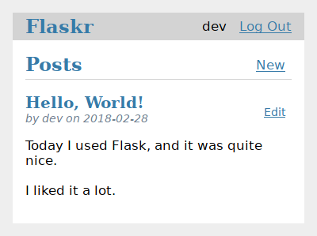
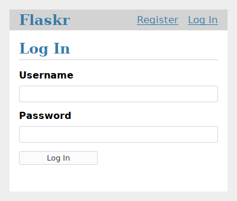
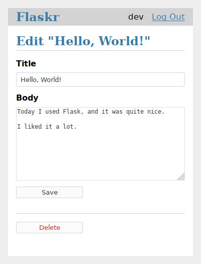

Contents:

+ [项目布局](https://dormousehole.readthedocs.io/en/latest/tutorial/layout.html)
+ [应用设置](https://dormousehole.readthedocs.io/en/latest/tutorial/factory.html)
+ [定义和操作数据库](https://dormousehole.readthedocs.io/en/latest/tutorial/database.html)
+ [蓝图和视图](https://dormousehole.readthedocs.io/en/latest/tutorial/views.html)
+ [模板](https://dormousehole.readthedocs.io/en/latest/tutorial/templates.html)
+ [静态文件](https://dormousehole.readthedocs.io/en/latest/tutorial/static.html)
+ [博客蓝图](https://dormousehole.readthedocs.io/en/latest/tutorial/blog.html)
+ [项目可安装化](https://dormousehole.readthedocs.io/en/latest/tutorial/install.html)
+ [测试覆盖](https://dormousehole.readthedocs.io/en/latest/tutorial/tests.html)
+ [部署产品](https://dormousehole.readthedocs.io/en/latest/tutorial/deploy.html)
+ [继续开发！](https://dormousehole.readthedocs.io/en/latest/tutorial/next.html)

本教程中我们将会创建一个名为 Flaskr 的具备基本功能的博客应用。应用用户可以 注册、登录、发贴和编辑或者删除自己的帖子。可以打包这个应用并且安装到其他电脑 上。

本文假设你已经熟悉 Python 。 不熟悉？那么建议先从学习或者复习 Python 文档的 [官方教程](https://docs.python.org/3/tutorial/) 入手。

本教程不会涵盖 Flask 的所有内容，其目的是提供一个良好的起点。如果想了解 Flask 能够做什么，可以通过 [快速上手](https://dormousehole.readthedocs.io/en/latest/quickstart.html) 作一个大概的了解，想深入 了解的话那就只有仔细阅读所有文档了。本教程只会涉及 Flask 和 Python 。在 实际项目中可以通过使用 [扩展](https://dormousehole.readthedocs.io/en/latest/extensions.html) 或者其他的库，达到事半功倍的 效果。

Flask 是非常灵活的，不需要使用任何特定的项目或者代码布局。但是对于初学 者，使用结构化的方法是有益无害的，亦即本教程会有一点样板的意思。本教程 可以让初学者避免一些常见的陷阱，并且完成后的应用可以方便的扩展。一旦熟 悉了 Flask 之后就可以跳出这个结构，充分享受 Flask 的灵活性。

如果在学习教程过程中需要比较项目代码与最终结果的差异，那么可以在 [Flask 官方资源库的示例](https://github.com/pallets/flask/tree/3.0.2/examples/tutorial) 中找到完成的教程项目代 码。

下面请阅读 [项目布局](https://dormousehole.readthedocs.io/en/latest/tutorial/layout.html) 。

