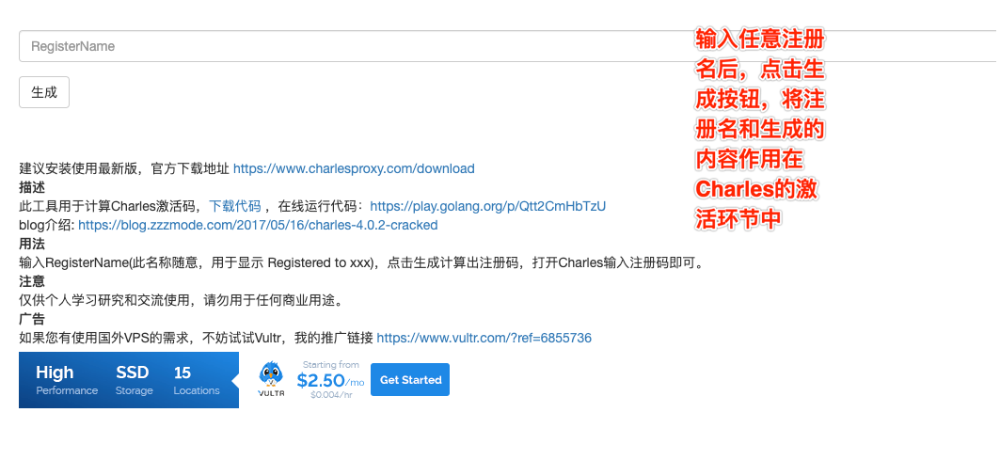
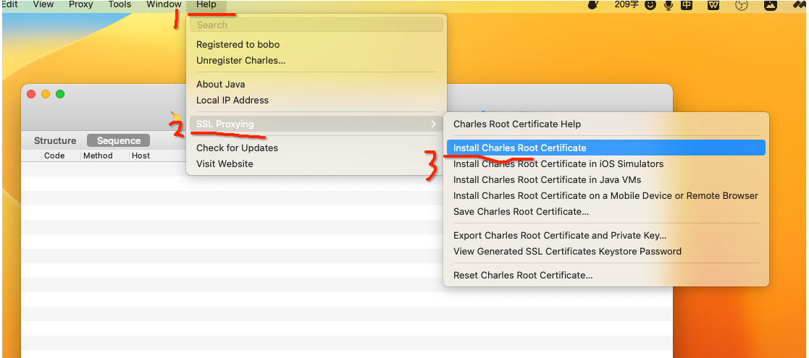
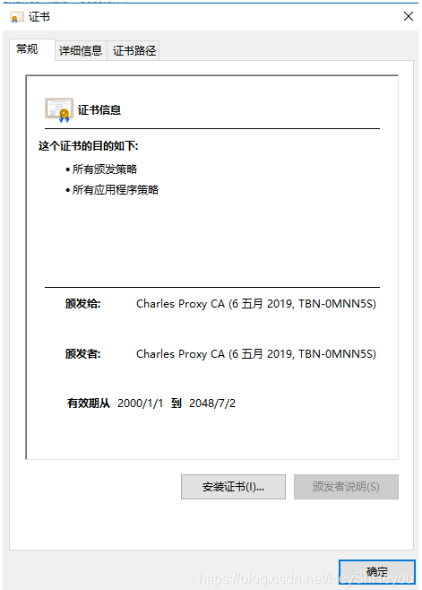
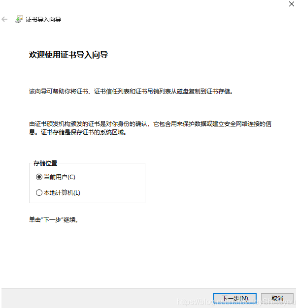
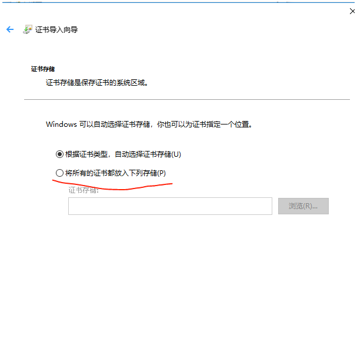
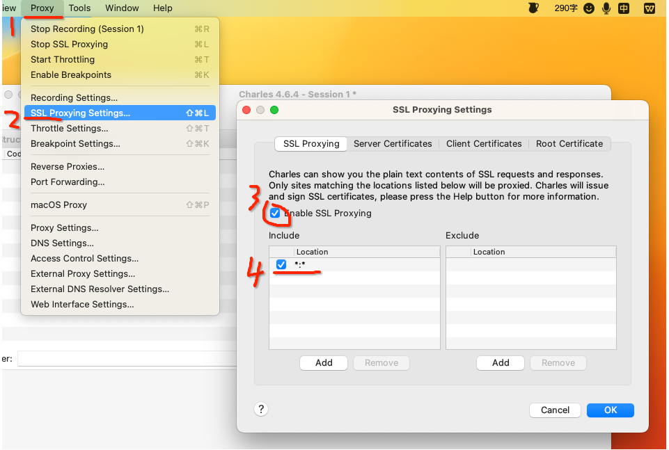
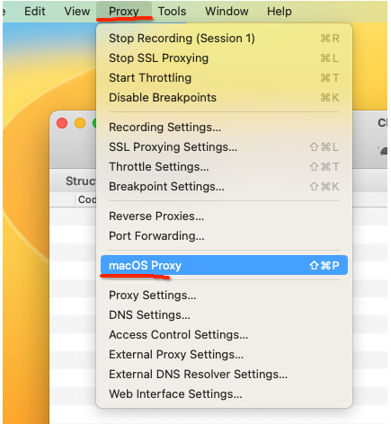
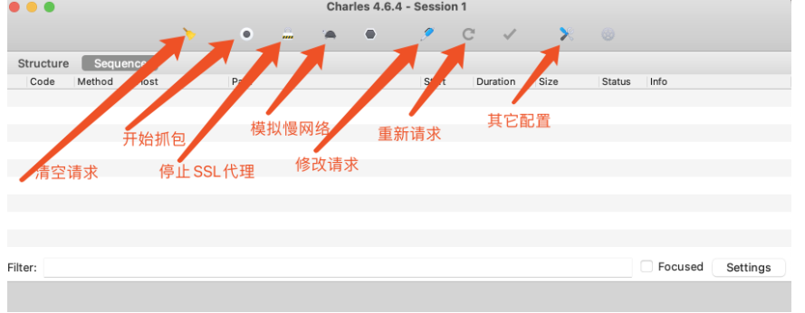

<font style="color:rgb(51, 51, 51);">本次课是爬虫基础的最后一次课。</font>

<font style="color:rgb(51, 51, 51);">给大家布置一个大作业。</font>

<font style="color:rgb(51, 51, 51);">下周三开始逆向的课程（苑浩老师）</font>

<font style="color:rgb(51, 51, 51);">爬虫逆向的进阶（bobo）</font>

### <font style="color:rgb(51, 51, 51);">Charles安装（三方抓包工具）</font>
**<font style="color:rgb(51, 51, 51);">Charles客户端下载</font>**<font style="color:rgb(51, 51, 51);">：</font><font style="color:rgb(51, 51, 51);">官网地址：</font>[<font style="color:rgb(51, 51, 51);">https://www.charlesproxy.com/download/</font>](https://www.charlesproxy.com/download/)

<font style="color:rgb(51, 51, 51);">选择适合自己的系统版本下载</font>

**<font style="color:rgb(51, 51, 51);">下载安装完成后激活</font>**<font style="color:rgb(51, 51, 51);">激活网站地址：</font>[<font style="color:rgb(51, 51, 51);">https://www.zzzmode.com/mytools/charles/</font>](https://www.zzzmode.com/mytools/charles/)



<font style="color:rgb(51, 51, 51);">打开安装好的Charles，菜单栏 Help->Register Charles 弹出注册的窗口填入Registered Name和生成的license key，点击 Register。</font>

<font style="color:rgb(51, 51, 51);">Charles配置，打开Charles，先安装证书并且信任</font>



<font style="color:rgb(51, 51, 51);">证书下载好之后，找到证书文件，双击进行安装，将其安装到【受信任】目录中，出现信任选项，点击始终信任即可。</font>








<font style="color:rgb(51, 51, 51);">点击完成后提示导入成功。此时需要重新进入Help -> SSL Proxying -> Install Charles Root Certificate，查看证书结果，成功时如下提示：</font>


<font style="color:rgb(51, 51, 51);">设置SSL，保证可以抓取https协议的请求：</font>



<font style="color:rgb(51, 51, 51);">这是端口号：</font>


<font style="color:rgb(51, 51, 51);">如果是mac操作系统需要如下操作，其他系统忽略该操作：</font>



**<font style="color:rgb(51, 51, 51);">配置完成，可以使用Charles进行抓包了</font>**

<font style="color:rgb(51, 51, 51);">工具栏功能介绍</font>



### <font style="color:rgb(51, 51, 51);">什么是证书？为何需要证书？</font>
**<font style="color:rgb(51, 51, 51);">首先明确一点，安装证书的目的是为了是的抓包工具可以抓取https协议的请求。</font>**

#### <font style="color:rgb(51, 51, 51);">http协议是不安全的</font>
<font style="color:rgb(51, 51, 51);">在https诞生之前，所有网站都使用http协议，而http协议在数据传输的过程中都是明文，所以可能存在数据泄露和篡改。</font>

#### <font style="color:rgb(51, 51, 51);">使用对称秘钥进行数据加密</font>
<font style="color:rgb(51, 51, 51);">为了防止数据泄露和篡改，我们对数据进行加密，如：生成一个对称密码【DKUFHNAF897123F】，将对称秘钥分别交给浏览器和服务器端，他们之间传输的数据都使用对称秘钥进行加密和解密。</font>

<font style="color:rgb(51, 51, 51);">请求和响应流程如下：</font>

1. <font style="color:rgb(51, 51, 51);">客户端使用对称秘钥对请求进行加密，并发送给服务端。</font>
2. <font style="color:rgb(51, 51, 51);">服务端接收到密文之后，使用对称秘钥对密文进行解密，然后处理请求。 最后再使用对称秘钥把要返回的内容再次加密，返回给客户端。</font>
3. <font style="color:rgb(51, 51, 51);">客户端接收到密文之后，使用对称秘钥进行解密，并获取最终的响应内容。</font>

<font style="color:rgb(51, 51, 51);">如此一来，数据传输都是密文，解决了明文传输数据的问题。</font>**<font style="color:rgb(51, 51, 51);">但是</font>**<font style="color:rgb(51, 51, 51);">，这么干有bug。</font>

+ <font style="color:rgb(51, 51, 51);">浏览器如何获取对称秘钥？</font>
+ <font style="color:rgb(51, 51, 51);">如果每个客户端的对称秘钥相同，浏览器能拿到对称秘钥，那么黑客也可以拿到，所以，数据加密也就没有意义了。</font>

#### <font style="color:rgb(51, 51, 51);">非对称秘钥加密</font>
<font style="color:rgb(51, 51, 51);">公钥私钥对儿：公钥负责加密，私钥负责解密</font>

<font style="color:rgb(51, 51, 51);">如此一来，解决了 动态对称秘钥 和 数据加密的问题，因为每个用户的对称秘钥都是随机生成且传输的过程中都使用公钥加密（公钥加密的数据只有私钥能解密），所有黑客无法截获对称秘钥。而数据传输是通过对称秘钥加密过的，所以黑客即使能获取数据也无法去解密看到真实的内容。 看似无懈可击，</font>**<font style="color:rgb(51, 51, 51);">但是</font>**<font style="color:rgb(51, 51, 51);">，这么干还是又bug：如果黑客在上图 【步骤2】劫持，黑客把自己的公钥返回给客客户端，那么客户端会使用黑客的公钥来加密对称秘钥，黑客在【步骤6】截获请求，使用自己的私钥获取对称秘钥，后面过程全都会完蛋...</font>

#### <font style="color:rgb(51, 51, 51);">CA证书应用</font>
<font style="color:rgb(51, 51, 51);">使用 ca 证书可以解决黑客劫持的问题</font>

<font style="color:rgb(51, 51, 51);">如此一来，就解决了黑客劫持的问题，因为即使黑客劫持后的给浏览器即使返回了证书也无法通过校验，同时浏览器也会提示错误信息。</font>

<font style="color:rgb(51, 51, 51);">https可以保证数据安全，但由过程需要反复加密解密所有访问速度会有所下降（鱼和熊掌不能兼得）。</font>

证书中是存在公钥的。当客户端获取了证书中的公钥后，就可以基于https协议和服务器之间进行加密的数据交互。

#### <font style="color:rgb(51, 51, 51);">小技巧</font>
+ <font style="color:rgb(51, 51, 51);">过滤器：</font>
+ <font style="color:rgb(51, 51, 51);">数据包内容搜索：</font>

<font style="color:rgb(51, 51, 51);">请求修改：用来验证哪些请求参数是必要的</font>

请求sogou关键字搜索，然后在数据包内容搜索框中，搜索显示页面中的文字内容，定位到指定数据包，然后，选中该数据包，按下Compose键，进行请求参数修改，然后重新发送请求，查看删除参数后，响应数据是否依然正常。

#### <font style="color:rgb(51, 51, 51);">案例</font>
+ <font style="color:rgb(51, 51, 51);">抓取微信小程序---实习僧，python关键字对应的岗位搜索结果</font>

```python
#实习僧 python招聘信息抓取
import requests
#如果加了verify=False这个关键字参数，使用requests模块发送请求的时候会给你弹出一个警告InsecureRequestWarning，警告你当前的请求可能不安全，可以使用如下代码忽略该警告
import urllib3
urllib3.disable_warnings(urllib3.exceptions.InsecureRequestWarning)

headers = {
    'user-agent':'Mozilla/5.0 (Macintosh; Intel Mac OS X 10_15_7) AppleWebKit/537.36 (KHTML, like Gecko) Chrome/98.0.4758.102 Safari/537.36 MicroMessenger/6.8.0(0x16080000) NetType/WIFI MiniProgramEnv/Mac MacWechat/WMPF XWEB/30817',
}
url = 'https://apigateway.shixiseng.com/api/interns/v2.0/interns/wxz/search/v3?city=%E5%85%A8%E5%9B%BD&k=Python&intention=&degree=&internship_duration=&days_per_week=&payment_per_day=&emp_chance=&area=&scale=&category=&ipo=&nature=&t=0&p=1&target=intern'

#目前各大网站基本有自己的ca证书，但是不排除有的网站为了节约网站建设开销并没有购买ca证书。又因为requests模块在发送网络请求的时候，默认会验证ca证书。如果当前网站没有ca证书，那么就会报出SSLError错误，则使用verify参数赋值False可以在请求的时候不验证网站的ca证书。
ret = requests.get(url,headers=headers,verify=False).json()
print(ret)
```

+ <font style="color:rgb(51, 51, 51);">抓取"十点读书"公众号里的【精选美文】</font>

```python
import requests
import urllib3
urllib3.disable_warnings(urllib3.exceptions.InsecureRequestWarning)

headers = {
    'user-agent':'Mozilla/5.0 (Macintosh; Intel Mac OS X 10_15_7) AppleWebKit/537.36 (KHTML, like Gecko) Chrome/98.0.4758.102 Safari/537.36 MicroMessenger/6.8.0(0x16080000) NetType/WIFI MiniProgramEnv/Mac MacWechat/WMPF XWEB/30817',
}
url = 'https://mp.weixin.qq.com/mp/homepage?__biz=MjM5MDMyMzg2MA==&hid=4&sn=27a179d5681d48ed5011c70994508a0a&scene=18&uin=MTM1ODMyODkwNQ%3D%3D&key=06d4c0937920c7fadf27c486114e5b0bb96d03e4c8d7ad16bbf2121d6e11d1124cea5a68fc8e67fa6ad73e234855fc3537e9b1688af3be467627c252d2902cfee4abea79bbe7481a7eae39665697a8ff26a4e09d2dd1c8791132771b6ae4f9f8462d0fda391204e2d8248e3c31f5e7ee3e7231825cb1ee60375e60724680d29e&devicetype=iMac+MacBookPro17%2C1+OSX+OSX+13.5+build(22G74)&version=13080610&lang=zh_CN&nettype=WIFI&ascene=7&fontScale=100&acctmode=0&pass_ticket=9n%2F1k887rHVmwpZwC%2FpTfXPaxFwjBJ7eZeVikkd3AC44Vma0v7JmpX3GnYn%2BdBGcMGR2QGh9dc3m8ovwsU0BLg%3D%3D&session_us=gh_5c7e8b7f586b&cid=0&begin=6&count=5&action=appmsg_list&f=json&r=0.36265542830912967&appmsg_token=1259_HS65EsrjiYe0fsmnuhRibFokbkLFN7mQKYyXag~~'
data = requests.post(url=url,headers=headers,verify=False).json()
print(data)
```

### <font style="color:rgb(51, 51, 51);">大作业</font>
<font style="color:rgb(51, 51, 51);">#需求：</font>[<font style="color:rgb(51, 51, 51);">https://ks.wangxiao.cn/</font>](https://ks.wangxiao.cn/)<font style="color:rgb(51, 51, 51);">，</font>

<font style="color:rgb(51, 51, 51);">将首页中所有一级标题下对应的二级标题对应的【每日一练】板块下的所有的题目，选项和正确答案进行数据爬取，将爬取到的数据存储到mysql数据库中。</font>

<font style="color:rgb(51, 51, 51);">注意：每一个一级标题下随机选择一个二级标题进行数据爬取。如果想所有的数据都爬取，你自己去购买代理ip。</font>

### <font style="color:rgb(51, 51, 51);">大家一定要收下留情，别给网站搞崩啦！！！！！</font>
  
 

