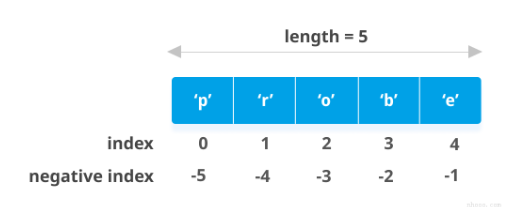
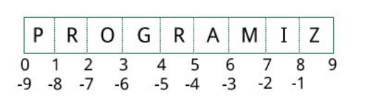
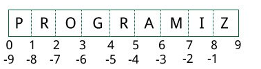
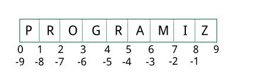
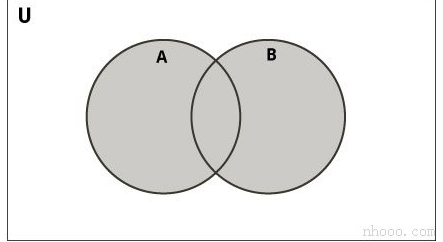
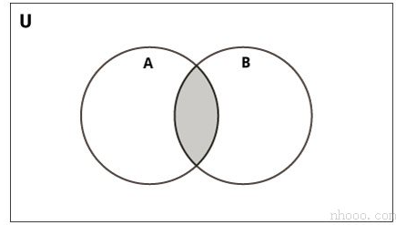
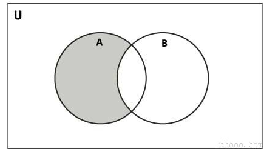
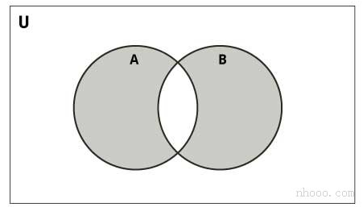

# <font style="color:rgb(51, 51, 51);">Python中的数字数据类型</font>
<font style="color:rgb(51, 51, 51);">Python支持整数，浮点数和复数。他们被定义为int，float和complex在Python数据类型中。</font>

<font style="color:rgb(51, 51, 51);">整数和浮点由存在或不存在小数点分隔。5是整数，而5.0是浮点数。</font>

<font style="color:rgb(51, 51, 51);">复数以形式书写x + yj，其中</font><font style="color:rgb(51, 51, 51);">x</font><font style="color:rgb(51, 51, 51);">是实部，</font><font style="color:rgb(51, 51, 51);">y</font><font style="color:rgb(51, 51, 51);">是虚部。</font>

<font style="color:rgb(51, 51, 51);">我们可以使用type()函数来判断变量或值属于哪种数据类型，并且可以使用函数isinstance()检查它是否属于特定的类型。</font>

**<font style="color:rgb(51, 51, 51);background-color:rgb(239, 239, 239);">示例</font>**

```python
a = 5

# 输出: <class 'int'>
print(type(a))

# 输出: <class 'float'>
print(type(5.0))

# 输出: (8+3j)
c = 5 + 3j
print(c + 3)

# 输出: True
print(isinstance(c, complex))
```

<font style="color:rgb(51, 51, 51);">虽然整数可以是任意长度，但浮点数最多只能精确到15个小数位（第16位不准确）。</font>

<font style="color:rgb(51, 51, 51);">我们每天处理的数字是十进制（以10为底）的数字系统。 但是计算机程序员（通常为嵌入式程序员）需要使用二进制（基数2），十六进制（基数16）和八进制（基数8）的数字系统。</font>

<font style="color:rgb(51, 51, 51);">在Python中，我们可以通过在数字之前添加前缀来表示这些数字。下表列出了这些前缀。</font>

| <font style="color:rgb(254, 254, 254);">编号系统</font> | <font style="color:rgb(254, 254, 254);">前缀</font> |
| --- | --- |
| <font style="color:rgb(51, 51, 51);">Binary</font> | <font style="color:rgb(51, 51, 51);">'0b'或'0B'</font> |
| <font style="color:rgb(51, 51, 51);">Octal</font> | <font style="color:rgb(51, 51, 51);">'0o'或'0O'</font> |
| <font style="color:rgb(51, 51, 51);">Hexadecimal</font> | <font style="color:rgb(51, 51, 51);">'0x'或'0X'</font> |


<font style="color:rgb(51, 51, 51);">这里有些示例</font>

**<font style="color:rgb(51, 51, 51);background-color:rgb(239, 239, 239);">示例</font>**

```python
# 输出: 107
print(0b1101011)

# 输出: 253 (251 + 2)
print(0xFB + 0b10)

# 输出: 13
print(0o15)
```

<font style="color:rgb(51, 51, 51);">运行该程序时，输出为：</font>

```python
107
253
13
```

## <font style="color:rgb(51, 51, 51);">数据类型转换</font>
<font style="color:rgb(51, 51, 51);">我们可以将一种数字转换为另一种数字。这也称为强制转换。</font>

<font style="color:rgb(51, 51, 51);">如果操作数之一是浮点数，则加法，减法等操作会强制整数隐式（自动）浮点。</font>

```python
>>> 1 + 2.0
3.0
```

<font style="color:rgb(51, 51, 51);">我们可以在上面看到1（整数）被强制转换为1.0（float）进行加法运算，结果也是一个浮点数。</font>

<font style="color:rgb(51, 51, 51);">我们还可以使用诸如的内置函数int()，float()和complex()在类型之间进行显式转换。这些函数甚至可以从</font>[<font style="color:rgb(51, 51, 51);">字符串</font>](https://www.cainiaoplus.com/python/python-string.html)<font style="color:rgb(51, 51, 51);">转换。</font>

```python
>>> int(2.3)
2
>>> int(-2.8)
-2
>>> float(5)
5.0
>>> complex('3+5j')
(3+5j)
```

<font style="color:rgb(51, 51, 51);">从float转换为整数时，数字将被截断（接近零的整数）。</font>

## <font style="color:rgb(51, 51, 51);">Python 小数</font>
<font style="color:rgb(51, 51, 51);">Python内置类float会执行一些可能令我们惊讶的计算。我们都知道1.1和2.2的总和是3.3，但是Python似乎不同意。</font>

```python
>>> (1.1 + 2.2) == 3.3
False
```

<font style="color:rgb(51, 51, 51);">到底是怎么回事？</font>

<font style="color:rgb(51, 51, 51);">事实证明，浮点数在计算机硬件中以二进制分数形式实现，因为计算机仅理解二进制（0和1）。由于这个原因，我们知道的大多数十进制小数不能准确地存储在我们的计算机中。</font>

<font style="color:rgb(51, 51, 51);">让我们举个示例。我们不能将分数1/3表示为十进制数。这将给出0.33333333 ...无限长，我们只能对其进行近似。</font>

<font style="color:rgb(51, 51, 51);">原来的十进制小数0.1会导致无限长的二进制分数0.000110011001100110011 ...而我们的计算机只存储了有限数量的二进制数。</font>

<font style="color:rgb(51, 51, 51);">这只会接近0.1，但永远不会相等。因此，这是我们计算机硬件的局限性，而不是Python中的错误。</font>

```python
>>> 1.1 + 2.2
3.3000000000000003
```

<font style="color:rgb(51, 51, 51);">为了克服这个问题，我们可以使用Python随附的十进制模块。浮点数的精度最高可以达到15个小数位，而十进制模块具有用户可设置的精度。</font>

**<font style="color:rgb(51, 51, 51);background-color:rgb(239, 239, 239);">示例</font>**

```python
import decimal

# 输出: 0.1
print(0.1)

# 输出: Decimal('0.1000000000000000055511151231257827021181583404541015625')
print(decimal.Decimal(0.1))
```

<font style="color:rgb(51, 51, 51);">当我们要像在学校学习的那样进行十进制计算时，将使用此模块。</font>

<font style="color:rgb(51, 51, 51);">它也保留了意义。我们知道，25.50公斤比25.5公斤更准确，因为它有两位小数，而不是一位。</font>

**<font style="color:rgb(51, 51, 51);background-color:rgb(239, 239, 239);">示例</font>**

```python
from decimal import Decimal as D
# 输出: Decimal('3.3')
print(D('1.1') + D('2.2'))

# 输出: Decimal('3.000')
print(D('1.2') * D('2.50'))
```

<font style="color:rgb(51, 51, 51);">注意上例中的尾随零。</font>

<font style="color:rgb(51, 51, 51);">我们可能会问，为什么不每次都执行Decimal而不是float？主要原因是效率。进行浮点运算必须比十进制运算更快。</font>

### <font style="color:rgb(51, 51, 51);">何时使用Decimal而不是float？</font>
<font style="color:rgb(51, 51, 51);">在以下情况下，我们通常使用十进制。</font>

+ <font style="color:rgb(51, 51, 51);">当我们进行需要精确十进制表示的金融应用程序时。</font>
+ <font style="color:rgb(51, 51, 51);">当我们要指定所需的精度水平时。</font>
+ <font style="color:rgb(51, 51, 51);">当我们想实现小数位有效的概念时。</font>
+ <font style="color:rgb(51, 51, 51);">当我们希望像在学校一样进行运算时</font>

## <font style="color:rgb(51, 51, 51);">Python 分数</font>
<font style="color:rgb(51, 51, 51);">Python通过其fractions模块提供涉及小数的运算。</font>

<font style="color:rgb(51, 51, 51);">小数具有分子和分母，它们都是整数。该模块支持有理数算法。</font>

<font style="color:rgb(51, 51, 51);">我们可以通过多种方式创建Fraction对象。</font>

**<font style="color:rgb(51, 51, 51);background-color:rgb(239, 239, 239);">示例</font>**

```python
import fractions

# 输出: 3/2
print(fractions.Fraction(1.5))

# 输出: 5
print(fractions.Fraction(5))

# 输出: 1/3
print(fractions.Fraction(1,3))
```

<font style="color:rgb(51, 51, 51);">从float创建分数时，我们可能会得到一些异常的结果。这是由于上一节中讨论的二进制浮点数表示不完善所致。</font>

<font style="color:rgb(51, 51, 51);">幸运的是，小数还允许我们使用字符串示例化。这是使用十进制数字时的首选选项。</font>

**<font style="color:rgb(51, 51, 51);background-color:rgb(239, 239, 239);">示例</font>**

```python
import fractions

# 用作 float
# 输出: 2476979795053773/2251799813685248
print(fractions.Fraction(1.1))

# 用作 string
# 输出: 11/10
print(fractions.Fraction('1.1'))
```

<font style="color:rgb(51, 51, 51);">此数据类型支持所有基本操作。这里有几个示例。</font>

**<font style="color:rgb(51, 51, 51);background-color:rgb(239, 239, 239);">示例</font>**

```python
from fractions import Fraction as F

# 输出: 2/3
print(F(1,3) + F(1,3))

# 输出: 6/5
print(1 / F(5,6))

# 输出: False
print(F(-3,10) > 0)

# 输出: True
print(F(-3,10) < 0)
```

## <font style="color:rgb(51, 51, 51);">Python 数学</font>
<font style="color:rgb(51, 51, 51);">Python提供了类似的模块，math和random可以执行不同的数学运算，例如三角函数，对数，概率和统计等。</font>

**<font style="color:rgb(51, 51, 51);background-color:rgb(239, 239, 239);">示例</font>**

```python
import math

# 输出: 3.141592653589793
print(math.pi)

# 输出: -1.0
print(math.cos(math.pi))

# 输出: 22026.465794806718
print(math.exp(10))

# 输出: 3.0
print(math.log10(1000))

# 输出: 1.1752011936438014
print(math.sinh(1))

# 输出: 720
print(math.factorial(6))
```

<font style="color:rgb(51, 51, 51);">这是</font>[<font style="color:rgb(51, 51, 51);">Python math模块中</font>](https://www.cainiaoplus.com/python/python-modules-math.html)<font style="color:rgb(51, 51, 51);">可用的完整列表函数和属性。</font>

**<font style="color:rgb(51, 51, 51);background-color:rgb(239, 239, 239);">示例</font>**

```python
import random

# 输出: 16
print(random.randrange(10,20))

x = ['a', 'b', 'c', 'd', 'e']

# 得到随机选项
print(random.choice(x))

# 打乱x列表顺序
random.shuffle(x)

# 打印输出被打乱顺序后的x
print(x)

# 打印随机元素
print(random.random())
```

<font style="color:rgb(51, 51, 51);">输出结果（随机结果）：</font>

```python
19
c
['e', 'a', 'd', 'c', 'b']
0.707947055817621
```

<font style="color:rgb(51, 51, 51);">这是</font>[<font style="color:rgb(51, 51, 51);">Python random模块中</font>](https://www.cainiaoplus.com/python/python-modules-random.html)<font style="color:rgb(51, 51, 51);">可用的完整列表函数和属性。</font>

# <font style="color:rgb(51, 51, 51);">Python 列表（List）</font>
## <font style="color:rgb(51, 51, 51);">如何建立列表（List）？</font>
<font style="color:rgb(51, 51, 51);">在Python编程中，通过将所有项目（元素）放在方括号[]中并用逗号分隔来创建列表。</font>

<font style="color:rgb(51, 51, 51);">它可以具有任意数量的项目，并且它们可以具有不同的类型（整数，浮点数，字符串等）。</font>

```plain
# 空 list
my_list = []

# 整数list
my_list = [1, 2, 3]

# 具有混合数据类型的列表
my_list = [1, "Hello", 3.4]
```

<font style="color:rgb(51, 51, 51);">同样，一个列表甚至可以将另一个列表作为项目。这称为嵌套列表。</font>

```plain
# 嵌套 list
my_list = ["mouse", [8, 4, 6], ['a']]
```

## <font style="color:rgb(51, 51, 51);">如何访问列表中的元素？</font>
<font style="color:rgb(51, 51, 51);">我们可以通过多种方式访问列表的元素。</font>

### <font style="color:rgb(51, 51, 51);">列表索引</font>
<font style="color:rgb(51, 51, 51);">我们可以使用索引运算符[]来访问列表中的项目。索引从0开始。因此，包含5个元素的列表的索引从0到4。</font>

<font style="color:rgb(51, 51, 51);">尝试访问其他元素，否则将引发IndexError。索引必须是整数。我们不能使用float或其他类型，这将导致TypeError。</font>

<font style="color:rgb(51, 51, 51);">使用嵌套索引访问嵌套列表。</font>

**<font style="color:rgb(51, 51, 51);background-color:rgb(239, 239, 239);">示例</font>**

```plain
my_list = ['p','r','o','b','e']
# 输出: p
print(my_list[0])

# 输出: o
print(my_list[2])

# 输出: e
print(my_list[4])

# 错误！ 仅整数可用于索引
# my_list[4.0]

# 嵌套列表
n_list = ["Happy", [2,0,1,5]]

# 嵌套索引

# 输出: a
print(n_list[0][1])    

# 输出: 5
print(n_list[1][3])
```

### <font style="color:rgb(51, 51, 51);">负索引</font>
<font style="color:rgb(51, 51, 51);">Python允许对其序列进行负索引。索引-1表示最后一项，-2表示倒数第二项，依此类推。</font>

**<font style="color:rgb(51, 51, 51);background-color:rgb(239, 239, 239);">示例</font>**

```plain
my_list = ['p','r','o','b','e']

# 输出: e
print(my_list[-1])

# 输出: p
print(my_list[-5])
```



## <font style="color:rgb(51, 51, 51);">如何在Python中切片列表？</font>
<font style="color:rgb(51, 51, 51);">我们可以使用切片运算符（冒号：）访问列表中的一系列项目。</font>

**<font style="color:rgb(51, 51, 51);background-color:rgb(239, 239, 239);">示例</font>**

```plain
my_list = ['p','r','o','g','r','a','m','i','z']
# 从第3元素至第5个元素
print(my_list[2:5])

# 从开始到第4个元素
print(my_list[:-5])

# 第6个元素至结束
print(my_list[5:])

# 元素开始到结束
print(my_list[:])
```

<font style="color:rgb(51, 51, 51);">通过将索引考虑到如下所示的元素之间，切片可以得到最佳的可视化效果。如果我们想要访问一个范围，我们需要两个下标来从列表中分割那部分。</font>



## <font style="color:rgb(51, 51, 51);">如何更改或添加元素到列表？</font>
<font style="color:rgb(51, 51, 51);">List是可变的，也就是说，它们的元素可以更改，而不像</font>[<font style="color:rgb(51, 51, 51);">string</font>](https://www.cainiaoplus.com/python/python-string.html)<font style="color:rgb(51, 51, 51);">或</font>[<font style="color:rgb(51, 51, 51);">tuple</font>](https://www.cainiaoplus.com/python/python-tuple.html)<font style="color:rgb(51, 51, 51);">。</font>

<font style="color:rgb(51, 51, 51);">我们可以使用赋值运算符（=）更改一个项目或一系列项目。</font>

**<font style="color:rgb(51, 51, 51);background-color:rgb(239, 239, 239);">示例</font>**

```plain
# 值列表
odd = [2, 4, 6, 8]

# 改变第一个元素    
odd[0] = 1            

# 输出: [1, 4, 6, 8]
print(odd)

# 改变第2到第4项
odd[1:4] = [3, 5, 7]  

# 输出: [1, 3, 5, 7]
print(odd)
```

<font style="color:rgb(51, 51, 51);">我们可以使用append()方法将一个项目添加到列表中，或者使用extend()方法将多个项目添加到列表中。</font>

```plain
odd = [1, 3, 5]

odd.append(7)

# 输出: [1, 3, 5, 7]
print(odd)

odd.extend([9, 11, 13])

# 输出: [1, 3, 5, 7, 9, 11, 13]
print(odd)
```

<font style="color:rgb(51, 51, 51);">我们还可以使用+运算符组合两个列表。这也称为串联。</font>

<font style="color:rgb(51, 51, 51);">*运算符重复给定次数的列表。</font>

```plain
odd = [1, 3, 5]

# 输出: [1, 3, 5, 9, 7, 5]
print(odd + [9, 7, 5])

#输出: ["re", "re", "re"]
print(["re"] * 3)
```

<font style="color:rgb(51, 51, 51);">此外，我们可以使用insert()方法在需要的位置插入一个项，或者通过将多个项压缩到列表的一个空切片中来插入多个项。</font>

**<font style="color:rgb(51, 51, 51);background-color:rgb(239, 239, 239);">示例</font>**

```plain
odd = [1, 9]
odd.insert(1,3)

# 输出: [1, 3, 9] 
print(odd)

odd[2:2] = [5, 7]

# 输出: [1, 3, 5, 7, 9]
print(odd)
```

## <font style="color:rgb(51, 51, 51);">如何从列表中删除或删除元素？</font>
<font style="color:rgb(51, 51, 51);">我们可以使用关键字del从列表中删除一个或多个项。它甚至可以完全删除列表。</font>

**<font style="color:rgb(51, 51, 51);background-color:rgb(239, 239, 239);">示例</font>**

```plain
my_list = ['p','r','o','b','l','e','m']

# 删除一项
del my_list[2]

# 输出: ['p', 'r', 'b', 'l', 'e', 'm']     
print(my_list)

# 删除多个项目
del my_list[1:5]  

# 输出: ['p', 'm']
print(my_list)

# 删除所有列表
del my_list       

# Error: List not defined
print(my_list)
```

<font style="color:rgb(51, 51, 51);">我们可以使用remove()方法删除给定项目，也可以使用pop()方法删除给定索引处的项目。</font>

<font style="color:rgb(51, 51, 51);">如果未提供索引，则pop()方法将删除并返回最后一项。这有助于我们将列表实现为堆栈（先进先出数据结构）。</font>

<font style="color:rgb(51, 51, 51);">我们还可以使用该clear()方法清空列表。</font>

**<font style="color:rgb(51, 51, 51);background-color:rgb(239, 239, 239);">示例</font>**

```plain
my_list = ['p','r','o','b','l','e','m']
my_list.remove('p')

# 输出: ['r', 'o', 'b', 'l', 'e', 'm']
print(my_list)

# 输出: 'o'
print(my_list.pop(1))

# 输出: ['r', 'b', 'l', 'e', 'm']
print(my_list)

# 输出: 'm'
print(my_list.pop())

# 输出: ['r', 'b', 'l', 'e']
print(my_list)

my_list.clear()

# 输出: []
print(my_list)
```

<font style="color:rgb(51, 51, 51);">最后，我们还可以通过为元素切片分配一个空列表来删除列表中的项目。</font>

```plain
>>> my_list = ['p','r','o','b','l','e','m']
>>> my_list[2:3] = []
>>> my_list
['p', 'r', 'b', 'l', 'e', 'm']
>>> my_list[2:5] = []
>>> my_list
['p', 'r', 'm']
```

## <font style="color:rgb(51, 51, 51);">Python列表方法</font>
<font style="color:rgb(51, 51, 51);">下面列出了Python编程中list对象可用的方法。</font>

<font style="color:rgb(51, 51, 51);">它们以list.method()方式访问。上面已经使用了某些方法。</font>

| [<font style="color:rgb(254, 254, 254);">Python列表方法</font>](https://www.cainiaoplus.com/python/python-methods-list.html) |
| --- |
| [<font style="color:rgb(51, 51, 51);">append()-将元素添加到列表的末尾</font>](https://www.cainiaoplus.com/python/python-methods-list-append.html) |
| [<font style="color:rgb(51, 51, 51);">extend()-将列表的所有元素添加到另一个列表</font>](https://www.cainiaoplus.com/python/python-methods-list-extend.html) |
| [<font style="color:rgb(51, 51, 51);">insert()-在定义的索引处插入一个项目</font>](https://www.cainiaoplus.com/python/python-methods-list-insert.html) |
| [<font style="color:rgb(51, 51, 51);">remove()-从列表中删除一个项目</font>](https://www.cainiaoplus.com/python/python-methods-list-remove.html) |
| [<font style="color:rgb(51, 51, 51);">pop()-删除并返回给定索引处的元素</font>](https://www.cainiaoplus.com/python/python-methods-list-pop.html) |
| [<font style="color:rgb(51, 51, 51);">clear()-从列表中删除所有项目</font>](https://www.cainiaoplus.com/python/python-methods-list-clear.html) |
| [<font style="color:rgb(51, 51, 51);">index()-返回第一个匹配项的索引</font>](https://www.cainiaoplus.com/python/python-methods-list-index.html) |
| [<font style="color:rgb(51, 51, 51);">count()-返回作为参数传递的项目数</font>](https://www.cainiaoplus.com/python/python-methods-list-count.html) |
| [<font style="color:rgb(51, 51, 51);">sort()-以升序对列表中的项目进行排序</font>](https://www.cainiaoplus.com/python/python-methods-list-sort.html) |
| [<font style="color:rgb(51, 51, 51);">reverse()-反转列表中项目的顺序</font>](https://www.cainiaoplus.com/python/python-methods-list-reverse.html) |
| [<font style="color:rgb(51, 51, 51);">copy()-返回列表的浅表副本</font>](https://www.cainiaoplus.com/python/python-methods-list-copy.html) |


<font style="color:rgb(51, 51, 51);">Python列表方法的一些示例：</font>

**<font style="color:rgb(51, 51, 51);background-color:rgb(239, 239, 239);">示例</font>**

```plain
my_list = [3, 8, 1, 6, 0, 8, 4]

# 输出: 1
print(my_list.index(8))

# 输出: 2
print(my_list.count(8))

my_list.sort()

# 输出: [0, 1, 3, 4, 6, 8, 8]
print(my_list)

my_list.reverse()

# 输出: [8, 8, 6, 4, 3, 1, 0]
print(my_list)
```

## <font style="color:rgb(51, 51, 51);">列表理解：创建新列表的优雅方式</font>
<font style="color:rgb(51, 51, 51);">列表理解是从Python现有列表中创建新列表的一种简洁明了的方法。</font>

<font style="color:rgb(51, 51, 51);">列表理解包含一个表达式，后跟方括号内的</font>[<font style="color:rgb(51, 51, 51);">for语句</font>](https://www.cainiaoplus.com/python/python-for-loop.html)<font style="color:rgb(51, 51, 51);">。</font>

<font style="color:rgb(51, 51, 51);">这是一个列出每项增加2的幂的示例。</font>

**<font style="color:rgb(51, 51, 51);background-color:rgb(239, 239, 239);">示例</font>**

```plain
pow2 = [2 ** x for x in range(10)]

# 输出: [1, 2, 4, 8, 16, 32, 64, 128, 256, 512]
print(pow2)
```

<font style="color:rgb(51, 51, 51);">此代码等效于</font>

```plain
pow2 = []
for x in range(10):
   pow2.append(2 ** x)
```

<font style="color:rgb(51, 51, 51);">列表推导可以选择包含更多for或</font>[<font style="color:rgb(51, 51, 51);">if语句</font>](https://www.cainiaoplus.com/python/python-if-elif-else.html)<font style="color:rgb(51, 51, 51);">。可选if语句可以过滤出新列表的项目。这里有些示例。</font>

```plain
>>> pow2 = [2 ** x for x in range(10) if x > 5]
>>> pow2
[64, 128, 256, 512]
>>> odd = [x for x in range(20) if x % 2 == 1]
>>> odd
[1, 3, 5, 7, 9, 11, 13, 15, 17, 19]
>>> [x+y for x in ['Python ','C '] for y in ['Language','Programming']]
['Python Language', 'Python Programming', 'C Language', 'C Programming']
```

## <font style="color:rgb(51, 51, 51);">Python中的其他列表操作</font>
### <font style="color:rgb(51, 51, 51);">列表成员资格测试</font>
<font style="color:rgb(51, 51, 51);">我们可以使用关键字in来测试一个项目是否存在于一个列表中。</font>

**<font style="color:rgb(51, 51, 51);background-color:rgb(239, 239, 239);">示例</font>**

```plain
my_list = ['p','r','o','b','l','e','m']

# 输出: True
print('p' in my_list)

# 输出: False
print('a' in my_list)

# 输出: True
print('c' not in my_list)
```

### <font style="color:rgb(51, 51, 51);">遍历列表</font>
<font style="color:rgb(51, 51, 51);">使用for循环，我们可以遍历列表中的每个项目。</font>

**<font style="color:rgb(51, 51, 51);background-color:rgb(239, 239, 239);">示例</font>**

```plain
for fruit in ['apple','banana','mango']:
    print("I like",fruit)
```

# <font style="color:rgb(51, 51, 51);">Python 元组（Tuple）</font>
<font style="color:rgb(51, 51, 51);">Python中的元组类似于</font>[列表](https://www.cainiaoplus.com/python/python-list.html)<font style="color:rgb(51, 51, 51);">。两者之间的区别在于，一旦分配了元组，就无法更改其元素，而在列表中，可以更改元素。</font>

## <font style="color:rgb(51, 51, 51);">创建一个元组</font>
<font style="color:rgb(51, 51, 51);">通过将所有项目（元素）放在括号内()（以逗号分隔）来创建元组。括号是可选的，但是，使用括号是一个好习惯。</font>

<font style="color:rgb(51, 51, 51);">元组可以具有任意数量的项，并且它们可以具有不同的类型（整数，浮点数，列表，</font>[<font style="color:rgb(51, 51, 51);">字符串</font>](https://www.cainiaoplus.com/python/python-string.html)<font style="color:rgb(51, 51, 51);">等）。</font>

<font style="color:rgb(51, 51, 51);">也可以在不使用括号的情况下创建元组。这称为元组包装。</font>

<font style="color:rgb(51, 51, 51);">用一个元素创建一个元组有点特殊。</font>

**<font style="color:rgb(51, 51, 51);">只有一个元素的元组，括号内仅包含一个元素是不够的。我们将需要一个逗号结尾来表明它实际上是一个元组。</font>**

**<font style="color:rgb(51, 51, 51);background-color:rgb(239, 239, 239);">示例</font>**

```plain
my_tuple = ("hello")
print(type(my_tuple))  # <class 'str'>

# 创建一个只有一个元素的元组
my_tuple = ("hello",)  
print(type(my_tuple))  # <class 'tuple'> 

# 括号是可选的
my_tuple = "hello",
print(type(my_tuple))  # <class 'tuple'>
```

## <font style="color:rgb(51, 51, 51);">访问元组元素</font>
<font style="color:rgb(51, 51, 51);">我们可以通过多种方式访问元组的元素。</font>

### <font style="color:rgb(51, 51, 51);">1.索引</font>
<font style="color:rgb(51, 51, 51);">我们可以使用索引运算符[]访问索引从0开始的元组中的项目。</font>

<font style="color:rgb(51, 51, 51);">因此，具有6个元素的元组将具有从0到5的索引。尝试访问元组之外的元素（例如6、7 ...）将引发IndexError。</font>

<font style="color:rgb(51, 51, 51);">索引必须是整数；因此我们不能使用float或其他类型。如果使用会导致TypeError。</font>

<font style="color:rgb(51, 51, 51);">同样，使用嵌套索引访问嵌套元组，如下面的示例所示。</font>

```plain
my_tuple = ('p','e','r','m','i','t')

print(my_tuple[0])   # 'p' 
print(my_tuple[5])   # 't'

# IndexError:列表索引超出范围
# print(my_tuple[6])

# 索引必须是整数
# TypeError: 列表索引必须是整数，而不是浮点数
# my_tuple[2.0]

# 嵌套元组
n_tuple = ("mouse", [8, 4, 6], (1, 2, 3))

# 嵌套索引
print(n_tuple[0][3])       # 's'
print(n_tuple[1][1])       # 4
```

### <font style="color:rgb(51, 51, 51);">2.负索引</font>
<font style="color:rgb(51, 51, 51);">Python允许对其序列进行负索引。</font>

<font style="color:rgb(51, 51, 51);">索引-1表示最后一项，-2表示倒数第二项，依此类推。</font>

**<font style="color:rgb(51, 51, 51);background-color:rgb(239, 239, 239);">示例</font>**

```plain
my_tuple = ('p','e','r','m','i','t')

# 输出: 't'
print(my_tuple[-1])

# 输出: 'p'
print(my_tuple[-6])
```

### <font style="color:rgb(51, 51, 51);">3.切片</font>
<font style="color:rgb(51, 51, 51);">我们可以使用切片运算符-冒号“：”访问元组中的一系列项目。</font>

**<font style="color:rgb(51, 51, 51);background-color:rgb(239, 239, 239);">示例</font>**

```plain
my_tuple = ('p','r','o','g','r','a','m','i','z')

# 第2个-4个元素
# 输出: ('r', 'o', 'g')
print(my_tuple[1:4])

# 从开始到第二个元素
# 输出: ('p', 'r')
print(my_tuple[:-7])

# 第8个元素到结尾
# 输出: ('i', 'z')
print(my_tuple[7:])

# 从开始到结尾的元素
# 输出: ('p', 'r', 'o', 'g', 'r', 'a', 'm', 'i', 'z')
print(my_tuple[:])
```

<font style="color:rgb(51, 51, 51);">通过考虑索引位于元素之间，可以最好地可视化切片，如下所示。因此，如果要访问范围，则需要将元组中的部分切片的索引。</font>



## <font style="color:rgb(51, 51, 51);">更换元组</font>
<font style="color:rgb(51, 51, 51);">与列表不同，元组是不可变的。</font>

<font style="color:rgb(51, 51, 51);">这意味着一旦分配了元组的元素就无法更改。但是，如果元素本身是可变的数据类型（如列表），则可以更改其嵌套项目。</font>

<font style="color:rgb(51, 51, 51);">我们还可以将元组分配给不同的值（重新分配）。</font>

**<font style="color:rgb(51, 51, 51);background-color:rgb(239, 239, 239);">示例</font>**

```plain
my_tuple = (4, 2, 3, [6, 5])

# TypeError: 'tuple' 对象不支持项分配
# my_tuple[1] = 9

# 但是，可变要素的项目可以变更
my_tuple[3][0] = 9    # Output: (4, 2, 3, [9, 5])
print(my_tuple)

# 元组可以重新分配
my_tuple = ('p','r','o','g','r','a','m','i','z')

# 输出: ('p', 'r', 'o', 'g', 'r', 'a', 'm', 'i', 'z')
print(my_tuple)
```

<font style="color:rgb(51, 51, 51);">我们可以使用+运算符来合并两个元组。这也称为</font>**<font style="color:rgb(51, 51, 51);">串联</font>**<font style="color:rgb(51, 51, 51);">。</font>

<font style="color:rgb(51, 51, 51);">我们还可以使用运算符*，将元组中的元素</font>**<font style="color:rgb(51, 51, 51);">重复</font>**<font style="color:rgb(51, 51, 51);">给定次数。</font>

<font style="color:rgb(51, 51, 51);">无论+和*操作会导致新的记录。</font>

**<font style="color:rgb(51, 51, 51);background-color:rgb(239, 239, 239);">示例</font>**

```plain
# 串联
# 输出: (1, 2, 3, 4, 5, 6)
print((1, 2, 3) + (4, 5, 6))

# 重复
# 输出: ('Repeat', 'Repeat', 'Repeat')
print(("Repeat",) * 3)
```

## <font style="color:rgb(51, 51, 51);">删除元组</font>
<font style="color:rgb(51, 51, 51);">如上所述，我们不能更改元组中的元素。这也意味着我们无法删除或删除元组中的项目。</font>

<font style="color:rgb(51, 51, 51);">但是可以使用关键字</font>[<font style="color:rgb(51, 51, 51);">del</font>](https://www.cainiaoplus.com/python/python-keyword-list.html#del)<font style="color:rgb(51, 51, 51);">完全删除一个元组。</font>

**<font style="color:rgb(51, 51, 51);background-color:rgb(239, 239, 239);">示例</font>**

```plain
my_tuple = ('p','r','o','g','r','a','m','i','z')

# 不能删除条目
# TypeError: 'tuple'对象不支持项目删除
# del my_tuple[3]

# 可以删除整个元组
del my_tuple

# NameError: 未定义名称“ my_tuple”
print(my_tuple)
```

## <font style="color:rgb(51, 51, 51);">元组方法</font>
<font style="color:rgb(51, 51, 51);">元组不提供添加项目或删除项目的方法。仅以下两种方法可用。</font>

| <font style="color:rgb(254, 254, 254);">方法</font> | <font style="color:rgb(254, 254, 254);">描述</font> |
| --- | --- |
| [<font style="color:rgb(51, 51, 51);">count(x)</font>](https://www.cainiaoplus.com/python/python-methods-tuple-count.html) | <font style="color:rgb(51, 51, 51);">返回项目数</font><font style="color:rgb(51, 51, 51);">x</font> |
| [<font style="color:rgb(51, 51, 51);">index(x)</font>](https://www.cainiaoplus.com/python/python-methods-tuple-index.html) | <font style="color:rgb(51, 51, 51);">返回等于</font><font style="color:rgb(51, 51, 51);">x</font><font style="color:rgb(51, 51, 51);">的第一项的索引</font> |


<font style="color:rgb(51, 51, 51);">Python元组方法的一些示例：</font>

**<font style="color:rgb(51, 51, 51);background-color:rgb(239, 239, 239);">示例</font>**

```plain
my_tuple = ('a','p','p','l','e',)

print(my_tuple.count('p'))  # Output: 2
print(my_tuple.index('l'))  # Output: 3
```

## <font style="color:rgb(51, 51, 51);">其他元组操作</font>
### <font style="color:rgb(51, 51, 51);">1.元组成员资格测试</font>
<font style="color:rgb(51, 51, 51);">我们可以使用关键字in来测试项目是否存在于元组中。</font>

**<font style="color:rgb(51, 51, 51);background-color:rgb(239, 239, 239);">示例</font>**

```plain
my_tuple = ('a','p','p','l','e',)

# In 操作
# 输出: True
print('a' in my_tuple)

# 输出: False
print('b' in my_tuple)

# Not in 操作
# 输出: True
print('g' not in my_tuple)
```

### <font style="color:rgb(51, 51, 51);">2.遍历元组</font>
<font style="color:rgb(51, 51, 51);">使用for循环，我们可以遍历元组中的每个项目。</font>

**<font style="color:rgb(51, 51, 51);background-color:rgb(239, 239, 239);">示例</font>**

```plain
# 输出: 
# Hello John
# Hello Kate
for name in ('John','Kate'):
     print("Hello",name)
```

### <font style="color:rgb(51, 51, 51);">元组相比于列表的优势</font>
<font style="color:rgb(51, 51, 51);">由于元组与列表非常相似，因此它们在类似情况下也都使用。</font>

<font style="color:rgb(51, 51, 51);">但是，在列表上实现元组具有某些优点。下面列出了一些主要优点：</font>

+ <font style="color:rgb(51, 51, 51);">我们通常将元组用于异构（不同）数据类型，将列表用于同类（相似）数据类型。</font>
+ <font style="color:rgb(51, 51, 51);">由于元组是不可变的，因此遍历元组要比使用list更快。因此，性能略有提升。</font>
+ <font style="color:rgb(51, 51, 51);">包含不可变元素的元组可以用作字典的键。对于列表，这是不可能的。</font>
+ <font style="color:rgb(51, 51, 51);">如果您拥有不变的数据，则将其实现为元组将确保其保持写保护。</font>

# <font style="color:rgb(51, 51, 51);">Python 字符串（String）</font>
## <font style="color:rgb(51, 51, 51);">Python中的字符串是什么？</font>
<font style="color:rgb(51, 51, 51);">字符串是字符序列。</font>

<font style="color:rgb(51, 51, 51);">字符只是一个符号。例如，英语具有26个字符。</font>

<font style="color:rgb(51, 51, 51);">计算机不处理字符，它们处理数字（二进制）。即使您可能在屏幕上看到字符，在内部它也被存储和操纵为0和1的组合。</font>

<font style="color:rgb(51, 51, 51);">字符到数字的这种转换称为编码，而相反的过程是解码。ASCII和Unicode是一些常用的编码。</font>

<font style="color:rgb(51, 51, 51);">在Python中，字符串是Unicode字符序列。引入Unicode包括所有语言中的每个字符并带来统一的编码。您可以从此处</font>[<font style="color:rgb(51, 51, 51);">了解有关Unicode的更多信息</font>](http://docs.python.org/3.7/howto/unicode.html)<font style="color:rgb(51, 51, 51);">。</font>

## <font style="color:rgb(51, 51, 51);">如何在Python中创建字符串？</font>
<font style="color:rgb(51, 51, 51);">可以通过将字符括在单引号或双引号中来创建字符串。Python中甚至可以使用三引号，但通常用于表示多行字符串和文档字符串。</font>

**<font style="color:rgb(51, 51, 51);background-color:rgb(239, 239, 239);">  
</font>****<font style="color:rgb(51, 51, 51);background-color:rgb(239, 239, 239);">示例</font>**

```plain
# 下面这些都是等价的
my_string = 'Hello'
print(my_string)

my_string = "Hello"
print(my_string)

my_string = '''Hello'''
print(my_string)

# 三引号字符串可以扩展多行
my_string = """Hello, welcome to
           the world of Python"""
print(my_string)
```

<font style="color:rgb(51, 51, 51);">运行该程序时，输出为：</font>

```plain
Hello
Hello
Hello
Hello, welcome to
           the world of Python
```

## <font style="color:rgb(51, 51, 51);">如何访问字符串中的字符？</font>
<font style="color:rgb(51, 51, 51);">我们可以使用索引访问单个字符，并使用切片访问一系列字符。索引从0开始。尝试访问超出索引范围的字符将引发IndexError。索引必须是整数。我们不能使用float或其他类型，这将导致TypeError。</font>

<font style="color:rgb(51, 51, 51);">Python允许对其序列进行负索引。</font>

<font style="color:rgb(51, 51, 51);">索引-1表示最后一项，-2表示倒数第二项，依此类推。我们可以使用切片运算符（冒号）访问字符串中的一系列项目。</font>

**<font style="color:rgb(51, 51, 51);background-color:rgb(239, 239, 239);">示例</font>**

```plain
str = '(cainiaoplus.com)'
print('str = ', str)

#第一个字符
print('str[0] = ', str[0])

#最后一个字符
print('str[-1] = ', str[-1])

#切片第二到第五个字符
print('str[1:5] = ', str[1:5])

#切片从第6个到倒数第2个字符
print('str[5:-2] = ', str[5:-2])
```

<font style="color:rgb(51, 51, 51);">输出结果：</font>

```plain
str =  (cainiaoplus.com)
str[0] =  n
str[-1] =  m
str[1:5] =  hooo
str[5:-2] =  .c
```

<font style="color:rgb(51, 51, 51);">如果尝试访问超出范围的索引或使用十进制数，则会出现错误。</font>

```plain
# 索引必须在范围内
>>> my_string[15]  
...
IndexError: string index out of range

# 索引必须是整数
>>> my_string[1.5] 
...
TypeError: string indices must be integers
```

<font style="color:rgb(51, 51, 51);">通过考虑索引位于元素之间，可以最好地可视化切片，如下所示。</font>

<font style="color:rgb(51, 51, 51);">如果要访问范围，则需要索引，该索引将从字符串中切出一部分。</font>

<font style="color:rgb(51, 51, 51);">  
</font><font style="color:rgb(51, 51, 51);"> </font>

## <font style="color:rgb(51, 51, 51);">如何更改或删除字符串？</font>
<font style="color:rgb(51, 51, 51);">字符串是不可变的。这意味着字符串的元素一旦分配就无法更改。我们可以简单地将不同的字符串重新分配给相同的名称。</font>

```plain
>>> my_string = '(cainiaoplus.com)'
>>> my_string[5] = 'a'
...
TypeError: 'str' object does not support item assignment
>>> my_string = 'Python'
>>> my_string
'Python'
```

<font style="color:rgb(51, 51, 51);">我们不能删除或删除字符串中的字符。但是使用del关键字可以完全删除字符串。</font>

```plain
>>> del my_string[1]
...
TypeError: 'str' object doesn't support item deletion
>>> del my_string
>>> my_string
...
NameError: name 'my_string' is not defined
```

## <font style="color:rgb(51, 51, 51);">Python字符串操作</font>
<font style="color:rgb(51, 51, 51);">字符串可以执行许多操作，这使它成为</font>[<font style="color:rgb(51, 51, 51);">Python中</font>](https://www.cainiaoplus.com/python/python-variables-datatypes.html)<font style="color:rgb(51, 51, 51);">最常用的</font>[<font style="color:rgb(51, 51, 51);">数据类型之一</font>](https://www.cainiaoplus.com/python/python-variables-datatypes.html)<font style="color:rgb(51, 51, 51);">。</font>

### <font style="color:rgb(51, 51, 51);">两个或多个字符串的串联</font>
<font style="color:rgb(51, 51, 51);">将两个或多个字符串连接为单个字符串称为串联。</font>

<font style="color:rgb(51, 51, 51);">+ 运算符在Python中执行串联操作。 简单地将两个字符串文字一起编写，也可以将它们串联在一起。</font>

**<font style="color:rgb(51, 51, 51);">*</font>****<font style="color:rgb(51, 51, 51);"> </font>**<font style="color:rgb(51, 51, 51);">运算符可以用来重复字符串的特定次数。</font>

**<font style="color:rgb(51, 51, 51);background-color:rgb(239, 239, 239);">示例</font>**

```plain
str1 = 'Hello'
str2 ='World!'

# using +
print('str1 + str2 = ', str1 + str2)

# using *
print('str1 * 3 =', str1 * 3)
```

<font style="color:rgb(51, 51, 51);">一起编写两个字符串文字也会像</font>**<font style="color:rgb(51, 51, 51);">+</font>**<font style="color:rgb(51, 51, 51);">运算符一样将它们串联在一起。</font>

<font style="color:rgb(51, 51, 51);">如果要在不同的行中连接字符串，可以使用括号。</font>

```plain
>>> # 两个字符串文本在一起
>>> 'Hello ''World!'
'Hello World!'

>>> # 使用括号
>>> s = ('Hello '
...      'World')
>>> s
'Hello World'
```

### <font style="color:rgb(51, 51, 51);">遍历字符串</font>
<font style="color:rgb(51, 51, 51);">使用</font>[<font style="color:rgb(51, 51, 51);">for循环，</font>](https://www.cainiaoplus.com/python/python-for-loop.html)<font style="color:rgb(51, 51, 51);">我们可以遍历字符串。这是一个计算字符串中“ l”数的示例。</font>

**<font style="color:rgb(51, 51, 51);background-color:rgb(239, 239, 239);">示例</font>**

```plain
count = 0
for letter in 'Hello World':
    if(letter == 'l'):
        count += 1
print(count,'letters found')
```

### <font style="color:rgb(51, 51, 51);">字符串成员资格测试</font>
<font style="color:rgb(51, 51, 51);">我们可以使用in关键字来测试字符串中是否存在子字符串。</font>

```plain
>>> 'a' in 'program'
True
>>> 'at' not in 'battle'
False
```

### <font style="color:rgb(51, 51, 51);">使用Python的内置函数</font>
<font style="color:rgb(51, 51, 51);">可以使用sequence和string的各种内置函数。</font>

<font style="color:rgb(51, 51, 51);">一些常用的是enumerate()和len()。enumerate()函数的作用是:返回一个枚举对象。它以对的形式包含字符串中所有项的索引和值。这对于迭代很有用。</font>

<font style="color:rgb(51, 51, 51);">同样，len()返回字符串的长度（字符数）。</font>

**<font style="color:rgb(51, 51, 51);background-color:rgb(239, 239, 239);">示例</font>**

```plain
str = 'cold'

# enumerate()
list_enumerate = list(enumerate(str))
print('list(enumerate(str) = ', list_enumerate)

#字符数
print('len(str) = ', len(str))
```

## <font style="color:rgb(51, 51, 51);">Python字符串格式</font>
### <font style="color:rgb(51, 51, 51);">转义序列</font>
<font style="color:rgb(51, 51, 51);">如果我们想打印一个文本-他说：“What's there？”-我们不能使用单引号或双引号。这将导致SyntaxError文本本身包含单引号和双引号。</font>

```plain
>>> print("He said, "What's there?"")
...
SyntaxError: invalid syntax
>>> print('He said, "What's there?"')
...
SyntaxError: invalid syntax
```

<font style="color:rgb(51, 51, 51);">解决此问题的一种方法是使用三引号。另外，我们可以使用转义序列。</font>

<font style="color:rgb(51, 51, 51);">转义序列以反斜杠开头，并且以不同的方式解释。如果我们使用单引号表示字符串，则必须对字符串内的所有单引号进行转义。双引号也是如此。这是表示上述文本的方法。</font>

**<font style="color:rgb(51, 51, 51);background-color:rgb(239, 239, 239);">示例</font>**

```plain
# 使用三个单引号
print('''He said, "What's there?"''')

# 转义单引号
print('He said, "What\'s there?"')

# 转义双引号
print("He said, \"What's there?\"")
```

<font style="color:rgb(51, 51, 51);">这是Python支持的所有转义序列的列表。</font>

| <font style="color:rgb(254, 254, 254);">转义序列</font> | <font style="color:rgb(254, 254, 254);">描述</font> |
| --- | --- |
| <font style="color:rgb(51, 51, 51);">\newline</font> | <font style="color:rgb(51, 51, 51);">反斜杠和换行符被忽略</font> |
| <font style="color:rgb(51, 51, 51);">\\</font> | <font style="color:rgb(51, 51, 51);">反斜杠</font> |
| <font style="color:rgb(51, 51, 51);">\'</font> | <font style="color:rgb(51, 51, 51);">单引号</font> |
| <font style="color:rgb(51, 51, 51);">\"</font> | <font style="color:rgb(51, 51, 51);">双引号</font> |
| <font style="color:rgb(51, 51, 51);">\a</font> | <font style="color:rgb(51, 51, 51);">ASCII铃声</font> |
| <font style="color:rgb(51, 51, 51);">\b</font> | <font style="color:rgb(51, 51, 51);">ASCII退格键</font> |
| <font style="color:rgb(51, 51, 51);">\f</font> | <font style="color:rgb(51, 51, 51);">ASCII换页</font> |
| <font style="color:rgb(51, 51, 51);">\n</font> | <font style="color:rgb(51, 51, 51);">ASCII换行</font> |
| <font style="color:rgb(51, 51, 51);">\r</font> | <font style="color:rgb(51, 51, 51);">ASCII回车</font> |
| <font style="color:rgb(51, 51, 51);">\t</font> | <font style="color:rgb(51, 51, 51);">ASCII水平制表符</font> |
| <font style="color:rgb(51, 51, 51);">\v</font> | <font style="color:rgb(51, 51, 51);">ASCII垂直制表符</font> |
| <font style="color:rgb(51, 51, 51);">\ooo</font> | <font style="color:rgb(51, 51, 51);">具有八进制值的字符</font> |
| <font style="color:rgb(51, 51, 51);">\xHH</font> | <font style="color:rgb(51, 51, 51);">具有十六进制值HH的字符</font> |


<font style="color:rgb(51, 51, 51);">这里有些示例</font>

```plain
>>> print("C:\\Python32\\Lib")
C:\Python32\Lib

>>> print("This is printed\nin two lines")
This is printed
in two lines

>>> print("This is \x48\x45\x58 representation")
This is HEX representation
```

### <font style="color:rgb(51, 51, 51);">原始字符串忽略转义序列</font>
<font style="color:rgb(51, 51, 51);">有时我们可能希望忽略字符串中的转义序列。为此，我们可以将其放置在字符串的前面r或R前面。这意味着这是一个原始字符串，并且其中的任何转义序列都将被忽略。</font>

```plain
>>> print("This is \x61 \ngood example")
This is a
good example
>>> print(r"This is \x61 \ngood example")
This is \x61 \ngood example
```

### <font style="color:rgb(51, 51, 51);">用format()方法格式化字符串</font>
<font style="color:rgb(51, 51, 51);">与string对象一起使用的format()方法非常通用，并且在格式化字符串方面功能非常强大。格式字符串包含大括号{}作为占位符或被替换的替换字段。</font>

<font style="color:rgb(51, 51, 51);">我们可以使用位置参数或关键字参数来指定顺序。</font>

**<font style="color:rgb(51, 51, 51);background-color:rgb(239, 239, 239);">示例</font>**

```plain
# 默认（隐式）顺序
default_order = "{}, {} and {}".format('John','Bill','Sean')
print('\n--- Default Order ---')
print(default_order)

# 使用位置参数排序
positional_order = "{1}, {0} and {2}".format('John','Bill','Sean')
print('\n--- Positional Order ---')
print(positional_order)

# 使用关键字参数的排序
keyword_order = "{s}, {b} and {j}".format(j='John',b='Bill',s='Sean')
print('\n--- Keyword Order ---')
print(keyword_order)
```

<font style="color:rgb(51, 51, 51);">format()方法可以具有可选的格式规范。它们使用冒号与字段名称分开。例如，我们可以在给定的空间中左对齐<，右对齐>或^将字符串居中。我们还可以将整数格式化为二进制，十六进制等，并且浮点数可以四舍五入或以指数格式显示。您可以使用大量的格式。请访问此处以</font>[<font style="color:rgb(51, 51, 51);">获取该format()</font>](https://www.cainiaoplus.com/python/python-methods-string-format.html)<font style="color:rgb(51, 51, 51);">方法</font>[<font style="color:rgb(51, 51, 51);">可用的</font>](https://www.cainiaoplus.com/python/python-methods-string-format.html)<font style="color:rgb(51, 51, 51);">所有</font>[<font style="color:rgb(51, 51, 51);">字符串格式</font>](https://www.cainiaoplus.com/python/python-methods-string-format.html)<font style="color:rgb(51, 51, 51);">。</font>

```plain
>>> # 格式化整数
>>> "Binary representation of {0} is {0:b}".format(12)
'Binary representation of 12 is 1100'

>>> # 格式化浮点数
>>> "Exponent representation: {0:e}".format(1566.345)
'Exponent representation: 1.566345e+03'

>>> # 四舍五入
>>> "One third is: {0:.3f}".format(1/3)
'One third is: 0.333'

>>> # 字符串对齐
>>> "|{:<10}|{:^10}|{:>10}|".format('butter','bread','ham')
'|butter    |  bread   |       ham|'
```

### <font style="color:rgb(51, 51, 51);">旧样式格式</font>
<font style="color:rgb(51, 51, 51);">我们甚至可以像sprintf()在C编程语言中使用的旧样式一样格式化字符串。我们使用%运算符来完成此任务。</font>

```plain
>>> x = 12.3456789
>>> print('The value of x is %3.2f' %x)
The value of x is 12.35
>>> print('The value of x is %3.4f' %x)
The value of x is 12.3457
```

## <font style="color:rgb(51, 51, 51);">常见的Python字符串方法</font>
<font style="color:rgb(51, 51, 51);">字符串对象有许多可用的方法。上面提到的format()方法就是其中之一。常用的方法有lower()、upper()、join()、split()、find()、replace()等。这里是所有的完整列表中</font>[<font style="color:rgb(51, 51, 51);">在Python中处理字符串的内置方法</font>](https://www.cainiaoplus.com/python/python-methods-string.html)<font style="color:rgb(51, 51, 51);">。</font>

```plain
>>> "nhooo".lower()
'nhooo'
>>> "nhooo".upper()
'NHOOO'
>>> "This will split all words into a list".split()
['This', 'will', 'split', 'all', 'words', 'into', 'a', 'list']
>>> ' '.join(['This', 'will', 'join', 'all', 'words', 'into', 'a', 'string'])
'This will join all words into a string'
>>> 'Happy New Year'.find('ew')
7
>>> 'Happy New Year'.replace('Happy','Brilliant')
'Brilliant New Year'
```

# <font style="color:rgb(51, 51, 51);">Python 集合（Set）</font>
## <font style="color:rgb(51, 51, 51);">Python中的集合是什么？</font>
<font style="color:rgb(51, 51, 51);">集合是项目的无序集合。每个元素都是唯一的（没有重复项），并且必须是不可变的（不能更改）。</font>

<font style="color:rgb(51, 51, 51);">但是，集合本身是可变的。我们可以在其中添加或删除项目。</font>

<font style="color:rgb(51, 51, 51);">集合可用于执行数学集合运算，例如并集，交集，对称差等。</font>

## <font style="color:rgb(51, 51, 51);">如何创建集合？</font>
<font style="color:rgb(51, 51, 51);">通过将所有项目（元素）放在大括号{}中并用逗号分隔或使用内置函数来创建集合set()。</font>

<font style="color:rgb(51, 51, 51);">它可以具有任意数量的项目，并且它们可以具有不同的类型（整数，浮点数，元组，字符串等）。但是集合不能具有可变元素（例如</font>[<font style="color:rgb(51, 51, 51);">list</font>](https://www.cainiaoplus.com/python/python-list.html)<font style="color:rgb(51, 51, 51);">，set或</font>[<font style="color:rgb(51, 51, 51);">dictionary</font>](https://www.cainiaoplus.com/python/python-dictionary.html)<font style="color:rgb(51, 51, 51);">）作为其元素。</font>

**<font style="color:rgb(51, 51, 51);background-color:rgb(239, 239, 239);">示例</font>**

```plain
# 整数集
my_set = {1, 2, 3}
print(my_set)

# 混合数据类型集
my_set = {1.0, "Hello", (1, 2, 3)}
print(my_set)
```

<font style="color:rgb(51, 51, 51);">也尝试以下示例。</font>

**<font style="color:rgb(51, 51, 51);background-color:rgb(239, 239, 239);">示例</font>**

```plain
# 无重复集合
# 输出: {1, 2, 3, 4}
my_set = {1,2,3,4,3,2}
print(my_set)

#set不能包含可变项
#这里[3，4]是可变列表
#如果您取消注释第12行，
#这将导致错误。
# TypeError: unhashable type: 'list'

#my_set = {1, 2, [3, 4]}

# 我们可以从列表中生成集合
# 输出: {1, 2, 3}
my_set = set([1,2,3,2])
print(my_set)
```

<font style="color:rgb(51, 51, 51);">创建一个空集有点特殊。</font>

<font style="color:rgb(51, 51, 51);">空括号{}将在Python中创建一个空字典。为了建立一个没有任何元素的集合，我们使用没有任何参数的set()函数。</font>

**<font style="color:rgb(51, 51, 51);background-color:rgb(239, 239, 239);">示例</font>**

```plain
# 用{}初始化
a = {}

# 检查a的数据类型
# 输出: <class 'dict'>
print(type(a))

# 初始化使用 set()
a = set()

# 检查a的数据类型
# 输出: <class 'set'>
print(type(a))
```

## <font style="color:rgb(51, 51, 51);">如何在Python中更改集合？</font>
<font style="color:rgb(51, 51, 51);">集是可变的。但是由于它们是无序的，因此索引没有意义。</font>

<font style="color:rgb(51, 51, 51);">我们无法使用索引或切片来访问或更改集合的元素。集不支持它。</font>

<font style="color:rgb(51, 51, 51);">我们可以使用add()方法添加单个元素，使用update()方法添加多个元素。update()方法可以采用</font>[<font style="color:rgb(51, 51, 51);">元组</font>](https://www.cainiaoplus.com/python/python-tuple.html)<font style="color:rgb(51, 51, 51);">，列表，</font>[<font style="color:rgb(51, 51, 51);">字符串</font>](https://www.cainiaoplus.com/python/python-string.html)<font style="color:rgb(51, 51, 51);">或其他集合作为其参数。在所有情况下，都避免重复。</font>

**<font style="color:rgb(51, 51, 51);background-color:rgb(239, 239, 239);">示例</font>**

```plain
# 初始化 my_set
my_set = {1,3}
print(my_set)

# 如果取消注释第9行，
# 你会得到一个错误
# TypeError: 'set' object does not support indexing

#my_set[0]

# 增加一个元素
# 输出: {1, 2, 3}
my_set.add(2)
print(my_set)

# 增加多个元素
# 输出: {1, 2, 3, 4}
my_set.update([2,3,4])
print(my_set)

# 增加 list 和set
# 输出: {1, 2, 3, 4, 5, 6, 8}
my_set.update([4,5], {1,6,8})
print(my_set)
```

<font style="color:rgb(51, 51, 51);">运行该程序时，输出为：</font>

```plain
{1, 3}
{1, 2, 3}
{1, 2, 3, 4}
{1, 2, 3, 4, 5, 6, 8}
```

## <font style="color:rgb(51, 51, 51);">如何从集合中删除元素？</font>
<font style="color:rgb(51, 51, 51);">可以使用discard()和remove()方法从集合中删除特定项目。</font>

<font style="color:rgb(51, 51, 51);">两者之间的唯一区别是，如果使用discard()，而项目不存在于集合中，则它保持不变。但是remove()在这种情况下会引发错误。</font>

<font style="color:rgb(51, 51, 51);">以下示例将说明这一点。</font>

**<font style="color:rgb(51, 51, 51);background-color:rgb(239, 239, 239);">示例</font>**

```plain
# 初始化 my_set
my_set = {1, 3, 4, 5, 6}
print(my_set)

# 抛弃一个元素
# 输出: {1, 3, 5, 6}
my_set.discard(4)
print(my_set)

# 移除已个元素
# 输出: {1, 3, 5}
my_set.remove(6)
print(my_set)

# 抛弃一个元素
# 没有出现在 my_set
# 输出: {1, 3, 5}
my_set.discard(2)
print(my_set)

# remove一个元素
# 没有出现在 my_set
# 如果没有注释#my_set.remove(2),
# 会抛出一个错误.
# Output: KeyError: 2

#my_set.remove(2)
```

<font style="color:rgb(51, 51, 51);">同样，我们可以使用pop()方法删除并返回一个项目。</font>

<font style="color:rgb(51, 51, 51);">集合为无序，无法确定将弹出哪个项目。这是完全任意的。</font>

<font style="color:rgb(51, 51, 51);">我们还可以使用clear()方法删除集合中的所有项目。</font>

**<font style="color:rgb(51, 51, 51);background-color:rgb(239, 239, 239);">示例</font>**

```plain
# 初始化 my_set
# 输出: 唯一元素集
my_set = set("HelloWorld")
print(my_set)

# pop一个元素
# 输出: 随机元素
print(my_set.pop())

# pop 任意元素
# Output:随机元素
my_set.pop()
print(my_set)

# 清空 my_set
#输出: set()
my_set.clear()
print(my_set)
```

## <font style="color:rgb(51, 51, 51);">Python 集合操作</font>
<font style="color:rgb(51, 51, 51);">集合可用于执行数学集合运算，例如并集，交集，差和对称差。我们可以通过运算符或方法来实现。。</font>

<font style="color:rgb(51, 51, 51);">让我们考虑以下两组用于以下操作。</font>

```plain
>>> A = {1, 2, 3, 4, 5}
>>> B = {4, 5, 6, 7, 8}
```

### <font style="color:rgb(51, 51, 51);">集合并集</font>


<font style="color:rgb(51, 51, 51);">A和B的并集是来自这两个集合的所有元素的集合。</font>

<font style="color:rgb(51, 51, 51);">并集是使用|操作符执行的。也可以使用union()方法来完成。</font>

**<font style="color:rgb(51, 51, 51);background-color:rgb(239, 239, 239);">示例</font>**

```plain
# 初始化 A 和 B
A = {1, 2, 3, 4, 5}
B = {4, 5, 6, 7, 8}

# 使用 | 运算符
# 输出: {1, 2, 3, 4, 5, 6, 7, 8}
print(A | B)
```

<font style="color:rgb(51, 51, 51);">在Python shell上尝试以下示例。</font>

```plain
# 使用union 函数
>>> A.union(B)
{1, 2, 3, 4, 5, 6, 7, 8}

# 在B上使用并集函数
>>> B.union(A)
{1, 2, 3, 4, 5, 6, 7, 8}
```

### <font style="color:rgb(51, 51, 51);">集合相交</font>


<font style="color:rgb(51, 51, 51);">A</font><font style="color:rgb(51, 51, 51);">和</font><font style="color:rgb(51, 51, 51);">B的</font><font style="color:rgb(51, 51, 51);">交集是在这两个集合中共有的一组元素。</font>

<font style="color:rgb(51, 51, 51);">交点使用&运算符执行。使用intersection()方法可以完成相同的操作。</font>

**<font style="color:rgb(51, 51, 51);background-color:rgb(239, 239, 239);">示例</font>**

```plain
# 初始化 A 和 B
A = {1, 2, 3, 4, 5}
B = {4, 5, 6, 7, 8}

# 使用 & 运算符
# 输出 : {4, 5}
print(A & B)
```

<font style="color:rgb(51, 51, 51);">在Python shell上尝试以下示例。</font>

```plain
# 在A上使用交集函数
>>> A.intersection(B)
{4, 5}

# 在B上使用交集函数
>>> B.intersection(A)
{4, 5}
```

### <font style="color:rgb(51, 51, 51);">集合差异</font>


<font style="color:rgb(51, 51, 51);">A和B的差（A-B）是仅在A中但不在B中的一组元素。类似地，B-A是B中但不在A中的一组元素。</font>

<font style="color:rgb(51, 51, 51);">差异是使用 -运算符执行的。使用difference()方法可以完成相同的操作。</font>

**<font style="color:rgb(51, 51, 51);background-color:rgb(239, 239, 239);">示例</font>**

```plain
# 初始化 A 和 B
A = {1, 2, 3, 4, 5}
B = {4, 5, 6, 7, 8}

# 在A上使用 - 运算符
# Output: {1, 2, 3}
print(A - B)
```

<font style="color:rgb(51, 51, 51);">在Python shell上尝试以下示例。</font>

```plain
# 在A上使用差异函数
>>> A.difference(B)
{1, 2, 3}

# 在B上使用-运算符符
>>> B - A
{8, 6, 7}

# 在B上使用差异函数
>>> B.difference(A)
{8, 6, 7}
```

### <font style="color:rgb(51, 51, 51);">集合对称差异</font>


<font style="color:rgb(51, 51, 51);">A和B的对称差异是A和B中的一组元素，但两者中的元素相同。</font>

<font style="color:rgb(51, 51, 51);">对称差使用^运算符执行。使用symmetric_difference()方法可以完成相同的操作。</font>

**<font style="color:rgb(51, 51, 51);background-color:rgb(239, 239, 239);">示例</font>**

```plain
# 初始化 A 和 B
A = {1, 2, 3, 4, 5}
B = {4, 5, 6, 7, 8}

# 使用  ^ 运算符
# 输出: {1, 2, 3, 6, 7, 8}
print(A ^ B)
```

<font style="color:rgb(51, 51, 51);">在Python shell上尝试以下示例。</font>

```plain
# 在A上使用symmetric_difference函数
>>> A.symmetric_difference(B)
{1, 2, 3, 6, 7, 8}

# 在B上使用symmetric_difference函数
>>> B.symmetric_difference(A)
{1, 2, 3, 6, 7, 8}
```

## <font style="color:rgb(51, 51, 51);">不同的Python集合方法</font>
<font style="color:rgb(51, 51, 51);">集合方法很多，上面已经使用了其中的一些方法。这是set对象可用的所有方法的列表。</font>

| <font style="color:rgb(254, 254, 254);">方法</font> | <font style="color:rgb(254, 254, 254);">描述</font> |
| --- | --- |
| [<font style="color:rgb(51, 51, 51);">add()</font>](https://www.cainiaoplus.com/python/python-methods-set-add.html) | <font style="color:rgb(51, 51, 51);">将元素添加到集合中</font> |
| [<font style="color:rgb(51, 51, 51);">clear()</font>](https://www.cainiaoplus.com/python/python-methods-set-clear.html) | <font style="color:rgb(51, 51, 51);">从集合中删除所有元素</font> |
| [<font style="color:rgb(51, 51, 51);">copy()</font>](https://www.cainiaoplus.com/python/python-methods-set-copy.html) | <font style="color:rgb(51, 51, 51);">返回集合的副本</font> |
| [<font style="color:rgb(51, 51, 51);">difference()</font>](https://www.cainiaoplus.com/python/python-methods-set-difference.html) | <font style="color:rgb(51, 51, 51);">返回两个或多个集合的差作为新集合</font> |
| [<font style="color:rgb(51, 51, 51);">difference_update()</font>](https://www.cainiaoplus.com/python/python-methods-set-difference_update.html) | <font style="color:rgb(51, 51, 51);">从该集合中删除另一个集合的所有元素</font> |
| [<font style="color:rgb(51, 51, 51);">discard()</font>](https://www.cainiaoplus.com/python/python-methods-set-discard.html) | <font style="color:rgb(51, 51, 51);">如果元素是成员，则从集合中删除它。（如果元素不在集合中，则不执行任何操作）</font> |
| [<font style="color:rgb(51, 51, 51);">intersection()</font>](https://www.cainiaoplus.com/python/python-methods-set-intersection.html) | <font style="color:rgb(51, 51, 51);">返回两个集合的交集作为新集合</font> |
| [<font style="color:rgb(51, 51, 51);">intersection_update()</font>](https://www.cainiaoplus.com/python/python-methods-set-intersection_update.html) | <font style="color:rgb(51, 51, 51);">用自身和另一个的交集更新集合</font> |
| [<font style="color:rgb(51, 51, 51);">isdisjoint()</font>](https://www.cainiaoplus.com/python/python-methods-set-isdisjoint.html) | <font style="color:rgb(51, 51, 51);">True如果两个集合的交点为空，则返回 </font> |
| [<font style="color:rgb(51, 51, 51);">issubset()</font>](https://www.cainiaoplus.com/python/python-methods-set-issubset.html) | <font style="color:rgb(51, 51, 51);">返回  True另一个集合是否包含此集合</font> |
| [<font style="color:rgb(51, 51, 51);">issuperset()</font>](https://www.cainiaoplus.com/python/python-methods-set-issuperset.html) | <font style="color:rgb(51, 51, 51);">返回  True此集合是否包含另一个集合</font> |
| [<font style="color:rgb(51, 51, 51);">pop()</font>](https://www.cainiaoplus.com/python/python-methods-set-pop.html) | <font style="color:rgb(51, 51, 51);">删除并返回一个任意的set元素。提高KeyError，如果集合为空</font> |
| [<font style="color:rgb(51, 51, 51);">remove()</font>](https://www.cainiaoplus.com/python/python-methods-set-remove.html) | <font style="color:rgb(51, 51, 51);">从集合中删除一个元素。如果元素不是成员，则引发一个KeyError</font> |
| [<font style="color:rgb(51, 51, 51);">symmetric_difference()</font>](https://www.cainiaoplus.com/python/python-methods-set-symmetric_difference.html) | <font style="color:rgb(51, 51, 51);">将两个集合的对称差作为新集合返回</font> |
| [<font style="color:rgb(51, 51, 51);">symmetric_difference_update()</font>](https://www.cainiaoplus.com/python/python-methods-set-symmetric_difference_update.html) | <font style="color:rgb(51, 51, 51);">用本身和另一个的对称差异更新一个集合</font> |
| [<font style="color:rgb(51, 51, 51);">union()</font>](https://www.cainiaoplus.com/python/python-methods-set-union.html) | <font style="color:rgb(51, 51, 51);">返回新集合中集合的并集</font> |
| [<font style="color:rgb(51, 51, 51);">update()</font>](https://www.cainiaoplus.com/python/python-methods-set-update.html) | <font style="color:rgb(51, 51, 51);">用自身和其他元素的并集更新集合</font> |


## <font style="color:rgb(51, 51, 51);">其他集合操作</font>
### <font style="color:rgb(51, 51, 51);">集合会员资格测试</font>
<font style="color:rgb(51, 51, 51);">我们可以使用in关键字来测试项目是否存在于集合中。</font>

**<font style="color:rgb(51, 51, 51);background-color:rgb(239, 239, 239);">示例</font>**

```plain
# 初始化 my_set
my_set = set("apple")

# 检查“a”是否存在
# 输出: True
print('a' in my_set)

# 检查“p”是否存在
# 输出: False
print('p' not in my_set)
```

### <font style="color:rgb(51, 51, 51);">遍历集合</font>
<font style="color:rgb(51, 51, 51);">使用for循环，我们可以遍历集合中的每个项目。</font>

```plain
>>> for letter in set("apple"):
...     print(letter)
...    
a
p
e
l
```

### <font style="color:rgb(51, 51, 51);">集合与内置函数</font>
<font style="color:rgb(51, 51, 51);">内置函数如all()、any()、enumerate()、len()、max()、min()、sort()、sum()等常用来与set一起执行不同的任务。</font>

| <font style="color:rgb(254, 254, 254);">功能</font> | <font style="color:rgb(254, 254, 254);">描述</font> |
| --- | --- |
| [<font style="color:rgb(51, 51, 51);">all()</font>](https://www.cainiaoplus.com/python/python-methods-built-in-all.html) | <font style="color:rgb(51, 51, 51);">如果集合的所有元素都为true（或者集合为空），则返回True。</font> |
| [<font style="color:rgb(51, 51, 51);">any()</font>](https://www.cainiaoplus.com/python/python-methods-built-in-any.html) | <font style="color:rgb(51, 51, 51);">如果集合中的任何元素为true，则返回True。 如果集合为空，则返回False。</font> |
| [<font style="color:rgb(51, 51, 51);">enumerate()</font>](https://www.cainiaoplus.com/python/python-methods-built-in-enumerate.html) | <font style="color:rgb(51, 51, 51);">返回一个枚举对象。它包含成对的所有项的索引和值。</font> |
| [<font style="color:rgb(51, 51, 51);">len()</font>](https://www.cainiaoplus.com/python/python-methods-built-in-len.html) | <font style="color:rgb(51, 51, 51);">返回集合中的长度（项目数）。</font> |
| [<font style="color:rgb(51, 51, 51);">max()</font>](https://www.cainiaoplus.com/python/python-methods-built-in-max.html) | <font style="color:rgb(51, 51, 51);">返回集合中最大的项目。</font> |
| [<font style="color:rgb(51, 51, 51);">min()</font>](https://www.cainiaoplus.com/python/python-methods-built-in-min.html) | <font style="color:rgb(51, 51, 51);">返回集合中最小的项目。</font> |
| [<font style="color:rgb(51, 51, 51);">sorted()</font>](https://www.cainiaoplus.com/python/python-methods-built-in-sorted.html) | <font style="color:rgb(51, 51, 51);">从集合中的元素返回一个新的排序列表（不对集合本身进行排序）。</font> |
| [<font style="color:rgb(51, 51, 51);">sum()</font>](https://www.cainiaoplus.com/python/python-methods-built-in-sum.html) | <font style="color:rgb(51, 51, 51);">返回集合中所有元素的总和。</font> |


## <font style="color:rgb(51, 51, 51);">Python Frozenset</font>
<font style="color:rgb(51, 51, 51);">Frozenset是具有集合特征的新类，但是一旦分配，就不能更改其元素。元组是不可变列表，而冻结集是不可变集。</font>

<font style="color:rgb(51, 51, 51);">可变的集合不可散列，因此不能用作字典键。另一方面，frozenset是可哈希化的，可用作字典的键。</font>

<font style="color:rgb(51, 51, 51);">可以使用函数</font>[<font style="color:rgb(51, 51, 51);">Frozenset()</font>](https://www.cainiaoplus.com/python/python-methods-built-in-frozenset.html)<font style="color:rgb(51, 51, 51);">创建</font>[<font style="color:rgb(51, 51, 51);">Frozensets</font>](https://www.cainiaoplus.com/python/python-methods-built-in-frozenset.html)<font style="color:rgb(51, 51, 51);">。</font>

<font style="color:rgb(51, 51, 51);">此数据类型支持的方法，如copy()，difference()，intersection()，isdisjoint()，issubset()，issuperset()，symmetric_difference()和union()。由于不可变，因此没有添加或删除元素的方法。</font>

**<font style="color:rgb(51, 51, 51);background-color:rgb(239, 239, 239);">示例</font>**

```plain
# 初始化 A 和 B
A = frozenset([1, 2, 3, 4])
B = frozenset([3, 4, 5, 6])
```

<font style="color:rgb(51, 51, 51);">在Python shell上尝试这些示例。</font>

```plain
>>> A.isdisjoint(B)
False
>>> A.difference(B)
frozenset({1, 2})
>>> A | B
frozenset({1, 2, 3, 4, 5, 6})
>>> A.add(3)
...
AttributeError: 'frozenset' object has no attribute 'add'
```

# <font style="color:rgb(51, 51, 51);">Python 字典（Dictionary）</font>
## <font style="color:rgb(51, 51, 51);">Python中的字典是什么？</font>
<font style="color:rgb(51, 51, 51);">Python字典是一个无序的项集合。其他复合数据类型只有值作为元素，而字典有一个键:值对（key：value）。</font>

<font style="color:rgb(51, 51, 51);">字典被优化以在键已知时检索值。</font>

## <font style="color:rgb(51, 51, 51);">如何创建字典？</font>
<font style="color:rgb(51, 51, 51);">创建字典就像将项目放在用逗号分隔的大括号{}中一样简单。</font>

<font style="color:rgb(51, 51, 51);">一个项目具有一个键和对应的值，表示为一对，键：值。</font>

<font style="color:rgb(51, 51, 51);">尽管值可以是任何数据类型并且可以重复，但是键必须是不可变的类型（具有不可变元素的</font>[<font style="color:rgb(51, 51, 51);">字符串</font>](https://www.cainiaoplus.com/python/python-string.html)<font style="color:rgb(51, 51, 51);">，</font>[<font style="color:rgb(51, 51, 51);">数字</font>](https://www.cainiaoplus.com/python/python-numbers.html)<font style="color:rgb(51, 51, 51);">或</font>[<font style="color:rgb(51, 51, 51);">元组</font>](https://www.cainiaoplus.com/python/python-tuple.html)<font style="color:rgb(51, 51, 51);">）并且必须是唯一的。</font>

```plain
# 空字典
my_dict = {}

# 带有整数键的字典
my_dict = {1: 'apple', 2: 'ball'}

# 混合键字典
my_dict = {'name': 'John', 1: [2, 4, 3]}

# 使用 dict()
my_dict = dict({1:'apple', 2:'ball'})

# 将每个项作为一对的序列
my_dict = dict([(1,'apple'), (2,'ball')])
```

<font style="color:rgb(51, 51, 51);">如您在上面看到的，我们还可以使用内置函数dict()创建字典。</font>

## <font style="color:rgb(51, 51, 51);">如何从字典中访问元素？</font>
<font style="color:rgb(51, 51, 51);">虽然索引与其他容器类型一起使用来访问值，但是字典使用键。键可以在方括号内或与get()方法一起使用。</font>

<font style="color:rgb(51, 51, 51);">使用get()的区别在于，如果没有找到密钥，它将返回None，而不是KeyError。</font>

<font style="color:rgb(51, 51, 51);">运行该程序时，输出为：</font>

```plain
Jack
26
```

## <font style="color:rgb(51, 51, 51);">如何更改或添加字典中的元素？</font>
<font style="color:rgb(51, 51, 51);">字典是可变的。我们可以使用赋值运算符添加新项目或更改现有项目的值。</font>

<font style="color:rgb(51, 51, 51);">如果键已经存在，则值将更新，否则将新键：值对添加到字典中。</font>

<font style="color:rgb(51, 51, 51);">运行该程序时，输出为：</font>

```plain
{'name': 'Jack', 'age': 27}
{'name': 'Jack', 'age': 27, 'address': 'Downtown'}
```

## <font style="color:rgb(51, 51, 51);">如何从字典中删除或删除元素？</font>
<font style="color:rgb(51, 51, 51);">我们可以使用pop()方法删除字典中的特定项目。此方法使用提供的键作为项移除，并返回值。</font>

<font style="color:rgb(51, 51, 51);">方法popitem()可用于从字典中删除并返回任意项（键，值）。使用clear()方法可以一次删除所有项目。</font>

<font style="color:rgb(51, 51, 51);">我们还可以使用del关键字删除单个项目或整个字典本身。</font>

<font style="color:rgb(51, 51, 51);">运行该程序时，输出为：</font>

```plain
16
{1: 1, 2: 4, 3: 9, 5: 25}
(1, 1)
{2: 4, 3: 9, 5: 25}
{2: 4, 3: 9}
{}
```

## <font style="color:rgb(51, 51, 51);">Python字典方法</font>
<font style="color:rgb(51, 51, 51);">以下列出了词典可用的方法。在上面的示例中已经使用了其中一些。</font>

| <font style="color:rgb(254, 254, 254);">方法</font> | <font style="color:rgb(254, 254, 254);">描述</font> |
| --- | --- |
| [<font style="color:rgb(51, 51, 51);">clear()</font>](https://www.cainiaoplus.com/python/python-methods-dictionary-clear.html) | <font style="color:rgb(51, 51, 51);">从字典中删除所有项目。</font> |
| [<font style="color:rgb(51, 51, 51);">copy()</font>](https://www.cainiaoplus.com/python/python-methods-dictionary-copy.html) | <font style="color:rgb(51, 51, 51);">返回字典的浅表副本。</font> |
| [<font style="color:rgb(51, 51, 51);">fromkeys(seq[,v])</font>](https://www.cainiaoplus.com/python/python-methods-dictionary-fromkeys.html) | <font style="color:rgb(51, 51, 51);">用于创建一个新字典，以序列seq中元素做字典的键，v为字典所有键对应的初始值。</font> |
| [<font style="color:rgb(51, 51, 51);">get(key[,d])</font>](https://www.cainiaoplus.com/python/python-methods-dictionary-get.html) | <font style="color:rgb(51, 51, 51);">返回键的值。 如果key不存在，则返回d（默认为None）。</font> |
| [<font style="color:rgb(51, 51, 51);">items()</font>](https://www.cainiaoplus.com/python/python-methods-dictionary-items.html) | <font style="color:rgb(51, 51, 51);">返回可遍历的(键, 值) 元组数组。</font> |
| [<font style="color:rgb(51, 51, 51);">keys()</font>](https://www.cainiaoplus.com/python/python-methods-dictionary-keys.html) | <font style="color:rgb(51, 51, 51);">返回字典中的所有的键。</font> |
| [<font style="color:rgb(51, 51, 51);">pop(key[,d])</font>](https://www.cainiaoplus.com/python/python-methods-dictionary-pop.html) | <font style="color:rgb(51, 51, 51);">删除带键的项并返回其值，如果没有找到key，则返回d。如果没有提供d，并且没有找到key，则引发KeyError错误</font> |
| [<font style="color:rgb(51, 51, 51);">popitem()</font>](https://www.cainiaoplus.com/python/python-methods-dictionary-popitem.html) | <font style="color:rgb(51, 51, 51);">删除并返回任意项（键，值）。如果字典为空则引发KeyError。</font> |
| [<font style="color:rgb(51, 51, 51);">setdefault(key[,d])</font>](https://www.cainiaoplus.com/python/python-methods-dictionary-setdefault.html) | <font style="color:rgb(51, 51, 51);">返回指定键的值，如果指定键的值不在字典中，返回指定值，默认为 None。   </font> |
| [<font style="color:rgb(51, 51, 51);">update([other])</font>](https://www.cainiaoplus.com/python/python-methods-dictionary-update.html) | <font style="color:rgb(51, 51, 51);">使用来自</font><font style="color:rgb(51, 51, 51);">other</font><font style="color:rgb(51, 51, 51);">的键/值对更新字典，覆盖现有键。</font> |
| [<font style="color:rgb(51, 51, 51);">values()</font>](https://www.cainiaoplus.com/python/python-methods-dictionary-values.html) | <font style="color:rgb(51, 51, 51);">以列表形式返回字典中的所有值。</font> |


<font style="color:rgb(51, 51, 51);">以下是使用这些方法的一些示例。</font>

```plain
marks = {}.fromkeys(['Math','English','Science'], 0)

# 输出: {'English': 0, 'Math': 0, 'Science': 0}
print(marks)

for item in marks.items():
    print(item)

# 输出: ['English', 'Math', 'Science']
list(sorted(marks.keys()))
```

## <font style="color:rgb(51, 51, 51);">Python 字典理解</font>
<font style="color:rgb(51, 51, 51);">字典理解是从Python中的迭代器创建新字典的一种优雅简洁的方法。</font>

<font style="color:rgb(51, 51, 51);">字典理解包含一个表达式对（键：值），后跟花括号{}中的for语句。</font>

<font style="color:rgb(51, 51, 51);">这是制作字典的示例，其中每个项目都是一对数字及其平方。</font>

```plain
squares = {x: x*x for x in range(6)}

# 输出: {0: 0, 1: 1, 2: 4, 3: 9, 4: 16, 5: 25}
print(squares)
```

<font style="color:rgb(51, 51, 51);">此代码等效于</font>

```plain
squares = {}
for x in range(6):
   squares[x] = x*x
```

<font style="color:rgb(51, 51, 51);">字典理解可以选择包含更多</font>[<font style="color:rgb(51, 51, 51);">for</font>](https://www.cainiaoplus.com/python/python-for-loop.html)<font style="color:rgb(51, 51, 51);">或</font>[<font style="color:rgb(51, 51, 51);">if语句</font>](https://www.cainiaoplus.com/python/python-if-elif-else.html)<font style="color:rgb(51, 51, 51);">。</font>

<font style="color:rgb(51, 51, 51);">可选if语句可以过滤出项以形成新字典。</font>

<font style="color:rgb(51, 51, 51);">这是一些仅包含奇数项目的字典示例。</font>

```plain
odd_squares = {x: x*x for x in range(11) if x%2 == 1}

# 输出: {1: 1, 3: 9, 5: 25, 7: 49, 9: 81}
print(odd_squares)
```

<font style="color:rgb(51, 51, 51);">要了解更多信息，请访问</font>[<font style="color:rgb(51, 51, 51);">Python字典理解</font>](https://www.cainiaoplus.com/python/python-dictionary-comprehension.html)<font style="color:rgb(51, 51, 51);">。</font>

## <font style="color:rgb(51, 51, 51);">其他词典操作</font>
### <font style="color:rgb(51, 51, 51);">字典成员资格测试</font>
<font style="color:rgb(51, 51, 51);">我们可以使用关键字来测试键是否在字典中in。请注意，成员资格测试仅适用于键，而不适用于值。</font>

```plain
squares = {1: 1, 3: 9, 5: 25, 7: 49, 9: 81}

# 输出: True
print(1 in squares)

# 输出: True
print(2 not in squares)

# 仅对键而不是值进行成员资格测试
# 输出: False
print(49 in squares)
```

### <font style="color:rgb(51, 51, 51);">遍历字典</font>
<font style="color:rgb(51, 51, 51);">使用for循环，我们可以遍历字典中的每个键。</font>

```plain
squares = {1: 1, 3: 9, 5: 25, 7: 49, 9: 81}
for i in squares:
    print(squares[i])
```

### <font style="color:rgb(51, 51, 51);">内置字典函数</font>
<font style="color:rgb(51, 51, 51);">内置函数如all()、any()、len()、cmp()、sort()等通常与dictionary一起用于执行不同的任务。</font>

| <font style="color:rgb(254, 254, 254);">功能</font> | <font style="color:rgb(254, 254, 254);">描述</font> |
| --- | --- |
| [<font style="color:rgb(51, 51, 51);">all()</font>](https://www.cainiaoplus.com/python/python-methods-built-in-all.html) | <font style="color:rgb(51, 51, 51);">如果字典的所有键都为true（或者字典为空），则返回True。</font> |
| [<font style="color:rgb(51, 51, 51);">any()</font>](https://www.cainiaoplus.com/python/python-methods-built-in-any.html) | <font style="color:rgb(51, 51, 51);">如果字典的任何键为true，则返回True。 如果字典为空，则返回False。</font> |
| [<font style="color:rgb(51, 51, 51);">len()</font>](https://www.cainiaoplus.com/python/python-methods-built-in-len.html) | <font style="color:rgb(51, 51, 51);">返回字典中的长度（项目数）。</font> |
| <font style="color:rgb(51, 51, 51);">cmp()</font> | <font style="color:rgb(51, 51, 51);">比较两个字典的项目。</font> |
| [<font style="color:rgb(51, 51, 51);">sorted()</font>](https://www.cainiaoplus.com/python/python-methods-built-in-sorted.html) | <font style="color:rgb(51, 51, 51);">返回字典中新排序的键列表。</font> |


<font style="color:rgb(51, 51, 51);">以下是一些使用内置函数来处理字典的示例。</font>

```plain
squares = {1: 1, 3: 9, 5: 25, 7: 49, 9: 81}

# 输出: 5
print(len(squares))

# 输出: [1, 3, 5, 7, 9]
print(sorted(squares))
```

# <font style="color:rgb(51, 51, 51);">Python 集合方法</font>
<font style="color:rgb(51, 51, 51);">Set是项目的无序集合。Set项是惟一且不可变的。在这个参考页面中，您将找到一个set对象可以使用的所有方法。</font>

| <font style="color:rgb(254, 254, 254);">方法</font> | <font style="color:rgb(254, 254, 254);">描述</font> |
| --- | --- |
| [<font style="color:rgb(51, 51, 51);">add()</font>](https://www.cainiaoplus.com/python/python-methods-set-add.html) | <font style="color:rgb(51, 51, 51);">向集合添加元素。</font> |
| [<font style="color:rgb(51, 51, 51);">clear()</font>](https://www.cainiaoplus.com/python/python-methods-set-clear.html) | <font style="color:rgb(51, 51, 51);">删除集合中的所有元素。</font> |
| [<font style="color:rgb(51, 51, 51);">copy()</font>](https://www.cainiaoplus.com/python/python-methods-set-copy.html) | <font style="color:rgb(51, 51, 51);">返回集合的副本。</font> |
| [<font style="color:rgb(51, 51, 51);">difference()</font>](https://www.cainiaoplus.com/python/python-methods-set-difference.html) | <font style="color:rgb(51, 51, 51);">返回包含两个或更多集合之间差异的集合。</font> |
| [<font style="color:rgb(51, 51, 51);">difference_update()</font>](https://www.cainiaoplus.com/python/python-methods-set-difference_update.html) | <font style="color:rgb(51, 51, 51);">删除此集合中也包含在另一个指定集合中的项目。</font> |
| [<font style="color:rgb(51, 51, 51);">discard()</font>](https://www.cainiaoplus.com/python/python-methods-set-discard.html) | <font style="color:rgb(51, 51, 51);">删除指定项目。</font> |
| [<font style="color:rgb(51, 51, 51);">intersection()</font>](https://www.cainiaoplus.com/python/python-methods-set-intersection.html) | <font style="color:rgb(51, 51, 51);">返回为两个其他集合的交集的集合。</font> |
| [<font style="color:rgb(51, 51, 51);">intersection_update()</font>](https://www.cainiaoplus.com/python/python-methods-set-intersection_update.html) | <font style="color:rgb(51, 51, 51);">删除此集合中不存在于其他指定集合中的项目。</font> |
| [<font style="color:rgb(51, 51, 51);">isdisjoint()</font>](https://www.cainiaoplus.com/python/python-methods-set-isdisjoint.html) | <font style="color:rgb(51, 51, 51);">返回两个集合是否有交集。</font> |
| [<font style="color:rgb(51, 51, 51);">issubset()</font>](https://www.cainiaoplus.com/python/python-methods-set-issubset.html) | <font style="color:rgb(51, 51, 51);">返回另一个集合是否包含此集合。</font> |
| [<font style="color:rgb(51, 51, 51);">issuperset()</font>](https://www.cainiaoplus.com/python/python-methods-set-issuperset.html) | <font style="color:rgb(51, 51, 51);">返回此集合是否包含另一个集合。</font> |
| [<font style="color:rgb(51, 51, 51);">pop()</font>](https://www.cainiaoplus.com/python/python-methods-set-pop.html) | <font style="color:rgb(51, 51, 51);">从集合中删除一个元素。</font> |
| [<font style="color:rgb(51, 51, 51);">remove()</font>](https://www.cainiaoplus.com/python/python-methods-set-remove.html) | <font style="color:rgb(51, 51, 51);">删除指定元素。</font> |
| [<font style="color:rgb(51, 51, 51);">symmetric_difference()</font>](https://www.cainiaoplus.com/python/python-methods-set-symmetric_difference.html) | <font style="color:rgb(51, 51, 51);">返回具有两组集合的对称差集的集合。</font> |
| [<font style="color:rgb(51, 51, 51);">symmetric_difference_update()</font>](https://www.cainiaoplus.com/python/python-methods-set-symmetric_difference_update.html) | <font style="color:rgb(51, 51, 51);">插入此集合和另一个集合的对称差集。</font> |
| [<font style="color:rgb(51, 51, 51);">union()</font>](https://www.cainiaoplus.com/python/python-methods-set-union.html) | <font style="color:rgb(51, 51, 51);">返回包含集合并集的集合。</font> |
| [<font style="color:rgb(51, 51, 51);">update()</font>](https://www.cainiaoplus.com/python/python-methods-set-update.html) | <font style="color:rgb(51, 51, 51);">用此集合和其他集合的并集来更新集合。</font> |


<font style="color:rgb(51, 51, 51);">在我们的 </font>[<font style="color:rgb(51, 51, 51);">Python 集合教程</font>](https://www.cainiaoplus.com/python/python-set.html)<font style="color:rgb(51, 51, 51);"> 中学习更多有关集合的知识。</font>

