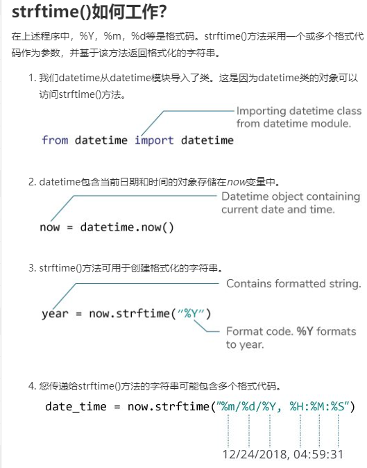
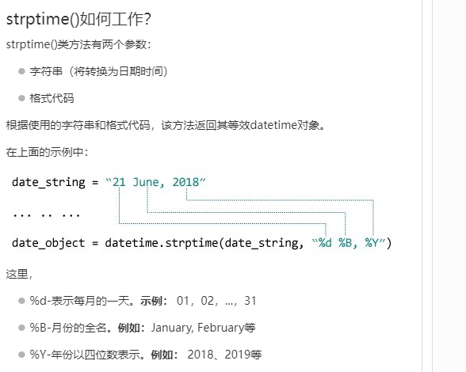

# <font style="color:rgb(51, 51, 51);">Python 日期时间(datetime)</font>
<font style="color:rgb(51, 51, 51);">在本文中，您将通过示例学习如何在Python中操作日期和时间。</font>

<font style="color:rgb(51, 51, 51);">Python有一个名为</font>**<font style="color:rgb(51, 51, 51);">datetime</font>**<font style="color:rgb(51, 51, 51);">的模块，用于处理日期和时间。在深入学习之前，让我们创建一些与日期和时间相关的简单程序。</font>

### <font style="color:rgb(51, 51, 51);">示例1：获取当前日期和时间</font>
```python
import datetime

datetime_object = datetime.datetime.now()
print(datetime_object)
```

<font style="color:rgb(51, 51, 51);">当您运行程序时，输出将类似于：</font>

2020-04-13 17:09:49.015911

<font style="color:rgb(51, 51, 51);">这里，我们使用import datetime语句导入了</font>**<font style="color:rgb(51, 51, 51);">datetime</font>**<font style="color:rgb(51, 51, 51);">模块。</font>

<font style="color:rgb(51, 51, 51);">datetime模块中定义的一个类是datetime类。然后，我们使用now()方法创建一个包含当前本地日期和时间的datetime对象。</font>

### <font style="color:rgb(51, 51, 51);">示例2：获取当前日期</font>
```python
import datetime

date_object = datetime.date.today()
print(date_object)
```

<font style="color:rgb(51, 51, 51);">当您运行程序时，输出将类似于：</font>

2020-04-13

<font style="color:rgb(51, 51, 51);">在这个程序中，我们使用了date类中定义的today()方法来获取一个包含当前本地日期的date对象。</font>

**<font style="color:rgb(51, 51, 51);">datetime里面有什么？</font>**

<font style="color:rgb(51, 51, 51);">我们可以使用</font>[<font style="color:rgb(51, 51, 51);">dir()</font>](https://www.cainiaoplus.com/python/python-methods-built-in-dir.html)<font style="color:rgb(51, 51, 51);">函数来获取包含模块所有属性的列表。</font>

```python
import datetime

print(dir(datetime))
```

<font style="color:rgb(51, 51, 51);">运行该程序时，输出为：</font>

['MAXYEAR', 'MINYEAR', '__builtins__', '__cached__', '__doc__', '__file__', '__loader__', '__name__', '__package__', '__spec__', '_divide_and_round', 'date', 'datetime', 'datetime_CAPI', 'time', 'timedelta', 'timezone', 'tzinfo']

<font style="color:rgb(51, 51, 51);">datetime模块中常用的类是：</font>

+ <font style="color:rgb(51, 51, 51);">date类</font>
+ <font style="color:rgb(51, 51, 51);">time类</font>
+ <font style="color:rgb(51, 51, 51);">datetime类</font>
+ <font style="color:rgb(51, 51, 51);">timedelta类</font>

## <font style="color:rgb(51, 51, 51);">datetime.date类</font>
<font style="color:rgb(51, 51, 51);">您可以从date类示例化date对象。date对象表示日期(年、月和日)。</font>

### <font style="color:rgb(51, 51, 51);">示例3：表示日期的Date对象</font>
```python
import datetime

d = datetime.date(2019, 4, 13)
print(d)
```

<font style="color:rgb(51, 51, 51);">运行该程序时，输出为：</font>

2019-04-13

<font style="color:rgb(51, 51, 51);">如果您想知道，上面示例中的date()是date类的构造函数。构造函数有三个参数:年、月和日。</font>

<font style="color:rgb(51, 51, 51);">变量</font><font style="color:rgb(51, 51, 51);">a</font><font style="color:rgb(51, 51, 51);">是一个date对象。</font>

<font style="color:rgb(51, 51, 51);">我们只能从datetime模块中导入date类。就是这样：</font>

```python
from datetime import date

a = date(2019, 4, 13)
print(a)
```

### <font style="color:rgb(51, 51, 51);">示例4：获取当前日期</font>
<font style="color:rgb(51, 51, 51);">您可以使用一个名为today()的类方法来创建一个包含当前日期的date对象。方法如下:</font>

```python
from datetime import date

today = date.today()

print("当前日期 =", today)
```

### <font style="color:rgb(51, 51, 51);">示例5：从时间戳获取日期</font>
<font style="color:rgb(51, 51, 51);">我们还可以从时间戳创建日期对象。Unix时间戳是特定日期到UTC的1970年1月1日之间的秒数。可以使用fromtimestamp()方法将时间戳转换为日期。</font>

```python
from datetime import date

timestamp = date.fromtimestamp(1576244364)
print("日期 =", timestamp)
```

<font style="color:rgb(51, 51, 51);">运行该程序时，输出为：</font>

日期 = 2019-12-13

### <font style="color:rgb(51, 51, 51);">示例6：打印今天的年，月和日</font>
<font style="color:rgb(51, 51, 51);">我们可以轻松地从日期对象获取年，月，日，星期几等。就是这样：</font>

```python
from datetime import date

# 今天的日期对象
today = date.today() 

print("当前年:", today.year)
print("当前月:", today.month)
print("当前日:", today.day)
```

## <font style="color:rgb(51, 51, 51);">datetime.time</font>
<font style="color:rgb(51, 51, 51);">从time类示例化的时间对象表示本地时间。</font>

### <font style="color:rgb(51, 51, 51);">示例7：表示时间的时间对象</font>
```python
from datetime import time

# time(hour = 0, minute = 0, second = 0)
a = time()
print("a =", a)

# time(hour, minute and second)
b = time(11, 34, 56)
print("b =", b)

# time(hour, minute and second)
c = time(hour = 11, minute = 34, second = 56)
print("c =", c)

# time(hour, minute, second, microsecond)
d = time(11, 34, 56, 234566)
print("d =", d)
```

<font style="color:rgb(51, 51, 51);">运行该程序时，输出为：</font>

```python
a = 00:00:00
b = 11:34:56
c = 11:34:56
d = 11:34:56.234566
```

### <font style="color:rgb(51, 51, 51);">示例8：打印时，分，秒和微秒</font>
<font style="color:rgb(51, 51, 51);">创建time对象后，您可以轻松打印其属性，例如</font><font style="color:rgb(51, 51, 51);">小时</font><font style="color:rgb(51, 51, 51);">，</font><font style="color:rgb(51, 51, 51);">分钟</font><font style="color:rgb(51, 51, 51);">等。</font>

```python
from datetime import time

a = time(11, 34, 56)

print("小时=", a.hour)
print("分钟=", a.minute)
print("秒=", a.second)
print("微秒=", a.microsecond)
```

<font style="color:rgb(51, 51, 51);">运行示例时，输出将是：</font>

```python
小时= 11
分钟= 34
秒= 56
微秒= 0
```

<font style="color:rgb(51, 51, 51);">注意，我们还没有传递</font><font style="color:rgb(51, 51, 51);">微秒</font><font style="color:rgb(51, 51, 51);">参数。因此，将打印其默认值0。</font>

## <font style="color:rgb(51, 51, 51);">datetime.datetime</font>
<font style="color:rgb(51, 51, 51);">datetime模块有一个名为的dateclass类，可以包含来自</font>**<font style="color:rgb(51, 51, 51);">date</font>**<font style="color:rgb(51, 51, 51);">和</font>**<font style="color:rgb(51, 51, 51);">time</font>**<font style="color:rgb(51, 51, 51);">对象的信息。</font>

### <font style="color:rgb(51, 51, 51);">示例9：Python datetime对象</font>
```python
from datetime import datetime

#datetime(year, month, day)
a = datetime(2019, 11, 28)
print(a)

# datetime(year, month, day, hour, minute, second, microsecond)
b = datetime(2019, 11, 28, 23, 55, 59, 342380)
print(b)
```

<font style="color:rgb(51, 51, 51);">运行该程序时，输出为：</font>

```python
2019-11-28 00:00:00
2019-11-28 23:55:59.342380
```

<font style="color:rgb(51, 51, 51);">datetime()构造函数中的前三个参数year、month和day是必需的。</font>

### <font style="color:rgb(51, 51, 51);">示例10：打印年，月，时，分和时间戳</font>
```python
from datetime import datetime

a = datetime(2019, 12, 28, 23, 55, 59, 342380)
print("年 =", a.year)
print("月 =", a.month)
print("日 =", a.day)
print("时 =", a.hour)
print("份 =", a.minute)
print("时间戳 =", a.timestamp())
```

<font style="color:rgb(51, 51, 51);">运行该程序时，输出为：</font>

```python
年 = 2019
月 = 12
日 = 28
时 = 23
份 = 55
时间戳 = 1577548559.34238
```

## <font style="color:rgb(51, 51, 51);">datetime.timedelta</font>
<font style="color:rgb(51, 51, 51);">timedelta对象表示两个日期或时间之间的时差。</font>

### <font style="color:rgb(51, 51, 51);">示例11：两个日期和时间之间的时差</font>
```python
from datetime import datetime, date

t1 = date(year = 2018, month = 7, day = 12)
t2 = date(year = 2017, month = 12, day = 23)
t3 = t1 - t2
print("t3 =", t3)

t4 = datetime(year = 2018, month = 7, day = 12, hour = 7, minute = 9, second = 33)
t5 = datetime(year = 2019, month = 6, day = 10, hour = 5, minute = 55, second = 13)
t6 = t4 - t5
print("t6 =", t6)

print("type of t3 =", type(t3)) 
print("type of t6 =", type(t6))
```

<font style="color:rgb(51, 51, 51);">运行该程序时，输出为：</font>

```python
t3 = 201 days, 0:00:00
t6 = -333 days, 1:14:20
type of t3 = <class 'datetime.timedelta'>
type of t6 = <class 'datetime.timedelta'>
```

<font style="color:rgb(51, 51, 51);">注意，</font><font style="color:rgb(51, 51, 51);">t3</font><font style="color:rgb(51, 51, 51);">和</font><font style="color:rgb(51, 51, 51);">t6</font><font style="color:rgb(51, 51, 51);">都是<class 'datetime.timedelta'>类型。</font>

### <font style="color:rgb(51, 51, 51);">示例12：两个timedelta对象之间的时间差</font>
```python
from datetime import timedelta

t1 = timedelta(weeks = 2, days = 5, hours = 1, seconds = 33)
t2 = timedelta(days = 4, hours = 11, minutes = 4, seconds = 54)
t3 = t1 - t2

print("t3 =", t3)
```

<font style="color:rgb(51, 51, 51);">运行该程序时，输出为：</font>

t3 = 14 days, 13:55:39

<font style="color:rgb(51, 51, 51);">在这里，我们创建了两个timedelta对象</font><font style="color:rgb(51, 51, 51);">t1</font><font style="color:rgb(51, 51, 51);">和</font><font style="color:rgb(51, 51, 51);">t2</font><font style="color:rgb(51, 51, 51);">，它们直接相差的天数被打印在屏幕上。</font>

### <font style="color:rgb(51, 51, 51);">示例13：打印负timedelta对象</font>
```python
from datetime import timedelta

t1 = timedelta(seconds = 33)
t2 = timedelta(seconds = 54)
t3 = t1 - t2

print("t3 =", t3)
print("t3 =", abs(t3))
```

<font style="color:rgb(51, 51, 51);">运行该程序时，输出为：</font>

```python
t3 = -1 day, 23:59:39
t3 = 0:00:21
```

### <font style="color:rgb(51, 51, 51);">示例14：持续时间（以秒为单位）</font>
<font style="color:rgb(51, 51, 51);">您可以使用total_seconds()方法获得timedelta对象中的总秒数。</font>

```python
from datetime import timedelta

t = timedelta(days = 5, hours = 1, seconds = 33, microseconds = 233423)
print("total seconds =", t.total_seconds())
```

<font style="color:rgb(51, 51, 51);">运行该程序时，输出为：</font>

total seconds = 435633.233423

<font style="color:rgb(51, 51, 51);">您还可以使用+运算符找到两个日期和时间的总和。同样，您可以将timedelta对象乘以整数和浮点数。</font>

## <font style="color:rgb(51, 51, 51);">Python格式日期时间</font>
<font style="color:rgb(51, 51, 51);">日期和时间的表示方式在不同的地方，组织等中可能有所不同。在美国，使用mm / dd / yyyy更为常见，而在英国使用dd / mm / yyyy更为常见。</font>

<font style="color:rgb(51, 51, 51);">Python有strftime()和strptime()方法来处理这个问题。</font>

### <font style="color:rgb(51, 51, 51);">Python strftime()-字符串的日期时间对象</font>
<font style="color:rgb(51, 51, 51);">strftime()方法是在date、datetime和time类下面定义的。该方法根据给定的日期、日期时间或时间对象创建格式化的字符串。</font>

### <font style="color:rgb(51, 51, 51);">示例15：使用strftime()格式化日期</font>
```python
from datetime import datetime

# current date and time
now = datetime.now()

t = now.strftime("%H:%M:%S")
print("time:", t)

s1 = now.strftime("%m/%d/%Y, %H:%M:%S")
# mm/dd/YY H:M:S format
print("s1:", s1)

s2 = now.strftime("%d/%m/%Y, %H:%M:%S")
# dd/mm/YY H:M:S format
print("s2:", s2)
```

<font style="color:rgb(51, 51, 51);">当您运行程序时，输出将类似于：</font>

```python
time: 04:34:52
s1: 12/26/2018, 04:34:52
s2: 26/12/2018, 04:34:52
```

<font style="color:rgb(51, 51, 51);">这里%Y，%m，%d，%H等都是格式代码。strftime()方法采用一个或多个格式代码，并根据该代码返回格式化的字符串。</font>

<font style="color:rgb(51, 51, 51);">在上面的程序中，</font><font style="color:rgb(51, 51, 51);">t</font><font style="color:rgb(51, 51, 51);">，</font><font style="color:rgb(51, 51, 51);">s1</font><font style="color:rgb(51, 51, 51);">和</font><font style="color:rgb(51, 51, 51);">s2</font><font style="color:rgb(51, 51, 51);">是字符串。</font>

+ <font style="color:rgb(51, 51, 51);">%Y -年[0001，...，2018，2019，...，9999]</font>
+ <font style="color:rgb(51, 51, 51);">%m -月[01，02，...，11，12]</font>
+ <font style="color:rgb(51, 51, 51);">%d -天[01，02，...，30，31]</font>
+ <font style="color:rgb(51, 51, 51);">%H -小时[00，01，...，22，23</font>
+ <font style="color:rgb(51, 51, 51);">%M -分钟[00，01，...，58，59]</font>
+ <font style="color:rgb(51, 51, 51);">%S -秒[00，01，...，58，59]</font>

<font style="color:rgb(51, 51, 51);">要了解有关strftime()代码并设置其格式的更多信息，请访问：</font>[<font style="color:rgb(51, 51, 51);">Python strftime()</font>](https://www.cainiaoplus.com/python/python-datetime-strftime.html)<font style="color:rgb(51, 51, 51);">。</font>

### <font style="color:rgb(51, 51, 51);">Python strptime()-日期时间的字符串</font>
<font style="color:rgb(51, 51, 51);">strptime()方法从一个给定的字符串(表示日期和时间)创建一个datetime对象。</font>

### <font style="color:rgb(51, 51, 51);">示例16：strptime()</font>
```python
from datetime import datetime

date_string = "21 June, 2018"
print("date_string =", date_string)

date_object = datetime.strptime(date_string, "%d %B, %Y")
print("date_object =", date_object)
```

<font style="color:rgb(51, 51, 51);">运行该程序时，输出为：</font>

```python
date_string = 21 June, 2018
date_object = 2018-06-21 00:00:00
```

<font style="color:rgb(51, 51, 51);">strptime()方法有两个参数：</font>

1. <font style="color:rgb(51, 51, 51);">表示日期和时间的字符串</font>
2. <font style="color:rgb(51, 51, 51);">等同于第一个参数的格式代码</font>

<font style="color:rgb(51, 51, 51);">顺便说一下，%d、%B和%Y格式代码分别用于日、月(全称)和年。</font>

<font style="color:rgb(51, 51, 51);">访问</font>[<font style="color:rgb(51, 51, 51);">Python strptime()</font>](https://www.cainiaoplus.com/python/python-datetime-strptime.html)<font style="color:rgb(51, 51, 51);">了解更多信息。</font>

## <font style="color:rgb(51, 51, 51);">在Python中处理时区</font>
<font style="color:rgb(51, 51, 51);">假设您正在处理一个项目，需要根据其时区显示日期和时间。我们建议您使用第三方的</font>[<font style="color:rgb(51, 51, 51);">pytZ模块</font>](http://pytz.sourceforge.net/)<font style="color:rgb(51, 51, 51);">，而不是自己处理时区。</font>

```python
from datetime import datetime
import pytz

local = datetime.now()
print("Local:", local.strftime("%m/%d/%Y, %H:%M:%S"))


tz_NY = pytz.timezone('America/New_York') 
datetime_NY = datetime.now(tz_NY)
print("NY:", datetime_NY.strftime("%m/%d/%Y, %H:%M:%S"))

tz_London = pytz.timezone('Europe/London')
datetime_London = datetime.now(tz_London)
print("London:", datetime_London.strftime("%m/%d/%Y, %H:%M:%S"))
```

<font style="color:rgb(51, 51, 51);">当您运行程序时，输出将类似于：</font>

```python
Local time: 2018-12-20 13:10:44.260462
America/New_York time: 2018-12-20 13:10:44.260462
Europe/London time: 2018-12-20 13:10:44.260462
```

<font style="color:rgb(51, 51, 51);">在这里，datetime_NY和datetime_London是包含各自时区的当前日期和时间的datetime对象。</font>

# <font style="color:rgb(51, 51, 51);">Python strftime()</font>
<font style="color:rgb(51, 51, 51);">在本文中，您将学习如何将date、time和datetime对象转换为它的等效字符串(通过示例)</font>

<font style="color:rgb(51, 51, 51);">strftime()方法使用</font>[<font style="color:rgb(51, 51, 51);">date</font>](https://www.cainiaoplus.com/python/python-datetime.html#date)<font style="color:rgb(51, 51, 51);">，</font>[<font style="color:rgb(51, 51, 51);">time</font>](https://www.cainiaoplus.com/python/python-datetime.html#time)<font style="color:rgb(51, 51, 51);">或</font>[<font style="color:rgb(51, 51, 51);">datetime</font>](https://www.cainiaoplus.com/python/python-datetime.html#datetime)<font style="color:rgb(51, 51, 51);">对象返回表示日期和时间的字符串。</font>

## <font style="color:rgb(51, 51, 51);">示例1：使用strftime()将日期时间转换为字符串</font>
<font style="color:rgb(51, 51, 51);">下面的程序将datetime包含当前日期和时间的对象转换  为不同格式的字符串。</font>

```python
from datetime import datetime

now = datetime.now() # 当前的日期和时间

year = now.strftime("%Y")
print("年:", year)

month = now.strftime("%m")
print("月:", month)

day = now.strftime("%d")
print("日:", day)

time = now.strftime("%H:%M:%S")
print("时间:", time)

date_time = now.strftime("%m/%d/%Y, %H:%M:%S")
print("日期和时间:",date_time)
```

<font style="color:rgb(51, 51, 51);">当您运行程序时，输出将如下所示：</font>

```python
年: 2020
月: 04
日: 13
时间: 17:35:22
日期和时间: 04/13/2020, 17:35:22
```

<font style="color:rgb(51, 51, 51);">在这里，year，day，time和date_time是字符串，而now是一个datetime对象。</font>



## <font style="color:rgb(51, 51, 51);">示例2：根据时间戳创建字符串</font>
```python
from datetime import datetime

timestamp = 1578797322
date_time = datetime.fromtimestamp(timestamp)

print("日期时间对象:", date_time)

d = date_time.strftime("%m/%d/%Y, %H:%M:%S")
print("输出 2:", d)	

d = date_time.strftime("%d %b, %Y")
print("输出 3:", d)

d = date_time.strftime("%d %B, %Y")
print("输出 4:", d)

d = date_time.strftime("%I%p")
print("输出 5:", d)
```

<font style="color:rgb(51, 51, 51);">运行该程序时，输出为：</font>

```python
日期时间对象: 2020-01-12 10:48:42
输出 2: 01/12/2020, 10:48:42
输出 3: 12 Jan, 2020
输出 4: 12 January, 2020
输出 5: 10AM
```

## <font style="color:rgb(51, 51, 51);">格式代码清单</font>
<font style="color:rgb(51, 51, 51);">下表显示了您可以传递给该strftime()方法的所有代码。</font>

| **<font style="color:rgb(51, 51, 51);">指令</font>** | **<font style="color:rgb(51, 51, 51);">含义</font>** | **<font style="color:rgb(51, 51, 51);">例如</font>** |
| --- | --- | --- |
| <font style="color:rgb(51, 51, 51);">%a</font> | <font style="color:rgb(51, 51, 51);">工作日名称的缩写。</font> | <font style="color:rgb(51, 51, 51);">Sun, Mon, ...</font> |
| <font style="color:rgb(51, 51, 51);">%A</font> | <font style="color:rgb(51, 51, 51);">工作日全名。</font> | <font style="color:rgb(51, 51, 51);">Sunday, Monday, ..</font> |
| <font style="color:rgb(51, 51, 51);">%w</font> | <font style="color:rgb(51, 51, 51);">工作日为十进制数字。</font> | <font style="color:rgb(51, 51, 51);">0，1，...，6</font> |
| <font style="color:rgb(51, 51, 51);">%d</font> | <font style="color:rgb(51, 51, 51);">月份中的一天，以零填充的十进制数表示。</font> | <font style="color:rgb(51, 51, 51);">01，02，...，31</font> |
| <font style="color:rgb(51, 51, 51);">%-d</font> | <font style="color:rgb(51, 51, 51);">以十进制数表示的月份中的一天。</font> | <font style="color:rgb(51, 51, 51);">1，2，...，30</font> |
| <font style="color:rgb(51, 51, 51);">%b</font> | <font style="color:rgb(51, 51, 51);">月份的缩写。</font> | <font style="color:rgb(51, 51, 51);">Jan, Feb, ..., Dec</font> |
| <font style="color:rgb(51, 51, 51);">%B</font> | <font style="color:rgb(51, 51, 51);">完整的月份名称。</font> | <font style="color:rgb(51, 51, 51);">January, February, ...</font> |
| <font style="color:rgb(51, 51, 51);">%m</font> | <font style="color:rgb(51, 51, 51);">月份为零填充的十进制数字。</font> | <font style="color:rgb(51, 51, 51);">01、02，...，12</font> |
| <font style="color:rgb(51, 51, 51);">%-m</font> | <font style="color:rgb(51, 51, 51);">以十进制数表示的月份。</font> | <font style="color:rgb(51, 51, 51);">1，2，...，12</font> |
| <font style="color:rgb(51, 51, 51);">%y</font> | <font style="color:rgb(51, 51, 51);">无世纪的年份，为零填充的十进制数字。</font> | <font style="color:rgb(51, 51, 51);">00、01，...，99</font> |
| <font style="color:rgb(51, 51, 51);">%-y</font> | <font style="color:rgb(51, 51, 51);">没有世纪的年份作为十进制数字。</font> | <font style="color:rgb(51, 51, 51);">0，1，...，99</font> |
| <font style="color:rgb(51, 51, 51);">%Y</font> | <font style="color:rgb(51, 51, 51);">以世纪作为十进制数字的年份。</font> | <font style="color:rgb(51, 51, 51);">2013、2019等</font> |
| <font style="color:rgb(51, 51, 51);">%H</font> | <font style="color:rgb(51, 51, 51);">小时（24小时制），为补零的十进制数字。</font> | <font style="color:rgb(51, 51, 51);">00、01，...，23</font> |
| <font style="color:rgb(51, 51, 51);">%-H</font> | <font style="color:rgb(51, 51, 51);">小时（24小时制）为十进制数字。</font> | <font style="color:rgb(51, 51, 51);">0，1，...，23</font> |
| <font style="color:rgb(51, 51, 51);">%I</font> | <font style="color:rgb(51, 51, 51);">小时（12小时制），为零填充的十进制数字。</font> | <font style="color:rgb(51, 51, 51);">01、02，...，12</font> |
| <font style="color:rgb(51, 51, 51);">%-I</font> | <font style="color:rgb(51, 51, 51);">小时（12小时制）为十进制数字。</font> | <font style="color:rgb(51, 51, 51);">1 2 2</font> |
| <font style="color:rgb(51, 51, 51);">%p</font> | <font style="color:rgb(51, 51, 51);">语言环境的上午或下午。</font> | <font style="color:rgb(51, 51, 51);">AM,PM   </font> |
| <font style="color:rgb(51, 51, 51);">%M</font> | <font style="color:rgb(51, 51, 51);">分钟，为零填充的十进制数字。</font> | <font style="color:rgb(51, 51, 51);">00、01，...，59</font> |
| <font style="color:rgb(51, 51, 51);">%-M</font> | <font style="color:rgb(51, 51, 51);">以十进制数字表示。</font> | <font style="color:rgb(51, 51, 51);">0，1，...，59</font> |
| <font style="color:rgb(51, 51, 51);">%S</font> | <font style="color:rgb(51, 51, 51);">第二个为零填充的十进制数。</font> | <font style="color:rgb(51, 51, 51);">00、01，...，59</font> |
| <font style="color:rgb(51, 51, 51);">%-S</font> | <font style="color:rgb(51, 51, 51);">第二个十进制数字。</font> | <font style="color:rgb(51, 51, 51);">0，1，...，59</font> |
| <font style="color:rgb(51, 51, 51);">%f</font> | <font style="color:rgb(51, 51, 51);">微秒，十进制数，在左侧补零。</font> | <font style="color:rgb(51, 51, 51);">000000-999999</font> |
| <font style="color:rgb(51, 51, 51);">%z</font> | <font style="color:rgb(51, 51, 51);">UTC偏移量，格式为+ HHMM或-HHMM。</font> | <font style="color:rgb(51, 51, 51);"> </font> |
| <font style="color:rgb(51, 51, 51);">%Z</font> | <font style="color:rgb(51, 51, 51);">时区名称。</font> | <font style="color:rgb(51, 51, 51);"> </font> |
| <font style="color:rgb(51, 51, 51);">%j</font> | <font style="color:rgb(51, 51, 51);">一年中的一天，以零填充的十进制数字表示。</font> | <font style="color:rgb(51, 51, 51);">001，002，...，366</font> |
| <font style="color:rgb(51, 51, 51);">%-j</font> | <font style="color:rgb(51, 51, 51);">一年中的天，以十进制数字表示。</font> | <font style="color:rgb(51, 51, 51);">1，2，...，366</font> |
| <font style="color:rgb(51, 51, 51);">%U</font> | <font style="color:rgb(51, 51, 51);">一年中的第几周（星期日为一周的第一天）。在第一个星期日之前的新的一年中的所有天都被视为在第0周。</font> | <font style="color:rgb(51, 51, 51);">00、01，...，53</font> |
| <font style="color:rgb(51, 51, 51);">%W</font> | <font style="color:rgb(51, 51, 51);">一年中的第几周（星期一为一周中的第一天）。第一个星期一之前的新的一年中的所有天均视为在第0周。</font> | <font style="color:rgb(51, 51, 51);">00、01，...，53</font> |
| <font style="color:rgb(51, 51, 51);">%c</font> | <font style="color:rgb(51, 51, 51);">语言环境的适当日期和时间表示。</font> | <font style="color:rgb(51, 51, 51);">Mon Sep 30 07:06:05 2019</font> |
| <font style="color:rgb(51, 51, 51);">%x</font> | <font style="color:rgb(51, 51, 51);">语言环境的适当日期表示形式。</font> | <font style="color:rgb(51, 51, 51);">13/9/30</font> |
| <font style="color:rgb(51, 51, 51);">%X</font> | <font style="color:rgb(51, 51, 51);">语言环境的适当时间表示形式。</font> | <font style="color:rgb(51, 51, 51);">07:06:05</font> |
| <font style="color:rgb(51, 51, 51);">%%</font> | <font style="color:rgb(51, 51, 51);">文字“％”字符。</font> | <font style="color:rgb(51, 51, 51);">％</font> |


## <font style="color:rgb(51, 51, 51);">示例3：语言环境的适当日期和时间</font>
```python
from datetime import datetime

timestamp = 1578797322
date_time = datetime.fromtimestamp(timestamp)

d = date_time.strftime("%c")
print("输出 1:", d)	

d = date_time.strftime("%x")
print("输出 2:", d)

d = date_time.strftime("%X")
print("输出 3:", d)
```

<font style="color:rgb(51, 51, 51);">运行该程序时，输出为：</font>

```python
输出 1: Sun Jan 12 10:48:42 2020
输出 2: 01/12/20
输出 3: 10:48:42
```

<font style="color:rgb(51, 51, 51);">格式代码%c，%x以及%X用于语言环境的适当的日期和时间表示。</font>

<font style="color:rgb(51, 51, 51);">我们还建议您检查</font>[<font style="color:rgb(51, 51, 51);">Python strptime()</font>](https://www.cainiaoplus.com/python/python-datetime-strptime.html)<font style="color:rgb(51, 51, 51);">。strptime()方法从字符串创建datetime对象。</font>

# <font style="color:rgb(51, 51, 51);">Python strptime()</font>
<font style="color:rgb(51, 51, 51);">在本文中，您将学习如何从字符串创建datetime对象(在示例的帮助下)。</font>

<font style="color:rgb(51, 51, 51);">strptime()方法从给定的字符串创建</font>[<font style="color:rgb(51, 51, 51);">datetime</font>](https://www.cainiaoplus.com/python/python-datetime.html#datetime)<font style="color:rgb(51, 51, 51);">对象。</font>

**<font style="color:rgb(51, 51, 51);">注意：</font>**<font style="color:rgb(51, 51, 51);">您不能从每个字符串创建datetime对象。该字符串必须采用某种格式。</font>

## <font style="color:rgb(51, 51, 51);">示例1：日期时间对象的字符串</font>
```python
from datetime import datetime

date_string = "21 June, 2018"

print("date_string =", date_string)
print("date_string数据类型 =", type(date_string))

date_object = datetime.strptime(date_string, "%d %B, %Y")

print("date_object =", date_object)
print("date_object数据类型  =", type(date_object))
```

<font style="color:rgb(51, 51, 51);">运行该程序时，输出为：</font>

```python
date_string = 21 June, 2018
date_string 数据类型 = <class 'str'>
date_object = 2018-06-21 00:00:00
date_object 数据类型  = <class 'datetime.datetime'>
```



## <font style="color:rgb(51, 51, 51);">示例2：日期时间对象的字符串</font>
```python
from datetime import datetime

dt_string = "12/11/2019 09:15:32"

# 日期为dd / mm / yyyy格式
dt_object1 = datetime.strptime(dt_string, "%d/%m/%Y %H:%M:%S")
print("dt_object1 =", dt_object1)

# 日期为mm / dd / yyyy格式
dt_object2 = datetime.strptime(dt_string, "%m/%d/%Y %H:%M:%S")
print("dt_object2 =", dt_object2)
```

<font style="color:rgb(51, 51, 51);">运行该程序时，输出为：</font>

```python
dt_object1 = 2019-11-12 09:15:32
dt_object2 = 2019-12-11 09:15:32
```

## <font style="color:rgb(51, 51, 51);">格式代码清单</font>
<font style="color:rgb(51, 51, 51);">下表显示了您可以使用的所有格式代码。</font>

| **<font style="color:rgb(51, 51, 51);">指令</font>** | **<font style="color:rgb(51, 51, 51);">含义</font>** | **<font style="color:rgb(51, 51, 51);">实例</font>** |
| --- | --- | --- |
| <font style="color:rgb(51, 51, 51);">%a</font> | <font style="color:rgb(51, 51, 51);">工作日名称的缩写。</font> | <font style="color:rgb(51, 51, 51);">Sun, Mon, ...</font> |
| <font style="color:rgb(51, 51, 51);">%A</font> | <font style="color:rgb(51, 51, 51);">工作日全名。</font> | <font style="color:rgb(51, 51, 51);">Sunday, Monday, ...</font> |
| <font style="color:rgb(51, 51, 51);">%w</font> | <font style="color:rgb(51, 51, 51);">工作日为十进制数字。</font> | <font style="color:rgb(51, 51, 51);">0，1，...，6</font> |
| <font style="color:rgb(51, 51, 51);">%d</font> | <font style="color:rgb(51, 51, 51);">月份中的一天，以零填充的十进制数表示。</font> | <font style="color:rgb(51, 51, 51);">01，02，...，31</font> |
| <font style="color:rgb(51, 51, 51);">%-d</font> | <font style="color:rgb(51, 51, 51);">以十进制数表示的月份中的一天。</font> | <font style="color:rgb(51, 51, 51);">1，2，...，30</font> |
| <font style="color:rgb(51, 51, 51);">%b</font> | <font style="color:rgb(51, 51, 51);">月份的缩写。</font> | <font style="color:rgb(51, 51, 51);">Jan, Feb, ..., Dec</font> |
| <font style="color:rgb(51, 51, 51);">%B</font> | <font style="color:rgb(51, 51, 51);">完整的月份名称。</font> | <font style="color:rgb(51, 51, 51);">January, February, ...</font> |
| <font style="color:rgb(51, 51, 51);">%m</font> | <font style="color:rgb(51, 51, 51);">月份为零填充的十进制数字。</font> | <font style="color:rgb(51, 51, 51);">01、02，...，12</font> |
| <font style="color:rgb(51, 51, 51);">%-m</font> | <font style="color:rgb(51, 51, 51);">以十进制数表示的月份。</font> | <font style="color:rgb(51, 51, 51);">1，2，...，12</font> |
| <font style="color:rgb(51, 51, 51);">%y</font> | <font style="color:rgb(51, 51, 51);">无世纪的年份，为零填充的十进制数字。</font> | <font style="color:rgb(51, 51, 51);">00、01，...，99</font> |
| <font style="color:rgb(51, 51, 51);">%-y</font> | <font style="color:rgb(51, 51, 51);">没有世纪的年份作为十进制数字。</font> | <font style="color:rgb(51, 51, 51);">0，1，...，99</font> |
| <font style="color:rgb(51, 51, 51);">%Y</font> | <font style="color:rgb(51, 51, 51);">以世纪作为十进制数字的年份。</font> | <font style="color:rgb(51, 51, 51);">2013、2019等</font> |
| <font style="color:rgb(51, 51, 51);">%H</font> | <font style="color:rgb(51, 51, 51);">小时（24小时制），为补零的十进制数字。</font> | <font style="color:rgb(51, 51, 51);">00、01，...，23</font> |
| <font style="color:rgb(51, 51, 51);">%-H</font> | <font style="color:rgb(51, 51, 51);">小时（24小时制）为十进制数字。</font> | <font style="color:rgb(51, 51, 51);">0，1，...，23</font> |
| <font style="color:rgb(51, 51, 51);">%I</font> | <font style="color:rgb(51, 51, 51);">小时（12小时制），为零填充的十进制数字。</font> | <font style="color:rgb(51, 51, 51);">01、02，...，12</font> |
| <font style="color:rgb(51, 51, 51);">%-I</font> | <font style="color:rgb(51, 51, 51);">小时（12小时制）为十进制数字。</font> | <font style="color:rgb(51, 51, 51);">1 2 2</font> |
| <font style="color:rgb(51, 51, 51);">%p</font> | <font style="color:rgb(51, 51, 51);">语言环境的上午或下午。</font> | <font style="color:rgb(51, 51, 51);">AM,PM</font> |
| <font style="color:rgb(51, 51, 51);">%M</font> | <font style="color:rgb(51, 51, 51);">分钟，为零填充的十进制数字。</font> | <font style="color:rgb(51, 51, 51);">00、01，...，59</font> |
| <font style="color:rgb(51, 51, 51);">%-M</font> | <font style="color:rgb(51, 51, 51);">以十进制数字表示。</font> | <font style="color:rgb(51, 51, 51);">0，1，...，59</font> |
| <font style="color:rgb(51, 51, 51);">%S</font> | <font style="color:rgb(51, 51, 51);">第二个为零填充的十进制数。</font> | <font style="color:rgb(51, 51, 51);">00、01，...，59</font> |
| <font style="color:rgb(51, 51, 51);">%-S</font> | <font style="color:rgb(51, 51, 51);">第二个十进制数字。</font> | <font style="color:rgb(51, 51, 51);">0，1，...，59</font> |
| <font style="color:rgb(51, 51, 51);">%f</font> | <font style="color:rgb(51, 51, 51);">微秒，十进制数，在左侧补零。</font> | <font style="color:rgb(51, 51, 51);">000000-999999</font> |
| <font style="color:rgb(51, 51, 51);">%z</font> | <font style="color:rgb(51, 51, 51);">UTC偏移量，格式为+ HHMM或-HHMM。</font> | <font style="color:rgb(51, 51, 51);"> </font> |
| <font style="color:rgb(51, 51, 51);">%Z</font> | <font style="color:rgb(51, 51, 51);">时区名称。</font> | <font style="color:rgb(51, 51, 51);"> </font> |
| <font style="color:rgb(51, 51, 51);">%j</font> | <font style="color:rgb(51, 51, 51);">一年中的一天，以零填充的十进制数字表示。</font> | <font style="color:rgb(51, 51, 51);">001，002，...，366</font> |
| <font style="color:rgb(51, 51, 51);">%-j</font> | <font style="color:rgb(51, 51, 51);">一年中的天，以十进制数字表示。</font> | <font style="color:rgb(51, 51, 51);">1，2，...，366</font> |
| <font style="color:rgb(51, 51, 51);">%U</font> | <font style="color:rgb(51, 51, 51);">一年中的第几周（星期日为一周的第一天）。在第一个星期日之前的新的一年中的所有天都被视为在第0周。</font> | <font style="color:rgb(51, 51, 51);">00、01，...，53</font> |
| <font style="color:rgb(51, 51, 51);">%W</font> | <font style="color:rgb(51, 51, 51);">一年中的第几周（星期一为一周中的第一天）。第一个星期一之前的新的一年中的所有天均视为在第0周。</font> | <font style="color:rgb(51, 51, 51);">00、01，...，53</font> |
| <font style="color:rgb(51, 51, 51);">%c</font> | <font style="color:rgb(51, 51, 51);">语言环境的适当日期和时间表示。</font> | <font style="color:rgb(51, 51, 51);">Mon Sep 30 07:06:05 2013</font> |
| <font style="color:rgb(51, 51, 51);">%x</font> | <font style="color:rgb(51, 51, 51);">语言环境的适当日期表示形式。</font> | <font style="color:rgb(51, 51, 51);">13/9/30</font> |
| <font style="color:rgb(51, 51, 51);">%X</font> | <font style="color:rgb(51, 51, 51);">语言环境的适当时间表示形式。</font> | <font style="color:rgb(51, 51, 51);">07:06:05</font> |
| <font style="color:rgb(51, 51, 51);">%%</font> | <font style="color:rgb(51, 51, 51);">文字“％”字符。</font> | <font style="color:rgb(51, 51, 51);">％</font> |


### <font style="color:rgb(51, 51, 51);">strptime()中的ValueError</font>
<font style="color:rgb(51, 51, 51);">如果传递给的字符串（第一个参数）和格式代码（第二个参数）strptime()不匹配，则会得到ValueError。例如：</font>

```python
from datetime import datetime

date_string = "12/11/2018"
date_object = datetime.strptime(date_string, "%d %m %Y")

print("date_object =", date_object)
```

<font style="color:rgb(51, 51, 51);">如果您运行此程序，则会出现错误。</font>

ValueError: time data '12/11/2018' does not match format '%d %m %Y'

**<font style="color:rgb(51, 51, 51);">推荐阅读：</font>**<font style="color:rgb(51, 51, 51);"> </font>[<font style="color:rgb(51, 51, 51);">Python strftime()</font>](https://www.cainiaoplus.com/python/python-datetime-strftime.html)

# <font style="color:rgb(51, 51, 51);">Python 当前日期和时间</font>
<font style="color:rgb(51, 51, 51);">在本文中，您将学习如何用Python获取今天的日期和当前的日期和时间。我们还将使用strftime()方法以不同的格式格式化日期和时间。</font>

<font style="color:rgb(51, 51, 51);">您可以采取多种方式来获取当前日期。我们将使用</font>[<font style="color:rgb(51, 51, 51);">datetime</font>](https://www.cainiaoplus.com/python/python-datetime.html)<font style="color:rgb(51, 51, 51);">模块的date类来完成此任务。</font>

## <font style="color:rgb(51, 51, 51);">示例1：Python获取今天的日期</font>
**<font style="color:rgb(51, 51, 51);background-color:rgb(239, 239, 239);">示例</font>**

```python
from datetime import date

today = date.today()
print("今天的日期:", today)
```

<font style="color:rgb(51, 51, 51);">输出结果:</font>

<font style="color:rgb(51, 51, 51);">今天的日期: 2020-04-13</font>

<font style="color:rgb(51, 51, 51);">在这里，我们从datetime模块中导入了date类。然后，我们使用该date.today()方法来获取当前的本地日期。</font>

<font style="color:rgb(51, 51, 51);">顺便说一句，date.today()返回一个date对象，该对象在上述程序中分配给了</font><font style="color:rgb(51, 51, 51);">Today</font><font style="color:rgb(51, 51, 51);">变量。现在，您可以使用</font>[<font style="color:rgb(51, 51, 51);">strftime()</font>](https://www.cainiaoplus.com/python/python-datetime-strftime.html)<font style="color:rgb(51, 51, 51);">方法创建一个以不同格式表示日期的字符串。</font>

## <font style="color:rgb(51, 51, 51);">示例2：当前日期以不同的格式</font>
**<font style="color:rgb(51, 51, 51);background-color:rgb(239, 239, 239);">示例</font>**

```python
from datetime import date

today = date.today()

# dd/mm/YY
d1 = today.strftime("%d/%m/%Y")
print("d1 =", d1)

# 文字的月、日、年	
d2 = today.strftime("%B %d, %Y")
print("d2 =", d2)

# mm/dd/y
d3 = today.strftime("%m/%d/%y")
print("d3 =", d3)

# 月份缩写，日期和年份	
d4 = today.strftime("%b-%d-%Y")
print("d4 =", d4)
```

<font style="color:rgb(51, 51, 51);">当您运行程序时，输出将类似于：</font>

```python
d1 = 16/09/2019
d2 = September 16, 2019
d3 = 09/16/19
d4 = Sep-16-2019
```

<font style="color:rgb(51, 51, 51);">如果需要获取当前日期和时间，则可以使用datetime模块的datetime类。</font>

## <font style="color:rgb(51, 51, 51);">示例3：获取当前日期和时间</font>
**<font style="color:rgb(51, 51, 51);background-color:rgb(239, 239, 239);">示例</font>**

```python
from datetime import datetime

# 包含当前日期和时间的datetime对象
now = datetime.now()

print("now =", now)

# dd/mm/YY H:M:S
dt_string = now.strftime("%d/%m/%Y %H:%M:%S")
print("date and time =", dt_string)
```

<font style="color:rgb(51, 51, 51);">在这里，我们习惯于datetime.now()获取当前日期和时间。然后，我们用来strftime()创建一个以其他格式表示日期和时间的字符串。.</font>

# <font style="color:rgb(51, 51, 51);">Python 获取当前时间</font>
<font style="color:rgb(51, 51, 51);">在本文中，您将学习获取语言环境的当前时间以及Python中的不同时区。</font>

<font style="color:rgb(51, 51, 51);">您可以采用多种方法获取Python当前时间。</font>

## <font style="color:rgb(51, 51, 51);">示例1：使用datetime对象的当前时间</font>
```python
from datetime import datetime

now = datetime.now()

current_time = now.strftime("%H:%M:%S")
print("当前时间 =", current_time)
```

<font style="color:rgb(51, 51, 51);">在上面的示例中，我们从</font>[<font style="color:rgb(51, 51, 51);">datetime</font>](https://www.cainiaoplus.com/python/python-datetime.html)<font style="color:rgb(51, 51, 51);">模块导入了datetime类。然后，我们使用now()方法来获取datetime包含当前日期和时间的对象。</font>

<font style="color:rgb(51, 51, 51);">然后使用</font>[<font style="color:rgb(51, 51, 51);">datetime.strftime()</font>](https://www.cainiaoplus.com/python/python-datetime-strftime.html)<font style="color:rgb(51, 51, 51);">方法创建一个表示当前时间的字符串。</font>

<font style="color:rgb(51, 51, 51);">如果您需要创建一个包含当前时间的time对象，则可以执行以下操作。</font>

```python
from datetime import datetime

now = datetime.now().time() # time object

print("now =", now)
print("type(now) =", type(now))
```

## <font style="color:rgb(51, 51, 51);">示例2：使用时间模块的当前时间</font>
<font style="color:rgb(51, 51, 51);">您还可以使用时间模块获取当前时间。</font>

```python
import time

t = time.localtime()
current_time = time.strftime("%H:%M:%S", t)
print(current_time)
```

## <font style="color:rgb(51, 51, 51);">示例3：时区的当前时间</font>
<font style="color:rgb(51, 51, 51);">如果需要查找某个时区的当前时间，可以使用</font>[<font style="color:rgb(51, 51, 51);">pytZ模块</font>](http://pytz.sourceforge.net/)<font style="color:rgb(51, 51, 51);">。</font>

```python
from datetime import datetime
import pytz

tz_NY = pytz.timezone('America/New_York') 
datetime_NY = datetime.now(tz_NY)
print("纽约时间:", datetime_NY.strftime("%H:%M:%S"))

tz_London = pytz.timezone('Europe/London')
datetime_London = datetime.now(tz_London)
print("伦敦时间:", datetime_London.strftime("%H:%M:%S"))
```

# <font style="color:rgb(51, 51, 51);">Python 时间戳( timestamp)</font>
<font style="color:rgb(51, 51, 51);">在本文中，您将学习如何将时间戳转换为datetime对象，将datetime对象转换为时间戳(通过示例)。</font>

<font style="color:rgb(51, 51, 51);">将日期和时间作为时间戳存储在数据库中是很常见的。Unix时间戳是UTC特定日期到1970年1月1日之间的秒数。</font>

## <font style="color:rgb(51, 51, 51);">示例1：Python时间戳到日期时间</font>
```python
from datetime import datetime

timestamp = 1545730073
dt_object = datetime.fromtimestamp(timestamp)

print("dt_object =", dt_object)
print("type(dt_object) =", type(dt_object))
```

<font style="color:rgb(51, 51, 51);">运行该程序时，输出为：</font>

```python
dt_object = 2018-12-25 09:27:53
type(dt_object) = <class 'datetime.datetime'>
```

<font style="color:rgb(51, 51, 51);">在这里，我们从</font>[<font style="color:rgb(51, 51, 51);">datetime</font>](https://www.cainiaoplus.com/python/python-datetime.html)<font style="color:rgb(51, 51, 51);">模块导入了datetime类。然后，我们使用了datetime.fromtimestamp()类方法，该方法返回本地日期和时间（datetime对象）。该对象存储在</font><font style="color:rgb(51, 51, 51);">dt_object</font><font style="color:rgb(51, 51, 51);">变量中。</font>

**<font style="color:rgb(51, 51, 51);">注意：</font>**<font style="color:rgb(51, 51, 51);">您可以使用</font>[<font style="color:rgb(51, 51, 51);">strftime()</font>](https://www.cainiaoplus.com/python/python-datetime-strftime.html)<font style="color:rgb(51, 51, 51);">方法轻松地从datetime对象创建表示日期和时间的字符串。</font>

## <font style="color:rgb(51, 51, 51);">示例2：Python日期时间到时间戳</font>
<font style="color:rgb(51, 51, 51);">您可以使用datetime.timestamp()方法从datetime对象获取时间戳。</font>

```python
from datetime import datetime

# 当前日期和时间
now = datetime.now()

timestamp = datetime.timestamp(now)
print("时间戳 =", timestamp)
```

# <font style="color:rgb(51, 51, 51);">Python time 模块</font>
<font style="color:rgb(51, 51, 51);">在本文中，我们将详细讨论time模块。我们将通过实例学习使用time模块中定义的不同的与时间相关的函数。</font>

<font style="color:rgb(51, 51, 51);">Python有一个命名time为处理与时间有关的任务的模块。要使用模块中定义的函数，我们需要首先导入模块。就是这样：</font>

import time

<font style="color:rgb(51, 51, 51);">这里是常用的时间相关函数。</font>

### <font style="color:rgb(51, 51, 51);">Python time.time()</font>
<font style="color:rgb(51, 51, 51);">time()函数返回自纪元以来经过的秒数。</font>

<font style="color:rgb(51, 51, 51);">对于Unix系统，January 1, 1970, 00:00:00在</font>**<font style="color:rgb(51, 51, 51);">UTC</font>**<font style="color:rgb(51, 51, 51);">是历元（其中，时间开始点）。</font>

```python
import time
seconds = time.time()
print("Seconds since epoch =", seconds)
```

### <font style="color:rgb(51, 51, 51);">Python time.ctime()</font>
<font style="color:rgb(51, 51, 51);">time.ctime()以历元以来的秒为参数，返回一个表示本地时间的字符串。</font>

```python
import time

# 自纪元以来经过的秒数
seconds = 1545925769.9618232
local_time = time.ctime(seconds)
print("Local time:", local_time)
```

<font style="color:rgb(51, 51, 51);">如果您运行该程序，则输出将类似于：</font>

Local time: Thu Dec 27 15:49:29 2018

### <font style="color:rgb(51, 51, 51);">Python time.sleep()</font>
<font style="color:rgb(51, 51, 51);">sleep()函数在给定的秒数内暂停（延迟）当前线程的执行。</font>

```python
import time

print("这是立即打印。")
time.sleep(2.4)
print("这是2.4秒后打印的。")
```

<font style="color:rgb(51, 51, 51);">要了解更多信息，请访问：</font>[<font style="color:rgb(51, 51, 51);">Python sleep()</font>](https://www.cainiaoplus.com/python/python-time-sleep.html)<font style="color:rgb(51, 51, 51);">。</font>

<font style="color:rgb(51, 51, 51);">在讨论其他与时间相关的函数之前，让我们简要地探讨一下time.struct_time类。</font>

## <font style="color:rgb(51, 51, 51);">time.struct_time类</font>
<font style="color:rgb(51, 51, 51);">时间模块中的几个函数（例如gmtime()，asctime()等）将time.struct_time对象作为参数或将其返回。</font>

<font style="color:rgb(51, 51, 51);">这是一个time.struct_time对象的实例。</font>

```python
time.struct_time(tm_year=2018, tm_mon=12, tm_mday=27, 
                 tm_hour=6, tm_min=35, tm_sec=17, 
                 tm_wday=3, tm_yday=361, tm_isdst=0)
```

| <font style="color:rgb(254, 254, 254);">索引   </font> | <font style="color:rgb(254, 254, 254);">属性</font> | <font style="color:rgb(254, 254, 254);">属性值</font> |
| --- | --- | --- |
| <font style="color:rgb(51, 51, 51);">0</font> | <font style="color:rgb(51, 51, 51);">tm_year</font> | <font style="color:rgb(51, 51, 51);">0000，....，2018，...，9999</font> |
| <font style="color:rgb(51, 51, 51);">1</font> | <font style="color:rgb(51, 51, 51);">tm_mon</font> | <font style="color:rgb(51, 51, 51);">1，2，...，12</font> |
| <font style="color:rgb(51, 51, 51);">2</font> | <font style="color:rgb(51, 51, 51);">tm_mday</font> | <font style="color:rgb(51, 51, 51);">1，2，...，31</font> |
| <font style="color:rgb(51, 51, 51);">3</font> | <font style="color:rgb(51, 51, 51);">tm_hour</font> | <font style="color:rgb(51, 51, 51);">0，1，...，23</font> |
| <font style="color:rgb(51, 51, 51);">4</font> | <font style="color:rgb(51, 51, 51);">tm_min</font> | <font style="color:rgb(51, 51, 51);">0，1，...，59</font> |
| <font style="color:rgb(51, 51, 51);">5</font> | <font style="color:rgb(51, 51, 51);">tm_sec</font> | <font style="color:rgb(51, 51, 51);">0，1，...，61</font> |
| <font style="color:rgb(51, 51, 51);">6</font> | <font style="color:rgb(51, 51, 51);">tm_wday</font> | <font style="color:rgb(51, 51, 51);">0, 1, ..., 6; Monday 为 0   </font> |
| <font style="color:rgb(51, 51, 51);">7</font> | <font style="color:rgb(51, 51, 51);">tm_yday</font> | <font style="color:rgb(51, 51, 51);">1，2，...，366</font> |
| <font style="color:rgb(51, 51, 51);">8</font> | <font style="color:rgb(51, 51, 51);">tm_isdst</font> | <font style="color:rgb(51, 51, 51);">0、1或-1</font> |


<font style="color:rgb(51, 51, 51);">可以使用索引和属性访问time.struct_time对象的值（元素）。</font>

### <font style="color:rgb(51, 51, 51);">Python time.localtime()</font>
<font style="color:rgb(51, 51, 51);">localtime()函数将自epoch以来经过的秒数作为参数，并以</font>**<font style="color:rgb(51, 51, 51);">localtime</font>**<font style="color:rgb(51, 51, 51);">返回struct_time。</font>

```python
import time

result = time.localtime(1545925769)
print("result:", result)
print("\nyear:", result.tm_year)
print("tm_hour:", result.tm_hour)
```

<font style="color:rgb(51, 51, 51);">当您运行程序时，输出将类似于：</font>

```python
result: time.struct_time(tm_year=2018, tm_mon=12, tm_mday=27, tm_hour=15, tm_min=49, tm_sec=29, tm_wday=3, tm_yday=361, tm_isdst=0)

year: 2018
tm_hour: 15
```

<font style="color:rgb(51, 51, 51);">如果没有参数或None传递给localtime()，time()则使用的返回值。</font>

### <font style="color:rgb(51, 51, 51);">Python time.gmtime()</font>
<font style="color:rgb(51, 51, 51);">该gmtime()函数将自epoch以来经过的秒数作为参数，并struct_time以</font>**<font style="color:rgb(51, 51, 51);">UTC</font>**<font style="color:rgb(51, 51, 51);">返回。</font>

```python
import time

result = time.gmtime(1545925769)
print("result:", result)
print("\nyear:", result.tm_year)
print("tm_hour:", result.tm_hour)
```

<font style="color:rgb(51, 51, 51);">运行该程序时，输出为：</font>

```python
result = time.struct_time(tm_year=2018, tm_mon=12, tm_mday=28, tm_hour=8, tm_min=44, tm_sec=4, tm_wday=4, tm_yday=362, tm_isdst=0)

year = 2018
tm_hour = 8
```

<font style="color:rgb(51, 51, 51);">如果没有参数或None传递给gmtime()，time()则使用的返回值。</font>

### <font style="color:rgb(51, 51, 51);">Python time.mktime()</font>
<font style="color:rgb(51, 51, 51);">mktime()函数将struct_time（或包含9个元素的元组对应于struct_time）作为参数，并返回自当地时间的纪元以来经过的秒数。基本上，它是localtime()的反函数。</font>

```python
import time

t = (2018, 12, 28, 8, 44, 4, 4, 362, 0)

local_time = time.mktime(t)
print("Local time:", local_time)
```

<font style="color:rgb(51, 51, 51);">下面的示例显示mktime()和localtime()的关系。</font>

```python
import time

seconds = 1545925769

# returns struct_time
t = time.localtime(seconds)
print("t1: ", t)

# returns seconds from struct_time
s = time.mktime(t)
print("\s:", seconds)
```

<font style="color:rgb(51, 51, 51);">当您运行程序时，输出将类似于：</font>

```python
t1:  time.struct_time(tm_year=2018, tm_mon=12, tm_mday=27, tm_hour=15, tm_min=49, tm_sec=29, tm_wday=3, tm_yday=361, tm_isdst=0)

s: 1545925769.0
```

### <font style="color:rgb(51, 51, 51);">Python time.asctime()</font>
<font style="color:rgb(51, 51, 51);">该asctime()函数将struct_time（或包含9个元素的元组对应于struct_time）作为参数，并返回表示它的字符串。这是一个实例：</font>

```python
import time

t = (2018, 12, 28, 8, 44, 4, 4, 362, 0)

result = time.asctime(t)
print("Result:", result)
```

<font style="color:rgb(51, 51, 51);">运行该程序时，输出为：</font>

Result: Fri Dec 28 08:44:04 2018

### <font style="color:rgb(51, 51, 51);">Python time.strftime()</font>
<font style="color:rgb(51, 51, 51);">该strftime()函数以struct_time（或与其对应的元组）作为参数，并根据所使用的格式代码返回表示它的字符串。例如，</font>

```python
import time

named_tuple = time.localtime() # get struct_time
time_string = time.strftime("%m/%d/%Y, %H:%M:%S", named_tuple)

print(time_string)
```

<font style="color:rgb(51, 51, 51);">当您运行程序时，输出将类似于：</font>

12/28/2018, 09:47:41

<font style="color:rgb(51, 51, 51);">这里%Y，%m，%d，%H等都是格式代码。</font>

+ <font style="color:rgb(51, 51, 51);">%Y -年[0001，...，2018，2019，...，9999]</font>
+ <font style="color:rgb(51, 51, 51);">%m -月[01，02，...，11，12]</font>
+ <font style="color:rgb(51, 51, 51);">%d -天[01，02，...，30，31]</font>
+ <font style="color:rgb(51, 51, 51);">%H -小时[00，01，...，22，23</font>
+ <font style="color:rgb(51, 51, 51);">%M -分钟[00，01，...，58，59]</font>
+ <font style="color:rgb(51, 51, 51);">%S -秒[00，01，...，58，61]</font>

<font style="color:rgb(51, 51, 51);">要了解更多信息，请访问：</font>[<font style="color:rgb(51, 51, 51);">time.strftime()</font>](https://docs.python.org/3/library/time.html#time.strftime)<font style="color:rgb(51, 51, 51);">。</font>

### <font style="color:rgb(51, 51, 51);">Python time.strptime()</font>
<font style="color:rgb(51, 51, 51);">该strptime()函数解析表示时间的字符串并返回struct_time。</font>

```python
import time

time_string = "21 June, 2018"
result = time.strptime(time_string, "%d %B, %Y")

print(result)
```

<font style="color:rgb(51, 51, 51);">运行该程序时，输出为：</font>

```python
time.struct_time(tm_year=2018, tm_mon=6, tm_mday=21, tm_hour=0, tm_min=0, tm_sec=0, tm_wday=3, tm_yday=172, tm_isdst=-1)
```

# <font style="color:rgb(51, 51, 51);">Python sleep()</font>
<font style="color:rgb(51, 51, 51);">sleep()函数在给定的秒数内挂起(等待)当前线程的执行。</font>

<font style="color:rgb(51, 51, 51);">Python有一个名为</font>[<font style="color:rgb(51, 51, 51);">time</font>](https://www.cainiaoplus.com/python/python-time.html)<font style="color:rgb(51, 51, 51);">的模块，该模块提供了一些有用的功能来处理与时间有关的任务。其中一种常用的函数是sleep()。</font>

<font style="color:rgb(51, 51, 51);">sleep()函数将当前线程的执行暂停给定的秒数。</font>

## <font style="color:rgb(51, 51, 51);">示例1：Python sleep()</font>
```python
import time

print("立即打印")
time.sleep(2.4)
print("2.4秒后打印")
```

<font style="color:rgb(51, 51, 51);">该程序的工作原理如下：</font>

+ <font style="color:rgb(51, 51, 51);">"立即打印" 被输出  
</font>
+ <font style="color:rgb(51, 51, 51);">暂停（延迟）执行2.4秒后。</font>
+ <font style="color:rgb(51, 51, 51);">打印输出"2.4秒后打印" 。</font>

<font style="color:rgb(51, 51, 51);">从上面的示例中可以看到，sleep()以浮点数作为参数。</font>

**<font style="color:rgb(51, 51, 51);">在Python 3.5之前</font>**<font style="color:rgb(51, 51, 51);">，实际的暂停时间可能小于为time()函数指定的参数。</font>

**<font style="color:rgb(51, 51, 51);">从Python 3.5开始</font>**<font style="color:rgb(51, 51, 51);">，暂停时间将至少为指定的秒数。</font>

## <font style="color:rgb(51, 51, 51);">示例2：Python创建数字时钟</font>
```python
import time

while True:
    localtime = time.localtime()
    result = time.strftime("%I:%M:%S %p", localtime)
    print(result)
    time.sleep(1)
```

<font style="color:rgb(51, 51, 51);">在上面的程序中，我们计算并打印了无限</font>[<font style="color:rgb(51, 51, 51);">while循环</font>](https://www.cainiaoplus.com/python/python-while-loop.html)<font style="color:rgb(51, 51, 51);">内的当前本地时间  。然后，程序等待1秒钟。同样，将计算并打印当前的本地时间。这个过程继续进行。</font>

<font style="color:rgb(51, 51, 51);">当您运行程序时，输出将类似于：</font>

```python
02:10:50 PM
02:10:51 PM
02:10:52 PM
02:10:53 PM
02:10:54 PM
... .. ...
```

<font style="color:rgb(51, 51, 51);">这是上述程序的稍作修改的更好的版本。</font>

```python
import time

while True:
    localtime = time.localtime()
    result = time.strftime("%I:%M:%S %p", localtime)
    print(result, end="", flush=True)
    print("\r", end="", flush=True)
    time.sleep(1)
```

## <font style="color:rgb(51, 51, 51);">Python中的多线程</font>
<font style="color:rgb(51, 51, 51);">在讨论sleep()多线程程序之前，让我们谈谈进程和线程。</font>

<font style="color:rgb(51, 51, 51);">计算机程序是指令的集合。进程就是这些指令的执行。</font>

<font style="color:rgb(51, 51, 51);">线程是进程的子集。一个进程可以具有一个或多个线程。</font>

### <font style="color:rgb(51, 51, 51);">示例3：Python多线程</font>
<font style="color:rgb(51, 51, 51);">本文上面的所有程序都是单线程程序。这是一个多线程Python程序的示例。</font>

```python
import threading 

def print_hello_three_times():
    for i in range(3):
        print("Hello")

def print_hi_three_times(): 
    for i in range(3): 
        print("Hi") 

t1 = threading.Thread(target=print_hello_three_times)  
t2 = threading.Thread(target=print_hi_three_times)  

t1.start()
t2.start()
```

<font style="color:rgb(51, 51, 51);">当您运行程序时，输出将类似于：</font>

```python
Hello
Hello
Hi
Hello
Hi
Hi
```

<font style="color:rgb(51, 51, 51);">上面的程序有两个线程</font><font style="color:rgb(51, 51, 51);">t1</font><font style="color:rgb(51, 51, 51);">和</font><font style="color:rgb(51, 51, 51);">t2</font><font style="color:rgb(51, 51, 51);">。这些线程使用t1.start()和t2.start()语句运行。</font>

<font style="color:rgb(51, 51, 51);">请注意，</font><font style="color:rgb(51, 51, 51);">t1</font><font style="color:rgb(51, 51, 51);">和</font><font style="color:rgb(51, 51, 51);">t2</font><font style="color:rgb(51, 51, 51);">同时运行，您可能会获得不同的输出。</font>

## <font style="color:rgb(51, 51, 51);">多线程程序中的time.sleep()</font>
<font style="color:rgb(51, 51, 51);">sleep()函数将当前线程的执行暂停给定的秒数。</font>

<font style="color:rgb(51, 51, 51);">如果是单线程程序，sleep()会中止线程和进程的执行。 但是，该函数在多线程程序中挂起线程而不是整个进程。</font>

### <font style="color:rgb(51, 51, 51);">示例4：多线程程序中的sleep()</font>
```python
import threading 
import time

def print_hello():
    for i in range(4):
        time.sleep(0.5)
        print("Hello")

def print_hi(): 
    for i in range(4): 
        time.sleep(0.7)
        print("Hi") 

t1 = threading.Thread(target=print_hello)  
t2 = threading.Thread(target=print_hi)  
t1.start()
t2.start()
```

<font style="color:rgb(51, 51, 51);">上面的程序有两个线程。我们已经使用了这两个线程time.sleep(0.5)和time.sleep(0.75)其暂停执行的时间分别为0.5秒和0.7秒。</font>

