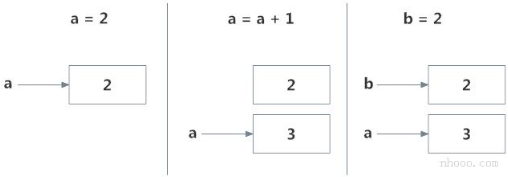
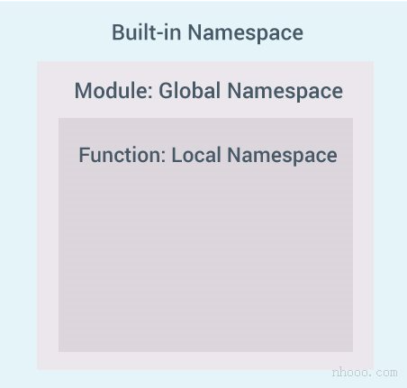
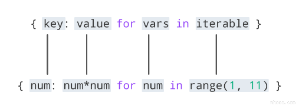
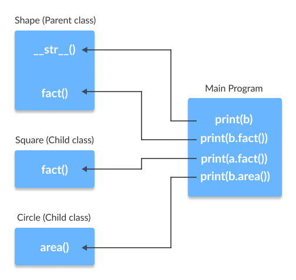
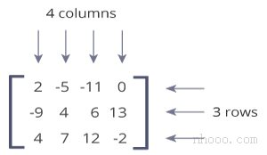
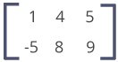

# <font style="color:rgb(51, 51, 51);">Python 命名空间和作用域</font>
<font style="color:rgb(51, 51, 51);">在本文中，您将了解命名空间，从名称到对象的映射以及变量的作用域。</font>

## <font style="color:rgb(51, 51, 51);">Python中的命名空间是什么？</font>
<font style="color:rgb(51, 51, 51);">如果您曾经读过“ Python之禅(The Zen of Python) ”（在Python解释器中输入import this），最后一行指出，</font>**<font style="color:rgb(51, 51, 51);">命名空间是一个很棒的主意-让我们做更多的事情！</font>**<font style="color:rgb(51, 51, 51);">那么这些神秘的命名空间是什么？首先让我们看看名称是什么。</font>

<font style="color:rgb(51, 51, 51);">名称（也称为标识符）只是赋予对象的名称。Python中的一切都是</font>[<font style="color:rgb(51, 51, 51);">对象</font>](https://www.cainiaoplus.com/python/python-class.html)<font style="color:rgb(51, 51, 51);">。名称是访问基础对象的一种方式。</font>

<font style="color:rgb(51, 51, 51);">例如，当我们执行赋值操作时a = 2，2是一个存储在内存中的对象，而</font><font style="color:rgb(51, 51, 51);">a</font><font style="color:rgb(51, 51, 51);">是与之关联的名称。我们可以通过</font>[<font style="color:rgb(51, 51, 51);">内置函数</font>](https://www.cainiaoplus.com/python/python-methods-built-in.html)<font style="color:rgb(51, 51, 51);"> </font><font style="color:rgb(51, 51, 51);">获取某些对象的地址（在RAM中）id()。让我们看看如何使用它。</font>

**<font style="color:rgb(51, 51, 51);background-color:rgb(239, 239, 239);">示例</font>**

```python
# 注意:您可能会得到不同的id值
a = 2
print('id(2) =', id(2))

print('id(a) =', id(a))
```

**<font style="color:rgb(51, 51, 51);">输出结果</font>**

```python
id(2) = 9302208
id(a) = 9302208
```

<font style="color:rgb(51, 51, 51);">在这里，两者都引用相同的对象2，因此它们具有相同的id()。让我们做些有趣的事情。</font>

**<font style="color:rgb(51, 51, 51);background-color:rgb(239, 239, 239);">示例</font>**

```python
# 注意:您可能会得到不同的id值

a = 2
print('id(a) =', id(a))

a = a+1
print('id(a) =', id(a))

print('id(3) =', id(3))

b = 2
print('id(b) =', id(b))
print('id(2) =', id(2))
```

**<font style="color:rgb(51, 51, 51);">输出结果</font>**

```python
id(a) = 9302208
id(a) = 9302240
id(3) = 9302240
id(b) = 9302208
id(2) = 9302208
```

<font style="color:rgb(51, 51, 51);">上述步骤序列中发生了什么？让我们用一个图来解释一下：</font>



<font style="color:rgb(51, 51, 51);">最初，创建一个对象2并将名称a与之相关联，当我们执行a = a + 1时，将创建一个新的对象3，现在a与该对象相关联。</font>

<font style="color:rgb(51, 51, 51);">请注意，id（a）和id（3）具有相同的值。</font>

<font style="color:rgb(51, 51, 51);">此外，当执行b = 2时，新名称b与先前的对象2相关联。</font>

<font style="color:rgb(51, 51, 51);">这是有效的，因为Python不必创建新的重复对象。 名称绑定的这种动态特性使Python变得功能强大。 名称可以引用任何类型的对象。</font>

```python
>>> a = 5
>>> a = 'Hello World!'
>>> a = [1,2,3]
```

<font style="color:rgb(51, 51, 51);">所有这些都是有效的，并且</font><font style="color:rgb(51, 51, 51);">a</font><font style="color:rgb(51, 51, 51);">将在不同示例中引用三种不同类型的对象。</font>[<font style="color:rgb(51, 51, 51);">函数</font>](https://www.cainiaoplus.com/python/python-function.html)<font style="color:rgb(51, 51, 51);">也是对象，因此名称也可以引用它们。</font>

**<font style="color:rgb(51, 51, 51);background-color:rgb(239, 239, 239);">示例</font>**

```python
def printHello():
    print("Hello")


a = printHello

a()
```

**<font style="color:rgb(51, 51, 51);">输出结果</font>**

Hello

<font style="color:rgb(51, 51, 51);">相同的名称</font><font style="color:rgb(51, 51, 51);">a</font><font style="color:rgb(51, 51, 51);">可以引用一个函数，我们可以使用该名称来调用该函数。</font>

## <font style="color:rgb(51, 51, 51);">什么是Python中的命名空间？</font>
<font style="color:rgb(51, 51, 51);">现在我们了解了名称是什么，我们可以继续进行命名空间的概念。</font>

<font style="color:rgb(51, 51, 51);">简而言之，命名空间是名称的集合。</font>

<font style="color:rgb(51, 51, 51);">在Python中，您可以将命名空间想象为已定义的每个名称到对应对象的映射。</font>

<font style="color:rgb(51, 51, 51);">不同的命名空间可以在给定时间共存，但完全隔离。</font>

<font style="color:rgb(51, 51, 51);">当我们启动Python解释器时，将创建一个包含所有内置名称的命名空间，并且只要该解释器运行，该命名空间就会存在。</font>

<font style="color:rgb(51, 51, 51);">这就是为什么内置的功能（例如id()）print()等始终可以从程序的任何部分使用的原因。每个</font>[<font style="color:rgb(51, 51, 51);">模块</font>](https://www.cainiaoplus.com/python/python-modules.html)<font style="color:rgb(51, 51, 51);">创建自己的全局命名空间。</font>

<font style="color:rgb(51, 51, 51);">这些不同的命名空间是隔离的。因此，不同模块中可能存在的相同名称不会冲突。</font>

<font style="color:rgb(51, 51, 51);">模块可以具有各种功能和类。调用函数时会创建一个本地命名空间，其中定义了所有名称。与类相似。下图可能有助于阐明这一概念。</font>



## <font style="color:rgb(51, 51, 51);">Python变量作用域</font>
<font style="color:rgb(51, 51, 51);">尽管定义了各种唯一的命名空间，但我们可能无法从程序的每个部分访问它们。作用域的概念开始起作用。</font>

<font style="color:rgb(51, 51, 51);">作用域是程序的一部分，从那里可以直接访问命名空间而无需任何前缀。</font>

<font style="color:rgb(51, 51, 51);">在任何给定时刻，至少有三个嵌套作用域。</font>

1. <font style="color:rgb(51, 51, 51);">具有本地名称的当前函数的作用域</font>
2. <font style="color:rgb(51, 51, 51);">具有全局名称的模块的作用域</font>
3. <font style="color:rgb(51, 51, 51);">具有内置名称的最外部作用域</font>

<font style="color:rgb(51, 51, 51);">在函数内部进行引用时，将在本地命名空间中搜索名称，然后在全局命名空间中搜索，最后在内置命名空间中搜索。</font>

<font style="color:rgb(51, 51, 51);">如果另一个函数内有一个函数，则新作用域嵌套在本地作用域内。</font>

## <font style="color:rgb(51, 51, 51);">Python作用域和命名空间的示例</font>
```python
def outer_function():
    b = 20
    def inner_func():
        c = 30

a = 10
```

<font style="color:rgb(51, 51, 51);">在这里，变量</font><font style="color:rgb(51, 51, 51);">a</font><font style="color:rgb(51, 51, 51);">在全局命名空间中。变量</font><font style="color:rgb(51, 51, 51);">b</font><font style="color:rgb(51, 51, 51);">在的本地命名空间中，outer_function()而</font><font style="color:rgb(51, 51, 51);">c</font><font style="color:rgb(51, 51, 51);">在的嵌套本地命名空间中inner_function()。</font>

<font style="color:rgb(51, 51, 51);">当我们在时inner_function()，</font><font style="color:rgb(51, 51, 51);">c</font><font style="color:rgb(51, 51, 51);">在我们本地，</font><font style="color:rgb(51, 51, 51);">b</font><font style="color:rgb(51, 51, 51);">在非本地，</font><font style="color:rgb(51, 51, 51);">a</font><font style="color:rgb(51, 51, 51);">在全局。我们可以为</font><font style="color:rgb(51, 51, 51);">c</font><font style="color:rgb(51, 51, 51);">读取和分配新值，但只能 从中读取</font><font style="color:rgb(51, 51, 51);">b</font><font style="color:rgb(51, 51, 51);">和</font><font style="color:rgb(51, 51, 51);">a</font><font style="color:rgb(51, 51, 51);">inner_function()。</font>

<font style="color:rgb(51, 51, 51);">如果我们尝试分配作为值</font><font style="color:rgb(51, 51, 51);">b</font><font style="color:rgb(51, 51, 51);">，一个新的变量</font><font style="color:rgb(51, 51, 51);">b</font><font style="color:rgb(51, 51, 51);">在本地命名空间比非本地不同的创建</font><font style="color:rgb(51, 51, 51);">b</font><font style="color:rgb(51, 51, 51);">。当我们分配一个值，同样的事情发生</font><font style="color:rgb(51, 51, 51);">一个</font><font style="color:rgb(51, 51, 51);">。</font>

<font style="color:rgb(51, 51, 51);">但是，如果我们将</font><font style="color:rgb(51, 51, 51);">a</font><font style="color:rgb(51, 51, 51);">声明为全局a，则所有引用和赋值都将移至全局</font><font style="color:rgb(51, 51, 51);">a</font><font style="color:rgb(51, 51, 51);">。同样，如果我们想重新绑定变量</font><font style="color:rgb(51, 51, 51);">b</font><font style="color:rgb(51, 51, 51);">，则必须将其声明为非本地变量。以下示例将进一步阐明这一点。</font>

**<font style="color:rgb(51, 51, 51);background-color:rgb(239, 239, 239);">示例</font>**

```python
def outer_function():
    a = 20

    def inner_function():
        a = 30
        print('a =', a)

    inner_function()
    print('a =', a)


a = 10
outer_function()
print('a =', a)
```

<font style="color:rgb(51, 51, 51);">正如您看到的，该程序的输出为</font>

```python
a = 30
a = 20
a = 10
```

<font style="color:rgb(51, 51, 51);">在此程序中，在不同的命名空间中定义了三个不同的变量</font><font style="color:rgb(51, 51, 51);">a</font><font style="color:rgb(51, 51, 51);">并进行了相应的访问。在以下程序中，</font>

**<font style="color:rgb(51, 51, 51);background-color:rgb(239, 239, 239);">示例</font>**

```python
def outer_function():
    global a
    a = 20

    def inner_function():
        global a
        a = 30
        print('a =', a)

    inner_function()
    print('a =', a)


a = 10
outer_function()
print('a =', a)
```

<font style="color:rgb(51, 51, 51);">程序的输出是。</font>

```python
a = 30
a = 30
a = 30
```

<font style="color:rgb(51, 51, 51);">在这里，由于使用了关键字global，所以所有引用和赋值都指向全局a。</font>

# <font style="color:rgb(51, 51, 51);">Python 迭代器</font>
<font style="color:rgb(51, 51, 51);">迭代器是可以迭代的对象。 在本教程中，您将学习迭代器的工作原理以及如何使用__iter__和__next__方法构建自己的迭代器。</font>

## <font style="color:rgb(51, 51, 51);">Python中的迭代器是什么？</font>
<font style="color:rgb(51, 51, 51);">迭代器在Python中无处不在。它们在for循环，理解，生成器等中优雅地实现，但却隐藏在眼皮底下。</font>

<font style="color:rgb(51, 51, 51);">Python中的Iterator只是一个可以迭代的</font>[<font style="color:rgb(51, 51, 51);">对象</font>](https://www.cainiaoplus.com/python/python-class.html)<font style="color:rgb(51, 51, 51);">。一个将返回数据的对象，一次返回一个元素。</font>

<font style="color:rgb(51, 51, 51);">从技术上讲，Python</font><font style="color:rgb(51, 51, 51);"> </font>**<font style="color:rgb(51, 51, 51);">迭代器对象</font>**<font style="color:rgb(51, 51, 51);">必须实现两个特殊方法，__iter__()和__next__()统称为</font>**<font style="color:rgb(51, 51, 51);">迭代器协议</font>**<font style="color:rgb(51, 51, 51);">。</font>

<font style="color:rgb(51, 51, 51);">如果我们可以从对象获得迭代器，则该对象称为</font>**<font style="color:rgb(51, 51, 51);">可</font>**<font style="color:rgb(51, 51, 51);">迭代。Python中的大多数内置容器（例如：</font>[<font style="color:rgb(51, 51, 51);">list</font>](https://www.cainiaoplus.com/python/python-list.html)<font style="color:rgb(51, 51, 51);">，</font>[<font style="color:rgb(51, 51, 51);">tuple</font>](https://www.cainiaoplus.com/python/python-tuple.html)<font style="color:rgb(51, 51, 51);">，</font>[<font style="color:rgb(51, 51, 51);">string</font>](https://www.cainiaoplus.com/python/python-string.html)<font style="color:rgb(51, 51, 51);">等）都是可迭代的。</font>

<font style="color:rgb(51, 51, 51);">iter()函数（也就是__iter__()方法）从它们返回一个迭代器。</font>

## <font style="color:rgb(51, 51, 51);">通过Python中的迭代器进行迭代</font>
<font style="color:rgb(51, 51, 51);">我们使用该next()函数手动遍历迭代器的所有项目。 当我们到达末尾并且没有更多数据要返回时，它将引发StopIteration。 以下是一个示例。。</font>

**<font style="color:rgb(51, 51, 51);background-color:rgb(239, 239, 239);">示例</font>**

```python
# 定义一个列表
my_list = [4, 7, 0, 3]

# 使用iter()获得迭代器
my_iter = iter(my_list)

## 使用iter()获得迭代器 

#输出 4
print(next(my_iter))

#输出 7
print(next(my_iter))

## next（obj）与obj .__ next __()相同

#输出 0
print(my_iter.__next__())

#输出 3
print(my_iter.__next__())

## 这将引起错误，没有项目剩下
next(my_iter)
```

<font style="color:rgb(51, 51, 51);">一种自动迭代的更优雅的方法是使用</font>[<font style="color:rgb(51, 51, 51);">for循环</font>](https://www.cainiaoplus.com/python/python-for-loop.html)<font style="color:rgb(51, 51, 51);">。使用此方法，我们可以迭代可以返回迭代器的任何对象，例如列表，字符串，文件等。</font>

```python
>>> for element in my_list:
    ...     print(element)
...     
4
7
0
3
```

## <font style="color:rgb(51, 51, 51);">for循环实际上如何工作？</font>
<font style="color:rgb(51, 51, 51);">正如我们在上面的示例中看到的那样，for循环能够自动遍历列表。</font>

<font style="color:rgb(51, 51, 51);">实际上，for循环可以迭代任何可迭代的对象。让我们仔细看看如何for在Python中实际实现循环。</font>

```python
for element in iterable:
    # 对元素做点什么
```

<font style="color:rgb(51, 51, 51);">实际上是实现为。</font>

```python
# 创建一个迭代器对象iterable
iter_obj = iter(iterable)

# 无限循环
while True:
    try:
        # 获取下一项
        element = next(iter_obj)
        # 对元素做点什么
    except StopIteration:
        # 如果引发StopIteration，则从循环中断
        break
```

<font style="color:rgb(51, 51, 51);">因此，在内部，for循环通过在iterable上调用iter（）创建一个迭代器对象iter_obj。</font>

<font style="color:rgb(51, 51, 51);">具有讽刺意味的是，这个for循环实际上是一个无限的</font>[<font style="color:rgb(51, 51, 51);">while循环</font>](https://www.cainiaoplus.com/python/python-while-loop.html)<font style="color:rgb(51, 51, 51);">。</font>

<font style="color:rgb(51, 51, 51);">在循环内部，它调用next()来获取下一个元素，并使用这个值执行for循环的主体。当所有的项都用完后，StopIteration被抛出，它在内部被捕获，循环结束。注意，任何其他类型的异常都会通过。</font>

## <font style="color:rgb(51, 51, 51);">用Python构建自己的迭代器</font>
<font style="color:rgb(51, 51, 51);">在Python中从头开始构建迭代器很容易。我们只需要实现这些方法__iter__()和__next__()。</font>

<font style="color:rgb(51, 51, 51);">__iter__()方法返回迭代器对象本身。如果需要，可以执行一些初始化。</font>

<font style="color:rgb(51, 51, 51);">__next__()方法必须返回序列中的下一项。在到达终点时，以及在随后的调用中，它必须引发StopIteration。  
</font>

<font style="color:rgb(51, 51, 51);">这里，我们展示了一个示例，它将在每次迭代中为我们提供2的次幂。幂指数从0到用户设置的数字。</font>

**<font style="color:rgb(51, 51, 51);background-color:rgb(239, 239, 239);">示例</font>**

```python
class PowTwo:
    """实现迭代器的类
             二的幂"""

    def __init__(self, max = 0):
        self.max = max

    def __iter__(self):
        self.n = 0
        return self

    def __next__(self):
        if self.n <= self.max:
            result = 2 ** self.n
            self.n += 1
            return result
        else:
            raise StopIteration
```

<font style="color:rgb(51, 51, 51);">现在，我们可以创建一个迭代器，并如下进行迭代。</font>

```python
>>> a = PowTwo(4)
>>> i = iter(a)
>>> next(i)
1
>>> next(i)
2
>>> next(i)
4
>>> next(i)
8
>>> next(i)
16
>>> next(i)
Traceback (most recent call last):
...
StopIteration
```

<font style="color:rgb(51, 51, 51);">我们还可以使用for循环来迭代迭代器类。</font>

```python
>>> for i in PowTwo(5):
    ...     print(i)
...     
1
2
4
8
16
32
```

## <font style="color:rgb(51, 51, 51);">Python无限迭代器</font>
<font style="color:rgb(51, 51, 51);">迭代器对象中的项不必耗尽。可能有无限的迭代器(永远不会结束)。在处理这样的迭代器时，我们必须小心。</font>

<font style="color:rgb(51, 51, 51);">这是一个演示无限迭代器的简单示例。</font>

[<font style="color:rgb(51, 51, 51);">内置函数</font>](https://www.cainiaoplus.com/404.html)<font style="color:rgb(51, 51, 51);"> </font><font style="color:rgb(51, 51, 51);">iter()可以用两个参数调用，其中第一个参数必须是可调用对象(函数)，第二个参数是标记。迭代器调用这个函数，直到返回的值等于标记值为止。</font>

```python
>>> int()
0

>>> inf = iter(int,1)
>>> next(inf)
0
>>> next(inf)
0
```

<font style="color:rgb(51, 51, 51);">我们可以看到int()函数始终返回0。因此，将其作为iter(int,1)传递将返回一个迭代器，该迭代器调用int()直到返回值等于1。这永远不会发生，并且我们得到一个无限迭代器。</font>

<font style="color:rgb(51, 51, 51);">我们还可以构建自己的无限迭代器。理论上，以下迭代器将返回所有奇数。</font>

**<font style="color:rgb(51, 51, 51);background-color:rgb(239, 239, 239);">示例</font>**

```python
class InfIter:
    """无限迭代器返回所有
                 奇数"""

    def __iter__(self):
        self.num = 1
        return self

    def __next__(self):
        num = self.num
        self.num += 2
        return num
```

<font style="color:rgb(51, 51, 51);">运行如下。</font>

```python
>>> a = iter(InfIter())
>>> next(a)
1
>>> next(a)
3
>>> next(a)
5
>>> next(a)
7
```

<font style="color:rgb(51, 51, 51);">等等...</font>

<font style="color:rgb(51, 51, 51);">在这些类型的无限迭代器上进行迭代时，请小心包含终止条件。</font>

<font style="color:rgb(51, 51, 51);">使用迭代器的优点是节省了资源。如上所示，我们无需将整个数字系统存储在内存中就可以获得所有奇数。从理论上讲，我们可以在有限内存中包含无限项。</font>

<font style="color:rgb(51, 51, 51);">迭代器还使我们的代码看起来很酷。</font>

<font style="color:rgb(51, 51, 51);">有一种在Python中创建迭代器的简便方法。要了解更多信息，请访问：</font>[<font style="color:rgb(51, 51, 51);">Python生成器yield</font>](https://www.cainiaoplus.com/python/python-generator.html)<font style="color:rgb(51, 51, 51);">。</font>

# <font style="color:rgb(51, 51, 51);">Python 生成器</font>
<font style="color:rgb(51, 51, 51);">在本文中，您将学习如何使用Python生成器轻松创建迭代，它与迭代器和常规函数有何不同，以及为什么要使用它。</font>

## <font style="color:rgb(51, 51, 51);">Python中的生成器是什么？</font>
[<font style="color:rgb(51, 51, 51);">用Python</font>](https://www.cainiaoplus.com/python/python-iterator.html)<font style="color:rgb(51, 51, 51);">构建</font>[<font style="color:rgb(51, 51, 51);">迭代器</font>](https://www.cainiaoplus.com/python/python-iterator.html)<font style="color:rgb(51, 51, 51);">有很多开销; 我们必须使用__iter__()和__next__()方法实现一个类，跟踪内部状态，在没有要返回的值时触发StopIteration等等。</font>

<font style="color:rgb(51, 51, 51);">这既冗长又违反直觉。生成器在这种情况下可以派上用场。</font>

<font style="color:rgb(51, 51, 51);">Python生成器是创建迭代器的简单方法。我们上面提到的所有开销都由Python的生成器自动处理。</font>

<font style="color:rgb(51, 51, 51);">简而言之，生成器是一个函数，它返回一个对象（迭代器），我们可以对其进行迭代（一次一个值）。</font>

## <font style="color:rgb(51, 51, 51);">如何在Python中创建生成器？</font>
<font style="color:rgb(51, 51, 51);">在Python中创建生成器非常简单。 就像使用yield语句而不是return语句定义普通函数一样容易。</font>

<font style="color:rgb(51, 51, 51);">如果一个函数包含至少一个yield语句(它可能包含其他yield或return语句)，那么它就成为一个生成器函数。yield和return都将从函数返回一些值。</font>

<font style="color:rgb(51, 51, 51);">不同之处在于，当return语句完全终止一个函数时，yield语句会暂停该函数保存其所有状态，然后在后续调用时继续执行。</font>

## <font style="color:rgb(51, 51, 51);">生成器函数与常规函数之间的区别</font>
<font style="color:rgb(51, 51, 51);">这是生成器函数与</font>[<font style="color:rgb(51, 51, 51);">常规函数的</font>](https://www.cainiaoplus.com/python/python-function.html)<font style="color:rgb(51, 51, 51);">不同之处。</font>

+ <font style="color:rgb(51, 51, 51);">生成器函数包含一个或多个yield语句。</font>
+ <font style="color:rgb(51, 51, 51);">调用时，它返回一个对象（迭代器），但不会立即开始执行。</font>
+ <font style="color:rgb(51, 51, 51);">像__iter__()和__next__()这样的方法会自动实现。因此，我们可以使用next()来遍历项目。</font>
+ <font style="color:rgb(51, 51, 51);">一旦函数产生了结果，函数就会暂停，控制就会转移给调用者。</font>
+ <font style="color:rgb(51, 51, 51);">局部变量及其状态在连续调用之间被记住。</font>
+ <font style="color:rgb(51, 51, 51);">最后，当函数终止时，在进一步调用时会自动引发StopIteration。</font>

<font style="color:rgb(51, 51, 51);">这是一个示例，用于说明上述所有要点。我们有一个my_gen()由几个yield语句命名的生成器函数。</font>

**<font style="color:rgb(51, 51, 51);background-color:rgb(239, 239, 239);">示例</font>**

```python
# 一个简单的生成器函数
def my_gen():
    n = 1
    print('这是第一次打印')
    # 生成器函数包含yield语句
    yield n

    n += 1
    print('这是第二次打印')
    yield n

    n += 1
    print('这是最后一次打印')
    yield n
```

<font style="color:rgb(51, 51, 51);">解释器中的交互式运行如下所示。在Python Shell中运行这些命令以查看输出。</font>

```python
>>> # 它返回一个对象，但不立即开始执行.
>>> a = my_gen()

>>> # 我们可以使用next()遍历这些项.
>>> next(a)
这是第一次打印
1
>>> # 一旦函数产生了结果，函数就会暂停，控制就会转移给调用者。

>>> # 局部变量及其状态在连续调用之间被记住。
>>> next(a)
这是第二次打印
2

>>> next(a)
这是最后一次打印
3

>>> # 最后，当函数终止时，在进一步调用时将自动引发StopIteration。
>>> next(a)
Traceback (most recent call last):
...
StopIteration
>>> next(a)
Traceback (most recent call last):
...
StopIteration
```

<font style="color:rgb(51, 51, 51);">在上面的示例中要注意的一件有趣的事情是，每次调用之间都会记住变量</font><font style="color:rgb(51, 51, 51);">n</font><font style="color:rgb(51, 51, 51);">的值。</font>

<font style="color:rgb(51, 51, 51);">与普通函数不同，局部变量在函数产生时不会被破坏。此外，生成器对象只能迭代一次。</font>

<font style="color:rgb(51, 51, 51);">要重新启动该过程，我们需要使用= my_gen（）之类的东西来创建另一个生成器对象。</font>

**<font style="color:rgb(51, 51, 51);">注意：</font>**<font style="color:rgb(51, 51, 51);">最后要注意的一点是，我们可以直接将生成器与</font>[<font style="color:rgb(51, 51, 51);">for循环</font>](https://www.cainiaoplus.com/python/python-for-loop.html)<font style="color:rgb(51, 51, 51);">一起使用。</font>

<font style="color:rgb(51, 51, 51);">这是因为，for循环接受一个迭代器，并使用next()函数对其进行迭代。当StopIteration被触发时，它会自动结束。</font>[<font style="color:rgb(51, 51, 51);">了解如何在Python中实际实现for循环</font>](https://www.cainiaoplus.com/python/python-iterator.html#for-loop-working)<font style="color:rgb(51, 51, 51);">。  
</font>

**<font style="color:rgb(51, 51, 51);background-color:rgb(239, 239, 239);">示例</font>**

```python
# 一个简单的生成器函数
def my_gen():
    n = 1
    print('这是第一次打印')
    # 生成器函数包含yield语句
    yield n

    n += 1
    print('这是第二次打印')
    yield n

    n += 1
    print('这是最后一次打印')
    yield n

# 使用for循环
for item in my_gen():
    print(item)
```

<font style="color:rgb(51, 51, 51);">运行该程序时，输出为：</font>

```python
这是第一次打印
1
这是第二次打印
2
这是最后一次打印
3
```

## <font style="color:rgb(51, 51, 51);">带有循环的Python生成器</font>
<font style="color:rgb(51, 51, 51);">上面的示例用处不大，我们研究它只是为了了解背景中发生的事情。</font>

<font style="color:rgb(51, 51, 51);">通常，生成器函数是通过具有适当终止条件的循环来实现的。</font>

<font style="color:rgb(51, 51, 51);">让我们以反转字符串的生成器为例。</font>

**<font style="color:rgb(51, 51, 51);background-color:rgb(239, 239, 239);">示例</font>**

```python
def rev_str(my_str):
    length = len(my_str)
    for i in range(length - 1,-1,-1):
        yield my_str[i]

# For循环以反转字符串
# 输出:
# o
# l
# l
# e
# h
for char in rev_str("hello"):
    print(char)
```

<font style="color:rgb(51, 51, 51);">在此示例中，我们使用range()函数使用for循环以相反的顺序获取索引。</font>

<font style="color:rgb(51, 51, 51);">事实证明，此生成器函数不仅适用于字符串，还适用于其他种类的可迭代对象，例如</font>[<font style="color:rgb(51, 51, 51);">list</font>](https://www.cainiaoplus.com/python/python-list.html)<font style="color:rgb(51, 51, 51);">，</font>[<font style="color:rgb(51, 51, 51);">tuple</font>](https://www.cainiaoplus.com/python/python-tuple.html)<font style="color:rgb(51, 51, 51);">等。</font>

## <font style="color:rgb(51, 51, 51);">Python生成器表达式</font>
<font style="color:rgb(51, 51, 51);">使用生成器表达式可以轻松地动态创建简单的生成器。它使建造生成器变得容易。</font>

<font style="color:rgb(51, 51, 51);">与lambda函数创建</font>[<font style="color:rgb(51, 51, 51);">匿名函数相同</font>](https://www.cainiaoplus.com/python/python-anonymous-function.html)<font style="color:rgb(51, 51, 51);">，生成器表达式创建匿名生成器函数。</font>

<font style="color:rgb(51, 51, 51);">生成器表达式的语法类似于</font>[<font style="color:rgb(51, 51, 51);">Python</font>](https://www.cainiaoplus.com/python/python-list.html#list-comprehension)<font style="color:rgb(51, 51, 51);">中的</font>[<font style="color:rgb(51, 51, 51);">列表理解</font>](https://www.cainiaoplus.com/python/python-list.html#list-comprehension)<font style="color:rgb(51, 51, 51);">语法。但是将方括号替换为圆括号。</font>

<font style="color:rgb(51, 51, 51);">列表理解与生成器表达式之间的主要区别在于，虽然列表理解生成整个列表，但生成器表达式一次生成一个项目。</font>

<font style="color:rgb(51, 51, 51);">他们有点懒，只在需要时才生成项目。由于这个原因，生成器表达式比等价的列表理解的内存效率要高得多。</font>

**<font style="color:rgb(51, 51, 51);background-color:rgb(239, 239, 239);">示例</font>**

```python
# 初始化列表
my_list = [1, 3, 6, 10]

# 使用列表理解对每个项目进行平方
# 输出: [1, 9, 36, 100]
[x**2 for x in my_list]

# 同样的事情可以使用生成器表达式来完成
# 输出: <generator object <genexpr> at 0x0000000002EBDAF8>
(x**2 for x in my_list)
```

<font style="color:rgb(51, 51, 51);">上面我们可以看到生成器表达式没有立即产生所需的结果。相反，它返回了一个生成器对象，该对象带有按需生产的物品。</font>

**<font style="color:rgb(51, 51, 51);background-color:rgb(239, 239, 239);">示例</font>**

```python
# 初始化list
my_list = [1, 3, 6, 10]

a = (x**2 for x in my_list)
# 输出: 1
print(next(a))

# 输出: 9
print(next(a))

# 输出: 36
print(next(a))

# 输出: 100
print(next(a))

# 输出: StopIteration
next(a)
```

<font style="color:rgb(51, 51, 51);">生成器表达式可以在函数内部使用。以这种方式使用时，可以删除圆括号。</font>

```python
>>> sum(x**2 for x in my_list)
146

>>> max(x**2 for x in my_list)
100
```

## <font style="color:rgb(51, 51, 51);">为什么在Python中使用生成器？</font>
<font style="color:rgb(51, 51, 51);">有几个原因使生成器成为一个有吸引力的实现。</font>

### <font style="color:rgb(51, 51, 51);">1.易于实施</font>
<font style="color:rgb(51, 51, 51);">与它们的迭代器类对应项相比，生成器可以以一种清晰而简洁的方式实现。下面是一个使用iterator类实现2的幂序列的示例。</font>

```python
class PowTwo:
    def __init__(self, max = 0):
        self.max = max

    def __iter__(self):
        self.n = 0
        return self

    def __next__(self):
        if self.n > self.max:
            raise StopIteration

        result = 2 ** self.n
        self.n += 1
        return result
```

<font style="color:rgb(51, 51, 51);">这代码很长。现在，使用生成器函数执行相同的操作。</font>

```python
def PowTwoGen(max = 0):
    n = 0
    while n < max:
        yield 2 ** n
        n += 1
```

<font style="color:rgb(51, 51, 51);">由于生成器自动跟踪细节，因此简洁明了，实现起来也更加简洁。</font>

### <font style="color:rgb(51, 51, 51);">2.节省内存</font>
<font style="color:rgb(51, 51, 51);">一个普通的返回序列的函数会在返回结果之前在内存中创建整个序列。如果序列中的项目数量很大，会影响效率。</font>

<font style="color:rgb(51, 51, 51);">而这种序列的生成器实现对内存友好，因此是首选的，因为它一次只能生成一项。</font>

### <font style="color:rgb(51, 51, 51);">3.表示无限流</font>
<font style="color:rgb(51, 51, 51);">生成器是表示无限数据流的绝佳媒介。无限流无法存储在内存中，并且由于生成器一次只生成一项，因此它可以表示无限数据流。</font>

<font style="color:rgb(51, 51, 51);">下面的示例可以生成所有偶数（至少在理论上）。</font>

```python
def all_even():
    n = 0
    while True:
        yield n
        n += 2
```

### <font style="color:rgb(51, 51, 51);">4.流水线发生器</font>
<font style="color:rgb(51, 51, 51);">生成器可用于流水线化一系列操作。最好用一个示例来说明。</font>

<font style="color:rgb(51, 51, 51);">假设我们有一个著名的快餐连锁店的日志文件。日志文件中有一个列（第4列），该列跟踪每小时售出的比萨的数量，我们希望将其求和以得出5年内售出的比萨的总数。</font>

<font style="color:rgb(51, 51, 51);">假设所有内容都是字符串，没有可用的数字被标记为“ N / A”。生成器的实现可以如下。</font>

```python
with open('sells.log') as file:
    pizza_col = (line[3] for line in file)
    per_hour = (int(x) for x in pizza_col if x != 'N/A')
    print("Total pizzas sold = ",sum(per_hour))
```

<font style="color:rgb(51, 51, 51);">这种流水线高效且易于阅读（是的，非常酷！）。</font>

# <font style="color:rgb(51, 51, 51);">Python 闭包</font>
<font style="color:rgb(51, 51, 51);">在本文中，您将了解什么是Python闭包，如何定义闭包，以及使用闭包的原因。</font>

## <font style="color:rgb(51, 51, 51);">嵌套函数中的非局部变量</font>
<font style="color:rgb(51, 51, 51);">在了解闭包是什么之前，我们必须首先了解什么是嵌套函数和非局部变量。</font>

<font style="color:rgb(51, 51, 51);">在另一个函数内部定义的函数称为嵌套函数。嵌套函数可以访问封闭范围的变量。</font>

<font style="color:rgb(51, 51, 51);">在Python中，默认情况下，这些非本地变量是只读的，并且我们必须将它们明确声明为非本地变量（使用</font>[<font style="color:rgb(51, 51, 51);">nonlocal关键字</font>](https://www.cainiaoplus.com/python/python-keyword-list.html#nonlocal)<font style="color:rgb(51, 51, 51);">）才能进行修改。</font>

<font style="color:rgb(51, 51, 51);">以下是访问非局部变量的嵌套函数的示例。</font>

**<font style="color:rgb(51, 51, 51);background-color:rgb(239, 239, 239);">示例</font>**

```python
def print_msg(msg):
    # 这是外部封闭函数

    def printer():
        # 这是嵌套函数
        print(msg)

    printer()

# 我们执行这个函数
# 输出: Hello
print_msg("Hello")
```

<font style="color:rgb(51, 51, 51);">我们可以看到嵌套函数printer()能够访问封闭函数的非局部变量</font><font style="color:rgb(51, 51, 51);">msg</font><font style="color:rgb(51, 51, 51);">。</font>

## <font style="color:rgb(51, 51, 51);">定义闭包函数</font>
<font style="color:rgb(51, 51, 51);">在上面的示例中，如果函数print_msg()的最后一行返回了printer()函数而不是调用它，将会发生什么？ 这意味着功能定义如下。</font>

**<font style="color:rgb(51, 51, 51);background-color:rgb(239, 239, 239);">示例</font>**

```python
def print_msg(msg):
    # 这是外部封闭函数

    def printer():
        # 这是嵌套函数
        print(msg)

    return printer  # 这变了

# 现在，让我们尝试调用此函数。
# 输出: Hello
another = print_msg("Hello")
another()
```

<font style="color:rgb(51, 51, 51);">这很不寻常。</font>

<font style="color:rgb(51, 51, 51);">print_msg()函数用字符串调用，"Hello"返回的函数绑定到</font><font style="color:rgb(51, 51, 51);">另一个</font><font style="color:rgb(51, 51, 51);">名称。在调用时another()，尽管我们已经完成了print_msg()函数的执行，但仍然记得该消息。</font>

<font style="color:rgb(51, 51, 51);">这种将一些数据（"Hello"）附加到代码上的技术</font>**<font style="color:rgb(51, 51, 51);">在Python中</font>**<font style="color:rgb(51, 51, 51);">称为</font>**<font style="color:rgb(51, 51, 51);">闭包</font>**<font style="color:rgb(51, 51, 51);">。</font>

<font style="color:rgb(51, 51, 51);">即使变量超出范围或函数本身已从当前命名空间中删除，也会记住封闭范围中的这个值。</font>

<font style="color:rgb(51, 51, 51);">尝试在Python Shell中运行以下命令以查看输出。</font>

```python
>>> del print_msg
>>> another()
Hello
>>> print_msg("Hello")
Traceback (most recent call last):
...
NameError: name 'print_msg' is not defined
```

## <font style="color:rgb(51, 51, 51);">闭包的条件？</font>
<font style="color:rgb(51, 51, 51);">从上面的实例可以看出，在Python中，当嵌套的函数在其封闭的范围内引用一个值时，我们有一个闭包。</font>

<font style="color:rgb(51, 51, 51);">以下几点总结了在Python中创建闭包必须满足的条件。</font>

+ <font style="color:rgb(51, 51, 51);">我们必须有一个嵌套函数（函数在函数内部）。</font>
+ <font style="color:rgb(51, 51, 51);">嵌套函数必须引用在封闭函数中定义的值。</font>
+ <font style="color:rgb(51, 51, 51);">封闭函数必须返回嵌套函数。</font>

## <font style="color:rgb(51, 51, 51);">何时使用闭包？</font>
<font style="color:rgb(51, 51, 51);">那么，闭包有什么用呢？</font>

<font style="color:rgb(51, 51, 51);">闭包可以避免使用全局值，并提供某种形式的数据隐藏。它还可以为该问题提供面向对象的解决方案。</font>

<font style="color:rgb(51, 51, 51);">当在一个类中实现的方法很少（大多数情况下是一个方法）时，闭包可以提供另一种更优雅的解决方案。但是，当属性和方法的数量变大时，最好实现一个类。</font>

<font style="color:rgb(51, 51, 51);">这是一个简单的示例，其中闭包可能比定义类和创建对象更可取。</font>

**<font style="color:rgb(51, 51, 51);background-color:rgb(239, 239, 239);">示例</font>**

```python
def make_multiplier_of(n):
    def multiplier(x):
        return x * n
    return multiplier

# 3的乘数
times3 = make_multiplier_of(3)

# 5的乘数
times5 = make_multiplier_of(5)

# 输出: 27
print(times3(9))

# 输出: 15
print(times5(3))

# 输出: 30
print(times5(times3(2)))
```

[<font style="color:rgb(51, 51, 51);">Python中的装饰器也</font>](https://www.cainiaoplus.com/python/python-decorator.html)<font style="color:rgb(51, 51, 51);">大量使用了闭包。</font>

<font style="color:rgb(51, 51, 51);">最后，最好指出可以找到封闭在封闭函数中的值。</font>

<font style="color:rgb(51, 51, 51);">所有函数对象都有一个__closure__属性，如果它是一个闭包函数，则该属性返回单元格对象的元组。参考上面的示例，我们知道times3和times5是闭包函数。</font>

```python
>>> make_multiplier_of.__closure__
>>> times3.__closure__
(<cell at 0x0000000002D155B8: int object at 0x000000001E39B6E0>,)
```

<font style="color:rgb(51, 51, 51);">单元格对象具有存储关闭值的属性cell_contents。</font>

```python
>>> times3.__closure__[0].cell_contents
3
>>> times5.__closure__[0].cell_contents
5
```

# <font style="color:rgb(51, 51, 51);">Python 装饰器</font>
<font style="color:rgb(51, 51, 51);">装饰器接受一个函数，添加一些功能并返回它。 在本文中，您将学习如何创建装饰器以及为什么要使用它。</font>

## <font style="color:rgb(51, 51, 51);">Python中的装饰器是什么？</font>
<font style="color:rgb(51, 51, 51);">Python有一个有趣的功能，称为</font>**<font style="color:rgb(51, 51, 51);">装饰器</font>**<font style="color:rgb(51, 51, 51);">，可将功能添加到现有代码中。</font>

<font style="color:rgb(51, 51, 51);">这也称为</font>**<font style="color:rgb(51, 51, 51);">元编程，</font>**<font style="color:rgb(51, 51, 51);">因为程序的一部分试图在编译时修改程序的另一部分。</font>

## <font style="color:rgb(51, 51, 51);">学习装饰器的先决条件</font>
<font style="color:rgb(51, 51, 51);">为了了解装饰器，我们必须首先了解Python的一些基本知识。</font>

<font style="color:rgb(51, 51, 51);">我们必须接受这样一个事实，即Python中的所有内容都是</font>[<font style="color:rgb(51, 51, 51);">对象</font>](https://www.cainiaoplus.com/python/python-class.html)<font style="color:rgb(51, 51, 51);">。我们定义的名称只是绑定到这些对象的标识符。</font>[<font style="color:rgb(51, 51, 51);">函数</font>](https://www.cainiaoplus.com/python/python-function.html)<font style="color:rgb(51, 51, 51);">也不例外，它们也是对象（带有属性）。可以将各种不同的名称绑定到同一功能对象。</font>

<font style="color:rgb(51, 51, 51);">这是一个实例。</font>

**<font style="color:rgb(51, 51, 51);background-color:rgb(239, 239, 239);">示例</font>**

```python
def first(msg):
    print(msg)    

first("Hello")

second = first
second("Hello")
```

<font style="color:rgb(51, 51, 51);">当您运行代码时，这两个函数first和second给出相同的输出。在此，名称first和second指代相同的功能对象。</font>

<font style="color:rgb(51, 51, 51);">现在情况是不是感觉变复杂了点，可以将函数作为参数传递给另一个函数。</font>

<font style="color:rgb(51, 51, 51);">如果您在Python中使用过map，filter和reduce之类的函数，那么您已经知道这一点。</font>

<font style="color:rgb(51, 51, 51);">这种以其他函数为参数的函数也称为</font>**<font style="color:rgb(51, 51, 51);">高阶函数</font>**<font style="color:rgb(51, 51, 51);">。这是这种函数的一个实例。</font>

**<font style="color:rgb(51, 51, 51);background-color:rgb(239, 239, 239);">示例</font>**

```python
def inc(x):
    return x + 1

def dec(x):
    return x - 1

def operate(func, x):
    result = func(x)
    return result
```

<font style="color:rgb(51, 51, 51);">我们调用函数如下。</font>

```python
>>> operate(inc,3)
4
>>> operate(dec,3)
2
```

<font style="color:rgb(51, 51, 51);">此外，一个函数可以返回另一个函数。</font>

**<font style="color:rgb(51, 51, 51);background-color:rgb(239, 239, 239);">示例</font>**

```python
def is_called():
    def is_returned():
        print("Hello")
    return is_returned

new = is_called()

#输出 "Hello"
new()
```

<font style="color:rgb(51, 51, 51);">在这里，is_returned()是一个嵌套函数，每次我们调用is_drawn()时，该函数都会定义并返回。</font>

<font style="color:rgb(51, 51, 51);">最后，我们必须了解</font>[<font style="color:rgb(51, 51, 51);">Python中的闭包</font>](https://www.cainiaoplus.com/python/python-closure.html)<font style="color:rgb(51, 51, 51);">。</font>

## <font style="color:rgb(51, 51, 51);">回到装饰器</font>
<font style="color:rgb(51, 51, 51);">函数和方法被称为</font>**<font style="color:rgb(51, 51, 51);">可调用的，</font>**<font style="color:rgb(51, 51, 51);">因为它们可以被调用。</font>

<font style="color:rgb(51, 51, 51);">实际上，任何实现特殊方法__call __()的对象都称为可调用的。 因此，从最基本的意义上讲，装饰器是可调用的，可返回可调用的。</font>

<font style="color:rgb(51, 51, 51);">基本上，装饰器接受一个函数，添加一些功能并返回它。</font>

**<font style="color:rgb(51, 51, 51);background-color:rgb(239, 239, 239);">示例</font>**

```python
def make_pretty(func):
    def inner():
        print("我被装饰了")
        func()
    return inner

def ordinary():
    print("我是普通的函数")
```

<font style="color:rgb(51, 51, 51);">在shell中运行以下代码时，</font>

```python
>>> ordinary()
我是普通的函数

>>> # 我们来装饰一下这个普通的函数
>>> pretty = make_pretty(ordinary)
>>> pretty()
我被装饰了
我是普通的函数
```

<font style="color:rgb(51, 51, 51);">在上面显示的示例中，make_pretty()是一个装饰器。在分配步骤中。</font>

pretty = make_pretty(ordinary)

<font style="color:rgb(51, 51, 51);">函数ordinary()被修饰，返回的函数被命名为pretty。</font>

<font style="color:rgb(51, 51, 51);">我们可以看到decorator函数在原来的函数中添加了一些新功能。这类似于包装礼物。装饰器充当包装器。被装饰的物品(里面的礼物)的性质不会改变。但是现在，它看起来很漂亮(自从装饰之后)。</font>

<font style="color:rgb(51, 51, 51);">通常，我们装饰一个函数并将其重新分配为</font>

ordinary = make_pretty(ordinary).

<font style="color:rgb(51, 51, 51);">这是一个常见的构造，因此，Python具有简化此语法的语法。</font>

<font style="color:rgb(51, 51, 51);">我们可以将@符号与装饰器函数的名称一起使用，并将其放置在要装饰的函数的定义上方。例如，</font>

```python
@make_pretty
def ordinary():
    print("我是普通的函数")
```

<font style="color:rgb(51, 51, 51);">相当于</font>

```python
def ordinary():
    print("我是普通的函数")
ordinary = make_pretty(ordinary)
```

<font style="color:rgb(51, 51, 51);">这只是实现装饰器的语法糖。</font>

## <font style="color:rgb(51, 51, 51);">用参数装饰函数</font>
<font style="color:rgb(51, 51, 51);">上面的装饰器很简单，并且只适用于没有任何参数的函数。如果我们的函数具有如下所示的参数，该怎么办？</font>

```python
def divide(a, b):
    return a/b
```

<font style="color:rgb(51, 51, 51);">此函数有两个参数，</font><font style="color:rgb(51, 51, 51);">a</font><font style="color:rgb(51, 51, 51);">和</font><font style="color:rgb(51, 51, 51);">b</font><font style="color:rgb(51, 51, 51);">。我们知道，如果我们将</font><font style="color:rgb(51, 51, 51);">b</font><font style="color:rgb(51, 51, 51);">传递为0 ，则会产生错误。</font>

```python
>>> divide(2,5)
0.4
>>> divide(2,0)
Traceback (most recent call last):
...
ZeroDivisionError: division by zero
```

<font style="color:rgb(51, 51, 51);">现在让我们做一个装饰器来检查这种情况是否会导致错误。</font>

**<font style="color:rgb(51, 51, 51);background-color:rgb(239, 239, 239);">示例</font>**

```python
def smart_divide(func):
    def inner(a,b):
        print("我要做除法",a,"和",b)
        if b == 0:
            print("哎呀!不能除")
            return

        return func(a,b)
    return inner

@smart_divide
def divide(a,b):
    return a/b
```

<font style="color:rgb(51, 51, 51);">如果出现错误情况，此新实现将返回None。</font>

```python
>>> divide(2,5)
我要做除法 2 和 5
0.4

>>> divide(2,0)
我要做除法 2 和 0
哎呀!不能除
```

<font style="color:rgb(51, 51, 51);">通过这种方式，我们可以装饰带有参数的函数。</font>

<font style="color:rgb(51, 51, 51);">敏锐的观察者会注意到，inner()装饰器内部的嵌套函数的参数与其装饰的函数的参数相同。考虑到这一点，现在我们可以使通用装饰器可以使用任意数量的参数。</font>

<font style="color:rgb(51, 51, 51);">在Python中，此魔术是通过完成的function(*args, **kwargs)。这样，args是位置参数的</font>[<font style="color:rgb(51, 51, 51);">元组</font>](https://www.cainiaoplus.com/python/python-tuple.html)<font style="color:rgb(51, 51, 51);">，kwargs而是关键字参数的</font>[<font style="color:rgb(51, 51, 51);">字典</font>](https://www.cainiaoplus.com/python/python-dictionary.html)<font style="color:rgb(51, 51, 51);">。这样的装饰器的一个实例是。</font>

```python
def works_for_all(func):
    def inner(*args, **kwargs):
        print("我可以装饰任何函数")
        return func(*args, **kwargs)
    return inner
```

## <font style="color:rgb(51, 51, 51);">Python 链接装饰器</font>
<font style="color:rgb(51, 51, 51);">可以在Python中链接多个装饰器。</font>

<font style="color:rgb(51, 51, 51);">这就是说，一个函数可以用不同（或相同）的装饰器多次装饰。我们只需将装饰器放置在所需函数之上。</font>

**<font style="color:rgb(51, 51, 51);background-color:rgb(239, 239, 239);">示例</font>**

```python
def star(func):
    def inner(*args, **kwargs):
        print("*" * 30)
        func(*args, **kwargs)
        print("*" * 30)
    return inner

def percent(func):
    def inner(*args, **kwargs):
        print("%" * 30)
        func(*args, **kwargs)
        print("%" * 30)
    return inner

@star
@percent
def printer(msg):
    print(msg)
printer("Hello")
```

<font style="color:rgb(51, 51, 51);">这将给出输出。</font>

```python
******************************
%%%%%%%%%%%%%%%%%%%%%%%%%%%%%%
    Hello
    %%%%%%%%%%%%%%%%%%%%%%%%%%%%%%
    ******************************
```

<font style="color:rgb(51, 51, 51);">上面的语法，</font>

```python
@star
@percent
def printer(msg):
    print(msg)
```

<font style="color:rgb(51, 51, 51);">相当于</font>

```python
def printer(msg):
    print(msg)
printer = star(percent(printer))
```

<font style="color:rgb(51, 51, 51);">链接装饰器的顺序很重要。如果我们按相反的顺序，</font>

```python
@percent
@star
def printer(msg):
    print(msg)
```

<font style="color:rgb(51, 51, 51);">执行将发生在</font>

```python
%%%%%%%%%%%%%%%%%%%%%%%%%%%%%%
******************************
    Hello
    ******************************
    %%%%%%%%%%%%%%%%%%%%%%%%%%%%%%
```

# <font style="color:rgb(51, 51, 51);">Python @property</font>
<font style="color:rgb(51, 51, 51);">Python有一个伟大的概念，称为属性，它使面向对象的程序员的生活变得更加简单。</font>

<font style="color:rgb(51, 51, 51);">在定义和详细了解@property是什么之前，让我们了解为什么首先需要使用它。</font>

## <font style="color:rgb(51, 51, 51);">一个实例开始</font>
<font style="color:rgb(51, 51, 51);">假设您决定</font>[<font style="color:rgb(51, 51, 51);">创建一个</font>](https://www.cainiaoplus.com/python/python-class.html)<font style="color:rgb(51, 51, 51);">以摄氏度为单位存储温度的类。它还将实现一种将温度转换为华氏温度的方法。其中一种方法如下。</font>

**<font style="color:rgb(51, 51, 51);background-color:rgb(239, 239, 239);">示例</font>**

```python
class Celsius:
    def __init__(self, temperature = 0):
        self.temperature = temperature

    def to_fahrenheit(self):
        return (self.temperature * 1.8) + 32
```

<font style="color:rgb(51, 51, 51);">我们可以从此类中制造出对象并根据需要操纵属性temperature 。在Python shell上尝试这些。</font>

```python
>>> # 创建新对象
>>> man = Celsius()

>>> # 设定温度
>>> man.temperature = 37

>>> # 得到温度
>>> man.temperature
37

>>> # 获得华氏度
>>> man.to_fahrenheit()
98.60000000000001
```

<font style="color:rgb(51, 51, 51);">转换为华氏温度时，多余的小数位是由于浮点运算错误（在Python解释器中尝试1.1 + 2.2）。</font>

<font style="color:rgb(51, 51, 51);">如上所示，每当我们分配或检索任何对象属性（如</font><font style="color:rgb(0, 0, 0);">temperature</font><font style="color:rgb(51, 51, 51);">）时，Python都会在对象的__dict__字典中进行搜索。</font>

```python
>>> man.__dict__
{'temperature': 37}
```

<font style="color:rgb(51, 51, 51);">因此，man.temperature内部变为man.__dict__['temperature']。</font>

<font style="color:rgb(51, 51, 51);">现在，让我们进一步假设我们的课程在客户中很受欢迎，并且他们开始在程序中使用它。 他们对对象进行了各种分配。</font>

<font style="color:rgb(51, 51, 51);">有一天，一个值得信赖的客户来找我们，建议温度不能低于-273摄氏度(热力学专业的学生可能会说实际上是-273.15摄氏度)，也被称为绝对零度。他进一步要求我们实现这个值约束。作为一家追求客户满意度的公司，我们很高兴地听取了这个建议，并发布了1.01版本(对现有类的升级)。</font>

## <font style="color:rgb(51, 51, 51);">使用getter和setter</font>
<font style="color:rgb(51, 51, 51);">解决上述约束的一个明显方法是隐藏属性temperature（将其设为私有），并定义新的getter和setter接口以对其进行操作。这可以如下进行。</font>

**<font style="color:rgb(51, 51, 51);background-color:rgb(239, 239, 239);">示例</font>**

```python
class Celsius:
    def __init__(self, temperature = 0):
        self.set_temperature(temperature)

    def to_fahrenheit(self):
        return (self.get_temperature() * 1.8) + 32

    # new update
    def get_temperature(self):
        return self._temperature

    def set_temperature(self, value):
        if value < -273:
            raise ValueError("-273度是不可能的")
        self._temperature = value
```

<font style="color:rgb(51, 51, 51);">我们在上面可以看到get_temperature()，set_temperature()已经定义了新方法，此外，用_temperature替换了temperature。下划线(_)开头表示Python中的私有变量。</font>

```python
>>> c = Celsius(-277)
Traceback (most recent call last):
...
ValueError: Temperature below -273 is not possible

>>> c = Celsius(37)
>>> c.get_temperature()
37
>>> c.set_temperature(10)

>>> c.set_temperature(-300)
Traceback (most recent call last):
...
ValueError: Temperature below -273 is not possible
```

<font style="color:rgb(51, 51, 51);">此更新成功实施了新限制。我们不再被允许将温度设置为低于-273。</font>

<font style="color:rgb(51, 51, 51);">请注意，私有变量在Python中不存在。只需遵循一些规范即可。语言本身没有任何限制。</font>

```python
>>> c._temperature = -300
>>> c.get_temperature()
-300
```

<font style="color:rgb(51, 51, 51);">但这不是一个大问题。上述更新的最大问题在于，所有在程序中实现了上一类的客户端都必须将其代码从obj.temperature修改为obj.get_temperature()，并将所有分配（例如obj.temperature = val修改为obj.set_temperature（ val）)。</font>

<font style="color:rgb(51, 51, 51);">这种重构会给客户带来数十万行代码的麻烦。</font>

<font style="color:rgb(51, 51, 51);">总而言之，我们的新更新不向后兼容。这是@property发挥作用的地方。</font>

## <font style="color:rgb(51, 51, 51);">@property的力量</font>
<font style="color:rgb(51, 51, 51);">python处理上述问题的方法是使用property。我们可以这样来实现它。</font>

**<font style="color:rgb(51, 51, 51);background-color:rgb(239, 239, 239);">示例</font>**

```python
class Celsius:
    def __init__(self, temperature = 0):
        self.temperature = temperature

    def to_fahrenheit(self):
        return (self.temperature * 1.8) + 32

    def get_temperature(self):
        print("获得的值")
        return self._temperature

    def set_temperature(self, value):
        if value < -273:
            raise ValueError("零下273度是不可能的")
        print("设定值")
        self._temperature = value

    temperature = property(get_temperature,set_temperature)
```

<font style="color:rgb(51, 51, 51);">并且，一旦运行，在shell中发出以下代码。</font>

>>> c = Celsius()

<font style="color:rgb(51, 51, 51);">我们在get temperature()和set temperature()中添加了print()函数，以便清楚地观察它们的执行情况。</font>

<font style="color:rgb(51, 51, 51);">代码的最后一行创建一个property对象temperature。简而言之，属性将一些代码（get_temperature和set_temperature）附加到成员属性访问(temperature)。</font>

<font style="color:rgb(51, 51, 51);">任何检索温度值的代码都将自动调用get_temperature()而不是字典(__dict__)查找。 同样，任何为温度分配值的代码都会自动调用set_temperature()。 这是Python中的一项很酷的功能。</font>

<font style="color:rgb(51, 51, 51);">我们可以在上面看到即使创建对象时也会调用set_temperature()。</font>

**<font style="color:rgb(51, 51, 51);">你能猜出为什么吗？</font>**

<font style="color:rgb(51, 51, 51);">原因是创建对象时，将调用__init __()方法。 此方法的线为self.temperature = temperature。 此分配自动称为set_temperature()。</font>

```python
>>> c.temperature
Getting value
0
```

<font style="color:rgb(51, 51, 51);">同样，任何访问如c.temperature都会自动调用get_temperature()。 这就是属性的作用。 这里还有一些实例。</font>

```python
>>> c.temperature = 37
Setting value

    >>> c.to_fahrenheit()
    Getting value
98.60000000000001
```

<font style="color:rgb(51, 51, 51);">通过使用属性，我们可以看到，我们修改了类并实现了值约束，而无需更改客户端代码。因此，我们的实现是向后兼容的。</font>

<font style="color:rgb(51, 51, 51);">最后请注意，实际温度值存储在私有变量_temperature中。 temperature属性是一个属性对象，它提供了与此私有变量的接口。</font>

## <font style="color:rgb(51, 51, 51);">深入了解property</font>
<font style="color:rgb(51, 51, 51);">在Python中，property()是一个内置函数，用于创建并返回属性对象。该函数的签名是</font>

property(fget=None, fset=None, fdel=None, doc=None)

<font style="color:rgb(51, 51, 51);">其中，fget为获取属性值的函数，fset为设置属性值的函数，fdel为删除属性的函数，doc为字符串(如注释)。从实现中可以看出，这些函数参数是可选的。因此，可以简单地按照以下方式创建属性对象。</font>

```python
>>> property()
<property object at 0x0000000003239B38>
```

<font style="color:rgb(51, 51, 51);">属性对象有三个方法，getter()、setter()和deleter()，用于稍后指定fget、fset和fdel。这意味着</font>

temperature = property(get_temperature,set_temperature)

<font style="color:rgb(51, 51, 51);">也可以分解为</font>

```python
# 创建空属性
temperature = property()
# 设置 fget
temperature = temperature.getter(get_temperature)
# 设置 fset
temperature = temperature.setter(set_temperature)
```

<font style="color:rgb(51, 51, 51);">这两段代码是等效的。</font>

<font style="color:rgb(51, 51, 51);">熟悉</font>[<font style="color:rgb(51, 51, 51);">Python中装饰器的</font>](https://www.cainiaoplus.com/python/python-decorator.html)<font style="color:rgb(51, 51, 51);">程序员可以认识到上述构造可以实现为装饰器。</font>

<font style="color:rgb(51, 51, 51);">我们可以更进一步，不定义名称get_temperature，set_temperature，因为它们是不必要的，并且会影响类命名空间。为此，我们在定义getter和setter函数时重用了名称temperature。这是可以做到的。</font>

**<font style="color:rgb(51, 51, 51);background-color:rgb(239, 239, 239);">示例</font>**

```python
class Celsius:
    def __init__(self, temperature = 0):
        self._temperature = temperature

    def to_fahrenheit(self):
        return (self.temperature * 1.8) + 32

    @property
    def temperature(self):
        print("获得值")
        return self._temperature

    @temperature.setter
    def temperature(self, value):
        if value < -273:
            raise ValueError("零下273度是不可能的")
        print("设定值")
        self._temperature = value
```

<font style="color:rgb(51, 51, 51);">上面的实现是制作属性的简单方法和推荐方法。在Python中寻找属性时，您很可能会遇到这些类型的构造。</font>

<font style="color:rgb(51, 51, 51);">好，今天就这样。</font>

# <font style="color:rgb(51, 51, 51);">Python 正则表达式(RegEx)</font>
<font style="color:rgb(51, 51, 51);">在本教程中，您将学习正则表达式（RegEx），并使用Python的re模块与RegEx一起使用（在示例的帮助下）。</font>

<font style="color:rgb(51, 51, 51);">正则表达式（RegEx）是定义搜索模式的字符序列。 例如，  
</font>

<font style="color:rgb(51, 51, 51);">^a...s$</font>

<font style="color:rgb(51, 51, 51);">上面的代码定义了RegEx模式。模式是：</font>**<font style="color:rgb(51, 51, 51);">以</font>****<font style="color:rgb(51, 51, 51);">a</font>****<font style="color:rgb(51, 51, 51);">开头并以</font>****<font style="color:rgb(51, 51, 51);">s</font>****<font style="color:rgb(51, 51, 51);">结尾的</font>****<font style="color:rgb(51, 51, 51);">任何五个字母字符串</font>**<font style="color:rgb(51, 51, 51);">。</font>

<font style="color:rgb(51, 51, 51);">使用RegEx定义的模式可用于与字符串匹配。</font>

| <font style="color:rgb(254, 254, 254);">表达式</font> | <font style="color:rgb(254, 254, 254);">字符串</font> | <font style="color:rgb(254, 254, 254);">匹配？</font> |
| --- | --- | --- |
| <font style="color:rgb(51, 51, 51);">^a...s$</font> | <font style="color:rgb(51, 51, 51);">abs</font> | <font style="color:rgb(51, 51, 51);">没有匹配</font> |
| | <font style="color:rgb(51, 51, 51);">alias</font> | <font style="color:rgb(51, 51, 51);">匹配</font> |
| | <font style="color:rgb(51, 51, 51);">abyss</font> | <font style="color:rgb(51, 51, 51);">匹配</font> |
| | <font style="color:rgb(51, 51, 51);">Alias</font> | <font style="color:rgb(51, 51, 51);">没有匹配</font> |
| | <font style="color:rgb(51, 51, 51);">An abacus</font> | <font style="color:rgb(51, 51, 51);">没有匹配</font> |


<font style="color:rgb(51, 51, 51);">Python有一个名为reRegEx 的模块。这是一个示例：</font>

```python
import re

pattern = '^a...s$'
test_string = 'abyss'
result = re.match(pattern, test_string)

if result:
    print("查找成功.")
else:
    print("查找不成功.")
```

<font style="color:rgb(51, 51, 51);">这里，我们使用re.match()函数来搜索测试字符串中的模式。如果搜索成功，该方法将返回一个匹配对象。如果没有，则返回None。</font>

<font style="color:rgb(51, 51, 51);">re</font><font style="color:rgb(51, 51, 51);">模块中定义了其他一些函数，可与RegEx一起使用。在探讨之前，让我们学习正则表达式本身。</font>

<font style="color:rgb(51, 51, 51);">如果您已经了解RegEx的基础知识，请跳至</font>[<font style="color:rgb(51, 51, 51);">Python RegEx</font>](https://www.cainiaoplus.com/python/python-regex.html#python-regex)<font style="color:rgb(51, 51, 51);">。</font>

## <font style="color:rgb(51, 51, 51);">使用正则表达式指定模式</font>
<font style="color:rgb(51, 51, 51);">为了指定正则表达式，使用了元字符。在上面的示例中，^和$是元字符。</font>

### <font style="color:rgb(51, 51, 51);">元字符</font>
<font style="color:rgb(51, 51, 51);">元字符是RegEx引擎以特殊方式解释的字符。以下是元字符列表：</font>

**<font style="color:rgb(51, 51, 51);">[] </font>****<font style="color:rgb(51, 51, 51);">.</font>**<font style="color:rgb(51, 51, 51);"> </font>**<font style="color:rgb(51, 51, 51);">^</font>****<font style="color:rgb(51, 51, 51);"> </font>****<font style="color:rgb(51, 51, 51);">$</font>****<font style="color:rgb(51, 51, 51);"> </font>****<font style="color:rgb(51, 51, 51);">*</font>****<font style="color:rgb(51, 51, 51);"> </font>****<font style="color:rgb(51, 51, 51);">+ </font>****<font style="color:rgb(51, 51, 51);">?</font>**<font style="color:rgb(51, 51, 51);"> </font>**<font style="color:rgb(51, 51, 51);">{} </font>****<font style="color:rgb(51, 51, 51);">()</font>**<font style="color:rgb(51, 51, 51);"> </font>**<font style="color:rgb(51, 51, 51);">\</font>****<font style="color:rgb(51, 51, 51);"> </font>****<font style="color:rgb(51, 51, 51);">|</font>**

**<font style="color:rgb(51, 51, 51);">[] - 方括号</font>**

<font style="color:rgb(51, 51, 51);">方括号指定您要匹配的一组字符。</font>

| <font style="color:rgb(254, 254, 254);">表达式</font> | <font style="color:rgb(254, 254, 254);">字符串</font> | <font style="color:rgb(254, 254, 254);">匹配？</font> |
| --- | --- | --- |
| <font style="color:rgb(51, 51, 51);">[abc]</font> | <font style="color:rgb(51, 51, 51);">a</font> | <font style="color:rgb(51, 51, 51);">1个匹配</font> |
| | <font style="color:rgb(51, 51, 51);">ac</font> | <font style="color:rgb(51, 51, 51);">2个匹配</font> |
| | <font style="color:rgb(51, 51, 51);">Hey Jude</font> | <font style="color:rgb(51, 51, 51);">没有匹配</font> |
| | <font style="color:rgb(51, 51, 51);">abc de ca</font> | <font style="color:rgb(51, 51, 51);">5个匹配</font> |


<font style="color:rgb(51, 51, 51);">在这里，[abc]将匹配，如果你想匹配字符串中包含任何的a，b或c。</font>

<font style="color:rgb(51, 51, 51);">您也可以使用-方括号内的字符范围。</font>

+ <font style="color:rgb(51, 51, 51);">[a-e]与相同[abcde]。</font>
+ <font style="color:rgb(51, 51, 51);">[1-4]与相同[1234]。</font>
+ <font style="color:rgb(51, 51, 51);">[0-39]与相同[01239]。</font>

<font style="color:rgb(51, 51, 51);">您可以通过^在方括号的开头使用插入符号来补充（反转）字符集。</font>

+ <font style="color:rgb(51, 51, 51);">[^abc]表示除</font><font style="color:rgb(51, 51, 51);">a</font><font style="color:rgb(51, 51, 51);">或</font><font style="color:rgb(51, 51, 51);">b</font><font style="color:rgb(51, 51, 51);">或</font><font style="color:rgb(51, 51, 51);">c</font><font style="color:rgb(51, 51, 51);">之外</font><font style="color:rgb(51, 51, 51);">的</font><font style="color:rgb(51, 51, 51);">任何字符。</font>
+ <font style="color:rgb(51, 51, 51);">[^0-9] 表示任何非数字字符。</font>

<font style="color:rgb(51, 51, 51);">.-</font><font style="color:rgb(51, 51, 51);"> </font>**<font style="color:rgb(51, 51, 51);">句点</font>**

<font style="color:rgb(51, 51, 51);">句点匹配任何单个字符（换行符除外'\n'）。</font>

| <font style="color:rgb(254, 254, 254);">表达式</font> | <font style="color:rgb(254, 254, 254);">字符串</font> | <font style="color:rgb(254, 254, 254);">匹配？</font> |
| --- | --- | --- |
| <font style="color:rgb(51, 51, 51);">..</font> | <font style="color:rgb(51, 51, 51);">a</font> | <font style="color:rgb(51, 51, 51);">没有匹配</font> |
| | <font style="color:rgb(51, 51, 51);">ac</font> | <font style="color:rgb(51, 51, 51);">1个匹配</font> |
| | <font style="color:rgb(51, 51, 51);">acd</font> | <font style="color:rgb(51, 51, 51);">1个匹配</font> |
| | <font style="color:rgb(51, 51, 51);">acde</font> | <font style="color:rgb(51, 51, 51);">2个匹配项（包含4个字符）</font> |


<font style="color:rgb(51, 51, 51);">^-</font><font style="color:rgb(51, 51, 51);"> </font>**<font style="color:rgb(51, 51, 51);">插入符号</font>**

<font style="color:rgb(51, 51, 51);">插入符号^用于检查字符串是否以某个字符开头。</font>

| <font style="color:rgb(254, 254, 254);">表达式</font> | <font style="color:rgb(254, 254, 254);">字符串</font> | <font style="color:rgb(254, 254, 254);">匹配？</font> |
| --- | --- | --- |
| <font style="color:rgb(51, 51, 51);">^a</font> | <font style="color:rgb(51, 51, 51);">a</font> | <font style="color:rgb(51, 51, 51);">1个匹配</font> |
| | <font style="color:rgb(51, 51, 51);">abc</font> | <font style="color:rgb(51, 51, 51);">1个匹配</font> |
| | <font style="color:rgb(51, 51, 51);">bac</font> | <font style="color:rgb(51, 51, 51);">没有匹配</font> |
| <font style="color:rgb(51, 51, 51);">^ab</font> | <font style="color:rgb(51, 51, 51);">abc</font> | <font style="color:rgb(51, 51, 51);">1个匹配</font> |
| | <font style="color:rgb(51, 51, 51);">acb</font> | <font style="color:rgb(51, 51, 51);">没有匹配项（以开头，a但之后没有b）</font> |


<font style="color:rgb(51, 51, 51);">$-</font><font style="color:rgb(51, 51, 51);"> </font>**<font style="color:rgb(51, 51, 51);">美元</font>**

<font style="color:rgb(51, 51, 51);">美元符号$用于检查字符串是否</font>**<font style="color:rgb(51, 51, 51);">以</font>**<font style="color:rgb(51, 51, 51);">某个特定字符</font>**<font style="color:rgb(51, 51, 51);">结尾</font>**<font style="color:rgb(51, 51, 51);">。</font>

| <font style="color:rgb(254, 254, 254);">表达式</font> | <font style="color:rgb(254, 254, 254);">字符串</font> | <font style="color:rgb(254, 254, 254);">匹配？</font> |
| --- | --- | --- |
| <font style="color:rgb(51, 51, 51);">a$</font> | <font style="color:rgb(51, 51, 51);">a</font> | <font style="color:rgb(51, 51, 51);">1个匹配</font> |
| | <font style="color:rgb(51, 51, 51);">formula</font> | <font style="color:rgb(51, 51, 51);">1个匹配</font> |
| | <font style="color:rgb(51, 51, 51);">cab</font> | <font style="color:rgb(51, 51, 51);">没有匹配</font> |


<font style="color:rgb(51, 51, 51);">*-</font><font style="color:rgb(51, 51, 51);"> </font>**<font style="color:rgb(51, 51, 51);">星号</font>**

<font style="color:rgb(51, 51, 51);">星号符号*匹配</font>**<font style="color:rgb(51, 51, 51);">零个或多个</font>**<font style="color:rgb(51, 51, 51);">剩余的模式。</font>

| <font style="color:rgb(254, 254, 254);">表达式</font> | <font style="color:rgb(254, 254, 254);">字符串</font> | <font style="color:rgb(254, 254, 254);">匹配？</font> |
| --- | --- | --- |
| <font style="color:rgb(51, 51, 51);">ma*n</font> | <font style="color:rgb(51, 51, 51);">mn</font> | <font style="color:rgb(51, 51, 51);">1个匹配</font> |
| | <font style="color:rgb(51, 51, 51);">man</font> | <font style="color:rgb(51, 51, 51);">1个匹配</font> |
| | <font style="color:rgb(51, 51, 51);">maaan</font> | <font style="color:rgb(51, 51, 51);">1个匹配</font> |
| | <font style="color:rgb(51, 51, 51);">main</font> | <font style="color:rgb(51, 51, 51);">没有匹配项（a后面没有n）</font> |
| | <font style="color:rgb(51, 51, 51);">woman</font> | <font style="color:rgb(51, 51, 51);">1个匹配</font> |


<font style="color:rgb(51, 51, 51);">+-</font><font style="color:rgb(51, 51, 51);"> </font>**<font style="color:rgb(51, 51, 51);">加号</font>**

<font style="color:rgb(51, 51, 51);">加号会+匹配</font>**<font style="color:rgb(51, 51, 51);">一个或多个</font>**<font style="color:rgb(51, 51, 51);">剩余的模式。</font>

| <font style="color:rgb(254, 254, 254);">表达式</font> | <font style="color:rgb(254, 254, 254);">字符串</font> | <font style="color:rgb(254, 254, 254);">匹配？</font> |
| --- | --- | --- |
| <font style="color:rgb(51, 51, 51);">ma+n</font> | <font style="color:rgb(51, 51, 51);">mn</font> | <font style="color:rgb(51, 51, 51);">没有匹配项（没有a字符）</font> |
| | <font style="color:rgb(51, 51, 51);">man</font> | <font style="color:rgb(51, 51, 51);">1个匹配</font> |
| | <font style="color:rgb(51, 51, 51);">maaan</font> | <font style="color:rgb(51, 51, 51);">1个匹配</font> |
| | <font style="color:rgb(51, 51, 51);">main</font> | <font style="color:rgb(51, 51, 51);">没有匹配项（a后跟n）</font> |
| | <font style="color:rgb(51, 51, 51);">woman</font> | <font style="color:rgb(51, 51, 51);">1个匹配</font> |


<font style="color:rgb(51, 51, 51);">?-</font><font style="color:rgb(51, 51, 51);"> </font>**<font style="color:rgb(51, 51, 51);">问号</font>**

<font style="color:rgb(51, 51, 51);">问号符号会?匹配</font>**<font style="color:rgb(51, 51, 51);">零或一出现</font>**<font style="color:rgb(51, 51, 51);">的剩余模式。</font>

| <font style="color:rgb(254, 254, 254);">表达式</font> | <font style="color:rgb(254, 254, 254);">字符串</font> | <font style="color:rgb(254, 254, 254);">匹配？</font> |
| --- | --- | --- |
| <font style="color:rgb(51, 51, 51);">ma?n</font> | <font style="color:rgb(51, 51, 51);">mn</font> | <font style="color:rgb(51, 51, 51);">1个匹配</font> |
| | <font style="color:rgb(51, 51, 51);">man</font> | <font style="color:rgb(51, 51, 51);">1个匹配</font> |
| | <font style="color:rgb(51, 51, 51);">maaan</font> | <font style="color:rgb(51, 51, 51);">没有匹配项（超过一个a字符）</font> |
| | <font style="color:rgb(51, 51, 51);">main</font> | <font style="color:rgb(51, 51, 51);">没有匹配项（a后跟n）</font> |
| | <font style="color:rgb(51, 51, 51);">woman</font> | <font style="color:rgb(51, 51, 51);">1个匹配</font> |


<font style="color:rgb(51, 51, 51);">{}-</font><font style="color:rgb(51, 51, 51);"> </font>**<font style="color:rgb(51, 51, 51);">大括号</font>**

<font style="color:rgb(51, 51, 51);">考虑以下代码：{n,m}。这意味着至少要保留</font><font style="color:rgb(51, 51, 51);">n个</font><font style="color:rgb(51, 51, 51);">样式，并且最多重复</font><font style="color:rgb(51, 51, 51);">m个</font><font style="color:rgb(51, 51, 51);">样式。</font>

| <font style="color:rgb(254, 254, 254);">表达式</font> | <font style="color:rgb(254, 254, 254);">字符串</font> | <font style="color:rgb(254, 254, 254);">匹配？</font> |
| --- | --- | --- |
| <font style="color:rgb(51, 51, 51);">a{2,3}</font> | <font style="color:rgb(51, 51, 51);">abc dat</font> | <font style="color:rgb(51, 51, 51);">没有匹配</font> |
| | <font style="color:rgb(51, 51, 51);">abc daat</font> | <font style="color:rgb(51, 51, 51);">1个匹配（在）d</font><u><font style="color:rgb(51, 51, 51);">aa</font></u><font style="color:rgb(51, 51, 51);">t</font> |
| | <font style="color:rgb(51, 51, 51);">aabc daaat</font> | <font style="color:rgb(51, 51, 51);">2个匹配项（位于</font><u><font style="color:rgb(51, 51, 51);">aa</font></u><font style="color:rgb(51, 51, 51);">bc和）d</font><u><font style="color:rgb(51, 51, 51);">aaa</font></u><font style="color:rgb(51, 51, 51);">t</font> |
| | <font style="color:rgb(51, 51, 51);">aabc daaaat</font> | <font style="color:rgb(51, 51, 51);">2个匹配项（位于</font><u><font style="color:rgb(51, 51, 51);">aa</font></u><font style="color:rgb(51, 51, 51);">bc和）d</font><u><font style="color:rgb(51, 51, 51);">aaa</font></u><font style="color:rgb(51, 51, 51);">at</font> |


<font style="color:rgb(51, 51, 51);">让我们再尝试一个示例。RegEx [0-9]{2, 4}匹配至少2位但不超过4位</font>

| <font style="color:rgb(254, 254, 254);">表达式</font> | <font style="color:rgb(254, 254, 254);">字符串</font> | <font style="color:rgb(254, 254, 254);">匹配？</font> |
| --- | --- | --- |
| <font style="color:rgb(51, 51, 51);">[0-9]{2,4}</font> | <font style="color:rgb(51, 51, 51);">ab123csde</font> | <font style="color:rgb(51, 51, 51);">1个匹配（在处匹配）ab</font><u><font style="color:rgb(51, 51, 51);">123</font></u><font style="color:rgb(51, 51, 51);">csde</font> |
| | <font style="color:rgb(51, 51, 51);">12 and 345673</font> | <font style="color:rgb(51, 51, 51);">2个匹配项（位于）</font><u><font style="color:rgb(51, 51, 51);">12</font></u><font style="color:rgb(51, 51, 51);"> </font><font style="color:rgb(51, 51, 51);">and</font><font style="color:rgb(51, 51, 51);"> </font><u><font style="color:rgb(51, 51, 51);">3456</font></u><font style="color:rgb(51, 51, 51);">73</font> |
| | <font style="color:rgb(51, 51, 51);">1 and 2</font> | <font style="color:rgb(51, 51, 51);">没有匹配</font> |


<font style="color:rgb(51, 51, 51);">|-</font><font style="color:rgb(51, 51, 51);"> </font>**<font style="color:rgb(51, 51, 51);">竖线</font>**

<font style="color:rgb(51, 51, 51);">竖线|用于交替显示（or运算符）。</font>

| <font style="color:rgb(254, 254, 254);">表达式</font> | <font style="color:rgb(254, 254, 254);">字符串</font> | <font style="color:rgb(254, 254, 254);">匹配？</font> |
| --- | --- | --- |
| <font style="color:rgb(51, 51, 51);">a|b</font> | <font style="color:rgb(51, 51, 51);">cde</font> | <font style="color:rgb(51, 51, 51);">没有匹配</font> |
| | <font style="color:rgb(51, 51, 51);">ade</font> | <font style="color:rgb(51, 51, 51);">1个匹配（在处匹配</font><u><font style="color:rgb(51, 51, 51);">a</font></u><font style="color:rgb(51, 51, 51);">de）</font> |
| | <font style="color:rgb(51, 51, 51);">acdbea</font> | <font style="color:rgb(51, 51, 51);">3个匹配项（位于）</font><u><font style="color:rgb(51, 51, 51);">a</font></u><font style="color:rgb(51, 51, 51);">cd</font><u><font style="color:rgb(51, 51, 51);">b</font></u><font style="color:rgb(51, 51, 51);">e</font><u><font style="color:rgb(51, 51, 51);">a</font></u> |


<font style="color:rgb(51, 51, 51);">在这里，a|b匹配任何包含</font><font style="color:rgb(51, 51, 51);">a</font><font style="color:rgb(51, 51, 51);">或</font><font style="color:rgb(51, 51, 51);">b的</font><font style="color:rgb(51, 51, 51);">字符串</font>

<font style="color:rgb(51, 51, 51);">()-</font><font style="color:rgb(51, 51, 51);"> </font>**<font style="color:rgb(51, 51, 51);">括号</font>**

<font style="color:rgb(51, 51, 51);">括号()用于对子模式进行分组。例如，(a|b|c)xz匹配任何与</font><font style="color:rgb(51, 51, 51);">a</font><font style="color:rgb(51, 51, 51);">或</font><font style="color:rgb(51, 51, 51);">b</font><font style="color:rgb(51, 51, 51);">或</font><font style="color:rgb(51, 51, 51);">c</font><font style="color:rgb(51, 51, 51);">匹配且后跟</font><font style="color:rgb(51, 51, 51);">xz的</font><font style="color:rgb(51, 51, 51);">字符串</font>

| <font style="color:rgb(254, 254, 254);">表达式</font> | <font style="color:rgb(254, 254, 254);">字符串</font> | <font style="color:rgb(254, 254, 254);">匹配？</font> |
| --- | --- | --- |
| <font style="color:rgb(51, 51, 51);">(a|b|c)xz</font> | <font style="color:rgb(51, 51, 51);">ab xz</font> | <font style="color:rgb(51, 51, 51);">没有匹配</font> |
| | <font style="color:rgb(51, 51, 51);">abxz</font> | <font style="color:rgb(51, 51, 51);">1个匹配（在处匹配）a</font><u><font style="color:rgb(51, 51, 51);">bxz</font></u> |
| | <font style="color:rgb(51, 51, 51);">axz cabxz</font> | <font style="color:rgb(51, 51, 51);">2个匹配项（位于）</font><u><font style="color:rgb(51, 51, 51);">axz</font></u><font style="color:rgb(51, 51, 51);">bc ca</font><u><font style="color:rgb(51, 51, 51);">bxz</font></u> |


<font style="color:rgb(51, 51, 51);">\-</font><font style="color:rgb(51, 51, 51);"> </font>**<font style="color:rgb(51, 51, 51);">反斜杠</font>**

<font style="color:rgb(51, 51, 51);">反斜杠\用于转义包括所有元字符在内的各种字符。例如，</font>

<font style="color:rgb(51, 51, 51);">\$a如果字符串包含$后跟则匹配a。在此，$RegEx引擎不会以特殊方式对其进行解释。</font>

<font style="color:rgb(51, 51, 51);">如果不确定某个字符是否具有特殊含义，可以将其\放在前面。这样可以确保不对字符进行特殊处理。</font>

**<font style="color:rgb(51, 51, 51);">特殊序列</font>**

<font style="color:rgb(51, 51, 51);">特殊序列使常用模式更易于编写。以下是特殊序列的列表：</font>

<font style="color:rgb(51, 51, 51);">\A -如果指定字符在字符串的开头，则匹配。</font>

| <font style="color:rgb(254, 254, 254);">表达式</font> | <font style="color:rgb(254, 254, 254);">字符串</font> | <font style="color:rgb(254, 254, 254);">匹配？</font> |
| --- | --- | --- |
| <font style="color:rgb(51, 51, 51);">\Athe</font> | <font style="color:rgb(51, 51, 51);">the sun</font> | <font style="color:rgb(51, 51, 51);">匹配</font> |
| | <font style="color:rgb(51, 51, 51);">In the sun</font> | <font style="color:rgb(51, 51, 51);">没有匹配</font> |


<font style="color:rgb(51, 51, 51);">\b -如果指定的字符在单词的开头或结尾，则匹配。</font>

| <font style="color:rgb(254, 254, 254);">表达式</font> | <font style="color:rgb(254, 254, 254);">字符串</font> | <font style="color:rgb(254, 254, 254);">匹配？</font> |
| --- | --- | --- |
| <font style="color:rgb(51, 51, 51);">\bfoo</font> | <font style="color:rgb(51, 51, 51);">football</font> | <font style="color:rgb(51, 51, 51);">匹配</font> |
| | <font style="color:rgb(51, 51, 51);">a football</font> | <font style="color:rgb(51, 51, 51);">匹配</font> |
| | <font style="color:rgb(51, 51, 51);">afootball</font> | <font style="color:rgb(51, 51, 51);">没有匹配</font> |
| <font style="color:rgb(51, 51, 51);">foo\b</font> | <font style="color:rgb(51, 51, 51);">the foo</font> | <font style="color:rgb(51, 51, 51);">匹配</font> |
| | <font style="color:rgb(51, 51, 51);">the afoo test</font> | <font style="color:rgb(51, 51, 51);">匹配</font> |
| | <font style="color:rgb(51, 51, 51);">the afootest</font> | <font style="color:rgb(51, 51, 51);">没有匹配</font> |


<font style="color:rgb(51, 51, 51);">\B-与\b。如果指定的字符</font>**<font style="color:rgb(51, 51, 51);">不在</font>**<font style="color:rgb(51, 51, 51);">单词的开头或结尾，则匹配。</font>

| <font style="color:rgb(254, 254, 254);">表达式</font> | <font style="color:rgb(254, 254, 254);">字符串</font> | <font style="color:rgb(254, 254, 254);">匹配？</font> |
| --- | --- | --- |
| <font style="color:rgb(51, 51, 51);">\Bfoo</font> | <font style="color:rgb(51, 51, 51);">football</font> | <font style="color:rgb(51, 51, 51);">没有匹配</font> |
| | <font style="color:rgb(51, 51, 51);">a football</font> | <font style="color:rgb(51, 51, 51);">没有匹配</font> |
| | <font style="color:rgb(51, 51, 51);">afootball</font> | <font style="color:rgb(51, 51, 51);">匹配</font> |
| <font style="color:rgb(51, 51, 51);">foo\B</font> | <font style="color:rgb(51, 51, 51);">the foo</font> | <font style="color:rgb(51, 51, 51);">没有匹配</font> |
| | <font style="color:rgb(51, 51, 51);">the afoo test</font> | <font style="color:rgb(51, 51, 51);">没有匹配</font> |
| | <font style="color:rgb(51, 51, 51);">the afootest</font> | <font style="color:rgb(51, 51, 51);">匹配</font> |


<font style="color:rgb(51, 51, 51);">\d-匹配任何十进制数字。相当于[0-9]</font>

| <font style="color:rgb(254, 254, 254);">表达式</font> | <font style="color:rgb(254, 254, 254);">字符串</font> | <font style="color:rgb(254, 254, 254);">匹配？</font> |
| --- | --- | --- |
| <font style="color:rgb(51, 51, 51);">\d</font> | <font style="color:rgb(51, 51, 51);">12abc3</font> | <font style="color:rgb(51, 51, 51);">3个匹配项（位于）</font><u><font style="color:rgb(51, 51, 51);">12</font></u><font style="color:rgb(51, 51, 51);">abc</font><u><font style="color:rgb(51, 51, 51);">3</font></u> |
| | <font style="color:rgb(51, 51, 51);">Python</font> | <font style="color:rgb(51, 51, 51);">没有匹配</font> |


<font style="color:rgb(51, 51, 51);">\D-匹配任何非十进制数字。相当于[^0-9]</font>

| <font style="color:rgb(254, 254, 254);">表达式</font> | <font style="color:rgb(254, 254, 254);">字符串</font> | <font style="color:rgb(254, 254, 254);">匹配？</font> |
| --- | --- | --- |
| <font style="color:rgb(51, 51, 51);">\D</font> | <font style="color:rgb(51, 51, 51);">1ab34"50</font> | <font style="color:rgb(51, 51, 51);">3个匹配项（位于）1</font><u><font style="color:rgb(51, 51, 51);">ab</font></u><font style="color:rgb(51, 51, 51);">34</font><u><font style="color:rgb(51, 51, 51);">"</font></u><font style="color:rgb(51, 51, 51);">50</font> |
| | <font style="color:rgb(51, 51, 51);">1345</font> | <font style="color:rgb(51, 51, 51);">没有匹配</font> |


<font style="color:rgb(51, 51, 51);">\s-匹配字符串包含任何空格字符的地方。等同于[ \t\n\r\f\v]。</font>

| <font style="color:rgb(254, 254, 254);">表达式</font> | <font style="color:rgb(254, 254, 254);">字符串</font> | <font style="color:rgb(254, 254, 254);">匹配？</font> |
| --- | --- | --- |
| <font style="color:rgb(51, 51, 51);">\s</font> | <font style="color:rgb(51, 51, 51);">Python RegEx</font> | <font style="color:rgb(51, 51, 51);">1个匹配</font> |
| | <font style="color:rgb(51, 51, 51);">PythonRegEx</font> | <font style="color:rgb(51, 51, 51);">没有匹配</font> |


<font style="color:rgb(51, 51, 51);">\S-匹配字符串包含任何非空白字符的地方。等同于[^ \t\n\r\f\v]。</font>

| <font style="color:rgb(254, 254, 254);">表达式</font> | <font style="color:rgb(254, 254, 254);">字符串</font> | <font style="color:rgb(254, 254, 254);">匹配？</font> |
| --- | --- | --- |
| <font style="color:rgb(51, 51, 51);">\S</font> | <font style="color:rgb(51, 51, 51);">a b</font> | <font style="color:rgb(51, 51, 51);">2个匹配项（位于）</font><font style="color:rgb(51, 51, 51);"> </font><u><font style="color:rgb(51, 51, 51);">a</font></u><font style="color:rgb(51, 51, 51);"> </font><u><font style="color:rgb(51, 51, 51);">b</font></u> |
| | <font style="color:rgb(51, 51, 51);">   </font> | <font style="color:rgb(51, 51, 51);">没有匹配</font> |


<font style="color:rgb(51, 51, 51);">\w-匹配任何字母数字字符（数字和字母）。等同于[a-zA-Z0-9_]。顺便说一下，下划线_也被认为是字母数字字符。</font>

| <font style="color:rgb(254, 254, 254);">表达式</font> | <font style="color:rgb(254, 254, 254);">字符串</font> | <font style="color:rgb(254, 254, 254);">匹配？</font> |
| --- | --- | --- |
| <font style="color:rgb(51, 51, 51);">\w</font> | <font style="color:rgb(51, 51, 51);">12&": ;c</font> | <font style="color:rgb(51, 51, 51);">3个匹配项（位于）</font><u><font style="color:rgb(51, 51, 51);">12</font></u><font style="color:rgb(51, 51, 51);">&": ;</font><u><font style="color:rgb(51, 51, 51);">c</font></u> |
| | <font style="color:rgb(51, 51, 51);">%"> !</font> | <font style="color:rgb(51, 51, 51);">没有匹配</font> |


<font style="color:rgb(51, 51, 51);">\W-匹配任何非字母数字字符。相当于[^a-zA-Z0-9_]</font>

| <font style="color:rgb(254, 254, 254);">表达式</font> | <font style="color:rgb(254, 254, 254);">字符串</font> | <font style="color:rgb(254, 254, 254);">匹配？</font> |
| --- | --- | --- |
| <font style="color:rgb(51, 51, 51);">\W</font> | <font style="color:rgb(51, 51, 51);">1a2%c</font> | <font style="color:rgb(51, 51, 51);">1个匹配（在）1</font><u><font style="color:rgb(51, 51, 51);">a</font></u><font style="color:rgb(51, 51, 51);">2</font><u><font style="color:rgb(51, 51, 51);">%</font></u><font style="color:rgb(51, 51, 51);">c</font> |
| | <font style="color:rgb(51, 51, 51);">Python</font> | <font style="color:rgb(51, 51, 51);">没有匹配</font> |


<font style="color:rgb(51, 51, 51);">\Z -如果指定的字符在字符串的末尾，则匹配。</font>

| <font style="color:rgb(254, 254, 254);">表达式</font> | <font style="color:rgb(254, 254, 254);">字符串</font> | <font style="color:rgb(254, 254, 254);">匹配？</font> |
| --- | --- | --- |
| <font style="color:rgb(51, 51, 51);">\ZPython</font> | <font style="color:rgb(51, 51, 51);">I like Python</font> | <font style="color:rgb(51, 51, 51);">1个匹配</font> |
| | <font style="color:rgb(51, 51, 51);">I like Python</font> | <font style="color:rgb(51, 51, 51);">没有匹配</font> |
| | <font style="color:rgb(51, 51, 51);">Python is fun.</font> | <font style="color:rgb(51, 51, 51);">没有匹配</font> |


**<font style="color:rgb(51, 51, 51);">提示：</font>**<font style="color:rgb(51, 51, 51);">要构建和测试正则表达式，可以使用RegEx测试器工具，例如</font>[<font style="color:rgb(51, 51, 51);">regex</font>](https://www.mianshi8.net/onlineTools/FrontDetails/198.html)<font style="color:rgb(51, 51, 51);">。该工具不仅可以帮助您创建正则表达式，还可以帮助您学习它。</font>

<font style="color:rgb(51, 51, 51);">现在，您了解了RegEx的基础知识，让我们讨论如何在Python代码中使用RegEx。</font>

## <font style="color:rgb(51, 51, 51);">Python正则表达式</font>
<font style="color:rgb(51, 51, 51);">Python有一个名为re正则表达式的模块。要使用它，我们需要导入模块。</font>

<font style="color:rgb(51, 51, 51);">import re</font>

<font style="color:rgb(51, 51, 51);">该模块定义了一些可与RegEx一起使用的函数和常量。</font>

## <font style="color:rgb(51, 51, 51);">re.findall()</font>
<font style="color:rgb(51, 51, 51);">re.findall()方法返回包含所有匹配项的字符串列表。</font>

### <font style="color:rgb(51, 51, 51);">示例1：re.findall()</font>
```python
# 从字符串中提取数字的程序

import re

string = 'hello 12 hi 89. Howdy 34'
pattern = '\d+'

result = re.findall(pattern, string) 
print(result)

# 输出: ['12', '89', '34']
```

<font style="color:rgb(51, 51, 51);">如果找不到该模式，则re.findall()返回一个空列表。</font>

## <font style="color:rgb(51, 51, 51);">re.split()</font>
<font style="color:rgb(51, 51, 51);">split方法对匹配的字符串进行拆分，并返回发生拆分的字符串列表。</font>

### <font style="color:rgb(51, 51, 51);">示例2：re.split()</font>
```python
import re

string = 'Twelve:12 Eighty nine:89.'
pattern = '\d+'

result = re.split(pattern, string) 
print(result)

# 输出: ['Twelve:', ' Eighty nine:', '.']
```

<font style="color:rgb(51, 51, 51);">如果找不到该模式，则re.split()返回一个包含空字符串的列表。</font>

<font style="color:rgb(51, 51, 51);">您可以将maxsplit参数传递给re.split()方法。这是将要发生的最大拆分次数。</font>

```python
import re

string = 'Twelve:12 Eighty nine:89 Nine:9.'
pattern = '\d+'

# maxsplit = 1
# split only at the first occurrence
result = re.split(pattern, string, 1) 
print(result)

# 输出: ['Twelve:', ' Eighty nine:89 Nine:9.']
```

<font style="color:rgb(51, 51, 51);">顺便说一下，maxsplit默认值为0；默认值为0。意味着拆分所有匹配的结果。</font>

## <font style="color:rgb(51, 51, 51);">re.sub()</font>
<font style="color:rgb(51, 51, 51);">re.sub()的语法：</font>

<font style="color:rgb(51, 51, 51);">re.sub(pattern, replace, string)</font>

<font style="color:rgb(51, 51, 51);">该方法返回一个字符串，其中匹配的匹配项被替换为replace变量的内容。</font>

### <font style="color:rgb(51, 51, 51);">示例3：re.sub()</font>
```python
# 删除所有空格的程序
import re

# 多行字符串
string = 'abc 12\
de 23 \n f45 6'

# 匹配所有空白字符
pattern = '\s+'

# 空字符串
replace = ''

new_string = re.sub(pattern, replace, string) 
print(new_string)

# 输出: abc12de23f456
```

<font style="color:rgb(51, 51, 51);">如果找不到该模式，则re.sub()返回原始字符串。</font>

<font style="color:rgb(51, 51, 51);">您可以将</font><font style="color:rgb(51, 51, 51);">count</font><font style="color:rgb(51, 51, 51);">作为第四个参数传递给该re.sub()方法。如果省略，则结果为0。这将替换所有出现的匹配项。</font>

```python
import re

# 多行字符串
string = 'abc 12\
de 23 \n f45 6'

# 匹配所有空白字符
pattern = '\s+'
replace = ''

new_string = re.sub(r'\s+', replace, string, 1) 
print(new_string)

# 输出:
# abc12de 23
# f45 6
```

## <font style="color:rgb(51, 51, 51);">re.subn()</font>
<font style="color:rgb(51, 51, 51);">re.subn()与re.sub()类似，期望它返回一个包含2个项目的元组，其中包含新字符串和进行替换的次数。</font>

### <font style="color:rgb(51, 51, 51);">示例4：re.subn()</font>
```python
# 删除所有空格的程序
import re

# 多行字符串
string = 'abc 12\
de 23 \n f45 6'

# 匹配所有空白字符
pattern = '\s+'

# 空字符串
replace = ''

new_string = re.subn(pattern, replace, string) 
print(new_string)

# 输出: ('abc12de23f456', 4)
```

## <font style="color:rgb(51, 51, 51);">re.search()</font>
<font style="color:rgb(51, 51, 51);">re.search()方法采用两个参数：模式和字符串。 该方法寻找RegEx模式与字符串匹配的第一个位置。</font>

<font style="color:rgb(51, 51, 51);">如果搜索成功，则re.search()返回一个匹配对象。如果不是，则返回None。</font>

<font style="color:rgb(51, 51, 51);">match = re.search(pattern, str)</font>

### <font style="color:rgb(51, 51, 51);">示例5：re.search()</font>
```python
import re

string = "Python is fun"

# 检查“Python”是否在开头
match = re.search('\APython', string)

if match:
    print("pattern found inside the string")
else:
    print("pattern not found")  

# 输出: pattern found inside the string
```

<font style="color:rgb(51, 51, 51);">在这里，</font><font style="color:rgb(51, 51, 51);">match</font><font style="color:rgb(51, 51, 51);">包含一个match对象。</font>

## <font style="color:rgb(51, 51, 51);">匹配对象</font>
<font style="color:rgb(51, 51, 51);">您可以使用</font>[<font style="color:rgb(51, 51, 51);">dir()</font>](https://www.cainiaoplus.com/python/python-methods-built-in-dir.html)<font style="color:rgb(51, 51, 51);">函数获取匹配对象的方法和属性。</font>

<font style="color:rgb(51, 51, 51);">匹配对象的一些常用方法和属性是：</font>

### <font style="color:rgb(51, 51, 51);">match.group()</font>
<font style="color:rgb(51, 51, 51);">group()方法返回字符串中匹配的部分。</font>

### <font style="color:rgb(51, 51, 51);">示例6：匹配对象</font>
```python
import re

string = '39801 356, 2102 1111'

# 三位数字，后跟空格，后两位数字
pattern = '(\d{3}) (\d{2})'

# match变量包含一个Match对象。
match = re.search(pattern, string) 

if match:
    print(match.group())
else:
    print("pattern not found")

# 输出: 801 35
```

<font style="color:rgb(51, 51, 51);">在这里，</font><font style="color:rgb(51, 51, 51);">match</font><font style="color:rgb(51, 51, 51);">变量包含一个match对象。</font>

<font style="color:rgb(51, 51, 51);">我们的模式(\d{3}) (\d{2})有两个子组(\d{3})和(\d{2})。您可以获取这些带括号的子组的字符串的一部分。就是这样：</font>

```python
>>> match.group(1)
'801'

>>> match.group(2)
'35'
>>> match.group(1, 2)
('801', '35')

>>> match.groups()
('801', '35')
```

### <font style="color:rgb(51, 51, 51);">match.start()，match.end()和match.span()</font>
<font style="color:rgb(51, 51, 51);">start()函数返回匹配的子字符串的开头的索引。同样，end()返回匹配的子字符串的结束索引。</font>

```python
>>> match.start()
2
>>> match.end()
8
```

<font style="color:rgb(51, 51, 51);">span()函数返回一个包含匹配部分的开始和结束索引的元组。</font>

```python
>>> match.span()
(2, 8)
```

### <font style="color:rgb(51, 51, 51);">match.re和match.string</font>
<font style="color:rgb(51, 51, 51);">匹配对象的re属性返回一个正则表达式对象。 同样，string属性返回传递的字符串。</font>

```python
>>> match.re
re.compile('(\\d{3}) (\\d{2})')

>>> match.string
'39801 356, 2102 1111'
```

<font style="color:rgb(51, 51, 51);">我们已经介绍了re模块中定义的所有常用方法。如果您想了解更多信息，请访问</font>[<font style="color:rgb(51, 51, 51);">Python 3 re模块</font>](https://docs.python.org/3/library/re.html)<font style="color:rgb(51, 51, 51);">。</font>

### <font style="color:rgb(51, 51, 51);">在RegEx之前使用r前缀</font>
<font style="color:rgb(51, 51, 51);">如果在正则表达式之前使用</font><font style="color:rgb(51, 51, 51);">r</font><font style="color:rgb(51, 51, 51);">或</font><font style="color:rgb(51, 51, 51);">R</font><font style="color:rgb(51, 51, 51);">前缀，则表示原始字符串。例如，'\n'是一个新行，而r'\n'表示两个字符：反斜杠\后跟n。</font>

<font style="color:rgb(51, 51, 51);">反斜杠\用于转义包括所有元字符在内的各种字符。但是，使用</font><font style="color:rgb(51, 51, 51);">r</font><font style="color:rgb(51, 51, 51);">前缀\会将其视为普通字符。</font>

### <font style="color:rgb(51, 51, 51);">示例7：使用r前缀的原始字符串</font>
```python
import re

string = '\n and \r are escape sequences.'

result = re.findall(r'[\n\r]', string) 
print(result)
# 输出: ['\n', '\r']
```

<font style="color:rgb(51, 51, 51);">  
</font><font style="color:rgb(51, 51, 51);"> </font>

# <font style="color:rgb(51, 51, 51);">Python 随机模块(Random)</font>
<font style="color:rgb(51, 51, 51);">您可以使用随机模块在Python中生成随机数。</font>

<font style="color:rgb(51, 51, 51);">Python提供random了可以生成随机数的模块。</font>

<font style="color:rgb(51, 51, 51);">这些是伪随机数，因为生成的数字序列取决于种子。</font>

<font style="color:rgb(51, 51, 51);">如果种子值相同，则序列将相同。例如，如果使用2作为播种值，则将始终看到以下序列。</font>

**<font style="color:rgb(51, 51, 51);background-color:rgb(239, 239, 239);">示例</font>**

```python
import random
random.seed(2)

print(random.random())
print(random.random())
print(random.random())
```

<font style="color:rgb(51, 51, 51);">输出将始终遵循以下顺序：</font>

```python
0.9560342718892494
0.9478274870593494
0.05655136772680869
```

**<font style="color:rgb(51, 51, 51);">不是那么随便吧？</font>**<font style="color:rgb(51, 51, 51);">由于此生成器是完全确定性的，因此不得将其用于加密目的。</font>

<font style="color:rgb(51, 51, 51);">这是随机模块中定义的函数列表，并简要说明了它们的作用。</font>

| <font style="color:rgb(254, 254, 254);">功能</font> | <font style="color:rgb(254, 254, 254);">描述</font> |
| --- | --- |
| <font style="color:rgb(51, 51, 51);">seed(a=None, version=2)</font> | <font style="color:rgb(51, 51, 51);">初始化随机数生成器</font> |
| <font style="color:rgb(51, 51, 51);">getstate()</font> | <font style="color:rgb(51, 51, 51);">返回捕获生成器当前内部状态的对象</font> |
| <font style="color:rgb(51, 51, 51);">setstate(state)</font> | <font style="color:rgb(51, 51, 51);">恢复发生器的内部状态</font> |
| <font style="color:rgb(51, 51, 51);">getrandbits(k)</font> | <font style="color:rgb(51, 51, 51);">返回具有k个随机位的Python整数</font> |
| <font style="color:rgb(51, 51, 51);">randrange(start, stop[, step])</font> | <font style="color:rgb(51, 51, 51);">返回范围内的随机整数</font> |
| <font style="color:rgb(51, 51, 51);">randint(a, b)</font> | <font style="color:rgb(51, 51, 51);">返回介于a和b之间的随机整数</font> |
| <font style="color:rgb(51, 51, 51);">choice(seq)</font> | <font style="color:rgb(51, 51, 51);">从非空序列返回一个随机元素</font> |
| <font style="color:rgb(51, 51, 51);">shuffle(seq)</font> | <font style="color:rgb(51, 51, 51);">随机序列</font> |
| <font style="color:rgb(51, 51, 51);">sample(population, k)</font> | <font style="color:rgb(51, 51, 51);">返回从填充序列中选择的唯一元素的ak长度列表</font> |
| <font style="color:rgb(51, 51, 51);">random()</font> | <font style="color:rgb(51, 51, 51);">返回范围为[0.0，1.0）的下一个随机浮点数</font> |
| <font style="color:rgb(51, 51, 51);">uniform(a, b)</font> | <font style="color:rgb(51, 51, 51);">返回介于a和b之间的随机浮点数</font> |
| <font style="color:rgb(51, 51, 51);">triangular(low, high, mode)</font> | <font style="color:rgb(51, 51, 51);">返回介于低和高之间的随机浮点数，并在这些边界之间指定模式</font> |
| <font style="color:rgb(51, 51, 51);">betavariate(alpha, beta)</font> | <font style="color:rgb(51, 51, 51);">Beta分布</font> |
| <font style="color:rgb(51, 51, 51);">expovariate(lambd)</font> | <font style="color:rgb(51, 51, 51);">指数分布</font> |
| <font style="color:rgb(51, 51, 51);">gammavariate(alpha, beta)</font> | <font style="color:rgb(51, 51, 51);">伽玛分布</font> |
| <font style="color:rgb(51, 51, 51);">gauss(mu, sigma)</font> | <font style="color:rgb(51, 51, 51);">高斯分布</font> |
| <font style="color:rgb(51, 51, 51);">lognormvariate(mu, sigma)</font> | <font style="color:rgb(51, 51, 51);">对数正态分布</font> |
| <font style="color:rgb(51, 51, 51);">normalvariate(mu, sigma)</font> | <font style="color:rgb(51, 51, 51);">正态分布</font> |
| <font style="color:rgb(51, 51, 51);">vonmisesvariate(mu, kappa)</font> | <font style="color:rgb(51, 51, 51);">Vonmises分布</font> |
| <font style="color:rgb(51, 51, 51);">paretovariate(alpha)</font> | <font style="color:rgb(51, 51, 51);">帕累托分布</font> |
| <font style="color:rgb(51, 51, 51);">weibullvariate(alpha, beta)</font> | <font style="color:rgb(51, 51, 51);">威布尔分布</font> |


# <font style="color:rgb(51, 51, 51);">Python 数学模块(Math)</font>
<font style="color:rgb(51, 51, 51);">了解Python中可用的所有数学函数以及如何在程序中使用它们。</font>

## <font style="color:rgb(51, 51, 51);">Python中的数学模块是什么？</font>
<font style="color:rgb(51, 51, 51);">math</font><font style="color:rgb(51, 51, 51);"> </font>[<font style="color:rgb(51, 51, 51);">模块</font>](https://www.cainiaoplus.com/python/python-modules.html)<font style="color:rgb(51, 51, 51);">是Python中的标准模块，并且始终可用。要在此模块下使用数学函数，您必须使用导入模块import math。</font>

<font style="color:rgb(51, 51, 51);">它提供对基础C库函数的访问。例如，</font>

**<font style="color:rgb(51, 51, 51);background-color:rgb(239, 239, 239);">示例</font>**

```python
# 平方根计算

import math
math.sqrt(4)
```

<font style="color:rgb(51, 51, 51);">该模块不支持complex数据类型。该</font>[<font style="color:rgb(51, 51, 51);">CMATH模块</font>](https://docs.python.org/3.0/library/cmath.html)<font style="color:rgb(51, 51, 51);">是复杂的对应。</font>

## <font style="color:rgb(51, 51, 51);">Python Math模块中的函数</font>
<font style="color:rgb(51, 51, 51);">这是math模块中定义的所有函数和属性的列表，并简要说明了它们的作用。</font>

| <font style="color:rgb(254, 254, 254);">功能</font> | <font style="color:rgb(254, 254, 254);">描述</font> |
| --- | --- |
| <font style="color:rgb(51, 51, 51);">ceil(x)</font> | <font style="color:rgb(51, 51, 51);">返回大于或等于x的最小整数。</font> |
| <font style="color:rgb(51, 51, 51);">copysign(x, y)</font> | <font style="color:rgb(51, 51, 51);">返回带有y符号的x</font> |
| <font style="color:rgb(51, 51, 51);">fabs(x)</font> | <font style="color:rgb(51, 51, 51);">返回x的绝对值</font> |
| <font style="color:rgb(51, 51, 51);">factorial(x)</font> | <font style="color:rgb(51, 51, 51);">返回x的阶乘</font> |
| <font style="color:rgb(51, 51, 51);">floor(x)</font> | <font style="color:rgb(51, 51, 51);">返回小于或等于x的最大整数</font> |
| <font style="color:rgb(51, 51, 51);">fmod(x, y)</font> | <font style="color:rgb(51, 51, 51);">当x除以y时返回余数</font> |
| <font style="color:rgb(51, 51, 51);">frexp(x)</font> | <font style="color:rgb(51, 51, 51);">返回x的尾数和指数作为对（m，e）</font> |
| <font style="color:rgb(51, 51, 51);">fsum(iterable)</font> | <font style="color:rgb(51, 51, 51);">返回迭代器中值的准确浮点和</font> |
| <font style="color:rgb(51, 51, 51);">isfinite(x)</font> | <font style="color:rgb(51, 51, 51);">如果x既不是无穷大也不是NaN（不是数字），则返回True</font> |
| <font style="color:rgb(51, 51, 51);">isinf(x)</font> | <font style="color:rgb(51, 51, 51);">如果x是正或负无穷大，则返回True</font> |
| <font style="color:rgb(51, 51, 51);">isnan(x)</font> | <font style="color:rgb(51, 51, 51);">如果x是NaN，则返回True</font> |
| <font style="color:rgb(51, 51, 51);">ldexp(x, i)</font> | <font style="color:rgb(51, 51, 51);">返回x *（2 ** i）</font> |
| <font style="color:rgb(51, 51, 51);">modf(x)</font> | <font style="color:rgb(51, 51, 51);">返回x的小数和整数部分</font> |
| <font style="color:rgb(51, 51, 51);">trunc(x)</font> | <font style="color:rgb(51, 51, 51);">返回x的截断整数值</font> |
| <font style="color:rgb(51, 51, 51);">exp(x)</font> | <font style="color:rgb(51, 51, 51);">返回e ** x</font> |
| <font style="color:rgb(51, 51, 51);">expm1(x)</font> | <font style="color:rgb(51, 51, 51);">返回e ** x-1</font> |
| <font style="color:rgb(51, 51, 51);">log(x[, base])</font> | <font style="color:rgb(51, 51, 51);">将x的对数返回底数（默认为e）</font> |
| <font style="color:rgb(51, 51, 51);">log1p(x)</font> | <font style="color:rgb(51, 51, 51);">返回1 + x的自然对数</font> |
| <font style="color:rgb(51, 51, 51);">log2(x)</font> | <font style="color:rgb(51, 51, 51);">返回x的以2为底的对数</font> |
| <font style="color:rgb(51, 51, 51);">log10(x)</font> | <font style="color:rgb(51, 51, 51);">返回x的以10为底的对数</font> |
| <font style="color:rgb(51, 51, 51);">pow(x, y)</font> | <font style="color:rgb(51, 51, 51);">返回x的幂y</font> |
| <font style="color:rgb(51, 51, 51);">sqrt(x)</font> | <font style="color:rgb(51, 51, 51);">返回x的平方根</font> |
| <font style="color:rgb(51, 51, 51);">acos(x)</font> | <font style="color:rgb(51, 51, 51);">返回x的反余弦</font> |
| <font style="color:rgb(51, 51, 51);">asin(x)</font> | <font style="color:rgb(51, 51, 51);">返回x的反正弦</font> |
| <font style="color:rgb(51, 51, 51);">atan(x)</font> | <font style="color:rgb(51, 51, 51);">返回x的反正切</font> |
| <font style="color:rgb(51, 51, 51);">atan2(y, x)</font> | <font style="color:rgb(51, 51, 51);">返回atan（y / x）</font> |
| <font style="color:rgb(51, 51, 51);">cos(x)</font> | <font style="color:rgb(51, 51, 51);">返回x的余弦</font> |
| <font style="color:rgb(51, 51, 51);">hypot(x, y)</font> | <font style="color:rgb(51, 51, 51);">返回欧几里得范数sqrt（x * x + y * y）</font> |
| <font style="color:rgb(51, 51, 51);">sin(x)</font> | <font style="color:rgb(51, 51, 51);">返回x的正弦</font> |
| <font style="color:rgb(51, 51, 51);">tan(x)</font> | <font style="color:rgb(51, 51, 51);">返回x的切线</font> |
| <font style="color:rgb(51, 51, 51);">degrees(x)</font> | <font style="color:rgb(51, 51, 51);">将角度x从弧度转换为度</font> |
| <font style="color:rgb(51, 51, 51);">radians(x)</font> | <font style="color:rgb(51, 51, 51);">将角度x从度转换为弧度</font> |
| <font style="color:rgb(51, 51, 51);">acosh(x)</font> | <font style="color:rgb(51, 51, 51);">返回x的反双曲余弦值</font> |
| <font style="color:rgb(51, 51, 51);">asinh(x)</font> | <font style="color:rgb(51, 51, 51);">返回x的反双曲正弦值</font> |
| <font style="color:rgb(51, 51, 51);">atanh(x)</font> | <font style="color:rgb(51, 51, 51);">返回x的反双曲正切值</font> |
| <font style="color:rgb(51, 51, 51);">cosh(x)</font> | <font style="color:rgb(51, 51, 51);">返回x的双曲余弦值</font> |
| <font style="color:rgb(51, 51, 51);">sinh(x)</font> | <font style="color:rgb(51, 51, 51);">返回x的双曲余弦值</font> |
| <font style="color:rgb(51, 51, 51);">tanh(x)</font> | <font style="color:rgb(51, 51, 51);">返回x的双曲正切</font> |
| <font style="color:rgb(51, 51, 51);">erf(x)</font> | <font style="color:rgb(51, 51, 51);">返回x处的误差函数</font> |
| <font style="color:rgb(51, 51, 51);">erfc(x)</font> | <font style="color:rgb(51, 51, 51);">返回x处的互补误差函数</font> |
| <font style="color:rgb(51, 51, 51);">gamma(x)</font> | <font style="color:rgb(51, 51, 51);">返回x处的Gamma函数</font> |
| <font style="color:rgb(51, 51, 51);">lgamma(x)</font> | <font style="color:rgb(51, 51, 51);">返回x处Gamma函数绝对值的自然对数</font> |
| <font style="color:rgb(51, 51, 51);">pi</font> | <font style="color:rgb(51, 51, 51);">数学常数，圆的周长与其直径之比（3.14159 ...）</font> |
| <font style="color:rgb(51, 51, 51);">e</font> | <font style="color:rgb(51, 51, 51);">数学常数e（2.71828 ...）</font> |


<font style="color:rgb(51, 51, 51);">访问此页面以了解Python 3中定义的所有</font>[<font style="color:#1DC0C9;">数学函数</font>](https://docs.python.org/3/library/math.html)<font style="color:rgb(51, 51, 51);">。</font>

# <font style="color:rgb(51, 51, 51);">Python 文件操作方法（File）</font>
<font style="color:rgb(51, 51, 51);">Python 有一组可用于文件对象的方法。</font>

| <font style="color:rgb(254, 254, 254);">方法</font> | <font style="color:rgb(254, 254, 254);">描述</font> |
| --- | --- |
| [<font style="color:rgb(51, 51, 51);">close()</font>](https://www.cainiaoplus.com/python/python-file-close.html) | <font style="color:rgb(51, 51, 51);">关闭文件。</font> |
| <font style="color:rgb(51, 51, 51);">detach()</font> | <font style="color:rgb(51, 51, 51);">从缓冲区返回分离的原始流（raw stream）。</font> |
| [<font style="color:rgb(51, 51, 51);">fileno()</font>](https://www.cainiaoplus.com/python/python-file-fileno.html) | <font style="color:rgb(51, 51, 51);">从操作系统的角度返回表示流的数字。</font> |
| [<font style="color:rgb(51, 51, 51);">flush()</font>](https://www.cainiaoplus.com/python/python-file-flush.html) | <font style="color:rgb(51, 51, 51);">刷新内部缓冲区。</font> |
| [<font style="color:rgb(51, 51, 51);">isatty()</font>](https://www.cainiaoplus.com/python/python-file-isatty.html) | <font style="color:rgb(51, 51, 51);">返回文件流是否是交互式的。</font> |
| [<font style="color:rgb(51, 51, 51);">read()</font>](https://www.cainiaoplus.com/python/python-file-read.html) | <font style="color:rgb(51, 51, 51);">返回文件内容。</font> |
| [<font style="color:rgb(51, 51, 51);">readable()</font>](https://www.cainiaoplus.com/python/python-file-readable.html) | <font style="color:rgb(51, 51, 51);">返回是否能够读取文件流。</font> |
| [<font style="color:rgb(51, 51, 51);">readline()</font>](https://www.cainiaoplus.com/python/python-file-readline.html) | <font style="color:rgb(51, 51, 51);">返回文件中的一行。</font> |
| [<font style="color:rgb(51, 51, 51);">readlines()</font>](https://www.cainiaoplus.com/python/python-file-readlines.html) | <font style="color:rgb(51, 51, 51);">返回文件中的行列表。</font> |
| [<font style="color:rgb(51, 51, 51);">seek()</font>](https://www.cainiaoplus.com/python/python-file-seek.html) | <font style="color:rgb(51, 51, 51);">更改文件位置。</font> |
| [<font style="color:rgb(51, 51, 51);">seekable()</font>](https://www.cainiaoplus.com/python/python-file-seekable.html) | <font style="color:rgb(51, 51, 51);">返回文件是否允许我们更改文件位置。</font> |
| [<font style="color:rgb(51, 51, 51);">tell()</font>](https://www.cainiaoplus.com/python/python-file-tell.html) | <font style="color:rgb(51, 51, 51);">返回当前的文件位置。</font> |
| [<font style="color:rgb(51, 51, 51);">truncate()</font>](https://www.cainiaoplus.com/python/python-file-truncate.html) | <font style="color:rgb(51, 51, 51);">把文件调整为指定的大小。</font> |
| [<font style="color:rgb(51, 51, 51);">writeable()</font>](https://www.cainiaoplus.com/python/python-file-writeable.html) | <font style="color:rgb(51, 51, 51);">返回是否能够写入文件。</font> |
| [<font style="color:rgb(51, 51, 51);">write()</font>](https://www.cainiaoplus.com/python/python-file-write.html) | <font style="color:rgb(51, 51, 51);">把指定的字符串写入文件。</font> |
| [<font style="color:rgb(51, 51, 51);">writelines()</font>](https://www.cainiaoplus.com/python/python-file-writelines.html) | <font style="color:rgb(51, 51, 51);">把字符串列表写入文件。</font> |


<font style="color:rgb(51, 51, 51);">在我们的 </font>[<font style="color:#1DC0C9;">Python 文件教程</font>](https://www.cainiaoplus.com/python/python-file-operation.html)<font style="color:rgb(51, 51, 51);"> 中学习更多有关文件操作的知识。</font>

# <font style="color:rgb(51, 51, 51);">Python 数组</font>
<font style="color:rgb(51, 51, 51);">在本文中，您将学习Python数组，数组和列表之间的区别，以及如何以及何时使用示例来使用它们。</font>

<font style="color:rgb(51, 51, 51);">在编程中，数组是相同类型的元素的集合。</font>

<font style="color:rgb(51, 51, 51);">数组在Java，C / C ++，JavaScript等大多数编程语言中都很流行。但是，在Python中，它们并不常见。人们经常谈论Python数组时，他们谈论的是Python列表。如果您如果不知道什么是列表，则绝对应该查看</font>[<font style="color:rgb(51, 51, 51);">Python列表</font>](https://www.cainiaoplus.com/python/python-list.html)<font style="color:rgb(51, 51, 51);">文章。</font>

## <font style="color:rgb(51, 51, 51);">Python列表和数组模块作为数组</font>
<font style="color:rgb(51, 51, 51);">我们可以将列表视为数组。但是，我们不能限制列表中存储的元素的类型。例如：</font>

<font style="color:rgb(51, 51, 51);">a = [1, 3.5, "Hello"]</font>

<font style="color:rgb(51, 51, 51);">如果使用array模块创建数组 ，则数组的所有元素必须为相同的数字类型。</font>

```python
import array as arr
a = arr.array('d', [1, 3.5, "Hello"])   // Error
```

## <font style="color:rgb(51, 51, 51);">如何创建数组？</font>
<font style="color:rgb(51, 51, 51);">您可能从上面的示例中猜到了，我们需要导入array模块以创建数组。例如：</font>

```python
import array as arr
a = arr.array('d', [1.1, 3.5, 4.5])
print(a)
```

<font style="color:rgb(51, 51, 51);">在这里，我们创建了一个float类型数组。字母'd'是类型代码。这确定了创建过程中数组的类型。</font>

<font style="color:rgb(51, 51, 51);">常用的类型代码：</font>

| <font style="color:rgb(254, 254, 254);">Code</font> | <font style="color:rgb(254, 254, 254);">C 类型</font> | <font style="color:rgb(254, 254, 254);">Python 类型</font> | <font style="color:rgb(254, 254, 254);">最小字节</font> |
| --- | --- | --- | --- |
| <font style="color:rgb(51, 51, 51);">'b'</font> | <font style="color:rgb(51, 51, 51);">signed char</font> | <font style="color:rgb(51, 51, 51);">int</font> | <font style="color:rgb(51, 51, 51);">1</font> |
| <font style="color:rgb(51, 51, 51);">'B'</font> | <font style="color:rgb(51, 51, 51);">unsigned char</font> | <font style="color:rgb(51, 51, 51);">int</font> | <font style="color:rgb(51, 51, 51);">1</font> |
| <font style="color:rgb(51, 51, 51);">'u'</font> | <font style="color:rgb(51, 51, 51);">Py_UNICODE</font> | <font style="color:rgb(51, 51, 51);">Unicode</font> | <font style="color:rgb(51, 51, 51);">2</font> |
| <font style="color:rgb(51, 51, 51);">'h'</font> | <font style="color:rgb(51, 51, 51);">signed short</font> | <font style="color:rgb(51, 51, 51);">int</font> | <font style="color:rgb(51, 51, 51);">2</font> |
| <font style="color:rgb(51, 51, 51);">'H'</font> | <font style="color:rgb(51, 51, 51);">unsigned short</font> | <font style="color:rgb(51, 51, 51);">int</font> | <font style="color:rgb(51, 51, 51);">2</font> |
| <font style="color:rgb(51, 51, 51);">'i'</font> | <font style="color:rgb(51, 51, 51);">signed int</font> | <font style="color:rgb(51, 51, 51);">int</font> | <font style="color:rgb(51, 51, 51);">2</font> |
| <font style="color:rgb(51, 51, 51);">'I'</font> | <font style="color:rgb(51, 51, 51);">unsigned int</font> | <font style="color:rgb(51, 51, 51);">int</font> | <font style="color:rgb(51, 51, 51);">2</font> |
| <font style="color:rgb(51, 51, 51);">'l'</font> | <font style="color:rgb(51, 51, 51);">signed long</font> | <font style="color:rgb(51, 51, 51);">int</font> | <font style="color:rgb(51, 51, 51);">4</font> |
| <font style="color:rgb(51, 51, 51);">'L'</font> | <font style="color:rgb(51, 51, 51);">unsigned long</font> | <font style="color:rgb(51, 51, 51);">int</font> | <font style="color:rgb(51, 51, 51);">4</font> |
| <font style="color:rgb(51, 51, 51);">'f'</font> | <font style="color:rgb(51, 51, 51);">float</font> | <font style="color:rgb(51, 51, 51);">float</font> | <font style="color:rgb(51, 51, 51);">4</font> |
| <font style="color:rgb(51, 51, 51);">'d'</font> | <font style="color:rgb(51, 51, 51);">double</font> | <font style="color:rgb(51, 51, 51);">float</font> | <font style="color:rgb(51, 51, 51);">8</font> |


<font style="color:rgb(51, 51, 51);">我们将不在本文中讨论不同的C类型。在整篇文章中，我们将使用两种类型代码：'i'整数和'd'浮点数。</font>

<font style="color:rgb(51, 51, 51);">注意：'u'自版本3.3起，不推荐使用Unicode字符的类型代码。尽可能避免使用它。</font>

## <font style="color:rgb(51, 51, 51);">如何访问数组元素？</font>
<font style="color:rgb(51, 51, 51);">我们使用索引来访问数组的元素：</font>

```python
import array as arr
a = arr.array('i', [2, 4, 6, 8])

print("第一个元素:", a[0])
print("第二个元素:", a[1])
print("最后一个元素:", a[-1])
```

<font style="color:rgb(51, 51, 51);">请记住，索引从0（而不是1）开始，类似于列表。</font>

## <font style="color:rgb(51, 51, 51);">如何切片数组？</font>
<font style="color:rgb(51, 51, 51);">我们可以使用切片运算符访问数组中的一系列项目:。</font>

```python
import array as arr

numbers_list = [2, 5, 62, 5, 42, 52, 48, 5]
numbers_array = arr.array('i', numbers_list)

print(numbers_array[2:5]) # 第3-第5个元素
print(numbers_array[:-5]) # 从开始到第4个元素
print(numbers_array[5:])  # 从第6个元素到末尾
print(numbers_array[:])   # 从开始到末尾
```

<font style="color:rgb(51, 51, 51);">运行该程序时，输出为：</font>

```python
array('i', [62, 5, 42])
array('i', [2, 5, 62])
array('i', [52, 48, 5])
array('i', [2, 5, 62, 5, 42, 52, 48, 5])
```

## <font style="color:rgb(51, 51, 51);">如何更改或添加元素？</font>
<font style="color:rgb(51, 51, 51);">数组是可变的；它们的元素可以类似列表的方式进行更改。</font>

```python
import array as arr

numbers = arr.array('i', [1, 2, 3, 5, 7, 10])

# 改变第一个元素
numbers[0] = 0    
print(numbers)     # 输出: array('i', [0, 2, 3, 5, 7, 10])

# 改变第3到第5个元素
numbers[2:5] = arr.array('i', [4, 6, 8])   
print(numbers)     # 输出: array('i', [0, 2, 4, 6, 8, 10])
```

<font style="color:rgb(51, 51, 51);">我们可以使用append()方法将一个项目添加到列表中，或者使用extend()方法将多个项目添加到列表中  。</font>

```python
import array as arr

numbers = arr.array('i', [1, 2, 3])

numbers.append(4)
print(numbers)     # 输出: array('i', [1, 2, 3, 4])

# extend()将iterable追加到数组的末尾
numbers.extend([5, 6, 7]) 
print(numbers)     # 输出: array('i', [1, 2, 3, 4, 5, 6, 7])
```

<font style="color:rgb(51, 51, 51);">我们可以使用+运算符连接两个数组。</font>

```python
import array as arr

odd = arr.array('i', [1, 3, 5])
even = arr.array('i', [2, 4, 6])

numbers = arr.array('i')   # 创建一个空的整数数组
numbers = odd + even

print(numbers)
```

## <font style="color:rgb(51, 51, 51);">如何移除/删除元素？</font>
<font style="color:rgb(51, 51, 51);">我们可以使用</font>[<font style="color:rgb(51, 51, 51);">Python的del语句</font>](https://www.cainiaoplus.com/404.html)<font style="color:rgb(51, 51, 51);">从数组中删除一个或多个项目。</font>

```python
import array as arr

number = arr.array('i', [1, 2, 3, 3, 4])

del number[2] # 删除第三个元素
print(number) # 输出: array('i', [1, 2, 3, 4])

del number # 删除整个数组
print(number) # 错误:没有定义数组
```

<font style="color:rgb(51, 51, 51);">我们可以使用remove()方法删除给定项目，也可以使用  方法删除给  pop()定索引处的项目。</font>

```python
import array as arr

numbers = arr.array('i', [10, 11, 12, 12, 13])

numbers.remove(12)
print(numbers)   # 输出: array('i', [10, 11, 12, 13])

print(numbers.pop(2))   # 输出: 12
print(numbers)   # 输出: array('i', [10, 11, 13])
```

## <font style="color:rgb(51, 51, 51);">什么时候使用数组？</font>
<font style="color:rgb(51, 51, 51);">列表比数组灵活得多。它们可以存储不同数据类型的元素，包括字符串。而且，列表比数组要快。而且，如果您需要对数组和矩阵进行数学计算，则最好使用</font>[<font style="color:rgb(51, 51, 51);">NumPy</font>](https://www.cainiaoplus.com/python/python-matrix.html#numpy)<font style="color:rgb(51, 51, 51);">库之类的方法。</font>

<font style="color:rgb(51, 51, 51);">除非您真的需要数组（与C代码接口可能需要数组模块），否则不要使用它们。</font>

# <font style="color:rgb(51, 51, 51);">Python main() 函数</font>
<font style="color:rgb(51, 51, 51);">在本教程中，我们将学习如何使用Python程序的__name__属性在不同的上下文中动态运行它。</font>

## <font style="color:rgb(51, 51, 51);">Python中的main()函数是什么？</font>
<font style="color:rgb(51, 51, 51);">一些编程语言有一个称为的特殊函数main()，它是程序文件的执行点。但是，Python解释器从文件顶部开始依次运行每一行，并且没有显式main()函数。</font>

<font style="color:rgb(51, 51, 51);">Python提供了其他约定来定义执行点。其中之一是使用python文件的main()函数和__name__属性。</font>

## <font style="color:rgb(51, 51, 51);">Python中的__name__是什么？</font>
<font style="color:rgb(51, 51, 51);">__name__变量是一个特殊的内置Python变量，它显示当前模块的名称。</font>

<font style="color:rgb(51, 51, 51);">根据执行Python文件的位置，它具有不同的值。让我们来看一个实例。</font>

## <font style="color:rgb(51, 51, 51);">作为脚本运行Python文件</font>
<font style="color:rgb(51, 51, 51);">假设我们有一个名为</font>**<font style="color:rgb(51, 51, 51);">helloworld.py</font>**<font style="color:rgb(51, 51, 51);">的Python文件，其内容如下：</font>

**<font style="color:rgb(51, 51, 51);background-color:rgb(239, 239, 239);">示例</font>**<font style="color:rgb(51, 51, 51);background-color:rgb(239, 239, 239);">print(__name__)</font>

<font style="color:rgb(51, 51, 51);">如果我们从命令行运行</font>**<font style="color:rgb(51, 51, 51);">helloworld.py</font>**<font style="color:rgb(51, 51, 51);">，则它将作为Python脚本运行。我们可以使用以下命令运行Python程序：</font>

<font style="color:rgb(51, 51, 51);">python helloworld.py</font>

**<font style="color:rgb(51, 51, 51);background-color:rgb(239, 239, 239);">示例</font>**

```python
def foo():
    str="__main__"
    print(str);
if __name__=="__main__":
    foo()
```

<font style="color:rgb(51, 51, 51);">当我们将程序作为脚本运行时，变量的值__name__设置为</font><font style="color:rgb(51, 51, 51);">__main__</font><font style="color:rgb(51, 51, 51);">。因此，以下程序的输出将是：</font>

<font style="color:rgb(51, 51, 51);">__main__</font>

## <font style="color:rgb(51, 51, 51);">将Python文件作为模块运行</font>
<font style="color:rgb(51, 51, 51);">我们还可以将Python文件作为模块运行。为此，我们必须将此文件导入另一个Python程序。让我们来看一个实例。</font>

<font style="color:rgb(51, 51, 51);">假设我们在与heloworld.py文件相同的目录中有一个名为</font>**<font style="color:rgb(51, 51, 51);">main.py</font>**<font style="color:rgb(51, 51, 51);">的Python 文件。它具有以下内容：</font>

<font style="color:rgb(51, 51, 51);">import helloworld</font>

<font style="color:rgb(51, 51, 51);">运行此文件时，将具有以下输出：</font>

<font style="color:rgb(51, 51, 51);">helloworld</font>

<font style="color:rgb(51, 51, 51);">在这里，我们可以看到导入模块也会运行模块文件中的所有代码。</font>

<font style="color:rgb(51, 51, 51);">但是，我们可以看到，而不是显示</font><font style="color:rgb(51, 51, 51);"> </font><font style="color:rgb(51, 51, 51);">__main__</font><font style="color:rgb(51, 51, 51);">，程序将显示模块的名称，即</font><font style="color:rgb(51, 51, 51);"> </font><font style="color:rgb(51, 51, 51);">helloworld</font><font style="color:rgb(51, 51, 51);">。</font>

<font style="color:rgb(51, 51, 51);">这是因为，在将Python文件作为模块运行的情况下，模块本身的名称已分配给__name__变量。</font>

## <font style="color:rgb(51, 51, 51);">if条件与__name__一起使用</font>
<font style="color:rgb(51, 51, 51);">现在我们已经了解了__name__变量是如何分配值的，我们可以使用if条件子句在不同的上下文中，以不同的方式运行相同的Python文件。</font>

<font style="color:rgb(51, 51, 51);">让我们来看一个实例。</font>

<font style="color:rgb(51, 51, 51);">假设我们将</font>**<font style="color:rgb(51, 51, 51);">helloworld.py</font>**<font style="color:rgb(51, 51, 51);">文件的内容更改为以下内容：</font>

**<font style="color:rgb(51, 51, 51);background-color:rgb(239, 239, 239);">示例</font>**

```python
def main():
    print("Hello World")

if __name__=="__main__":
    main()
```

<font style="color:rgb(51, 51, 51);">现在，当我们通过命令行将其作为脚本运行时，输出将是：</font>

<font style="color:rgb(51, 51, 51);">Hello World</font>

<font style="color:rgb(51, 51, 51);">但是，当我们通过将其导入</font>**<font style="color:rgb(51, 51, 51);">main.py</font>**<font style="color:rgb(51, 51, 51);">文件将其作为模块运行时，由于main()未调用该函数，因此不会显示任何输出。</font>

<font style="color:rgb(51, 51, 51);">在这里，我们在helloworld.py文件中创建了一个自定义main()函数。它只在程序作为独立脚本而不是作为导入模块运行时执行。</font>

<font style="color:rgb(51, 51, 51);">这是在Python中显式定义main()函数的标准方法。 它是Python文件__name__变量的最流行用例之一。</font>

# <font style="color:rgb(51, 51, 51);">Python 字典理解</font>
<font style="color:rgb(51, 51, 51);">在本教程中，我们将学习Python字典理解以及如何在示例的帮助下使用它。</font>

<font style="color:rgb(51, 51, 51);">字典是Python中的数据类型，可让我们将数据存储在</font>**<font style="color:rgb(51, 51, 51);">键/值对中</font>**<font style="color:rgb(51, 51, 51);">。例如：</font>

<font style="color:rgb(51, 51, 51);">my_dict = {1: 'apple', 2: 'ball'}</font>

<font style="color:rgb(51, 51, 51);">要了解有关它们的更多信息，请访问：</font>[<font style="color:rgb(51, 51, 51);">Python字典</font>](https://www.cainiaoplus.com/python/python-dictionary.html)

## <font style="color:rgb(51, 51, 51);">Python中的字典理解是什么？</font>
<font style="color:rgb(51, 51, 51);">字典理解是创建字典的一种优雅简洁的方法。</font>

### <font style="color:rgb(51, 51, 51);">示例1：字典理解</font>
**<font style="color:rgb(51, 51, 51);">考虑以下代码：</font>**

**<font style="color:rgb(51, 51, 51);background-color:rgb(239, 239, 239);">示例</font>**

```python
square_dict = dict()
for num in range(1, 11):
    square_dict[num] = num*num
print(square_dict)
```

**<font style="color:rgb(51, 51, 51);">现在，让我们使用字典理解函数，在上述程序中创建字典。</font>**

**<font style="color:rgb(51, 51, 51);background-color:rgb(239, 239, 239);">示例</font>**

```python
# 字典理解示例
square_dict = {num: num*num for num in range(1, 11)}
print(square_dict)
```

<font style="color:rgb(51, 51, 51);">两个程序的输出将相同。</font>

<font style="color:rgb(51, 51, 51);">{1: 1, 2: 4, 3: 9, 4: 16, 5: 25, 6: 36, 7: 49, 8: 64, 9: 81, 10: 100}</font>

<font style="color:rgb(51, 51, 51);">在这两个程序中，我们都创建了square_dict带有</font>**<font style="color:rgb(51, 51, 51);">数字平方键/值对</font>**<font style="color:rgb(51, 51, 51);">的字典。</font>

<font style="color:rgb(51, 51, 51);">但是，使用字典理解可以使我们</font>**<font style="color:rgb(51, 51, 51);">在一行中</font>****<font style="color:rgb(51, 51, 51);">创建</font>****<font style="color:rgb(51, 51, 51);">字典</font>**<font style="color:rgb(51, 51, 51);">。</font>

## <font style="color:rgb(51, 51, 51);">使用字典理解</font>
<font style="color:rgb(51, 51, 51);">从上面的示例中，我们可以看到字典理解应该以特定的模式编写。</font>

<font style="color:rgb(51, 51, 51);">字典理解的最小语法为：</font>

<font style="color:rgb(51, 51, 51);">dictionary = {key: value for vars in iterable}</font>

<font style="color:rgb(51, 51, 51);">让我们将此语法与上例中的字典理解进行比较。</font>



<font style="color:rgb(51, 51, 51);">现在，让我们看看如何使用另一个字典中的数据来使用字典理解。</font>

### <font style="color:rgb(51, 51, 51);">示例3：如何使用字典理解</font>
**<font style="color:rgb(51, 51, 51);background-color:rgb(239, 239, 239);">示例</font>**

```python
#item price in dollars
old_price = {'milk': 1.02, 'coffee': 2.5, 'bread': 2.5}

dollar_to_pound = 0.76
new_price = {item: value*dollar_to_pound for (item, value) in old_price.items()}
print(new_price)
```

**<font style="color:rgb(51, 51, 51);">输出结果</font>**

{'milk': 0.7752, 'coffee': 1.9, 'bread': 1.9}

<font style="color:rgb(51, 51, 51);">在这里，我们可以看到我们以美元为单位检索商品价格并将其转换为英镑。使用字典理解使此任务更加简单和短。</font>

## <font style="color:rgb(51, 51, 51);">字典理解中的条件</font>
<font style="color:rgb(51, 51, 51);">我们可以通过添加条件来进一步自定义字典理解。让我们来看一个实例。</font>

### <font style="color:rgb(51, 51, 51);">示例4：如果条件字典理解</font>
**<font style="color:rgb(51, 51, 51);background-color:rgb(239, 239, 239);">示例</font>**

```python
original_dict = {'jack': 38, 'michael': 48, 'guido': 57, 'john': 33}

even_dict = {k: v for (k, v) in original_dict.items() if v % 2 == 0}
print(even_dict)
```

**<font style="color:rgb(51, 51, 51);">输出结果</font>**

{'jack': 38, 'michael': 48}

<font style="color:rgb(51, 51, 51);">我们可以看到，由于if字典理解中的子句，仅添加了具有偶数值的项目。</font>

### <font style="color:rgb(51, 51, 51);">示例5：多重if条件字典理解</font>
**<font style="color:rgb(51, 51, 51);background-color:rgb(239, 239, 239);">示例</font>**

```python
original_dict = {'jack': 38, 'michael': 48, 'guido': 57, 'john': 33}

new_dict = {k: v for (k, v) in original_dict.items() if v % 2 != 0 if v < 40}
print(new_dict)
```

**<font style="color:rgb(51, 51, 51);">输出结果</font>**

{'john': 33}

<font style="color:rgb(51, 51, 51);">在这种情况下，仅奇数值小于40的项目已添加到新字典中。</font>

<font style="color:rgb(51, 51, 51);">这是因为if字典理解中有多个子句。它们等效于and必须同时满足两个条件的操作。</font>

### <font style="color:rgb(51, 51, 51);">示例6：if-else条件字典理解</font>
**<font style="color:rgb(51, 51, 51);background-color:rgb(239, 239, 239);">示例</font>**

```python
original_dict = {'jack': 38, 'michael': 48, 'guido': 57, 'john': 33}

new_dict_1 = {k: ('old' if v > 40 else 'young')
              for (k, v) in original_dict.items()}
print(new_dict_1)
```

**<font style="color:rgb(51, 51, 51);">输出结果</font>**

{'jack': 'young', 'michael': 'old', 'guido': 'old', 'john': 'young'}

<font style="color:rgb(51, 51, 51);">在这种情况下，将通过子典理解来创建新字典。</font>

<font style="color:rgb(51, 51, 51);">价值大于等于40的商品的值为“old”，而其他商品的值为“young”。</font>

## <font style="color:rgb(51, 51, 51);">嵌套字典理解</font>
<font style="color:rgb(51, 51, 51);">我们可以将字典理解本身添加到字典理解中以创建嵌套字典。让我们来看一个实例。</font>

### <font style="color:rgb(51, 51, 51);">示例7：具有两个字典理解的嵌套字典</font>
**<font style="color:rgb(51, 51, 51);background-color:rgb(239, 239, 239);">示例</font>**

```python
dictionary = {
    k1: {k2: k1 * k2 for k2 in range(1, 6)} for k1 in range(2, 5)
}
print(dictionary)
```

**<font style="color:rgb(51, 51, 51);">输出结果</font>**

```python
{2: {1: 2, 2: 4, 3: 6, 4: 8, 5: 10}, 
 3: {1: 3, 2: 6, 3: 9, 4: 12, 5: 15},
 4: {1: 4, 2: 8, 3: 12, 4: 16, 5: 20}}
```

<font style="color:rgb(51, 51, 51);">正如您看到的，我们在嵌套字典中构造了一个乘法表，用于2到4的数字。</font>

<font style="color:rgb(51, 51, 51);">每当使用嵌套字典理解时，Python都会首先从外部循环开始，然后再进入内部循环。</font>

<font style="color:rgb(51, 51, 51);">因此，以上代码等效于：</font>

**<font style="color:rgb(51, 51, 51);background-color:rgb(239, 239, 239);">示例</font>**

```python
dictionary = dict()
for k1 in range(11, 16):
    dictionary[k1] = {k2: k1*k2 for k2 in range(1, 6)}
print(dictionary)
```

<font style="color:rgb(51, 51, 51);">它可以进一步展开：</font>

**<font style="color:rgb(51, 51, 51);background-color:rgb(239, 239, 239);">示例</font>**

```python
dictionary = dict()
for k1 in range(11, 16):
    dictionary[k1] = dict()
    for k2 in range(1, 6):
        dictionary[k1][k2] = k1*k2
print(dictionary)
```

<font style="color:rgb(51, 51, 51);">这三个程序都给我们相同的输出。</font>

## <font style="color:rgb(51, 51, 51);">使用字典理解的优势</font>
<font style="color:rgb(51, 51, 51);">如我们所见，字典理解大大缩短了字典初始化的过程。它使代码更具pythonic风格。</font>

<font style="color:rgb(51, 51, 51);">在我们的代码中使用字典理解可以缩短代码行，同时保持逻辑完整。</font>

## <font style="color:rgb(51, 51, 51);">使用字典理解的注意事项</font>
<font style="color:rgb(51, 51, 51);">尽管字典理解对于编写易于阅读的优雅代码非常有用，但它们并非总是正确的选择。</font>

<font style="color:rgb(51, 51, 51);">将它们用作：</font>

+ <font style="color:rgb(51, 51, 51);">它们有时会使代码运行速度变慢，并占用更多内存。</font>
+ <font style="color:rgb(51, 51, 51);">它们还会降低代码的可读性。</font>

<font style="color:rgb(51, 51, 51);">我们绝不能仅仅为了使代码单行而试图在其中加入困难的逻辑或大量的字典理解。在这些情况下，最好选择其他代替方法，例如循环。</font>

# <font style="color:rgb(51, 51, 51);">Python 多态</font>
<font style="color:rgb(51, 51, 51);">在本教程中，我们将学习多态，不同类型的多态以及如何借助示例演示在Python中实现它们。</font>

## <font style="color:rgb(51, 51, 51);">什么是多态？</font>
<font style="color:rgb(51, 51, 51);">多态性的字面意思是指以不同形式出现的条件。</font>

<font style="color:rgb(51, 51, 51);">多态是编程中非常重要的概念。它指的是使用单个类型实体（方法，运算符或对象）来表示不同场景中的不同类型。</font>

<font style="color:rgb(51, 51, 51);">让我们举个实例：</font>

### <font style="color:rgb(51, 51, 51);">示例1：加法运算符的多态</font>
<font style="color:rgb(51, 51, 51);">我们知道 + 运算符已在Python程序中广泛使用。但是，它没有单一用法。</font>

<font style="color:rgb(51, 51, 51);">对于整数数据类型，使用 + 运算符执行算术加法运算。</font>

**<font style="color:rgb(51, 51, 51);background-color:rgb(239, 239, 239);">示例</font>**

```python
num1 = 1
num2 = 2
print(num1+num2)
```

<font style="color:rgb(51, 51, 51);">因此，以上程序输出</font><font style="color:rgb(51, 51, 51);"> </font><font style="color:rgb(51, 51, 51);">3</font>

<font style="color:rgb(51, 51, 51);">类似地，对于字符串数据类型，使用 + 运算符进行连接。</font>

**<font style="color:rgb(51, 51, 51);background-color:rgb(239, 239, 239);">示例</font>**

```python
str1 = "Python"
str2 = "Programming"
print(str1+" "+str2)
```

<font style="color:rgb(51, 51, 51);">结果，以上程序输出</font><font style="color:rgb(51, 51, 51);"> </font><font style="color:rgb(51, 51, 51);">: Python Programming</font>

**<font style="color:rgb(51, 51, 51);">在这里，我们可以看到使用运算符 + 对不同的数据类型执行了不同的操作。这是Python中最简单的多态现象之一。</font>**

## <font style="color:rgb(51, 51, 51);">Python中的函数多态</font>
<font style="color:rgb(51, 51, 51);">Python中有一些函数可以与多种数据类型兼容。</font>

<font style="color:rgb(51, 51, 51);">其中一种这样的函数是len()函数。它可以在Python中与许多数据类型一起运行。让我们看一下该函数的一些示例用例。</font>

### <font style="color:rgb(51, 51, 51);">示例2：多态len()函数</font>
**<font style="color:rgb(51, 51, 51);background-color:rgb(239, 239, 239);">示例</font>**

```python
print(len("nhooo"))
print(len(["Python", "Java", "C"]))
print(len({"Name": "John", "Address": "Nepal"}))
```

**<font style="color:rgb(51, 51, 51);">输出结果</font>**

```python
5
3
2
```

<font style="color:rgb(51, 51, 51);">在这里，我们可以看到许多数据类型（例如字符串，列表，元组，集合和字典）都可以使用len()函数。但是，我们可以看到它返回有关特定数据类型的特定信息。</font>

<font style="color:rgb(51, 51, 51);">Python中len()函数中的多态性</font>

## <font style="color:rgb(51, 51, 51);">Python中的类多态</font>
<font style="color:rgb(51, 51, 51);">在面向对象编程中，多态是一个非常重要的概念。</font>

<font style="color:rgb(51, 51, 51);">要了解有关Python中OOP的更多信息，请访问：</font>[<font style="color:rgb(51, 51, 51);">Python面向对象编程</font>](https://www.cainiaoplus.com/python/python-object-oriented-programming.html)

<font style="color:rgb(51, 51, 51);">在创建类方法时，我们可以使用多态的概念，因为Python允许不同的类具有相同名称的方法。</font>

<font style="color:rgb(51, 51, 51);">然后，我们可以稍后通过忽略正在使用的对象来概括调用这些方法。让我们看一个实例：</font>

### <font style="color:rgb(51, 51, 51);">示例3：类方法中的多态</font>
**<font style="color:rgb(51, 51, 51);background-color:rgb(239, 239, 239);">示例</font>**

```python
class Cat:
    def __init__(self, name, age):
        self.name = name
        self.age = age

    def info(self):
        print(f"我是一只猫。我的名字是 {self.name}. 我是 {self.age} 岁.")

    def make_sound(self):
        print("Meow")


class Dog:
    def __init__(self, name, age):
        self.name = name
        self.age = age

    def info(self):
        print(f"我是一只狗。 我的名字是 {self.name}. 我是  {self.age} 岁.")

    def make_sound(self):
        print("Bark")


cat1 = Cat("Kitty", 2.5)
dog1 = Dog("Fluffy", 4)

for animal in (cat1, dog1):
    animal.make_sound()
    animal.info()
    animal.make_sound()
```

**<font style="color:rgb(51, 51, 51);">输出结果</font>**

```python
Meow
我是一只猫。我的名字是 Kitty. 我是 2.5 岁.
    Meow
    Bark
我是一只狗。 我的名字是 Fluffy. 我是  4 岁.
    Bark
```

<font style="color:rgb(51, 51, 51);">在这里，我们创建了两个类Cat和Dog。它们具有相似的结构，并具有相同的方法名称info()和make_sound()。</font>

<font style="color:rgb(51, 51, 51);">但是，请注意，我们还没有创建公共的超类或以任何方式将这些类链接在一起。即使这样，我们也可以将这两个不同的对象打包到一个元组中，并使用一个公共animal变量对其进行迭代。由于多态性，这是允许的。</font>

## <font style="color:rgb(51, 51, 51);">多态与继承</font>
<font style="color:rgb(51, 51, 51);">与其他编程语言一样，Python中的子类也从父类继承方法和属性。我们可以专门针对子类重新定义某些方法和属性，这称为</font>**<font style="color:rgb(51, 51, 51);">Method Overriding</font>**<font style="color:rgb(51, 51, 51);">（方法重写）。</font>

<font style="color:rgb(51, 51, 51);">多态性使我们能够访问与父类同名的这些覆盖的方法和属性。</font>

<font style="color:rgb(51, 51, 51);">让我们看一个实例：</font>

### <font style="color:rgb(51, 51, 51);">示例4：方法重写</font>
**<font style="color:rgb(51, 51, 51);background-color:rgb(239, 239, 239);">示例</font>**

```python
from math import pi


class Shape:
    def __init__(self, name):
        self.name = name

    def area(self):
        pass

    def fact(self):
        return "我是一个二维的形状。"

    def __str__(self):
        return self.name


class Square(Shape):
    def __init__(self, length):
        super().__init__("Square")
        self.length = length

    def area(self):
        return self.length**2

    def fact(self):
        return "正方形的每个角都是90度。"


class Circle(Shape):
    def __init__(self, radius):
        super().__init__("Circle")
        self.radius = radius

    def area(self):
        return pi*self.radius**2


a = Square(4)
b = Circle(7)
print(b)
print(b.fact())
print(a.fact())
print(b.area())
```

**<font style="color:rgb(51, 51, 51);">输出结果</font>**

```python
Circle
我是一个二维的形状。
正方形的每个角都是90度。
153.93804002589985
```

<font style="color:rgb(51, 51, 51);">在这里，我们可以看到在父类中使用了诸如__str __()之类的未在子类中重写的方法。  
</font>

<font style="color:rgb(51, 51, 51);">由于多态性，Python解释器自动识别出对象a(Square类)的fact()方法被重写。它使用了在子类中定义的那个。</font>

<font style="color:rgb(51, 51, 51);">另一方面，由于对象b的fact()方法没有被重写，因此可以从Parent Shape类中使用它。</font>



<font style="color:rgb(51, 51, 51);">Python父类和子类中的多态</font>

**<font style="color:rgb(51, 51, 51);">注意</font>**<font style="color:rgb(51, 51, 51);">：</font>**<font style="color:rgb(51, 51, 51);">方法重载</font>**<font style="color:rgb(51, 51, 51);">是一种无法在Python中创建具有相同名称但参数不同的方法的方法。</font>

# <font style="color:rgb(51, 51, 51);">Python pip</font>
<font style="color:rgb(51, 51, 51);">在本教程中，我们将学习如何使用pip来安装和管理Python软件包。</font>

## <font style="color:rgb(51, 51, 51);">什么是pip？</font>
<font style="color:rgb(51, 51, 51);">pip是Python的标准软件包管理器。我们可以pip用来安装Python标准库中没有的其他软件包。例如，</font>

<font style="color:rgb(51, 51, 51);">pip install numpy</font>

<font style="color:rgb(51, 51, 51);">如果我们在系统上安装了pip，那么这个命令将安装numpy库。</font>

## <font style="color:rgb(51, 51, 51);">如何安装pip？</font>
<font style="color:rgb(51, 51, 51);">pip预先安装在Python 3.4或更早版本上。我们可以通过在命令控制台中使用以下命令来检查pip是否已安装：</font>

<font style="color:rgb(51, 51, 51);">pip --version</font>

<font style="color:rgb(51, 51, 51);">如果pip系统中已经存在，pip则会显示相应的版本，例如：</font>

<font style="color:rgb(51, 51, 51);">pip 19.3.1 from C:\Python37\lib\site-packages\pip (python 3.7)</font>

<font style="color:rgb(51, 51, 51);">如果我们使用的是Python的旧版本或pip由于其他原因未安装，请按照此链接中所述的步骤进行操作：</font>[<font style="color:rgb(51, 51, 51);">pip安装</font>](https://pip.pypa.io/en/stable/installing/#installing-with-get-pip-py)

## <font style="color:rgb(51, 51, 51);">使用pip</font>
<font style="color:rgb(51, 51, 51);">pip是一个命令行程序。安装后，将pip添加一个命令，该命令可与命令提示符一起使用。</font>

<font style="color:rgb(51, 51, 51);">pip的基本语法是：</font>

<font style="color:rgb(51, 51, 51);">pip <pip arguments></font>

## <font style="color:rgb(51, 51, 51);">用pip安装软件包</font>
<font style="color:rgb(51, 51, 51);">除了标准的Python库之外，Python社区还为各种开发框架，工具和库量身定制了许多软件包。</font>

<font style="color:rgb(51, 51, 51);">这些软件包中的大多数都正式托管并发布到</font>[<font style="color:rgb(51, 51, 51);">Python软件包索引（PyPI）中</font>](https://pypi.org/)<font style="color:rgb(51, 51, 51);">。pip允许我们下载并安装这些软件包。</font>

### <font style="color:rgb(51, 51, 51);">基本软件包安装</font>
<font style="color:rgb(51, 51, 51);">install命令用于使用pip安装软件包。 让我们举个实例：</font>

<font style="color:rgb(51, 51, 51);">假设我们要安装requests，一个流行的Python HTTP库。我们可以在以下命令的帮助下进行操作。</font>

<font style="color:rgb(51, 51, 51);">pip install requests</font>

**<font style="color:rgb(51, 51, 51);">输出结果</font>**

```python
Collecting requests
Using cached https://files.pythonhosted.org/packages/51/bd/23c926cd341ea6b7dd0b2a00aba99ae0f828be89d72b2190f27c11d4b7fb/requests-2.22.0-py2.py3-none-any.whl
Collecting chardet<3.1.0,>=3.0.2
Using cached https://files.pythonhosted.org/packages/bc/a9/01ffebfb562e4274b6487b4bb1ddec7ca55ec7510b22e4c51f14098443b8/chardet-3.0.4-py2.py3-none-any.whl
Collecting urllib3!=1.25.0,!=1.25.1,<1.26,>=1.21.1
Using cached https://files.pythonhosted.org/packages/b4/40/a9837291310ee1ccc242ceb6ebfd9eb21539649f193a7c8c86ba15b98539/urllib3-1.25.7-py2.py3-none-any.whl
Collecting idna<2.9,>=2.5
Using cached https://files.pythonhosted.org/packages/14/2c/cd551d81dbe15200be1cf41cd03869a46fe7226e7450af7a6545bfc474c9/idna-2.8-py2.py3-none-any.whl
Collecting certifi>=2017.4.17
Downloading https://files.pythonhosted.org/packages/b9/63/df50cac98ea0d5b006c55a399c3bf1db9da7b5a24de7890bc9cfd5dd9e99/certifi-2019.11.28-py2.py3-none-any.whl (156kB)
Installing collected packages: chardet, urllib3, idna, certifi, requests
Successfully installed certifi-2019.11.28 chardet-3.0.4 idna-2.8 requests-2.22.0 urllib3-1.25.7
```

<font style="color:rgb(51, 51, 51);">在这里，我们可以看到install命令已与pip一起使用，后跟我们要安装的软件包的名称（requests）。</font>

<font style="color:rgb(51, 51, 51);">pip还安装了此软件包所需的所有其他依赖项，例如chardet，urllib3和certifi。</font>

### <font style="color:rgb(51, 51, 51);">指定软件包版本</font>
<font style="color:rgb(51, 51, 51);">如果以最小形式使用pip install，则pip将下载软件包的最新版本。</font>

<font style="color:rgb(51, 51, 51);">有时，只有特定版本与其他程序兼容。因此，我们可以通过以下方式定义软件包的版本：</font>

<font style="color:rgb(51, 51, 51);">pip install requests==2.21.0</font>

<font style="color:rgb(51, 51, 51);">在这里，我们已经安装requests库的2.21.0版本。</font>

## <font style="color:rgb(51, 51, 51);">用pip列出已安装的软件包</font>
<font style="color:rgb(51, 51, 51);">pip list命令可用于列出当前Python环境中的所有可用软件包。</font>

<font style="color:rgb(51, 51, 51);">pip list</font>

**<font style="color:rgb(51, 51, 51);">输出结果</font>**

```python
Package    Version
---------- ----------
certifi    2019.11.28
chardet    3.0.4
idna       2.8
pip        19.3.1
requests   2.22.0
setuptools 45.0.0
urllib3    1.25.7
wheel      0.33.6
```

## <font style="color:rgb(51, 51, 51);">pip show 显示包信息</font>
<font style="color:rgb(51, 51, 51);">pip show命令显示有关一个或多个已安装软件包的信息。让我们看一个实例：</font>

<font style="color:rgb(51, 51, 51);">pip show requests</font>

**<font style="color:rgb(51, 51, 51);">输出结果</font>**

```python
Name: requests
Version: 2.22.0
Summary: Python HTTP for Humans.
                    Home-page: http://python-requests.org
                    Author: Kenneth Reitz
                    Author-email: me@kennethreitz.org
                    License: Apache 2.0
                    Location: c:\users\dell\desktop\venv\lib\site-packages
                    Requires: certifi, chardet, urllib3, idna
                    Required-by:
```

<font style="color:rgb(51, 51, 51);">在此，show命令显示有关requests库的信息。注意上面输出中的</font>**<font style="color:rgb(51, 51, 51);">Requires</font>**<font style="color:rgb(51, 51, 51);">和</font>**<font style="color:rgb(51, 51, 51);">Required-by</font>**<font style="color:rgb(51, 51, 51);">列。</font>

<font style="color:rgb(51, 51, 51);">Requires列显示requests库需要哪些依赖项。 并且，Required-by列显示了需要requests的软件包。</font>

## <font style="color:rgb(51, 51, 51);">用pip卸载软件包</font>
<font style="color:rgb(51, 51, 51);">我们可以通过卸载包pip与pip uninstall命令。</font>

<font style="color:rgb(51, 51, 51);">假设我们requests要从当前的Python环境中删除该库。我们可以通过以下方式做到这一点：</font>

<font style="color:rgb(51, 51, 51);">pip uninstall requests</font>

**<font style="color:rgb(51, 51, 51);">输出结果</font>**

```python
Uninstalling requests-2.22.0:
Would remove:
C:\Python37\lib\site-packages\requests-2.22.0.dist-info\*
C:\Python37\lib\site-packages\requests\*
Proceed (y/n)? y
Successfully uninstalled requests-2.22.0
```

<font style="color:rgb(51, 51, 51);">如我们所见，requests包在最终提示后被删除。</font>

**<font style="color:rgb(51, 51, 51);">注意</font>**<font style="color:rgb(51, 51, 51);">：即使删除了指定的包，也不会删除作为依赖项安装的包。在这种情况下，requests库的依赖项(chardet、urllib3和certifi)不会被卸载。</font>

<font style="color:rgb(51, 51, 51);">如果还需要删除程序包的依赖项，则可以使用pip show命令查看已安装的程序包并手动删除它们。</font>

## <font style="color:rgb(51, 51, 51);">使用需求文件</font>
<font style="color:rgb(51, 51, 51);">包含所有软件包名称的文件也可以用于批量安装Python软件包。</font>

<font style="color:rgb(51, 51, 51);">让我们看一个实例：</font>

<font style="color:rgb(51, 51, 51);">假设我们有一个文件</font>**<font style="color:rgb(51, 51, 51);">requirements.txt</font>**<font style="color:rgb(51, 51, 51);">，其中包含以下条目：</font>

```python
numpy
Pillow
pygame
```

<font style="color:rgb(51, 51, 51);">我们可以使用中的单个命令来安装所有这些软件包及其依赖项pip。</font>

<font style="color:rgb(51, 51, 51);">pip install -r requirements.txt</font>

**<font style="color:rgb(51, 51, 51);">输出结果</font>**

```python
Collecting numpy
Using cached https://files.pythonhosted.org/packages/a9/38/f6d6d8635d496d6b4ed5d8ca4b9f193d0edc59999c3a63779cbc38aa650f/numpy-1.18.1-cp37-cp37m-win_amd64.whl
Collecting Pillow
Using cached https://files.pythonhosted.org/packages/88/6b/66f502b5ea615f69433ae1e23ec786b2cdadbe41a5cfb1e1fabb4f9c6ce9/Pillow-7.0.0-cp37-cp37m-win_amd64.whl
Collecting pygame
Using cached https://files.pythonhosted.org/packages/ed/56/b63ab3724acff69f4080e54c4bc5f55d1fbdeeb19b92b70acf45e88a5908/pygame-1.9.6-cp37-cp37m-win_amd64.whl
Installing collected packages: numpy, Pillow, pygame
Successfully installed Pillow-7.0.0 numpy-1.18.1 pygame-1.9.6
```

<font style="color:rgb(51, 51, 51);">在这里，我们对pip使用了相同的install命令。</font>

<font style="color:rgb(51, 51, 51);">但是，附加参数-r指定pip我们正在传递需求文件而不是包名称。</font>

## <font style="color:rgb(51, 51, 51);">创建需求文件</font>
<font style="color:rgb(51, 51, 51);">作为手动创建需求文件的代替方法，pip提供了freeze命令。让我们看看如何使用这个命令。</font>

<font style="color:rgb(51, 51, 51);">假设我们当前的Python环境具有以下软件包。可以使用pip list显示。</font>

```python
Package    Version
---------- -------
numpy      1.17.0
Pillow     6.1.0
pip        19.3.1
pygame     1.9.6
setuptools 45.0.0
wheel      0.33.6
```

<font style="color:rgb(51, 51, 51);">使用freeze命令列出了Python未预装的软件包。</font>

<font style="color:rgb(51, 51, 51);">pip freeze</font>

**<font style="color:rgb(51, 51, 51);">输出结果</font>**

```python
numpy==1.17.0
Pillow==6.1.0
pygame==1.9.6
```

<font style="color:rgb(51, 51, 51);">pip freeze命令以需求文件的格式显示软件包及其版本。</font>

<font style="color:rgb(51, 51, 51);">因此，可以使用以下命令将该输出重定向以创建需求文件：</font>

<font style="color:rgb(51, 51, 51);">pip freeze > requirements.txt</font>

<font style="color:rgb(51, 51, 51);">在工作目录中创建一个新的</font>**<font style="color:rgb(51, 51, 51);">requirements.txt</font>**<font style="color:rgb(51, 51, 51);">文件。以后可以在其他Python环境中使用它来安装特定版本的软件包。</font>

## <font style="color:rgb(51, 51, 51);">在pip中搜索软件包</font>
<font style="color:rgb(51, 51, 51);">search命令用于在命令提示符下搜索软件包。让我们看一个实例：</font>

<font style="color:rgb(51, 51, 51);">pip search pygame</font>

**<font style="color:rgb(51, 51, 51);">输出结果</font>**

```python
pygame-anisprite (1.0.0)               - Animated sprites for PyGame!
pygame-ai (0.1.2)                      - Videogame AI package for PyGame
pygame-engine (0.0.6)                  - Simple pygame game engine.
    pygame-assets (0.1)                    - Assets manager for Pygame apps
    pygame-gui (0.4.2)                     - A GUI module for pygame 2
                                                         pygame-spritesheet (0.2.0)             - Python pygame extension that provides SpriteSheet class.
                                                         pygame-minesweeper (1.0)               - Minesweeper game implemented in python using pygame
                                                         pygame-menu (2.1.0)                    - A menu for pygame, simple, lightweight and easy to use
pygame-plot (0.1)                      - Quick visualization of data using pygame with a matplotlib style
pygame (1.9.6)                         - Python Game Development
...
```

<font style="color:rgb(51, 51, 51);">在这里，我们搜索了一个名为的库pygame。显示与关键字匹配的所有其他软件包。此命令有助于查找相关软件包。</font>

<font style="color:rgb(51, 51, 51);">要了解更多信息pip，请访问：</font>[<font style="color:rgb(51, 51, 51);">Python pip（官方文档）</font>](https://pip.pypa.io/en/stable/)

# <font style="color:rgb(51, 51, 51);">Python 矩阵和NumPy数组</font>
<font style="color:rgb(51, 51, 51);">在本文中，我们将学习使用嵌套列表和NumPy包的Python矩阵。</font>

<font style="color:rgb(51, 51, 51);">矩阵是一种二维数据结构，其中数字按行和列排列。例如：</font>



<font style="color:rgb(51, 51, 51);">此矩阵是3x4（“三乘四”）矩阵，因为它具有3行4列。</font>

## <font style="color:rgb(51, 51, 51);">Python矩阵</font>
<font style="color:rgb(51, 51, 51);">Python没有矩阵的内置类型。但是，我们可以将列表的列表视为矩阵。例如：</font>

```python
A = [[1, 4, 5], 
     [-5, 8, 9]]
```

<font style="color:rgb(51, 51, 51);">我们可以将此列表的列表视为具有2行3列的矩阵。</font>



<font style="color:rgb(51, 51, 51);">在继续本文之前，请务必了解</font>[<font style="color:rgb(51, 51, 51);">Python列表</font>](https://www.cainiaoplus.com/python/python-list.html)<font style="color:rgb(51, 51, 51);">。</font>

<font style="color:rgb(51, 51, 51);">让我们看看如何使用嵌套列表。</font>

```python
A = [[1, 4, 5, 12], 
     [-5, 8, 9, 0],
     [-6, 7, 11, 19]]

print("A =", A) 
print("A[1] =", A[1])      # 第二行
print("A[1][2] =", A[1][2])   # 第二行的第三元素
print("A[0][-1] =", A[0][-1])   # 第一行的最后一个元素
column = [];        # 空 list
for row in A:
    column.append(row[2])   

print("3rd column =", column)
```

<font style="color:rgb(51, 51, 51);">当我们运行程序时，输出将是：</font>

```python
A = [[1, 4, 5, 12], [-5, 8, 9, 0], [-6, 7, 11, 19]]
A[1] = [-5, 8, 9, 0]
A[1][2] = 9
A[0][-1] = 12
3rd column = [5, 9, 11]
```

<font style="color:rgb(51, 51, 51);">以下是一些与使用嵌套列表的Python矩阵相关的示例。</font>

+ [<font style="color:rgb(51, 51, 51);">加两个矩阵</font>](https://www.cainiaoplus.com/python/python-examples-add-matrix.html)
+ [<font style="color:rgb(51, 51, 51);">转置矩阵</font>](https://www.cainiaoplus.com/python/python-examples-transpose-matrix.html)
+ [<font style="color:rgb(51, 51, 51);">将两个矩阵相乘</font>](https://www.cainiaoplus.com/python/python-examples-multiply-matrix.html)

<font style="color:rgb(51, 51, 51);">使用嵌套列表作为矩阵可用于简单的计算任务，但是使用</font>[<font style="color:rgb(51, 51, 51);">NumPy</font>](https://docs.scipy.org/doc/numpy-1.10.1/user/whatisnumpy.html)<font style="color:rgb(51, 51, 51);">包在Python中是处理矩阵的更好方法。</font>

## <font style="color:rgb(51, 51, 51);">NumPy数组</font>
<font style="color:rgb(51, 51, 51);">NumPy是用于科学计算的软件包，它支持强大的N维数组对象。在使用NumPy之前，您需要先安装它。有关更多信息，</font>

+ <font style="color:rgb(51, 51, 51);">访问：</font>[<font style="color:rgb(51, 51, 51);">如何安装NumPy？</font>](https://scipy.org/install.html)
+ <font style="color:rgb(51, 51, 51);">如果您使用Windows，请下载并安装Python的</font>[<font style="color:rgb(51, 51, 51);">anaconda发行版</font>](https://docs.anaconda.com/anaconda/install/windows/)<font style="color:rgb(51, 51, 51);">。它带有NumPy以及其他一些与数据科学和机器学习有关的软件包。</font>

<font style="color:rgb(51, 51, 51);">一旦安装了NumPy，就可以导入和使用它。</font>

<font style="color:rgb(51, 51, 51);">NumPy提供数字的多维数组（实际上是一个对象）。让我们举个实例：</font>

```python
import numpy as np
a = np.array([1, 2, 3])
print(a)               # 输出: [1, 2, 3]
print(type(a))         # 输出: <class 'numpy.ndarray'>
```

<font style="color:rgb(51, 51, 51);">正如您看到的，NumPy的数组类称为ndarray。</font>

## <font style="color:rgb(51, 51, 51);">如何创建一个NumPy数组？</font>
<font style="color:rgb(51, 51, 51);">有几种创建NumPy数组的方法。</font>

**<font style="color:rgb(51, 51, 51);">1.整数，浮点数和复数的数组</font>**

```python
import numpy as np

A = np.array([[1, 2, 3], [3, 4, 5]])
print(A)

A = np.array([[1.1, 2, 3], [3, 4, 5]]) # 浮点数组
print(A)

A = np.array([[1, 2, 3], [3, 4, 5]], dtype = complex) # 复数数组
print(A)
```

<font style="color:rgb(51, 51, 51);">运行该程序时，输出为：</font>

```python
[[1 2 3]
 [3 4 5]]

[[1.1 2.  3. ]
 [3.  4.  5. ]]

[[1.+0.j 2.+0.j 3.+0.j]
 [3.+0.j 4.+0.j 5.+0.j]]
```

**<font style="color:rgb(51, 51, 51);">2.零和一的数组</font>**

```python
import numpy as np

zeors_array = np.zeros( (2, 3) )
print(zeors_array)

'''
 Output:
 [[0. 0. 0.]
  [0. 0. 0.]]
'''

ones_array = np.ones( (1, 5), dtype=np.int32 ) // dtype
print(ones_array)      # 输出: [[1 1 1 1 1]]
```

<font style="color:rgb(51, 51, 51);">在这里，我们指定dtype了32位（4字节）。因此，该数组可以采用从到的值。-2</font><sup><font style="color:rgb(51, 51, 51);">-31</font></sup><font style="color:rgb(51, 51, 51);">2</font><sup><font style="color:rgb(51, 51, 51);">-31</font></sup><font style="color:rgb(51, 51, 51);">-1</font>

**<font style="color:rgb(51, 51, 51);">3.使用arange()和shape()</font>**

```python
import numpy as np

A = np.arange(4)
print('A =', A)

B = np.arange(12).reshape(2, 6)
print('B =', B)

''' 
Output:
A = [0 1 2 3]
B = [[ 0  1  2  3  4  5]
 [ 6  7  8  9 10 11]]
'''
```

<font style="color:rgb(51, 51, 51);">了解有关</font>[<font style="color:rgb(51, 51, 51);">创建NumPy数组的</font>](https://docs.scipy.org/doc/numpy-1.15.0/user/basics.creation.html)<font style="color:rgb(51, 51, 51);">其他方法的更多信息。</font>

## <font style="color:rgb(51, 51, 51);">矩阵运算</font>
<font style="color:rgb(51, 51, 51);">上面，我们为您提供了3个示例：两个矩阵相加，两个矩阵相乘以及一个矩阵转置。在编写这些程序之前，我们使用了嵌套列表。让我们看看如何使用NumPy数组完成相同的任务。</font>

**<font style="color:rgb(51, 51, 51);">两种矩阵的加法</font>**

<font style="color:rgb(51, 51, 51);">我们使用+运算符将两个NumPy矩阵的对应元素相加。</font>

```python
import numpy as np

A = np.array([[2, 4], [5, -6]])
B = np.array([[9, -3], [3, 6]])
C = A + B      # 元素聪明的加法
print(C)

''' 
Output:
[[11  1]
 [ 8  0]]
 '''
```

**<font style="color:rgb(51, 51, 51);">两个矩阵相乘</font>**

<font style="color:rgb(51, 51, 51);">为了将两个矩阵相乘，我们使用dot()方法。了解有关</font>[<font style="color:rgb(51, 51, 51);">numpy.dot</font>](https://docs.scipy.org/doc/numpy-1.15.0/reference/generated/numpy.dot.html)<font style="color:rgb(51, 51, 51);">如何工作的更多信息。</font>

**<font style="color:rgb(51, 51, 51);">注意：</font>**<font style="color:rgb(51, 51, 51);"> </font><font style="color:rgb(51, 51, 51);">*用于数组乘法（两个数组的对应元素的乘法），而不是矩阵乘法。</font>

```python
import numpy as np

A = np.array([[3, 6, 7], [5, -3, 0]])
B = np.array([[1, 1], [2, 1], [3, -3]])
C = A.dot(B)
print(C)

''' 
Output:
[[ 36 -12]
 [ -1   2]]
'''
```

**<font style="color:rgb(51, 51, 51);">矩阵转置</font>**

<font style="color:rgb(51, 51, 51);">我们使用</font>[<font style="color:rgb(51, 51, 51);">numpy.transpose</font>](https://docs.scipy.org/doc/numpy-1.15.0/reference/generated/numpy.transpose.html)<font style="color:rgb(51, 51, 51);">计算矩阵的转置。</font>

```python
import numpy as np

A = np.array([[1, 1], [2, 1], [3, -3]])
print(A.transpose())

''' 
Output:
[[ 1  2  3]
 [ 1  1 -3]]
'''
```

<font style="color:rgb(51, 51, 51);">正如您看到的，NumPy使我们的任务更加轻松。</font>

## <font style="color:rgb(51, 51, 51);">访问矩阵元素，行和列</font>
**<font style="color:rgb(51, 51, 51);">访问矩阵元素</font>**

<font style="color:rgb(51, 51, 51);">与列表类似，我们可以使用索引访问矩阵元素。让我们从一维NumPy数组开始。</font>

```python
import numpy as np
A = np.array([2, 4, 6, 8, 10])

print("A[0] =", A[0])     # First element     
print("A[2] =", A[2])     # Third element 
print("A[-1] =", A[-1])   # Last element
```

<font style="color:rgb(51, 51, 51);">运行该程序时，输出为：</font>

```python
A[0] = 2
A[2] = 6
A[-1] = 10
```

<font style="color:rgb(51, 51, 51);">现在，让我们看看如何访问二维数组（基本上是矩阵）的元素。</font>

```python
import numpy as np

A = np.array([[1, 4, 5, 12],
              [-5, 8, 9, 0],
              [-6, 7, 11, 19]])

#  First element of first row
print("A[0][0] =", A[0][0])  

# Third element of second row
print("A[1][2] =", A[1][2])

# Last element of last row
print("A[-1][-1] =", A[-1][-1])
```

<font style="color:rgb(51, 51, 51);">当我们运行程序时，输出将是：</font>

```python
A[0][0] = 1
A[1][2] = 9
A[-1][-1] = 19
```

**<font style="color:rgb(51, 51, 51);">访问矩阵的行</font>**

```python
import numpy as np

A = np.array([[1, 4, 5, 12], 
              [-5, 8, 9, 0],
              [-6, 7, 11, 19]])

print("A[0] =", A[0]) # First Row
print("A[2] =", A[2]) # Third Row
print("A[-1] =", A[-1]) # Last Row (3rd row in this case)
```

<font style="color:rgb(51, 51, 51);">当我们运行程序时，输出将是：</font>

```python
A[0] = [1, 4, 5, 12]
A[2] = [-6, 7, 11, 19]
A[-1] = [-6, 7, 11, 19]
```

**<font style="color:rgb(51, 51, 51);">访问矩阵的列</font>**

```python
import numpy as np

A = np.array([[1, 4, 5, 12], 
              [-5, 8, 9, 0],
              [-6, 7, 11, 19]])

print("A[:,0] =",A[:,0]) # First Column
print("A[:,3] =", A[:,3]) # Fourth Column
print("A[:,-1] =", A[:,-1]) # Last Column (4th column in this case)
```

<font style="color:rgb(51, 51, 51);">当我们运行程序时，输出将是：</font>

```python
A[:,0] = [ 1 -5 -6]
A[:,3] = [12  0 19]
A[:,-1] = [12  0 19]
```

<font style="color:rgb(51, 51, 51);">如果您不知道上面的代码如何工作，请阅读本文矩阵部分的切片。</font>

## <font style="color:rgb(51, 51, 51);">矩阵切片</font>
<font style="color:rgb(51, 51, 51);">一维NumPy数组的切片类似于列表。如果您不知道列表切片的工作原理，请访问</font>[<font style="color:rgb(51, 51, 51);">了解Python的切片符号</font>](https://stackoverflow.com/questions/509211/understanding-pythons-slice-notation)<font style="color:rgb(51, 51, 51);">。</font>

<font style="color:rgb(51, 51, 51);">让我们举个实例：</font>

```python
import numpy as np
letters = np.array([1, 3, 5, 7, 9, 7, 5])

# 3rd to 5th elements
print(letters[2:5])        # 输出: [5, 7, 9]

# 1st to 4th elements
print(letters[:-5])        # 输出: [1, 3]   

# 6th to last elements
print(letters[5:])         # 输出:[7, 5]

# 1st to last elements
print(letters[:])          # 输出:[1, 3, 5, 7, 9, 7, 5]

# reversing a list
print(letters[::-1])          # 输出:[5, 7, 9, 7, 5, 3, 1]
```

<font style="color:rgb(51, 51, 51);">现在，让我们看看如何对矩阵进行切片。</font>

```python
import numpy as np

A = np.array([[1, 4, 5, 12, 14], 
              [-5, 8, 9, 0, 17],
              [-6, 7, 11, 19, 21]])

print(A[:2, :4])  # 两行，四列

''' Output:
[[ 1  4  5 12]
 [-5  8  9  0]]
'''


print(A[:1,])  # 第一行，所有列

''' Output:
[[ 1  4  5 12 14]]
'''

print(A[:,2])  # 所有的行，第二列

''' Output:
[ 5  9 11]
'''

print(A[:, 2:5])  #所有的行，第三到第五列

'''Output:
[[ 5 12 14]
 [ 9  0 17]
 [11 19 21]]
'''
```

<font style="color:rgb(51, 51, 51);">正如您看到的，使用NumPy（而不是嵌套列表）可以更轻松地处理矩阵，而且我们甚至都没有涉及基础知识。我们建议您详细研究NumPy软件包，尤其是当您尝试将Python用于数据科学/分析时。</font>

**<font style="color:rgb(51, 51, 51);">NumPy资源，您可能会发现有帮助：</font>**

+ [<font style="color:#1DC0C9;">NumPy教程</font>](https://docs.scipy.org/doc/numpy-1.15.1/user/quickstart.html)
+ [<font style="color:#1DC0C9;">NumPy参考</font>](https://docs.scipy.org/doc/numpy-1.14.5/reference/)

