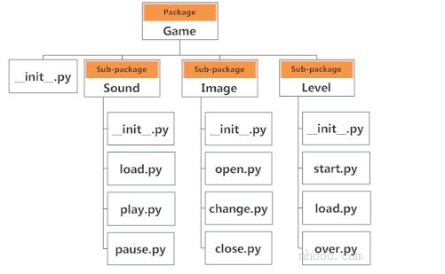

# <font style="color:rgb(51, 51, 51);">镜像源</font>
<font style="color:rgb(51, 51, 51);">清华：</font>[https://pypi.tuna.tsinghua.edu.cn/simple](https://link.zhihu.com/?target=https%3A//pypi.tuna.tsinghua.edu.cn/simple)

<font style="color:rgb(51, 51, 51);">阿里云：</font>[http://mirrors.aliyun.com/pypi/simple/](https://link.zhihu.com/?target=http%3A//mirrors.aliyun.com/pypi/simple/)

<font style="color:rgb(51, 51, 51);">中国科技大学 </font>[https://pypi.mirrors.ustc.edu.cn/simple/](https://link.zhihu.com/?target=https%3A//pypi.mirrors.ustc.edu.cn/simple/)

<font style="color:rgb(51, 51, 51);">华中科技大学：</font>[http://pypi.hustunique.com/](https://link.zhihu.com/?target=http%3A//pypi.hustunique.com/)

<font style="color:rgb(51, 51, 51);">山东理工大学：</font>[http://pypi.sdutlinux.org/](https://link.zhihu.com/?target=http%3A//pypi.sdutlinux.org/)

<font style="color:rgb(51, 51, 51);">豆瓣：</font>[http://pypi.douban.com/simple/](https://link.zhihu.com/?target=http%3A//pypi.douban.com/simple/)

<font style="color:rgb(51, 51, 51);">中科大：</font>[https://pypi.mirrors.ustc.edu.cn](https://link.zhihu.com/?target=https%3A//pypi.mirrors.ustc.edu.cn/simple/)

## <font style="color:rgb(51, 51, 51);">pip源更换</font>
### <font style="color:rgb(51, 51, 51);">1.临时换源：</font>
```python
pip install -i https://pypi.tuna.tsinghua.edu.cn/simple package_name
```

### <font style="color:rgb(51, 51, 51);">2.永久换源：</font>
```python
pip config set global.index-url https://pypi.tuna.tsinghua.edu.cn/simple
```


### <font style="color:rgb(51, 51, 51);">3.其它方法-手动添加配置文件：</font>
<font style="color:rgb(51, 51, 51);">在C:\Users\Administrator下创建一个pip文件夹，在里面创建pip.ini，并配置内容：</font>

```python
[global]
timeout = 6000
index-url = https://pypi.tuna.tsinghua.edu.cn/simple/ 
trusted-host = pypi.tuna.tsinghua.edu.cn
```


# python库学习
## <font style="color:rgb(51, 51, 51);">安装selenium</font>
pip install selenium -i  https://mirrors.aliyun.com/pypi/simple/

```python
# 这是一个示例 Python 脚本。

# 按 Shift+F10 执行或将其替换为您的代码。
# 按 双击 Shift 在所有地方搜索类、文件、工具窗口、操作和设置。
from selenium import webdriver
from selenium.webdriver.common.by import By


def print_hi(name):
    # 在下面的代码行中使用断点来调试脚本。
    print(f'Hi, {name}')  # 按 Ctrl+F8 切换断点。


# 按装订区域中的绿色按钮以运行脚本。
if __name__ == '__main__':
    print_hi('PyCharm')
    browser = webdriver.Chrome()
    browser.get("http://www.baidu.com")
    browser.find_element(By.ID, "kw").send_keys("selenium")
    browser.find_element(By.ID,"su").click()
    browser.quit()
```

## <font style="color:rgb(51, 51, 51);">安装fastapi</font>
```python
pip install fastapi -i  https://mirrors.aliyun.com/pypi/simple/
pip install "uvicorn[standard]"
```

## <font style="color:rgb(51, 51, 51);">安装sanic</font>
```python
pip install sanic -i  https://mirrors.aliyun.com/pypi/simple/ 
```

## <font style="color:rgb(51, 51, 51);">安装pysider2</font>
```python
pip install pysider2
```

基础记录

[gitee项目地址](https://gitee.com/se7enXF/pyside2)

# python基础
# 关键字
| <font style="color:rgb(51, 51, 51);">False</font> | <font style="color:rgb(51, 51, 51);">await</font> | <font style="color:rgb(51, 51, 51);">else</font> | <font style="color:rgb(51, 51, 51);">import</font> | <font style="color:rgb(51, 51, 51);">pass</font> |
| --- | --- | --- | --- | --- |
| <font style="color:rgb(51, 51, 51);">None</font> | <font style="color:rgb(51, 51, 51);">break</font> | <font style="color:rgb(51, 51, 51);">except</font> | <font style="color:rgb(51, 51, 51);">in</font> | <font style="color:rgb(51, 51, 51);">raise</font> |
| <font style="color:rgb(51, 51, 51);">True</font> | <font style="color:rgb(51, 51, 51);">class</font> | <font style="color:rgb(51, 51, 51);">finally</font> | <font style="color:rgb(51, 51, 51);">is</font> | <font style="color:rgb(51, 51, 51);">return</font> |
| <font style="color:rgb(51, 51, 51);">and</font> | <font style="color:rgb(51, 51, 51);">continue</font> | <font style="color:rgb(51, 51, 51);">for</font> | <font style="color:rgb(51, 51, 51);">lambda</font> | <font style="color:rgb(51, 51, 51);">try</font> |
| <font style="color:rgb(51, 51, 51);">as</font> | <font style="color:rgb(51, 51, 51);">def</font> | <font style="color:rgb(51, 51, 51);">from</font> | <font style="color:rgb(51, 51, 51);">nonlocal</font> | <font style="color:rgb(51, 51, 51);">while</font> |
| <font style="color:rgb(51, 51, 51);">assert</font> | <font style="color:rgb(51, 51, 51);">del</font> | <font style="color:rgb(51, 51, 51);">global</font> | <font style="color:rgb(51, 51, 51);">not</font> | <font style="color:rgb(51, 51, 51);">with</font> |
| <font style="color:rgb(51, 51, 51);">async</font> | <font style="color:rgb(51, 51, 51);">elif</font> | <font style="color:rgb(51, 51, 51);">if</font> | <font style="color:rgb(51, 51, 51);">or</font> | <font style="color:rgb(51, 51, 51);">yield</font> |


上述关键字可能会在不同版本的Python中更改。可能会添加一些额外内容或将某些内容删除。您始终可以通过以下方法来获取当前版本中的关键字列表。

```python
>>> import keyword
>>> print(keyword.kwlist)
['False', 'None', 'True', 'and', 'as', 'assert', 'async', 'await', 'break', 'class', 'continue', 'def', 'del', 'elif', 'else', 'except', 'finally',
 'for', 'from', 'global', 'if', 'import', 'in', 'is', 'lambda', 'nonlocal', 'not', 'or', 'pass', 'raise', 'return', 'try', 'while', 'with', 'yield']
```

+ `**False**`: 布尔值中的假，等同于0。
+ `**None**`: 表示空值，表示变量未定义或函数无返回值。
+ `**True**`: 布尔值中的真，等同于1。
+ `**if**`: 条件判断语句，判断条件是否成立。
+ `**else**`: 与 `if` 搭配，当条件不成立时执行。
+ `**elif**`: "else if"，表示多条件判断。
+ `**for**`: 用于遍历序列（如列表、字符串等）。
+ `**while**`: 条件循环，只要条件为真，循环执行。
+ `**break**`: 提前终止循环。
+ `**continue**`: 跳过本次循环，直接进入下一次循环。
+ `**pass**`: 空语句，占位符，什么也不做。
+ `**try**`: 用于捕获和处理异常。
+ `**except**`: 定义异常处理代码。
+ `**finally**`: 无论是否发生异常，都会执行的代码块。
+ `**raise**`: 主动抛出异常。
+ `**def**`: 定义函数。
+ `**return**`: 从函数中返回值。
+ `**class**`: 定义类。
+ `**lambda**`: 定义匿名函数。
+ `**and**`: 逻辑与运算，两个条件都为真时返回真。
+ `**or**`: 逻辑或运算，任一条件为真即返回真。
+ `**not**`: 逻辑非运算，返回布尔值的相反值。
+ `**global**`: 声明全局变量。
+ `**nonlocal**`: 声明使用外层非全局变量。
+ `**async**`: 定义异步函数。
+ `**await**`: 在协程中等待异步操作完成。
+ `**import**`在 Linux 上设置 `pip` 安装源，可以通过以下步骤进行：

### **1. 临时设置**
**如果你只想临时使用不同的安装源，可以在安装时指定 **`**-i**`** 参数。例如：**

```bash
pip install 包名 -i https://pypi.tuna.tsinghua.edu.cn/simple
```

### **2. 永久设置**
**要永久更改 **`**pip**`** 的安装源，可以编辑或创建配置文件。以下是两种常见的方法：**

#### **方法一：修改 **`**~/.pip/pip.conf**`**（用户级别配置）**
1. **打开终端，使用文本编辑器创建或编辑配置文件：**

```bash
mkdir -p ~/.pip
vi ~/.pip/pip.conf  # 或者使用其他编辑器，如 vim
```

2. **在文件中添加以下内容，设置你想要的源：**

```properties
[global]
index-url = https://pypi.tuna.tsinghua.edu.cn/simple
```

#### **方法二：修改 **`**/etc/pip.conf**`**（系统级别配置）**
1. **需要管理员权限，使用文本编辑器编辑系统级别的配置文件：**

```bash
sudo vim /etc/pip.conf
```

2. **添加相同的内容：**

```properties
[global]
index-url = https://pypi.tuna.tsinghua.edu.cn/simple
```

### **3. 常用镜像源**
**以下是一些常用的 Python 包镜像源：**

+ **清华大学：**

```plain
https://pypi.tuna.tsinghua.edu.cn/simple
```

+ **阿里云：**

```plain
https://mirrors.aliyun.com/pypi/simple/
```

+ **豆瓣：**

```plain
https://pypi.douban.com/simple/
```

### **4. 验证**
**可以通过安装一个包来验证配置是否生效：**

```bash
pip install 包名
```

**完成以上步骤后，你的 **`**pip**`** 将使用新的安装源进行包的下载。**

+ : 导入模块。
+ `**as**`: 给导入模块或异常起别名。
+ `**is**`: 判断两个对象是否为同一实例。
+ `**with**`: 上下文管理，用于资源自动管理。
+ `**assert**`: 断言，用于调试时验证条件是否成立。
+ `**del**`: 删除变量或对象引用。
+ `**yield**`: 定义生成器，每次返回一个值，并记住执行状态。

## <font style="color:rgb(51, 51, 51);">Python标识符</font>
<font style="color:rgb(51, 51, 51);">标识符是给诸如类，函数，变量等实体的名称。它有助于将一个实体与另一个实体区分开。</font>

### <font style="color:rgb(51, 51, 51);">编写标识符的规则</font>
1. <font style="color:rgb(51, 51, 51);">标识符可以是小写字母</font>**<font style="color:rgb(51, 51, 51);">（a 至 z）</font>**<font style="color:rgb(51, 51, 51);">或大写字母</font>**<font style="color:rgb(51, 51, 51);">（A 至 Z）</font>**<font style="color:rgb(51, 51, 51);">或数字</font>**<font style="color:rgb(51, 51, 51);">（0 至 9）</font>**<font style="color:rgb(51, 51, 51);">或下划线(_)的组合。myClass，var_1，var_name_1, print_this_to_screen 都是有效的。</font>
2. <font style="color:rgb(51, 51, 51);">标识符不能以数字开头。1variable 是无效的，但 variable1 是有效的。</font>
3. <font style="color:rgb(51, 51, 51);">关键字不能用作标识符。</font>

```python
>>> global = 1
File "<interactive input>", line 1
global = 1
^
SyntaxError: invalid syntax
```

4. <font style="color:rgb(51, 51, 51);">我们不能使用像</font>**<font style="color:rgb(51, 51, 51);">！</font>****<font style="color:rgb(51, 51, 51);">。</font>**<font style="color:rgb(51, 51, 51);">，</font>**<font style="color:rgb(51, 51, 51);">@</font>**<font style="color:rgb(51, 51, 51);">，</font>**<font style="color:rgb(51, 51, 51);">#</font>**<font style="color:rgb(51, 51, 51);">，</font>**<font style="color:rgb(51, 51, 51);">$</font>**<font style="color:rgb(51, 51, 51);">，</font>**<font style="color:rgb(51, 51, 51);">％</font>**<font style="color:rgb(51, 51, 51);">等这样的特殊符号。</font>

```python
>>> a@ = 0
File "<interactive input>", line 1
a@ = 0
^
SyntaxError: invalid syntax
```

5. <font style="color:rgb(51, 51, 51);">标识符可以是任意长度。</font>

### <font style="color:rgb(51, 51, 51);">要记住的事情</font>
<font style="color:rgb(51, 51, 51);">Python 是</font>**<font style="color:rgb(51, 51, 51);"> </font>****<font style="color:rgb(51, 51, 51);">区分大小写</font>****<font style="color:rgb(51, 51, 51);"> </font>**<font style="color:rgb(51, 51, 51);">的语言。这意味着 Variable 和 variable 是两个不同的变量。同时，也建议大家，在实际编程中，始终命名有意义的标识符。</font>

<font style="color:rgb(51, 51, 51);">虽然，c = 10 也是有效的。但是使用 count = 10 看起来会更有意义，并且即使您在经过一段长时间的间隔之后查看代码，也更容易弄清楚它的作用和它所代表的意义。</font>

<font style="color:rgb(51, 51, 51);">可以使用下划线分隔多个单词进行命名，例如：this_is_a_long_variable</font>

## <font style="color:rgb(51, 51, 51);">Python 语句，缩进和注释</font>
## <font style="color:rgb(51, 51, 51);">Python语句</font>
<font style="color:rgb(51, 51, 51);">Python解释器可以执行的指令称为语句。例如，a = 1 是一个赋值语句。if 语句，for 语句，while 语句等是其他种类的语句，将在后面讨论。</font>

### <font style="color:rgb(51, 51, 51);">多行语句</font>
<font style="color:rgb(51, 51, 51);">在Python中，语句的结尾用换行符标记。但是我们可以使一条语句扩展到具有多行连续字符（\）的多行。例如：</font>

```python
a = 1 + 2 + 3 + \
4 + 5 + 6 + \
7 + 8 + 9
```

<font style="color:rgb(51, 51, 51);">这是显式的行继续。在Python中，在圆括号()，方括号[]和花括号{}中暗含换行符。例如，我们可以将上述多行语句实现为</font>

```python
a = (1 + 2 + 3 +
     4 + 5 + 6 +
     7 + 8 + 9)
```

<font style="color:rgb(51, 51, 51);">在此，周围的括号()隐式地进行了行连续。[]和{}也是如此。例如：</font>

```python
colors = ['red',
          'blue',
          'green']
```

<font style="color:rgb(51, 51, 51);">我们还可以使用分号将多个语句放在一行中，如下所示</font>

a = 1; b = 2; c = 3

## <font style="color:rgb(51, 51, 51);">Python缩进</font>
<font style="color:rgb(51, 51, 51);">大多数编程语言（例如C，C ++，Java）都使用大括号{}来定义代码块。</font>**<font style="color:rgb(51, 51, 51);">而Python使用缩进</font>**<font style="color:rgb(51, 51, 51);">。</font>

<font style="color:rgb(51, 51, 51);">代码块（</font>[<font style="color:rgb(51, 51, 51);">函数的</font>](https://www.cainiaoplus.com/python/python-function.html)<font style="color:rgb(51, 51, 51);">主体，</font>[<font style="color:rgb(51, 51, 51);">循环的</font>](https://www.cainiaoplus.com/python/python-for-loop.html)<font style="color:rgb(51, 51, 51);">主体等）以缩进开始，以第一条未缩进的行结束。缩进量取决于您，但是在整个块中缩进量必须保持一致。</font>

<font style="color:rgb(51, 51, 51);">通常，四个空格用于缩进，并且优先于制表符。下面是一个示例。</font>

<font style="color:rgb(51, 51, 51);">Python中缩进的实现使代码看起来整洁干净。这导致看起来相似且一致的Python程序。</font>

<font style="color:rgb(51, 51, 51);">缩进可以在连续行中忽略。始终缩进是个好习惯。它使代码更具可读性。例如：</font>

```python
if True:
    print('Hello')
    a = 5
```

<font style="color:rgb(51, 51, 51);">和</font>

if True: print('Hello'); a = 5

<font style="color:rgb(51, 51, 51);">两者都是有效的并且做同样的事情。但是前一种风格更加清晰。</font>

<font style="color:rgb(51, 51, 51);">缩进不正确将导致IndentationError。</font>

## <font style="color:rgb(51, 51, 51);">Python注释</font>
<font style="color:rgb(51, 51, 51);">编写程序时，注释非常重要。它描述了程序内部正在发生的事情，这样，查看源代码的人就不会很费解。您可能会忘记一个月前刚编写的程序的关键细节。因此，花时间以注释的形式解释这些概念总是很有意义的。</font>

<font style="color:rgb(51, 51, 51);">在Python中，我们使用井号（#）开始编写注释。</font>

<font style="color:rgb(51, 51, 51);">它扩展到换行符。注释供程序员使用，以更好地理解程序。Python解释器忽略注释。 </font>

```python
#这个一个注释
#打印输出 Hello
print('Hello')
```

### <font style="color:rgb(51, 51, 51);">多行注释</font>
<font style="color:rgb(51, 51, 51);">如果我们有扩展多行的注释，一种方法是在每行的开头使用哈希（#）。例如：</font>

```python
#这是一个长注释
#它延伸
#到多行
```

<font style="color:rgb(51, 51, 51);">这样做的另一种方法是使用三引号，''' 或者 """。</font>

<font style="color:rgb(51, 51, 51);">这些三引号通常用于多行字符串。但是它们也可以用作多行注释。除非它们不是文档字符串，否则它们不会生成任何额外的代码。</font>

```python
"""这也是一个
完美的示例
多行注释"""
```

### <font style="color:rgb(51, 51, 51);">Python中的文档字符串</font>
<font style="color:rgb(51, 51, 51);">Docstring是文档字符串的缩写。</font>

<font style="color:rgb(51, 51, 51);">它是一个</font>[<font style="color:rgb(51, 51, 51);">字符串</font>](https://www.cainiaoplus.com/python/python-string.html)<font style="color:rgb(51, 51, 51);">，作为模块，函数，类或方法定义中的第一条语句出现。我们必须在文档字符串中写出函数/类的作用。</font>

<font style="color:rgb(51, 51, 51);">编写文档字符串时使用三引号。例如：</font>

```python
def double(num):
    """函数使值翻倍"""
    return 2*num
```

<font style="color:rgb(51, 51, 51);">Docstring作为__doc__函数的属性可供我们使用。运行上面的程序后，在shell中发出以下代码。                                                                                                              </font>

```python
def double(num):
    """函数使值翻倍"""
    return 2*num
print(double.__doc__)
```

<font style="color:rgb(51, 51, 51);">输出:</font>

函数使值翻倍

# <font style="color:rgb(51, 51, 51);">Python中的数据类型</font>
<font style="color:rgb(51, 51, 51);">Python中的每个值都有一个数据类型。由于在Python编程中一切都是对象，因此数据类型实际上是类，而变量是这些类的示例（对象）。</font>

<font style="color:rgb(51, 51, 51);">Python中有多种数据类型。下面列出了一些重要的类型。</font>

## <font style="color:rgb(51, 51, 51);">Python 数字(Number)</font>
<font style="color:rgb(51, 51, 51);">整数、浮点数和复数都属于Python数字的范畴。在Python中，它们被定义为 int、float 和 complex类。</font>

<font style="color:rgb(51, 51, 51);">我们可以使用type()函数来判断一个变量或值属于哪个类。同样地，isinstance() 函数用于检查对象是否属于特定的类。</font>

```python
a = 5
print(a, "的类型是  ", type(a))

a = 2.0
print(a, "的类型是  ", type(a))

a = 1+2j
print(a, "是复数吗?", isinstance(1+2j,complex))
```

**<font style="color:rgb(51, 51, 51);">输出量</font>**

```python
5 的类型是  <class 'int'>
2.0 的类型是  <class 'float'>
(1+2j) 是复数吗? True
```

<font style="color:rgb(51, 51, 51);">整数可以是任意长度，但受可用内存的限制。</font>

<font style="color:rgb(51, 51, 51);">浮点数最多可精确到 15 个小数位。整数 和 浮点由小数点分隔。1 是整数，1.0 是浮点数。</font>

<font style="color:rgb(51, 51, 51);">复数以  x + yj 形式书写，其中</font><font style="color:rgb(51, 51, 51);">x</font><font style="color:rgb(51, 51, 51);">是实部，</font><font style="color:rgb(51, 51, 51);">y</font><font style="color:rgb(51, 51, 51);">是虚部。这里有些示例。</font>

```python
>>> a = 1234567890123456789
>>> a
1234567890123456789
>>> b = 0.1234567890123456789
>>> b
0.12345678901234568
>>> c = 1+2j
>>> c
(1+2j)
```

<font style="color:rgb(51, 51, 51);">注意，float变量</font><font style="color:rgb(51, 51, 51);">b</font><font style="color:rgb(51, 51, 51);">被截断了。</font>

## <font style="color:rgb(51, 51, 51);">Python 列表(List)  
</font>
[<font style="color:rgb(51, 51, 51);">列表</font>](https://www.cainiaoplus.com/python/python-list.html)<font style="color:rgb(51, 51, 51);">是项目的有序序列。它是Python中最常用的数据类型之一，非常灵活。列表中的项目允许不是同一类型。</font>

<font style="color:rgb(51, 51, 51);">声明列表非常简单。用逗号分隔的项目放在方括号内[ ]。</font>

a = [1, 2.2, 'python']

<font style="color:rgb(51, 51, 51);">我们可以使用切片运算符 [ ] 从列表中提取一个项目 或 一系列项目。注意，在Python中，索引从 0 开始。</font>

```python
a = [5,10,15,20,25,30,35,40]

# a[2] = 15
print("a[2] = ", a[2])

# a[0:3] = [5, 10, 15]
print("a[0:3] = ", a[0:3])

# a[5:] = [30, 35, 40]
print("a[5:] = ", a[5:])
```

**<font style="color:rgb(51, 51, 51);">输出量</font>**

```python
a[2] =  15
a[0:3] =  [5, 10, 15]
a[5:] =  [30, 35, 40]
```

<font style="color:rgb(51, 51, 51);">列表是可变的，也就是说，列表元素的值可以更改。</font>

```python
a = [1, 2, 3]
a[2] = 4
print(a)
```

**<font style="color:rgb(51, 51, 51);">输出量</font>**

```python
[1, 2, 4]
```

## <font style="color:rgb(51, 51, 51);">Python 元组(Tuple)</font>
[<font style="color:rgb(51, 51, 51);">元组</font>](https://www.cainiaoplus.com/python/python-tuple.html)<font style="color:rgb(51, 51, 51);">(Tuple)是项目的有序序列，与列表(List)相同。唯一的区别是元组是</font>**<font style="color:rgb(51, 51, 51);">不可变</font>**<font style="color:rgb(51, 51, 51);">的。元组一旦创建就不能修改。</font>

<font style="color:rgb(51, 51, 51);">元组用于写保护数据，通常比列表快，因为它们不能动态更改。</font>

<font style="color:rgb(51, 51, 51);">它在括号内 () 定义，其中各项之间用逗号分隔。</font>

t = (5,'program', 1+3j)

<font style="color:rgb(51, 51, 51);">我们可以使用切片运算符 [] 提取项目，但不能更改其值。</font>

```python
t = (5,'program', 1+3j)

# t[1] = 'program'
print("t[1] = ", t[1])

# t[0:3] = (5, 'program', (1+3j))
print("t[0:3] = ", t[0:3])

#产生错误
#元组是不可变的
t[0] = 10
```

**<font style="color:rgb(51, 51, 51);">输出量</font>**

```python
t[1] =  program
t[0:3] =  (5, 'program', (1+3j))
Traceback (most recent call last):
File "test.py", line 11, in <module>
t[0] = 10
TypeError: 'tuple' object does not support item assignment
```

## <font style="color:rgb(51, 51, 51);">Python 字符串</font>
[<font style="color:rgb(51, 51, 51);">字符串</font>](https://www.cainiaoplus.com/python/python-string.html)<font style="color:rgb(51, 51, 51);">是Unicode字符的序列。我们可以使用单引号或双引号来表示字符串。可以使用三引号 ''' 或 """ 来表示多行字符串。</font>

```python
s = "This is a string"
print(s)
s = '''A multiline
string'''
print(s)
```

**<font style="color:rgb(51, 51, 51);">输出量</font>**

```python
This is a string
A multiline
string
```

<font style="color:rgb(51, 51, 51);">就像列表和元组一样，切片运算符 [ ] 可以与字符串一起使用。但是，字符串是不可变的。</font>

```python
s = 'Hello world!'

# s[4] = 'o'
print("s[4] = ", s[4])

# s[6:11] = 'world'
print("s[6:11] = ", s[6:11])

#发生错误
#字符串在Python中是不可变的
s[5] ='d'
```

**<font style="color:rgb(51, 51, 51);">输出量</font>**

```python
s[4] =  o
s[6:11] =  world
Traceback (most recent call last):
File "<string>", line 11, in <module>
TypeError: 'str' object does not support item assignment
```

## <font style="color:rgb(51, 51, 51);">Python 集合(Set)</font>
[<font style="color:rgb(51, 51, 51);">Set</font>](https://www.cainiaoplus.com/python/python-set.html)<font style="color:rgb(51, 51, 51);"> </font><font style="color:rgb(51, 51, 51);">是唯一项的无序集合。Set 由用大括号 { } 括起来，并由逗号分隔的值的集合。集合中的项目是无序的。</font>

```python
a = {5,2,3,1,4}

# 输出set集变量
print("a = ", a)

# 输出a的数据类型
print(type(a))
```

**<font style="color:rgb(51, 51, 51);">输出量</font>**

```python
a =  {1, 2, 3, 4, 5}
<class 'set'>
```

<font style="color:rgb(51, 51, 51);">我们可以在两个集合上执行集合操作，例如 并集，交集。集具有唯一值。他们消除重复。</font>

```python
a = {1,2,2,3,3,3}
print(a)
```

**<font style="color:rgb(51, 51, 51);">输出量</font>**

{1, 2, 3}

<font style="color:rgb(51, 51, 51);">由于 set 是无序集合，因此索引没有意义。因此，切片运算符 [] 不起作用。</font>

```python
>>> a = {1,2,3}
>>> a[1]
Traceback (most recent call last):
File "<string>", line 301, in runcode
File "<interactive input>", line 1, in <module>
TypeError: 'set' object does not support indexing
```

## <font style="color:rgb(51, 51, 51);">Python字典</font>
[<font style="color:rgb(51, 51, 51);">字典</font>](https://www.cainiaoplus.com/python/python-dictionary.html)<font style="color:rgb(51, 51, 51);">是 键值对 的无序集合。</font>

<font style="color:rgb(51, 51, 51);">当我们拥有大量数据时，通常使用它。字典针对检索数据进行了优化。我们必须知道检索值的密钥。</font>

<font style="color:rgb(51, 51, 51);">在Python中，大括号 {} 内定义了字典，每一项都是形式为 key:value 。键 和 值 可以是任何类型。</font>

```python
>>> d = {1:'value','key':2}
>>> type(d)
<class 'dict'>
```

<font style="color:rgb(51, 51, 51);">我们可以使用键来检索相应的值。</font>

```python
d = {1:'value','key':2}
print(type(d))

print("d[1] = ", d[1]);

print("d['key'] = ", d['key']);

#产生错误
print("d[2] = ", d[2]);
```

**<font style="color:rgb(51, 51, 51);">输出量</font>**

```python
<class 'dict'>
d[1] =  value
d['key'] =  2
Traceback (most recent call last):
File "<string>", line 9, in <module>
KeyError: 2
```

## <font style="color:rgb(51, 51, 51);">数据类型转换</font>
<font style="color:rgb(51, 51, 51);">我们可以通过使用不同类型的转换功能，例如不同的数据类型之间进行转换 int()，float()，str() 等。</font>

```python
>>> float(5)
5.0
```

<font style="color:rgb(51, 51, 51);">从float 到 int的转换将截断该值（使其接近零）。</font>

```python
>>> int(10.6)
10
>>> int(-10.6)
-10
```

<font style="color:rgb(51, 51, 51);">字符串之间的转换必须包含兼容的值。</font>

```python
>>> float('2.5')
2.5
>>> str(25)
'25'
>>> int('1p')
Traceback (most recent call last):
File "<string>", line 301, in runcode
File "<interactive input>", line 1, in <module>
ValueError: invalid literal for int() with base 10: '1p'
```

<font style="color:rgb(51, 51, 51);">我们甚至可以将一个序列转换为另一序列。</font>

```python
>>> set([1,2,3])
{1, 2, 3}
>>> tuple({5,6,7})
(5, 6, 7)
>>> list('hello')
['h', 'e', 'l', 'l', 'o']
```

<font style="color:rgb(51, 51, 51);">要转换为字典，每个元素必须成对：</font>

```python
>>> dict([[1,2],[3,4]])
{1: 2, 3: 4}
>>> dict([(3,26),(4,44)])
{3: 26, 4: 44}
```

# <font style="color:rgb(51, 51, 51);">Python 类型转换</font>
## <font style="color:rgb(51, 51, 51);">类型转换</font>
<font style="color:rgb(51, 51, 51);">将一种数据类型（整数，字符串，浮点数等）的值转换为另一种数据类型的过程称为类型转换。Python有两种类型的类型转换。</font>

1. <font style="color:rgb(51, 51, 51);">隐式类型转换</font>
2. <font style="color:rgb(51, 51, 51);">显式类型转换</font>

## <font style="color:rgb(51, 51, 51);">隐式类型转换</font>
<font style="color:rgb(51, 51, 51);">在隐式类型转换中，Python自动将一种数据类型转换为另一种数据类型。此过程不需要任何用户参与。</font>

<font style="color:rgb(51, 51, 51);">让我们看一个示例，其中Python促进将较低数据类型（整数）转换为较高数据类型（浮点数）以避免数据丢失。</font>

### <font style="color:rgb(51, 51, 51);">示例1：将整数转换为浮点型</font>
**<font style="color:rgb(51, 51, 51);background-color:rgb(239, 239, 239);">示例</font>**

```python
num_int = 123
num_flo = 1.23

num_new = num_int + num_flo

print("num_int的数据类型:",type(num_int))
print("num_flo的数据类型:",type(num_flo))

print("num_new的值:",num_new)
print("num_new的数据类型:",type(num_new))
```

<font style="color:rgb(51, 51, 51);">当我们运行上面的程序时，输出将是：</font>

```python
num_int的数据类型: <class 'int'>
num_flo的数据类型: <class 'float'>

num_new的值: 124.23
num_new的数据类型: <class 'float'>
```

<font style="color:rgb(51, 51, 51);">在上面的程序中</font>

+ <font style="color:rgb(51, 51, 51);">我们将两个变量</font><font style="color:rgb(51, 51, 51);">num_int</font><font style="color:rgb(51, 51, 51);">和</font><font style="color:rgb(51, 51, 51);">num_flo 相加</font><font style="color:rgb(51, 51, 51);">，并将值存储在变量</font><font style="color:rgb(51, 51, 51);">num_new 中</font><font style="color:rgb(51, 51, 51);">。</font>
+ <font style="color:rgb(51, 51, 51);">我们分别查看所有三个对象的数据类型。</font>
+ <font style="color:rgb(51, 51, 51);">在输出中，我们可以看到</font><font style="color:rgb(51, 51, 51);">num_int</font><font style="color:rgb(51, 51, 51);">的数据类型是 integer，</font><font style="color:rgb(51, 51, 51);">num_flo</font><font style="color:rgb(51, 51, 51);">的数据类型是一个float。</font>
+ <font style="color:rgb(51, 51, 51);">另外，我们可以看到</font><font style="color:rgb(51, 51, 51);">num_new</font><font style="color:rgb(51, 51, 51);">具有float数据类型，因为 Python 总是将较小的数据类型转换为较大的数据类型，以避免数据丢失。</font>

<font style="color:rgb(51, 51, 51);">现在，让我们尝试 一个字符串 和 一个整数 相加，并查看Python如何处理它。</font>

### <font style="color:rgb(51, 51, 51);">示例2：字符串（较高）数据类型和整数（较低）数据类型的加法</font>
**<font style="color:rgb(51, 51, 51);background-color:rgb(239, 239, 239);">示例</font>**

```python
num_int = 123
num_str = "456"

print("num_int的数据类型:",type(num_int))
print("num_str的数据类型:",type(num_str))

print(num_int+num_str)
```

<font style="color:rgb(51, 51, 51);">当我们运行上面的程序时，输出将是：</font>

```python
num_int的数据类型: <class 'int'>
num_str的数据类型: <class 'str'>

Traceback (most recent call last): 
File "python", line 7, in <module> 
TypeError: unsupported operand type(s) for +: 'int' and 'str'
```

<font style="color:rgb(51, 51, 51);">在上面的程序中</font>

+ <font style="color:rgb(51, 51, 51);">我们两个变量</font><font style="color:rgb(51, 51, 51);">num_int 和</font><font style="color:rgb(51, 51, 51);">num_str</font><font style="color:rgb(51, 51, 51);">相加。</font>
+ <font style="color:rgb(51, 51, 51);">从输出中可以看到，我们得到了 TypeError。在这种情况下，Python无法使用隐式转换。</font>
+ <font style="color:rgb(51, 51, 51);">但是，Python针对此类情况提供了一种解决方案，称为“</font>**<font style="color:rgb(51, 51, 51);">显式转换</font>**<font style="color:rgb(51, 51, 51);">”。</font>

## <font style="color:rgb(51, 51, 51);">显式类型转换</font>
<font style="color:rgb(51, 51, 51);">在“</font>**<font style="color:rgb(51, 51, 51);">显式类型转换</font>**<font style="color:rgb(51, 51, 51);">”中，用户将对象的数据类型转换为所需的数据类型。我们使用像预定义函数 int()，float()，str()等进行显式类型转换。</font>

<font style="color:rgb(51, 51, 51);">这种转换类型也称为类型转换，因为用户强制转换（更改）对象的数据类型。</font>

<font style="color:rgb(51, 51, 51);">语法 ：</font>

<required_datatype>(expression)

<font style="color:rgb(51, 51, 51);">可以通过将所需的数据类型函数分配给表达式来完成类型转换。</font>

### <font style="color:rgb(51, 51, 51);">示例3：使用显式转换将字符串和整数相加</font>
**<font style="color:rgb(51, 51, 51);background-color:rgb(239, 239, 239);">示例</font>**

```python
num_int = 123
num_str = "456"

print("num_int的数据类型:",type(num_int))
print("类型转换之前num str的数据类型:",type(num_str))

num_str = int(num_str)
print("类型转换后的num str的数据类型:",type(num_str))

num_sum = num_int + num_str

print("num_int与num_str的和:",num_sum)
print("sum的数据类型:",type(num_sum))
```

<font style="color:rgb(51, 51, 51);">当我们运行上面的程序时，输出将是：</font>

```python
num_int的数据类型: <class 'int'>

类型转换之前num str的数据类型: <class 'str'>
类型转换后的num str的数据类型: <class 'int'>

num_int与num_str的和: 579
sum的数据类型: <class 'int'>
```

<font style="color:rgb(51, 51, 51);">在上面的程序中</font>

+ <font style="color:rgb(51, 51, 51);">我们</font><font style="color:rgb(51, 51, 51);">num_str</font><font style="color:rgb(51, 51, 51);">和</font><font style="color:rgb(51, 51, 51);">num_int</font><font style="color:rgb(51, 51, 51);">变量相加。</font>
+ <font style="color:rgb(51, 51, 51);">我们使用 int() 函数将</font><font style="color:rgb(51, 51, 51);">num_str</font><font style="color:rgb(51, 51, 51);">从 string（高）转换为 integer（低）类型来执行加法。</font>
+ <font style="color:rgb(51, 51, 51);">将</font><font style="color:rgb(51, 51, 51);">num_str</font><font style="color:rgb(51, 51, 51);">转换为整数后，Python可以对这两个变量进行相加。</font>
+ <font style="color:rgb(51, 51, 51);">最后，我们得到</font><font style="color:rgb(51, 51, 51);">num_sum</font><font style="color:rgb(51, 51, 51);">值 和 以及该值得数据类型为整数。</font>

## <font style="color:rgb(51, 51, 51);">要记住的要点</font>
1. <font style="color:rgb(51, 51, 51);">类型转换是对象从一种数据类型到另一种数据类型的转换。</font>
2. <font style="color:rgb(51, 51, 51);">隐式类型转换由Python解释器自动执行。</font>
3. <font style="color:rgb(51, 51, 51);">Python避免了隐式类型转换中的数据丢失。</font>
4. <font style="color:rgb(51, 51, 51);">显式类型转换也称为类型转换，用户使用预定义的函数转换对象的数据类型。</font>
5. <font style="color:rgb(51, 51, 51);">在类型转换中，当我们将对象强制为特定数据类型时，可能会发生数据丢失。</font>

# <font style="color:rgb(51, 51, 51);">Python 输入,输出和导入</font>
<font style="color:rgb(51, 51, 51);">Python提供了许多</font>[<font style="color:rgb(51, 51, 51);">内置函数</font>](https://www.cainiaoplus.com/python/python-methods-built-in.html)<font style="color:rgb(51, 51, 51);">，这些函数可以在Python提示符下随时使用。</font>

<font style="color:rgb(51, 51, 51);">内置的函数例如 input() 和 print() 分别广泛用于标准输入和输出操作。让我们首先查看输出部分。</font>

## <font style="color:rgb(51, 51, 51);">Python使用print()函数输出  
</font>
<font style="color:rgb(51, 51, 51);">我们使用 print()函数将数据输出到标准输出设备（屏幕）。我们也可以将</font>[<font style="color:rgb(51, 51, 51);">数据输出到文件中</font>](https://www.cainiaoplus.com/python/python-file-operation.html)<font style="color:rgb(51, 51, 51);">，这将在后面讨论。</font>

<font style="color:rgb(51, 51, 51);">下面给出了其用法示例。</font>

**<font style="color:rgb(51, 51, 51);background-color:rgb(239, 239, 239);">示例</font>**<font style="color:rgb(51, 51, 51);background-color:rgb(239, 239, 239);">print('这句话输出到屏幕')</font>

**<font style="color:rgb(51, 51, 51);">输出量</font>**

这句话输出到屏幕

<font style="color:rgb(51, 51, 51);">下面给出另一个示例：</font>

**<font style="color:rgb(51, 51, 51);background-color:rgb(239, 239, 239);">示例</font>**

```python
a = 5
print('a的值为', a)
```

**<font style="color:rgb(51, 51, 51);">输出量</font>**

a的值为5

<font style="color:rgb(51, 51, 51);">在第二个print()语句中，我们可以注意到在</font>[<font style="color:rgb(51, 51, 51);">字符串</font>](https://www.cainiaoplus.com/python/python-string.html)<font style="color:rgb(51, 51, 51);">和变量</font><font style="color:rgb(51, 51, 51);">a</font><font style="color:rgb(51, 51, 51);">的值之间添加了</font>[<font style="color:rgb(51, 51, 51);">空格</font>](https://www.cainiaoplus.com/python/python-s.html)<font style="color:rgb(51, 51, 51);">。这是默认设置，但是我们可以更改它。</font>

<font style="color:rgb(51, 51, 51);">print()函数的实际语法为：</font>

print(*objects, sep=' ', end='\n', file=sys.stdout, flush=False)

<font style="color:rgb(51, 51, 51);">此处objects是要打印的值。</font>

<font style="color:rgb(51, 51, 51);">sep是值之间的分隔符。默认为空格字符。</font>

<font style="color:rgb(51, 51, 51);">在打印所有值之后，end 将被打印。默认为新行。</font>

<font style="color:rgb(51, 51, 51);">file 是打印值的对象，其默认值为 sys.stdout（屏幕）。 这是一个示例来说明这一点。</font>

**<font style="color:rgb(51, 51, 51);background-color:rgb(239, 239, 239);">示例</font>**

```python
print(1, 2, 3, 4)
print(1, 2, 3, 4, sep='*')
print(1, 2, 3, 4, sep='#', end='&')
```

**<font style="color:rgb(51, 51, 51);">输出量</font>**

```python
1 2 3 4
1*2*3*4
1#2#3#4&
```

## <font style="color:rgb(51, 51, 51);">输出格式</font>
<font style="color:rgb(51, 51, 51);">有时我们想格式化输出，使其看起来更方便阅读查看。这可以通过使用 str.format() 方法来完成。该方法对任何字符串对象都是可见的。</font>

```python
>>> x = 5; y = 10
>>> print('x的值为{}，y的值为{}'.format(x,y))
x的值为5，y的值为10
```

<font style="color:rgb(51, 51, 51);">在这里，花括号{}用作占位符。我们可以使用数字（元组索引）指定它们的打印顺序。</font>

**<font style="color:rgb(51, 51, 51);background-color:rgb(239, 239, 239);">示例</font>**

```python
print('I love {0} and {1}'.format('bread','butter'))
print('I love {1} and {0}'.format('bread','butter'))
```

**<font style="color:rgb(51, 51, 51);">输出量</font>**

```python
I love bread and butter
I love butter and bread
```

<font style="color:rgb(51, 51, 51);">我们甚至可以使用关键字参数来格式化字符串。</font>

```python
>>> print('Hello {name}, {greeting}'.format(greeting = 'Goodmorning', name = 'John'))
Hello John, Goodmorning
```

<font style="color:rgb(51, 51, 51);">我们还可以像在C编程语言中使用 sprintf() 的旧样式一样格式化字符串。我们使用 % 运算符来完成此任务。</font>

```python
>>> x = 12.3456789
>>> print('x的值为 %3.2f' %x)
x的值为 12.35
>>> print('x的值为 %3.4f' %x)
x的值为 12.3457
```

## <font style="color:rgb(51, 51, 51);">Python输入</font>
<font style="color:rgb(51, 51, 51);">到目前为止，我们的程序是静态的。变量的值已定义或硬编码到源代码中。</font>

<font style="color:rgb(51, 51, 51);">为了提供灵活性，我们可能希望从用户那里获取输入。在Python中，我们具有input()允许此功能的功能。的语法为input()：</font>

input([prompt])

<font style="color:rgb(51, 51, 51);">prompt我们希望在屏幕上显示的字符串在哪里。它是可选的。</font>

```python
>>> num = input('Enter a number: ')
Enter a number: 10
>>> num
'10'
```

<font style="color:rgb(51, 51, 51);">在这里，我们可以看到输入的值10是一个字符串，而不是数字。要将其转换为数字，我们可以使用int()或float()函数。</font>

```python
>>> int('10')
10
>>> float('10')
10.0
```

<font style="color:rgb(51, 51, 51);">使用该eval()功能可以执行相同的操作。但是要eval进一步。如果输入是字符串，它甚至可以计算表达式</font>

```python
>>> int('2+3')
Traceback (most recent call last):
File "", line 301, in runcode
File "", line 1, inValueError: invalid literal for int() with base 10: '2+3'
>>> eval('2+3')
5
```

## <font style="color:rgb(51, 51, 51);">Python 导入(import)</font>
<font style="color:rgb(51, 51, 51);">当我们的程序变得更大时，将其分解为不同的模块是一个好主意。</font>

<font style="color:rgb(51, 51, 51);">模块是包含Python定义和语句的文件。</font>[<font style="color:rgb(51, 51, 51);">Python模块</font>](https://www.cainiaoplus.com/python/python-modules.html)<font style="color:rgb(51, 51, 51);">具有文件名，并以扩展名 .py 结尾。</font>

<font style="color:rgb(51, 51, 51);">可以将模块内部的定义导入另一个模块 或 Python中的交互式解释器。我们使用</font><font style="color:rgb(51, 51, 51);"> </font>**<font style="color:rgb(51, 51, 51);">import</font>****<font style="color:rgb(51, 51, 51);"> </font>**<font style="color:rgb(51, 51, 51);">关键字来做到这一点。</font>

<font style="color:rgb(51, 51, 51);">例如，我们可以通过输入以下行来导入模块 math：</font>

import math

<font style="color:rgb(51, 51, 51);">我们可以通过以下方式使用该模块：</font>

**<font style="color:rgb(51, 51, 51);background-color:rgb(239, 239, 239);">示例</font>**

```python
import math
print(math.pi)
```

**<font style="color:rgb(51, 51, 51);">输出量</font>**

3.141592653589793

<font style="color:rgb(51, 51, 51);">现在，math模块内的所有定义都可以在我们的范围内使用。我们还可以使用from关键字仅导入一些特定的属性和函数。例如：</font>

```python
>>> from math import pi
>>> pi
3.141592653589793
```

<font style="color:rgb(51, 51, 51);">导入模块时，Python 中使用sys.path会查看中定义的多个位置。它是目录位置的列表。</font>

```python
>>> import sys
>>> sys.path
['', 
 'C:\\Python33\\Lib\\idlelib', 
 'C:\\Windows\\system32\\python33.zip', 
 'C:\\Python33\\DLLs', 
 'C:\\Python33\\lib', 
 'C:\\Python33', 
 'C:\\Python33\\lib\\site-packages']
```

<font style="color:rgb(51, 51, 51);">我们也可以将自己的位置添加到此列表中。</font>

# <font style="color:rgb(51, 51, 51);">Python 运算符</font>
## <font style="color:rgb(51, 51, 51);">python中的运算符是什么？</font>
<font style="color:rgb(51, 51, 51);">运算符是Python中执行算术或逻辑计算的特殊符号。运算符所操作的值称为操作数。</font>

<font style="color:rgb(51, 51, 51);">例如：</font>

```python
>>> 2+3
5
```

<font style="color:rgb(51, 51, 51);">在这里，+是执行加法的运算符。2和3是操作数，5是操作的输出。</font>

<font style="color:rgb(51, 51, 51);">  
</font><font style="color:rgb(51, 51, 51);"> </font>

## <font style="color:rgb(51, 51, 51);">算术运算符</font>
<font style="color:rgb(51, 51, 51);">算术运算符用于执行数学运算，例如加法，减法，乘法等。</font>

| <font style="color:rgb(254, 254, 254);">操作符</font> | <font style="color:rgb(254, 254, 254);">含义</font> | <font style="color:rgb(254, 254, 254);">例</font> |
| --- | --- | --- |
| <font style="color:rgb(51, 51, 51);">+</font> | <font style="color:rgb(51, 51, 51);">加 - 两个操作数相加或一元加</font> | <font style="color:rgb(51, 51, 51);">x + y + 2</font> |
| <font style="color:rgb(51, 51, 51);">-</font> | <font style="color:rgb(51, 51, 51);">减 - 从左侧或一元减号，减去右侧操作数</font> | <font style="color:rgb(51, 51, 51);">x-y- 2</font> |
| <font style="color:rgb(51, 51, 51);">*</font> | <font style="color:rgb(51, 51, 51);">乘 -将两个操作数相乘</font> | <font style="color:rgb(51, 51, 51);">x * y</font> |
| <font style="color:rgb(51, 51, 51);">/</font> | <font style="color:rgb(51, 51, 51);">除 - 将左边操作数除以右边操作数（结果总是为float）</font> | <font style="color:rgb(51, 51, 51);">x / y</font> |
| <font style="color:rgb(51, 51, 51);">%</font> | <font style="color:rgb(51, 51, 51);">求模 -左操作数除以右操作数的余数</font> | <font style="color:rgb(51, 51, 51);">x％y（x / y的余数）</font> |
| <font style="color:rgb(51, 51, 51);">//</font> | <font style="color:rgb(51, 51, 51);">取整除 - 返回商的整数部分（向下取整）</font> | <font style="color:rgb(51, 51, 51);">x // y</font> |
| <font style="color:rgb(51, 51, 51);">**</font> | <font style="color:rgb(51, 51, 51);">幂 - 返回x的y次幂</font> | <font style="color:rgb(51, 51, 51);">x ** y（x的y次幂）</font> |


### <font style="color:rgb(51, 51, 51);">示例1：Python中的算术运算符</font>
**<font style="color:rgb(51, 51, 51);background-color:rgb(239, 239, 239);">示例</font>**

```python
x = 15
y = 4

# 输出: x + y = 19
print('x + y =',x+y)

# 输出: x - y = 11
print('x - y =',x-y)

# 输出: x * y = 60
print('x * y =',x*y)

# 输出: x / y = 3.75
print('x / y =',x/y)

# 输出: x // y = 3
print('x // y =',x//y)

# 输出: x ** y = 50625
print('x ** y =',x**y)
```

<font style="color:rgb(51, 51, 51);">运行该程序时，输出为：</font>

```python
x + y = 19
x - y = 11
x * y = 60
x / y = 3.75
x // y = 3
x ** y = 50625
```

## <font style="color:rgb(51, 51, 51);">比较运算符</font>
<font style="color:rgb(51, 51, 51);">比较运算符用于比较值。它返回True或False根据条件返回。</font>

| <font style="color:rgb(254, 254, 254);">操作符</font> | <font style="color:rgb(254, 254, 254);">含义</font> | <font style="color:rgb(254, 254, 254);">例</font> |
| --- | --- | --- |
| <font style="color:rgb(51, 51, 51);">></font> | <font style="color:rgb(51, 51, 51);">大于-如果左操作数大于右操作数，则为True</font> | <font style="color:rgb(51, 51, 51);">x> y</font> |
| <font style="color:rgb(51, 51, 51);"><</font> | <font style="color:rgb(51, 51, 51);">小于-如果左操作数小于右操作数，则为True</font> | <font style="color:rgb(51, 51, 51);">x <y</font> |
| <font style="color:rgb(51, 51, 51);">==</font> | <font style="color:rgb(51, 51, 51);">等于-如果两个操作数相等，则为True</font> | <font style="color:rgb(51, 51, 51);">x == y</font> |
| <font style="color:rgb(51, 51, 51);">!=</font> | <font style="color:rgb(51, 51, 51);">不等于-如果操作数不相等则为True</font> | <font style="color:rgb(51, 51, 51);">x！= y</font> |
| <font style="color:rgb(51, 51, 51);">>=</font> | <font style="color:rgb(51, 51, 51);">大于或等于-如果左操作数大于或等于右，则为True</font> | <font style="color:rgb(51, 51, 51);">x> = y</font> |
| <font style="color:rgb(51, 51, 51);"><=</font> | <font style="color:rgb(51, 51, 51);">小于或等于-如果左操作数小于或等于右，则为True</font> | <font style="color:rgb(51, 51, 51);">x <= y</font> |


### <font style="color:rgb(51, 51, 51);">示例2：Python中的比较运算符</font>
**<font style="color:rgb(51, 51, 51);background-color:rgb(239, 239, 239);">示例</font>**

```python
x = 10
y = 12

# 输出: x > y 是 False
print('x > y 是 ',x>y)

# 输出: x < y 是 True
print('x < y 是 ',x<y)

# 输出: x == y 是 False
print('x == y 是 ',x==y)

# 输出: x != y 是 True
print('x != y 是 ',x!=y)

# 输出: x >= y 是 False
print('x >= y 是 ',x>=y)

# 输出: x <= y 是 True
print('x <= y 是 ',x<=y)
```

**<font style="color:rgb(51, 51, 51);">输出结果</font>**

```python
x > y 是 False
x < y 是 True
x == y 是 False
x != y 是 True
x >= y 是 False
x <= y 是 True
```

## <font style="color:rgb(51, 51, 51);">逻辑运算符</font>
<font style="color:rgb(51, 51, 51);">逻辑运算符是and，or，not运营商。</font>

| <font style="color:rgb(254, 254, 254);">操作符</font> | <font style="color:rgb(254, 254, 254);">含义</font> | <font style="color:rgb(254, 254, 254);">例</font> |
| --- | --- | --- |
| <font style="color:rgb(51, 51, 51);">and</font> | <font style="color:rgb(51, 51, 51);">如果两个操作数都为真，则为真</font> | <font style="color:rgb(51, 51, 51);">x和y</font> |
| <font style="color:rgb(51, 51, 51);">or</font> | <font style="color:rgb(51, 51, 51);">如果任何一个操作数为真，则为真</font> | <font style="color:rgb(51, 51, 51);">x或y</font> |
| <font style="color:rgb(51, 51, 51);">not</font> | <font style="color:rgb(51, 51, 51);">如果操作数为false，则为True（对操作数进行补充）</font> | <font style="color:rgb(51, 51, 51);">不是x</font> |


### <font style="color:rgb(51, 51, 51);">示例3：Python中的逻辑运算符</font>
**<font style="color:rgb(51, 51, 51);background-color:rgb(239, 239, 239);">示例</font>**

```python
x = True
y = False

print('x and y 是 ',x and y)

print('x or y 是 ',x or y)

print('not x 是 ',not x)
```

**<font style="color:rgb(51, 51, 51);">输出结果</font>**

```python
x and y 是 False
x or y 是 True
not x 是 False
```

<font style="color:rgb(51, 51, 51);">这是这些运算符的</font>[<font style="color:rgb(51, 51, 51);">真值表</font>](https://www.cainiaoplus.com/python/python-keyword-list.html#and_or_not)<font style="color:rgb(51, 51, 51);">。</font>

## <font style="color:rgb(51, 51, 51);">位运算符</font>
<font style="color:rgb(51, 51, 51);">按位运算符作用于操作数，就好像它们是二进制数字的字符串一样。它们一点一点地运行，因此得名。</font>

<font style="color:rgb(51, 51, 51);">例如，2是10二进制，7是111。</font>

**<font style="color:rgb(51, 51, 51);">在下表中：</font>**<font style="color:rgb(51, 51, 51);">令</font><font style="color:rgb(51, 51, 51);">x</font><font style="color:rgb(51, 51, 51);">= 10（0000 1010二进制）和</font><font style="color:rgb(51, 51, 51);">y</font><font style="color:rgb(51, 51, 51);">= 4（0000 0100二进制）</font>

| <font style="color:rgb(254, 254, 254);">操作符</font> | <font style="color:rgb(254, 254, 254);">含义</font> | <font style="color:rgb(254, 254, 254);">例</font> |
| --- | --- | --- |
| <font style="color:rgb(51, 51, 51);">&</font> | <font style="color:rgb(51, 51, 51);">按位与</font> | <font style="color:rgb(51, 51, 51);">x＆y = 0（0000 0000）</font> |
| <font style="color:rgb(51, 51, 51);">|</font> | <font style="color:rgb(51, 51, 51);">按位或</font> | <font style="color:rgb(51, 51, 51);">x | y = 14（0000 1110）</font> |
| <font style="color:rgb(51, 51, 51);">~</font> | <font style="color:rgb(51, 51, 51);">按位非</font> | <font style="color:rgb(51, 51, 51);">〜x = -11（1111 0101）</font> |
| <font style="color:rgb(51, 51, 51);">^</font> | <font style="color:rgb(51, 51, 51);">按位异或</font> | <font style="color:rgb(51, 51, 51);">x ^ y = 14（0000 1110）</font> |
| <font style="color:rgb(51, 51, 51);">>></font> | <font style="color:rgb(51, 51, 51);">按位右移</font> | <font style="color:rgb(51, 51, 51);">x >> 2 = 2（0000 0010）</font> |
| <font style="color:rgb(51, 51, 51);"><<</font> | <font style="color:rgb(51, 51, 51);">按位左移</font> | <font style="color:rgb(51, 51, 51);">x << 2 = 40（0010 1000）</font> |


## <font style="color:rgb(51, 51, 51);">赋值运算符</font>
<font style="color:rgb(51, 51, 51);">在Python中使用赋值运算符为变量赋值。</font>

<font style="color:rgb(51, 51, 51);">a = 5是一个简单的赋值运算符，它将右边的值5分配给左边的变量</font><font style="color:rgb(51, 51, 51);">a</font><font style="color:rgb(51, 51, 51);">。</font>

<font style="color:rgb(51, 51, 51);">Python中有许多类似的复合运算符，a += 5它们会添加到变量中，然后再分配给它们。等同于a = a + 5。</font>

| <font style="color:rgb(254, 254, 254);">操作符</font> | <font style="color:rgb(254, 254, 254);">示例</font> | <font style="color:rgb(254, 254, 254);">等同   </font> |
| --- | --- | --- |
| <font style="color:rgb(51, 51, 51);">=</font> | <font style="color:rgb(51, 51, 51);">x = 5</font> | <font style="color:rgb(51, 51, 51);">x = 5</font> |
| <font style="color:rgb(51, 51, 51);">+=</font> | <font style="color:rgb(51, 51, 51);">x + = 5</font> | <font style="color:rgb(51, 51, 51);">x = x + 5</font> |
| <font style="color:rgb(51, 51, 51);">-=</font> | <font style="color:rgb(51, 51, 51);">x-= 5</font> | <font style="color:rgb(51, 51, 51);">x = x-5</font> |
| <font style="color:rgb(51, 51, 51);">*=</font> | <font style="color:rgb(51, 51, 51);">x * = 5</font> | <font style="color:rgb(51, 51, 51);">x = x * 5</font> |
| <font style="color:rgb(51, 51, 51);">/=</font> | <font style="color:rgb(51, 51, 51);">x / = 5</font> | <font style="color:rgb(51, 51, 51);">x = x / 5</font> |
| <font style="color:rgb(51, 51, 51);">%=</font> | <font style="color:rgb(51, 51, 51);">x％= 5</font> | <font style="color:rgb(51, 51, 51);">x = x％5</font> |
| <font style="color:rgb(51, 51, 51);">//=</font> | <font style="color:rgb(51, 51, 51);">x // = 5</font> | <font style="color:rgb(51, 51, 51);">x = x // 5</font> |
| <font style="color:rgb(51, 51, 51);">**=</font> | <font style="color:rgb(51, 51, 51);">x ** = 5</font> | <font style="color:rgb(51, 51, 51);">x = x ** 5</font> |
| <font style="color:rgb(51, 51, 51);">&=</font> | <font style="color:rgb(51, 51, 51);">x＆= 5</font> | <font style="color:rgb(51, 51, 51);">x = x＆5</font> |
| <font style="color:rgb(51, 51, 51);">|=</font> | <font style="color:rgb(51, 51, 51);">x | = 5</font> | <font style="color:rgb(51, 51, 51);">x = x | 5</font> |
| <font style="color:rgb(51, 51, 51);">^=</font> | <font style="color:rgb(51, 51, 51);">x ^ = 5</font> | <font style="color:rgb(51, 51, 51);">x = x ^ 5</font> |
| <font style="color:rgb(51, 51, 51);">>>=</font> | <font style="color:rgb(51, 51, 51);">x >> = 5</font> | <font style="color:rgb(51, 51, 51);">x = x >> 5</font> |
| <font style="color:rgb(51, 51, 51);"><<=</font> | <font style="color:rgb(51, 51, 51);">x << = 5</font> | <font style="color:rgb(51, 51, 51);">x = x << 5</font> |


## <font style="color:rgb(51, 51, 51);">特殊运算符</font>
<font style="color:rgb(51, 51, 51);">Python语言提供了一些特殊类型的运算符，例如身份运算符或成员资格运算符。下面通过示例对其进行描述。</font>

### <font style="color:rgb(51, 51, 51);">身份运算符</font>
<font style="color:rgb(51, 51, 51);">is和is not是Python中的身份运算符。 它们用于检查两个值（或变量）是否位于内存的同一部分。 两个相等的变量并不意味着它们是相同的。</font>

| <font style="color:rgb(254, 254, 254);">操作符</font> | <font style="color:rgb(254, 254, 254);">含义</font> | <font style="color:rgb(254, 254, 254);">例</font> |
| --- | --- | --- |
| <font style="color:rgb(51, 51, 51);">is</font> | <font style="color:rgb(51, 51, 51);">如果操作数相同，则为真（引用同一对象）</font> | <font style="color:rgb(51, 51, 51);">x为真</font> |
| <font style="color:rgb(51, 51, 51);">is not</font> | <font style="color:rgb(51, 51, 51);">如果操作数不相同，则为真（不引用同一对象）</font> | <font style="color:rgb(51, 51, 51);">x不是真</font> |


### <font style="color:rgb(51, 51, 51);">示例4：Python中的身份运算符</font>
**<font style="color:rgb(51, 51, 51);background-color:rgb(239, 239, 239);">示例</font>**

```python
x1 = 5
y1 = 5
x2 = 'Hello'
y2 = 'Hello'
x3 = [1,2,3]
y3 = [1,2,3]

# 输出: False
print(x1 is not y1)

# 输出: True
print(x2 is y2)

# 输出: False
print(x3 is y3)
```

**<font style="color:rgb(51, 51, 51);">输出结果</font>**

```python
False
True
False
```

<font style="color:rgb(51, 51, 51);">在这里，我们看到</font><font style="color:rgb(51, 51, 51);">x1</font><font style="color:rgb(51, 51, 51);">和</font><font style="color:rgb(51, 51, 51);">y1</font><font style="color:rgb(51, 51, 51);">是相同值的整数，因此它们既相等又相同。</font><font style="color:rgb(51, 51, 51);">x2</font><font style="color:rgb(51, 51, 51);">和</font><font style="color:rgb(51, 51, 51);">y2</font><font style="color:rgb(51, 51, 51);">（字符串）的情况相同。</font>

<font style="color:rgb(51, 51, 51);">但是</font><font style="color:rgb(51, 51, 51);">x3</font><font style="color:rgb(51, 51, 51);">和</font><font style="color:rgb(51, 51, 51);">y3</font><font style="color:rgb(51, 51, 51);">是列表。它们是相等的但不相同。这是因为尽管它们相等，但解释器还是将它们分别定位在内存中。</font>

### <font style="color:rgb(51, 51, 51);">成员运算符</font>
<font style="color:rgb(51, 51, 51);">in和not in是Python中的成员操作符。它们用于测试在序列（</font>[<font style="color:rgb(51, 51, 51);">字符串</font>](https://www.cainiaoplus.com/python/python-string.html)<font style="color:rgb(51, 51, 51);">，</font>[<font style="color:rgb(51, 51, 51);">列表</font>](https://www.cainiaoplus.com/python/python-list.html)<font style="color:rgb(51, 51, 51);">，</font>[<font style="color:rgb(51, 51, 51);">元组</font>](https://www.cainiaoplus.com/python/python-tuple.html)<font style="color:rgb(51, 51, 51);">，</font>[<font style="color:rgb(51, 51, 51);">集合</font>](https://www.cainiaoplus.com/python/python-set.html)<font style="color:rgb(51, 51, 51);">和</font>[<font style="color:rgb(51, 51, 51);">字典</font>](https://www.cainiaoplus.com/python/python-dictionary.html)<font style="color:rgb(51, 51, 51);">）中是否找到值或变量。</font>

<font style="color:rgb(51, 51, 51);">在字典中，我们只能测试键的存在，而不是值。</font>

| <font style="color:rgb(254, 254, 254);">操作员</font> | <font style="color:rgb(254, 254, 254);">含义</font> | <font style="color:rgb(254, 254, 254);">例</font> |
| --- | --- | --- |
| <font style="color:rgb(51, 51, 51);">in</font> | <font style="color:rgb(51, 51, 51);">如果在序列中找到值/变量，则为真</font> | <font style="color:rgb(51, 51, 51);">5 in x</font> |
| <font style="color:rgb(51, 51, 51);">not in</font> | <font style="color:rgb(51, 51, 51);">如果在序列中未找到值/变量，则为真</font> | <font style="color:rgb(51, 51, 51);">5 not in x</font> |


### <font style="color:rgb(51, 51, 51);">示例#5：Python中的成员资格运算符</font>
**<font style="color:rgb(51, 51, 51);background-color:rgb(239, 239, 239);">示例</font>**

```python
x = 'Hello world'
y = {1:'a',2:'b'}

# 输出: True
print('H' in x)

# 输出: True
print('hello' not in x)

# 输出: True
print(1 in y)

# 输出: False
print('a' in y)
```

**<font style="color:rgb(51, 51, 51);">输出结果</font>**

```python
True
True
True
False
```

<font style="color:rgb(51, 51, 51);">这里，'H'在x中，但'hello'在x中不存在(请记住，Python是区分大小写的)。类似地，1是键值，而a是字典y中的值，因此y中的a返回False。</font>

# <font style="color:rgb(51, 51, 51);background-color:rgb(238, 238, 238);">Python 流程控制</font>
# <font style="color:rgb(51, 51, 51);">Python if...else 语句</font>
### <font style="color:rgb(51, 51, 51);">示例：Python if语句</font>
**<font style="color:rgb(51, 51, 51);background-color:rgb(239, 239, 239);">示例</font>**

```python
#如果数字是正数，我们打印适当的消息

num = 3
if num > 0:
    print(num, "这是一个正数.")
print("我始终会打印输出.")

num = -1
if num > 0:
    print(num, "这是一个负数.")
print("我也始终会打印输出.")
```

<font style="color:rgb(51, 51, 51);">运行该程序时，输出为：</font>

```python
3 这是一个正数.
    我始终会打印输出.
    我也始终会打印输出.
```

<font style="color:rgb(51, 51, 51);">在上面的示例中，num > 0 是测试表达式。</font>

<font style="color:rgb(51, 51, 51);">if语句中，仅当其值为True时才执行的主体。</font>

<font style="color:rgb(51, 51, 51);">当变量</font><font style="color:rgb(51, 51, 51);">num</font><font style="color:rgb(51, 51, 51);">等于 3 时，测试表达式为 true，将执行 if主体内部 的语句。</font>

<font style="color:rgb(51, 51, 51);">如果变量</font><font style="color:rgb(51, 51, 51);">num</font><font style="color:rgb(51, 51, 51);">等于-1，则测试表达式为false，将跳过 if主体内部 的语句。</font>

<font style="color:rgb(51, 51, 51);">print()语句位于 if块之外（未缩进）。因此，无论测试表达式如何，都将执行它。</font>

## <font style="color:rgb(51, 51, 51);">Python if ... else语句</font>
### <font style="color:rgb(51, 51, 51);">if ... else的语法</font>
```python
if test expression:
    if代码块主体
else:
    else代码块主体
```

<font style="color:rgb(51, 51, 51);">if..else语句评估 test expression 并且if语句仅在测试条件为 True 时才执行主体。</font>

<font style="color:rgb(51, 51, 51);">如果条件为 False，则执行 else的主体。缩进用于分隔块。</font>

### <font style="color:rgb(51, 51, 51);">if ... else 的示例</font>
**<font style="color:rgb(51, 51, 51);background-color:rgb(239, 239, 239);">示例</font>**

```python
#程序检查数字是正数还是负数
#并显示适当的消息

num = 3

#尝试这两个值。
# num = -5
# num = 0

if num >= 0:
    print("0或正数")
else:
    print("负数")
```

**<font style="color:rgb(51, 51, 51);">输出结果</font>**

<font style="color:rgb(51, 51, 51);">0或正数</font>

<font style="color:rgb(51, 51, 51);">在上面的示例中，当 num 等于3时，测试表达式为 true，并且if的主体被执行，else的主体被跳过。</font>

<font style="color:rgb(51, 51, 51);">如果</font><font style="color:rgb(51, 51, 51);">num</font><font style="color:rgb(51, 51, 51);">等于-5，则测试表达式为false，执行else的主体，并且跳过if的主体。</font>

<font style="color:rgb(51, 51, 51);">如果</font><font style="color:rgb(51, 51, 51);">num</font><font style="color:rgb(51, 51, 51);">等于0，则测试表达式为true，if的主体被执行，else的主体被跳过。</font>

## <font style="color:rgb(51, 51, 51);">Python if ... elif ... else语句</font>
### <font style="color:rgb(51, 51, 51);">if ... elif ... else的语法</font>
```python
if test expression:
    Body of if
elif test expression:
    Body of elif
else: 
    Body of else
```

<font style="color:rgb(51, 51, 51);">elif是else if的缩写。它允许我们检查多个表达式。如果If的条件为False，则检查下一个elif块的条件，依此类推。</font>

<font style="color:rgb(51, 51, 51);">如果所有条件都为False，则执行else的主体。</font>

<font style="color:rgb(51, 51, 51);">if...elif...else根据条件，在几个块中仅执行一个块。</font>

<font style="color:rgb(51, 51, 51);">if块只能有一个else块。但是它可以有多个elif块。</font>

### <font style="color:rgb(51, 51, 51);">if ... elif ... else的示例</font>
**<font style="color:rgb(51, 51, 51);background-color:rgb(239, 239, 239);">示例</font>**

```python
'''在这个程序中
我们检查数字是否为正或
负数或零且
显示适当的消息'''

num = 3.4

# 试试这两个变化:
# num = 0
# num = -4.5

if num > 0:
    print("正数")
elif num == 0:
    print("0")
else:
    print("负数")
```

<font style="color:rgb(51, 51, 51);">当变量</font><font style="color:rgb(51, 51, 51);">num</font><font style="color:rgb(51, 51, 51);">为正时，输出：</font><font style="color:rgb(51, 51, 51);">正数</font><font style="color:rgb(51, 51, 51);"> </font><font style="color:rgb(51, 51, 51);">。</font>

<font style="color:rgb(51, 51, 51);">如果</font><font style="color:rgb(51, 51, 51);">num</font><font style="color:rgb(51, 51, 51);">等于0，输出：</font><font style="color:rgb(51, 51, 51);">零</font><font style="color:rgb(51, 51, 51);"> </font><font style="color:rgb(51, 51, 51);">。</font>

<font style="color:rgb(51, 51, 51);">如果</font><font style="color:rgb(51, 51, 51);">num</font><font style="color:rgb(51, 51, 51);">为负数，</font><font style="color:rgb(51, 51, 51);">输出：负数</font><font style="color:rgb(51, 51, 51);"> </font><font style="color:rgb(51, 51, 51);">。</font>

## <font style="color:rgb(51, 51, 51);">Python嵌套if语句</font>
<font style="color:rgb(51, 51, 51);">我们可以在另一个if...elif...else语句中包含一个if...elif...else语句。这在计算机编程中称为嵌套。</font>

<font style="color:rgb(51, 51, 51);">这些语句中的任何数目都可以彼此嵌套。缩进是弄清楚嵌套级别的唯一方法。它们可能会造成混淆，因此除非有必要，否则必须避免使用它们。</font>

### <font style="color:rgb(51, 51, 51);">如果示例嵌套Python</font>
**<font style="color:rgb(51, 51, 51);background-color:rgb(239, 239, 239);">示例</font>**

```python
'''在这个程序中，我们输入一个数字
检查数字是否为正或
负数或零并显示
适当的信息
这次我们使用嵌套的if语句'''

num = float(input("输入数字: "))
if num >= 0:
    if num == 0:
        print("零")
    else:
        print("正数")
else:
    print("负数")
```

**<font style="color:rgb(51, 51, 51);">输出1</font>**

```python
输入数字: 5
正数
```

**<font style="color:rgb(51, 51, 51);">输出2</font>**

```python
输入数字: -1
负数
```

**<font style="color:rgb(51, 51, 51);">输出3</font>**

```python
输入数字: 0
零
```

# <font style="color:rgb(51, 51, 51);">Python for 循环</font>
## <font style="color:rgb(51, 51, 51);">什么是Python中的for循环？</font>
<font style="color:rgb(51, 51, 51);">Python中的for循环用于迭代序列（</font>[<font style="color:rgb(51, 51, 51);">list</font>](https://www.cainiaoplus.com/python/python-list.html)<font style="color:rgb(51, 51, 51);">，</font>[<font style="color:rgb(51, 51, 51);">tuple</font>](https://www.cainiaoplus.com/python/python-tuple.html)<font style="color:rgb(51, 51, 51);">，</font>[<font style="color:rgb(51, 51, 51);">string</font>](https://www.cainiaoplus.com/python/python-string.html)<font style="color:rgb(51, 51, 51);">）或其他可迭代对象。在序列上进行迭代称为遍历。</font>

### <font style="color:rgb(51, 51, 51);">for循环的语法</font>
```python
for val in sequence:
    Body of for
```

<font style="color:rgb(51, 51, 51);">在此，val是在每次迭代中获取序列内项目值的变量。</font>

<font style="color:rgb(51, 51, 51);">循环继续直到我们到达序列中的最后一项。使用缩进将for循环的主体与其余代码分开。</font>

### <font style="color:rgb(51, 51, 51);">示例：Python for循环</font>
**<font style="color:rgb(51, 51, 51);background-color:rgb(239, 239, 239);">示例</font>**

```python
#程序查找列表中存储的所有数字的总和
#数字清单

numbers = [6, 5, 3, 8, 4, 2, 5, 4, 11]

# 用于存储总和的变量
sum = 0

# 遍历列表
for val in numbers:
    sum = sum+val

print("总和是", sum)
```

<font style="color:rgb(51, 51, 51);">当您运行程序时，输出将是：</font>

<font style="color:rgb(51, 51, 51);">总和是 48</font>

## <font style="color:rgb(51, 51, 51);">range()函数</font>
<font style="color:rgb(51, 51, 51);">我们可以使用range()函数生成数字序列。range(10)会产生0到9之间的数字（10个数字）。</font>

<font style="color:rgb(51, 51, 51);">我们还可以将开始，停止和步长定义为range(start, stop,step_size)。如果未提供，则step_size默认为1。</font>

<font style="color:rgb(51, 51, 51);">range对象在某种意义上是“惰性的”，因为它不会在我们创建它时生成它“包含”的所有数字。但是它不是迭代器，它支持in、len和getitem操作。</font>

<font style="color:rgb(51, 51, 51);">此函数不将所有值存储在内存中;这将是低效的。因此，它会记住开始、停止、步长，并在运行中生成下一个数字。</font>

<font style="color:rgb(51, 51, 51);">要强制此函数输出所有项目，可以使用函数list()。</font>

<font style="color:rgb(51, 51, 51);">以下示例将演示了这一点。</font>

**<font style="color:rgb(51, 51, 51);background-color:rgb(239, 239, 239);">示例</font>**

```python
print(range(10))

print(list(range(10)))

print(list(range(2, 8)))

print(list(range(2, 20, 3)))
```

**<font style="color:rgb(51, 51, 51);">输出结果</font>**

```python
range(0, 10)
[0, 1, 2, 3, 4, 5, 6, 7, 8, 9]
[2, 3, 4, 5, 6, 7]
[2, 5, 8, 11, 14, 17]
```

<font style="color:rgb(51, 51, 51);">我们可以在for循环中使用 range() 函数来迭代数字序列。它可以与len()函数结合使用索引来遍历序列。这是一个示例。</font>

**<font style="color:rgb(51, 51, 51);background-color:rgb(239, 239, 239);">示例</font>**

```python
# 使用索引遍历列表的程序

genre = ['pop', 'rock', 'jazz']

# 使用索引遍历列表
for i in range(len(genre)):
    print("I like", genre[i])
```

<font style="color:rgb(51, 51, 51);">运行该程序时，输出为：</font>

```python
I like pop
I like rock
I like jazz
```

## <font style="color:rgb(51, 51, 51);">带有else的循环</font>
<font style="color:rgb(51, 51, 51);">for循环也可以有一个可选的else块。</font>

<font style="color:rgb(51, 51, 51);">如果for循环中使用的序列中的项耗尽，则执行else部分。</font>

<font style="color:rgb(51, 51, 51);">break关键字可用于停止for循环。在这种情况下，else部分将被忽略。</font>

<font style="color:rgb(51, 51, 51);">因此，如果没有发生中断，则运行for循环的else部分。</font>

<font style="color:rgb(51, 51, 51);">这是一个示例来说明这一点。</font>

**<font style="color:rgb(51, 51, 51);background-color:rgb(239, 239, 239);">示例</font>**

```python
digits = [0, 1, 5]

for i in digits:
    print(i)
else:
    print("没有剩余的项目.")
```

<font style="color:rgb(51, 51, 51);">运行该程序时，输出为：</font>

```python
0
1
5
没有剩余的项目.
```

<font style="color:rgb(51, 51, 51);">在这里，for循环将打印列表中的项目，直到循环用尽。当for循环用尽时，它执行else代码块并输出 "</font><font style="color:rgb(51, 51, 51);">没有剩余的项目"。</font>

<font style="color:rgb(51, 51, 51);">for...else语句可与break关键字一起使用，以便仅在未执行break关键字时运行else块。让我们举个示例：</font>

**<font style="color:rgb(51, 51, 51);background-color:rgb(239, 239, 239);">示例</font>**

```python
# 显示记录中学生成绩的程序
student_name = 'Soyuj'

marks = {'James': 90, 'Jules': 55, 'Arthur': 77}

for student in marks:
    if student == student_name:
        print(marks[student])
        break
else:
    print('没有找到该名称的条目.')
```

**<font style="color:rgb(51, 51, 51);">输出结果</font>**

<font style="color:rgb(51, 51, 51);">没有找到该名称的条目.</font>

# <font style="color:rgb(51, 51, 51);">Python while 循环</font>
### <font style="color:rgb(51, 51, 51);">Python中while循环的语法</font>
```python
while test_expression:
    Body of while
```

<font style="color:rgb(51, 51, 51);">在while循环中，首先检查测试表达式。仅当test_expression计算结果为True时，才输入循环的主体。一次迭代后，再次检查测试表达式。这个过程一直持续到test_expression评估结果为False为止。</font>

<font style="color:rgb(51, 51, 51);">在Python中，while循环的主体是通过缩进确定的。</font>

<font style="color:rgb(51, 51, 51);">主体以缩进开始，第一条未缩进的线标记结束。</font>

<font style="color:rgb(51, 51, 51);">Python将任何非零值解释为True。None并且0被解释为False。</font>

### <font style="color:rgb(51, 51, 51);">示例：Python while循环</font>
**<font style="color:rgb(51, 51, 51);background-color:rgb(239, 239, 239);">示例</font>**

```python
# 添加自然数的程序
# 数字最多
# sum = 1+2+3+...+n

# 从用户那里获取输入
# n = int(input("Enter n: "))

n = 10

# 初始化sum和计数器
sum = 0
i = 1

while i <= n:
    sum = sum + i
    i = i+1    # 更新 counter

# 打印sum
print("sum的值", sum)
```

<font style="color:rgb(51, 51, 51);">运行该程序时，输出为：</font>

```python
Enter n: 10
sum的值 55
```

<font style="color:rgb(51, 51, 51);">在上面的程序中，只要我们的计数器变量</font><font style="color:rgb(51, 51, 51);">i</font><font style="color:rgb(51, 51, 51);">小于或等于</font><font style="color:rgb(51, 51, 51);">n</font><font style="color:rgb(51, 51, 51);">（在我们的程序中为10），则测试表达式为True。</font>

<font style="color:rgb(51, 51, 51);">我们需要在循环体内增加计数器变量的值。这是非常重要的（</font>**<font style="color:rgb(51, 51, 51);">千万不要忘记</font>**<font style="color:rgb(51, 51, 51);">）。否则，将导致无限循环（永无止境的循环）。</font>

<font style="color:rgb(51, 51, 51);">最后，显示结果。</font>

## <font style="color:rgb(51, 51, 51);">While与else循环</font>
<font style="color:rgb(51, 51, 51);">与</font>[<font style="color:rgb(51, 51, 51);">for循环</font>](https://www.cainiaoplus.com/python/python-for-loop.html)<font style="color:rgb(51, 51, 51);">相同，而while循环也可以具有可选else块。</font>

<font style="color:rgb(51, 51, 51);">如果while循环中的条件求值为False，则执行else该部分。</font>

<font style="color:rgb(51, 51, 51);">while循环可以使用</font>[<font style="color:rgb(51, 51, 51);">break语句</font>](https://www.cainiaoplus.com/python/python-break-continue.html)<font style="color:rgb(51, 51, 51);">终止。在这种情况下，该else语句将被忽略。因此，如果没有break中断并且条件为False，则while循环的else语句将运行。</font>

<font style="color:rgb(51, 51, 51);">这是一个示例来说明这一点。</font>

**<font style="color:rgb(51, 51, 51);background-color:rgb(239, 239, 239);">示例</font>**

```python
'''举例说明
使用else语句
与while循环'''

counter = 0

while counter < 3:
    print("内部循环")
    counter = counter + 1
else:
    print("else语句")
```

**<font style="color:rgb(51, 51, 51);">输出结果</font>**

```python
内部循环
内部循环
内部循环
else语句
```

<font style="color:rgb(51, 51, 51);">在这里，我们使用计数器变量来打印字符串</font><font style="color:rgb(51, 51, 51);"> </font><font style="color:rgb(51, 51, 51);">内部循环</font><font style="color:rgb(51, 51, 51);"> </font><font style="color:rgb(51, 51, 51);">三次。</font>

<font style="color:rgb(51, 51, 51);">在第四次迭代中，while中条件变为False。因此，该else部分会被执行。</font>

# <font style="color:rgb(51, 51, 51);">Python break和continue</font>
## <font style="color:rgb(51, 51, 51);">Python中break和continue的作用是什么？</font>
<font style="color:rgb(51, 51, 51);">在Python中，break和continue语句可以更改常规循环的流程。</font>

<font style="color:rgb(51, 51, 51);">循环遍历代码块，直到测试表达式为假，但有时我们希望在不检查测试表达式的情况下终止当前迭代甚至整个循环，那么break和continue语句在这些情况下就可以使用。</font>

## <font style="color:rgb(51, 51, 51);">Python break语句</font>
<font style="color:rgb(51, 51, 51);">break语句终止包含它的循环。程序的控制权在循环体之后立即传递到该语句。</font>

<font style="color:rgb(51, 51, 51);">如果该break语句在嵌套循环内（另一个循环内的循环），则该break语句将终止最里面的循环。</font>

### <font style="color:rgb(51, 51, 51);">示例：Python break语句  
</font>
**<font style="color:rgb(51, 51, 51);background-color:rgb(239, 239, 239);">示例</font>**

```python
#在循环中使用break语句

for val in "string":
    if val == "i":
        break
    print(val)

print("末尾")
```

**<font style="color:rgb(51, 51, 51);">输出结果</font>**

```python
s
t
r
末尾
```

<font style="color:rgb(51, 51, 51);">在这个程序中，我们遍历“string”序列。我们检查这个字母是不是i，这样我们就可以跳出循环。因此，我们在输出中看到，直到我打印出来的所有字母。之后，循环终止。</font>

## <font style="color:rgb(51, 51, 51);">Python continue语句</font>
<font style="color:rgb(51, 51, 51);">continue语句仅在当前迭代时用于跳过循环内的其余代码。循环不会终止，但会继续进行下一个迭代。</font>

### <font style="color:rgb(51, 51, 51);">示例：Python continue</font>
**<font style="color:rgb(51, 51, 51);background-color:rgb(239, 239, 239);">示例</font>**

```python
#该程序显示在循环内使用continue语句的程序
for val in "string":
    if val == "i":
        continue
    print(val)

print("末尾")
```

**<font style="color:rgb(51, 51, 51);">输出结果</font>**

```python
s
t
r
n
g
末尾
```

<font style="color:rgb(51, 51, 51);">这个程序与上面的示例相同，只是将break语句替换为continue。我们继续循环，如果字符串是i，则不执行其余的块。因此，我们在输出中看到除了i之外的所有字母都被打印出来了。</font>

# <font style="color:rgb(51, 51, 51);">Python pass 语句</font>
## <font style="color:rgb(51, 51, 51);">什么是Python中的pass语句？</font>
<font style="color:rgb(51, 51, 51);">在Python编程中，pass语句为空语句。在Python中，</font>[<font style="color:rgb(51, 51, 51);">注释</font>](https://www.cainiaoplus.com/python/python-statement-indentation-comments.html)<font style="color:rgb(51, 51, 51);">和pass语句之间的区别在于，尽管解释器完全忽略注释，而pass不会被忽略。</font>

<font style="color:rgb(51, 51, 51);">但是，执行传递时没有任何反应。结果为无操作（NOP）。</font>

### <font style="color:rgb(51, 51, 51);">pass语法</font>
pass

<font style="color:rgb(51, 51, 51);">我们通常将其用作占位符。</font>

<font style="color:rgb(51, 51, 51);">假设我们有一个尚未实现的</font>[<font style="color:rgb(51, 51, 51);">循环</font>](https://www.cainiaoplus.com/python/python-for-loop.html)<font style="color:rgb(51, 51, 51);">或</font>[<font style="color:rgb(51, 51, 51);">函数</font>](https://www.cainiaoplus.com/python/python-function.html)<font style="color:rgb(51, 51, 51);">，但我们想在将来执行实现它。他们不能有一个空的主体，解释器将给出错误。因此，我们使用该pass语句构造一个不执行任何操作的主体。</font>

### <font style="color:rgb(51, 51, 51);">示例：pass语句</font>
**<font style="color:rgb(51, 51, 51);background-color:rgb(239, 239, 239);">示例</font>**

```python
'''pass只是一个占位符，
用于以后添加功能。'''
sequence = {'p', 'a', 's', 's'}
for val in sequence:
    pass
```

<font style="color:rgb(51, 51, 51);">我们也可以在空</font>[<font style="color:rgb(51, 51, 51);">函数</font>](https://www.cainiaoplus.com/python/python-function.html)<font style="color:rgb(51, 51, 51);">或</font>[<font style="color:rgb(51, 51, 51);">类中</font>](https://www.cainiaoplus.com/python/python-class.html)<font style="color:rgb(51, 51, 51);">执行相同的操作。</font>

```python
def function(args):
    pass
```

```python
class Example:
    pass
```

# <font style="color:rgb(51, 51, 51);">Python 函数</font>
## <font style="color:rgb(51, 51, 51);">Python中的函数是什么？</font>
<font style="color:rgb(51, 51, 51);">在Python中，函数是一组执行特定任务的相关语句。</font>

<font style="color:rgb(51, 51, 51);">函数有助于将我们的程序分解为较小的模块。随着我们的项目越来越大，函数使其变得更加有组织和易于管理。</font>

<font style="color:rgb(51, 51, 51);">此外，它避免了重复写相同的代码，函数使代码可重复使用。</font>

### <font style="color:rgb(51, 51, 51);">函数语法</font>
```python
def function_name(parameters):
    """docstring"""
    statement(s)
```

<font style="color:rgb(51, 51, 51);">上面显示的是由以下组件组成的函数定义。</font>

1. <font style="color:rgb(51, 51, 51);">def标记函数头开始的关键字。</font>
2. <font style="color:rgb(51, 51, 51);">用于唯一标识函数的函数名称。函数命名遵循</font>[<font style="color:rgb(51, 51, 51);">在Python中编写标识符</font>](https://www.cainiaoplus.com/python/python-keywords-identifier.html#rules)<font style="color:rgb(51, 51, 51);">的相同</font>[<font style="color:rgb(51, 51, 51);">规则</font>](https://www.cainiaoplus.com/python/python-keywords-identifier.html#rules)<font style="color:rgb(51, 51, 51);">。</font>
3. <font style="color:rgb(51, 51, 51);">通过其将值传递给函数的参数。它们是可选的。</font>
4. <font style="color:rgb(51, 51, 51);">冒号（:)标记函数头的结尾。</font>
5. <font style="color:rgb(51, 51, 51);">可选的文档字符串（docstring），用于描述函数的函数。</font>
6. <font style="color:rgb(51, 51, 51);">组成函数体的一个或多个有效python语句。语句必须具有相同的缩进级别（通常为4个空格）。</font>
7. <font style="color:rgb(51, 51, 51);">可选的return语句，用于从函数返回值。</font>

### <font style="color:rgb(51, 51, 51);">函数示例</font>
```python
def greet(name):
    """
    这是一个打招呼的函数，
    通过name参数传递，
    要打招呼的人名
    """
    print("Hello, " + name + ". Good morning!")
```

### <font style="color:rgb(51, 51, 51);">如何在python中调用函数？</font>
<font style="color:rgb(51, 51, 51);">定义函数后，我们可以从另一个函数，程序甚至Python提示符中调用它。要调用函数，我们只需键入带有适当参数的函数名称即可。</font>

```python
>>> greet('Paul')
Hello, Paul. Good morning!
```

**<font style="color:rgb(51, 51, 51);">注意：</font>**<font style="color:rgb(51, 51, 51);">尝试在带有函数定义的Python程序中运行以上代码，以查看输出。</font>

**<font style="color:rgb(51, 51, 51);background-color:rgb(239, 239, 239);">示例</font>**

```python
def greet(name):
    """
    这是一个打招呼的函数，
    通过name参数传递，
    要打招呼的人名
    """
    print("Hello, " + name + ". Good morning!")

greet('Paul')
```

## <font style="color:rgb(51, 51, 51);">Docstrings（文档字符串）</font>
<font style="color:rgb(51, 51, 51);">函数头之后的第一个字符串称为docstring，是文档字符串的缩写。简要说明了函数的作用。</font>

<font style="color:rgb(51, 51, 51);">尽管是可选的，但文档是一种良好的编程习惯。除非您记得去年今天的晚餐时间和晚餐吃什么，否则请务必记录注释您的代码。</font>

<font style="color:rgb(51, 51, 51);">在上面的示例中，我们在函数标头的正下方有一个文档字符串。我们通常使用三引号将文档字符串扩展为多行。该字符串可作为__doc__函数的属性供我们使用。</font>

**<font style="color:rgb(51, 51, 51);">例如</font>**<font style="color:rgb(51, 51, 51);">：</font>

<font style="color:rgb(51, 51, 51);">尝试将以下内容运行到Python shell中以查看输出。</font>

```python
>>> print(greet.__doc__)

这是一个打招呼的函数，
通过name参数传递，
要打招呼的人名
```

<font style="color:rgb(51, 51, 51);">要了解有关Python中的文档字符串的更多信息，请访问</font>[<font style="color:rgb(51, 51, 51);">Python Docstrings</font>](https://www.cainiaoplus.com/404.html)<font style="color:rgb(51, 51, 51);">。</font>

## <font style="color:rgb(51, 51, 51);">return 语句</font>
<font style="color:rgb(51, 51, 51);">return语句用于退出函数并返回到调用函数的位置。</font>

### <font style="color:rgb(51, 51, 51);">返回语法</font>
<font style="color:rgb(51, 51, 51);">return [expression_list]</font>

<font style="color:rgb(51, 51, 51);">该语句可以包含一个表达式，该表达式将被求值并返回值。如果该语句中没有表达式，或者return语句本身不存在于函数中，则该函数将返回None对象。</font>

**<font style="color:rgb(51, 51, 51);">例如：</font>**

```python
>>> print(greet("May"))
Hello, May. Good morning!
None
```

<font style="color:rgb(51, 51, 51);">None是返回值，因为greet()函数直接打印名称，并且没有使用return语句。</font>

### <font style="color:rgb(51, 51, 51);">return示例</font>
**<font style="color:rgb(51, 51, 51);background-color:rgb(239, 239, 239);">示例</font>**

```python
def absolute_value(num):
    """这个函数返回输入数字的绝对值"""

    if num >= 0:
        return num
    else:
        return -num


print(absolute_value(2))

print(absolute_value(-4))
```

**<font style="color:rgb(51, 51, 51);">输出结果</font>**

```python
2
4
```

## <font style="color:rgb(51, 51, 51);">变量的作用域和生命周期</font>
<font style="color:rgb(51, 51, 51);">变量的作用域是程序中可以识别该变量的部分。从函数外部看不到在函数内部定义的参数和变量。因此，它们具有本地作用域。</font>

<font style="color:rgb(51, 51, 51);">变量的生命周期是变量在内存中退出的时间。函数内部变量的生命周期与函数执行的时间一样长。</font>

<font style="color:rgb(51, 51, 51);">一旦我们从函数返回，它们就会被销毁。因此，函数无法记住其先前调用中的变量值。</font>

<font style="color:rgb(51, 51, 51);">这是一个示例，用于说明函数内部变量的生命周期。</font>

**<font style="color:rgb(51, 51, 51);background-color:rgb(239, 239, 239);">示例</font>**

```python
def my_func():
    x = 10
    print("函数内部值:",x)

x = 20
my_func()
print("函数外部值:",x)
```

**<font style="color:rgb(51, 51, 51);">输出结果</font>**

```python
函数内部值: 10
函数外部值: 20
```

<font style="color:rgb(51, 51, 51);">在这里，我们可以看到</font><font style="color:rgb(51, 51, 51);">x</font><font style="color:rgb(51, 51, 51);">的初始值为20。即使函数my_func()将</font><font style="color:rgb(51, 51, 51);">x</font><font style="color:rgb(51, 51, 51);">的值更改为10，它也不会影响函数外部的值。</font>

<font style="color:rgb(51, 51, 51);">这是因为函数内部的变量</font><font style="color:rgb(51, 51, 51);">x与</font><font style="color:rgb(51, 51, 51);">函数外部的x变量不同。尽管它们具有相同的名称，</font>**<font style="color:rgb(51, 51, 51);">但是它们是两个具有不同作用域的不同变量</font>**<font style="color:rgb(51, 51, 51);">。</font>

<font style="color:rgb(51, 51, 51);">另一方面，从外部可以看到函数外部的变量。它们具有全局作用域，也就是函数内外部都可以使用该全局变量。</font>

<font style="color:rgb(51, 51, 51);">我们可以从函数内部读取这些值，但不能更改（写入）它们。如果要在函数外部修改变量的值，必须使用关键字global，将它们声明为全局变量。</font>

## <font style="color:rgb(51, 51, 51);">函数类型</font>
<font style="color:rgb(51, 51, 51);">基本上，我们可以将函数分为以下两种类型：</font>

1. <font style="color:rgb(51, 51, 51);">内置函数-Python内置的函数</font><font style="color:rgb(51, 51, 51);">。</font>
2. [<font style="color:rgb(51, 51, 51);">用户定义的函数</font>](https://www.cainiaoplus.com/python/python-user-defined-function.html)<font style="color:rgb(51, 51, 51);"> -用户自己</font>[<font style="color:rgb(51, 51, 51);">定义的函数</font>](https://www.cainiaoplus.com/python/python-user-defined-function.html)<font style="color:rgb(51, 51, 51);">。</font>

# <font style="color:rgb(51, 51, 51);">Python 函数参数</font>
## <font style="color:rgb(51, 51, 51);">参数</font>
<font style="color:rgb(51, 51, 51);">在</font>[<font style="color:rgb(51, 51, 51);">用户定义的函数</font>](https://www.cainiaoplus.com/python/python-user-defined-function.html)<font style="color:rgb(51, 51, 51);">文章中，我们学习了有关定义函数并调用函数的知识。如果不清楚函数调用方式，将导致不可预知的错误。下面是一个示例。</font>

**<font style="color:rgb(51, 51, 51);background-color:rgb(239, 239, 239);">示例</font>**

```python
def greet(name, msg):
    """这个一个打招呼的函数
    有name,msg两个参数"""
    print("Hello", name + ', ' + msg)

greet("Monica", "Good morning!")
```

**<font style="color:rgb(51, 51, 51);">输出结果</font>**

Hello Monica, Good morning!

<font style="color:rgb(51, 51, 51);">函数greet()具有两个参数。</font>

<font style="color:rgb(51, 51, 51);">由于我们已经使用两个参数调用了此函数，因此该函数运行正常，并且没有任何错误。</font>

<font style="color:rgb(51, 51, 51);">如果使用不同数量的参数调用它，则解释器将显示错误消息。下面是对此函数的调用，演示了只使用一个参数和使用没有参数调用后，运行后它们各自抛出的错误消息。</font>

```python
>>> greet("Monica")    # 只给传一个参数
TypeError: greet() missing 1 required positional argument: 'msg'
```

```python
>>> greet()    # 没有传入任何参数
TypeError: greet() missing 2 required positional arguments: 'name' and 'msg'
```

## <font style="color:rgb(51, 51, 51);">可变的函数参数</font>
<font style="color:rgb(51, 51, 51);">到目前为止，函数具有固定数量的参数。在Python中，还有其他方法来定义可以采用可变数量的参数的函数。</font>

<font style="color:rgb(51, 51, 51);">下面介绍这种类型的三种不同形式。</font>

### <font style="color:rgb(51, 51, 51);">Python 默认参数</font>
<font style="color:rgb(51, 51, 51);">在Python中函数参数可以具有默认值。</font>

<font style="color:rgb(51, 51, 51);">我们可以使用赋值运算符（=）为参数提供默认值。这是一个示例。</font>

**<font style="color:rgb(51, 51, 51);background-color:rgb(239, 239, 239);">示例</font>**

```python
def greet(name, msg="早上好!"):
    """
    此函数向提供消息的人打招呼。
    如果没有提供消息，
    则默认为“早上好!”
    """
    print("你好", name + ', ' + msg)


greet("张三")
greet("李四", "最近怎么样?")
```

**<font style="color:rgb(51, 51, 51);">输出结果</font>**

```python
你好 张三, 早上好!
你好 李四, 最近怎么样?
```

<font style="color:rgb(51, 51, 51);">在此函数中，参数name没有默认值，那么在调用此函数时，name参数必须要传值（强制性的）。</font>

<font style="color:rgb(51, 51, 51);">另一方面，该参数msg的默认值为"Good morning!"。因此，在调用函数时可以不传值。如果调用时提供了一个值，它将会覆盖默认值。</font>

<font style="color:rgb(51, 51, 51);">函数中的任意数量的参数都可以具有默认值。但是一旦有了默认参数，其右边的所有参数也必须具有默认值。</font>

<font style="color:rgb(51, 51, 51);">这意味着非默认参数不能跟随默认参数。例如，如果我们将上面的函数头定义为：</font>

def greet(msg = "Good morning!", name):

<font style="color:rgb(51, 51, 51);">我们将收到以下错误消息：</font>

SyntaxError: non-default argument follows default argument

### <font style="color:rgb(51, 51, 51);">Python 关键字参数</font>
<font style="color:rgb(51, 51, 51);">当我们调用带有某些值的函数时，这些值将根据其位置分配给参数。</font>

<font style="color:rgb(51, 51, 51);">例如，在上面的函数greet()，当我们把它叫做是greet("Bruce", "How do you do?")，该值"Bruce"被分配给参数</font><font style="color:rgb(51, 51, 51);">name</font><font style="color:rgb(51, 51, 51);">，而"How do you do?"以被分配给msg。</font>

<font style="color:rgb(51, 51, 51);">Python允许使用关键字参数调用函数。当我们以这种方式调用函数时，参数的顺序（位置）可以更改。对上述函数的后续调用均有效，并产生相同的结果。</font>

```python
# 2个关键词参数
greet(name = "Bruce",msg = "How do you do?")

# 2个关键词参数，参数顺序调换
greet(msg = "How do you do?",name = "Bruce") 

#1 个位置参数, 1 个关键词参数
greet("Bruce", msg = "How do you do?")
```

<font style="color:rgb(51, 51, 51);">如我们所见，我们可以在函数调用期间将位置参数与关键字参数混合。但是我们必须记住，关键字参数必须跟随位置参数。</font>

<font style="color:rgb(51, 51, 51);">在关键字参数之后放置位置参数会导致错误。例如，函数调用如下：</font>

greet(name="Bruce","How do you do?")

<font style="color:rgb(51, 51, 51);">会导致错误：</font>

SyntaxError: non-keyword arg after keyword arg

### <font style="color:rgb(51, 51, 51);">Python 任意参数</font>
<font style="color:rgb(51, 51, 51);">有时，我们事先不知道将传递给函数的参数数量。Python允许我们通过带有任意数量参数的函数调用来处理这种情况。</font>

<font style="color:rgb(51, 51, 51);">在函数定义中，我们在参数名称前使用星号（*）表示此类参数。这是一个示例。</font>

**<font style="color:rgb(51, 51, 51);background-color:rgb(239, 239, 239);">示例</font>**

```python
def greet(*names):
    """此函数被打招呼的对象为
        元组列表中的所有人."""
    # 名称是一个带有参数的元组
    for name in names:
        print("Hello", name)

greet("Monica", "Luke", "Steve", "John")
```

**<font style="color:rgb(51, 51, 51);">输出结果</font>**

```python
Hello Monica
Hello Luke
Hello Steve
Hello John
```

<font style="color:rgb(51, 51, 51);">在这里，我们调用了带有多个参数的函数。这些参数在传递给函数之前被包装为一个元组。在函数内部，我们使用for循环来取回所有参数。</font>

# <font style="color:rgb(51, 51, 51);">Python 递归(Recursion)</font>
## <font style="color:rgb(51, 51, 51);">什么是Python中的递归？</font>
<font style="color:rgb(51, 51, 51);">递归是根据自身定义某些内容的过程。</font>

<font style="color:rgb(51, 51, 51);">一个物理世界的示例是放置两个彼此面对的平行反射镜。它们之间的任何对象都将递归地反映出来。</font>

## <font style="color:rgb(51, 51, 51);">Python递归函数</font>
<font style="color:rgb(51, 51, 51);">在Python中，我们知道一个</font>[<font style="color:rgb(51, 51, 51);">函数</font>](https://www.cainiaoplus.com/python/python-function.html)<font style="color:rgb(51, 51, 51);">可以调用其他函数。函数甚至可能会调用自身。这些类型的构造称为递归函数。</font>

<font style="color:rgb(51, 51, 51);">以下是查找整数的阶乘的递归函数的示例。</font>

<font style="color:rgb(51, 51, 51);">数字的阶乘是从1到该数字的所有整数的乘积。例如，阶乘6（表示为6！）是</font><font style="color:rgb(51, 51, 51);">1 * 2 * 3 * 4 * 5 * 6 = 720</font><font style="color:rgb(51, 51, 51);">。</font>

### <font style="color:rgb(51, 51, 51);">递归函数示例</font>
**<font style="color:rgb(51, 51, 51);background-color:rgb(239, 239, 239);">示例</font>**

```python
def calc_factorial(x):
    """这是一个
    求整数阶乘的递归函数"""

    if x == 1:
        return 1
    else:
        return (x * calc_factorial(x-1))


num = 4
print("The factorial of", num, "is", calc_factorial(num))
```

<font style="color:rgb(51, 51, 51);">在上面的示例中，它calc_factorial()是一个递归函数，它调用了自己。</font>

<font style="color:rgb(51, 51, 51);">当我们用正整数调用此函数时，它将通过减少数量来递归调用自身。</font>

<font style="color:rgb(51, 51, 51);">每个函数将数字乘以该数字下面的数字的阶乘，直到它等于1。可以在以下步骤中解释此递归调用。</font>

```python
calc_factorial(4)              # 1st call with 4
4 * calc_factorial(3)          # 2nd call with 3
4 * 3 * calc_factorial(2)      # 3rd call with 2
4 * 3 * 2 * calc_factorial(1)  # 4th call with 1
4 * 3 * 2 * 1                  # return from 4th call as number=1
4 * 3 * 2                      # return from 3rd call
4 * 6                          # return from 2nd call
24                             # return from 1st call
```

<font style="color:rgb(51, 51, 51);">当数字减少到1时，递归结束。这称为基本条件。</font>

<font style="color:rgb(51, 51, 51);">每个递归函数必须具有停止递归的基本条件，否则该函数将无限调用自身。</font>

<font style="color:rgb(51, 51, 51);">Python解释器限制了递归的深度，以帮助避免无限递归，从而导致堆栈溢出。</font>

<font style="color:rgb(51, 51, 51);">默认情况下，最大递归深度为</font><font style="color:rgb(51, 51, 51);"> </font><font style="color:rgb(51, 51, 51);">1000</font><font style="color:rgb(51, 51, 51);">。如果超出限制，则结果为RecursionError。让我们看一个这样的条件。</font>

**<font style="color:rgb(51, 51, 51);background-color:rgb(239, 239, 239);">示例</font>**

```python
def recursor():
    recursor()
recursor()
```

**<font style="color:rgb(51, 51, 51);">输出结果</font>**

```python
Traceback (most recent call last):
File "<string>", line 3, in <module>
File "<string>", line 2, in a
File "<string>", line 2, in a
File "<string>", line 2, in a
[Previous line repeated 996 more times]
RecursionError: maximum recursion depth exceeded
```

## <font style="color:rgb(51, 51, 51);">递归的优点</font>
1. <font style="color:rgb(51, 51, 51);">递归函数使代码看起来干净整洁。</font>
2. <font style="color:rgb(51, 51, 51);">使用递归可以将复杂的任务分解为更简单的子问题。</font>
3. <font style="color:rgb(51, 51, 51);">与使用嵌套嵌套相比，使用递归更容易生成序列。</font>

## <font style="color:rgb(51, 51, 51);">递归的缺点</font>
1. <font style="color:rgb(51, 51, 51);">有时，递归背后的逻辑很难遵循。</font>
2. <font style="color:rgb(51, 51, 51);">递归调用很昂贵（效率低），因为它们占用大量内存和时间。</font>
3. <font style="color:rgb(51, 51, 51);">递归函数很难调试。</font>

# <font style="color:rgb(51, 51, 51);">Python 匿名函数(Lambda)</font>
## <font style="color:rgb(51, 51, 51);">什么是Python中的lambda函数？</font>
<font style="color:rgb(51, 51, 51);">在Python中，匿名函数是没有定义名称的</font>[<font style="color:rgb(51, 51, 51);">函数</font>](https://www.cainiaoplus.com/python/python-function.html)<font style="color:rgb(51, 51, 51);">。</font>

<font style="color:rgb(51, 51, 51);">虽然def在Python中使用关键字定义了普通函数，但使用关键字定义了匿名函数lambda。</font>

<font style="color:rgb(51, 51, 51);">因此，匿名函数也称为lambda函数。</font>

## <font style="color:rgb(51, 51, 51);">如何在Python中使用lambda函数？</font>
<font style="color:rgb(51, 51, 51);">python中的lambda函数具有以下语法。</font>

### <font style="color:rgb(51, 51, 51);">python中Lambda函数的语法</font>
lambda arguments: expression

<font style="color:rgb(51, 51, 51);">Lambda函数可以具有任意数量的参数，但只能有一个表达式。表达式被求值并返回。Lambda函数可在需要函数对象的任何地方使用。</font>

### <font style="color:rgb(51, 51, 51);">python中的Lambda函数示例</font>
<font style="color:rgb(51, 51, 51);">这是一个使输入值翻倍的lambda函数示例。</font>

**<font style="color:rgb(51, 51, 51);background-color:rgb(239, 239, 239);">示例</font>**

```python
# 程序展示lambda函数的使用
double = lambda x: x * 2

print(double(5))
```

**<font style="color:rgb(51, 51, 51);">输出结果</font>**

10

<font style="color:rgb(51, 51, 51);">在上面的程序中，lambda x: x * 2是lambda函数。这里x是参数，x * 2是求值和返回的表达式。</font>

<font style="color:rgb(51, 51, 51);">这个函数没有名字。它返回一个函数对象，该对象被分配给标识符double。我们现在可以把它叫做普通函数。下面声明</font>

double = lambda x: x * 2

<font style="color:rgb(51, 51, 51);">等同于：</font>

```python
def double(x):
    return x * 2
```

## <font style="color:rgb(51, 51, 51);">在python中使用Lambda函数</font>
<font style="color:rgb(51, 51, 51);">当我们临时需要匿名函数时，我们使用lambda函数。</font>

<font style="color:rgb(51, 51, 51);">在Python中，我们通常将其用作高阶函数的参数（该函数将其他函数作为</font>[<font style="color:rgb(51, 51, 51);">arguments</font>](https://www.cainiaoplus.com/python/python-function-argument.html)<font style="color:rgb(51, 51, 51);">）。Lambda函数可以与filter()，map()等内置函数一起使用。</font>

### <font style="color:rgb(51, 51, 51);">lambda与filter()一起使用的示例</font>
<font style="color:rgb(51, 51, 51);">在Python函数中filter()接受一个函数和一个列表作为参数。</font>

<font style="color:rgb(51, 51, 51);">使用列表中的所有项调用该函数，并返回一个新列表，其中包含函数计算结果为True的项。</font>

<font style="color:rgb(51, 51, 51);">这是使用filter()函数从列表中仅滤除偶数的示例。</font>

**<font style="color:rgb(51, 51, 51);background-color:rgb(239, 239, 239);">示例</font>**

```python
# 程序从列表中过滤出偶数项
my_list = [1, 5, 4, 6, 8, 11, 3, 12]

new_list = list(filter(lambda x: (x%2 == 0) , my_list))

print(new_list)
```

**<font style="color:rgb(51, 51, 51);">输出结果</font>**

[4, 6, 8, 12]

### <font style="color:rgb(51, 51, 51);">lambda与map()一起使用的示例</font>
<font style="color:rgb(51, 51, 51);">在Python中的map()函数接受一个函数和一个列表。</font>

<font style="color:rgb(51, 51, 51);">使用列表中的所有项调用该函数，并返回一个新列表，其中包含该函数为每个项返回的项。</font>

<font style="color:rgb(51, 51, 51);">这是使用map()函数将列表中所有项目翻倍的示例。</font>

**<font style="color:rgb(51, 51, 51);background-color:rgb(239, 239, 239);">示例</font>**

```python
# 使用map()将列表中的每个项加倍

my_list = [1, 5, 4, 6, 8, 11, 3, 12]

new_list = list(map(lambda x: x * 2 , my_list))

print(new_list)
```

**<font style="color:rgb(51, 51, 51);">输出结果</font>**

```python
[2, 10, 8, 12, 16, 22, 6, 24]
```

# <font style="color:rgb(51, 51, 51);">Python 全局,局部和非局部变量</font>
## <font style="color:rgb(51, 51, 51);">全局变量</font>
<font style="color:rgb(51, 51, 51);">在Python中，在函数外部或全局范围内声明的变量称为全局变量。这意味着可以在函数内部或外部访问全局变量。</font>

<font style="color:rgb(51, 51, 51);">让我们看一下如何在Python中创建全局变量的示例。</font>

### <font style="color:rgb(51, 51, 51);">示例1：创建一个全局变量</font>
**<font style="color:rgb(51, 51, 51);background-color:rgb(239, 239, 239);">示例</font>**

```python
x = "global"

def foo():
    print("内部 x:", x)

foo()
print("外部 x:", x)
```

<font style="color:rgb(51, 51, 51);">当我们运行代码时，将输出：</font>

```python
内部 x: global
外部 x: global
```

<font style="color:rgb(51, 51, 51);">在上面的代码中，我们将</font><font style="color:rgb(51, 51, 51);">x</font><font style="color:rgb(51, 51, 51);">创建为全局变量，并定义了foo()来打印全局变量</font><font style="color:rgb(51, 51, 51);">x</font><font style="color:rgb(51, 51, 51);">。最后，我们调用foo()将打印</font><font style="color:rgb(51, 51, 51);">x</font><font style="color:rgb(51, 51, 51);">值的。</font>

<font style="color:rgb(51, 51, 51);">如果要在函数内更改</font><font style="color:rgb(51, 51, 51);">x</font><font style="color:rgb(51, 51, 51);">的值怎么办？</font>

**<font style="color:rgb(51, 51, 51);background-color:rgb(239, 239, 239);">示例</font>**

```python
x = "global"

def foo():
    x = x * 2
    print(x)
foo()
```

<font style="color:rgb(51, 51, 51);">当我们运行代码时，将输出：</font>

UnboundLocalError: local variable 'x' referenced before assignment

<font style="color:rgb(51, 51, 51);">输出显示了一个错误，因为Python将x视为一个局部变量，并且x也没有在foo()中定义。</font>

<font style="color:rgb(51, 51, 51);">为了实现这个功能，我们使用了全局关键字。要了解更多信息，请访问</font>[<font style="color:rgb(51, 51, 51);">Python全局关键字</font>](https://www.cainiaoplus.com/python/python-global-keyword.html)<font style="color:rgb(51, 51, 51);">。</font>

## <font style="color:rgb(51, 51, 51);">局部变量</font>
<font style="color:rgb(51, 51, 51);">在函数体内或局部范围内声明的变量称为局部变量。</font>

### <font style="color:rgb(51, 51, 51);">示例2：访问范围外的局部变量</font>
**<font style="color:rgb(51, 51, 51);background-color:rgb(239, 239, 239);">示例</font>**

```python
def foo():
    y = "local"

foo()
print(y)
```

<font style="color:rgb(51, 51, 51);">当我们运行代码时，将输出：</font>

NameError: name 'y' is not defined

<font style="color:rgb(51, 51, 51);">输出显示一个错误，因为我们试图在全局范围内访问一个局部变量y，而局部变量只在foo()或局部范围内工作。</font>

<font style="color:rgb(51, 51, 51);">让我们看一个有关如何在Python中创建局部变量的示例。</font>

### <font style="color:rgb(51, 51, 51);">示例3：创建局部变量</font>
<font style="color:rgb(51, 51, 51);">通常，我们在函数内部声明一个变量以创建局部变量。</font>

**<font style="color:rgb(51, 51, 51);background-color:rgb(239, 239, 239);">示例</font>**

```python
def foo():
    y = "local"
    print(y)

foo()
```

<font style="color:rgb(51, 51, 51);">当我们运行代码时，它将输出：</font>

local

<font style="color:rgb(51, 51, 51);">让我们看一下</font>[<font style="color:rgb(51, 51, 51);">前面的问题</font>](https://www.cainiaoplus.com/python/python-global-local-nonlocal-variables.html#change-x)<font style="color:rgb(51, 51, 51);">，其中</font><font style="color:rgb(51, 51, 51);">x</font><font style="color:rgb(51, 51, 51);">是一个全局变量，我们想在foo()内部修改</font><font style="color:rgb(51, 51, 51);">x</font><font style="color:rgb(51, 51, 51);">。</font>

## <font style="color:rgb(51, 51, 51);">全局和局部变量</font>
<font style="color:rgb(51, 51, 51);">在这里，我们将展示如何在同一代码中使用全局变量和局部变量。</font>

### <font style="color:rgb(51, 51, 51);">示例4：在同一代码中使用全局变量和局部变量</font>
**<font style="color:rgb(51, 51, 51);background-color:rgb(239, 239, 239);">示例</font>**

```python
x = "global"

def foo():
    global x
    y = "local"
    x = x * 2
    print(x)
    print(y)

foo()
```

<font style="color:rgb(51, 51, 51);">当我们运行代码时，将输出：</font>

```python
global global 
local
```

<font style="color:rgb(51, 51, 51);">在上面的代码中，我们将x声明为全局变量，将y声明为foo()中的局部变量。然后，我们使用乘法运算符*来修改全局变量x，并同时输出x和y。</font>

<font style="color:rgb(51, 51, 51);">在调用foo()之后，x的值就变成了global global，因为我们使用x * 2来打印两次global。然后，我们打印局部变量y的值，即局部变量。</font>

### <font style="color:rgb(51, 51, 51);">示例5：具有相同名称的全局变量和局部变量</font>
**<font style="color:rgb(51, 51, 51);background-color:rgb(239, 239, 239);">示例</font>**

```python
x = 5

def foo():
    x = 10
    print("local x:", x)

foo()
print("global x:", x)
```

<font style="color:rgb(51, 51, 51);">当我们运行代码时，将输出：</font>

```python
local x: 10
global x: 5
```

<font style="color:rgb(51, 51, 51);">在上面的代码中，我们对全局变量和局部变量使用了相同的名称x。当我们打印相同的变量时，会得到不同的结果，因为变量是在两个作用域中声明的，即foo()内的局部作用域和foo()外的全局作用域。</font>

<font style="color:rgb(51, 51, 51);">当我们在foo()中打印变量时，它输出的是local x: 10。这称为变量的局部作用域。</font>

<font style="color:rgb(51, 51, 51);">同样，当我们在foo()外部打印变量时，它会输出global x: 5。这称为变量的全局范围。</font>

## <font style="color:rgb(51, 51, 51);">非局部变量</font>
<font style="color:rgb(51, 51, 51);">非局部变量用于未定义局部作用域的嵌套函数。这意味着该变量既不能在局部范围内，也不能在全局范围内。</font>

<font style="color:rgb(51, 51, 51);">让我们看一下如何在Python中创建全局变量的示例。</font>

<font style="color:rgb(51, 51, 51);">我们使用nonlocal关键字创建非局部变量。</font>

### <font style="color:rgb(51, 51, 51);">示例6：创建一个非局部变量</font>
**<font style="color:rgb(51, 51, 51);background-color:rgb(239, 239, 239);">示例</font>**

```python
def outer():
    x = "local"

    def inner():
        nonlocal x
    x = "nonlocal"
    print("inner:", x)

    inner()
    print("outer:", x)

outer()
```

<font style="color:rgb(51, 51, 51);">当我们运行代码时，将输出：</font>

```python
inner: nonlocal
outer: nonlocal
```

<font style="color:rgb(51, 51, 51);">在上面的代码中，有一个嵌套函数inner()。 我们使用nonlocal关键字创建一个非局部变量。  inner()函数在另一个函数external()的范围内定义。</font>

**<font style="color:rgb(51, 51, 51);">注意</font>**<font style="color:rgb(51, 51, 51);">：如果我们改变了非局部变量的值，这些改变就会出现在局部变量中。</font>

# <font style="color:rgb(51, 51, 51);">Python Global 关键字</font>
## <font style="color:rgb(51, 51, 51);">全局关键字简介</font>
<font style="color:rgb(51, 51, 51);">在Python中，global关键字允许您在当前作用域之外修改变量。它用于创建全局变量并在局部上下文中对该变量进行更改。</font>

### <font style="color:rgb(51, 51, 51);">全局关键字规则</font>
<font style="color:rgb(51, 51, 51);">Python中global关键字的基本规则是：</font>

+ <font style="color:rgb(51, 51, 51);">当我们在函数内部创建变量时，默认情况下它是局部的。</font>
+ <font style="color:rgb(51, 51, 51);">当我们在函数外部定义变量时，默认情况下它是全局的。您不必使用global关键字。</font>
+ <font style="color:rgb(51, 51, 51);">我们使用global关键字在函数内部读写全局变量。</font>
+ <font style="color:rgb(51, 51, 51);">在函数外使用global关键字无效</font>

### <font style="color:rgb(51, 51, 51);">全局关键字的使用（示例）</font>
<font style="color:rgb(51, 51, 51);">让我们举个实例。</font>

#### <font style="color:rgb(51, 51, 51);">示例1：从函数内部访问全局变量</font>
**<font style="color:rgb(51, 51, 51);background-color:rgb(239, 239, 239);">示例</font>**

```python
c = 1 # 全局变量

def add():
    print(c)

add()
```

<font style="color:rgb(51, 51, 51);">当我们运行上面的程序时，输出将是：</font>

1

<font style="color:rgb(51, 51, 51);">但是，在某些情况下，我们需要从函数内部修改全局变量。</font>

#### <font style="color:rgb(51, 51, 51);">示例2：从函数内部修改全局变量</font>
**<font style="color:rgb(51, 51, 51);background-color:rgb(239, 239, 239);">示例</font>**

```python
c = 1 # 全局变量

def add():
    c = c + 2 # increment c by 2
    print(c)

add()
```

<font style="color:rgb(51, 51, 51);">当我们运行上面的程序时，输出显示错误：</font>

UnboundLocalError: local variable 'c' referenced before assignment

<font style="color:rgb(51, 51, 51);">这是因为我们只能访问全局变量，而不能从函数内部对其进行修改。</font>

<font style="color:rgb(51, 51, 51);">解决方案是使用global关键字。</font>

#### <font style="color:rgb(51, 51, 51);">示例3：使用global从函数内部更改global变量</font>
**<font style="color:rgb(51, 51, 51);background-color:rgb(239, 239, 239);">示例</font>**

```python
c = 0 # 全局变量

def add():
    global c
    c = c + 2 # increment by 2
    print("Inside add():", c)

add()
print("In main:", c)
```

<font style="color:rgb(51, 51, 51);">当我们运行上面的程序时，输出将是：</font>

```python
Inside add(): 2
In main: 2
```

<font style="color:rgb(51, 51, 51);">在上面的程序中，我们将c定义为add()函数内部的全局关键字。  
</font><font style="color:rgb(51, 51, 51);">然后，将变量c增加1，即c = c + 2。之后，我们调用该add()函数。最后，我们打印全局变量c。  
</font><font style="color:rgb(51, 51, 51);">如我们所见，函数之外的全局变量也发生了变化c = 2。</font>

## <font style="color:rgb(51, 51, 51);">跨Python模块的全局变量</font>
<font style="color:rgb(51, 51, 51);">在Python中，我们创建一个模块config.py来保存全局变量，并在同一程序中的Python模块之间共享信息。</font>

<font style="color:rgb(51, 51, 51);">这是我们如何在python模块之间共享全局变量。</font>

#### <font style="color:rgb(51, 51, 51);">示例4：跨Python模块共享全局变量</font>
<font style="color:rgb(51, 51, 51);">创建一个config.py文件，以存储全局变量</font>

```python
a = 0
b = "empty"
```

<font style="color:rgb(51, 51, 51);">创建一个update.py文件，更改全局变量</font>

```python
import config

config.a = 10
config.b = "alphabet"
```

<font style="color:rgb(51, 51, 51);">创建一个main.py文件，以测试值的变化</font>

```python
import config
import update

print(config.a)
print(config.b)
```

<font style="color:rgb(51, 51, 51);">当我们运行main.py文件时，输出将是</font>

```python
10
alphabet
```

<font style="color:rgb(51, 51, 51);">在上文中，我们创建三个文件：config.py，update.py和main.py。</font>

<font style="color:rgb(51, 51, 51);">该模块config.py存储</font><font style="color:rgb(51, 51, 51);">a</font><font style="color:rgb(51, 51, 51);">和</font><font style="color:rgb(51, 51, 51);">b的</font><font style="color:rgb(51, 51, 51);">全局变量。在update.py文件中，我们导入config.py模块并修改</font><font style="color:rgb(51, 51, 51);">a</font><font style="color:rgb(51, 51, 51);">和</font><font style="color:rgb(51, 51, 51);">b</font><font style="color:rgb(51, 51, 51);">的值。同样，在main.py文件中，我们同时导入config.py和update.py模块。最后，我们打印并测试全局变量的值，无论它们是否更改。</font>

## <font style="color:rgb(51, 51, 51);">嵌套函数中的全局变量</font>
<font style="color:rgb(51, 51, 51);">这是在嵌套函数中使用全局变量的方法。</font>

#### <font style="color:rgb(51, 51, 51);">示例5：在嵌套函数中使用全局变量</font>
**<font style="color:rgb(51, 51, 51);background-color:rgb(239, 239, 239);">示例</font>**

```python
def foo():
    x = 20

    def bar():
        global x
        x = 25

    print("在调用bar之前: ", x)
    print("立即调用bar")
    bar()
    print("在调用bar之后: ", x)

foo()
print("x在主体内: ", x)
```

<font style="color:rgb(51, 51, 51);">输出为：</font>

```python
在调用bar之前:  20
立即调用bar
在调用bar之后:  20
x在主体内:  25
```

<font style="color:rgb(51, 51, 51);">在上面的程序中，我们在嵌套的函数bar()中声明全局变量。在foo()函数中，x对全局关键字没有影响。  
</font><font style="color:rgb(51, 51, 51);">在调用bar之前和之后，变量x接受局部变量的值，即x =20。在foo函数之外，变量x将采用bar函数中定义的值，即x =25。这是 因为我们在x中使用了global关键字在bar函数（局部作用域）内创建了全局变量。  
</font><font style="color:rgb(51, 51, 51);">如果我们在bar()函数中做了任何更改，那么这些更改就会出现在局部作用域之外，即foo()。</font>

# <font style="color:rgb(51, 51, 51);">Python 模块</font>
## <font style="color:rgb(51, 51, 51);">Python中的模块是什么？</font>
<font style="color:rgb(51, 51, 51);">模块是指包含Python语句和定义的文件。</font>

<font style="color:rgb(51, 51, 51);">包含Python代码的文件，例如：example.py，称为模块，其模块名称为example。</font>

<font style="color:rgb(51, 51, 51);">我们使用模块将大型程序分解为可管理的小型文件。此外，模块提供了代码的可重用性。</font>

<font style="color:rgb(51, 51, 51);">我们可以在模块中定义最常用的函数并将其导入，而不是将其定义复制到其他程序中。</font>

<font style="color:rgb(51, 51, 51);">让我们创建一个模块。输入以下内容并将其另存为example.py。</font>

```python
# Python模块示例
def add(a, b):
    """这个程序两个数字相加
       并返回相加的结果"""

    result = a + b
    return result
```

<font style="color:rgb(51, 51, 51);">这里，我们在一个名为example的模块中定义了一个add()</font>[<font style="color:rgb(51, 51, 51);">函数</font>](https://www.cainiaoplus.com/python/python-function.html)<font style="color:rgb(51, 51, 51);">。该函数接受两个数字并返回它们的和。</font>

## [python标准模块文档地址](http://docs.python.org/3/py-modindex.html)
## <font style="color:rgb(51, 51, 51);">如何在Python中导入模块？</font>
<font style="color:rgb(51, 51, 51);">我们可以将模块内部的定义导入另一个模块或Python中的交互式解释器。</font>

<font style="color:rgb(51, 51, 51);">我们使用import关键字来做到这一点。要导入我们先前定义的模块，example我们在Python提示符下键入以下内容。</font>

>>> import example

<font style="color:rgb(51, 51, 51);">这不会example直接在当前符号表中输入定义的功能名称。它仅在example此处输入模块名称。</font>

<font style="color:rgb(51, 51, 51);">使用模块名称，我们可以使用点. 运算符访问函数。例如：</font>

```python
>>> example.add(4,5.5)
9.5
```

<font style="color:rgb(51, 51, 51);">Python有大量可用的标准模块。</font>

<font style="color:rgb(51, 51, 51);">您可以查看</font>[<font style="color:rgb(51, 51, 51);">Python标准模块</font>](http://docs.python.org/3/py-modindex.html)<font style="color:rgb(51, 51, 51);">的完整列表及其  用途。这些文件位于Python安装位置内的Lib目录中。</font>

<font style="color:rgb(51, 51, 51);">可以像导入用户定义的模块一样导入标准模块。</font>

<font style="color:rgb(51, 51, 51);">有多种导入模块的方法。它们列出如下。</font>

### <font style="color:rgb(51, 51, 51);">Python导入语句</font>
<font style="color:rgb(51, 51, 51);">我们可以使用import语句导入模块，并如上所述使用点运算符访问其内部的定义。这是一个实例。</font>

**<font style="color:rgb(51, 51, 51);background-color:rgb(239, 239, 239);">示例</font>**

```python
# 导入语句示例
# 导入标准模块数学

import math
print("π的值", math.pi)
```

<font style="color:rgb(51, 51, 51);">运行该程序时，输出为：</font>

π的值 3.141592653589793

### <font style="color:rgb(51, 51, 51);">重命名导入</font>
<font style="color:rgb(51, 51, 51);">我们可以通过如下重命名导入模块。</font>

**<font style="color:rgb(51, 51, 51);background-color:rgb(239, 239, 239);">示例</font>**

```python
# 通过重命名导入模块

import math as m
print("π的值", m.pi)
```

<font style="color:rgb(51, 51, 51);">我们已将math模块重命名为m。在某些情况下，这可以节省我们的书写时间。</font>

<font style="color:rgb(51, 51, 51);">请注意，该名称math在我们的范围内无法识别。因此，math.pi无效的，而m.pi是正确的使用方式。</font>

### <font style="color:rgb(51, 51, 51);">Python from ... import语句</font>
<font style="color:rgb(51, 51, 51);">我们可以从模块导入特定名称，而无需整体导入模块。这是一个实例。</font>

**<font style="color:rgb(51, 51, 51);background-color:rgb(239, 239, 239);">示例</font>**

```python
# 从数学模块仅导入pi

from math import pi
print("π的值", pi)
```

<font style="color:rgb(51, 51, 51);">我们仅从模块导入属性pi。</font>

<font style="color:rgb(51, 51, 51);">在这种情况下，我们不使用点运算符。我们可以如下导入多个属性。</font>

```python
>>> from math import pi, e
>>> pi
3.141592653589793
>>> e
2.718281828459045
```

### <font style="color:rgb(51, 51, 51);">导入所有名称</font>
<font style="color:rgb(51, 51, 51);">我们可以使用以下构造从模块导入所有名称（定义）。</font>

**<font style="color:rgb(51, 51, 51);background-color:rgb(239, 239, 239);">示例</font>**

```python
# 从标准模块math中导入所有名称

from math import *
print("pi的值", pi)
```

<font style="color:rgb(51, 51, 51);">我们从数学模块中导入了所有定义。这使得除带下划线的beginnig之外的所有名称在我们的范围内可见。</font>

<font style="color:rgb(51, 51, 51);">导入带有星号（*）符号的所有内容都不是一种好的编程习惯。这可能导致标识符重复定义。这也会影响我们代码的可读性。</font>

## <font style="color:rgb(51, 51, 51);">Python模块搜索路径</font>
<font style="color:rgb(51, 51, 51);">导入模块时，Python会在多个位置进行检查。解释器首先寻找一个内置模块，然后（如果找不到）进入定义的目录列表sys.path。搜索按此顺序进行。</font>

+ <font style="color:rgb(51, 51, 51);">当前目录。</font>
+ <font style="color:rgb(51, 51, 51);">PYTHONPATH （带有目录列表的环境变量）。</font>
+ <font style="color:rgb(51, 51, 51);">与安装有关的默认目录。</font>

```python
>>> import sys
>>> sys.path
['',
 'C:\\Python33\\Lib\\idlelib',
 'C:\\Windows\\system32\\python33.zip',
 'C:\\Python33\\DLLs',
 'C:\\Python33\\lib',
 'C:\\Python33',
 'C:\\Python33\\lib\\site-packages']
```

<font style="color:rgb(51, 51, 51);">我们可以添加修改此列表以添加我们自己的路径。</font>

## <font style="color:rgb(51, 51, 51);">重新加载模块</font>
<font style="color:rgb(51, 51, 51);">Python解释器在会话期间仅导入一次模块。这使事情更有效率。这是一个示例，说明其工作原理。</font>

<font style="color:rgb(51, 51, 51);">假设在名为的模块中有以下代码my_module。</font>

```python
# 该模块显示了
# 多个导入并重新加

print("这段代码被执行了")
```

<font style="color:rgb(51, 51, 51);">现在我们看到了多次导入的效果。</font>

```python
>>> import my_module
这段代码被执行了
>>> import my_module
>>> import my_module
```

<font style="color:rgb(51, 51, 51);">我们可以看到我们的代码只执行了一次。这说明我们的模块仅导入了一次。</font>

<font style="color:rgb(51, 51, 51);">现在，如果我们的模块在程序执行过程中发生了变化，我们将不得不重新加载它。一种方法是重启解释器。但这并没有太大帮助。</font>

<font style="color:rgb(51, 51, 51);">Python提供了一种简洁的方法。我们可以使用模块reload()内部的函数imp来重新加载模块。这是怎么做的。</font>

```python
>>> import imp
>>> import my_module
这段代码被执行了
>>> import my_module
>>> imp.reload(my_module)
这段代码被执行了
<module 'my_module' from '.\\my_module.py'>
```

## <font style="color:rgb(51, 51, 51);">dir()内置函数</font>
<font style="color:rgb(51, 51, 51);">我们可以使用dir()函数找出在模块内部定义的名称。</font>

<font style="color:rgb(51, 51, 51);">例如，我们在开始的模块example中定义了一个add()函数。</font>

```python
>>> dir(example)
['__builtins__',
 '__cached__',
 '__doc__',
 '__file__',
 '__initializing__',
 '__loader__',
 '__name__',
 '__package__',
 'add']
```

<font style="color:rgb(51, 51, 51);">在这里，我们可以看到一个已排序的名称列表(以及add)。以下划线开头的所有其他名称都是与模块关联的默认Python属性(我们自己没有定义它们)。</font>

<font style="color:rgb(51, 51, 51);">例如，__name__属性包含模块的名称。</font>

```python
>>> import example
>>> example.__name__
'example'
```

<font style="color:rgb(51, 51, 51);">可以使用不带任何参数的dir()函数找出当前名称空间中定义的所有名称。</font>

```python
>>> a = 1
>>> b = "hello"
>>> import math
>>> dir()
['__builtins__', '__doc__', '__name__', 'a', 'b', 'math', 'pyscripter']
```

# <font style="color:rgb(51, 51, 51);">Python 包（Package）</font>
## <font style="color:rgb(51, 51, 51);">什么是包(Package)？</font>
<font style="color:rgb(51, 51, 51);">我们通常不会把所有的文件都存储在同一个地方。我们使用一个组织良好的目录层次结构，以方便访问。  
</font>

<font style="color:rgb(51, 51, 51);">相似的文件保存在同一目录中，例如，我们可以将所有歌曲保留在“music”目录中。与此类似，Python具有用于目录的软件包和用于文件的</font>[<font style="color:rgb(51, 51, 51);">模块</font>](https://www.cainiaoplus.com/python/python-modules.html)<font style="color:rgb(51, 51, 51);">。</font>

<font style="color:rgb(51, 51, 51);">随着我们的应用程序规模越来越大，带有许多模块，我们将相似的模块放在一个包中，而将不同的模块放在不同的包中。这使项目（程序）易于管理且概念清晰。</font>

<font style="color:rgb(51, 51, 51);">类似地，由于目录可以包含子目录和文件，因此Python程序包可以具有子程序包和模块。</font>

<font style="color:rgb(51, 51, 51);">目录必须包含一个名为 __init__.py 的文件，Python才能将其视为一个包。该文件可以保留为空，但是我们通常将该程序包的初始化代码放入此文件中。</font>

<font style="color:rgb(51, 51, 51);">这是一个实例。假设我们正在开发一个游戏，则可能的包和模块组织如下图所示。</font>

## <font style="color:rgb(51, 51, 51);">从包中导入模块</font>
<font style="color:rgb(51, 51, 51);">我们可以使用点(.)运算符从包中导入模块。</font>

<font style="color:rgb(51, 51, 51);">例如，如果要在上面的示例中导入 start 模块，请按以下步骤完成。</font>

```python
import Game.Level.start
```

<font style="color:rgb(51, 51, 51);">现在，如果该模块包含名为的select_difficulty()</font>[<font style="color:rgb(51, 51, 51);">函数</font>](https://www.cainiaoplus.com/python/python-function.html)<font style="color:rgb(51, 51, 51);">，我们必须使用全名来引用它。</font>

```python
Game.Level.start.select_difficulty(2)
```

<font style="color:rgb(51, 51, 51);">如果这个构造看起来很冗长，我们可以按以下方式导入不带包前缀的模块。</font>

```python
from Game.Level import start
```

<font style="color:rgb(51, 51, 51);">现在，我们可以简单地如下调用该函数。</font>

```python
start.select_difficulty(2)
```

<font style="color:rgb(51, 51, 51);">仅将所需的函数（或类 或变量）从包中的模块中导入的另一种方法如下。</font>

```python
from Game.Level.start import select_difficulty
```

<font style="color:rgb(51, 51, 51);">现在我们可以直接调用此函数。</font>

```python
select_difficulty(2)
```

<font style="color:rgb(51, 51, 51);">尽管比较简单，但不建议使用此方法。使用完整的</font>[<font style="color:rgb(51, 51, 51);">命名空间</font>](https://www.cainiaoplus.com/python/python-namespace.html)<font style="color:rgb(51, 51, 51);">可避免混淆，并防止两个相同的标识符名称冲突。</font>

<font style="color:rgb(51, 51, 51);">在导入包时，Python查看sys.path中定义的目录列表，类似于</font>[<font style="color:rgb(51, 51, 51);">模块搜索路径</font>](https://www.cainiaoplus.com/python/python-modules.html#search)<font style="color:rgb(51, 51, 51);">。</font>

# <font style="color:rgb(51, 51, 51);">Python 自定义函数</font>
## <font style="color:rgb(51, 51, 51);">Python中的用户定义函数是什么？</font>
<font style="color:rgb(51, 51, 51);">我们将自己定义为执行某些特定任务的功能称为用户定义函数。我们已经讨论了</font>[<font style="color:rgb(51, 51, 51);">在Python</font>](https://www.cainiaoplus.com/python/python-function.html)<font style="color:rgb(51, 51, 51);">中定义和调用</font>[<font style="color:rgb(51, 51, 51);">函数</font>](https://www.cainiaoplus.com/python/python-function.html)<font style="color:rgb(51, 51, 51);">的方式。</font>

<font style="color:rgb(51, 51, 51);">Python附带的函数称为内置函数。如果我们使用他人以库的形式编写的函数，则可以将其称为库函数。</font>

<font style="color:rgb(51, 51, 51);">我们自己编写的所有其他函数都属于用户定义的函数。因此，我们的用户定义函数可能是其他人的库函数。</font>

## <font style="color:rgb(51, 51, 51);">用户定义函数的优点</font>
1. <font style="color:rgb(51, 51, 51);">用户定义的函数有助于将大型程序分解为小段，从而使程序易于理解，维护和调试。</font>
2. <font style="color:rgb(51, 51, 51);">如果程序中出现重复的代码。函数可用于包含这些代码，并在需要时通过调用该函数执行。</font>
3. <font style="color:rgb(51, 51, 51);">从事大型项目的程序员可以通过执行不同的函数来划分工作量。</font>

## <font style="color:rgb(51, 51, 51);">用户定义函数的示例</font>
**<font style="color:rgb(51, 51, 51);background-color:rgb(239, 239, 239);">示例</font>**

```python
# 项目说明
# 用户定义函数的使用

def add_numbers(x,y):
    sum = x + y
    return sum

num1 = 5
num2 = 6

print("总和 ", add_numbers(num1, num2))
```

**<font style="color:rgb(51, 51, 51);">输出结果</font>**

```python
输入数字: 2.4
输入另一个数字: 6.5
总和 8.9
```

<font style="color:rgb(51, 51, 51);">在这里，我们定义了my_addition()将两个数字相加并返回结果的函数。</font>

<font style="color:rgb(51, 51, 51);">这是我们用户定义的函数。我们可以将函数内部的两个数字相乘（这完全取决于我们）。但是此内部操作将与函数命令不一致。 这会容易造成歧义，容易用错，所以建议自定义函数命名跟函数内部功能尽量一致。</font>

**<font style="color:rgb(51, 51, 51);">根据函数执行的任务来命名函数是个好方法。</font>**

<font style="color:rgb(51, 51, 51);">在上面的示例中，  print() 是Python中的 </font>[<font style="color:rgb(51, 51, 51);">内置函数</font>](https://www.cainiaoplus.com/python/python-methods-built-in.html)<font style="color:rgb(51, 51, 51);">。 </font>

<font style="color:rgb(51, 51, 51);"></font>

