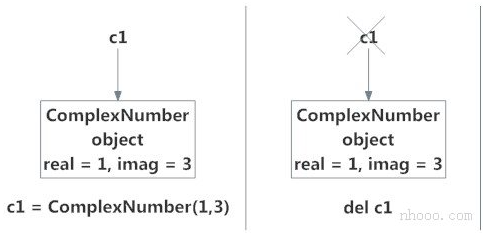
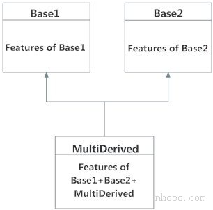
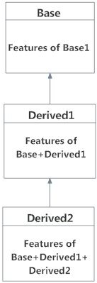

# <font style="color:rgb(51, 51, 51);">Python 面向对象编程</font>
<font style="color:rgb(51, 51, 51);">在本文中，您将通过示例了解Python中的面向对象编程(OOP)及其基本概念。</font>

## <font style="color:rgb(51, 51, 51);">Python OOP简介</font>
<font style="color:rgb(51, 51, 51);">Python是一种多范式编程语言。意思是说，它支持不同的编程方法。</font>

<font style="color:rgb(51, 51, 51);">解决编程问题的一种流行方法是创建对象。也就是所谓的面向对象编程（OOP）。</font>

<font style="color:rgb(51, 51, 51);">一个对象具有两个特征：</font>

+ <font style="color:rgb(51, 51, 51);">属性</font>
+ <font style="color:rgb(51, 51, 51);">行为</font>

<font style="color:rgb(51, 51, 51);">让我们举个示例：</font>

<font style="color:rgb(51, 51, 51);">鹦鹉是一个物体，</font>

+ <font style="color:rgb(51, 51, 51);">名称，年龄，颜色是属性</font>
+ <font style="color:rgb(51, 51, 51);">唱歌，跳舞都是行为</font>

<font style="color:rgb(51, 51, 51);">Python中的OOP概念专注于创建可重用的代码。此概念也称为DRY（Don't Repeat Yourself）不要重复自己。</font>

<font style="color:rgb(51, 51, 51);">在Python中，OOP的概念遵循一些基本原则：</font>

| <font style="color:rgb(51, 51, 51);">继承</font> | <font style="color:rgb(51, 51, 51);">使用新类的详细信息而不修改现有类的过程。</font> |
| --- | --- |
| <font style="color:rgb(51, 51, 51);">封装</font> | <font style="color:rgb(51, 51, 51);">对其他对象隐藏类的私有细节。</font> |
| <font style="color:rgb(51, 51, 51);">多态</font> | <font style="color:rgb(51, 51, 51);">对不同的数据输入以不同的方式使用通用操作的概念。</font> |


## <font style="color:rgb(51, 51, 51);">类（class）</font>
<font style="color:rgb(51, 51, 51);">类是对象的蓝图。</font>

<font style="color:rgb(51, 51, 51);">我们可以将类看作是带有标签的鹦鹉的素描。它包含有关名称，颜色，大小等的所有详细信息。基于这些描述，我们可以研究鹦鹉。在这里，鹦鹉是一个对象。</font>

<font style="color:rgb(51, 51, 51);">鹦鹉类的示例可以是：</font>

```python
class Parrot:
    pass
```

<font style="color:rgb(51, 51, 51);">在这里，我们使用class关键字来定义一个空类Parrot。我们从类中构造示例。示例是由特定类创建的特定对象。</font>

## <font style="color:rgb(51, 51, 51);">对象（Object）</font>
<font style="color:rgb(51, 51, 51);">对象（示例）是类的示例。定义类时，仅定义对象的描述。因此，没有分配内存或存储。</font>

<font style="color:rgb(51, 51, 51);">鹦鹉类对象的示例可以是：</font>

obj = Parrot()

<font style="color:rgb(51, 51, 51);">在这里，obj是Parrot类的对象。</font>

<font style="color:rgb(51, 51, 51);">假设我们有鹦鹉的详细信息。下面，我们将展示如何构建鹦鹉的类和对象。</font>

#### <font style="color:rgb(51, 51, 51);">示例1：在Python中创建类和对象</font>
**<font style="color:rgb(51, 51, 51);background-color:rgb(239, 239, 239);">示例</font>**

```python
class Parrot:

    # 类属性
    species = "鸟"

    # 示例属性
    def __init__(self, name, age):
        self.name = name
        self.age = age

# 示例化Parrot类
blu = Parrot("麻雀", 10)
woo = Parrot("鹦鹉", 15)

# 访问类属性
print("麻雀是 {}".format(blu.__class__.species))
print("鹦鹉也是 {}".format(woo.__class__.species))

# 访问示例属性
print("{} 有 {} 岁".format( blu.name, blu.age))
print("{} 有 {} 岁".format( woo.name, woo.age))
```

<font style="color:rgb(51, 51, 51);">当我们运行程序时，输出将是：</font>

```python
麻雀是 鸟
鹦鹉也是 鸟
麻雀 有 10 岁
鹦鹉 有 15 岁
```

<font style="color:rgb(51, 51, 51);">在上面的程序中，我们创建一个名为</font><font style="color:rgb(51, 51, 51);">Parrot</font><font style="color:rgb(51, 51, 51);">的类。然后，我们定义属性。属性是对象的特征。</font>

<font style="color:rgb(51, 51, 51);">然后，我们创建</font><font style="color:rgb(51, 51, 51);">Parrot</font><font style="color:rgb(51, 51, 51);">类的示例。在这里，</font><font style="color:rgb(51, 51, 51);">blu</font><font style="color:rgb(51, 51, 51);">和</font><font style="color:rgb(51, 51, 51);">woo</font><font style="color:rgb(51, 51, 51);">是我们新对象的引用（值）。</font>

<font style="color:rgb(51, 51, 51);">然后，我们使用class .species访问class属性。类的所有示例的类属性都是相同的。类似地，我们使用blu.name和blu.age访问示例属性。但是，对于类的每个示例，示例属性都是不同的。</font>

<font style="color:rgb(51, 51, 51);">要了解有关类和对象的更多信息，请转到</font>[<font style="color:rgb(51, 51, 51);">Python类和对象。</font>](https://www.cainiaoplus.com/python/python-class.html)

## <font style="color:rgb(51, 51, 51);">方法</font>
<font style="color:rgb(51, 51, 51);">方法是在类主体内定义的函数。它们用于定义对象的行为。</font>

### <font style="color:rgb(51, 51, 51);">示例2：在Python中创建方法</font>
**<font style="color:rgb(51, 51, 51);background-color:rgb(239, 239, 239);">示例</font>**

```python
class Parrot:

    # 示例属性
    def __init__(self, name, age):
        self.name = name
        self.age = age

    # 示例方法
    def sing(self, song):
        return "{} sings {}".format(self.name, song)

    def dance(self):
        return "{} is now dancing".format(self.name)

# 示例化对象
blu = Parrot("Blu", 10)

# 调用我们的示例方法
print(blu.sing("'Happy'"))
print(blu.dance())
```

<font style="color:rgb(51, 51, 51);">当我们运行程序时，输出将是：</font>

```python
Blu sings 'Happy'
Blu is now dancing
```

<font style="color:rgb(51, 51, 51);">在上面的程序中，我们定义了两种方法，即sing()和dance()。 这些之所以称为示例方法，是因为它们是在示例对象（即blu）上调用的。</font>

## <font style="color:rgb(51, 51, 51);">继承性</font>
<font style="color:rgb(51, 51, 51);">继承是一种创建新类的方法，用于在不修改现有类的细节的情况下使用它。新形成的类是一个派生类(或子类)。类似地，现有类是基类(或父类)。</font>

### <font style="color:rgb(51, 51, 51);">示例3：在Python中使用继承</font>
**<font style="color:rgb(51, 51, 51);background-color:rgb(239, 239, 239);">示例</font>**

```python
# 基类
class Bird:

    def __init__(self):
        print("鸟准备好了")

    def whoisThis(self):
        print("鸟")

    def swim(self):
        print("游得更快")

# 子类
class Penguin(Bird):

    def __init__(self):
        # call super() function
        super().__init__()
        print("企鹅准备好了")

    def whoisThis(self):
        print("企鹅")

    def run(self):
        print("跑得更快")

peggy = Penguin()
peggy.whoisThis()
peggy.swim()
peggy.run()
```

<font style="color:rgb(51, 51, 51);">当我们运行该程序时，输出将是：</font>

```python
鸟准备好了
企鹅准备好了
企鹅
游得更快
跑得更快
```

<font style="color:rgb(51, 51, 51);">在上面的程序中，我们创建了两个类，即</font><font style="color:rgb(51, 51, 51);">Bird</font><font style="color:rgb(51, 51, 51);">（父类）和</font><font style="color:rgb(51, 51, 51);">Penguin</font><font style="color:rgb(51, 51, 51);">（子类）。子类继承父类的功能。我们可以从swim()方法中看到这一点。子类再次修改了父类的行为。我们可以从whoisThis()方法中看到这一点。此外，我们通过创建新run()方法来扩展父类的功能。</font>

<font style="color:rgb(51, 51, 51);">另外，我们在init()方法之前使用super()函数。这是因为我们希望将init()方法的内容从父类拉到子类中。</font>

## <font style="color:rgb(51, 51, 51);">可封装性</font>
<font style="color:rgb(51, 51, 51);">在Python中使用OOP，我们可以限制对方法和变量的访问。这样可以防止数据直接修改（称为封装）。在Python中，我们使用下划线作为前缀来表示私有属性，即单“ _”或双“ __”。</font>

### <font style="color:rgb(51, 51, 51);">示例4：Python中的数据封装</font>
**<font style="color:rgb(51, 51, 51);background-color:rgb(239, 239, 239);">示例</font>**

```python
class Computer:

    def __init__(self):
        self.__maxprice = 900

    def sell(self):
        print("售价: {}".format(self.__maxprice))

    def setMaxPrice(self, price):
        self.__maxprice = price

c = Computer()
c.sell()

# 改变价格
c.__maxprice = 1000
c.sell()

# 使用setter函数
c.setMaxPrice(1000)
c.sell()
```

<font style="color:rgb(51, 51, 51);">当我们运行该程序时，输出将是：</font>

```python
售价: 900
售价: 900
售价: 1000
```

<font style="color:rgb(51, 51, 51);">在上面的程序中，我们定义了</font><font style="color:rgb(51, 51, 51);">Computer</font><font style="color:rgb(51, 51, 51);">类。我们使用__init__()方法存储计算机的最高售价。我们试图修改价格。但是，我们无法更改它，因为Python将</font><font style="color:rgb(51, 51, 51);">__maxprice</font><font style="color:rgb(51, 51, 51);">视为私有属性。要更改该值，我们使用了setter函数，即setMaxPrice()，它以price为参数。</font>

## <font style="color:rgb(51, 51, 51);">多态性</font>
<font style="color:rgb(51, 51, 51);">多态性是一种功能（在OOP中），可以将公共接口用于多种形式（数据类型）。</font>

<font style="color:rgb(51, 51, 51);">假设我们需要给一个形状上色，有多个形状选项（矩形，正方形，圆形）。但是，我们可以使用相同的方法为任何形状着色。这个概念称为多态。</font>

### <font style="color:rgb(51, 51, 51);">示例5：在Python中使用多态</font>
**<font style="color:rgb(51, 51, 51);background-color:rgb(239, 239, 239);">示例</font>**

```python
class Parrot:

    def fly(self):
        print("鹦鹉会飞")

    def swim(self):
        print("鹦鹉不会游泳")

class Penguin:

    def fly(self):
        print("企鹅不会飞")

    def swim(self):
        print("企鹅会游泳")

# 通用接口
def flying_test(bird):
    bird.fly()

#示例化对象
blu = Parrot()
peggy = Penguin()

# 传递对象
flying_test(blu)
flying_test(peggy)
```

<font style="color:rgb(51, 51, 51);">当我们运行上面的程序时，输出将是：</font>

```python
鹦鹉会飞
企鹅不会飞
```

<font style="color:rgb(51, 51, 51);">在上面的程序中，我们定义了两个类</font><font style="color:rgb(51, 51, 51);">Parrot</font><font style="color:rgb(51, 51, 51);">和</font><font style="color:rgb(51, 51, 51);">Penguin</font><font style="color:rgb(51, 51, 51);">。它们每个都有通用的fly()方法。但是，它们的功能不同。为了允许多态，我们创建了通用接口，即flying_test()可以接受任何对象的函数。然后，我们在flying_test()函数中传递了</font><font style="color:rgb(51, 51, 51);">blu</font><font style="color:rgb(51, 51, 51);">和</font><font style="color:rgb(51, 51, 51);">peggy</font><font style="color:rgb(51, 51, 51);">对象，它有效地运行了。</font>

## <font style="color:rgb(51, 51, 51);">面向对象编程的要点：</font>
+ <font style="color:rgb(51, 51, 51);">让编程变得简单而有效。</font>
+ <font style="color:rgb(51, 51, 51);">类是可共享的，因此可以重复使用代码。</font>
+ <font style="color:rgb(51, 51, 51);">让编程人员的生产力提高</font>
+ <font style="color:rgb(51, 51, 51);">通过数据抽象，数据是安全的。</font>

# <font style="color:rgb(51, 51, 51);">Python 类和对象</font>
<font style="color:rgb(51, 51, 51);">在本文中，您将学习Python的核心功能，Python对象和类。 您将学习什么是类，如何创建它并在程序中使用它。</font>

## <font style="color:rgb(51, 51, 51);">Python中的类和对象是什么？</font>
<font style="color:rgb(51, 51, 51);">Python是一种面向对象的编程语言。与面向过程的程序设计主要侧重于函数，面向对象的程序设计着重于对象。</font>

<font style="color:rgb(51, 51, 51);">对象只是数据（变量）和作用于这些数据的方法（函数）的集合。并且，类是对象的蓝图。</font>

<font style="color:rgb(51, 51, 51);">我们可以将类视为房子的草图（原型）。它包含有关地板，门，窗户等的所有详细信息。基于这些描述，我们建造了房屋。房子是对象。</font>

<font style="color:rgb(51, 51, 51);">由于可以通过描述来制作许多房屋，因此我们可以根据类创建许多对象。对象也称为类的示例，创建该对象的过程称为</font>**<font style="color:rgb(51, 51, 51);">示例化</font>**<font style="color:rgb(51, 51, 51);">。</font>

## <font style="color:rgb(51, 51, 51);">在Python中定义一个类</font>
<font style="color:rgb(51, 51, 51);">就像函数定义以关键字</font>[<font style="color:rgb(51, 51, 51);">def</font>](https://www.cainiaoplus.com/python/python-keyword-list.html#def)<font style="color:rgb(51, 51, 51);">开头一样，在Python中，我们使用关键字</font>[<font style="color:rgb(51, 51, 51);">class</font>](https://www.cainiaoplus.com/python/python-keyword-list.html#class)<font style="color:rgb(51, 51, 51);">定义了一个</font>[<font style="color:rgb(51, 51, 51);">类</font>](https://www.cainiaoplus.com/python/python-keyword-list.html#class)<font style="color:rgb(51, 51, 51);">。</font>

<font style="color:rgb(51, 51, 51);">第一个字符串称为docstring，并具有有关该类的简短说明。尽管不是强制性的，但是建议这样做。</font>

<font style="color:rgb(51, 51, 51);">这是一个简单的类定义。</font>

```python
class MyNewClass:
    '''这是一个文档字符串。我已经创建了一个新类'''
    pass
```

<font style="color:rgb(51, 51, 51);">一个类创建一个新的本地</font>[<font style="color:rgb(51, 51, 51);">命名空间</font>](https://www.cainiaoplus.com/python/python-namespace.html)<font style="color:rgb(51, 51, 51);">，并在其中定义其所有属性。属性可以是数据或函数。</font>

<font style="color:rgb(51, 51, 51);">其中还有一些特殊属性，它们以双下划线(__)开头。例如，__doc__给我们该类的文档字符串。</font>

<font style="color:rgb(51, 51, 51);">一旦定义了一个类，就会创建一个具有相同名称的新类对象。这个类对象使我们可以访问不同的属性以及示例化该类的新对象。</font>

**<font style="color:rgb(51, 51, 51);background-color:rgb(239, 239, 239);">示例</font>**

```python
class MyClass:
    "这是我的第二个类"
    a = 10
    def func(self):
        print('Hello')

# 输出: 10
print(MyClass.a)

# 输出: <function MyClass.func at 0x0000000003079BF8>
print(MyClass.func)

# 输出: '这是我的第二个类'
print(MyClass.__doc__)
```

<font style="color:rgb(51, 51, 51);">运行该程序时，输出为：</font>

```python
10
<function 0x7feaa932eae8="" at="" myclass.func="">
这是我的第二个类
```

## <font style="color:rgb(51, 51, 51);">用Python创建对象</font>
<font style="color:rgb(51, 51, 51);">我们看到了类对象可用于访问不同的属性。</font>

<font style="color:rgb(51, 51, 51);">它也可以用于创建该类的新对象示例（示例化）。创建对象的过程类似于</font>[<font style="color:rgb(51, 51, 51);">函数</font>](https://www.cainiaoplus.com/python/python-function.html)<font style="color:rgb(51, 51, 51);">调用。</font>

>>> ob = MyClass()

<font style="color:rgb(51, 51, 51);">这将创建一个新的示例对象ob。我们可以使用对象名称前缀来访问对象的属性。</font>

<font style="color:rgb(51, 51, 51);">属性可以是数据或方法。对象的方法是该类的相应函数。任何作为类属性的函数对象都为该类的对象定义了一种方法。</font>

<font style="color:rgb(51, 51, 51);">这意味着，由于MyClass.func是函数对象（类的属性），因此ob.func将成为方法对象。</font>

**<font style="color:rgb(51, 51, 51);background-color:rgb(239, 239, 239);">示例</font>**

```python
class MyClass:
    "这是我的第二个类"
    a = 10
    def func(self):
        print('Hello')

# 创建一个新的MyClass
ob = MyClass()

# 输出: <function MyClass.func at 0x000000000335B0D0>
print(MyClass.func)

# 输出: <bound method MyClass.func of <__main__.MyClass object at 0x000000000332DEF0>>
print(ob.func)

# Calling function func()
# 输出: Hello
ob.func()
```

<font style="color:rgb(51, 51, 51);">您可能已经注意到了类内部函数定义中的self参数，但是，我们只是将该方法简称为ob.func()，没有任何</font>[<font style="color:rgb(51, 51, 51);">参数</font>](https://www.cainiaoplus.com/python/python-function-argument.html)<font style="color:rgb(51, 51, 51);">。它仍然有效。  
</font>

<font style="color:rgb(51, 51, 51);">这是因为，只要对象调用其方法，该对象本身就会作为第一个参数传递。因此，ob.func()自动转成MyClass.func(ob)。</font>

<font style="color:rgb(51, 51, 51);">通常，调用带有n个参数列表的方法等效于调用带有参数列表的函数，该参数列表是通过在第一个参数之前插入方法的对象而创建的。</font>

<font style="color:rgb(51, 51, 51);">由于这些原因，类中函数的第一个参数必须是对象本身。这通常称为</font><font style="color:rgb(51, 51, 51);">self</font><font style="color:rgb(51, 51, 51);">。可以使用其他名称，但我们强烈建议您遵循约定。</font>

<font style="color:rgb(51, 51, 51);">现在，您必须熟悉类对象，示例对象，函数对象，方法对象及其区别。</font>

## <font style="color:rgb(51, 51, 51);">Python中的构造函数</font>
<font style="color:rgb(51, 51, 51);">以双下划线(__)开头的类函数被称为特殊函数，因为它们具有特殊含义。</font>

<font style="color:rgb(51, 51, 51);">__init__()函数特别有用。每当示例化该类的新对象时，都会调用此特殊函数。</font>

<font style="color:rgb(51, 51, 51);">这种类型的函数在面向对象编程(OOP)中也称为构造函数。我们通常使用它来初始化所有变量。</font>

**<font style="color:rgb(51, 51, 51);background-color:rgb(239, 239, 239);">示例</font>**

```python
class ComplexNumber:
    def __init__(self,r = 0,i = 0):
        self.real = r
        self.imag = i

    def getData(self):
        print("{0}+{1}j".format(self.real,self.imag))

# 创建一个新的ComplexNumber对象
c1 = ComplexNumber(2,3)

# 调用getData()函数
# 输出: 2+3j
c1.getData()

# 创建另一个ComplexNumber对象
# 并创建一个新的属性“attr”
c2 = ComplexNumber(5)
c2.attr = 10

# 输出: (5, 0, 10)
print((c2.real, c2.imag, c2.attr))

# 但c1对象没有属性" attr "
# AttributeError: 'ComplexNumber'对象没有属性'attr'
c1.attr
```

<font style="color:rgb(51, 51, 51);">在上面的示例中，我们定义了一个新类来表示复数。它具有两个函数，以 __init__() 初始化变量（默认为零），getData()用来正确显示数字。</font>

<font style="color:rgb(51, 51, 51);">在上述步骤中需要注意的一件有趣的事情是，可以动态地创建对象的属性。我们为对象c2创建了一个新的属性attr，并读取它。但这并没有为对象c1创建该属性。</font>

## <font style="color:rgb(51, 51, 51);">删除属性和对象</font>
<font style="color:rgb(51, 51, 51);">可以使用del语句随时删除对象的任何属性。在Python Shell上尝试以下操作以查看输出。</font>

```python
>>> c1 = ComplexNumber(2,3)
>>> del c1.imag
>>> c1.getData()
Traceback (most recent call last):
...
AttributeError: 'ComplexNumber' object has no attribute 'imag'

    >>> del ComplexNumber.getData
    >>> c1.getData()
    Traceback (most recent call last):
...
AttributeError: 'ComplexNumber' object has no attribute 'getData'
```

<font style="color:rgb(51, 51, 51);">我们甚至可以使用del语句删除对象本身。</font>

```python
>>> c1 = ComplexNumber(1,3)
>>> del c1
>>> c1
Traceback (most recent call last):
...
NameError: name 'c1' is not defined
```

<font style="color:rgb(51, 51, 51);">实际上，它比这更复杂。完成后，将在内存中创建一个新的示例对象 c1 = ComplexNumber(1,3)，名称</font><font style="color:rgb(51, 51, 51);">c1</font><font style="color:rgb(51, 51, 51);">与 其绑定。</font>

<font style="color:rgb(51, 51, 51);">命令del c1，将删除此绑定，并从相应的名称空间中删除名称</font><font style="color:rgb(51, 51, 51);">c1</font><font style="color:rgb(51, 51, 51);">。但是，该对象继续存在于内存中，如果没有其他名称绑定，则该对象以后会自动销毁。</font>

<font style="color:rgb(51, 51, 51);">在Python中这种对未引用对象的自动销毁也称为垃圾回收。</font>



# <font style="color:rgb(51, 51, 51);">Python 继承</font>
<font style="color:rgb(51, 51, 51);">继承使我们能够定义一个继承父类所有功能的类，并允许我们添加更多功能。 在本文中，您将学习在Python中使用继承。</font>

## <font style="color:rgb(51, 51, 51);">什么是继承？</font>
<font style="color:rgb(51, 51, 51);">继承是面向对象编程中的一项强大功能。</font>

<font style="color:rgb(51, 51, 51);">它指的是定义一个新</font>[<font style="color:rgb(51, 51, 51);">类</font>](https://www.cainiaoplus.com/python/python-class.html)<font style="color:rgb(51, 51, 51);">，而对现有类的进行很少修改或没有修改。新类称为</font>**<font style="color:rgb(51, 51, 51);">派生（或子）类</font>**<font style="color:rgb(51, 51, 51);">，而从其继承的新类称为</font>**<font style="color:rgb(51, 51, 51);">基（或父）类</font>**<font style="color:rgb(51, 51, 51);">。</font>

### <font style="color:rgb(51, 51, 51);">Python继承语法</font>
```python
class BaseClass:
    #基类主体
    class DerivedClass(BaseClass):
#派生类的主体
```

<font style="color:rgb(51, 51, 51);">派生类从基类继承要素，并向其添加新要素。这可以提高代码的可重用性。</font>

### <font style="color:rgb(51, 51, 51);">Python中的继承示例</font>
<font style="color:rgb(51, 51, 51);">为了演示继承的使用，让我们举一个示例。</font>

<font style="color:rgb(51, 51, 51);">多边形是具有3个或更多边的闭合图形。说，我们有一个名为的类，Polygon定义如下。</font>

```python
class Polygon:
    def __init__(self, no_of_sides):
        self.n = no_of_sides
        self.sides = [0 for i in range(no_of_sides)]

    def inputSides(self):
        self.sides = [float(input("输入边长 "+str(i+1)+" : ")) for i in range(self.n)]

    def dispSides(self):
        for i in range(self.n):
            print("边长",i+1,"是",self.sides[i])
```

<font style="color:rgb(51, 51, 51);">此类具有数据属性，用于存储边数，边</font><font style="color:rgb(51, 51, 51);">数</font><font style="color:rgb(51, 51, 51);">和每边的大小作为列表，即</font><font style="color:rgb(51, 51, 51);">边数</font><font style="color:rgb(51, 51, 51);">。</font>

<font style="color:rgb(51, 51, 51);">方法inputSides()取每一侧的大小，类似地，dispSides()将它们正确显示。</font>

<font style="color:rgb(51, 51, 51);">三角形是具有3个边的多边形。因此，我们可以创建一个名为的类，该类Triangle继承自Polygon。这使得类中所有可用的属性都可以在中Polygon轻松使用Triangle。我们不需要再次定义它们（代码可重用性）。Triangle定义如下。</font>

```python
class Triangle(Polygon):
    def __init__(self):
        Polygon.__init__(self,3)

    def findArea(self):
        a, b, c = self.sides
        # 计算半周长
        s = (a + b + c) / 2
        area = (s*(s-a)*(s-b)*(s-c)) ** 0.5
        print('三角形的面积是 %0.2f' %area)
```

<font style="color:rgb(51, 51, 51);">但是，class Triangle具有一种新方法findArea()来查找和打印三角形的区域。这是一个示例运行。</font>

```python
>>> t = Triangle()

>>> t.inputSides()
输入边长 1 : 3
输入边长  2 : 5
输入边长  3 : 4

>>> t.dispSides()
边长 1 是 3.0
边长 2 是 5.0
边长 3 是 4.0

>>> t.findArea()
三角形的面积是 6.00
```

<font style="color:rgb(51, 51, 51);">我们可以看到，尽管我们没有为类Triangle定义inputSides()或sides()之类的方法，但是我们能够使用它们。</font>

<font style="color:rgb(51, 51, 51);">如果在类中找不到属性，则搜索继续到基类。如果基类本身是从其他类派生的，则将以递归方式重复此操作。</font>

## <font style="color:rgb(51, 51, 51);">Python中的方法重写</font>
<font style="color:rgb(51, 51, 51);">在上面的示例中，请注意，在Triangle和Polygon这两个类中都定义了__init __()方法。 发生这种情况时，派生类中的方法将覆盖基类中的方法。 也就是说，Triangle中的__init __()优先于Polygon中的__init __()。</font>

<font style="color:rgb(51, 51, 51);">通常，当覆盖基本方法时，我们倾向于扩展定义而不是简单地替换它。 通过从派生类中的基类中调用基类中的方法（从Triangle中的__init __()中调用Polygon .__ init __()）来完成相同的操作。</font>

<font style="color:rgb(51, 51, 51);">更好的选择是使用内置函数super()。因此，super().__init__(3)等效于Polygon.__init__(self,3)并且是首选。您可以了解有关</font>[<font style="color:rgb(51, 51, 51);">Python中</font>](http://rhettinger.wordpress.com/2011/05/26/super-considered-super/)<font style="color:rgb(51, 51, 51);">的</font>[<font style="color:rgb(51, 51, 51);">super()函数的</font>](http://rhettinger.wordpress.com/2011/05/26/super-considered-super/)<font style="color:rgb(51, 51, 51);">更多信息。</font>

<font style="color:rgb(51, 51, 51);">两个内置函数isinstance()，issubclass()用于检查继承。如果对象是该类或从其派生的其他类的示例，则函数isinstance()返回True。Python中的每个类都继承自基类object。</font>

```python
>>> isinstance(t,Triangle)
True

>>> isinstance(t,Polygon)
True

>>> isinstance(t,int)
False

>>> isinstance(t,object)
True
```

<font style="color:rgb(51, 51, 51);">同样，issubclass()用于检查类的继承。</font>

```python
>>> issubclass(Polygon,Triangle)
False

>>> issubclass(Triangle,Polygon)
True

>>> issubclass(bool,int)
True
```

# <font style="color:rgb(51, 51, 51);">Python 多重继承</font>
<font style="color:rgb(51, 51, 51);">在本文中，您将学习什么是Python中的多重继承以及如何在程序中使用它。 您还将了解多级继承和方法解析顺序。</font>

## <font style="color:rgb(51, 51, 51);">Python中的多重继承</font>
<font style="color:rgb(51, 51, 51);">像C ++一样，一个</font>[<font style="color:rgb(51, 51, 51);">类</font>](https://www.cainiaoplus.com/python/python-class.html)<font style="color:rgb(51, 51, 51);">可以从Python中的多个基类派生。这称为多重继承。</font>

<font style="color:rgb(51, 51, 51);">在多重继承中，所有基类的功能都继承到派生类中。多重继承的语法类似于单一</font>[<font style="color:rgb(51, 51, 51);">继承</font>](https://www.cainiaoplus.com/python/python-inheritance.html)<font style="color:rgb(51, 51, 51);">。</font>

### <font style="color:rgb(51, 51, 51);">例</font>
```python
class Base1:
    pass

class Base2:
    pass

class MultiDerived(Base1, Base2):
    pass
```

<font style="color:rgb(51, 51, 51);">在这里，MultiDerived源自类Base1和Base2。</font>

<font style="color:rgb(51, 51, 51);">MultiDerived类从Base1和Base2继承。</font>

## <font style="color:rgb(51, 51, 51);">Python中的多级继承</font>
<font style="color:rgb(51, 51, 51);">另一方面，我们也可以继承派生类。这称为多级继承。在Python中可以是任何深度。</font>

<font style="color:rgb(51, 51, 51);">在多级继承中，基类和派生类的功能被继承到新的派生类中。</font>

<font style="color:rgb(51, 51, 51);">下面给出了具有相应可视化效果的示例。</font>

```python
class Base:
    pass

class Derived1(Base):
    pass

class Derived2(Derived1):
    pass
```

<font style="color:rgb(51, 51, 51);">在此，Derived1从Base派生，Derived2从Derived1派生。</font>



## <font style="color:rgb(51, 51, 51);">Python中的方法解析顺序</font>
<font style="color:rgb(51, 51, 51);">Python中的每个类都派生自该类object。它是Python中最基本的类型。</font>

<font style="color:rgb(51, 51, 51);">因此，从技术上讲，所有其他类（内置的或用户定义的）都是派生类，而所有对象都是object类的示例。</font>

**<font style="color:rgb(51, 51, 51);background-color:rgb(239, 239, 239);">示例</font>**

```python
# 输出: True
print(issubclass(list,object))

# 输出: True
print(isinstance(5.5,object))

# 输出: True
print(isinstance("Hello",object))
```

<font style="color:rgb(51, 51, 51);">在多继承方案中，将在当前类中首先搜索任何指定的属性。如果未找到，则搜索将以深度优先，从左到右的方式继续进入父类，而无需两次搜索相同的类。</font>

<font style="color:rgb(51, 51, 51);">所以，在上面的实例中MultiDerived类中的搜索顺序是[ MultiDerived，Base1，Base2，object]。该顺序也称为MultiDerived类的线性化，用于查找该顺序的规则集称为“</font><font style="color:rgb(51, 51, 51);"> </font>**<font style="color:rgb(51, 51, 51);">方法解析顺序（MRO）”</font>**<font style="color:rgb(51, 51, 51);">。</font>

<font style="color:rgb(51, 51, 51);">MRO必须防止本地优先级排序，并且还必须提供单调性。它可以确保一个类始终出现在其父级之前，如果有多个父级，则其顺序与基类的元组相同。</font>

<font style="color:rgb(51, 51, 51);">可以将类的MRO视为__mro__属性或mro()方法。前者返回一个元组，而后者返回一个列表。</font>

```python
>>> MultiDerived.__mro__
(<class '__main__.MultiDerived'>,
<class '__main__.Base1'>,
<class '__main__.Base2'>,
<class 'object'>)

    >>> MultiDerived.mro()
[<class '__main__.MultiDerived'>,
<class '__main__.Base1'>,
<class '__main__.Base2'>,
<class 'object'>]
```

<font style="color:rgb(51, 51, 51);">这是一个稍微复杂的多重继承示例及其可视化以及MRO。</font>

<font style="color:rgb(51, 51, 51);">多重继承可视化</font>

**<font style="color:rgb(51, 51, 51);background-color:rgb(239, 239, 239);">示例</font>**

```python
class X: pass
class Y: pass
class Z: pass

class A(X,Y): pass
class B(Y,Z): pass

class M(B,A,Z): pass

# 输出:
# [<class '__main__.M'>, <class '__main__.B'>,
# <class '__main__.A'>, <class '__main__.X'>,
# <class '__main__.Y'>, <class '__main__.Z'>,
# <class 'object'>]

print(M.mro())
```

<font style="color:rgb(51, 51, 51);">请参考此内容，以进一步</font>[<font style="color:rgb(51, 51, 51);">讨论MRO，</font>](http://www.python.org/download/releases/2.3/mro/)<font style="color:rgb(51, 51, 51);">并了解实际算法的计算方式。</font>

# <font style="color:rgb(51, 51, 51);">Python 运算符重载</font>
<font style="color:rgb(51, 51, 51);">您可以根据所使用的操作数来更改Python中运算符的含义。 这种做法称为运算符过载。</font>

## <font style="color:rgb(51, 51, 51);">什么是Python中的运算符重载？</font>
[<font style="color:rgb(51, 51, 51);">Python运算符</font>](https://www.cainiaoplus.com/python/python-operators.html)<font style="color:rgb(51, 51, 51);">用于内置类。但是相同的运算符对不同的类型有不同的行为。例如，+运算符将对两个数字执行算术加法、合并两个列表并连接两个字符串。</font>

<font style="color:rgb(51, 51, 51);">Python中的这一功能允许同一运算符根据上下文具有不同的含义，称为运算符重载。</font>

<font style="color:rgb(51, 51, 51);">那么，当我们将它们与用户定义类的对象一起使用时会发生什么呢？让我们看下面的类，它试图在二维坐标系中模拟一个点。</font>

**<font style="color:rgb(51, 51, 51);background-color:rgb(239, 239, 239);">示例</font>**

```python
class Point:
    def __init__(self, x = 0, y = 0):
        self.x = x
        self.y = y
```

<font style="color:rgb(51, 51, 51);">现在，运行代码并尝试在Python shell中添加两个点。</font>

```python
>>> p1 = Point(2,3)
>>> p2 = Point(-1,2)
>>> p1 + p2
Traceback (most recent call last):
...
TypeError: unsupported operand type(s) for +: 'Point' and 'Point'
```

<font style="color:rgb(51, 51, 51);">哇！这是很多错误。由于Python不知道如何将两个Point对象加在一起而引发TypeError。</font>

<font style="color:rgb(51, 51, 51);">但是，好消息是我们可以通过运算符重载向Python教授这一点。但是首先，让我们对特殊函数有所了解。</font>

## <font style="color:rgb(51, 51, 51);">Python中的特殊函数</font>
<font style="color:rgb(51, 51, 51);">以双下划线__开头的类函数在Python中称为特殊函数。这是因为，它们不是普通的函数。我们上面定义的__init__()函数就是其中之一。每次我们创建该类的新对象时都会调用它。Python中有很多特殊函数。</font>

<font style="color:rgb(51, 51, 51);">使用特殊函数，我们可以使我们的类与内置函数兼容。</font>

**<font style="color:rgb(51, 51, 51);background-color:rgb(239, 239, 239);">示例</font>**

```python
>>> p1 = Point(2,3)
>>> print(p1)
<__main__.Point object at 0x00000000031F8CC0>
```

<font style="color:rgb(51, 51, 51);">打印输出没有达到预想的效果。但是，如果我们在类中定义__str__()方法，我们可以控制它的打印输出方式。我们把这个加到我们的类中。</font>

**<font style="color:rgb(51, 51, 51);background-color:rgb(239, 239, 239);">示例</font>**

```python
class Point:
    def __init__(self, x = 0, y = 0):
        self.x = x
        self.y = y

    def __str__(self):
        return "({0},{1})".format(self.x,self.y)
```

<font style="color:rgb(51, 51, 51);">现在，让我们print()再次尝试该函数。</font>

```python
>>> p1 = Point(2,3)
>>> print(p1)
(2,3)
```

<font style="color:rgb(51, 51, 51);">事实证明这样更好，当我们使用内置函数str()或时，将调用相同的方法format()。</font>

```python
>>> str(p1)
'(2,3)'

>>> format(p1)
'(2,3)'
```

<font style="color:rgb(51, 51, 51);">因此，当您执行str(p1)或format(p1)时，Python在内部执行p1.__str__()。因此得名，特殊函数。下面继续回到操作符重载。</font>

## <font style="color:rgb(51, 51, 51);">在Python中重载+运算符</font>
<font style="color:rgb(51, 51, 51);">要重载+符号，我们将需要在类中实现__add__()函数。拥有权利的同时也被赋予了重大的责任。我们可以在此函数内做任何喜欢的事情。 但是返回坐标和的Point对象是明智的。</font>

**<font style="color:rgb(51, 51, 51);background-color:rgb(239, 239, 239);">示例</font>**

```python
class Point:
    def __init__(self, x = 0, y = 0):
        self.x = x
        self.y = y

    def __str__(self):
        return "({0},{1})".format(self.x,self.y)

    def __add__(self,other):
        x = self.x + other.x
        y = self.y + other.y
        return Point(x,y)
```

<font style="color:rgb(51, 51, 51);">现在，让我们再试一次。</font>

```python
>>> p1 = Point(2,3)
>>> p2 = Point(-1,2)
>>> print(p1 + p2)
(1,5)
```

<font style="color:rgb(51, 51, 51);">实际上发生的是，当您执行p1 + p2时，Python会调用p1 .__ add __(p2)，也就是Point .__ add __(p1，p2)。 同样，我们也可以重载其他运算符。 我们需要实现的特殊函数列表如下。</font>

| <font style="color:rgb(254, 254, 254);">运算符</font> | <font style="color:rgb(254, 254, 254);">表达</font> | <font style="color:rgb(254, 254, 254);">在内部</font> |
| --- | --- | --- |
| <font style="color:rgb(51, 51, 51);">相加（+）</font> | <font style="color:rgb(51, 51, 51);">p1 + p2</font> | <font style="color:rgb(51, 51, 51);">p1 .__ add __（p2）</font> |
| <font style="color:rgb(51, 51, 51);">相减（-）</font> | <font style="color:rgb(51, 51, 51);">p1-p2</font> | <font style="color:rgb(51, 51, 51);">p1 .__ sub __（p2）</font> |
| <font style="color:rgb(51, 51, 51);">相乘（*）</font> | <font style="color:rgb(51, 51, 51);">p1 * p2</font> | <font style="color:rgb(51, 51, 51);">p1 .__ mul __（p2）</font> |
| <font style="color:rgb(51, 51, 51);">求幂（**）</font> | <font style="color:rgb(51, 51, 51);">p1 ** p2</font> | <font style="color:rgb(51, 51, 51);">p1 .__ pow __（p2）</font> |
| <font style="color:rgb(51, 51, 51);">相除（/）</font> | <font style="color:rgb(51, 51, 51);">p1 / p2</font> | <font style="color:rgb(51, 51, 51);">p1 .__ truediv __（p2）</font> |
| <font style="color:rgb(51, 51, 51);">整除（//）   </font> | <font style="color:rgb(51, 51, 51);">p1 // p2</font> | <font style="color:rgb(51, 51, 51);">p1 .__ floordiv __（p2）</font> |
| <font style="color:rgb(51, 51, 51);">求模 （%）</font> | <font style="color:rgb(51, 51, 51);">p1％p2</font> | <font style="color:rgb(51, 51, 51);">p1 .__ mod __（p2）</font> |
| <font style="color:rgb(51, 51, 51);">按位左移（<<）</font> | <font style="color:rgb(51, 51, 51);">p1 << p2</font> | <font style="color:rgb(51, 51, 51);">p1 .__ lshift __（p2）</font> |
| <font style="color:rgb(51, 51, 51);">按位右移（>>）</font> | <font style="color:rgb(51, 51, 51);">p1 >> p2</font> | <font style="color:rgb(51, 51, 51);">p1 .__ rshift __（p2）</font> |
| <font style="color:rgb(51, 51, 51);">按位与（and）</font> | <font style="color:rgb(51, 51, 51);">p1 and p2</font> | <font style="color:rgb(51, 51, 51);">p1 .__ and __（p2）</font> |
| <font style="color:rgb(51, 51, 51);">按位或（or）</font> | <font style="color:rgb(51, 51, 51);">p1 | 2</font> | <font style="color:rgb(51, 51, 51);">p1 .__ or __（p2）</font> |
| <font style="color:rgb(51, 51, 51);">按位异或（^）</font> | <font style="color:rgb(51, 51, 51);">p1 ^ p2</font> | <font style="color:rgb(51, 51, 51);">p1 .__ xor __（p2）</font> |
| <font style="color:rgb(51, 51, 51);">按位否</font><font style="color:rgb(51, 51, 51);">（~）</font> | <font style="color:rgb(51, 51, 51);">〜p1</font> | <font style="color:rgb(51, 51, 51);">p1 .__ invert __()</font> |


## <font style="color:rgb(51, 51, 51);">在Python中重载比较运算符</font>
<font style="color:rgb(51, 51, 51);">Python不限制运算符重载为算术运算符。我们也可以重载比较运算符。</font>

<font style="color:rgb(51, 51, 51);">假设，我们想在Point类中实现小于运算符（<） ，让我们从原点比较这些点的大小，并为此目的返回结果。可以如下实现。</font>

**<font style="color:rgb(51, 51, 51);background-color:rgb(239, 239, 239);">示例</font>**

```python
class Point:
    def __init__(self, x = 0, y = 0):
        self.x = x
        self.y = y

    def __str__(self):
        return "({0},{1})".format(self.x,self.y)

    def __lt__(self,other):
        self_mag = (self.x ** 2) + (self.y ** 2)
        other_mag = (other.x ** 2) + (other.y ** 2)
        return self_mag < other_mag
```

<font style="color:rgb(51, 51, 51);">尝试在Python shell中运行这些示例。</font>

```python
>>> Point(1,1) < Point(-2,-3)
True

>>> Point(1,1) < Point(0.5,-0.2)
False

>>> Point(1,1) < Point(1,1)
False
```

<font style="color:rgb(51, 51, 51);">类似地，下面列出了我们需要实现以重载其他比较运算符的特殊函数。</font>

| <font style="color:rgb(254, 254, 254);">操作符   </font> | <font style="color:rgb(254, 254, 254);">表达式</font> | <font style="color:rgb(254, 254, 254);">内部</font> |
| --- | --- | --- |
| <font style="color:rgb(51, 51, 51);">小于（<）</font> | <font style="color:rgb(51, 51, 51);">p1 <p2</font> | <font style="color:rgb(51, 51, 51);">p1 .__ lt __（p2）</font> |
| <font style="color:rgb(51, 51, 51);">小于等于（<=）</font> | <font style="color:rgb(51, 51, 51);">p1 <= p2</font> | <font style="color:rgb(51, 51, 51);">p1 .__ le __（p2）</font> |
| <font style="color:rgb(51, 51, 51);">等于（==）</font> | <font style="color:rgb(51, 51, 51);">p1 == p2</font> | <font style="color:rgb(51, 51, 51);">p1 .__ eq __（p2）</font> |
| <font style="color:rgb(51, 51, 51);">不等于（!=）</font> | <font style="color:rgb(51, 51, 51);">p1！= p2</font> | <font style="color:rgb(51, 51, 51);">p1 .__ ne __（p2）</font> |
| <font style="color:rgb(51, 51, 51);">大于（>）</font> | <font style="color:rgb(51, 51, 51);">p1> p2</font> | <font style="color:rgb(51, 51, 51);">p1 .__ gt __（p2）</font> |
| <font style="color:rgb(51, 51, 51);">大于等于（>=）</font> | <font style="color:rgb(51, 51, 51);">p1> = p2</font> | <font style="color:rgb(51, 51, 51);">p1 .__ ge __（p2）</font> |


