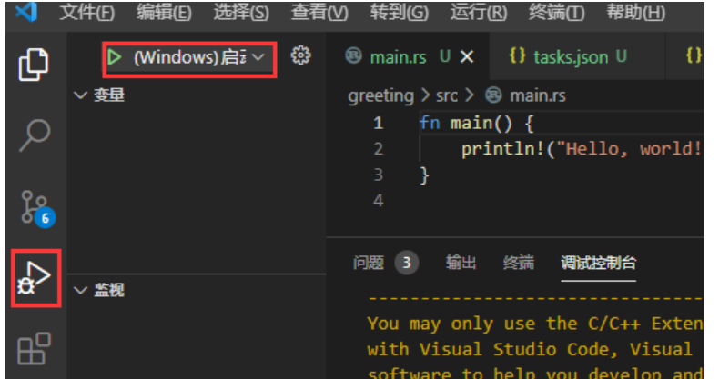
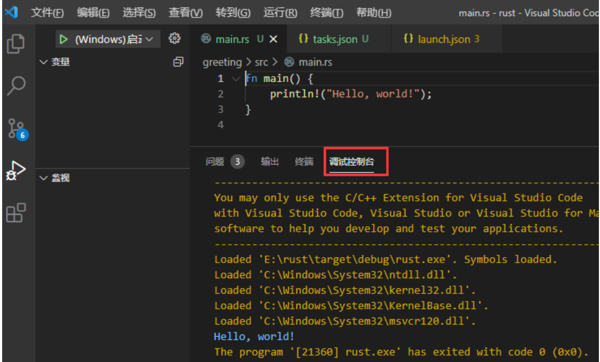
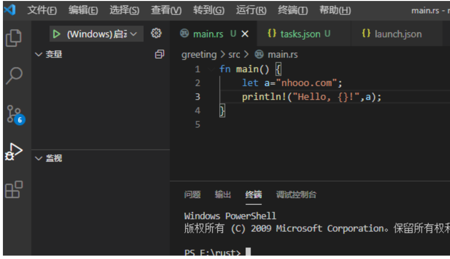

## <font style="color:rgb(51, 51, 51);">Cargo 是什么</font>
<font style="color:rgb(51, 51, 51);">Cargo 是 Rust 的构建系统和包管理器。</font>

<font style="color:rgb(51, 51, 51);">Rust 开发者常用 Cargo 来管理 Rust 工程和获取工程所依赖的库。在上个教程中我们曾使用 cargo new greeting 命令创建了一个名为 greeting 的工程，Cargo 新建了一个名为 greeting 的文件夹并在里面部署了一个 Rust 工程最典型的文件结构。这个 greeting 文件夹就是工程本身。</font>

## <font style="color:rgb(51, 51, 51);">Cargo 功能</font>
<font style="color:rgb(51, 51, 51);">Cargo 除了创建工程以外还具备构建(build)工程、运行(run)工程等一系列功能，构建和运行分别对应以下命令：</font>

```plain
cargo build 
cargo run
```

<font style="color:rgb(51, 51, 51);">Cargo 还具有获取包、打包、高级构建等功能，详细使用方法参见 Cargo 命令。</font>

## <font style="color:rgb(51, 51, 51);">在 VSCode 中配置 Rust 工程</font>
<font style="color:rgb(51, 51, 51);">Cargo 是一个不错的构建工具，如果使 VSCode 与它相配合那么 VSCode 将会是一个十分便捷的开发环境。</font>

<font style="color:rgb(51, 51, 51);">在上一章中我们建立了 greeting 工程，现在我们用 VSCode 打开 greeting 文件夹（</font>**<font style="color:rgb(51, 51, 51);">注意不是 nhooo-greeting</font>**<font style="color:rgb(51, 51, 51);">）。</font>

<font style="color:rgb(51, 51, 51);">打开 greeting 之后，在里面新建一个新的文件夹 .vscode （注意 vscode 前面的点，如果有这个文件夹就不需要新建了）。在新建的 .vscode 文件夹里新建两个文件 tasks.json 和 launch.json，文件内容如下：</font>

## <font style="color:rgb(51, 51, 51);">tasks.json  文件</font>
```plain
{ 
    "version": "2.0.0", 
    "tasks": [ 
        { 
            "label": "build", 
            "type": "shell", 
            "command":"cargo", 
            "args": ["build"] 
        } 
    ] 
}
```

## <font style="color:rgb(51, 51, 51);">launch.json 文件（适用在 Windows 系统上）</font>
```plain
{ 
    "version": "0.2.0", 
    "configurations": [ 
        { 
            "name": "(Windows) 启动", 
            "preLaunchTask": "build", 
            "type": "cppvsdbg", 
            "request": "launch", 
            "program": "${workspaceFolder}/target/debug/${workspaceFolderBasename}.exe", 
            "args": [], 
            "stopAtEntry": false, 
            "cwd": "${workspaceFolder}", 
            "environment": [], 
            "console": false 
        }, 
        { 
            "name": "(gdb) 启动", 
            "type": "cppdbg", 
            "request": "launch", 
            "program": "${workspaceFolder}/target/debug/${workspaceFolderBasename}.exe", 
            "args": [], 
            "stopAtEntry": false, 
            "cwd": "${workspaceFolder}", 
            "environment": [], 
            "console": false, 
            "MIMode": "gdb", 
            "miDebuggerPath": "这里填GDB所在的目录", 
            "setupCommands": [ 
                { 
                    "description": "为 gdb 启用整齐打印", 
                    "text": "-enable-pretty-printing", 
                    "ignoreFailures": true 
                } 
            ] 
        } 
    ] 
}
```

## <font style="color:rgb(51, 51, 51);">launch.json 文件（适用在 Linux 系统上）</font>
```plain
{
    "version": "0.2.0",
    "configurations": [
        {
            "name": "Debug",
            "type": "gdb",
            "preLaunchTask": "build",
            "request": "launch",
            "target": "${workspaceFolder}/target/debug/${workspaceFolderBasename}",
            "cwd": "${workspaceFolder}"
        }
    ]
}
```

## <font style="color:rgb(51, 51, 51);">launch.json 文件（适用在 Mac OS 系统上）</font>
```plain
{
    "version": "0.2.0",
    "configurations": [
        {
            "name": "(lldb) 启动",
            "type": "cppdbg",
            "preLaunchTask": "build",
            "request": "launch",
            "program": "${workspaceFolder}/target/debug/${workspaceFolderBasename}",
            "args": [],
            "stopAtEntry": false,
            "cwd": "${workspaceFolder}",
            "environment": [],
            "externalConsole": false,
            "MIMode": "lldb"
        }
    ]
}
```

<font style="color:rgb(51, 51, 51);">然后点击 VSCode 左栏的 "运行"。</font>

<font style="color:rgb(51, 51, 51);">如果你使用的是 MSVC 选择 "(Windows) 启动"。</font>

<font style="color:rgb(51, 51, 51);">如果使用的是 MinGW 且安装了 GDB 选择"(gdb)启动"，gdb 启动前请注意填写 launch.json 中的 "miDebuggerPath"。</font>



<font style="color:rgb(51, 51, 51);">程序就会开始调试运行了。运行输出将出现在"调试控制台"中：</font>



## <font style="color:rgb(51, 51, 51);">在 VSCode 中调试 Rust</font>
<font style="color:rgb(51, 51, 51);">调试程序的方法与其它环境相似，只需要在行号的左侧点击红点就可以设置断点，在运行中遇到断点会暂停，以供开发者监视实时变量的值。</font>



