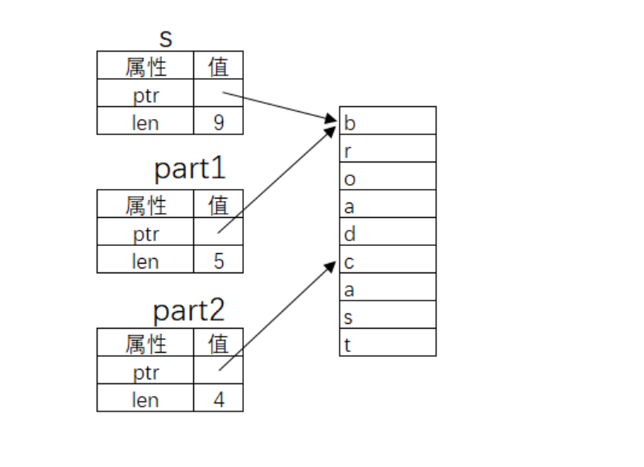

<font style="color:rgb(51, 51, 51);">切片(Slice)是对数据值的部分引用。</font>

<font style="color:rgb(51, 51, 51);">切片这个名字往往出现在生物课上，我们做样本玻片的时候要从生物体上获取切片，以供在显微镜上观察。在 Rust 中，切片的意思大致也是这样，只不过它从数据取材引用。</font>

## <font style="color:rgb(51, 51, 51);">字符串切片</font>
<font style="color:rgb(51, 51, 51);">最简单、最常用的数据切片类型是字符串切片（String Slice）。</font>

**<font style="color:rgb(51, 51, 51);background-color:rgb(239, 239, 239);">示例</font>**

```rust
fn main() {
    let s = String::from("broadcast");

    let part1 = &s[0..5];
    let part2 = &s[5..9];

    println!("{}={}+{}", s, part1, part2);
}
```

<font style="color:rgb(51, 51, 51);">运行结果：</font>

```rust
broadcast=broad+cast
```



<font style="color:rgb(51, 51, 51);">上图解释了字符串切片的原理（注：Rust 中的字符串类型实质上记录了字符在内存中的起始位置和其长度，我们暂时了解到这一点）。</font>

<font style="color:rgb(51, 51, 51);">使用 .. 表示范围的语法在循环章节中出现过。</font>**<font style="color:rgb(51, 51, 51);">x..y</font>**<font style="color:rgb(51, 51, 51);"> </font><font style="color:rgb(51, 51, 51);">表示</font><font style="color:rgb(51, 51, 51);"> </font>**<font style="color:rgb(51, 51, 51);">[x, y)</font>**<font style="color:rgb(51, 51, 51);"> </font><font style="color:rgb(51, 51, 51);">的数学含义。.. 两边可以没有运算数：</font>

```rust
..y 等价于 0..y
x.. 等价于位置 x 到数据结束
.. 等价于位置 0 到结束
```

**<font style="color:rgb(51, 51, 51);">注意：</font>**<font style="color:rgb(51, 51, 51);">到目前为止，尽量不要在字符串中使用非英文字符，因为编码的问题。具体原因会在"字符串"章节叙述。</font>

<font style="color:rgb(51, 51, 51);">被切片引用的字符串禁止更改其值：</font>

**<font style="color:rgb(51, 51, 51);background-color:rgb(239, 239, 239);">示例</font>**

```rust
fn main() {
    let mut s = String::from("nhooo");
    let slice = &s[0..3];
    s.push_str("yes!"); // 错误
    println!("slice = {}", slice);
}
```

<font style="color:rgb(51, 51, 51);">这段程序不正确。</font>

<font style="color:rgb(51, 51, 51);">s 被部分引用，禁止更改其值。</font>

<font style="color:rgb(51, 51, 51);">实际上，到目前为止你一定疑惑为什么每一次使用字符串都要这样写String::from("nhooo") ，直接写</font><font style="color:rgb(51, 51, 51);"> </font>**<font style="color:rgb(51, 51, 51);">"nhooo"</font>**<font style="color:rgb(51, 51, 51);"> </font><font style="color:rgb(51, 51, 51);">不行吗？</font>

<font style="color:rgb(51, 51, 51);">事已至此我们必须分辨这两者概念的区别了。在 Rust 中有两种常用的字符串类型：str 和 String。str 是 Rust 核心语言类型，就是本章一直在讲的字符串切片（String Slice），常常以引用的形式出现（&str）。</font>

<font style="color:rgb(51, 51, 51);">凡是用双引号包括的字符串常量整体的类型性质都是</font><font style="color:rgb(51, 51, 51);"> </font>**<font style="color:rgb(51, 51, 51);">&str</font>**<font style="color:rgb(51, 51, 51);">：</font>

let s = "hello";

<font style="color:rgb(51, 51, 51);">这里的 s 就是一个 &str 类型的变量。</font>

<font style="color:rgb(51, 51, 51);">String 类型是 Rust 标准公共库提供的一种数据类型，它的功能更完善——它支持字符串的追加、清空等实用的操作。String 和 str 除了同样拥有一个字符开始位置属性和一个字符串长度属性以外还有一个容量(capacity)属性。</font>

<font style="color:rgb(51, 51, 51);">String 和 str 都支持切片，切片的结果是 &str 类型的数据。</font>

<font style="color:rgb(51, 51, 51);">注意：切片结果必须是引用类型，但开发者必须自己明示这一点:</font>

let slice = &s[0..3];

<font style="color:rgb(51, 51, 51);">有一个快速的办法可以将 String 转换成 &str：</font>

```rust
let s1 = String::from("hello");
let s2 = &s1[..];
```

## <font style="color:rgb(51, 51, 51);">非字符串切片</font>
<font style="color:rgb(51, 51, 51);">除了字符串以外，其他一些线性数据结构也支持切片操作，例如数组：</font>

**<font style="color:rgb(51, 51, 51);background-color:rgb(239, 239, 239);">示例</font>**

```rust
fn main() {
    let arr = [1, 3, 5, 7, 9];
    let part = &arr[0..3];
    for i in part.iter() {
        println!("{}", i);
    }
}
```

<font style="color:rgb(51, 51, 51);">运行结果：</font>

```rust
1
3
5
```

