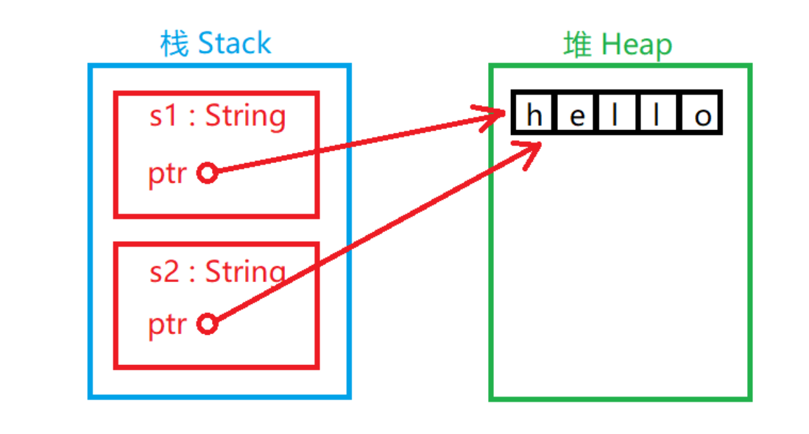
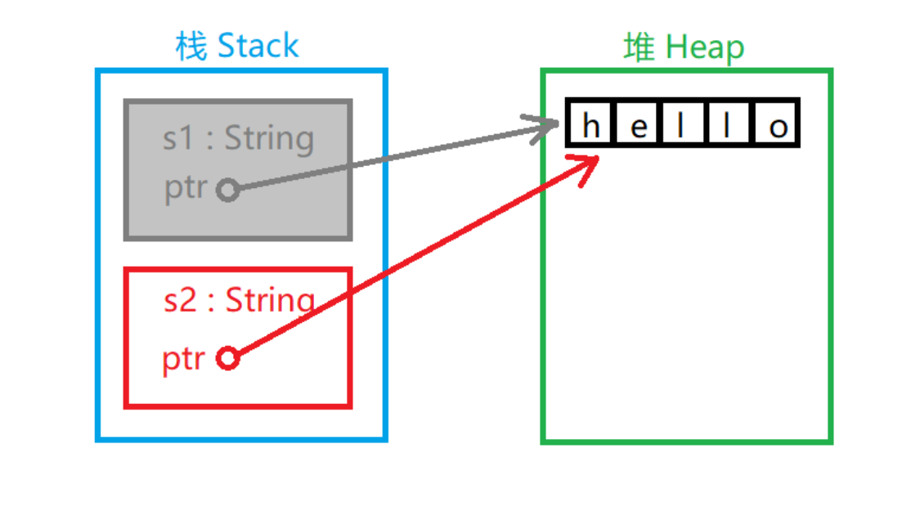
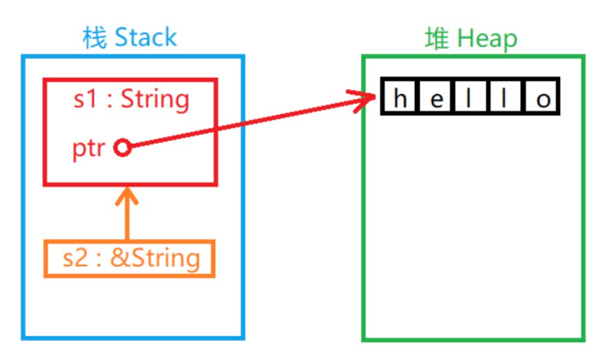

<font style="color:rgb(51, 51, 51);">计算机程序必须在运行时管理它们所使用的内存资源。</font>

<font style="color:rgb(51, 51, 51);">大多数的编程语言都有管理内存的功能：</font>

<font style="color:rgb(51, 51, 51);">C/C++ 这样的语言主要通过手动方式管理内存，开发者需要手动的申请和释放内存资源。但为了提高开发效率，只要不影响程序功能的实现，许多开发者没有及时释放内存的习惯。所以手动管理内存的方式常常造成资源浪费。</font>

<font style="color:rgb(51, 51, 51);">Java 语言编写的程序在虚拟机(JVM)中运行，JVM 具备自动回收内存资源的功能。但这种方式常常会降低运行时效率，所以 JVM 会尽可能少的回收资源，这样也会使程序占用较大的内存资源。</font>

<font style="color:rgb(51, 51, 51);">所有权对大多数开发者而言是一个新颖的概念，它是 Rust 语言为高效使用内存而设计的语法机制。所有权概念是为了让 Rust 在编译阶段更有效地分析内存资源的有用性以实现内存管理而诞生的概念。</font>

## <font style="color:rgb(51, 51, 51);">所有权规则</font>
<font style="color:rgb(51, 51, 51);">所有权有以下三条规则：</font>

+ <font style="color:rgb(51, 51, 51);">Rust 中的每个值都有一个变量，称为其所有者。</font>
+ <font style="color:rgb(51, 51, 51);">一次只能有一个所有者。</font>
+ <font style="color:rgb(51, 51, 51);">当所有者不在程序运行范围时，该值将被删除。</font>

<font style="color:rgb(51, 51, 51);">这三条规则是所有权概念的基础。</font>

<font style="color:rgb(51, 51, 51);">接下来将介绍与所有权概念有关的概念。</font>

## <font style="color:rgb(51, 51, 51);">变量范围</font>
<font style="color:rgb(51, 51, 51);">我们用下面这段程序描述变量范围的概念：</font>

```rust
{
    // 在声明以前，变量 s 无效
    let s = "nhooo";
    // 这里是变量 s 的可用范围
}
// 变量范围已经结束，变量 s 无效
```

<font style="color:rgb(51, 51, 51);">变量范围是变量的一个属性，其代表变量的可行域，默认从声明变量开始有效直到变量所在域结束。</font>

## <font style="color:rgb(51, 51, 51);">内存和分配</font>
<font style="color:rgb(51, 51, 51);">如果我们定义了一个变量并给它赋予一个值，这个变量的值存在于内存中。这种情况很普遍。但如果我们需要储存的数据长度不确定（比如用户输入的一串字符串），我们就无法在定义时明确数据长度，也就无法在编译阶段令程序分配固定长度的内存空间供数据储存使用。（有人说分配尽可能大的空间可以解决问题，但这个方法很不文明）。这就需要提供一种在程序运行时程序自己申请使用内存的机制——堆。本章所讲的所有"内存资源"都指的是堆所占用的内存空间。</font>

<font style="color:rgb(51, 51, 51);">有分配就有释放，程序不能一直占用某个内存资源。因此决定资源是否浪费的关键因素就是资源有没有及时的释放。</font>

<font style="color:rgb(51, 51, 51);">我们把字符串样例程序用 C 语言等价编写：</font>

```rust
{
    char *s = "nhooo";
    free(s); // 释放 s 资源
}
```

<font style="color:rgb(51, 51, 51);">很显然，Rust 中没有调用 free 函数来释放字符串 s 的资源（我知道这样在 C 语言中是不正确的写法，因为 "nhooo" 不在堆中，这里假设它在）。Rust 之所以没有明示释放的步骤是因为在变量范围结束的时候，Rust 编译器自动添加了调用释放资源函数的步骤。</font>

<font style="color:rgb(51, 51, 51);">这种机制看似很简单了：它不过是帮助程序员在适当的地方添加了一个释放资源的函数调用而已。但这种简单的机制可以有效地解决一个史上最令程序员头疼的编程问题。</font>

## <font style="color:rgb(51, 51, 51);">变量与数据交互的方式</font>
<font style="color:rgb(51, 51, 51);">变量与数据交互方式主要有移动(Move)和克隆(Clone)两种：</font>

## <font style="color:rgb(51, 51, 51);">移动</font>
<font style="color:rgb(51, 51, 51);">多个变量可以在 Rust 中以不同的方式与相同的数据交互：</font>

```rust
let x = 5;
let y = x;
```

<font style="color:rgb(51, 51, 51);">这个程序将值 5 绑定到变量 x，然后将 x 的值复制并赋值给变量 y。现在栈中将有两个值 5。此情况中的数据是"基本数据"类型的数据，不需要存储到堆中，仅在栈中的数据的"移动"方式是直接复制，这不会花费更长的时间或更多的存储空间。"基本数据"类型有这些：</font>

+ <font style="color:rgb(51, 51, 51);">所有整数类型，例如 i32 、 u32 、 i64 等。</font>
+ <font style="color:rgb(51, 51, 51);">布尔类型 bool，值为 true 或 false 。</font>
+ <font style="color:rgb(51, 51, 51);">所有浮点类型，f32 和 f64。</font>
+ <font style="color:rgb(51, 51, 51);">字符类型 char。</font>
+ <font style="color:rgb(51, 51, 51);">仅包含以上类型数据的元组(Tuples)。</font>

<font style="color:rgb(51, 51, 51);">但如果发生交互的数据在堆中就是另外一种情况：</font>

```rust
let s1 = String::from("hello");
let s2 = s1;
```

<font style="color:rgb(51, 51, 51);">第一步产生一个 String 对象，值为 "hello"。其中  "hello" 可以认为是类似于长度不确定的数据，需要在堆中存储。</font>

<font style="color:rgb(51, 51, 51);">第二步的情况略有不同（</font>**<font style="color:rgb(51, 51, 51);">这不是完全真的，仅用来对比参考</font>**<font style="color:rgb(51, 51, 51);">）：</font>



<font style="color:rgb(51, 51, 51);">如图所示：两个 String 对象在栈中，每个 String 对象都有一个指针指向堆中的 "hello" 字符串。在给 s2 赋值时，只有栈中的数据被复制了，堆中的字符串依然还是原来的字符串。</font>

<font style="color:rgb(51, 51, 51);">前面我们说过，当变量超出范围时，Rust 自动调用释放资源函数并清理该变量的堆内存。但是 s1 和 s2 都被释放的话堆区中的 "hello" 被释放两次，这是不被系统允许的。为了确保安全，在给 s2 赋值时 s1 已经无效了。没错，在把 s1 的值赋给 s2 以后 s1 将不可以再被使用。下面这段程序是错的：</font>

```rust
let s1 = String::from("hello");
let s2 = s1; 
println!("{}, world!", s1); // 错误！s1 已经失效
```

<font style="color:rgb(51, 51, 51);">所以实际情况是：</font>



<font style="color:rgb(51, 51, 51);">s1 名存实亡。</font>

## <font style="color:rgb(51, 51, 51);">克隆</font>
<font style="color:rgb(51, 51, 51);">Rust会尽可能地降低程序的运行成本，所以默认情况下，长度较大的数据存放在堆中，且采用移动的方式进行数据交互。但如果需要将数据单纯的复制一份以供他用，可以使用数据的第二种交互方式——克隆。</font>

**<font style="color:rgb(51, 51, 51);background-color:rgb(239, 239, 239);">示例</font>**

```rust
fn main() {
    let s1 = String::from("hello");
    let s2 = s1.clone();
    println!("s1 = {}, s2 = {}", s1, s2);
}
```

<font style="color:rgb(51, 51, 51);">运行结果：</font>

s1 = hello, s2 = hello

<font style="color:rgb(51, 51, 51);">这里是真的将堆中的 "hello" 复制了一份，所以 s1 和 s2 都分别绑定了一个值，释放的时候也会被当作两个资源。</font>

<font style="color:rgb(51, 51, 51);">当然，克隆仅在需要复制的情况下使用，毕竟复制数据会花费更多的时间。</font>

## <font style="color:rgb(51, 51, 51);">涉及函数的所有权机制</font>
<font style="color:rgb(51, 51, 51);">对于变量来说这是最复杂的情况了。</font>

<font style="color:rgb(51, 51, 51);">如果将一个变量当作函数的参数传给其他函数，怎样安全的处理所有权呢？</font>

<font style="color:rgb(51, 51, 51);">下面这段程序描述了这种情况下所有权机制的运行原理：</font>

**<font style="color:rgb(51, 51, 51);background-color:rgb(239, 239, 239);">示例</font>**

```rust
fn main() {
    let s = String::from("hello");
    // s 被声明有效

    takes_ownership(s);
    // s 的值被当作参数传入函数
    // 所以可以当作 s 已经被移动，从这里开始已经无效

    let x = 5;
    // x 被声明有效

    makes_copy(x);
    // x 的值被当作参数传入函数
    // 但 x 是基本类型，依然有效
    // 在这里依然可以使用 x 却不能使用 s

} // 函数结束, x 无效, 然后是 s. 但 s 已被移动, 所以不用被释放


fn takes_ownership(some_string: String) { 
    // 一个 String 参数 some_string 传入，有效
    println!("{}", some_string);
} // 函数结束, 参数 some_string 在这里释放

fn makes_copy(some_integer: i32) { 
    // 一个 i32 参数 some_integer 传入，有效
    println!("{}", some_integer);
} // 函数结束, 参数 some_integer 是基本类型, 无需释放
```

<font style="color:rgb(51, 51, 51);">如果将变量当作参数传入函数，那么它和移动的效果是一样的。</font>

## <font style="color:rgb(51, 51, 51);">函数返回值的所有权机制</font>
**<font style="color:rgb(51, 51, 51);background-color:rgb(239, 239, 239);">示例</font>**

```rust
fn main() {
    let s1 = gives_ownership();
    // gives_ownership 移动它的返回值到 s1

    let s2 = String::from("hello");
    // s2 被声明有效

    let s3 = takes_and_gives_back(s2);
    // s2 被当作参数移动, s3 获得返回值所有权
} // s3 无效被释放, s2 被移动, s1 无效被释放.

fn gives_ownership() -> String {
    let some_string = String::from("hello");
    // some_string 被声明有效

    return some_string;
    // some_string 被当作返回值移动出函数
}

fn takes_and_gives_back(a_string: String) -> String { 
    // a_string 被声明有效

    a_string  // a_string 被当作返回值移出函数
}
```

<font style="color:rgb(51, 51, 51);">被当作函数返回值的变量所有权将会被移动出函数并返回到调用函数的地方，而不会直接被无效释放。</font>

## <font style="color:rgb(51, 51, 51);">引用与租借</font>
<font style="color:rgb(51, 51, 51);">引用(Reference)是 C++ 开发者较为熟悉的概念。</font>

<font style="color:rgb(51, 51, 51);">如果你熟悉指针的概念，你可以把它看作一种指针。</font>

<font style="color:rgb(51, 51, 51);">实质上"引用"是变量的间接访问方式。</font>

**<font style="color:rgb(51, 51, 51);background-color:rgb(239, 239, 239);">示例</font>**

```rust
fn main() {
    let s1 = String::from("hello");
    let s2 = &s1;
    println!("s1 is {}, s2 is {}", s1, s2);
}
```

<font style="color:rgb(51, 51, 51);">运行结果：</font>

s1 is hello, s2 is hello

<font style="color:rgb(51, 51, 51);">& 运算符可以取变量的"引用"。</font>

<font style="color:rgb(51, 51, 51);">当一个变量的值被引用时，变量本身不会被认定无效。因为"引用"并没有在栈中复制变量的值：</font>



<font style="color:rgb(51, 51, 51);">函数参数传递的道理一样：</font>

**<font style="color:rgb(51, 51, 51);background-color:rgb(239, 239, 239);">示例</font>**

```rust
fn main() {
    let s1 = String::from("hello");

    let len = calculate_length(&s1);

    println!("The length of '{}' is {}.", s1, len);
}

fn calculate_length(s: &String) -> usize {
    s.len()
}
```

<font style="color:rgb(51, 51, 51);">运行结果：</font>

The length of 'hello' is 5.

<font style="color:rgb(51, 51, 51);">引用不会获得值的所有权。</font>

<font style="color:rgb(51, 51, 51);">引用只能租借(Borrow)值的所有权。</font>

<font style="color:rgb(51, 51, 51);">引用本身也是一个类型并具有一个值，这个值记录的是别的值所在的位置，但引用不具有所指值的所有权：</font>

**<font style="color:rgb(51, 51, 51);background-color:rgb(239, 239, 239);">示例</font>**

```rust
fn main() {
    let s1 = String::from("hello");
    let s2 = &s1;
    let s3 = s1;
    println!("{}", s2);
}
```

<font style="color:rgb(51, 51, 51);">这段程序不正确：因为 s2 租借的 s1 已经将所有权移动到 s3，所以 s2 将无法继续租借使用 s1 的所有权。如果需要使用 s2 使用该值，必须重新租借：</font>

**<font style="color:rgb(51, 51, 51);background-color:rgb(239, 239, 239);">示例</font>**

```rust
fn main() {
    let s1 = String::from("hello");
    let mut s2 = &s1;
    let s3 = s2;
    s2 = &s3; // 重新从 s3 租借所有权
    println!("{}", s2);
}
```

<font style="color:rgb(51, 51, 51);">这段程序是正确的。</font>

<font style="color:rgb(51, 51, 51);">既然引用不具有所有权，即使它租借了所有权，它也只享有使用权（这跟租房子是一个道理）。</font>

<font style="color:rgb(51, 51, 51);">如果尝试利用租借来的权利来修改数据会被阻止：</font>

**<font style="color:rgb(51, 51, 51);background-color:rgb(239, 239, 239);">示例</font>**

```rust
fn main() {
    let s1 = String::from("run");
    let s2 = &s1; 
    println!("{}", s2);
    s2.push_str("oob"); // 错误，禁止修改租借的值
    println!("{}", s2);
}
```

<font style="color:rgb(51, 51, 51);">这段程序中 s2 尝试修改 s1 的值被阻止，租借的所有权不能修改所有者的值。</font>

<font style="color:rgb(51, 51, 51);">当然，也存在一种可变的租借方式，就像你租一个房子，如果物业指定房主可以修改房子结构，房主在租借时也在合同中声明赋予你这种权利，你是可以重新装修房子的：</font>

**<font style="color:rgb(51, 51, 51);background-color:rgb(239, 239, 239);">示例</font>**

```rust
fn main() {
    let mut s1 = String::from("run");
    // s1 是可变的

    let s2 = &mut s1;
    // s2 是可变的引用

    s2.push_str("oob");
    println!("{}", s2);
}
```

<font style="color:rgb(51, 51, 51);">这段程序就没有问题了。我们用 &mut  修饰可变的引用类型。</font>

<font style="color:rgb(51, 51, 51);">可变引用与不可变引用相比除了权限不同以外，可变引用不允许多重引用，但不可变引用可以：</font>

**<font style="color:rgb(51, 51, 51);background-color:rgb(239, 239, 239);">示例</font>**

```rust
let mut s = String::from("hello");

let r1 = &mut s;
let r2 = &mut s;

println!("{}, {}", r1, r2);
```

<font style="color:rgb(51, 51, 51);">这段程序不正确，因为多重可变引用了 s。</font>

<font style="color:rgb(51, 51, 51);">Rust 对可变引用的这种设计主要出于对并发状态下发生数据访问碰撞的考虑，在编译阶段就避免了这种事情的发生。</font>

<font style="color:rgb(51, 51, 51);">由于发生数据访问碰撞的必要条件之一是数据被至少一个使用者写且同时被至少一个其他使用者读或写，所以在一个值被可变引用时不允许再次被任何引用。</font>

## <font style="color:rgb(51, 51, 51);">垂悬引用（Dangling References）</font>
<font style="color:rgb(51, 51, 51);">这是一个换了个名字的概念，如果放在有指针概念的编程语言里它就指的是那种没有实际指向一个真正能访问的数据的指针（注意，不一定是空指针，还有可能是已经释放的资源）。它们就像失去悬挂物体的绳子，所以叫"垂悬引用"。</font>

<font style="color:rgb(51, 51, 51);">"垂悬引用"在 Rust 语言里不允许出现，如果有，编译器会发现它。</font>

<font style="color:rgb(51, 51, 51);">下面是一个垂悬的典型案例：</font>

**<font style="color:rgb(51, 51, 51);background-color:rgb(239, 239, 239);">示例</font>**

```rust
fn main() {
    let reference_to_nothing = dangle();
}

fn dangle() -> &String {
    let s = String::from("hello");

    &s
}
```

<font style="color:rgb(51, 51, 51);">很显然，伴随着 dangle 函数的结束，其局部变量的值本身没有被当作返回值，被释放了。但它的引用却被返回，这个引用所指向的值已经不能确定的存在，故不允许其出现。</font>

