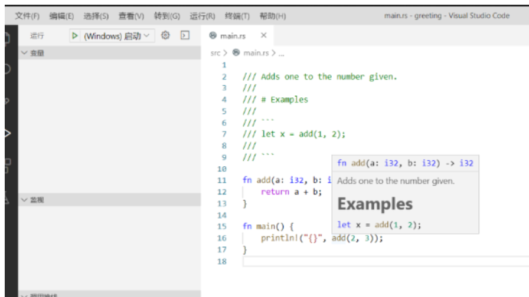

<font style="color:rgb(51, 51, 51);">Rust 中的注释方式与其它语言（C、Java）一样，支持两种注释方式：</font>

**<font style="color:rgb(51, 51, 51);background-color:rgb(239, 239, 239);">示例</font>**

```rust
// 这是第一种注释方式

/* 这是第二种注释方式 */ 

/* 
 * 多行注释
 * 多行注释
 * 多行注释
 */
```

## <font style="color:rgb(51, 51, 51);">用于说明文档的注释</font>
<font style="color:rgb(51, 51, 51);">在 Rust 中使用 // 可以使其之后到第一个换行符的内容变成注释。</font>

<font style="color:rgb(51, 51, 51);">在这种规则下，三个反斜杠 /// 依然是合法的注释开始。所以 Rust 可以用</font><font style="color:rgb(51, 51, 51);"> </font>**<font style="color:rgb(51, 51, 51);">///</font>**<font style="color:rgb(51, 51, 51);"> </font><font style="color:rgb(51, 51, 51);">作为说明文档注释的开头：</font>

**<font style="color:rgb(51, 51, 51);background-color:rgb(239, 239, 239);">示例</font>**

```rust
/// Adds one to the number given. 
/// 
/// # Examples 
/// 
/// ``` 
/// let x = add(1, 2); 
/// 
/// ``` 

fn add(a: i32, b: i32) -> i32 { 
    return a + b; 
} 

fn main() { 
    println!("{}",add(2,3)); 
}
```

<font style="color:rgb(51, 51, 51);">程序中的函数 add 就会拥有一段优雅的注释，并可以显示在 IDE 中：</font>



**<font style="color:rgb(51, 51, 51);">Tip：</font>**<font style="color:rgb(51, 51, 51);">Cargo 具有 cargo doc 功能，开发者可以通过这个命令将工程中的说明注释转换成 HTML 格式的说明文档。</font>

