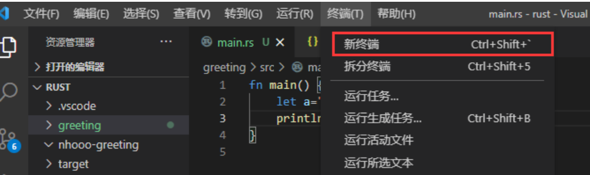

<font style="color:rgb(51, 51, 51);">Rust 有一套独特的处理异常情况的机制，它并不像其它语言中的 try 机制那样简单。</font>

<font style="color:rgb(51, 51, 51);">首先，程序中一般会出现两种错误：可恢复错误和不可恢复错误。</font>

<font style="color:rgb(51, 51, 51);">可恢复错误的典型案例是文件访问错误，如果访问一个文件失败，有可能是因为它正在被占用，是正常的，我们可以通过等待来解决。</font>

<font style="color:rgb(51, 51, 51);">但还有一种错误是由编程中无法解决的逻辑错误导致的，例如访问数组末尾以外的位置。</font>

<font style="color:rgb(51, 51, 51);">大多数编程语言不区分这两种错误，并用 Exception （异常）类来表示错误。在 Rust 中没有 Exception。</font>

<font style="color:rgb(51, 51, 51);">对于可恢复错误用 Result<T, E> 类来处理，对于不可恢复错误使用 panic! 宏来处理。</font>

## <font style="color:rgb(51, 51, 51);">不可恢复错误</font>
<font style="color:rgb(51, 51, 51);">本章以前没有专门介绍 Rust 宏的语法，但已经使用过了 println! 宏，因为这些宏的使用较为简单，所以暂时不需要彻底掌握它，我们可以用同样的方法先学会使用 panic! 宏的使用方法。</font>

**<font style="color:rgb(51, 51, 51);background-color:rgb(239, 239, 239);">示例</font>**

```plain
fn main() {
    panic!("error occured");
    println!("Hello, Rust");
}
```

<font style="color:rgb(51, 51, 51);">运行结果：</font>

```plain
thread 'main' panicked at 'error occured', src\main.rs:3:5
note: run with `RUST_BACKTRACE=1` environment variable to display a backtrace.
```

<font style="color:rgb(51, 51, 51);">很显然，程序并不能如约运行到 println!("Hello, Rust") ，而是在 panic! 宏被调用时停止了运行。</font>

<font style="color:rgb(51, 51, 51);">不可恢复的错误一定会导致程序受到致命的打击而终止运行。</font>

<font style="color:rgb(51, 51, 51);">让我们注视错误输出的两行：</font>

+ <font style="color:rgb(51, 51, 51);">第一行输出了 panic! 宏调用的位置以及其输出的错误信息。</font>
+ <font style="color:rgb(51, 51, 51);">第二行是一句提示，翻译成中文就是"通过 `RUST_BACKTRACE=1` 环境变量运行以显示回溯"。接下来我们将介绍回溯(backtrace)。</font>

<font style="color:rgb(51, 51, 51);">紧接着刚才的实例，我们在 VSCode 中新建一个终端：</font>



<font style="color:rgb(51, 51, 51);">在新建的终端里设置环境变量（不同的终端方法不同，这里介绍两种主要的方法）：</font>

<font style="color:rgb(51, 51, 51);">如果在 Windows 7 及以上的 Windows 系统版本中，默认使用的终端命令行是 Powershell，请使用以下命令：</font>

$env:RUST_BACKTRACE=1 ; cargo run

<font style="color:rgb(51, 51, 51);">如果你使用的是 Linux 或 macOS 等 UNIX 系统，一般情况下默认使用的是 bash 命令行，请使用以下命令：</font>

RUST_BACKTRACE=1 cargo run

<font style="color:rgb(51, 51, 51);">然后，你会看到以下文字：</font>

```plain
thread 'main' panicked at 'error occured', src\main.rs:3:5
stack backtrace:
  ...
  11: greeting::main
             at .\src\main.rs:3
  ...
```

<font style="color:rgb(51, 51, 51);">回溯是不可恢复错误的另一种处理方式，它会展开运行的栈并输出所有的信息，然后程序依然会退出。上面的省略号省略了大量的输出信息，我们可以找到我们编写的 panic! 宏触发的错误。</font>

## <font style="color:rgb(51, 51, 51);">可恢复的错误</font>
<font style="color:rgb(51, 51, 51);">此概念十分类似于 Java 编程语言中的异常。实际上在 C 语言中我们就常常将函数返回值设置成整数来表达函数遇到的错误，在 Rust 中通过 Result<T, E> 枚举类作返回值来进行异常表达：</font>

```plain
enum Result<T, E> {
    Ok(T),
    Err(E),
}
```

<font style="color:rgb(51, 51, 51);">在 Rust 标准库中可能产生异常的函数的返回值都是 Result 类型的。例如：当我们尝试打开一个文件时：</font>

**<font style="color:rgb(51, 51, 51);background-color:rgb(239, 239, 239);">示例</font>**

```plain
use std::fs::File;

fn main() {
    let f = File::open("hello.txt");
    match f {
        Ok(file) => {
            println!("File opened successfully.");
        },
        Err(err) => {
            println!("Failed to open the file.");
        }
    }
}
```

<font style="color:rgb(51, 51, 51);">如果 hello.txt 文件不存在，会打印</font><font style="color:rgb(51, 51, 51);"> </font>**<font style="color:rgb(51, 51, 51);">"Failed to open the file."</font>**<font style="color:rgb(51, 51, 51);">。</font>

<font style="color:rgb(51, 51, 51);">当然，我们在枚举类章节讲到的 if let 语法可以简化 match 语法块：</font>

**<font style="color:rgb(51, 51, 51);background-color:rgb(239, 239, 239);">示例</font>**

```plain
use std::fs::File;

fn main() {
    let f = File::open("hello.txt");
    if let Ok(file) = f {
        println!("File opened successfully.");
    } else {
        println!("Failed to open the file.");
    }
}
```

<font style="color:rgb(51, 51, 51);">如果想使一个可恢复错误按不可恢复错误处理，Result 类提供了两个办法：unwrap() 和 expect(message: &str) ：</font>

**<font style="color:rgb(51, 51, 51);background-color:rgb(239, 239, 239);">示例</font>**

```plain
use std::fs::File;

fn main() {
    let f1 = File::open("hello.txt").unwrap();
    let f2 = File::open("hello.txt").expect("Failed to open.");
}
```

<font style="color:rgb(51, 51, 51);">这段程序相当于在 Result 为 Err 时调用 panic! 宏。两者的区别在于 expect 能够向 panic! 宏发送一段指定的错误信息。</font>

## <font style="color:rgb(51, 51, 51);">可恢复的错误的传递</font>
<font style="color:rgb(51, 51, 51);">之前所讲的是接收到错误的处理方式，但是如果我们自己编写一个函数在遇到错误时想传递出去怎么办呢？</font>

**<font style="color:rgb(51, 51, 51);background-color:rgb(239, 239, 239);">示例</font>**

```plain
fn f(i: i32) -> Result<i32, bool> {
    if i >= 0 { Ok(i) }
    else { Err(false) }
}

fn main() {
    let r = f(10000);
    if let Ok(v) = r {
        println!("Ok: f(-1) = {}", v);
    } else {
        println!("Err");
    }
}
```

<font style="color:rgb(51, 51, 51);">运行结果：</font>

Ok: f(-1) = 10000

<font style="color:rgb(51, 51, 51);">这段程序中函数 f 是错误的根源，现在我们再写一个传递错误的函数 g ：</font>

**<font style="color:rgb(51, 51, 51);background-color:rgb(239, 239, 239);">示例</font>**

```plain
fn g(i: i32) -> Result<i32, bool> {
    let t = f(i);
    return match t {
        Ok(i) => Ok(i),
        Err(b) => Err(b)
    };
}
```

<font style="color:rgb(51, 51, 51);">函数 g 传递了函数 f 可能出现的错误（这里的 g 只是一个简单的实例，实际上传递错误的函数一般还包含很多其它操作）。</font>

<font style="color:rgb(51, 51, 51);">这样写有些冗长，Rust 中可以在 Result 对象后添加 ? 操作符将同类的 Err 直接传递出去：</font>

**<font style="color:rgb(51, 51, 51);background-color:rgb(239, 239, 239);">示例</font>**

```plain
fn f(i: i32) -> Result<i32, bool> {
    if i >= 0 { Ok(i) }
    else { Err(false) }
}

fn g(i: i32) -> Result<i32, bool> {
    let t = f(i)?;
    Ok(t) // 因为确定 t 不是 Err, t 在这里已经是 i32 类型
}

fn main() {
    let r = g(10000);
    if let Ok(v) = r {
        println!("Ok: g(10000) = {}", v);
    } else {
        println!("Err");
    }
}
```

<font style="color:rgb(51, 51, 51);">运行结果：</font>

Ok: g(10000) = 10000

<font style="color:rgb(51, 51, 51);">? 符的实际作用是将 Result 类非异常的值直接取出，如果有异常就将异常 Result 返回出去。所以，? 符仅用于返回值类型为 Result<T, E> 的函数，其中 E 类型必须和 ? 所处理的 Result 的 E 类型一致。</font>

## <font style="color:rgb(51, 51, 51);">kind 方法</font>
<font style="color:rgb(51, 51, 51);">到此为止，Rust 似乎没有像 try 块一样可以令任何位置发生的同类异常都直接得到相同的解决的语法，但这样并不意味着 Rust 实现不了：我们完全可以把 try 块在独立的函数中实现，将所有的异常都传递出去解决。实际上这才是一个分化良好的程序应当遵循的编程方法：应该注重独立功能的完整性。</font>

<font style="color:rgb(51, 51, 51);">但是这样需要判断 Result 的 Err 类型，获取 Err 类型的函数是 kind()。</font>

**<font style="color:rgb(51, 51, 51);background-color:rgb(239, 239, 239);">示例</font>**

```plain
use std::io;
use std::io::Read;
use std::fs::File;

fn read_text_from_file(path: &str) -> Result<String, io::Error> {
    let mut f = File::open(path)?;
    let mut s = String::new();
    f.read_to_string(&mut s)?;
    Ok(s)
}

fn main() {
    let str_file = read_text_from_file("hello.txt");
    match str_file {
        Ok(s) => println!("{}", s),
        Err(e) => {
            match e.kind() {
                io::ErrorKind::NotFound => {
                    println!("No such file");
                },
                _ => {
                    println!("Cannot read the file");
                }
            }
        }
    }
}
```

<font style="color:rgb(51, 51, 51);">运行结果：</font>

```rust
No such file
```

