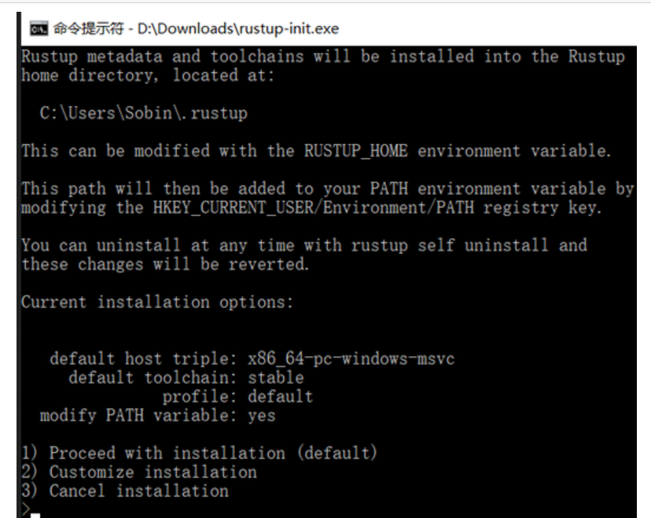
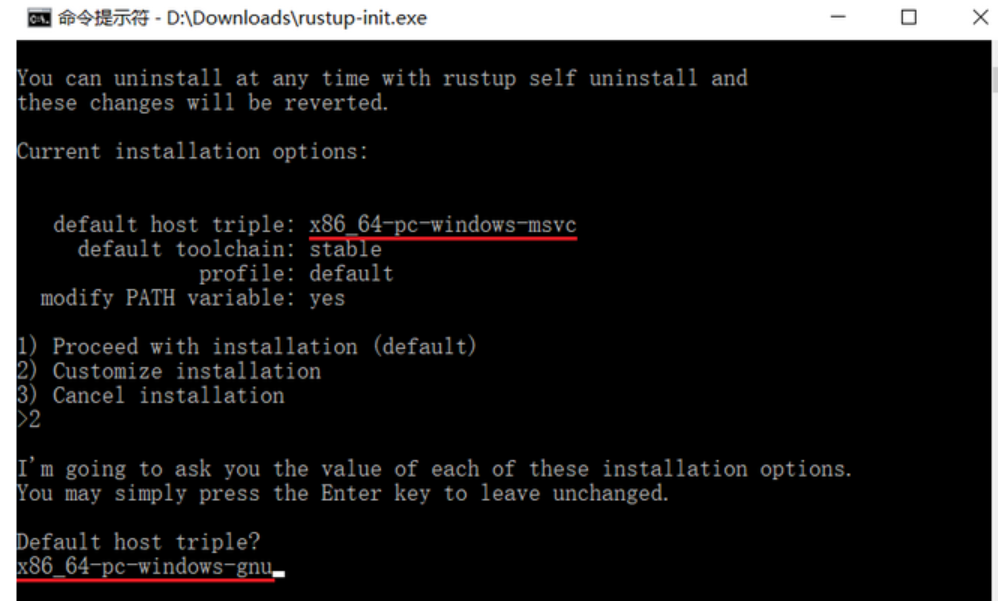
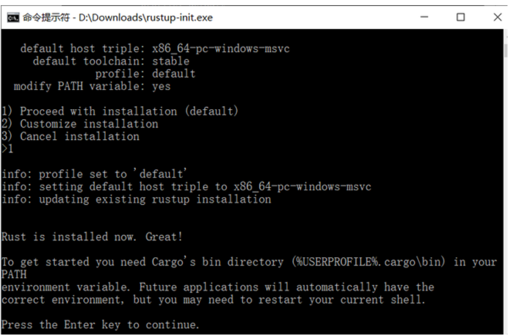
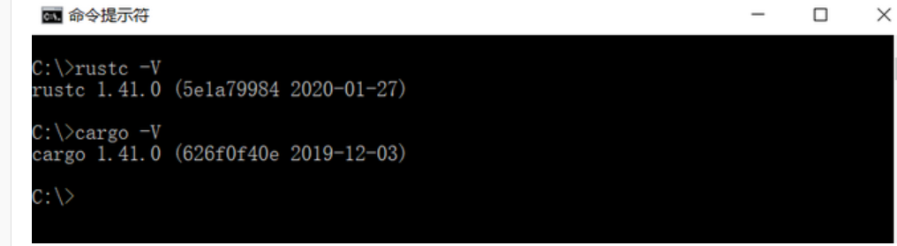
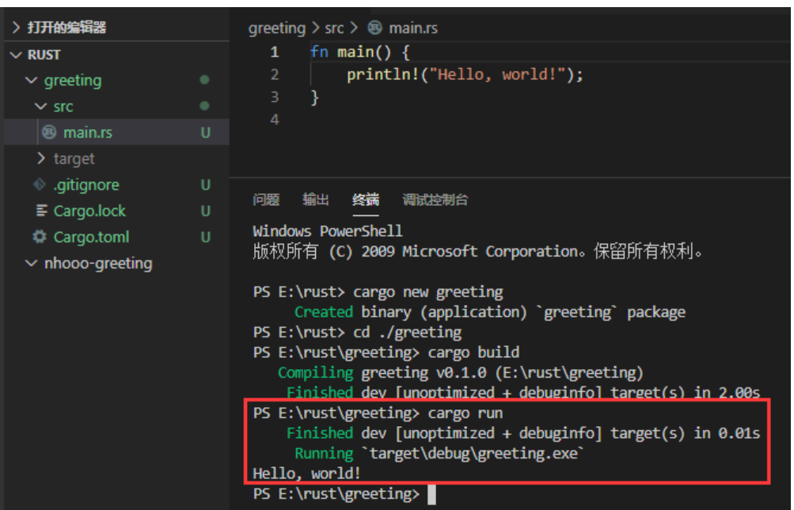

## <font style="color:rgb(51, 51, 51);">搭建 Visual Studio Code 开发环境</font>
<font style="color:rgb(51, 51, 51);">首先，需要安装最新版的 Rust 编译工具和 Visual Studio Code。</font>

<font style="color:rgb(51, 51, 51);">Rust 编译工具：</font>[<font style="color:rgb(51, 122, 183);">https://www.rust-lang.org/zh-CN/tools/install</font>](https://www.rust-lang.org/zh-CN/tools/install)

<font style="color:rgb(51, 51, 51);">Visual Studio Code：</font>[<font style="color:rgb(51, 122, 183);">https://code.visualstudio.com/Download</font>](https://code.visualstudio.com/Download)

<font style="color:rgb(51, 51, 51);">Rust 的编译工具依赖 C 语言的编译工具，这意味着你的电脑上至少已经存在一个 C 语言的编译环境。如果你使用的是 Linux 系统，往往已经具备了 GCC 或 clang。如果你使用的是 macOS，需要安装 Xcode。如果你是用的是 Windows 操作系统，你需要安装 Visual Studio 2013 或以上的环境（需要 C/C++ 支持）以使用 MSVC 或安装 MinGW + GCC 编译环境（Cygwin 还没有测试）。</font>

## <font style="color:rgb(51, 51, 51);">安装 Rust 编译工具</font>
<font style="color:rgb(51, 51, 51);">Rust 编译工具推荐使用刚才从上方链接中下载的 Rustup 安装。下载好的 Rustup 在 Windows 上是一个可执行程序 rustup-init.exe。（在其他平台上应该是 rustup-init.sh ）。</font>

<font style="color:rgb(51, 51, 51);">现在执行 rustup-init 文件：</font>




<font style="color:rgb(51, 51, 51);">上图显示的是一个命令行安装向导。</font>

**<font style="color:rgb(51, 51, 51);">如果你已经安装 MSVC （推荐），那么安装过程会非常的简单，输入 1 并回车，直接进入第二步</font>**<font style="color:rgb(51, 51, 51);">。</font>

<font style="color:rgb(51, 51, 51);">如果你安装的是 MinGW，那么你需要输入 2 （自定义安装），然后系统会询问你 Default host triple? ，请将上图中 </font>**<font style="color:rgb(51, 51, 51);">default host triple</font>**<font style="color:rgb(51, 51, 51);"> 的 "msvc" 改为 "gnu" 再输入安装程序：</font>



<font style="color:rgb(51, 51, 51);">其它属性都默认。</font>

<font style="color:rgb(51, 51, 51);">设置完所有选项，会回到安装向导界面（第一张图），这是我们输入 1 并回车即可。</font>



<font style="color:rgb(51, 51, 51);">进行到这一步就完成了 Rust 的安装，可以通过以下命令测试：</font>

rustc -V        # 注意的大写的 V



<font style="color:rgb(51, 51, 51);">如果以上两个命令能够输出你安装的版本号，就是安装成功了。</font>

## <font style="color:rgb(51, 51, 51);">搭建 Visual Studio Code 开发环境</font>
<font style="color:rgb(51, 51, 51);">安装 rls 和 Native Debug 两个扩展。重新启动 VSCode，Rust 的开发环境就搭建好了。</font>

<font style="color:rgb(51, 51, 51);">在终端中输入命令：</font>

```bash
cargo new greeting
```

<font style="color:rgb(51, 51, 51);">当前文件下下会构建一个名叫 greeting 的 Rust 工程目录。</font>

<font style="color:rgb(51, 51, 51);">现在在终端里输入以下三个命令：</font>

```plain
cd ./greeting 
cargo build 
cargo run
```

<font style="color:rgb(51, 51, 51);">系统在创建工程时会生成一个 Hello, world 源程序 main.rs，这时会被编译并运行：</font>



