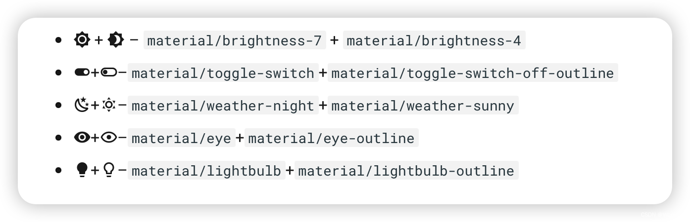
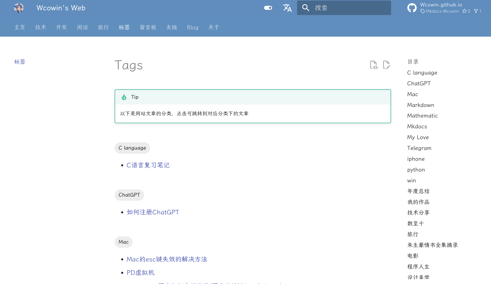
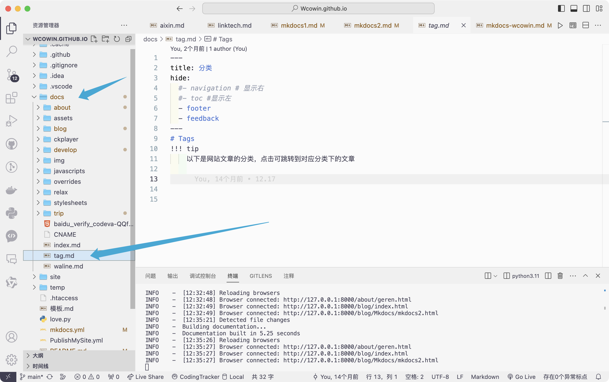
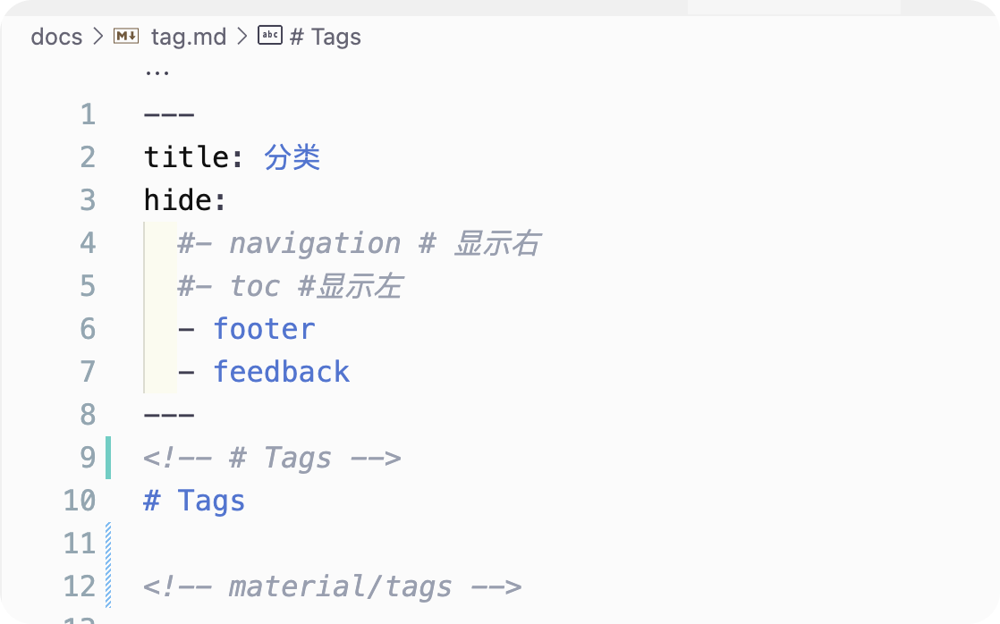
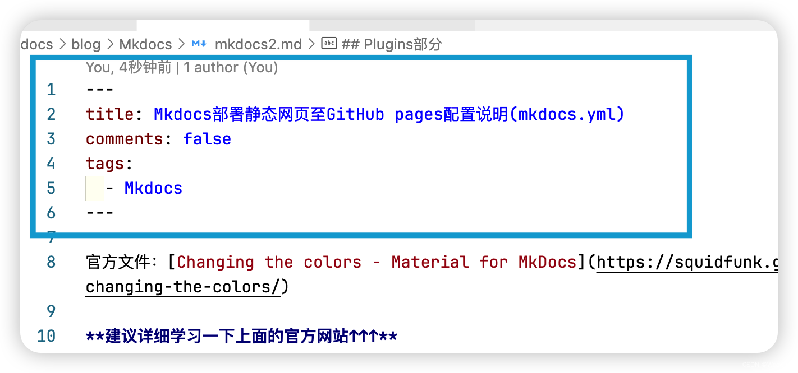

参考[https://blog.csdn.net/m0_63203517/article/details/145482770](https://blog.csdn.net/m0_63203517/article/details/145482770)

[https://squidfunk.github.io/mkdocs-material/setup/changing-the-colors/](https://squidfunk.github.io/mkdocs-material/setup/changing-the-colors/)

# 配置文件
## 项目配置文件
```toml
[tool.poetry]
name = "liyedong-github-io"
version = "0.1.0"
description = ""
authors = ["liyedong <lyd1446034545@gmail.com>"]
readme = "README.md"
packages = [{include = "liyedong"}]

[tool.poetry.dependencies]
python = ">=3.10,<=4.0"
mkdocs = "^1.6.1"
mkdocs-material = "^9.6.7"
setuptools = "^75.8.2"

[build-system]
requires = ["poetry-core"]
build-backend = "poetry.core.masonry.api"

[[tool.poetry.source]]
name = "tsinghua"
priority = "primary"
url = "https://pypi.tuna.tsinghua.edu.cn/simple"
[[tool.poetry.source]]
name = "aliyun"
url = "https://mirrors.aliyun.com/pypi/simple/"
priority = "supplemental"

```

## 网上配置文件
```yaml
#[Info]
site_name: Mkdocs教程 #your site name 显示在左上角
site_url: http://wcowin.work/Mkdocs-Wcowin
site_description: 知足且上进，温柔且坚定
site_author: 王科文(Wcowin) # your name
#[UI]
theme:
  name: material
  custom_dir: docs/overrides #覆写路径
  # font: #谷歌字体，自行搜索
  #   text: Bitter  #文本字体
  #   code: Roboto Mono  #代码字体
  # logo: assets/favicon.png #左上角logo，可插入图片链接
  favicon: https://s2.loli.net/2024/04/26/PmRdM9iGnvOJHgu.png # 网页icon
  palette:
    - media: "(prefers-color-scheme)"
      toggle:
        icon: material/link
        name: 关闭自动模式
    #primary: blue grey
    - media: "(prefers-color-scheme: light)"
      scheme: default # 日间模式
      primary: blue grey # 上方的
      accent: blue # 链接等可交互元件的高亮色
      # teal
      toggle:
        icon: material/toggle-switch # 图标
        name: 切换至夜间模式 # 鼠标悬浮提示
    - media: "(prefers-color-scheme: dark)"
      scheme: slate # 夜间模式
      primary: black
      accent: indigo
      # teal
      toggle:
        icon: material/toggle-switch-off-outline
        name: 切换至日间模式
  features:
    - announce.dismiss #呈现可标记为由用户读取的临时公告，可以包含一个用于取消当前公告的按钮
    # - navigation.instant
    #- header.autohide  #自动隐藏
    - navigation.tracking #地址栏中的 URL 将自动更新为在目录中突出显示的活动锚点
    - navigation.tabs #顶级部分将呈现在上面视口标题下方的菜单层中，但在移动设备上保持原样
    # - navigation.tabs.sticky  #启用粘性选项卡后，导航选项卡将锁定在标题下方，并在向下滚动时始终保持可见
    - navigation.sections #启用部分后，顶级部分在边栏中呈现为1220px以上视口的组，但在移动设备上保持原样
    - navigation.top # 返回顶部的按钮 在上滑时出现
    - navigation.footer #页脚将呈现在边栏中，但在移动设备上保持原样
    - search.suggest # 搜索输入一些字母时推荐补全整个单词
    - search.highlight # 搜索出的文章关键词加入高亮
    - search.share #搜索分享按钮
    - navigation.expand # 打开Tab时左侧目录全部展开
    - navigation.indexes #启用节索引页后，可以将文档直接附加到节
    - content.tabs.link
    - content.tooltips
    - content.code.copy #代码复制
    - content.action.edit
    - content.action.view
    - content.code.annotate
  language: zh # 一些提示性的文字会变成中文
  icon:
    repo: fontawesome/brands/github #右上角图标
    logo: logo
edit_uri: edit/main/docs # 编辑按钮跳转的链接
repo_url: https://github.com/Wcowin/Mkdocs-Wcowin # 右上角点击跳转的链接
repo_name: Mkdocs-Wcowin # 右上角的名字
# [Navigtion]
nav:
  # - 主页: index.md
  - MKdocs中文教程:
      - MKdocs教程(三部曲):
          - 0. Mkdocs教程前言: blog/Mkdocs/mkfirst.md
          - 1. 利用mkdocs部署个人静态博客网页至GitHub pages: blog/Mkdocs/mkdocs1.md
          - 2. Mkdocs部署静态网页至GitHub pages配置说明(mkdocs.yml): blog/Mkdocs/mkdocs2.md
          - 3. 解决 mkdocs部署 Github Pages 自定义域名失效的问题: blog/Mkdocs/mkdocs3.md
      - Mkdocs美化:
          - 添加Mkdocs博客: blog/Mkdocs/mkdocsblog.md
          - 网页圆角化设计: blog/websitebeauty/yuanjiaohua.md
          - 添加评论系统(giscus为例): blog/websitebeauty/mkcomments.md
          - 添加在线聊天: blog/websitebeauty/webtalknow.md
          - 添加友链: blog/websitebeauty/linktech.md
          - 添加顶部公告栏: blog/websitebeauty/header.md
          - 修改网站字体: blog/websitebeauty/mkdocsfont.md
          - JS实现鼠标样式: blog/websitebeauty/shubiao.md
          - 背景特效: blog/websitebeauty/backgroud.md
          - 添加404页面: blog/websitebeauty/404.md
          - 为MKdocs添加文章修订时间戳: blog/websitebeauty/time.md
  - 建设MKdocs技能指北:
      - Markdown:
          - Markdown指南: develop/Markdown/markdown.md
          - MWeb Pro: develop/Markdown/MWeb.md
      - Git 实用技巧: develop/git.md
      - 利用Lighthouse测试网站性能: develop/lighthouse.md
      - 如何将 github pages 迁移到 vercel 上托管: develop/vercel.md
      - 设计美学:
          - 唐·诺曼—情感设计的三个层次: develop/designbeauty/db1.md
          - 我对设计的一些观点: develop/designbeauty/my-to-desihn.md

  - 标签: tag.md
  - 留言板: liuyanban.md
  - Blogger:
      - index: blog/index.md
  - 友链:
      - 友链: about/link.md
  - 关于:
      - 作者个人简介: about/geren.md
      - 功能测试: about/test.md
  - 个人博客: https://wcowin.work
  - 使用本主题: https://github.com/new?template_name=Mkdocs-Wcowin&template_owner=Wcowin

copyright: Copyright &copy; 2022~2024 Wcowin/All Rights Reserved. # 左下角的版权声明
extra:
  alternate:
    - name: 简体中文
      link: /
      # https://wcowin-work.translate.goog/?_x_tr_sl=auto&_x_tr_tl=en&_x_tr_hl=zh-CN&_x_tr_pto=wapp
      lang: zh   
    - name: English
      link: /Mkdocs-Wcowin/en/
      # https://wcowin-work.translate.goog/?_x_tr_sl=auto&_x_tr_tl=en&_x_tr_hl=zh-CN&_x_tr_pto=wapp
      lang: en
    - name: China(TW)
      link: /Mkdocs-Wcowin/ZH-TW/
      # https://wcowin-work.translate.goog/?_x_tr_sl=zh-CN&_x_tr_tl=zh-TW&_x_tr_hl=zh-CN&_x_tr_pto=wapp
      lang: zh-TW
  generator: true #是否删除页脚显示“使用 MkDocs 材料制造”
  social:
    - icon: fontawesome/brands/weixin
      link: https://s1.imagehub.cc/images/2024/02/02/bb9ee71b03ee7a3b87caad5cc4bcebff.jpeg
      name: Wechat
    - icon: fontawesome/brands/telegram
      link: https://t.me/wecowin
      name: telegram
    - icon: fontawesome/brands/x-twitter #联系方式图标 : https://fontawesome.com/ 去这里找图标
      link: https://twitter.com/wcowin_
    - icon: fontawesome/brands/github
      link: https://github.com/Wcowin

    - icon: fontawesome/regular/envelope #联系方式图标
      link: mailto:<wangkewen821@gmail.com> #邮件联系方式
    - icon: fontawesome/brands/bilibili
      link: https://space.bilibili.com/1407028951/lists/4566631?type=series
  analytics:
    provider: google #谷歌分析
    property: ##如果你 clone 了my模板，请将这个修改为你的

    # 网页底部反馈
    feedback:
      title: 此页面有帮助吗？
      ratings:
        - icon: material/thumb-up-outline #图标可自定义
          name: This page was helpful
          data: 1
          note: >-
            谢谢你的反馈！
        - icon: material/thumb-down-outline
          name: This page could be improved
          data: 0
          note: >-
            Thanks for your feedback! Help us improve this page by
            using our <a href="https://marketingplatform.google.com/about/analytics/" target="_blank" rel="noopener">feedback form</a>.
  # cookies设置（可选）
  # consent:
  #   title: Cookie consent
  #   description: >-
  #     我们也使用cookies来识别您的重复访问和偏好来衡量我们文档的有效性以及用户是否找到他们要找的东西。
  #     如果你同意,你可以帮助我们让我们的网站更好

plugins:
  - search #搜索配置
  - glightbox:
      enabled: !ENV [glightbox, false]
      touchNavigation: true
      loop: false
      effect: fade
      slide_effect: slide
      width: 100%
      height: auto
      zoomable: true
      draggable: true
      skip_classes:
        - custom-skip-class-name
      auto_caption: false
      caption_position: bottom
      background: white
      shadow: true
      manual: false
  - git-committers:
      enabled: !ENV [CI, false]
      repository: Wcowin/Mkdocs-Wcowin
      branch: main
      exclude:
        - index.md
        - tag.md
        - liuyanban.md
        - blog/posts/update.md
        - blog/posts/wkw.md
        - about/link.md
  - git-revision-date-localized:
      enabled: !ENV [CI, false]
      type: iso_date
      enable_creation_date: false
      exclude:
        - index.md
        - tag.md
        - liuyanban.md
        - blog/posts/update.md
        - blog/posts/wkw.md
        - about/link.md
        - websitebeauty/linktech.md
  - blog: #博客配置
      post_date_format: full #时间
      draft: true
      draft_if_future_date: true #自动将具有未来日期的帖子标记为草稿
      post_readtime: true
      post_readtime_words_per_minute: 265 #计算帖子的阅读时间时读者每分钟预计阅读的字数
      post_url_format: "{date}/{slug}"
      # categories_slugify: !!python/object/apply:pymdownx.slugs.slugify
      #   kwds:
      #     case: lower
      pagination_url_format: "page/{page}"
      authors_file: "{blog}/.authors.yml" #作者信息
  - tags

markdown_extensions: #详见https://squidfunk.github.io/mkdocs-material/setup/extensions/python-markdown-extensions/ 和 https://squidfunk.github.io/mkdocs-material/setup/extensions/python-markdown/
  - abbr
  - attr_list
  - admonition
  - def_list
  - footnotes
  - md_in_html
  # - meta # 支持Markdown文件上方自定义标题标签等
  - pymdownx.caret
  - pymdownx.betterem
  - pymdownx.critic
  - pymdownx.details
  - pymdownx.inlinehilite
  - pymdownx.keys
  - pymdownx.mark
  - pymdownx.snippets
  - pymdownx.smartsymbols
  - pymdownx.tilde
  - pymdownx.superfences:
      custom_fences:
        - name: mermaid
          class: mermaid
          format:
            !!python/name:pymdownx.superfences.fence_code_format # 代码块高亮插件
  - pymdownx.arithmatex: # latex支持
      generic: true
  - toc:
      permalink: true # 固定标题位置为当前位置
  - pymdownx.highlight: # 代码块高亮
      anchor_linenums: true
      linenums: true # 显示行号
      # auto_title: true # 显示编程语言名称
  - pymdownx.emoji:
      emoji_index: !!python/name:material.extensions.emoji.twemoji
      emoji_generator: !!python/name:material.extensions.emoji.to_svg
  - pymdownx.tabbed:
      alternate_style: true
  - pymdownx.tasklist:
      custom_checkbox: true
  # - markdown.extensions.toc:
  #     slugify: !!python/object/apply:pymdownx.slugs.slugify {kwds: {case: lower}}
  #     permalink: "\ue157"

extra_javascript:
  # - javascripts/extra.js #自定义javascript
  - https://cdn.jsdelivr.net/gh/Wcowin/Wcowin.github.io@main/docs/javascripts/extra.js  # extra的cdn
  - javascripts/mathjax.js #Latex支持
  - https://polyfill.io/v3/polyfill.min.js?features=es6 #Latex支持
  - https://cdn.jsdelivr.net/npm/mathjax@3/es5/tex-mml-chtml.js #Latex支持
  # - ckplayer/js/ckplayer.js #播放器配置
  # - https://cdn.jsdelivr.net/npm/gitalk@latest/dist/gitalk.min.js  #gitalk支持
  - https://cdn.jsdelivr.net/npm/mermaid@10.0.2/dist/add-html-label-6e56ed67.min.js #忘了

extra_css:
  - stylesheets/extra.css # 自定义CSS
  - stylesheets/link.css #友链配置
  - stylesheets/customize.css # 搜索圆角优化
  # - assets/stylesheets/portfolio.css
  # - stylesheets/video.css #播放器可选配置
  # - https://cdn.jsdelivr.net/npm/gitalk@latest/dist/gitalk.css #gitalk支持
  # - ckplayer/css/ckplayer.css   #播放器配置
  # - https://cdn.staticfile.org/font-awesome/4.7.0/css/font-awesome.css # font-awesome表情支持
  # - https://cdnjs.cloudflare.com/ajax/libs/social-share.js/1.0.16/css/share.min.css  #分享支持

  - https://cdn.jsdelivr.net/npm/lxgw-wenkai-webfont@1.1.0/style.css #字体
  # - https://cdn.jsdelivr.net/npm/lxgw-wenkai-lite-webfont@1.1.0/style.css #字体
  # - https://cdn.jsdelivr.net/npm/lxgw-wenkai-tc-webfont@1.0.0/style.css  #字体
  # - https://cdn.jsdelivr.net/npm/lxgw-wenkai-screen-webfont@1.1.0/style.css  #字体

hooks:
  - docs/overrides/hooks/socialmedia.py

```

## 自用配置文件
## [google_font.css](https://www.yuque.com/attachments/yuque/0/2025/css/40598547/1741152163222-d1cb0613-ba9a-40dd-b66e-bbe316c6cb84.css)
```yaml
#[Info]
site_name: 李烨栋的博客   #网站名字
site_description: 美少男
site_author: 李烨栋 #作者名
site_url: https://li-ye-dong.github.io/  #网站地址
copyright: Copyright &copy; 2025 李烨栋 # 左下角的版权声明

## [Navigtion]
# nav:
#   - 首页: index.md
#   - 快速开始: 快速开始/快速开始.md
#   - 通用岗: 通用岗/通用岗.md
#   - 通用数据岗: 通用数据岗/通用数据岗.md
#   - 硬件岗: 硬件岗/硬件岗.md
#   - 软件岗: 软件岗/软件岗.md
#   - 硬件测试岗: 硬件测试岗/硬件测试岗.md
#   - 产线岗: 产线岗/产线岗.md
#   - 常见问题: 常见问题/常见问题.md
#   - 更新记录:
#       - blog/index.md

#nav:
#  - Home: index.md
#  - Redis:
#    - redis/Redis学习.md
#    #- 设计模式: java/设计模式/index.md
#  - Dokcer:
#    - docker/docker笔记.md
# #   - Installation: guide/installation.md
# #   - Basics: guide/basics.md
# #   - Configuration: guide/config.md
#  - Nginx:
#    - nginx/Nginx学习.md
#  - MySQL:
#    - mysql8/mysql8学习.md
#  - Blog:
#      - blog/index.md


#[UI]
theme:
  name: material
  language: zh # 一些提示性的文字会变成中文
  font: false  # 禁用 Google Fonts
  # favicon: static/logo.png
#  font:
#    text: Roboto
#    code: Roboto Mono
  # logo: static/logo.png
#  favicon: static/logo.png
#  logo: static/logo.png

  features:
    - header.autohide  #自动隐藏
    - announce.dismiss #呈现可标记为由用户读取的临时公告，可以包含一个用于取消当前公告的按钮
    #- navigation.instant #自动隐藏
    - navigation.tracking #地址栏中的 URL 将自动更新为在目录中突出显示的活动锚点
    - content.code.annotate
    - toc.integrate
    - toc.follow
    - navigation.path
    - navigation.top # 返回顶部的按钮 在上滑时出现
    - navigation.tabs
    - navigation.prune
    - navigation.footer
    - navigation.tabs.sticky  #启用粘性选项卡后，导航选项卡将锁定在标题下方，并在向下滚动时始终保持可见
    - navigation.sections #启用部分后，顶级部分在边栏中呈现为1220px以上视口的组，但在移动设备上保持原样
    - navigation.expand # 打开Tab时左侧目录全部展开
    - content.code.copy
    - navigation.indexes #启用节索引页后，可以将文档直接附加到节
    - search.share #搜索分享按钮
    - search.suggest # 搜索输入一些字母时推荐补全整个单词
    - search.highlight # 搜索出的文章关键词加入高亮
  palette:
    # Palette toggle for light mode
    - media: "(prefers-color-scheme: light)"
      scheme: default # 日间模式
      toggle:
        icon: material/brightness-7  # 图标
        name: 日间模式
      primary: green # 上方的, [red, pink, purple, deep, purple, indigo, blue, light blue, cyan, teal, green, light green, lime, yellow, amber, orange, deep orange, brown, grey, blue, grey, black, white]
      accent: green # # 链接等可交互元件的高亮色 [red, pink, purple, deep, purple, indigo, blue, light, blue, cyan, teal, green, light, green, lime, yellow, amber, orange, deep orange]

    # Palette toggle for dark mode
    - media: "(prefers-color-scheme: dark)"
      scheme: slate # 夜间模式
      primary: blue #, [red, pink, purple, deep, purple, indigo, blue, light blue, cyan, teal, green, light green, lime, yellow, amber, orange, deep orange, brown, grey, blue, grey, black, white]
      accent: blue # [red, pink, purple, deep, purple, indigo, blue, light, blue, cyan, teal, green, light, green, lime, yellow, amber, orange, deep orange]
      toggle:
        icon: material/brightness-4
        name: 夜间模式

  icon:
    repo: fontawesome/brands/github #右上角图标
repo_name: li-ye-dong.github.io # 右上角的名
repo_url: https://github.com/li-ye-dong/liyedong.github.io.git # 右上角点击跳转的链接


markdown_extensions:
  - admonition
  - abbr
  - attr_list
  - def_list
  - footnotes
  - pymdownx.caret
  - pymdownx.details
  - pymdownx.keys
  - pymdownx.mark
  - pymdownx.tilde
  - pymdownx.smartsymbols
  - pymdownx.tabbed:
      alternate_style: true
  - md_in_html
  - pymdownx.arithmatex: # latex支持
      generic: true
  - toc:
      permalink: true # 固定标题位置为当前位置
      title: 在这个页面
      slugify: !!python/name:pymdownx.slugs.uslugify  #MkDocs 兼容中文锚点 已经弃用
      #slugify: !!python/name:pymdownx.slugs.slugify_unicode
      #slugify: !!python/name:pymdownx.slugs.slugify_case
      #slugify: !!python/name:pymdownx.slugs.slugify
  - pymdownx.highlight: # 代码块高亮
      anchor_linenums: true
      linenums: true # 显示行号
      auto_title: true # 显示编程语言名称
  - pymdownx.inlinehilite
  - pymdownx.snippets
  - attr_list
  - pymdownx.emoji:
      emoji_index: !!python/name:material.extensions.emoji.twemoji
      emoji_generator: !!python/name:materialx.emoji.to_svg
  - pymdownx.superfences: # 代码块高亮插件
      custom_fences:
          - name: mermaid
            class: mermaid
            format:
              !!python/name:pymdownx.superfences.fence_code_format # 代码块高亮插件
  - pymdownx.tabbed:
      alternate_style: true
  - pymdownx.tasklist:
      custom_checkbox: true
  - meta # 支持Markdown文件上方自定义标题标签等
  - tables

#extra_javascript:
#  - javascripts/extra.js
  #- javascripts/mathjax.js
  #- https://polyfill.io/v3/polyfill.min.js?features=es6
  #- https://cdn.jsdelivr.net/npm/mathjax@3/es5/tex-mml-chtml.js
extra_css:
  - static/stylesheets/google_font.css


extra:
  static_dir: [static]  #自定义静态文件目录  通过markdown格式 [下载 ZIP](static/myfile.zip)
  generator: false  #删除页脚显示“使用 MkDocs 材料制造”
    # social:
    #  - icon: fontawesome/brands/twitter
    #    link: https://twitter.com/
    #  - icon: fontawesome/brands/github
    #    link: https://github.com/
    #  - icon: fontawesome/brands/bilibili
    #    link: https://space.bilibili.com/
    #  - icon: fontawesome/solid/paper-plane
    #    link: mailto:<xxxxxx@qq.com> #联系方式
    #

    #  analytics:
    #    provider: google
    #    property: G-XXXXXXXXXX # Google Analytics ID
    #    feedback:
    #      title: 此页面有帮助吗？
    #      ratings:
    #        - icon: material/thumb-up-outline
    #          name: This page was helpful
    #          data: 1
    #          note: >-
    #            谢谢你的反馈！
    #        - icon: material/thumb-down-outline
    #          name: This page could be improved
    #          data: 0
    #          note: >-
    #            Thanks for your feedback! Help us improve this page by
    #            using our <a href="https://marketingplatform.google.com/about/analytics/" target="_blank" rel="noopener">feedback form</a>.
    #
    #  consent:
    #    title: Cookie consent
    #    description: >-
    #      我们也使用cookies来识别您的重复访问和偏好来衡量我们文档的有效性以及用户是否找到他们要找的东西。
    #      如果你同意,你可以帮助我们让我们的网站更好


plugins:
   - search

#       post_date_format: full #时间
#       draft: true
#       draft_if_future_date: true #自动将具有未来日期的帖子标记为草稿
#       post_readtime: true
#       post_readtime_words_per_minute: 265 #计算帖子的阅读时间时读者每分钟预计阅读的字数
#       post_url_format: "{date}/{slug}"
#       # categories_slugify: !!python/object/apply:pymdownx.slugs.slugify
#       #   kwds:
#       #     case: lower
#       pagination_url_format: "page/{page}"
#       authors_file: "{blog}/.authors.yml" #作者信息
#   - tags:
  # tags_file: tag.md #标签

```

# 功能解析
## 主题切换定制和目录功能
```yaml
#[UI]
theme:
  name: material
  language: zh # 一些提示性的文字会变成中文
  font:
    text: Roboto
    code: Roboto Mono
  features:
    - header.autohide  #自动隐藏
    - announce.dismiss #呈现可标记为由用户读取的临时公告，可以包含一个用于取消当前公告的按钮
    #- navigation.instant #自动隐藏
    - navigation.tracking #地址栏中的 URL 将自动更新为在目录中突出显示的活动锚点
    - content.code.annotate
    - toc.integrate
    - toc.follow
    - navigation.path
    - navigation.top # 返回顶部的按钮 在上滑时出现
    - navigation.tabs
    - navigation.prune
    - navigation.footer
    - navigation.tabs.sticky  #启用粘性选项卡后，导航选项卡将锁定在标题下方，并在向下滚动时始终保持可见
    - navigation.sections #启用部分后，顶级部分在边栏中呈现为1220px以上视口的组，但在移动设备上保持原样
    - navigation.expand # 打开Tab时左侧目录全部展开
    - content.code.copy
    - navigation.indexes #启用节索引页后，可以将文档直接附加到节
    - search.share #搜索分享按钮
    - search.suggest # 搜索输入一些字母时推荐补全整个单词
    - search.highlight # 搜索出的文章关键词加入高亮
  palette:
    # Palette toggle for light mode
    - media: "(prefers-color-scheme: light)"
      scheme: default # 日间模式
      toggle:
        icon: material/brightness-7  # 图标
        name: 日间模式
      primary: deep # 上方的, [red, pink, purple, deep, purple, indigo, blue, light blue, cyan, teal, green, light green, lime, yellow, amber, orange, deep orange, brown, grey, blue, grey, black, white]
      accent: deep # # 链接等可交互元件的高亮色 [red, pink, purple, deep, purple, indigo, blue, light, blue, cyan, teal, green, light, green, lime, yellow, amber, orange, deep orange]

    # Palette toggle for dark mode
    - media: "(prefers-color-scheme: dark)"
      scheme: slate # 夜间模式
      primary: deep #, [red, pink, purple, deep, purple, indigo, blue, light blue, cyan, teal, green, light green, lime, yellow, amber, orange, deep orange, brown, grey, blue, grey, black, white]
      accent: deep # [red, pink, purple, deep, purple, indigo, blue, light, blue, cyan, teal, green, light, green, lime, yellow, amber, orange, deep orange]
      toggle:
        icon: material/brightness-4
        name: 夜间模式

  icon:
    repo: fontawesome/brands/github #右上角图标
repo_name: li-ye-dong.github.io # 右上角的名
repo_url: https://github.com/li-ye-dong/liyedong.github.io.git # 右上角点击跳转的链接
```

主题切换的图标选项



# 插件部分
```yaml
plugins:
  - search #搜索配置
  - git-committers:
      enabled: !ENV [CI, false]
      repository: Wcowin/Mkdocs-Wcowin
      branch: main
      exclude:
        - index.md
        - tag.md
        - liuyanban.md
        - blog/posts/update.md
        - blog/posts/wkw.md
        - about/link.md
  - git-revision-date-localized:
      enabled: !ENV [CI, false]
      type: iso_date
      enable_creation_date: false
      exclude:
        - index.md
        - tag.md
        - liuyanban.md
        - blog/posts/update.md
        - blog/posts/wkw.md
        - about/link.md
        - websitebeauty/linktech.md
  - blog: #博客配置
      post_date_format: full #时间
      draft: true
      draft_if_future_date: true #自动将具有未来日期的帖子标记为草稿
      post_readtime: true
      post_readtime_words_per_minute: 265 #计算帖子的阅读时间时读者每分钟预计阅读的字数
      post_url_format: "{date}/{slug}"
      # categories_slugify: !!python/object/apply:pymdownx.slugs.slugify
      #   kwds:
      #     case: lower
      pagination_url_format: "page/{page}"
      authors_file: "{blog}/.authors.yml" #作者信息
  - tags

```

## <font style="color:rgb(199, 37, 78);background-color:rgb(249, 242, 244);">-blog </font>博客
-blog 即博客，可以在docs/blog/posts里直接写md文件（不需要在nav里写路径）,只需要在nav里写

```yaml
nav:
  - Blog:
    - blog/index.md

```

需要在每个md文件下增加如下元数据打头

```yaml
---
title: 首页
date: 2024-03-05
author: YourName
---
```


## - tags就是标签
```yaml
plugins:
  - tags

```

<font style="color:rgb(77, 77, 77);">docs文件夹下新建tags.md文件</font>



<font style="color:rgb(77, 77, 77);">注意！！</font>  
<font style="color:rgb(77, 77, 77);">tags.md里需要这样写：</font>



当你想为某个md文档添加标签，这个.md文件(你写的markdown文件)最开始的地方(称为meta)都需要添加标签，否则不会显示在tags.md文件中



meta格式：

```yaml
---
title: #文章标题
tags:
  - 你的标签名字
---


```

## markdown_extensions扩展
```yaml
markdown_extensions: #详见https://squidfunk.github.io/mkdocs-material/setup/extensions/python-markdown-extensions/ 和 https://squidfunk.github.io/mkdocs-material/setup/extensions/python-markdown/
  - abbr
  - attr_list
  - admonition
  - def_list
  - footnotes
  - md_in_html
  # - meta # 支持Markdown文件上方自定义标题标签等
  - pymdownx.caret
  - pymdownx.betterem
  - pymdownx.critic
  - pymdownx.details
  - pymdownx.inlinehilite
  - pymdownx.keys
  - pymdownx.mark
  - pymdownx.snippets
  - pymdownx.smartsymbols
  - pymdownx.tilde
  - pymdownx.superfences:
      custom_fences:
        - name: mermaid
          class: mermaid
          format:
            !!python/name:pymdownx.superfences.fence_code_format # 代码块高亮插件
  - pymdownx.arithmatex: # latex支持
      generic: true
  - toc:
      permalink: true # 固定标题位置为当前位置
  - pymdownx.highlight: # 代码块高亮
      anchor_linenums: true
      linenums: true # 显示行号
      # auto_title: true # 显示编程语言名称
  - pymdownx.emoji:
      emoji_index: !!python/name:material.extensions.emoji.twemoji
      emoji_generator: !!python/name:material.extensions.emoji.to_svg
  - pymdownx.tabbed:
      alternate_style: true
  - pymdownx.tasklist:
      custom_checkbox: true

```

## extra_javascript和extra_css部分
## <font style="color:rgb(77, 77, 77);">进一步美化</font>
```yaml
extra_javascript:
  # - javascripts/extra.js #自定义javascript
  - https://cdn.jsdelivr.net/gh/Wcowin/Wcowin.github.io@main/docs/javascripts/extra.js  # extra的cdn
  - javascripts/mathjax.js #Latex支持
  - https://polyfill.io/v3/polyfill.min.js?features=es6 #Latex支持
  - https://cdn.jsdelivr.net/npm/mathjax@3/es5/tex-mml-chtml.js #Latex支持
  # - ckplayer/js/ckplayer.js #播放器配置
  # - https://cdn.jsdelivr.net/npm/gitalk@latest/dist/gitalk.min.js  #gitalk支持
  - https://cdn.jsdelivr.net/npm/mermaid@10.0.2/dist/add-html-label-6e56ed67.min.js #忘了

extra_css:
  - stylesheets/extra.css # 自定义CSS
  - stylesheets/link.css #友链配置
  - stylesheets/customize.css # 搜索圆角优化
  # - assets/stylesheets/portfolio.css
  # - stylesheets/video.css #播放器可选配置
  # - https://cdn.jsdelivr.net/npm/gitalk@latest/dist/gitalk.css #gitalk支持
  # - ckplayer/css/ckplayer.css   #播放器配置
  # - https://cdn.staticfile.org/font-awesome/4.7.0/css/font-awesome.css # font-awesome表情支持
  # - https://cdnjs.cloudflare.com/ajax/libs/social-share.js/1.0.16/css/share.min.css  #分享支持

  - https://cdn.jsdelivr.net/npm/lxgw-wenkai-webfont@1.1.0/style.css #字体
  # - https://cdn.jsdelivr.net/npm/lxgw-wenkai-lite-webfont@1.1.0/style.css #字体
  # - https://cdn.jsdelivr.net/npm/lxgw-wenkai-tc-webfont@1.0.0/style.css  #字体
  # - https://cdn.jsdelivr.net/npm/lxgw-wenkai-screen-webfont@1.1.0/style.css  #字体

```

## 支持数学公式
```yaml
extra_javascript:
  # - javascripts/extra.js #自定义的javascript
extra_css:
  - stylesheets/extra.css # 自定义的CSS

```


# 自动索引
## 默认自动索引
自动生成导航 如果你没有在 mkdocs.yml 中手动配置 nav，MkDocs 会基于 docs/ 的文件和子目录结构自动生成导航。 即不配置nav块

## 动态生成目录的index.md
```yaml
pip install mkdocs-gen-files
poetry add mkdocs-gen-files
```

编辑 mkdocs.yml 添加插件：

```yaml
plugins:
  - search
  - gen-files

```

在 docs/ 下的子目录中自动生成 index.md：

创建一个 Python 脚本（如 gen_index.py），动态为每个目录生成索引文件：

```yaml
import os

for root, dirs, files in os.walk("docs"):
    md_files = [f for f in files if f.endswith(".md")]
    if "index.md" not in md_files:
        with open(os.path.join(root, "index.md"), "w") as index_file:
            index_file.write("# Index\n\n")
            for file in md_files:
                if file != "index.md":
                    file_name = os.path.splitext(file)[0]
                    index_file.write(f"- [{file_name}]({file})\n")

```

#### **<font style="color:rgb(79, 79, 79);">动态导航插件</font>**
<font style="color:rgb(77, 77, 77);">如果你想让 MkDocs 动态生成导航而不需要手动编辑 </font>`<font style="color:rgb(199, 37, 78);background-color:rgb(249, 242, 244);">mkdocs.yml</font>`<font style="color:rgb(77, 77, 77);">，可以使用插件 </font>**<font style="color:rgb(77, 77, 77);">mkdocs-awesome-pages-plugin</font>**<font style="color:rgb(77, 77, 77);">。</font>

```yaml
pip install mkdocs-awesome-pages-plugin

```

**<font style="color:rgb(77, 77, 77);">配置插件</font>**<font style="color:rgb(77, 77, 77);">：</font>  
<font style="color:rgb(77, 77, 77);">在 </font>`<font style="color:rgb(199, 37, 78);background-color:rgb(249, 242, 244);">mkdocs.yml</font>`<font style="color:rgb(77, 77, 77);"> 中启用插件：</font>

```yaml
plugins:
  - search
  - awesome-pages

```

**<font style="color:rgb(77, 77, 77);">在文件夹中创建</font>****<font style="color:rgb(77, 77, 77);"> </font>**`**<font style="color:rgb(199, 37, 78);background-color:rgb(249, 242, 244);">_index.md</font>**`**<font style="color:rgb(77, 77, 77);"> </font>****<font style="color:rgb(77, 77, 77);">文件</font>**<font style="color:rgb(77, 77, 77);">：  
</font><font style="color:rgb(77, 77, 77);">你可以在需要的目录中添加一个</font><font style="color:rgb(77, 77, 77);"> </font>`<font style="color:rgb(199, 37, 78);background-color:rgb(249, 242, 244);">_index.md</font>`<font style="color:rgb(77, 77, 77);"> </font><font style="color:rgb(77, 77, 77);">文件，MkDocs 会动态生成该目录的索引页面。</font>

---

#### <font style="color:rgb(79, 79, 79);">6.</font><font style="color:rgb(79, 79, 79);"> </font>**<font style="color:rgb(79, 79, 79);">使用 MkDocs Material 的目录增强功能</font>**
<font style="color:rgb(77, 77, 77);">如果你使用了 MkDocs Material 主题，还可以启用内置的增强功能来改进导航和目录生成。</font>

##### <font style="color:rgb(79, 79, 79);">自动生成导航</font>
<font style="color:rgb(77, 77, 77);">Material 主题会根据</font><font style="color:rgb(77, 77, 77);"> </font>`<font style="color:rgb(199, 37, 78);background-color:rgb(249, 242, 244);">mkdocs.yml</font>`<font style="color:rgb(77, 77, 77);"> </font><font style="color:rgb(77, 77, 77);">的</font><font style="color:rgb(77, 77, 77);"> </font>`<font style="color:rgb(199, 37, 78);background-color:rgb(249, 242, 244);">nav</font>`<font style="color:rgb(77, 77, 77);"> </font><font style="color:rgb(77, 77, 77);">配置自动为每个目录生成漂亮的导航结构。</font>

##### <font style="color:rgb(79, 79, 79);">启用子目录索引</font>
<font style="color:rgb(77, 77, 77);">编辑 </font>`<font style="color:rgb(199, 37, 78);background-color:rgb(249, 242, 244);">mkdocs.yml</font>`<font style="color:rgb(77, 77, 77);">：</font>

```yaml
theme:
  name: material
  features:
    - navigation.instant
    - navigation.expand

```

<font style="color:rgb(77, 77, 77);">这会自动为每个目录显示子目录和文件的嵌套导航。</font>

