# 五、JQuery
## 1，jQuery 入门
### 1.1 jQuery 的优点
```plain
/*
轻量级。核心文件才几十kb，不会影响页面加载速度
跨浏览器兼容。基本兼容了现在主流的浏览器
链式编程、隐式迭代
对事件、样式、动画支持，大大简化了DOM操作
支持插件扩展开发。有着丰富的第三方的插件，例如：
树形菜单、日期控件、轮播图等
免费、开源
*/
```

### 1.2 jQuery 的基本使用
#### 1.2.1 jQuery 的入口函数
```javascript
$(function () {
    ... // 此处是页面 DOM 加载完成的入口
}) ;	
    
$(document).ready(function(){
    ... // 此处是页面DOM加载完成的入口
})

1. 等着 DOM 结构渲染完毕即可执行内部代码，不必等到所有外部资源加载完成，jQuery 帮我们完成了封装。
2. 相当于原生 js 中的 DOMContentLoaded。
3. 不同于原生 js 中的 load 事件是等页面文档、外部的 js 文件、css文件、图片加载完毕才执行内部代码。
4. 更推荐使用第一种方式。
```

### 1.3 jQuery 的顶级对象 $
```javascript
/*

1.$ 是 jQuery 的别称，在代码中可以使用 jQuery 代替 $，但一般为了方便，通常都直接使用 $ 。

2.$ 是jQuery 的顶级对象， 相当于原生JavaScript中的 window。把元素利用$包装成jQuery对象，就可以调用
jQuery 的方法。
```

1.4 jQuery 对象和 DOM 对象

```javascript
/*
1. 用原生 JS 获取来的对象就是 DOM 对象
2. jQuery 方法获取的元素就是 jQuery 对象。
3. jQuery 对象本质是： 利用$对DOM 对象包装后产生的对象（伪数组形式存储）。

注意：
只有 jQuery 对象才能使用 jQuery 方法，DOM 对象则使用原生的 JavaScirpt 方法。
*/

// DOM 对象与 jQuery 对象之间是可以相互转换的。
// 因为原生js 比 jQuery 更大，原生的一些属性和方法 jQuery没有给我们封装. 要想使用这些属性和方法需要把jQuery对象转换为DOM对象才能使用

1. DOM 对象转换为 jQuery 对象： $(DOM对象)
    $('div')
2. jQuery 对象转换为 DOM 对象（两种方式）
    $('div') [index] index 是索引号
    $('div') .get(index) index 是索引号

```

## 2，jQuery 常用API
### 2.1，jQuery 选择器
#### 2.1.1 jQuery 基础选择器
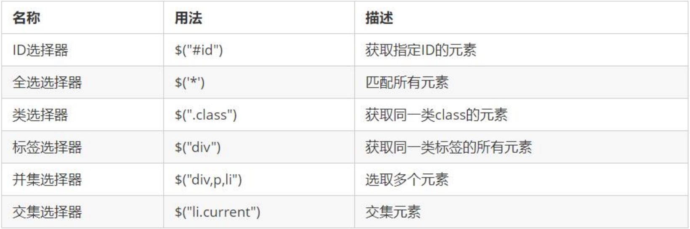

#### 2.1.2 jQuery 层级选择器
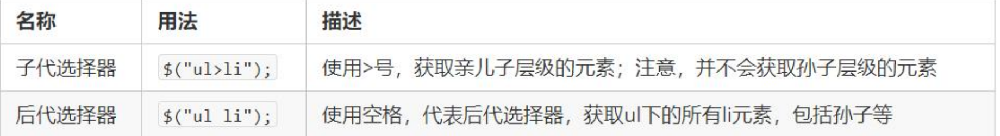

#### 2.1.3 jQuery 筛选选择器
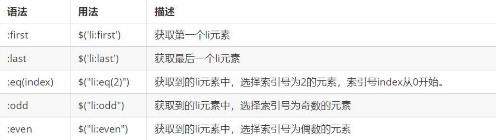

#### 2.1.4 jQuery 筛选方法（重点）
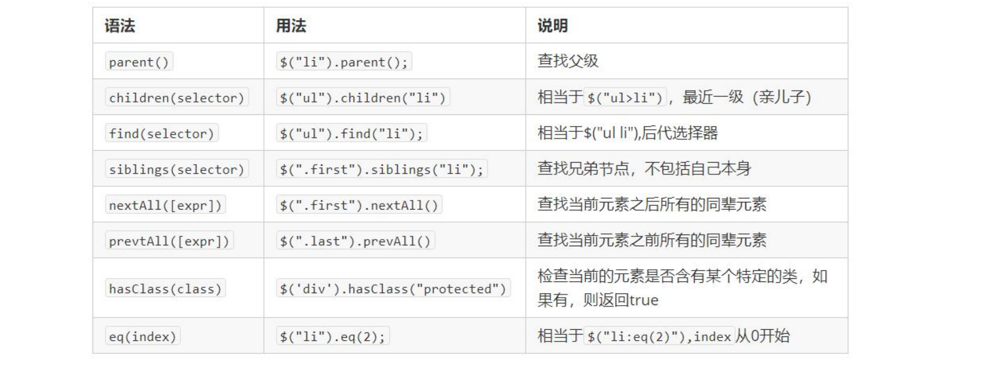

#### 2.1.5 Query 里面的排他思想
```javascript
// 想要多选一的效果，排他思想：当前元素设置样式，其余的兄弟元素清除样式。

$(this).css('color','red');
$(this).siblings(). css('color','');
```

#### 2.1.6 链式编程
```javascript
$(this).css('color', 'red').sibling().css('color', '');
```


### 2.2，jQuery 样式操作
#### 2.2.1 操作 css 方法
```javascript
//jQuery 可以使用 css 方法来修改简单元素样式； 也可以操作类，修改多个样式。

1. 参数只写属性名，则是返回属性值
    $(this).css('color');

2. 参数是属性名，属性值，逗号分隔，是设置一组样式，属性必须加引号，值如果是数字可以不用跟单位和引号
    $(this).css('color', 'red');

3. 参数可以是对象形式，方便设置多组样式。属性名和属性值用冒号隔开， 属性可以不用加引号，
    $(this).css({ "color":"white","font-size":"20px"});
```

#### 2.2.2  设置类样式方法
```javascript
// 作用等同于以前的 classList，可以操作类样式， 注意操作类里面的参数不要加点。

1. 添加类
    $('div').addClass('current')

2. 移除类
    S('div').removeClass('current')

3. 切换类
    $('div').toggleClass('current')

```

### 2.3 类操作与className区别
```javascript
// 原生 JS 中 className 会覆盖元素原先里面的类名。
// jQuery 里面类操作只是对指定类进行操作，不影响原先的类名。
```


### 2.3，jQuery 效果
jQuery 给我们封装了很多动画效果，最为常见的如下：

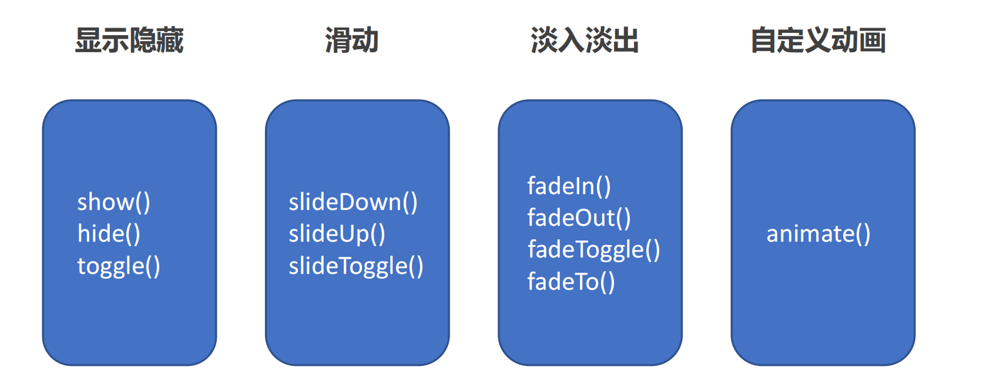

#### 2.3.1 显示隐藏效果
建议：平时一般不带参数，直接显示隐藏即可。

##### 1-1 显示语法规范
```javascript
/*
    1. 显示语法规范
        show([speed,[easing],[fn]])
        
    2. 显示参数
    3.1 显示隐藏效果
    （1）参数都可以省略， 无动画直接显示。
    （2）speed：三种预定速度之一的字符串(“slow”,“normal”, or “fast”)或表示动画时长的毫秒数值(如：1000)。
    （3）easing：(Optional) 用来指定切换效果，默认是“swing”，可用参数“linear”。
    （4）fn: 回调函数，在动画完成时执行的函数，每个元素执行一次。
*/

```

##### 1-2 隐藏语法规范
```javascript
/*
    1. 隐藏语法规范
        hide([speed,[easing],[fn]])
        
    2. 隐藏参数
        （1）参数都可以省略， 无动画直接显示。
        （2）speed：三种预定速度之一的字符串(“slow”,“normal”, or “fast”)或表示动画时长的毫秒数值(如：1000)。
        （3）easing：(Optional) 用来指定切换效果，默认是“swing”，可用参数“linear”。
        （4）fn: 回调函数，在动画完成时执行的函数，每个元素执行一次。
*/
```

##### 1-3 切换语法规范
```javascript
/*
    1. 切换语法规范
        toggle([speed,[easing],[fn]])
        
    2. 切换参数
        （1）参数都可以省略， 无动画直接显示。
        （2）speed：三种预定速度之一的字符串(“slow”,“normal”, or “fast”)或表示动画时长的毫秒数值(如：1000)。
        （3）easing：(Optional) 用来指定切换效果，默认是“swing”，可用参数“linear”。
        （4）fn: 回调函数，在动画完成时执行的函数，每个元素执行一次。
*/
```

#### 2.3.2 滑动效果
##### 2-1 下滑效果语法规范
```javascript
/*
    1. 下滑效果语法规范
        slideDown([speed,[easing],[fn]])
        
    2. 下滑效果参数
        （1）参数都可以省略。
        （2）speed:三种预定速度之一的字符串(“slow”,“normal”, or “fast”)或表示动画时长的毫秒数值(如：1000)。
        （3）easing:(Optional) 用来指定切换效果，默认是“swing”，可用参数“linear”。
        （4）fn: 回调函数，在动画完成时执行的函数，每个元素执行一次。
*/
```

##### 2-2 上滑效果语法规范
```javascript
/*
    1. 上滑效果语法规范
        slideUp([speed,[easing],[fn]])
        
    2. 上滑效果参数
        （1）参数都可以省略。
        （2）speed：三种预定速度之一的字符串(“slow”,“normal”, or “fast”)或表示动画时长的毫秒数值(如：1000)。
        （3）easing：(Optional) 用来指定切换效果，默认是“swing”，可用参数“linear”。
        （4）fn: 回调函数，在动画完成时执行的函数，每个元素执行一次。
*/
```

##### 2-3 滑动切换效果语法规范
```javascript
/*
    1. 滑动切换效果语法规范
        slideToggle([speed,[easing],[fn]])
        
    2. 滑动切换效果参数
        （1）参数都可以省略。
        （2）speed：三种预定速度之一的字符串(“slow”,“normal”, or “fast”)或表示动画时长的毫秒数值(如：1000)。
        （3）easing：(Optional) 用来指定切换效果，默认是“swing”，可用参数“linear”。
        （4）fn: 回调函数，在动画完成时执行的函数，每个元素执行一次。
 */
```

#### 2.3.3 事件切换
```javascript
/*\

    hover([over,]out)

    （1）over:鼠标移到元素上要触发的函数（相当于mouseenter）
    （2）out:鼠标移出元素要触发的函数（相当于mouseleave）
    （3）如果只写一个函数，则鼠标经过和离开都会触发它
*/
```

#### 2.3.4 动画队列及其停止排队方法
##### 4-1 动画或效果队列
```javascript
// 动画或者效果一旦触发就会执行，如果多次触发，就造成多个动画或者效果排队执行
```

##### 4-2 停止排队
```javascript
stop()

// (1）stop() 方法用于停止动画或效果。
// (2) 注意： stop() 写到动画或者效果的前面， 相当于停止结束上一次的动画。
```

#### 2.3.5 淡入淡出效果-1
##### 5-1 淡入效果语法规范
```javascript
/*
    1. 淡入效果语法规范
        fadeIn([speed,[easing],[fn]])
    
    2. 淡入效果参数
        （1）参数都可以省略。
        （2）speed：三种预定速度之一的字符串(“slow”,“normal”, or “fast”)或表示动画时长的毫秒数值(如：1000)。
        （3）easing：(Optional) 用来指定切换效果，默认是“swing”，可用参数“linear”。
        （4）fn: 回调函数，在动画完成时执行的函数，每个元素执行一次。
*/

```

5-2 淡出效果语法规范

```javascript
/*
    1. 淡出效果语法规范
        fadeOut([speed,[easing],[fn]])
    
    2. 淡出效果参数
        （1）参数都可以省略。
        （2）speed：三种预定速度之一的字符串(“slow”,“normal”, or “fast”)或表示动画时长的毫秒数值(如：1000)。
        （3）easing：(Optional) 用来指定切换效果，默认是“swing”，可用参数“linear”。
        （4）fn: 回调函数，在动画完成时执行的函数，每个元素执行一次。
*/
```

##### 5-3  淡入淡出切换效果语法规范
```javascript
/*
    1. 淡入淡出切换效果语法规范
        fadeToggle([speed,[easing],[fn]])
    
    2. 淡入淡出切换效果参数
        （1）参数都可以省略。
        （2）speed：三种预定速度之一的字符串(“slow”,“normal”, or “fast”)或表示动画时长的毫秒数值(如：1000)。
        （3）easing：(Optional) 用来指定切换效果，默认是“swing”，可用参数“linear”。
        （4）fn: 回调函数，在动画完成时执行的函数，每个元素执行一次。
*/
```

#### 2.3.6 淡入淡出效果-2
##### 渐进方式调整到指定的不透明度
```javascript
/*
    1. 渐进方式调整到指定的不透明度
        fadeTo([[speed],opacity,[easing],[fn]])
    
    2. 效果参数
          （1）opacity 透明度必须写，取值 0~1 之间。
        （2）speed：三种预定速度之一的字符串(“slow”,“normal”, or “fast”)或表示动画时长的毫秒数值(如：1000)。必须写
        （3）easing：(Optional) 用来指定切换效果，默认是“swing”，可用参数“linear”。
        （4）fn: 回调函数，在动画完成时执行的函数，每个元素执行一次。。
*/
```

#### 3.3.7 自定义动画 animate
```javascript
/*
    1. 语法
        animate(params,[speed],[easing],[fn])
    2. 参数
        （1）params: 想要更改的样式属性，以对象形式传递，必须写。 属性名可以不用带引号， 如果是复合属性则需要采
            取驼峰命名法 borderLeft。其余参数都可以省略。
        （2）speed：三种预定速度之一的字符串(“slow”,“normal”, or “fast”)或表示动画时长的毫秒数值(如：1000)。
        （3）easing：(Optional) 用来指定切换效果，默认是“swing”，可用参数“linear”。
        （4）fn: 回调函数，在动画完成时执行的函数，每个元素执行一次。
*/
```


### 2.4，jQuery 属性操作
#### 2.4.1 设置或获取元素固有属性值 prop()
```javascript
1. 获取属性语法
    prop(''属性'')

2. 设置属性语法
    prop(''属性'', ''属性值'')
```

#### 2.4.2 设置或获取元素自定义属性值 attr()
```javascript
// 用户自己给元素添加的属性，我们称为自定义属性。 比如给 div 添加 index =“1”。

    1. 获取属性语法
        attr(''属性'') // 类似原生 getAttribute()

    2. 设置属性语法
        attr(''属性'', ''属性值'') // 类似原生 setAttribute()
```

#### 2.4.3 数据缓存 data()
```javascript
// data() 方法可以在指定的元素上存取数据，并不会修改 DOM 元素结构。一旦页面刷新，之前存放的数据都将被移除。
    1. 附加数据语法
        data(''name'',''value'') // 向被选元素附加数据

    2. 获取数据语法
        date(''name'') // 向被选元素获取数据

    // 同时，还可以读取 HTML5 自定义属性 data-index ，得到的是数字型
```


### 2.5，jQuery 文本属性值
#### 2.5.1 普通元素内容 html()（ 相当于原生inner HTML)
```javascript
html() // 获取元素的内容

html('内容') // 设置元素的内容

```

#### 2.5.2  普通元素文本内容 text() (相当与原生 innerText)
```javascript
text() // 获取元素的文本内容

text(''文本内容'') // 设置元素的文本内容
```

#### 2.5.3 表单的值 val()（ 相当于原生value)
```javascript
val() // 获取表单的值

val(''内容'') // 设置表单的值
```


### 2.6， jQuery 元素操作
#### 2.6.1 遍历元素
##### 1-1 语法1
```javascript
$("div").each(function (index, domEle) { xxx; }）
              
    1. each() 方法遍历匹配的每一个元素。主要用DOM处理。 each 每一个
    2. 里面的回调函数有2个参数： index 是每个元素的索引号; demEle 是每个DOM元素对象，不是jquery对象
    3. 所以要想使用jquery方法，需要给这个dom元素转换为jquery对象 $(domEle)

```

##### 1-2 语法2
```javascript
$.each(object，function (index, element) { xxx;}）

    1. $.each()方法可用于遍历任何对象。主要用于数据处理，比如数组，对象
    2. 里面的函数有2个参数： index 是每个元素的索引号; element 遍历内容
```

#### 2.6.2 创建元素
```javascript
$('<li></li>');
```

#### 2.6.3 添加元素
##### 3-1 内部添加
```javascript
element.append('内容')
// 把内容放入匹配元素内部最后面，类似原生 appendChild。

element.prepend('内容')
// 把内容放入匹配元素内部最前面
```

##### 3-2 外部添加
```javascript
element.after('内容') // 把内容放入目标元素后面
element.before('内容') // 把内容放入目标元素前面

// ① 内部添加元素，生成之后，它们是父子关系。
// ② 外部添加元素，生成之后，他们是兄弟关系。
```

#### 2.6.4 删除元素
```javascript
element.remove() // 删除匹配的元素（本身）
element.empty() // 删除匹配的元素集合中所有的子节点
element.html('') // 清空匹配的元素内容

// ① remove 删除元素本身。
// ② empt() 和 html('''') 作用等价，都可以删除元素里面的内容，只不过 html 还可以设置内容。
```


### 2.7，jQuery 尺寸、位置操作
#### 2.7.1 Query 尺寸
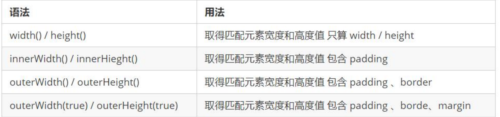

```javascript
// 以上参数为空，则是获取相应值，返回的是数字型。
// 如果参数为数字，则是修改相应值。
// 参数可以不必写单位
```

2.7.2 jQuery 位置

```javascript
// 位置主要有三个： offset()、position()、scrollTop()/scrollLeft()
```

##### 2-1 offset() 设置或获取元素偏移
```javascript
// offset() 方法设置或返回被选元素相对于文档的偏移坐标，跟父级没有关系。
// 该方法有2个属性 left、top 。offset().top 用于获取距离文档顶部的距离，offset().left 用于获取距离文档左侧的距离。
// 可以设置元素的偏移：offset({ top: 10, left: 30 });
```

##### 2-2 position() 获取元素偏移
```javascript
// position() 方法用于返回被选元素相对于带有定位的父级偏移坐标，如果父级都没有定位，则以文档为准。
// 该方法有2个属性 left、top。position().top 用于获取距离定位父级顶部的距离，position().left 用于获取距离定位父级左侧的距离。
// 该方法只能获取。
```

##### 2-3 scrollTop()/scrollLeft() 设置或获取元素被卷去的头部和左侧
```javascript
// scrollTop() 方法设置或返回被选元素被卷去的头部。
// 不跟参数是获取，参数为不带单位的数字则是设置被卷去的头部。
```

## 3，jQuery 事件
### 3.1，jQuery 事件注册
#### 3.1.1 单个事件注册
```javascript
element.事件(function(){})
$(“div”).click(function(){ 事件处理程序 })

//其他事件和原生基本一致。
//比如mouseover、mouseout、blur、focus、change、keydown、keyup、resize、scroll 等
```


### 3.2，jQuery 事件处理
#### 3.2.1 事件处理 on() 绑定事件
```javascript
// on() 方法在匹配元素上绑定一个或多个事件的事件处理函数

element.on(events,[selector],fn)

    1. events:一个或多个用空格分隔的事件类型，如"click"或"keydown" 。
    2. selector: 元素的子元素选择器 。
    3. fn:回调函数 即绑定在元素身上的侦听函数。
```

##### 1-1 on() 方法优势1：
```javascript
// 可以绑定多个事件，多个处理事件处理程序。
    $('div').on({
        mouseover: function(){},
        mouseout: function(){},
        click: function(){}
    });

// 如果事件处理程序相同
    $('div').on(“mouseover mouseout”, function() {
        $(this).toggleClass(“current”);
    });
```

##### 1-2 on() 方法优势2:
```javascript
// 可以事件委派操作 。事件委派的定义就是，把原来加给子元素身上的事件绑定在父元素身上，就是把事件委派给父元素。

    $('ul').on('click', 'li', function() {
    alert('hello world!');
    });

//在此之前有bind(), live() delegate()等方法来处理事件绑定或者事件委派，最新版本的请用on替代他们。
```

##### 1-3 on() 方法优势3：
```javascript
// 动态创建的元素，click() 没有办法绑定事件， on() 可以给动态生成的元素绑定事件
    $('div').on("click",'p', function(){
        alert("俺可以给动态生成的元素绑定事件")
    });

    $("div").append($("<p>我是动态创建的p</p>"));
```

#### 3.2.2 事件处理 off() 解绑事件
```javascript
// off() 方法可以移除通过 on() 方法添加的事件处理程序。

    $("p").off() // 解绑p元素所有事件处理程序
    $("p").off( "click") // 解绑p元素上面的点击事件 后面的 foo 是侦听函数名
    $("ul").off("click", "li"); // 解绑事件委托

// 如果有的事件只想触发一次， 可以使用 one() 来绑定事件。
```

#### 3.3.3 自动触发事件 trigger()
```javascript
// 有些事件希望自动触发, 比如轮播图自动播放功能跟点击右侧按钮一致。可以利用定时器自动触发右侧按钮点击事件，不必鼠标点击触发。

    element.click() // 第一种简写形式

    element.trigger("type") // 第二种自动触发模式


    $("p").on("click", function () {
        alert("hi~");
    });

    $("p").trigger("click"); // 此时自动触发点击事件，不需要鼠标点击

// 有些事件希望自动触发, 比如轮播图自动播放功能跟点击右侧按钮一致。可以利用定时器自动触发右侧按钮点击事件，不必鼠标点击触发。

    element.triggerHandler(type) // 第三种自动触发模式

    // triggerHandler模式不会触发元素的默认行为，这是和前面两种的区别
```


### 3.3，jQuery 事件对象
```javascript
// 事件被触发，就会有事件对象的产生。

element.on(events,[selector],function(event) {
    // 阻止默认行为：
    event.preventDefault() 
    // 或者 
    return false

    // 阻止冒泡： 
    event.stopPropagation()
    
})


```

## 4，jQuery 其他方法
### 4.1，jQuery 拷贝对象
```plain
//如果想要把某个对象拷贝（合并） 给另外一个对象使用，此时可以使用 $.extend() 方法

    $.extend([deep], target, object1, [objectN])

    1. deep: 如果设为true 为深拷贝， 默认为false 浅拷贝
    2. target: 要拷贝的目标对象
    3. object1:待拷贝到第一个对象的对象。
    4. objectN:待拷贝到第N个对象的对象。
    5. 浅拷贝是把被拷贝的对象复杂数据类型中的地址拷贝给目标对象，修改目标对象会影响被拷贝对象。
    6. 深拷贝，前面加true， 完全克隆(拷贝的对象,而不是地址)，修改目标对象不会影响被拷贝对象。
```


### 4.2，多库共存
```javascript
问题概述：
// jQuery使用$作为标示符，随着jQuery的流行,其他 js 库也会用这$作为标识符， 这样一起使用会引起冲突。

客观需求：
// 需要一个解决方案，让jQuery 和其他的js库不存在冲突，可以同时存在，这就叫做多库共存。

jQuery 解决方案：

1. 把里面的 $ 符号 统一改为 jQuery。 比如 jQuery('div')
2. jQuery 变量规定新的名称：$.noConflict() 
var xx = $.noConflict();

```

# 六、Ajax
## 1，服务器的基本概念与初识Ajax
### 1.1 URL地址的组成部分
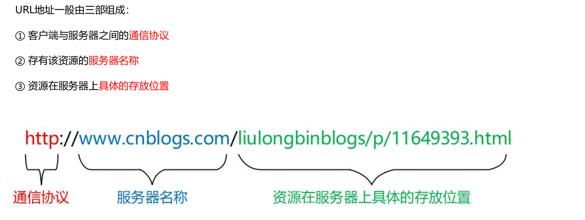


### 1.2 客户端与服务器的通信过程
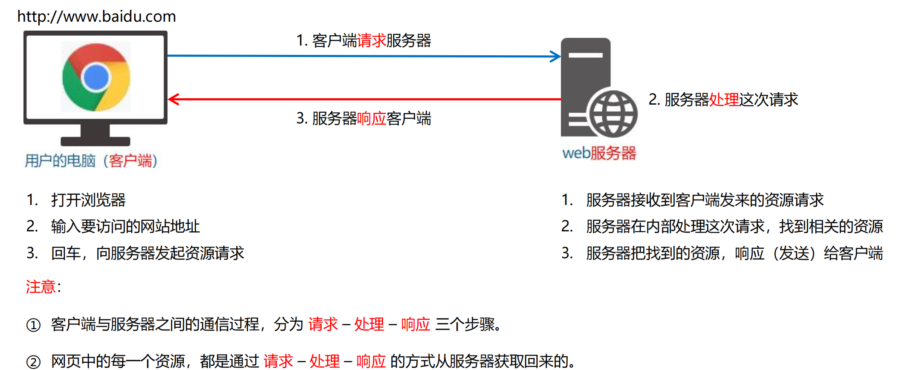

### 1.3 网页中如何请求数据
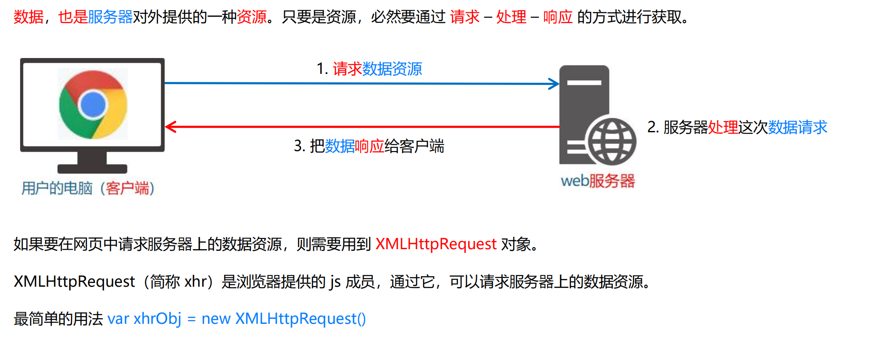

### 1.4  $.get()函数
#### 1.4.1 $.get()函数的语法
```javascript
// jQuery 中 $.get() 函数的功能单一，专门用来发起 get 请求，从而将服务器上的资源请求到客户端来进行使用。$.get() 函数的语法如下：

$.get(url, [data], [callback])
```

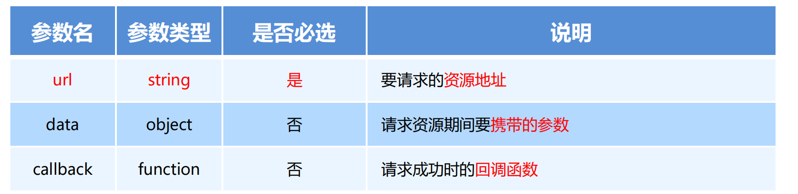

#### 1.4.2 $.get()发起不带参数的请求
```plain
// 使用 $.get() 函数发起不带参数的请求时，直接提供请求的 URL 地址和请求成功之后的回调函数即可，示例代码如下：

$.get('http://www.liulongbin.top:3006/api/getbooks', function(res) {
console.log(res) // 这里的 res 是服务器返回的数据
})
```

#### 1.14.3  $.get()发起带参数的请求
```javascript
$.get('http://www.liulongbin.top:3006/api/getbooks', { id: 1 }, function(res) {
console.log(res)
})
```

### 1.5 $.post()函数
#### 1.5.1 $.post()函数的语法
```javascript
// jQuery 中 $.post() 函数的功能单一，专门用来发起 post 请求，从而向服务器提交数据。$.post() 函数的语法如下：
$.post(url, [data], [callback])
```

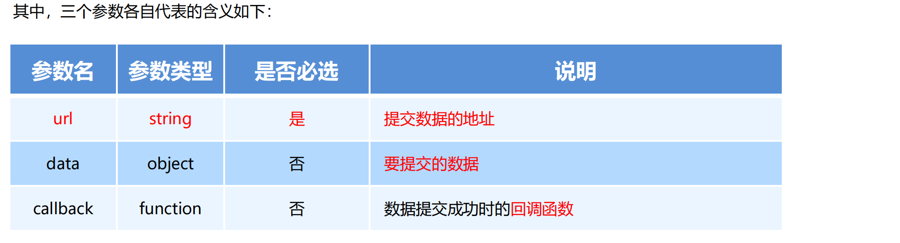

#### 1.5.2 $.post()向服务器提交数据
```javascript
// 使用 $post() 向服务器提交数据的示例代码如下：
$.post(
    'http://www.liulongbin.top:3006/api/addbook', // 请求的URL地址
    { bookname: '水浒传', author: '施耐庵', publisher: '上海图书出版社' }, // 提交的数据
    function(res) { // 回调函数
    console.log(res)
    }
)
```

### 1.6 $.ajax()函数的语法
```javascript
// 相比于 $.get() 和 $.post() 函数，jQuery 中提供的 $.ajax() 函数，是一个功能比较综合的函数，它允许我们对Ajax 请求进行更详细的配置。
// $.ajax() 函数的基本语法如下：
$.ajax({
    type: '', // 请求的方式，例如 GET 或 POST
    url: '', // 请求的 URL 地址
    data: { },// 这次请求要携带的数据
    success: function(res) { } // 请求成功之后的回调函数
})
```

#### 1.6.1 使用$.ajax()发起GET请求
```javascript
// 使用 $.ajax() 发起 GET 请求时，只需要将 type 属性的值设置为 'GET' 即可：
$.ajax({
    type: 'GET', // 请求的方式
    url: 'http://www.liulongbin.top:3006/api/getbooks', // 请求的 URL 地址
    data: { id: 1 },// 这次请求要携带的数据
    success: function(res) { // 请求成功之后的回调函数
    console.log(res)
    }
})
```

#### 1.6.2 使用$.ajax()发起POST请求
```javascript
// 使用 $.ajax() 发起 POST 请求时，只需要将 type 属性的值设置为 'POST' 即可：
$.ajax({
    type: 'POST', // 请求的方式
    url: 'http://www.liulongbin.top:3006/api/addbook', // 请求的 URL 地址
    data: { // 要提交给服务器的数据
        bookname: '水浒传',
        author: '施耐庵',
        publisher: '上海图书出版社'
    },
    success: function(res) { // 请求成功之后的回调函数
    console.log(res)
    }
})
```

### 1.7  接口
#### 1.7.1 通过GET方式请求接口的过程


#### 1.7.2 通过POST方式请求接口的过程
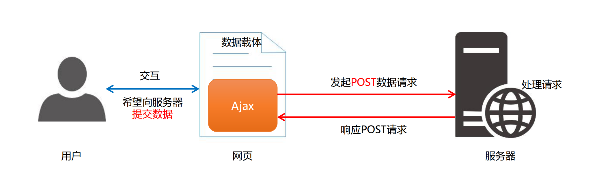

## 2，Ajax加强
### 2.1  使用xhr发起GET请求
```plain
// 步骤：
① 创建 xhr 对象
② 调用 xhr.open() 函数
③ 调用 xhr.send() 函数
④ 监听 xhr.onreadystatechange 事件

// 1. 创建 XHR 对象
var xhr = new XMLHttpRequest()

// 2. 调用 open 函数，指定 请求方式 与 URL地址
xhr.open('GET', 'http://www.liulongbin.top:3006/api/getbooks')

// 3. 调用 send 函数，发起 Ajax 请求
xhr.send()

// 4. 监听 onreadystatechange 事件
xhr.onreadystatechange = function() {
    // 4.1 监听 xhr 对象的请求状态 readyState ；与服务器响应的状态 status
    if (xhr.readyState === 4 && xhr.status === 200) {
    // 4.2 打印服务器响应回来的数据
    console.log(xhr.responseText)
    }
}
```

#### 2.1.1 了解xhr对象的readyState属性
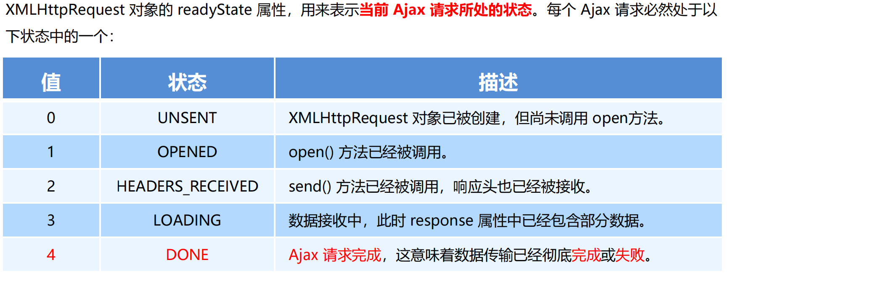

#### 2.1.2 使用xhr发起带参数的GET请求
```javascript
使用 xhr 对象发起带参数的 GET 请求时，只需在调用 xhr.open 期间，为 URL 地址指定参数即可：
// ...省略不必要的代码
xhr.open('GET', 'http://www.liulongbin.top:3006/api/getbooks?id=1')
// ...省略不必要的代码
这种在 URL 地址后面拼接的参数，叫做查询字符串
```

### 2.2 使用xhr发起POST请求
```javascript
步骤：
① 创建 xhr 对象
② 调用 xhr.open() 函数
③ 设置 Content-Type 属性（固定写法）
④ 调用 xhr.send() 函数，同时指定要发送的数据
⑤ 监听 xhr.onreadystatechange 事件

// 1. 创建 xhr 对象
var xhr = new XMLHttpRequest()
// 2. 调用 open()
xhr.open('POST', 'http://www.liulongbin.top:3006/api/addbook')
// 3. 设置 Content-Type 属性（固定写法）
xhr.setRequestHeader('Content-Type', 'application/x-www-form-urlencoded')
// 4. 调用 send()，同时将数据以查询字符串的形式，提交给服务器
xhr.send('bookname=水浒传&author=施耐庵&publisher=天津图书出版社')
    // 5. 监听 onreadystatechange 事件
    xhr.onreadystatechange = function() {
    if (xhr.readyState === 4 && xhr.status === 200) {
    console.log(xhr.responseText)
    }
}
```

### 2.3 json
```javascript
// 对象结构：对象结构在 JSON 中表示为 { } 括起来的内容。数据结构为 { key: value, key: value, … } 的键值对结构。其中，key 必须是使用英文的双引号包裹的字符串，value 的数据类型可以是

// 数字、字符串、布尔值、null、数组、对象6种类型。
```

#### 2.3.1 JSON语法注意事项
```javascript
// ① 属性名必须使用双引号包裹
// ② 字符串类型的值必须使用双引号包裹
// ③ JSON 中不允许使用单引号表示字符串
// ④ JSON 中不能写注释
// ⑤ JSON 的最外层必须是对象或数组格式
// ⑥ 不能使用 undefined 或函数作为 JSON 的值
// JSON 的作用：在计算机与网络之间存储和传输数据。
// JSON 的本质：用字符串来表示 Javascript 对象数据或数组数据
```

#### 2.3.2 序列化和反序列化
```javascript
// 把数据对象转换为字符串的过程，叫做序列化，例如：调用 JSON.stringify() 函数的操作，叫做 JSON 序列化。
// 把字符串转换为数据对象的过程，叫做反序列化，例如：调用 JSON.parse() 函数的操作，叫做 JSON 反序列化。
```

### 2.4  封装自己的Ajax函数
```javascript
// 定义options参数选项
// itheima() 函数是我们自定义的 Ajax 函数，它接收一个配置对象作为参数，配置对象中可以配置如下属性：
1, method 请求的类型
2, url 请求的 URL 地址
3, data 请求携带的数据
4, success 请求成功之后的回调函数

// 处理data参数，得到查询字符串
// 需要把 data 对象，转化成查询字符串的格式，从而提交给服务器，因此提前定义 resolveData 函数如下：
/**
* 处理 data 参数
* @param {data} 需要发送到服务器的数据
* @returns {string} 返回拼接好的查询字符串 name=zs&age=10
*/
function resolveData(data) {
var arr = []
for (var k in data) {
arr.push(k + '=' + data[k])
}
return arr.join('&')  // 获得查询字符串
}


// 判断请求的类型
// 不同的请求类型，对应 xhr 对象的不同操作，因此需要对请求类型进行 if … else … 的判断
if (options.method.toUpperCase() === 'GET') {
    // 发起 GET 请求
    xhr.open(options.method, options.url + '?' + qs)
    xhr.send()
    } else if (options.method.toUpperCase() === 'POST') {
    // 发起 POST 请求
    xhr.open(options.method, options.url)
    xhr.setRequestHeader('Content-Type', 'application/x-www-form-urlencoded')
    xhr.send(qs)
}


// 定义aini函数
function aini(options) {
    var xhr = new XMLHttpRequest()
    // 拼接查询字符串
    var qs = resolveData(options.data)
    // 判断请求的类型
    if (options.method.toUpperCase() === 'GET') {
        // 发起 GET 请求
        xhr.open(options.method, options.url + '?' + qs)
        xhr.send()
        } else if (options.method.toUpperCase() === 'POST') {
        // 发起 POST 请求
        xhr.open(options.method, options.url)
        xhr.setRequestHeader('Content-Type', 'application/x-www-form-urlencoded')
        xhr.send(qs)
    }
    // 监听请求状态改变的事件
    xhr.onreadystatechange = function() {
        if (xhr.readyState === 4 && xhr.status === 200) {
        var result = JSON.parse(xhr.responseText)
        options.success(result)
        }
    }
}
```

### 2.5 XMLHttpRequest Level2的新特性
#### 2.5.1  设置HTTP请求时限
```javascript
// 有时，Ajax 操作很耗时，而且无法预知要花多少时间。如果网速很慢，用户可能要等很久。新版本的XMLHttpRequest 对象，增加了 timeout 属性，可以设置 HTTP 请求的时限：
xhr.timeout = 3000

// 上面的语句，将最长等待时间设为 3000 毫秒。过了这个时限，就自动停止HTTP请求。与之配套的还有一个timeout 事件，用来指定回调函数：
xhr.ontimeout = function(event){
alert('请求超时！')
}
```

#### 2.5.2 FormData对象管理表单数据
```javascript
1,Ajax 操作往往用来提交表单数据。为了方便表单处理，HTML5 新增了一个 FormData 对象，可以模拟表单操作：

// 1. 新建 FormData 对象
var fd = new FormData()

// 2. 为 FormData 添加表单项
fd.append('uname', 'zs')
fd.append('upwd', '123456')

// 3. 创建 XHR 对象
var xhr = new XMLHttpRequest()

// 4. 指定请求类型与URL地址
xhr.open('POST', 'http://www.liulongbin.top:3006/api/formdata')

// 5. 直接提交 FormData 对象，这与提交网页表单的效果，完全一样
xhr.send(fd)


2, FormData对象也可以用来获取网页表单的值，示例代码如下：

// 获取表单元素
var form = document.querySelector('#form1')

// 监听表单元素的 submit 事件
form.addEventListener('submit', function(e) {
    e.preventDefault()
    // 根据 form 表单创建 FormData 对象，会自动将表单数据填充到 FormData 对象中
    var fd = new FormData(form)
    var xhr = new XMLHttpRequest()
    xhr.open('POST', 'http://www.liulongbin.top:3006/api/formdata')
    xhr.send(fd)
    xhr.onreadystatechange = function() {}
})
```

### 2.6  上传文件
```plain
// 新版 XMLHttpRequest 对象，不仅可以发送文本信息，还可以上传文件。
实现步骤：
① 定义 UI 结构
② 验证是否选择了文件
③ 向 FormData 中追加文件
④ 使用 xhr 发起上传文件的请求
⑤ 监听 onreadystatechange 事件

1. 定义UI结构
    <!-- 1. 文件选择框 -->
    <input type="file" id="file1" />
    <!-- 2. 上传按钮 -->
    <button id="btnUpload">上传文件</button>

    <br />
    <!-- 3. 显示上传到服务器上的图片 -->
    
    
2. 验证是否选择了文件
    // 1. 获取上传文件的按钮
    var btnUpload = document.querySelector('#btnUpload')
    // 2. 为按钮添加 click 事件监听
    btnUpload.addEventListener('click', function() {
    // 3. 获取到选择的文件列表
    var files = document.querySelector('#file1').files
    if (files.length <= 0) {
    return alert('请选择要上传的文件！')
    }
    // ...后续业务逻辑
    })

3. 向FormData中追加文件
    // 1. 创建 FormData 对象
    var fd = new FormData()
    // 2. 向 FormData 中追加文件
    fd.append('avatar', files[0])

4. 使用 xhr 发起上传文件的请求
    // 1. 创建 xhr 对象
    var xhr = new XMLHttpRequest()
    // 2. 调用 open 函数，指定请求类型与URL地址。其中，请求类型必须为 POST
    xhr.open('POST', 'http://www.liulongbin.top:3006/api/upload/avatar')
    // 3. 发起请求
    xhr.send(fd)


5. 监听onreadystatechange事件
    xhr.onreadystatechange = function() {
        if (xhr.readyState === 4 && xhr.status === 200) {
            var data = JSON.parse(xhr.responseText)
            if (data.status === 200) { // 上传文件成功
            // 将服务器返回的图片地址，设置为  标签的 src 属性
            document.querySelector('#img').src = 'http://www.liulongbin.top:3006' + data.url
            } else { // 上传文件失败
            console.log(data.message)
            }
        }
    }
```

### 2.7 显示文件上传进度
```javascript
// 新版本的 XMLHttpRequest 对象中，可以通过监听 xhr.upload.onprogress 事件，来获取到文件的上传进度。
语法格式如下：
// 创建 XHR 对象
var xhr = new XMLHttpRequest()
// 监听 xhr.upload 的 onprogress 事件
xhr.upload.onprogress = function(e) {
// e.lengthComputable 是一个布尔值，表示当前上传的资源是否具有可计算的长度
if (e.lengthComputable) {
    // e.loaded 已传输的字节
    // e.total 需传输的总字节
    var percentComplete = Math.ceil((e.loaded / e.total) * 100)
    }
}


1. 导入需要的库
    <link rel="stylesheet" href="./lib/bootstrap.css" />
    <script src="./lib/jquery.js"></script>

2. 基于Bootstrap渲染进度条
    <!-- 进度条 -->
    <div class="progress" style="width: 500px; margin: 10px 0;">
        <div class="progress-bar progress-bar-info progress-barstriped active" id="percent" style="width: 0%">
        0%
        </div>

    </div>

3. 监听上传进度的事件
    xhr.upload.onprogress = function(e) {
        if (e.lengthComputable) {
        // 1. 计算出当前上传进度的百分比
        var percentComplete = Math.ceil((e.loaded / e.total) * 100)
        $('#percent')
        // 2. 设置进度条的宽度
        .attr('style', 'width:' + percentComplete + '%')
        // 3. 显示当前的上传进度百分比
        .html(percentComplete + '%')
        }
    }

4. 监听上传完成的事件
    xhr.upload.onload = function() {
        $('#percent')
        // 移除上传中的类样式
        .removeClass()
        // 添加上传完成的类样式
        .addClass('progress-bar progress-bar-success')
    }
```

### 2.8 jQuery实现文件上传
```javascript
1. 定义UI结构
    <!-- 导入 jQuery -->
    <script src="./lib/jquery.js"></script>

    <!-- 文件选择框 -->
    <input type="file" id="file1" />
    <!-- 上传文件按钮 -->
    <button id="btnUpload">上传</button>

2. 验证是否选择了文件
    $('#btnUpload').on('click', function() {
        // 1. 将 jQuery 对象转化为 DOM 对象，并获取选中的文件列表
        var files = $('#file1')[0].files
        // 2. 判断是否选择了文件
        if (files.length <= 0) {
        return alert('请选择图片后再上传！‘)
        }
    })
        
3. 向FormData中追加文件
    // 向 FormData 中追加文件
    var fd = new FormData()
    fd.append('avatar', files[0])

        
4. 使用jQuery发起上传文件的请求
    $.ajax({
        method: 'POST',
        url: 'http://www.liulongbin.top:3006/api/upload/avatar',
        data: fd,
        // 不修改 Content-Type 属性，使用 FormData 默认的 Content-Type 值
        contentType: false,
        // 不对 FormData 中的数据进行 url 编码，而是将 FormData 数据原样发送到服务器
        processData: false,
        success: function(res) {
            console.log(res)
        }
    })
```

### 2.9 jQuery实现loading效果
```javascript
1. ajaxStart(callback)
    //Ajax 请求开始时，执行 ajaxStart 函数。可以在 ajaxStart 的 callback 中显示 loading 效果，示例代码如下：
        // 自 jQuery 版本 1.8 起，该方法只能被附加到文档
        $(document).ajaxStart(function() {
            $('#loading').show()
        })
        注意： $(document).ajaxStart() 函数会监听当前文档内所有的 Ajax 请求。


2. ajaxStop(callback)
    // Ajax 请求结束时，执行 ajaxStop 函数。可以在 ajaxStop 的 callback 中隐藏 loading 效果，示例代码如下：
        // 自 jQuery 版本 1.8 起，该方法只能被附加到文档
        $(document).ajaxStop(function() {
            $('#loading').hide()
        })
```

### 2.10  Axios
#### 2.10.1 axios发起GET请求
```javascript
// axios 发起 get 请求的语法：
axios.get('url', { params: { /*参数*/ } }).then(callback)

//具体的请求示例如下：
    // 请求的 URL 地址
    var url = 'http://www.liulongbin.top:3006/api/get'
    // 请求的参数对象
    var paramsObj = { name: 'zs', age: 20 }
    // 调用 axios.get() 发起 GET 请求
    axios.get(url, { params: paramsObj }).then(function(res) {
        // res.data 是服务器返回的数据
        var result = res.data
        console.log(res)
    })
```


#### 2.10.2 直接使用axios发起POST请求
```javascript
// axios 发起 post 请求的语法：
    axios.post('url', { /*参数*/ }).then(callback)

    具体的请求示例如下：
    // 请求的 URL 地址
    var url = 'http://www.liulongbin.top:3006/api/post'
    // 要提交到服务器的数据
    var dataObj = { location: '北京', address: '顺义' }
    // 调用 axios.post() 发起 POST 请求
    axios.post(url, dataObj).then(function(res) {
        // res.data 是服务器返回的数据
        var result = res.data
        console.log(result)
    })

```

#### 2.10,3 直接使用axios发起请求
```javascript
// axios 也提供了类似于 jQuery 中 $.ajax() 的函数，语法如下：
    axios({
    method: '请求类型',
    url: '请求的URL地址',
    data: { /* POST数据 */ },
    params: { /* GET参数 */ }
    }) .then(callback)


1. 直接使用axios发起GET请求
    axios({
        method: 'GET',
        url: 'http://www.liulongbin.top:3006/api/get',
        params: { // GET 参数要通过 params 属性提供
        name: 'zs',
        age: 20
        }
        }).then(function(res) {
        console.log(res.data)
    })

2. 直接使用axios发起POST请求
    axios({
        method: 'POST',
        url: 'http://www.liulongbin.top:3006/api/post',
        data: { // POST 数据要通过 data 属性提供
        bookname: '程序员的自我修养',
        price: 666
        }
        }).then(function(res) {
        console.log(res.data)
    })
```

## 3 表单的基本使用
### 3.1
标签的属性

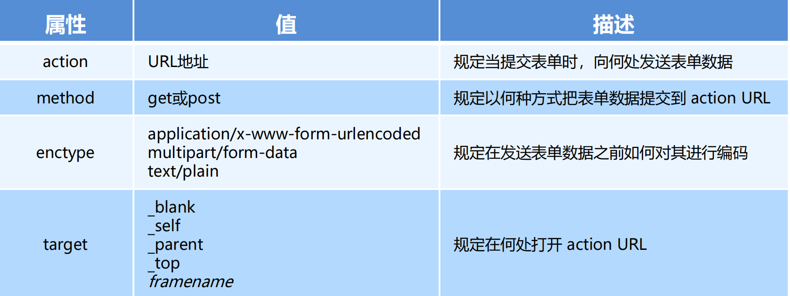

#### 3.1.1 target


#### 3.1.2 enctype
```plain
// 在涉及到文件上传的操作时，必须将 enctype 的值设置为 multipart/form-data
// 如果表单的提交不涉及到文件上传操作，则直接将 enctype 的值设置为 application/x-www-form-urlencoded 即可！
```

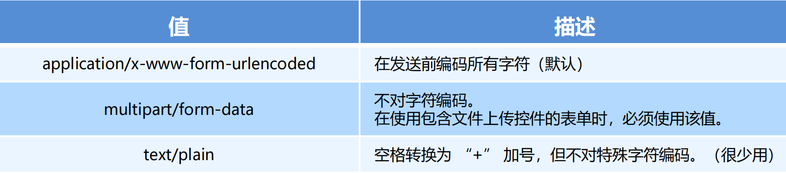

### 3.2 表单的同步提交及缺点
```javascript
1. 什么是表单的同步提交
    // 通过点击 submit 按钮，触发表单提交的操作，从而使页面跳转到 action URL 的行为，叫做表单的同步提交。
2，表单同步提交的缺点
    // 页面会发生跳转
    // 页面之前的状态和数据会丢失
3，解决方案：表单只负责采集数据，Ajax 负责将数据提交到服务器。


```

### 3.3 通过Ajax提交表单数据
#### 3.3.1 监听表单提交事件
```javascript
// 在 jQuery 中，可以使用如下两种方式，监听到表单的提交事件：

$('#form1').submit(function(e) {
    alert('监听到了表单的提交事件')
})

$('#form1').on('submit', function(e) {
    alert('监听到了表单的提交事件')
})
```

#### 3.3.2 阻止表单默认提交行为
```javascript
// 当监听到表单的提交事件以后，可以调用事件对象的 event.preventDefault() 函数，来阻止表单的提交和页面的跳转，示例代码如下：

$('#form1').submit(function(e) {
    // 阻止表单的提交和页面的跳转
    e.preventDefault()
})

$('#form1').on('submit', function(e) {
    // 阻止表单的提交和页面的跳转
    e.preventDefault()
})
```

#### 3.3.3 快速获取表单中的数据
##### serialize()函数
```javascript
// 为了简化表单中数据的获取操作，jQuery 提供了 serialize() 函数，其语法格式如下]

$(selector).serialize()

// serialize() 函数的好处：可以一次性获取到表单中的所有的数据。
// 注意：在使用 serialize() 函数快速获取表单数据时，必须为每个表单元素添加 name 属性！

<form id="form1">
<input type="text" name="username" />
<input type="password" name="password" />
<button type="submit">提交</button>

</form>

$('#form1').serialize()
// 调用的结果：
// username=用户名的值&password=密码的值

```

## 4 跨域与JSONP
### 4.1 同源策略
#### 4.1.1 什么是同源
```javascript
// 如果两个页面的协议，域名和端口都相同，则两个页面具有相同的源
```

#### 4.1.2  什么是同源策略
```javascript
// 同源策略（英文全称 Same origin policy）是浏览器提供的一个安全功能。
/*
MDN 官方给定的概念：同源策略限制了从同一个源加载的文档或脚本如何与来自另一个源的资源进行交互。这
是一个用于隔离潜在恶意文件的重要安全机制。
*/

// 通俗的理解：浏览器规定，A 网站的 JavaScript，不允许和非同源的网站 C 之间，进行资源的交互，例如：

无法读取非同源网页的 Cookie、LocalStorage 和 IndexedDB
无法接触非同源网页的 DOM
无法向非同源地址发送 Ajax 请求
```

### 4.2 跨域
#### 4.2.1 什么是跨域
```javascript
// 同源指的是两个 URL 的协议、域名、端口一致，反之，则是跨域。
// 出现跨域的根本原因：浏览器的同源策略不允许非同源的 URL 之间进行资源的交互。
```

#### 4.2.2 浏览器对跨域请求的拦截
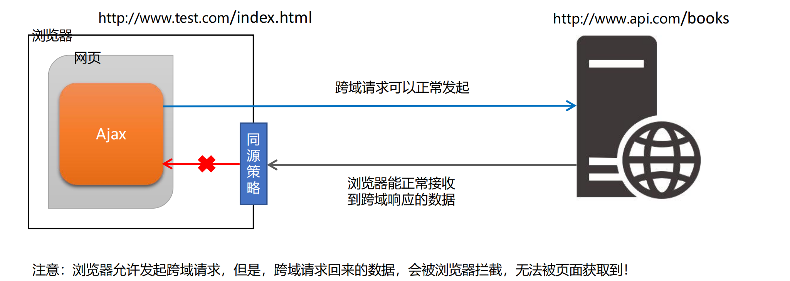

### 4.3 jsonp
#### 4.3.1 什么是JSONP
```javascript
// JSONP (JSON with Padding) 是 JSON 的一种“使用模式”，可用于解决主流浏览器的跨域数据访问的问题。
```

#### 4.3.2 JSONP的实现原理
```javascript
/*
由于浏览器同源策略的限制，网页中无法通过 Ajax 请求非同源的接口数据。但是 <script> 标签不受浏览器同
源策略的影响，可以通过 src 属性，请求非同源的 js 脚本。

因此，JSONP 的实现原理，就是通过 <script> 标签的 src 属性，请求跨域的数据接口，并通过函数调用的形式，
接收跨域接口响应回来的数据。
*/
```

#### 4.3.3 JSONP的缺点
```javascript
//由于 JSONP 是通过 <script> 标签的 src 属性，来实现跨域数据获取的，所以，JSONP 只支持 GET 数据请求，不支持 POST 请求。

// 注意：JSONP 和 Ajax 之间没有任何关系，不能把 JSONP 请求数据的方式叫做 Ajax，因为 JSONP 没有用到XMLHttpRequest 这个对象。
```

#### 4.3.4 jQuery中的JSONP
```javascript
// jQuery 提供的 $.ajax() 函数，除了可以发起真正的 Ajax 数据请求之外，还能够发起 JSONP 数据请求，例如：

$.ajax({
    url: 'http://ajax.frontend.itheima.net:3006/api/jsonp?name=zs&age=20',
    // 如果要使用 $.ajax() 发起 JSONP 请求，必须指定 datatype 为 jsonp
    dataType: 'jsonp',
    success: function(res) {
        console.log(res)
    }
})

// 默认情况下，使用 jQuery 发起 JSONP 请求，会自动携带一个 callback=jQueryxxx 的参数，jQueryxxx 是随机生成的一个回调函数名称。

// -----------------------------------------------------------------------------------------------------

// 自定义参数及回调函数名称
$.ajax({
    url: 'http://ajax.frontend.itheima.net:3006/api/jsonp?name=zs&age=20',
    dataType: 'jsonp',
    // 发送到服务端的参数名称，默认值为 callback
    jsonp: 'callback',
    // 自定义的回调函数名称，默认值为 jQueryxxx 格式
    jsonpCallback: 'abc',
    success: function(res) {
        console.log(res)
    }
})

```

#### 4.3.5 jQuery中JSONP的实现过程
```javascript
//jQuery 中的 JSONP，也是通过 <script> 标签的 src 属性实现跨域数据访问的，只不过，jQuery 采用的是动态创建和移除 <script> 标签的方式，来发起 JSONP 数据请求。

// 在发起 JSONP 请求的时候，动态向 <header> 中 append 一个 <script> 标签；
// 在 JSONP 请求成功以后，动态从 <header> 中移除刚才 append 进去的 <script> 标签；
```

### 4.4 防抖和节流
#### 4.4.1 什么是节流
```javascript
// 节流策略（throttle），顾名思义，可以减少一段时间内事件的触发频率。
```

#### 4.4.2 节流的应用场景
```javascript
// 鼠标连续不断地触发某事件（如点击），只在单位时间内只触发一次；
// 懒加载时要监听计算滚动条的位置，但不必每次滑动都触发，可以降低计算的频率，而不必去浪费 CPU 资源；
```

#### 4.4.3 节流阀的概念
```javascript
/*

节流阀为空，表示可以执行下次操作；不为空，表示不能执行下次操作。
当前操作执行完，必须将节流阀重置为空，表示可以执行下次操作了。
每次执行操作前，必须先判断节流阀是否为空。

*/
```

4.4.4 使用节流优化鼠标跟随效果

```javascript
$(function() {
    var angel = $('#angel')
    var timer = null // 1.预定义一个 timer 节流阀
    $(document).on('mousemove', function(e) {
    if (timer) { return } // 3.判断节流阀是否为空，如果不为空，则证明距离上次执行间隔不足16毫秒
    timer = setTimeout(function() {
        $(angel).css('left', e.pageX + 'px').css('top', e.pageY + 'px')
        timer = null // 2.当设置了鼠标跟随效果后，清空 timer 节流阀，方便下次开启延时器
        }, 16)
    })
})
```

#### 4.4.5 总结防抖和节流的区别
```javascript
// 防抖：如果事件被频繁触发，防抖能保证只有最有一次触发生效！前面 N 多次的触发都会被忽略！
// 节流：如果事件被频繁触发，节流能够减少事件触发的频率，因此，节流是有选择性地执行一部分事件！
```

## 5,HTTP协议加强
### 5.1 HTTP协议简介
#### 5.1.1 什么是通信
```javascript
// 通信，就是信息的传递和交换。

// 通信三要素：
l 通信的主体
l 通信的内容
l 通信的方式
```

#### 5.1.2 互联网中的通信
```javascript
//案例：服务器把传智专修学院的简介通过响应的方式发送给客户端浏览器。其中，
/*
通信的主体是服务器和客户端浏览器；
通信的内容是传智专修学院的简介；
通信的方式是响应；
*/
```

#### 5.1.3 什么是通信协议
```javascript
// 通信协议（Communication Protocol）是指通信的双方完成通信所必须遵守的规则和约定。
// 通俗的理解：通信双方采用约定好的格式来发送和接收消息，这种事先约定好的通信格式，就叫做通信协议。
```

#### 5.1.4 互联网中的通信协议
```javascript
//客户端与服务器之间要实现网页内容的传输，则通信的双方必须遵守网页内容的传输协议。

//网页内容又叫做超文本，因此网页内容的传输协议又叫做超文本传输协议（HyperText Transfer Protocol） ，简称 HTTP 协议。
```

#### 5.1.5 什么是HTTP协议
```javascript
// HTTP 协议即超文本传送协议 (HyperText Transfer Protocol) ，它规定了客户端与服务器之间进行网页内容传输时，所必须遵守的传输格式。

// 客户端要以HTTP协议要求的格式把数据提交到服务器
// 服务器要以HTTP协议要求的格式把内容响应给客户端
```

#### 5.1.6 HTTP协议的交互模型
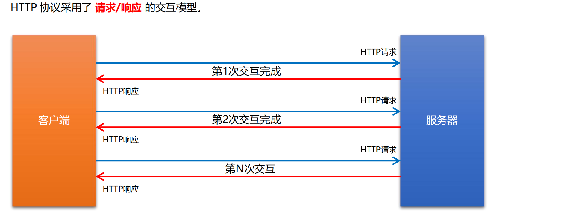

### 5.2 HTTP请求消息
#### 5.2.1 什么是HTTP请求消息
```javascript
//由于 HTTP 协议属于客户端浏览器和服务器之间的通信协议。因此，客户端发起的请求叫做 HTTP 请求，客户端发送到服务器的消息，叫做 HTTP 请求消息。

// 注意：HTTP 请求消息又叫做 HTTP 请求报文。
```

#### 5.2.2 HTTP请求消息的组成部分
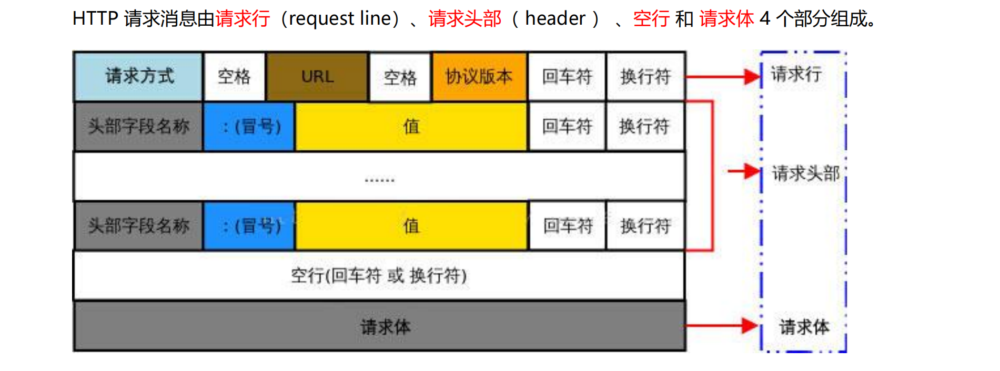

##### 2-1 请求行
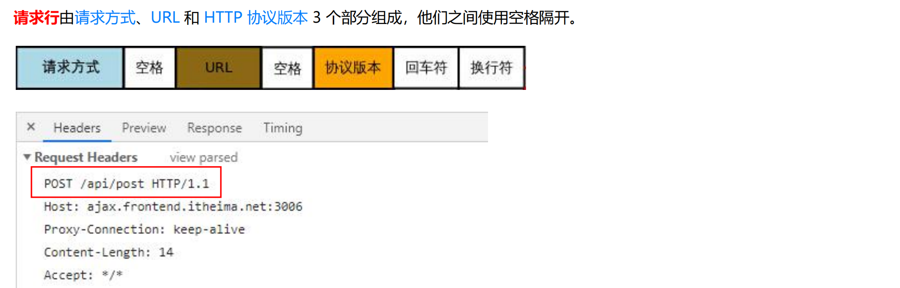

##### 2-2 请求头部
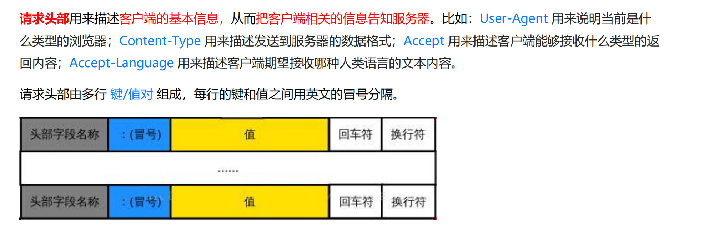

###### 2-2-1 请求头部 – 常见的请求头字段
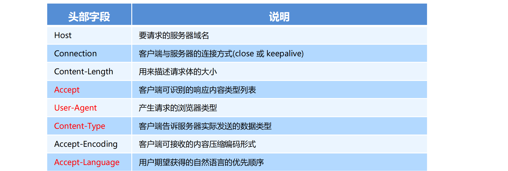

##### 2-3 空行
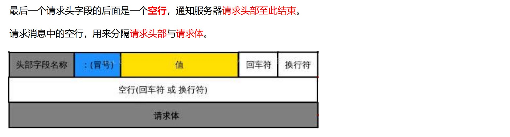

##### 2-4 请求体
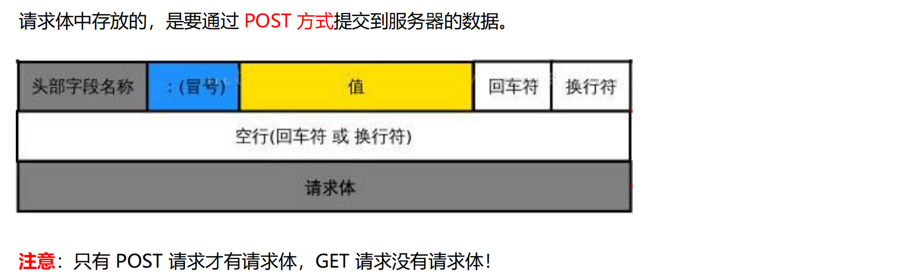

##### 2-5 总结
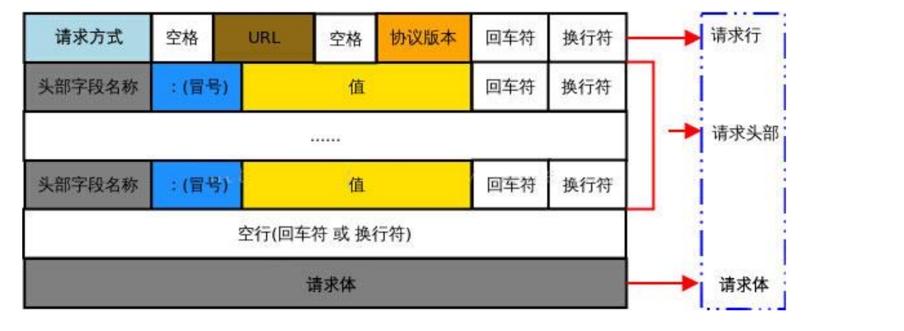

### 5.3 HTTP响应消息
#### 5.3.1 什么是HTTP响应消息
```javascript
// 响应消息就是服务器响应给客户端的消息内容，也叫作响应报文。
```

#### 5.3.2 HTTP响应消息的组成部分
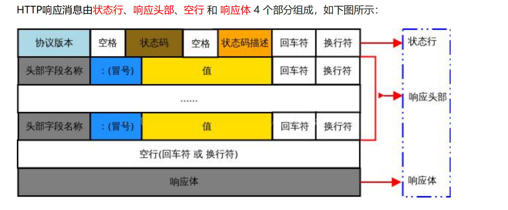

##### 2-1 状态行
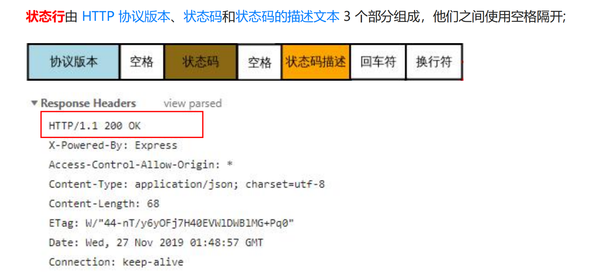

##### 2-2 响应头部
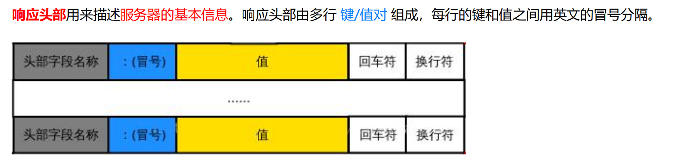

###### 2-2-1 响应头部 – 常见的响应头字段
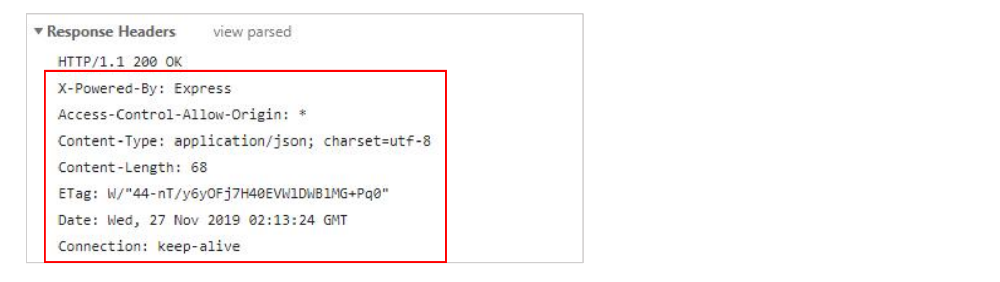

##### 2-3 空行
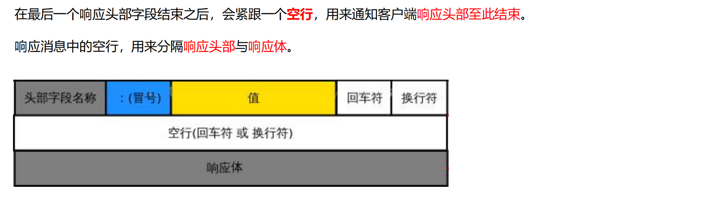

##### 2-4 响应体
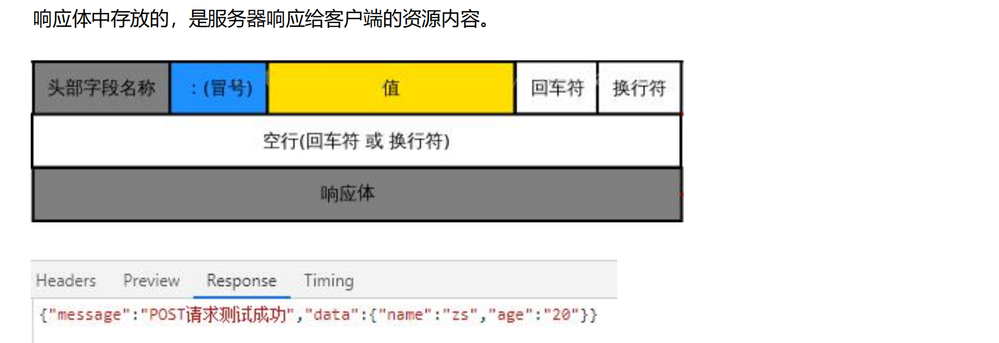

##### 2-5 总结
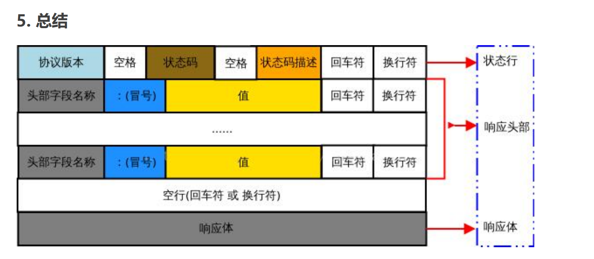

### 5.4 HTTP请求方法
#### 5.4.1 什么是HTTP请求方法
```javascript
// HTTP 请求方法，属于 HTTP 协议中的一部分，请求方法的作用是：用来表明要对服务器上的资源执行的操作。最常用的请求方法是 GET 和 POST。
```

#### 5.4.2 HTTP的请求方法
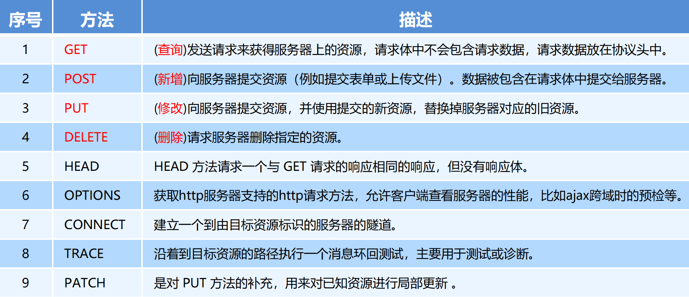

### 5.5 HTTP响应状态代码
#### 5.5.1 什么是HTTP响应状态码
```javascript
//HTTP 响应状态码（HTTP Status Code），也属于 HTTP 协议的一部分，用来标识响应的状态。

//响应状态码会随着响应消息一起被发送至客户端浏览器，浏览器根据服务器返回的响应状态码，就能知道这次HTTP 请求的结果是成功还是失败了。
```

#### 5.5.2 HTTP响应状态码的组成及分类
```javascript
// HTTP 状态码由三个十进制数字组成，第一个十进制数字定义了状态码的类型，后两个数字用来对状态码进行细分。
// HTTP 状态码共分为 5 种类型：
```

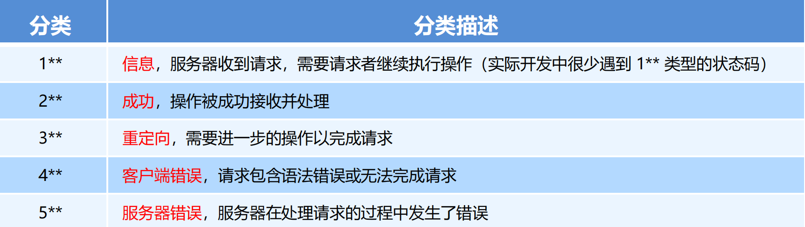

#### 5.5.3 常见的HTTP响应状态码
##### 3-1 2**成功相关的响应状态码
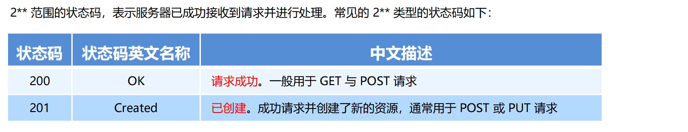

##### 3-2 3** 重定向相关的响应状态码
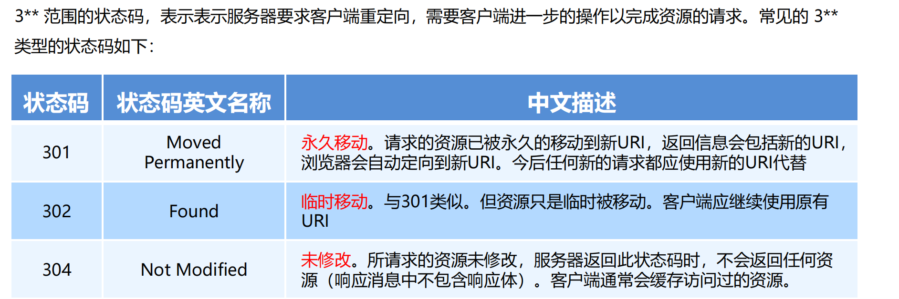

##### 3-3 4** 客户端错误相关的响应状态码
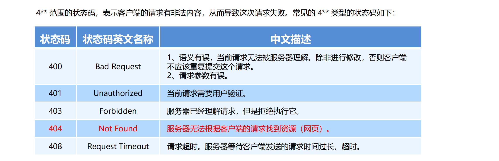

##### 3-4 5** 服务端错误相关的响应状态码
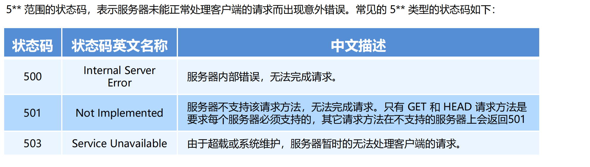

# 七、promise
## 1. Promise是什么？
```plain
//  Promise 是异步编程的一种解决方案，比传统的解决方案回调函数,  更合理和更强大。ES6 将其写进了语言标准，统一了用法，原生提供了Promise对象 。

//指定回调函数方式更灵活易懂。
// 解决异步 **回调地狱** 的问题。
```


### 回调地狱
+ 当一个回调函数嵌套一个回调函数的时候
+ 就会出现一个嵌套结构
+ 当嵌套的多了就会出现回调地狱的情况
+ 比如我们发送三个 ajax 请求

```javascript
ajax({
  url: '我是第一个请求',
  success (res) {
    // 现在发送第二个请求
    ajax({
      url: '我是第二个请求'，
      data: { a: res.a, b: res.b },
      success (res2) {
        // 进行第三个请求
        ajax({
          url: '我是第三个请求',
          data: { a: res2.a, b: res2.b },
                  success (res3) { 
            console.log(res3) 
          }
        })
      }
    })
  }
})
```

```plain
- 第一个正常发送
- 第二个请求需要第一个请求的结果中的某一个值作为参数
- 第三个请求需要第二个请求的结果中的某一个值作为参数
```

+ **回调地狱，其实就是回调函数嵌套过多导致的**


+ 当代码成为这个结构以后，已经没有维护的可能了


## 2. Promise使用
+ 语法：

```javascript
new Promise(function (resolve, reject) {
  // resolve 表示成功的回调
  // reject 表示失败的回调
}).then(function (res) {
  // 成功的函数
}).catch(function (err) {
  // 失败的函数
})
```


## 3. Promise 对象的状态
Promise 对象通过自身的状态，来控制异步操作。Promise 实例具有三种状态。

```plain
异步操作未完成（pending）
异步操作成功（fulfilled）
异步操作失败（rejected）
```

这三种的状态的变化途径只有两种。

```plain
从“未完成”到“成功”
从“未完成”到“失败”
```

一旦状态发生变化，就凝固了，不会再有新的状态变化。这也是 Promise 这个名字的由来，它的英语意思是“承诺”，一旦承诺成效，就不得再改变了。这也意味着，Promise 实例的状态变化只可能发生一次。

因此，Promise 的最终结果只有两种。

```plain
异步操作成功，Promise 实例传回一个值（value），状态变为fulfilled。
异步操作失败，Promise 实例抛出一个错误（error），状态变为rejected。
```


## 4.Promise对象方法
> Promise 是一个对象，也是一个构造函数。
>

### 4.1.Promise.resolve
将现有对象转为 Promise 对象

```javascript
Promise.resolve('kerwin')
// 等价于
new Promise(resolve => resolve('kerwin'))
```

### 4.2.Promise.reject
`Promise.reject(reason)`方法也会返回一个新的 Promise 实例，该实例的状态为`rejected`。

```javascript
const p = Promise.reject('error');
// 等同于
const p = new Promise((resolve, reject) => reject('error'))
```

### 4.3.Promise.all
`Promise.all()`方法用于将多个 Promise 实例，包装成一个新的 Promise 实例。

```javascript
const p = Promise.all([p1, p2, p3]);
```

p的状态由p1,p2,p3 决定，分成两种情况。

（1）只有`p1`、`p2`、`p3`的状态都变成`fulfilled`，`p`的状态才会变成`fulfilled`，此时`p1`、`p2`、`p3`的返回值组成一个数组，传递给`p`的回调函数。

（2）只要`p1`、`p2`、`p3`之中有一个被`rejected`，`p`的状态就变成`rejected`，此时第一个被`reject`的实例的返回值，会传递给`p`的回调函数。

### 4.4.Promise.race
`Promise.race()`方法同样是将多个 Promise 实例，包装成一个新的 Promise 实例。

```javascript
const p = Promise.race([p1, p2, p3]);
```

上面代码中，只要`p1`、`p2`、`p3`之中有一个实例率先改变状态，`p`的状态就跟着改变。那个率先改变的 Promise 实例的返回值，就传递给`p`的回调函数。

### 4.5.Promise.allSettled
`Promise.allSettled()`方法，用来确定一组异步操作是否都结束了（不管成功或失败）。所以，它的名字叫做”Settled“，包含了”fulfilled“和”rejected“两种情况。

```javascript
const promises = [ ajax('/200接口'), ajax('/401接口') ];

Promise.allSettled(promises).then(results=>{
    // 过滤出成功的请求
    results.filter(item =>item.status === 'fulfilled');
    过滤出失败的请求
    results.filter(item=> item.status === 'rejected');
})

```

### 4.6.Promise.any
只要参数实例有一个变成`fulfilled`状态，包装实例就会变成`fulfilled`状态；如果所有参数实例都变成`rejected`状态，包装实例就会变成`rejected`状态。

> `Promise.any()`跟`Promise.race()`方法很像，只有一点不同，就是`Promise.any()`不会因为某个 Promise 变成`rejected`状态而结束，必须等到所有参数 Promise 变成`rejected`状态才会结束。
>

## 5.手写Promise
```javascript
/*
 * @作者: kerwin
 */
function KerwinPromise(executor) {
    this.status = "pending";
    this.result = undefined;
    this.cb = []
    var _this = this;

    function resolve(res) {
        if (_this.status !== "pending") return;
        // console.log(_this)
        _this.status = "fulfilled"
        _this.result = res;

        _this.cb.forEach(item => {
            item.successCB && item.successCB(_this.result)
        });
    }

    function reject(res) {
        if (_this.status !== "pending") return;
        // console.log("reject")
        _this.status = "rejected"
        _this.result = res;
        _this.cb.forEach(item => {
            item.failCB && item.failCB(_this.result)
        });
    }
    executor(resolve, reject)
}

KerwinPromise.prototype.then = function (successCB, failCB) {

    if(!successCB){
        successCB = value=>value
    }
    if(!failCB){
        failCB = error=>error
    }

    // successCB()
    return new KerwinPromise((resolve, reject) => {
        if (this.status === "fulfilled") {
            var result = successCB && successCB(this.result)
            // console.log(result);

            if (result instanceof KerwinPromise) {
                result.then(res => {
                    // console.log(res)
                    resolve(res);
                }, err => {
                    // console.log(err)
                    reject(err)
                })
            } else {
                resolve(result);
            }
        }
        if (this.status === "rejected") {
            var result = failCB && failCB(this.result)

            if (result instanceof KerwinPromise) {
                result.then(res => {
                    // console.log(res)
                    resolve(res);
                }, err => {
                    // console.log(err)
                    reject(err)
                })
            } else {
                reject(result);
            }
        }

        if (this.status === "pending") {
            //收集回调
            this.cb.push({
                successCB: () => {
                    var result = successCB && successCB(this.result)

                    if (result instanceof KerwinPromise) {
                        result.then(res => {
                            // console.log(res)
                            resolve(res);
                        }, err => {
                            // console.log(err)
                            reject(err)
                        })
                    } else {
                        resolve(result);
                    }
                },
                failCB: () => {
                    var result = failCB && failCB(this.result)
                    if (result instanceof KerwinPromise) {
                        result.then(res => {
                            // console.log(res)
                            resolve(res);
                        }, err => {
                            // console.log(err)
                            reject(err)
                        })
                    } else {
                        reject(result);
                    }
                }
            })
        }
    })
}

KerwinPromise.prototype.catch= function(failCB){
    this.then(undefined,failCB)
}
```

## 6.Async与Await
### 6.1.Async
async 函数，使得异步操作变得更加方便。

+ 更好的语义。
+ 返回值是 Promise。

```javascript
async function test(){
    
}
test()
```


## 6.2.Await
`await`命令后面是一个 Promise 对象，返回该对象的结果。如果不是 Promise 对象，就直接返回对应的值。

```javascript
async function test(){
    var res1 =  await ajax("http://localhost:3000/news1")
    var res2 =  await ajax("http://localhost:3000/news2")
    return res2
}

test().then(res=>{
    console.log("返回结果",res)
}).catch(err=>{
    console.log("err",err)
})
```


### 6.3.错误处理
```javascript
try{
    var res1 =  await ajax("http://localhost:3000/news1")
    var res2 =  await ajax("http://localhost:3000/news2")
}catch(err){
    console.log("err",err)
}
```

# 八、npm
[https://www.npmjs.com/](https://www.npmjs.com/)

## 1，npm基础知识
```javascript
// 从 https://www.npmjs.com/ 网站上搜索自己所需要的包
// 从 https://registry.npmjs.org/ 服务器上下载自己需要的包

// 初次装包完成后，在项目文件夹下多一个叫做 node_modules 的文件夹和 package-lock.json 的配置文件。
// 其中：
   // node_modules 文件夹用来存放所有已安装到项目中的包。require() 导入第三方包时，就是从这个目录中查找并加载包。
   // package-lock.json 配置文件用来记录 node_modules 目录下的每一个包的下载信息，例如包的名字、版本号、下载地址等。

// npm指令

1， npm -v  //  查看版本号
2， npm init -y  // 快速初始化项目，快速创建 package.json 这个包管理配置文件

// 上述命令只能在英文的目录下成功运行！所以，项目文件夹的名称一定要使用英文命名，不要使用中文，不能出现空格


// 如果某些包只在项目开发阶段会用到，在项目上线之后不会用到，则建议把这些包记录到 devDependencies 节点中
3, npm i 包名 -D   || npm i 包名 --save-dev


// 查看当前的下包镜像源
4， npm config get registry
// 将下包的镜像源换为淘宝镜像源
5, npm config set registry = https://registry.npm.taobao.org/


// 为了更方便的切换下包的镜像源，我们可以安装 nrm 这个小工具，利用 nrm 提供的终端命令，可以快速查看和切换下包的镜像源
6, npm i nrm -g
// 查看所有可用的镜像源
7， nrm ls
// 将下载镜像源转换为淘宝镜像源
8, nrm use taobao

// 开发依赖包
9 npm i 包名 -D   // 被记录到 devDependencies 节点中的包，只在开发期间会用到
// 核心依赖包
10 npm i 包名    // 被记录到 dependencies 节点中的包，在开发期间和项目上线之后都会用到
```

## 2，i5ting_toc
i5ting_toc 是一个可以把 md 文档转为 html 页面的小工具，使用步骤如下：

```javascript
// 安装
npm install -g  i5ting_toc
// 把md文档转换为网页
i5ting_toc -f 需要转换的md路径 -o
```

## 3，npm 查看命令（以axios为例）
```javascript
// 查看项目中依赖所在的目录
npm root

// 查看全局安装的依赖所在目录
npm root -g

// 查看已安装依赖的列表
npm list
npm ls

// 查看axios最新的版本号
npm view axios version

// 查看全部axios历史版本号
npm view axios versions

// 查看最新的axios版本的信息
npm view axios
npm info axios

// 查看本地已安装的axios的详细信息
npm list axios
npm ls axios

```

## 4, npm其他命令（以axios为例）
```javascript
// 清除npm的缓存
npm cache clean

// 清除项目中没有被使用的依赖
npm prune

// 检查依赖是否已经弃用
npm outdated

// 打开默认浏览器跳转到github中axios的页面
npm repo axios

// 打开默认浏览器跳转到github中axios的README.MD文件
npm docs axios

```

# 九、Git
```javascript
// Git 中的三个区域---------------工作区、暂存区、Git 仓库

// 工作区 ----------------- 处理工作的区域
// 暂存区 ---------------- 已完成的工作的临时存放区域，等待被提交
// Git 仓库 ------------ 最终的存放区域

// git中的三种状态 -----------------已暂存 staged || 已修改 modified || 已提交 committed

// 工作区的文件被修改了，但还没有放到暂存区，就是已修改状态。
// 如果文件已修改并放入暂存区，就属于已暂存状态。
// 如果 Git 仓库中保存着特定版本的文件，就属于已提交状态。

```

## 1,安装并配置 Git
### 1.1  配置用户信息
```javascript
// 安装完 Git 之后，要做的第一件事就是设置自己的用户名和邮件地址。因为通过 Git 对项目进行版本管理的时候，Git 需要使用这些基本信息，来记录是谁对项目进行了操作：

git cnnfig --global user.name "aini"
git config --global user>email "2022@163.com"

```

### 1.2  Git 的全局配置文件
```plain
// 通过 git config --global user.name 和 git config --global user.email 配置的用户名和邮箱地址，会被写入到 C:/Users/用户名文件夹/.gitconfig 文件中。这个文件是 Git 的全局配置文件，配置一次即可永久生效。
```

### 1.3 检查配置信息
```javascript
// 查看所有的全局配置项
git config --list --global

// 查看指定的全局配置项
git config user.name
git config user.email
```

### 1.4 获取帮助信息
```plain
// 查看 git config 命令的帮助手册
git config -help
// 获取 git config 命令的快速参考
git config -h  
```

## 2 GIt 的基本操作
### 2.1 获取 Git 仓库的两种方式
```javascript
// ① 将尚未进行版本控制的本地目录转换为 Git 仓库
// ② 从其它服务器克隆一个已存在的 Git 仓库
```

### 2.2  在现有目录中初始化仓库
```javascript
// 如果自己有一个尚未进行版本控制的项目目录，想要用 Git 来控制它，需要执行如下两个步骤：

// 在项目目录中，通过鼠标右键打开“Git Bash”
//执行 git init 命令将当前的目录转化为 Git 仓库

// git init 命令会创建一个名为 .git 的隐藏目录，这个 .git 目录就是当前项目的 Git 仓库，里面包含了初始的必要文件，这些文件是 Git 仓库的必要组成部分。
```

### 2.3  工作区中文件的 4 种状态
```javascript
// 未跟踪（Untracked）------------- 不被 Git 所管理的文件
// 未修改（Unmodified）------------ 工作区中文件的内容和 Git仓库中文件的内容保持一致
// 已修改（Modified）-------------- 工作区中文件的内容和 Git 仓库中文件的内容不一致
// 已暂存（Staged）---------------- 工作区中被修改的文件已被放到暂存区，准备将修改后的文件保存到 Git 仓库中

// Git 操作的终极结果：让工作区中的文件都处于“未修改”的状态

```

### 2.4  检查文件的状态
```plain
git status 
// 在状态报告中可以看到新建的 index.html 文件出现在 Untracked files（未跟踪的文件） 下面。
// 未跟踪的文件意味着 Git 在之前的快照（提交）中没有这些文件；Git 不会自动将之纳入跟踪范围，除非明确地告诉它“我需要使用 Git 跟踪管理该文件”

// 精简的方式显示文件状态
git status -s || git status --short

// 未跟踪文件前面有红色的 ?? 标记
```

### 2.5 跟踪新文件
```javascript
// 跟踪单个文件
git add index.html
// 跟踪所有文件
git add .

// 此时再运行 git status 命令，会看到 index.html 文件在 Changes to be committed 这行的下面，说明已被跟踪，并处于暂存状态：
// 已跟踪的文件绿色显示

```

### 2.6 提交更新
```javascript
// 现在暂存区中有一个 index.html 文件等待被提交到 Git 仓库中进行保存。可以执行 git commit 命令进行提交,其中 -m 选项后面是本次的提交消息，用来对提交的内容做进一步的描述：

git cimmit -m "提交信息内容"

// 提交成功之后，再次检查文件的状态，得到提示如下：nothing to commit, working tree clean
// 证明工作区中所有的文件都处于“未修改”的状态，没有任何文件需要被提交。
```

### 2.7 对已提交的文件进行修改
```javascript
// 目前，index.html 文件已经被 Git 跟踪，并且工作区和 Git 仓库中的 index.html 文件内容保持一致。当我们修改了工作区中 index.html 的内容之后，再次运行 git status 和 git status -s 命令，会看到如下的内容：

// 文件 index.html 出现在 Changes not staged for commit 这行下面，说明已跟踪文件的内容发生了变化，但还没有放到暂存区。
// 注意：修改过的、没有放入暂存区的文件前面有红色的 M 标记
```

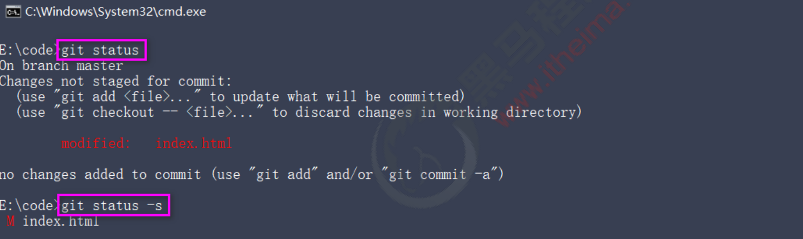

### 2.8 暂存已修改的文件
```javascript
// 目前，工作区中的 index.html 文件已被修改，如果要暂存这次修改，需要再次运行 git add 命令，这个命令是个多功能的命令，主要有如下 3 个功效：
1, 可以用它开始跟踪新文件
2, 把已跟踪的、且已修改的文件放到暂存区
3, 把有冲突的文件标记为已解决状态
```

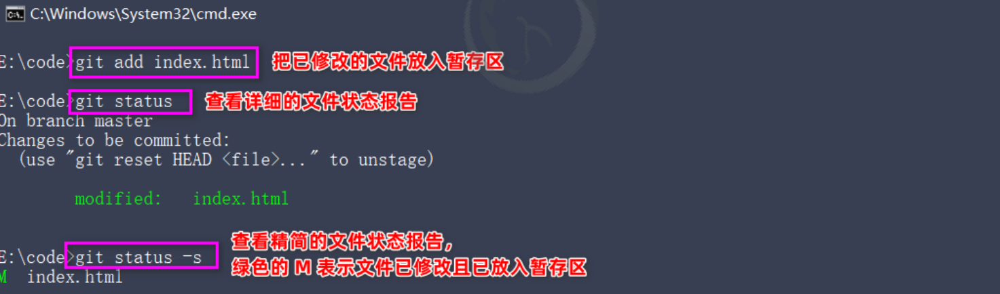

### 2.9 提交已暂存的文件
```javascript
// 再次运行 git commit -m "提交消息" 命令，即可将暂存区中记录的 index.html 的快照，提交到 Git 仓库中进行保存：
```

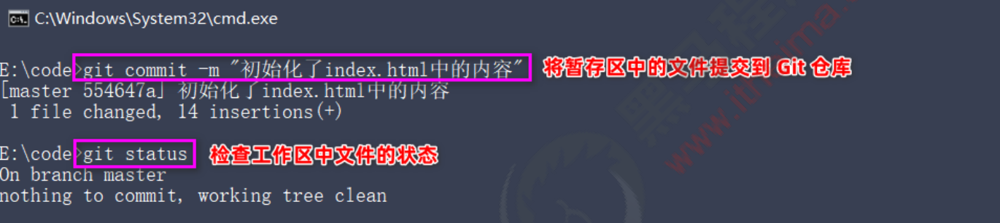

### 2.10 撤销对文件的修改
```javascript
// 撤销对文件的修改指的是：把对工作区中对应文件的修改，还原成 Git 仓库中所保存的版本。
// 操作的结果：所有的修改会丢失，且无法恢复！危险性比较高，请慎重操作！
// 撤销操作的本质：用 Git 仓库中保存的文件，覆盖工作区中指定的文件。

git checkout --index.html  //  撤销对index.html的修改
```

### 2.11 向暂存区中一次性添加多个文件
```plain
git add .
// 今后在项目开发中，会经常使用这个命令，将新增和修改过后的文件加入暂存区。
```

### 2.12  取消暂存的文件
```javascript
// 如果需要从暂存区中移除对应的文件，可以使用如下的命令：
git reset HEAD 要移除的文件名
```

### 2.13 跳过使用暂存区域
```plain
// Git 标准的工作流程是工作区 → 暂存区 → Git 仓库，但有时候这么做略显繁琐，此时可以跳过暂存区，直接将工作区中的修改提交到 Git 仓库，这时候 Git 工作的流程简化为了工作区 → Git 仓库。

// Git 提供了一个跳过使用暂存区域的方式， 只要在提交的时候，给 git commit 加上 -a 选项，Git 就会自动把所有已经跟踪过的文件暂存起来一并提交，从而跳过 git add 步骤：

git commit -a -m "提交信息内容"
```

### 2.14 移除文件
```javascript
// 从 Git 仓库中移除文件的方式有两种：

// 从 Git 仓库和工作区中同时移除指定的文件
git rm -f index.html

// 只从 Git 仓库中移除指定的文件，但保留工作区中对应的文件
git rm --cached index.css
```

### 2.15 忽略文件
```javascript
// 一般我们总会有些文件无需纳入 Git 的管理，也不希望它们总出现在未跟踪文件列表。 在这种情况下，我们可以创建一个名为 .gitignore 的配置文件，列出要忽略的文件的匹配模式。

// 文件 .gitignore 的格式规范如下：
1, 以 # 开头的是注释
2, 以 / 结尾的是目录
3, 以 / 开头防止递归
4, 以 ! 开头表示取反
5, 可以使用 glob 模式进行文件和文件夹的匹配（glob 指简化了的正则表达式）
```

### 2.16  glob 模式
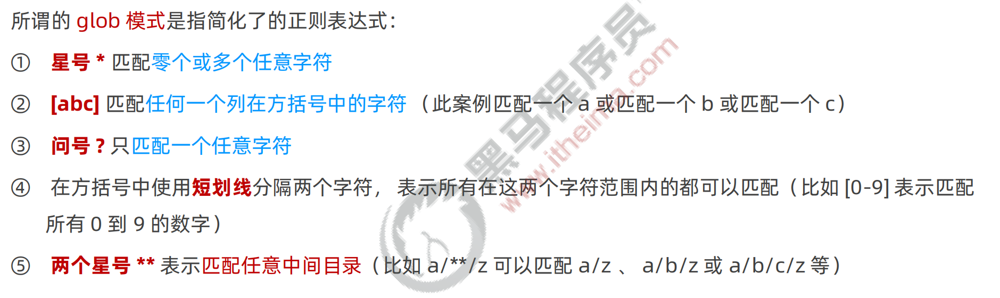

### 2.17  **.gitignore** 文件的例子
```javascript
// 忽略所有的 .a 文件、
*.a

// 但跟中所有的 lib.a 即便你在前面忽略了 .a 文件
!lib.a

// 只忽略当前目录下的 TODO 文件，而不忽略 subdir/TODO
/TODO

// 忽略任何目录下名为build的文件夹
build/
    
// 忽略 doc/notes.txt 但不忽略 doc/server/arch.txt
doc/*.txt

// 忽略 doc/ 目录及其所有子目录下的.pdf 文件
doc/**/*.pdf
```

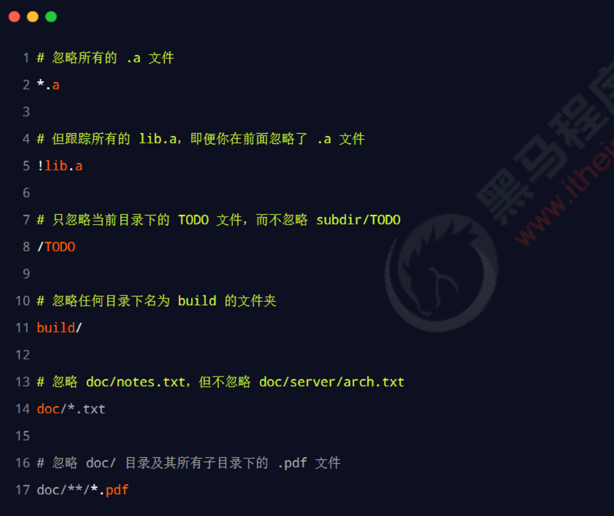

### 2.18  查看提交历史
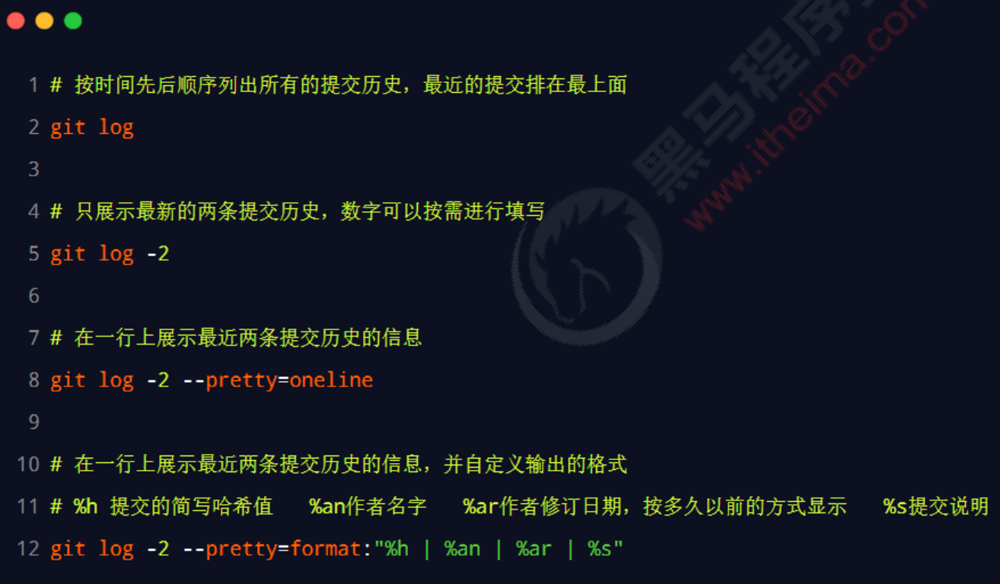

### 2.19  回退到指定的版本
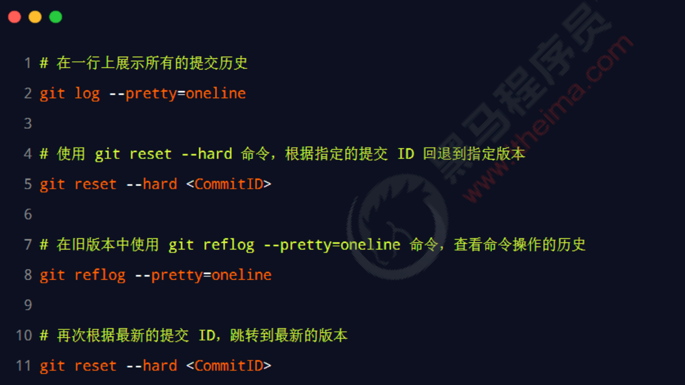

## 3，Github - 远程仓库的使用
### 3.1， 远程仓库的两种访问方式
```javascript
// Github 上的远程仓库，有两种访问方式，分别是 HTTPS 和 SSH。它们的区别是：

1, HTTPS：零配置；但是每次访问仓库时，需要重复输入 Github 的账号和密码才能访问成功
2, SSH：需要进行额外的配置；但是配置成功后，每次访问仓库时，不需重复输入 Github 的账号和密码

// 注意：在实际开发中，推荐使用 SSH 的方式访问远程仓库。
```

### 3.2 ,基于 HTTPS 将本地仓库上传到 Github
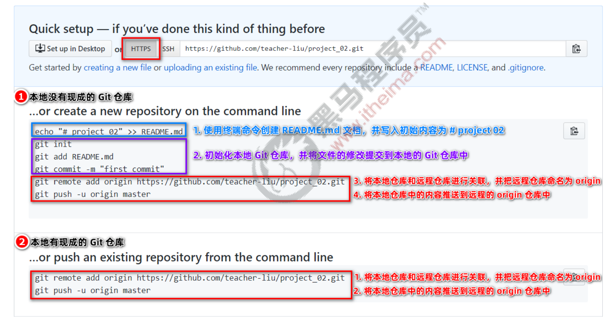

### 3.3  SSH key
```javascript
// SSH key 的作用：实现本地仓库和 Github 之间免登录的加密数据传输。
// SSH key 的好处：免登录身份认证、数据加密传输。

// SSH key 由两部分组成，分别是：
1, id_rsa（私钥文件，存放于客户端的电脑中即可）
2, id_rsa.pub（公钥文件，需要配置到 Github 中
```

### 3.4 生成 SSH key
```javascript
// 打开 Git Bash

// 粘贴如下的命令，并将 your_email@example.com 替换为注册 Github 账号时填写的邮箱：
ssh-keygen -t rsa -b 4096 -C "your_email@example.com"

// 连续敲击 3 次回车，即可在 C:\Users\用户名文件夹\.ssh 目录中生成 id_rsa 和 id_rsa.pub 两个文件
```

3.5 配置 SSH key

```javascript
// 使用记事本打开 id_rsa.pub 文件，复制里面的文本内容
1, 在浏览器中登录 Github，点击头像 -> Settings -> SSH and GPG Keys -> New SSH key
2, 将 id_rsa.pub 文件中的内容，粘贴到 Key 对应的文本框中
3, 在 Title 文本框中任意填写一个名称，来标识这个 Key 从何而来
```

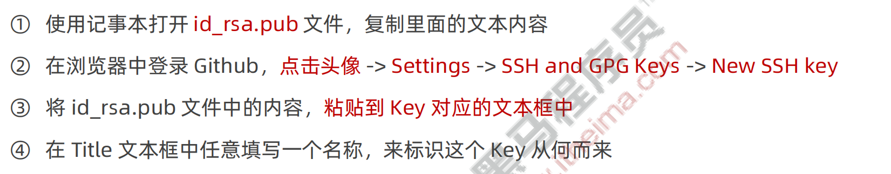

### 3.6  检测 Github 的 SSH key 是否配置成功
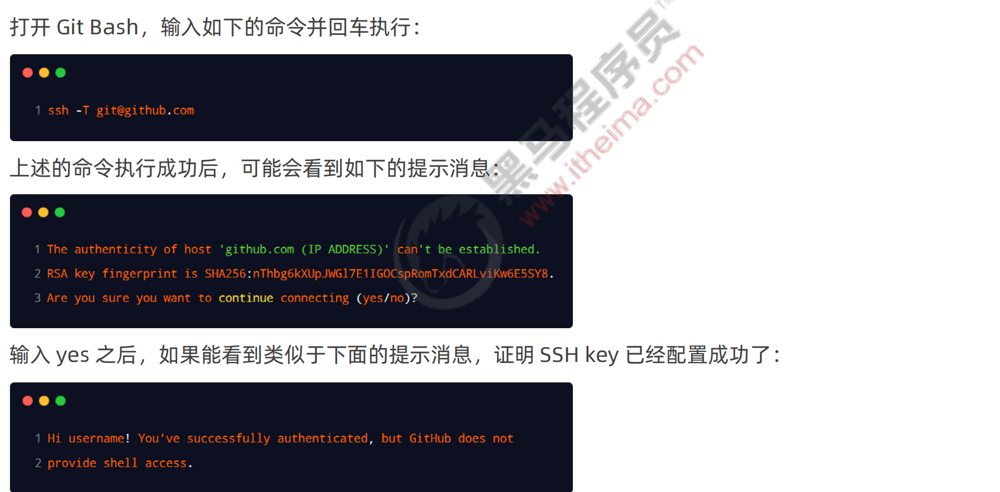

### 3.7 基于 SSH 将本地仓库上传到 Github
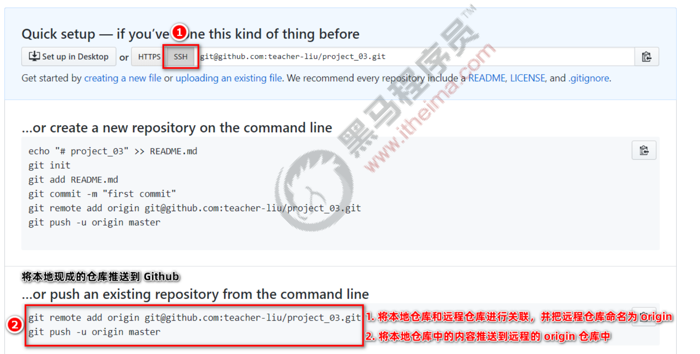


### 3.8 将远程仓库克隆到本地
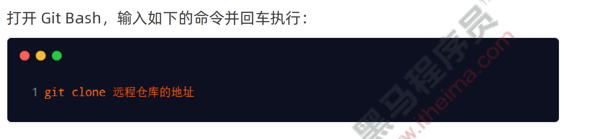

## 4 本地分支操作
### 4.1 master 主分支
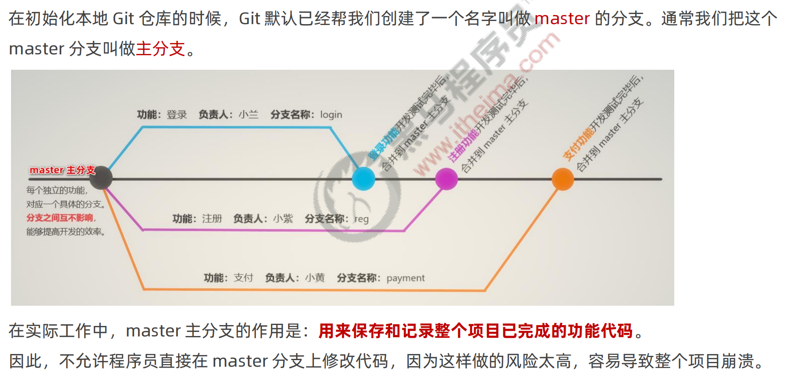

### 4.2  功能分支
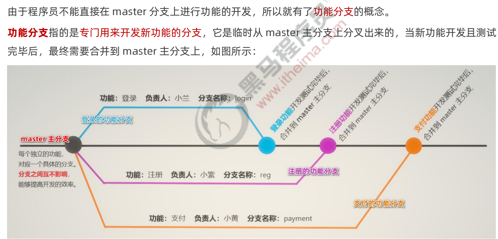

### 4.3 查看分支列表
```javascript
// 查看分支列表
git branch

// 分支名字前面的 * 号表示当前所处的分支。
```

### 4.4 创建新分支
```javascript
// 创建分支
git branch 分支名称
```

### 4.5  切换分支
```plain
// 切换分支
git checkout 分支名称
```

### 4.6 分支的快速创建和切换
```plain
// -b 表示创建一个新分支
// checkout 表示切换到新建的分支上
git checkout -b 分支名称
```

### 4.7 合并分支
```plain
// 切换到master分支
git checkout master

// 将master分支上运行git merge 命令，将login分支的代码合并到master分支
git merge login
```

### 4.8 删除分支
```plain
// 删除分支
git branch -d 分支名称
```

### 4.9 遇到冲突时的分支合并
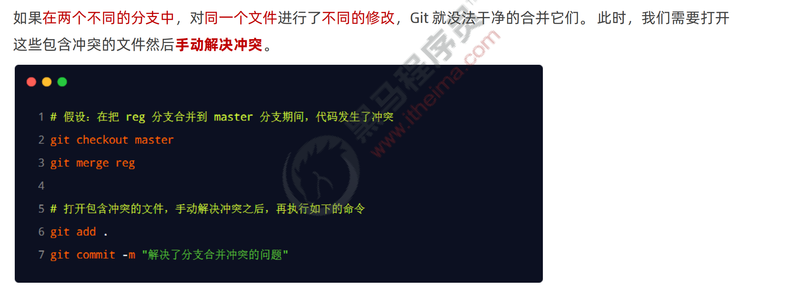

## 5,远程分支操作
### 5.1  将本地分支推送到远程仓库
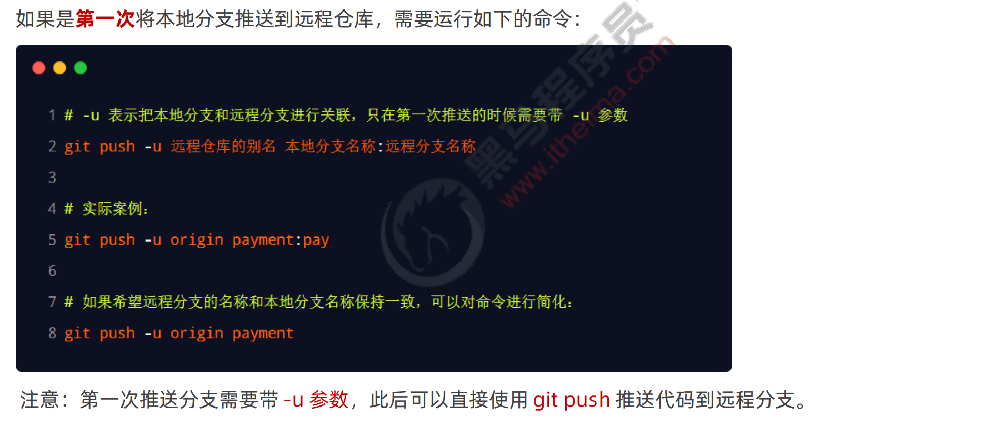

```plain
// 注意：第一次推送分支需要带 -u 参数，此后可以直接使用 git push 推送代码到远程分支。
```

### 5.2 查看远程仓库中所有的分支列表
```plain
// 查看远程仓库中所有的分支列表
gir remote show 远程仓库名称
```

### 5.3 跟踪分支
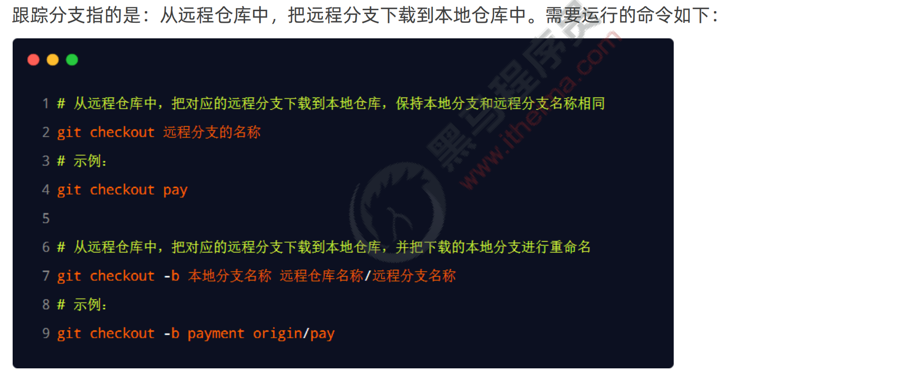

### 5.4 拉取远程分支的最新的代码
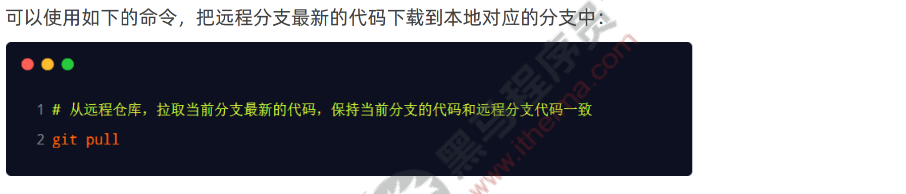

### 5.5 删除远程分支
```javascript
// 删除远程仓库中，指定名称的远程分支
git push 远程仓库名称 --delete 远程分支名称

// 实例
git push origin --delete pay
```

# 
