# 十、Vue
### 这是我2023年学习Vue的时候学完黑马程序员整理下来的，觉得内容蛮不错的，就保留了，下面还有个一个Vue3，是我最近自己重写的，官方都开始推荐使用使用Vue3，反正两个都可以看看
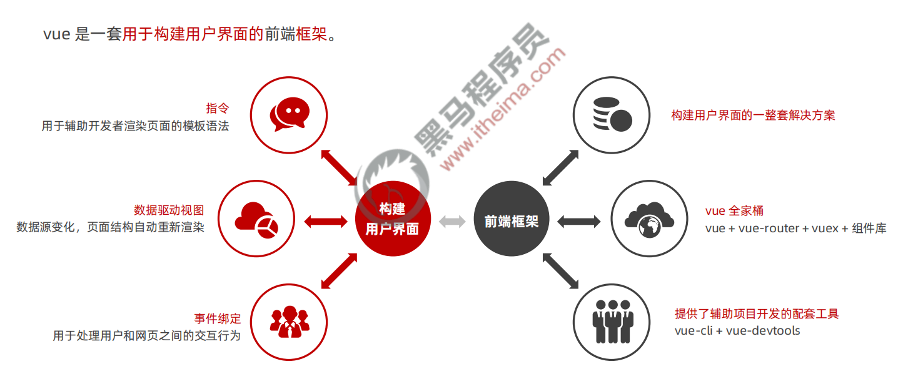

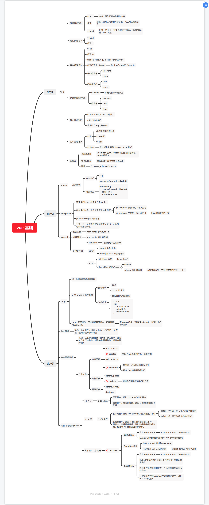

## 11.1 Vue2
### 11.1.1 Vue简介
#### 1-1 vue 框架的特性
```javascript
//  数据驱动视图
//  双向数据绑定
```

#### 1-2 数据驱动视图
在使用了 vue 的页面中，vue 会监听数据的变化，从而自动重新渲染页面的结构。示意图如下：

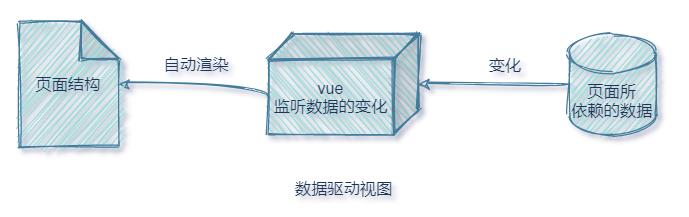

```javascript
// 好处：当页面数据发生变化时，页面会自动重新渲染！
// 注意：数据驱动视图是单向的数据绑定。
```

#### 1-3 双向数据绑定
```javascript
// 在填写表单时，双向数据绑定可以辅助开发者在不操作 DOM 的前提下，自动把用户填写的内容同步到数据源中。示意图如下：
```

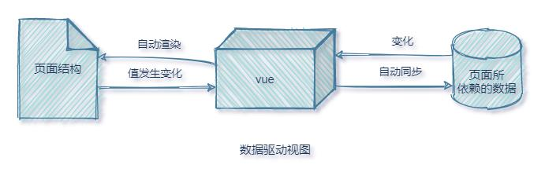

好处：开发者不再需要手动操作 DOM 元素，来获取表单元素最新的值！

#### 1-4 MVVM
```javascript
// MVVM 是 vue 实现数据驱动视图和双向数据绑定的核心原理。MVVM 指的是 Model、View 和 ViewModel，它把每个 HTML 页面都拆分成了这三个部分，如图所示：
```

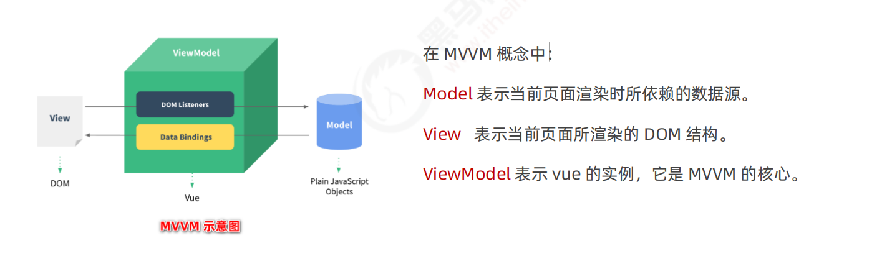

#### 1-5 MVVM 的工作原理
ViewModel 作为 MVVM 的核心，是它把当前页面的数据源（Model）和页面的结构（View）连接在了一起

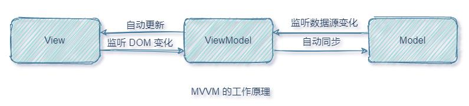

当数据源发生变化时，会被 ViewModel 监听到，VM 会根据最新的数据源自动更新页面的结构

当表单元素的值发生变化时，也会被 VM 监听到，VM 会把变化过后最新的值自动同步到 Model 数据源中

#### 1-6 框架
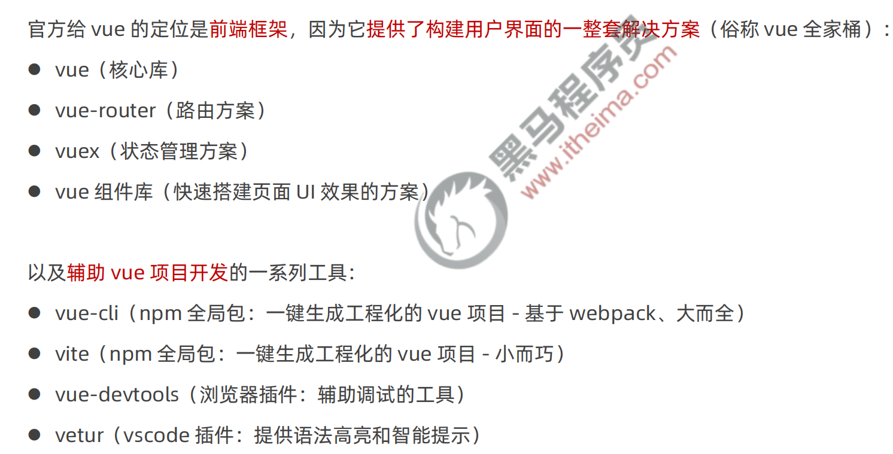

### 11.1.2 基础使用
#### 2-1 基本使用步骤
```javascript
// 导入 vue.js 的 script 脚本文件
// 在页面中声明一个将要被 vue 所控制的 DOM 区域
// 创建 vm 实例对象（vue 实例对象）
```

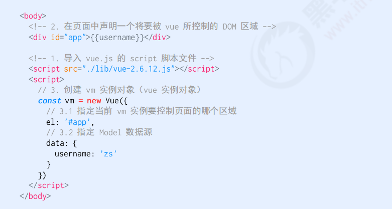

#### 2-2 基本代码与 MVVM 的对应关系
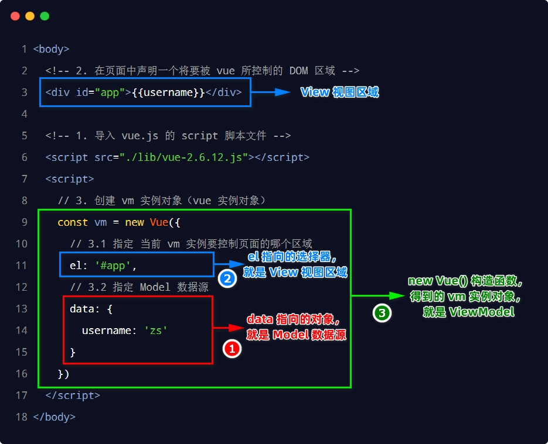

#### 2-3 Vue的调试工具
**1. 安装 vue-devtools 调试工具**

```plain
// vue 官方提供的 vue-devtools 调试工具，能够方便开发者对 vue 项目进行调试与开发。

// Chrome 浏览器在线安装 vue-devtools ：

    https://chrome.google.com/webstore/detail/vuejs-devtools/nhdogjmejiglipccpnnnanhbledajbpd

// FireFox 浏览器在线安装 vue-devtools ：

    https://addons.mozilla.org/zh-CN/firefox/addon/vue-js-devtools/
```

#### 2.配置 Chrome 浏览器中的 vue-devtools
点击 Chrome 浏览器右上角的 按钮，选择更多工具 -> 扩展程序 -> Vue.js devtools 详细信息，并勾选如下的两个选项：

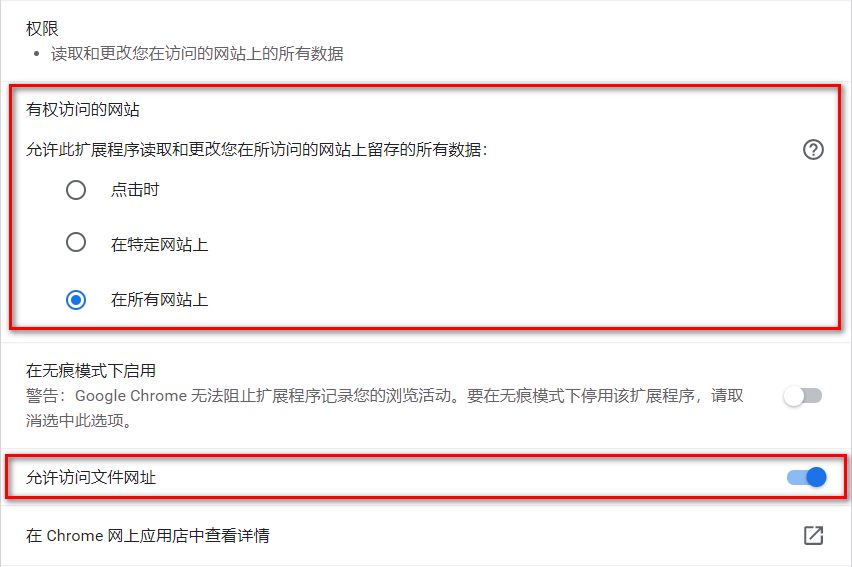

#### 3,使用 vue-devtools 调试 vue 页面
在浏览器中访问一个使用了 vue 的页面，打开浏览器的开发者工具，切换到 Vue 面板，即可使用 vue-devtools 调试当前的页面。

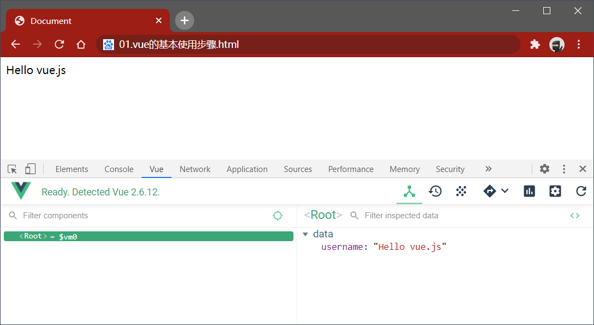

### 11.1.3 Vue的指令与过滤器
#### 3-1 指令的概念
```javascript
// 指令（Directives）是 vue 为开发者提供的模板语法，用于辅助开发者渲染页面的基本结构。
// vue 中的指令按照不同的用途可以分为如下 6 大类：
    // ① 内容渲染指令
    // ② 属性绑定指令
    // ③ 事件绑定指令
    // ④ 双向绑定指令
    // ⑤ 条件渲染指令
    // ⑥ 列表渲染指令
// 注意：指令是 vue 开发中最基础、最常用、最简单的知识点
```

#### 3-2 内容渲染指令
```vue
<!--  内容渲染指令用来辅助开发者渲染 DOM 元素的文本内容。常用的内容渲染指令有如下 3 个：-->
    v-text
    {{ }}
    v-html
```

##### 2-1  v-text
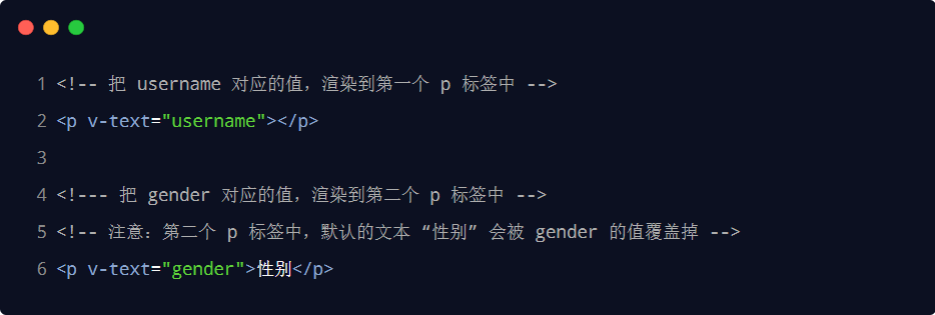

注意：v-text 指令会覆盖元素内默认的值。

##### 2-2 **{{ }} 语法**
```javascript
// vue 提供的 {{ }} 语法，专门用来解决 v-text 会覆盖默认文本内容的问题。这种 {{ }} 语法的专业名称是插值表达式（英文名为：Mustache）。
```

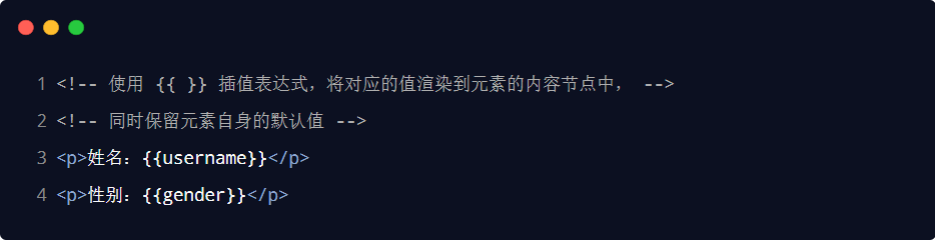

注意：相对于 v-text 指令来说，插值表达式在开发中更常用一些！因为它不会覆盖元素中默认的文本内容。

##### 2-3 v-html
```javascript
// v-text 指令和插值表达式只能渲染纯文本内容。如果要把包含 HTML 标签的字符串渲染为页面的 HTML 元素，则需要用到 v-html 这个指令：
```

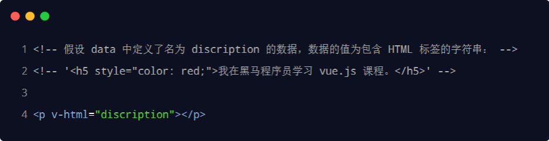

#### 3-3 属性绑定指令
如果需要为元素的属性动态绑定属性值，则需要用到 v-bind 属性绑定指令。用法示例如下：

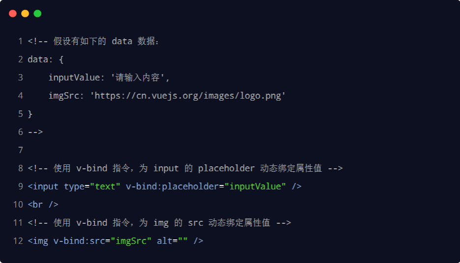

##### 3-1 属性绑定指令的简写形式
由于 v-bind 指令在开发中使用频率非常高，因此，vue 官方为其提供了简写形式（简写为英文的 **:** ）。

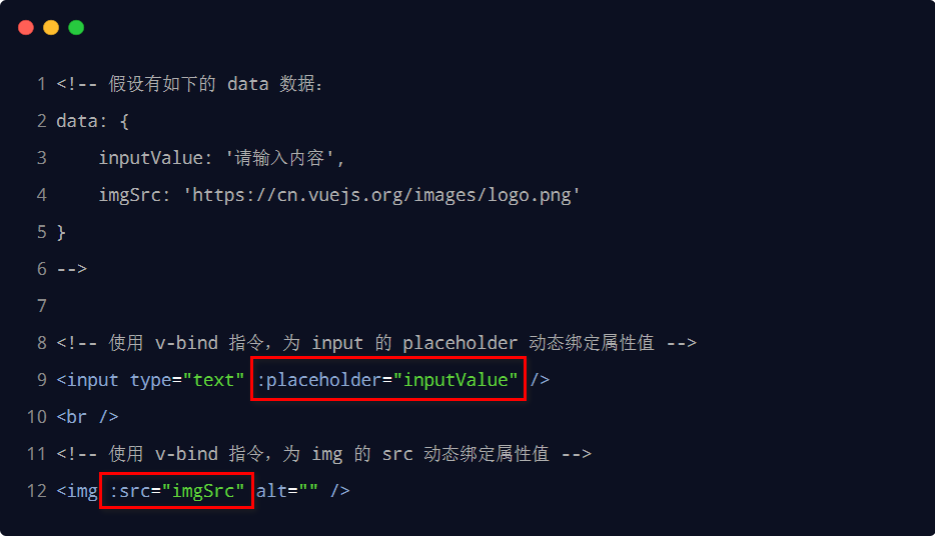

##### 3-2 使用 Javascript 表达式
在 vue 提供的模板渲染语法中，除了支持绑定简单的数据值之外，还支持 Javascript 表达式的运算，例如：

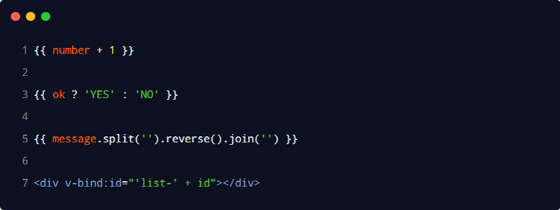

#### 3-4 事件绑定指令
vue 提供了 v-on 事件绑定指令，用来辅助程序员为 DOM 元素绑定事件监听。语法格式如下：

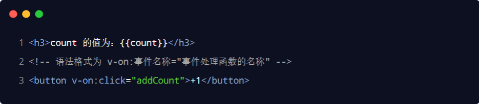

注意：原生 DOM 对象有 onclick、oninput、onkeyup 等原生事件，替换为 vue 的事件绑定形式后，

分别为：v-on:click、v-on:input、v-on:keyup

通过 v-on 绑定的事件处理函数，需要在 methods 节点中进行声明：

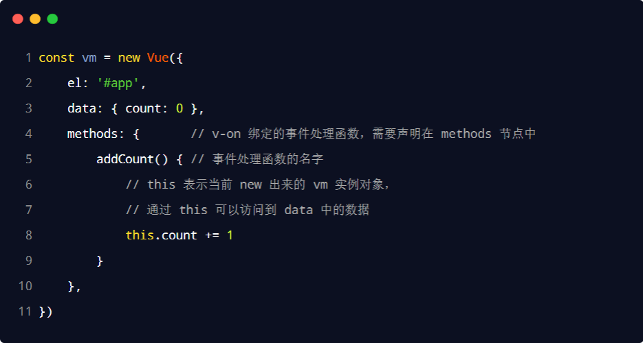

##### 4-1 **事件绑定的简写形式**
由于 v-on 指令在开发中使用频率非常高，因此，vue 官方为其提供了简写形式（简写为英文的 **@** ）。

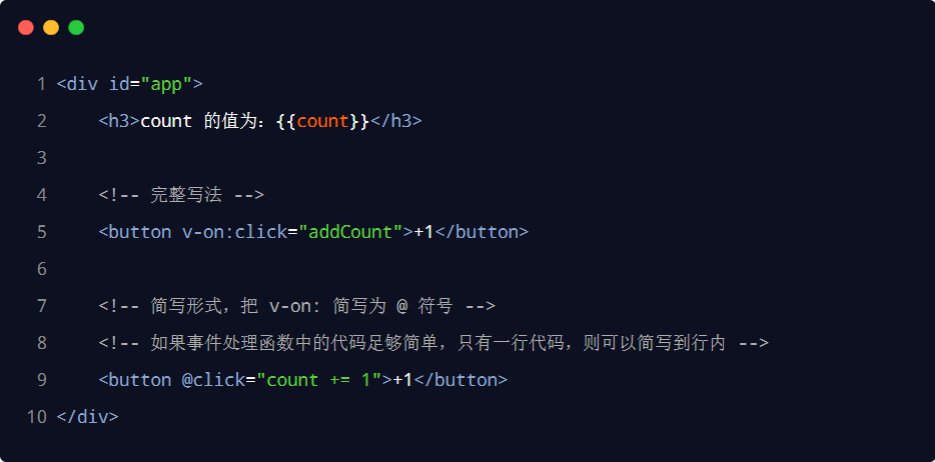

##### 4-2 事件参数对象
在原生的 DOM 事件绑定中，可以在事件处理函数的形参处，接收事件参数对象 event。同理，在 v-on 指令

（简写为 @ ）所绑定的事件处理函数中，同样可以接收到事件参数对象 event，示例代码如下

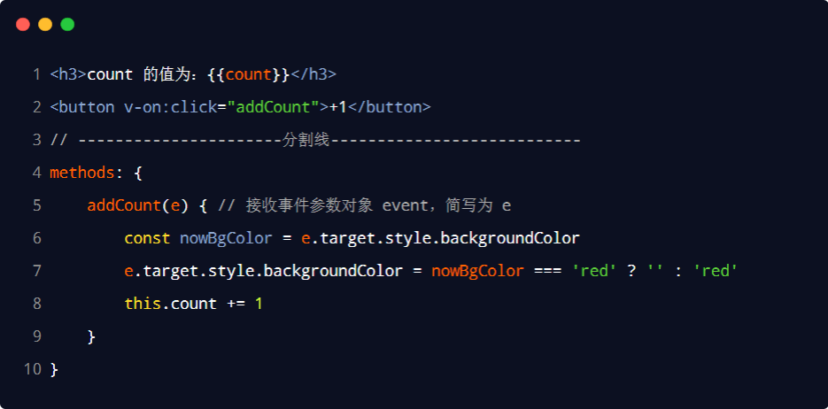

##### 4-3 绑定事件并传参
在使用 v-on 指令绑定事件时，可以使用 **( )** 进行传参，示例代码如下：

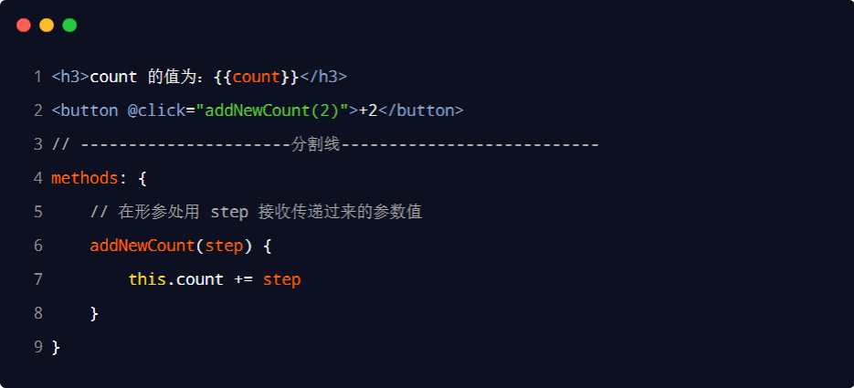

##### 4-4 $event
$ event 是 vue 提供的特殊变量，用来表示原生的事件参数对象 event。 $event 可以解决事件参数对象 event 被覆盖的问题。示例用法如下：

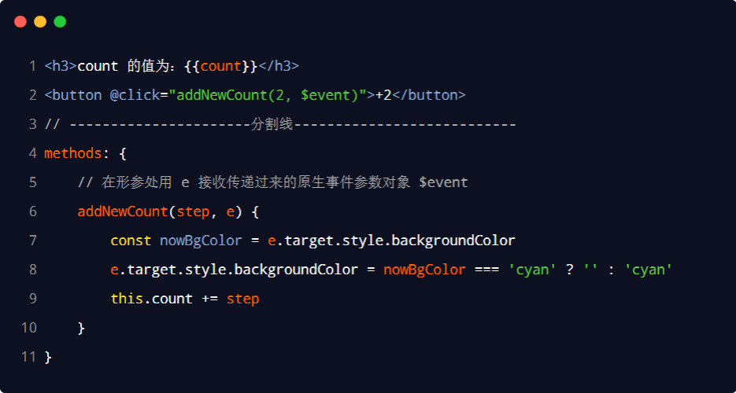

##### 4-5 事件修饰符
在事件处理函数中调用 event.preventDefault() 或 event.stopPropagation() 是非常常见的需求。因此，

vue 提供了事件修饰符的概念，来辅助程序员更方便的对事件的触发进行控制。常用的 5 个事件修饰符如下：

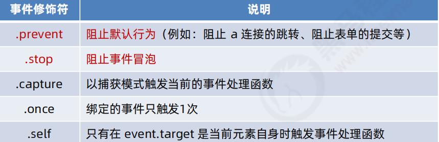

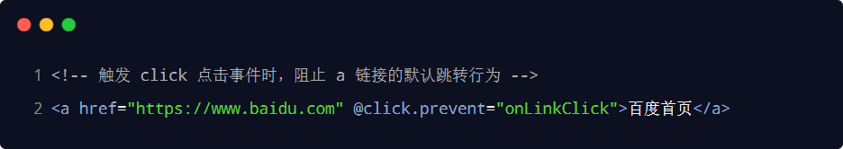

##### 4-6 按键修饰符
在监听键盘事件时，我们经常需要判断详细的按键。此时，可以为键盘相关的事件添加按键修饰符，例如

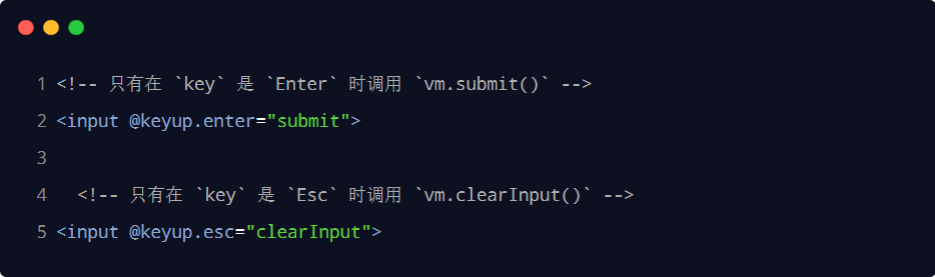

#### 3-5 双向绑定指令
vue 提供了 v-model 双向数据绑定指令，用来辅助开发者在不操作 DOM 的前提下，快速获取表单的数据。

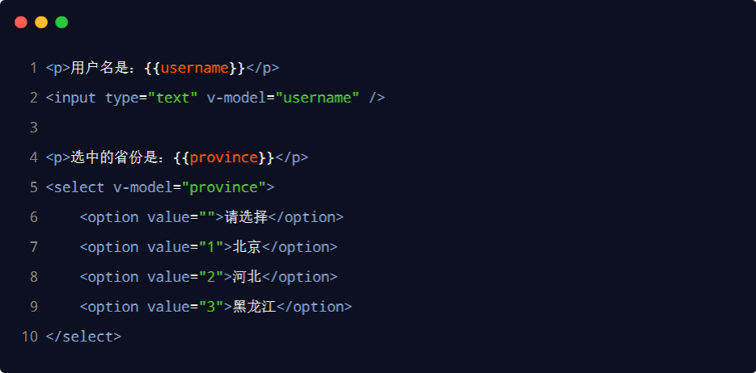

##### 5-1 v-model 指令的修饰符
为了方便对用户输入的内容进行处理，vue 为 v-model 指令提供了 3 个修饰符，分别是：

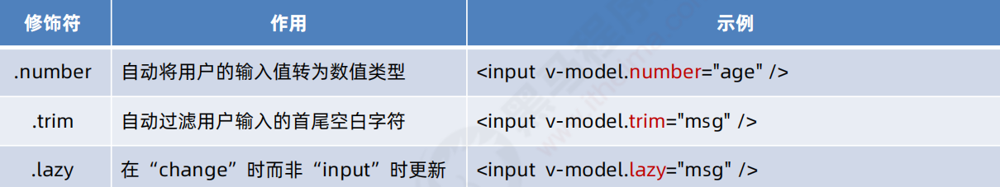

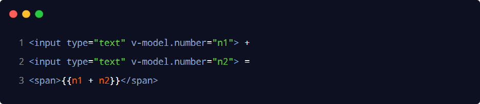

#### 3-6 条件渲染指令
条件渲染指令用来辅助开发者按需控制 DOM 的显示与隐藏。条件渲染指令有如下两个，分别是：

v-if

v-show

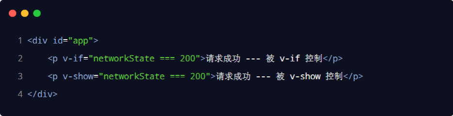

##### 6-1 v-if 和 v-show 的区别
```plain
// 实现原理不同：
    // v-if 指令会动态地创建或移除 DOM 元素，从而控制元素在页面上的显示与隐藏；
    // v-show 指令会动态为元素添加或移除 style="display: none;" 样式，从而控制元素的显示与隐藏；
    
// 性能消耗不同：
    // v-if 有更高的切换开销，而 v-show 有更高的初始渲染开销。因此：
    // 如果需要非常频繁地切换，则使用 v-show 较好
    // 如果在运行时条件很少改变，则使用 v-if 较好
```

##### 6-2 v-else
v-if 可以单独使用，或配合 v-else 指令一起使用：

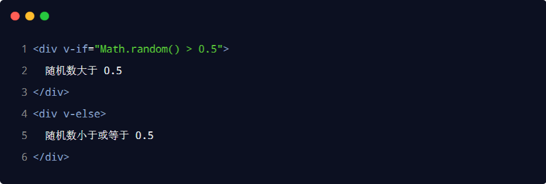

注意：v-else 指令必须配合 v-if 指令一起使用，否则它将不会被识别！

##### 6-3 v-else-if
v-else-if 指令，顾名思义，充当 v-if 的“else-if 块”，可以连续使用：

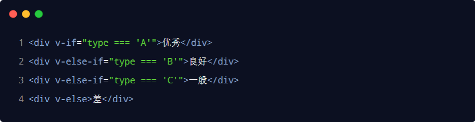

注意：v-else-if 指令必须配合 v-if 指令一起使用，否则它将不会被识别！

#### 3-7 列表渲染指令
vue 提供了 v-for 列表渲染指令，用来辅助开发者基于一个数组来循环渲染一个列表结构。v-for 指令需要使用 item in items 形式的特殊语法，其中：

```plain
     items 是待循环的数组
 
     item 是被循环的每一项
```

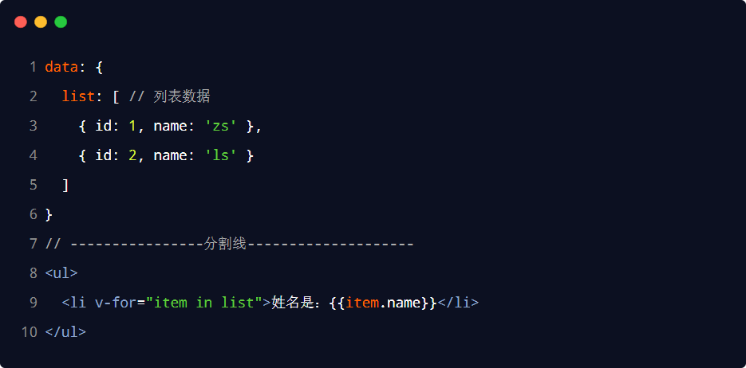

##### 7-1 v-for 中的索引
v-for 指令还支持一个可选的第二个参数，即当前项的索引。语法格式为 (item, index) in items，示例代码如下：

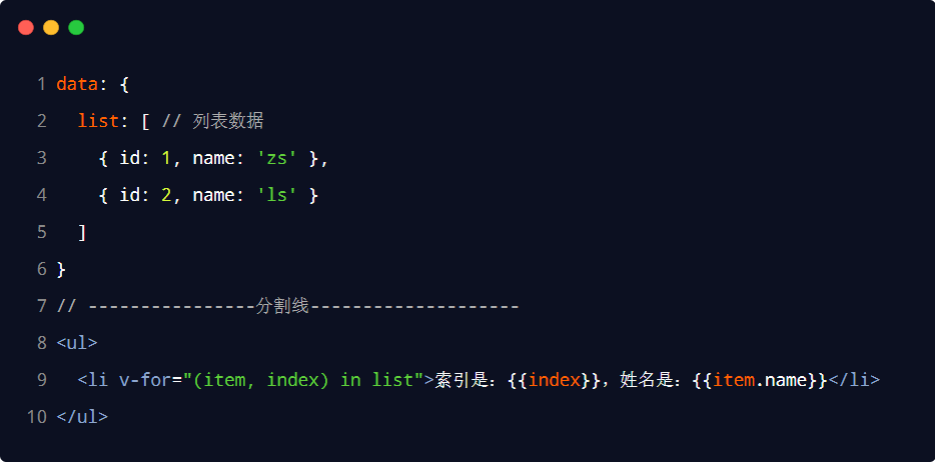

注意：v-for 指令中的 item 项和 index 索引都是形参，可以根据需要进行重命名。例如 (user, i) in userlist

##### 7-2 使用 key 维护列表的状态
```plain
// 当列表的数据变化时，默认情况下，vue 会尽可能的复用已存在的 DOM 元素，从而提升渲染的性能。但这种默认的性能优化策略，会导致有状态的列表无法被正确更新。

// 为了给 vue 一个提示，以便它能跟踪每个节点的身份，从而在保证有状态的列表被正确更新的前提下，提升渲染的性能。此时，需要为每项提供一个唯一的 key 属性：
```

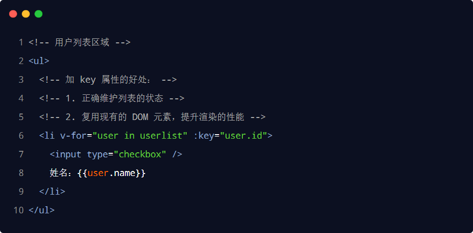

##### 7-3 key 的注意事项
```javascript
// key 的值只能是字符串或数字类型
// key 的值必须具有唯一性（即：key 的值不能重复）
// 建议把数据项 id 属性的值作为 key 的值（因为 id 属性的值具有唯一性）
// 使用 index 的值当作 key 的值没有任何意义（因为 index 的值不具有唯一性）
// 建议使用 v-for 指令时一定要指定 key 的值（既提升性能、又防止列表状态紊乱）
```

#### 3-8 过滤器
过滤器（Filters）是 vue 为开发者提供的功能，常用于文本的格式化。过滤器可以用在两个地方：插值表达式和 v-bind 属性绑定。

过滤器应该被添加在 JavaScript 表达式的尾部，由“管道符”进行调用，示例代码如下：

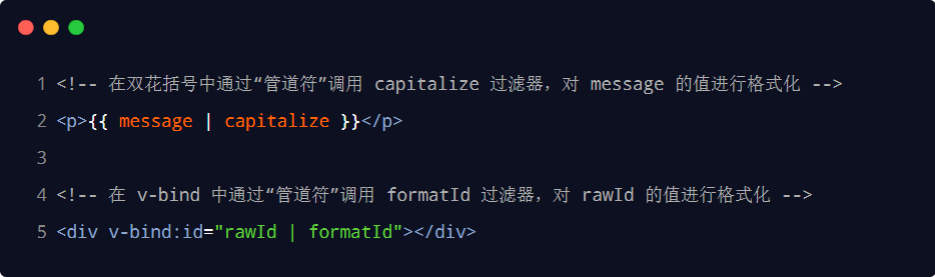

##### 8-1 定义过滤器
在创建 vue 实例期间，可以在 filters 节点中定义过滤器，示例代码如下

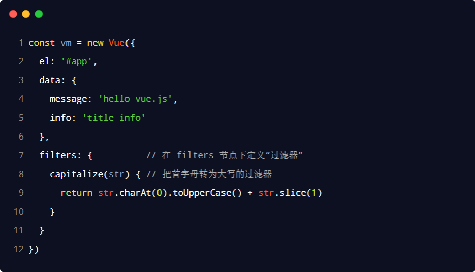

##### 8-2 私有过滤器和全局过滤器
在 filters 节点下定义的过滤器，称为“私有过滤器”，因为它只能在当前 vm 实例所控制的 el 区域内使用。

如果希望在多个 vue 实例之间共享过滤器，则可以按照如下的格式定义全局过滤器：

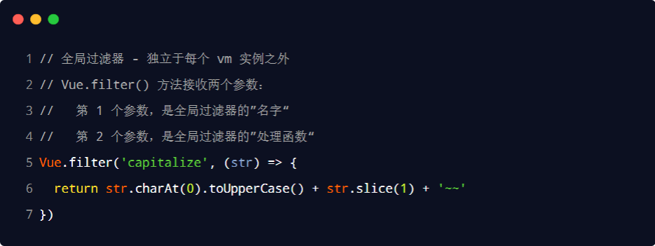

##### 8-3 连续调用多个过滤器
过滤器可以串联地进行调用，例如：

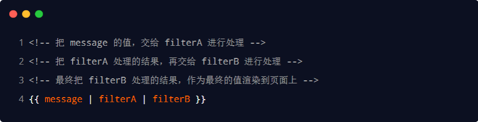

示例代码如下：

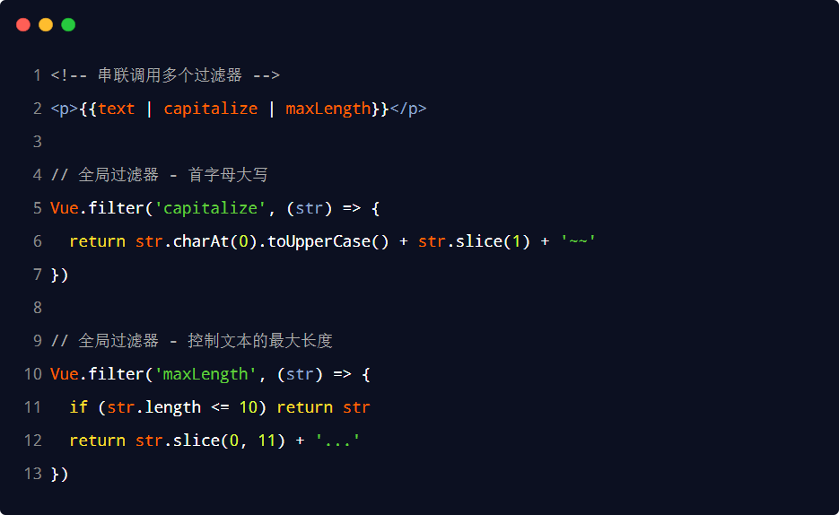

##### 8-4 过滤器传参
过滤器的本质是 JavaScript 函数，因此可以接收参数，格式如下

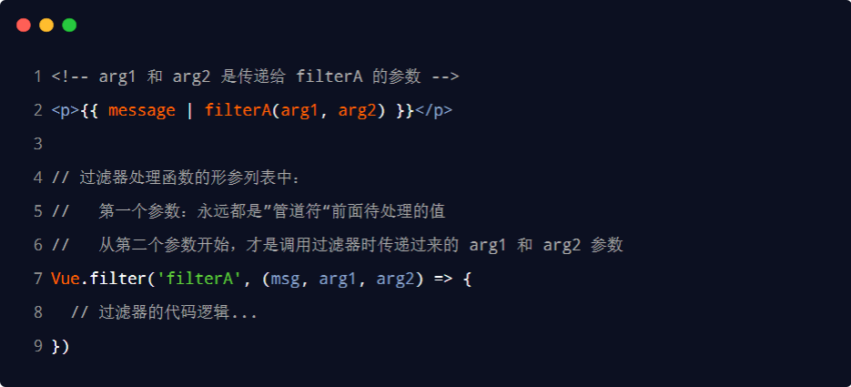

示例代码如下

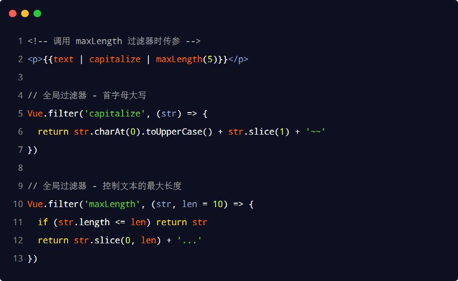

##### 8-5 过滤器的兼容性
```plain
// 过滤器仅在 vue 2.x 和 1.x 中受支持，在 vue 3.x 的版本中剔除了过滤器相关的功能。

// 在企业级项目开发中：
    // 如果使用的是 2.x 版本的 vue，则依然可以使用过滤器相关的功能
    // 如果项目已经升级到了 3.x 版本的 vue，官方建议使用计算属性或方法代替被剔除的过滤器功能
    // 具体的迁移指南，请参考 vue 3.x 的官方文档给出的说明：

    // https://v3.vuejs.org/guide/migration/filters.html#migration-strategy
```

### 11.1.4 侦听器
#### 4-1 什么是侦听器
watch 侦听器允许开发者监视数据的变化，从而针对数据的变化做特定的操作。语法格式如下

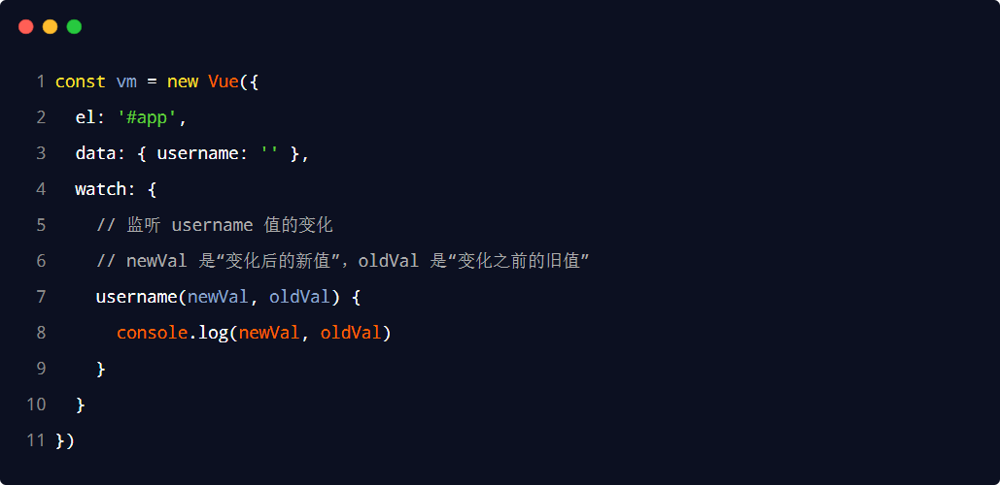

#### 4-2 使用 watch检测用户名是否可用
```plain
// 监听 username 值的变化，并使用 axios 发起 Ajax 请求，检测当前输入的用户名是否可用：
watch: {
// 监听 username 值的变化
async username(newVal) {
    if (newVal === '') return
    // 使用 axios 发起请求，判断用户名是否可用
    const { data: res } = await axios.get('https://www.escook.cn/api/finduser/' + newVal)
    console.log(res)
    }
}
```

#### 4-3 immediate 选项
默认情况下，组件在初次加载完毕后不会调用 watch 侦听器。如果想让 watch 侦听器立即被调用，则需要使用 immediate 选项。示例代码如下：

```javascript
watch: {
    username: {
        // handler 是固定写法，表示当 username 的值变化时，自动调用 handler 处理函数
        handler: async function (newVal) {
        if (newVal === '') return
        const { data: res } = await axios.get('https://www.escook.cn/api/finduser/' + newVal)
        console.log(res)
        },
        // 表示页面初次渲染好之后，就立即触发当前的 watch 侦听器
        immediate: true
    }
}
```

#### 4-4 deep选项
如果 watch 侦听的是一个对象，如果对象中的属性值发生了变化，则无法被监听到。此时需要使用 deep 选项，代码示例如下

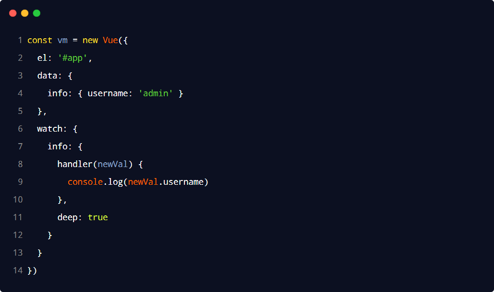

##### 4-5 监听对象单个属性的变化
如果只想监听对象中单个属性的变化，则可以按照如下的方式定义 watch 侦听器：

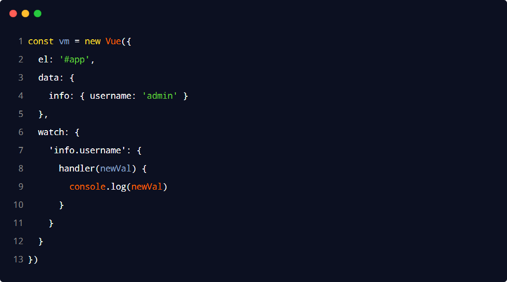

#### 4-6 计算属性 vs 侦听器


### 11.1.5 计算属性
#### 5-1 什么是计算属性
计算属性指的是通过一系列运算之后，最终得到一个属性值。

这个动态计算出来的属性值可以被模板结构或 methods 方法使用。示例代码如下：

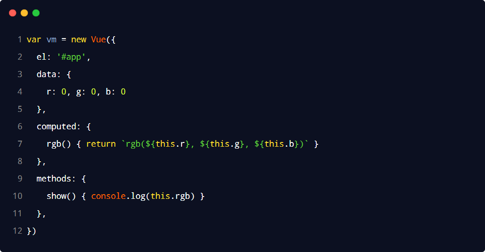

#### 5-2 计算属性的特点
虽然计算属性在声明的时候被定义为方法，但是计算属性的本质是一个属性

计算属性会缓存计算的结果，只有计算属性依赖的数据变化时，才会重新进行运算

#### 5-3 如何声明计算属性
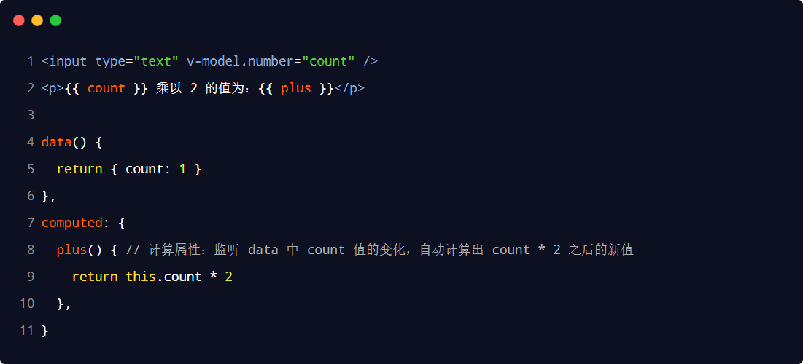

#### 5-4 计算属性的使用注意点


#### 5-5 计算属性 vs 方法
相对于方法来说，计算属性会缓存计算的结果，只有计算属性的依赖项发生变化时，才会重新进行运算。因此计算属性的性能更好

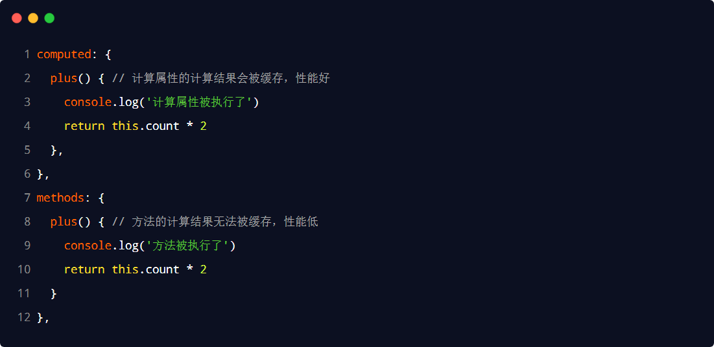


### 11.1.6 vue-cli
#### 6-1 单页面应用程序
单页面应用程序（英文名：Single Page Application）简称 SPA，顾名思义，指的是一个 Web 网站中只有唯一的一个 HTML 页面，所有的功能与交互都在这唯一的一个页面内完成。

##### 1-1 单页面应用程序的特点
单页面应用程序将所有的功能局限于一个 web 页面中，仅在该 web 页面初始化时加载相应的资源（ HTML、JavaScript 和 CSS）。

一旦页面加载完成了，SPA 不会因为用户的操作而进行页面的重新加载或跳转。而是利用 JavaScript 动态地变换HTML 的内容，从而实现页面与用户的交互。

##### 1-2 单页面应用程序的优点
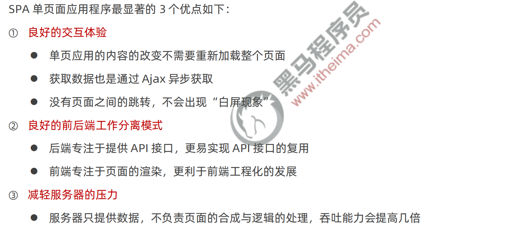

##### 1-3 单页面应用程序的缺点
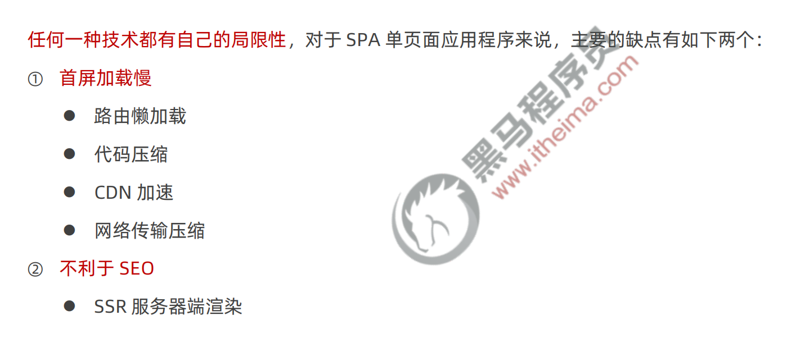

##### 1-4 如何快速创建 vue 的 SPA 项目


#### 6-2 什么是vue-cli
vue-cli 是 Vue.js 开发的标准工具。它简化了程序员基于 webpack 创建工程化的 Vue 项目的过程。

引用自 vue-cli 官网上的一句话：程序员可以专注在撰写应用上，而不必花好几天去纠结 webpack 配置的问题。

中文官网：[https://cli.vuejs.org/zh/](https://cli.vuejs.org/zh/)

#### 6-3 安装和使用
```plain
// vue-cli 是 npm 上的一个全局包，使用 npm install 命令，即可方便的把它安装到自己的电脑上：
// npm install -g @vue/cli
// 基于 vue-cli 快速生成工程化的 Vue 项目：
vue create 项目的名称
```

#### 6-4  vue 项目的运行流程
```python
## 在工程化的项目中，vue 要做的事情很单纯：通过 main.js 把 App.vue 渲染到 index.html 的指定区域中。
## 其中：
    ## ① App.vue 用来编写待渲染的模板结构
    ## ② index.html 中需要预留一个 el 区域
    ## ③ main.js 把 App.vue 渲染到了 index.html 所预留的区域中
```

### 11.1.7 Vue组件
#### 7-1 什么是组件化开发
组件化开发指的是：根据封装的思想，把页面上可重用的 UI 结构封装为组件，从而方便项目的开发和维护。

#### 7-2  vue中的组件化开发
```plain
// vue 是一个支持组件化开发的前端框架。
// vue 中规定：组件的后缀名是 .vue。之前接触到的 App.vue 文件本质上就是一个 vue 的组件
```

#### 7-3 vue组件的三个组成部分
```javascript
// 每个 .vue 组件都由 3 部分构成，分别是：
    // template -> 组件的模板结构
    // script -> 组件的 JavaScript 行为
    // style -> 组件的样式
// 其中，每个组件中必须包含 template 模板结构，而 script 行为和 style 样式是可选的组成部分。
```

##### 3-1 template
vue 规定：每个组件对应的模板结构，需要定义到  节点中


注意：

```plain
    template 是 vue 提供的容器标签，只起到包裹性质的作用，它不会被渲染为真正的 DOM 元素

    template 中只能包含唯一的根节点
```

##### 3-2 script
vue 规定：开发者可以在 


**.vue** **组件中的** **data** **必须是函数**

vue 规定：.vue 组件中的 data 必须是一个函数，不能直接指向一个数据对象。

因此在组件中定义 data 数据节点时，下面的方式是错误的：


会导致多个组件实例共用同一份数据的问题，请参考官方给出的示例：

##### 3-3 style
vue 规定：组件内的 


#### 7-4 组件之间的父子关系


#### 7-5 使用组件的三个步骤


#### 7-6 通过components注册的是私有子组件
例如：

在组件 A 的 components 节点下，注册了组件 F。

则组件 F 只能用在组件 A 中；不能被用在组件 C 中

#### 7-7 注册全局组件
在 vue 项目的 main.js 入口文件中，通过 Vue.component() 方法，可以注册全局组件。示例代码如下：


#### 7-8 组件的props
props 是组件的自定义属性，在封装通用组件的时候，合理地使用 props 可以极大的提高组件的复用性！它的语法格式如下：


#### 7-9 props是只读的
vue 规定：组件中封装的自定义属性是只读的，程序员不能直接修改 props 的值。否则会直接报错：


要想修改 props 的值，可以把 props 的值转存到 data 中，因为 data 中的数据都是可读可写的！


#### 7-10  props的default默认值
在声明自定义属性时，可以通过 default 来定义属性的默认值。示例代码如下：


#### 7-11 props的type值类型
在声明自定义属性时，可以通过 type 来定义属性的值类型。示例代码如下：


#### 7-12 props的 required 必填项
在声明自定义属性时，可以通过 required 选项，将属性设置为必填项，强制用户必须传递属性的值。示例代码如下：


#### 7-13 组件之间的样式冲突问题
```javascript
// 默认情况下，写在 .vue 组件中的样式会全局生效，因此很容易造成多个组件之间的样式冲突问题。
// 导致组件之间样式冲突的根本原因是：
    // 单页面应用程序中，所有组件的 DOM 结构，都是基于唯一的 index.html 页面进行呈现的
    // 每个组件中的样式，都会影响整个 index.html 页面中的 DOM 元素
```

#### 7-14 解决组件样式冲突的问题
为每个组件分配唯一的自定义属性，在编写组件样式时，通过属性选择器来控制样式的作用域，示例代码如下


#### 7-15 style节点的scoped属性
为了提高开发效率和开发体验，vue 为 style 节点提供了 scoped 属性，从而防止组件之间的样式冲突问题：


#### 7-16 /deep/样式穿透
如果给当前组件的 style 节点添加了 scoped 属性，则当前组件的样式对其子组件是不生效的。如果想让某些样式对子组件生效，可以使用 /deep/ 深度选择器。


### 11.1.8 声明周期和数据共享
#### 8-1 组件的声明周期
##### 1-1 声明周期&声明周期函数


##### 1-2 组件生命周期函数的分类


##### 1-3 生命周期图示


##### 1-4 组件中主要的生命周期函数


##### 1-5  组件中全部的生命周期函数


#### 8-2 组件时间的数据共享
##### 2-1 组件之间的关系


##### 2-2 父子组件之间的数据共享


###### 2-1  父组件向子组件共享数据
父组件向子组件共享数据需要使用自定义属性。示例代码如下：


###### 2-2 子组件向父组件共享数据
子组件向父组件共享数据使用自定义事件。示例代码如下：


### 11.1.9 $ref 引用
#### 9-1 什么是ref引用
ref 用来辅助开发者在不依赖于 jQuery 的情况下，获取 DOM 元素或组件的引用。

每个 vue 的组件实例上，都包含一个 $ refs 对象，里面存储着对应的 DOM 元素或组件的引用。默认情况下，组件的  $refs 指向一个空对象。


#### 9-2 使用ref引用DOM元素
如果想要使用 ref 引用页面上的 DOM 元素，则可以按照如下的方式进行操作：


#### 9-3 使用ref引用组件实例
如果想要使用 ref 引用页面上的组件实例，则可以按照如下的方式进行操作：


#### 9-4 控制文本框和按钮的按需切换
通过布尔值 inputVisible 来控制组件中的文本框与按钮的按需切换。示例代码如下：


#### 9-5  让文本框自动获得焦点
当文本框展示出来之后，如果希望它立即获得焦点，则可以为其添加 ref 引用，并调用原生 DOM 对象的.focus() 方法即可。示例代码如下：


#### 9-6 his.$nextTick(cb)方法
组件的 $nextTick(cb) 方法，会把 cb 回调推迟到下一个 DOM 更新周期之后执行。通俗的理解是：等组件的DOM 更新完成之后，再执行 cb 回调函数。从而能保证 cb 回调函数可以操作到最新的 DOM 元素。


### 11.1.10 动态组件
#### 10-1 什么是动态组件
动态组件指的是动态切换组件的显示与隐藏。

#### 10-2  如何实现动态组件渲染
vue 提供了一个内置的  组件，专门用来实现动态组件的渲染。示例代码如下：


#### 10-3 使用 keep-alive 保持状态
默认情况下，切换动态组件时无法保持组件的状态。此时可以使用 vue 内置的  组件保持动态组件的状态。示例代码如下：


#### 10-4 keep-alive 对应的生命周期函数
当组件被缓存时，会自动触发组件的 deactivated 生命周期函数。

当组件被激活时，会自动触发组件的 activated 生命周期函数


#### 10-5  keep-alive 的 include属性
include 属性用来指定：只有名称匹配的组件会被缓存。多个组件名之间使用英文的逗号分隔：


### 11.1.11 插槽
#### 11-1 什么是插槽
插槽（Slot）是 vue 为组件的封装者提供的能力。允许开发者在封装组件时，把不确定的、希望由用户指定的部分定义为插槽。


可以把插槽认为是组件封装期间，为用户预留的内容的占位符。

#### 11-2 体验插槽的基础用法
在封装组件时，可以通过  元素定义插槽，从而为用户预留内容占位符。示例代码如下：


#### 11-3 没有预留插槽的内容会被丢弃
如果在封装组件时没有预留任何  插槽，则用户提供的任何自定义内容都会被丢弃。示例代码如下：


#### 11-4 后备内容
封装组件时，可以为预留的  插槽提供后备内容（默认内容）。如果组件的使用者没有为插槽提供任何内容，则后备内容会生效。示例代码如下：


#### 11-5 具名插槽
如果在封装组件时需要预留多个插槽节点，则需要为每个  插槽指定具体的 name 名称。这种带有具体名称的插槽叫做“具名插槽”。示例代码如下：


#### 11-6 为具名插槽提供内容
在向具名插槽提供内容的时候，我们可以在一个  元素上使用 v-slot 指令，并以 v-slot 的参数的形式提供其名称。示例代码如下：


#### 11-7 具名插槽的简写形式
跟 v-on 和 v-bind 一样，v-slot 也有缩写，即把参数之前的所有内容 (v-slot:) 替换为字符 #。例如 v-slot:header 可以被重写为 #header：


#### 11-8  作用域插槽、
在封装组件的过程中，可以为预留的  插槽绑定 props 数据，这种带有 props 数据的  叫做“作用域插槽”。示例代码如下：


#### 11-9 使用作用域插槽
可以使用 v-slot: 的形式，接收作用域插槽对外提供的数据。示例代码如下：


#### 11-10 解构插槽 Prop
作用域插槽对外提供的数据对象，可以使用解构赋值简化数据的接收过程。示例代码如下：


### 11.1.12 自定义指令
#### 12-1 什么是自定义指令
vue 官方提供了 v-text、v-for、v-model、v-if 等常用的指令。除此之外 vue 还允许开发者自定义指令。

#### 12-2  自定义指令的分类


#### 12-3 私有自定义指令
在每个 vue 组件中，可以在 directives 节点下声明私有自定义指令。示例代码如下：


#### 12-4 使用自定义指令
在使用自定义指令时，需要加上 v- 前缀。示例代码如下：


#### 12-5 为自定义指令动态绑定参数值
在 template 结构中使用自定义指令时，可以通过等号（=）的方式，为当前指令动态绑定参数值：


#### 12-6 通过binding获取指令的参数值
在声明自定义指令时，可以通过形参中的第二个参数，来接收指令的参数值：


#### 12-7  update 函数
bind 函数只调用 1 次：当指令第一次绑定到元素时调用，当 DOM 更新时 bind 函数不会被触发。 update 函数会在每次 DOM 更新时被调用。示例代码如下：


#### 12-8  函数简写
如果 insert 和update 函数中的逻辑完全相同，则对象格式的自定义指令可以简写成函数格式：


#### 12-9 全局自定义指令
全局共享的自定义指令需要通过“Vue.directive()”进行声明，示例代码如下：


### 11.1.13 路由
#### 13-1 前端路由的概念与原理
##### 1-1 什么是路由
路由（英文：router）就是对应关系。

##### 1-2  SPA 与前端路由
SPA 指的是一个 web 网站只有唯一的一个 HTML 页面，所有组件的展示与切换都在这唯一的一个页面内完成。

此时，不同组件之间的切换需要通过前端路由来实现。

结论：在 SPA 项目中，不同功能之间的切换，要依赖于前端路由来完成！

##### 1-3 什么是前端路由
通俗易懂的概念：Hash 地址与组件之间的对应关系

##### 1-4 前端路由的工作方式


##### 1-5 实现简易的前端路由
步骤1：通过  标签，结合 comName 动态渲染组件。示例代码如下


步骤2：在 App.vue 组件中，为  链接添加对应的 hash 值：


步骤3：在 created 生命周期函数中，监听浏览器地址栏中 hash 地址的变化，动态切换要展示的组件的名称：


#### 13-2 Vue-router的基本使用
##### 2-1 什么是 vue-router


##### 2-2 vue-router 安装和配置的步骤


###### 2-1 在项目中安装Vue-router
在 vue2 的项目中，安装 vue-router 的命令如下：


###### 2-2 创建路由模块
在 src 源代码目录下，新建 router/index.js 路由模块，并初始化如下的代码：

```javascript
import Vue from 'Vue'
import VueRouter from 'vue-router'

Vue.use(VueRouter)

const router = new VueRouter()

export default router
```


###### 2-3 导入并挂载路由模块
在 src/main.js 入口文件中，导入并挂载路由模块。示例代码如下：


###### 2-4 声明路由链接和占位符
在 src/App.vue 组件中，使用 vue-router 提供的  和  声明路由链接和占位符：


2-5 声明路由的匹配规则

在 src/router/index.js 路由模块中，通过 routes 数组声明路由的匹配规则。示例代码如下：


#### 13-3 Vue-router的常见用法
##### 3-1 路由重定向(redirect)
路由重定向指的是：用户在访问地址 A 的时候，强制用户跳转到地址 C ，从而展示特定的组件页面。

通过路由规则的 redirect 属性，指定一个新的路由地址，可以很方便地设置路由的重定向：


##### 3-2 嵌套路由
通过路由实现组件的嵌套展示，叫做嵌套路由。


###### 2-1  声明子路由链接和子路由占位符
在 About.vue 组件中，声明 tab1 和 tab2 的子路由链接以及子路由占位符。示例代码如下：


###### 2-2 通过children属性声明子路由规则
在 src/router/index.js 路由模块中，导入需要的组件，并使用 children 属性声明子路由规则


##### 3-3 动态路由匹配
思考：有如下 3 个路由链接


定义如下 3 个路由规则，是否可行???


缺点：路由规则的复用性差。

###### 3-1  动态路由的概念
动态路由指的是：把 Hash 地址中可变的部分定义为参数项，从而提高路由规则的复用性。

在 vue-router 中使用英文的冒号（:）来定义路由的参数项。示例代码如下：


###### 3-2  $route.params  参数对象
在动态路由渲染出来的组件中，可以使用 this.$route.params 对象访问到动态匹配的参数值。


###### 3-3 使用 props 接收路由参数
为了简化路由参数的获取形式，vue-router 允许在路由规则中开启 props 传参。示例代码如下：


##### 3-4 声明式导航 & 编程式导航


###### 4-1 vue-router 中的编程式导航 API


###### 4-2 $router.push
调用 this.$router.push() 方法，可以跳转到指定的 hash 地址，从而展示对应的组件页面。示例代码如下：


###### 4-3 $router.replace


###### 4-4 $router.go
调用 this.$router.go() 方法，可以在浏览历史中前进和后退。示例代码如下：


###### 4-5 $router.go的简化用法


###### 4-6 导航守卫
导航守卫可以控制路由的访问权限。示意图如下：


###### 4-7 全局前置守卫
每次发生路由的导航跳转时，都会触发全局前置守卫。因此，在全局前置守卫中，程序员可以对每个路由进行访问权限的控制：


###### 4-8 守卫方法的 3 个形参
全局前置守卫的回调函数中接收 3 个形参，格式为：


###### 4-9 next 函数的 3 种调用方式
参考示意图，分析 next 函数的 3 种调用方式最终导致的结果：


###### 4-10 控制后台主页的访问权限
结合 token控制后台主页的访问权限


## 11.2 Vue3
### 11.2.1 vite的基本使用
#### 1-1 创建vite项目
按照顺序执行如下的命令，即可基于 vite 创建 vue 3.x 的工程化项目：


#### 1-2 梳理项目的结构


#### 1-3 vite 项目的运行流程


##### 3-1 在 App.vue 中编写模板结构
清空 App.vue 的默认内容，并书写如下的模板结构：


##### 3-2 在 index.html 中预留 el 区域
打开 index.html 页面，确认预留了 el 区域：


##### 3-3 在 main.js 中进行渲染
按照 vue 3.x 的标准用法，把 App.vue 中的模板内容渲染到 index.html 页面的 el 区域中


### 11.2.2 Vue组件的组成结构
#### 2-1 组件的 template 节点


#### 2-2 组件的 template 节点
vue 规定：每个组件对应的模板结构，需要定义到  节点中。


注意： 是 vue 提供的容器标签，只起到包裹性质的作用，它不会被渲染为真正的 DOM 元素。

#### 2-3 在 template 中使用指令
在组件的  节点中，支持使用前面所学的指令语法，来辅助开发者渲染当前组件的 DOM 结构。

代码示例如下：


#### 2-4 在 template 中定义根节点
在 vue 2.x 的版本中， 节点内的 DOM 结构仅支持**单个**根节点：


但是，在 vue 3.x 的版本中， 中支持定义多个根节点：


#### 2-5 组件的 script 节点
vue 规定：组件内的 


#### 2-6  script 中的name节点
可以通过 name 节点为当前组件定义一个名称：


在使用 vue-devtools 进行项目调试的时候，自定义的组件名称可以清晰的区分每个组件：


#### 2-7 script 中的data节点
vue 组件渲染期间需要用到的数据，可以定义在 data 节点中：


组件中的 data 必须是函数

vue 规定：组件中的 data 必须是一个函数，不能直接指向一个数据对象。因此在组件中定义 data 数据节点时，下面的方式是错误的：


#### 2-8 script 中的methods节点
组件中的事件处理函数，必须定义到 methods 节点中，示例代码如下：


#### 2-9 组件的 style 节点
vue 规定：组件内的 


其中 

#### 2-10 让 style 中支持 less 语法
如果希望使用 less 语法编写组件的 style 样式，可以按照如下两个步骤进行配置：

① 运行 npm install less -D 命令安装依赖包，从而提供 less 语法的编译支持

② 在 


### 11.2.3 组件的基本使用
#### 3-1 组件的注册
组件之间可以进行相互的引用，例如：


vue 中组件的引用原则：先注册后使用。

#### 3-2 注册组件的两种方式
vue 中注册组件的方式分为“全局注册”和“局部注册”两种，其中：

⚫ 被全局注册的组件，可以在全局任何一个组件内使用

⚫ 被局部注册的组件，只能在当前注册的范围内使用


##### 2-1 全局注册组件


##### 2-2 使用全局注册组件
使用 app.component() 方法注册的全局组件，直接以标签的形式进行使用即可，例如


##### 2-3 局部注册组件


##### 2-4 全局注册和局部注册的区别


##### 2-5 组件注册时名称的大小写


##### 2-6 通过 name 属性注册组件
在注册组件期间，除了可以直接提供组件的注册名称之外，还可以把组件的 name 属性作为注册后组件的名称，示例代码如下：


#### 3-3 组件的 props


##### 3-1 什么是组件的 props
props 是组件的自定义属性，组件的使用者可以通过 props 把数据传递到子组件内部，供子组件内部进行使用。代码示例如下：


props 的作用：父组件通过 props 向子组件传递要展示的数据。

props 的好处：提高了组件的复用性。

##### 3-2 在组件中声明 props
在封装 vue 组件时，可以把动态的数据项声明为 props 自定义属性。自定义属性可以在当前组件的模板结构中被直接使用。示例代码如下：


##### 3-3 无法使用未声明的 props
如果父组件给子组件传递了未声明的 props 属性，则这些属性会被忽略，无法被子组件使用，示例代码如下：


##### 3-4 动态绑定 props 的值
可以使用 v-bind 属性绑定的形式，为组件动态绑定 props 的值，示例代码如下


##### 3-5 props 的大小写命名
组件中如果使用“camelCase (驼峰命名法)”声明了 props 属性的名称，则有两种方式为其绑定属性的值：


##### 3-6  Class 与 Style 绑定
在实际开发中经常会遇到动态操作元素样式的需求。因此，vue 允许开发者通过 v-bind 属性绑定指令，为元素动态绑定 class 属性的值和行内的 style 样式。

###### 6-1 动态绑定 HTML 的 class
可以通过三元表达式，动态的为元素绑定 class 的类名。示例代码如下：


###### 6-2 以数组语法绑定 HTML 的 class
如果元素需要动态绑定多个 class 的类名，此时可以使用数组的语法格式：


###### 6-3 以对象语法绑定 HTML 的 class
使用数组语法动态绑定 class 会导致模板结构臃肿的问题。此时可以使用对象语法进行简化：


###### 6-4 以对象语法绑定内联的 style
:style 的对象语法十分直观——看着非常像 CSS，但其实是一个 JavaScript 对象。CSS property 名可以用驼峰式 (camelCase) 或短横线分隔 (kebab-case，记得用引号括起来) 来命名：


##### 3-7 props验证
###### 7-1 什么是 props 验证
指的是：在封装组件时对外界传递过来的 props 数据进行合法性的校验，从而防止数据不合法的问题。


使用数组类型的 props 节点的缺点：无法为每个 prop 指定具体的数据类型。

###### 7-2 对象类型的 props 节点
使用对象类型的 props 节点，可以对每个 prop 进行数据类型的校验，示意图如下：


###### 7-3 props 验证


###### 7-4 基础的类型检查
可以直接为组件的 prop 属性指定基础的校验类型，从而防止组件的使用者为其绑定错误类型的数据：


###### 7-5 多个可能的类型
如果某个 prop 属性值的类型不唯一，此时可以通过数组的形式，为其指定多个可能的类型，示例代码如下：


###### 7-6 必填项校验
如果组件的某个 prop 属性是必填项，必须让组件的使用者为其传递属性的值。此时，可以通过如下的方式将其设置为必填项：


###### 7-7 属性默认值
在封装组件时，可以为某个 prop 属性指定默认值。示例代码如下：


###### 7-8 自定义验证函数
在封装组件时，可以为 prop 属性指定自定义的验证函数，从而对 prop 属性的值进行更加精确的控制


### 11.2.4 自定义事件
#### 4-1  什么是自定义事件
在封装组件时，为了让组件的使用者可以监听到组件内状态的变化，此时需要用到组件的自定义事件。


#### 4-2 自定义事件的 3 个使用步骤


#### 4-3  声明自定义事件
开发者为自定义组件封装的自定义事件，必须事先在 emits 节点中声明，示例代码如下：


#### 4-4 触发自定义事件
在 emits 节点下声明的自定义事件，可以通过 this.$emit('自定义事件的名称') 方法进行触发，示例代码如下：


#### 4-5 监听自定义事件
在使用自定义的组件时，可以通过 v-on 的形式监听自定义事件。示例代码如下：


#### 4-6 自定义事件传参
在调用 this.$emit() 方法触发自定义事件时，可以通过第 2 个参数为自定义事件传参，示例代码如下：


### 11.2.5 组件上的v-model
#### 5-1 为什么需要在组件上使用 v-model
v-model 是双向数据绑定指令，当需要维护组件内外数据的同步时，可以在组件上使用 v-model 指令。示意图如下：


#### 5-2 在组件上使用 v-model 的步骤


### 11.2.6 组件之间的数据通信
#### 6-1 父组件向子组件共享数据
父组件通过 v-bind 属性绑定向子组件共享数据。同时，子组件需要使用 props 接收数据。示例代码如下：


#### 6-2 子组件向父组件共享数据
子组件通过自定义事件的方式向父组件共享数据。示例代码如下：


#### 6-3 父子组件之间数据的双向同步
父组件在使用子组件期间，可以使用 v-model 指令维护组件内外数据的双向同步：


#### 6-4 兄弟组件之间的数据共享
兄弟组件之间实现数据共享的方案是 EventBus。可以借助于第三方的包 mitt 来创建 eventBus 对象，从而实现兄弟组件之间的数据共享。示意图如下：


##### 4-1 安装 mitt 依赖包
在项目中运行如下的命令，安装 mitt 依赖包：


##### 4-2 创建公共的 EventBus 模块
在项目中创建公共的 eventBus 模块如下：


##### 4-3 在数据接收方自定义事件
在数据接收方，调用 bus.on('事件名称', 事件处理函数) 方法注册一个自定义事件。示例代码如下：


##### 4-4 在数据接发送方触发事件
在数据发送方，调用 bus.emit('事件名称', 要发送的数据) 方法触发自定义事件。示例代码如下：


#### 6-5 后代关系组件之间的数据共享
后代关系组件之间共享数据，指的是父节点的组件向其子孙组件共享数据。此时组件之间的嵌套关系比较复杂，可以使用 provide 和 inject 实现后代关系组件之间的数据共享。


##### 5-1 父节点通过provide共享数据
父节点的组件可以通过 provide 方法，对其子孙组件共享数据：


##### 5-2 子孙节点通过inject接收数据
子孙节点可以使用 inject 数组，接收父级节点向下共享的数据。示例代码如下：


##### 5-3 父节点对外共享响应式的数据
父节点使用 provide 向下共享数据时，可以结合 computed 函数向下共享响应式的数据。示例代码如下：


##### 5-4 子孙节点使用响应式的数据
如果父级节点共享的是响应式的数据，则子孙节点必须以 .value 的形式进行使用。示例代码如下：


### 11.2.7 Vue3中配置axios
#### 7-1 为什么要全局配置 axios


#### 7-2 如何全局配置 axios
在 main.js 入口文件中，通过 app.config.globalProperties 全局挂载 axios，示例代码如下：


### 11.2.8 路由的导入使用
#### 8-1 vue-router 4.x 的基本使用步骤


##### 1-1 在项目中安装 vue-router
在 vue3 的项目中，只能安装并使用 vue-router 4.x。安装的命令如下：


##### 1-2 定义路由组件
在项目中定义 MyHome.vue、MyMovie.vue、MyAbout.vue 三个组件，将来要使用 vue-router 来控制它们的展示与切换：


##### 1-3 声明路由链接和占位符
可以使用  标签来声明路由链接，并使用  标签来声明路由占位符。示例代码如下：


##### 1-4 创建路由模块


###### 4-1 从 vue-router 中按需导入两个方法


###### 4-2 导入需要使用路由控制的组件


###### 4-3 创建路由实例对象


###### 4-4 向外共享路由实例对象


###### 4-5 在 main.js 中导入并挂载路由模块


#### 8-2 路由高级用法
##### 2-1 路由重定向
路由重定向指的是：用户在访问地址 A 的时候，强制用户跳转到地址 C ，从而展示特定的组件页面。通过路由规则的 redirect 属性，指定一个新的路由地址，可以很方便地设置路由的重定向：


##### 2-2 路由高亮


###### 2-1 默认的高亮 class 类
被激活的路由链接，默认会应用一个叫做 router-link-active 的类名。开发者可以使用此类名选择器，为激活的路由链接设置高亮的样式：


###### 2-2 自定义路由高亮的 class 类
在创建路由的实例对象时，开发者可以基于 linkActiveClass 属性，自定义路由链接被激活时所应用的类名：


##### 2-3 命名路由
通过 name 属性为路由规则定义名称的方式，叫做命名路由。示例代码如下：


注意：命名路由的 name 值不能重复，必须保证唯一性！

###### 3-1 使用命名路由实现声明式导航
为  标签动态绑定 to 属性的值，并通过 name 属性指定要跳转到的路由规则。期间还可以用params 属性指定跳转期间要携带的路由参数。示例代码 如下：


###### 3-2 使用命名路由实现编程式导航
调用 push 函数期间指定一个配置对象，name 是要跳转到的路由规则、params 是携带的路由参数：


### 11.2.9  Vue-cli
#### 9-1 什么是 vue-cli


#### 9-2 安装 vue-cli
vue-cli 是基于 Node.js 开发出来的工具，因此需要使用 npm 将它安装为全局可用的工具：


#### 9-3 解决 Windows PowerShell 不识别 vue 命令的问题
默认情况下，在PowerShell 中执行 vue --version 命令会提示如下的错误消息：


解决方案如下：

① 以管理员身份运行 PowerShell

② 执行 set-ExecutionPolicy RemoteSigned 命令

③ 输入字符 Y ，回车即可


#### 9-4 创建项目
vue-cli 提供了创建项目的两种方式：


##### 4-1 基于 vue ui 创建 vue 项目
步骤1：在终端下运行 vue ui 命令，自动在浏览器中打开创建项目的可视化面板：


步骤2：在详情页面填写项目名称：


步骤3：在预设页面选择手动配置项目：


步骤4：在功能页面勾选需要安装的功能（Choose Vue Version、Babel、CSS 预处理器、使用配置文件）：


步骤5：在配置页面勾选 vue 的版本和需要的预处理器：


步骤6：将刚才所有的配置保存为预设（模板），方便下一次创建项目时直接复用之前的配置：


步骤7：创建项目并自动安装依赖包：


vue ui 的本质：通过可视化的面板采集到用户的配置信息后，在后台基于命令行的方式自动初始化项目：

项目创建完成后，自动进入项目仪表盘


##### 4-2 基于命令行创建 vue 项目
步骤1：在终端下运行 vue create demo2 命令，基于交互式的命令行创建 vue 的项目：


步骤2：选择要安装的功能：


步骤3：使用上下箭头选择 vue 的版本，并使用回车键确认选择


步骤4：使用上下箭头选择要使用的 css 预处理器，并使用回车键确认选择：


步骤5：使用上下箭头选择如何存储插件的配置信息，并使用回车键确认选择：


步骤6：是否将刚才的配置保存为预设：


步骤7：选择如何安装项目中的依赖包：


步骤8：开始创建项目并自动安装依赖包：


步骤9：项目创建完成：


#### 9-5  分析 main.js 中的主要代码


#### 9-6 在 vue2 的项目中使用路由
在 vue2 的项目中，只能安装并使用 3.x 版本的 vue-router。

版本 3 和版本 4 的路由最主要的区别：创建路由模块的方式不同！

##### 6-1  回顾：4.x 版本的路由如何创建路由模块


##### 6-2 学习：3.x 版本的路由如何创建路由模块
步骤1：在 vue2 的项目中安装 3.x 版本的路由：


步骤2：在 src -> components 目录下，创建需要使用路由切换的组件：


步骤3：在 src 目录下创建 router -> index.js 路由模块：


步骤4：在 main.js 中导入路由模块，并通过 router 属性进行挂载：


步骤5：在 App.vue 根组件中，使用  声明路由的占位符：


### 11.2.10 组件库
#### 10-1 Element UI
Element UI 是饿了么前端团队开源的一套 PC 端 vue 组件库。支持在 vue2 和 vue3 的项目中使用：

⚫ vue2 的项目使用旧版的 Element UI（[https://element.eleme.cn/#/zh-CN）](https://element.eleme.cn/#/zh-CN）)

⚫ vue3 的项目使用新版的 Element Plus（[https://element-plus.gitee.io/#/zh-CN）](https://element-plus.gitee.io/#/zh-CN）)

##### 1-1 在 vue2 的项目中安装element-ui


##### 1-2 引入 element-ui


##### 1-3 完整引入
在 main.js 中写入以下内容：


##### 1-4 按需引入
借助 babel-plugin-component，我们可以只引入需要的组件，以达到减小项目体积的目的。

步骤1，安装 babel-plugin-component：


步骤2，修改根目录下的 babel.config.js 配置文件，新增 plugins 节点如下：


步骤3，如果你只希望引入部分组件，比如 Button，那么需要在 main.js 中写入以下内容：


##### 1-5 把组件的导入和注册封装为独立的模块
在 src 目录下新建 element-ui/index.js 模块，并声明如下的代码：


### 11.2.11 axios拦截器
#### 11-1 回顾：在 vue3 的项目中全局配置 axios


#### 11-2 在 vue2 的项目中全局配置 axios
需要在 main.js 入口文件中，通过 Vue 构造函数的 prototype 原型对象全局配置 axios：


#### 11-3 配置请求拦截器
通过 axios.interceptors.request.use(成功的回调, 失败的回调) 可以配置请求拦截器。示例代码如下：

注意：失败的回调函数可以被省略！

##### 3-1 请求拦截器 – Token 认证


##### 3-1 请求拦截器 – 展示Loading 效果
借助于 element ui 提供的 Loading 效果组件（[https://element.eleme.cn/#/zh-CN/component/loading）可以方便的实现](https://element.eleme.cn/#/zh-CN/component/loading）可以方便的实现) Loading 效果的展示：


#### 11-4 配置响应拦截器
通过 axios.interceptors.response.use(成功的回调, 失败的回调) 可以配置响应拦截器。示例代码如下：


注意：失败的回调函数可以被省略

##### 4.1 响应拦截器 – 关闭 Loading 效果
调用 Loading 实例提供的 close() 方法即可关闭 Loading 效果，示例代码如下：


### 11.2.12 proxy 跨域代理
#### 12-1 回顾：接口的跨域问题


#### 12-2 通过代理解决接口的跨域问题
通过 vue-cli 创建的项目在遇到接口跨域问题时，可以通过代理的方式来解决：


#### 12-3 在项目中配置 proxy 代理
步骤1，在 main.js 入口文件中，把 axios 的请求根路径改造为当前 web 项目的根路径：


步骤2，在项目根目录下创建 vue.config.js 的配置文件，并声明如下的配置：


注意：

① devServer.proxy 提供的代理功能，仅在开发调试阶段生效

② 项目上线发布时，依旧需要 API 接口服务器开启 CORS 跨域资源共享

## 11.3 Vuex
### 11-3-1 vuex介绍


| 组件关系 | 数据通信 |
| --- | --- |
| 父子关系 | 父传子：props ； 子传父：$emit |
| 非父子关系 | vuex (一种组件通信方案) |


#### 1-1 vuex是什么
Vuex 是一个专为 Vue.js 应用程序开发的**状态管理模式**。它采用**集中式**存储管理数据，以相应的规则保证状态以一种可预测的方式发生变化


#### 1-2 vuex为何学
程序页面多, 数据变量多

1. 不同组件数据**保持同步**
2. 数据的修改都是**可追踪**

一个户外商店有两名员工，张三和李四

一天的早上，他们分别对**帐篷的数量**做了一次盘点，发现一共有三个帐篷

张三卖出去俩个，他以为库存里还有**一个**

李四卖出去一个，他以为库存里还有**两个**

而事实上是，库存现在已经为**零**

如果他们再接受客户的预订，就会出现库存**不足**的情况

> 张三和李四因为没有保持库存的数量的同步导致了尴尬，这个就是所谓的`数据保持同步 `
>
> 店长需要知道, 谁卖出了多少个帐篷，这个行为我们称之为`数据修改是可追踪的`
>

图示:


### 11-3-2 vuex学习内容
#### 2-1 核心概念
1. 官网地址: [https://vuex.vuejs.org/zh/](https://vuex.vuejs.org/zh/)
2. 安装(固定)
3. 配置项(固定)

| 配置项 | 含义 | 注意 |
| --- | --- | --- |
| **state** | 单一状态树 | 类似data |
| **mutations** | 数据管家(同步) | 唯一修改state地方 |
| actions | 异步请求 | 要改state需要提交给mutations |
| getters | vuex计算属性 | 类似computed |
| modules | 模块拆分 |  |


#### 2-2 图示关系
单一定义store对象, 里面5个配置项, 在任意组件可以使用


### 11-3-3 vuex例子准备
#### 3-1 目标
+ 创建项目, 为学习准备
    - 需求1: App.vue(作为根组件)
    - 需求2: 子组件Add和子组件Sub, 嵌入在App.vue里
    - 需求3: 三个组件共享库存数据(**保持同步**)


#### 3-2 工程准备
1. 初始化新的工程 vuex-demo

```javascript
vue create vuex-demo
```

2. 清空欢迎界面
3. 并设置如下三个组件, 目录如下：

```javascript
|-components
|---AddItem.vue
|---SubItem.vue
|-App.vue
```

#### 3-3 App.vue
> 复制标签和样式, 引入AddItem和SubItem2个子组件显示
>

```vue
<template>
  <div id="app">
    <h1>根组件</h1>

    <span>库存总数:</span>

    <input type="text">
    <div style="border:1px solid black; width: 300px;">
      <AddItem></AddItem>

    </div>

    <hr>
    <div style="border:1px solid black; width: 300px;">
      <SubItem></SubItem>

    </div>

  </div>

</template>

<script>
import AddItem from '@/components/AddItem'
import SubItem from '@/components/SubItem'
export default {
  components: {
    AddItem,
    SubItem
  }
}
</script>

<style>
#app {
  width: 300px;
  margin: 20px auto;
  border:1px solid #ccc;
  padding:4px;
}
</style>

```

#### 3-4 AddItem.vue
```vue
<template>
  <div>
      <h3>AddItem组件</h3>

      <p>已知库存数: 0</p>

      <button>库存+1</button>

  </div>

</template>

<script>
export default {

}
</script>

```

#### 3-5 SubItem.vue
```vue
<template>
  <div>
      <h3>SubItem组件</h3>

      <p>已知库存数: 0</p>

      <button>库存-1</button>

  </div>

</template>

<script>
export default {

}
</script>

```

### 11-3- 4 vuex-store准备
#### 4-1 目标
+ 创建store仓库
+ 注入到Vue项目中

#### 4-2 store概念
每个 Vuex 应用的核心 store（仓库）, 包含5个核心概念


#### 4-3 vuex目录
和路由模块router/index.js - 类似, 维护项目目录的整洁，新建src/store/index.js文件

>  当然， 这个步骤并不是必需的
>


#### 4-4 使用步骤
1. 工程中 - 下载vuex

```bash
yarn add vuex
```

2. store/index.js - 创建定义导出store对象

```javascript
// 目标: 创建store仓库对象
// 1. 下载vuex: 终端命令(yarn add vuex)
// 2. 引入vuex
import Vue from 'vue'
import Vuex from 'vuex'
// 3. 注册
Vue.use(Vuex)
// 4. 实例化store对象
const store = new Vuex.Store({})
// 5. 导出store对象
export default store
```

3. main.js - 导入注入到Vue中

```javascript
import Vue from 'vue'
import App from './App.vue'
import store from '@/store' // 导入store对象

Vue.config.productionTip = false

new Vue({
  // 6. 注入到Vue实例中(确保组件this.$store使用) // this.$store = store
  store,
  render: h => h(App),
}).$mount('#app')

```

请再次回忆一下vue-router的用法，是不是很像？

### 11-3-5 vuex-state数据源
#### 5-1 目标
+ 定义state
+ 直接使用state
+ 辅助函数mapState

> state是唯一的公共数据源，统一存储
>

#### 5-2 定义state
在store/index.js定义state

语法:

```javascript
const store = new Vuex.Store({
    state: {
        变量名: 初始值
    }
})	
```

具体代码:

```javascript
const store = new Vuex.Store({
    state: {
        count: 100 // 库存
    }
})
```

#### 5-3 使用state2种方式
+ 方式1: 组件内 - **直接**使用语法:

```javascript
this.$store.state.变量名
```

+ 方式2: 组件内 - **映射**使用 (推荐)语法:

```javascript
// 1. 拿到mapState辅助函数
import { mapState } from 'vuex'
export default {
    computed: {
        // 2. 把state里变量映射到计算属性中
        ...mapState(['state里的变量名'])
    }
}
```

#### 5-4 AddItem直接用
```vue
<template>
  <div>
      <h3>AddItem组件</h3>

      <p>已知库存数: {{ $store.state.count }}</p>

      <button>库存+1</button>

  </div>

</template>

```

#### 5-5 App.vue直接用
计算属性count, 和输入框的v-model双向绑定

```vue
<input type="text" v-model="count">

<script>
export default {
  computed: {
    count: {
      set(){},
      get(){
        return this.$store.state.count
      }
    }
  }
}
</script>

```

#### 5-6 SubItem映射用
```vue
<template>
  <div>
      <h3>SubItem组件</h3>

      <p>已知库存数: {{ count }}</p>

      <button>库存-1</button>

  </div>

</template>

<script>
// 需求1: 映射state到计算属性
// 1. 拿到辅助函数 mapState
// 2. 在computed内, ...mapState(['state变量名'])
// 3. 当计算属性使用
import { mapState } from 'vuex'
// let r = mapState(['count']) // 提取store里的state叫count的变量
// console.log(r); // 返回值: {count: 函数体(return state里count的值)}

export default {
  computed: {
    // 映射count, 得到对象展开, 合并到计算属性中
    ...mapState(['count'])
  },
}
</script>

```

整个过程的示意图如下


#### 5-7 注意
state是响应式的, 只要state值变化, 页面上使用的地方会自动更新同步

### 11-3-6 vuex-mutations定义-同步修改
#### 6-1 定义mutations
> mutations类似数据管家, 操作state里的数据
>

在store/index.js定义mutations

语法:

```javascript
/*
const store  = new Vuex.Store({
    mutations: {
        函数名 (state, 可选值) {
            // 同步修改state值代码
        }
    }
})
*/
```

具体代码

```javascript
const store  = new Vuex.Store({
    state: {
        count: 100 // 库存
    },
    mutations: {
        addCount (state, value) { // 负责增加库存的管家
            state.count += value
        },
        subCount (state, value) { // 负责减少库存的管家
            state.count -= value
        },
        setCount (state, value) { // 负责直接修改库存的管家
            state.count = value;
        }
    }
})
```

#### 6-2 注意
> 1. mutations是**唯一**能修改state的地方, 确保**调试工具**可以追踪变化
> 2. mutations函数内, 只能写同步代码, 调试工具可追踪变化过程
>     - 因为调试工具要**立刻**产生一次记录, 所以必须是同步的
>

### 11-3-7 vuex-mutations使用
#### 7-1  使用mutations的2种方式
+ 方式1: 组件内 - **直接**使用语法:

```javascript
this.$store.commit("mutations里的函数名", 具体值)
```

+ 方式2: 组件内 - **映射**使用语法:

```javascript
// 1. 拿到mapMutations辅助函数
import { mapMutations } from 'vuex'
export default {
    methods: {
        // 2. 把mutations里方法映射到原地
        ...mapMutations(['mutations里的函数名'])
    }
}
```

#### 7-2 AddItem直接用
+ 点击事件绑定
+ 提交mutations传入值

```vue
<button @click="addFn">库存+1</button>

<script>
export default {
  methods: {
    addFn(){
      this.$store.commit('addCount', 1)
    }
  }
}
</script>

```

#### 7-3 App.vue直接用
+ 触发计算属性的set方法
+ 提交mutations传入值

```vue
<span>库存总数: </span>

<input type="text" v-model="count">

<script>
export default {
  computed: {
    count: {
      set(val){
        this.$store.commit('setCount', val) // 把表单值提交给store下的mutations
      },
      get(){
        return this.$store.state.count
      }
    }
  }
}
</script>

```

#### 7-4 SubItem映射用
+ 点击事件
+ 映射mutations的方法
+ 调用mutations方法传值

```vue
<button @click="subFn">库存-1</button>

<script>
// 需求2: 映射mutations到方法里
// 1. 拿到辅助函数 mapMutations
// 2. 在methods内, ...mapMutations(['mutations函数名'])
// 3. 当普通方法使用

import { mapMutations } from 'vuex'
export default {
  methods: {
    ...mapMutations(['subCount']),
    subFn(){
      this.subCount(1)
    }
  }
}
</script>

```

#### 7-5 注意
> mutations函数上, 只能接收**一个参数值**, 如果传对个, 请传一个对象
>

#### 7-6 小结
1. mutations有哪2种使用方式?直接使用 this.$store.commit()映射使用 mapMutations把方法映射到组件内直接调用
2. state, mutations, 视图组件, 3个关系是什么?


### 11-3-8 vuex-actions定义-异步修改
#### 8-1 定义actions
在store/index.js定义actions

语法:

```javascript
/*
const store = new Vuex.Store({
    actions: {
        函数名 (store, 可选值) {
            // 异步代码, 把结果commit给mutations给state赋值
        }
    }
})
*/
```

具体代码:

```javascript
const store  = new Vuex.Store({
    // ...省略state和mutations此处
    actions: {
        asyncAddCount(store, num){
            setTimeout(() => { // 1秒后, 异步提交给add的mutations
                store.commit('addCount', num)
            }, 1000)
        },
        asyncSubCount(store, num) {
            setTimeout(() => { // 1秒后, 异步提交给sub的mutations
                store.commit('subCount', num)
            }, 1000)
        }
    }
})
```

### 11-3-9 vuex-actions使用
#### 9-1  使用actions的2种方式
+ 方式1: 组件内 - **直接**使用语法:

```javascript
this.$store.dispatch('actions函数名', 具体值)
```

+ 方式2: 组件内 - **映射**使用语法:

```javascript
// 1. 拿到mapActions辅助函数
import { mapActions } from 'vuex'
export default {
    methods: {
        // 2. 把actions里方法映射到原地
        ...mapActions(['actions里的函数名'])
    }
}
```

#### 9-2 AddItem直接用
+ 点击事件
+ dispatch触发action

```vue
<button @click="asyncAddFn">延迟1秒, 库存+5</button>

<script>
export default {
  methods: {
    asyncAddFn(){
      this.$store.dispatch('asyncAddCount', 5)
    }
  }
}
</script>

```

#### 9-3 SubItem映射用
+ 点击事件
+ 映射actions的方法
+ 调用actions的方法传值

```vue
<button @click="asyncSubFn">延迟1秒, 库存-5</button>

<script>
// 需求3: 映射actions到方法里
// 1. 拿到辅助函数 mapActions
// 2. 在methods内, ...mapActions(['actions函数名'])
// 3. 当普通方法使用

import { mapActions } from 'vuex'
export default {
  methods: {
    ...mapActions(['asyncSubCount']),
    asyncSubFn(){
      this.asyncSubCount(5)
    }
  }
}
</script>

```

#### 9-4 小结
1. actions使用方式?方式1: this.$store.dispatch('actions方法名字', 值)方式2: ...mapActions(['actions里的方法名']) 映射到原地使用
2. 视图组件, state, mutations, actions的关系是?


### 11-3-10 vuex-getters定义-计算属性
#### 10-1 getters概念
vuex身上的全局状态-计算属性, 类似于computed

getters 依赖于 state中原始数据的变化，并返回计算后的新数据

#### 10-2 定义getters
在store/index.js定义getters

语法:

```javascript
/*
const store = new Vuex.Store({
    getters: {
        计算属性名 (state) {
            return 值给计算属性
        }
    }
})
*/
```

具体代码

```javascript
const store = new Vuex.Store({
    // ...省略其他
    getters: {
        allCount(state) {
            return state.goodsList.reduce((sum, obj) => {
                if (obj.goods_state === true) { // 选中商品才累加数量
                    sum += obj.goods_count;
                }
                return sum;
            }, 0)
        },
        allPrice(state) {
            return state.goodsList.reduce((sum, obj) => {
                if (obj.goods_state) {
                    sum += obj.goods_count * obj.goods_price
                }
                return sum;
            }, 0)
        }
    }
})
```

### 11-3 -11 vuex-getters使用
#### 11-1 使用getters的2种方式
+ 方式1: 组件内 - **直接**使用语法:

```javascript
this.$store.getters.计算属性名
```

+ 方式2: 组件内 - **映射**使用语法:

```javascript
// 1. 拿到mapGetters辅助函数
import { mapGetters } from 'vuex'
export default {
    computed: {
        // 2. 把getters里属性映射到原地
      ...mapGetters(['getters里的计算属性名'])
    }   
}
```

#### 11-2 MyFooter.vue里使用
+ 使用2种方式给计算属性值

```vue
<script>
import { mapGetters } from 'vuex'
export default {
  computed: {
    allCount(){
     return this.$store.getters.allCount;
    },
    ...mapGetters(['allPrice'])
  }
}
</script>

```

### 11-3-12.vuex-modules定义-分模块
#### 12-1 为何分模块


#### 12-2 代码上的对比
#### 12- 3 创建modules模块对象
+ 新建store/modules/user.js
+ 新建store/modules/cart.js

语法: 对象里包含5个核心概念, 只有state变成函数形式

user.js - 用户模块对象

```javascript
// 用户模块对象
const userModule = {
    state(){
        return {
            name: "",
            age: 0,
            sex: ''
        }
    },
    mutations: {},
    actions: {},
    getters: {}
}
export default userModule
```

cart.js - 购物车模块对象

```javascript
// 购物车模块对象
import axios from 'axios'
const cartModule = {
    state() {
        return {
            goodsList: []
        }
    },
    mutations: {
        setGoodsList(state, newList) {
            state.goodsList = newList
        }
    },
    actions: {
        async asyncGetGoodsList(store) {
            const url = `https://www.escook.cn/api/cart`
            // 发送异步请求
            const res = await axios({ url: url });
            store.commit('setGoodsList', res.data.list) // 提交mutation修改state中的数据
        }
    },
    getters: {
        allCount(state) {
            return state.goodsList.reduce((sum, obj) => {
                if (obj.goods_state === true) { // 选中商品才累加数量
                    sum += obj.goods_count;
                }
                return sum;
            }, 0)
        },
        allPrice(state) {
            return state.goodsList.reduce((sum, obj) => {
                if (obj.goods_state) {
                    sum += obj.goods_count * obj.goods_price
                }
                return sum;
            }, 0)
        }
    }
}
export default cartModule
```

#### 12-4 定义modules
语法: 

```javascript
modules: {
    模块名: 模块对象
}
```

+ 把2个模块对象, 引回到store里注册

```javascript
import Vue from 'vue'
import Vuex from 'vuex'
import cartModule from './modules/cart'
import userModule from './modules/user'
Vue.use(Vuex)
const store = new Vuex.Store({
    modules: {
        user: userModule,
        cart: cartModule
    }
})
export default store
```

### 11-3-13 分模块-影响state取值方式
#### 12-1 state使用方式修改
+ 方式1: 组件内 - **直接**使用原语法:

```javascript
this.$store.state.变量名
```

分模块后语法:

```javascript
this.$store.state.模块名.变量名
```

+ 方式2: 组件内 - **映射**使用原语法:

```javascript
...mapState(['state里变量名'])
...mapState({'变量名': "state里变量名"}) // 给映射过来的state起别的名字
```

分模块后语法:

```javascript
...mapState({
    '变量名': state => state.模块名.变量名
})
```

#### 12-2 App.vue-修改
```javascript
computed: {
    // ...mapState({list: 'goodsList'}) // 本地属性名list, 映射vuex里的goodsList变量值
    // 方式1: 直接用
    // list(){ // 这个list就是组件内普通的计算属性名
    //     return this.$store.state.cart.goodsList 
    // }.
    // 方式2: 映射方式改变
    ...mapState({'list': state => state.cart.goodsList})
},
```

### 11-3-14 分模块-命名空间
#### 14-1 开启命名空间
在模块对象内设置`namespaced: true`

```javascript
const moduleShopCar = {
    namespaced: true,
    state () {},
    mutations: {},
    actions: {},
    getters: {},
    modules: {}
}
```

#### 14-2 state使用方式修改
+ 直接使用无变化: this.$store.state.模块名.变量名
+ 辅助函数需要遵守格式

```javascript
...mapState("模块名", ['state变量名'])
```

#### 14-3 mutations使用方式修改
+ 方式1: 组件内 - **直接**使用
    - 原语法:

```javascript
this.$store.commit("mutations里的函数名", 具体值)
```

```plain
- 开命名空间后语法:
```

```javascript
this.$store.commit("模块名/mutations里的函数名", 具体值)
```

+ 方式2: 组件内 - **映射**使用
    - 原语法:

```javascript
...mapMutations(['mutations里方法名'])
```

```plain
- 开命名空间后语法:
```

```javascript
...mapMutations("模块名", ['mutations里方法名'])
```

#### 14-4 actions使用方式修改
+ 方式1: 组件内 - **直接**使用
    - 原语法:

```javascript
this.$store.dispatch("actions里的函数名", 具体值)
```

```plain
- 开命名空间后语法:
```

```javascript
this.$store.dispatch("模块名/actions里的函数名", 具体值)
```

+ 方式2: 组件内 - **映射**使用
    - 原语法:

```javascript
...mapActions(['actions里方法名'])
```

```plain
- 开命名空间后语法:
```

```javascript
...mapActions("模块名", ['actions里方法名'])
```

#### 14-5 getters使用方式修改
+ 方式1: 组件内 - **直接**使用
    - 原语法:

```javascript
this.$store.getters.计算属性名
```

```plain
- 开命名空间后语法:
```

```javascript
this.$store.getters['模块名/计算属性名']
```

+ 方式2: 组件内 - **映射**使用
    - 原语法:

```javascript
...mapGetters(['getters里计算属性名'])
```

```plain
- 开命名空间后语法:
```

```javascript
...mapGetters("模块名", ['getters里计算属性名'])
```

#### 14-6 小结
1. state和mutations, 在根store和开启命名空间里的区别?


2. 整个vuex的体系是?

# 十一、Vue3学习笔记大纲
### <font style="color:yellow;">这是最近自己写的Vue3教程，也可以学一下</font>
## 1. 创建Vue 3项目
### 1.1 使用 `create-vue` 初始化项目
#### 1.1.1 全局安装命令 `npm init vue@latest`
1. **安装Node.js**  
确保你已经安装了 [Node.js](https://nodejs.org/)，建议安装最新的LTS版本（长期支持版）。安装Node.js后，会自动包含npm（Node Package Manager），这是我们后续安装Vue的工具。
2. **安装Vue CLI**  
在Vue 3中，我们使用 `create-vue` 脚手架工具快速创建项目，不再使用旧版的 `vue-cli`。在命令行（终端）中执行以下命令：

```bash
npm init vue@latest
```

解释：  
`npm init vue@latest` 是初始化Vue项目的命令，使用`@latest`保证安装最新版本的 `create-vue`。这会启动Vue 3项目的创建向导。

3. **进入项目向导**  
执行命令后，终端会显示创建项目的几个选择项，我们可以根据项目需求进行配置。


---

#### 1.1.2 选择项目配置（TypeScript、Pinia、Router等）
在运行 `npm init vue@latest` 后，终端会依次弹出几个配置选项，解释如下：

1. **Project name (项目名称)**  
你需要输入项目的名称（例如：`my-vue-app`）。Vue会自动为你创建一个文件夹用于保存项目代码。如果直接按`Enter`，默认名称是`vue-project`。
2. **Add TypeScript?**  
选择是否添加 TypeScript 支持。  
    - **Yes**: 如果你计划使用 TypeScript 编写Vue项目代码，选择`Yes`。
    - **No**: 如果你希望使用纯JavaScript，选择`No`。
3. **Add JSX Support?**  
选择是否支持 JSX 语法。JSX通常用于React框架中，但Vue 3也可以支持。  
    - **Yes**: 如果你的项目需要使用JSX语法，选择`Yes`。
    - **No**: 如果不需要JSX支持，选择`No`。
4. **Add Vue Router for Single Page Application development?**  
选择是否添加 Vue Router。Vue Router用于实现SPA（单页面应用）的路由管理。  
    - **Yes**: 如果你计划在项目中使用路由（即需要多个页面），选择`Yes`。
    - **No**: 如果你的项目只需要一个页面，可以选择`No`。
5. **Add Pinia for state management?**  
Pinia是Vue 3推荐的状态管理库，比Vuex更轻量，适合较大型项目。  
    - **Yes**: 如果你的项目需要全局状态管理，选择`Yes`。
    - **No**: 如果不需要全局状态管理，选择`No`。
6. **Add Vitest for Unit Testing?**  
Vitest 是 Vue 3 中推荐的测试框架，用于进行单元测试。  
    - **Yes**: 如果你的项目有单元测试需求，选择`Yes`。
    - **No**: 如果不需要单元测试，选择`No`。
7. **Add Cypress for both Unit and End-to-End testing?**  
Cypress 是一种现代化的端到端测试工具，适合做自动化测试。  
    - **Yes**: 如果需要自动化端到端测试，选择`Yes`。
    - **No**: 如果不需要，可以选择`No`。
8. **Add ESLint for code quality?**  
ESLint 用于代码质量检查，确保项目代码风格一致。  
    - **Yes**: 如果希望在项目中启用代码检查工具，选择`Yes`。
    - **No**: 如果不需要代码检查工具，选择`No`。

完成这些选择后，项目初始化工具会根据你的选择为你创建一个Vue 3项目模板，并安装对应的依赖包。

---


接下来我用vscode打开项目


#### 1.1.3 项目结构解读
项目创建完成后，可以使用以下命令进入项目文件夹，并启动开发服务器。

```bash
cd my-vue-app
npm install   # 安装依赖
npm run dev   # 启动开发服务器
```

项目成功启动后，默认会在`http://localhost:3000`打开Vue项目。

接下来是项目的目录结构：

```plain
my-vue-app
├── public               # 公共资源文件夹
│   ├── favicon.ico      # 网站图标
│   └── index.html       # HTML 入口文件
├── src                  # 源代码文件夹
│   ├── assets           # 静态资源（图片、样式等）
│   ├── components       # Vue组件文件夹
│   ├── App.vue          # 根组件
│   ├── main.js          # 应用入口文件
│   ├── router           # 路由文件夹（若启用 Vue Router）
│   ├── store            # 状态管理文件夹（若启用 Pinia）
│   └── views            # 页面视图组件（若启用 Vue Router）
├── .gitignore           # Git忽略文件
├── package.json         # 项目配置信息及依赖列表
├── README.md            # 项目文档
└── vite.config.js       # Vite 配置文件
```

详细说明：

+ **public** 文件夹：用于存放静态文件（如 `favicon.ico`）。`index.html` 是项目的入口HTML文件，Vite会将项目挂载在这个文件中。
+ **src** 文件夹：存放项目的源代码。包括各类组件、页面、路由配置等内容。
    - **assets**：用于存放项目中的静态资源，如图片和样式文件。
    - **components**：用于存放可复用的Vue组件。
    - **App.vue**：根组件，所有组件都会挂载到此组件中。
    - **main.js**：项目入口文件，在此初始化Vue实例、加载根组件、配置全局插件等。
    - **router**：如果启用了Vue Router，路由文件会存放在此文件夹中。
    - **store**：如果启用了Pinia或Vuex状态管理，状态管理代码会存放在此文件夹。
    - **views**：如果启用了Vue Router，views文件夹用于存放路由对应的页面组件。
+ **package.json**：包含项目的配置信息，如项目名称、版本、依赖项等。
+ **vite.config.js**：Vite的配置文件，用于配置开发服务器、别名、插件等。


---

### 1.2 使用Vite创建Vue 3项目
Vite 是一个由 Vue 的作者尤雨溪开发的现代构建工具。相比于传统的Webpack等工具，Vite具有显著的性能优势，尤其是在开发时的热重载和构建速度方面。

#### 1.2.1 Vite的优势与快速启动
1. **Vite的主要优势**
    - **快速冷启动**：Vite基于ES模块，避免了传统构建工具的预编译和打包步骤，在开发环境下启动速度极快。
    - **即时热更新（HMR）**：Vite采用模块热更新（HMR），在修改代码后立即在浏览器中更新内容，极大提高开发效率。
    - **优化的生产构建**：在生产环境下，Vite使用Rollup进行打包，生成高度优化的代码包。
    - **现代的浏览器支持**：Vite默认支持现代浏览器，无需进行复杂的Polyfill设置。
    - **内置支持Vue 3**：Vite原生支持Vue 3，无需额外配置，即可使用Vue 3的所有特性。
2. **快速启动Vite项目**
    - 使用以下命令初始化一个Vue 3项目（需要Vite版本在2.0及以上）：

```bash
npm init vite@latest my-vue-app
```

```plain
- 在命令执行过程中，Vite会询问项目的模板类型。选择`vue`或`vue-ts`（如果希望使用TypeScript）。
- 进入项目文件夹并安装依赖：
```

```bash
cd my-vue-app
npm install
```

```plain
- 启动开发服务器：
```

```bash
npm run dev
```

```plain
- 启动后，Vite会默认在 `http://localhost:3000` 上运行项目，浏览器会自动打开该地址。你可以编辑代码并实时在浏览器中看到修改的效果。
```

---

#### 1.2.2 Vite配置文件 `vite.config.js` 分析
项目创建后，`vite.config.js` 是Vite的配置文件，存储在项目的根目录中。该文件用于配置开发和构建的相关选项。以下是`vite.config.js`中的主要配置项：


1. **基本配置**

```javascript
import { defineConfig } from 'vite'
import vue from '@vitejs/plugin-vue'

export default defineConfig({
  plugins: [vue()],
})
```

```plain
- **defineConfig**：`defineConfig`是Vite提供的一个方法，用于帮助获得类型提示和语法支持。
- **plugins**：Vite的插件系统。在这里通过`@vitejs/plugin-vue`插件添加对Vue文件的支持。
```

2. **Server选项**

```javascript
export default defineConfig({
  server: {
    port: 3000,
    open: true, // 启动时自动在浏览器中打开
    proxy: {
      '/api': {
        target: 'http://localhost:4000',
        changeOrigin: true,
        rewrite: path => path.replace(/^\/api/, '')
      }
    }
  }
})
```

```plain
- **port**：设置开发服务器的端口（默认是3000）。
- **open**：设置为`true`时，开发服务器启动后自动在默认浏览器中打开项目。
- **proxy**：用于配置代理。当后端API和前端服务器不在同一域名时，可以通过代理解决跨域问题。以上示例将所有以`/api`开头的请求代理到`http://localhost:4000`，并去掉`/api`前缀。
```

3. **Build选项**

```javascript
export default defineConfig({
  build: {
    outDir: 'dist', // 输出目录
    rollupOptions: {
      input: './index.html',
      output: {
        manualChunks: {
          vendor: ['vue']
        }
      }
    }
  }
})
```

```plain
- **outDir**：指定生产环境构建的输出目录，默认是`dist`。
- **rollupOptions**：Vite的生产环境构建基于Rollup，因此可以通过`rollupOptions`进行自定义配置。以上示例将Vue库打包成`vendor`块，以优化加载性能。
```

4. **别名配置**

```javascript
import path from 'path'

export default defineConfig({
  resolve: {
    alias: {
      '@': path.resolve(__dirname, 'src')
    }
  }
})
```

```plain
- **alias**：用于配置路径别名。例如，将`@`映射到`src`文件夹，便于在项目中简化引用路径，如`@/components/MyComponent.vue`。
```

---

#### 1.2.3 热重载和模块化支持
1. **热重载（Hot Module Replacement, HMR）**
    - Vite在开发环境下使用HMR，确保在文件发生变化时，可以局部更新页面而不刷新整个页面。
    - HMR在以下场景非常有用：
        * 修改样式文件（CSS、SCSS等）：样式更新会立即生效。
        * 修改Vue组件：组件状态和数据不会丢失。
        * 模板、脚本的变化实时同步到浏览器。
    - HMR的实现原理是基于ES模块，通过监听模块变化并仅更新受影响的模块，减少了全局页面的刷新，提高开发效率。
2. **模块化支持**
    - Vite天然支持ES模块（ESM），与传统的CommonJS相比，ESM具有更好的性能和模块化支持。所有在Vite中的模块都是以ESM格式加载的。
    - **动态导入**：Vite支持ESM的动态导入，例如在Vue Router中按需加载组件：

```javascript
import { createRouter, createWebHistory } from 'vue-router'

const routes = [
  {
    path: '/',
    component: () => import('@/views/Home.vue') // 动态导入Home组件
  }
]

const router = createRouter({
  history: createWebHistory(),
  routes
})

export default router
```

```plain
- **代码分割**：Vite结合Rollup支持代码分割和按需加载，通过动态导入的方式可以将不同页面的代码分割，提升应用的加载速度。
```

3. **Vite与Vue的模块化开发**
    - 在Vite中，Vue组件可以天然支持模块化开发。可以将业务逻辑分散到不同的Vue组件中，然后通过ESM导入。Vite会自动处理这些模块，确保开发效率。
    - **按需加载插件**：在Vue 3项目中，可以通过插件按需加载UI库（如Element Plus），减少初始加载体积。例如：

```javascript
import ElementPlus from 'element-plus'
import 'element-plus/theme-chalk/index.css'

export default defineConfig({
  plugins: [vue(), ElementPlus()]
})
```

## 2. Vue 3 基础语法
### 2.1 Composition API 基础
#### 2.1.1 `setup` 函数
`setup` 函数是 Composition API 的核心入口，它在组件初始化时最早调用，允许在其中定义响应式变量、计算属性、监听器等。`setup` 函数返回的对象中的属性和方法可以直接在模板中使用。

**完整代码示例：**

```html
<template>
  <div>
    <p>Count: {{ count }}</p>

    <button @click="increment">Increment</button>

  </div>

</template>

<script setup>
import { ref } from 'vue';

const count = ref(0);

function increment() {
  count.value++;
}
</script>

```

**解释：**

+ `setup` 函数中定义的 `count` 和 `increment` 可以直接在模板中使用。
+ `ref` 创建一个响应式变量 `count`。
+ `increment` 是一个方法，用于增加 `count` 的值。

**注意事项：**

+ `setup` 中不能使用 `this`，因为它在组件实例创建之前调用。


App.js是跟组件，大家可以把代码写在根组件里练习先


---

#### 2.1.2 响应式变量：`ref` 和 `reactive`
在 Vue 3 中，`ref` 和 `reactive` 用于创建响应式数据，可以使数据变化自动更新到视图。

1. `ref``ref` 用于定义基础数据类型的响应式变量。它返回一个对象，需要通过 `.value` 属性来访问和修改值。**完整代码示例：**

```html
<template>
  <div>
    <p>Count: {{ count }}</p>

    <button @click="increment">Increment</button>

  </div>

</template>


<script setup>
import { ref } from 'vue';

const count = ref(0);

function increment() {
  count.value++;
}
</script>

```

**解释：**

```plain
- `ref` 用于定义基本类型的响应式变量（如数字、字符串等）。
- 在模板中使用时，Vue 会自动解包 `.value`，所以可以直接写 `{{ count }}`。
```

2. `reactive``reactive` 用于将对象类型的数据（如对象或数组）转换为响应式数据。它可以递归地将对象中的所有属性变成响应式的。**完整代码示例：**

```html
<template>
  <div>
    <p>Name: {{ person.name }}</p>

    <p>Age: {{ person.age }}</p>

    <button @click="incrementAge">Increase Age</button>

  </div>

</template>


<script setup>
import { reactive } from 'vue';

const person = reactive({
  name: 'John',
  age: 30
});

function incrementAge() {
  person.age++;
}
</script>

```

**解释：**

```plain
- `reactive` 用于创建复杂类型（如对象、数组）的响应式数据。
- 通过 `reactive` 创建的响应式数据，不需要使用 `.value` 来访问属性，可以直接修改。
```

**选择使用 **`ref`** 或 **`reactive`** 的建议：**

+ 当处理简单的数据类型时（如数字、字符串、布尔值），推荐使用 `ref`。
+ 当处理复杂的数据类型（如对象、数组）时，推荐使用 `reactive`。

---

#### 2.1.3 计算属性：`computed`
`computed` 用于定义计算属性，它会基于其他响应式数据进行计算，并在依赖数据变化时自动更新。`computed` 具有缓存特性，只有当依赖的数据变化时才会重新计算。

**完整代码示例：**

```html
<template>
  <div>
    <p>Count: {{ count }}</p>

    <p>Double Count: {{ doubleCount }}</p>

    <button @click="increment">Increment</button>

  </div>

</template>

<script setup>
import { ref, computed } from 'vue';

const count = ref(10);

const doubleCount = computed(() => count.value * 2);

function increment() {
  count.value++;
}
</script>

```


**解释：**

+ `computed` 用于创建计算属性 `doubleCount`，其值等于 `count` 的两倍。
+ 当 `count` 的值变化时，`doubleCount` 会自动更新。

**注意事项：**

+ `computed` 的结果会被缓存，只有在依赖的数据发生变化时才会重新计算。

---

#### 2.1.4 监听器：`watch` 和 `watchEffect`
`watch` 和 `watchEffect` 用于监听响应式数据的变化，并在变化时执行相应的操作。`watch` 适合监听特定的响应式变量，而 `watchEffect` 会自动追踪依赖的数据。

1. `watch``watch` 用于监听特定的响应式变量，当变量变化时执行回调函数。**完整代码示例：**

```html
<template>
  <div>
    <p>Count: {{ count }}</p>

    <button @click="increment">Increment</button>

  </div>

</template>


<script setup>
import { ref, watch } from 'vue';

const count = ref(0);

watch(count, (newValue, oldValue) => {
  console.log(`Count changed from ${oldValue} to ${newValue}`);
});

function increment() {
  count.value++;
}
</script>

```

**解释：**

```plain
- `watch` 监听 `count` 的变化，每当 `count` 的值发生变化时，回调函数会被触发。
- 回调函数接收新值 `newValue` 和旧值 `oldValue`。
```

2. `watchEffect``watchEffect` 是一个立即执行的监听器，它会自动追踪回调函数中使用的响应式数据，并在数据发生变化时重新执行回调。**完整代码示例：**

```html
<template>
  <div>
    <p>Count: {{ count }}</p>

    <button @click="increment">Increment</button>

  </div>

</template>


<script setup>
import { ref, watchEffect } from 'vue';

const count = ref(0);

watchEffect(() => {
  console.log(`Count is: ${count.value}`);
});

function increment() {
  count.value++;
}
</script>

```

**解释：**

```plain
- `watchEffect` 会自动追踪回调函数中用到的响应式数据 `count`。
- 每当 `count` 的值发生变化时，`watchEffect` 会自动重新执行。
```

**选择 **`watch`** 和 **`watchEffect`** 的建议：**

+ 使用 `watch` 来监听特定数据的变化，适合需要旧值和新值对比的场景。
+ 使用 `watchEffect` 来自动追踪所有依赖的数据变化，适合立即执行并自动追踪依赖的场景。

---

#### 2.1.5 总结
+ `setup` 函数是 Composition API 的核心入口，用于定义响应式变量、计算属性和监听器。
+ `ref` 和 `reactive` 用于创建响应式数据，`ref` 适用于基本类型，`reactive` 适用于复杂类型。
+ `computed` 创建计算属性，具有缓存特性，适合依赖数据的计算逻辑。
+ `watch` 和 `watchEffect` 用于监听数据变化，`watch` 适合指定依赖的变化，`watchEffect` 自动追踪所有依赖的数据。

---

### 2.2 Options API（兼容 Vue 2 的写法）
Vue 3 支持 Vue 2 中的 Options API 写法，以便兼容现有代码。这种写法对于 Vue 2 用户更熟悉，可以帮助更顺利地过渡到 Vue 3。

---

#### 2.2.1 `data` 选项
`data` 选项用于定义组件的响应式数据。Vue 3 中的 Options API 写法与 Vue 2 相同。

**完整代码示例：**

```html
<template>
  <div>
    <p>Count: {{ count }}</p>

    <button @click="increment">Increment</button>

  </div>

</template>

<script>
export default {
  data() {
    return {
      count: 0  // 定义一个响应式数据 count
    };
  },
  methods: {
    increment() {
      this.count++;  // 更新 count 的值
    }
  }
};
</script>

```

**解释：**

+ `data` 选项是一个返回对象的函数，这个对象中的属性会自动变成响应式。
+ 在模板中使用 `{{ count }}` 来显示 `count` 的值。
+ `methods` 选项定义在组件中可以调用的函数，例如 `increment`。

---

#### 2.2.2 `methods` 选项
`methods` 选项用于定义组件中的方法，方法通常是对数据进行操作或执行某些事件响应。Vue 3 中的 `methods` 选项与 Vue 2 相同。

**完整代码示例：**

```html
<template>
  <div>
    <p>Message: {{ message }}</p>

    <button @click="changeMessage">Change Message</button>

  </div>

</template>

<script>
export default {
  data() {
    return {
      message: 'Hello, Vue!'  // 定义一个响应式数据 message
    };
  },
  methods: {
    changeMessage() {
      this.message = 'Hello, Vue 3!';  // 修改 message 的值
    }
  }
};
</script>

```


**解释：**

+ `methods` 中定义的 `changeMessage` 方法可以通过模板事件调用。
+ 在 `methods` 中可以使用 `this` 来访问 `data` 中定义的响应式数据。

---

#### 2.2.3 `computed` 计算属性
`computed` 用于定义计算属性。计算属性会缓存计算结果，只有当依赖的响应式数据变化时才会重新计算。

**完整代码示例：**

```html
<template>
  <div>
    <p>Count: {{ count }}</p>

    <p>Double Count: {{ doubleCount }}</p> <!-- 显示计算属性的值 -->
    <button @click="increment">Increment</button>

  </div>

</template>

<script>
export default {
  data() {
    return {
      count: 0  // 定义响应式数据 count
    };
  },
  computed: {
    doubleCount() {
      return this.count * 2;  // 定义一个计算属性 doubleCount
    }
  },
  methods: {
    increment() {
      this.count++;
    }
  }
};
</script>

```


**解释：**

+ `computed` 选项中的 `doubleCount` 是一个计算属性，会根据 `count` 的变化自动更新。
+ 当 `count` 改变时，`doubleCount` 会重新计算其值。

---

#### 2.2.4 `watch` 选项
`watch` 用于监听指定响应式数据的变化，并在变化时执行回调函数。`watch` 选项适合处理一些副作用，例如数据变化后触发异步操作或复杂的业务逻辑。

**完整代码示例：**

```html
<template>
  <div>
    <p>Count: {{ count }}</p>

    <button @click="increment">Increment</button>

  </div>

</template>

<script>
export default {
  data() {
    return {
      count: 0  // 定义响应式数据 count
    };
  },
  methods: {
    increment() {
      this.count++;  // 更新 count 的值
    }
  },
  watch: {
    count(newValue, oldValue) {
      console.log(`Count changed from ${oldValue} to ${newValue}`);
      // 当 count 发生变化时，输出旧值和新值
    }
  }
};
</script>

```


**解释：**

+ `watch` 监听 `count` 的变化，每次 `count` 发生变化时，回调函数都会被触发。
+ 回调函数接收两个参数：`newValue` 是新的值，`oldValue` 是旧的值。

---

#### 2.2.5 生命周期钩子（`mounted`、`updated`、`beforeUnmount` 等）
Vue 提供了一系列生命周期钩子函数，用于在组件的不同阶段执行特定逻辑。常用的生命周期钩子包括 `mounted`（组件挂载完成）、`updated`（数据更新完成）和 `beforeUnmount`（组件卸载前）。

**完整代码示例：**

```html
<template>
  <div>
    <p>Message: {{ message }}</p>

    <button @click="updateMessage">Update Message</button>

  </div>

</template>

<script>
export default {
  data() {
    return {
      message: 'Hello, Vue!'  // 定义响应式数据 message
    };
  },
  methods: {
    updateMessage() {
      this.message = 'Hello, Vue 3!';  // 修改 message 的值
    }
  },
  mounted() {
    console.log('Component mounted!');  // 组件挂载后执行
  },
  updated() {
    console.log('Component updated!');  // 数据更新后执行
  },
  beforeUnmount() {
    console.log('Component is about to be unmounted!');  // 组件卸载前执行
  }
};
</script>

```

**解释：**

+ `mounted`：组件挂载到页面后执行，通常用于初始数据请求或 DOM 操作。
+ `updated`：组件数据更新并重新渲染后执行，适合在数据更新后进行一些逻辑处理。
+ `beforeUnmount`：组件销毁之前执行，用于清理定时器、事件监听等。


---

## 3. Vue 指令
Vue 指令用于在模板中绑定数据和 DOM 操作。Vue 提供了一些内置指令，常用的有条件渲染、列表渲染、事件绑定、属性绑定等。Vue 3 还新增了一些优化性能的指令。

---

**首先对项目做一个清理把，把View文件夹和Componets文件夹里的内容可以删除干净**，这样以后项目报错，因为router里面找不到页面路

```plain
import { createRouter, createWebHistory } from 'vue-router'

const router = createRouter({
  history: createWebHistory(import.meta.env.BASE_URL),
  routes: []
})

export default router
```

**到router文件夹里的index.js里面删除导入的页面和路由，只保留上面的代码**

**最后View文件夹和Componets文件夹里应该是空的（我的有一个组件，后来创建的，你们的应该是空的）**


### 3.1 常用指令
#### 3.1.1 条件渲染：`v-if`、`v-else-if`、`v-else`
`v-if`、`v-else-if` 和 `v-else` 用于条件渲染元素，只有当条件为 `true` 时，元素才会渲染到 DOM 中。

**完整代码示例 1：显示不同的内容**

```html
<template>
  <div>
    <p v-if="userRole === 'admin'">Welcome, Admin!</p>

    <p v-else-if="userRole === 'editor'">Welcome, Editor!</p>

    <p v-else>Welcome, Guest!</p>

  </div>

</template>

<script>
export default {
  data() {
    return {
      userRole: 'guest'  // 可以是 'admin', 'editor' 或 'guest'
    };
  }
};
</script>

```


**完整代码示例 2：切换登录状态**


```html
<template>
  <div>
    <p v-if="isLoggedIn">You are logged in</p>

    <p v-else>You are not logged in</p>

    <button @click="toggleLogin">Toggle Login Status</button>

  </div>

</template>

<script>
export default {
  data() {
    return {
      isLoggedIn: false
    };
  },
  methods: {
    toggleLogin() {
      this.isLoggedIn = !this.isLoggedIn;
    }
  }
};
</script>

```

---

#### 3.1.2 列表渲染：`v-for`
`v-for` 用于遍历数组或对象，渲染相应数量的元素。

**完整代码示例 1：渲染一个简单的数组**


```html
<template>
  <ul>
    <li v-for="(item, index) in items" :key="index">{{ item }}</li>

  </ul>

</template>

<script>
export default {
  data() {
    return {
      items: ['Apple', 'Banana', 'Cherry']
    };
  }
};
</script>

```

**完整代码示例 2：渲染对象数组**


```html
<template>
  <div v-for="(user, index) in users" :key="user.id">
    <p>{{ index + 1 }}. {{ user.name }} - {{ user.age }} years old</p>

  </div>

</template>

<script>
export default {
  data() {
    return {
      users: [
        { id: 1, name: 'Alice', age: 25 },
        { id: 2, name: 'Bob', age: 30 },
        { id: 3, name: 'Charlie', age: 35 }
      ]
    };
  }
};
</script>

```

---

#### 3.1.3 事件绑定：`v-on` / `@`
`v-on` 用于绑定事件，可以使用简写 `@`。

**完整代码示例 1：按钮点击事件**


```html
<template>
  <button @click="showAlert">Click Me</button>

</template>

<script>
export default {
  methods: {
    showAlert() {
      alert('Button clicked!');
    }
  }
};
</script>

```

**完整代码示例 2：鼠标悬停事件**


```html
<template>
  <p @mouseover="changeText" @mouseleave="resetText">{{ message }}</p>

</template>

<script>
export default {
  data() {
    return {
      message: 'Hover over me!'
    };
  },
  methods: {
    changeText() {
      this.message = 'You are hovering!';
    },
    resetText() {
      this.message = 'Hover over me!';
    }
  }
};
</script>

```

---

#### 3.1.4 属性绑定：`v-bind` / `:`
`v-bind` 用于绑定属性，简写为 `:`。

**完整代码示例 1：绑定图片的 **`src`** 属性**


```html
<template>
  
</template>

<script>
import demoImage from '@/assets/demo.png'

export default {
  data() {
    return {
      imageUrl: demoImage // 使用 import 导入图片路径
    }
  }
}
</script>

```

**完整代码示例 2：动态绑定样式**


```html
<template>
  <p :style="{ color: textColor }">This is a colored text!</p>

</template>

<script>
export default {
  data() {
    return {
      textColor: 'blue'
    };
  }
};
</script>

```

---

#### 3.1.5 双向绑定：`v-model` 及在自定义组件上的使用
`v-model` 用于双向绑定输入框、复选框等元素的值，在 Vue 3 中也可以应用于自定义组件。

**完整代码示例 1：双向绑定输入框的值**


```html
<template>
  <input v-model="username" placeholder="Enter your username">
  <p>Your username is: {{ username }}</p>

</template>

<script>
export default {
  data() {
    return {
      username: ''
    };
  }
};
</script>

```

**完整代码示例 2：在自定义组件上使用 **`v-model`

**首先在App.js里面写父组件**

`ParentComponent.vue`

确保只有一个 `<template>` 标签：

```plain
<template>
  <div>
    <CustomInput v-model="text"></CustomInput>

    <p>Input Value: {{ text }}</p>

  </div>

</template>

<script>
import CustomInput from '@/components/CustomInput.vue'

export default {
  components: { CustomInput },
  data() {
    return {
      text: ''
    };
  }
};
</script>

```

**components文件家里创建子组件CustomInput.vue**

`CustomInput.vue`


```plain
<template>
  <input
    :value="modelValue"
    @input="$emit('update:modelValue', $event.target.value)"
  />
</template>

<script>
export default {
  props: ['modelValue']
};
</script>

```


---

#### 3.1.6 显示隐藏：`v-show`
`v-show` 根据条件控制元素的显示或隐藏。与 `v-if` 不同，`v-show` 只是切换元素的 `display` 样式，不会移除 DOM 元素。


**完整代码示例：**

```html
<template>
  <button @click="toggleVisibility">Toggle Visibility</button>

  <p v-show="isVisible">This text is visible based on v-show!</p>

</template>

<script>
export default {
  data() {
    return {
      isVisible: true
    };
  },
  methods: {
    toggleVisibility() {
      this.isVisible = !this.isVisible;
    }
  }
};
</script>

```

---

### 3.2 新增指令
#### 3.2.1 性能优化：`v-memo`（Vue 3 新增）
`v-memo` 用于缓存部分模板的渲染结果，只有当依赖的响应式数据变化时才会重新渲染。这可以提高性能。


**完整代码示例：**

```html
<template>
  <div v-memo="[count % 2 === 0]">
    <p>Count: {{ count }}</p>

    <button @click="increment">Increment</button>

  </div>

</template>

<script>
export default {
  data() {
    return {
      count: 0
    };
  },
  methods: {
    increment() {
      this.count++;
    }
  }
};
</script>

```

**解释：**

+ 当 `count` 为偶数时，模板内容会被缓存，不会重新渲染。
+ 当 `count` 为奇数时，重新渲染模板内容。

---

#### 3.2.2 插槽绑定：`v-slot` / `#`
**注意，如果有子组件和父组件的时候，不能写在一个文件里，比如子组件放在component文件夹下，父组件可以放在APP.js;当然了现在是为了学习方便，真是项目中可不是这么随便乱来的；**

`v-slot` 用于在父组件中向子组件传递插槽内容，可以使用简写 `#`。


**完整代码示例：**

```html
<!-- ParentComponent.vue -->
<template>
  <ChildComponent>
    <template v-slot:header>
      <h1>Header Content</h1>

    </template>

    <template v-slot:default>
      <p>Main Content</p>

    </template>

  </ChildComponent>

</template>

<script>
import ChildComponent from './ChildComponent.vue';

export default {
  components: { ChildComponent }
};
</script>

<!-- ChildComponent.vue -->
<template>
  <header>
    <slot name="header"></slot>

  </header>

  <main>
    <slot></slot>

  </main>

</template>

<script>
export default {};
</script>

```

#### 3.2.3 自定义指令的创建与使用（Vue 2 和 Vue 3 中都适用）
自定义指令允许开发者为特定元素添加自定义行为。可以在 Vue 2 和 Vue 3 中使用相似的写法，不过 Vue 3 中的指令生命周期钩子有所调整。

**示例：自动聚焦指令**

下面我们创建一个 `v-focus` 指令，自动让输入框在页面加载时获取焦点。

**完整代码示例：**

```html
<template>
  <input v-focus placeholder="Auto-focused input">
</template>

<script>
export default {
  directives: {
    focus: {
      mounted(el) {
        el.focus();  // 在元素挂载时自动获取焦点
      }
    }
  }
};
</script>

```

**解释：**

+ `focus` 是一个自定义指令，它在 `mounted` 钩子中调用 `el.focus()`，让元素在挂载时自动聚焦。
+ 自定义指令的 `mounted` 钩子在 Vue 3 中相当于 Vue 2 的 `bind` 和 `inserted` 合并。

**示例：文本高亮指令**

再创建一个 `v-highlight` 指令，用于高亮显示文本。

**完整代码示例：**

```html
<template>
  <p v-highlight="'yellow'">This text will be highlighted!</p>

</template>

<script>
export default {
  directives: {
    highlight: {
      mounted(el, binding) {
        el.style.backgroundColor = binding.value;  // 设置背景颜色
      }
    }
  }
};
</script>

```

**解释：**

+ `highlight` 自定义指令接受一个参数 `binding.value`，用于设置背景颜色。
+ 在使用时，可以直接传递颜色值，例如 `v-highlight="'yellow'"`。

---

#### 总结
在 Vue 3 中，指令的使用更加灵活，新增了 `v-memo` 提升性能，同时保留了 Vue 2 中常用的指令，使得项目升级更顺利。以下是本节的总结：

+ **条件渲染**：使用 `v-if`、`v-else-if` 和 `v-else`，控制元素的渲染条件。
+ **列表渲染**：使用 `v-for` 迭代数组或对象，动态生成列表项。
+ **事件绑定**：使用 `v-on` 或简写 `@` 绑定事件，如点击、鼠标悬停等。
+ **属性绑定**：使用 `v-bind` 或简写 `:` 动态绑定元素属性。
+ **双向绑定**：使用 `v-model` 实现表单控件的双向绑定，并可用于自定义组件。
+ **显示隐藏**：使用 `v-show` 控制元素的显示状态而不移除元素。
+ **性能优化**：使用 `v-memo` 缓存模板渲染，减少不必要的 DOM 更新。
+ **插槽绑定**：使用 `v-slot` 或简写 `#` 向子组件传递插槽内容。
+ **自定义指令**：自定义指令让我们可以在元素上实现特殊行为，适合场景化的需求。

---

## 4. Vue 组件基础
### 4.1 组件的基本使用
#### 4.1.1 定义组件（Options API 与 Composition API）
Vue 组件可以使用两种 API 来定义：Options API 和 Composition API。下面分别展示这两种方法的示例。

**示例 1：使用 Options API 定义组件**


```html
<!-- ChildComponent.vue -->
<template>
  <p>{{ message }}</p>

</template>

<script>
export default {
  data() {
    return {
      message: 'Hello from Child Component (Options API)'
    };
  }
};
</script>

```

**示例 2：使用 Composition API 定义组件**


```html
<!-- ChildComponent.vue -->
<template>
  <p>{{ message }}</p>

</template>

<script setup>
import { ref } from 'vue';

const message = ref('Hello from Child Component (Composition API)');
</script>

```

**解释：**

+ 在 Options API 中，组件的状态和方法定义在 `data`、`methods` 等选项中。
+ 在 Composition API 中，`ref` 用于定义响应式变量，可以直接在 `<script setup>` 中定义。

---

#### 4.1.2 组件注册（全局注册与局部注册）
在 Vue 中，组件可以全局注册或局部注册。

**局部注册**：仅在特定父组件中注册子组件，通常更常用。

```html
<!-- ParentComponent.vue -->
<template>
  <ChildComponent />
</template>

<script>
import ChildComponent from '@/components/ChildComponent.vue';

export default {
  components: {
    ChildComponent  // 只在当前组件中可用
  }
};
</script>

```

**全局注册**：在 `main.js` 中注册组件，使其在全局范围内可用。

```javascript
// main.js
import { createApp } from 'vue';
import App from './App.vue';
import ChildComponent from './components/ChildComponent.vue';

const app = createApp(App);

// 全局注册 ChildComponent
app.component('ChildComponent', ChildComponent);

app.mount('#app');
```

**解释：**

+ 全局注册适合频繁使用的基础组件。
+ 局部注册更适合特定父组件使用的子组件，避免全局污染。

---

#### 4.1.3 `props` 与父子组件通信
`props` 用于在父组件与子组件之间传递数据。父组件通过 `props` 传递数据给子组件。

**父组件代码：**

```html
<!-- ParentComponent.vue -->
<template>
  <ChildComponent message="Hello from Parent Component" />
</template>

<script>
import ChildComponent from './ChildComponent.vue';

export default {
  components: {
    ChildComponent
  }
};
</script>

```

**子组件代码：**

```html
<!-- ChildComponent.vue -->
<template>
  <p>{{ message }}</p>

</template>

<script>
export default {
  props: {
    message: String  // 定义接收的 prop 类型
  }
};
</script>

```


**解释：**

+ 父组件通过 `message` 属性向子组件传递字符串 `"Hello from Parent Component"`。
+ 子组件定义了一个 `props` 属性 `message`，用于接收从父组件传递的数据。

---

#### 4.1.4 事件触发与监听：`emit`
在 Vue 中，子组件可以使用 `$emit` 向父组件发送事件，父组件监听这些事件，以实现子组件向父组件的通信。


**父组件代码：**

```html
<!-- ParentComponent.vue -->
<template>
  <ChildComponent @customEvent="handleCustomEvent" />
  <p>Received Message: {{ receivedMessage }}</p>

</template>

<script>
import ChildComponent from '@/components/ChildComponent.vue';

export default {
  components: {
    ChildComponent
  },
  data() {
    return {
      receivedMessage: ''
    };
  },
  methods: {
    handleCustomEvent(payload) {
      this.receivedMessage = payload;
    }
  }
};
</script>

```

**子组件代码：**

```html
<!-- ChildComponent.vue -->
<template>
  <button @click="sendMessage">Send Message to Parent</button>

</template>

<script>
export default {
  methods: {
    sendMessage() {
      this.$emit('customEvent', 'Hello from Child Component'); // 触发自定义事件并传递数据
    }
  }
};
</script>

```

**解释：**

+ 在子组件中，`this.$emit('customEvent', 'Hello from Child Component')` 触发一个自定义事件 `customEvent`，并传递数据。
+ 父组件监听 `customEvent`，并在回调方法 `handleCustomEvent` 中接收子组件传递的数据并更新 `receivedMessage`。

---

### 4.2 插槽（Slots）
插槽用于在父组件中向子组件传递内容。Vue 提供了三种插槽类型：默认插槽、具名插槽和作用域插槽，分别适用于不同的内容插入场景。

---

#### 4.2.1 默认插槽
默认插槽用于向子组件传递默认内容，适合内容固定的情况。

**子组件代码（放在 **`@/components/DefaultSlotComponent.vue`**）：**

```html
<!-- DefaultSlotComponent.vue -->
<template>
  <div class="default-slot">
    <h3>Default Slot Content:</h3>

    <slot>Default content if none is provided</slot>

  </div>

</template>

<script>
export default {};
</script>

<style scoped>
.default-slot {
  padding: 10px;
  border: 1px solid #ccc;
}
</style>

```

**父组件代码：**

```html
<!-- ParentComponent.vue -->
<template>
  <div>
    <DefaultSlotComponent>
      <p>This is content passed from the Parent Component.</p>

    </DefaultSlotComponent>

  </div>

</template>

<script>
import DefaultSlotComponent from '@/components/DefaultSlotComponent.vue';

export default {
  components: {
    DefaultSlotComponent
  }
};
</script>

```


**解释：**

+ 子组件 `<slot>` 标签表示默认插槽的位置。如果父组件未提供内容，将显示默认内容 “Default content if none is provided”。
+ 父组件向默认插槽传递了一段 `<p>` 元素的内容。

---

#### 4.2.2 具名插槽
具名插槽允许我们在子组件中定义多个插槽，并在父组件中为不同的插槽提供内容。

**子组件代码（放在 **`@/components/NamedSlotComponent.vue`**）：**

```html
<!-- NamedSlotComponent.vue -->
<template>
  <div class="named-slot">
    <header>
      <slot name="header">Default Header Content</slot>

    </header>

    <main>
      <slot>Default Main Content</slot>

    </main>

    <footer>
      <slot name="footer">Default Footer Content</slot>

    </footer>

  </div>

</template>

<script>
export default {};
</script>

<style scoped>
.named-slot {
  padding: 10px;
  border: 1px solid #ccc;
}
header, main, footer {
  margin: 5px 0;
}
</style>

```

**父组件代码：**


```html
<!-- ParentComponent.vue -->
<template>
  <div>
    <NamedSlotComponent>
      <template #header>
        <h1>Custom Header Content from Parent</h1>

      </template>

      <template #footer>
        <p>Custom Footer Content from Parent</p>

      </template>

      <p>This is the main content from the Parent Component.</p>

    </NamedSlotComponent>

  </div>

</template>

<script>
import NamedSlotComponent from '@/components/NamedSlotComponent.vue';

export default {
  components: {
    NamedSlotComponent
  }
};
</script>

```

**解释：**

+ 子组件定义了三个具名插槽：`header`、默认插槽（未命名）、和 `footer`。
+ 父组件通过 `<template #slotName>` 语法向具名插槽提供不同内容。
+ 如果父组件未提供某个插槽内容（如 `main` 插槽），则使用子组件的默认内容。

---

#### 4.2.3 作用域插槽
作用域插槽允许子组件将数据传递给父组件，父组件可以根据这些数据自定义插槽内容。它适用于需要灵活展示数据的场景。

**子组件代码（放在 **`@/components/ScopedSlotComponent.vue`**）：**

```html
<!-- ScopedSlotComponent.vue -->
<template>
  <div class="scoped-slot">
    <h3>Scoped Slot Content:</h3>

    <slot :user="user"></slot>

  </div>

</template>

<script>
export default {
  data() {
    return {
      user: {
        name: 'Alice',
        age: 28
      }
    };
  }
};
</script>

<style scoped>
.scoped-slot {
  padding: 10px;
  border: 1px solid #ccc;
}
</style>

```

**父组件代码：**

```html
<!-- ParentComponent.vue -->
<template>
  <div>
    <ScopedSlotComponent v-slot:default="slotProps">
      <p>User Name: {{ slotProps.user.name }}</p>

      <p>User Age: {{ slotProps.user.age }}</p>

    </ScopedSlotComponent>

  </div>

</template>

<script>
import ScopedSlotComponent from '@/components/ScopedSlotComponent.vue';

export default {
  components: {
    ScopedSlotComponent
  }
};
</script>

```

**解释：**

+ 子组件 `ScopedSlotComponent` 使用 `<slot :user="user">` 向插槽传递 `user` 数据。
+ 父组件通过 `v-slot:default="slotProps"` 语法接收 `user` 数据，并根据数据内容自定义渲染。
+ `slotProps.user.name` 和 `slotProps.user.age` 提供了 `user` 对象的属性，父组件可以灵活展示。


---

### 4.3 动态组件与异步组件
动态组件和异步组件在 Vue 中提供了更灵活的组件渲染和加载方式。动态组件允许在运行时切换组件，而异步组件可以按需加载，适合提升应用性能。

---

#### 4.3.1 动态组件：`<component :is="...">`
动态组件使用 `<component :is="...">` 语法，可以根据变量的值在不同的组件间切换渲染。

**子组件代码 1（放在 **`@/components/InfoComponent.vue`**）：**

```html
<!-- InfoComponent.vue -->
<template>
  <div>
    <h3>个人信息</h3>

    <p>姓名：{{ name }}</p>

    <p>年龄：{{ age }}</p>

    <p>居住地：{{ location }}</p>

  </div>

</template>

<script>
export default {
  data() {
    return {
      name: 'aini',
      age: 23,
      location: '上海'
    };
  }
};
</script>

<style scoped>
h3 {
  color: #333;
}
</style>

```

**子组件代码 2（放在 **`@/components/JobComponent.vue`**）：**

```html
<!-- JobComponent.vue -->
<template>
  <div>
    <h3>职业信息</h3>

    <p>职业：{{ job }}</p>

    <p>擅长领域：{{ skills }}</p>

  </div>

</template>

<script>
export default {
  data() {
    return {
      job: '前端开发工程师和 iOS 开发工程师',
      skills: 'Vue、React、Swift'
    };
  }
};
</script>

<style scoped>
h3 {
  color: #333;
}
</style>

```

**父组件代码：**

```html
<!-- ParentComponent.vue -->
<template>
  <div>
    <button @click="currentComponent = 'InfoComponent'">显示个人信息</button>

    <button @click="currentComponent = 'JobComponent'">显示职业信息</button>

    <!-- 动态组件，根据 currentComponent 值切换渲染的子组件 -->
    <component :is="currentComponent"></component>

  </div>

</template>

<script>
import InfoComponent from '@/components/InfoComponent.vue';
import JobComponent from '@/components/JobComponent.vue';

export default {
  components: {
    InfoComponent,
    JobComponent
  },
  data() {
    return {
      currentComponent: 'InfoComponent'  // 默认显示个人信息组件
    };
  }
};
</script>

```


**解释：**

+ 父组件通过 `<component :is="currentComponent">` 根据 `currentComponent` 的值动态切换渲染不同的子组件。
+ 点击按钮可以在 `InfoComponent` 和 `JobComponent` 之间切换。

---

#### 4.3.2 异步组件：`defineAsyncComponent`
异步组件适用于按需加载组件。使用 `defineAsyncComponent` 可以延迟加载组件，提高应用性能。

**父组件代码：**

```html
<!-- ParentComponent.vue -->
<template>
  <div>
    <button @click="showInfo = !showInfo">
      {{ showInfo ? '隐藏个人信息' : '显示个人信息' }}
    </button>

    
    <!-- 使用异步组件加载个人信息 -->
    <component v-if="showInfo" :is="AsyncInfoComponent" />
  </div>

</template>

<script>
import { defineAsyncComponent } from 'vue';

const AsyncInfoComponent = defineAsyncComponent(() =>
  import('@/components/InfoComponent.vue')
);

export default {
  components: {
    AsyncInfoComponent
  },
  data() {
    return {
      showInfo: false  // 控制是否显示异步加载的组件
    };
  }
};
</script>

```


**解释：**

+ 通过 `defineAsyncComponent` 按需加载 `InfoComponent`，仅在 `showInfo` 为 `true` 时加载并渲染该组件。
+ 异步组件会在需要时才加载，减轻了初始加载压力，提高性能。

---

#### 4.3.3 `suspense` 组件的使用（异步加载时的占位符）
在 Vue 3 中，`<suspense>` 组件用于处理异步组件加载时的占位符。可以在组件加载完成之前显示占位内容，以改善用户体验。

**子组件代码（放在 **`@/components/InfoComponent.vue`**）：**

```html
<!-- InfoComponent.vue -->
<template>
  <div>
    <h3>个人信息</h3>

    <p>姓名：{{ name }}</p>

    <p>年龄：{{ age }}</p>

    <p>居住地：{{ location }}</p>

  </div>

</template>

<script>
export default {
  data() {
    return {
      name: 'aini',
      age: 23,
      location: '上海'
    };
  }
};
</script>

<style scoped>
h3 {
  color: #333;
}
</style>

```

**父组件代码：**

```html
<!-- ParentComponent.vue -->
<template>
  <div>
    <button @click="loadComponent = !loadComponent">
      {{ loadComponent ? '卸载个人信息组件' : '加载个人信息组件' }}
    </button>

    
    <Suspense v-if="loadComponent">
      <!-- 异步加载的 InfoComponent 组件 -->
      <template #default>
        <AsyncInfoComponent />
      </template>

      
      <!-- 加载时的占位符内容 -->
      <template #fallback>
        <p>加载中，请稍候...</p>

      </template>

    </Suspense>

  </div>

</template>

<script>
import { defineAsyncComponent } from 'vue';

const AsyncInfoComponent = defineAsyncComponent(() =>
  import('@/components/InfoComponent.vue')
);

export default {
  components: {
    AsyncInfoComponent
  },
  data() {
    return {
      loadComponent: false  // 控制是否加载 InfoComponent
    };
  }
};
</script>

```


**解释：**

+ 父组件使用 `<Suspense>` 组件管理 `AsyncInfoComponent` 异步加载时的状态。
+ `#fallback` 插槽提供了加载期间的占位内容 “加载中，请稍候...”。
+ 当异步组件加载完成后，`#default` 插槽中的 `AsyncInfoComponent` 被渲染。

在 Vue 3 中，引入了 `app` 实例，用于注册全局组件、全局指令以及全局混入。这些全局 API 提供了更加模块化和清晰的全局配置方式。

---

### 4.4 全局 API 与组件注册（Vue 3 新增）
在 Vue 3 中，通过 `createApp` 创建应用实例，并使用 `app.component`、`app.directive` 和 `app.mixin` 注册全局组件、指令和混入。

---

#### 4.4.1 `app.component` 注册全局组件
`app.component` 方法用于注册全局组件，使其在整个应用中任何地方都可以使用。

**示例代码：**

**子组件代码（放在 **`@/components/GlobalComponent.vue`**）：**

```html
<!-- GlobalComponent.vue -->
<template>
  <div>
    <p>这是一个全局组件。</p>

  </div>

</template>

<script>
export default {
  name: 'GlobalComponent'
};
</script>

<style scoped>
p {
  color: #42b983;
  font-size: 16px;
}
</style>

```

`main.js`** 中的全局注册：**

```javascript
// main.js
import { createApp } from 'vue';
import App from './App.vue';
import GlobalComponent from '@/components/GlobalComponent.vue';

const app = createApp(App);

// 使用 app.component 注册全局组件
app.component('GlobalComponent', GlobalComponent);

app.mount('#app');
```

**使用全局组件：**

在任何其他组件中都可以直接使用 `GlobalComponent`：

```html
<!-- ParentComponent.vue -->
<template>
  <div>
    <GlobalComponent />
  </div>

</template>

<script>
export default {};
</script>

```

**解释：**

+ 通过 `app.component` 方法注册 `GlobalComponent`，可以在应用的任何地方使用它，无需在局部注册。

---

#### 4.4.2 `app.directive` 注册全局指令
`app.directive` 用于定义全局自定义指令，可以在任何组件中使用。指令通常用于操作 DOM，例如自动聚焦、元素高亮等。

**示例代码：**

**在 **`main.js`** 中注册全局指令：**

```javascript
// main.js
import { createApp } from 'vue';
import App from './App.vue';

const app = createApp(App);

// 定义一个全局指令 v-focus，用于让元素自动获得焦点
app.directive('focus', {
  mounted(el) {
    el.focus();
  }
});

app.mount('#app');
```

**在组件中使用全局指令：**

```html
<!-- ParentComponent.vue -->
<template>
  <div>
    <input v-focus placeholder="自动获得焦点的输入框" />
  </div>

</template>

<script>
export default {};
</script>

```

**解释：**

+ `v-focus` 是一个全局指令，用于自动聚焦输入框。在任何组件中添加 `v-focus`，该输入框都会在挂载时自动获得焦点。

---

#### 4.4.3 `app.mixin` 全局混入
`app.mixin` 可以将公共的逻辑混入到所有组件中，适合重复使用的生命周期钩子、方法或数据。需要谨慎使用，因为混入会影响所有组件的行为。

**示例代码：**

**在 **`main.js`** 中注册全局混入：**

```javascript
// main.js
import { createApp } from 'vue';
import App from './App.vue';

const app = createApp(App);

// 全局混入，向所有组件添加 `created` 钩子和一个 `globalMethod` 方法
app.mixin({
  created() {
    console.log('全局混入的 created 钩子');
  },
  methods: {
    globalMethod() {
      console.log('这是一个全局方法');
    }
  }
});

app.mount('#app');
```

**在组件中使用全局混入：**

```html
<!-- ParentComponent.vue -->
<template>
  <div>
    <button @click="globalMethod">调用全局方法</button>

  </div>

</template>

<script>
export default {
  created() {
    console.log('ParentComponent 的 created 钩子');
  }
};
</script>

```

**解释：**

+ 全局混入在应用内的所有组件中生效，`created` 钩子会在每个组件实例化时触发，并执行全局混入的逻辑。
+ 组件可以直接调用全局混入的 `globalMethod` 方法，因为它会自动添加到组件的实例中。

---

## 5. 组件间通信
Vue 提供了多种方式在组件之间传递数据和事件，包括 `props`、`emit`、`provide` 和 `inject` 等。不同的通信方式适用于不同的组件关系和需求。

---

### 5.1 `props` 和 `emit` 实现父子通信
在 Vue 中，父子组件之间的数据通信通常通过 `props` 和 `emit` 来实现。`props` 用于父组件向子组件传递数据，而 `emit` 用于子组件向父组件发送事件通知。

---

#### 父组件通过 `props` 向子组件传递数据
父组件通过 `props` 将数据传递给子组件，子组件需要在 `props` 选项中声明接收的数据。

**父组件代码：**

```html
<!-- ParentComponent.vue -->
<template>
  <div>
    <ChildComponent message="你好，我是父组件传递的数据" />
  </div>

</template>

<script>
import ChildComponent from '@/components/ChildComponent.vue';

export default {
  components: {
    ChildComponent
  }
};
</script>

```

**子组件代码（放在 **`@/components/ChildComponent.vue`**）：**

```html
<!-- ChildComponent.vue -->
<template>
  <div>
    <p>子组件接收到的消息：{{ message }}</p>

  </div>

</template>

<script>
export default {
  props: {
    message: {
      type: String,
      required: true
    }
  }
};
</script>

```

**解释：**

+ 父组件 `ParentComponent` 使用 `message` 属性将字符串 `"你好，我是父组件传递的数据"` 传递给子组件 `ChildComponent`。
+ 子组件 `ChildComponent` 通过 `props` 接收 `message`，并在模板中显示出来。

---

#### 子组件通过 `emit` 向父组件发送事件
子组件可以使用 `$emit` 方法触发事件，并将数据传递给父组件。父组件可以通过监听该事件来处理子组件的反馈。

**父组件代码：**

```html
<!-- ParentComponent.vue -->
<template>
  <div>
    <ChildComponent @custom-event="handleCustomEvent" />
    <p>来自子组件的消息：{{ receivedMessage }}</p>

  </div>

</template>

<script>
import ChildComponent from '@/components/ChildComponent.vue';

export default {
  components: {
    ChildComponent
  },
  data() {
    return {
      receivedMessage: ''
    };
  },
  methods: {
    handleCustomEvent(message) {
      this.receivedMessage = message;
    }
  }
};
</script>

```

**子组件代码（放在 **`@/components/ChildComponent.vue`**）：**

```html
<!-- ChildComponent.vue -->
<template>
  <div>
    <button @click="sendMessage">发送消息给父组件</button>

  </div>

</template>

<script>
export default {
  methods: {
    sendMessage() {
      this.$emit('custom-event', '子组件的消息');
    }
  }
};
</script>

```


**解释：**

+ 子组件 `ChildComponent` 通过 `this.$emit('custom-event', '子组件的消息')` 触发自定义事件 `custom-event`，并传递消息内容。
+ 父组件 `ParentComponent` 监听 `custom-event`，并在 `handleCustomEvent` 方法中接收并处理子组件传递的消息。

---

### 5.2 `provide` 和 `inject` 实现祖孙通信
在 Vue 中，`provide` 和 `inject` 用于跨级组件通信，尤其适合需要在祖先和后代组件之间传递数据的情况。祖先组件使用 `provide` 提供数据，后代组件使用 `inject` 接收数据。

---

#### 祖先组件使用 `provide` 提供数据
祖先组件通过 `provide` 选项提供数据，后代组件可以通过 `inject` 选项接收数据。这种方式适用于复杂的组件层级结构中避免层层传递 `props` 的情况。

**祖先组件代码：**

```html
<!-- AncestorComponent.vue -->
<template>
  <div>
    <p>我是祖先组件，提供了全局数据。</p>

    <ParentComponent />
  </div>

</template>

<script>
import ParentComponent from '@/components/ParentComponent.vue';

export default {
  components: {
    ParentComponent
  },
  provide() {
    return {
      sharedInfo: '来自祖先组件的共享数据'
    };
  }
};
</script>

```

**父组件代码（不使用 **`provide`** 或 **`inject`**，只作为中间组件）：**

```html
<!-- ParentComponent.vue -->
<template>
  <div>
    <p>我是父组件。</p>

    <ChildComponent />
  </div>

</template>

<script>
import ChildComponent from '@/components/ChildComponent.vue';

export default {
  components: {
    ChildComponent
  }
};
</script>

```

**子组件代码（放在 **`@/components/ChildComponent.vue`**）：**

别忘了最后在App.js里引入组件组件

```plain
<template>
  <div>
    <p>我是APP</p>

    <ChildComponent />
  </div>

</template>

<script>
import AncestorComponent from '@/components/AncestorComponent.vue'

export default {
  components: {
    AncestorComponent
  }
}
</script>

```


```html
<!-- ChildComponent.vue -->
<template>
  <div>
    <p>我是子组件，接收到祖先组件的消息：{{ sharedInfo }}</p>

  </div>

</template>

<script>
export default {
  inject: ['sharedInfo']
};
</script>

```

**解释：**

+ 祖先组件 `AncestorComponent` 使用 `provide` 提供 `sharedInfo` 数据，值为 `"来自祖先组件的共享数据"`。
+ 子组件 `ChildComponent` 使用 `inject` 接收 `sharedInfo`，并在模板中展示。
+ 这种方式实现了跨级传递数据，避免了中间 `ParentComponent` 的 `props` 传递，提升了代码简洁性。

---

#### 使用 Composition API 的 `provide` 和 `inject`
在 Vue 3 中，`provide` 和 `inject` 可以在 Composition API 中使用，灵活性更高。

**祖先组件代码：**

```html
<!-- AncestorComponent.vue -->
<template>
  <div>
    <p>我是祖先组件，使用 Composition API 提供数据。</p>

    <ParentComponent />
  </div>

</template>

<script setup>
import { provide } from 'vue';
import ParentComponent from '@/components/ParentComponent.vue';

const sharedInfo = '来自祖先组件的共享数据 (Composition API)';
provide('sharedInfo', sharedInfo);
</script>

```

**子组件代码：**

```html
<!-- ChildComponent.vue -->
<template>
  <div>
    <p>我是子组件，接收到祖先组件的消息：{{ sharedInfo }}</p>

  </div>

</template>

<script setup>
import { inject } from 'vue';

const sharedInfo = inject('sharedInfo');
</script>

```

**解释：**

+ 在 Composition API 中，`provide` 和 `inject` 更加简洁：祖先组件使用 `provide` 函数提供数据，后代组件使用 `inject` 函数接收数据。
+ 这种方式在大型项目中更加灵活，适合复杂的祖孙组件通信需求。

---

#### 总结
+ **父子通信 (**`props`** 和 `emit`)**：父组件通过 `props` 向子组件传递数据，子组件通过 `emit` 向父组件发送事件，适用于直接的父子通信。
+ **祖孙通信 (**`provide`** 和 `inject`)**：祖先组件使用 `provide` 提供数据，后代组件通过 `inject` 接收数据，适合跨层级的组件通信，避免了层层 `props` 传递。


好的，下面是关于 Vue 中事件总线（使用 `mitt`）和状态管理工具（Vuex 和 Pinia）的详细讲解。事件总线可以在没有父子关系的组件之间传递事件，而 Vuex 和 Pinia 则用于全局状态管理，适合管理复杂的应用状态。

---

### 5.3 事件总线与 `mitt` 的使用
在 Vue 3 中，`mitt` 是一个轻量级的事件总线库，可以在没有直接关系的组件之间传递事件。例如在兄弟组件或隔层组件之间，可以使用事件总线实现通信。

#### 使用 `mitt` 创建事件总线
1. **安装 **`mitt`：在项目根目录中运行以下命令：

```bash
npm install mitt
```

2. **创建事件总线实例**：在项目中创建一个事件总线实例，可以在项目根目录下新建一个文件，例如 `eventBus.js`：

```javascript
// src/eventBus.js
import mitt from 'mitt';
const eventBus = mitt();
export default eventBus;
```

3. **在组件中使用事件总线**：**发送事件**：在一个组件中使用 `eventBus.emit` 发送事件。


4. **父组件代码（发送事件的组件）**：

```html
<!-- SenderComponent.vue -->
<template>
  <button @click="sendMessage">发送消息</button>

  <ReceiverComponent />
</template>


<script>
import eventBus from '@/eventBus'
import ReceiverComponent from '@/components/ReceiverComponent.vue'

export default {
  components: {
    ReceiverComponent // 需要在顶层定义 components
  },
  methods: {
    sendMessage() {
      eventBus.emit('custom-event', '你好，这是从 SenderComponent 发送的消息')
    }
  }
}
</script>


```

**接收事件**：在另一个组件中使用 `eventBus.on` 监听事件。**子组件代码（接收事件的组件）**：

```html
<!-- ReceiverComponent.vue -->
<template>
  <div>
    <p>接收到的消息：{{ message }}</p>

  </div>

</template>


<script>
import { onMounted, onUnmounted, ref } from 'vue'
import eventBus from '@/eventBus'

export default {
  setup() {
    const message = ref('')

    const handleEvent = (msg) => {
      message.value = msg
    }

    onMounted(() => {
      eventBus.on('custom-event', handleEvent)
    })

    onUnmounted(() => {
      eventBus.off('custom-event', handleEvent)
    })

    return { message }
  }
}
</script>


```

**解释**：

```plain
- `SenderComponent` 使用 `eventBus.emit` 发送 `custom-event` 事件，并传递消息。
- `ReceiverComponent` 使用 `eventBus.on` 监听 `custom-event` 事件，并在接收到消息后更新 `message`。
- `onUnmounted` 钩子中移除事件监听，避免内存泄漏。
```

---

### 5.4 状态管理工具（Vuex 与 Pinia）
Vuex 和 Pinia 是 Vue 中的状态管理工具，适用于管理应用中的全局状态。Vuex 是 Vue 2 和 Vue 3 通用的状态管理库，而 Pinia 是 Vue 3 推荐的状态管理库，具有更灵活的 API。

---

#### 使用 Vuex 进行状态管理
1. **安装 Vuex**：

```bash
npm install vuex
```

2. **配置 Vuex**：在项目中创建 `store` 文件夹，并创建 `index.js` 文件以初始化 Vuex。

```javascript
// src/store/index.js
import { createStore } from 'vuex';

export default createStore({
  state: {
    userName: 'aini'
  },
  mutations: {
    setUserName(state, name) {
      state.userName = name;
    }
  },
  actions: {
    updateUserName({ commit }, name) {
      commit('setUserName', name);
    }
  },
  getters: {
    userName: (state) => state.userName
  }
});
```


3. **在 **`main.js`** 中注册 Vuex**：

```javascript
// main.js
import { createApp } from 'vue';
import App from './App.vue';
import store from './stores';

const app = createApp(App);
app.use(store);
app.mount('#app');
```

4. **在组件中使用 Vuex**：**可以在App.js根组价中使用**

```html
<!-- UserComponent.vue -->
<template>
  <div>
    <p>用户名：{{ userName }}</p>

    <input v-model="newName" placeholder="输入新用户名" />
    <button @click="changeUserName">修改用户名</button>

  </div>

</template>


<script>
import { computed, ref } from 'vue';
import { useStore } from 'vuex';

export default {
  setup() {
    const store = useStore();
    const newName = ref('');

    const userName = computed(() => store.getters.userName);

    const changeUserName = () => {
      store.dispatch('updateUserName', newName.value);
      newName.value = '';
    };

    return { userName, newName, changeUserName };
  }
};
</script>

```

**解释**：

```plain
- 使用 `store.getters.userName` 获取 Vuex 的 `userName` 状态。
- 使用 `store.dispatch('updateUserName', newName.value)` 触发 action 修改用户名。
```

---

### 5.5 使用 Pinia 进行状态管理
Pinia 是 Vue 3 推荐的状态管理库，API 更简洁易用。

1. **安装 Pinia**：

```bash
npm install pinia
```

2. **配置 Pinia**：创建 `stores` 文件夹，并新建 `userStore.js` 文件定义状态管理。

```javascript
// src/store/userStore.js
import { defineStore } from 'pinia';

export const useUserStore = defineStore('user', {
  state: () => ({
    userName: 'aini'
  }),
  actions: {
    updateUserName(name) {
      this.userName = name;
    }
  }
});
```

3. **在 **`main.js`** 中注册 Pinia**：

```javascript
// main.js
import { createApp } from 'vue';
import App from './App.vue';
import { createPinia } from 'pinia';

const app = createApp(App);
app.use(createPinia());
app.mount('#app');
```

4. **在组件中使用 Pinia**：

```html
<!-- UserComponent.vue -->
<template>
  <div>
    <p>用户名：{{ userName }}</p>

    <input v-model="newName" placeholder="输入新用户名" />
    <button @click="changeUserName">修改用户名</button>

  </div>

</template>


<script>
import { computed, ref } from 'vue'
import { useUserStore } from '@/stores/userStore.js'

export default {
  setup() {
    const userStore = useUserStore()
    const newName = ref('')

    const userName = computed(() => userStore.userName)

    const changeUserName = () => {
      userStore.updateUserName(newName.value)
      newName.value = ''
    }

    return { userName, newName, changeUserName }
  }
}
</script>


```

**解释**：

```plain
- 使用 `useUserStore` 获取 Pinia 的 `userName` 状态。
- 调用 `userStore.updateUserName` 修改 `userName` 状态。
```

## 6. Vue Router 路由
Vue Router 是 Vue 官方的路由管理库，用于在 Vue 单页应用 (SPA) 中实现页面导航和 URL 管理。它支持嵌套路由、动态路由、路由守卫等强大功能。

---

### 6.1 Vue Router 基础
#### 6.1.1 安装 Vue Router
在使用 Vue 3 创建的项目中，可以通过以下命令安装 Vue Router：


```bash
npm install vue-router
```

---

#### 6.1.2 创建路由实例与路由配置
1. **创建路由配置文件**在项目根目录的 `src` 文件夹下，创建 `router/index.js` 文件，用于定义和配置路由。
2. **设置路由路径与页面组件**在 `@/views/` 文件夹下创建两个页面组件 `Home.vue` 和 `About.vue`，并在 `@/assets/` 文件夹中放入一张图片 `demo.png`。

`@/views/Home.vue`** 页面组件代码：**


```html
<!-- Home.vue -->
<template>
  <div class="home">
    <h1>欢迎来到首页</h1>

    
  </div>

</template>

<script>
export default {
  data() {
    return {
      imageUrl: new URL('@/assets/demo.png', import.meta.url).href // 使用 import.meta.url 加载图片
    }
  }
}
</script>

<style scoped>
.home {
  text-align: center;
}
</style>

```

`@/views/About.vue`** 页面组件代码：**


```html
<!-- About.vue -->
<template>
  <div class="about">
    <h1>关于我们</h1>

    <p>我们是一家专注于前端开发的公司，致力于提供优质的开发服务。</p>

  </div>

</template>

<script>
export default {};
</script>

<style scoped>
.about {
  text-align: center;
}
</style>

```

3. **配置路由**在 `router/index.js` 文件中，配置路由路径及对应的组件。

`@/router/index.js`** 文件代码：**


```javascript
import { createRouter, createWebHistory } from 'vue-router';
import Home from '@/views/Home.vue';
import About from '@/views/About.vue';

const routes = [
  {
    path: '/',
    name: 'Home',
    component: Home
  },
  {
    path: '/about',
    name: 'About',
    component: About
  }
];

const router = createRouter({
  history: createWebHistory(),
  routes
});

export default router;
```

**解释：**

+ `createRouter` 创建路由实例。
+ `routes` 数组定义了路由规则，每个对象表示一个路由。
+ `path` 是路由的访问路径，`component` 是该路径对应的组件。
+ `createWebHistory()` 设置路由模式为 `history` 模式。
4. **在 **`main.js`** 中使用路由**在 `main.js` 中导入并使用 `router`，使其生效。

`main.js`** 文件代码：**


```javascript
import { createApp } from 'vue';
import App from './App.vue';
import router from './router';

const app = createApp(App);
app.use(router);
app.mount('#app');
```

`App.vue`** 文件代码**


```plain
<!-- App.vue -->
<template>
  <div id="app">
    <nav>
      <!-- 路由链接 -->
      <router-link to="/">首页</router-link>

      <router-link to="/about">关于我们</router-link>

    </nav>

    <hr />
    <!-- 路由视图 -->
    <router-view />
  </div>

</template>

<script>
export default {
  name: 'App'
}
</script>

<style scoped>
/* 简单的导航样式 */
nav {
  display: flex;
  gap: 20px;
  justify-content: center;
  padding: 20px;
  background-color: #f5f5f5;
}

nav a {
  text-decoration: none;
  color: #42b983;
  font-weight: bold;
}

nav a.router-link-active {
  color: #333;
  text-decoration: underline;
}
</style>

```


#### 6.1.3 路由模式（`history` 与 `hash`）
Vue Router 提供了两种路由模式：`history` 模式和 `hash` 模式。

1. `history`** 模式**：使用 `createWebHistory()`，这种模式会移除 URL 中的 `#`，且 URL 看起来更简洁。例如 `/about`。

```javascript
// router/index.js
import { createRouter, createWebHistory } from 'vue-router';

const router = createRouter({
  history: createWebHistory(),
  routes
});
```

**注意**：`history` 模式需要服务器的支持，在实际部署时需设置服务器重定向到 `index.html`。

2. `hash`** 模式**：使用 `createWebHashHistory()`，这种模式在 URL 中带有 `#`，例如 `/#/about`，兼容性更好，但 URL 看起来不如 `history` 模式简洁。

```javascript
// router/index.js
import { createRouter, createWebHashHistory } from 'vue-router';

const router = createRouter({
  history: createWebHashHistory(),
  routes
});
```

**选择**：在开发阶段一般使用 `hash` 模式，生产环境可以选择 `history` 模式并配置服务器。

---

#### 6.1.4 动态路由与嵌套路由
**动态路由**：动态路由适用于带参数的页面，例如用户详情页面 `/user/123`。

**嵌套路由**：嵌套路由用于在一个页面中显示多个层级的内容，例如 `/user/123/profile`。

1. **动态路由**在 `router/index.js` 中配置动态路由，`path` 中使用 `:id` 表示动态参数。`@/views/User.vue`** 页面组件代码：**

```html
<!-- User.vue -->
<template>
  <div>
    <h2>用户 ID：{{ userId }}</h2>

  </div>

</template>


<script>
import { useRoute } from 'vue-router';

export default {
  setup() {
    const route = useRoute();          // 获取路由对象
    const userId = route.params.id;     // 获取路由参数中的用户 ID

    return { userId };
  }
};
</script>


<style scoped>
h2 {
  color: #42b983;
  text-align: center;
}
</style>


```

`router/index.js`** 配置动态路由：**

```javascript
// router/index.js
import { createRouter, createWebHistory } from 'vue-router';
import Home from '@/views/Home.vue';
import About from '@/views/About.vue';
import User from '@/views/User.vue';

const routes = [
  {
    path: '/',
    name: 'Home',
    component: Home
  },
  {
    path: '/about',
    name: 'About',
    component: About
  },
  {
    path: '/user/:id',  // 动态路由，:id 表示用户 ID 参数
    name: 'User',
    component: User
  }
];

const router = createRouter({
  history: createWebHistory(),
  routes
});

export default router;

```

**解释**：

`App.vue`**文件代码**


```vue
<!-- App.vue -->
<template>
  <div id="app">
    <!-- 导航链接 -->
    <nav>
      <router-link to="/">首页</router-link>

      <router-link to="/about">关于我们</router-link>

      <router-link :to="{ name: 'User', params: { id: 123 } }"
        >用户页面</router-link
      >

    </nav>

    <hr />
    <!-- 路由占位符 -->  
    <router-view />
  </div>

</template>


<script>
export default {
  name: 'App'
}
</script>


<style scoped>
/* 简单的导航样式 */
nav {
  display: flex;
  gap: 20px;
  justify-content: center;
  padding: 20px;
  background-color: #f5f5f5;
}

nav a {
  text-decoration: none;
  color: #42b983;
  font-weight: bold;
}

nav a.router-link-active {
  color: #333;
  text-decoration: underline;
}
</style>


```

```plain
- `/user/:id` 中的 `:id` 是动态参数，可以通过 `route.params.id` 获取。
```

2. **嵌套路由**为了展示嵌套路由的效果，创建两个子组件 `UserProfile.vue` 和 `UserPosts.vue`。`@/views/UserProfile.vue`** 代码：**

```html
<!-- UserProfile.vue -->
<template>
  <div>
    <h3>用户个人资料</h3>

    <p>这是用户的个人资料页面。</p>

  </div>

</template>


<script>
export default {};
</script>

```

`@/views/UserPosts.vue`** 代码：**

```html
<!-- UserPosts.vue -->
<template>
  <div>
    <h3>用户发布内容</h3>

    <p>这是用户发布的所有内容。</p>

  </div>

</template>


<script>
export default {};
</script>

```

**在 **`router/index.js`** 配置嵌套路由：**

```javascript
import { createRouter, createWebHistory } from 'vue-router'
import User from '@/views/User.vue'
import UserProfile from '@/views/UserProfile.vue'
import UserPosts from '@/views/UserPosts.vue'
import Home from '@/views/Home.vue'
import About from '@/views/About.vue'

const routes = [
  {
    path: '/',
    name: 'Home',
    component: Home
  },
  {
    path: '/about',
    name: 'About',
    component: About
  },
  {
    path: '/user/:id',
    name: 'User',
    component: User,
    children: [
      {
        path: 'profile',
        name: 'UserProfile',
        component: UserProfile
      },
      {
        path: 'posts',
        name: 'UserPosts',
        component: UserPosts
      }
    ]
  }
]

const router = createRouter({
  history: createWebHistory(),
  routes
})

export default router

```

**在 **`User.vue`** 中使用 **`<router-view>`** 渲染嵌套子路由**：

```html
<!-- User.vue -->
<template>
  <div>
    <h2>用户 ID：{{ userId }}</h2>

    <nav>
      <router-link :to="`/user/${userId}/profile`">个人资料</router-link>

      <router-link :to="`/user/${userId}/posts`">发布内容</router-link>

    </nav>

    <router-view /> <!-- 渲染子路由内容 -->
  </div>

</template>


<script>
import { useRoute } from 'vue-router';

export default {
  setup() {
    const route = useRoute();
    const userId = route.params.id;

    return { userId };
  }
};
</script>

```

**解释**：

`App.vue`**文件里的代码**


```vue
<!-- App.vue -->
<template>
  <div id="app">
    <!-- 主导航链接 -->
    <nav>
      <router-link to="/">首页</router-link>

      <router-link to="/about">关于我们</router-link>

      <!-- 指向用户页面的动态路由，传递用户 ID 为 123 -->
      <router-link :to="{ name: 'User', params: { id: 123 } }"
        >用户页面</router-link
      >

    </nav>

    <hr />

    <!-- 路由占位符 -->
    <router-view />
  </div>

</template>


<script>
export default {
  name: 'App'
}
</script>


<style scoped>
/* 导航样式 */
nav {
  display: flex;
  gap: 20px;
  justify-content: center;
  padding: 20px;
  background-color: #f5f5f5;
}

nav a {
  text-decoration: none;
  color: #42b983;
  font-weight: bold;
}

nav a.router-link-active {
  color: #333;
  text-decoration: underline;
}
</style>


```

```plain
- `children` 数组定义嵌套路由，将子路由 `/user/:id/profile` 和 `/user/:id/posts` 添加到 `User` 路由下。
- `User.vue` 中的 `<router-view>` 用于渲染嵌套路由的内容。
```

---

#### 总结
+ **安装和配置 Vue Router**：安装 Vue Router，并在项目中配置基本路由。
+ **路由模式**：Vue

 Router 提供 `history` 和 `hash` 模式，适用于不同的场景。

+ **动态路由**：使用 `:param` 定义动态路由，用于显示带参数的页面。
+ **嵌套路由**：通过 `children` 配置嵌套路由，使一个页面中可以显示多个层级的内容。


下面是关于 Vue Router 中的路由守卫的详细讲解，包括全局守卫、路由独享守卫和组件内的路由守卫。路由守卫用于在导航过程中执行一些逻辑，例如权限检查、数据加载或重定向。

---

### 6.2 路由守卫
Vue Router 提供了多种类型的路由守卫，以在不同阶段控制路由导航。常用的有全局守卫、路由独享守卫和组件内的路由守卫。

---

#### 6.2.1 全局守卫：`beforeEach` 和 `afterEach`
全局守卫在所有路由导航之前或之后触发。适合用来做全局性的检查或重定向。

##### `beforeEach` 守卫
`beforeEach` 守卫在每次导航开始前触发，可以用于检查用户权限或验证登录状态。

**示例：全局 **`beforeEach`** 守卫**

在 `router/index.js` 文件中添加 `beforeEach` 守卫，模拟一个简单的权限控制逻辑，例如未登录用户不能访问某些页面。

```javascript
// router/index.js
import { createRouter, createWebHistory } from 'vue-router';
import Home from '@/views/Home.vue';
import About from '@/views/About.vue';
import User from '@/views/User.vue';

const routes = [
  { path: '/', name: 'Home', component: Home },
  { path: '/about', name: 'About', component: About },
  { path: '/user/:id', name: 'User', component: User, meta: { requiresAuth: true } } // 需要认证的路由
];

const router = createRouter({
  history: createWebHistory(),
  routes
});

// 全局前置守卫
router.beforeEach((to, from, next) => {
  const isAuthenticated = false; // 模拟未登录状态，实际项目中应从状态管理工具（如 Vuex、Pinia）中获取

  if (to.meta.requiresAuth && !isAuthenticated) {
    console.log('需要登录才能访问此页面');
    next({ name: 'Home' }); // 重定向到首页
  } else {
    next(); // 允许导航
  }
});

export default router;
```

**解释**：

+ `to` 是目标路由对象，`from` 是来源路由对象，`next` 是一个函数，用于放行或拦截导航。
+ `to.meta.requiresAuth` 检查目标路由是否需要认证，如果未登录 (`isAuthenticated` 为 `false`)，则重定向到 `Home` 页面。


##### `afterEach` 守卫
`afterEach` 守卫在导航完成后触发，可以用于页面统计或记录访问路径。

**示例：全局 **`afterEach`** 守卫**

```javascript
router.afterEach((to, from) => {
  console.log(`成功导航到：${to.fullPath}`);
});
```

**解释**：

+ `afterEach` 不接收 `next` 参数，因为它是在导航完成后触发的。
+ 可以在其中记录路径或触发其他操作。

---

#### 6.2.2 路由独享守卫
路由独享守卫是在特定路由配置中定义的守卫，仅对该路由生效。它适合用来控制单个页面的访问逻辑。

在路由配置中添加 `beforeEnter` 守卫：

**示例：路由独享守卫**

```javascript
// router/index.js
const routes = [
  {
    path: '/user/:id',
    name: 'User',
    component: User,
    beforeEnter: (to, from, next) => {
      const isAuthenticated = true; // 假设用户已登录
      if (isAuthenticated) {
        next(); // 允许访问
      } else {
        console.log('请登录以访问用户页面');
        next({ name: 'Home' }); // 重定向到首页
      }
    }
  }
];
```

**解释**：

+ `beforeEnter` 只在进入该路由时触发，不会在参数或查询变化时重新触发。
+ 在导航到 `/user/:id` 时，会先执行 `beforeEnter` 守卫的逻辑。

---

#### 6.2.3 组件内的路由守卫
在组件内可以使用 `beforeRouteEnter`、`beforeRouteUpdate` 和 `beforeRouteLeave` 守卫，这些守卫仅在组件实例上生效，适合需要依赖组件实例的逻辑。

##### 1. `beforeRouteEnter`
`beforeRouteEnter` 在路由进入前调用，但此时组件实例尚未创建，所以无法直接访问 `this`。可以通过 `next` 回调来访问组件实例。

**示例：组件内 **`beforeRouteEnter`** 守卫**

```javascript
<!-- User.vue -->
<template>
  <div>
    <h2>用户 ID：{{ userId }}</h2>

  </div>

</template>

<script>
import { useRoute } from 'vue-router';

export default {
  setup() {
    const route = useRoute();
    const userId = route.params.id;

    return { userId };
  },
  beforeRouteEnter(to, from, next) {
    // 组件实例还未创建，无法使用 this
    next(vm => {
      console.log('访问 User 组件时的 ID:', to.params.id);
      // vm 代表组件实例
      vm.someMethod();
    });
  },
  methods: {
    someMethod() {
      console.log('组件实例方法被调用');
    }
  }
};
</script>

```

**解释**：

+ `next(vm => {...})` 的 `vm` 参数指向组件实例，可以在此时调用实例上的方法。

##### 2. `beforeRouteUpdate`
`beforeRouteUpdate` 在当前路由变化且组件复用时调用，适用于监听参数或查询变化。

**示例：组件内 **`beforeRouteUpdate`** 守卫**

```javascript
<script>
export default {
  beforeRouteUpdate(to, from, next) {
    console.log('路由更新，新的用户 ID:', to.params.id);
    this.userId = to.params.id; // 更新用户 ID
    next();
  }
};
</script>

```

**解释**：

+ 当路径从 `/user/123` 变为 `/user/456` 时，`beforeRouteUpdate` 会触发，用于更新用户 ID。

##### 3. `beforeRouteLeave`
`beforeRouteLeave` 在导航离开组件之前调用，适用于提示用户是否确认离开页面。

**示例：组件内 **`beforeRouteLeave`** 守卫**

```javascript
<script>
export default {
  beforeRouteLeave(to, from, next) {
    const answer = window.confirm('确定要离开此页面吗？');
    if (answer) {
      next(); // 允许导航
    } else {
      next(false); // 阻止导航
    }
  }
};
</script>

```

**解释**：

+ `window.confirm` 弹出一个确认框，用户选择 `确定` 则允许导航，否则取消导航。

---

##### 总结
+ **全局守卫**：`beforeEach` 和 `afterEach` 用于所有路由的导航控制。适合权限检查、日志记录等全局逻辑。
+ **路由独享守卫**：`beforeEnter` 仅作用于特定路由，适合单独页面的访问控制。
+ **组件内守卫**：`beforeRouteEnter`、`beforeRouteUpdate` 和 `beforeRouteLeave` 用于组件实例，适合组件内部依赖实例的方法或属性的逻辑。

---

### 6.3 路由元信息与过渡动画
#### 6.3.1 `meta` 路由元信息
`meta` 是 Vue Router 路由配置中的一个自定义属性，可以为每个路由添加附加信息，例如页面标题、权限要求等。`meta` 信息不会影响路由本身的功能，但可以在路由守卫或组件中使用。

##### 示例：为路由添加元信息
假设我们要为不同页面设置标题，通过 `meta` 为每个路由添加 `title` 元信息。

##### `router/index.js`
```javascript
import { createRouter, createWebHistory } from 'vue-router';
import Home from '@/views/Home.vue';
import About from '@/views/About.vue';
import User from '@/views/User.vue';

const routes = [
  { path: '/', name: 'Home', component: Home, meta: { title: '首页' } },
  { path: '/about', name: 'About', component: About, meta: { title: '关于我们' } },
  { path: '/user/:id', name: 'User', component: User, meta: { title: '用户信息', requiresAuth: true } }
];

const router = createRouter({
  history: createWebHistory(),
  routes
});

// 全局前置守卫，用于设置页面标题
router.beforeEach((to, from, next) => {
  // 如果 `to.meta.title` 存在，则设置为页面标题
  if (to.meta.title) {
    document.title = to.meta.title;
  }

  // 简单的权限验证
  const isAuthenticated = false;
  if (to.meta.requiresAuth && !isAuthenticated) {
    next({ name: 'Home' });
  } else {
    next();
  }
});

export default router;
```

**解释**：

+ `meta` 中的 `title` 用于为每个路由设置页面标题。
+ 在 `beforeEach` 守卫中，检查 `to.meta.title`，如果存在则设置为 `document.title`，动态更新页面标题。

---

#### 6.3.2 路由动画的实现
Vue 提供了 `<transition>` 和 `<transition-group>` 标签，可以轻松实现路由动画。通过包裹 `<router-view>` 使用 `<transition>`，在路由切换时自动应用动画效果。

##### 示例：简单的路由过渡动画
`@/router/index.js` 

```javascript
import { createRouter, createWebHistory } from 'vue-router'
import User from '@/views/User.vue'
import UserProfile from '@/views/UserProfile.vue'
import UserPosts from '@/views/UserPosts.vue'
import Home from '@/views/Home.vue'
import About from '@/views/About.vue'

const routes = [
  {
    path: '/',
    name: 'Home',
    component: Home
  },
  {
    path: '/about',
    name: 'About',
    component: About
  },
  {
    path: '/user/:id',
    name: 'User',
    component: User,
    children: [
      {
        path: 'profile',
        name: 'UserProfile',
        component: UserProfile
      },
      {
        path: 'posts',
        name: 'UserPosts',
        component: UserPosts
      }
    ]
  }
]

const router = createRouter({
  history: createWebHistory(),
  routes
})

export default router

```

在 `App.vue` 中使用 `<transition>` 包裹 `<router-view>`，并添加一些 CSS 动画。

##### `App.vue`


```html
<template>
  <div id="app">
    <nav>
      <router-link to="/">首页</router-link>

      <router-link to="/about">关于我们</router-link>

      <router-link :to="{ name: 'User', params: { id: 123 } }"
        >用户页面</router-link
      >

    </nav>

    <hr />
    <!-- 使用 transition 包裹 component 实现动画效果 -->
    <router-view v-slot="{ Component }">
      <transition name="fade" mode="out-in">
        <component :is="Component" />
      </transition>

    </router-view>

  </div>

</template>

<script>
export default {
  name: 'App'
}
</script>

<style scoped>
/* 导航样式 */
nav {
  display: flex;
  gap: 20px;
  justify-content: center;
  padding: 20px;
  background-color: #f5f5f5;
}

nav a {
  text-decoration: none;
  color: #42b983;
  font-weight: bold;
}

nav a.router-link-active {
  color: #333;
  text-decoration: underline;
}

/* 路由过渡动画样式 */
.fade-enter-active,
.fade-leave-active {
  transition: opacity 0.5s;
}
.fade-enter,
.fade-leave-to {
  opacity: 0;
}
</style>

```

**解释**：

+ `<transition name="fade" mode="out-in">`：为 `<router-view>` 包裹的内容添加过渡动画。`mode="out-in"` 确保旧内容淡出后新内容才淡入。
+ `.fade-enter-active` 和 `.fade-leave-active` 定义过渡效果，`opacity` 从 `0` 到 `1` 实现淡入淡出。

##### 其他动画效果
你可以根据需求调整过渡效果。例如，可以使用 `transform: translateX()` 来实现页面左右滑动的效果：

```css
/* 左右滑动过渡 */
.slide-enter-active, .slide-leave-active {
  transition: transform 0.5s;
}
.slide-enter {
  transform: translateX(100%);
}
.slide-leave-to {
  transform: translateX(-100%);
}
```

将 `<transition name="fade" mode="out-in">` 改为 `<transition name="slide" mode="out-in">`，这样页面切换时就会有左右滑动的效果。

---

#### 总结
+ **路由元信息**：通过 `meta` 定义自定义信息，比如 `title` 和 `requiresAuth`，可以在路由守卫中使用，动态设置页面标题或控制权限。
+ **路由动画**：使用 `<transition>` 包裹 `<router-view>` 实现过渡动画，CSS 可以自定义过渡效果，实现淡入淡出或左右滑动的视觉效果。

通过路由元信息和动画，可以让 Vue 应用的页面切换更加灵活且具有吸引力的用户体验。

## 7. 状态管理（Vuex 和 Pinia）
---

### 7.1 Vuex 状态管理
#### 7.1.1 Vuex 文件结构
为了便于组织，我们可以将 Vuex 相关代码放在 `src/store` 文件夹中，并创建一个 `index.js` 文件作为入口。

文件结构如下：

```plain
src/
|-- store/
|   |-- index.js         # Vuex 主配置文件
|-- views/
|   |-- UserList.vue     # 示例组件，用于展示 Vuex 功能
```

#### 7.1.2 代码实现：用户信息管理系统
我们将实现以下功能：

+ **state**：保存用户列表和过滤条件。
+ **getters**：获取用户列表，并基于角色进行过滤。
+ **mutations**：添加用户和删除用户。
+ **actions**：执行异步操作，例如从服务器加载用户数据。

#### 7.1.3 `store/index.js`
##### 1. `state`：定义全局状态
`state` 用于存储共享数据。在这里，我们定义一个用户列表和一个过滤条件。

```javascript
// store/index.js
import { createStore } from 'vuex';

export default createStore({
  state: {
    users: [
      { id: 1, name: '张三', role: 'admin' },
      { id: 2, name: '李四', role: 'editor' },
      { id: 3, name: '王五', role: 'viewer' }
    ],
    filterRole: 'all' // 用于筛选用户角色
  },
  // Getters 用于获取和处理 state 中的数据
  getters: {
    filteredUsers: (state) => {
      if (state.filterRole === 'all') {
        return state.users;
      }
      return state.users.filter(user => user.role === state.filterRole);
    },
    userCount: (state) => state.users.length
  },
  // Mutations 用于同步修改 state
  mutations: {
    addUser(state, user) {
      state.users.push(user);
    },
    removeUser(state, userId) {
      state.users = state.users.filter(user => user.id !== userId);
    },
    setFilterRole(state, role) {
      state.filterRole = role;
    }
  },
  // Actions 用于异步操作，可以触发 Mutations
  actions: {
    async fetchUsers({ commit }) {
      // 假设我们通过 API 获取用户数据
      const data = await fetch('/api/users').then(res => res.json());
      data.forEach(user => {
        commit('addUser', user);
      });
    },
    async deleteUser({ commit }, userId) {
      // 假设调用 API 删除用户
      await fetch(`/api/users/${userId}`, { method: 'DELETE' });
      commit('removeUser', userId);
    }
  }
});
```

###### 详解
1. `state`：定义全局状态数据，包括用户列表 `users` 和过滤条件 `filterRole`。
2. `getters`：计算状态的派生数据。
    - `filteredUsers`：根据 `filterRole` 过滤用户列表。
    - `userCount`：返回用户总数。
3. `mutations`：定义同步操作，用于直接修改状态。
    - `addUser`：向用户列表中添加新用户。
    - `removeUser`：通过用户 ID 删除用户。
    - `setFilterRole`：设置当前的过滤角色。
4. `actions`：定义异步操作，可以调用 `mutations` 修改状态。
    - `fetchUsers`：异步获取用户列表并添加到状态中。
    - `deleteUser`：异步删除用户数据，然后更新状态。

---

#### 7.1.4 在组件中使用 Vuex
接下来，我们在 `UserList.vue` 中演示如何使用 `state`、`getters`、`mutations` 和 `actions`。

##### `UserList.vue`
**我把这个页面当组件放在了@/components**

```html
<template>
  <div>
    <h1>用户管理系统</h1>

    <div>
      <label>筛选角色：</label>

      <select v-model="filterRole" @change="changeFilterRole">
        <option value="all">全部</option>

        <option value="admin">管理员</option>

        <option value="editor">编辑</option>

        <option value="viewer">浏览者</option>

      </select>

    </div>

    <ul>
      <li v-for="user in filteredUsers" :key="user.id">
        {{ user.name }} - {{ user.role }}
        <button @click="deleteUser(user.id)">删除</button>

      </li>

    </ul>

    <p>总用户数：{{ userCount }}</p>

    <button @click="addNewUser">添加用户</button>

  </div>

</template>

<script>
import { mapState, mapGetters, mapMutations, mapActions } from 'vuex';

export default {
  computed: {
    ...mapState(['filterRole']),
    ...mapGetters(['filteredUsers', 'userCount'])
  },
  methods: {
    ...mapMutations(['setFilterRole', 'addUser']),
    ...mapActions(['fetchUsers', 'deleteUser']),
    
    changeFilterRole(event) {
      this.setFilterRole(event.target.value);
    },
    addNewUser() {
      // 示例：添加一个新用户
      const newUser = { id: Date.now(), name: '新用户', role: 'viewer' };
      this.addUser(newUser);
    }
  },
  mounted() {
    this.fetchUsers(); // 加载用户数据
  }
};
</script>

<style scoped>
h1 {
  color: #42b983;
}
</style>

```

###### 详解
1. **computed**：
    - 使用 `mapState` 将 `filterRole` 直接映射为计算属性。
    - 使用 `mapGetters` 将 `filteredUsers` 和 `userCount` 映射为计算属性。
2. **methods**：
    - 使用 `mapMutations` 映射 `setFilterRole` 和 `addUser`，用于更改过滤条件和添加用户。
    - 使用 `mapActions` 映射 `fetchUsers` 和 `deleteUser`，用于异步获取用户数据和删除用户。
3. **方法实现**：
    - `changeFilterRole`：触发 `setFilterRole` mutation 以更新 `filterRole`。
    - `addNewUser`：触发 `addUser` mutation 以添加一个新用户。
    - `deleteUser`：触发 `deleteUser` action 以删除用户（异步操作）。
4. **mounted**：
    - 在组件挂载时调用 `fetchUsers` action，从服务器加载用户数据。

#### 7.1.5 `App.vue`里面的代码
```plain
<template>
  <div id="app">
    <h1>Vuex 用户管理系统演示</h1>

    <!-- 引入 UserList 组件 -->
    <UserList />
  </div>

</template>

<script>
import UserList from '@/components/UserList.vue' // 导入 UserList 组件
import { mapActions } from 'vuex'

export default {
  name: 'App',
  components: {
    UserList
  },
  methods: {
    ...mapActions(['fetchUsers']) // 映射 fetchUsers action，用于初始化数据
  },
  mounted() {
    this.fetchUsers() // 在应用启动时加载用户数据
  }
}
</script>

<style scoped>
#app {
  font-family: Avenir, Helvetica, Arial, sans-serif;
  text-align: center;
  color: #2c3e50;
  margin-top: 20px;
}
</style>

```


---

#### 7.1.6 总结
+ **state**：存储共享的全局状态，例如用户列表 `users` 和筛选条件 `filterRole`。
+ **getters**：计算派生状态，例如基于角色过滤的 `filteredUsers` 和用户总数 `userCount`。
+ **mutations**：定义同步操作来更改状态，例如 `addUser` 添加用户、`removeUser` 删除用户、`setFilterRole` 设置过滤条件。
+ **actions**：定义异步操作，例如 `fetchUsers` 从服务器加载数据和 `deleteUser` 删除用户数据。

Pinia 是 Vue 3 官方推荐的状态管理库，具有简单的 API 和更好的类型支持。Pinia 的核心概念包括 `state`、`getters`、`actions`，它们类似于 Vuex 中的功能，但语法更加简洁。下面我将详细讲解 Pinia 的使用，包括如何定义 `store`、使用 `state`、`actions` 和 `getters`，并展示 Pinia 的模块化和组合式 `store`。

我们将使用一个稍微复杂的案例：一个购物车系统，包含商品列表、购物车管理、商品筛选和异步加载商品信息。

---

### 7.2 Pinia 状态管理
#### 7.2.1 安装 Pinia
在 Vue 3 项目中可以通过以下命令安装 Pinia：

```bash
npm install pinia
```

然后，在 `main.js` 中注册 Pinia：

```javascript
// main.js
import { createApp } from 'vue';
import App from './App.vue';
import { createPinia } from 'pinia';

const app = createApp(App);
app.use(createPinia()); // 使用 Pinia
app.mount('#app');
```

---

#### 7.2.2 定义 `store` 和使用 `state`、`actions`、`getters`
##### 创建 Pinia `store`
在 `src/stores` 文件夹中创建 `cartStore.js` 和 `productStore.js` 两个 `store`，分别用于购物车和商品信息管理。

##### 1. 商品管理 `store`（`productStore.js`）
定义一个商品管理 `store`，包括商品列表、商品筛选和异步加载商品信息的功能。

```javascript
// src/stores/productStore.js
import { defineStore } from 'pinia';

export const useProductStore = defineStore('productStore', {
  state: () => ({
    products: [
      { id: 1, name: 'Apple', price: 10, category: 'fruits' },
      { id: 2, name: 'Banana', price: 5, category: 'fruits' },
      { id: 3, name: 'Bread', price: 3, category: 'bakery' }
    ],
    filterCategory: 'all'
  }),
  getters: {
    filteredProducts(state) {
      if (state.filterCategory === 'all') return state.products;
      return state.products.filter(product => product.category === state.filterCategory);
    },
    totalProductCount(state) {
      return state.products.length;
    }
  },
  actions: {
    async fetchProducts() {
      // 假设这是一个异步请求来加载商品信息
      const fetchedProducts = await fetch('/api/products').then(res => res.json());
      this.products = fetchedProducts;
    },
    setFilterCategory(category) {
      this.filterCategory = category;
    }
  }
});
```

**说明**：

+ `state`：用于存储产品列表 `products` 和过滤条件 `filterCategory`。
+ `getters`：
    - `filteredProducts`：基于 `filterCategory` 筛选商品。
    - `totalProductCount`：计算商品总数。
+ `actions`：
    - `fetchProducts`：异步加载商品列表。
    - `setFilterCategory`：更新过滤条件。

##### 2. 购物车管理 `store`（`cartStore.js`）
定义一个购物车管理 `store`，用于添加商品到购物车、更新商品数量、移除商品、计算总价格等。

```javascript
// src/stores/cartStore.js
import { defineStore } from 'pinia';
import { useProductStore } from './productStore';

export const useCartStore = defineStore('cartStore', {
  state: () => ({
    cartItems: []
  }),
  getters: {
    totalCartQuantity(state) {
      return state.cartItems.reduce((total, item) => total + item.quantity, 0);
    },
    totalCartPrice(state) {
      return state.cartItems.reduce((total, item) => total + item.price * item.quantity, 0);
    }
  },
  actions: {
    addProductToCart(productId) {
      const productStore = useProductStore();
      const product = productStore.products.find(p => p.id === productId);

      if (product) {
        const cartItem = this.cartItems.find(item => item.id === product.id);
        if (cartItem) {
          cartItem.quantity++;
        } else {
          this.cartItems.push({ ...product, quantity: 1 });
        }
      }
    },
    removeProductFromCart(productId) {
      this.cartItems = this.cartItems.filter(item => item.id !== productId);
    },
    updateProductQuantity(productId, quantity) {
      const cartItem = this.cartItems.find(item => item.id === productId);
      if (cartItem) {
        cartItem.quantity = quantity;
      }
    }
  }
});
```

**说明**：

+ `state`：存储购物车中的商品列表 `cartItems`。
+ `getters`：
    - `totalCartQuantity`：计算购物车中商品总数。
    - `totalCartPrice`：计算购物车中商品的总价格。
+ `actions`：
    - `addProductToCart`：将商品添加到购物车，若已存在则增加数量。
    - `removeProductFromCart`：从购物车中移除商品。
    - `updateProductQuantity`：更新购物车中某个商品的数量。

---

#### 7.2.3 Pinia 的模块化与组合式 `store`
上面的案例已经展示了 Pinia 的模块化结构。每个 `store` 是独立的模块，并且可以在其他 `store` 中相互引用。例如，`cartStore` 中通过 `useProductStore` 获取产品信息，这展示了 Pinia 的模块化和组合式设计。

---

#### 7.2.4 在组件中使用 Pinia
在组件中，我们可以使用 `useProductStore` 和 `useCartStore` 来访问和操作 `state`、`getters` 和 `actions`。

##### `ProductList.vue` - 展示商品列表，并允许将商品添加到购物车
**这个我以组件的形式放在了@/components/**

```html
<!-- ProductList.vue -->
<template>
  <div>
    <h2>商品列表</h2>

    <select v-model="filterCategory" @change="setFilterCategory">
      <option value="all">所有类别</option>

      <option value="fruits">水果</option>

      <option value="bakery">烘焙</option>

    </select>

    <ul>
      <li v-for="product in filteredProducts" :key="product.id">
        {{ product.name }} - ${{ product.price }}
        <button @click="addProductToCart(product.id)">加入购物车</button>

      </li>

    </ul>

  </div>

</template>

<script>
import { useProductStore } from '@/stores/productStore';
import { useCartStore } from '@/stores/cartStore';

export default {
  setup() {
    const productStore = useProductStore();
    const cartStore = useCartStore();

    return {
      filterCategory: productStore.filterCategory,
      filteredProducts: productStore.filteredProducts,
      setFilterCategory: productStore.setFilterCategory,
      addProductToCart: cartStore.addProductToCart
    };
  }
};
</script>

```

##### `Cart.vue` - 展示购物车内容，并允许修改或移除商品
**这个我以组件的形式放在了@/components/**

```html
<!-- Cart.vue -->
<template>
  <div>
    <h2>购物车</h2>

    <ul>
      <li v-for="item in cartItems" :key="item.id">
        {{ item.name }} - ${{ item.price }} x {{ item.quantity }}
        <button @click="removeProductFromCart(item.id)">移除</button>

        <input type="number" v-model.number="item.quantity" @input="updateProductQuantity(item.id, item.quantity)" min="1" />
      </li>

    </ul>

    <p>总商品数量：{{ totalCartQuantity }}</p>

    <p>总价格：${{ totalCartPrice }}</p>

  </div>

</template>

<script>
import { useCartStore } from '@/stores/cartStore';

export default {
  setup() {
    const cartStore = useCartStore();

    return {
      cartItems: cartStore.cartItems,
      totalCartQuantity: cartStore.totalCartQuantity,
      totalCartPrice: cartStore.totalCartPrice,
      removeProductFromCart: cartStore.removeProductFromCart,
      updateProductQuantity: cartStore.updateProductQuantity
    };
  }
};
</script>

```

##### `App.vue` 导入组件
```plain
<template>
  <div id="app">
    <h1>Pinia 购物车系统示例</h1>

    <div class="content">
      <!-- 商品列表组件 -->
      <ProductList />
      <!-- 购物车组件 -->
      <Cart />
    </div>

  </div>

</template>

<script>
import ProductList from '@/components/ProductList.vue' // 导入商品列表组件
import Cart from '@/components/Cart.vue' // 导入购物车组件
import { useProductStore } from '@/stores/productStore'

export default {
  name: 'App',
  components: {
    ProductList,
    Cart
  },
  setup() {
    const productStore = useProductStore()

    // 组件挂载时加载商品数据
    productStore.fetchProducts()

    return {}
  }
}
</script>

<style scoped>
#app {
  font-family: Avenir, Helvetica, Arial, sans-serif;
  text-align: center;
  color: #2c3e50;
  margin-top: 20px;
}

.content {
  display: flex;
  justify-content: space-around;
  margin-top: 20px;
}
</style>

```


### 7.3 总结
+ **Pinia 的模块化**：每个 `store` 独立管理自己的状态和操作逻辑，便于维护。
+ **使用 **`state`**、**`getters`**、**`actions`：分别用于管理状态、计算派生数据和执行异步操作。
+ **组件中使用 Pinia**：通过 `setup` 使用 `useStore` 访问 `state`、`getters` 和 `actions`，实现模块化和组合式的状态管理。


---

## 8. API 请求与数据处理
在 Vue 项目中，我们可以使用 `axios` 来轻松发起 HTTP 请求，并将获取的数据存储到状态管理工具中（例如 Pinia 或 Vuex）。下面会使用 Pinia 结合 `axios` 来实现请求和数据管理。

---

### 8.1 使用 `axios` 发起 HTTP 请求
#### 8.1.1 安装与配置 `axios`
首先，通过 npm 安装 `axios`：


```bash
npm install axios
```

接下来，可以在 `src` 目录下新建一个 `axios.js` 文件，用于配置全局的 `axios` 实例，方便管理请求基础路径和拦截器。

#### 配置 `axios` 实例
创建 `src/axios.js`：

```javascript
// src/axios.js
import axios from 'axios';

// 创建一个 axios 实例
const apiClient = axios.create({
  baseURL: 'https://jsonplaceholder.typicode.com', // 基础路径
  timeout: 5000 // 超时时间
});

// 请求拦截器
apiClient.interceptors.request.use(
  (config) => {
    console.log('Request sent:', config);
    return config;
  },
  (error) => {
    return Promise.reject(error);
  }
);

// 响应拦截器
apiClient.interceptors.response.use(
  (response) => {
    console.log('Response received:', response);
    return response;
  },
  (error) => {
    return Promise.reject(error);
  }
);

export default apiClient;
```

+ **请求拦截器**：每次发送请求前会调用，可以在这里添加授权 token 等信息。
+ **响应拦截器**：每次接收到响应后会调用，可以用于统一处理错误。

---

### 8.1.2 发起 GET、POST 请求
在 Pinia 中使用 `axios` 发起请求并管理数据。

#### 在 `stores` 文件夹下创建 `commentStore.js`，用于管理评论数据
我们将定义一个 `commentStore`，包括获取评论的 GET 请求和添加评论的 POST 请求。

```javascript
// src/stores/commentStore.js
import { defineStore } from 'pinia'
import apiClient from '@/axios'

export const useCommentStore = defineStore('commentStore', {
  state: () => ({
    comments: [], // 存储所有评论
    loading: false, // 请求加载状态
    error: null // 请求错误信息
  }),
  actions: {
    async fetchComments() {
      // 获取评论数据
      this.loading = true
      this.error = null
      try {
        const response = await apiClient.get('/comments')
        this.comments = response.data // 获取到的数据直接存储在 comments 中
        console.log('Fetched comments:', response.data) // 调试用
      } catch (error) {
        this.error = 'Failed to load comments' // 错误信息
        console.error('Fetch Comments Error:', error)
      } finally {
        this.loading = false
      }
    },
    async addComment(commentData) {
      // 添加新评论
      try {
        const response = await apiClient.post('/posts', commentData)
        this.comments.unshift(response.data) // 将新评论添加到评论列表顶部
        console.log('Added comment:', response.data) // 调试用
      } catch (error) {
        this.error = 'Failed to add comment'
        console.error('Add Comment Error:', error)
      }
    }
  }
})

```


**解释**：

1. `fetchComments`：使用 `axios.get` 发起 GET 请求，获取评论数据，并将其存储到 `comments` 状态中。
2. `addComment`：使用 `axios.post` 发起 POST 请求，将新的评论数据发送到服务器，并将返回的评论对象添加到 `comments` 列表中。

---

### 8.1.3 `axios` 请求和响应拦截器
在上面的 `axios` 配置中，我们定义了请求和响应拦截器：

+ **请求拦截器**：在请求发送前触发，适合添加公共请求头或打印日志。
+ **响应拦截器**：在接收到响应后触发，适合统一处理响应数据或错误。

例如，在请求拦截器中，可以添加一个授权 token：

```javascript
apiClient.interceptors.request.use((config) => {
  config.headers.Authorization = `Bearer your_token_here`;
  return config;
});
```

---

### 8.1.4 在组件中使用 Pinia 和 `axios` 管理请求数据
我们将创建一个 `CommentList.vue` 组件，用于显示评论数据，并提供一个表单来添加新评论。

#### `CommentList.vue`
```html
<!-- CommentList.vue -->
<template>
  <div>
    <h2>评论列表</h2>

    <button @click="fetchComments" :disabled="loading">加载评论</button>

    <p v-if="loading">加载中...</p>

    <p v-if="error">{{ error }}</p>

    <!-- 评论列表 -->
    <ul v-if="comments.length > 0">
      <li v-for="comment in comments" :key="comment.id">
        <strong>{{ comment.name }} ({{ comment.email }})</strong>

        <p>{{ comment.body }}</p>

      </li>

    </ul>

    <h3>添加新评论</h3>

    <form @submit.prevent="submitComment">
      <label>
        姓名:
        <input type="text" v-model="newComment.name" required />
      </label>

      <label>
        邮箱:
        <input type="email" v-model="newComment.email" required />
      </label>

      <label>
        评论:
        <textarea v-model="newComment.body" required></textarea>

      </label>

      <button type="submit">提交评论</button>

    </form>

  </div>

</template>

<script>
import { useCommentStore } from '@/stores/commentStore'
import { ref } from 'vue'

export default {
  setup() {
    const commentStore = useCommentStore()
    const newComment = ref({
      name: '',
      email: '',
      body: ''
    })

    const fetchComments = () => {
      commentStore.fetchComments()
    }

    const submitComment = () => {
      commentStore.addComment(newComment.value)
      // 清空表单
      newComment.value = {
        name: '',
        email: '',
        body: ''
      }
    }

    return {
      comments: commentStore.comments,
      loading: commentStore.loading,
      error: commentStore.error,
      fetchComments,
      newComment,
      submitComment
    }
  }
}
</script>

<style scoped>
h2,
h3 {
  color: #42b983;
}

form {
  margin-top: 20px;
}

form label {
  display: block;
  margin-bottom: 10px;
}

form input,
form textarea {
  width: 100%;
  padding: 8px;
  margin-top: 5px;
  margin-bottom: 15px;
}

button {
  background-color: #42b983;
  color: white;
  border: none;
  padding: 10px 15px;
  cursor: pointer;
}
</style>

```

**解释**：

1. **加载评论**：点击 **加载评论** 按钮会调用 `fetchComments` 方法，从服务器获取评论数据并展示。
2. **添加评论**：用户可以填写表单并提交新评论，提交后会调用 `submitComment`，该方法会调用 `addComment` action 并将新评论推送到 `comments` 列表中。

---

### 8.1.5 在 `App.vue` 中引入 `CommentList.vue`
将 `CommentList.vue` 组件引入 `App.vue`，并渲染它。

#### `App.vue`
```html
<template>
  <div id="app">
    <h1>评论管理系统</h1>

    <CommentList />
  </div>

</template>

<script>
import CommentList from '@/components/CommentList.vue'

export default {
  name: 'App',
  components: {
    CommentList
  }
}
</script>

<style>
#app {
  font-family: Avenir, Helvetica, Arial, sans-serif;
  text-align: center;
  color: #2c3e50;
  margin-top: 20px;
}
</style>

```

---


### 8.1.6 总结
+ `axios`** 安装与配置**：创建自定义 `axios` 实例，配置请求和响应拦截器。
+ **GET 请求**：使用 `fetchComments` 通过 `GET` 请求获取评论列表。
+ **POST 请求**：使用 `addComment` 通过 `POST` 请求添加新评论。
+ **状态管理**：在 Pinia 中使用 `state` 存储评论数据，`actions` 管理异步请求，`getters` 处理数据展示。

---

### 8.2 使用 `fetch` 发起 HTTP 请求（原生支持）
#### 8.2.1 `fetch` 的基础用法
`fetch` 是 JavaScript 原生提供的 API，可以用于发送 HTTP 请求。它返回一个 `Promise`，在请求成功时解析为 `Response` 对象。

##### 基本用法
```javascript
// GET 请求示例
fetch('https://jsonplaceholder.typicode.com/comments')
  .then(response => {
    if (!response.ok) {
      throw new Error(`HTTP error! Status: ${response.status}`);
    }
    return response.json();
  })
  .then(data => {
    console.log('Fetched Data:', data);
  })
  .catch(error => {
    console.error('Fetch Error:', error);
  });
```

+ **请求成功**：返回的 `Response` 对象可以通过 `response.json()` 解析为 JSON 数据。
+ **请求失败**：通过 `response.ok` 检查响应状态，如果响应状态不为 2xx，将抛出错误。

---

#### 8.2.2 `fetch` 和 `async/await` 的结合
使用 `async/await` 可以使代码更加简洁，同时便于在异步操作中处理错误。以下是一个使用 `async/await` 发起请求的示例。

##### 使用 `async/await` 发送 GET 请求
```javascript
async function fetchComments() {
  try {
    const response = await fetch('https://jsonplaceholder.typicode.com/comments');
    if (!response.ok) {
      throw new Error(`HTTP error! Status: ${response.status}`);
    }
    const data = await response.json();
    console.log('Fetched Data:', data);
    return data;
  } catch (error) {
    console.error('Fetch Error:', error);
    throw error; // 抛出错误以便进一步处理
  }
}

fetchComments();
```

+ **try-catch**：`try-catch` 用于捕获请求中的任何错误。
+ **错误处理**：如果请求失败，会抛出错误并进入 `catch` 块。

---

#### 8.2.3 请求错误处理与重试机制
在实际项目中，网络请求可能会因为网络中断或服务器错误而失败。我们可以在请求失败时实现重试机制，以增加请求成功的几率。

##### 错误处理与重试机制的实现
下面是一个带有重试机制的 `fetch` 函数，在请求失败时自动重试指定次数。

```javascript
async function fetchWithRetry(url, options = {}, retries = 3, delay = 1000) {
  for (let i = 0; i < retries; i++) {
    try {
      const response = await fetch(url, options);
      if (!response.ok) {
        throw new Error(`HTTP error! Status: ${response.status}`);
      }
      const data = await response.json();
      return data;
    } catch (error) {
      console.error(`Fetch attempt ${i + 1} failed: ${error.message}`);
      if (i < retries - 1) {
        console.log(`Retrying in ${delay}ms...`);
        await new Promise(resolve => setTimeout(resolve, delay));
      } else {
        console.error('All fetch attempts failed');
        throw error;
      }
    }
  }
}

// 使用示例
fetchWithRetry('https://jsonplaceholder.typicode.com/comments')
  .then(data => {
    console.log('Data fetched with retry:', data);
  })
  .catch(error => {
    console.error('Final fetch error after retries:', error);
  });
```

+ **参数说明**：
    - `url`：请求的 URL。
    - `options`：请求的配置选项，例如请求方法和请求头。
    - `retries`：最大重试次数。
    - `delay`：每次重试前的延迟时间（毫秒）。
+ **逻辑说明**：
    - 使用 `for` 循环控制重试次数。
    - 在每次请求失败后，通过 `setTimeout` 延迟指定时间后再进行重试。
    - 如果达到最大重试次数，抛出错误并结束请求。

---

#### 8.2.4 综合示例：在 Vue 组件中使用 `fetch` 和重试机制
以下是一个 Vue 组件示例，演示如何在组件中使用 `fetchWithRetry` 函数获取数据。

##### `CommentList.vue`
```html
<template>
  <div>
    <h2>评论列表</h2>

    <button @click="loadComments" :disabled="loading">加载评论</button>

    <p v-if="loading">加载中...</p>

    <p v-if="error">{{ error }}</p>

    <ul v-if="comments.length > 0">
      <li v-for="comment in comments" :key="comment.id">
        <strong>{{ comment.name }} ({{ comment.email }})</strong>

        <p>{{ comment.body }}</p>

      </li>

    </ul>

  </div>

</template>

<script>
import { ref } from 'vue';

export default {
  setup() {
    const comments = ref([]);
    const loading = ref(false);
    const error = ref(null);

    async function loadComments() {
      loading.value = true;
      error.value = null;
      try {
        comments.value = await fetchWithRetry('https://jsonplaceholder.typicode.com/comments');
      } catch (err) {
        error.value = 'Failed to load comments after multiple attempts.';
      } finally {
        loading.value = false;
      }
    }

    // 带重试机制的 fetch 函数
    async function fetchWithRetry(url, options = {}, retries = 3, delay = 1000) {
      for (let i = 0; i < retries; i++) {
        try {
          const response = await fetch(url, options);
          if (!response.ok) {
            throw new Error(`HTTP error! Status: ${response.status}`);
          }
          const data = await response.json();
          return data;
        } catch (error) {
          console.error(`Fetch attempt ${i + 1} failed: ${error.message}`);
          if (i < retries - 1) {
            console.log(`Retrying in ${delay}ms...`);
            await new Promise(resolve => setTimeout(resolve, delay));
          } else {
            console.error('All fetch attempts failed');
            throw error;
          }
        }
      }
    }

    return {
      comments,
      loading,
      error,
      loadComments
    };
  }
};
</script>

<style scoped>
h2 {
  color: #42b983;
}

button {
  background-color: #42b983;
  color: white;
  border: none;
  padding: 10px 15px;
  cursor: pointer;
}

button:disabled {
  background-color: #d3d3d3;
  cursor: not-allowed;
}

ul {
  list-style-type: none;
  padding: 0;
}
</style>

```


**说明**：

1. **数据加载按钮**：点击 **加载评论** 按钮时调用 `loadComments`，触发 `fetchWithRetry` 进行请求。
2. **请求重试机制**：如果请求失败，会自动重试指定次数（默认 3 次），每次重试前延迟 1 秒。
3. **状态显示**：加载过程中显示 `loading` 状态，错误时显示 `error` 信息。

---

#### 8.2.5 总结
+ **基础用法**：`fetch` 是 JavaScript 原生的 HTTP 请求方法，简单且轻量。
+ **结合 **`async/await`：可以让代码更加清晰和简洁。
+ **重试机制**：通过循环控制请求的最大重试次数和延迟，提高请求的可靠性。

## 9. 组件库与 UI 框架集成
Element Plus 是 Vue 3 生态中非常流行的 UI 组件库，提供了丰富的基础组件和功能组件，帮助开发者快速构建优雅的界面。下面详细介绍如何在 Vue 3 项目中集成 Element Plus，以及如何使用常用组件和自定义主题。

---

[https://element-plus.org/en-US/component/overview.html](https://element-plus.org/en-US/component/overview.html)

### 9.1 使用 Element Plus
#### 9.1.1 安装与配置 Element Plus
首先，通过 npm 安装 Element Plus：


```bash
npm install element-plus
```

然后，在 `main.js` 文件中引入 Element Plus 和默认样式。

##### 配置 `main.js`


```javascript
// main.js
import { createApp } from 'vue';
import App from './App.vue';
import ElementPlus from 'element-plus'
import 'element-plus/dist/index.css'

const app = createApp(App);
app.use(ElementPlus);
app.mount('#app');
```

+ `import ElementPlus from 'element-plus'`：引入 Element Plus 组件库。
+ `import 'element-plus/dist/index.css'`：引入 Element Plus 的默认样式。

---


#### 9.1.2 使用常用组件（按钮、输入框、表格等）
Element Plus 提供了丰富的组件，如按钮、输入框、表格等，下面展示如何使用这些常用组件。

##### 示例：按钮、输入框和表格组件
在 `App.vue` 中，展示一个简单的用户信息表格，包含添加用户的输入框和按钮。

```html
<template>
  <el-container id="app">
    <el-header>
      <h1>用户信息管理</h1>

    </el-header>

    <el-main>
      <div class="form-section">
        <el-input
          v-model="newUserName"
          placeholder="请输入用户名"
          style="width: 300px; margin-right: 10px"
        ></el-input>

        <el-button type="primary" @click="addUser">添加用户</el-button>

      </div>

      <el-table :data="users" style="width: 100%; margin-top: 20px">
        <el-table-column prop="id" label="ID" width="100" />
        <el-table-column prop="name" label="用户名" />
        <el-table-column label="操作" width="150">
          <template #default="scope">
            <el-button
              type="danger"
              size="mini"
              @click="deleteUser(scope.row.id)"
            >
              删除
            </el-button>

          </template>

        </el-table-column>

      </el-table>

    </el-main>

  </el-container>

</template>

<script>
import { ref } from 'vue'

export default {
  setup() {
    const users = ref([
      { id: 1, name: '张三' },
      { id: 2, name: '李四' },
      { id: 3, name: '王五' }
    ])
    const newUserName = ref('')

    const addUser = () => {
      if (newUserName.value.trim()) {
        users.value.push({ id: Date.now(), name: newUserName.value })
        newUserName.value = ''
      }
    }

    const deleteUser = (id) => {
      users.value = users.value.filter((user) => user.id !== id)
    }

    return {
      users,
      newUserName,
      addUser,
      deleteUser
    }
  }
}
</script>

<style scoped>
#app {
  font-family: Avenir, Helvetica, Arial, sans-serif;
  text-align: center;
  color: #2c3e50;
  margin-top: 20px;
}

.form-section {
  display: flex;
  justify-content: center;
  align-items: center;
  margin-bottom: 20px;
}
</style>

```


**解释**：

+ **按钮和输入框**：使用 `el-input` 和 `el-button` 组件实现添加用户的功能。输入框绑定 `newUserName`，点击按钮会触发 `addUser` 方法，将新用户添加到 `users` 列表中。
+ **表格组件**：使用 `el-table` 和 `el-table-column` 展示用户列表。每行包含一个 "删除" 按钮，通过 `deleteUser` 方法删除用户。

---

#### 9.1.3 自定义主题与按需加载
如果需要自定义 Element Plus 的主题或按需加载组件，可以按照以下步骤进行配置。

##### 自定义主题
Element Plus 使用 CSS 变量来自定义主题。我们可以覆盖这些变量来更改主题。

1. 在 `src` 目录下创建 `theme/index.scss` 文件。
2. 在 `theme/index.scss` 中覆盖默认变量：

```sass
// src/theme/index.scss
@use "element-plus/theme-chalk/src/common/var.scss" as *;

$--color-primary: #409eff;
$--color-success: #67c23a;
$--color-warning: #e6a23c;
$--color-danger: #f56c6c;
$--color-info: #909399;
```

3. 在 `main.js` 中引入该自定义主题：

```javascript
// main.js
import { createApp } from 'vue';
import App from './App.vue';
import ElementPlus from 'element-plus';
import './theme/index.scss'; // 引入自定义主题

const app = createApp(App);
app.use(ElementPlus);
app.mount('#app');
```

这样，就可以将 Element Plus 的主色和其他配色修改为自定义颜色。

---

##### 按需加载
按需加载可以减少打包体积，仅加载使用到的组件。使用按需加载需要借助插件 `unplugin-vue-components` 和 `unplugin-auto-import`。

1. 安装插件：

```bash
npm install -D unplugin-vue-components unplugin-auto-import sass-embedded sass
```

2. 配置 `vite.config.js` 文件以实现按需加载：

```javascript
// vite.config.js
import { defineConfig } from 'vite';
import vue from '@vitejs/plugin-vue';
import Components from 'unplugin-vue-components/vite';
import { ElementPlusResolver } from 'unplugin-vue-components/resolvers';

export default defineConfig({
  plugins: [
    vue(),
    Components({
      resolvers: [ElementPlusResolver()]
    })
  ]
});
```

3. 配置完成后，无需手动导入 Element Plus 组件，插件会自动按需加载你在模板中使用的组件。


---

#### 9.1.4 总结
+ **安装与配置**：使用 npm 安装 Element Plus，并在 `main.js` 中配置全局引入。
+ **常用组件**：展示了 `el-input`、`el-button` 和 `el-table` 组件，构建一个用户管理表格。
+ **自定义主题**：通过覆盖 CSS 变量实现自定义主题。
+ **按需加载**：使用 `unplugin-vue-components` 插件实现按需加载，减少打包体积。

### 9.2 使用 Ant Design Vue
[https://antdv.com/components/overview](https://antdv.com/components/overview)


Ant Design Vue 是基于 Ant Design 设计体系开发的一款 Vue UI 组件库，旨在提供高质量、丰富的组件，帮助开发者快速构建优雅的用户界面。在这一部分，我们将深入探讨如何安装、配置并使用 Ant Design Vue，特别是在 Vue 项目中使用常用组件，如何进行主题定制以及实现按需加载。

---

#### 9.2.1 安装与配置 Ant Design Vue
[https://antdv.com/docs/vue/getting-started](https://antdv.com/docs/vue/getting-started) 可以参考官方文档去配置

要在 Vue 项目中使用 Ant Design Vue，首先需要安装相关依赖，并进行配置。

##### 安装步骤
1. **安装 Ant Design Vue**：  
你可以使用 npm 或 yarn 来安装 Ant Design Vue。
    - 使用 npm 安装：

```bash
npm install ant-design-vue --save
```

```plain
- 使用 yarn 安装：
```

```bash
yarn add ant-design-vue
```

2. **安装样式**：  
Ant Design Vue 需要引入样式文件。你可以在 `main.js` 或 `main.ts` 中引入：

```javascript
import 'ant-design-vue/dist/reset.css'
```

3. **在 Vue 中全局注册组件**：  
你需要将 Ant Design Vue 的组件库注册到 Vue 中。在 `main.js` 文件中进行全局配置：

```javascript
import Vue from 'vue';
import Antd from 'ant-design-vue';
import 'ant-design-vue/dist/reset.css'

Vue.use(Antd); // 全局注册 Ant Design Vue 组件
```


##### 配置主题（可选）
你可以通过修改 `vue.config.js` 配置文件来定制 Ant Design Vue 的主题。例如，修改主题色：

1. **安装 less-loader 和 less**：  
Ant Design Vue 支持通过 `less` 进行主题定制，因此你需要安装 `less` 和 `less-loader`：

```bash
npm install less less-loader --save-dev
```

2. **配置 less 主题变量**：  
在 `vue.config.js` 文件中配置 Ant Design Vue 的主题，覆盖默认的样式变量：
3. 

```javascript
module.exports = {
  css: {
    loaderOptions: {
      less: {
        modifyVars: {
          'primary-color': '#1DA57A', // 修改主题色
          'link-color': '#1DA57A',    // 修改链接色
        },
        javascriptEnabled: true, // 开启 less 支持 JavaScript
      },
    },
  },
};
```

---

#### 9.2.2 使用常用组件（按钮、布局、表单等）
Ant Design Vue 提供了大量常用的 UI 组件，以下是几个常用组件的使用方法。

##### 1. **按钮（Button）**
Ant Design Vue 提供了丰富的按钮组件，可以进行各种自定义和样式设置。

```vue
<template>
  <a-button type="primary" icon="search">搜索</a-button>

  <a-button type="dashed">虚线按钮</a-button>

  <a-button type="link">链接按钮</a-button>

</template>

<script>
export default {
  name: 'ButtonExample',
};
</script>

```

**常见按钮类型**：

+ `primary`: 主按钮，通常用于主要操作。
+ `dashed`: 虚线按钮，通常用于次要操作。
+ `link`: 链接按钮，用于无边框的链接样式。


##### 2. **布局（Layout）**
Ant Design Vue 提供了类似于 `Grid` 和 `Flex` 布局的组件来组织页面。

```vue
<template>
  <a-layout>
    <a-layout-header>Header</a-layout-header>

    <a-layout-content>
      <a-row>
        <a-col :span="12">内容</a-col>

        <a-col :span="12">内容</a-col>

      </a-row>

    </a-layout-content>

    <a-layout-footer>Footer</a-layout-footer>

  </a-layout>

</template>

```

**布局组件**：

+ `a-layout`: 用于容器布局。
+ `a-layout-header`: 页头部分。
+ `a-layout-footer`: 页脚部分。
+ `a-layout-content`: 页面主体内容。
+ `a-row` 和 `a-col`: 用于栅格系统布局。

##### 3. **表单（Form）**
Ant Design Vue 提供了强大的表单组件，包括输入框、选择器、单选框等。

```vue
<template>
  <a-form :model="form" @submit="onSubmit">
    <a-form-item label="用户名">
      <a-input v-model="form.username" placeholder="请输入用户名" />
    </a-form-item>

    <a-form-item label="密码">
      <a-input-password v-model="form.password" placeholder="请输入密码" />
    </a-form-item>

    <a-form-item>
      <a-button type="primary" html-type="submit">提交</a-button>

    </a-form-item>

  </a-form>

</template>

<script>
export default {
  data() {
    return {
      form: {
        username: '',
        password: '',
      },
    };
  },
  methods: {
    onSubmit() {
      console.log(this.form);
    },
  },
};
</script>

```

**表单组件**：

+ `a-form`: 表单容器。
+ `a-form-item`: 表单项。
+ `a-input`: 输入框。
+ `a-input-password`: 密码输入框。


---

#### 9.2.3 自定义主题与按需加载
##### 自定义主题
如前所述，Ant Design Vue 支持通过 `less` 自定义主题，你可以通过修改默认变量来实现不同的风格定制。常见的主题变量包括：

+ `primary-color`: 主色调。
+ `link-color`: 链接的颜色。
+ `font-size-base`: 字体大小。
+ `border-radius-base`: 边框圆角。

##### 按需加载
Ant Design Vue 默认是按需加载的，这意味着你只需要使用的组件会被打包到最终的项目中。如果你想确保按需加载生效，需要进行如下配置。

1. **安装 **`babel-plugin-import`：  
通过 `babel-plugin-import` 插件，确保每个组件按需加载：

```bash
npm install babel-plugin-import --save-dev
```

2. **配置 **`babel.config.js`：  
在 `babel.config.js` 中添加配置，开启按需加载：

```javascript
module.exports = {
  plugins: [
    [
      'import',
      {
        libraryName: 'ant-design-vue',
        libraryDirectory: 'es',
        style: 'css', // 支持less主题定制
      },
      'ant-design-vue',
    ],
  ],
};
```

##### 按需加载示例：
```vue
<template>
  <a-button type="primary">按钮</a-button>

</template>

<script>
// 按需加载 Ant Design Vue 的 Button 组件
import { Button } from 'ant-design-vue';

export default {
  components: {
    AButton: Button,
  },
};
</script>

```

通过上述配置和代码示例，Ant Design Vue 的组件会根据你实际使用的内容来进行打包，避免不必要的代码冗余。

### 9.3 使用 Tailwind CSS
[https://tailwindcss.com/docs/installation](https://tailwindcss.com/docs/installation)** 这是我非常喜欢用的一个库，非常好用**

Tailwind CSS 是一款功能强大的实用工具类 CSS 框架，它通过提供大量的低级别的工具类，帮助开发者构建自定义设计。与传统的 CSS 框架不同，Tailwind CSS 并不预定义样式组件，而是通过一组基础的类来让开发者灵活组合，从而构建出个性化的界面。

在本节中，我们将详细介绍如何在 Vue 项目中安装、配置并使用 Tailwind CSS。

---

#### 9.3.1 安装与配置 Tailwind CSS
要在 Vue 项目中使用 Tailwind CSS，首先需要安装相关依赖，并进行相应的配置。

##### 安装步骤
1. **安装 Tailwind CSS 依赖**：  
使用 npm 或 yarn 安装 Tailwind CSS、PostCSS 和 Autoprefixer。
    - 使用 npm 安装：
    - 

```bash
npm install -D tailwindcss postcss autoprefixer
```

```plain
- 使用 yarn 安装：
```

```bash
yarn add tailwindcss postcss autoprefixer --dev
```

2. **初始化 Tailwind 配置文件**：  
安装完成后，可以使用 `tailwindcss` CLI 工具生成默认的配置文件：

```bash
npx tailwindcss init
```

这将会在项目根目录下创建一个 `tailwind.config.js` 文件。

3. **创建 PostCSS 配置文件**：  
如果项目中没有 PostCSS 配置文件，需要手动创建一个 `postcss.config.js` 文件，内容如下：

```javascript
module.exports = {
  plugins: {
    tailwindcss: {},
    autoprefixer: {},
  },
};
```


4. **创建 Tailwind 的 CSS 文件**：  
在项目的 `src/assets` 文件夹下创建一个新的 CSS 文件，例如 `tailwind.css`。并在文件中导入 Tailwind 的默认样式：

```css
/* src/assets/tailwind.css */
@tailwind base;
@tailwind components;
@tailwind utilities;
```


```plain
- `@tailwind base`：引入 Tailwind 的基础样式。
- `@tailwind components`：引入 Tailwind 的组件样式（如按钮、表单等）。
- `@tailwind utilities`：引入 Tailwind 的实用工具类。
```

---

#### 9.3.2 在 Vue 项目中使用 Tailwind CSS
配置完 Tailwind CSS 后，接下来我们可以将其应用到 Vue 项目中。

##### 1. **在 **`main.js`** 或 **`main.ts`** 中引入 CSS 文件**
为了使 Tailwind 样式生效，你需要在项目的入口文件中引入刚才创建的 `tailwind.css` 文件。例如：

```javascript
// main.js 或 main.ts
import Vue from 'vue';
import App from './App.vue';
import './assets/tailwind.css'; // 引入 Tailwind CSS

new Vue({
  render: h => h(App),
}).$mount('#app');
```

##### 2. **使用 Tailwind CSS 类**
现在，你可以在 Vue 组件中开始使用 Tailwind 的类。以下是一个简单的示例：

```vue
<template>
  <div
    class="
      min-h-screen
      bg-gradient-to-r
      from-indigo-500
      via-purple-500
      to-pink-500
      flex
      items-center
      justify-center
    "
  >
    <!-- Main Card -->
    <div
      class="
        max-w-4xl
        w-full
        bg-white
        rounded-2xl
        shadow-xl
        overflow-hidden
        transform
        transition-all
        hover:scale-105 hover:shadow-2xl
      "
    >
      <!-- Header Section -->
      <div
        class="
          relative
          bg-gradient-to-r
          from-blue-400
          via-blue-500
          to-blue-600
          text-white
          py-10
          px-8
        "
      >
        <h1 class="text-5xl font-extrabold leading-tight">
          Welcome to My Advanced Vue App
        </h1>

        <p class="mt-4 text-xl text-gray-100">
          Discover modern design elements and components using Vue.js and
          Tailwind CSS.
        </p>

        <a
          href="#"
          class="
            absolute
            bottom-4
            right-8
            text-lg
            font-semibold
            text-gray-200
            hover:text-white
            transition-colors
            duration-300
          "
        >
          Learn More →</a
        >

      </div>

      <!-- Content Section -->
      <div class="p-8">
        <div class="grid grid-cols-1 md:grid-cols-2 gap-8">
          <!-- Card Content 1 -->
          <div
            class="
              bg-white
              rounded-lg
              shadow-md
              p-6
              transform
              transition-all
              hover:scale-105 hover:shadow-xl
            "
          >
            <div class="flex items-center space-x-4 mb-6">
              <div
                class="
                  w-12
                  h-12
                  rounded-full
                  bg-indigo-500
                  text-white
                  flex
                  items-center
                  justify-center
                  text-2xl
                "
              >
                <i class="fas fa-cogs"></i>

              </div>

              <h2 class="text-2xl font-bold text-gray-800">
                Customizable Components
              </h2>

            </div>

            <p class="text-gray-600 text-lg leading-relaxed">
              Tailwind CSS lets you easily customize components and tailor them
              to your design needs.
            </p>

          </div>

          <!-- Card Content 2 -->
          <div
            class="
              bg-white
              rounded-lg
              shadow-md
              p-6
              transform
              transition-all
              hover:scale-105 hover:shadow-xl
            "
          >
            <div class="flex items-center space-x-4 mb-6">
              <div
                class="
                  w-12
                  h-12
                  rounded-full
                  bg-purple-500
                  text-white
                  flex
                  items-center
                  justify-center
                  text-2xl
                "
              >
                <i class="fas fa-user-friends"></i>

              </div>

              <h2 class="text-2xl font-bold text-gray-800">
                Community and Support
              </h2>

            </div>

            <p class="text-gray-600 text-lg leading-relaxed">
              Join an active community of developers and get support for your
              projects quickly.
            </p>

          </div>

        </div>

        <!-- Action Section -->
        <div class="mt-10 flex justify-center space-x-8">
          <button
            class="
              px-8
              py-3
              bg-blue-600
              text-white
              rounded-full
              shadow-lg
              hover:bg-blue-700
              focus:outline-none
              transition-all
              duration-300
              transform
              hover:scale-105
            "
          >
            Get Started
          </button>

          <button
            class="
              px-8
              py-3
              bg-gray-300
              text-gray-800
              rounded-full
              shadow-lg
              hover:bg-gray-400
              focus:outline-none
              transition-all
              duration-300
              transform
              hover:scale-105
            "
          >
            Learn More
          </button>

        </div>

      </div>

      <!-- Footer Section -->
      <div class="bg-gray-800 text-center text-white py-4">
        <p>© 2024 My Vue App | All Rights Reserved</p>

      </div>

    </div>

  </div>

</template>

<script>
export default {
  name: 'App'
}
</script>

<style scoped>
/* Optional custom styles */
</style>

```


##### Tailwind CSS 类解释：
+ `container`: 设置最大宽度并居中内容。
+ `mx-auto`: 自动设置左右外边距以居中元素。
+ `p-4`: 设置内边距为 `1rem`（16px）。
+ `text-3xl`: 设置字体大小为 `1.875rem`（30px）。
+ `font-bold`: 设置字体为加粗。
+ `text-center`: 设置文本居中。
+ `text-blue-500`: 设置文本颜色为 Tailwind 的蓝色调（500）。
+ `mt-4`: 设置顶部外边距为 `1rem`（16px）。
+ `px-6 py-2`: 设置左右内边距为 `1.5rem`（24px），上下内边距为 `0.5rem`（8px）。
+ `bg-blue-500`: 设置背景颜色为蓝色调（500）。
+ `text-white`: 设置文字颜色为白色。
+ `rounded`: 设置圆角。
+ `hover:bg-blue-700`: 设置鼠标悬停时的背景颜色为蓝色调（700）。

##### 3. **开启 PurgeCSS（去除未使用的 CSS）**
在开发过程中，Tailwind CSS 可能会生成大量的 CSS 类，而你可能只会用到其中的一小部分。为了优化生产环境中的 CSS 文件大小，Tailwind 提供了 PurgeCSS 功能。通过 PurgeCSS，Tailwind 可以去除项目中未使用的 CSS 类。

在 `tailwind.config.js` 文件中，启用 `purge` 配置，指定哪些文件包含 Tailwind CSS 类：

```javascript
// tailwind.config.js
module.exports = {
  content: [
    './index.html',
    './src/**/*.{vue,js,ts,jsx,tsx}',
  ],
  theme: {
    extend: {},
  },
  plugins: [],
};
```

上述配置中的 `content` 数组告诉 Tailwind 在哪些文件中查找类名并移除未使用的类。你可以根据自己的项目文件结构调整路径。

## 10. 动画与过渡效果
在 Vue 中，动画和过渡效果可以大大增强用户界面的互动性和美观性。Vue 提供了内置的过渡系统，帮助开发者在元素的进入、离开以及列表更新时应用动画效果。此外，Vue 还可以与第三方动画库如 **Anime.js** 和 **GSAP** 配合使用，实现更复杂和丰富的动画效果。

### 10.1 使用 Vue 内置的过渡效果
Vue 提供了简单且灵活的过渡系统，可以在元素添加、更新或移除时应用过渡效果。

#### 10.1.1 `transition` 的基础用法
`transition` 是 Vue 中提供的一个特殊元素，允许我们为单个元素添加过渡动画。它适用于元素进入和离开的动画效果。

##### 基本使用示例：
```vue
<template>
  <div>
    <button @click="show = !show">Toggle</button>

    <transition name="fade">
      <p v-if="show">这是一个带过渡动画的文本！</p>

    </transition>

  </div>

</template>

<script>
export default {
  data() {
    return {
      show: false,
    };
  },
};
</script>

<style>
.fade-enter-active, .fade-leave-active {
  transition: opacity 1s;
}
.fade-enter, .fade-leave-to {
  opacity: 0;
}
</style>

```

##### 解释：
+ `transition`：Vue 的过渡组件，包裹需要应用动画的元素。
+ `name="fade"`：给过渡指定一个名称，这会影响到 CSS 类名的自动生成。
+ `.fade-enter-active` 和 `.fade-leave-active`：分别对应元素进入和离开时的过渡效果，定义了动画的持续时间和过渡方式。
+ `.fade-enter` 和 `.fade-leave-to`：这两个类分别用于元素进入和离开时的初始和结束状态，通常设置透明度为 0，实现淡入淡出效果。


#### 10.1.2 `transition-group` 列表过渡效果
`transition-group` 用于为列表元素提供过渡效果，适用于动态增减的列表项。它可以同时处理多个元素的动画，常用于动态渲染和移除列表项时的动画效果。

##### 示例：列表过渡效果


```vue
<template>
  <div>
    <button @click="addItem">添加项</button>

    <button @click="removeItem">移除项</button>

    <transition-group name="fade" tag="ul">
      <li v-for="item in items" :key="item.id" class="fade-item">{{ item.text }}</li>

    </transition-group>

  </div>

</template>

<script>
export default {
  data() {
    return {
      items: [
        { id: 1, text: '项 1' },
        { id: 2, text: '项 2' },
      ],
    };
  },
  methods: {
    addItem() {
      this.items.push({ id: Date.now(), text: `项 ${this.items.length + 1}` });
    },
    removeItem() {
      this.items.pop();
    },
  },
};
</script>

<style>
.fade-enter-active, .fade-leave-active {
  transition: opacity 0.5s;
}
.fade-enter, .fade-leave-to {
  opacity: 0;
}
</style>

```

##### 解释：
+ `transition-group`：用于处理动态列表项的过渡效果。与普通的 `transition` 不同，它适用于多个元素。
+ `tag="ul"`：设置过渡的容器标签为 `<ul>`，默认情况下是一个 `<span>`。
+ `key`：在 `v-for` 中为每个元素指定一个唯一的 `key`，以便 Vue 能够识别和正确地应用过渡效果。
+ `.fade-enter-active` 和 `.fade-leave-active`：控制元素进入和离开时的过渡效果。
+ `.fade-enter` 和 `.fade-leave-to`：控制进入和离开的初始和结束状态。

### 10.2 使用第三方动画库
对于更复杂的动画需求，Vue 可以与第三方动画库结合使用，如 **Anime.js** 和 **GSAP**，以实现更丰富的动态效果。

#### 10.2.1 使用 Anime.js 实现动画效果
[https://animejs.com/documentation/#cssProperties](https://animejs.com/documentation/#cssProperties)


[Anime.js](https://animejs.com/) 是一个强大的 JavaScript 动画库，它可以非常容易地创建复杂的动画效果，支持 CSS、SVG、DOM 属性等。

##### 安装 Anime.js
```bash
npm install animejs --save
```


##### 在 Vue 中使用 Anime.js
```vue
<template>
  <div>
    <button @click="animate">点击动画</button>

    <div ref="box" class="box"></div>

  </div>

</template>

<script>
import anime from 'animejs/lib/anime.es.js';

export default {
  methods: {
    animate() {
      anime({
        targets: this.$refs.box,
        translateX: 250,
        duration: 1000,
        easing: 'easeInOutQuad',
      });
    },
  },
};
</script>

<style>
.box {
  width: 100px;
  height: 100px;
  background-color: red;
  margin-top: 20px;
}
</style>

```


##### 解释：
+ `anime()`：Anime.js 用来定义动画的函数。
+ `targets`：指定动画的目标，可以是 DOM 元素、数组或选择器。
+ `translateX`：让元素在水平方向上平移。
+ `duration`：设置动画的持续时间，单位为毫秒。
+ `easing`：设置动画的缓动效果，如 `easeInOutQuad`，它是一个平滑的加速和减速动画。

#### 10.2.2 使用 GSAP 实现复杂动画
[https://gsap.com/](https://gsap.com/)

[GSAP](https://greensock.com/gsap/) 是一个功能强大的动画库，可以轻松处理复杂的动画。它支持时间轴、复杂的缓动函数、物理引擎效果等。

##### 安装 GSAP
```bash
npm install gsap --save
```

##### 在 Vue 中使用 GSAP
```vue
<template>
  <div>
    <button @click="animate">点击动画</button>

    <div ref="box" class="box"></div>

  </div>

</template>

<script>
import { gsap } from 'gsap';

export default {
  methods: {
    animate() {
      gsap.to(this.$refs.box, {
        x: 250,
        rotation: 360,
        duration: 2,
        ease: "power2.inOut",
      });
    },
  },
};
</script>

<style>
.box {
  width: 100px;
  height: 100px;
  background-color: red;
  margin-top: 20px;
}
</style>

```


##### 解释：
+ `gsap.to()`：GSAP 提供的基本动画方法，`to` 表示动画从当前状态变化到指定目标状态。
+ `x`：水平移动的距离。
+ `rotation`：设置旋转角度。
+ `duration`：动画的持续时间。
+ `ease`：缓动函数，控制动画的加速和减速方式。

#### 10.2.3 在 Vue 组件中使用动画库
在 Vue 组件中使用第三方动画库时，通常需要通过生命周期钩子（如 `mounted`）来触发动画，并使用 `ref` 来访问 DOM 元素。

##### 示例：在 `mounted` 中启动动画
```vue
<template>
  <div>
    <button @click="animate">点击动画</button>

    <div ref="box" class="box"></div>

  </div>

</template>

<script>
import { gsap } from 'gsap';

export default {
  mounted() {
    this.animate();
  },
  methods: {
    animate() {
      gsap.fromTo(this.$refs.box, 
        { opacity: 0 }, 
        { opacity: 1, duration: 2 }
      );
    },
  },
};
</script>

<style>
.box {
  width: 100px;
  height: 100px;
  background-color: red;
  margin-top: 20px;
}
</style>

```


##### 解释：
+ `mounted`：组件挂载后自动调用 `animate()` 方法，触发动画。
+ `gsap.fromTo()`：定义动画从一个状态（`opacity: 0`）过渡到另一个状态（`opacity: 1`）。


## 11. 项目优化与部署
**不细讲，大伙自己多了解了解**

在开发 Vue 应用时，项目的优化和部署是至关重要的步骤。通过优化代码、提高应用性能以及合理部署，可以确保用户体验的流畅性和应用的高效运行。本节将详细讲解如何进行项目优化以及在不同环境中部署 Vue 应用。

### 11.1 代码分割与按需加载
代码分割与按需加载可以有效减少初始加载时的文件大小，提高应用的加载速度。Vue 提供了多种方式来实现代码分割和按需加载。

#### 11.1.1 路由懒加载
路由懒加载可以让 Vue 仅在访问某个路由时才加载对应的组件，从而减少初始加载时的资源开销。

##### 示例：路由懒加载
```javascript
// router/index.js
import Vue from 'vue';
import Router from 'vue-router';

// 使用动态导入实现懒加载
const Home = () => import('@/components/Home.vue');
const About = () => import('@/components/About.vue');

Vue.use(Router);

export default new Router({
  routes: [
    {
      path: '/',
      name: 'Home',
      component: Home,
    },
    {
      path: '/about',
      name: 'About',
      component: About,
    },
  ],
});
```

##### 解释：
+ `const Home = () => import('@/components/Home.vue');`：使用动态 `import()` 语法来实现路由组件的懒加载，只有在访问 `Home` 路由时，才会加载 `Home.vue` 组件。
+ 这种懒加载方式会将每个路由组件打包成独立的文件，只有在访问该路由时才会请求加载该文件。

#### 11.1.2 动态导入组件
动态导入组件使得 Vue 在需要时加载某个特定组件，避免一次性加载所有组件，优化性能。

##### 示例：动态导入组件
```vue
<template>
  <div>
    <button @click="loadComponent">加载组件</button>

    <component :is="dynamicComponent" />
  </div>

</template>

<script>
export default {
  data() {
    return {
      dynamicComponent: null,
    };
  },
  methods: {
    loadComponent() {
      import('@/components/HeavyComponent.vue').then((module) => {
        this.dynamicComponent = module.default;
      });
    },
  },
};
</script>

```

##### 解释：
+ `import('@/components/HeavyComponent.vue')`：使用动态 `import()` 来按需加载 `HeavyComponent.vue` 组件。
+ 只有在用户点击按钮时，才会加载该组件，减少初始加载时的文件大小。

### 11.2 性能优化
性能优化是提高用户体验的关键。Vue 提供了一些内置的机制和优化方法，帮助开发者提升应用的性能。

#### 11.2.1 使用 `keep-alive` 缓存组件
`keep-alive` 是 Vue 提供的内置组件，可以缓存一些不经常更新的组件，避免频繁渲染，提高性能。

##### 示例：使用 `keep-alive` 缓存组件
```vue
<template>
  <div>
    <keep-alive>
      <component :is="currentComponent" />
    </keep-alive>

    <button @click="switchComponent">切换组件</button>

  </div>

</template>

<script>
export default {
  data() {
    return {
      currentComponent: 'ComponentA',
    };
  },
  methods: {
    switchComponent() {
      this.currentComponent = this.currentComponent === 'ComponentA' ? 'ComponentB' : 'ComponentA';
    },
  },
};
</script>

```

##### 解释：
+ `keep-alive`：用于缓存包含的组件，避免在切换时重新渲染。只有当组件不再显示时，才会销毁该组件的状态。
+ 在组件切换时，`keep-alive` 会保持组件的状态，提升性能，特别是在频繁切换的场景中。

#### 11.2.2 使用 `v-memo` 提升性能
`v-memo` 是 Vue 3.2 新增的指令，用于避免在依赖不变时重新渲染组件，提升性能。

##### 示例：使用 `v-memo` 优化渲染
```vue
<template>
  <div>
    <p v-memo="[user.name]">{{ user.name }}</p>

  </div>

</template>

<script>
export default {
  data() {
    return {
      user: { name: 'Alice' },
    };
  },
};
</script>

```

##### 解释：
+ `v-memo="[user.name]"`：只有在 `user.name` 变化时，`<p>` 元素才会重新渲染。其他数据变更不会导致重新渲染该元素，从而提升性能。

#### 11.2.3 资源压缩与 CDN 加速
压缩资源和使用 CDN 可以显著提高页面的加载速度，减少服务器压力。

##### 资源压缩
+ **JavaScript 压缩**：使用工具如 **Terser** 来压缩 JavaScript 文件，去除多余的空格、注释和冗余代码。
+ **CSS 压缩**：使用 **cssnano** 来压缩 CSS 文件，减少文件大小。

##### 使用 CDN 加速
将静态资源（如图像、字体文件、JavaScript 库等）托管在 CDN 上，能够减少服务器的负担，并且加速文件加载。

```html
<script src="https://cdn.jsdelivr.net/npm/vue@2.6.14/dist/vue.js"></script>

```

+ 使用 CDN 提供的 Vue.js 等第三方库可以减少服务器负担，同时利用全球节点加速用户访问。

### 11.3 打包与部署
打包和部署是 Vue 项目上线的最后一步。通过构建和优化，可以确保项目在生产环境中高效运行。

#### 11.3.1 环境变量与配置
在 Vue 项目中，使用环境变量来管理不同环境下的配置，比如开发环境、生产环境和测试环境。

##### 示例：配置环境变量
1. 创建 `.env` 文件：

```plain
VUE_APP_API_URL=https://api.example.com
VUE_APP_ENV=production
```

2. 在代码中使用：

```javascript
console.log(process.env.VUE_APP_API_URL); // 输出 https://api.example.com
```

##### 解释：
+ `VUE_APP_*`：Vue CLI 允许你使用 `VUE_APP_` 前缀来定义环境变量，这些变量会在构建时注入到应用中。

#### 11.3.2 构建项目与生成生产环境代码
使用 `npm run build` 或 `yarn build` 命令来构建 Vue 项目，生成生产环境的代码。

##### 构建命令
```bash
npm run build
```

##### 解释：
+ `npm run build`：该命令会执行 Vue CLI 中配置的构建任务，将项目文件打包成适合生产环境的格式，输出到 `dist` 目录。
+ 生产环境代码会经过压缩、代码分割和其他优化，减少加载时间和提升应用性能。

---

# 十二、NodeJs
## 13.1 初认识NodeJS
### 13-1-1 什么是 Node.js


### 13-1-2  Node.js 中的 JavaScript 运行环境


### 13-1-3 Node.js 可以做什么


## 13.2  fs 文件系统模块
### 13-2-1 什么是 fs 文件系统模块
fs 模块是 Node.js 官方提供的、用来操作文件的模块。它提供了一系列的方法和属性，用来满足用户对文件的操作需求。

例如：

⚫ fs.readFile() 方法，用来读取指定文件中的内容

⚫ fs.writeFile() 方法，用来向指定的文件中写入内容

如果要在 JavaScript 代码中，使用 fs 模块来操作文件，则需要使用如下的方式先导入它：


### 13-2-2 读取指定文件中的内容
#### 2-1  fs.readFile() 的语法格式


#### 2-2 fs.readFile() 的示例代码
以 utf8 的编码格式，读取指定文件的内容，并打印 err 和 dataStr 的值：


#### 2-3 判断文件是否读取成功
可以判断 err 对象是否为 null，从而知晓文件读取的结果：


### 13-2-3 向指定的文件中写入内容
#### 3-1 s.writeFile() 的语法格式
使用 fs.writeFile() 方法，可以向指定的文件中写入内容，语法格式如下：


#### 3-2 fs.writeFile() 的示例代码


#### 3-3 判断文件是否写入成功


### 13-2-4 fs 模块 - 路径动态拼接的问题
在使用 fs 模块操作文件时，如果提供的操作路径是以 ./ 或 ../ 开头的相对路径时，很容易出现路径动态拼接错误的问题。

原因：代码在运行的时候，会以执行 node 命令时所处的目录，动态拼接出被操作文件的完整路径。

解决方案：在使用 fs 模块操作文件时，直接提供完整的路径，不要提供 ./ 或 ../ 开头的相对路径，从而防止路径动态拼接的问题。


## 13.3 path 路径模块
### 13-3-1 什么是 path 路径模块


### 13-3-2  路径拼接
#### 2-1 path.join()的语法格式
使用 path.join() 方法，可以把多个路径片段拼接为完整的路径字符串，语法格式如下：


参数解读：

⚫ ...paths  路径片段的序列

⚫ 返回值: 

#### 2-2 path.join() 的代码示例
使用 path.join() 方法，可以把多个路径片段拼接为完整的路径字符串：


注意：今后凡是涉及到路径拼接的操作，都要使用 path.join() 方法进行处理。不要直接使用 + 进行字符串的拼接

### 13-3-3  获取路径中的文件名
#### 3-1 path.basename() 的语法格式
使用 path.basename() 方法，可以获取路径中的最后一部分，经常通过这个方法获取路径中的文件名，语法格式如下：


#### 3-2 path.basename() 的代码示例


#### 3-3 path.extname() 的语法格式
使用 path.extname() 方法，可以获取路径中的扩展名部分，语法格式如下：


#### 3-4 path.extname() 的代码示例


## 13.4 http 模块
### 13-4-1 什么是 http 模块


如果要希望使用 http 模块创建 Web 服务器，则需要先导入它：


### 13-4-2 进一步理解 http 模块的作用
服务器和普通电脑的**区别**在于，服务器上安装了 web 服务器软件，例如：IIS、Apache 等。通过安装这些服务器软件，就能把一台普通的电脑变成一台 web 服务器。

在 Node.js 中，我们不需要使用 IIS、Apache 等这些第三方 web 服务器软件。因为我们可以基于 Node.js 提供的http 模块，**通过几行简单的代码，就能轻松的手写一个服务器软件**，从而对外提供 web 服务。

### 13-4-3 创建最基本的 web 服务器
#### 3-1 创建 web 服务器的基本步骤


#### 3-2 步骤1 - 导入 http 模块


#### 3-3 步骤2 - 创建 web 服务器实例
调用 http.createServer() 方法，即可快速创建一个 web 服务器实例：


#### 3-4 步骤3 - 为服务器实例绑定 request 事件
为服务器实例绑定 request 事件，即可监听客户端发送过来的网络请求：


#### 3-5 步骤4 - 启动服务器
调用服务器实例的 .listen() 方法，即可启动当前的 web 服务器实例：


### 13-4-4 req 请求对象
只要服务器接收到了客户端的请求，就会调用通过 server.on() 为服务器绑定的 request 事件处理函数。如果想在事件处理函数中，访问与客户端相关的**数据**或**属性**，可以使用如下的方式：


### 13-4-5 res 响应对象
在服务器的 request 事件处理函数中，如果想访问与服务器相关的**数据**或**属性**，可以使用如下的方式：


### 13-4-6 解决中文乱码问题
当调用 res.end() 方法，向客户端发送中文内容的时候，会出现乱码问题，此时，需要手动设置内容的编码格式：


### 13-4-7 根据不同的 url 响应不同的 html 内容
#### 7-1 核心实现步骤


#### 7-2  动态响应内容


## 13.5 Node.js 中模块的
### 13-5-1 Node.js 中模块的分类


### 13-5-2 加载模块
使用强大的 require() 方法，可以加载需要的内置模块、用户自定义模块、第三方模块进行使用。例如：


### 13-5-3 Node.js 中的模块作用域
#### 3-1  什么是模块作用域
和函数作用域类似，在自定义模块中定义的变量、方法等成员，只能在当前模块内被访问，这种模块级别的访问限制，叫做模块作用域


#### 3-2 模块作用域的好处
防止了全局变量污染的问题


### 13-5-4 向外共享模块作用域中的成员
#### 4-1  module对象
在每个 .js 自定义模块中都有一个 module 对象，它里面存储了和当前模块有关的信息，打印如下：


#### 4-2 module.exports 对象
在自定义模块中，可以使用 module.exports 对象，将模块内的成员共享出去，供外界使用。外界用 require() 方法导入自定义模块时，得到的就是 module.exports 所指向的对象。

#### 4-3 共享成员时的注意点
使用 require() 方法导入模块时，导入的结果，**永远以 module.exports 指向的对象为准**


#### 4-4 exports 对象
由于 module.exports 单词写起来比较复杂，为了简化向外共享成员的代码，Node 提供了 exports 对象。默认情况下，exports 和 module.exports 指向同一个对象。最终共享的结果，还是以 module.exports 指向的对象为准。


#### 4-5 exports 和 module.exports 的使用误区
时刻谨记，require() 模块时，得到的永远是 module.exports 指向的对象：


### 13-5-5 Node.js 中的模块化规范


## 13.6 模块的加载机制
### 13-6-1 优先从缓存中加载
**模块在第一次加载后会被缓存**。 这也意味着多次调用 require() 不会导致模块的代码被执行多次。

注意：不论是内置模块、用户自定义模块、还是第三方模块，它们都会优先从缓存中加载，从而提高模块的加载效率。

### 13-6-2  内置模块的加载机制
内置模块是由 Node.js 官方提供的模块，内置模块的加载优先级最高。

例如，require('fs') 始终返回内置的 fs 模块，即使在 node_modules 目录下有名字相同的包也叫做 fs。

### 13-6-3 自定义模块的加载机制


### 13-6-4 第三方模块的加载机制


### 13-6-5 目录作为模块


## 13.7 Express
### 13-7-1 初识 Express
#### 1-1 什么是 Express


#### 1-2 Express 能做什么


#### 1-3 Express 的基本使用
##### 3-1 安装


##### 3-2 创建基本的 Web 服务器


##### 3-3 监听 GET 请求
通过 app.get() 方法，可以监听客户端的 GET 请求，具体的语法格式如下：


##### 3-4 监听 POST 请求
通过 app.post() 方法，可以监听客户端的 POST 请求，具体的语法格式如下：


##### 3-5 把内容响应给客户端
通过 res.send() 方法，可以把处理好的内容，发送给客户端


##### 3-6 获取 URL 中携带的查询参数
通过 req.query 对象，可以访问到客户端通过查询字符串的形式，发送到服务器的参数


##### 3-7 获取 URL 中的动态参数
通过 req.params 对象，可以访问到 URL 中，通过 **:** 匹配到的动态参数：


#### 1-4 托管静态资源
##### 4-1 express.static()
express 提供了一个非常好用的函数，叫做 express.static()，通过它，我们可以非常方便地创建一个静态资源服务器，

例如，通过如下代码就可以将 public 目录下的图片、CSS 文件、JavaScript 文件对外开放访问了：


##### 4-2 托管多个静态资源目录
如果要托管多个静态资源目录，请多次调用 express.static() 函数


访问静态资源文件时，express.static() 函数会根据目录的添加顺序查找所需的文件。

##### 4-3 挂载路径前缀
如果希望在托管的静态资源访问路径之前，挂载路径前缀，则可以使用如下的方式：


#### 1-5 nodemon
##### 5-1 为什么要使用 nodemon


##### 5-2 安装 nodemon


##### 5-3 使用 nodemon
当基于 Node.js 编写了一个网站应用的时候，传统的方式，是运行 node app.js 命令，来启动项目。这样做的坏处是：代码被修改之后，需要手动重启项目。

现在，我们可以将 node 命令替换为 nodemon 命令，使用 nodemon app.js 来启动项目。这样做的好处是：代码被修改之后，会被 nodemon 监听到，从而实现自动重启项目的效果。


### 13-7-2 Express 路由
#### 2-1 路由的概念
##### 1-1 Express 中的路由
在 Express 中，路由指的是客户端的请求与服务器处理函数之间的映射关系。

Express 中的路由分 3 部分组成，分别是请求的类型、请求的 URL 地址、处理函数，格式如下：


##### 1-2 Express 中的路由的例子


##### 1-3 路由的匹配过程


#### 2-2 路由的使用
##### 2-1 最简单的用法
在 Express 中使用路由最简单的方式，就是把路由挂载到 app 上，示例代码如下：


##### 2-2 模块化路由


##### 2-3  创建路由模块


##### 2-4 注册路由模块


##### 2-5 为路由模块添加前缀
类似于托管静态资源时，为静态资源统一挂载访问前缀一样，路由模块添加前缀的方式也非常简单：


### 13-7-3 Express 中间件
#### 3-1 中间件的概念
##### 1-1 什么是中间件
中间件（Middleware ），特指业务流程的中间处理环节

##### 1-2 现实生活中的例子


##### 1-3 Express 中间件的调用流程
当一个请求到达 Express 的服务器之后，可以连续调用多个中间件，从而对这次请求进行预处理。


##### 1-4 Express 中间件的格式
Express 的中间件，本质上就是一个 **function 处理函数**，Express 中间件的格式如下：


注意：中间件函数的形参列表中，必须包含 next 参数。而路由处理函数中只包含 req 和 res。

##### 1-5 next 函数的作用
**next 函数**是实现多个中间件连续调用的关键，它表示把流转关系转交给下一个中间件或路由。


#### 3-2 Express 中间件的初体验
##### 2-1 定义中间件函数
可以通过如下的方式，定义一个最简单的中间件函数


##### 2-2 全局生效的中间件
客户端发起的任何请求，到达服务器之后，都会触发的中间件，叫做全局生效的中间件。

通过调用 app.use(中间件函数)，即可定义一个全局生效的中间件，示例代码如下：


##### 2-3 定义全局中间件的简化形式


##### 2-4 中间件的作用
多个中间件之间，**共享同一份** **req** **和** **res**。基于这样的特性，我们可以在上游的中间件中，**统一**为 req 或 res 对象添

加自定义的属性或方法，供下游的中间件或路由进行使用。


##### 2-5 定义多个全局中间件
可以使用 app.use() 连续定义多个全局中间件。客户端请求到达服务器之后，会按照中间件定义的先后顺序依次进行调用，示例代码如下：


##### 2-6 局部生效的中间件
**不使用** app.use() 定义的中间件，叫做局部生效的中间件，示例代码如下：


##### 2-7 定义多个局部中间件
可以在路由中，通过如下两种等价的方式，使用多个局部中间件：


##### 2-8 了解中间件的5个使用注意事项


#### 3-3 中间件的分类


##### 3-1  应用级别的中间件
通过 app.use() 或 app.get() 或 app.post() ，绑定到 app 实例上的中间件，叫做应用级别的中间件，代码示例如下：


##### 3-2 路由级别的中间件
绑定到 express.Router() 实例上的中间件，叫做路由级别的中间件。它的用法和应用级别中间件没有任何区别。只不\过，应用级别中间件是绑定到 app 实例上，路由级别中间件绑定到 router 实例上，代码示例如下：


##### 3-3 错误级别的中间件
错误级别中间件的**作用**：专门用来捕获整个项目中发生的异常错误，从而防止项目异常崩溃的问题。

**格式**：错误级别中间件的 function 处理函数中，必须有 4 个形参，形参顺序从前到后，分别是 (err, req, res, next)。


**注意：**错误级别的中间件，必须注册在所有路由之后！

错误级别中间件的 function 处理函数中，必须有 4 个形参，形参顺序从前到后，分别是 (err, req, res, next)。


##### 3-4 Express内置的中间件


##### 3-5 第三方的中间件


#### 3-4 自定义中间件
##### 4-1 需求描述与实现步骤


##### 4-2 定义中间件
使用 app.use() 来定义全局生效的中间件，代码如下：


##### 4-3 监听 req 的 data事件
在中间件中，需要监听 req 对象的 data 事件，来获取客户端发送到服务器的数据。

如果数据量比较大，无法一次性发送完毕，则客户端会把数据切割后，分批发送到服务器。所以 data 事件可能会触

发多次，每一次触发 data 事件时，获取到数据只是完整数据的一部分，需要手动对接收到的数据进行拼接。


##### 4-4 监听 req 的end事件
当请求体数据接收完毕之后，会自动触发 req 的 end 事件。

因此，我们可以在 req 的 end 事件中，拿到并处理完整的请求体数据。示例代码如下：


##### 4-5 使用 querystring 模块解析请求体数据
Node.js 内置了一个 querystring 模块，专门用来处理查询字符串。通过这个模块提供的 parse() 函数，可以轻松把查询字符串，解析成对象的格式。示例代码如下


##### 4-6 将解析出来的数据对象挂载为req.body
上游的中间件和下游的中间件及路由之间，**共享同一份 req 和 res**。因此，我们可以将解析出来的数据，挂载为 req 的自定义属性，命名为 req.body，供下游使用。示例代码如下：


##### 4-7  将自定义中间件封装为模块
为了优化代码的结构，我们可以把自定义的中间件函数，封装为独立的模块，示例代码如下：


### 13-7-4 使用 Express 写接口
#### 4-1 创建基本的服务器


#### 4-2 创建 API 路由模块


#### 4-3 编写 GET 接口


#### 4-4 编写 POST 接口


#### 4-5  CORS 跨域资源共享
##### 5-1 接口的跨域问题


##### 5-2 使用cors 中间件解决跨域问题


##### 5-3 什么是 CORS


##### 5-4 CORS 的注意事项


##### 5-5 CORS 响应头部 - Access-Control-Allow-Origin
响应头部中可以携带一个 **Access-Control-Allow-Origin** 字段，其语法如下:


其中，origin 参数的值指定了允许访问该资源的外域 URL。

例如，下面的字段值将**只允许**来自 [http://itcast.cn](http://itcast.cn) 的请求：


如果指定了 Access-Control-Allow-Origin 字段的值为通配符 *****，表示允许来自任何域的请求，示例代码如下：


##### 5-6 CORS 响应头部 - Access-Control-Allow-Headers


##### 5-7 CORS 响应头部 - Access-Control-Allow-Methods


##### 5-8 CORS请求的分类


##### 5-9 简单请求


##### 5-10 预检请求


##### 5-11 简单请求和预检请求的区别


#### 4-6 JSONP 接口
##### 6-1 回顾 JSONP 的概念与特点


##### 6-2 创建 JSONP 接口的注意事项
如果项目中已经配置了 CORS 跨域资源共享，为了**防止冲突**，必须在配置 CORS 中间件之前声明 JSONP 的接口。否则JSONP 接口会被处理成开启了 CORS 的接口。示例代码如下：


##### 6-3 实现 JSONP 接口的步骤


##### 6-4 实现 JSONP 接口的具体代码


##### 6-5 在网页中使用 jQuery 发起 JSONP 请求
调用 $.ajax() 函数，提供 JSONP 的配置选项，从而发起 JSONP 请求，示例代码如下：


## 13.8 数据库与身份认证
### 13-8-1 在项目中操作mysql
#### 1-1 在项目中操作数据库的步骤


#### 1-2 安装与配置 mysql 模块
##### 2-1 安装 mysql 模块
mysql 模块是托管于 npm 上的第三方模块。它提供了在 Node.js 项目中连接和操作 MySQL 数据库的能力。

想要在项目中使用它，需要先运行如下命令，将 mysql 安装为项目的依赖包


##### 2-2 配置 mysql 模块
在使用 mysql 模块操作 MySQL 数据库之前，必须先对 mysql 模块进行必要的配置，主要的配置步骤如下：


##### 2-3 测试 mysql 模块能否正常工作
调用 db.query() 函数，指定要执行的 SQL 语句，通过回调函数拿到执行的结果：


#### 1-3 使用 mysql 模块操作 MySQL 数据库
##### 3-1 查询数据
查询 users 表中所有的数据：


##### 3-2 插入数据
向 users 表中新增数据， 其中 username 为 Spider-Man，password 为 pcc321。示例代码如下：


##### 3-3 插入数据的便捷方式
向表中新增数据时，如果数据对象的每个属性和数据表的字段**一一对应**，则可以通过如下方式快速插入数据：


##### 3-4 更新数据
可以通过如下方式，更新表中的数据


##### 3-5 更新数据的便捷方式
更新表数据时，如果数据对象的每个属性和数据表的字段**一一对应**，则可以通过如下方式快速更新表数据：


##### 3-6 删除数据
在删除数据时，推荐根据 id 这样的唯一标识，来删除对应的数据。示例如下：


##### 3-7 标记删除
使用 DELETE 语句，会把真正的把数据从表中删除掉。为了保险起见，**推荐使用**标记删除的形式，来**模拟删除的动作**。

所谓的标记删除，就是在表中设置类似于 **status** 这样的**状态字段**，来**标记**当前这条数据是否被删除。

当用户执行了删除的动作时，我们并没有执行 DELETE 语句把数据删除掉，而是执行了 UPDATE 语句，将这条数据对应的 status 字段标记为删除即可。


### 13-8-2 前后端的身份认证
#### 2-1 Web 开发模式


##### 1-1 服务端渲染的 Web 开发模式
服务端渲染的概念：服务器发送给客户端的 HTML 页面，是在服务器通过字符串的拼接，动态生成的。因此，客户端不需要使用 Ajax 这样的技术额外请求页面的数据。代码示例如下


##### 1-2 服务端渲染的优缺点


##### 1-3 前后端分离的 Web 开发模式
前后端分离的概念：前后端分离的开发模式，**依赖于 Ajax 技术的广泛应用**。简而言之，前后端分离的 Web 开发模式，就是**后端只负责提供 API 接口，前端使用 Ajax 调用接口**的开发模式。

##### 1-4 前后端分离的优缺点


##### 1-5 如何选择 Web 开发模式


#### 2-2 身份认证
##### 2-1 什么是身份认证


##### 2-2 为什么需要身份认证


##### 2-3 不同开发模式下的身份认证


#### 2-3 Session 认证机制
##### 3-1 HTTP 协议的无状态性


##### 3-2 如何突破HTTP 无状态的限制


##### 3-3 什么是Cookie


##### 3-4 Cookie 在身份认证中的作用


##### 3-5 Cookie 不具有安全性


##### 3-6 提高身份认证的安全性


##### 3-7 Session*的工作原理


#### 2-4  在 Express 中使用 Session 认证
##### 4-1 安装express-session 中间件
在 Express 项目中，只需要安装 express-session 中间件，即可在项目中使用 Session 认证：


##### 4-2 配置 express-session 中间件
express-session 中间件安装成功后，需要通过 app.use() 来注册 session 中间件，示例代码如下：


##### 4-3 向 session 中存数据
当 express-session 中间件配置成功后，即可通过 **req.session** 来访问和使用 session 对象，从而存储用户的关键信息：


##### 4-4 从 session 中*取数据
可以直接从 **req.session** 对象上获取之前存储的数据，示例代码如下：


##### 4-5 清空 session
调用 **req.session.destroy()** 函数，即可清空服务器保存的 session 信息。


#### 2-5 JWT 认证机制
##### 5-1 了解 Session 认证的局限性


##### 5-2 什么是 JWT
JWT（英文全称：JSON Web Token）是目前**最流行**的**跨域认证解决方案**。

##### 5-3 JWT 的工作原理


总结：用户的信息通过 Token 字符串的形式，保存在客户端浏览器中。服务器通过还原 Token 字符串的形式来认证用户的身份。

##### 5-4 JWT 的组成部分
JWT 通常由三部分组成，分别是 Header（头部）、Payload（有效荷载）、Signature（签名）。

三者之间使用英文的“.”分隔，格式如下：


下面是 JWT 字符串的示例：


##### 5-5 JWT 的三个部分各自代表的含义


##### 5-6 JWT 的使用方式
客户端收到服务器返回的 JWT 之后，通常会将它储存在 localStorage 或 sessionStorage 中。

此后，客户端每次与服务器通信，都要带上这个 JWT 的字符串，从而进行身份认证。推荐的做法是**把 JWT 放在 HTTP** 

**请求头的 Authorization 字段中**，格式如下：


#### 2-6 在 Express 中使用 JWT
##### 6-1 安装JWT 相关的包


其中：

⚫ **jsonwebtoken** 用于**生成 JWT 字符串**

⚫ **express-jwt** 用于**将 JWT 字符串解析还原成 JSON 对象**

##### 6-2 导入JWT 相关的包


##### 6-3 定义 secret 密钥


##### 6-4 在登录成功后生成 JWT 字符串
调用 **jsonwebtoken** 包提供的 **sign()** 方法，将用户的信息加密成 JWT 字符串，响应给客户端：


##### 6-5 将JWT 字符串还原为JSON 对象


##### 6-6 使用 req.user 获取用户信息
当 express-jwt 这个中间件配置成功之后，即可在那些有权限的接口中，使用 **req.user** 对象，来访问从 JWT 字符串

中解析出来的用户信息了，示例代码如下：


##### 6-7  捕获解析 JWT 失败后产生的错误
当使用 express-jwt 解析 Token 字符串时，如果客户端发送过来的 Token 字符串**过期**或**不合法**，会产生一个**解析失败**

的错误，影响项目的正常运行。我们可以通过 **Express 的错误中间件**，捕获这个错误并进行相关的处理，示例代码如下：


### 13-8-3   bcryptjs进行加密
#### 3-1 安装
```javascript
npm i bcryptjs@2.4.3
```

#### 3-2 导入 bcryptjs
```javascript
const bcrypt = require('bcryptjs')
```

#### 3-3 进行加密
```javascript
// 对用户的密码,进行 bcrype 加密，返回值是加密之后的密码字符串
userinfo.password = bcrypt.hashSync(userinfo.password, 10)
```

### 13-8-4 优化数据验证
#### 4-1 安装 @escook/express-joi 中间件
来实现自动对表单数据进行验证的功能：

```javascript
npm i @escook/express-joi
```

#### 4-2  安装 @hapi/joi 包
为表单中携带的每个数据项，定义验证规则：

```plain
npm install @hapi/joi@17.1.0
```

#### 4-3 新建 /schema/user.js
用户信息验证规则模块，并初始化代码如下：

```plain
/**
* string() 值必须是字符串
* alphanum() 值只能是包含 a-zA-Z0-9 的字符串
* min(length) 最小长度
* max(length) 最大长度
* required() 值是必填项，不能为 undefined
* pattern(正则表达式) 值必须符合正则表达式的规则
*/

// 用户名的验证规则
const username = joi.string().alphanum().min(1).max(10).required()
// 密码的验证规则
const password = joi.string().pattern(/^[\S]{6,12}$/).required()
// 注册和登录表单的验证规则对象
exports.reg_login_schema = {
// 表示需要对 req.body 中的数据进行验证
body: {
    username,
    password,
    },
}
```

#### 4-4 修改 /router/user.js 中的代码如下
```plain
const express = require('express')
const router = express.Router()
// 导入用户路由处理函数模块
const userHandler = require('../router_handler/user')
// 1. 导入验证表单数据的中间件
const expressJoi = require('@escook/express-joi')
// 2. 导入需要的验证规则对象
const { reg_login_schema } = require('../schema/user')
// 注册新用户
// 3. 在注册新用户的路由中，声明局部中间件，对当前请求中携带的数据进行验证
// 3.1 数据验证通过后，会把这次请求流转给后面的路由处理函数
// 3.2 数据验证失败后，终止后续代码的执行，并抛出一个全局的 Error 错误，进入全局错误级别中间件中进行处理
router.post('/reguser', expressJoi(reg_login_schema), userHandler.regUser)
// 登录
router.post('/login', userHandler.login)
module.exports = router
```

4-5 在 app.js 的全局错误级别中间件中

捕获验证失败的错误，并把验证失败的结果响应给客户端：

```plain
const joi = require('@hapi/joi')
// 错误中间件
app.use(function (err, req, res, next) {
    // 数据验证失败
    if (err instanceof joi.ValidationError) return res.cc(err)
    // 未知错误
    res.cc(err)
})
```

# 十三、typescript学习笔记
## 1-1 JavaScript 与 TypeScript 的区别
TypeScript 是 JavaScript 的超集，扩展了 JavaScript 的语法，因此现有的 JavaScript 代码可与 TypeScript 一起工作无需任何修改，TypeScript 通过类型注解提供编译时的静态类型检查。

TypeScript 可处理已有的 JavaScript 代码，并只对其中的 TypeScript 代码进行编译。


## 1-2 TypeScript 安装
本文介绍 TypeScript 环境的安装。

我们需要使用到 npm 工具安装，如果你还不了解 npm，可以参考我们的[NPM 使用介绍](https://www.runoob.com/nodejs/nodejs-npm.html)。

**NPM 安装 TypeScript**

如果你的本地环境已经安装了 npm 工具，可以使用以下命令来安装。

使用国内镜像：

```plain
npm config set registry https://registry.npmmirror.com
```

安装 typescript：

```plain
npm install -g typescript
```

安装完成后我们可以使用 **tsc** 命令来执行 TypeScript 的相关代码，以下是查看版本号：

```plain
$ tsc -v
Version 3.2.2
```

然后我们新建一个 app.ts 的文件，代码如下：

```typescript
var message:string = "Hello World" 
console.log(message)
```

通常我们使用 **.ts** 作为 TypeScript 代码文件的扩展名。

然后执行以下命令将 TypeScript 转换为 JavaScript 代码：

```plain
tsc app.ts
```


这时候在当前目录下（与 app.ts 同一目录）就会生成一个 app.js 文件，代码如下：

```tsx
var message = "Hello World";
console.log(message);
```

使用 node 命令来执行 app.js 文件：

```plain
$ node app.js 
Hello World
```

TypeScript 转换为 JavaScript 过程如下图：


---

## 1-3 Visual Studio Code 介绍
很多 IDE 都有支持 TypeScript 插件，如：Visual Studio，Sublime Text 2，WebStorm / PHPStorm，Eclipse 等。

本章节主要介绍 Visual Studio Code，Visual Studio Code 是一个可以运行于 Mac OS X、Windows 和 Linux 之上的，针对于编写现代 Web 和云应用的跨平台源代码编辑器，由 Microsoft 公司开发。

下载地址：[https://code.visualstudio.com/。](https://code.visualstudio.com/。)

### 3-1 Windows 上安装 Visual Studio Code
1、下载 [Visual Studio Code](https://code.visualstudio.com/)。


2、双击 VSCodeSetup.exe 图标  安装。


3、安装完成后，打开 Visual Studio Code 界面类似如下：


4、 我们可以在左侧窗口中点击当前编辑的代码文件，选择 **open in command prompt**（在终端中打开），这时候我们就可以在屏幕的右侧下半部分使用 **tsc** 命令来执行 TypeScript 文件代码了。


### 3-2 Mac OS X 安装 Visual Studio Code
Mac OS X 安装配置 Visual Studio Code 可以查看： [https://code.visualstudio.com/Docs/editor/setup](https://code.visualstudio.com/docs/setup/setup-overview)

### 3-3 Linux 安装 Visual Studio Code
Linux 安装配置 Visual Studio Code 可以查看： [https://code.visualstudio.com/Docs/editor/setup](https://code.visualstudio.com/docs/setup/setup-overview)

## 1-4 TypeScript 基础语法
我们可以使用以下 TypeScript 程序来输出 "Hello World" ：

**Runoob.ts 文件代码：**

```tsx
const hello : string = "Hello World!"
console.log(hello)            // Hello World!
```

以上代码首先通过 **tsc** 命令编译：

```plain
tsc Runoob.ts
```

得到如下 js 代码：

**Runoob.js 文件代码：**

var hello = "Hello World!"; console.log(hello);

最后我们使用 node 命令来执行该 js 代码。

```plain
$ node Runoob.js
Hello World
```

整个流程如下图所示：


我们可以同时编译多个 ts 文件：

```plain
tsc file1.ts file2.ts file3.ts
```

tsc 常用编译参数如下表所示：


### 4-1 TypeScript 保留关键字
TypeScript 保留关键字如下表所示：


### 4-2 空白和换行
TypeScript 会忽略程序中出现的空格、制表符和换行符。

空格、制表符通常用来缩进代码，使代码易于阅读和理解。

### 4-3 TypeScript 区分大小写
TypeScript 区分大写和小写字符。

### 4-4 分号是可选的
每行指令都是一段语句，你可以使用分号或不使用， 分号在 TypeScript 中是可选的，建议使用。

以下代码都是合法的：

```plain
console.log("Runoob")
console.log("Google");
```

如果语句写在同一行则一定需要使用分号来分隔，否则会报错，如：

```plain
console.log("Runoob");console.log("Google");
```

### 4-5 TypeScript 注释
注释是一个良好的习惯，虽然很多程序员讨厌注释，但还是建议你在每段代码写上文字说明。

注释可以提高程序的可读性。

注释可以包含有关程序一些信息，如代码的作者，有关函数的说明等。

编译器会忽略注释。

### 4-6 TypeScript 支持两种类型的注释
+ **单行注释 ( // )** − 在 // 后面的文字都是注释内容。
+ **多行注释 (/********* *********/)** − 这种注释可以跨越多行。

注释实例：

```plain
// 这是一个单行注释
 
/* 
 这是一个多行注释 
 这是一个多行注释 
 这是一个多行注释 
*/
```

---

### 4-7 TypeScript 与面向对象
面向对象是一种对现实世界理解和抽象的方法。

TypeScript 是一种面向对象的编程语言。

面向对象主要有两个概念：对象和类。

+ **对象**：对象是类的一个实例（**对象不是找个女朋友**），有状态和行为。例如，一条狗是一个对象，它的状态有：颜色、名字、品种；行为有：摇尾巴、叫、吃等。
+ **类**：类是一个模板，它描述一类对象的行为和状态。
+ **方法**：方法是类的操作的实现步骤。

下图中 **girl、boy** 为类，而具体的每个人为该类的对象：


TypeScript 面向对象编程实例：

```tsx
class Site { 
   name():void { 
      console.log("Runoob") 
   } 
} 
var obj = new Site(); 
obj.name();
```

以上实例定义了一个类 Site，该类有一个方法 name()，该方法在终端上输出字符串 Runoob。

new 关键字创建类的对象，该对象调用方法 name()。

编译后生成的 JavaScript 代码如下：

```tsx
var Site = /** @class */ (function () {
    function Site() {
    }
    Site.prototype.name = function () {
        console.log("Runoob");
    };
    return Site;
}());
var obj = new Site();
obj.name();
```

执行以上 JavaScript 代码，输出结果如下:

```plain
Runoob
```

## 1-5 TypeScript 基础类型
TypeScript 包含的数据类型如下表:


**注意：**TypeScript 和 JavaScript 没有整数类型。

在TypeScript中，提供了一下基本数据类型

+ 布尔类型（boolean）
+ 数据类型（number）
+ 字符串类型（string）
+ 数组类型（array）
+ 元组类型（tuple）
+ 枚举类型（enum）
+ 任意值类型（any）
+ null 和 undefined
+ void 类型
+ never 类型

其中元组、枚举、任意值、void类型和 never类型是TypeScript有别与JavaScript的特有类型。  
在TypeScript中声明变量，需要加上类型声明，例如boolean和string等。通过静态类型约束，在编译时执行类型检查，可以避免一些类型混用的低级错误。

### 1-5-1 布尔类型
布尔类型是最简单的数据类型，只有true和false两种值。也就是说如果赋值为非boolean的其他类型值，编译时会抛出错误。

```typescript
let flag: boolean = true;
flag = 1; // 报错
```

### 1-5-2 数据类型
在TyopeScript中，数字都是浮点型。TypeScript同时支持二进制、八进制、十进制和十六进制字面量，示例代码如下：

```typescript
let binaryLiteral: number = 0b1010; // 二进制
let octalLiteral: number = 0o744;    // 八进制
let decLiteral: number = 6;    // 十进制
let hexLiteral: number = 0xf00d;    // 十六进制
```

### 1-5-3 字符串类型
TypeScript支持使用单引号（'）或双引号（"）来表示字符串类型。还支持使用模板字符串反引号（`）来定义多行文本和内嵌表达式。使用${ expr }的形式嵌入变量或表达式，在处理拼接字符串的时候很有用，示例如下：

```typescript
let name: string = "Angular";
let years: number = 5;
let words: string = `您好，今年是 ${ name } 发布 ${ years + 1} 周年`;
```

### 1-5-4 数组类型
TypeScript数组的操作类似与JavaScript中数组的操作，TypeScript有两种数组定义方式，示例代码如下：

```typescript
// 在元素类型后面加上[]
let arr: number[] = [1, 2];

// 或者使用数组泛型
let arr: Array<number> = [1, 2];
```

### 1-5-5 元组类型
元组类型用来表示已知元素数量和类型的数组，各元素的类型不必相同。下面定义了一组值分别为字符串和数字类型的元组，示例代码如下：

```typescript
let x: [string, number];
x = ['Angular', 25];    // 运行正常
x = [25, 'Angular'];    // 报错
console.log(x[0]);    // 输出 Angular
```

### 1-5-6 枚举类型
枚举是一个可被命名的**整型常数的集合**，枚举类型为集合成员赋予有意义的名称，增强可读性，示例代码如下：

```plain
enum Color {Red, Green, Blue};
let c: Color = Color.Blue;
console.log(c);    // 输出 2
```

枚举默认下标是0，可以手动修改默认下标值，示例代码如下：

```plain
enum Color {Red = 2, Blue, Green = 6};
let c: Color = Color.Blue;
console.log(c);    // 输出：3
```

### 1-5-7 任意值类型
任意值是 TypeScript 针对编程时类型不明确的变量使用的一种数据类型，它常用于一下三种情况。

+ 变量的值会动态改变时，比如来自用户的输入，任意值类型可以让这些变量跳过编译阶段的类型检查，示例代码如下：

```typescript
let x: any = 1;    // 数字类型
x = 'I am who I am';    // 字符串类型
x = false;    // 布尔类型
```

+ 改写现有代码时，任意值允许在编译时可选择地包含或移除类型检查，示例代码如下：

```typescript
let x: any = 4;
x.ifItExists();    // 正确，ifItExists方法在运行时可能存在，但这里并不会检查
x.toFixed();    // 正确
```

+ 定义存储各种类型数据的数组时，示例代码如下：

```typescript
let arrayList: any[] = [1, false, 'fine'];
arrayList[1] = 100;
```

### 1-5-8 null 和 undefined
默认情况下，null 和 undefined 是其它类型的子类型，可以赋值给其它类型，如数字类型，此时，赋值后的类型会变成 null 或 undefined。而在TypeScript中启用**严格的空校验（--strictNullChecks）**特性，就可以使得null 和 undefined 只能被赋值给 void 或本身对应的类型，示例代码如下：

```typescript
// 启用 --strictNullChecks
let x: number;
x = 1; // 运行正确
x = undefined;    // 运行错误
x = null;    // 运行错误
```

上面的例子中变量 x 只能是数字类型。如果一个类型可能出行 null 或 undefined， 可以用 | 来支持多种类型，示例代码如下：

```typescript
// 启用 --strictNullChecks
let x: number | null | undefined;
x = 1; // 运行正确
x = undefined;    // 运行正确
x = null;    // 运行正确
```

### 1-5-9 void 类型
在 TypeScript 中，使用 void 表示没有任何类型。 例如一个函数没有返回值时，意味着返回值类型是 void，示例代码如下：

```sass
function hello(): void {
    alert("Hello Angular");
}
```

对于可忽略返回值的回调函数来说，使用 void 类型会比任意值类型更安全一些，示例代码如下：

```javascript
function func(foo:() => void) {
    let f = foo();    // 使用函数 foo 的返回值
    f.doSth();    // 报错， void 类型不存在 doSth() 方法， 此时换成任意值类型都不回报错
}
```

### 1-5-10 never 类型
never 是其它类型（包括 null 和 undefined）的子类型，代表从不会出现的值。这意味着声明为 never 类型的变量只能被 never 类型所赋值，在函数中它通常表现为抛出异常或无法执行到终止点（例如无线循环），示例代码如下：

```typescript
let x: never;
let y: number;

// 运行错误，数字类型不能转为 never 类型
x = 123;

// 运行正确，never 类型可以赋值给 never类型
x = (()=>{ throw new Error('exception')})();

// 运行正确，never 类型可以赋值给 数字类型
y = (()=>{ throw new Error('exception')})();

// 返回值为 never 的函数可以是抛出异常的情况
function error(message: string): never {
    throw new Error(message);
}

// 返回值为 never 的函数可以是无法被执行到的终止点的情况
function loop(): never {
    while (true) {}
}
```

## 1-6 TypeScript 变量声明
变量是一种使用方便的占位符，用于引用计算机内存地址。

我们可以把变量看做存储数据的容器。

### 1-6-1 TypeScript 变量的命名规则：
+ 变量名称可以包含数字和字母。
+ 除了下划线 **_** 和美元 **$** 符号外，不能包含其他特殊字符，包括空格。
+ 变量名不能以数字开头。

变量使用前必须先声明，我们可以使用 var 来声明变量。

我们可以使用以下四种方式来声明变量：

声明变量的类型及初始值：

```typescript
var [变量名] : [类型] = 值;
```

例如：

```typescript
var uname:string = "Runoob";
```

声明变量的类型，但没有初始值，变量值会设置为 undefined：

```typescript
var [变量名] : [类型];
```

例如：

```typescript
var uname:string;
```

声明变量并初始值，但不设置类型，该变量可以是任意类型：

```typescript
var [变量名] = 值;
```

例如：

```typescript
var uname = "Runoob";
```

声明变量没有设置类型和初始值，类型可以是任意类型，默认初始值为 undefined：

```typescript
var [变量名];
```

例如：

```typescript
var uname;
```

实例

```tsx
var uname:string = "Runoob"; 
var score1:number = 50;
var score2:number = 42.50
var sum = score1 + score2 
console.log("名字: "+uname) 
console.log("第一个科目成绩: "+score1) 
console.log("第二个科目成绩: "+score2) 
console.log("总成绩: "+sum)
```

**注意：**变量不要使用 name 否则会与 DOM 中的全局 window 对象下的 name 属性出现了重名。

使用 tsc 命令编译以上代码，得到如下 JavaScript 代码：

```tsx
var uname = "Runoob";
var score1 = 50;
var score2 = 42.50;
var sum = score1 + score2;
console.log("名字: " + uname);
console.log("第一个科目成绩: " + score1);
console.log("第二个科目成绩: " + score2);
console.log("总成绩: " + sum);
```

执行该 JavaScript 代码输出结果为：

```tsx
名字: Runoob
第一个科目成绩: 50
第二个科目成绩: 42.5
总成绩: 92.5
```

TypeScript 遵循强类型，如果将不同的类型赋值给变量会编译错误，如下实例：

```typescript
var num:number = "hello"     // 这个代码会编译错误
```

---

### 1-6-2 类型断言（Type Assertion）
类型断言可以用来手动指定一个值的类型，即允许变量从一种类型更改为另一种类型。

语法格式：

```tsx
<类型>值
```

或:

```tsx
值 as 类型
```

实例

```tsx
var str = '1' 
var str2:number = <number> <any> str   //str、str2 是 string 类型
console.log(str2)
```

**TypeScript 是怎么确定单个断言是否足够**

当 S 类型是 T 类型的子集，或者 T 类型是 S 类型的子集时，S 能被成功断言成 T。这是为了在进行类型断言时提供额外的安全性，完全毫无根据的断言是危险的，如果你想这么做，你可以使用 any。

它之所以不被称为**类型转换**，是因为转换通常意味着某种运行时的支持。但是，类型断言纯粹是一个编译时语法，同时，它也是一种为编译器提供关于如何分析代码的方法。

编译后，以上代码会生成如下 JavaScript 代码：

```typescript
var str = '1';
var str2 = str;  //str、str2 是 string 类型
console.log(str2);
```

执行输出结果为：

```plain
1
```

---

### 1-6-2 类型推断
当类型没有给出时，TypeScript 编译器利用类型推断来推断类型。

如果由于缺乏声明而不能推断出类型，那么它的类型被视作默认的动态 any 类型。

```tsx
var num = 2;    // 类型推断为 number
console.log("num 变量的值为 "+num); 
num = "12";    // 编译错误
console.log(num);
```

+ 第一行代码声明了变量 num 并=设置初始值为 2。 注意变量声明没有指定类型。因此，程序使用类型推断来确定变量的数据类型，第一次赋值为 2，**num** 设置为 number 类型。
+ 第三行代码，当我们再次为变量设置字符串类型的值时，这时编译会错误。因为变量已经设置为了 number 类型。

```plain
error TS2322: Type '"12"' is not assignable to type 'number'.
```

---

### 1-6-4 变量作用域
变量作用域指定了变量定义的位置。

程序中变量的可用性由变量作用域决定。

TypeScript 有以下几种作用域：

+ **全局作用域** − 全局变量定义在程序结构的外部，它可以在你代码的任何位置使用。
+ **类作用域** − 这个变量也可以称为 **字段**。类变量声明在一个类里头，但在类的方法外面。 该变量可以通过类的对象来访问。类变量也可以是静态的，静态的变量可以通过类名直接访问。
+ **局部作用域** − 局部变量，局部变量只能在声明它的一个代码块（如：方法）中使用。

以下实例说明了三种作用域的使用：

```typescript
var global_num = 12          // 全局变量
class Numbers { 
   num_val = 13;             // 实例变量
   static sval = 10;         // 静态变量
   
   storeNum():void { 
      var local_num = 14;    // 局部变量
   } 
} 
console.log("全局变量为: "+global_num)  
console.log(Numbers.sval)   // 静态变量
var obj = new Numbers(); 
console.log("实例变量: "+obj.num_val)
```

以上代码使用 tsc 命令编译为 JavaScript 代码为：

```tsx
var global_num = 12; // 全局变量
var Numbers = /** @class */ (function () {
    function Numbers() {
        this.num_val = 13; // 实例变量
    }
    Numbers.prototype.storeNum = function () {
        var local_num = 14; // 局部变量
    };
    Numbers.sval = 10; // 静态变量
    return Numbers;
}());
console.log("全局变量为: " + global_num);
console.log(Numbers.sval); // 静态变量
var obj = new Numbers();
console.log("实例变量: " + obj.num_val);
```

执行以上 JavaScript 代码，输出结果为：

```typescript
全局变量为: 12
10
实例变量: 13
```

如果我们在方法外部调用局部变量 local_num，会报错：

```typescript
error TS2322: Could not find symbol 'local_num'.
```

## 1-7 TypeScript 运算符
### 1-7-1 算术运算符
假定 **y=5**，下面的表格解释了这些算术运算符的操作：


```typescript
var num1:number = 10 
var num2:number = 2
var res:number = 0
    
res = num1 + num2 
console.log("加:        "+res); 

res = num1 - num2; 
console.log("减: "+res) 

res = num1*num2 
console.log("乘:    "+res) 

res = num1/num2 
console.log("除:   "+res)
    
res = num1%num2 
console.log("余数:   "+res) 

num1++ 
console.log("num1 自增运算: "+num1) 

num2-- 
console.log("num2 自减运算: "+num2)
```

使用 **tsc** 命令编译以上代码得到如下 JavaScript 代码：

```tsx
var num1 = 10;
var num2 = 2;
var res = 0;
res = num1 + num2;
console.log("加:        " + res);
res = num1 - num2;
console.log("减: " + res);
res = num1 * num2;
console.log("乘:    " + res);
res = num1 / num2;
console.log("除:   " + res);
res = num1 % num2;
console.log("余数:   " + res);
num1++;
console.log("num1 自增运算: " + num1);
num2--;
console.log("num2 自减运算: " + num2);
```

执行以上 JavaScript 代码，输出结果为：

```typescript
加:        12
减: 8
乘:    20
除:   5
余数:   0
num1 自增运算: 11
num2 自减运算: 1
```

---

### 1-7-2 关系运算符
关系运算符用于计算结果是否为 true 或者 false。

x=5，下面的表格解释了关系运算符的操作：


```typescript
var num1:number = 5;
var num2:number = 9;
 
console.log("num1 的值为: "+num1); 
console.log("num2 的值为:"+num2);
 
var res = num1>num2 
console.log("num1 大于n num2: "+res)
 
res = num1<num2 
console.log("num1 小于 num2: "+res)  
 
res = num1>=num2 
console.log("num1 大于或等于  num2: "+res)
 
res = num1<=num2
console.log("num1 小于或等于 num2: "+res)  
 
res = num1==num2 
console.log("num1 等于 num2: "+res)  
 
res = num1!=num2  
console.log("num1 不等于 num2: "+res)
```

使用 **tsc** 命令编译以上代码得到如下 JavaScript 代码：

```tsx
var num1 = 5;
var num2 = 9;
console.log("num1 的值为: " + num1);
console.log("num2 的值为:" + num2);
var res = num1 > num2;
console.log("num1 大于n num2: " + res);
res = num1 < num2;
console.log("num1 小于 num2: " + res);
res = num1 >= num2;
console.log("num1 大于或等于  num2: " + res);
res = num1 <= num2;
console.log("num1 小于或等于 num2: " + res);
res = num1 == num2;
console.log("num1 等于 num2: " + res);
res = num1 != num2;
console.log("num1 不等于 num2: " + res);
```

执行以上 JavaScript 代码，输出结果为：

```plain
num1 的值为: 5
num2 的值为:9
num1 大于n num2: false
num1 小于 num2: true
num1 大于或等于  num2: false
num1 小于或等于 num2: true
num1 等于 num2: false
num1 不等于 num2: true
```

---

---

### 1-7-3 逻辑运算符
逻辑运算符用于测定变量或值之间的逻辑。

给定 x=6 以及 y=3，下表解释了逻辑运算符：


实例

```tsx
var avg:number = 20; 
var percentage:number = 90; 
 
console.log("avg 值为: "+avg+" ,percentage 值为: "+percentage);
    
var res:boolean = ((avg>50)&&(percentage>80)); 
console.log("(avg>50)&&(percentage>80): ",res);
 
var res:boolean = ((avg>50)||(percentage>80)); 
console.log("(avg>50)||(percentage>80): ",res);
 
var res:boolean=!((avg>50)&&(percentage>80)); 
console.log("!((avg>50)&&(percentage>80)): ",res);
```

使用 **tsc** 命令编译以上代码得到如下 JavaScript 代码：

```typescript
var avg = 20;
var percentage = 90;
console.log("avg 值为: " + avg + " ,percentage 值为: " + percentage);
var res = ((avg > 50) && (percentage > 80));
console.log("(avg>50)&&(percentage>80): ", res);
var res = ((avg > 50) || (percentage > 80));
console.log("(avg>50)||(percentage>80): ", res);
var res = !((avg > 50) && (percentage > 80));
console.log("!((avg>50)&&(percentage>80)): ", res);
```

执行以上 JavaScript 代码，输出结果为：

```tsx
avg 值为: 20 ,percentage 值为: 90
(avg>50)&&(percentage>80):  false
(avg>50)||(percentage>80):  true
!((avg>50)&&(percentage>80)):  true
```

### 1-7-4 短路运算符(&& 与 ||)
&& 与 || 运算符可用于组合表达式。 && 运算符只有在左右两个表达式都为 true 时才返回 true。

考虑以下实例：

```tsx
var a = 10 
var result = ( a<10 && a>5)
```

以上实例中 a < 10 与 a > 5 是使用了 && 运算符的组合表达式，第一个表达式返回了 false，由于 && 运算需要两个表达式都为 true，所以如果第一个为 false，就不再执行后面的判断(a > 5 跳过计算)，直接返回 false。

|| 运算符只要其中一个表达式为 true ，则该组合表达式就会返回 true。

考虑以下实例：

```tsx
var a = 10 
var result = ( a>5 || a<10)
```

以上实例中 a > 5 与 a < 10 是使用了 || 运算符的组合表达式，第一个表达式返回了 true，由于 || 组合运算只需要一个表达式为 true，所以如果第一个为 true，就不再执行后面的判断(a < 10 跳过计算)，直接返回 true。

---

### 1-7-5 位运算符
位操作是程序设计中对位模式按位或二进制数的一元和二元操作。


```typescript
var a:number = 2;   // 二进制 10 
var b:number = 3;   // 二进制 11
    
var result; 
        
result = (a & b);     
console.log("(a & b) => ",result)
            
result = (a | b);          
console.log("(a | b) => ",result)  
        
result = (a ^ b);  
console.log("(a ^ b) => ",result);
    
result = (~b); 
console.log("(~b) => ",result);
 
result = (a << b); 
console.log("(a << b) => ",result); 
 
result = (a >> b); 
console.log("(a >> b) => ",result);
 
result = (a >>> 1); 
console.log("(a >>> 1) => ",result);
```

使用 **tsc** 命令编译以上代码得到如下 JavaScript 代码：

```typescript
var a = 2; // 二进制 10 
var b = 3; // 二进制 11
var result;
result = (a & b);
console.log("(a & b) => ", result);
result = (a | b);
console.log("(a | b) => ", result);
result = (a ^ b);
console.log("(a ^ b) => ", result);
result = (~b);
console.log("(~b) => ", result);
result = (a << b);
console.log("(a << b) => ", result);
result = (a >> b);
console.log("(a >> b) => ", result);
result = (a >>> 1);
console.log("(a >>> 1) => ", result);
```

执行以上 JavaScript 代码，输出结果为：

```plain
(a & b) =>  2
(a | b) =>  3
(a ^ b) =>  1
(~b) =>  -4
(a << b) =>  16
(a >> b) =>  0
(a >>> 1) =>  1
```

---

### 1-7-6 赋值运算符
赋值运算符用于给变量赋值。

给定 **x=10** 和 **y=5**，下面的表格解释了赋值运算符：


_类似的逻辑运算符也可以与赋值运算符联合使用：_**<<=***,* **>>=**_,_ **>>>=**_,_ **&=**_,_ **|=** _与_ **^=**_。_

```tsx
var a: number = 12 
var b:number = 10  
 
a = b 
console.log("a = b: "+a)
 
a += b
console.log("a+=b: "+a)
 
a -= b 
console.log("a-=b: "+a)
 
a *= b 
console.log("a*=b: "+a)
 
a /= b 
console.log("a/=b: "+a)    
 
a %= b 
console.log("a%=b: "+a)
```

使用 **tsc** 命令编译以上代码得到如下 JavaScript 代码：

```typescript
var a = 12;
var b = 10;
a = b;
console.log("a = b: " + a);
a += b;
console.log("a+=b: " + a);
a -= b;
console.log("a-=b: " + a);
a *= b;
console.log("a*=b: " + a);
a /= b;
console.log("a/=b: " + a);
a %= b;
console.log("a%=b: " + a);
```

执行以上 JavaScript 代码，输出结果为：

```typescript
a = b: 10
a+=b: 20
a-=b: 10
a*=b: 100
a/=b: 10
a%=b: 0
```

### 1-7-7 三元运算符 (?)
三元运算有 3 个操作数，并且需要判断布尔表达式的值。该运算符的主要是决定哪个值应该赋值给变量。

```typescript
Test ? expr1 : expr2
```

+ Test − 指定的条件语句
+ expr1 − 如果条件语句 Test 返回 true 则返回该值
+ expr2 − 如果条件语句 Test 返回 false 则返回该值

让我们看下以下实例：

```tsx
var num:number = -2 
var result = num > 0 ? "大于 0" : "小于 0，或等于 0" 
console.log(result)
```

实例中用于判断变量是否大于 0。

使用 tsc 命令编译以上代码得到如下 JavaScript 代码：

```tsx
var num = -2;
var result = num > 0 ? "大于 0" : "小于 0，或等于 0";
console.log(result);
```

以上实例输出结果如下：

```tsx
小于 0，或等于 0
```

---

### 1-7-8 类型运算符
#### 8-1 typeof 运算符
typeof 是一元运算符，返回操作数的数据类型。

查看以下实例:

```typescript
var num = 12 
console.log(typeof num);   //输出结果: number
```

使用 tsc 命令编译以上代码得到如下 JavaScript 代码：

```tsx
var num = 12;
console.log(typeof num); //输出结果: number
```

以上实例输出结果如下：

```plain
number
```

#### 8-2 instanceof
instanceof 运算符用于判断对象是否为指定的类型，后面章节我们会具体介绍它。

---

### 1-7-9 其他运算符
#### 9-1 负号运算符(-)
更改操作数的符号，查看以下实例：

```tsx
var x:number = 4 
var y = -x; 
console.log("x 值为: ",x);   // 输出结果 4 
console.log("y 值为: ",y);   // 输出结果 -4
```

使用 tsc 命令编译以上代码得到如下 JavaScript 代码：

```tsx
var x = 4;
var y = -x;
console.log("x 值为: ", x); // 输出结果 4 
console.log("y 值为: ", y); // 输出结果 -4
```

以上实例输出结果如下：

```plain
x 值为:  4
y 值为:  -4
```

#### 9-2 字符串运算符: 连接运算符 (+)
+ 运算符可以拼接两个字符串，查看以下实例：

```typescript
var msg:string = "RUNOOB"+".COM" 
console.log(msg)
```

使用 tsc 命令编译以上代码得到如下 JavaScript 代码：

```typescript
var msg = "RUNOOB" + ".COM";
console.log(msg);
```

以上实例输出结果如下：

```plain
RUNOOB.COM
```

## 1-8 TypeScript 条件语句
### 1-8-1 条件语句
通常在写代码时，您总是需要为不同的决定来执行不同的动作。您可以在代码中使用条件语句来完成该任务。

在 TypeScript 中，我们可使用以下条件语句：

+ **if 语句** - 只有当指定条件为 true 时，使用该语句来执行代码
+ **if...else 语句** - 当条件为 true 时执行代码，当条件为 false 时执行其他代码
+ **if...else if....else 语句**- 使用该语句来选择多个代码块之一来执行
+ **switch 语句** - 使用该语句来选择多个代码块之一来执行

---

### 1-8-2 if 语句
TypeScript if 语句由一个布尔表达式后跟一个或多个语句组成。

**语法**

语法格式如下所示：

```typescript
if(boolean_expression){
    # 在布尔表达式 boolean_expression 为 true 执行
}
```

如果布尔表达式 boolean_expression为 true，则 if 语句内的代码块将被执行。如果布尔表达式为 false，则 if 语句结束后的第一组代码（闭括号后）将被执行。

**流程图**


**实例**

```typescript
var  num:number = 5
if (num > 0) { 
   console.log("数字是正数") 
}
```

编译以上代码得到如下 JavaScript 代码：

```typescript
var num = 5;
if (num > 0) {
    console.log("数字是正数");
}
```

执行以上 JavaScript 代码，输出结果为：

```plain
数字是正数
```

---

### 1-8-3 if...else 语句
一个 if 语句后可跟一个可选的 else 语句，else 语句在布尔表达式为 false 时执行。

**语法**

语法格式如下所示：

```plain
if(boolean_expression){
   # 在布尔表达式 boolean_expression 为 true 执行
}else{
   # 在布尔表达式 boolean_expression 为 false 执行
}
```

如果布尔表达式 boolean_expression 为 true，则执行 if 块内的代码。如果布尔表达式为 false，则执行 else 块内的代码。

**流程图**


**实例**

```typescript
var num:number = 12; 
if (num % 2==0) { 
    console.log("偶数"); 
} else {
    console.log("奇数"); 
}
```

编译以上代码得到如下 JavaScript 代码：

```javascript
var num = 12;
if (num % 2 == 0) {
    console.log("偶数");
}
else {
    console.log("奇数");
}
```

执行以上 JavaScript 代码，输出结果为：

```plain
偶数
```

---

### 1-8-4 if...else if....else 语句
if...else if....else 语句在执行多个判断条件的时候很有用。

**语法**

语法格式如下所示：

```tsx
if(boolean_expression 1) {
    # 在布尔表达式 boolean_expression 1 为 true 执行
} else if( boolean_expression 2) {
    # 在布尔表达式 boolean_expression 2 为 true 执行
} else if( boolean_expression 3) {
    # 在布尔表达式 boolean_expression 3 为 true 执行
} else {
    # 布尔表达式的条件都为 false 时执行
}
```

需要注意以下几点：

+ 一个 **if** 判断语句可以有 0 或 1 个 **else** 语句，她必需在 **else..if** 语句后面。
+ 一个 **if** 判断语句可以有 0 或多个 **else..if**，这些语句必需在 **else** 之前。
+ 一旦执行了 **else..if** 内的代码，后面的 **else..if** 或 **else** 将不再执行。


**实例**

```tsx
var num:number = 2 
if(num > 0) { 
    console.log(num+" 是正数") 
} else if(num < 0) { 
    console.log(num+" 是负数") 
} else { 
    console.log(num+" 不是正数也不是负数") 
}
```

编译以上代码得到如下 JavaScript 代码：

```tsx
var num = 2;
if (num > 0) {
    console.log(num + " 是正数");
}
else if (num < 0) {
    console.log(num + " 是负数");
}
else {
    console.log(num + " 不是正数也不是负数");
}
```

执行以上 JavaScript 代码，输出结果为：

```plain
2 是正数
```

---

### 1-8-5 switch…case 语句
一个 **switch** 语句允许测试一个变量等于多个值时的情况。每个值称为一个 case，且被测试的变量会对每个 **switch case** 进行检查。

**switch** 语句的语法：

```tsx
switch(expression){
    case constant-expression  :
       statement(s);
       break; /* 可选的 */
    case constant-expression  :
       statement(s);
       break; /* 可选的 */
  
    /* 您可以有任意数量的 case 语句 */
    default : /* 可选的 */
       statement(s);
}
```

**switch** 语句必须遵循下面的规则：

+ **switch** 语句中的 **expression** 是一个要被比较的表达式，可以是任何类型，包括基本数据类型（如 number、string、boolean）、对象类型（如 object、Array、Map）以及自定义类型（如 class、interface、enum）等。
+ 在一个 switch 中可以有任意数量的 case 语句。每个 case 后跟一个要比较的值和一个冒号。
+ case 的 **constant-expression** 必须与 switch 中的变量 expression 具有相同或兼容的数据类型。
+ 当被测试的变量等于 case 中的常量时，case 后跟的语句将被执行，直到遇到 **break** 语句为止。
+ 当遇到 **break** 语句时，switch 终止，控制流将跳转到 switch 语句后的下一行。
+ 不是每一个 case 都需要包含 **break**。如果 case 语句不包含 **break**，控制流将会 _继续_ 后续的 case，直到遇到 break 为止。
+ 一个 **switch** 语句可以有一个可选的 **default** case，出现在 switch 的结尾。default 关键字则表示当表达式的值与所有 case 值都不匹配时执行的代码块。default case 中的 **break** 语句不是必需的。

**流程图**


**实例**

```tsx
var grade:string = "A"; 
switch(grade) { 
    case "A": { 
        console.log("优"); 
        break; 
    } 
    case "B": { 
        console.log("良"); 
        break; 
    } 
    case "C": {
        console.log("及格"); 
        break;    
    } 
    case "D": { 
        console.log("不及格"); 
        break; 
    }  
    default: { 
        console.log("非法输入"); 
        break;              
    } 
}
```

编译以上代码得到如下 JavaScript 代码：

```tsx
var grade = "A";
switch (grade) {
    case "A": {
        console.log("优");
        break;
    }
    case "B": {
        console.log("良");
        break;
    }
    case "C": {
        console.log("及格");
        break;
    }
    case "D": {
        console.log("不及格");
        break;
    }
    default: {
        console.log("非法输入");
        break;
    }
}
```

执行以上 JavaScript 代码，输出结果为：

```plain
优
```

## 1-9 typeScript 循环
### 1-9-1 for 循环
TypeScript for 循环用于多次执行一个语句序列，简化管理循环变量的代码。

**语法**

语法格式如下所示：

```plain
for ( init; condition; increment ){
    statement(s);
}
```

下面是 for 循环的控制流程解析：

1. **init** 会首先被执行，且只会执行一次。这一步允许您声明并初始化任何循环控制变量。您也可以不在这里写任何语句，只要有一个分号出现即可。
2. 接下来，会判断 **condition**。如果为 true，则执行循环主体。如果为 false，则不执行循环主体，且控制流会跳转到紧接着 for 循环的下一条语句。
3. 在执行完 for 循环主体后，控制流会跳回上面的 **increment** 语句。该语句允许您更新循环控制变量。该语句可以留空，只要在条件后有一个分号出现即可。
4. 条件再次被判断。如果为 true，则执行循环，这个过程会不断重复（循环主体，然后增加步值，再然后重新判断条件）。在条件变为 false 时，for 循环终止。

在这里，statement(s) 可以是一个单独的语句，也可以是几个语句组成的代码块。

condition 可以是任意的表达式，当条件为 true 时执行循环，当条件为 false 时，退出循环。

**流程图**


**实例**

以下实例计算 5 的阶乘， for 循环生成从 5 到 1 的数字，并计算每次循环数字的乘积。

```tsx
var num:number = 5; 
var i:number; 
var factorial = 1; 
 
for(i = num;i>=1;i--) {
   factorial *= i;
}
console.log(factorial)
```

编译以上代码得到如下 JavaScript 代码：

```javascript
var num = 5;
var i;
var factorial = 1;
for (i = num; i >= 1; i--) {
    factorial *= i;
}
console.log(factorial);
```

执行以上 JavaScript 代码，输出结果为：

```plain
120
```

---

### 1-9-2 for...in 循环
for...in 语句用于一组值的集合或列表进行迭代输出。

**语法**

语法格式如下所示：

```plain
for (var val in list) { 
    //语句 
}
```

val 需要为 string 或 any 类型。

**实例**

```tsx
var j:any; 
var n:any = "a b c" 
 
for(j in n) {
    console.log(n[j])  
}
```

编译以上代码得到如下 JavaScript 代码：

```tsx
var j;
var n = "a b c";
for (j in n) {
    console.log(n[j]);
}
```

执行以上 JavaScript 代码，输出结果为：

```plain
a

b

c
```


### 1-9-3 for…of 、forEach、every 和 some 循环
此外，TypeScript 还支持 for…of 、forEach、every 和 some 循环。

for...of 语句创建一个循环来迭代可迭代的对象。在 ES6 中引入的 for...of 循环，以替代 for...in 和 forEach() ，并支持新的迭代协议。for...of 允许你遍历 Arrays（数组）, Strings（字符串）, Maps（映射）, Sets（集合）等可迭代的数据结构等。

#### 3-1 for...of
```tsx
let someArray = [1, "string", false];
 
for (let entry of someArray) {
    console.log(entry); // 1, "string", false
}
```

forEach、every 和 some 是 JavaScript 的循环语法，TypeScript 作为 JavaScript 的语法超集，当然默认也是支持的。

因为 forEach 在 iteration 中是无法返回的，所以可以使用 every 和 some 来取代 forEach。

#### 3-2 forEach
```typescript
let list = [4, 5, 6];
list.forEach((val, idx, array) => {
    // val: 当前值
    // idx：当前index
    // array: Array
});
```

#### 3-3 every
```typescript
let list = [4, 5, 6];
list.every((val, idx, array) => {
    // val: 当前值
    // idx：当前index
    // array: Array
    return true; // Continues
    // Return false will quit the iteration
});
```

### 1-9-4 while 循环
while 语句在给定条件为 true 时，重复执行语句或语句组。循环主体执行之前会先测试条件。

**语法**

语法格式如下所示：

```plain
while(condition)
{
   statement(s);
}
```

在这里，statement(s) 可以是一个单独的语句，也可以是几个语句组成的代码块。

condition 可以是任意的表达式，当条件为 true 时执行循环。 当条件为 false 时，程序流将退出循环。

**流程图**


图表中，_while_ 循环的关键点是循环可能一次都不会执行。当条件为 false 时，会跳过循环主体，直接执行紧接着 while 循环的下一条语句。

**实例**

```typescript
var num:number = 5; 
var factorial:number = 1; 
 
while(num >=1) { 
    factorial = factorial * num; 
    num--; 
} 
console.log("5 的阶乘为："+factorial);
```

编译以上代码得到如下 JavaScript 代码：

```javascript
var num = 5;
var factorial = 1;
while (num >= 1) {
    factorial = factorial * num;
    num--;
}
console.log("5 的阶乘为：" + factorial);
```

执行以上 JavaScript 代码，输出结果为：

```plain
5 的阶乘为：120
```

---

### 1-9-5 do...while 循环
不像 **for** 和 **while** 循环，它们是在循环头部测试循环条件。**do...while** 循环是在循环的尾部检查它的条件。

**语法**

语法格式如下所示：

```plain
do
{
   statement(s);
}while( condition );
```

请注意，条件表达式出现在循环的尾部，所以循环中的 statement(s) 会在条件被测试之前至少执行一次。

如果条件为 true，控制流会跳转回上面的 do，然后重新执行循环中的 statement(s)。这个过程会不断重复，直到给定条件变为 false 为止。

**流程图**


实例

```tsx
var n:number = 10;
do { 
    console.log(n); 
    n--; 
} while(n>=0);
```

编译以上代码得到如下 JavaScript 代码：

```javascript
var num = 5;
var n = 10;
do {
    console.log(n);
    n--;
} while (n >= 0);
```

执行以上 JavaScript 代码，输出结果为：

```plain
10
9
8
7
6
5
4
3
2
1
0
```

---

### 1-9-6 break 语句
**break** 语句有以下两种用法：

1. 当 **break** 语句出现在一个循环内时，循环会立即终止，且程序流将继续执行紧接着循环的下一条语句。
2. 它可用于终止 **switch** 语句中的一个 case。

如果您使用的是嵌套循环（即一个循环内嵌套另一个循环），break 语句会停止执行最内层的循环，然后开始执行该块之后的下一行代码。

**语法**

语法格式如下所示：

```plain
break;
```

**流程图**


**实例**

```tsx
var i:number = 1 
while(i<=10) { 
    if (i % 5 == 0) {   
        console.log ("在 1~10 之间第一个被 5 整除的数为 : "+i) 
        break     // 找到一个后退出循环
    } 
    i++ 
}  // 输出 5 然后程序执行结束
```

编译以上代码得到如下 JavaScript 代码：

```tsx
var i = 1;
while (i <= 10) {
    if (i % 5 == 0) {
        console.log("在 1~10 之间第一个被 5 整除的数为 : " + i);
        break; // 找到一个后退出循环
    }
    i++;
} // 输出 5 然后程序执行结束
```

执行以上 JavaScript 代码，输出结果为：

```plain
在 1~10 之间第一个被 5 整除的数为 : 5
```

---

### 1-9-7 continue 语句
**continue** 语句有点像 **break** 语句。但它不是强制终止，continue 会跳过当前循环中的代码，强迫开始下一次循环。

对于 **for** 循环，**continue** 语句执行后自增语句仍然会执行。对于 **while** 和 **do...while** 循环，**continue** 语句重新执行条件判断语句。

**语法**

语法格式如下所示：

```plain
continue;
```

**流程图**


**实例**

```tsx
var num:number = 0
var count:number = 0;
 
for(num=0;num<=20;num++) {
    if (num % 2==0) {
        continue
    }
    count++
}
console.log ("0 ~20 之间的奇数个数为: "+count)    //输出10个偶数
```

编译以上代码得到如下 JavaScript 代码：

```tsx
var num = 0;
var count = 0;
for (num = 0; num <= 20; num++) {
    if (num % 2 == 0) {
        continue;
    }
    count++;
}
console.log("0 ~20 之间的奇数个数为: " + count); //输出 10
```

执行以上 JavaScript 代码，输出结果为：

```plain
0 ~20 之间的奇数个数为: 10
```

---

### 1-9-8 无限循环
无限循环就是一直在运行不会停止的循环。 for 和 while 循环都可以创建无限循环。

for 创建无限循环语法格式：

```plain
for(;;) { 
   // 语句
}
```

实例

```plain
for(;;) { 
   console.log("这段代码会不停的执行") 
}
```

while 创建无限循环语法格式：

```plain
while(true) { 
   // 语句
} 
```

实例

```plain
while(true) { 
   console.log("这段代码会不停的执行") 
}
```

## 1-10 TypeScript 函数
### 1-10-1 函数定义
函数就是包裹在花括号中的代码块，前面使用了关键词 function：

语法格式如下所示：

```plain
function function_name()
{
    // 执行代码
}
```

**实例**

```tsx
function () {   
    // 函数定义
    console.log("调用函数") 
}
```

### 1-10-2 调用函数
函数只有通过调用才可以执行函数内的代码。

语法格式如下所示：

```plain
function_name()
```

**实例**

```tsx
function test() {   // 函数定义
    console.log("调用函数") 
} 
test()              // 调用函数
```

### 1-10-3 函数返回值
有时，我们会希望函数将执行的结果返回到调用它的地方。

通过使用 return 语句就可以实现。

在使用 return 语句时，函数会停止执行，并返回指定的值。

语法格式如下所示：

```plain
function function_name():return_type { 
    // 语句
    return value; 
}
```

+ return_type 是返回值的类型。
+ return 关键词后跟着要返回的结果。
+ 一般情况下，一个函数只有一个 return 语句。
+ 返回值的类型需要与函数定义的返回类型(return_type)一致。

**实例**

```tsx
// 函数定义
function greet():string { // 返回一个字符串
    return "Hello World" 
} 
 
function caller() { 
    var msg = greet() // 调用 greet() 函数 
    console.log(msg) 
} 
 
// 调用函数
caller()
```

+ 实例中定义了函数 _greet()_，返回值的类型为 string。
+ _greet()_ 函数通过 return 语句返回给调用它的地方，即变量 msg，之后输出该返回值。。

编译以上代码，得到以下 JavaScript 代码：

```javascript
// 函数定义
function greet() {
    return "Hello World";
}
function caller() {
    var msg = greet(); // 调用 greet() 函数 
    console.log(msg);
}
// 调用函数
caller();
```

### 1-10-4 带参数函数
在调用函数时，您可以向其传递值，这些值被称为参数。

这些参数可以在函数中使用。

您可以向函数发送多个参数，每个参数使用逗号 **,** 分隔：

语法格式如下所示：

```plain
function func_name( param1 [:datatype], param2 [:datatype]) {   
}
```

+ param1、param2 为参数名。
+ datatype 为参数类型。

**实例**

```tsx
function add(x: number, y: number): number {
    return x + y;
}
console.log(add(1,2))
```

+ 实例中定义了函数 _add()_，返回值的类型为 number。
+ _add()_ 函数中定义了两个 number 类型的参数，函数内将两个参数相加并返回。

编译以上代码，得到以下 JavaScript 代码：

```tsx
function add(x, y) {
    return x + y;
}
console.log(add(1, 2));
```

输出结果为：

```plain
3
```

---

### 1-10-5 可选参数和默认参数
#### 5-1 可选参数
在 TypeScript 函数里，如果我们定义了参数，则我们必须传入这些参数，除非将这些参数设置为可选，可选参数使用问号标识 ？。

**实例**

```tsx
function buildName(firstName: string, lastName: string) {
    return firstName + " " + lastName;
}
 
let result1 = buildName("Bob");                  // 错误，缺少参数
let result2 = buildName("Bob", "Adams", "Sr.");  // 错误，参数太多了
let result3 = buildName("Bob", "Adams");         // 正确
```

以下实例，我们将 lastName 设置为可选参数：

```tsx
function buildName(firstName: string, lastName?: string) {
    if (lastName)
        return firstName + " " + lastName;
    else
        return firstName;
}
 
let result1 = buildName("Bob");  // 正确
let result2 = buildName("Bob", "Adams", "Sr.");  // 错误，参数太多了
let result3 = buildName("Bob", "Adams");  // 正确
```

可选参数必须跟在必需参数后面。 如果上例我们想让 firstName 是可选的，lastName 必选，那么就要调整它们的位置，把 firstName 放在后面。

如果都是可选参数就没关系。

#### 5-3 默认参数
我们也可以设置参数的默认值，这样在调用函数的时候，如果不传入该参数的值，则使用默认参数，语法格式为：

```plain
function function_name(param1[:type],param2[:type] = default_value) { 
}
```

注意：参数不能同时设置为可选和默认。

**实例**

以下实例函数的参数 rate 设置了默认值为 0.50，调用该函数时如果未传入参数则使用该默认值：

```tsx
function calculate_discount(price:number,rate:number = 0.50) { 
    var discount = price * rate; 
    console.log("计算结果: ",discount); 
} 
calculate_discount(1000) 
calculate_discount(1000,0.30)
```

编译以上代码，得到以下 JavaScript 代码：

```tsx
function calculate_discount(price, rate) {
    if (rate === void 0) { rate = 0.50; }
    var discount = price * rate;
    console.log("计算结果: ", discount);
}
calculate_discount(1000);
calculate_discount(1000, 0.30);
```

输出结果为：

```plain
计算结果:  500
计算结果:  300
```

---

#### 5-3  剩余参数
有一种情况，我们不知道要向函数传入多少个参数，这时候我们就可以使用剩余参数来定义。

剩余参数语法允许我们将一个不确定数量的参数作为一个数组传入。

```tsx
function buildName(firstName: string, ...restOfName: string[]) {
    return firstName + " " + restOfName.join(" ");
}
  
let employeeName = buildName("Joseph", "Samuel", "Lucas", "MacKinzie");
```

函数的最后一个命名参数 restOfName 以 ... 为前缀，它将成为一个由剩余参数组成的数组，索引值从0（包括）到 restOfName.length（不包括）。

```tsx
function addNumbers(...nums:number[]) {  
    var i;   
    var sum:number = 0; 
    
    for(i = 0;i<nums.length;i++) { 
       sum = sum + nums[i]; 
    } 
    console.log("和为：",sum) 
 } 
 addNumbers(1,2,3) 
 addNumbers(10,10,10,10,10)
```

编译以上代码，得到以下 JavaScript 代码：

```tsx
function addNumbers() {
    var nums = [];
    for (var _i = 0; _i < arguments.length; _i++) {
        nums[_i] = arguments[_i];
    }
    var i;
    var sum = 0;
    for (i = 0; i < nums.length; i++) {
        sum = sum + nums[i];
    }
    console.log("和为：", sum);
}
addNumbers(1, 2, 3);
addNumbers(10, 10, 10, 10, 10);
```

输出结果为：

```plain
和为： 6
和为： 50
```

---

### 1-10-6 匿名函数
匿名函数是一个没有函数名的函数。

匿名函数在程序运行时动态声明，除了没有函数名外，其他的与标准函数一样。

我们可以将匿名函数赋值给一个变量，这种表达式就成为函数表达式。

语法格式如下：

```plain
var res = function( [arguments] ) { ... }
```

**实例**

#### 6-1 不带参数匿名函数：
```tsx
var msg = function() { 
    return "hello world";  
} 
console.log(msg())
```

编译以上代码，得到以下 JavaScript 代码：

```javascript
var msg = function () {
    return "hello world";
};
console.log(msg());
```

输出结果为：

```plain
hello world
```

#### 6-2 带参数匿名函数：
```tsx
var res = function(a:number,b:number) { 
    return a*b;  
}; 
console.log(res(12,2))
```

编译以上代码，得到以下 JavaScript 代码：

```tsx
var res = function (a, b) {
    return a * b;
};
console.log(res(12, 2));
```

输出结果为：

```plain
24
```

### 1-10-7 匿名函数自调用
匿名函数自调用在函数后使用 () 即可：

```tsx
(function () { 
    var x = "Hello!!";   
    console.log(x)     
 })()
```

编译以上代码，得到以下 JavaScript 代码：

```tsx
(function () { 
    var x = "Hello!!";   
    console.log(x)    
})()
```

输出结果为：

```plain
Hello!!
```

### 1-10-8 构造函数
TypeScript 也支持使用 JavaScript 内置的构造函数 Function() 来定义函数：

语法格式如下：

```plain
var res = new Function ([arg1[, arg2[, ...argN]],] functionBody)
```

参数说明：

+ **arg1, arg2, ... argN**：参数列表。
+ **functionBody**：一个含有包括函数定义的 JavaScript 语句的字符串。

**实例**

```tsx
var myFunction = new Function("a", "b", "return a * b"); 
var x = myFunction(4, 3); 
console.log(x);
```

编译以上代码，得到以下 JavaScript 代码：

```tsx
var myFunction = new Function("a", "b", "return a * b"); 
var x = myFunction(4, 3); 
console.log(x);
```

输出结果为：

```plain
12
```

---

### 1-10-9 递归函数
递归函数即在函数内调用函数本身。

> 举个例子：  
从前有座山，山里有座庙，庙里有个老和尚，正在给小和尚讲故事呢！故事是什么呢？"从前有座山，山里有座庙，庙里有个老和尚，正在给小和尚讲故事呢！故事是什么呢？'从前有座山，山里有座庙，庙里有个老和尚，正在给小和尚讲故事呢！故事是什么呢？……'"
>

**实例**

```tsx
function factorial(number) {
    if (number <= 0) {         // 停止执行
        return 1; 
    } else {     
        return (number * factorial(number - 1));     // 调用自身
    } 
}; 
console.log(factorial(6));      // 输出 720
```

编译以上代码，得到以下 JavaScript 代码：

```tsx
function factorial(number) {
    if (number <= 0) { // 停止执行
        return 1;
    }
    else {
        return (number * factorial(number - 1)); // 调用自身
    }
}
;
console.log(factorial(6)); // 输出 720
```

输出结果为：

```plain
720
```

---

### 1-10-10 Lambda 函数
Lambda 函数也称之为箭头函数。

箭头函数表达式的语法比函数表达式更短。

函数只有一行语句：

```plain
( [param1, param2,…param n] )=>statement;
```

**实例**

以下实例声明了 lambda 表达式函数，函数返回两个数的和：

```tsx
var foo = (x:number)=>10 + x 
console.log(foo(100))      //输出结果为 110
```

编译以上代码，得到以下 JavaScript 代码：

```tsx
var foo = function (x) { return 10 + x; };
console.log(foo(100)); //输出结果为 110
```

输出结果为：

```plain
110
```

函数是一个语句块：

```plain
( [param1, param2,…param n] )=> {
 
    // 代码块
}
```

**实例**

以下实例声明了 lambda 表达式函数，函数返回两个数的和：

```tsx
var foo = (x:number)=> {    
    x = 10 + x 
    console.log(x)  
} 
foo(100)
```

编译以上代码，得到以下 JavaScript 代码：

```javascript
var foo = function (x) {
    x = 10 + x;
    console.log(x);
};
foo(100);
```

输出结果为：

```plain
110
```

我们可以不指定函数的参数类型，通过函数内来推断参数类型:

```tsx
var func = (x)=> { 
    if(typeof x=="number") { 
        console.log(x+" 是一个数字") 
    } else if(typeof x=="string") { 
        console.log(x+" 是一个字符串") 
    }  
} 
func(12) 
func("Tom")
```

编译以上代码，得到以下 JavaScript 代码：

```javascript
var func = function (x) {
    if (typeof x == "number") {
        console.log(x + " 是一个数字");
    }
    else if (typeof x == "string") {
        console.log(x + " 是一个字符串");
    }
};
func(12);
func("Tom");
```

输出结果为：

```plain
12 是一个数字
Tom 是一个字符串
```

单个参数 **()** 是可选的：

```tsx
var display = x => { 
    console.log("输出为 "+x) 
} 
display(12)
```

编译以上代码，得到以下 JavaScript 代码：

```javascript
var display = function (x) {
    console.log("输出为 " + x);
};
display(12);
```

输出结果为：

```plain
输出为 12
```

无参数时可以设置空括号：

```tsx
var disp =()=> { 
    console.log("Function invoked"); 
} 
disp();
```

编译以上代码，得到以下 JavaScript 代码：

```tsx
var disp = function () {
    console.log("调用函数");
};
disp();
```

输出结果为：

```plain
调用函数
```

---

### 1-10-11 函数重载
重载是方法名字相同，而参数不同，返回类型可以相同也可以不同。

每个重载的方法（或者构造函数）都必须有一个独一无二的参数类型列表。

参数类型不同：

```typescript
function disp(string):void; 
function disp(number):void;
```

参数数量不同：

```typescript
function disp(n1:number):void; 
function disp(x:number,y:number):void;
```

参数类型顺序不同：

```tsx
function disp(n1:number,s1:string):void; 
function disp(s:string,n:number):void;
```

如果参数类型不同，则参数类型应设置为 **any**。

参数数量不同你可以将不同的参数设置为可选。

**实例**

以下实例定义了参数类型与参数数量不同：

```tsx
function disp(s1:string):void; 
function disp(n1:number,s1:string):void; 
 
function disp(x:any,y?:any):void { 
    console.log(x); 
    console.log(y); 
} 
disp("abc") 
disp(1,"xyz");
```

编译以上代码，得到以下 JavaScript 代码：

```tsx
function disp(x, y) {
    console.log(x);
    console.log(y);
}
disp("abc");
disp(1, "xyz");
```

输出结果为：

```plain
abc
undefined
1
xyz
```

## 1-11 TypeScript Number
TypeScript 与 JavaScript 类似，支持 Number 对象。

Number 对象是原始数值的包装对象。

**语法**

```plain
var num = new Number(value);
```

**注意：** 如果一个参数值不能转换为一个数字将返回 NaN (非数字值)。

### 1-11-1 Number 对象属性
下表列出了 Number 对象支持的属性：


```tsx
console.log("TypeScript Number 属性: "); 
console.log("最大值为: " + Number.MAX_VALUE); 
console.log("最小值为: " + Number.MIN_VALUE); 
console.log("负无穷大: " + Number.NEGATIVE_INFINITY); 
console.log("正无穷大:" + Number.POSITIVE_INFINITY);
```

编译以上代码，得到以下 JavaScript 代码：

```tsx
console.log("TypeScript Number 属性: ");
console.log("最大值为: " + Number.MAX_VALUE);
console.log("最小值为: " + Number.MIN_VALUE);
console.log("负无穷大: " + Number.NEGATIVE_INFINITY);
console.log("正无穷大:" + Number.POSITIVE_INFINITY);
```

输出结果为：

```plain
TypeScript Number 属性:
最大值为: 1.7976931348623157e+308
最小值为: 5e-324
负无穷大: -Infinity
正无穷大:Infinity
```

### 1-11-2 NaN 实例
```tsx
var month = 0 
if( month<=0 || month >12) { 
    month = Number.NaN 
    console.log("月份是："+ month) 
} else { 
    console.log("输入月份数值正确。") 
}
```

编译以上代码，得到以下 JavaScript 代码：

```javascript
var month = 0;
if (month <= 0 || month > 12) {
    month = Number.NaN;
    console.log("月份是：" + month);
}
else {
    console.log("输入月份数值正确。");
}
```

输出结果为：

```plain
月份是：NaN
```

### 1-11-3 prototype 实例
```tsx
function employee(id:number,name:string) { 
    this.id = id 
    this.name = name 
} 
 
var emp = new employee(123,"admin") 
employee.prototype.email = "admin@runoob.com" 
 
console.log("员工号: "+emp.id) 
console.log("员工姓名: "+emp.name) 
console.log("员工邮箱: "+emp.email)
```

编译以上代码，得到以下 JavaScript 代码：

```tsx
function employee(id, name) {
    this.id = id;
    this.name = name;
}
var emp = new employee(123, "admin");
employee.prototype.email = "admin@runoob.com";
console.log("员工号: " + emp.id);
console.log("员工姓名: " + emp.name);
console.log("员工邮箱: " + emp.email);
```

输出结果为：

```plain
员工号: 123
员工姓名: admin
员工邮箱: admin@runoob.com
```

---

### 1-11-4 Number 对象方法
Number对象 支持以下方法：


## 1-12 TypeScript String（字符串）
String 对象用于处理文本（字符串）。

**语法**

```plain
var txt = new String("string");
或者更简单方式：
var txt = "string";
```

### 1-12-1 String 对象属性
下表列出了 String 对象支持的属性：


### 1-12-2 String 方法
下表列出了 String 对象支持的方法：


## 1-13 typeScript Array(数组)
数组对象是使用单独的变量名来存储一系列的值。

数组非常常用。

假如你有一组数据（例如：网站名字），存在单独变量如下所示：

```tsx
var site1="Google";
var site2="Runoob";
var site3="Taobao";
```

如果有 10 个、100 个这种方式就变的很不实用，这时我们可以使用数组来解决：

```tsx
var sites:string[]; 
sites = ["Google","Runoob","Taobao"]
```

这样看起来就简洁多了。

TypeScript 声明数组的语法格式如下所示：

```plain
var array_name[:datatype];        //声明 
array_name = [val1,val2,valn..]   //初始化
```

或者直接在声明时初始化：

```plain
var array_name[:datatype] = [val1,val2…valn]
```

如果数组声明时未设置类型，则会被认为是 any 类型，在初始化时根据第一个元素的类型来推断数组的类型。

**实例**

创建一个 number 类型的数组：

```plain
var numlist:number[] = [2,4,6,8]
```

整个数组结构如下所示：


索引值第一个为 0，我们可以根据索引值来访问数组元素：

```tsx
var sites:string[]; 
sites = ["Google","Runoob","Taobao"] 
console.log(sites[0]); 
console.log(sites[1]);
```

编译以上代码，得到以下 JavaScript 代码：

```tsx
var sites;
sites = ["Google", "Runoob", "Taobao"];
console.log(sites[0]);
console.log(sites[1]);
```

输出结果为：

```plain
Google
Runoob
```

以下实例我们在声明时直接初始化：

```tsx
var nums:number[] = [1,2,3,4] 
console.log(nums[0]); 
console.log(nums[1]); 
console.log(nums[2]); 
console.log(nums[3]);
```

编译以上代码，得到以下 JavaScript 代码：

```tsx
var nums = [1, 2, 3, 4];
console.log(nums[0]);
console.log(nums[1]);
console.log(nums[2]);
console.log(nums[3]);
```

输出结果为：

```plain
1 
2 
3 
4 
```

---

### 1-13-1 Array 对象
我们也可以使用 Array 对象创建数组。

Array 对象的构造函数接受以下两种值：

+ 表示数组大小的数值。
+ 初始化的数组列表，元素使用逗号分隔值。

**实例**

指定数组初始化大小：

```tsx
var arr_names:number[] = new Array(4)  
 
for(var i = 0; i<arr_names.length; i++) { 
        arr_names[i] = i * 2 
        console.log(arr_names[i]) 
}
```

编译以上代码，得到以下 JavaScript 代码：

```javascript
var arr_names = new Array(4);
for (var i = 0; i < arr_names.length; i++) {
        arr_names[i] = i * 2;
        console.log(arr_names[i]);
}
```

输出结果为：

```plain
0
2
4
6
```

以下实例我们直接初始化数组元素：

```tsx
var sites:string[] = new Array("Google","Runoob","Taobao","Facebook") 
 
for(var i = 0;i<sites.length;i++) { 
        console.log(sites[i]) 
}
```

编译以上代码，得到以下 JavaScript 代码：

```javascript
var sites = new Array("Google", "Runoob", "Taobao", "Facebook");
for (var i = 0; i < sites.length; i++) {
        console.log(sites[i]);
}
```

输出结果为：

```plain
Google
Runoob
Taobao
Facebook
```

---

### 1-13-2 数组解构
我们也可以把数组元素赋值给变量，如下所示：

```tsx
var arr:number[] = [12,13] 
var[x,y] = arr // 将数组的两个元素赋值给变量 x 和 y
console.log(x) 
console.log(y)
```

编译以上代码，得到以下 JavaScript 代码：

```tsx
var arr = [12, 13];
var x = arr[0], y = arr[1]; // 将数组的两个元素赋值给变量 x 和 y
console.log(x);
console.log(y);
```

输出结果为：

```plain
12
13
```

---

### 1-13-3 数组迭代
我们可以使用 for 语句来循环输出数组的各个元素：

```tsx
var j:any; 
var nums:number[] = [1001,1002,1003,1004] 
 
for(j in nums) { 
    console.log(nums[j]) 
}
```

编译以上代码，得到以下 JavaScript 代码：

```javascript
var j;
var nums = [1001, 1002, 1003, 1004];
for (j in nums) {
    console.log(nums[j]);
}
```

输出结果为：

```plain
1001
1002
1003
1004
```

---

### 1-13-4 多维数组
一个数组的元素可以是另外一个数组，这样就构成了多维数组（Multi-dimensional Array）。

最简单的多维数组是二维数组，定义方式如下：

```plain
var arr_name:datatype[][]=[ [val1,val2,val3],[v1,v2,v3] ]
```

**实例**

定义一个二维数组，每一个维度的数组有三个元素。


```tsx
var multi:number[][] = [[1,2,3],[23,24,25]]  
console.log(multi[0][0]) 
console.log(multi[0][1]) 
console.log(multi[0][2]) 
console.log(multi[1][0]) 
console.log(multi[1][1]) 
console.log(multi[1][2])
```

编译以上代码，得到以下 JavaScript 代码：

```tsx
var multi = [[1, 2, 3], [23, 24, 25]];
console.log(multi[0][0]);
console.log(multi[0][1]);
console.log(multi[0][2]);
console.log(multi[1][0]);
console.log(multi[1][1]);
console.log(multi[1][2]);
```

输出结果为：

```plain
1
2
3
23
24
25
```

---

### 1-13-5 数组在函数中的使用
#### 5-1 作为参数传递给函数
```tsx
var sites:string[] = new Array("Google","Runoob","Taobao","Facebook") 
 
function disp(arr_sites:string[]) {
        for(var i = 0;i<arr_sites.length;i++) { 
                console.log(arr_sites[i]) 
        }  
}  
disp(sites);
```

编译以上代码，得到以下 JavaScript 代码：

```javascript
var sites = new Array("Google", "Runoob", "Taobao", "Facebook");
function disp(arr_sites) {
        for (var i = 0; i < arr_sites.length; i++) {
                console.log(arr_sites[i]);
        }
}
disp(sites);
```

输出结果为：

```plain
Google
Runoob
Taobao
Facebook
```

#### 5-2 作为函数的返回值
```tsx
function disp():string[] { 
        return new Array("Google", "Runoob", "Taobao", "Facebook");
} 
 
var sites:string[] = disp() 
for(var i in sites) { 
        console.log(sites[i]) 
}
```

编译以上代码，得到以下 JavaScript 代码：

```typescript
function disp() {
        return new Array("Google", "Runoob", "Taobao", "Facebook");
}
var sites = disp();
for (var i in sites) {
        console.log(sites[i]);
}
```

输出结果为：

```plain
Google
Runoob
Taobao
Facebook
```

---

### 1-13-6 数组方法
下表列出了一些常用的数组方法：


## 1-14 TypeScript Map 对象
Map 对象保存键值对，并且能够记住键的原始插入顺序。

任何值(对象或者原始值) 都可以作为一个键或一个值。

Map 是 ES6 中引入的一种新的数据结构，可以参考 [ES6 Map 与 Set](https://www.runoob.com/w3cnote/es6-map-set.html)。

---

### 1-14-1 创建 Map
TypeScript 使用 Map 类型和 new 关键字来创建 Map：

```plain
let myMap = new Map();
```

初始化 Map，可以以数组的格式来传入键值对：

```plain
let myMap = new Map([
        ["key1", "value1"],
        ["key2", "value2"]
    ]); 
```

Map 相关的函数与属性：

+ **map.clear()** – 移除 Map 对象的所有键/值对 。
+ **map.set()** – 设置键值对，返回该 Map 对象。
+ **map.get()** – 返回键对应的值，如果不存在，则返回 undefined。
+ **map.has()** – 返回一个布尔值，用于判断 Map 中是否包含键对应的值。
+ **map.delete()** – 删除 Map 中的元素，删除成功返回 true，失败返回 false。
+ **map.size** – 返回 Map 对象键/值对的数量。
+ **map.keys()** - 返回一个 Iterator 对象， 包含了 Map 对象中每个元素的键 。
+ **map.values()** – 返回一个新的Iterator对象，包含了Map对象中每个元素的值 。

```tsx
let nameSiteMapping = new Map();
 
// 设置 Map 对象
nameSiteMapping.set("Google", 1);
nameSiteMapping.set("Runoob", 2);
nameSiteMapping.set("Taobao", 3);
 
// 获取键对应的值
console.log(nameSiteMapping.get("Runoob"));     // 2
 
// 判断 Map 中是否包含键对应的值
console.log(nameSiteMapping.has("Taobao"));       // true
console.log(nameSiteMapping.has("Zhihu"));        // false
 
// 返回 Map 对象键/值对的数量
console.log(nameSiteMapping.size);                // 3
 
// 删除 Runoob
console.log(nameSiteMapping.delete("Runoob"));    // true
console.log(nameSiteMapping);
// 移除 Map 对象的所有键/值对
nameSiteMapping.clear();             // 清除 Map
console.log(nameSiteMapping);
```

使用 **es6** 编译：

```plain
tsc --target es6 test.ts
```

编译以上代码得到如下 JavaScript 代码：

```javascript
let nameSiteMapping = new Map();
// 设置 Map 对象
nameSiteMapping.set("Google", 1);
nameSiteMapping.set("Runoob", 2);
nameSiteMapping.set("Taobao", 3);
// 获取键对应的值
console.log(nameSiteMapping.get("Runoob")); //40
// 判断 Map 中是否包含键对应的值
console.log(nameSiteMapping.has("Taobao")); //true
console.log(nameSiteMapping.has("Zhihu")); //false
// 返回 Map 对象键/值对的数量
console.log(nameSiteMapping.size); //3
// 删除 Runoob
console.log(nameSiteMapping.delete("Runoob")); // true
console.log(nameSiteMapping);
// 移除 Map 对象的所有键/值对
nameSiteMapping.clear(); //清除 Map
console.log(nameSiteMapping);
```

执行以上 JavaScript 代码，输出结果为：

```plain
2
true
false
3
true
Map { 'Google' => 1, 'Taobao' => 3 }
Map {}
```

### 1-14-2 迭代 Map
Map 对象中的元素是按顺序插入的，我们可以迭代 Map 对象，每一次迭代返回 [key, value] 数组。

TypeScript使用 **for...of** 来实现迭代：

```tsx
let nameSiteMapping = new Map();
 
nameSiteMapping.set("Google", 1);
nameSiteMapping.set("Runoob", 2);
nameSiteMapping.set("Taobao", 3);
 
// 迭代 Map 中的 key
for (let key of nameSiteMapping.keys()) {
    console.log(key);                  
}
 
// 迭代 Map 中的 value
for (let value of nameSiteMapping.values()) {
    console.log(value);                 
}
 
// 迭代 Map 中的 key => value
for (let entry of nameSiteMapping.entries()) {
    console.log(entry[0], entry[1]);   
}
 
// 使用对象解析
for (let [key, value] of nameSiteMapping) {
    console.log(key, value);            
}
```

使用 **es6** 编译：

```plain
tsc --target es6 test.ts
```

编译以上代码得到如下 JavaScript 代码：

```javascript
let nameSiteMapping = new Map();
nameSiteMapping.set("Google", 1);
nameSiteMapping.set("Runoob", 2);
nameSiteMapping.set("Taobao", 3);
// 迭代 Map 中的 key
for (let key of nameSiteMapping.keys()) {
    console.log(key);
}
// 迭代 Map 中的 value
for (let value of nameSiteMapping.values()) {
    console.log(value);
}
// 迭代 Map 中的 key => value
for (let entry of nameSiteMapping.entries()) {
    console.log(entry[0], entry[1]);
}
// 使用对象解析
for (let [key, value] of nameSiteMapping) {
    console.log(key, value);
}
```

执行以上 JavaScript 代码，输出结果为：

```plain
Google
Runoob
Taobao
1
2
3
Google 1
Runoob 2
Taobao 3
Google 1
Runoob 2
Taobao 3
```

## 1-15 TypeScript 元组
我们知道数组中元素的数据类型都一般是相同的（any[] 类型的数组可以不同），如果存储的元素数据类型不同，则需要使用元组。

元组中允许存储不同类型的元素，元组可以作为参数传递给函数。

创建元组的语法格式如下：

```plain
var tuple_name = [value1,value2,value3,…value n]
```

**实例**

声明一个元组并初始化：

```plain
var mytuple = [10,"Runoob"];
```

或者我们可以先声明一个空元组，然后再初始化：

```plain
var mytuple = []; 
mytuple[0] = 120 
mytuple[1] = 234
```

**访问元组**

元组中元素使用索引来访问，第一个元素的索引值为 0，第二个为 1，以此类推第 n 个为 n-1，语法格式如下:

```plain
tuple_name[index]
```

**实例**

以下实例定义了元组，包含了数字和字符串两种类型的元素：

```tsx
var mytuple = [10,"Runoob"]; // 创建元组
console.log(mytuple[0]) 
console.log(mytuple[1])
```

编译以上代码，得到以下 JavaScript 代码：

```javascript
var mytuple = [10, "Runoob"]; // 创建元组
console.log(mytuple[0]);
console.log(mytuple[1]);
```

输出结果为：

```plain
10
Runoob
```

---

### 1-15-1 元组运算
我们可以使用以下两个函数向元组添加新元素或者删除元素：

+ push() 向元组添加元素，添加在最后面。
+ pop() 从元组中移除元素（最后一个），并返回移除的元素。


```tsx
var mytuple = [10,"Hello","World","typeScript"]; 
console.log("添加前元素个数："+mytuple.length)    // 返回元组的大小
 
mytuple.push(12)                                    // 添加到元组中
console.log("添加后元素个数："+mytuple.length) 
console.log("删除前元素个数："+mytuple.length) 
console.log(mytuple.pop()+" 元素从元组中删除") // 删除并返回删除的元素
        
console.log("删除后元素个数："+mytuple.length)
```

编译以上代码，得到以下 JavaScript 代码：

```javascript
var mytuple = [10, "Hello", "World", "typeScript"];
console.log("添加前元素个数：" + mytuple.length); // 返回元组的大小
mytuple.push(12); // 添加到元组中
console.log("添加后元素个数：" + mytuple.length);
console.log("删除前元素个数：" + mytuple.length);
console.log(mytuple.pop() + " 元素从元组中删除"); // 删除并返回删除的元素
console.log("删除后元素个数：" + mytuple.length);
```

输出结果为：

```plain
添加前元素个数：4
添加后元素个数：5
删除前元素个数：5
12 元素从元组中删除
删除后元素个数：41-15-2 更新元组
```


输出结果为：

```plain
添加前元素个数：4
添加后元素个数：5
删除前元素个数：5
12 元素从元组中删除
删除后元素个数：4
```

---

### 1-15-2 更新元组
元组是可变的，这意味着我们可以对元组进行更新操作：

```tsx
var mytuple = [10, "Runoob", "Taobao", "Google"]; // 创建一个元组
console.log("元组的第一个元素为：" + mytuple[0]) 
 
// 更新元组元素
mytuple[0] = 121     
console.log("元组中的第一个元素更新为："+ mytuple[0])
```

编译以上代码，得到以下 JavaScript 代码：

```javascript
var mytuple = [10, "Runoob", "Taobao", "Google"]; // 创建一个元组
console.log("元组的第一个元素为：" + mytuple[0]);
// 更新元组元素
mytuple[0] = 121;
console.log("元组中的第一个元素更新为：" + mytuple[0]);
```

输出结果为：

```plain
元组的第一个元素为：10
元组中的第一个元素更新为：121
```

---

### 1-15-3 解构元组
我们也可以把元组元素赋值给变量，如下所示：

```tsx
var a =[10,"Runoob"] 
var [b,c] = a 
console.log( b )    
console.log( c )
```

编译以上代码，得到以下 JavaScript 代码：

```javascript
var a = [10, "Runoob"];
var b = a[0], c = a[1];
console.log(b);
console.log(c);
```

输出结果为：

```plain
10
Runoob
```

## 1-16 TypeScript 联合类型
联合类型（Union Types）可以通过管道(|)将变量设置多种类型，赋值时可以根据设置的类型来赋值。

**注意**：只能赋值指定的类型，如果赋值其它类型就会报错。

创建联合类型的语法格式如下：

```plain
Type1|Type2|Type3 
```

**实例**

声明一个联合类型：

```tsx
var val:string|number 
val = 12 
console.log("数字为 "+ val) 
val = "Runoob" 
console.log("字符串为 " + val)
```

编译以上代码，得到以下 JavaScript 代码：

```javascript
var val;
val = 12;
console.log("数字为 " + val);
val = "Runoob";
console.log("字符串为 " + val);
```

输出结果为：

```plain
数字为 12
字符串为 Runoob
```

如果赋值其它类型就会报错：

```plain
var val:string|number 
val = true 
```

也可以将联合类型作为函数参数使用：

```tsx
function disp(name:string|string[]) { 
        if(typeof name == "string") { 
                console.log(name) 
        } else { 
                var i; 
                for(i = 0;i<name.length;i++) { 
                console.log(name[i])
                } 
        } 
} 
disp("Runoob") 
console.log("输出数组....") 
disp(["Runoob","Google","Taobao","Facebook"])
```

编译以上代码，得到以下 JavaScript 代码：

```javascript
function disp(name) {
        if (typeof name == "string") {
                console.log(name);
        }
        else {
                var i;
                for (i = 0; i < name.length; i++) {
                console.log(name[i]);
                }
        }
}
disp("Runoob");
console.log("输出数组....");
disp(["Runoob", "Google", "Taobao", "Facebook"]);
```

输出结果为：

```plain
Runoob
输出数组....
Runoob
Google
Taobao
Facebook
```

---

### 1-16-1 联合类型数组
我们也可以将数组声明为联合类型：

```tsx
var arr:number[]|string[]; 
var i:number; 
arr = [1,2,4] 
console.log("**数字数组**")  
 
for(i = 0;i<arr.length;i++) { 
   console.log(arr[i]) 
}  
 
arr = ["Runoob","Google","Taobao"] 
console.log("**字符串数组**")  
 
for(i = 0;i<arr.length;i++) { 
   console.log(arr[i]) 
}
```

编译以上代码，得到以下 JavaScript 代码：

```javascript
var arr;
var i;
arr = [1, 2, 4];
console.log("**数字数组**");
for (i = 0; i < arr.length; i++) {
    console.log(arr[i]);
}
arr = ["Runoob", "Google", "Taobao"];
console.log("**字符串数组**");
for (i = 0; i < arr.length; i++) {
    console.log(arr[i]);
}
```

输出结果为：

```javascript
**数字数组**
1
2
4
**字符串数组**
Runoob
Google
Taobao
```

## 1-17 typeScript 接口
接口是一系列抽象方法的声明，是一些方法特征的集合，这些方法都应该是抽象的，需要由具体的类去实现，然后第三方就可以通过这组抽象方法调用，让具体的类执行具体的方法。

TypeScript 接口定义如下：

```plain
interface interface_name { 
}
```

**实例**

以下实例中，我们定义了一个接口 IPerson，接着定义了一个变量 customer，它的类型是 IPerson。

customer 实现了接口 IPerson 的属性和方法。

```tsx
interface IPerson { 
    firstName:string, 
    lastName:string, 
    sayHi: ()=>string 
} 
 
var customer:IPerson = { 
    firstName:"Tom",
    lastName:"Hanks", 
    sayHi: ():string =>{return "Hi there"} 
} 
 
console.log("Customer 对象 ") 
console.log(customer.firstName) 
console.log(customer.lastName) 
console.log(customer.sayHi())  
 
var employee:IPerson = { 
    firstName:"Jim",
    lastName:"Blakes", 
    sayHi: ():string =>{return "Hello!!!"} 
} 
 
console.log("Employee  对象 ") 
console.log(employee.firstName) 
console.log(employee.lastName)
```

需要注意接口不能转换为 JavaScript。 它只是 TypeScript 的一部分。

编译以上代码，得到以下 JavaScript 代码：

```javascript
var customer = {
    firstName: "Tom",
    lastName: "Hanks",
    sayHi: function () { return "Hi there"; }
};
console.log("Customer 对象 ");
console.log(customer.firstName);
console.log(customer.lastName);
console.log(customer.sayHi());
var employee = {
    firstName: "Jim",
    lastName: "Blakes",
    sayHi: function () { return "Hello!!!"; }
};
console.log("Employee  对象 ");
console.log(employee.firstName);
console.log(employee.lastName);
```

输出结果为：

```plain
Customer 对象
Tom
Hanks
Hi there
Employee  对象
Jim
Blakes
```

---

### 1-17-1 联合类型和接口
以下实例演示了如何在接口中使用联合类型：

```tsx
interface RunOptions { 
    program:string; 
    commandline:string[]|string|(()=>string); 
} 
 
// commandline 是字符串
var options:RunOptions = {program:"test1",commandline:"Hello"}; 
console.log(options.commandline)  
 
// commandline 是字符串数组
options = {program:"test1",commandline:["Hello","World"]}; 
console.log(options.commandline[0]); 
console.log(options.commandline[1]);  
 
// commandline 是一个函数表达式
options = {program:"test1",commandline:()=>{return "**Hello World**";}}; 
 
var fn:any = options.commandline; 
console.log(fn());
```

编译以上代码，得到以下 JavaScript 代码：

```javascript
// commandline 是字符串
var options = { program: "test1", commandline: "Hello" };
console.log(options.commandline);
// commandline 是字符串数组
options = { program: "test1", commandline: ["Hello", "World"] };
console.log(options.commandline[0]);
console.log(options.commandline[1]);
// commandline 是一个函数表达式
options = { program: "test1", commandline: function () { return "**Hello World**"; } };
var fn = options.commandline;
console.log(fn());
```

输出结果为：

```plain
Hello
Hello
World
**Hello World**
```

---

### 1-17-2 接口和数组
接口中我们可以将数组的索引值和元素设置为不同类型，索引值可以是数字或字符串。

设置元素为字符串类型：

```tsx
interface namelist { 
   [index:number]:string 
} 
 
// 类型一致，正确
var list2:namelist = ["Google","Runoob","Taobao"]
// 错误元素 1 不是 string 类型
// var list2:namelist = ["Runoob",1,"Taobao"]
```

如果使用了其他类型会报错：

```javascript
interface namelist { 
   [index:number]:string 
} 
 
// 类型一致，正确
// var list2:namelist = ["Google","Runoob","Taobao"]
// 错误元素 1 不是 string 类型
var list2:namelist = ["John",1,"Bran"]
```

执行后报错如下，显示类型不一致：

```tsx
test.ts:8:30 - error TS2322: Type 'number' is not assignable to type 'string'.

8 var list2:namelist = ["John",1,"Bran"]
                               ~

  test.ts:2:4
    2    [index:number]:string
         ~~~~~~~~~~~~~~~~~~~~~
    The expected type comes from this index signature.


Found 1 error.
```

```javascript
interface ages { 
   [index:string]:number 
} 
 
var agelist:ages; 
 // 类型正确 
agelist["runoob"] = 15  
 
// 类型错误，输出  error TS2322: Type '"google"' is not assignable to type 'number'.
// agelist[2] = "google"
```

### 1-17-3 接口继承
接口继承就是说接口可以通过其他接口来扩展自己。

Typescript 允许接口继承多个接口。

继承使用关键字 **extends**。

单接口继承语法格式：

```plain
Child_interface_name extends super_interface_name
```

多接口继承语法格式：

```plain
Child_interface_name extends super_interface1_name, super_interface2_name,…,super_interfaceN_name
```

继承的各个接口使用逗号 **,** 分隔。

#### 3-1 单继承实例
```tsx
interface Person { 
   age:number 
} 
 
interface Musician extends Person { 
   instrument:string 
} 
 
var drummer = <Musician>{}; 
drummer.age = 27 
drummer.instrument = "Drums" 
console.log("年龄:  "+drummer.age)
console.log("喜欢的乐器:  "+drummer.instrument)
```

编译以上代码，得到以下 JavaScript 代码：

```javascript
var drummer = {};
drummer.age = 27;
drummer.instrument = "Drums";
console.log("年龄:  " + drummer.age);
console.log("喜欢的乐器:  " + drummer.instrument);
```

输出结果为：

```plain
年龄:  27
喜欢的乐器:  Drums
```

#### 3-2 多继承实例
```tsx
interface IParent1 { 
    v1:number 
} 
 
interface IParent2 { 
    v2:number 
} 
 
interface Child extends IParent1, IParent2 { } 
var Iobj:Child = { v1:12, v2:23} 
console.log("value 1: "+Iobj.v1+" value 2: "+Iobj.v2)
```

编译以上代码，得到以下 JavaScript 代码：

```javascript
var Iobj = { v1: 12, v2: 23 };
console.log("value 1: " + Iobj.v1 + " value 2: " + Iobj.v2);
```

输出结果为：

```plain
value 1: 12 value 2: 23
```

## 1-18 TypeScript 类
TypeScript 是面向对象的 JavaScript。

类描述了所创建的对象共同的属性和方法。

TypeScript 支持面向对象的所有特性，比如 类、接口等。

TypeScript 类定义方式如下：

```plain
class class_name { 
    // 类作用域
}
```

定义类的关键字为 class，后面紧跟类名，类可以包含以下几个模块（类的数据成员）：

+ **字段** − 字段是类里面声明的变量。字段表示对象的有关数据。
+ **构造函数** − 类实例化时调用，可以为类的对象分配内存。
+ **方法** − 方法为对象要执行的操作。

**实例**

创建一个 Person 类：

```tsx
class Person {
}
```

编译以上代码，得到以下 JavaScript 代码：

```javascript
var Person = /** @class */ (function () {
    function Person() {
    }
    return Person;
}());
```

### 1-18-1 创建类的数据成员
以下实例我们声明了类 Car，包含字段为 engine，构造函数在类实例化后初始化字段 engine。

this 关键字表示当前类实例化的对象。注意构造函数的参数名与字段名相同，this.engine 表示类的字段。

此外我们也在类中定义了一个方法 disp()。

```tsx
class Car { 
    // 字段 
    engine:string; 
 
    // 构造函数 
    constructor(engine:string) { 
        this.engine = engine 
    }  
 
    // 方法 
    disp():void { 
        console.log("发动机为 :   "+this.engine) 
    } 
}
```

编译以上代码，得到以下 JavaScript 代码：

```javascript
var Car = /** @class */ (function () {
    // 构造函数 
    function Car(engine) {
        this.engine = engine;
    }
    // 方法 
    Car.prototype.disp = function () {
        console.log("发动机为 :   " + this.engine);
    };
    return Car;
}());
```

### 1-18-2  创建实例化对象
我们使用 new 关键字来实例化类的对象，语法格式如下：

```tsx
var object_name = new class_name([ arguments ])
```

类实例化时会调用构造函数，例如：

```tsx
var obj = new Car("Engine 1")
```

类中的字段属性和方法可以使用 **.** 号来访问：

```tsx
// 访问属性
obj.field_name 

// 访问方法
obj.function_name()
```

**完整实例**

以下实例创建来一个 Car 类，然后通过关键字 new 来创建一个对象并访问属性和方法：

```tsx
class Car { 
   // 字段
   engine:string; 
   
   // 构造函数
   constructor(engine:string) { 
      this.engine = engine 
   }  
   
   // 方法
   disp():void { 
      console.log("函数中显示发动机型号  :   "+this.engine) 
   } 
} 
 
// 创建一个对象
var obj = new Car("XXSY1")
 
// 访问字段
console.log("读取发动机型号 :  "+obj.engine)  
 
// 访问方法
obj.disp()
```

编译以上代码，得到以下 JavaScript 代码：

```tsx
var Car = /** @class */ (function () {
    // 构造函数
    function Car(engine) {
        this.engine = engine;
    }
    // 方法
    Car.prototype.disp = function () {
        console.log("函数中显示发动机型号  :   " + this.engine);
    };
    return Car;
}());
// 创建一个对象
var obj = new Car("XXSY1");
// 访问字段
console.log("读取发动机型号 :  " + obj.engine);
// 访问方法
obj.disp();
```

输出结果为：

```javascript
读取发动机型号 :  XXSY1
函数中显示发动机型号  :   XXSY1
```

### 1-18-3 类的继承
TypeScript 支持继承类，即我们可以在创建类的时候继承一个已存在的类，这个已存在的类称为父类，继承它的类称为子类。

类继承使用关键字 **extends**，子类除了不能继承父类的私有成员(方法和属性)和构造函数，其他的都可以继承。

TypeScript 一次只能继承一个类，不支持继承多个类，但 TypeScript 支持多重继承（A 继承 B，B 继承 C）。

语法格式如下：

```plain
class child_class_name extends parent_class_name
```

**实例**

类的继承：实例中创建了 Shape 类，Circle 类继承了 Shape 类，Circle 类可以直接使用 Area 属性：

```tsx
class Shape { 
   Area:number 
   
   constructor(a:number) { 
      this.Area = a 
   } 
} 
 
class Circle extends Shape { 
   disp():void { 
      console.log("圆的面积:  "+this.Area) 
   } 
}
  
var obj = new Circle(223); 
obj.disp()
```

编译以上代码，得到以下 JavaScript 代码：

```javascript
var __extends = (this && this.__extends) || (function () {
    var extendStatics = function (d, b) {
        extendStatics = Object.setPrototypeOf ||
            ({ __proto__: [] } instanceof Array && function (d, b) { d.__proto__ = b; }) ||
            function (d, b) { for (var p in b) if (b.hasOwnProperty(p)) d[p] = b[p]; };
        return extendStatics(d, b);
    };
    return function (d, b) {
        extendStatics(d, b);
        function __() { this.constructor = d; }
        d.prototype = b === null ? Object.create(b) : (__.prototype = b.prototype, new __());
    };
})();
var Shape = /** @class */ (function () {
    function Shape(a) {
        this.Area = a;
    }
    return Shape;
}());
var Circle = /** @class */ (function (_super) {
    __extends(Circle, _super);
    function Circle() {
        return _super !== null && _super.apply(this, arguments) || this;
    }
    Circle.prototype.disp = function () {
        console.log("圆的面积:  " + this.Area);
    };
    return Circle;
}(Shape));
var obj = new Circle(223);
obj.disp();
```

输出结果为：

```plain
圆的面积:  223
```

需要注意的是子类只能继承一个父类，TypeScript 不支持继承多个类，但支持多重继承，如下实例：

```tsx
class Root { 
   str:string; 
} 
 
class Child extends Root {} 
class Leaf extends Child {} // 多重继承，继承了 Child 和 Root 类
 
var obj = new Leaf(); 
obj.str ="hello" 
console.log(obj.str)
```

编译以上代码，得到以下 JavaScript 代码：

```javascript
var __extends = (this && this.__extends) || (function () {
    var extendStatics = function (d, b) {
        extendStatics = Object.setPrototypeOf ||
            ({ __proto__: [] } instanceof Array && function (d, b) { d.__proto__ = b; }) ||
            function (d, b) { for (var p in b) if (b.hasOwnProperty(p)) d[p] = b[p]; };
        return extendStatics(d, b);
    };
    return function (d, b) {
        extendStatics(d, b);
        function __() { this.constructor = d; }
        d.prototype = b === null ? Object.create(b) : (__.prototype = b.prototype, new __());
    };
})();
var Root = /** @class */ (function () {
    function Root() {
    }
    return Root;
}());
var Child = /** @class */ (function (_super) {
    __extends(Child, _super);
    function Child() {
        return _super !== null && _super.apply(this, arguments) || this;
    }
    return Child;
}(Root));
var Leaf = /** @class */ (function (_super) {
    __extends(Leaf, _super);
    function Leaf() {
        return _super !== null && _super.apply(this, arguments) || this;
    }
    return Leaf;
}(Child)); // 多重继承，继承了 Child 和 Root 类
var obj = new Leaf();
obj.str = "hello";
console.log(obj.str);
```

输出结果为：

```plain
hello
```

---

### 1-18-4 继承类的方法重写
类继承后，子类可以对父类的方法重新定义，这个过程称之为方法的重写。

其中 super 关键字是对父类的直接引用，该关键字可以引用父类的属性和方法。

```tsx
class PrinterClass { 
   doPrint():void {
      console.log("父类的 doPrint() 方法。") 
   } 
} 
 
class StringPrinter extends PrinterClass { 
   doPrint():void { 
      super.doPrint() // 调用父类的函数
      console.log("子类的 doPrint()方法。")
   } 
}
```

编译以上代码，得到以下 JavaScript 代码：

```javascript
var obj = new StringPrinter() 
obj.doPrint()
 
var __extends = (this && this.__extends) || (function () {
    var extendStatics = function (d, b) {
        extendStatics = Object.setPrototypeOf ||
            ({ __proto__: [] } instanceof Array && function (d, b) { d.__proto__ = b; }) ||
            function (d, b) { for (var p in b) if (b.hasOwnProperty(p)) d[p] = b[p]; };
        return extendStatics(d, b);
    };
    return function (d, b) {
        extendStatics(d, b);
        function __() { this.constructor = d; }
        d.prototype = b === null ? Object.create(b) : (__.prototype = b.prototype, new __());
    };
})();
var PrinterClass = /** @class */ (function () {
    function PrinterClass() {
    }
    PrinterClass.prototype.doPrint = function () {
        console.log("父类的 doPrint() 方法。");
    };
    return PrinterClass;
}());
var StringPrinter = /** @class */ (function (_super) {
    __extends(StringPrinter, _super);
    function StringPrinter() {
        return _super !== null && _super.apply(this, arguments) || this;
    }
    StringPrinter.prototype.doPrint = function () {
        _super.prototype.doPrint.call(this); // 调用父类的函数
        console.log("子类的 doPrint()方法。");
    };
    return StringPrinter;
}(PrinterClass));
var obj = new StringPrinter();
obj.doPrint();
```

输出结果为：

```plain
父类的 doPrint() 方法。
子类的 doPrint()方法。
```

---

### 1-18-5 static 关键字
static 关键字用于定义类的数据成员（属性和方法）为静态的，静态成员可以直接通过类名调用。

```tsx
class StaticMem {  
   static num:number; 
   
   static disp():void { 
      console.log("num 值为 "+ StaticMem.num) 
   } 
} 
 
StaticMem.num = 12     // 初始化静态变量
StaticMem.disp()       // 调用静态方法
```

编译以上代码，得到以下 JavaScript 代码：

```javascript
var StaticMem = /** @class */ (function () {
    function StaticMem() {
    }
    StaticMem.disp = function () {
        console.log("num 值为 " + StaticMem.num);
    };
    return StaticMem;
}());
StaticMem.num = 12; // 初始化静态变量
StaticMem.disp(); // 调用静态方法
```

输出结果为：

```plain
num 值为 12
```

---

### 1-18-6 instanceof 运算符
instanceof 运算符用于判断对象是否是指定的类型，如果是返回 true，否则返回 false。

```tsx
class Person{ } 
var obj = new Person() 
var isPerson = obj instanceof Person; 
console.log("obj 对象是 Person 类实例化来的吗？ " + isPerson);
```

编译以上代码，得到以下 JavaScript 代码：

```javascript
var Person = /** @class */ (function () {
    function Person() {
    }
    return Person;
}());
var obj = new Person();
var isPerson = obj instanceof Person;
console.log(" obj 对象是 Person 类实例化来的吗？ " + isPerson);
```

输出结果为：

```plain
obj 对象是 Person 类实例化来的吗？ true
```

### 1-18-7 访问控制修饰符
TypeScript 中，可以使用访问控制符来保护对类、变量、方法和构造方法的访问。TypeScript 支持 3 种不同的访问权限。

+ **public（默认）** : 公有，可以在任何地方被访问。
+ **protected** : 受保护，可以被其自身以及其子类访问。
+ **private** : 私有，只能被其定义所在的类访问。

以下实例定义了两个变量 str1 和 str2，str1 为 public，str2 为 private，实例化后可以访问 str1，如果要访问 str2 则会编译错误。

```tsx
class Encapsulate { 
   str1:string = "hello" 
   private str2:string = "world" 
}
 
var obj = new Encapsulate() 
console.log(obj.str1)     // 可访问 
console.log(obj.str2)   // 编译错误， str2 是私有的
```

### 1-18-8 类和接口
类可以实现接口，使用关键字 implements，并将 interest 字段作为类的属性使用。

以下实例中 AgriLoan 类实现了 ILoan 接口：

```tsx
interface ILoan { 
   interest:number 
} 
 
class AgriLoan implements ILoan { 
   interest:number 
   rebate:number 
   
   constructor(interest:number,rebate:number) { 
      this.interest = interest 
      this.rebate = rebate 
   } 
} 
 
var obj = new AgriLoan(10,1) 
console.log("利润为 : "+obj.interest+"，抽成为 : "+obj.rebate )
```

编译以上代码，得到以下 JavaScript 代码：

```javascript
var AgriLoan = /** @class */ (function () {
    function AgriLoan(interest, rebate) {
        this.interest = interest;
        this.rebate = rebate;
    }
    return AgriLoan;
}());
var obj = new AgriLoan(10, 1);
console.log("利润为 : " + obj.interest + "，抽成为 : " + obj.rebate);
```

输出结果为：

```plain
利润为 : 10，抽成为 : 1
```

## 1-19 TypeScript 对象
对象是包含一组键值对的实例。 值可以是标量、函数、数组、对象等，如下实例：

```tsx
var object_name = { 
    key1: "value1", // 标量
    key2: "value",  
    key3: function() {
        // 函数
    }, 
    key4:["content1", "content2"] //集合
}
```

以上对象包含了标量，函数，集合(数组或元组)。

### 1-19-1 对象实例
```tsx
var sites = { 
   site1:"Runoob", 
   site2:"Google" 
}; 
// 访问对象的值
console.log(sites.site1) 
console.log(sites.site2)
```

编译以上代码，得到以下 JavaScript 代码：

```javascript
var sites = { 
   site1:"Runoob", 
   site2:"Google" 
}; 
// 访问对象的值
console.log(sites.site1) 
console.log(sites.site2)
```

输出结果为：

```plain
Runoob
Google
```

---

### 1-19-2 TypeScript 类型模板
假如我们在 JavaScript 定义了一个对象：

```tsx
var sites = { 
   site1:"Runoob", 
   site2:"Google" 
};
```

这时如果我们想在对象中添加方法，可以做以下修改：

```plain
sites.sayHello = function(){ return "hello";}
```

如果在 TypeScript 中使用以上方式则会出现编译错误，因为Typescript 中的对象必须是特定类型的实例。

```tsx
var sites = {
    site1: "Runoob",
    site2: "Google",
    sayHello: function () { } // 类型模板
};
sites.sayHello = function () {
    console.log("hello " + sites.site1);
};
sites.sayHello();
```

编译以上代码，得到以下 JavaScript 代码：

```javascript
var sites = {
    site1: "Runoob",
    site2: "Google",
    sayHello: function () { } // 类型模板
};
sites.sayHello = function () {
    console.log("hello " + sites.site1);
};
sites.sayHello();
```

输出结果为：

```plain
hello Runoob
```

此外对象也可以作为一个参数传递给函数，如下实例：

```tsx
var sites = { 
    site1:"Runoob", 
    site2:"Google",
}; 
var invokesites = function(obj: { site1:string, site2 :string }) { 
    console.log("site1 :"+obj.site1) 
    console.log("site2 :"+obj.site2) 
} 
invokesites(sites)
```

编译以上代码，得到以下 JavaScript 代码：

```javascript
var sites = {
    site1: "Runoob",
    site2: "Google"
};
var invokesites = function (obj) {
    console.log("site1 :" + obj.site1);
    console.log("site2 :" + obj.site2);
};
invokesites(sites);
```

输出结果为：

```plain
site1 :Runoob
site2 :Google
```

---

### 1-19-3 鸭子类型(Duck Typing)
鸭子类型（英语：duck typing）是动态类型的一种风格，是多态(polymorphism)的一种形式。

在这种风格中，一个对象有效的语义，不是由继承自特定的类或实现特定的接口，而是由"当前方法和属性的集合"决定。

> 可以这样表述：
>
> "当看到一只鸟走起来像鸭子、游泳起来像鸭子、叫起来也像鸭子，那么这只鸟就可以被称为鸭子。"
>

在鸭子类型中，关注点在于对象的行为能做什么，而不是关注对象所属的类型。例如，在不使用鸭子类型的语言中，我们可以编写一个函数，它接受一个类型为"鸭子"的对象，并调用它的"走"和"叫"方法。在使用鸭子类型的语言中，这样的一个函数可以接受一个任意类型的对象，并调用它的"走"和"叫"方法。如果这些需要被调用的方法不存在，那么将引发一个运行时错误。任何拥有这样的正确的"走"和"叫"方法的对象都可被函数接受的这种行为引出了以上表述，这种决定类型的方式因此得名。

```javascript
interface IPoint { 
    x:number 
    y:number 
} 
function addPoints(p1:IPoint,p2:IPoint):IPoint { 
    var x = p1.x + p2.x 
    var y = p1.y + p2.y 
    return {x:x,y:y} 
} 
 
// 正确
var newPoint = addPoints({x:3,y:4},{x:5,y:1})  
 
// 错误 
var newPoint2 = addPoints({x:1},{x:4,y:3})
```

## 1-20 TypeScript 泛型
泛型（Generics）是一种编程语言特性，允许在定义函数、类、接口等时使用占位符来表示类型，而不是具体的类型。

泛型是一种在编写可重用、灵活且类型安全的代码时非常有用的功能。

使用泛型的主要目的是为了处理不特定类型的数据，使得代码可以适用于多种数据类型而不失去类型检查。

**泛型的优势包括：**

+ **代码重用：** 可以编写与特定类型无关的通用代码，提高代码的复用性。
+ **类型安全：** 在编译时进行类型检查，避免在运行时出现类型错误。
+ **抽象性：** 允许编写更抽象和通用的代码，适应不同的数据类型和数据结构。

### 1-20-1 泛型标识符
在泛型中，通常使用一些约定俗成的标识符，比如常见的 `T`（表示 Type）、`U`、`V` 等，但实际上你可以使用任何标识符。

**T**: 代表 "Type"，是最常见的泛型类型参数名。

```plain
function identity<T>(arg: T): T {
    return arg;
}
```

**K, V**: 用于表示键（Key）和值（Value）的泛型类型参数。

```plain
interface KeyValuePair<K, V> {
    key: K;
    value: V;
}
```

**E**: 用于表示数组元素的泛型类型参数。

```plain
function printArray<E>(arr: E[]): void {
    arr.forEach(item => console.log(item));
}
```

**R**: 用于表示函数返回值的泛型类型参数。

```plain
function getResult<R>(value: R): R {
    return value;
}
```

**U, V**: 通常用于表示第二、第三个泛型类型参数。

```plain
function combine<U, V>(first: U, second: V): string {
    return `${first} ${second}`;
}
```

这些标识符是约定俗成的，实际上你可以选择任何符合标识符规范的名称。关键是使得代码易读和易于理解，所以建议在泛型类型参数上使用描述性的名称，以便于理解其用途。

### 1-20-2 泛型函数（Generic Functions）
使用泛型来创建一个可以处理不同类型的函数：

```javascript
function identity<T>(arg: T): T {
    return arg;
}

// 使用泛型函数
let result = identity<string>("Hello");
console.log(result); // 输出: Hello

let numberResult = identity<number>(42);
console.log(numberResult); // 输出: 42
```

**解析：** 以上例子中，`identity` 是一个泛型函数，使用 `<T>` 表示泛型类型。它接受一个参数 `arg` 和返回值都是泛型类型 `T`。在使用时，可以通过尖括号 `<>` 明确指定泛型类型。第一个调用指定了 `string` 类型，第二个调用指定了 `number` 类型。

### 1-20-3 泛型接口（Generic Interfaces）
可以使用泛型来定义接口，使接口的成员能够使用任意类型：

```tsx
// 基本语法
interface Pair<T, U> {
    first: T;
    second: U;
}

// 使用泛型接口
let pair: Pair<string, number> = { first: "hello", second: 42 };
console.log(pair); // 输出: { first: 'hello', second: 42 }
```

**解析：** 这里定义了一个泛型接口 `Pair`，它有两个类型参数 `T` 和 `U`。然后，使用这个泛型接口创建了一个对象 `pair`，其中 `first` 是字符串类型，`second` 是数字类型。

### 1-20-4 泛型类（Generic Classes）
泛型也可以应用于类的实例变量和方法：

```tsx
// 基本语法
class Box<T> {
    private value: T;

    constructor(value: T) {
        this.value = value;
    }

    getValue(): T {
        return this.value;
    }
}

// 使用泛型类
let stringBox = new Box<string>("TypeScript");
console.log(stringBox.getValue()); // 输出: TypeScript
```

**解析：** 在这个例子中，`Box` 是一个泛型类，使用 `<T>` 表示泛型类型。构造函数和方法都可以使用泛型类型 `T`。通过实例化 `Box<string>`，我们创建了一个存储字符串的 `Box` 实例，并通过 `getValue` 方法获取了存储的值。

### 1-20-5 泛型约束（Generic Constraints）
有时候你想限制泛型的类型范围，可以使用泛型约束：

```tsx
// 基本语法
interface Lengthwise {
    length: number;
}

function logLength<T extends Lengthwise>(arg: T): void {
    console.log(arg.length);
}

// 正确的使用
logLength("hello"); // 输出: 5

// 错误的使用，因为数字没有 length 属性
logLength(42); // 错误
```

**解析：** 在这个例子中，定义了一个泛型函数 `logLength`，它接受一个类型为 `T` 的参数，但有一个约束条件，即 `T` 必须实现 `Lengthwise` 接口，该接口要求有 `length` 属性。因此，可以正确调用 `logLength("hello")`，但不能调用 `logLength(42)`，因为数字没有 `length` 属性。

### 1-20-6 泛型与默认值
可以给泛型设置默认值，使得在不指定类型参数时能够使用默认类型：

```tsx
// 基本语法
function defaultValue<T = string>(arg: T): T {
    return arg;
}

// 使用带默认值的泛型函数
let result1 = defaultValue("hello"); // 推断为 string 类型
let result2 = defaultValue(42);      // 推断为 number 类型
```

**说明：** 这个例子展示了带有默认值的泛型函数。函数 `defaultValue` 接受一个泛型参数 `T`，并给它设置了默认类型为 `string`。在使用时，如果没有显式指定类型，会使用默认类型。在例子中，第一个调用中 `result1` 推断为 `string` 类型，第二个调用中 `result2` 推断为 `number` 类型。

## 1-21 TypeScript 命名空间
命名空间一个最明确的目的就是解决重名问题。

假设这样一种情况，当一个班上有两个名叫小明的学生时，为了明确区分它们，我们在使用名字之外，不得不使用一些额外的信息，比如他们的姓（王小明，李小明），或者他们父母的名字等等。

命名空间定义了标识符的可见范围，一个标识符可在多个命名空间中定义，它在不同命名空间中的含义是互不相干的。这样，在一个新的命名空间中可定义任何标识符，它们不会与任何已有的标识符发生冲突，因为已有的定义都处于其他命名空间中。

TypeScript 中命名空间使用 **namespace** 来定义，语法格式如下：

```tsx
namespace SomeNameSpaceName { 
   export interface ISomeInterfaceName {      }  
   export class SomeClassName {      }  
}
```

以上定义了一个命名空间 SomeNameSpaceName，如果我们需要在外部可以调用 SomeNameSpaceName 中的类和接口，则需要在类和接口添加 **export** 关键字。

要在另外一个命名空间调用语法格式为：

```plain
SomeNameSpaceName.SomeClassName;
```

如果一个命名空间在一个单独的 TypeScript 文件中，则应使用三斜杠 /// 引用它，语法格式如下：

```plain
/// <reference path = "SomeFileName.ts" />
```

# 十四、REACT学习笔记
## 1-1 开发环境搭建
create-react-app是一个快速创建React开发环境的工具，底层由Webpack构件，封装了配置细节，开箱即用  
执行命令：

```bash
npx create-react-app react-basic
```

1. npx -  Node.js工具命令，查找并执行后续的包命令
2. create-react-app - 核心包（固定写法），用于创建React项目
3. react-basic  React项目的名称（可以自定义）

:::warning
创建React项目的更多方式  
[https://zh-hans.react.dev/learn/start-a-new-react-project](https://zh-hans.react.dev/learn/start-a-new-react-project)

:::

## 1-2 JSX基础
### 1-2-1 什么是JSX
> 概念：JSX是JavaScript和XMl(HTML)的缩写，表示在JS代码中编写HTML模版结构，它是React中构建UI的方式
>

```jsx
const message = 'this is message'

function App(){
  return (
    <div>
      <h1>this is title</h1>

      {message}
    </div>

  )
}
```

优势：

1. HTML的声明式模版写法
2. JavaScript的可编程能力

### 1-2-2 JSX的本质
> JSX并不是标准的JS语法，它是 JS的语法扩展，浏览器本身不能识别，需要通过解析工具做解析之后才能在浏览器中使用
>


### 1-2-3 JSX高频场景-JS表达式
> 在JSX中可以通过 `大括号语法{}` 识别JavaScript中的表达式，比如常见的变量、函数调用、方法调用等等
>

1. 使用引号传递字符串
2. 使用JS变量
3. 函数调用和方法调用
4. 使用JavaScript对象

:::warning
注意：if语句、switch语句、变量声明不属于表达式，不能出现在{}中

:::

```jsx
const message = 'this is message'

function getAge(){
  return 18
}

function App(){
  return (
    <div>
      <h1>this is title</h1>

      {/* 字符串识别 */}
      {'this is str'}
      {/* 变量识别 */}
      {message}
      {/* 变量识别 */}
      {message}
      {/* 函数调用 渲染为函数的返回值 */}
      {getAge()}
    </div>

  )
}
```

### 1-2-4 JSX高频场景-列表渲染


> 在JSX中可以使用原生js种的`map方法` 实现列表渲染
>

```jsx
const list = [
  {id:1001, name:'Vue'},
  {id:1002, name: 'React'},
  {id:1003, name: 'Angular'}
]

function App(){
  return (
    <ul>
      {list.map(item=><li key={item.id}>{item}</li>)}
    </ul>

  )
}
```

### 1-2-5 JSX高频场景-条件渲染


> 在React中，可以通过逻辑与运算符&&、三元表达式(?:) 实现基础的条件渲染
>

```jsx
const flag = true
const loading = false

function App(){
  return (
    <>
      {flag && <span>this is span</span>}
      {loading ? <span>loading...</span>:<span>this is span</span>}
    </>
  )
}
```

### 1-2-6 JSX高频场景-复杂条件渲染


> 需求：列表中需要根据文章的状态适配  
解决方案：自定义函数 + 判断语句
>

```jsx
const type = 1  // 0|1|3

function getArticleJSX(){
  if(type === 0){
    return <div>无图模式模版</div>

  }else if(type === 1){
    return <div>单图模式模版</div>

  }else(type === 3){
    return <div>三图模式模版</div>

  }
}

function App(){
  return (
    <>
      { getArticleJSX() }
    </>
  )
}
```

## 1-3 React的事件绑定
### 1-3-1 基础实现
> React中的事件绑定，通过语法 `on + 事件名称 = { 事件处理程序 }`，整体上遵循驼峰命名法
>

```jsx
function App(){
  const clickHandler = ()=>{
    console.log('button按钮点击了')
  }
  return (
    <button onClick={clickHandler}>click me</button>

  )
}
```

### 1-3-2 使用事件参数
> 在事件回调函数中设置形参e即可
>

```jsx
function App(){
  const clickHandler = (e)=>{
    console.log('button按钮点击了', e)
  }
  return (
    <button onClick={clickHandler}>click me</button>

  )
}
```

### 1-3-3 传递自定义参数
> 语法：事件绑定的位置改造成箭头函数的写法，在执行clickHandler实际处理业务函数的时候传递实参
>

```jsx
function App(){
  const clickHandler = (name)=>{
    console.log('button按钮点击了', name)
  }
  return (
    <button onClick={()=>clickHandler('jack')}>click me</button>

  )
}
```

:::warning
注意：不能直接写函数调用，这里事件绑定需要一个函数引用

:::

### 1-3-4 同时传递事件对象和自定义参数
> 语法：在事件绑定的位置传递事件实参e和自定义参数，clickHandler中声明形参，注意顺序对应
>

```jsx
function App(){
  const clickHandler = (name,e)=>{
    console.log('button按钮点击了', name,e)
  }
  return (
    <button onClick={(e)=>clickHandler('jack',e)}>click me</button>

  )
}
```

## 1-4 React组件基础使用
### 1-4-1 组件是什么
概念：一个组件就是一个用户界面的一部分，它可以有自己的逻辑和外观，组件之间可以互相嵌套，也可以服用多次  


### 1-4-2 组件基础使用
> 在React中，一个组件就是**首字母大写的函数**，内部存放了组件的逻辑和视图UI, 渲染组件只需要把组件当成标签书写即可
>

```jsx
// 1. 定义组件
function Button(){
  return <button>click me</button>

}

// 2. 使用组件
function App(){
  return (
    <div>
      {/* 自闭和 */}
      <Button/>
      {/* 成对标签 */}
      <Button></Button>

    </div>

  )
}
```

### 1-4-3 组件状态管理-useState
#### 3-1 基础使用
> useState 是一个 React Hook（函数），它允许我们向组件添加一个`状态变量`, 从而控制影响组件的渲染结果  
和普通JS变量不同的是，状态变量一旦发生变化组件的视图UI也会跟着变化（数据驱动视图）
>


```jsx
function App(){
  const [ count, setCount ] = React.useState(0)
  return (
    <div>
      <button onClick={()=>setCount(count+1)}>{ count }</button>

    </div>

  )
}
```

#### 3-2 状态的修改规则
> 在React中状态被认为是只读的，我们应该始终`替换它而不是修改它`, 直接修改状态不能引发视图更新
>


```plain
let [count, setCount] = useState(0);

const handleClick = () => {
    // 直接修改 无法引发视图更新
    count++;
    console.log(count);
}

const handleClick = () => {
    // 作用：
    // 1. 用传入的新值修改count
    // 2. 重新使用新的count渲染UI
    setCount(count + 1);
}
```


#### 3-3 修改对象状态
> 对于对象类型的状态变量，应该始终给set方法一个`全新的对象` 来进行修改
>


```plain
const [form, setForm] = useState({
    name: 'jack',
});

const handleChangeName = () => {
    form.name = 'john';
}

const [form, setForm] = useState({
    name: 'jack',
});

const handleChangeName = () => {
    setForm({
        ...form,
        name: 'john',
    });
}
```

### 1-4-4-组件的基础样式处理
> React组件基础的样式控制有俩种方式，行内样式和class类名控制
>

```jsx
<div style={{ color:'red'}}>this is div</div>

```

```css
.foo{
  color: red;
}
```

```jsx
import './index.css'

function App(){
  return (
    <div>
      <span className="foo">this is span</span>

    </div>

  )
}
```

## 1-5 B站评论案例


1. 渲染评论列表
2. 删除评论实现
3. 渲染导航Tab和高亮实现
4. 评论列表排序功能实现

### 1-5-1 基础模版
```tsx
import { useState } from 'react'
import './App.scss'
import avatar from './images/bozai.png'

/**
 * 评论列表的渲染和操作
 *
 * 1. 根据状态渲染评论列表
 * 2. 删除评论
 */

// 评论列表数据
const defaultList = [
  {
    // 评论id
    rpid: 3,
    // 用户信息
    user: {
      uid: '13258165',
      avatar: '',
      uname: '周杰伦',
    },
    // 评论内容
    content: '哎哟，不错哦',
    // 评论时间
    ctime: '10-18 08:15',
    like: 88,
  },
  {
    rpid: 2,
    user: {
      uid: '36080105',
      avatar: '',
      uname: '许嵩',
    },
    content: '我寻你千百度 日出到迟暮',
    ctime: '11-13 11:29',
    like: 88,
  },
  {
    rpid: 1,
    user: {
      uid: '30009257',
      avatar,
      uname: '黑马前端',
    },
    content: '学前端就来黑马',
    ctime: '10-19 09:00',
    like: 66,
  },
]
// 当前登录用户信息
const user = {
  // 用户id
  uid: '30009257',
  // 用户头像
  avatar,
  // 用户昵称
  uname: '黑马前端',
}

/**
 * 导航 Tab 的渲染和操作
 *
 * 1. 渲染导航 Tab 和高亮
 * 2. 评论列表排序
 *  最热 => 喜欢数量降序
 *  最新 => 创建时间降序
 */

// 导航 Tab 数组
const tabs = [
  { type: 'hot', text: '最热' },
  { type: 'time', text: '最新' },
]

const App = () => {
  return (
    <div className="app">
      {/* 导航 Tab */}
      <div className="reply-navigation">
        <ul className="nav-bar">
          <li className="nav-title">
            <span className="nav-title-text">评论</span>

            {/* 评论数量 */}
            <span className="total-reply">{10}</span>

          </li>

          <li className="nav-sort">
            {/* 高亮类名： active */}
            <span className='nav-item'>最新</span>

            <span className='nav-item'>最热</span>

          </li>

        </ul>

      </div>

      <div className="reply-wrap">
        {/* 发表评论 */}
        <div className="box-normal">
          {/* 当前用户头像 */}
          <div className="reply-box-avatar">
            <div className="bili-avatar">
              
            </div>

          </div>

          <div className="reply-box-wrap">
            {/* 评论框 */}
            <textarea
              className="reply-box-textarea"
              placeholder="发一条友善的评论"
            />
            {/* 发布按钮 */}
            <div className="reply-box-send">
              <div className="send-text">发布</div>

            </div>

          </div>

        </div>

        {/* 评论列表 */}
        <div className="reply-list">
          {/* 评论项 */}
          <div className="reply-item">
            {/* 头像 */}
            <div className="root-reply-avatar">
              <div className="bili-avatar">
                
              </div>

            </div>

            <div className="content-wrap">
              {/* 用户名 */}
              <div className="user-info">
                <div className="user-name">jack</div>

              </div>

              {/* 评论内容 */}
              <div className="root-reply">
                <span className="reply-content">这是一条评论回复</span>

                <div className="reply-info">
                  {/* 评论时间 */}
                  <span className="reply-time">{'2023-11-11'}</span>

                  {/* 评论数量 */}
                  <span className="reply-time">点赞数:{100}</span>

                  <span className="delete-btn">
                    删除
                  </span>

                </div>

              </div>

            </div>

          </div>

        </div>

      </div>

    </div>

  )
}

export default App
```

```css
.app {
  width: 80%;
  margin: 50px auto;
}

.reply-navigation {
  margin-bottom: 22px;

  .nav-bar {
    display: flex;
    align-items: center;
    margin: 0;
    padding: 0;
    list-style: none;

    .nav-title {
      display: flex;
      align-items: center;
      width: 114px;
      font-size: 20px;

      .nav-title-text {
        color: #18191c;
        font-weight: 500;
      }
      .total-reply {
        margin: 0 36px 0 6px;
        color: #9499a0;
        font-weight: normal;
        font-size: 13px;
      }
    }

    .nav-sort {
      display: flex;
      align-items: center;
      color: #9499a0;
      font-size: 13px;

      .nav-item {
        cursor: pointer;

        &:hover {
          color: #00aeec;
        }

        &:last-child::after {
          display: none;
        }
        &::after {
          content: ' ';
          display: inline-block;
          height: 10px;
          width: 1px;
          margin: -1px 12px;
          background-color: #9499a0;
        }
      }

      .nav-item.active {
        color: #18191c;
      }
    }
  }
}

.reply-wrap {
  position: relative;
}
.box-normal {
  display: flex;
  transition: 0.2s;

  .reply-box-avatar {
    display: flex;
    align-items: center;
    justify-content: center;
    width: 80px;
    height: 50px;
  }

  .reply-box-wrap {
    display: flex;
    position: relative;
    flex: 1;

    .reply-box-textarea {
      width: 100%;
      height: 50px;
      padding: 5px 10px;
      box-sizing: border-box;
      color: #181931;
      font-family: inherit;
      line-height: 38px;
      background-color: #f1f2f3;
      border: 1px solid #f1f2f3;
      border-radius: 6px;
      outline: none;
      resize: none;
      transition: 0.2s;

      &::placeholder {
        color: #9499a0;
        font-size: 12px;
      }
      &:focus {
        height: 60px;
        background-color: #fff;
        border-color: #c9ccd0;
      }
    }
  }

  .reply-box-send {
    position: relative;
    display: flex;
    flex-basis: 86px;
    align-items: center;
    justify-content: center;
    margin-left: 10px;
    border-radius: 4px;
    cursor: pointer;
    transition: 0.2s;

    & .send-text {
      position: absolute;
      z-index: 1;
      color: #fff;
      font-size: 16px;
    }
    &::after {
      position: absolute;
      width: 100%;
      height: 100%;
      background-color: #00aeec;
      border-radius: 4px;
      opacity: 0.5;
      content: '';
    }
    &:hover::after {
      opacity: 1;
    }
  }
}
.bili-avatar {
  position: relative;
  display: block;
  width: 48px;
  height: 48px;
  margin: 0;
  padding: 0;
  border-radius: 50%;
}
.bili-avatar-img {
  position: absolute;
  top: 50%;
  left: 50%;
  display: block;
  width: 48px;
  height: 48px;
  object-fit: cover;
  border: none;
  border-radius: 50%;
  image-rendering: -webkit-optimize-contrast;
  transform: translate(-50%, -50%);
}

// 评论列表
.reply-list {
  margin-top: 14px;
}
.reply-item {
  padding: 22px 0 0 80px;
  .root-reply-avatar {
    position: absolute;
    left: 0;
    display: flex;
    justify-content: center;
    width: 80px;
    cursor: pointer;
  }

  .content-wrap {
    position: relative;
    flex: 1;

    &::after {
      content: ' ';
      display: block;
      height: 1px;
      width: 100%;
      margin-top: 14px;
      background-color: #e3e5e7;
    }

    .user-info {
      display: flex;
      align-items: center;
      margin-bottom: 4px;

      .user-name {
        height: 30px;
        margin-right: 5px;
        color: #61666d;
        font-size: 13px;
        line-height: 30px;
        cursor: pointer;
      }
    }

    .root-reply {
      position: relative;
      padding: 2px 0;
      color: #181931;
      font-size: 15px;
      line-height: 24px;
      .reply-info {
        position: relative;
        display: flex;
        align-items: center;
        margin-top: 2px;
        color: #9499a0;
        font-size: 13px;

        .reply-time {
          width: 76px;
          margin-right: 20px;
        }
        .reply-like {
          display: flex;
          align-items: center;
          margin-right: 19px;

          .like-icon {
            width: 14px;
            height: 14px;
            margin-right: 5px;
            color: #9499a0;
            background-position: -153px -25px;
            &:hover {
              background-position: -218px -25px;
            }
          }
          .like-icon.liked {
            background-position: -154px -89px;
          }
        }
        .reply-dislike {
          display: flex;
          align-items: center;
          margin-right: 19px;
          .dislike-icon {
            width: 16px;
            height: 16px;
            background-position: -153px -153px;
            &:hover {
              background-position: -217px -153px;
            }
          }
          .dislike-icon.disliked {
            background-position: -154px -217px;
          }
        }
        .delete-btn {
          cursor: pointer;
          &:hover {
            color: #00aeec;
          }
        }
      }
    }
  }
}

.reply-none {
  height: 64px;
  margin-bottom: 80px;
  color: #99a2aa;
  font-size: 13px;
  line-height: 64px;
  text-align: center;
}
```

### 1-5-2 完成版本
```jsx
 import { useState } from 'react'
import './App.scss'
import avatar from './images/bozai.png'
import orderBy from 'lodash/orderBy'

/**
 * 评论列表的渲染和操作
 *
 * 1. 根据状态渲染评论列表
 * 2. 删除评论
 */

// 评论列表数据
const defaultList = [
  {
    // 评论id
    rpid: 3,
    // 用户信息
    user: {
      uid: '13258165',
      avatar: '',
      uname: '周杰伦',
    },
    // 评论内容
    content: '哎哟，不错哦',
    // 评论时间
    ctime: '10-18 08:15',
    like: 88,
  },
  {
    rpid: 2,
    user: {
      uid: '36080105',
      avatar: '',
      uname: '许嵩',
    },
    content: '我寻你千百度 日出到迟暮',
    ctime: '11-13 11:29',
    like: 88,
  },
  {
    rpid: 1,
    user: {
      uid: '30009257',
      avatar,
      uname: '黑马前端',
    },
    content: '学前端就来黑马',
    ctime: '10-19 09:00',
    like: 66,
  },
]
// 当前登录用户信息
const user = {
  // 用户id
  uid: '30009257',
  // 用户头像
  avatar,
  // 用户昵称
  uname: '黑马前端',
}

/**
 * 导航 Tab 的渲染和操作
 *
 * 1. 渲染导航 Tab 和高亮
 * 2. 评论列表排序
 *  最热 => 喜欢数量降序
 *  最新 => 创建时间降序
 */

// 导航 Tab 数组
const tabs = [
  { type: 'hot', text: '最热' },
  { type: 'time', text: '最新' },
]

const App = () => {
  // 导航 Tab 高亮的状态
  const [activeTab, setActiveTab] = useState('hot')
  const [list, setList] = useState(defaultList)

  // 删除评论
  const onDelete = rpid => {
    // 如果要删除数组中的元素，需要调用 filter 方法，并且一定要调用 setList 才能更新状态
    setList(list.filter(item => item.rpid !== rpid))
  }

  // tab 高亮切换
  const onToggle = type => {
    setActiveTab(type)
    let newList
    if (type === 'time') {
      // 按照时间降序排序
      // orderBy(对谁进行排序, 按照谁来排, 顺序)
      newList = orderBy(list, 'ctime', 'desc')
    } else {
      // 按照喜欢数量降序排序
      newList = orderBy(list, 'like', 'desc')
    }
    setList(newList)
  }

  return (
    <div className="app">
      {/* 导航 Tab */}
      <div className="reply-navigation">
        <ul className="nav-bar">
          <li className="nav-title">
            <span className="nav-title-text">评论</span>

            {/* 评论数量 */}
            <span className="total-reply">{list.length}</span>

          </li>

          <li className="nav-sort">
            {/* 高亮类名： active */}
            {tabs.map(item => {
              return (
                <div
                  key={item.type}
                  className={
                    item.type === activeTab ? 'nav-item active' : 'nav-item'
                  }
                  onClick={() => onToggle(item.type)}
                >
                  {item.text}
                </div>

              )
            })}
          </li>

        </ul>

      </div>

      <div className="reply-wrap">
        {/* 发表评论 */}
        <div className="box-normal">
          {/* 当前用户头像 */}
          <div className="reply-box-avatar">
            <div className="bili-avatar">
              
            </div>

          </div>

          <div className="reply-box-wrap">
            {/* 评论框 */}
            <textarea
              className="reply-box-textarea"
              placeholder="发一条友善的评论"
            />
            {/* 发布按钮 */}
            <div className="reply-box-send">
              <div className="send-text">发布</div>

            </div>

          </div>

        </div>

        {/* 评论列表 */}
        <div className="reply-list">
          {/* 评论项 */}
          {list.map(item => {
            return (
              <div key={item.rpid} className="reply-item">
                {/* 头像 */}
                <div className="root-reply-avatar">
                  <div className="bili-avatar">
                    
                  </div>

                </div>

                <div className="content-wrap">
                  {/* 用户名 */}
                  <div className="user-info">
                    <div className="user-name">{item.user.uname}</div>

                  </div>

                  {/* 评论内容 */}
                  <div className="root-reply">
                    <span className="reply-content">{item.content}</span>

                    <div className="reply-info">
                      {/* 评论时间 */}
                      <span className="reply-time">{item.ctime}</span>

                      {/* 评论数量 */}
                      <span className="reply-time">点赞数:{item.like}</span>

                      {user.uid === item.user.uid && (
                        <span
                          className="delete-btn"
                          onClick={() => onDelete(item.rpid)}
                        >
                          删除
                        </span>

                      )}
                    </div>

                  </div>

                </div>

              </div>

            )
          })}
        </div>

      </div>

    </div>

  )
}

export default App
```

## 1-6 React表单控制
### 1-6-1 受控绑定
> 概念：使用React组件的状态（useState）控制表单的状态
>


```jsx
function App(){
  const [value, setValue] = useState('')
  return (
    <input 
      type="text" 
      value={value} 
      onChange={e => setValue(e.target.value)}
    />
  )
}
```

### 1-6-2 非受控绑定
> 概念：通过获取DOM的方式获取表单的输入数据
>

```jsx
function App(){
  const inputRef = useRef(null)

  const onChange = ()=>{
    console.log(inputRef.current.value)
  }
  
  return (
    <input 
      type="text" 
      ref={inputRef}
      onChange={onChange}
    />
  )
}
```

## 1-7 React组件通信
> 概念：组件通信就是`组件之间的数据传递`, 根据组件嵌套关系的不同，有不同的通信手段和方法
>


1. A-B 父子通信
2. B-C 兄弟通信
3. A-E 跨层通信

### 1-7- 1父子通信-父传子


#### 1-1 基础实现
1. 父组件传递数据 - 在子组件标签上绑定属性 
2. 子组件接收数据 - 子组件通过props参数接收数据

```jsx
function Son(props){
  return <div>{ props.name }</div>

}


function App(){
  const name = 'this is app name'
  return (
    <div>
       <Son name={name}/>
    </div>

  )
}
```

#### 1-2 props说明
**props可以传递任意的合法数据**，比如数字、字符串、布尔值、数组、对象、函数、JSX  
  
**props是只读对象**  
子组件只能读取props中的数据，不能直接进行修改, 父组件的数据只能由父组件修改 

#### 1-3 特殊的prop-chilren
> 场景：当我们把内容嵌套在组件的标签内部时，组件会自动在名为children的prop属性中接收该内容
>


### 1-7-2 父子通信-子传父


> 核心思路：在子组件中调用父组件中的函数并传递参数
>

```tsx
function Son({ onGetMsg }){
  const sonMsg = 'this is son msg'
  return (
    <div>
      {/* 在子组件中执行父组件传递过来的函数 */}
      <button onClick={()=>onGetMsg(sonMsg)}>send</button>

    </div>

  )
}


function App(){
  const getMsg = (msg)=>console.log(msg)
  
  return (
    <div>
      {/* 传递父组件中的函数到子组件 */}
       <Son onGetMsg={ getMsg }/>
    </div>

  )
}
```

### 1-7-3 兄弟组件通信


> 实现思路: 借助 `状态提升` 机制，通过共同的父组件进行兄弟之间的数据传递
>
> 1. A组件先通过子传父的方式把数据传递给父组件App
> 2. App拿到数据之后通过父传子的方式再传递给B组件
>

```jsx
// 1. 通过子传父 A -> App
// 2. 通过父传子 App -> B

import { useState } from "react"

function A ({ onGetAName }) {
  // Son组件中的数据
  const name = 'this is A name'
  return (
    <div>
      this is A compnent,
      <button onClick={() => onGetAName(name)}>send</button>

    </div>

  )
}

function B ({ name }) {
  return (
    <div>
      this is B compnent,
      {name}
    </div>

  )
}

function App () {
  const [name, setName] = useState('')
  const getAName = (name) => {
    setName(name)
  }
  return (
    <div>
      this is App
      <A onGetAName={getAName} />
      <B name={name} />
    </div>

  )
}

export default App
```

### 1-7-4跨层组件通信
  
**实现步骤：**

1. 使用 `createContext`方法创建一个上下文对象Ctx 
2. 在顶层组件（App）中通过 `Ctx.Provider` 组件提供数据 
3. 在底层组件（B）中通过 `useContext` 钩子函数获取消费数据

```jsx
// App -> A -> B

import { createContext, useContext } from "react"

// 1. createContext方法创建一个上下文对象

const MsgContext = createContext()

function A () {
  return (
    <div>
      this is A component
      <B />
    </div>

  )
}

function B () {
  // 3. 在底层组件 通过useContext钩子函数使用数据
  const msg = useContext(MsgContext)
  return (
    <div>
      this is B compnent,{msg}
    </div>

  )
}

function App () {
  const msg = 'this is app msg'
  return (
    <div>
      {/* 2. 在顶层组件 通过Provider组件提供数据 */}
      <MsgContext.Provider value={msg}>
        this is App
        <A />
      </MsgContext.Provider>

    </div>

  )
}

export default App
```

## 1-8 React副作用管理-useEffect
### 1-8-1 概念理解
useEffect是一个React Hook函数，用于在React组件中创建不是由事件引起而是由渲染本身引起的操作（副作用）, 比 如发送AJAX请求，更改DOM等等  


:::warning
说明：上面的组件中没有发生任何的用户事件，组件渲染完毕之后就需要和服务器要数据，整个过程属于“只由渲染引起的操作”

:::

#### 1-1 基础使用
> 需求：在组件渲染完毕之后，立刻从服务端获取平道列表数据并显示到页面中
>

  
说明： 

1. 参数1是一个函数，可以把它叫做副作用函数，在函数内部可以放置要执行的操作 
2. 参数2是一个数组（可选参），在数组里放置依赖项，不同依赖项会影响第一个参数函数的执行，当是一个空数组的时候，副作用函数只会在组件渲染完毕之后执行一次

:::warning
接口地址：[http://geek.itheima.net/v1_0/channels](http://geek.itheima.net/v1_0/channels)

:::

### 1-8-2 useEffect依赖说明
useEffect副作用函数的执行时机存在多种情况，根据传入依赖项的不同，会有不同的执行表现

| **依赖项** | **副作用功函数的执行时机** |
| --- | --- |
| 没有依赖项 | 组件初始渲染 + 组件更新时执行 |
| 空数组依赖 | 只在初始渲染时执行一次 |
| 添加特定依赖项 | 组件初始渲染 + 依赖项变化时执行 |


### 1-8-3 清除副作用
> 概念：在useEffect中编写的由渲染本身引起的对接组件外部的操作，社区也经常把它叫做副作用操作，比如在useEffect中开启了一个定时器，我们想在组件卸载时把这个定时器再清理掉，这个过程就是清理副作用
>


:::warning
说明：清除副作用的函数最常见的执行时机是在组件卸载时自动执行

:::

```jsx
import { useEffect, useState } from "react"

function Son () {
  // 1. 渲染时开启一个定时器
  useEffect(() => {
    const timer = setInterval(() => {
      console.log('定时器执行中...')
    }, 1000)

    return () => {
      // 清除副作用(组件卸载时)
      clearInterval(timer)
    }
  }, [])
  return <div>this is son</div>

}

function App () {
  // 通过条件渲染模拟组件卸载
  const [show, setShow] = useState(true)
  return (
    <div>
      {show && <Son />}
      <button onClick={() => setShow(false)}>卸载Son组件</button>

    </div>

  )
}

export default App
```

## 1-9 自定义Hook实现
> 概念：自定义Hook是以 `use打头的函数`，通过自定义Hook函数可以用来`实现逻辑的封装和复用`
>


```jsx
// 封装自定义Hook

// 问题: 布尔切换的逻辑 当前组件耦合在一起的 不方便复用

// 解决思路: 自定义hook

import { useState } from "react"

function useToggle () {
  // 可复用的逻辑代码
  const [value, setValue] = useState(true)

  const toggle = () => setValue(!value)

  // 哪些状态和回调函数需要在其他组件中使用 return
  return {
    value,
    toggle
  }
}

// 封装自定义hook通用思路

// 1. 声明一个以use打头的函数
// 2. 在函数体内封装可复用的逻辑（只要是可复用的逻辑）
// 3. 把组件中用到的状态或者回调return出去（以对象或者数组）
// 4. 在哪个组件中要用到这个逻辑，就执行这个函数，解构出来状态和回调进行使用


function App () {
  const { value, toggle } = useToggle()
  return (
    <div>
      {value && <div>this is div</div>}
      <button onClick={toggle}>toggle</button>

    </div>

  )
}

export default App
```

### 1-9-1 React Hooks使用规则
1. 只能在组件中或者其他自定义Hook函数中调用
2. 只能在组件的顶层调用，不能嵌套在if、for、其它的函数中


```plain
const [value, setValue] = useState('');

function App () {
    return (
        <div>
            this is App
        </div>

    );
}
```

```plain
function App () {
    if (Math.random() > 0.5) {
        const [value, setValue] = useState('');
    }
    return (
        <div>
            this is App
        </div>

    );
}
```


## 1-10 案例-优化B站评论案例


1. 使用请求接口的方式获取评论列表并渲染 
2. 使用自定义Hook函数封装数据请求的逻辑 
3. 把评论中的每一项抽象成一个独立的组件实现渲染

### index.js
```plain
import { createRoot } from 'react-dom/client'
import App from './App'

const root = createRoot(document.querySelector('#root'))

root.render(<App />)
```

### app.js
```plain
import { useEffect, useRef, useState } from 'react'
import './App.scss'
import avatar from './images/bozai.png'
import _ from 'lodash'
import classNames from 'classnames'
import { v4 as uuidV4 } from 'uuid'
import dayjs from 'dayjs'
import axios from 'axios'

// 当前登录用户信息
const user = {
  // 用户id
  uid: '30009257',
  // 用户头像
  avatar,
  // 用户昵称
  uname: '黑马前端',
}
// 导航 Tab 数组
const tabs = [
  { type: 'hot', text: '最热' },
  { type: 'time', text: '最新' },
]

// 封装请求数据的Hook

function useGetList () {
  // 获取接口数据渲染
  const [commentList, setCommentList] = useState([])

  useEffect(() => {
    // 请求数据
    async function getList () {
      // axios请求数据
      const res = await axios.get(' http://localhost:3004/list')
      setCommentList(res.data)
    }
    getList()
  }, [])

  return {
    commentList,
    setCommentList
  }
}


// 封装Item组件

function Item ({ item, onDel }) {
  return (
    <div className="reply-item">
      {/* 头像 */}
      <div className="root-reply-avatar">
        <div className="bili-avatar">
          
        </div>

      </div>

      <div className="content-wrap">
        {/* 用户名 */}
        <div className="user-info">
          <div className="user-name">{item.user.uname}</div>

        </div>

        {/* 评论内容 */}
        <div className="root-reply">
          <span className="reply-content">{item.content}</span>

          <div className="reply-info">
            {/* 评论时间 */}
            <span className="reply-time">{item.ctime}</span>

            {/* 评论数量 */}
            <span className="reply-time">点赞数:{item.like}</span>

            {/* 条件：user.id === item.user.id */}
            {user.uid === item.user.uid &&
              <span className="delete-btn" onClick={() => onDel(item.rpid)}>
                删除
              </span>}
          </div>

        </div>

      </div>

    </div>

  )
}


const App = () => {
  // 渲染评论列表
  // 1. 使用useState维护list
  // const [commentList, setCommentList] = useState(_.orderBy(list, 'like', 'desc'))
  const { commentList, setCommentList } = useGetList()

  // 删除功能
  const handleDel = (id) => {
    console.log(id)
    // 对commentList做过滤处理
    setCommentList(commentList.filter(item => item.rpid !== id))
  }

  // tab切换功能
  // 1. 点击谁就把谁的type记录下来
  // 2. 通过记录的type和每一项遍历时的type做匹配 控制激活类名的显示
  const [type, setType] = useState('hot')
  const handleTabChange = (type) => {
    console.log(type)
    setType(type)
    // 基于列表的排序
    if (type === 'hot') {
      // 根据点赞数量排序 
      // lodash
      setCommentList(_.orderBy(commentList, 'like', 'desc'))
    } else {
      // 根据创建时间排序
      setCommentList(_.orderBy(commentList, 'ctime', 'desc'))
    }
  }

  // 发表评论
  const [content, setContent] = useState('')
  const inputRef = useRef(null)
  const handlPublish = () => {
    setCommentList([
      ...commentList,
      {
        rpid: uuidV4(), // 随机id
        user: {
          uid: '30009257',
          avatar,
          uname: '黑马前端',
        },
        content: content,
        ctime: dayjs(new Date()).format('MM-DD hh:mm'), // 格式化 月-日 时:分
        like: 66,
      }
    ])
    // 1. 清空输入框的内容
    setContent('')
    // 2. 重新聚焦  dom(useRef) - focus
    inputRef.current.focus()
  }

  return (
    <div className="app">
      {/* 导航 Tab */}
      <div className="reply-navigation">
        <ul className="nav-bar">
          <li className="nav-title">
            <span className="nav-title-text">评论</span>

            {/* 评论数量 */}
            <span className="total-reply">{10}</span>

          </li>

          <li className="nav-sort">
            {/* 高亮类名： active */}
            {tabs.map(item =>
              <span
                key={item.type}
                onClick={() => handleTabChange(item.type)}
                className={classNames('nav-item', { active: type === item.type })}>
                {item.text}
              </span>)}
          </li>

        </ul>

      </div>

      <div className="reply-wrap">
        {/* 发表评论 */}
        <div className="box-normal">
          {/* 当前用户头像 */}
          <div className="reply-box-avatar">
            <div className="bili-avatar">
              
            </div>

          </div>

          <div className="reply-box-wrap">
            {/* 评论框 */}
            <textarea
              className="reply-box-textarea"
              placeholder="发一条友善的评论"
              ref={inputRef}
              value={content}
              onChange={(e) => setContent(e.target.value)}
            />
            {/* 发布按钮 */}
            <div className="reply-box-send">
              <div className="send-text" onClick={handlPublish}>发布</div>

            </div>

          </div>

        </div>

        {/* 评论列表 */}
        <div className="reply-list">
          {/* 评论项 */}
          {commentList.map(item => <Item key={item.id} item={item} onDel={handleDel} />)}
        </div>

      </div>

    </div>

  )
}

export default App
```

### app.css
```css
.app {
  width: 80%;
  margin: 50px auto;
}

.reply-navigation {
  margin-bottom: 22px;

  .nav-bar {
    display: flex;
    align-items: center;
    margin: 0;
    padding: 0;
    list-style: none;

    .nav-title {
      display: flex;
      align-items: center;
      width: 114px;
      font-size: 20px;

      .nav-title-text {
        color: #18191c;
        font-weight: 500;
      }
      .total-reply {
        margin: 0 36px 0 6px;
        color: #9499a0;
        font-weight: normal;
        font-size: 13px;
      }
    }

    .nav-sort {
      display: flex;
      align-items: center;
      color: #9499a0;
      font-size: 13px;

      .nav-item {
        cursor: pointer;

        &:hover {
          color: #00aeec;
        }

        &:last-child::after {
          display: none;
        }
        &::after {
          content: ' ';
          display: inline-block;
          height: 10px;
          width: 1px;
          margin: -1px 12px;
          background-color: #9499a0;
        }
      }

      .nav-item.active {
        color: #18191c;
      }
    }
  }
}

.reply-wrap {
  position: relative;
}
.box-normal {
  display: flex;
  transition: 0.2s;

  .reply-box-avatar {
    display: flex;
    align-items: center;
    justify-content: center;
    width: 80px;
    height: 50px;
  }

  .reply-box-wrap {
    display: flex;
    position: relative;
    flex: 1;

    .reply-box-textarea {
      width: 100%;
      height: 50px;
      padding: 5px 10px;
      box-sizing: border-box;
      color: #181931;
      font-family: inherit;
      line-height: 38px;
      background-color: #f1f2f3;
      border: 1px solid #f1f2f3;
      border-radius: 6px;
      outline: none;
      resize: none;
      transition: 0.2s;

      &::placeholder {
        color: #9499a0;
        font-size: 12px;
      }
      &:focus {
        height: 60px;
        background-color: #fff;
        border-color: #c9ccd0;
      }
    }
  }

  .reply-box-send {
    position: relative;
    display: flex;
    flex-basis: 86px;
    align-items: center;
    justify-content: center;
    margin-left: 10px;
    border-radius: 4px;
    cursor: pointer;
    transition: 0.2s;

    & .send-text {
      position: absolute;
      z-index: 1;
      color: #fff;
      font-size: 16px;
    }
    &::after {
      position: absolute;
      width: 100%;
      height: 100%;
      background-color: #00aeec;
      border-radius: 4px;
      opacity: 0.5;
      content: '';
    }
    &:hover::after {
      opacity: 1;
    }
  }
}
.bili-avatar {
  position: relative;
  display: block;
  width: 48px;
  height: 48px;
  margin: 0;
  padding: 0;
  border-radius: 50%;
}
.bili-avatar-img {
  position: absolute;
  top: 50%;
  left: 50%;
  display: block;
  width: 48px;
  height: 48px;
  object-fit: cover;
  border: none;
  border-radius: 50%;
  image-rendering: -webkit-optimize-contrast;
  transform: translate(-50%, -50%);
}

// 评论列表
.reply-list {
  margin-top: 14px;
}
.reply-item {
  padding: 22px 0 0 80px;
  .root-reply-avatar {
    position: absolute;
    left: 0;
    display: flex;
    justify-content: center;
    width: 80px;
    cursor: pointer;
  }

  .content-wrap {
    position: relative;
    flex: 1;

    &::after {
      content: ' ';
      display: block;
      height: 1px;
      width: 100%;
      margin-top: 14px;
      background-color: #e3e5e7;
    }

    .user-info {
      display: flex;
      align-items: center;
      margin-bottom: 4px;

      .user-name {
        height: 30px;
        margin-right: 5px;
        color: #61666d;
        font-size: 13px;
        line-height: 30px;
        cursor: pointer;
      }
    }

    .root-reply {
      position: relative;
      padding: 2px 0;
      color: #181931;
      font-size: 15px;
      line-height: 24px;
      .reply-info {
        position: relative;
        display: flex;
        align-items: center;
        margin-top: 2px;
        color: #9499a0;
        font-size: 13px;

        .reply-time {
          width: 86px;
          margin-right: 20px;
        }
        .reply-like {
          display: flex;
          align-items: center;
          margin-right: 19px;

          .like-icon {
            width: 14px;
            height: 14px;
            margin-right: 5px;
            color: #9499a0;
            background-position: -153px -25px;
            &:hover {
              background-position: -218px -25px;
            }
          }
          .like-icon.liked {
            background-position: -154px -89px;
          }
        }
        .reply-dislike {
          display: flex;
          align-items: center;
          margin-right: 19px;
          .dislike-icon {
            width: 16px;
            height: 16px;
            background-position: -153px -153px;
            &:hover {
              background-position: -217px -153px;
            }
          }
          .dislike-icon.disliked {
            background-position: -154px -217px;
          }
        }
        .delete-btn {
          cursor: pointer;
          &:hover {
            color: #00aeec;
          }
        }
      }
    }
  }
}

.reply-none {
  height: 64px;
  margin-bottom: 80px;
  color: #99a2aa;
  font-size: 13px;
  line-height: 64px;
  text-align: center;
}

```

## 1-11 Redux介绍
> Redux 是React最常用的集中状态管理工具，类似于Vue中的Pinia（Vuex），可以独立于框架运行  
作用：通过集中管理的方式管理应用的状态
>

  
**为什么要使用Redux？**

1. 独立于组件，无视组件之间的层级关系，简化通信问题
2. 单项数据流清晰，易于定位bug
3. 调试工具配套良好，方便调试

### 1-11-1 Redux快速体验
#### 1-1  实现计数器
> 需求：不和任何框架绑定，不使用任何构建工具，使用纯Redux实现计数器
>

  
使用步骤：

1. 定义一个 reducer 函数 （根据当前想要做的修改返回一个新的状态）
2. 使用createStore方法传入 reducer函数 生成一个store实例对象
3. 使用store实例的 subscribe方法 订阅数据的变化（数据一旦变化，可以得到通知）
4. 使用store实例的 dispatch方法提交action对象 触发数据变化（告诉reducer你想怎么改数据）
5. 使用store实例的 getState方法 获取最新的状态数据更新到视图中

代码实现：

```html
<button id="decrement">-</button>

<span id="count">0</span>

<button id="increment">+</button>

<script src="https://unpkg.com/redux@latest/dist/redux.min.js"></script>

<script>
  // 定义reducer函数 
  // 内部主要的工作是根据不同的action 返回不同的state
  function counterReducer (state = { count: 0 }, action) {
    switch (action.type) {
      case 'INCREMENT':
        return { count: state.count + 1 }
      case 'DECREMENT':
        return { count: state.count - 1 }
      default:
        return state
    }
  }
  // 使用reducer函数生成store实例
  const store = Redux.createStore(counterReducer)

  // 订阅数据变化
  store.subscribe(() => {
    console.log(store.getState())
    document.getElementById('count').innerText = store.getState().count

  })
  // 增
  const inBtn = document.getElementById('increment')
  inBtn.addEventListener('click', () => {
    store.dispatch({
      type: 'INCREMENT'
    })
  })
  // 减
  const dBtn = document.getElementById('decrement')
  dBtn.addEventListener('click', () => {
    store.dispatch({
      type: 'DECREMENT'
    })
  })
</script>

```

#### 1-2. Redux数据流架构
> Redux的难点是理解它对于数据修改的规则, 下图动态展示了在整个数据的修改中，数据的流向
>

  
为了职责清晰，Redux代码被分为三个核心的概念，我们学redux，其实就是学这三个核心概念之间的配合，三个概念分别是:

1. state:  一个对象 存放着我们管理的数据
2. action:  一个对象 用来描述你想怎么改数据
3. reducer:  一个函数 根据action的描述更新state

### 1-11-2 Redux与React - 环境准备
> Redux虽然是一个框架无关可以独立运行的插件，但是社区通常还是把它与React绑定在一起使用，以一个计数器案例体验一下Redux + React 的基础使用
>

#### 2-1 . 配套工具
> 在React中使用redux，官方要求安装俩个其他插件 - Redux Toolkit 和 react-redux
>

1. Redux Toolkit（RTK）- 官方推荐编写Redux逻辑的方式，是一套工具的集合集，简化书写方式
2. react-redux - 用来 链接 Redux 和 React组件 的中间件


#### 2-2. 配置基础环境
1. 使用 CRA 快速创建 React 项目

```bash
npx create-react-app react-redux 
```

2. 安装配套工具

```bash
npm i @reduxjs/toolkit  react-redux 
```

3. 启动项目

```bash
npm run start 
```


#### 2-3. store目录结构设计


1. 通常集中状态管理的部分都会单独创建一个单独的 `store` 目录
2. 应用通常会有很多个子store模块，所以创建一个 `modules` 目录，在内部编写业务分类的子store
3. store中的入口文件 index.js 的作用是组合modules中所有的子模块，并导出store

### 1-11-3 Redux与React - 实现counter
#### 1-1. 整体路径熟悉


#### 1-2. 使用React Toolkit 创建 counterStore
```javascript
import { createSlice } from '@reduxjs/toolkit'

const counterStore = createSlice({
  // 模块名称独一无二
  name: 'counter',
  // 初始数据
  initialState: {
    count: 1
  },
  // 修改数据的同步方法
  reducers: {
    increment (state) {
      state.count++
    },
    decrement(state){
      state.count--
    }
  }
})
// 结构出actionCreater
const { increment,decrement } = counter.actions

// 获取reducer函数
const counterReducer = counterStore.reducer

// 导出
export { increment, decrement }
export default counterReducer
```

```javascript
import { configureStore } from '@reduxjs/toolkit'

import counterReducer from './modules/counterStore'

export default configureStore({
  reducer: {
    // 注册子模块
    counter: counterReducer
  }
})
```

#### 1-3. 为React注入store
> react-redux负责把Redux和React 链接 起来，内置 Provider组件 通过 store 参数把创建好的store实例注入到应用中，链接正式建立
>

```jsx
import React from 'react'
import ReactDOM from 'react-dom/client'
import App from './App'
// 导入store
import store from './store'
// 导入store提供组件Provider
import { Provider } from 'react-redux'

ReactDOM.createRoot(document.getElementById('root')).render(
  // 提供store数据
  <Provider store={store}>
    <App />
  </Provider>

)
```

#### 1-4. React组件使用store中的数据
> 在React组件中使用store中的数据，需要用到一个钩子函数 - useSelector，它的作用是把store中的数据映射到组件中，使用样例如下：
>


```plain
import { configureStore } from "@reduxjs/toolkit";
import counterReducer from "./modules/counterStore";

// 创建根store组合子模块
const store = configureStore({
    reducer: {
        counter: counterReducer,
    },
});

export default store;

```


#### 1-5. React组件修改store中的数据
> React组件中修改store中的数据需要借助另外一个hook函数 - useDispatch，它的作用是生成提交action对象的dispatch函数，使用样例如下：
>


```plain
import { useDispatch, useSelector } from 'react-redux';
// 导入创建action对象的方法
import { decrement, increment } from './store/modules/counterStore';

function App () {
    const { count } = useSelector(state => state.counter);
    // 得到dispatch函数
    const dispatch = useDispatch();
    return (
        <div className="App">
            {/* 调用dispatch提交action对象 */}
            <button onClick={() => dispatch(decrement())}>-</button>

            <span>{count}</span>

            <button onClick={() => dispatch(increment())}>+</button>

        </div>

    );
}

```


### 1-11-4 Redux与React - 提交action传参
> 需求：组件中有俩个按钮 `add to 10` 和 `add to 20` 可以直接把count值修改到对应的数字，目标count值是在组件中传递过去的，需要在提交action的时候传递参数
>

  
实现方式：在reducers的同步修改方法中添加action对象参数，在调用actionCreater的时候传递参数，参数会被传递到action对象payload属性上


counterStore.js

```plain
import { createSlice } from '@reduxjs/toolkit';

const counterStore = createSlice({
    name: 'counter',
    initialState: {
        count: 0,
    },
    reducers: {
        increment(state) {
            state.count++;
        },
        decrement(state) {
            state.count--;
        },
        addToNum(state, action) {
            state.count = action.payload;
        },
    },
});

// 解构出创建action对象的函数（actionCreator）
const { increment, decrement, addToNum } = counterStore.actions;
// 获取reducer函数
const counterReducer = counterStore.reducer;
// 导出创建action对象的函数和reducer函数
export { increment, decrement, addToNum };
export default counterReducer;
```

App.js

```plain
import { useDispatch, useSelector } from 'react-redux';
// 导入创建action对象的方法
import { decrement, increment, addToNum } from './store/modules/counterStore';

function App () {
    const { count } = useSelector(state => state.counter);
    // 得到dispatch函数
    const dispatch = useDispatch();
    
    return (
        <div className="App">
            {/* 调用dispatch提交action对象 */}
            <button onClick={() => dispatch(decrement())}>-</button>

            <span>{count}</span>

            <button onClick={() => dispatch(increment())}>+</button>

            <button onClick={() => dispatch(addToNum(10))}>add to 10</button>

            <button onClick={() => dispatch(addToNum(20))}>add to 20</button>

        </div>

    );
}

export default App;

```


### 1-11-5 Redux与React - 异步action处理
**需求理解**  


**实现步骤**

1. 创建store的写法保持不变，配置好同步修改状态的方法
2. 单独封装一个函数，在函数内部return一个新函数，在新函数中  
2.1 封装异步请求获取数据  
2.2 调用同步actionCreater传入异步数据生成一个action对象，并使用dispatch提交
3. 组件中dispatch的写法保持不变

**代码实现**

> 测试接口地址：  [http://geek.itheima.net/v1_0/channels](http://geek.itheima.net/v1_0/channels')
>

```javascript
import { createSlice } from '@reduxjs/toolkit'
import axios from 'axios'

const channelStore = createSlice({
  name: 'channel',
  initialState: {
    channelList: []
  },
  reducers: {
    setChannelList (state, action) {
      state.channelList = action.payload
    }
  }
})


// 创建异步
const { setChannelList } = channelStore.actions
const url = 'http://geek.itheima.net/v1_0/channels'
// 封装一个函数 在函数中return一个新函数 在新函数中封装异步
// 得到数据之后通过dispatch函数 触发修改
const fetchChannelList = () => {
  return async (dispatch) => {
    const res = await axios.get(url)
    dispatch(setChannelList(res.data.data.channels))
  }
}

export { fetchChannelList }

const channelReducer = channelStore.reducer
export default channelReducer
```

```jsx
import { useEffect } from 'react'
import { useSelector, useDispatch } from 'react-redux'
import { fetchChannelList } from './store/channelStore'

function App () {
  // 使用数据
  const { channelList } = useSelector(state => state.channel)
  useEffect(() => {
    dispatch(fetchChannelList())
  }, [dispatch])

  return (
    <div className="App">
      <ul>
        {channelList.map(task => <li key={task.id}>{task.name}</li>)}
      </ul>

    </div>

  )
}

export default App
```

### 1-11-6 Redux调试 - devtools
#### 6-1 安装Redux DevTools扩展
1. 安装Redux DevTools浏览器扩展：
    - 对于Chrome用户：Redux DevTools
    - 对于Firefox用户：[Redux DevTools](https://addons.mozilla.org/en-US/firefox/addon/reduxdevtools/)

#### 6-2 配置Redux Store以支持DevTools
1. **安装依赖**： 如果你使用的是Redux Toolkit，那么已经内置了对Redux DevTools的支持。如果没有使用，可以手动安装`redux-devtools-extension`包。

```bash
npm install @reduxjs/toolkit
```

2. **配置Store**： 在配置Redux Store时，只需要简单配置就可以启用Redux DevTools。

```plain
import { configureStore } from '@reduxjs/toolkit';
import counterReducer from './modules/counterStore';

const store = configureStore({
    reducer: {
        counter: counterReducer,
    },
    devTools: process.env.NODE_ENV !== 'production', // 仅在开发环境中启用DevTools
});

export default store;
```

如果你没有使用Redux Toolkit，可以使用`redux-devtools-extension`包进行配置。

```plain
import { createStore } from 'redux';
import { composeWithDevTools } from 'redux-devtools-extension';
import rootReducer from './reducers';

const store = createStore(
    rootReducer,
    composeWithDevTools()
);

export default store;
```

#### 6-3 使用Redux DevTools
1. **启动应用**： 确保你的应用在开发模式下运行，然后打开浏览器中的Redux DevTools扩展。你将能够看到Redux的状态变化和actions的流动。

> Redux官方提供了针对于Redux的调试工具，支持实时state信息展示，action提交信息查看等
>


## 1-12 美团小案例
### 1-12-1 . 案例演示


> 基本开发思路：使用 RTK（Redux Toolkit）来管理应用状态, 组件负责 数据渲染 和 dispatch action
>

### 1-12-2. 准备并熟悉环境
1. 克隆项目到本地（内置了基础静态组件和模版）

```bash
git clone http://git.itcast.cn/heimaqianduan/redux-meituan.git 
```

2. 安装所有依赖

```bash
npm i 
```

3. 启动mock服务（内置了json-server）

```bash
npm run serve 
```

4. 启动前端服务

```bash
npm run start 
```

### 1-12-3. 分类和商品列表渲染


#### 1-1- 编写store逻辑
```javascript
// 编写store
import { createSlice } from "@reduxjs/toolkit"
import axios from "axios"

const foodsStore = createSlice({
  name: 'foods',
  initialState: {
    // 商品列表
    foodsList: []
  },
  reducers: {
    // 更改商品列表
    setFoodsList (state, action) {
      state.foodsList = action.payload
    }
  }
})

// 异步获取部分
const { setFoodsList } = foodsStore.actions
const fetchFoodsList = () => {
  return async (dispatch) => {
    // 编写异步逻辑
    const res = await axios.get('http://localhost:3004/takeaway')
    // 调用dispatch函数提交action
    dispatch(setFoodsList(res.data))
  }
}

export { fetchFoodsList }

const reducer = foodsStore.reducer

export default reducer
```

#### 1-2- 组件使用store数据
```jsx
// 省略部分代码
import { useDispatch, useSelector } from 'react-redux'
import { fetchFoodsList } from './store/modules/takeaway'
import { useEffect } from 'react'

const App = () => {
  // 触发action执行
  // 1. useDispatch -> dispatch 2. actionCreater导入进来 3.useEffect
  const dispatch = useDispatch()
  useEffect(() => {
    dispatch(fetchFoodsList())
  }, [dispatch])

  return (
    <div className="home">
      {/* 导航 */}
      <NavBar />

      {/* 内容 */}
      <div className="content-wrap">
        <div className="content">
          <Menu />
          <div className="list-content">
            <div className="goods-list">
              {/* 外卖商品列表 */}
              {foodsList.map(item => {
                return (
                  <FoodsCategory
                    key={item.tag}
                    // 列表标题
                    name={item.name}
                    // 列表商品
                    foods={item.foods}
                  />
                )
              })}
            </div>

          </div>

        </div>

      </div>

      {/* 购物车 */}
      <Cart />
    </div>

  )
}

export default App
```

### 1-12-4. 点击分类激活交互实现


#### 1-1-编写store逻辑
```javascript
// 编写store

import { createSlice } from "@reduxjs/toolkit"
import axios from "axios"

const foodsStore = createSlice({
  name: 'foods',
  initialState: {
    // 菜单激活下标值
    activeIndex: 0
  },
  reducers: {
    // 更改activeIndex
    changeActiveIndex (state, action) {
      state.activeIndex = action.payload
    }
  }
})

// 导出
const { changeActiveIndex } = foodsStore.actions

export { changeActiveIndex }

const reducer = foodsStore.reducer

export default reducer
```

#### 1-2 编写组件逻辑
```jsx
const Menu = () => {
  const { foodsList, activeIndex } = useSelector(state => state.foods)
  const dispatch = useDispatch()
  const menus = foodsList.map(item => ({ tag: item.tag, name: item.name }))
  return (
    <nav className="list-menu">
      {/* 添加active类名会变成激活状态 */}
      {menus.map((item, index) => {
      return (
        <div
          // 提交action切换激活index
          onClick={() => dispatch(changeActiveIndex(index))}
          key={item.tag}
          // 动态控制active显示
          className={classNames(
            'list-menu-item',
            activeIndex === index && 'active'
          )}
          >
          {item.name}
        </div>

      )
    })}
    </nav>

  )
}
```

### 1-12-5. 商品列表切换显示


```jsx
<div className="list-content">
  <div className="goods-list">
    {/* 外卖商品列表 */}
    {foodsList.map((item, index) => {
      return (
        activeIndex === index && <FoodsCategory
          key={item.tag}
          // 列表标题
          name={item.name}
          // 列表商品
          foods={item.foods}
        />
      )
    })}
  </div>

</div>

```

### 1-12-6. 添加购物车实现


#### 1-1  编写store逻辑
```javascript
// 编写store

import { createSlice } from "@reduxjs/toolkit"
import axios from "axios"

const foodsStore = createSlice({
  name: 'foods',
  reducers: {
    // 添加购物车
    addCart (state, action) {
      // 是否添加过？以action.payload.id去cartList中匹配 匹配到了 添加过
      const item = state.cartList.find(item => item.id === action.payload.id)
      if (item) {
        item.count++
      } else {
        state.cartList.push(action.payload)
      }
    }
  }
})

// 导出actionCreater
const { addCart } = foodsStore.actions

export { addCart }

const reducer = foodsStore.reducer

export default reducer
```

#### 1-2 编写组件逻辑
```jsx
<div className="goods-count">
  {/* 添加商品 */}
  <span 
    className="plus" 
    onClick={() => dispatch(addCart({
    id,
    picture,
    name,
    unit,
    description,
    food_tag_list,
    month_saled,
    like_ratio_desc,
    price,
    tag,
    count
  }))}></span>

</div>

```

### 1-12-7. 统计区域实现


实现思路

1. 基于store中的cartList的length渲染数量
2. 基于store中的cartList累加price * count
3. 购物车cartList的length不为零则高亮

```jsx
// 计算总价 
const totalPrice = cartList.reduce((a, c) => a + c.price * c.count, 0)

{/* fill 添加fill类名购物车高亮*/}
{/* 购物车数量 */}
<div onClick={onShow} className={classNames('icon', cartList.length > 0 && 'fill')}>
  {cartList.length > 0 && <div className="cartCornerMark">{cartList.length}</div>}
</div>

```

### 1-12-8. 购物车列表功能实现


#### 1-1 控制列表渲染
```jsx
const Cart = () => {
  return (
    <div className="cartContainer">
      {/* 添加visible类名 div会显示出来 */}
      <div className={classNames('cartPanel', 'visible')}>
        {/* 购物车列表 */}
        <div className="scrollArea">
          {cartList.map(item => {
            return (
              <div className="cartItem" key={item.id}>
                
                <div className="main">
                  <div className="skuInfo">
                    <div className="name">{item.name}</div>

                  </div>

                  <div className="payableAmount">
                    <span className="yuan">¥</span>

                    <span className="price">{item.price}</span>

                  </div>

                </div>

                <div className="skuBtnWrapper btnGroup">
                  {/* 数量组件 */}
                  <Count
                    count={item.count}
                  />
                </div>

              </div>

            )
          })}
        </div>

      </div>

    </div>

  )
}

export default Cart
```

#### 1-2  购物车增减逻辑实现
```javascript
// count增
increCount (state, action) {
  // 关键点：找到当前要修改谁的count id
  const item = state.cartList.find(item => item.id === action.payload.id)
  item.count++
},
// count减
decreCount (state, action) {
  // 关键点：找到当前要修改谁的count id
  const item = state.cartList.find(item => item.id === action.payload.id)
  if (item.count === 0) {
    return
  }
  item.count--
}
```

```jsx
<div className="skuBtnWrapper btnGroup">
  {/* 数量组件 */}
  <Count
    count={item.count}
    onPlus={() => dispatch(increCount({ id: item.id }))}
    onMinus={() => dispatch(decreCount({ id: item.id }))}
    />
</div>

```

#### 1-3 清空购物车实现
```javascript
// 清除购物车
clearCart (state) {
  state.cartList = []
}
```

```jsx
<div className="header">
  <span className="text">购物车</span>

  <span 
    className="clearCart" 
    onClick={() => dispatch(clearCart())}>
    清空购物车
  </span>

</div>

```

### 1-12-9. 控制购物车显示和隐藏


```jsx
// 控制购物车打开关闭的状态
const [visible, setVisible] = useState(false)

const onShow = () => {
  if (cartList.length > 0) {
    setVisible(true)
  }
}


{/* 遮罩层 添加visible类名可以显示出来 */}
<div
    className={
     classNames('cartOverlay', visible && 'visible')
  }
    onClick={() => setVisible(false)}
/>
```

## 1-13 路由快速上手
### 1-13-1. 什么是前端路由
一个路径 path 对应一个组件 component 当我们在浏览器中访问一个 path 的时候，path 对应的组件会在页面中进行渲染  


```plain
const routes = [
    {
        path: '/about',
        component: About,
    },
    {
        path: '/article',
        component: Article,
    },
];

```


### 1-13-2. 创建路由开发环境
```bash
# 使用CRA创建项目
npm create-react-app react-router-pro

# 安装最新的ReactRouter包
npm i react-router-dom

# 启动项目
npm run start
```

### 1-13-3. 快速开始


```jsx
import React from 'react'
import ReactDOM from 'react-dom/client'

const router = createBrowserRouter([
  {
    path:'/login',
    element: <div>登录</div>

  },
  {
    path:'/article',
    element: <div>文章</div>

  }
])

ReactDOM.createRoot(document.getElementById('root')).render(
  <RouterProvider router={router}/>
)
```

### 1-13-4 抽象路由模块


### 1-13-5 路由导航
#### 1-1. 什么是路由导航
路由系统中的多个路由之间需要进行路由跳转，并且在跳转的同时有可能需要传递参数进行通信  


#### 1-2. 声明式导航
> 声明式导航是指通过在模版中通过 `<Link/> ` 组件描述出要跳转到哪里去，比如后台管理系统的左侧菜单通常使用这种方式进行
>


语法说明：通过给组件的to属性指定要跳转到路由path，组件会被渲染为浏览器支持的a链接，如果需要传参直接通过字符串拼接的方式拼接参数即可

#### 1-3. 编程式导航
编程式导航是指通过 `useNavigate` 钩子得到导航方法，然后通过调用方法以命令式的形式进行路由跳转，比如想在登录请求完毕之后跳转就可以选择这种方式，更加灵活


语法说明：通过调用navigate方法传入地址path实现跳转

```plain
import { useNavigate } from "react-router-dom";

const Login = () => {
    const navigate = useNavigate();
    return (
        <div>
            我是登录页
            <button onClick={() => navigate('/article')}>跳转至文章</button>

        </div>

    );
}

export default Login;

```


### 1-13-6 导航传参


### 1-13-7 嵌套路由配置
#### 7-1. 什么是嵌套路由
在一级路由中又内嵌了其他路由，这种关系就叫做嵌套路由，嵌套至一级路由内的路由又称作二级路由，例如：  


#### 7-2. 嵌套路由配置
> 实现步骤
>

```plain
1. 使用 `children`属性配置路由嵌套关系  
2. 使用 `<Outlet/>` 组件配置二级路由渲染位置
```


```plain
const routes = [
    {
        path: '/',
        element: <Layout />,
        children: [
            {
                path: 'board',
                element: <Board />,
            },
            {
                path: 'about',
                element: <About />,
            },
        ],
    },
];

```

```plain
const Layout = () => {
    return (
        <div>
            <div>我是Layout</div>

            <Link to="/board">面板</Link>

            <Link to="/about">关于</Link>

            {/* 二级路由出口 */}
            <Outlet />
        </div>

    );
}

```

#### 7-3. 默认二级路由
当访问的是一级路由时，默认的二级路由组件可以得到渲染，只需要在二级路由的位置去掉path，设置index属性为true


```plain
children: [
    {
        index: true,
        element: <Board />,
    },
    {
        path: 'about',
        element: <About />,
    },
],

```


#### 7-4. 404路由配置
场景：当浏览器输入url的路径在整个路由配置中都找不到对应的 path，为了用户体验，可以使用 404 兜底组件进行渲染

实现步骤：

1. 准备一个NotFound组件
2. 在路由表数组的末尾，以*号作为路由path配置路由


```plain
const NotFound = () => {
    // 自定义模版
    return <div>this is NotFound</div>

}

export default NotFound;

```

```plain
{
    path: '*',
    element: <NotFound />,
}

```


#### 7-5. 俩种路由模式
各个主流框架的路由常用的路由模式有俩种，history模式和hash模式, ReactRouter分别由 createBrowerRouter 和 createHashRouter 函数负责创建

| 路由模式 | url表现 | 底层原理 | 是否需要后端支持 |
| --- | --- | --- | --- |
| history | url/login | history对象 + pushState事件 | 需要 |
| hash | url/#/login | 监听hashChange事件 | 不需要 |


## 1-14 记账本案例
### 1-14-1 环境搭建
> 使用CRA创建项目，并安装必要依赖，包括下列基础包
>

1. Redux状态管理 -  @reduxjs/toolkit 、 react-redux
2. 路由 - react-router-dom
3. 时间处理 - dayjs
4. class类名处理 - classnames
5. 移动端组件库 - antd-mobile
6. 请求插件 - axios

### 1-14-2 配置别名路径
#### 1-1 . 背景知识
> 1. 路径解析配置（webpack），把 @/ 解析为 src/
> 2. 路径联想配置（VsCode），VsCode 在输入 @/ 时，自动联想出来对应的 src/下的子级目录
>


#### 1-2. 路径解析配置
配置步骤：

1. 安装craco  
npm i -D @craco/craco
2. 项目根目录下创建配置文件  
craco.config.js
3. 配置文件中添加路径解析配置
4. 包文件中配置启动和打包命令


```plain
const path = require('path');

module.exports = {
    // webpack 配置
    webpack: {
        // 配置别名
        alias: {
            // 约定: 使用 @ 表示 src 文件所在路径
            '@': path.resolve(__dirname, 'src'),
        },
    },
};

```

```plain
"scripts": {
    "start": "craco start",
    "build": "craco build"
},

```


#### 1-3. 联想路径配置
配置步骤：

1. 根目录下新增配置文件 - jsconfig.json
2. 添加路径提示配置

```json
{
  "compilerOptions":{
    "baseUrl":"./",
    "paths":{
      "@/*":[
        "src/*"
      ]
    }
  }
}
```

### 1-14-3 数据Mock实现
> 在前后端分类的开发模式下，前端可以在没有实际后端接口的支持下先进行接口数据的模拟，进行正常的业务功能开发
>

#### 1-1. 常见的Mock方式


#### 1-2. json-server实现Mock
实现步骤：

1. 项目中安装json-server  
npm i -D json-server 
2. 准备一个json文件 （素材里获取）
3. 添加启动命令


4. 访问接口进行测试

```bash
"server": "json-server ./server/data.json --port 8888"

```


### 1-14-5 整体路由设计


1. 俩个一级路由 （Layout / new）2. 俩个二级路由 （Layout - mouth/year）

### 1-14-6 antD主题定制
#### 6-1. 定制方案


#### 6-2. 实现方式
1. 全局定制


2. 局部定制


#### 6-3. 记账本主题色
```css
:root:root {
  --adm-color-primary: rgb(105, 174, 120);
}
```

### 1-14-7 Redux管理账目列表


```javascript
// 账单列表相关store

import { createSlice } from '@reduxjs/toolkit'
import axios from 'axios'

const billStore = createSlice({
  name: 'bill',
  // 数据状态state
  initialState: {
    billList: []
  },
  reducers: {
    // 同步修改方法
    setBillList (state, action) {
      state.billList = action.payload
    }
  }
})

// 解构actionCreater函数
const { setBillList } = billStore.actions
// 编写异步
const getBillList = () => {
  return async (dispatch) => {
    // 编写异步请求
    const res = await axios.get('http://localhost:8888/ka')
    // 触发同步reducer
    dispatch(setBillList(res.data))
  }
}

export { getBillList }
// 导出reducer
const reducer = billStore.reducer

export default reducer
```


```javascript
// 组合子模块 导出store实例

import { configureStore } from '@reduxjs/toolkit'
import billReducer from './modules/billStore'

const store = configureStore({
  reducer: {
    bill: billReducer
  }
})

export default store
```

```jsx
import router from './router'
import { Provider } from 'react-redux'

const root = ReactDOM.createRoot(document.getElementById('root'))
root.render(
  <Provider store={store}>
    <RouterProvider router={router} />
  </Provider>

)
```

### 1-14-8  TabBar功能实现


#### 8-1. 静态布局实现
配套静态模版和样式文件

```jsx
import { TabBar } from "antd-mobile"
import { useEffect } from "react"
import { Outlet } from "react-router-dom"
import { useDispatch } from 'react-redux'
import { getBillList } from "@/store/modules/billStore"
import './index.scss'
import {
  BillOutline,
  CalculatorOutline,
  AddCircleOutline
} from 'antd-mobile-icons'

const tabs = [
  {
    key: '/month',
    title: '月度账单',
    icon: <BillOutline />,
  },
  {
    key: '/new',
    title: '记账',
    icon: <AddCircleOutline />,
  },
  {
    key: '/year',
    title: '年度账单',
    icon: <CalculatorOutline />,
  },
]

const Layout = () => {
  const dispatch = useDispatch()
  useEffect(() => {
    dispatch(getBillList())
  }, [dispatch])
  return (
    <div className="layout">
      <div className="container">
        <Outlet />
      </div>

      <div className="footer">
        <TabBar>
          {tabs.map(item => (
            <TabBar.Item key={item.key} icon={item.icon} title={item.title} />
          ))}
        </TabBar>

      </div>

    </div>

  )
}

export default Layout
```

```css
.layout {
  .container {
    position: fixed;
    top: 0;
    bottom: 50px;
  }
  .footer {
    position: fixed;
    bottom: 0;
    width: 100%;
  }
}
```

#### 8- 2. 切换路由实现
> 监听change事件，在事件回调中调用路由跳转方法
>

```jsx
 // 切换菜单跳转路由
  const navigate = useNavigate()
  const swithRoute = (path) => {
    console.log(path)
    navigate(path)
  }

  return (
    <div className="layout">
      <div className="footer">
        <TabBar onChange={swithRoute}>
          {/* 省略... */}
        </TabBar>

      </div>

    </div>

  )
```

### 1-14-9 月度账单-统计区域


#### 9- 1. 准备静态结构
```jsx
import { NavBar, DatePicker } from 'antd-mobile'
import './index.scss'

const Month = () => {
  return (
    <div className="monthlyBill">
      <NavBar className="nav" backArrow={false}>
        月度收支
      </NavBar>

      <div className="content">
        <div className="header">
          {/* 时间切换区域 */}
          <div className="date">
            <span className="text">
              2023 | 3月账单
            </span>

            <span className='arrow expand'></span>

          </div>

          {/* 统计区域 */}
          <div className='twoLineOverview'>
            <div className="item">
              <span className="money">{100}</span>

              <span className="type">支出</span>

            </div>

            <div className="item">
              <span className="money">{200}</span>

              <span className="type">收入</span>

            </div>

            <div className="item">
              <span className="money">{200}</span>

              <span className="type">结余</span>

            </div>

          </div>

          {/* 时间选择器 */}
          <DatePicker
            className="kaDate"
            title="记账日期"
            precision="month"
            visible={false}
            max={new Date()}
          />
        </div>

      </div>

    </div >

  )
}

export default Month
```

```css
.monthlyBill {
  --ka-text-color: #191d26;
  height: 100%;
  background: linear-gradient(180deg, #ffffff, #f5f5f5 100%);
  background-size: 100% 240px;
  background-repeat: no-repeat;
  background-color: rgba(245, 245, 245, 0.9);
  color: var(--ka-text-color);

  .nav {
    --adm-font-size-10: 16px;
    color: #121826;
    background-color: transparent;
    .adm-nav-bar-back-arrow {
      font-size: 20px;
    }
  }

  .content {
    height: 573px;
    padding: 0 10px;
    overflow-y: scroll;
    -ms-overflow-style: none; /* Internet Explorer 10+ */
    scrollbar-width: none; /* Firefox */
    &::-webkit-scrollbar {
      display: none; /* Safari and Chrome */
    }

    > .header {
      height: 135px;
      padding: 20px 20px 0px 18.5px;
      margin-bottom: 10px;
      background-image: url(https://zqran.gitee.io/images/ka/month-bg.png);
      background-size: 100% 100%;

      .date {
        display: flex;
        align-items: center;
        margin-bottom: 25px;
        font-size: 16px;

        .arrow {
          display: inline-block;
          width: 7px;
          height: 7px;
          margin-top: -3px;
          margin-left: 9px;
          border-top: 2px solid #121826;
          border-left: 2px solid #121826;
          transform: rotate(225deg);
          transform-origin: center;
          transition: all 0.3s;
        }
        .arrow.expand {
          transform: translate(0, 2px) rotate(45deg);
        }
      }
    }
  }
  .twoLineOverview {
    display: flex;
    justify-content: space-between;
    width: 250px;

    .item {
      display: flex;
      flex-direction: column;

      .money {
        height: 24px;
        line-height: 24px;
        margin-bottom: 5px;
        font-size: 18px;
      }
      .type {
        height: 14px;
        line-height: 14px;
        font-size: 12px;
      }
    }
  }
}
```

#### 9- 2. 点击切换时间选择框
> 实现思路：
>
> 1. 准备一个状态数据
> 2. 点击切换状态
> 3. 根据状态控制弹框打开关闭以及箭头样式
>

```jsx
import { NavBar, DatePicker } from 'antd-mobile'
import './index.scss'
import {  useState } from "react"
import classNames from "classnames"

const Month = () => {
  // 控制时间选择器打开关闭
  const [dateVisible, setDateVisible] = useState(false)
  // 时间选择框确实事件
  const dateConfirm = (date) => {
    // 关闭弹框
    setDateVisible(false)
  }

  return (
    <div className="monthlyBill">
      <NavBar className="nav" backArrow={false}>
        月度收支
      </NavBar>

      <div className="content">
        <div className="header">
          {/* 时间切换区域 */}
          <div className="date" onClick={() => setDateVisible(true)}>
            {/* 省略.. */}
            <span className={classNames('arrow', dateVisible && 'expand')}></span>

          </div>

          {/* 统计区域 */}
        
          {/* 时间选择器 */}
          <DatePicker
            className="kaDate"
            title="记账日期"
            precision="month"
            visible={dateVisible}
            max={new Date()}
            onConfirm={dateConfirm}
          />
        </div>

      </div>

    </div >

  )
}

export default Month
```

#### 9-3. 切换时间显示


> 实现思路：
>
> 1. 以当前时间作为默认值
> 2. 在时间切换时完成时间修改
>

```jsx
import dayjs from "dayjs"

const [currentMonth, setCurrentMonth] = useState(() => {
    return dayjs().format('YYYY-MM')
})

const dateConfirm = (date) => {
  setDateVisible(false)
  const month = dayjs(date).format('YYYY-MM')
  setCurrentMonth(month)
}
```

#### 9-4. 统计功能实现
> 实现思路：
>
> 1. 按月分组
> 2. 根据获取到的时间作为key取当月的账单数组
> 3. 根据当月的账单数组计算支出、收入、总计
>

```jsx
// 按月分组
const billList = useSelector(state => state.bill.billList)
const monthGroup = useMemo(() => {
  return _.groupBy(billList, item => dayjs(item.date).format('YYYY-MM'))
}, [billList])

// 根据获取到的时间作为key取当月的账单数组
const dateConfirm = (date) => {
  const monthKey = dayjs(date).format('YYYY-MM')
  setMonthList(monthGroup[monthKey])
}

// 计算统计
const overview = useMemo(() => {
  const income = currentMonthList.filter(item => item.type === 'income')
    .reduce((a, c) => a + c.money, 0)
  const pay = currentMonthList.filter(item => item.type === 'pay')
    .reduce((a, c) => a + c.money, 0)
  return {
    income,
    pay,
    total: income + pay
  }
}, [currentMonthList])
```

#### 9-5. 完整代码
```jsx
import { useSelector } from "react-redux"
import { NavBar, DatePicker } from 'antd-mobile'
import './index.scss'
import _ from 'lodash'
import dayjs from "dayjs"
import { useMemo, useState } from "react"
import { useEffect } from "react"
import classNames from "classnames"

const Month = () => {
  // 按月分组
  const billList = useSelector(state => state.bill.billList)
  const monthGroup = useMemo(() => {
    return _.groupBy(billList, item => dayjs(item.date).format('YYYY-MM'))
  }, [billList])

  // 控制时间选择器打开关闭
  const [dateVisible, setDateVisible] = useState(false)
  const [currentMonthList, setMonthList] = useState([])
  const [currentMonth, setCurrentMonth] = useState(() => {
    return dayjs().format('YYYY-MM')
  })

  const dateConfirm = (date) => {
    setDateVisible(false)
    const monthKey = dayjs(date).format('YYYY-MM')
    setCurrentMonth(monthKey)
    setMonthList(monthGroup[monthKey])
  }

  // 首次加载
  useEffect(() => {
    const list = monthGroup[dayjs().format('YYYY-MM')]
    if(list){
      setMonthList(list)
    }
  }, [monthGroup])

  // 计算统计
  const overview = useMemo(() => {
    if (!currentMonthList) return { income: 0, pay: 0, total: 0 }
    const income = currentMonthList.filter(item => item.type === 'income')
      .reduce((a, c) => a + c.money, 0)
    const pay = currentMonthList.filter(item => item.type === 'pay')
      .reduce((a, c) => a + c.money, 0)
    return {
      income,
      pay,
      total: income + pay
    }
  }, [currentMonthList])

  return (
    <div className="monthlyBill">
      <NavBar className="nav" backArrow={false}>
        月度收支
      </NavBar>

      <div className="content">
        <div className="header">
          {/* 时间切换区域 */}
          <div className="date" onClick={() => setDateVisible(true)}>
            <span className="text">
              {currentMonth} 账单
            </span>

            <span className={classNames('arrow', dateVisible && 'expand')}></span>

          </div>

          {/* 统计区域 */}
          <div className='twoLineOverview'>
            <div className="item">
              <span className="money">{overview.pay.toFixed(2)}</span>

              <span className="type">支出</span>

            </div>

            <div className="item">
              <span className="money">{overview.income.toFixed(2)}</span>

              <span className="type">收入</span>

            </div>

            <div className="item">
              <span className="money">{(overview.total).toFixed(2)}</span>

              <span className="type">结余</span>

            </div>

          </div>

          {/* 时间选择器 */}
          <DatePicker
            className="kaDate"
            title="记账日期"
            precision="month"
            visible={dateVisible}
            max={new Date()}
            onConfirm={dateConfirm}
          />
        </div>

      </div>

    </div >

  )
}

export default Month
```

### 1-14-10 月度账单-单日统计列表实现


#### 10-1. 准备组件和配套样式
```jsx
import classNames from 'classnames'
import './index.scss'

const DailyBill = () => {
  return (
    <div className={classNames('dailyBill')}>
      <div className="header">
        <div className="dateIcon">
          <span className="date">{'03月23日'}</span>

          <span className={classNames('arrow')}></span>

        </div>

        <div className="oneLineOverview">
          <div className="pay">
            <span className="type">支出</span>

            <span className="money">{100}</span>

          </div>

          <div className="income">
            <span className="type">收入</span>

            <span className="money">{200}</span>

          </div>

          <div className="balance">
            <span className="money">{100}</span>

            <span className="type">结余</span>

          </div>

        </div>

      </div>

    </div>

  )
}
export default DailyBill
```

配套样式

```css
.dailyBill {
  margin-bottom: 10px;
  border-radius: 10px;
  background: #ffffff;

  .header {
    --ka-text-color: #888c98;
    padding: 15px 15px 10px 15px;

    .dateIcon {
      display: flex;
      justify-content: space-between;
      align-items: center;
      height: 21px;
      margin-bottom: 9px;
      .arrow {
        display: inline-block;
        width: 5px;
        height: 5px;
        margin-top: -3px;
        margin-left: 9px;
        border-top: 2px solid #888c98;
        border-left: 2px solid #888c98;
        transform: rotate(225deg);
        transform-origin: center;
        transition: all 0.3s;
      }
      .arrow.expand {
        transform: translate(0, 2px) rotate(45deg);
      }

      .date {
        font-size: 14px;
      }
    }
  }
  .oneLineOverview {
    display: flex;
    justify-content: space-between;

    .pay {
      flex: 1;
      .type {
        font-size: 10px;
        margin-right: 2.5px;
        color: #e56a77;
      }
      .money {
        color: var(--ka-text-color);
        font-size: 13px;
      }
    }

    .income {
      flex: 1;
      .type {
        font-size: 10px;
        margin-right: 2.5px;
        color: #4f827c;
      }
      .money {
        color: var(--ka-text-color);
        font-size: 13px;
      }
    }

    .balance {
      flex: 1;
      margin-bottom: 5px;
      text-align: right;

      .money {
        line-height: 17px;
        margin-right: 6px;
        font-size: 17px;
      }
      .type {
        font-size: 10px;
        color: var(--ka-text-color);
      }
    }
  }

  .billList {
    padding: 15px 10px 15px 15px;
    border-top: 1px solid #ececec;
    .bill {
      display: flex;
      justify-content: space-between;
      align-items: center;
      height: 43px;
      margin-bottom: 15px;

      &:last-child {
        margin-bottom: 0;
      }

      .icon {
        margin-right: 10px;
        font-size: 25px;
      }
      .detail {
        flex: 1;
        padding: 4px 0;
        .billType {
          display: flex;
          align-items: center;
          height: 17px;
          line-height: 17px;
          font-size: 14px;
          padding-left: 4px;
        }
      }
      .money {
        font-size: 17px;

        &.pay {
          color: #ff917b;
        }
        &.income {
          color: #4f827c;
        }
      }
    }
  }
}
.dailyBill.expand {
  .header {
    border-bottom: 1px solid #ececec;
  }
  .billList {
    display: block;
  }
}
```

#### 10-2. 按日分组账单数据


```javascript
// 把当前月按日分组账单数据
  const dayGroup = useMemo(() => {
    const group = _.groupBy(currentMonthList, (item) => dayjs(item.date).format('YYYY-MM-DD'))
    return {
      dayKeys: Object.keys(group),
      group
    }
  }, [currentMonthList])
  console.log(dayGroup)
```

#### 10-3. 遍历日账单组件并传入参数
```jsx
 {/* 日账单 */}
{dayGroup.dayKeys.map(dayKey => (
  <DailyBill key={dayKey} date={dayKey} billList={dayGroup.group[dayKey]} />
))}
```

#### 10-4. 接收数据计算统计渲染页面
```jsx
const DailyBill = ({ date, billList }) => {
  const dayResult = useMemo(() => {
    // 支出  /  收入  / 结余
    const pay = billList.filter(item => item.type === 'pay').reduce((a, c) => a + c.money, 0)
    const income = billList.filter(item => item.type === 'income').reduce((a, c) => a + c.money, 0)
    return {
      pay,
      income,
      total: pay + income
    }
  }, [billList])
  return (
    <div className={classNames('dailyBill')}>
      <div className="header">
        <div className="dateIcon">
          <span className="date">{date}</span>

        </div>

        <div className="oneLineOverview">
          <div className="pay">
            <span className="type">支出</span>

            <span className="money">{dayResult.pay.toFixed(2)}</span>

          </div>

          <div className="income">
            <span className="type">收入</span>

            <span className="money">{dayResult.income.toFixed(2)}</span>

          </div>

          <div className="balance">
            <span className="money">{dayResult.total.toFixed(2)}</span>

            <span className="type">结余</span>

          </div>

        </div>

      </div>

    </div>

  )
}

export default DailyBill
```

### 1-14-11 月度账单-单日账单列表展示


#### 11-1. 渲染基础列表
```jsx
{/* 单日列表 */}
<div className="billList">
  {billList.map(item => {
    return (
      <div className="bill" key={item.id}>
        <div className="detail">
          <div className="billType">{item.useFor}</div>

        </div>

        <div className={classNames('money', item.type)}>
          {item.money.toFixed(2)}
        </div>

      </div>

    )
  })}
</div>

```

#### 11-2. 适配Type
##### 2-1-准备静态数据
```javascript
export const billListData = {
  pay: [
    {
      type: 'foods',
      name: '餐饮',
      list: [
        { type: 'food', name: '餐费' },
        { type: 'drinks', name: '酒水饮料' },
        { type: 'dessert', name: '甜品零食' },
      ],
    },
    {
      type: 'taxi',
      name: '出行交通',
      list: [
        { type: 'taxi', name: '打车租车' },
        { type: 'longdistance', name: '旅行票费' },
      ],
    },
    {
      type: 'recreation',
      name: '休闲娱乐',
      list: [
        { type: 'bodybuilding', name: '运动健身' },
        { type: 'game', name: '休闲玩乐' },
        { type: 'audio', name: '媒体影音' },
        { type: 'travel', name: '旅游度假' },
      ],
    },
    {
      type: 'daily',
      name: '日常支出',
      list: [
        { type: 'clothes', name: '衣服裤子' },
        { type: 'bag', name: '鞋帽包包' },
        { type: 'book', name: '知识学习' },
        { type: 'promote', name: '能力提升' },
        { type: 'home', name: '家装布置' },
      ],
    },
    {
      type: 'other',
      name: '其他支出',
      list: [{ type: 'community', name: '社区缴费' }],
    },
  ],
  income: [
    {
      type: 'professional',
      name: '其他支出',
      list: [
        { type: 'salary', name: '工资' },
        { type: 'overtimepay', name: '加班' },
        { type: 'bonus', name: '奖金' },
      ],
    },
    {
      type: 'other',
      name: '其他收入',
      list: [
        { type: 'financial', name: '理财收入' },
        { type: 'cashgift', name: '礼金收入' },
      ],
    },
  ],
}

export const billTypeToName = Object.keys(billListData).reduce((prev, key) => {
  billListData[key].forEach(bill => {
    bill.list.forEach(item => {
      prev[item.type] = item.name
    })
  })
  return prev
}, {})
```

##### 2-2-适配type
```javascript
 <div className="billType">{billTypeToName[item.useFor]}</div>

```

### 1-14-12 月度账单-切换打开关闭


```jsx
// 声明状态
const [visible, setVisible] = useState(false)

// 控制箭头
 <span 
   className={classNames('arrow', !visible && 'expand')} 
   onClick={() => setVisible(!visible)}></span>

     
// 控制列表显示
<div className="billList" style={{ display: !visible && 'none' }}></div>

```

### 1-14-13 月度账单-Icon组件封装


#### 13-1. 准备静态结构
```jsx
const Icon = () => {
  return (
    
  )
}

export default Icon
```

#### 13-2. 设计参数
```jsx
const BASE_URL = 'https://yjy-teach-oss.oss-cn-beijing.aliyuncs.com/reactbase/ka/'

const Icon = ({ type }) => {
  return (
    
  )
}

export default Icon
```

#### 12-3. 使用组件
```jsx
<div className="billList" style={{ display: visible ? 'block' : 'none' }}>
    {billList.map(item => {
      return (
        <div className="bill" key={item.id}>
          <Icon type={item.useFor} />
        </div>

      )
    })}
  </div>

```

### 1-14-14 记账功能
#### 14-1 记账 - 结构渲染
```jsx
import { Button, DatePicker, Input, NavBar } from 'antd-mobile'
import Icon from '@/components/Icon'
import './index.scss'
import classNames from 'classnames'
import { billListData } from '@/contants'
import { useNavigate } from 'react-router-dom'

const New = () => {
  const navigate = useNavigate()
  return (
    <div className="keepAccounts">
      <NavBar className="nav" onBack={() => navigate(-1)}>
        记一笔
      </NavBar>

      <div className="header">
        <div className="kaType">
          <Button
            shape="rounded"
            className={classNames('selected')}
          >
            支出
          </Button>

          <Button
            className={classNames('')}
            shape="rounded"
          >
            收入
          </Button>

        </div>

        <div className="kaFormWrapper">
          <div className="kaForm">
            <div className="date">
              <Icon type="calendar" className="icon" />
              <span className="text">{'今天'}</span>

              <DatePicker
                className="kaDate"
                title="记账日期"
                max={new Date()}
              />
            </div>

            <div className="kaInput">
              <Input
                className="input"
                placeholder="0.00"
                type="number"
              />
              <span className="iconYuan">¥</span>

            </div>

          </div>

        </div>

      </div>

      <div className="kaTypeList">
        {billListData['pay'].map(item => {
          return (
            <div className="kaType" key={item.type}>
              <div className="title">{item.name}</div>

              <div className="list">
                {item.list.map(item => {
                  return (
                    <div
                      className={classNames(
                        'item',
                        ''
                      )}
                      key={item.type}

                    >
                      <div className="icon">
                        <Icon type={item.type} />
                      </div>

                      <div className="text">{item.name}</div>

                    </div>

                  )
                })}
              </div>

            </div>

          )
        })}
      </div>

      <div className="btns">
        <Button className="btn save">
          保 存
        </Button>

      </div>

    </div>

  )
}

export default New
```

配套样式

```css
.keepAccounts {
  --ka-bg-color: #daf2e1;
  --ka-color: #69ae78;
  --ka-border-color: #191d26;

  height: 100%;
  background-color: var(--ka-bg-color);

  .nav {
    --adm-font-size-10: 16px;
    color: #121826;
    background-color: transparent;
    &::after {
      height: 0;
    }

    .adm-nav-bar-back-arrow {
      font-size: 20px;
    }
  }

  .header {
    height: 132px;

    .kaType {
      padding: 9px 0;
      text-align: center;

      .adm-button {
        --adm-font-size-9: 13px;

        &:first-child {
          margin-right: 10px;
        }
      }
      .selected {
        color: #fff;
        --background-color: var(--ka-border-color);
      }
    }

    .kaFormWrapper {
      padding: 10px 22.5px 20px;

      .kaForm {
        display: flex;
        padding: 11px 15px 11px 12px;
        border: 0.5px solid var(--ka-border-color);
        border-radius: 9px;
        background-color: #fff;

        .date {
          display: flex;
          align-items: center;
          height: 28px;
          padding: 5.5px 5px;
          border-radius: 4px;
          // color: #4f825e;
          color: var(--ka-color);
          background-color: var(--ka-bg-color);

          .icon {
            margin-right: 6px;
            font-size: 17px;
          }
          .text {
            font-size: 16px;
          }
        }

        .kaInput {
          flex: 1;
          display: flex;
          align-items: center;

          .input {
            flex: 1;
            margin-right: 10px;
            --text-align: right;
            --font-size: 24px;
            --color: var(--ka-color);
            --placeholder-color: #d1d1d1;
          }

          .iconYuan {
            font-size: 24px;
          }
        }
      }
    }
  }

  .container {
  }
  .kaTypeList {
    height: 490px;
    padding: 20px 11px;
    padding-bottom: 70px;
    overflow-y: scroll;
    background: #ffffff;
    border-radius: 20px 20px 0 0;
    -ms-overflow-style: none; /* Internet Explorer 10+ */
    scrollbar-width: none; /* Firefox */
    &::-webkit-scrollbar {
      display: none; /* Safari and Chrome */
    }

    .kaType {
      margin-bottom: 25px;
      font-size: 12px;
      color: #333;

      .title {
        padding-left: 5px;
        margin-bottom: 5px;
        font-size: 13px;
        color: #808080;
      }
      .list {
        display: flex;

        .item {
          width: 65px;
          height: 65px;
          padding: 9px 0;
          margin-right: 7px;
          text-align: center;
          border: 0.5px solid #fff;
          &:last-child {
            margin-right: 0;
          }

          .icon {
            height: 25px;
            line-height: 25px;
            margin-bottom: 5px;
            font-size: 25px;
          }
        }
        .item.selected {
          border: 0.5px solid var(--ka-border-color);
          border-radius: 5px;
          background: var(--ka-bg-color);
        }
      }
    }
  }

  .btns {
    position: fixed;
    bottom: 15px;
    width: 100%;
    text-align: center;

    .btn {
    width: 200px;
    --border-width: 0;
    --background-color: #fafafa;
    --text-color: #616161;
    &:first-child {
    margin-right: 15px;
    }
    }
    .btn.save {
    --background-color: var(--ka-bg-color);
    --text-color: var(--ka-color);
    }
    }
  }

```

#### 14-2 记账 - 支出和收入切换
```jsx
const new = ()=>{
  // 1. 区分账单状态
  const [billType, setBillType] = useState('income')
  return (
     <div className="keepAccounts">
      <div className="kaType">
        {/* 2. 点击切换状态 */}
        <Button
          shape="rounded"
          className={classNames(billType==='pay'?'selected':'')}
          onClick={() => setBillType('pay')}
        >
          支出
        </Button>

        <Button
          className={classNames(billType==='income'?'selected':'')}
          onClick={() => setBillType('income')}
          shape="rounded"
        >
          收入
        </Button>

      </div>

      {/* 2. 适配数据 */}
      <div className="kaTypeList">
          {billListData[billType].map(item => {
            
          })}
      </div>

    </div>

  )
}
```

#### 14-3 记账 - 新增一笔
```jsx
import { useDispatch } from 'react-redux'

const New = () => {
  // 收集金额
  const [money, setMoney] = useState(0)
  const moneyChange = (value) => {
    setMoney(value)
  }

  // 收集账单类型
  const [useFor, setUseFor] = useState('')
  const dispatch = useDispatch()
  // 保存账单
  const saveBill = () => {
    // 收集表单数据
    const data = {
      type: billType,
      money: billType === 'pay' ? -money : +money,
      date: new Date(),
      useFor: useFor
    }
    console.log(data)
    dispatch(addBillList(data))
  }
  return (
    <div className="keepAccounts">
      <NavBar className="nav" onBack={() => navigate(-1)}>
        记一笔
      </NavBar>

      <div className="header">
        <div className="kaType">
          <Button
            shape="rounded"
            className={classNames(billType === 'pay' ? 'selected' : '')}
            onClick={() => setBillType('pay')}
          >
            支出
          </Button>

          <Button
            className={classNames(billType === 'income' ? 'selected' : '')}
            shape="rounded"
            onClick={() => setBillType('income')}
          >
            收入
          </Button>

        </div>

        <div className="kaFormWrapper">
          <div className="kaForm">
            <div className="date">
              <Icon type="calendar" className="icon" />
              <span className="text">{'今天'}</span>

              <DatePicker
                className="kaDate"
                title="记账日期"
                max={new Date()}
              />
            </div>

            <div className="kaInput">
              <Input
                className="input"
                placeholder="0.00"
                type="number"
                value={money}
                onChange={moneyChange}
              />
              <span className="iconYuan">¥</span>

            </div>

          </div>

        </div>

      </div>

      <div className="kaTypeList">
        {/* 数据区域 */}
        {billListData[billType].map(item => {
          return (
            <div className="kaType" key={item.type}>
              <div className="title">{item.name}</div>

              <div className="list">
                {item.list.map(item => {
                  return (
                    <div
                      className={classNames(
                        'item',
                        ''
                      )}
                      key={item.type}
                      onClick={() => setUseFor(item.type)}
                    >
                      <div className="icon">
                        <Icon type={item.type} />
                      </div>

                      <div className="text">{item.name}</div>

                    </div>

                  )
                })}
              </div>

            </div>

          )
        })}
      </div>

      <div className="btns">
        <Button className="btn save" onClick={saveBill}>
          保 存
        </Button>

      </div>

    </div>

  )
}

export default New
```

## 1-15 文章管理系统案例
### 1-15-1 项目搭建
#### 1-1 基于CRA创建项目
> CRA是一个底层基于webpack快速创建React项目的脚手架工具
>

```bash
# 使用npx创建项目
npx create-react-app react-jike

# 进入到项
cd react-jike

# 启动项目
npm start
```


#### 1-2 调整项目目录结构
```bash
-src
  -apis           项目接口函数
  -assets         项目资源文件，比如，图片等
  -components     通用组件
  -pages          页面组件
  -store          集中状态管理
  -utils          工具，比如，token、axios 的封装等
  -App.js         根组件
  -index.css      全局样式
  -index.js       项目入口
```

`src/index.js`

```jsx
import React from 'react'
import ReactDOM from 'react-dom/client'
import './index.scss'
import './App.js'

ReactDOM.createRoot(document.getElementById('root')).render(
  <React.StrictMode>
    <App/>
  </React.StrictMode>

)
```

`src/App.js`

```jsx
const App = () => {
  return <div>this is app</div>

}

export default App
```

#### 1-3 使用scss预处理器
> `SASS` 是一种预编译的 CSS，支持一些比较高级的语法，可以提高编写样式的效率，CRA接入scss非常简单只需要我们装一个sass工具
>

**实现步骤**

1. 安装解析 sass 的包：`npm i sass -D` 
2. 创建全局样式文件：`index.scss`

```css
body {
  margin: 0;
  div {
    color: blue;
  }
}
```

#### 1-4 组件库antd使用
> 我们的项目是一个传统的PC管理后台，有现成的组件库可以使用，帮助我们提升开发效率，其中使用最广的就是antD
>

[Ant Design of React - Ant Design](https://ant.design/docs/react/introduce-cn)  
**实现步骤**

1. 安装 antd 组件库：`npm i antd`
2. 导入 Button 组件
3. 在 Login 页面渲染 Button 组件进行测试

**测试Button**  
`pages/Login/index.jsx`

```jsx
import { Button } from 'antd'

const Login = () => {
  return <div>this is login<Button type='primary'>test</Button></div>

}
export default Login
```


#### 1-5 配置基础路由
> 单页应用需要对应的路由支持，我们使用 `react-router-dom` 最新版本
>

**实现步骤**

1. 安装路由包  `npm i react-router-dom`
2. 准备 `Layout`和 `Login`俩个基础组件
3. 配置路由

**代码实现**  
`pages/Layout/index.js`

```jsx
const Layout = () => {
  return <div>this is layout</div>

}
export default Layout
```

`pages/Login/index.js`

```jsx
const Login = () => {
  return <div>this is login</div>

}
export default Login
```

`router/index.js`

```jsx
import { createBrowserRouter } from 'react-router-dom'

import Login from '../pages/Login'
import Layout from '../pages/Layout'

const router = createBrowserRouter([
  {
    path: '/',
    element: <Layout />,
  },
  {
    path: '/login',
    element: <Login />,
  },
])

export default router
```

`index.js`

```jsx
import React from 'react'
import ReactDOM from 'react-dom/client'
import './index.scss'
import router from './router'
import { RouterProvider } from 'react-router-dom'

ReactDOM.createRoot(document.getElementById('root')).render(
    <RouterProvider router={router} />
)
```

#### 1-6 配置别名路径
> 项目背景：在业务开发过程中文件夹的嵌套层级可能会比较深，通过传统的路径选择会比较麻烦也容易出错，设置路径别名可以简化这个过程
>

##### 6-1 路径编译配置
1. 安装 `craco` 工具包
2. 增加 `craco.config.js` 配置文件
3. 修改 `scripts 命令`
4. 测试是否生效

```bash
npm i @craco/craco -D
```

```javascript
const path = require('path')

module.exports = {
  // webpack 配置
  webpack: {
    // 配置别名
    alias: {
      // 约定：使用 @ 表示 src 文件所在路径
      '@': path.resolve(__dirname, 'src')
    }
  }
}
```

```json
"scripts": {
  "start": "craco start",
  "build": "craco build",
  "test": "craco test",
  "eject": "react-scripts eject"
}
```

```javascript
import { createBrowserRouter } from 'react-router-dom'

import Login from '@/pages/Login'
import Layout from '@/pages/Layout'

const router = createBrowserRouter([
  {
    path: '/',
    element: <Layout />,
  },
  {
    path: '/login',
    element: <Login />,
  },
])

export default router
```

##### 6-2 VsCode提示配置
**实现步骤**

1. 在项目根目录创建 `jsconfig.json` 配置文件
2. 在配置文件中添加以下配置

**代码实现**

```json
{
  "compilerOptions": {
    "baseUrl": "./",
    "paths": {
      "@/*": ["src/*"]
    }
  }
}
```

:::warning
说明：VSCode会自动读取`jsconfig.json` 中的配置，让vscode知道@就是src目录

:::

### 1-15-2 登录模块
#### 2-1 基本结构搭建


**实现步骤**

1. 在 `Login/index.js` 中创建登录页面基本结构
2. 在 Login 目录中创建 index.scss 文件，指定组件样式
3. 将 `logo.png` 和 `login.png` 拷贝到 assets 目录中

**代码实现**  
`pages/Login/index.js`

```jsx
import './index.scss'
import { Card, Form, Input, Button } from 'antd'
import logo from '@/assets/logo.png'

const Login = () => {
  return (
    <div className="login">
      <Card className="login-container">
        
        {/* 登录表单 */}
        <Form>
          <Form.Item>
            <Input size="large" placeholder="请输入手机号" />
          </Form.Item>

          <Form.Item>
            <Input size="large" placeholder="请输入验证码" />
          </Form.Item>

          <Form.Item>
            <Button type="primary" htmlType="submit" size="large" block>
              登录
            </Button>

          </Form.Item>

        </Form>

      </Card>

    </div>

  )
}

export default Login
```

`pages/Login/index.scss`

```css
.login {
  width: 100%;
  height: 100%;
  position: absolute;
  left: 0;
  top: 0;
  background: center/cover url('~@/assets/login.png');

  .login-logo {
    width: 200px;
    height: 60px;
    display: block;
    margin: 0 auto 20px;
  }

  .login-container {
    width: 440px;
    height: 360px;
    position: absolute;
    left: 50%;
    top: 50%;
    transform: translate(-50%, -50%);
    box-shadow: 0 0 50px rgb(0 0 0 / 10%);
  }

  .login-checkbox-label {
    color: #1890ff;
  }
}

```

#### 2-2 表单校验实现
  
**实现步骤**

1. 为 Form 组件添加 `validateTrigger` 属性，指定校验触发时机的集合
2. **为 Form.Item 组件添加 name 属性**
3. 为 Form.Item 组件添加 `rules` 属性，用来添加表单校验规则对象

**代码实现**  
`page/Login/index.js`

```jsx
const Login = () => {
  return (
    <Form validateTrigger={['onBlur']}>
      <Form.Item
        name="mobile"
        rules={[
          { required: true, message: '请输入手机号' },
          {
            pattern: /^1[3-9]\d{9}$/,
            message: '手机号码格式不对'
          }
        ]}
      >
        <Input size="large" placeholder="请输入手机号" />
      </Form.Item>

      <Form.Item
        name="code"
        rules={[
          { required: true, message: '请输入验证码' },
        ]}
      >
        <Input size="large" placeholder="请输入验证码" maxLength={6} />
      </Form.Item>

    
      <Form.Item>
        <Button type="primary" htmlType="submit" size="large" block>
          登录
        </Button>

      </Form.Item>

    </Form>

  )
}
```

#### 2-3 获取登录表单数据
**实现步骤**

1. 为 Form 组件添加 `onFinish` 属性，该事件会在点击登录按钮时触发
2. 创建 onFinish 函数，通过函数参数 values 拿到表单值
3. Form 组件添加 `initialValues` 属性，来初始化表单值

**代码实现**  
`pages/Login/index.js`

```jsx
// 点击登录按钮时触发 参数values即是表单输入数据
const onFinish = formValue => {
  console.log(formValue)
}

<Form
  onFinish={ onFinish }
>...</Form>

```


#### 2-4 封装request工具模块
> 业务背景: 前端需要和后端拉取接口数据，axios是使用最广的工具插件，针对于项目中的使用，我们需要做一些简单的封装
>

**实现步骤**

1. 安装 axios 到项目  
2. 创建 utils/request.js 文件
3. 创建 axios 实例，配置 `baseURL，请求拦截器，响应拦截器` 
4. 在 utils/index.js 中，统一导出request

```bash
npm i axios
```

```javascript
import axios from 'axios'

const http = axios.create({
  baseURL: 'http://geek.itheima.net/v1_0',
  timeout: 5000
})

// 添加请求拦截器
http.interceptors.request.use((config)=> {
    return config
  }, (error)=> {
    return Promise.reject(error)
})

// 添加响应拦截器
http.interceptors.response.use((response)=> {
    // 2xx 范围内的状态码都会触发该函数。
    // 对响应数据做点什么
    return response.data
  }, (error)=> {
    // 超出 2xx 范围的状态码都会触发该函数。
    // 对响应错误做点什么
    return Promise.reject(error)
})

export { http }
```

```javascript
import { request } from './request'
export { request }
```

[Axios](https://axios-http.com/zh/)

#### 2-5 使用Redux管理token
##### 5-1 安装Redux相关工具包
```bash
npm i react-redux @reduxjs/toolkit
```

##### 5-2 配置Redux
```javascript
import { createSlice } from '@reduxjs/toolkit'
import { http } from '@/utils'
const userStore = createSlice({
  name: 'user',
  // 数据状态
  initialState: {
    token:''
  },
  // 同步修改方法
  reducers: {
    setUserInfo (state, action) {
      state.userInfo = action.payload
    }
  }
})

// 解构出actionCreater
const { setUserInfo } = userStore.actions

// 获取reducer函数
const userReducer = userStore.reducer

// 异步方法封装
const fetchLogin = (loginForm) => {
  return async (dispatch) => {
    const res = await http.post('/authorizations', loginForm)
    dispatch(setUserInfo(res.data.token))
  }
}

export { fetchLogin }

export default userReducer
```

```javascript
import { configureStore } from '@reduxjs/toolkit'

import userReducer from './modules/user'

export default configureStore({
  reducer: {
    // 注册子模块
    user: userReducer
  }
})
```

#### 2-6 实现登录逻辑
> 业务逻辑：
>
> 1. 跳转到首页
> 2. 提示用户登录成功
>

```jsx
import { message } from 'antd'
import useStore from '@/store'
import { fetchLogin } from '@/store/modules/user'
import { useDispatch } from 'react-redux'

const Login = () => {
  const dispatch = useDispatch()
  const navigate = useNavigate()
  const onFinish = async formValue => {
    await dispatch(fetchLogin(formValue))
    navigate('/')
    message.success('登录成功')
  }
  return (
    <div className="login">
     <!-- 省略... -->
    </div>

  )
}

export default Login
```

#### 2-7 token持久化
> 业务背景: Token数据具有一定的时效时间，通常在几个小时，有效时间内无需重新获取，而基于Redux的存储方式又是基于内存的，刷新就会丢失，为了保持持久化，我们需要单独做处理
>

##### 7-1 封装存取方法
```javascript
// 封装存取方法

const TOKENKEY = 'token_key'

function setToken (token) {
  return localStorage.setItem(TOKENKEY, token)
}

function getToken () {
  return localStorage.getItem(TOKENKEY)
}

function clearToken () {
  return localStorage.removeItem(TOKENKEY)
}

export {
  setToken,
  getToken,
  clearToken
}
```

##### 7-2 实现持久化逻辑
```javascript
import { getToken, setToken } from '@/utils'
const userStore = createSlice({
  name: 'user',
  // 数据
  initialState: {
    token: getToken() || ''
  },
  // 同步修改方法
  reducers: {
    setUserInfo (state, action) {
      state.token = action.payload
      // 存入本地
      setToken(state.token)
    }
  }
})
```

刷新浏览器，通过Redux调试工具查看token数据  


#### 2-8 请求拦截器注入token
> 业务背景: Token作为用户的数据标识，在接口层面起到了接口权限控制的作用，也就是说后端有很多接口都需要通过查看当前请求头信息中是否含有token数据，来决定是否正常返回数据
>


> 拼接方式：config.headers.Authorization = `Bearer ${token}}`
>

`utils/request.js`

```javascript
// 添加请求拦截器
request.interceptors.request.use(config => {
  // if not login add token
  const token = getToken()
  if (token) {
    config.headers.Authorization = `Bearer ${token}`
  }
  return config
})
```

#### 2-9 路由鉴权实现
> 业务背景：封装 `AuthRoute` 路由鉴权高阶组件，实现未登录拦截，并跳转到登录页面  
实现思路：判断本地是否有token，如果有，就返回子组件，否则就重定向到登录Login
>

**实现步骤**

1. 在 components 目录中，创建 `AuthRoute/index.jsx` 文件
2. 登录时，直接渲染相应页面组件
3. 未登录时，重定向到登录页面
4. 将需要鉴权的页面路由配置，替换为 AuthRoute 组件渲染

**代码实现**  
`components/AuthRoute/index.jsx`

```jsx
import { getToken } from '@/utils'
import { Navigate } from 'react-router-dom'

const AuthRoute = ({ children }) => {
  const isToken = getToken()
  if (isToken) {
    return <>{children}</>
  } else {
    return <Navigate to="/login" replace />
  }
}

export default AuthRoute
```

`src/router/index.jsx`

```jsx
import { createBrowserRouter } from 'react-router-dom'

import Login from '@/pages/Login'
import Layout from '@/pages/Layout'
import AuthRoute from '@/components/Auth'


const router = createBrowserRouter([
  {
    path: '/',
    element: <AuthRoute><Layout /></AuthRoute>,
  },
  {
    path: '/login',
    element: <Login />,
  },
])

export default router
```

### 1-15-3  Layout模块
#### 3-1 结构创建


**实现步骤**

1. 打开 `antd/Layout` 布局组件文档，找到示例：顶部-侧边布局-通栏
2. 拷贝示例代码到我们的 Layout 页面中
3. 分析并调整页面布局

**代码实现**  
`pages/Layout/index.js`

```jsx
import { Layout, Menu, Popconfirm } from 'antd'
import {
  HomeOutlined,
  DiffOutlined,
  EditOutlined,
  LogoutOutlined,
} from '@ant-design/icons'
import './index.scss'

const { Header, Sider } = Layout

const items = [
  {
    label: '首页',
    key: '1',
    icon: <HomeOutlined />,
  },
  {
    label: '文章管理',
    key: '2',
    icon: <DiffOutlined />,
  },
  {
    label: '创建文章',
    key: '3',
    icon: <EditOutlined />,
  },
]

const GeekLayout = () => {
  return (
    <Layout>
      <Header className="header">
        <div className="logo" />
        <div className="user-info">
          <span className="user-name">柴柴老师</span>

          <span className="user-logout">
            <Popconfirm title="是否确认退出？" okText="退出" cancelText="取消">
              <LogoutOutlined /> 退出
            </Popconfirm>

          </span>

        </div>

      </Header>

      <Layout>
        <Sider width={200} className="site-layout-background">
          <Menu
            mode="inline"
            theme="dark"
            defaultSelectedKeys={['1']}
            items={items}
            style={{ height: '100%', borderRight: 0 }}></Menu>

        </Sider>

        <Layout className="layout-content" style={{ padding: 20 }}>
          内容
        </Layout>

      </Layout>

    </Layout>

  )
}
export default GeekLayout
```

`pages/Layout/index.scss`

```css
.ant-layout {
  height: 100%;
}

.header {
  padding: 0;
}

.logo {
  width: 200px;
  height: 60px;
  background: url('~@/assets/logo.png') no-repeat center / 160px auto;
}

.layout-content {
  overflow-y: auto;
}

.user-info {
  position: absolute;
  right: 0;
  top: 0;
  padding-right: 20px;
  color: #fff;
  
  .user-name {
    margin-right: 20px;
  }
  
  .user-logout {
    display: inline-block;
    cursor: pointer;
  }
}
.ant-layout-header {
  padding: 0 !important;
}
```

#### 3-2 样式reset
```bash
npm install normalize.css
```

```css
html,
body {
  margin: 0;
  height: 100%;
}

#root {
  height: 100%;
}
```

#### 3-3 二级路由配置
**使用步骤**

1. 在 pages 目录中，分别创建：Home（数据概览）/Article（内容管理）/Publish（发布文章）页面文件夹
2. 分别在三个文件夹中创建 index.jsx 并创建基础组件后导出
3. 在`router/index.js` 中配置嵌套子路由，在`Layout`中配置二级路由出口
4. 使用 Link 修改左侧菜单内容，与子路由规则匹配实现路由切换

**代码实现**  
`pages/Home/index.js`

```jsx
const Home = () => {
  return <div>Home</div>

}
export default Home
```

`pages/Article/index.js`

```jsx
const Article = () => {
  return <div>Article</div>

}
export default Article
```

`pages/Publish/index.js`

```jsx
const Publish = () => {
  return <div>Publish</div>

}
export default Publish
```

`router/index.js`

```jsx
import { createBrowserRouter } from 'react-router-dom'

import Login from '@/pages/Login'
import Layout from '@/pages/Layout'
import Publish from '@/pages/Publish'
import Article from '@/pages/Article'
import Home from '@/pages/Home'
import { AuthRoute } from '@/components/Auth'

const router = createBrowserRouter([
  {
    path: '/',
    element: (
      <AuthRoute>
        <Layout />
      </AuthRoute>

    ),
    children: [
      {
        index: true,
        element: <Home />,
      },
      {
        path: 'article',
        element: <Article />,
      },
      {
        path: 'publish',
        element: <Publish />,
      },
    ],
  },
  {
    path: '/login',
    element: <Login />,
  },
])

export default router
```

配置二级路由出口

```jsx
<Layout className="layout-content" style={{ padding: 20 }}>
  <Outlet />
</Layout>

```

#### 3-4 路由菜单点击交互实现


##### 4-1 点击菜单跳转路由
```jsx
import { Outlet, useNavigate } from 'react-router-dom'

const items = [
  {
    label: '首页',
    key: '/',
    icon: <HomeOutlined />,
  },
  {
    label: '文章管理',
    key: '/article',
    icon: <DiffOutlined />,
  },
  {
    label: '创建文章',
    key: '/publish',
    icon: <EditOutlined />,
  },
]

const GeekLayout = () => {
  const navigate = useNavigate()
  const menuClick = (route) => {
    navigate(route.key)
  }
  return (
      <Menu
        mode="inline"
        theme="dark"
        selectedKeys={selectedKey}
        items={items}
        style={{ height: '100%', borderRight: 0 }}
        onClick={menuClick}
      /> 
  )
}
export default GeekLayout
```

##### 4-2 菜单反向高亮
```tsx
const GeekLayout = () => {
  // 省略部分代码
  const location = useLocation()
  const selectedKey = location.pathname
  
  return (
    <Layout>
      <Header className="header">
        <div className="logo" />
        <div className="user-info">
          <span className="user-name">{name}</span>

          <span className="user-logout">
            <Popconfirm title="是否确认退出？" okText="退出" cancelText="取消">
              <LogoutOutlined /> 退出
            </Popconfirm>

          </span>

        </div>

      </Header>

      <Layout>
        <Sider width={200} className="site-layout-background">
          <Menu
            mode="inline"
            theme="dark"
            selectedKeys={selectedKey}
            items={items}
            style={{ height: '100%', borderRight: 0 }}
            onClick={menuClickHandler}></Menu>

        </Sider>

        <Layout className="layout-content" style={{ padding: 20 }}>
          <Outlet />
        </Layout>

      </Layout>

    </Layout>

  )
}
```

#### 3-5 展示个人信息
  
**实现步骤**

1. 在Redux的store中编写获取用户信息的相关逻辑
2. 在Layout组件中触发action的执行
3. 在Layout组件使用使用store中的数据进行用户名的渲染

**代码实现**  
`store/userStore.js`

```javascript
import { createSlice } from '@reduxjs/toolkit'
import { http } from '@/utils/request'
import { getToken, setToken } from '@/utils'
const userStore = createSlice({
  name: 'user',
  // 数据
  initialState: {
    token: getToken() || '',
    userInfo: {}
  },
  // 同步修改方法
  reducers: {
    setUserToken (state, action) {
      state.token = action.payload
      // 存入本地
      setToken(state.token)
    },
    setUserInfo (state, action) {
      state.userInfo = action.payload
    }
  }
})

// 解构出actionCreater
const { setUserToken, setUserInfo } = userStore.actions

// 获取reducer函数
const userReducer = userStore.reducer

const fetchLogin = (loginForm) => {
  return async (dispatch) => {
    const res = await http.post('/authorizations', loginForm)
    dispatch(setUserToken(res.data.token))
  }
}


const fetchUserInfo = () => {
  return async (dispatch) => {
    const res = await http.get('/user/profile')
    dispatch(setUserInfo(res.data))
  }
}

export { fetchLogin, fetchUserInfo }

export default userReducer
```

`pages/Layout/index.js`

```jsx
// 省略部分代码
import { fetchUserInfo } from '@/store/modules/user'
import { useDispatch, useSelector } from 'react-redux'


const GeekLayout = () => {
  const dispatch = useDispatch()
  const name = useSelector(state => state.user.userInfo.name)
  useEffect(() => {
    dispatch(fetchUserInfo())
  }, [dispatch])
  return (
    <Layout>
      <Header className="header">
        <div className="logo" />
        <div className="user-info">
          <span className="user-name">{name}</span>

          <span className="user-logout">
            <Popconfirm title="是否确认退出？" okText="退出" cancelText="取消">
              <LogoutOutlined /> 退出
            </Popconfirm>

          </span>

        </div>

      </Header>

      <Layout>
        <Sider width={200} className="site-layout-background">
          <Menu
            mode="inline"
            theme="dark"
            defaultSelectedKeys={['1']}
            items={items}
            style={{ height: '100%', borderRight: 0 }}></Menu>

        </Sider>

        <Layout className="layout-content" style={{ padding: 20 }}>
          <Outlet />
        </Layout>

      </Layout>

    </Layout>

  )
}
export default GeekLayout
```

#### 3-6 退出登录实现
**实现步骤**

1. 为气泡确认框添加确认回调事件
2. 在`store/userStore.js` 中新增退出登录的action函数，在其中删除token
3. 在回调事件中，调用userStore中的退出action
4. 清除用户信息，返回登录页面

**代码实现**  
`store/modules/user.js`

```javascript
import { createSlice } from '@reduxjs/toolkit'
import { http } from '@/utils/request'
import { clearToken, getToken, setToken } from '@/utils'
const userStore = createSlice({
  name: 'user',
  // 数据
  initialState: {
    token: getToken() || '',
    userInfo: {}
  },
  // 同步修改方法
  reducers: {
    setUserToken (state, action) {
      state.token = action.payload
      // 存入本地
      setToken(state.token)
    },
    setUserInfo (state, action) {
      state.userInfo = action.payload
    },
    clearUserInfo (state) {
      state.token = ''
      state.userInfo = {}
      clearToken()
    }
  }
})

// 解构出actionCreater
const { setUserToken, setUserInfo, clearUserInfo } = userStore.actions

// 获取reducer函数
const userReducer = userStore.reducer


export { fetchLogin, fetchUserInfo, clearUserInfo }

export default userReducer
```

`pages/Layout/index.js`

```jsx
const GeekLayout = () => {
  // 退出登录
  const loginOut = () => {
    dispatch(clearUserInfo())
    navigator('/login')
  }

  return (
    <Layout>
      <Header className="header">
        <div className="logo" />
        <div className="user-info">
          <span className="user-name">{name}</span>

          <span className="user-logout">
            <Popconfirm 
              title="是否确认退出？" 
              okText="退出" 
              cancelText="取消" 
              onConfirm={loginOut}>
              <LogoutOutlined /> 退出
            </Popconfirm>

          </span>

        </div>

      </Header>

      <Layout>
        <Sider width={200} className="site-layout-background">
          <Menu
            mode="inline"
            theme="dark"
            selectedKeys={selectedKey}
            items={items}
            style={{ height: '100%', borderRight: 0 }}
            onClick={menuClickHandler}></Menu>

        </Sider>

        <Layout className="layout-content" style={{ padding: 20 }}>
          <Outlet />
        </Layout>

      </Layout>

    </Layout>

  )
}
```


#### 3-7 处理Token失效
> 业务背景：如果用户一段时间不做任何操作，到时之后应该清除所有过期用户信息跳回到登录
>

```javascript
http.interceptors.response.use((response) => {
  // 2xx 范围内的状态码都会触发该函数。
  // 对响应数据做点什么
  return response.data
}, (error) => {
  // 超出 2xx 范围的状态码都会触发该函数。
  // 对响应错误做点什么
  console.dir(error)
  if (error.response.status === 401) {
    clearToken()
    router.navigate('/login')
    window.location.reload()
  }

  return Promise.reject(error)
})
```

#### 3-8 首页Home图表展示


##### 8-1 图表基础Demo实现
> 图表类业务渲染，我们可以通过下面的顺序来实现
>
> 1. 跑通基础DEMO
> 2. 按照实际业务需求进行修改
>


**安装echarts**

```bash
npm i echarts
```

**实现基础Demo**

```jsx
import { useEffect, useRef } from 'react'
import * as echarts from 'echarts'

const Home = () => {
  const chartRef = useRef(null)
  useEffect(() => {
    // 1. 生成实例
    const myChart = echarts.init(chartRef.current)
    // 2. 准备图表参数
    const option = {
      xAxis: {
        type: 'category',
        data: ['Mon', 'Tue', 'Wed', 'Thu', 'Fri', 'Sat', 'Sun']
      },
      yAxis: {
        type: 'value'
      },
      series: [
        {
          data: [120, 200, 150, 80, 70, 110, 130],
          type: 'bar'
        }
      ]
    }
    // 3. 渲染参数
    myChart.setOption(option)
  }, [])

  return (
    <div>
      <div ref={chartRef} style={{ width: '400px', height: '300px' }} />
    </div >

  )
}

export default Home
```


##### 8-2 组件封装
基础抽象

```jsx
import { useRef, useEffect } from 'react'
import * as echarts from 'echarts'

const BarChart = () => {
  const chartRef = useRef(null)
  useEffect(() => {
    // 1. 生成实例
    const myChart = echarts.init(chartRef.current)
    // 2. 准备图表参数
    const option = {
      xAxis: {
        type: 'category',
        data: ['Mon', 'Tue', 'Wed', 'Thu', 'Fri', 'Sat', 'Sun']
      },
      yAxis: {
        type: 'value'
      },
      series: [
        {
          data: [120, 200, 150, 80, 70, 110, 130],
          type: 'bar'
        }
      ]
    }
    // 3. 渲染参数
    myChart.setOption(option)
  }, [])
  return <div ref={chartRef} style={{ width: '400px', height: '300px' }}></div>

}

export { BarChart }
```

抽象可变参数

```tsx
import { useRef, useEffect } from 'react'
import * as echarts from 'echarts'

const BarChart = ({ xData, sData, style = { width: '400px', height: '300px' } }) => {
  const chartRef = useRef(null)
  useEffect(() => {
    // 1. 生成实例
    const myChart = echarts.init(chartRef.current)
    // 2. 准备图表参数
    const option = {
      xAxis: {
        type: 'category',
        data: xData
      },
      yAxis: {
        type: 'value'
      },
      series: [
        {
          data: sData,
          type: 'bar'
        }
      ]
    }
    // 3. 渲染参数
    myChart.setOption(option)
  }, [sData, xData])
  return <div ref={chartRef} style={style}></div>

}

export { BarChart }
```

```jsx
import { BarChart } from './BarChart'

const Home = () => {
  return (
    <div>
      <BarChart
        xData={['Vue', 'React', 'Angular']}
        sData={[2000, 5000, 1000]} />

      <BarChart
        xData={['Vue', 'React', 'Angular']}
        sData={[200, 500, 100]}
        style={{ width: '500px', height: '400px' }} />
    </div >

  )
}

export default Home
```

### 1-15-4 发布文章模块
#### 4-1 实现基础文章发布
##### 1-1 创建基础结构


```jsx
import {
  Card,
  Breadcrumb,
  Form,
  Button,
  Radio,
  Input,
  Upload,
  Space,
  Select
} from 'antd'
import { PlusOutlined } from '@ant-design/icons'
import { Link } from 'react-router-dom'
import './index.scss'

const { Option } = Select

const Publish = () => {
  return (
    <div className="publish">
      <Card
        title={
          <Breadcrumb items={[
            { title: <Link to={'/'}>首页</Link> },
            { title: '发布文章' },
          ]}
          />
        }
      >
        <Form
          labelCol={{ span: 4 }}
          wrapperCol={{ span: 16 }}
          initialValues={{ type: 1 }}
        >
          <Form.Item
            label="标题"
            name="title"
            rules={[{ required: true, message: '请输入文章标题' }]}
          >
            <Input placeholder="请输入文章标题" style={{ width: 400 }} />
          </Form.Item>

          <Form.Item
            label="频道"
            name="channel_id"
            rules={[{ required: true, message: '请选择文章频道' }]}
          >
            <Select placeholder="请选择文章频道" style={{ width: 400 }}>
              <Option value={0}>推荐</Option>

            </Select>

          </Form.Item>

          <Form.Item
            label="内容"
            name="content"
            rules={[{ required: true, message: '请输入文章内容' }]}
          ></Form.Item>

          <Form.Item wrapperCol={{ offset: 4 }}>
            <Space>
              <Button size="large" type="primary" htmlType="submit">
                发布文章
              </Button>

            </Space>

          </Form.Item>

        </Form>

      </Card>

    </div>

  )
}

export default Publish
```

`pages/Publish/index.scss`

```css
.publish {
  position: relative;
}

.ant-upload-list {
  .ant-upload-list-picture-card-container,
  .ant-upload-select {
    width: 146px;
    height: 146px;
  }
}
```

##### 1-2 准备富文本编辑器
**实现步骤**

1. 安装富文本编辑器 
2. 导入富文本编辑器组件以及样式文件
3. 渲染富文本编辑器组件
4. 调整富文本编辑器的样式

**代码落地**  
1-安装 `react-quill`

```bash
npm i react-quill@2.0.0-beta.2
```

2-导入资源渲染组件

```jsx
import ReactQuill from 'react-quill'
import 'react-quill/dist/quill.snow.css'

const Publish = () => {
  return (
    // ...
    <Form
      labelCol={{ span: 4 }}
      wrapperCol={{ span: 16 }}
    >
      <Form.Item
        label="内容"
        name="content"
        rules={[{ required: true, message: '请输入文章内容' }]}
      >
        <ReactQuill
          className="publish-quill"
          theme="snow"
          placeholder="请输入文章内容"
        />
      </Form.Item>

    </Form>

  )
}
```

```css
.publish-quill {
  .ql-editor {
    min-height: 300px;
  }
}
```

##### 1-3 频道数据获取
  
**实现步骤**

1. 使用useState初始化数据和修改数据的方法
2. 在useEffect中调用接口并保存数据
3. 使用数据渲染对应模版

**代码实现**

```jsx
import { http } from '@/utils'

// 频道列表
const [channels, setChannels] = useState([])

// 调用接口
useEffect(() => {
    async function fetchChannels() {
      const res = await http.get('/channels')
      setChannels(res.data.channels)
    }
    fetchChannels()
}, [])

// 模板渲染
return (
 <Form.Item
    label="频道"
    name="channel_id"
    rules={[{ required: true, message: '请选择文章频道' }]}
  >
    <Select placeholder="请选择文章频道" style={{ width: 200 }}>
      {channels.map(item => (
        <Option key={item.id} value={item.id}>
          {item.name}
        </Option>

      ))}
    </Select>

  </Form.Item>

)
```

##### 1-4 发布文章
```jsx
// 发布文章
const onFinish = async (formValue) => {
  const { channel_id, content, title } = formValue
  const params = {
    channel_id,
    content,
    title,
    type: 1,
    cover: {
      type: 1,
      images: []
    }
  }
  await http.post('/mp/articles?draft=false', params)
  message.success('发布文章成功')
}
```


#### 4-2 上传封面实现
##### 2-1 准备上传结构


```tsx
<Form.Item label="封面">
  <Form.Item name="type">
    <Radio.Group>
      <Radio value={1}>单图</Radio>

      <Radio value={3}>三图</Radio>

      <Radio value={0}>无图</Radio>

    </Radio.Group>

  </Form.Item>

  <Upload
    listType="picture-card"
    showUploadList
  >
    <div style={{ marginTop: 8 }}>
      <PlusOutlined />
    </div>

  </Upload>

</Form.Item>

```

##### 2-2 实现基础上传
**实现步骤**

1. 为 Upload 组件添加 `action 属性`，配置封面图片上传接口地址
2. 为 Upload组件添加 `name属性`, 接口要求的字段名
3. 为 Upload 添加 `onChange 属性`，在事件中拿到当前图片数据，并存储到React状态中

**代码实现**

```jsx
import { useState } from 'react'

const Publish = () => {
  // 上传图片
  const [imageList, setImageList] = useState([])
  const onUploadChange = (info) => {
      setImageList(info.fileList)
  }
  return (
       <Form.Item label="封面">
      <Form.Item name="type">
        <Radio.Group>
          <Radio value={1}>单图</Radio>

          <Radio value={3}>三图</Radio>

          <Radio value={0}>无图</Radio>

        </Radio.Group>

      </Form.Item>

      <Upload
        name="image"
        listType="picture-card"
        showUploadList
        action={'http://geek.itheima.net/v1_0/upload'}
        onChange={onUploadChange}
      >
        <div style={{ marginTop: 8 }}>
          <PlusOutlined />
        </div>

      </Upload>

    </Form.Item>

  )
}
```

#### 4-3 切换图片Type
**实现步骤**

1. 点击单选框时拿到当前的类型value
2. 根据value控制上传组件的显示（大于零时才显示）

```jsx
const Publish = ()=>{
  // 控制图片Type
  const [imageType, setImageType] = useState(0)

  const onTypeChange = (e) => {
    console.log(e)
    setImageType(e.target.value)
  }
  
  return (
    <FormItem>
      <Radio.Group onChange={onTypeChange}>
        <Radio value={1}>单图</Radio>

        <Radio value={3}>三图</Radio>

        <Radio value={0}>无图</Radio>

      </Radio.Group>

      {imageType > 0 &&
      <Upload
        name="image"
        listType="picture-card"
        showUploadList
        action={'http://geek.itheima.net/v1_0/upload'}
        onChange={onUploadChange}
        >
        <div style={{ marginTop: 8 }}>
          <PlusOutlined />
        </div>

      </Upload>}
    </FormItem>

  )
}
```


#### 4-4 控制最大上传图片数量
**实现步骤**

1. 通过 maxCount 属性限制图片的上传图片数量

```jsx
{imageType > 0 &&
<Upload
  name="image"
  listType="picture-card"
  className="avatar-uploader"
  showUploadList
  action={'http://geek.itheima.net/v1_0/upload'}
  onChange={onUploadChange}
  maxCount={imageType}
  multiple={imageType > 1}
>
  <div style={{ marginTop: 8 }}>
    <PlusOutlined />
  </div>

</Upload>}
```

#### 4-5 暂存图片列表实现
**业务描述**  
如果当前为三图模式，已经完成了上传，选择单图只显示一张，再切换到三图继续显示三张，该如何实现？

**实现思路**  
在上传完毕之后通过ref存储所有图片，需要几张就显示几张，其实也就是把ref当仓库，用多少拿多少

**实现步骤**

1. 通过useRef创建一个暂存仓库，在上传完毕图片的时候把图片列表存入
2. 如果是单图模式，就从仓库里取第一张图，以**数组的形式**存入fileList
3. 如果是三图模式，就把仓库里所有的图片，以**数组的形式**存入fileList

**代码实现**

```jsx
const Publish = () => {
  // 上传图片
  const cacheImageList = useRef([])
  const [imageList, setImageList] = useState([])
  const onUploadChange = (info) => {
      setImageList(info.fileList)
      cacheImageList.current = info.fileList
  }

  // 控制图片Type
  const [imageType, setImageType] = useState(0)

  const onRadioChange = (e) => {
    const type = e.target.value
    setImageType(type)
    if (type === 1) {
      // 单图，截取第一张展示
      const imgList = cacheImageList.current[0] ? [cacheImageList.current[0]] : []
      setImageList(imgList)
    } else if (type === 3) {
      // 三图，取所有图片展示
      setImageList(cacheImageList.current)
    }
  }

  return (
    {imageType > 0 &&
    <Upload
      name="image"
      listType="picture-card"
      className="avatar-uploader"
      showUploadList
      action={'http://geek.itheima.net/v1_0/upload'}
      onChange={onUploadChange}
      maxCount={imageType}
      multiple={imageType > 1}
      fileList={imageList}
      >
      <div style={{ marginTop: 8 }}>
        <PlusOutlined />
      </div>

    </Upload>}
)
}
```

> 注意：需要给Upload组件添加fileList属性，达成受控的目的
>

#### 4-6 发布带封面的文章
##### 6-1 校验图片类型和数量是否吻合
```jsx
// 发布文章
  const onFinish = async (formValue) => {
    if (imageType !== imageList.length) return message.warning('图片类型和数量不一致')
    const { channel_id, content, title } = formValue
    const params = {
      channel_id,
      content,
      title,
      type: imageType,
      cover: {
        type: imageType,
        images: imageList.map(item => item.response.data.url)
      }
    }
    await http.post('/mp/articles?draft=false', params)
    message.success('发布文章成功')
  }
```

##### 6-2 处理图片列表格式为接口格式
```jsx
// 发布文章
const onFinish = async (formValue) => {
  const { channel_id, content, title } = formValue
  const params = {
    channel_id,
    content,
    title,
    type: imageType,
    cover: {
      type: imageType,
      images: imageList.map(item => item.response.data.url)
    }
  }
  await http.post('/mp/articles?draft=false', params)
  message.success('发布文章成功')
}
```

### 1-15-5 文章列表模块
#### 5-1 静态结构创建
##### 1-1 筛选区结构搭建


> 1. 如何让RangePicker日期范围选择框选择中文 
> 2. Select组件配合Form.Item使用时，如何配置默认选中项  
`<Form initialValues={{ status: null }} >`
>

**代码实现**

```jsx
import { Link } from 'react-router-dom'
import { Card, Breadcrumb, Form, Button, Radio, DatePicker, Select } from 'antd'
import locale from 'antd/es/date-picker/locale/zh_CN'

const { Option } = Select
const { RangePicker } = DatePicker

const Article = () => {
  return (
    <div>
      <Card
        title={
          <Breadcrumb items={[
            { title: <Link to={'/'}>首页</Link> },
            { title: '文章列表' },
          ]} />
        }
        style={{ marginBottom: 20 }}
      >
        <Form initialValues={{ status: '' }}>
          <Form.Item label="状态" name="status">
            <Radio.Group>
              <Radio value={''}>全部</Radio>

              <Radio value={0}>草稿</Radio>

              <Radio value={2}>审核通过</Radio>

            </Radio.Group>

          </Form.Item>

          <Form.Item label="频道" name="channel_id">
            <Select
              placeholder="请选择文章频道"
              defaultValue="lucy"
              style={{ width: 120 }}
            >
              <Option value="jack">Jack</Option>

              <Option value="lucy">Lucy</Option>

            </Select>

          </Form.Item>

          <Form.Item label="日期" name="date">
            {/* 传入locale属性 控制中文显示*/}
            <RangePicker locale={locale}></RangePicker>

          </Form.Item>

          <Form.Item>
            <Button type="primary" htmlType="submit" style={{ marginLeft: 40 }}>
              筛选
            </Button>

          </Form.Item>

        </Form>

      </Card>

    </div>

  )
}

export default Article
```

##### 1-2 表格区域结构
  
**代码实现**

```jsx
// 导入资源
import { Table, Tag, Space } from 'antd'
import { EditOutlined, DeleteOutlined } from '@ant-design/icons'
import img404 from '@/assets/error.png'

const Article = () => {
  // 准备列数据
  const columns = [
    {
      title: '封面',
      dataIndex: 'cover',
      width: 120,
      render: cover => {
        return 
      }
    },
    {
      title: '标题',
      dataIndex: 'title',
      width: 220
    },
    {
      title: '状态',
      dataIndex: 'status',
      render: data => <Tag color="green">审核通过</Tag>

    },
    {
      title: '发布时间',
      dataIndex: 'pubdate'
    },
    {
      title: '阅读数',
      dataIndex: 'read_count'
    },
    {
      title: '评论数',
      dataIndex: 'comment_count'
    },
    {
      title: '点赞数',
      dataIndex: 'like_count'
    },
    {
      title: '操作',
      render: data => {
        return (
          <Space size="middle">
            <Button type="primary" shape="circle" icon={<EditOutlined />} />
            <Button
              type="primary"
              danger
              shape="circle"
              icon={<DeleteOutlined />}
            />
          </Space>

        )
      }
    }
  ]
  // 准备表格body数据
  const data = [
    {
      id: '8218',
      comment_count: 0,
      cover: {
        images: [],
      },
      like_count: 0,
      pubdate: '2019-03-11 09:00:00',
      read_count: 2,
      status: 2,
      title: 'wkwebview离线化加载h5资源解决方案'
    }
  ]
  return (
    <div>
      {/*        */}
      <Card title={`根据筛选条件共查询到 count 条结果：`}>
        <Table rowKey="id" columns={columns} dataSource={data} />
      </Card>

    </div>

  )
}
```

#### 5-2 渲染频道数据
**实现步骤**

1. 使用axios获取数据
2. 将使用频道数据列表改写下拉框组件

**代码实现**  
`pages/Article/index.js`

```jsx
const Article = ()=>{
  // 获取频道列表
  const [channels, setChannels] = useState([])
  useEffect(() => {
      async function fetchChannels() {
        const res = await http.get('/channels')
        setChannels(res.data.channels)
      }
      fetchChannels()
  }, [])
  // 渲染模板
return (
    <Form.Item label="频道" name="channel_id" >
        <Select placeholder="请选择频道" style={{ width: 200 }} >
          {channels.map(item => (
            <Option key={item.id} value={item.id}>
              {item.name}
            </Option>

          ))}
        </Select>

    </Form.Item>

  )
}
```

#### 5-3 渲染表格数据
**实现步骤**

1. 声明列表相关数据管理
2. 使用useState声明参数相关数据管理
3. 调用接口获取数据
4. 使用接口数据渲染模板

**代码实现**

```jsx
const Article = ()=>{
  // 省略部分代码...
  // 文章列表数据管理
  const [article, setArticleList] = useState({
      list: [],
      count: 0
  })
  
  const [params, setParams] = useState({
    page: 1,
    per_page: 4,
    begin_pubdate: null,
    end_pubdate: null,
    status: null,
    channel_id: null
  })
  
  useEffect(() => {
    async function fetchArticleList () {
      const res = await http.get('/mp/articles', { params })
      const { results, total_count } = res.data
      setArticleList({
        list: results,
        count: total_count
      })
    }
    fetchArticleList()
  }, [params])
  
  // 模板渲染
  return (
   <Card title={`根据筛选条件共查询到 ${article.count} 条结果：`}>
      <Table
        dataSource={article.list}
        columns={columns}
      />
   </Card>

  )
}
```

#### 5-4 筛选功能实现
**实现步骤**

1. 为表单添加`onFinish`属性监听表单提交事件，获取参数
2. 根据接口字段格式要求格式化参数格式
3. 修改`params` 参数并重新使用新参数重新请求数据

**代码实现**

```jsx
// 获取文章列表
  const [list, setList] = useState([])
  const [count, setCount] = useState(0)

  async function getList (reqData = {}) {
    const res = await getArticleListAPI(reqData)
    setList(res.data.results)
    setCount(res.data.total_count)
  }

  useEffect(() => {
    getList()
  }, [])

  // 筛选文章列表
  const onFinish = async (formValue) => {
    console.log(formValue)
    // 1. 准备参数
    const { channel_id, date, status } = formValue
    const reqData = {
      status,
      channel_id,
      begin_pubdate: date[0].format('YYYY-MM-DD'),
      end_pubdate: date[1].format('YYYY-MM-DD'),
    }
    // 2. 使用参数获取新的列表
    getList(reqData)
  }
```

#### 5-5 分页功能实现
**实现步骤**

1. 为Table组件指定pagination属性来展示分页效果
2. 在分页切换事件中获取到筛选表单中选中的数据
3. 使用当前页数据修改params参数依赖引起接口重新调用获取最新数据

**代码实现**

```jsx
const pageChange = (page) => {
    // 拿到当前页参数 修改params 引起接口更新
    setParams({
      ...params,
      page
    })
}

return (
   <Table rowKey="id" columns={columns} dataSource={article.list} pagination={{
      current: params.page,
      pageSize: params.per_page,
      onChange: pageChange,
      total: article.count
    }} />
)
```

#### 5-6 删除功能
  
**实现步骤**

1. 给删除文章按钮绑定点击事件
2. 弹出确认窗口，询问用户是否确定删除文章
3. 拿到参数调用删除接口，更新列表

**代码实现**

```jsx
// 删除回调
const delArticle = async (data) => {
    await http.delete(`/mp/articles/${data.id}`)
    // 更新列表
    setParams({
      page: 1,
      per_page: 10
    })
}

const columns = [
  // ...
  {
      title: '操作',
      render: data => {
        return (
          <Space size="middle">
            <Button type="primary" shape="circle" icon={<EditOutlined />} />
            <Popconfirm
              title="确认删除该条文章吗?"
              onConfirm={() => delArticle(data)}
              okText="确认"
              cancelText="取消"
            >
              <Button
                type="primary"
                danger
                shape="circle"
                icon={<DeleteOutlined />}
              />
            </Popconfirm>

          </Space>

        )
      }
]
```

#### 5-7 编辑文章跳转
**代码实现**

```jsx
const columns = [
  // ...
  {
    title: '操作',
    render: data => (
      <Space size="middle">
        <Button
          type="primary"
          shape="circle"
          icon={<EditOutlined />}
          onClick={() => navagite(`/publish?id=${data.id}`)} />
        />
      </Space>

    )
  }
]
```

### 1-15-6 编辑文章
#### 6-1 基础数据回填


```jsx
const Publish = ()=>{
  // 回填数据
  const [searchParams] = useSearchParams()
  const articleId = searchParams.get('id')
  const [form] = Form.useForm()
  useEffect(() => {
    async function getArticle () {
      const res = await http.get(`/mp/articles/${articleId}`)
      const { cover, ...formValue } = res.data
      // 设置表单数据
      form.setFieldsValue({ ...formValue, type: cover.type })
    }
    if (articleId) {
      // 拉取数据回显
      getArticle()
    }
  }, [articleId, form])

  return (
     <Form form={form}/>
  )
}
```

#### 6-2 回填封面信息


```javascript
useEffect(() => {
  async function getArticle () {
    const res = await http.get(`/mp/articles/${articleId}`)
    const { cover, ...formValue } = res.data
    // 1. 回填表单数据
    form.setFieldsValue({ ...formValue, type: cover.type })
    // 2. 回填封面图片
    setImageType(cover.type) // 封面类型
    setImageList(cover.images.map(url => ({ url }))) // 封面list
  }
  if (articleId) {
    getArticle()
  }
}, [articleId, form])
```

#### 6-3 适配不同状态下的文案
```jsx
<Card
  title={
    <Breadcrumb items={[
      { title: <Link to={'/'}>首页</Link> },
      { title: `${articleId ? '编辑文章' : '发布文章'}` },
    ]}
    />
  }
>

{articleId ? '更新文章' : '发布文章'}
```

#### 6-4 更新文章
```jsx
 // 发布文章
  const onFinish = async (formValue) => {
    const { channel_id, content, title } = formValue
    const formatUrl = (list) => {
      return list.map(item => {
        if (item.response) {
          return item.response.data.url
        } else {
          return item.url
        }
      })
    }
    const data = {
      channel_id,
      content,
      title,
      type: imageType,
      cover: {
        type: imageType,
        images: formatUrl(imageList)
      }
    }
    if (imageType !== imageList.length) return message.warning('图片类型和数量不一致')
    if (articleId) {
      // 编辑
      await http.put(`/mp/articles/${articleId}?draft=false`, data)
    } else {
      // 新增
      await http.post('/mp/articles?draft=false', data)
    }
    message.success(`${articleId ? '编辑' : '发布'}文章成功`)
  }
```

### 1-15-7 项目打包
#### 7-1 项目打包
```bash
npm run build
```


#### 7-2 项目本地预览
**实现步骤**

1. 全局安装本地服务包 `npm i -g serve`  该包提供了serve命令，用来启动本地服务器
2. 在项目根目录中执行命令 `serve -s ./build`  在build目录中开启服务器
3. 在浏览器中访问：`http://localhost:3000/` 预览项目


#### 7-3 优化-路由懒加载
**使用步骤**

1. 使用 lazy 方法导入路由组件
2. 使用内置的 Suspense 组件渲染路由组件

**代码实现**  
`router/index.js`

```jsx
import { createBrowserRouter } from 'react-router-dom'
import { lazy, Suspense } from 'react'
import Login from '@/pages/Login'
import Layout from '@/pages/Layout'

import AuthRoute from '@/components/Auth'

const Publish = lazy(() => import('@/pages/Publish'))
const Article = lazy(() => import('@/pages/Article'))
const Home = lazy(() => import('@/pages/Article'))


const router = createBrowserRouter([
  {
    path: '/',
    element: (
      <AuthRoute>
        <Layout />
      </AuthRoute>

    ),
    children: [
      {
        index: true,
        element: (
          <Suspense fallback={'加载中'}>
            <Home />
          </Suspense>

        )
      },
      {
        path: 'article',
        element: (
          <Suspense fallback={'加载中'}>
            <Article />
          </Suspense>

        )
      },
      {
        path: 'publish',
        element: (
          <Suspense fallback={'加载中'}>
            <Publish />
          </Suspense>

        )
      },
    ],
  },
  {
    path: '/login',
    element: <Login />,
  },
])

export default router
```

**查看效果**  
我们可以在打包之后，通过切换路由，监控network面板资源的请求情况，验证是否分隔成功

#### 7-4 打包-打包体积分析
**业务背景**  
通过分析打包体积，才能知道项目中的哪部分内容体积过大，方便知道哪些包如何来优化  
**使用步骤**

1. 安装分析打包体积的包：`npm i source-map-explorer`
2. 在 package.json 中的 scripts 标签中，添加分析打包体积的命令
3. 对项目打包：`npm run build`（如果已经打过包，可省略这一步）
4. 运行分析命令：`npm run analyze`
5. 通过浏览器打开的页面，分析图表中的包体积

**核心代码**：

```json
"scripts": {
  "analyze": "source-map-explorer 'build/static/js/*.js'",
}
```


#### 7-5 优化-配置CDN
**分析说明**：通过 craco 来修改 webpack 配置，从而实现 CDN 优化  
**核心代码**  
`craco.config.js`

```javascript
// 添加自定义对于webpack的配置

const path = require('path')
const { whenProd, getPlugin, pluginByName } = require('@craco/craco')

module.exports = {
  // webpack 配置
  webpack: {
    // 配置别名
    alias: {
      // 约定：使用 @ 表示 src 文件所在路径
      '@': path.resolve(__dirname, 'src')
    },
    // 配置webpack
    // 配置CDN
    configure: (webpackConfig) => {
      let cdn = {
        js:[]
      }
      whenProd(() => {
        // key: 不参与打包的包(由dependencies依赖项中的key决定)
        // value: cdn文件中 挂载于全局的变量名称 为了替换之前在开发环境下
        webpackConfig.externals = {
          react: 'React',
          'react-dom': 'ReactDOM'
        }
        // 配置现成的cdn资源地址
        // 实际开发的时候 用公司自己花钱买的cdn服务器
        cdn = {
          js: [
            'https://cdnjs.cloudflare.com/ajax/libs/react/18.1.0/umd/react.production.min.js',
            'https://cdnjs.cloudflare.com/ajax/libs/react-dom/18.1.0/umd/react-dom.production.min.js',
          ]
        }
      })

      // 通过 htmlWebpackPlugin插件 在public/index.html注入cdn资源url
      const { isFound, match } = getPlugin(
        webpackConfig,
        pluginByName('HtmlWebpackPlugin')
      )

      if (isFound) {
        // 找到了HtmlWebpackPlugin的插件
        match.userOptions.files = cdn
      }

      return webpackConfig
    }
  }
}
```

`public/index.html`

```html
<body>
  <div id="root"></div>

  <!-- 加载第三发包的 CDN 链接 -->
  <% htmlWebpackPlugin.options.files.js.forEach(cdnURL => { %>
    <script src="<%= cdnURL %>"></script>

  <% }) %>
</body>

```

## 1-16 useReducer
### 1-16-1 基础使用
作用: 让 React 管理多个**相对关联**的状态数据

```jsx
import { useReducer } from 'react'

// 1. 定义reducer函数，根据不同的action返回不同的新状态
function reducer(state, action) {
  switch (action.type) {
    case 'INC':
      return state + 1
    case 'DEC':
      return state - 1
    default:
      return state
  }
}

function App() {
  // 2. 使用useReducer分派action
  const [state, dispatch] = useReducer(reducer, 0)
  return (
    <>
      {/* 3. 调用dispatch函数传入action对象 触发reducer函数，分派action操作，使用新状态更新视图 */}
      <button onClick={() => dispatch({ type: 'DEC' })}>-</button>

      {state}
      <button onClick={() => dispatch({ type: 'INC' })}>+</button>

    </>
  )
}

export default App
```

### 1-16-2 更新流程


### 1-16-3 分派action传参
> 做法：分派action时如果想要传递参数，需要在action对象中添加一个payload参数，放置状态参数
>

```jsx
// 定义reducer

import { useReducer } from 'react'

// 1. 根据不同的action返回不同的新状态
function reducer(state, action) {
  console.log('reducer执行了')
  switch (action.type) {
    case 'INC':
      return state + 1
    case 'DEC':
      return state - 1
    case 'UPDATE':
      return state + action.payload
    default:
      return state
  }
}

function App() {
  // 2. 使用useReducer分派action
  const [state, dispatch] = useReducer(reducer, 0)
  return (
    <>
      {/* 3. 调用dispatch函数传入action对象 触发reducer函数，分派action操作，使用新状态更新视图 */}
      <button onClick={() => dispatch({ type: 'DEC' })}>-</button>

      {state}
      <button onClick={() => dispatch({ type: 'INC' })}>+</button>

      <button onClick={() => dispatch({ type: 'UPDATE', payload: 100 })}>
        update to 100
      </button>

    </>
  )
}

export default App
```


## 1-17 渲染性能优化
### 1-17-1 useMemo
作用：它在每次重新渲染的时候能够缓存计算的结果

#### 7-1 看个场景
下面我们的本来的用意是想**基于count的变化计算斐波那契数列之和**，但是当我们修改num状态的时候，斐波那契求和函数也会被执行，显然是一种浪费

```jsx
// useMemo
// 作用：在组件渲染时缓存计算的结果

import { useState } from 'react'

function factorialOf(n) {
  console.log('斐波那契函数执行了')
  return n <= 0 ? 1 : n * factorialOf(n - 1)
}

function App() {
  const [count, setCount] = useState(0)
  // 计算斐波那契之和
  const sumByCount = factorialOf(count)

  const [num, setNum] = useState(0)

  return (
    <>
      {sum}
      <button onClick={() => setCount(count + 1)}>+count:{count}</button>

      <button onClick={() => setNum(num + 1)}>+num:{num}</button>

    </>
  )
}

export default App
```

#### 7-2 useMemo缓存计算结果
> 思路: 只有count发生变化时才重新进行计算
>

```jsx
import { useMemo, useState } from 'react'

function fib (n) {
  console.log('计算函数执行了')
  if (n < 3) return 1
  return fib(n - 2) + fib(n - 1)
}

function App() {
  const [count, setCount] = useState(0)
  // 计算斐波那契之和
  // const sum = fib(count)
  // 通过useMemo缓存计算结果，只有count发生变化时才重新计算
  const sum = useMemo(() => {
    return fib(count)
  }, [count])

  const [num, setNum] = useState(0)

  return (
    <>
      {sum}
      <button onClick={() => setCount(count + 1)}>+count:{count}</button>

      <button onClick={() => setNum(num + 1)}>+num:{num}</button>

    </>
  )
}

export default App
```

### 1-17-2 React.memo
作用：允许组件在props没有改变的情况下跳过重新渲染

#### 2-1 组件默认的渲染机制
> 默认机制：顶层组件发生重新渲染，这个组件树的子级组件都会被重新渲染
>

```jsx
// memo
// 作用：允许组件在props没有改变的情况下跳过重新渲染

import { useState } from 'react'

function Son() {
  console.log('子组件被重新渲染了')
  return <div>this is son</div>

}

function App() {
  const [, forceUpdate] = useState()
  console.log('父组件重新渲染了')
  return (
    <>
      <Son />
      <button onClick={() => forceUpdate(Math.random())}>update</button>

    </>
  )
}

export default App
```

#### 2-2 使用React.memo优化
> 机制：只有props发生变化时才重新渲染  
下面的子组件通过 memo 进行包裹之后，返回一个新的组件MemoSon, 只有传给MemoSon的props参数发生变化时才会重新渲染
>

```jsx
import React, { useState } from 'react'

const MemoSon = React.memo(function Son() {
  console.log('子组件被重新渲染了')
  return <div>this is span</div>

})

function App() {
  const [, forceUpdate] = useState()
  console.log('父组件重新渲染了')
  return (
    <>
      <MemoSon />
      <button onClick={() => forceUpdate(Math.random())}>update</button>

    </>
  )
}

export default App
```

#### 2-3 props变化重新渲染
```jsx
import React, { useState } from 'react'

const MemoSon = React.memo(function Son() {
  console.log('子组件被重新渲染了')
  return <div>this is span</div>

})

function App() {
  console.log('父组件重新渲染了')

  const [count, setCount] = useState(0)
  return (
    <>
      <MemoSon count={count} />
      <button onClick={() => setCount(count + 1)}>+{count}</button>

    </>
  )
}

export default App
```

#### 2-4 props的比较机制
> 对于props的比较，进行的是‘浅比较’，底层使用 `Object.is` 进行比较，针对于对象数据类型，只会对比俩次的引用是否相等，如果不相等就会重新渲染，React并不关心对象中的具体属性
>

```jsx
import React, { useState } from 'react'

const MemoSon = React.memo(function Son() {
  console.log('子组件被重新渲染了')
  return <div>this is span</div>

})

function App() {
  // const [count, setCount] = useState(0)
  const [list, setList] = useState([1, 2, 3])
  return (
    <>
      <MemoSon list={list} />
      <button onClick={() => setList([1, 2, 3])}>
        {JSON.stringify(list)}
      </button>

    </>
  )
}

export default App
```

说明：虽然俩次的list状态都是 `[1,2,3]` , 但是因为组件App俩次渲染生成了不同的对象引用list，所以传给MemoSon组件的props视为不同，子组件就会发生重新渲染

#### 2-5 自定义比较函数
> 如果上一小节的例子，我们不想通过引用来比较，而是完全比较数组的成员是否完全一致，则可以通过自定义比较函数来实现
>

```jsx
import React, { useState } from 'react'

// 自定义比较函数
function arePropsEqual(oldProps, newProps) {
  console.log(oldProps, newProps)
  return (
    oldProps.list.length === newProps.list.length &&
    oldProps.list.every((oldItem, index) => {
      const newItem = newProps.list[index]
      console.log(newItem, oldItem)
      return oldItem === newItem
    })
  )
}

const MemoSon = React.memo(function Son() {
  console.log('子组件被重新渲染了')
  return <div>this is span</div>

}, arePropsEqual)

function App() {
  console.log('父组件重新渲染了')
  const [list, setList] = useState([1, 2, 3])
  return (
    <>
      <MemoSon list={list} />
      <button onClick={() => setList([1, 2, 3])}>
        内容一样{JSON.stringify(list)}
      </button>

      <button onClick={() => setList([4, 5, 6])}>
        内容不一样{JSON.stringify(list)}
      </button>

    </>
  )
}

export default App
```

### 1-17-3 useCallback
#### 3-1 看个场景
上一小节我们说到，当给子组件传递一个`引用类型`prop的时候，即使我们使用了`memo` 函数依旧无法阻止子组件的渲染，其实传递prop的时候，往往传递一个回调函数更为常见，比如实现子传父，此时如果想要避免子组件渲染，可以使用 `useCallback`缓存回调函数

```jsx
// useCallBack

import { memo, useState } from 'react'

const MemoSon = memo(function Son() {
  console.log('Son组件渲染了')
  return <div>this is son</div>

})

function App() {
  const [, forceUpate] = useState()
  console.log('父组件重新渲染了')
  const onGetSonMessage = (message) => {
    console.log(message)
  }

  return (
    <div>
      <MemoSon onGetSonMessage={onGetSonMessage} />
      <button onClick={() => forceUpate(Math.random())}>update</button>

    </div>

  )
}

export default App
```

#### 3-2 useCallback缓存函数
> useCallback缓存之后的函数可以在组件渲染时保持引用稳定，也就是返回同一个引用
>

```jsx
// useCallBack

import { memo, useCallback, useState } from 'react'

const MemoSon = memo(function Son() {
  console.log('Son组件渲染了')
  return <div>this is son</div>

})

function App() {
  const [, forceUpate] = useState()
  console.log('父组件重新渲染了')
  const onGetSonMessage = useCallback((message) => {
    console.log(message)
  }, [])

  return (
    <div>
      <MemoSon onGetSonMessage={onGetSonMessage} />
      <button onClick={() => forceUpate(Math.random())}>update</button>

    </div>

  )
}

export default App
```

## 1-18 forwardRef
作用：允许组件使用ref将一个DOM节点暴露给父组件

```jsx
import { forwardRef, useRef } from 'react'

const MyInput = forwardRef(function Input(props, ref) {
  return <input {...props} type="text" ref={ref} />
}, [])

function App() {
  const ref = useRef(null)

  const focusHandle = () => {
    console.log(ref.current.focus())
  }

  return (
    <div>
      <MyInput ref={ref} />
      <button onClick={focusHandle}>focus</button>

    </div>

  )
}

export default App
```

## 1-19 useImperativeHandle
作用：如果我们并不想暴露子组件中的DOM而是想暴露子组件内部的方法

```jsx
import { forwardRef, useImperativeHandle, useRef } from 'react'

const MyInput = forwardRef(function Input(props, ref) {
  // 实现内部的聚焦逻辑
  const inputRef = useRef(null)
  const focus = () => inputRef.current.focus()

  // 暴露子组件内部的聚焦方法
  useImperativeHandle(ref, () => {
    return {
      focus,
    }
  })

  return <input {...props} ref={inputRef} type="text" />
})

function App() {
  const ref = useRef(null)

  const focusHandle = () => ref.current.focus()

  return (
    <div>
      <MyInput ref={ref} />
      <button onClick={focusHandle}>focus</button>

    </div>

  )
}

export default App
```

顾名思义，Class API就是使用ES6支持的原生Class API来编写React组件


## 1-20 class API
### 1-20-1 基础体验
通过一个简单的 Counter 自增组件看一下组件的基础编写结构

```jsx
// class API
import { Component } from 'react'

class Counter extends Component {
  // 状态变量
  state = {
    count: 0,
  }

  // 事件回调
  clickHandler = () => {
    // 修改状态变量 触发UI组件渲染
    this.setState({
      count: this.state.count + 1,
    })
  }

  // UI模版
  render() {
    return <button onClick={this.clickHandler}>+{this.state.count}</button>

  }
}

function App() {
  return (
    <div>
      <Counter />
    </div>

  )
}

export default App
```

### 1-20-2 组件通信
#### 2-1 父传子
```jsx
// class API
import { Component } from 'react'

class Son extends Component {
  render() {
    const { count } = this.props
    return <div>this is Son, {count}</div>

  }
}

class App extends Component {
  // 状态变量
  state = {
    count: 0,
  }

  setCount = () => {
    this.setState({
      count: this.state.count + 1,
    })
  }

  // UI模版
  render() {
    return (
      <>
        <Son count={this.state.count} />
        <button onClick={this.setCount}>+</button>

      </>
    )
  }
}

export default App
```

#### 2-2 子传父
```jsx
// class API
import { Component } from 'react'

class Son extends Component {
  render() {
    const { msg, onGetSonMsg } = this.props
    return (
      <>
        <div>this is Son, {msg}</div>

        <button onClick={() => onGetSonMsg('this is son msg')}>
          changeMsg
        </button>

      </>
    )
  }
}

class App extends Component {
  // 状态变量
  state = {
    msg: 'this is initail app msg',
  }

  onGetSonMsg = (msg) => {
    this.setState({ msg })
  }

  // UI模版
  render() {
    return (
      <>
        <Son msg={this.state.msg} onGetSonMsg={this.onGetSonMsg} />
      </>
    )
  }
}

export default App
```

更多阅读  
[Component – React 中文文档](https://zh-hans.react.dev/reference/react/Component)


## 1-21 zustand
### 1-21-1 快速上手
[Zustand Documentation](https://docs.pmnd.rs/zustand/getting-started/introduction)

#### 1-1 store/index.js - 创建store
```javascript
import { create } from 'zustand'

const useStore = create((set) => {
  return {
    count: 0,
    inc: () => {
      set(state => ({ count: state.count + 1 }))
    }
  }
})

export default useStore
```

#### 1-2 app.js - 绑定组件
```jsx
import useStore from './store/useCounterStore.js'

function App() {
  const { count, inc } = useStore()
  return <button onClick={inc}>{count}</button>

}

export default App
```

### 1-21-2 异步支持
对于异步操作的支持不需要特殊的操作，直接在函数中编写异步逻辑，最后把接口的数据放到set函数中返回即可

#### 2-1 store/index.js - 创建store
```javascript
import { create } from 'zustand'

const URL = 'http://geek.itheima.net/v1_0/channels'

const useStore = create((set) => {
  return {
    count: 0,
    ins: () => {
      return set(state => ({ count: state.count + 1 }))
    },
    channelList: [],
    fetchChannelList: async () => {
      const res = await fetch(URL)
      const jsonData = await res.json()
      set({channelList: jsonData.data.channels})
    }
  }
})

export default useStore
```

#### 2-2 app.js - 绑定组件
```jsx
import { useEffect } from 'react'
import useChannelStore from './store/channelStore'

function App() {
  const { channelList, fetchChannelList } = useChannelStore()
 
  useEffect(() => {
    fetchChannelList()
  }, [fetchChannelList])

  return (
    <ul>
      {channelList.map((item) => (
        <li key={item.id}>{item.name}</li>

      ))}
    </ul>

  )
}

export default App
```

#### 1-21-3 切片模式
场景：当我们单个store比较大的时候，可以采用一种`切片模式`进行模块拆分再组合

#### 3-1 拆分并组合切片
```javascript
import { create } from 'zustand'

// 创建counter相关切片
const createCounterStore = (set) => {
  return {
    count: 0,
    setCount: () => {
      set(state => ({ count: state.count + 1 }))
    }
  }
}

// 创建channel相关切片
const createChannelStore = (set) => {
  return {
    channelList: [],
    fetchGetList: async () => {
      const res = await fetch(URL)
      const jsonData = await res.json()
      set({ channelList: jsonData.data.channels })
    }
  }
}

// 组合切片
const useStore = create((...a) => ({
  ...createCounterStore(...a),
  ...createChannelStore(...a)
}))
```

#### 3-2 组件使用
```jsx
function App() {
  const {count, inc, channelList, fetchChannelList } = useStore()
  return (
    <>
      <button onClick={inc}>{count}</button>

      <ul>
        {channelList.map((item) => (
          <li key={item.id}>{item.name}</li>

        ))}
      </ul>

    </>
  )
}

export default App
```

#### 1-21-3 对接DevTools
> 简单的调试我们可以安装一个 名称为 simple-zustand-devtools 的调试工具
>

#### 3-1 安装调试包
```bash
npm i simple-zustand-devtools -D
```

#### 3-2 配置调试工具
```javascript
import create from 'zustand'

// 导入核心方法
import { mountStoreDevtool } from 'simple-zustand-devtools'

// 省略部分代码...


// 开发环境开启调试
if (process.env.NODE_ENV === 'development') {
  mountStoreDevtool('channelStore', useChannelStore)
}


export default useChannelStore
```

#### 3-3 打开 React调试工具


# 十五、微信小程序开发笔记
## 1，小程序入门级配置
### 1-1 小程序简介
#### 1-1-1 小程序与普通网页开发的区别


### 1-2 第一个小程序
#### 1-2-1 注册
**点击注册按钮**

使用浏览器打开 [https://mp.weixin.qq.com/](https://mp.weixin.qq.com/) 网址，点击右上角的“立即注册”即可进入到小程序开发账号的注册流程，主要流程截图如下：


**选择注册账号的类型**


**填写账号信息**


**提示邮箱激活**


**点击链接激活账号**


**选择主体类型**


**主体信息登记**


**获取小程序的 AppID**


#### 1-2-2 了解微信开发者工具
微信开发者工具是官方推荐使用的小程序开发工具，它提供的主要功能如下：

1. 快速创建小程序项目
2. 代码的查看和编辑
3. 对小程序功能进行调试
4. 小程序的预览和发布

#### 1-2-3 下载微信开发者工具
推荐下载和安装最新的稳定版（Stable Build）的微信开发者工具，下载页面的链接如下：

[https://developers.weixin.qq.com/miniprogram/dev/devtools/stable.html](https://developers.weixin.qq.com/miniprogram/dev/devtools/stable.html)


#### 1-2-4 安装


#### 1-2-5 扫码登录


#### 1-2-6 设置外观和代理


#### 1-2-7 创建项目
**1， 点击“加号”按钮**


**2，填写项目信息**


**3，项目创建完成**


#### 1-2-8 在模拟器上查看项目效果


#### 1-2-9 在真机上预览项目效果


#### 1-2-10 主界面的 5 个组成部分


### 1-3 小程序代码的构成
#### 1-3-1 项目组成
##### 1-1 了解项目的基本组成结构
```javascript
 pages // 用来存放所有小程序的页面
 utils // 用来存放工具性质的模块（例如：格式化时间的自定义模块）
 app.js // 小程序项目的入口文件
 app.json // 小程序项目的全局配置文件
 app.wxss // 小程序项目的全局样式文件
 project.config.json // 项目的配置文件
 sitemap.json // 用来配置小程序及其页面是否允许被微信索引
```


##### 1-2 小程序页面的组成部分
**小程序官方建议把所有小程序的页面，都存放在 pages 目录中，以单独的文件夹存在，如图所示：**


#### 1-3-2 JSON配置文件
##### 2-1JSON 配置文件的作用
JSON 是一种数据格式，在实际开发中，JSON 总是以配置文件的形式出现。小程序项目中也不例外：通过不同的 .json 配置文件，可以对小程序项目进行不同级别的配置。

```javascript
小程序项目中有 4 种 json 配置文件，分别是：
    // 项目根目录中的 app.json 配置文件
    // 项目根目录中的 project.config.json 配置文件
    // 项目根目录中的 sitemap.json 配置文件
    // 每个页面文件夹中的 .json 配置文件
```

##### 2-2 app.json 文件
**app.json 是当前小程序的全局配置，包括了小程序的所有页面路径、窗口外观、界面表现、底部 tab 等。Demo 项目里边的 app.json 配置内容如下：**


##### 2-3  project.config.json 文件
**project.config.json 是项目配置文件，用来记录我们对小程序开发工具所做的个性化配置，例如：**

1. setting 中保存了编译相关的配置
2. projectname 中保存的是项目名称
3. appid 中保存的是小程序的账号 ID

##### 2-4  sitemap.json 文件
微信现已开放小程序内搜索，效果类似于 PC 网页的 SEO。sitemap.json 文件用来配置小程序页面是否允许微信索引。

当开发者允许微信索引时，微信会通过爬虫的形式，为小程序的页面内容建立索引。当用户的搜索关键字和页面的索引匹配成功的时候，小程序的页面将可能展示在搜索结果中。


**注意：sitemap 的索引提示是默认开启的，如需要关闭 sitemap 的索引提示，可在小程序项目配置文件 project.config.json 的 setting 中配置字段 checkSiteMap 为 false**

##### 2-5 页面的 .json 配置文件
**小程序中的每一个页面，可以使用 .json 文件来对本页面的窗口外观进行配置，页面中的配置项会覆盖 app.json 的 window 中相同的配置项。例如：**


##### 2-6  新建小程序页面
**只需要在 app.json -> pages 中新增页面的存放路径，小程序开发者工具即可帮我们自动创建对应的页面文件**


##### 2-7  修改项目首页
**只需要调整 app.json -> pages 数组中页面路径的前后顺序，即可修改项目的首页。小程序会把排在第一位的页面，当作项目首页进行渲染，如图所示：**


#### 1-3-3 WXML 模板
##### 3-1 什么是 WXML
WXML（WeiXin Markup Language）是小程序框架设计的一套标签语言，用来构建小程序页面的结构，其作用类似于网页开发中的 HTML。

##### 3-2 WXML 和 HTML 的区别


#### 1-3-4  WXSS 样式
##### 4-1 什么是 WXSS
WXSS (WeiXin Style Sheets)是一套样式语言，用于描述 WXML 的组件样式，类似于网页开发中的 CSS。

##### 4-2 WXSS 和 CSS 的区别


#### 1-3-5 JS 逻辑交互
##### 5-1 小程序中的 .js 文件
一个项目仅仅提供界面展示是不够的，在小程序中，我们通过 .js 文件来处理用户的操作。例如：响应用户的点击、获取用户的位置等等。

##### 5-2 小程序中 .js 文件的分类


### 1-4 小程序的宿主环境
#### 1-4-1 小程序的宿主环境简介
##### 1-1 什么是宿主环境
宿主环境（host environment）指的是程序运行所必须的依赖环境。例如：

Android 系统和 iOS 系统是两个不同的宿主环境。安卓版的微信 App 是不能在 iOS 环境下运行的，所以，Android 是安卓软件的宿主环境，脱离了宿主环境的软件是没有任何意义的！


##### 1-2 小程序的宿主环境
手机微信是小程序的宿主环境，如图所示：


小程序借助宿主环境提供的能力，可以完成许多普通网页无法完成的功能，例如：  
微信扫码、微信支付、微信登录、地理定位、etc…

##### 1-3 小程序宿主环境包含的内容
```javascript
// 通信模型
// 运行机制
// 组件
// API

```

#### 1-4-2 通信模型
##### 2-1 通信的主体
小程序中通信的主体是渲染层和逻辑层，其中：

+ WXML 模板和 WXSS 样式工作在渲染层
+ JS 脚本工作在逻辑层


##### 2-2 小程序的通信模型


#### 1-4-3 运行机制
##### 3-1 小程序启动的过程
```javascript
// 把小程序的代码包下载到本地
// 解析 app.json 全局配置文件
// 执行 app.js 小程序入口文件，调用 App() 创建小程序实例
// 渲染小程序首页
// 小程序启动完成
```

##### 3-2 页面渲染的过程
```javascript
// 加载解析页面的 .json 配置文件
// 加载页面的 .wxml 模板和 .wxss 样式
// 执行页面的 .js 文件，调用 Page() 创建页面实例
// 页面渲染完成
```

#### 1-4-4 组件
##### 4-1  小程序中组件的分类
小程序中的组件也是由宿主环境提供的，开发者可以基于组件快速搭建出漂亮的页面结构。官方把小程序的组件分为了 9 大类，分别是：

1. 视图容器
2. 基础内容
3. 表单组件
4. 导航组件
5. 媒体组件
6. map 地图组件
7. canvas 画布组件
8. 开放能力
9. 无障碍访问

##### 4-2 常用的视图容器类组件


##### 4-3 view 组件的基本使用
**实现如图的 flex 横向布局效果：**


##### 4-4 scroll-view 组件的基本使用
**实现如图的纵向滚动效果**


##### 4-5 swiper 和 swiper-item 组件的基本使用
**实现如图的轮播图效果：**


##### 4-6 swiper 组件的常用属性


##### 4-7 常用的基础内容组件


##### 4-8 text 组件的基本使用
**通过 text 组件的 selectable 属性，实现长按选中文本内容的效果：**


##### 4-9 rich-text 组件的基本使用
**通过 rich-text 组件的 nodes 属性节点，把 HTML 字符串渲染为对应的 UI 结构：**


##### 4-10 其它常用组件


##### 4-11 button 按钮的基本使用


##### 4-12 image 组件的基本使用


##### 4-13 image 组件的 mode 属性
**image 组件的 mode 属性用来指定图片的裁剪和缩放模式，常用的 mode 属性值如下：**


#### 1-4-5 API
##### 5-1 小程序 API 概述
小程序中的 API 是由宿主环境提供的，通过这些丰富的小程序 API，开发者可以方便的调用微信提供的能力，例如：获取用户信息、本地存储、支付功能等。

##### 5-2 小程序 API 的 3 大分类


## 2，模板与配置
### 2-1 WXML 模板语法
#### 2-1-1 数据绑定
##### 1-1 数据绑定的基本原则
1. 在 data 中定义数据
2. 在 WXML 中使用数据

##### 1-2 在 data 中定义页面的数据
在页面对应的 .js 文件中，把数据定义到 data 对象中即可：


##### 1-3 Mustache 语法的格式
把data中的数据绑定到页面中渲染，使用 Mustache 语法（双大括号）将变量包起来即可。语法格式为：


##### 1-4 Mustache 语法的应用场景
```javascript
Mustache 语法的主要应用场景如下：
  // 绑定内容
  // 绑定属性
  // 运算（三元运算、算术运算等）
```

##### 1-5 动态绑定内容
页面的数据如下:


页面的结构如下


##### 1-6 动态绑定属性
页面的数据如下：


页面的结构如下：


##### 1-7 三元运算
页面的数据如下：


页面的结构如下：


##### 1-8 算数运算
页面的数据如下：


页面的结构如下：


#### 2-1-2 事件绑定
##### 2-1 什么是事件
事件是渲染层到逻辑层的通讯方式。通过事件可以将用户在渲染层产生的行为，反馈到逻辑层进行业务的处理


##### 2-2 小程序中常用的事件


##### 2-3 事件对象的属性列表
当事件回调触发的时候，会收到一个事件对象 event，它的详细属性如下表所示：


##### 2-4 target 和 currentTarget 的区别
target 是触发该事件的源头组件，而 currentTarget 则是当前事件所绑定的组件。举例如下：


点击内部的按钮时，点击事件以冒泡的方式向外扩散，也会触发外层 view 的 tap 事件处理函数。此时，对于外层的 view 来说：

1. e.target 指向的是触发事件的源头组件，因此，e.target 是内部的按钮组件
2. e.currentTarget 指向的是当前正在触发事件的那个组件，因此，e.currentTarget 是当前的 view 组件

##### 2-5 bindtap 的语法格式
在小程序中，不存在 HTML 中的 onclick 鼠标点击事件，而是通过 tap 事件来响应用户的触摸行为。

1. 通过 bindtap，可以为组件绑定 tap 触摸事件，语法如下：


在页面的 .js 文件中定义对应的事件处理函数，事件参数通过形参 event（一般简写成 e） 来接收：

'

##### 2-6 在事件处理函数中为 data 中的数据赋值
通过调用 this.setData(dataObject) 方法，可以给页面 data 中的数据重新赋值，示例如下：


##### 2-7 事件传参
**小程序中的事件传参比较特殊，不能在绑定事件的同时为事件处理函数传递参数。例如，下面的代码将不能正常工作**


**因为小程序会把 bindtap 的属性值，统一当作事件名称来处理，相当于要调用一个名称为 btnHandler(123) 的事件处理函数。**

_可以为组件提供 data-__ 自定义属性传参，其中 * 代表的是参数的名字，示例代码如下：_*


**在事件处理函数中，通过 event.target.dataset.参数名 即可获取到具体参数的值，示例代码如下：**


##### 2-8 bindinput 的语法格式
在小程序中，通过 input 事件来响应文本框的输入事件，语法格式如下：

1. 通过 bindinput，可以为文本框绑定输入事件：


1. 在页面的 .js 文件中定义事件处理函数：


##### 2-9 实现文本框和 data 之间的数据同步
```javascript
实现步骤：
    // 定义数据
    // 渲染结构
    // 美化样式
    // 绑定 input 事件处理函数

```

定义数据：


渲染结构：


美化样式：


绑定 input 事件处理函数：


#### 2-1-3 条件渲染
##### 3-1 wx:if
在小程序中，使用 wx:if="{{condition}}" 来判断是否需要渲染该代码块：


也可以用 wx:elif 和 wx:else 来添加 else 判断


##### 3-2 结合  使用 wx:if
如果要一次性控制多个组件的展示与隐藏，可以使用一个  标签将多个组件包装起来，并在 标签上使用 wx:if 控制属性，示例如下：


**注意： ****<****block> 并不是一个组件，它只是一个包裹性质的容器，不会在页面中做任何渲染。**

##### 3-3 hidden
在小程序中，直接使用 hidden="{{ condition }}" 也能控制元素的显示与隐藏：


##### 3-4 wx:if 与 hidden 的对比
1. 运行方式不同

```plain
 wx:if 以动态创建和移除元素的方式，控制元素的展示与隐藏
```

+ hidden 以切换样式的方式（display: none/block;），控制元素的显示与隐藏
2. 使用建议
+ 频繁切换时，建议使用 hidden
+ 控制条件复杂时，建议使用 wx:if 搭配 wx:elif、wx:else 进行展示与隐藏的切换

#### 2-1-4 列表渲染
##### 4-1 wx:for
通过 wx:for 可以根据指定的数组，循环渲染重复的组件结构，语法示例如下：


**默认情况下，当前循环项的索引用 index 表示；当前循环项用 item 表示。**

##### 4-2 手动指定索引和当前项的变量名
+ 使用 wx:for-index 可以指定当前循环项的索引的变量名
+ 使用 wx:for-item 可以指定当前项的变量名


##### 4-3 wx:key 的使用
类似于 Vue 列表渲染中的 :key，小程序在实现列表渲染时，也建议为渲染出来的列表项指定唯一的 key 值，从而提高渲染的效率，示例代码如下：


### 2-2 WXSS 模板语法
#### 2-2-1 什么是 WXSS
WXSS (WeiXin Style Sheets)是一套样式语言，用于美化 WXML 的组件样式，类似于网页开发中的 CSS。

#### 2-2-2 WXSS 和 CSS 的关系


#### 2-2-3 rpx
##### 3-1 什么是 rpx 尺寸单位
rpx（responsive pixel）是微信小程序独有的，用来解决屏适配的尺寸单位。

##### 3-2 rpx 的实现原理


##### 3-3 rpx 与 px 之间的单位换算


#### 2-2-3 样式导入
##### 3-1 什么是样式导入
使用 WXSS 提供的 @import 语法，可以导入外联的样式表。

##### 3-2 @import 的语法格式
@import 后跟需要导入的外联样式表的相对路径，用 ; 表示语句结束。示例如下：


#### 2-2-4 全局样式和局部样式
##### 4-1 全局样式
定义在 app.wxss 中的样式为全局样式，作用于每一个页面。

##### 4-2 局部样式


### 2-3 全局配置
#### 2-3-1 window
##### 1-1 小程序窗口的组成部分


##### 1-2 了解 window 节点常用的配置项


##### 1-3 设置导航栏的标题


##### 1-4 设置导航栏的背景色


##### 1-5 设置导航栏的标题颜色


##### 1-6 全局开启下拉刷新功能
概念：下拉刷新是移动端的专有名词，指的是通过手指在屏幕上的下拉滑动操作，从而重新加载页面数据的行为。  
设置步骤：app.json -> window -> 把 enablePullDownRefresh 的值设置为 true

注意：在 app.json 中启用下拉刷新功能，会作用于每个小程序页面！

##### 1-7 设置下拉刷新时窗口的背景色


##### 1-8 设置下拉刷新时 loading 的样式


##### 1-9 设置上拉触底的距离


#### 2-3-2  tabBar
##### 2-1 什么是 tabBar


##### 2-2 tabBar 的 6 个组成部分


##### 2-3 tabBar 节点的配置项


##### 2-4 每个 tab 项的配置选项


#### 2-3-3 案例：配置 tabBar
##### 3-1 需求描述


##### 3-2 实现步骤
1. 拷贝图标资源
2. 新建 3 个对应的 tab 页面
3. 配置 tabBar 选项

##### 3-3 步骤1 - 拷贝图标资源


##### 3-4 步骤2 - 新建 3 个对应的 tab 页面
通过 app.json 文件的 pages 节点，快速新建 3 个对应的 tab 页面，示例代码如下：


**其中，home 是首页，message 是消息页面，contact 是联系我们页面。**

##### 3-5 步骤3 - 配置 tabBar 选项


##### 3-6 完整的配置代码


### 2-4 页面配置
#### 2-4-1 页面配置文件的作用
小程序中，每个页面都有自己的 .json 配置文件，用来对当前页面的窗口外观、页面效果等进行配置

#### 2-4-2 页面配置和全局配置的关系


#### 2-4-3 页面配置中常用的配置项


### 2-5 网络数据请求
#### 2-5-1 小程序中网络数据请求的限制


#### 2-5-2 配置 request 合法域名


#### 2-5-3 发起 GET 请求
调用微信小程序提供的 wx.request() 方法，可以发起 GET 数据请求，示例代码如下：


#### 2-5-4 发起 POST 请求
调用微信小程序提供的 wx.request() 方法，可以发起 POST 数据请求，示例代码如下：


#### 2-5-5 在页面刚加载时请求数据
**在很多情况下，我们需要在页面刚加载的时候，自动请求一些初始化的数据。此时需要在页面的 onLoad 事件中调用获取数据的函数，示例代码如下：**


#### 2-5-6 暂时跳过 request 合法域名校验


#### 2-5-7 关于跨域和 Ajax 的说明


## 3，视图与逻辑
### 3-1 页面导航
#### 3-1-1 什么是页面导航
页面导航指的是页面之间的相互跳转。例如，浏览器中实现页面导航的方式有如下两种：

1.  链接
2. location.href

#### 3-1-2 小程序中实现页面导航的两种方式
1. 声明式导航
+ 在页面上声明一个  导航组件
+ 通过点击  组件实现页面跳转2， 编程式导航
+ 调用小程序的导航 API，实现页面的跳转

#### 3-1-3 声明式导航
##### 3-1 导航到 tabBar 页面


##### 3-2 导航到非 tabBar 页面
非 tabBar 页面指的是没有被配置为 tabBar 的页面。  
在使用  组件跳转到普通的非 tabBar 页面时，则需要指定 url 属性和 open-type 属性，其中：

1. url 表示要跳转的页面的地址，必须以 / 开头
2. open-type 表示跳转的方式，必须为 navigate


**注意：为了简便，在导航到非 tabBar 页面时，open-type="navigate" 属性可以省略。**

##### 3-3 后退导航
如果要后退到上一页面或多级页面，则需要指定 open-type 属性和 delta 属性，其中：

+ open-type 的值必须是 navigateBack，表示要进行后退导航
+ delta 的值必须是数字，表示要后退的层级


#### 3-1-4 编程式导航
##### 4-1 导航到 tabBar 页面
调用 wx.switchTab(Object object) 方法，可以跳转到 tabBar 页面。其中 Object 参数对象的属性列表如下


##### 4-2 导航到非 tabBar 页面
调用 wx.navigateTo(Object object) 方法，可以跳转到非 tabBar 的页面。其中 Object 参数对象的属性列表如下：


##### 4-3 后退导
调用 wx.navigateBack(Object object) 方法，可以返回上一页面或多级页面。其中 Object 参数对象可选的属性列表如下：


#### 3-1-5 导航传参
##### 5-1 声明式导航传参
navigator 组件的 url 属性用来指定将要跳转到的页面的路径。同时，路径的后面还可以携带参数：

```javascript
// 参数与路径之间使用 ? 分隔
// 参数键与参数值用 = 相连
// 不同参数用 & 分隔

```


##### 5-2 编程式导航传参
调用 wx.navigateTo(Object object) 方法跳转页面时，也可以携带参数，代码示例如下：


##### 5-3 在 onLoad 中接收导航参数
通过声明式导航传参或编程式导航传参所携带的参数，可以直接在 onLoad 事件中直接获取到，示例代码如下


### 3-2 页面事件
#### 3-2-1 下拉刷新
##### 1-1 什么是下拉刷新
下拉刷新是移动端的专有名词，指的是通过手指在屏幕上的下拉滑动操作，从而重新加载页面数据的行为。

##### 1-2 启用下拉刷新
```javascript
启用下拉刷新有两种方式：

// 全局开启下拉刷新
    // 在 app.json 的 window 节点中，将 enablePullDownRefresh 设置为 true
    
// 局部开启下拉刷新
    // 在页面的 .json 配置文件中，将 enablePullDownRefresh 设置为 true

// 在实际开发中，推荐使用第 2 种方式，为需要的页面单独开启下拉刷新的效果
```

##### 1-3 配置下拉刷新窗口的样式
在全局或页面的 .json 配置文件中，通过 backgroundColor 和 backgroundTextStyle 来配置下拉刷新窗口的样式，其中

```javascript
 backgroundColor // 用来配置下拉刷新窗口的背景颜色，仅支持16 进制的颜色值
 backgroundTextStyle // 用来配置下拉刷新 loading 的样式，仅支持 dark 和 light

```

##### 1-4 监听页面的下拉刷新事件
在页面的 .js 文件中，通过 onPullDownRefresh() 函数即可监听当前页面的下拉刷新事件。  
例如，在页面的 wxml 中有如下的 UI 结构，点击按钮可以让 count 值自增 +1：


在触发页面的下拉刷新事件的时候，如果要把 count 的值重置为 0，示例代码如下：


##### 1-5 停止下拉刷新的效果
当处理完下拉刷新后，下拉刷新的 loading 效果会一直显示，不会主动消失，所以需要手动隐藏下拉刷新的 loading 效果。此时，调用 wx.stopPullDownRefresh() 可以停止当前页面的下拉刷新。示例代码如下：


#### 3-2-2 上拉触底事件
##### 2-1 什么是上拉触底
上拉触底是移动端的专有名词，通过手指在屏幕上的上拉滑动操作，从而加载更多数据的行为。

##### 2-2 监听页面的上拉触底事件
在页面的 .js 文件中，通过 onReachBottom() 函数即可监听当前页面的上拉触底事件。示例代码如下：


##### 2-3 配置上拉触底距离
```javascript
// 上拉触底距离指的是触发上拉触底事件时，滚动条距离页面底部的距离。
// 可以在全局或页面的 .json 配置文件中，通过 onReachBottomDistance 属性来配置上拉触底的距离。
// 小程序默认的触底距离是 50px，在实际开发中，可以根据自己的需求修改这个默认值。

```

#### 3-2-3 自定义编译模式


### 3-3生命明周期
#### 3-3-1 声明周期
##### 1-1 什么是生命周期
```json
生命周期（Life Cycle）是指一个对象从创建 -> 运行 -> 销毁的整个阶段，强调的是一个时间段。例如：
    // 张三出生，表示这个人生命周期的开始
    // 张三离世，表示这个人生命周期的结束
    // 中间张三的一生，就是张三的生命周期

我们可以把每个小程序运行的过程，也概括为生命周期：
    // 小程序的启动，表示生命周期的开始
    // 小程序的关闭，表示生命周期的结束
    // 中间小程序运行的过程，就是小程序的生命周期
```

##### 1-2 生命周期的分类
```javascript
// 在小程序中，生命周期分为两类，分别是：
 // 应用生命周期
    //特指小程序从启动 -> 运行 -> 销毁的过程
    
 // 页面生命周期
    // 特指小程序中，每个页面的加载 -> 渲染 -> 销毁的过程

// 其中，页面的生命周期范围较小，应用程序的生命周期范围较大，如图所示：
```


##### 1-3 什么是生命周期函数
```javascript
// 生命周期函数：是由小程序框架提供的内置函数，会伴随着生命周期，自动按次序执行。

// 生命周期函数的作用：允许程序员在特定的时间点，执行某些特定的操作。例如，页面刚加载的时候，可以在 onLoad 生命周期函数中初始化页面的数据。

// 注意：生命周期强调的是时间段，生命周期函数强调的是时间点。
```

##### 1-4 生命周期函数的分类
```javascript
// 小程序中的生命周期函数分为两类，分别是：
     // 应用的生命周期函数
        //特指小程序从启动 -> 运行 -> 销毁期间依次调用的那些函数

     // 页面的生命周期函数
        // 特指小程序中，每个页面从加载 -> 渲染 -> 销毁期间依次调用的那些函数

```

##### 1-5 应用的生命周期函数
小程序的应用生命周期函数需要在 app.js 中进行声明，示例代码如下：


##### 1-6 页面的生命周期函数
小程序的页面生命周期函数需要在页面的 .js 文件中进行声明，示例代码如下：


### 3-4 WXS脚本
#### 3-4-1 概述
##### 1-1 什么是 wxs
WXS（WeiXin Script）是小程序独有的一套脚本语言，结合 WXML，可以构建出页面的结构。

##### 1-2 wxs 的应用场景
wxml 中无法调用在页面的 .js 中定义的函数，但是，wxml 中可以调用 wxs 中定义的函数。因此，小程序中 wxs 的典型应用场景就是“过滤器”。

##### 1-3 wxs 和 JavaScript 的关系
```javascript
// 虽然 wxs 的语法类似于 JavaScript，但是 wxs 和 JavaScript 是完全不同的两种语言：
wxs 有自己的数据类型
     // number 数值类型、string 字符串类型、boolean 布尔类型、object 对象类型、
     // function 函数类型、array 数组类型、    date 日期类型、      regexp 正则
wxs 不支持类似于 ES6 及以上的语法形式
     // 不支持：let、const、解构赋值、展开运算符、箭头函数、对象属性简写、etc...
     // 支持：var 定义变量、普通 function 函数等类似于 ES5 的语法
wxs 遵循 CommonJS 规范
     // module 对象
     // require() 函数
     // module.exports 对象

```

#### 3-4-2 基础语法
##### 2-1 内嵌 wxs 脚本
```plain
// wxs 代码可以编写在 wxml 文件中的 <wxs> 标签内，就像 Javascript 代码可以编写在 html 文件中的 <script> 标签内一样。
// wxml 文件中的每个 <wxs></wxs> 标签，必须提供 module 属性，用来指定当前 wxs 的模块名称，方便在 wxml 中访问模块中的成员：

```


##### 2-2 定义外联的 wxs 脚本
wxs 代码还可以编写在以 .wxs 为后缀名的文件内，就像 javascript 代码可以编写在以 .js 为后缀名的文件中一样。示例代码如下：


##### 2-3 使用外联的 wxs 脚本
```javascript
在 wxml 中引入外联的 wxs 脚本时，必须为 <wxs> 标签添加 module 和 src 属性，其中：
     // module 用来指定模块的名称
     // src 用来指定要引入的脚本的路径，且必须是相对路径
```


#### 3-4-3 WXS 的特点
##### 3-1 与 JavaScript 不同
为了降低 wxs（WeiXin Script）的学习成本， wxs 语言在设计时借大量鉴了 JavaScript 的语法。但是本质上，wxs 和 JavaScript 是完全不同的两种语言！

##### 3-2 不能作为组件的事件回调
wxs 典型的应用场景就是“过滤器”，经常配合 Mustache 语法进行使用，例如：


但是，在 wxs 中定义的函数不能作为组件的事件回调函数。例如，下面的用法是错误的：


##### 3-3 隔离性
隔离性指的是 wxs 的运行环境和其他 JavaScript 代码是隔离的。体现在如下两方面：

+ wxs 不能调用 js 中定义的函数
+ wxs 不能调用小程序提供的 API

##### 3-4 性能好
1. 在 iOS 设备上，小程序内的 WXS 会比 JavaScript 代码快 2 ~ 20 倍
2. 在 android 设备上，二者的运行效率无差异

## 4，基础加强
### 4-1 自定义组件
#### 4-1-1 组件的创建与引用
##### 1-1 创建组件
1. 在项目的根目录中，鼠标右键，创建 components -> test 文件夹
2. 在新建的 components -> test 文件夹上，鼠标右键，点击“新建 Component”
3. 键入组件的名称之后回车，会自动生成组件对应的 4 个文件，后缀名分别为 .js，.json， .wxml 和 .wxss

**注意：为了保证目录结构的清晰，建议把不同的组件，存放到单独目录中，例如：**


##### 1-2 引用组件
组件的引用方式分为“局部引用”和“全局引用”，顾名思义：

1. 局部引用：组件只能在当前被引用的页面内使用
2. 全局引用：组件可以在每个小程序页面中使用

##### 1-3 局部引用组件
在页面的 .json 配置文件中引用组件的方式，叫做“局部引用”。示例代码如下：


##### 1-4 全局引用组件
在 app.json 全局配置文件中引用组件的方式，叫做“全局引用”。示例代码如下：


##### 1-5 全局引用 VS 局部引用
根据组件的使用频率和范围，来选择合适的引用方式：

1. 如果某组件在多个页面中经常被用到，建议进行“全局引用”
2. 如果某组件只在特定的页面中被用到，建议进行“局部引用”

##### 1-6 组件和页面的区别
从表面来看，组件和页面都是由 .js、.json、.wxml 和 .wxss 这四个文件组成的。但是，组件和页面的 .js 与 .json 文件有明显的不同：

1. 组件的 .json 文件中需要声明 "component": true 属性
2. 组件的 .js 文件中调用的是 Component() 函数
3. 组件的事件处理函数需要定义到 methods 节点中

#### 4-1-2 样式
##### 2-1 组件样式隔离
默认情况下，自定义组件的样式只对当前组件生效，不会影响到组件之外的 UI 结构，如图所示：

1. 组件 A 的样式不会影响组件 C 的样式
2. 组件 A 的样式不会影响小程序页面的样式
3. 小程序页面的样式不会影响组件 A 和 C 的样式


好处：

1. 防止外界的样式影响组件内部的样式
2. 防止组件的样式破坏外界的样式


##### 2-2 组件样式隔离的注意点
1. app.wxss 中的全局样式对组件无效
2. 只有 class 选择器会有样式隔离效果，id 选择器、属性选择器、标签选择器不受样式隔离的影响


建议：在组件和引用组件的页面中建议使用 class 选择器，不要使用 id、属性、标签选择器！

##### 2-3 修改组件的样式隔离选项
默认情况下，自定义组件的样式隔离特性能够防止组件内外样式互相干扰的问题。但有时，我们希望在外界能够控制组件内部的样式，此时，可以通过 styleIsolation 修改组件的样式隔离选项，用法如下：


##### 2-4 styleIsolation 的可选值


#### 4-1-3 数据、方法和属性
##### 3-1 data 数据
在小程序组件中，用于组件模板渲染的私有数据，需要定义到 data 节点中，示例如下：


##### 3-2 methods 方法
在小程序组件中，事件处理函数和自定义方法需要定义到 methods 节点中，示例代码如下：


##### 3-3 properties 属性
在小程序组件中，properties 是组件的对外属性，用来接收外界传递到组件中的数据，示例代码如下：


##### 3-4 data 和 properties 的区别
在小程序的组件中，properties 属性和 data 数据的用法相同，它们都是可读可写的，只不过：

1. data 更倾向于存储组件的私有数据
2. properties 更倾向于存储外界传递到组件中的数据


##### 3-5 使用 setData 修改 properties 的值
由于 data 数据和 properties 属性在本质上没有任何区别，因此 properties 属性的值也可以用于页面渲染，或使用 setData 为 properties 中的属性重新赋值，示例代码如下：


#### 4-1-4 数据监听器
##### 4-1 什么是数据监听器
数据监听器用于监听和响应任何属性和数据字段的变化，从而执行特定的操作。它的作用类似于 vue 中的 watch 侦听器。在小程序组件中，数据监听器的基本语法格式如下：


##### 4-2 数据监听器的基本用法
组件的 UI 结构如下：


组件的 .js 文件代码如下：


##### 4-3 监听对象属性的变化
数据监听器支持监听对象中单个或多个属性的变化，示例语法如下：


#### 4-1-5 数据监听器 - 案例
##### 5-1 案例效果


##### 5-2 渲染 UI 结构


##### 5-3 定义 button 的事件处理函数


##### 5-4 监听对象中指定属性的变化


##### 5-5 监听对象中所有属性的变化
如果某个对象中需要被监听的属性太多，为了方便，可以使用通配符 ** 来监听对象中所有属性的变化，示例代码如下：


#### 4-1-6 纯数据字段
##### 6-1 什么是纯数据字段
概念：纯数据字段指的是那些不用于界面渲染的 data 字段。

应用场景：例如有些情况下，某些 data 中的字段既不会展示在界面上，也不会传递给其他组件，仅仅在当前组件内部使用。带有这种特性的 data 字段适合被设置为纯数据字段。

好处：纯数据字段有助于提升页面更新的性能。

##### 6-2 使用规则
在 Component 构造器的 options 节点中，指定 pureDataPattern 为一个正则表达式，字段名符合这个正则表达式的字段将成为纯数据字段，示例代码如下：


##### 6-3 使用纯数据字段改造数据监听器案例


#### 4-1-7 组件的生命周期
##### 7-1 组件全部的生命周期函数
小程序组件可用的全部生命周期如下表所示


##### 7-2 组件主要的生命周期函数
在小程序组件中，最重要的生命周期函数有 3 个，分别是 created、attached、detached。它们各自的特点如下：

 组件实例刚被创建好的时候，created 生命周期函数会被触发

1. 此时还不能调用 setData
2. 通常在这个生命周期函数中，只应该用于给组件的 this 添加一些自定义的属性字段

 在组件完全初始化完毕、进入页面节点树后， attached 生命周期函数会被触发

1. 此时， this.data 已被初始化完毕
2. 这个生命周期很有用，绝大多数初始化的工作可以在这个时机进行（例如发请求获取初始数据）

 在组件离开页面节点树后， detached 生命周期函数会被触发

1. 退出一个页面时，会触发页面内每个自定义组件的 detached 生命周期函数
2. 此时适合做一些清理性质的工作

##### 7-3 lifetimes 节点
在小程序组件中，生命周期函数可以直接定义在 Component 构造器的第一级参数中，可以在 lifetimes 字段内进行声明（这是推荐的方式，其优先级最高）。示例代码如下：


#### 4-1-8 组件所在页面的生命周期
##### 8-1 什么是组件所在页面的生命周期
有时，自定义组件的行为依赖于页面状态的变化，此时就需要用到组件所在页面的生命周期。  
例如：每当触发页面的 show 生命周期函数的时候，我们希望能够重新生成一个随机的 RGB 颜色值。  
在自定义组件中，组件所在页面的生命周期函数有如下 3 个，分别是：


##### 8-2 pageLifetimes 节点
组件所在页面的生命周期函数，需要定义在 pageLifetimes 节点中，示例代码如下：


##### 8-3 生成随机的 RGB 颜色值


#### 4-1-9 插槽
##### 9-1 什么是插槽
在自定义组件的 wxml 结构中，可以提供一个  节点（插槽），用于承载组件使用者提供的 wxml 结构。


##### 9-2 单个插槽
在小程序中，默认每个自定义组件中只允许使用一个  进行占位，这种个数上的限制叫做单个插槽。


##### 9-3 启用多个插槽
在小程序的自定义组件中，需要使用多  插槽时，可以在组件的 .js 文件中，通过如下方式进行启用。


##### 9-4 定义多个插槽
可以在组件的 .wxml 中使用多个  标签，以不同的 name 来区分不同的插槽。示例代码如下：


在使用带有多个插槽的自定义组件时，需要用 slot 属性来将节点插入到不同的  中。示例代码如下：


#### 4-1-10 父子组件之间的通信
##### 10-1 父子组件之间通信的 3 种方式
属性绑定

1. 用于父组件向子组件的指定属性设置数据，仅能设置 JSON 兼容的数据

事件绑定

1. 用于子组件向父组件传递数据，可以传递任意数据

获取组件实例

1. 父组件还可以通过 this.selectComponent() 获取子组件实例对象
2. 这样就可以直接访问子组件的任意数据和方法

##### 10-2 属性绑定
属性绑定用于实现父向子传值，而且只能传递普通类型的数据，无法将方法传递给子组件。父组件的示例代码如下：


子组件在 properties 节点中声明对应的属性并使用。示例代码如下：


##### 10-3 事件绑定
事件绑定用于实现子向父传值，可以传递任何类型的数据。使用步骤如下：

1. 在父组件的 js 中，定义一个函数，这个函数即将通过自定义事件的形式，传递给子组件
2. 在父组件的 wxml 中，通过自定义事件的形式，将步骤 1 中定义的函数引用，传递给子组件
3. 在子组件的 js 中，通过调用 this.triggerEvent('自定义事件名称', { /* 参数对象 */ }) ，将数据发送到父组件
4. 在父组件的 js 中，通过 e.detail 获取到子组件传递过来的数据

步骤1：在父组件的 js 中，定义一个函数，这个函数即将通过自定义事件的形式，传递给子组件。


步骤2：在父组件的 wxml 中，通过自定义事件的形式，将步骤 1 中定义的函数引用，传递给子组件。


步骤3：在子组件的 js 中，通过调用 this.triggerEvent(‘自定义事件名称’, { /* 参数对象 */ }) ，将数据发


##### 10-4 获取组件实例
可在父组件里调用 this.selectComponent("id或class选择器") ，获取子组件的实例对象，从而直接访问子组件的任意数据和方法。调用时需要传入一个选择器，例如 this.selectComponent(".my-component")。


#### 4-1-11  behaviors
##### 11-1 什么是 behaviors
behaviors 是小程序中，用于实现组件间代码共享的特性，类似于 Vue.js 中的 “mixins”。


##### 11-2 behaviors 的工作方式
每个 behavior 可以包含一组属性、数据、生命周期函数和方法。组件引用它时，它的属性、数据和方法会被合并到组件中。  
每个组件可以引用多个 behavior，behavior 也可以引用其它 behavior。

##### 11-3 behaviors 的工作方式
调用 Behavior(Object object) 方法即可创建一个共享的 behavior 实例对象，供所有的组件使用：


##### 11-4 导入并使用 behavior
在组件中，使用 require() 方法导入需要的 behavior，挂载后即可访问 behavior 中的数据或方法，示例代码如下：


##### 11-5 behavior 中所有可用的节点


##### 11-6 同名字段的覆盖和组合规则*
组件和它引用的 behavior 中可以包含同名的字段，此时可以参考如下 3 种同名时的处理规则：

1. 同名的数据字段 (data)
2. 同名的属性 (properties) 或方法 (methods)
3. 同名的生命周期函数

关于详细的覆盖和组合规则，大家可以参考微信小程序官方文档给出的说明：  
[https://developers.weixin.qq.com/miniprogram/dev/framework/custom-component/behaviors.html](https://developers.weixin.qq.com/miniprogram/dev/framework/custom-component/behaviors.html)

### 4-2 使用npm包
#### 4-2-1 小程序对 npm 的支持与限制
目前，小程序中已经支持使用 npm 安装第三方包，从而来提高小程序的开发效率。但是，在小程序中使用 npm 包有如下 3 个限制：

1. 不支持依赖于 Node.js 内置库的包
2. 不支持依赖于浏览器内置对象的包
3. 不支持依赖于 C++ 插件的包


总结：虽然 npm 上的包有千千万，但是能供小程序使用的包却“为数不多”

#### 4-2-2 Vant Weapp
##### 2-1 什么是 Vant Weapp
Vant Weapp 是有赞前端团队开源的一套小程序 UI 组件库，助力开发者快速搭建小程序应用。它所使用的是 MIT 开源许可协议，对商业使用比较友好。  
官方文档地址 [https://youzan.github.io/vant-weapp](https://youzan.github.io/vant-weapp)

扫描下方的小程序二维码，体验组件库示例：


##### 2-2 安装 Vant 组件库
在小程序项目中，安装 Vant 组件库主要分为如下 3 步：

1. 通过 npm 安装（建议指定版本为@1.3.3）
2. 构建 npm 包
3. 修改 app.json

详细的操作步骤，大家可以参考 Vant 官方提供的快速上手教程：  
[https://youzan.github.io/vant-weapp/#/quickstart#an-zhuang](https://youzan.github.io/vant-weapp/#/quickstart#an-zhuang)

##### 2-3 使用 Vant 组件
安装完 Vant 组件库之后，可以在 app.json 的 usingComponents 节点中引入需要的组件，即可在 wxml 中直接使用组件。示例代码如下：


##### 2-4 定制全局主题样式
Vant Weapp 使用 CSS 变量来实现定制主题。 关于 CSS 变量的基本用法，请参考 MDN 文档：  
[https://developer.mozilla.org/zh-CN/docs/Web/CSS/Using_CSS_custom_properties](https://developer.mozilla.org/zh-CN/docs/Web/CSS/Using_CSS_custom_properties)

##### 2-5 定制全局主题样式
在 app.wxss 中，写入 CSS 变量，即可对全局生效：


所有可用的颜色变量，请参考 Vant 官方提供的配置文件：  
[https://github.com/youzan/vant-weapp/blob/dev/packages/common/style/var.less](https://github.com/youzan/vant-weapp/blob/dev/packages/common/style/var.less)

#### 4-2-3 API Promise化
##### 3-1  基于回调函数的异步 API 的缺点
默认情况下，小程序官方提供的异步 API 都是基于回调函数实现的，例如，网络请求的 API 需要按照如下的方式调用：


##### 3-2 什么是 API Promise 化
API Promise化，指的是通过额外的配置，将官方提供的、基于回调函数的异步 API，升级改造为基于 Promise 的异步 API，从而提高代码的可读性、维护性，避免回调地狱的问题。

##### 3-3 实现 API Promise 化
在小程序中，实现 API Promise 化主要依赖于 miniprogram-api-promise 这个第三方的 npm 包。它的安装和使用步骤如下：


##### 3-4 调用 Promise 化之后的异步 API


### 4-3 全局数据共享
#### 4-3-1 什么是全局数据共享
全局数据共享（又叫做：状态管理）是为了解决组件之间数据共享的问题。  
开发中常用的全局数据共享方案有：Vuex、Redux、MobX 等。


#### 4-3-2 小程序中的全局数据共享方案
在小程序中，可使用 mobx-miniprogram 配合 mobx-miniprogram-bindings 实现全局数据共享。其中：

1. mobx-miniprogram 用来创建 Store 实例对象
2. mobx-miniprogram-bindings 用来把 Store 中的共享数据或方法，绑定到组件或页面中使用


#### 4-3-3 MobX
##### 3-1 在项目中运行如下的命令，安装 MobX 相关的包


注意：MobX 相关的包安装完毕之后，记得删除 miniprogram_npm 目录后，重新构建 npm。

##### 3-2 创建 MobX 的 Store 实例


##### 3-3 将 Store 中的成员绑定到页面中


##### 3-4 在页面上使用 Store 中的成员


##### 3-5 将 Store 中的成员绑定到组件中


##### 3-6 在组件中使用 Store 中的成员


### 4-4 分包
#### 4-4-1 基础概念
##### 1-1 什么是分包
分包指的是把一个完整的小程序项目，按照需求划分为不同的子包，在构建时打包成不同的分包，用户在使用时按需进行加载。

##### 1-2 分包的好处
对小程序进行分包的好处主要有以下两点：

1. 可以优化小程序首次启动的下载时间
2. 在多团队共同开发时可以更好的解耦协作

##### 1-3 分包前项目的构成
分包前，小程序项目中所有的页面和资源都被打包到了一起，导致整个项目体积过大，影响小程序首次启动的下载时间。


##### 1-4 分包后项目的构成
分包后，小程序项目由 1 个主包 + 多个分包组成：

1. 主包：一般只包含项目的启动页面或 TabBar 页面、以及所有分包都需要用到的一些公共资源
2. 分包：只包含和当前分包有关的页面和私有资源


##### 1-5 分包的加载规则
在小程序启动时，默认会下载主包并启动主包内页面

1. tabBar 页面需要放到主包中

当用户进入分包内某个页面时，客户端会把对应分包下载下来，下载完成后再进行展示

1. 非 tabBar 页面可以按照功能的不同，划分为不同的分包之后，进行按需下载

##### 1-6 分包的体积限制
目前，小程序分包的大小有以下两个限制：

1. 整个小程序所有分包大小不超过 16M（主包 + 所有分包）
2. 单个分包/主包大小不能超过 2M

#### 4-4-2 使用分包
##### 2-1 配置方法


##### 2-2 打包原则
1. 小程序会按 subpackages 的配置进行分包，subpackages 之外的目录将被打包到主包中
2. 主包也可以有自己的 pages（即最外层的 pages 字段）
3. tabBar 页面必须在主包内
4. 分包之间不能互相嵌套

##### 2-3 引用原则
1. 主包无法引用分包内的私有资源
2. 分包之间不能相互引用私有资源
3. 分包可以引用主包内的公共资源


#### 4-4-3  独立分包
##### 3-1 什么是独立分包
独立分包本质上也是分包，只不过它比较特殊，可以独立于主包和其他分包而单独运行。


##### 3-2 独立分包和普通分包的区别
最主要的区别：是否依赖于主包才能运行

1. 普通分包必须依赖于主包才能运行
2. 独立分包可以在不下载主包的情况下，独立运行

##### 3-3 独立分包的应用场景
开发者可以按需，将某些具有一定功能独立性的页面配置到独立分包中。原因如下：

1. 当小程序从普通的分包页面启动时，需要首先下载主包
2. 而独立分包不依赖主包即可运行，可以很大程度上提升分包页面的启动速度

注意：一个小程序中可以有多个独立分包。

##### 3-4 独立分包的配置方法


##### 3-5 引用原则
独立分包和普通分包以及主包之间，是相互隔绝的，不能相互引用彼此的资源！例如：

1. 主包无法引用独立分包内的私有资源
2. 独立分包之间，不能相互引用私有资源
3. 独立分包和普通分包之间，不能相互引用私有资源
4. 特别注意：独立分包中不能引用主包内的公共资源

#### 4-4-4 分包预下载
##### 4-1 什么是分包预下载
分包预下载指的是：在进入小程序的某个页面时，由框架自动预下载可能需要的分包，从而提升进入后续分包页面时的启动速度。

##### 4-2 配置分包的预下载
预下载分包的行为，会在进入指定的页面时触发。在 app.json 中，使用 preloadRule 节点定义分包的预下载规则，示例代码如下：


##### 4-3 分包预下载的限制
同一个分包中的页面享有共同的预下载大小限额 2M，例如：


