## Elasticsearch 教程
### <font style="color:rgb(51, 51, 51);">Elasticsearch 安装</font>
<font style="color:rgb(51, 51, 51);">在本章中，我们将详细了解Elasticsearch的安装过程。</font>

<font style="color:rgb(51, 51, 51);">要在本地计算机上安装Elasticsearch，您将必须执行以下步骤-</font>

**<font style="color:rgb(51, 51, 51);">Step 1</font>**<font style="color:rgb(51, 51, 51);">−检查计算机上安装的Java版本。它应该是Java 7或更高版本。您可以通过执行以下操作进行检查-</font>

<font style="color:rgb(51, 51, 51);">在Windows操作系统(OS)中（使用命令提示符）-</font>

> java -version

<font style="color:rgb(51, 51, 51);">在UNIX OS（使用终端）中-</font>

$ echo $JAVA_HOME

**<font style="color:rgb(51, 51, 51);">Step 2</font>**<font style="color:rgb(51, 51, 51);"> </font><font style="color:rgb(51, 51, 51);">−根据您的操作系统，如下所述从www.elastic.co下载Elasticsearch −</font>

+ <font style="color:rgb(51, 51, 51);">对于Windows操作系统，请下载ZIP文件。</font>
+ <font style="color:rgb(51, 51, 51);">对于UNIX OS，请下载TAR文件。</font>
+ <font style="color:rgb(51, 51, 51);">对于Debian OS，请下载DEB文件。</font>
+ <font style="color:rgb(51, 51, 51);">对于Red Hat和其他Linux发行版，请下载RPN文件。</font>
+ <font style="color:rgb(51, 51, 51);">APT和Yum实用程序还可用于在许多Linux发行版中安装Elasticsearch。</font>

**<font style="color:rgb(51, 51, 51);">Step 3</font>**<font style="color:rgb(51, 51, 51);"> </font><font style="color:rgb(51, 51, 51);">− Elasticsearch的安装过程很简单，下面针对不同的操作系统进行介绍−</font>

+ **<font style="color:rgb(51, 51, 51);">Windows OS</font>**<font style="color:rgb(51, 51, 51);">−解压zip包，然后安装Elasticsearch。</font>
+ **<font style="color:rgb(51, 51, 51);">UNIX OS</font>**<font style="color:rgb(51, 51, 51);">−将tar文件解压缩到任何位置，然后安装Elasticsearch。</font>

```plain
$wget
https://artifacts.elastic.co/downloads/elasticsearch/elasticsearch7.0.0-linux-x86_64.tar.gz

$tar -xzf elasticsearch-7.0.0-linux-x86_64.tar.gz
```

+ **<font style="color:rgb(51, 51, 51);">在 Linux 操作系统中使用 APT 实用程序</font>**<font style="color:rgb(51, 51, 51);">−下载并安装公共签名密钥</font>

```plain
$ wget -qo - https://artifacts.elastic.co/GPG-KEY-elasticsearch | sudo
apt-key add -
```

<font style="color:rgb(51, 51, 51);">保存存储库定义，如下所示：</font>

```plain
$ echo "deb https://artifacts.elastic.co/packages/7.x/apt stable main" |
sudo tee -a /etc/apt/sources.list.d/elastic-7.x.list
```

<font style="color:rgb(51, 51, 51);">使用以下命令运行更新-</font>

$ sudo apt-get update

<font style="color:rgb(51, 51, 51);">现在您可以使用以下命令进行安装-</font>

$ sudo apt-get install elasticsearch

+ <font style="color:rgb(51, 51, 51);">使用这里给出的命令手动下载并安装 Debian 包</font>

```plain
$wget https://artifacts.elastic.co/downloads/elasticsearch/elasticsearch7.0.0-amd64.deb
$sudo dpkg -i elasticsearch-7.0.0-amd64.deb0
```

+ <font style="color:rgb(51, 51, 51);">在Debian Linux操作系统上使用YUM实用程序</font>

<font style="color:rgb(51, 51, 51);">下载并安装公共签名密钥-</font>

$ rpm --import https://artifacts.elastic.co/GPG-KEY-elasticsearch

+ <font style="color:rgb(51, 51, 51);">将以下文本添加到您的“ /etc/yum.repos.d/”目录中的后缀为.repo的文件中。例如，elasticsearch.repo</font>

```plain
elasticsearch-7.x]
name=Elasticsearch repository for 7.x packages
baseurl=https://artifacts.elastic.co/packages/7.x/yum
gpgcheck=1
gpgkey=https://artifacts.elastic.co/GPG-KEY-elasticsearch
enabled=1
autorefresh=1
type=rpm-md
```

+ <font style="color:rgb(51, 51, 51);">您现在可以使用以下命令安装Elasticsearch</font>

sudo yum install elasticsearch

**<font style="color:rgb(51, 51, 51);">Step 4</font>**<font style="color:rgb(51, 51, 51);">−转到Elasticsearch主目录并位于bin文件夹中。如果使用Windows，则运行elasticsearch.bat文件；如果使用UNIX rum弹性搜索文件，则可以使用命令提示符并通过终端执行相同的操作。</font>

### <font style="color:rgb(51, 51, 51);">在Windows中</font>
```plain
> cd elasticsearch-2.1.0/bin
> elasticsearch
```

### <font style="color:rgb(51, 51, 51);">在Linux中</font>
```plain
$ cd elasticsearch-2.1.0/bin
$ ./elasticsearch
```

**<font style="color:rgb(51, 51, 51);">注意</font>**<font style="color:rgb(51, 51, 51);"> </font><font style="color:rgb(51, 51, 51);">−如果是Windows，您可能会收到错误消息，指出未设置JAVA_HOME，请在环境变量中将其设置为“ C：\ Program Files \ Java \ jre1.8.0_31”或安装Java的位置。</font>

**<font style="color:rgb(51, 51, 51);">Step 5</font>**<font style="color:rgb(51, 51, 51);">− Elasticsearch Web界面的默认端口是9200，或者您可以通过更改bin目录中存在http.port的elasticsearch.yml文件内部来更改它。您可以通过浏览检查服务器是否已启动并正在运行</font>**<font style="color:rgb(51, 51, 51);">http://localhost:9200</font>**<font style="color:rgb(51, 51, 51);">。它将以以下方式返回JSON对象，其中包含有关已安装的Elasticsearch的信息-</font>

```plain
{
   "name" : "Brain-Child",
   "cluster_name" : "elasticsearch", "version" : {
      "number" : "2.1.0",
      "build_hash" : "72cd1f1a3eee09505e036106146dc1949dc5dc87",
      "build_timestamp" : "2015-11-18T22:40:03Z",
      "build_snapshot" : false,
      "lucene_version" : "5.3.1"
   },
   "tagline" : "You Know, for Search"
}
```

**<font style="color:rgb(51, 51, 51);">Step 6</font>**<font style="color:rgb(51, 51, 51);">−在此步骤中，让我们安装Kibana。请按照下面给出的相应代码在Linux和Windows上进行安装-</font>

<font style="color:rgb(51, 51, 51);">适用于在 Linux上安装</font>

```plain
wget https://artifacts.elastic.co/downloads/kibana/kibana-7.0.0-linuxx86_64.tar.gz

tar -xzf kibana-7.0.0-linux-x86_64.tar.gz

cd kibana-7.0.0-linux-x86_64/

./bin/kibana
```

<font style="color:rgb(51, 51, 51);">用于在Windows上安装-</font>

<font style="color:rgb(51, 51, 51);">从</font>[<font style="color:rgb(51, 51, 51);">https://www.elastic.co/products/kibana</font>](https://www.elastic.co/products/kibana.)<font style="color:rgb(51, 51, 51);">下载Windows版Kibana </font>[<font style="color:rgb(51, 51, 51);">。</font>](https://www.elastic.co/products/kibana.)<font style="color:rgb(51, 51, 51);">单击链接后，您将找到如下所示的主页-</font>

<font style="color:rgb(51, 51, 51);">解压缩并转到Kibana主目录，然后运行它。</font>

```plain
CD c:\kibana-7.0.0-windows-x86_64
.\bin\kibana.bat
```

### <font style="color:rgb(51, 51, 51);">Elasticsearch 填充</font>
<font style="color:rgb(51, 51, 51);">在本章中，我们将学习如何向 Elasticsearch 添加一些索引、映射和数据。注意，这些数据中的一些将在本教程中解释的示例中使用。</font>

### <font style="color:rgb(51, 51, 51);">创建索引</font>
<font style="color:rgb(51, 51, 51);">您可以使用以下命令创建索引-</font>

PUT school

### <font style="color:rgb(51, 51, 51);">响应</font>
<font style="color:rgb(51, 51, 51);">如果创建了索引，则可以看到以下输出-</font>

{"acknowledged": true}

### <font style="color:rgb(51, 51, 51);">添加数据</font>
<font style="color:rgb(51, 51, 51);">Elasticsearch将存储我们添加到索引中的文档，如以下代码所示。给文档提供了一些ID，这些ID用于识别文档。</font>

### <font style="color:rgb(51, 51, 51);">请求正文</font>
```plain
POST school/_doc/10
{
   "name":"Saint Paul School", "description":"ICSE Afiliation",
   "street":"Dawarka", "city":"Delhi", "state":"Delhi", "zip":"110075",
   "location":[28.5733056, 77.0122136], "fees":5000,
   "tags":["Good Faculty", "Great Sports"], "rating":"4.5"
}
```

### <font style="color:rgb(51, 51, 51);">响应</font>
```plain
{
   "_index" : "school",
   "_type" : "_doc",
   "_id" : "10",
   "_version" : 1,
   "result" : "created",
   "_shards" : {
      "total" : 2,
      "successful" : 1,
      "failed" : 0
   },
   "_seq_no" : 2,
   "_primary_term" : 1
}
```

<font style="color:rgb(51, 51, 51);">在这里，我们添加了另一个类似的文档。</font>

```plain
POST school/_doc/16
{
   "name":"Crescent School", "description":"State Board Affiliation",
   "street":"Tonk Road",
   "city":"Jaipur", "state":"RJ", "zip":"176114","location":[26.8535922,75.7923988],
   "fees":2500, "tags":["Well equipped labs"], "rating":"4.5"
}
```

### <font style="color:rgb(51, 51, 51);">响应</font>
```plain
{
   "_index" : "school",
   "_type" : "_doc",
   "_id" : "16",
   "_version" : 1,
   "result" : "created",
   "_shards" : {
      "total" : 2,
      "successful" : 1,
      "failed" : 0
   },
   "_seq_no" : 9,
   "_primary_term" : 7
}
```

<font style="color:rgb(51, 51, 51);">这样，我们将在接下来的章节中继续添加工作所需的任何示例数据。</font>

### <font style="color:rgb(51, 51, 51);">在Kibana中添加样本数据</font>
<font style="color:rgb(51, 51, 51);">Kibana是一个GUI驱动的工具，用于访问数据和创建可视化。在本节中，让我们了解如何向其中添加样本数据。</font>

<font style="color:rgb(51, 51, 51);">在Kibana主页中，选择以下选项以添加示例电子商务数据-</font>

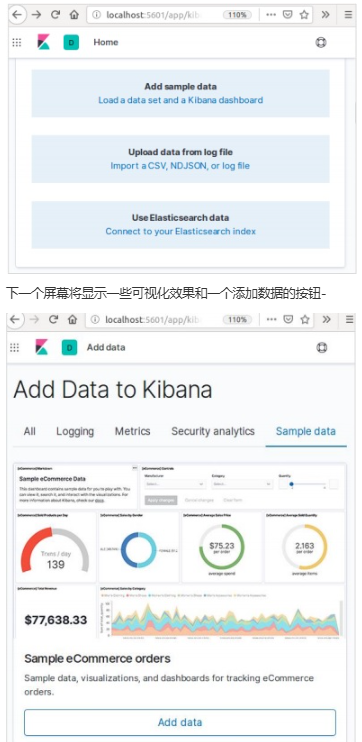

<font style="color:rgb(51, 51, 51);">单击添加数据将显示以下屏幕，确认该数据已添加到名为eCommerce的索引中。</font>

  
 

### <font style="color:rgb(51, 51, 51);">Elasticsearch 版本升级</font>
<font style="color:rgb(51, 51, 51);">在任何系统或软件中，当我们升级到较新版本时，我们需要遵循一些步骤来维护应用程序设置，配置，数据和其他内容。这些步骤是使应用程序在新系统中稳定或维护数据完整性（防止数据损坏）所必需的。</font>

<font style="color:rgb(51, 51, 51);">您需要按照以下步骤升级Elasticsearch-</font>

+ <font style="color:rgb(51, 51, 51);">从</font>[<font style="color:rgb(51, 51, 51);">https://www.elastic.co/</font>](https://www.elastic.co/)<font style="color:rgb(51, 51, 51);">阅读升级文档</font>
+ <font style="color:rgb(51, 51, 51);">在非生产环境（如UAT，E2E，SIT或DEV环境）中测试升级版本。</font>
+ <font style="color:rgb(51, 51, 51);">请注意，如果没有数据备份，则无法回滚到先前的Elasticsearch版本。因此，建议在升级到更高版本之前进行数据备份。</font>
+ <font style="color:rgb(51, 51, 51);">我们可以使用完全集群重启或滚动升级进行升级。滚动升级适用于新版本。请注意，在使用滚动升级方法进行迁移时，不会出现服务中断的情况。</font>

### <font style="color:rgb(51, 51, 51);">升级步骤</font>
+ <font style="color:rgb(51, 51, 51);">在升级生产集群之前，请在开发环境中测试升级。</font>
+ <font style="color:rgb(51, 51, 51);">备份您的数据。除非您具有数据快照，否则无法回滚到早期版本。</font>
+ <font style="color:rgb(51, 51, 51);">在开始升级过程之前，请考虑关闭机器学习作业。虽然机器学习作业可以在滚动升级期间继续运行，但会在升级过程中增加群集的开销。</font>
+ <font style="color:rgb(51, 51, 51);">按以下顺序升级Elastic Stack的组件-</font>
    - <font style="color:rgb(51, 51, 51);">Elasticsearch</font>
    - <font style="color:rgb(51, 51, 51);">Kibana</font>
    - <font style="color:rgb(51, 51, 51);">Logstash</font>
    - <font style="color:rgb(51, 51, 51);">Beats</font>
    - <font style="color:rgb(51, 51, 51);">APM Server</font>

### <font style="color:rgb(51, 51, 51);">从6.6或更早版本升级</font>
<font style="color:rgb(51, 51, 51);">要从6.0-6.6版本直接升级到Elasticsearch 7.1.0，您必须手动重新索引需要继承的所有5.x索引，并执行完整的集群重新启动。</font>

### <font style="color:rgb(51, 51, 51);">完整集群重启</font>
<font style="color:rgb(51, 51, 51);">完全集群重新启动的过程包括关闭集群中的每个节点，将每个节点升级到7x，然后重新启动集群。</font>

<font style="color:rgb(51, 51, 51);">以下是完整集群重新启动需要执行的高级步骤-</font>

+ <font style="color:rgb(51, 51, 51);">禁用碎片分配</font>
+ <font style="color:rgb(51, 51, 51);">停止索引并执行同步刷新</font>
+ <font style="color:rgb(51, 51, 51);">关闭所有节点</font>
+ <font style="color:rgb(51, 51, 51);">升级所有节点</font>
+ <font style="color:rgb(51, 51, 51);">升级任何插件</font>
+ <font style="color:rgb(51, 51, 51);">启动每个升级的节点</font>
+ <font style="color:rgb(51, 51, 51);">等待所有节点加入集群并报告黄色状态</font>
+ <font style="color:rgb(51, 51, 51);">重新启用分配</font>

<font style="color:rgb(51, 51, 51);">重新启用分配后，集群将开始将副本碎片分配给数据节点。此时，恢复索引和搜索是安全的，但是如果您可以等到所有主碎片和副本碎片都已成功分配并且所有节点的状态都为绿色时，集群将更快地恢复。</font>

### <font style="color:rgb(51, 51, 51);">Elasticsearch API约定</font>
<font style="color:rgb(51, 51, 51);">Web中的应用程序编程接口(API)是一组函数调用或其他编程指令，用于访问该特定Web应用程序中的软件组件。例如，Facebook API通过访问来自Facebook的数据或其他功能来帮助开发人员创建应用程序；它可以是出生日期或状态更新。</font>

<font style="color:rgb(51, 51, 51);">Elasticsearch提供了一个REST API，JSON可以通过HTTP访问该API。Elasticsearch使用一些约定，我们现在将对其进行讨论。</font>

### <font style="color:rgb(51, 51, 51);">多个索引</font>
<font style="color:rgb(51, 51, 51);">API中的大多数操作，主要是搜索和其他操作，都是针对一个或多个索引的。这有助于用户只需执行一次查询，就可以在多个位置或所有可用数据中进行搜索。许多不同的符号用于在多个索引中执行操作。我们将在本章中讨论其中的一些。</font>

### <font style="color:rgb(51, 51, 51);">逗号分隔符号</font>
<font style="color:rgb(51, 51, 51);">POST /index1,index2,index3/_search</font>

### <font style="color:rgb(51, 51, 51);">请求正文</font>
```plain
{
   "query":{
      "query_string":{
         "query":"any_string"
      }
   }
}
```

### <font style="color:rgb(51, 51, 51);">响应</font>
<font style="color:rgb(51, 51, 51);">来自index1, index2, index3的JSON对象中包含any_string。</font>

### <font style="color:rgb(51, 51, 51);">_all 所有索引的关键字</font>
<font style="color:rgb(51, 51, 51);">POST /_all/_search</font>

### <font style="color:rgb(51, 51, 51);">请求正文</font>
```plain
{
   "query":{
      "query_string":{
         "query":"any_string"
      }
   }
}
```

### <font style="color:rgb(51, 51, 51);">响应</font>
<font style="color:rgb(51, 51, 51);">来自所有索引的JSON对象，其中包含any_string。</font>

### <font style="color:rgb(51, 51, 51);">通配符（*，+，–）</font>
<font style="color:rgb(51, 51, 51);">POST /school*/_search</font>

### <font style="color:rgb(51, 51, 51);">请求正文</font>
```plain
{
   "query":{
      "query_string":{
         "query":"CBSE"
      }
   }
}
```

### <font style="color:rgb(51, 51, 51);">响应</font>
<font style="color:rgb(51, 51, 51);">来自所有索引的JSON对象，这些索引始于其中包含CBSE的学校。</font>

<font style="color:rgb(51, 51, 51);">另外，您也可以使用以下代码-</font>

<font style="color:rgb(51, 51, 51);">POST /school*,-schools_gov /_search</font>

### <font style="color:rgb(51, 51, 51);">请求正文</font>
```plain
{
   "query":{
      "query_string":{
         "query":"CBSE"
      }
   }
}
```

### <font style="color:rgb(51, 51, 51);">响应</font>
<font style="color:rgb(51, 51, 51);">JSON对象来自所有以“ school”开头的索引，但不是来自school_gov并包含CBSE的索引。</font>

<font style="color:rgb(51, 51, 51);">还有一些URL查询字符串参数-</font>

+ **<font style="color:rgb(51, 51, 51);">ignore_unavailable</font>**<font style="color:rgb(51, 51, 51);">−如果index(es)URL中不存在一个或多个，则不会发生错误或将停止任何操作。例如，school索引存在，但book_shops不存在。</font>

<font style="color:rgb(51, 51, 51);">POST /school*,book_shops/_search</font>

### <font style="color:rgb(51, 51, 51);">请求正文</font>
```plain
{
   "query":{
      "query_string":{
         "query":"CBSE"
      }
   }
}
```

### <font style="color:rgb(51, 51, 51);">请求正文</font>
```plain
{
   "error":{
      "root_cause":[{
         "type":"index_not_found_exception", "reason":"no such index",
         "resource.type":"index_or_alias", "resource.id":"book_shops",
         "index":"book_shops"
      }],
      "type":"index_not_found_exception", "reason":"no such index",
      "resource.type":"index_or_alias", "resource.id":"book_shops",
      "index":"book_shops"
   },"status":404
}
```

<font style="color:rgb(51, 51, 51);">考虑以下代码-</font>

<font style="color:rgb(51, 51, 51);">POST /school*,book_shops/_search?ignore_unavailable = true</font>

### <font style="color:rgb(51, 51, 51);">请求正文</font>
```plain
{
   "query":{
      "query_string":{
         "query":"CBSE"
      }
   }
}
```

### <font style="color:rgb(51, 51, 51);">响应（无错误）</font>
<font style="color:rgb(51, 51, 51);">来自所有索引的JSON对象，这些索引始于其中包含CBSE的学校。</font>

### <font style="color:rgb(51, 51, 51);">allow_no_indices</font>
**<font style="color:rgb(51, 51, 51);">true</font>**<font style="color:rgb(51, 51, 51);">如果带有通配符的URL没有索引，则此参数的值将防止错误。例如，没有以schools_pri开头的索引-</font>

<font style="color:rgb(51, 51, 51);">POST /schools_pri*/_search?allow_no_indices = true</font>

### <font style="color:rgb(51, 51, 51);">请求正文</font>
```plain
{
   "query":{
      "match_all":{}
   }
}
```

### <font style="color:rgb(51, 51, 51);">响应（无错误）</font>
```plain
{
   "took":1,"timed_out": false, "_shards":{"total":0, "successful":0, "failed":0},
   "hits":{"total":0, "max_score":0.0, "hits":[]}
}
```

### <font style="color:rgb(51, 51, 51);">expand_wildcards</font>
<font style="color:rgb(51, 51, 51);">此参数决定通配符是否需要扩展为开放索引或封闭索引，或同时执行这两者。此参数的值可以是打开和关闭的，也可以是没有。</font>

<font style="color:rgb(51, 51, 51);">例如，封闭索引学校-</font>

<font style="color:rgb(51, 51, 51);">POST /schools/_close</font>

### <font style="color:rgb(51, 51, 51);">响应</font>
<font style="color:rgb(51, 51, 51);">{"acknowledged":true}</font>

<font style="color:rgb(51, 51, 51);">考虑以下代码-</font>

<font style="color:rgb(51, 51, 51);">POST /school*/_search?expand_wildcards = closed</font>

### <font style="color:rgb(51, 51, 51);">请求正文</font>
```plain
{
   "query":{
      "match_all":{}
   }
}
```

### <font style="color:rgb(51, 51, 51);">响应</font>
```plain
{
   "error":{
      "root_cause":[{
         "type":"index_closed_exception", "reason":"closed", "index":"schools"
      }],
      "type":"index_closed_exception", "reason":"closed", "index":"schools"
   }, "status":403
}
```

### <font style="color:rgb(51, 51, 51);">索引名称中的日期数学支持</font>
<font style="color:rgb(51, 51, 51);">Elasticsearch提供了根据日期和时间搜索索引的功能。我们需要以特定格式指定日期和时间。例如，accountdetail-2015.12.30，索引将存储2015年12月30日的银行帐户详细信息。可以执行数学运算以获取特定日期或日期和时间范围的详细信息。</font>

<font style="color:rgb(51, 51, 51);">日期数学索引名称的格式-</font>

```plain
<static_name{date_math_expr{date_format|time_zone}}>
/<accountdetail-{now-2d{YYYY.MM.dd|utc}}>/_search
```

<font style="color:rgb(51, 51, 51);">static_name是表达式的一部分，在每个日期的数学索引（如客户明细）中都保持不变。date_math_expr包含数学表达式，该数学表达式像now-2d一样动态确定日期和时间。date_format包含将日期写入诸如YYYY.MM.dd之类的索引中的格式。如果今天是2015年12月30日，则<accountdetail- {now-2d {YYYY.MM.dd}}>将返回accountdetail-2015.12.28。</font>

| <font style="color:rgb(254, 254, 254);">表达</font> | <font style="color:rgb(254, 254, 254);">解析为</font> |
| --- | --- |
| <font style="color:rgb(51, 51, 51);"><accountdetail-{now-d}></font> | <font style="color:rgb(51, 51, 51);">accountdetail-2015.12.29</font> |
| <font style="color:rgb(51, 51, 51);"><accountdetail-{now-M}></font> | <font style="color:rgb(51, 51, 51);">accountdetail-2015.11.30</font> |
| <font style="color:rgb(51, 51, 51);"><accountdetail-{now{YYYY.MM}}></font> | <font style="color:rgb(51, 51, 51);">accountdetail-2015.12</font> |


<font style="color:rgb(51, 51, 51);">现在，我们将看到Elasticsearch中提供的一些常用选项，这些选项可用于获取指定格式的响应。</font>

### <font style="color:rgb(51, 51, 51);">美化的结果</font>
<font style="color:rgb(51, 51, 51);">我们可以通过添加URL查询参数（即pretty = true）来在格式良好的JSON对象中获得响应。</font>

<font style="color:rgb(51, 51, 51);">POST /schools/_search?pretty = true</font>

### <font style="color:rgb(51, 51, 51);">请求正文</font>
```plain
{
   "query":{
      "match_all":{}
   }
}
```

### <font style="color:rgb(51, 51, 51);">响应</font>
```plain
……………………..
{
   "_index" : "schools", "_type" : "school", "_id" : "1", "_score" : 1.0,
   "_source":{
      "name":"Central School", "description":"CBSE Affiliation",
      "street":"Nagan", "city":"paprola", "state":"HP", "zip":"176115",
      "location": [31.8955385, 76.8380405], "fees":2000,
      "tags":["Senior Secondary", "beautiful campus"], "rating":"3.5"
   }
}
………………….
```

### <font style="color:rgb(51, 51, 51);">人类可读的输出</font>
<font style="color:rgb(51, 51, 51);">此选项可以将统计响应更改为人类可读形式（如果human = true）或计算机可读形式（如果human = false）。例如，如果human = true，则distance_kilometer = 20KM；如果human = false，则distance_meter = 20000，此时需要其他计算机程序使用响应。</font>

### <font style="color:rgb(51, 51, 51);">响应过滤</font>
<font style="color:rgb(51, 51, 51);">通过将它们添加到field_path参数中，我们可以过滤对较少字段的响应。例如，</font>

<font style="color:rgb(51, 51, 51);">POST /schools/_search?filter_path = hits.total</font>

### <font style="color:rgb(51, 51, 51);">请求正文</font>
```plain
{
   "query":{
      "match_all":{}
   }
}
```

### <font style="color:rgb(51, 51, 51);">响应</font>
```bash
{"hits":{"total":3}}
```

## <font style="color:rgb(51, 51, 51);">Elasticsearch 文档API</font>
<font style="color:rgb(51, 51, 51);">Elasticsearch提供了单文档API和多文档API，其中API调用分别针对单个文档和多个文档。</font>

### <font style="color:rgb(51, 51, 51);">索引API</font>
<font style="color:rgb(51, 51, 51);">当对具有特定映射的相应索引进行请求时，它有助于在索引中添加或更新JSON文档。例如，以下请求会将JSON对象添加到索引学校和学校映射下-</font>

```plain
PUT schools/_doc/5
{
   name":"City School", "description":"ICSE", "street":"West End",
   "city":"Meerut",
   "state":"UP", "zip":"250002", "location":[28.9926174, 77.692485],
   "fees":3500,
   "tags":["fully computerized"], "rating":"4.5"
}
```

<font style="color:rgb(51, 51, 51);">在运行上面的代码时，我们得到以下结果-</font>

```plain
{
   "_index" : "schools",
   "_type" : "_doc",
   "_id" : "5",
   "_version" : 1,
   "result" : "created",
   "_shards" : {
      "total" : 2,
      "successful" : 1,
      "failed" : 0
   },
   "_seq_no" : 2,
   "_primary_term" : 1
}
```

### <font style="color:rgb(51, 51, 51);">自动索引创建</font>
<font style="color:rgb(51, 51, 51);">当请求将JSON对象添加到特定索引时，如果该索引不存在，则此API会自动创建该索引以及该特定JSON对象的基础映射。可以通过将elasticsearch.yml文件中存在的以下参数的值更改为false来禁用此功能。</font>

```plain
action.auto_create_index:false
index.mapper.dynamic:false
```

<font style="color:rgb(51, 51, 51);">您还可以限制索引的自动创建，通过更改以下参数的值，只允许使用具有特定模式的索引名称-</font>

action.auto_create_index:+acc*,-bank*

**<font style="color:rgb(51, 51, 51);">注意</font>**<font style="color:rgb(51, 51, 51);">：此处 + 表示允许，而 – 表示不允许。</font>

### <font style="color:rgb(51, 51, 51);">版本控制</font>
<font style="color:rgb(51, 51, 51);">Elasticsearch还提供了版本控制工具。我们可以使用版本查询参数来指定特定文档的版本。</font>

```plain
PUT schools/_doc/5?version=7&version_type=external
{
   "name":"Central School", "description":"CBSE Affiliation", "street":"Nagan",
   "city":"paprola", "state":"HP", "zip":"176115", "location":[31.8955385, 76.8380405],
   "fees":2200, "tags":["Senior Secondary", "beautiful campus"], "rating":"3.3"
}
```

<font style="color:rgb(51, 51, 51);">在运行上面的代码时，我们得到以下结果-</font>

```plain
{
   "_index" : "schools",
   "_type" : "_doc",
   "_id" : "5",
   "_version" : 7,
   "result" : "updated",
   "_shards" : {
      "total" : 2,
      "successful" : 1,
      "failed" : 0
   },
   "_seq_no" : 3,
   "_primary_term" : 1
}
```

<font style="color:rgb(51, 51, 51);">版本控制是一个实时过程，不受实时搜索操作的影响。</font>

<font style="color:rgb(51, 51, 51);">有两种最重要的版本控制类型-</font>

### <font style="color:rgb(51, 51, 51);">内部版本控制</font>
<font style="color:rgb(51, 51, 51);">内部版本控制是默认版本，从1开始，并随着每次更新（包括删除）而递增。</font>

### <font style="color:rgb(51, 51, 51);">外部版本控制</font>
<font style="color:rgb(51, 51, 51);">当文档的版本控制存储在外部系统（如第三方版本控制系统）中时，将使用此功能。要启用此功能，我们需要将version_type设置为external。在这里，Elasticsearch将存储外部系统指定的版本号，并且不会自动对其进行递增。</font>

### <font style="color:rgb(51, 51, 51);">操作类型</font>
<font style="color:rgb(51, 51, 51);">操作类型用于强制执行创建操作。这有助于避免覆盖现有文档。</font>

```plain
PUT chapter/_doc/1?op_type=create
{
   "Text":"this is chapter one"
}
```

<font style="color:rgb(51, 51, 51);">在运行上面的代码时，我们得到以下结果-</font>

```plain
{
   "_index" : "chapter",
   "_type" : "_doc",
   "_id" : "1",
   "_version" : 1,
   "result" : "created",
   "_shards" : {
      "total" : 2,
      "successful" : 1,
      "failed" : 0
   },
   "_seq_no" : 0,
   "_primary_term" : 1
}
```

### <font style="color:rgb(51, 51, 51);">自动ID生成</font>
<font style="color:rgb(51, 51, 51);">如果在索引操作中未指定ID，则Elasticsearch会自动为该文档生成ID。</font>

```plain
POST chapter/_doc/
{
   "user" : "tpoint",
   "post_date" : "2018-12-25T14:12:12",
   "message" : "Elasticsearch Tutorial"
}
```

<font style="color:rgb(51, 51, 51);">在运行上面的代码时，我们得到以下结果-</font>

```plain
{
   "_index" : "chapter",
   "_type" : "_doc",
   "_id" : "PVghWGoB7LiDTeV6LSGu",
   "_version" : 1,
   "result" : "created",
   "_shards" : {
      "total" : 2,
      "successful" : 1,
      "failed" : 0
   },
   "_seq_no" : 1,
   "_primary_term" : 1
}
```

### <font style="color:rgb(51, 51, 51);">获取API</font>
<font style="color:rgb(51, 51, 51);">API通过对特定文档执行get请求来帮助提取类型JSON对象。</font>

pre class="prettyprint notranslate" > GET schools/_doc/5

<font style="color:rgb(51, 51, 51);">在运行上面的代码时，我们得到以下结果-</font>

```plain
{
   "_index" : "schools",
   "_type" : "_doc",
   "_id" : "5",
   "_version" : 7,
   "_seq_no" : 3,
   "_primary_term" : 1,
   "found" : true,
   "_source" : {
      "name" : "Central School",
      "description" : "CBSE Affiliation",
      "street" : "Nagan",
      "city" : "paprola",
      "state" : "HP",
      "zip" : "176115",
      "location" : [
         31.8955385,
         76.8380405
      ],
      "fees" : 2200,
      "tags" : [
         "Senior Secondary",
         "beautiful campus"
      ],
      "rating" : "3.3"
   }
}
```

+ <font style="color:rgb(51, 51, 51);">此操作是实时的，不受索引刷新率的影响。</font>
+ <font style="color:rgb(51, 51, 51);">您还可以指定版本，然后Elasticsearch将仅获取该文档的版本。</font>
+ <font style="color:rgb(51, 51, 51);">您还可以在请求中指定_all，以便Elasticsearch可以按每种类型搜索该文档ID，它将返回第一个匹配的文档。</font>
+ <font style="color:rgb(51, 51, 51);">您还可以在特定文档的结果中指定所需的字段。</font>

GET schools/_doc/5?_source_includes=name,fees

<font style="color:rgb(51, 51, 51);">在运行上面的代码时，我们得到以下结果-</font>

```plain
{
   "_index" : "schools",
   "_type" : "_doc",
   "_id" : "5",
   "_version" : 7,
   "_seq_no" : 3,
   "_primary_term" : 1,
   "found" : true,
   "_source" : {
      "fees" : 2200,
      "name" : "Central School"
   }
}
```

<font style="color:rgb(51, 51, 51);">您还可以通过在get请求中添加_source部分来获取结果中的源部分。</font>

GET schools/_doc/5?_source

<font style="color:rgb(51, 51, 51);">在运行上面的代码时，我们得到以下结果-</font>

```plain
{
   "_index" : "schools",
   "_type" : "_doc",
   "_id" : "5",
   "_version" : 7,
   "_seq_no" : 3,
   "_primary_term" : 1,
   "found" : true,
   "_source" : {
      "name" : "Central School",
      "description" : "CBSE Affiliation",
      "street" : "Nagan",
      "city" : "paprola",
      "state" : "HP",
      "zip" : "176115",
      "location" : [
         31.8955385,
         76.8380405
      ],
      "fees" : 2200,
      "tags" : [
         "Senior Secondary",
         "beautiful campus"
      ],
      "rating" : "3.3"
   }
}
```

<font style="color:rgb(51, 51, 51);">您还可以通过将refresh参数设置为true来刷新分片，然后再执行get操作。</font>

### <font style="color:rgb(51, 51, 51);">删除API</font>
<font style="color:rgb(51, 51, 51);">您可以通过向Elasticsearch发送HTTP DELETE请求来删除特定的索引，映射或文档。</font>

DELETE schools/_doc/4

<font style="color:rgb(51, 51, 51);">在运行上面的代码时，我们得到以下结果-</font>

```plain
{
   "found":true, "_index":"schools", "_type":"school", "_id":"4", "_version":2,
   "_shards":{"total":2, "successful":1, "failed":0}
}
```

<font style="color:rgb(51, 51, 51);">可以指定文档的版本以删除该特定版本。可以指定路由参数以从特定用户删除文档，并且如果文档不属于该特定用户，则操作将失败。在此操作中，您可以像GET API一样指定刷新和超时选项。</font>

### <font style="color:rgb(51, 51, 51);">更新API</font>
<font style="color:rgb(51, 51, 51);">脚本用于执行此操作，版本控制用于确保在获取和重新编制索引期间未发生任何更新。例如，您可以使用脚本更新学费-</font>

```plain
POST schools/_update/4
{
   "script" : {
      "source": "ctx._source.name = params.sname",
      "lang": "painless",
      "params" : {
         "sname" : "City Wise School"
      }
   }
 }
```

<font style="color:rgb(51, 51, 51);">在运行上面的代码时，我们得到以下结果-</font>

```plain
{
   "_index" : "schools",
   "_type" : "_doc",
   "_id" : "4",
   "_version" : 3,
   "result" : "updated",
   "_shards" : {
      "total" : 2,
      "successful" : 1,
      "failed" : 0
   },
   "_seq_no" : 4,
   "_primary_term" : 2
}
```

<font style="color:rgb(51, 51, 51);">您可以通过向更新的文档发送获取请求来检查更新。</font>

### <font style="color:rgb(51, 51, 51);">Elasticsearch 搜索API</font>
<font style="color:rgb(51, 51, 51);">该API用于在Elasticsearch中搜索内容。用户可以通过发送带有查询字符串作为参数的get请求进行搜索，或者可以在发布请求的消息正文中发布查询。搜索 api 主要是多索引、多类型的。</font>

### <font style="color:rgb(51, 51, 51);">多索引</font>
<font style="color:rgb(51, 51, 51);">Elasticsearch允许我们搜索所有索引或某些特定索引中存在的文档。例如，如果我们需要搜索名称包含“ central”的所有文档，则可以执行以下操作：</font>

<font style="color:rgb(51, 51, 51);">GET /_all/_search?q=city:paprola</font>

<font style="color:rgb(51, 51, 51);">在运行上面的代码时，我们得到以下响应-</font>

```plain
{
   "took" : 33,
   "timed_out" : false,
   "_shards" : {
      "total" : 7,
      "successful" : 7,
      "skipped" : 0,
      "failed" : 0
   },
   "hits" : {
      "total" : {
         "value" : 1,
         "relation" : "eq"
      },
      "max_score" : 0.9808292,
      "hits" : [
         {
            "_index" : "schools",
            "_type" : "school",
            "_id" : "5",
            "_score" : 0.9808292,
            "_source" : {
               "name" : "Central School",
               "description" : "CBSE Affiliation",
               "street" : "Nagan",
               "city" : "paprola",
               "state" : "HP",
               "zip" : "176115",
               "location" : [
                  31.8955385,
                  76.8380405
               ],
               "fees" : 2200,
               "tags" : [
                  "Senior Secondary",
                  "beautiful campus"
               ],
               "rating" : "3.3"
            }
         }
      ]
   }
}
```

### <font style="color:rgb(51, 51, 51);">URI搜索</font>
<font style="color:rgb(51, 51, 51);">可以使用统一资源标识符在搜索操作中传递许多参数-</font>

| <font style="color:rgb(254, 254, 254);">序号</font> | <font style="color:rgb(254, 254, 254);">参数及说明</font> |
| --- | --- |
| <font style="color:rgb(51, 51, 51);">1</font> | **<font style="color:rgb(51, 51, 51);">Q</font>**<br/><font style="color:rgb(51, 51, 51);">此参数用于指定查询字符串</font> |
| <font style="color:rgb(51, 51, 51);">2</font> | **<font style="color:rgb(51, 51, 51);">lenient</font>**<br/><font style="color:rgb(51, 51, 51);">此参数用于指定查询字符串。只要将此参数设置为 true，就可以忽略基于 Formatbased 的错误。默认情况下它是假的。</font> |
| <font style="color:rgb(51, 51, 51);">3</font> | **<font style="color:rgb(51, 51, 51);">fields</font>**<br/><font style="color:rgb(51, 51, 51);">此参数用于指定查询字符串</font> |
| <font style="color:rgb(51, 51, 51);">4</font> | **<font style="color:rgb(51, 51, 51);">sort</font>**<br/><font style="color:rgb(51, 51, 51);">我们可以通过使用这个参数得到排序的结果，这个参数的可能值是fieldName, fieldName:asc/ fieldName:desc</font> |
| <font style="color:rgb(51, 51, 51);">5</font> | **<font style="color:rgb(51, 51, 51);">timeout</font>**<br/><font style="color:rgb(51, 51, 51);">我们可以通过使用这个参数来限制搜索时间，并且响应只包含指定时间内的命中。默认情况下，没有超时</font> |
| <font style="color:rgb(51, 51, 51);">6</font> | **<font style="color:rgb(51, 51, 51);">terminate_after</font>**<br/><font style="color:rgb(51, 51, 51);">们可以将响应限制为每个碎片的指定数量的文档，到达该分片时，查询将提前终止。默认情况下，没有 termin_after.</font> |
| <font style="color:rgb(51, 51, 51);">7</font> | **<font style="color:rgb(51, 51, 51);">from</font>**<br/><font style="color:rgb(51, 51, 51);">要返回的命中数的起始索引。默认为0。</font> |
| <font style="color:rgb(51, 51, 51);">8</font> | **<font style="color:rgb(51, 51, 51);">size</font>**<br/><font style="color:rgb(51, 51, 51);">它表示要返回的命中数，默认值为10。</font> |


### <font style="color:rgb(51, 51, 51);">请求正文搜索</font>
<font style="color:rgb(51, 51, 51);">我们还可以在请求正文中使用查询DSL来指定查询，并且在前面的章节中已经给出了很多示例。这里给出一个这样的实例-</font>

```plain
POST /schools/_search
{
   "query":{
      "query_string":{
         "query":"up"
      }
   }
}
```

<font style="color:rgb(51, 51, 51);">在运行上面的代码时，我们得到以下响应-</font>

```plain
{
   "took" : 11,
   "timed_out" : false,
   "_shards" : {
      "total" : 1,
      "successful" : 1,
      "skipped" : 0,
      "failed" : 0
   },
   "hits" : {
      "total" : {
         "value" : 1,
         "relation" : "eq"
      },
      "max_score" : 0.47000363,
      "hits" : [
         {
            "_index" : "schools",
            "_type" : "school",
            "_id" : "4",
            "_score" : 0.47000363,
            "_source" : {
               "name" : "City Best School",
               "description" : "ICSE",
               "street" : "West End",
               "city" : "Meerut",
               "state" : "UP",
               "zip" : "250002",
               "location" : [
                  28.9926174,
                  77.692485
               ],
               "fees" : 3500,
               "tags" : [
                  "fully computerized"
               ],
               "rating" : "4.5"
            }
         }
      ]
   }
}
```

### <font style="color:rgb(51, 51, 51);">Elasticsearch 聚合</font>
<font style="color:rgb(51, 51, 51);">聚合框架收集搜索查询选择的所有数据，并由许多构建块组成，这有助于构建数据的复杂摘要。聚合的基本结构如下所示-</font>

```plain
"aggregations" : {
   "" : {
      "" : {

      }
 
      [,"meta" : { [] } ]?
      [,"aggregations" : { []+ } ]?
   }
   [,"" : { ... } ]*
}
```

<font style="color:rgb(51, 51, 51);">聚合有不同的类型，每种类型都有自己的目的。本章将详细讨论这些问题。</font>

### <font style="color:rgb(51, 51, 51);">指标聚合</font>
<font style="color:rgb(51, 51, 51);">这些聚合有助于根据聚合文档的字段值计算矩阵，有时还可以从脚本生成一些值。</font>

<font style="color:rgb(51, 51, 51);">数值矩阵既可以是单值（如平均聚合），也可以是多值（如统计数据）。</font>

### <font style="color:rgb(51, 51, 51);">平均聚合</font>
<font style="color:rgb(51, 51, 51);">此聚合用于获取聚合文档中存在的任何数字字段的平均值。例如，</font>

```plain
POST /schools/_search
{
   "aggs":{
      "avg_fees":{"avg":{"field":"fees"}}
   }
}
```

<font style="color:rgb(51, 51, 51);">在运行上面的代码时，我们得到以下结果-</font>

```plain
{
   "took" : 41,
   "timed_out" : false,
   "_shards" : {
      "total" : 1,
      "successful" : 1,
      "skipped" : 0,
      "failed" : 0
   },
   "hits" : {
      "total" : {
         "value" : 2,
         "relation" : "eq"
      },
      "max_score" : 1.0,
      "hits" : [
         {
            "_index" : "schools",
            "_type" : "school",
            "_id" : "5",
            "_score" : 1.0,
            "_source" : {
               "name" : "Central School",
               "description" : "CBSE Affiliation",
               "street" : "Nagan",
               "city" : "paprola",
               "state" : "HP",
               "zip" : "176115",
               "location" : [
                  31.8955385,
                  76.8380405
               ],
            "fees" : 2200,
            "tags" : [
               "Senior Secondary",
               "beautiful campus"
            ],
            "rating" : "3.3"
         }
      },
      {
         "_index" : "schools",
         "_type" : "school",
         "_id" : "4",
         "_score" : 1.0,
         "_source" : {
            "name" : "City Best School",
            "description" : "ICSE",
            "street" : "West End",
            "city" : "Meerut",
            "state" : "UP",
            "zip" : "250002",
            "location" : [
               28.9926174,
               77.692485
            ],
            "fees" : 3500,
            "tags" : [
               "fully computerized"
            ],
            "rating" : "4.5"
         }
      }
   ]
 },
   "aggregations" : {
      "avg_fees" : {
         "value" : 2850.0
      }
   }
}
```

### <font style="color:rgb(51, 51, 51);">基数聚合</font>
<font style="color:rgb(51, 51, 51);">此聚合提供了特定字段的不同值的计数。</font>

```plain
POST /schools/_search?size=0
{
   "aggs":{
      "distinct_name_count":{"cardinality":{"field":"fees"}}
   }
}
```

<font style="color:rgb(51, 51, 51);">在运行上面的代码时，我们得到以下结果-</font>

```plain
{
   "took" : 2,
   "timed_out" : false,
   "_shards" : {
      "total" : 1,
      "successful" : 1,
      "skipped" : 0,
      "failed" : 0
   },
   "hits" : {
      "total" : {
         "value" : 2,
         "relation" : "eq"
      },
      "max_score" : null,
      "hits" : [ ]
   },
   "aggregations" : {
      "distinct_name_count" : {
         "value" : 2
      }
   }
}
```

**<font style="color:rgb(51, 51, 51);">Note</font>**<font style="color:rgb(51, 51, 51);"> </font><font style="color:rgb(51, 51, 51);">−基数的值为2，因为费用有两个不同的值。</font>

### <font style="color:rgb(51, 51, 51);">扩展统计数据聚合</font>
<font style="color:rgb(51, 51, 51);">此聚合将生成有关聚合文档中特定数字字段的所有统计信息。</font>

```plain
POST /schools/_search?size=0
{
   "aggs" : {
      "fees_stats" : { "extended_stats" : { "field" : "fees" } }
   }
}
```

<font style="color:rgb(51, 51, 51);">在运行上面的代码时，我们得到以下结果-</font>

```plain
{
   "took" : 8,
   "timed_out" : false,
   "_shards" : {
      "total" : 1,
      "successful" : 1,
      "skipped" : 0,
      "failed" : 0
   },
   "hits" : {
      "total" : {
         "value" : 2,
         "relation" : "eq"
      },
      "max_score" : null,
      "hits" : [ ]
   },
   "aggregations" : {
      "fees_stats" : {
         "count" : 2,
         "min" : 2200.0,
         "max" : 3500.0,
         "avg" : 2850.0,
         "sum" : 5700.0,
         "sum_of_squares" : 1.709E7,
         "variance" : 422500.0,
         "std_deviation" : 650.0,
         "std_deviation_bounds" : {
            "upper" : 4150.0,
            "lower" : 1550.0
         }
      }
   }
}
```

### <font style="color:rgb(51, 51, 51);">最大聚集</font>
<font style="color:rgb(51, 51, 51);">此聚合查找聚合文档中特定数字字段的最大值。</font>

```plain
POST /schools/_search?size=0
{
   "aggs" : {
   "max_fees" : { "max" : { "field" : "fees" } }
   }
}
```

<font style="color:rgb(51, 51, 51);">在运行上面的代码时，我们得到以下结果-</font>

```plain
{
   "took" : 16,
   "timed_out" : false,
   "_shards" : {
      "total" : 1,
      "successful" : 1,
      "skipped" : 0,
      "failed" : 0
   },
  "hits" : {
      "total" : {
         "value" : 2,
         "relation" : "eq"
      },
      "max_score" : null,
      "hits" : [ ]
   },
   "aggregations" : {
      "max_fees" : {
         "value" : 3500.0
      }
   }
}
```

### <font style="color:rgb(51, 51, 51);">最小聚合</font>
<font style="color:rgb(51, 51, 51);">此聚合在聚合的文档中查找特定数字字段的最小值。</font>

```plain
POST /schools/_search?size=0
{
   "aggs" : {
      "min_fees" : { "min" : { "field" : "fees" } }
   }
}
```

<font style="color:rgb(51, 51, 51);">在运行上面的代码时，我们得到以下结果-</font>

```plain
{
   "took" : 2,
   "timed_out" : false,
   "_shards" : {
      "total" : 1,
      "successful" : 1,
      "skipped" : 0,
      "failed" : 0
   },
   "hits" : {
      "total" : {
         "value" : 2,
         "relation" : "eq"
      },
      "max_score" : null,
      "hits" : [ ]
   },
  "aggregations" : {
      "min_fees" : {
         "value" : 2200.0
      }
   }
}
```

### <font style="color:rgb(51, 51, 51);">聚合总和</font>
<font style="color:rgb(51, 51, 51);">此聚合计算聚合文档中特定数值字段的和。</font>

```plain
POST /schools/_search?size=0
{
   "aggs" : {
      "total_fees" : { "sum" : { "field" : "fees" } }
   }
}
```

<font style="color:rgb(51, 51, 51);">在运行上面的代码时，我们得到以下结果-</font>

```plain
{
   "took" : 8,
   "timed_out" : false,
   "_shards" : {
      "total" : 1,
      "successful" : 1,
      "skipped" : 0,
      "failed" : 0
   },
   "hits" : {
      "total" : {
         "value" : 2,
         "relation" : "eq"
      },
      "max_score" : null,
      "hits" : [ ]
   },
   "aggregations" : {
      "total_fees" : {
         "value" : 5700.0
      }
   }
}
```

<font style="color:rgb(51, 51, 51);">在特殊情况下还有其他一些度量标准聚合，例如地理边界聚合和地理质心聚合，以实现地理位置。</font>

### <font style="color:rgb(51, 51, 51);">统计聚合</font>
<font style="color:rgb(51, 51, 51);">一种多值度量标准聚合，可根据从聚合文档中提取的数值来计算统计信息。</font>

```plain
POST /schools/_search?size=0
{
   "aggs" : {
      "grades_stats" : { "stats" : { "field" : "fees" } }
   }
}
```

<font style="color:rgb(51, 51, 51);">在运行上面的代码时，我们得到以下结果-</font>

```plain
{
   "took" : 2,
   "timed_out" : false,
   "_shards" : {
      "total" : 1,
      "successful" : 1,
      "skipped" : 0,
      "failed" : 0
   },
   "hits" : {
      "total" : {
         "value" : 2,
         "relation" : "eq"
      },
      "max_score" : null,
      "hits" : [ ]
   },
   "aggregations" : {
      "grades_stats" : {
         "count" : 2,
         "min" : 2200.0,
         "max" : 3500.0,
         "avg" : 2850.0,
         "sum" : 5700.0
      }
   }
}
```

### <font style="color:rgb(51, 51, 51);">聚合元数据</font>
<font style="color:rgb(51, 51, 51);">您可以在请求时使用meta标记添加一些有关聚合的数据，并作为响应获取。</font>

```plain
POST /schools/_search?size=0
{
   "aggs" : {
      "min_fees" : { "avg" : { "field" : "fees" } ,
         "meta" :{
            "dsc" :"Lowest Fees This Year"
         }
      }
   }
}
```

<font style="color:rgb(51, 51, 51);">在运行上面的代码时，我们得到以下结果-</font>

```plain
{
   "took" : 0,
   "timed_out" : false,
   "_shards" : {
      "total" : 1,
      "successful" : 1,
      "skipped" : 0,
      "failed" : 0
   },
   "hits" : {
      "total" : {
         "value" : 2,
         "relation" : "eq"
      },
      "max_score" : null,
      "hits" : [ ]
   },
   "aggregations" : {
      "min_fees" : {
         "meta" : {
            "dsc" : "Lowest Fees This Year"
         },
         "value" : 2850.0
      }
   }
}
```

### <font style="color:rgb(51, 51, 51);">Elasticsearch 索引API</font>
<font style="color:rgb(51, 51, 51);">这些API负责管理索引的所有方面，例如设置，别名，映射，索引模板。</font>

### <font style="color:rgb(51, 51, 51);">创建索引</font>
<font style="color:rgb(51, 51, 51);">该API可帮助您创建索引。当用户将JSON对象传递给任何索引时，可以自动创建索引，也可以在此之前创建索引。要创建索引，您只需要发送带有设置，映射和别名的PUT请求，或者仅发送不带正文的简单请求。</font>

PUT colleges

<font style="color:rgb(51, 51, 51);">运行上面的代码后，我们得到如下所示的输出-</font>

```plain
{
   "acknowledged" : true,
   "shards_acknowledged" : true,
   "index" : "colleges"
}
```

<font style="color:rgb(51, 51, 51);">我们也可以在上面的命令中添加一些设置-</font>

```plain
PUT colleges
{
  "settings" : {
      "index" : {
         "number_of_shards" : 3,
         "number_of_replicas" : 2
      }
   }
}
```

<font style="color:rgb(51, 51, 51);">运行上面的代码后，我们得到如下所示的输出-</font>

```plain
{
   "acknowledged" : true,
   "shards_acknowledged" : true,
   "index" : "colleges"
}
```

### <font style="color:rgb(51, 51, 51);">删除索引</font>
<font style="color:rgb(51, 51, 51);">此API可帮助您删除任何索引。您只需要传递带有该特定索引名称的删除请求即可。</font>

DELETE /colleges

<font style="color:rgb(51, 51, 51);">您可以仅使用_all或*删除所有索引。</font>

### <font style="color:rgb(51, 51, 51);">获取索引</font>
<font style="color:rgb(51, 51, 51);">可以通过仅将get请求发送到一个或多个索引来调用此API。这将返回有关索引的信息。</font>

GET colleges

<font style="color:rgb(51, 51, 51);">运行上面的代码后，我们得到如下所示的输出-</font>

```plain
{
   "colleges" : {
      "aliases" : {
         "alias_1" : { },
         "alias_2" : {
            "filter" : {
               "term" : {
                  "user" : "pkay"
               }
            },
            "index_routing" : "pkay",
            "search_routing" : "pkay"
         }
      },
      "mappings" : { },
      "settings" : {
         "index" : {
            "creation_date" : "1556245406616",
            "number_of_shards" : "1",
            "number_of_replicas" : "1",
            "uuid" : "3ExJbdl2R1qDLssIkwDAug",
            "version" : {
               "created" : "7000099"
            },
            "provided_name" : "colleges"
         }
      }
   }
}
```

<font style="color:rgb(51, 51, 51);">您可以使用_all或*获取所有索引的信息。</font>

### <font style="color:rgb(51, 51, 51);">索引存在</font>
<font style="color:rgb(51, 51, 51);">索引的存在可以通过仅向该索引发送get请求来确定。如果HTTP响应是200，则存在。如果是404，则不存在。</font>

HEAD colleges

<font style="color:rgb(51, 51, 51);">运行上面的代码后，我们得到如下所示的输出-</font>

200-OK

### <font style="color:rgb(51, 51, 51);">索引设置</font>
<font style="color:rgb(51, 51, 51);">您只需在网址末尾附加_settings关键字即可获取索引设置。</font>

GET /colleges/_settings

<font style="color:rgb(51, 51, 51);">运行上面的代码后，我们得到如下所示的输出-</font>

```plain
{
   "colleges" : {
      "settings" : {
         "index" : {
            "creation_date" : "1556245406616",
            "number_of_shards" : "1",
            "number_of_replicas" : "1",
            "uuid" : "3ExJbdl2R1qDLssIkwDAug",
            "version" : {
               "created" : "7000099"
            },
            "provided_name" : "colleges"
         }
      }
   }
}
```

### <font style="color:rgb(51, 51, 51);">索引统计</font>
<font style="color:rgb(51, 51, 51);">该API可帮助您提取有关特定索引的统计信息。您只需要在末尾发送带有索引URL和_stats关键字的get请求。</font>

GET /_stats

<font style="color:rgb(51, 51, 51);">运行上面的代码后，我们得到如下所示的输出-</font>

```plain
………………………………………………
},
   "request_cache" : {
      "memory_size_in_bytes" : 849,
      "evictions" : 0,
      "hit_count" : 1171,
      "miss_count" : 4
   },
   "recovery" : {
      "current_as_source" : 0,
      "current_as_target" : 0,
      "throttle_time_in_millis" : 0
   }
} ………………………………………………
```

### <font style="color:rgb(51, 51, 51);">冲洗(Flush)  
</font>
<font style="color:rgb(51, 51, 51);">索引的刷新过程可确保当前仅保留在事务日志中的所有数据也将永久保留在Lucene中。这减少了恢复时间，因为在打开Lucene索引之后，不需要从事务日志中重新索引数据。</font>

POST colleges/_flush

<font style="color:rgb(51, 51, 51);">运行上面的代码后，我们得到如下所示的输出-</font>

```plain
{
   "_shards" : {
      "total" : 2,
      "successful" : 1,
      "failed" : 0
   } 
}
```

### <font style="color:rgb(51, 51, 51);">Elasticsearch Cat API</font>
<font style="color:rgb(51, 51, 51);">通常，来自各种Elasticsearch API的结果以JSON格式显示。但是，JSON并非总是易于阅读。因此，Elasticsearch中提供了cat APIs功能，有助于使结果的打印格式更易于阅读和理解。cat API中使用了各种参数，这些参数具有不同的用途，例如-术语V使输出变得冗长。</font>

<font style="color:rgb(51, 51, 51);">让我们在本章中更详细地了解cat API。</font>

### <font style="color:rgb(51, 51, 51);">详细</font>
<font style="color:rgb(51, 51, 51);">详细的输出可以很好地显示cat命令的结果。在下面给出的示例中，我们获得了集群中存在的各种索引的详细信息。</font>

GET /_cat/indices?v

<font style="color:rgb(51, 51, 51);">运行上面的代码后，我们得到如下所示的响应：</font>

```plain
health status index uuid pri repdocs.countdocs.deletedstore.sizepri.store.size
yellow open schools RkMyEn2SQ4yUgzT6EQYuAA 1 1 2 1 21.6kb 21.6kb
yellow open index_4_analysis zVmZdM1sTV61YJYrNXf1gg 1 1 0 0 283b 283b
yellow open sensor-2018-01-01 KIrrHwABRB-ilGqTu3OaVQ 1 1 1 0 4.2kb 4.2kb
yellow open colleges 3ExJbdl2R1qDLssIkwDAug 1 1 0 0 283b 283b
```

### <font style="color:rgb(51, 51, 51);">标头</font>
<font style="color:rgb(51, 51, 51);">h参数（也称为标头）仅用于显示命令中提到的那些列。</font>

GET /_cat/nodes?h=ip,port

<font style="color:rgb(51, 51, 51);">运行上面的代码后，我们得到如下所示的响应：</font>

127.0.0.1 9300

### <font style="color:rgb(51, 51, 51);">Sort - 排序</font>
<font style="color:rgb(51, 51, 51);">sort命令接受查询字符串，该字符串可以按查询中的指定列对表进行排序。默认排序是升序的，但是可以通过在列中添加：desc来更改。</font>

<font style="color:rgb(51, 51, 51);">下面的示例给出了按字段索引模式的降序排列的模板的结果。</font>

GET _cat/templates?v&s=order:desc,index_patterns

<font style="color:rgb(51, 51, 51);">运行上面的代码后，我们得到如下所示的响应：</font>

```plain
name index_patterns order version
.triggered_watches [.triggered_watches*] 2147483647
.watch-history-9 [.watcher-history-9*] 2147483647
.watches [.watches*] 2147483647
.kibana_task_manager [.kibana_task_manager] 0 7000099
```

### <font style="color:rgb(51, 51, 51);">计数 - Count</font>
<font style="color:rgb(51, 51, 51);">count参数提供整个集群中文档总数的计数。</font>

GET /_cat/count?v

<font style="color:rgb(51, 51, 51);">运行上面的代码后，我们得到如下所示的响应：</font>

```plain
epoch timestamp count
1557633536 03:58:56 17809
```

### <font style="color:rgb(51, 51, 51);">Elasticsearch 集群API</font>
<font style="color:rgb(51, 51, 51);">群集API用于获取有关群集及其节点的信息并在其中进行更改。要调用此API，我们需要指定节点名称，地址或_local。</font>

GET /_nodes/_local

<font style="color:rgb(51, 51, 51);">运行上面的代码后，我们得到如下所示的响应：</font>

```plain
………………………………………………
cluster_name" : "elasticsearch",
   "nodes" : {
      "FKH-5blYTJmff2rJ_lQOCg" : {
         "name" : "ubuntu",
         "transport_address" : "127.0.0.1:9300",
         "host" : "127.0.0.1",
         "ip" : "127.0.0.1",
         "version" : "7.0.0",
         "build_flavor" : "default",
         "build_type" : "tar",
         "build_hash" : "b7e28a7",
         "total_indexing_buffer" : 106502553,
         "roles" : [
            "master",
            "data",
            "ingest"
         ],
         "attributes" : {
………………………………………………
```

### <font style="color:rgb(51, 51, 51);">集群运行状况</font>
<font style="color:rgb(51, 51, 51);">API用于通过附加'health'关键字来获取集群运行状况的状态。</font>

GET /_cluster/health

<font style="color:rgb(51, 51, 51);">运行上面的代码后，我们得到如下所示的响应：</font>

```plain
{
   "cluster_name" : "elasticsearch",
   "status" : "yellow",
   "timed_out" : false,
   "number_of_nodes" : 1,
   "number_of_data_nodes" : 1,
   "active_primary_shards" : 7,
   "active_shards" : 7,
   "relocating_shards" : 0,
   "initializing_shards" : 0,
   "unassigned_shards" : 4,
   "delayed_unassigned_shards" : 0,
   "number_of_pending_tasks" : 0,
   "number_of_in_flight_fetch" : 0,
   "task_max_waiting_in_queue_millis" : 0,
   "active_shards_percent_as_number" : 63.63636363636363
}
```

### <font style="color:rgb(51, 51, 51);">集群状态</font>
<font style="color:rgb(51, 51, 51);">该API用于通过附加'state'关键字URL来获取有关集群的状态信息。状态信息包含版本，主节点，其他节点，路由表，元数据和块。</font>

GET /_cluster/state

<font style="color:rgb(51, 51, 51);">运行上面的代码后，我们得到如下所示的响应：</font>

```plain
………………………………………………
{
   "cluster_name" : "elasticsearch",
   "cluster_uuid" : "IzKu0OoVTQ6LxqONJnN2eQ",
   "version" : 89,
   "state_uuid" : "y3BlwvspR1eUQBTo0aBjig",
   "master_node" : "FKH-5blYTJmff2rJ_lQOCg",
   "blocks" : { },
   "nodes" : {
      "FKH-5blYTJmff2rJ_lQOCg" : {
      "name" : "ubuntu",
      "ephemeral_id" : "426kTGpITGixhEzaM-5Qyg",
      "transport
   }
………………………………………………
```

### <font style="color:rgb(51, 51, 51);">集群统计</font>
<font style="color:rgb(51, 51, 51);">该API通过使用'stats'关键字来帮助检索有关群集的统计信息。该API返回分片号，存储大小，内存使用率，节点数，角色，操作系统和文件系统。</font>

GET /_cluster/stats

<font style="color:rgb(51, 51, 51);">运行上面的代码后，我们得到如下所示的响应：</font>

```plain
………………………………………….
"cluster_name" : "elasticsearch",
"cluster_uuid" : "IzKu0OoVTQ6LxqONJnN2eQ",
"timestamp" : 1556435464704,
"status" : "yellow",
"indices" : {
   "count" : 7,
   "shards" : {
      "total" : 7,
      "primaries" : 7,
      "replication" : 0.0,
      "index" : {
         "shards" : {
         "min" : 1,
         "max" : 1,
         "avg" : 1.0
      },
      "primaries" : {
         "min" : 1,
         "max" : 1,
         "avg" : 1.0
      },
      "replication" : {
         "min" : 0.0,
         "max" : 0.0,
         "avg" : 0.0
      }
………………………………………….
```

### <font style="color:rgb(51, 51, 51);">群集更新设置</font>
<font style="color:rgb(51, 51, 51);">使用此API，您可以使用“设置”关键字来更新集群的设置。有两种类型的设置-持久性（在重新启动中应用）和瞬态（在完整的集群重新启动后无法生存）。</font>

### <font style="color:rgb(51, 51, 51);">节点统计</font>
<font style="color:rgb(51, 51, 51);">该API用于检索集群中另外一个节点的统计信息。节点统计信息与集群几乎相同。</font>

GET /_nodes/stats

<font style="color:rgb(51, 51, 51);">运行上面的代码后，我们得到如下所示的响应：</font>

```plain
{
   "_nodes" : {
      "total" : 1,
      "successful" : 1,
      "failed" : 0
   },
   "cluster_name" : "elasticsearch",
   "nodes" : {
      "FKH-5blYTJmff2rJ_lQOCg" : {
         "timestamp" : 1556437348653,
         "name" : "ubuntu",
         "transport_address" : "127.0.0.1:9300",
         "host" : "127.0.0.1",
         "ip" : "127.0.0.1:9300",
         "roles" : [
            "master",
            "data",
            "ingest"
         ],
         "attributes" : {
            "ml.machine_memory" : "4112797696",
            "xpack.installed" : "true",
            "ml.max_open_jobs" : "20"
         },
………………………………………………………….
```

### <font style="color:rgb(51, 51, 51);">节点hot_threads</font>
<font style="color:rgb(51, 51, 51);">该API可帮助您检索有关群集中每个节点上的当前热线程的信息。</font>

GET /_nodes/hot_threads

<font style="color:rgb(51, 51, 51);">运行上面的代码后，我们得到如下所示的响应：</font>

```plain
:::{ubuntu}{FKH-5blYTJmff2rJ_lQOCg}{426kTGpITGixhEzaM5Qyg}{127.0.0.1}{127.0.0.1:9300}{ml.machine_memory=4112797696,
xpack.installed=true, ml.max_open_jobs=20}
 Hot threads at 2019-04-28T07:43:58.265Z, interval=500ms, busiestThreads=3,
ignoreIdleThreads=true:
```

### <font style="color:rgb(51, 51, 51);">Elasticsearch 查询DSL</font>
<font style="color:rgb(51, 51, 51);">在Elasticsearch中，搜索是通过使用基于JSON的查询来进行的。查询由两个子句组成-</font>

+ <font style="color:rgb(51, 51, 51);">叶子查询子句——这些子句是匹配的、术语或范围，它们在特定字段中查找特定的值。</font>
+ <font style="color:rgb(51, 51, 51);">复合查询子句—这些查询是叶查询子句和其他复合查询的组合，用于提取所需的信息。</font>

<font style="color:rgb(51, 51, 51);">Elasticsearch支持大量查询。查询以查询关键字开头，然后以JSON对象的形式包含条件和过滤器。下面描述了不同类型的查询。</font>

### <font style="color:rgb(51, 51, 51);">匹配所有查询</font>
<font style="color:rgb(51, 51, 51);">这是最基本的查询；它返回所有内容，每个对象的得分为1.0。</font>

```plain
POST /schools/_search
{
   "query":{
      "match_all":{}
   }
}
```

<font style="color:rgb(51, 51, 51);">在运行上面的代码时，我们得到以下结果-</font>

```plain
{
   "took" : 7,
   "timed_out" : false,
   "_shards" : {
      "total" : 1,
      "successful" : 1,
      "skipped" : 0,
      "failed" : 0
   },
   "hits" : {
      "total" : {
         "value" : 2,
         "relation" : "eq"
      },
      "max_score" : 1.0,
      "hits" : [
         {
            "_index" : "schools",
            "_type" : "school",
            "_id" : "5",
            "_score" : 1.0,
            "_source" : {
               "name" : "Central School",
               "description" : "CBSE Affiliation",
               "street" : "Nagan",
               "city" : "paprola",
               "state" : "HP",
               "zip" : "176115",
               "location" : [
                  31.8955385,
                  76.8380405
               ],
               "fees" : 2200,
               "tags" : [
                  "Senior Secondary",
                  "beautiful campus"
               ],
               "rating" : "3.3"
            }
         },
         {
            "_index" : "schools",
            "_type" : "school",
            "_id" : "4",
            "_score" : 1.0,
            "_source" : {
               "name" : "City Best School",
               "description" : "ICSE",
               "street" : "West End",
               "city" : "Meerut",
               "state" : "UP",
               "zip" : "250002",
               "location" : [
                  28.9926174,
                  77.692485
               ],
               "fees" : 3500,
               "tags" : [
                  "fully computerized"
               ],
               "rating" : "4.5"
            }
         }
      ]
   }
}
```

### <font style="color:rgb(51, 51, 51);">全文查询</font>
<font style="color:rgb(51, 51, 51);">这些查询用于搜索全文，例如章节或新闻文章。该查询根据与该特定索引或文档相关联的分析器工作。在本节中，我们将讨论全文查询的不同类型。</font>

### <font style="color:rgb(51, 51, 51);">匹配查询</font>
<font style="color:rgb(51, 51, 51);">此查询将文本或短语与一个或多个字段的值匹配。</font>

```plain
POST /schools*/_search
{
   "query":{
      "match" : {
         "rating":"4.5"
      }
   }
}
```

<font style="color:rgb(51, 51, 51);">运行上面的代码后，我们得到如下所示的响应：</font>

```plain
{
   "took" : 44,
   "timed_out" : false,
   "_shards" : {
      "total" : 1,
      "successful" : 1,
      "skipped" : 0,
      "failed" : 0
   },
   "hits" : {
      "total" : {
         "value" : 1,
         "relation" : "eq"
      },
      "max_score" : 0.47000363,
      "hits" : [
         {
            "_index" : "schools",
            "_type" : "school",
            "_id" : "4",
            "_score" : 0.47000363,
            "_source" : {
               "name" : "City Best School",
               "description" : "ICSE",
               "street" : "West End",
               "city" : "Meerut",
               "state" : "UP",
               "zip" : "250002",
               "location" : [
                  28.9926174,
                  77.692485
               ],
               "fees" : 3500,
               "tags" : [
                  "fully computerized"
               ],
               "rating" : "4.5"
            }
         }
      ]
   }
}
```

### <font style="color:rgb(51, 51, 51);">多重比对查询</font>
<font style="color:rgb(51, 51, 51);">此查询将一个或多个字段匹配的文本或短语匹配。</font>

```plain
POST /schools*/_search
{
   "query":{
      "multi_match" : {
         "query": "paprola",
         "fields": [ "city", "state" ]
      }
   }
}
```

<font style="color:rgb(51, 51, 51);">运行上面的代码后，我们得到如下所示的响应：</font>

```plain
{
   "took" : 12,
   "timed_out" : false,
   "_shards" : {
      "total" : 1,
      "successful" : 1,
      "skipped" : 0,
      "failed" : 0
   },
   "hits" : {
      "total" : {
         "value" : 1,
         "relation" : "eq"
      },
      "max_score" : 0.9808292,
      "hits" : [
         {
            "_index" : "schools",
            "_type" : "school",
            "_id" : "5",
            "_score" : 0.9808292,
            "_source" : {
               "name" : "Central School",
               "description" : "CBSE Affiliation",
               "street" : "Nagan",
               "city" : "paprola",
               "state" : "HP",
               "zip" : "176115",
               "location" : [
                  31.8955385,
                  76.8380405
               ],
               "fees" : 2200,
               "tags" : [
                  "Senior Secondary",
                  "beautiful campus"
               ],
               "rating" : "3.3"
            }
         }
      ]
   }
}
```

### <font style="color:rgb(51, 51, 51);">查询字符串查询</font>
<font style="color:rgb(51, 51, 51);">该查询使用查询解析器和query_string关键字。</font>

```plain
POST /schools*/_search
{
   "query":{
      "query_string":{
         "query":"beautiful"
      }
   }
}
```

<font style="color:rgb(51, 51, 51);">运行上面的代码后，我们得到如下所示的响应：</font>

```plain
{
   "took" : 60,
   "timed_out" : false,
   "_shards" : {
      "total" : 1,
      "successful" : 1,
      "skipped" : 0,
      "failed" : 0
   },
   "hits" : {
      "total" : {
      "value" : 1,
      "relation" : "eq"
   },
………………………………….
```

### <font style="color:rgb(51, 51, 51);">词级查询</font>
<font style="color:rgb(51, 51, 51);">这些查询主要处理结构化数据，例如数字，日期和枚举。</font>

```plain
POST /schools*/_search
{
   "query":{
      "term":{"zip":"176115"}
   }
}
```

<font style="color:rgb(51, 51, 51);">运行上面的代码后，我们得到如下所示的响应：</font>

```plain
……………………………..
hits" : [
   {
      "_index" : "schools",
      "_type" : "school",
      "_id" : "5",
      "_score" : 0.9808292,
      "_source" : {
         "name" : "Central School",
         "description" : "CBSE Affiliation",
         "street" : "Nagan",
         "city" : "paprola",
         "state" : "HP",
         "zip" : "176115",
         "location" : [
            31.8955385,
            76.8380405
         ],
      }
   }
]   
…………………………………………..
```

### <font style="color:rgb(51, 51, 51);">范围查询</font>
<font style="color:rgb(51, 51, 51);">该查询用于查找具有给定值范围之间的值的对象。为此，我们需要使用运算符，例如-</font>

+ **<font style="color:rgb(51, 51, 51);">gte</font>**<font style="color:rgb(51, 51, 51);"> </font><font style="color:rgb(51, 51, 51);">−大于等于</font>
+ **<font style="color:rgb(51, 51, 51);">gt</font>**<font style="color:rgb(51, 51, 51);"> </font><font style="color:rgb(51, 51, 51);">−大于</font>
+ **<font style="color:rgb(51, 51, 51);">lte</font>**<font style="color:rgb(51, 51, 51);"> </font><font style="color:rgb(51, 51, 51);">−小于等于</font>
+ **<font style="color:rgb(51, 51, 51);">lt</font>**<font style="color:rgb(51, 51, 51);"> </font><font style="color:rgb(51, 51, 51);">−小于</font>

<font style="color:rgb(51, 51, 51);">例如，观察下面给出的代码-</font>

```plain
POST /schools*/_search
{
   "query":{
      "range":{
         "rating":{
            "gte":3.5
         }
      }
   }
}
```

<font style="color:rgb(51, 51, 51);">运行上面的代码后，我们得到如下所示的响应：</font>

```plain
{
   "took" : 24,
   "timed_out" : false,
   "_shards" : {
      "total" : 1,
      "successful" : 1,
      "skipped" : 0,
      "failed" : 0
   },
   "hits" : {
      "total" : {
         "value" : 1,
         "relation" : "eq"
      },
      "max_score" : 1.0,
      "hits" : [
         {
            "_index" : "schools",
            "_type" : "school",
            "_id" : "4",
            "_score" : 1.0,
            "_source" : {
               "name" : "City Best School",
               "description" : "ICSE",
               "street" : "West End",
               "city" : "Meerut",
               "state" : "UP",
               "zip" : "250002",
               "location" : [
                  28.9926174,
                  77.692485
               ],
               "fees" : 3500,
               "tags" : [
                  "fully computerized"
               ],
               "rating" : "4.5"
            }
         }
      ]
   }
}
```

<font style="color:rgb(51, 51, 51);">还存在其他类型的术语级别查询，例如-</font>

+ **<font style="color:rgb(51, 51, 51);">存在查询</font>****<font style="color:rgb(51, 51, 51);"> </font>**<font style="color:rgb(51, 51, 51);">−如果某个字段的值为非空值。</font>
+ **<font style="color:rgb(51, 51, 51);">缺少查询</font>**<font style="color:rgb(51, 51, 51);"> </font><font style="color:rgb(51, 51, 51);">−这与存在查询完全相反，该查询搜索没有特定字段或值为空的对象。</font>
+ **<font style="color:rgb(51, 51, 51);">通配符或regexp查询</font>****<font style="color:rgb(51, 51, 51);"> </font>**<font style="color:rgb(51, 51, 51);">−此查询使用正则表达式在对象中查找模式。</font>

### <font style="color:rgb(51, 51, 51);">复合查询</font>
<font style="color:rgb(51, 51, 51);">这些查询是不同查询的集合，这些查询通过使用布尔运算符（例如和/或，或不）或针对不同的索引或具有函数调用等彼此合并。</font>

```plain
POST /schools/_search
{
   "query": {
      "bool" : {
         "must" : {
            "term" : { "state" : "UP" }
         },
         "filter": {
            "term" : { "fees" : "2200" }
         },
         "minimum_should_match" : 1,
         "boost" : 1.0
      }
   }
}
```

<font style="color:rgb(51, 51, 51);">运行上面的代码后，我们得到如下所示的响应：</font>

```plain
{
   "took" : 6,
   "timed_out" : false,
   "_shards" : {
      "total" : 1,
      "successful" : 1,
      "skipped" : 0,
      "failed" : 0
   },
   "hits" : {
      "total" : {
         "value" : 0,
         "relation" : "eq"
      },
      "max_score" : null,
      "hits" : [ ]
   }
}
```

### <font style="color:rgb(51, 51, 51);">地理查询</font>
<font style="color:rgb(51, 51, 51);">这些查询处理地理位置和地理位置。这些查询有助于找出学校或任何其他地理位置附近的地理对象。您需要使用地理位置数据类型。</font>

```plain
PUT /geo_example
{
   "mappings": {
      "properties": {
         "location": {
            "type": "geo_shape"
         }
      }
   }
}
```

<font style="color:rgb(51, 51, 51);">运行上面的代码后，我们得到如下所示的响应：</font>

```plain
{  "acknowledged" : true,
   "shards_acknowledged" : true,
   "index" : "geo_example"
}
```

<font style="color:rgb(51, 51, 51);">现在，我们将数据发布到上面创建的索引中。</font>

```plain
POST /geo_example/_doc?refresh
{
   "name": "Chapter One, London, UK",
   "location": {
      "type": "point",
      "coordinates": [11.660544, 57.800286]
   }
}
```

<font style="color:rgb(51, 51, 51);">运行上面的代码后，我们得到如下所示的响应：</font>

```plain
{
   "took" : 1,
   "timed_out" : false,
   "_shards" : {
      "total" : 1,
      "successful" : 1,
      "skipped" : 0,
      "failed" : 0
   },
   "hits" : {
      "total" : {
         "value" : 2,
         "relation" : "eq"
      },
      "max_score" : 1.0,
      "hits" : [
         "_index" : "geo_example",
         "_type" : "_doc",
         "_id" : "hASWZ2oBbkdGzVfiXHKD",
         "_score" : 1.0,
         "_source" : {
            "name" : "Chapter One, London, UK",
            "location" : {
               "type" : "point",
               "coordinates" : [
                  11.660544,
                  57.800286
               ]
            }
         }
      }
   }
```

### <font style="color:rgb(51, 51, 51);">Elasticsearch 映射</font>
<font style="color:rgb(51, 51, 51);">映射是存储在索引中的文档的轮廓。它定义了数据类型，如geo_point或字符串，以及文档中显示的字段的格式和规则，以控制动态添加字段的映射。</font>

```plain
PUT bankaccountdetails
{
   "mappings":{
      "properties":{
         "name": { "type":"text"}, "date":{ "type":"date"},
         "balance":{ "type":"double"}, "liability":{ "type":"double"}
      }
   }
 }
```

<font style="color:rgb(51, 51, 51);">当我们运行上面的代码时，我们得到如下所示的响应-</font>

```plain
{
   "acknowledged" : true,
   "shards_acknowledged" : true,
   "index" : "bankaccountdetails"
}
```

### <font style="color:rgb(51, 51, 51);">字段数据类型</font>
<font style="color:rgb(51, 51, 51);">Elasticsearch为文档中的字段支持多种不同的数据类型。这里详细讨论了用于在Elasticsearch中存储字段的数据类型。</font>

### <font style="color:rgb(51, 51, 51);">核心数据类型</font>
<font style="color:rgb(51, 51, 51);">这些是基本数据类型，例如文本，关键字，日期，长整型，双精度型，布尔型或ip，几乎所有系统都支持。</font>

### <font style="color:rgb(51, 51, 51);">复杂数据类型</font>
<font style="color:rgb(51, 51, 51);">这些数据类型是核心数据类型的组合。这些包括数组，JSON对象和嵌套数据类型。嵌套数据类型的示例如下所示＆minus</font>

```plain
POST /tabletennis/_doc/1
{
   "group" : "players",
   "user" : [
      {
         "first" : "dave", "last" : "jones"
      },
      {
         "first" : "kevin", "last" : "morris"
      }
   ]
}
```

<font style="color:rgb(51, 51, 51);">当我们运行上面的代码时，我们得到如下所示的响应-</font>

```plain
{
   "_index" : "tabletennis",
   "_type" : "_doc",
   "_id" : "1",
   _version" : 2,
   "result" : "updated",
   "_shards" : {
      "total" : 2,
      "successful" : 1,
      "failed" : 0
   },
   "_seq_no" : 1,
   "_primary_term" : 1
}
```

<font style="color:rgb(51, 51, 51);">另一个示例代码如下所示-</font>

```plain
POST /accountdetails/_doc/1
{
   "from_acc":"7056443341", "to_acc":"7032460534",
   "date":"11/1/2016", "amount":10000
}
```

<font style="color:rgb(51, 51, 51);">当我们运行上面的代码时，我们得到如下所示的响应-</font>

```plain
{  "_index" : "accountdetails",
   "_type" : "_doc",
   "_id" : "1",
   "_version" : 1,
   "result" : "created",
   "_shards" : {
      "total" : 2,
      "successful" : 1,
      "failed" : 0
   },
   "_seq_no" : 1,
   "_primary_term" : 1
}
```

<font style="color:rgb(51, 51, 51);">我们可以使用以下命令检查以上文档-</font>

GET /accountdetails/_mappings?include_type_name=false

### <font style="color:rgb(51, 51, 51);">删除映射类型</font>
<font style="color:rgb(51, 51, 51);">在Elasticsearch 7.0.0或更高版本中创建的索引不再接受_default_映射。中创建的索引6.x将继续在Elasticsearch 6.x中像以前一样起作用。在7.0中的API中已弃用类型。</font>

### <font style="color:rgb(51, 51, 51);">Elasticsearch 分析</font>
<font style="color:rgb(51, 51, 51);">当在搜索操作期间处理查询时，分析模块会分析任何索引中的内容。该模块由分析器，令牌生成器，令牌过滤器和字符过滤器组成。如果未定义分析器，则默认情况下，内置分析器，令牌，过滤器和令牌生成器会在分析模块中注册。</font>

<font style="color:rgb(51, 51, 51);">在下面的示例中，我们使用一个标准分析器，该分析器在没有指定其他分析器时使用。它将根据语法对句子进行分析，并生成句子中使用的单词。</font>

```plain
POST _analyze
{
   "analyzer": "standard",
   "text": "Today's weather is beautiful"
}
```

<font style="color:rgb(51, 51, 51);">运行上面的代码后，我们得到如下所示的响应：</font>

```plain
{
   "tokens" : [
      {
         "token" : "today's",
         "start_offset" : 0,
         "end_offset" : 7,
         "type" : "",
         "position" : 0
      },
      {
         "token" : "weather",
         "start_offset" : 8,
         "end_offset" : 15,
         "type" : "",
         "position" : 1
      },
      {
         "token" : "is",
         "start_offset" : 16,
         "end_offset" : 18,
         "type" : "",
         "position" : 2
      },
      {
         "token" : "beautiful",
         "start_offset" : 19,
         "end_offset" : 28,
         "type" : "",
         "position" : 3
      }
   ]
}
```

### <font style="color:rgb(51, 51, 51);">配置标准分析器</font>
<font style="color:rgb(51, 51, 51);">我们可以使用各种参数配置标准分析器，以获取我们的自定义要求。</font>

<font style="color:rgb(51, 51, 51);">在以下示例中，我们将标准分析器配置为max_token_length为5。</font>

<font style="color:rgb(51, 51, 51);">为此，我们首先使用具有max_length_token参数的分析器创建索引。</font>

```plain
PUT index_4_analysis
{
   "settings": {
      "analysis": {
         "analyzer": {
            "my_english_analyzer": {
               "type": "standard",
               "max_token_length": 5,
               "stopwords": "_english_"
            }
         }
      }
   }
}
```

<font style="color:rgb(51, 51, 51);">接下来，我们用如下所示的文本应用分析器。请注意令牌是如何不显示的，因为它在开头有两个空格，在结尾有两个空格。对于“ is”这个词，它的开头有一个空格，结尾有一个空格。把它们全部取出来，就变成了4个带空格的字母，这并不意味着它就是一个单词。至少在开头或结尾应该有一个非空格字符，使它成为一个要计数的单词。</font>

```plain
POST index_4_analysis/_analyze
{
   "analyzer": "my_english_analyzer",
   "text": "Today's weather is beautiful"
}
```

<font style="color:rgb(51, 51, 51);">运行上面的代码后，我们得到如下所示的响应：</font>

```plain
{
   "tokens" : [
      {
         "token" : "today",
         "start_offset" : 0,
         "end_offset" : 5,
         "type" : "",
         "position" : 0
      },
      {
         "token" : "s",
         "start_offset" : 6,
         "end_offset" : 7,
         "type" : "",
         "position" : 1
      },
      {
         "token" : "weath",
         "start_offset" : 8,
         "end_offset" : 13,
         "type" : "",
         "position" : 2
      },
      {
         "token" : "er",
         "start_offset" : 13,
         "end_offset" : 15,
         "type" : "",
         "position" : 3
      },
      {
         "token" : "beaut",
         "start_offset" : 19,
         "end_offset" : 24,
         "type" : "",
         "position" : 5
      },
      {
         "token" : "iful",
         "start_offset" : 24,
         "end_offset" : 28,
         "type" : "",
         "position" : 6
      }
   ]
}
```

<font style="color:rgb(51, 51, 51);">下表列出了各种分析仪的列表及其说明-</font>

| <font style="color:rgb(254, 254, 254);">序号</font> | <font style="color:rgb(254, 254, 254);">分析器和说明</font> |
| --- | --- |
| <font style="color:rgb(51, 51, 51);">1</font> | <font style="color:rgb(51, 51, 51);">标准分析器(</font>**<font style="color:rgb(51, 51, 51);">standard</font>**<font style="color:rgb(51, 51, 51);">)</font><br/><font style="color:rgb(51, 51, 51);">stopwords和max_token_length设置可以为这个分析器设置。默认情况下，stopwords列表为空，max_token_length为255。</font> |
| <font style="color:rgb(51, 51, 51);">2</font> | <font style="color:rgb(51, 51, 51);">简单分析器(</font>**<font style="color:rgb(51, 51, 51);">simple</font>**<font style="color:rgb(51, 51, 51);">)</font><br/><font style="color:rgb(51, 51, 51);">该分析器由小写的 tokenizer 组成。</font> |
| <font style="color:rgb(51, 51, 51);">3</font> | **<font style="color:rgb(51, 51, 51);">空白分析器 (whitespace)</font>**<br/><font style="color:rgb(51, 51, 51);">该分析器由空格标记器组成</font> |
| <font style="color:rgb(51, 51, 51);">4</font> | **<font style="color:rgb(51, 51, 51);">停止分析器 (stop)</font>**<br/><font style="color:rgb(51, 51, 51);">可以配置stopwords和stopwords_path。默认情况下，stopwords初始化为英文停止词，stopwords_path包含包含停止词的文本文件的路径</font> |


### <font style="color:rgb(51, 51, 51);">分词器</font>
<font style="color:rgb(51, 51, 51);">令牌生成器用于从Elasticsearch中的文本生成令牌。通过将空格或其他标点符号考虑在内，可以将文本分解为标记。Elasticsearch有很多内置的标记器，可以在自定义分析器中使用。</font>

<font style="color:rgb(51, 51, 51);">下面显示了一个分词器的示例，该分词器在遇到非字母的字符时将文本分解为多个词，但也会将所有词都小写，如下所示-</font>

```plain
POST _analyze
{
   "tokenizer": "lowercase",
   "text": "It Was a Beautiful Weather 5 Days ago."
}
```

<font style="color:rgb(51, 51, 51);">运行上面的代码后，我们得到如下所示的响应：</font>

```plain
{
   "tokens" : [
      {
         "token" : "it",
         "start_offset" : 0,
         "end_offset" : 2,
         "type" : "word",
         "position" : 0
      },
      {
         "token" : "was",
         "start_offset" : 3,
         "end_offset" : 6,
         "type" : "word",
         "position" : 1
      },
      {
         "token" : "a",
         "start_offset" : 7,
         "end_offset" : 8,
         "type" : "word",
         "position" : 2
      },
      {
         "token" : "beautiful",
         "start_offset" : 9,
         "end_offset" : 18,
         "type" : "word",
         "position" : 3
      },
      {
         "token" : "weather",
         "start_offset" : 19,
         "end_offset" : 26,
         "type" : "word",
         "position" : 4
      },
      {
         "token" : "days",
         "start_offset" : 29,
         "end_offset" : 33,
         "type" : "word",
         "position" : 5
      },
      {
         "token" : "ago",
         "start_offset" : 34,
         "end_offset" : 37,
         "type" : "word",
         "position" : 6
      }
   ]
}
```

<font style="color:rgb(51, 51, 51);">令牌生成器的列表及其说明如下表所示：</font>

| <font style="color:rgb(254, 254, 254);">序号</font> | <font style="color:rgb(254, 254, 254);">分词器和说明</font> |
| --- | --- |
| <font style="color:rgb(51, 51, 51);">1</font> | **<font style="color:rgb(51, 51, 51);">标准标记器 (standard)</font>**<br/><font style="color:rgb(51, 51, 51);">这是基于基于语法的标记器构建的，max_token_length可以为这个标记器配置。</font> |
| <font style="color:rgb(51, 51, 51);">2   </font> | **<font style="color:rgb(51, 51, 51);">边缘 NGram 标记器</font>****<font style="color:rgb(51, 51, 51);">(edgeNGram)</font>**<font style="color:rgb(51, 51, 51);">   </font><br/><font style="color:rgb(51, 51, 51);">像min_gram, max_gram, token_chars这样的设置可以为这个标记器设置。</font> |
| <font style="color:rgb(51, 51, 51);">3</font> | **<font style="color:rgb(51, 51, 51);">关键字标记器 (keyword)</font>**<br/><font style="color:rgb(51, 51, 51);">这将生成整个输入作为输出，buffer_size可以为此设置。</font> |
| <font style="color:rgb(51, 51, 51);">4</font> | **<font style="color:rgb(51, 51, 51);">字母标记器(letter)</font>**<br/><font style="color:rgb(51, 51, 51);">这将捕获整个单词，直到遇到一个非字母。</font> |


### <font style="color:rgb(51, 51, 51);">Elasticsearch 模块</font>
<font style="color:rgb(51, 51, 51);">Elasticsearch由许多模块组成，这些模块负责其功能。这些模块具有两种类型的设置，如下所示：</font>

+ **<font style="color:rgb(51, 51, 51);">静态设置</font>**<font style="color:rgb(51, 51, 51);">−在启动Elasticsearch之前，需要在config(elasticsearch.yml)文件中配置这些设置。您需要更新集群中的所有关注节点，以反映这些设置的更改。</font>
+ **<font style="color:rgb(51, 51, 51);">动态设置</font>**<font style="color:rgb(51, 51, 51);"> </font><font style="color:rgb(51, 51, 51);">−这些设置可以在实时Elasticsearch上进行设置。</font>

<font style="color:rgb(51, 51, 51);">我们将在本章以下各节中讨论Elasticsearch的不同模块。</font>

### <font style="color:rgb(51, 51, 51);">集群级路由和分片分配</font>
<font style="color:rgb(51, 51, 51);">集群级设置决定将碎片分配给不同的节点，并重新分配碎片以重新平衡集群。以下是控制碎片分配的设置。</font>

### <font style="color:rgb(51, 51, 51);">集群级别碎片分配</font>
| <font style="color:rgb(254, 254, 254);">设置</font> | <font style="color:rgb(254, 254, 254);">可能的值</font> | <font style="color:rgb(254, 254, 254);">描述</font> |
| :---: | --- | --- |
| <font style="color:rgb(51, 51, 51);">cluster.routing.allocation.enable</font> | <font style="color:rgb(51, 51, 51);">   </font> | <font style="color:rgb(51, 51, 51);">   </font> |
| | <font style="color:rgb(51, 51, 51);">all</font> | <font style="color:rgb(51, 51, 51);">此默认值允许为所有类型的碎片分配碎片。</font> |
| | <font style="color:rgb(51, 51, 51);">primaries</font> | <font style="color:rgb(51, 51, 51);">这只允许为主碎片分配碎片。</font> |
| | <font style="color:rgb(51, 51, 51);">new_primaries</font> | <font style="color:rgb(51, 51, 51);">这只允许为新索引的主碎片分配碎片。</font> |
| | <font style="color:rgb(51, 51, 51);">none</font> | <font style="color:rgb(51, 51, 51);">这不允许任何碎片分配。</font> |
| <font style="color:rgb(51, 51, 51);">cluster.routing.allocation .node_concurrent_recoveries</font> | <font style="color:rgb(51, 51, 51);">数值(默认值为2)</font> | <font style="color:rgb(51, 51, 51);">这限制了并发碎片恢复的数量。</font> |
| <font style="color:rgb(51, 51, 51);">cluster.routing.allocation .node_initial_primaries_recoveries</font> | <font style="color:rgb(51, 51, 51);">数值（默认为4）</font> | <font style="color:rgb(51, 51, 51);">这限制了并行初始主恢复的数量。</font> |
| <font style="color:rgb(51, 51, 51);">cluster.routing.allocation .same_shard.host</font> | <font style="color:rgb(51, 51, 51);">布尔值（默认为false）</font> | <font style="color:rgb(51, 51, 51);">这限制了在同一物理节点中分配同一分片的多个副本。</font> |
| <font style="color:rgb(51, 51, 51);">index.recovery.concurrent _streams</font> | <font style="color:rgb(51, 51, 51);">数值（默认为3）</font> | <font style="color:rgb(51, 51, 51);">这控制从对等碎片恢复碎片时每个节点打开的网络流的数量。</font> |
| <font style="color:rgb(51, 51, 51);">index.recovery.concurrent _small_file_streams</font> | <font style="color:rgb(51, 51, 51);">数值（默认为2）</font> | <font style="color:rgb(51, 51, 51);">这可以控制碎片恢复时大小小于5mb的小文件在每个节点上打开的流的数量。</font> |
| <font style="color:rgb(51, 51, 51);">cluster.routing.rebalance.enable</font> | <font style="color:rgb(51, 51, 51);">   </font> | <font style="color:rgb(51, 51, 51);">   </font> |
| | <font style="color:rgb(51, 51, 51);">all</font> | <font style="color:rgb(51, 51, 51);">此默认值允许平衡所有类型的碎片。</font> |
| | <font style="color:rgb(51, 51, 51);">primaries</font> | <font style="color:rgb(51, 51, 51);">这只允许主碎片进行碎片平衡。</font> |
| | <font style="color:rgb(51, 51, 51);">replicas</font> | <font style="color:rgb(51, 51, 51);">这只允许对副本碎片进行碎片平衡。</font> |
| | <font style="color:rgb(51, 51, 51);">none</font> | <font style="color:rgb(51, 51, 51);">这不允许任何形式的碎片平衡。</font> |
| <font style="color:rgb(51, 51, 51);">cluster.routing.allocation .allow_rebalance</font> | <font style="color:rgb(51, 51, 51);">   </font> | <font style="color:rgb(51, 51, 51);">   </font> |
| | <font style="color:rgb(51, 51, 51);">always</font> | <font style="color:rgb(51, 51, 51);">此默认值始终允许重新平衡。</font> |
| | <font style="color:rgb(51, 51, 51);">indexs_primaries_active</font> | <font style="color:rgb(51, 51, 51);">这允许在分配集群中的所有主碎片时重新平衡。</font> |
| | <font style="color:rgb(51, 51, 51);">Indices_all_active</font> | <font style="color:rgb(51, 51, 51);">这允许在分配所有主碎片和副本碎片时重新平衡</font> |
| <font style="color:rgb(51, 51, 51);">cluster.routing.allocation.cluster _concurrent_rebalance</font> | <font style="color:rgb(51, 51, 51);">数值（默认为2）</font> | <font style="color:rgb(51, 51, 51);">这限制了集群中并发分片平衡的数量。</font> |
| <font style="color:rgb(51, 51, 51);">cluster.routing.allocation .balance.shard</font> | <font style="color:rgb(51, 51, 51);">浮点值（默认为0.45f）</font> | <font style="color:rgb(51, 51, 51);">这定义了分配给每个节点的碎片的权重因子。</font> |
| <font style="color:rgb(51, 51, 51);">cluster.routing.allocation .balance.index</font> | <font style="color:rgb(51, 51, 51);">浮点值（默认为0.55f）</font> | <font style="color:rgb(51, 51, 51);">这定义了在特定节点上分配的每个索引的碎片数的比率。</font> |
| <font style="color:rgb(51, 51, 51);">cluster.routing.allocation .balance.threshold</font> | <font style="color:rgb(51, 51, 51);">非负浮点值（默认为1.0f）</font> | <font style="color:rgb(51, 51, 51);">这是应该执行的操作的最小优化值。</font> |


### <font style="color:rgb(51, 51, 51);">基于磁盘的分片分配</font>
| <font style="color:rgb(254, 254, 254);">设置</font> | <font style="color:rgb(254, 254, 254);">可能的值</font> | <font style="color:rgb(254, 254, 254);">描述</font> |
| --- | --- | --- |
| <font style="color:rgb(51, 51, 51);">cluster.routing.allocation.disk.threshold_enabled</font> | <font style="color:rgb(51, 51, 51);">布尔值（默认为true）</font> | <font style="color:rgb(51, 51, 51);">这将启用和禁用磁盘分配决策程序。</font> |
| <font style="color:rgb(51, 51, 51);">cluster.routing.allocation.disk.watermark.low</font> | <font style="color:rgb(51, 51, 51);">字符串值（默认为85%）</font> | <font style="color:rgb(51, 51, 51);">这表示磁盘的最大使用率；此后，将无法将其他分片分配给该磁盘。</font> |
| <font style="color:rgb(51, 51, 51);">cluster.routing.allocation.disk.watermark.high</font> | <font style="color:rgb(51, 51, 51);">字符串值(默认为90%)</font> | <font style="color:rgb(51, 51, 51);">这表示分配时的最大使用量；如果在分配时达到了这一点，那么Elasticsearch会将那个分片分配给另一个磁盘。</font> |
| <font style="color:rgb(51, 51, 51);">cluster.info.update.interval</font> | <font style="color:rgb(51, 51, 51);">字符串值（默认30s）</font> | <font style="color:rgb(51, 51, 51);">这是两次磁盘使用情况检查之间的间隔。</font> |
| <font style="color:rgb(51, 51, 51);">cluster.routing.allocation.disk.include_relocations</font> | <font style="color:rgb(51, 51, 51);">布尔值(默认情况下为 true)</font> | <font style="color:rgb(51, 51, 51);">这决定了在计算磁盘使用率时是否考虑当前分配的分片。</font> |


### <font style="color:rgb(51, 51, 51);">发现</font>
<font style="color:rgb(51, 51, 51);">这个模块帮助集群发现并维护集群中所有节点的状态。当从集群中添加或删除节点时，集群的状态会发生变化。集群名称设置用于创建不同集群之间的逻辑差异。有一些模块可以帮助您使用云供应商提供的API，如下所示-</font>

+ <font style="color:rgb(51, 51, 51);">Azure发现</font>
+ <font style="color:rgb(51, 51, 51);">EC2发现</font>
+ <font style="color:rgb(51, 51, 51);">Google计算引擎发现</font>
+ <font style="color:rgb(51, 51, 51);">禅Zen发现</font>

### <font style="color:rgb(51, 51, 51);">网关</font>
<font style="color:rgb(51, 51, 51);">该模块在整个集群重新启动时维护集群状态和分片数据。以下是该模块的静态设置-</font>

| <font style="color:rgb(254, 254, 254);">设置</font> | <font style="color:rgb(254, 254, 254);">可能的值</font> | <font style="color:rgb(254, 254, 254);">描述</font> |
| --- | --- | --- |
| <font style="color:rgb(51, 51, 51);">gateway.expected_nodes</font> | <font style="color:rgb(51, 51, 51);">数值（默认为0）</font> | <font style="color:rgb(51, 51, 51);">群集中用于恢复本地分片的节点数。</font> |
| <font style="color:rgb(51, 51, 51);">gateway.expected_master_nodes</font> | <font style="color:rgb(51, 51, 51);">数值（默认为0）</font> | <font style="color:rgb(51, 51, 51);">开始恢复之前，预期在群集中的主节点数。</font> |
| <font style="color:rgb(51, 51, 51);">gateway.expected_data_nodes</font> | <font style="color:rgb(51, 51, 51);">数值（默认为0）</font> | <font style="color:rgb(51, 51, 51);">开始恢复之前，群集中预期的数据节点数。</font> |
| <font style="color:rgb(51, 51, 51);">gateway.recover_after_time</font> | <font style="color:rgb(51, 51, 51);">字符串值（默认为5m）</font> | <font style="color:rgb(51, 51, 51);">这是两次磁盘使用情况检查之间的间隔。</font> |
| <font style="color:rgb(51, 51, 51);">cluster.routing.allocation. disk.include_relocations</font> | <font style="color:rgb(51, 51, 51);">布尔值（默认为true）</font> | <font style="color:rgb(51, 51, 51);">这指定了恢复过程将等待开始的时间，而不管群集中加入的节点数量如何。</font><br/><font style="color:rgb(51, 51, 51);">gateway.recover_ after_nodes   </font><font style="color:rgb(51, 51, 51);">gateway.recover_after_master_nodes   </font><font style="color:rgb(51, 51, 51);">gateway.recover_after_data_nodes</font> |


### <font style="color:rgb(51, 51, 51);">HTTP</font>
<font style="color:rgb(51, 51, 51);">该模块管理HTTP客户端和Elasticsearch API之间的通信。可以通过将值更改http.enabled为false来禁用此模块。</font>

<font style="color:rgb(51, 51, 51);">以下是用于控制此模块的设置（在elasticsearch.yml中配置）-</font>

| <font style="color:rgb(254, 254, 254);">序号</font> | <font style="color:rgb(254, 254, 254);">设定与说明</font> |
| --- | --- |
| <font style="color:rgb(51, 51, 51);">1</font> | **<font style="color:rgb(51, 51, 51);">http.port</font>**<br/><font style="color:rgb(51, 51, 51);">这是访问Elasticsearch的端口，范围为9200-9300。</font> |
| <font style="color:rgb(51, 51, 51);">2</font> | **<font style="color:rgb(51, 51, 51);">http.publish_port</font>**<br/><font style="color:rgb(51, 51, 51);">此端口用于http客户端，在防火墙的情况下也很有用。</font> |
| <font style="color:rgb(51, 51, 51);">3</font> | **<font style="color:rgb(51, 51, 51);">http.bind_host</font>**<br/><font style="color:rgb(51, 51, 51);">这是 http 服务的主机地址。</font> |
| <font style="color:rgb(51, 51, 51);">4</font> | **<font style="color:rgb(51, 51, 51);">http.publish_host</font>**<br/><font style="color:rgb(51, 51, 51);">这是http客户机的主机地址。</font> |
| <font style="color:rgb(51, 51, 51);">5</font> | **<font style="color:rgb(51, 51, 51);">http.max_content_length</font>**<br/><font style="color:rgb(51, 51, 51);">这是http请求中内容的最大大小。它的默认值是100mb。</font> |
| <font style="color:rgb(51, 51, 51);">6</font> | **<font style="color:rgb(51, 51, 51);">http.max_initial_line_length</font>**<br/><font style="color:rgb(51, 51, 51);">这是URL的最大大小，其默认值为4kb。</font> |
| <font style="color:rgb(51, 51, 51);">7</font> | **<font style="color:rgb(51, 51, 51);">http.max_header_size</font>**<br/><font style="color:rgb(51, 51, 51);">这是 http 头的最大大小，默认值为8kb。</font> |
| <font style="color:rgb(51, 51, 51);">8</font> | **<font style="color:rgb(51, 51, 51);">http.compression</font>**<br/><font style="color:rgb(51, 51, 51);">这将启用或禁用对压缩的支持，其默认值为false。</font> |
| <font style="color:rgb(51, 51, 51);">9</font> | **<font style="color:rgb(51, 51, 51);">http.pipelinig</font>**<br/><font style="color:rgb(51, 51, 51);">这将启用或禁用 HTTP 管道。</font> |
| <font style="color:rgb(51, 51, 51);">10</font> | **<font style="color:rgb(51, 51, 51);">http.pipelining.max_events</font>**<br/><font style="color:rgb(51, 51, 51);">这限制了在关闭HTTP请求之前要排队的事件数。</font> |


### <font style="color:rgb(51, 51, 51);">索引</font>
<font style="color:rgb(51, 51, 51);">此模块维护为每个索引全局设置的设置。以下设置主要与内存使用有关-</font>

### <font style="color:rgb(51, 51, 51);">断路器</font>
<font style="color:rgb(51, 51, 51);">这用于防止操作引起OutOfMemroyError。该设置主要限制JVM堆大小。例如，indexs.breaker.total.limit设置，默认为JVM堆的70％。</font>

### <font style="color:rgb(51, 51, 51);">现场数据缓存</font>
<font style="color:rgb(51, 51, 51);">主要用于在字段上聚合时使用。建议有足够的内存来分配它。可以使用index.fielddata.cache.size设置来控制用于字段数据缓存的内存量。</font>

### <font style="color:rgb(51, 51, 51);">节点查询缓存</font>
<font style="color:rgb(51, 51, 51);">该内存用于缓存查询结果。该缓存使用最近最少使用(LRU)驱逐策略。Indices.queries.cahce.size设置控制此缓存的内存大小。</font>

### <font style="color:rgb(51, 51, 51);">索引缓冲区</font>
<font style="color:rgb(51, 51, 51);">该缓冲区将新创建的文档存储在索引中，并在缓冲区已满时刷新它们。像indexs.memory.index_buffer_size这样的设置控制为此缓冲区分配的堆数量。</font>

### <font style="color:rgb(51, 51, 51);">分片请求缓存</font>
<font style="color:rgb(51, 51, 51);">该缓存用于存储每个分片的本地搜索数据。可以在创建索引期间启用缓存，也可以通过发送URL参数来禁用缓存。</font>

```plain
Disable cache - ?request_cache = true
Enable cache "index.requests.cache.enable": true
```

### <font style="color:rgb(51, 51, 51);">索引恢复</font>
<font style="color:rgb(51, 51, 51);">它在恢复过程中控制资源。以下是设置-</font>

| <font style="color:rgb(254, 254, 254);">设置</font> | <font style="color:rgb(254, 254, 254);">默认值</font> |
| --- | --- |
| <font style="color:rgb(51, 51, 51);">indices.recovery.concurrent_streams</font> | <font style="color:rgb(51, 51, 51);">3</font> |
| <font style="color:rgb(51, 51, 51);">indices.recovery.concurrent_small_file_streams</font> | <font style="color:rgb(51, 51, 51);">2</font> |
| <font style="color:rgb(51, 51, 51);">indices.recovery.file_chunk_size</font> | <font style="color:rgb(51, 51, 51);">512kb</font> |
| <font style="color:rgb(51, 51, 51);">indices.recovery.translog_ops</font> | <font style="color:rgb(51, 51, 51);">1000</font> |
| <font style="color:rgb(51, 51, 51);">indices.recovery.translog_size</font> | <font style="color:rgb(51, 51, 51);">512kb</font> |
| <font style="color:rgb(51, 51, 51);">indices.recovery.compress</font> | <font style="color:rgb(51, 51, 51);">true</font> |
| <font style="color:rgb(51, 51, 51);">indices.recovery.max_bytes_per_sec</font> | <font style="color:rgb(51, 51, 51);">40mb</font> |


### <font style="color:rgb(51, 51, 51);">TTL间隔</font>
<font style="color:rgb(51, 51, 51);">生存时间(TTL)间隔定义了文档的时间，之后该文档将被删除。以下是用于控制此过程的动态设置-</font>

| <font style="color:rgb(254, 254, 254);">设置</font> | <font style="color:rgb(254, 254, 254);">默认值</font> |
| --- | --- |
| <font style="color:rgb(51, 51, 51);">indices.ttl.interval</font> | <font style="color:rgb(51, 51, 51);">60s</font> |
| <font style="color:rgb(51, 51, 51);">indices.ttl.bulk_size</font> | <font style="color:rgb(51, 51, 51);">1000</font> |


### <font style="color:rgb(51, 51, 51);">节点</font>
<font style="color:rgb(51, 51, 51);">每个节点都可以选择是否为数据节点。可以通过更改 node.data 设置来更改此属性。将该值设置为 false 将定义该节点不是数据节点。</font>

### <font style="color:rgb(51, 51, 51);">Elasticsearch 索引模块</font>
<font style="color:rgb(51, 51, 51);">这些是为每个索引创建的模块，用于控制索引的设置和行为。例如，索引可以使用多少个分片或该索引的主分片可以具有的副本数等。索引设置有两种类型-</font>

+ **<font style="color:rgb(51, 51, 51);">静态</font>**<font style="color:rgb(51, 51, 51);">−这些只能在创建索引时或在关闭的索引上进行设置。</font>
+ **<font style="color:rgb(51, 51, 51);">动态</font>**<font style="color:rgb(51, 51, 51);"> </font><font style="color:rgb(51, 51, 51);">−这些可以在实时索引上更改。</font>

### <font style="color:rgb(51, 51, 51);">静态索引设置</font>
<font style="color:rgb(51, 51, 51);">下表显示了静态索引设置的列表-</font>

| <font style="color:rgb(254, 254, 254);">设置   </font> | <font style="color:rgb(254, 254, 254);">可能的值</font> | <font style="color:rgb(254, 254, 254);">描述</font> |
| --- | --- | --- |
| <font style="color:rgb(51, 51, 51);">index.number_of_shards</font> | <font style="color:rgb(51, 51, 51);">默认值为5，最大值为1024</font> | <font style="color:rgb(51, 51, 51);">索引应该具有的主碎片的数量。</font> |
| <font style="color:rgb(51, 51, 51);">index.shard.check_on_startup</font> | <font style="color:rgb(51, 51, 51);">默认为 false。可以为 True</font> | <font style="color:rgb(51, 51, 51);">在打开之前是否应该检查碎片是否损坏。</font> |
| <font style="color:rgb(51, 51, 51);">index.codec</font> | <font style="color:rgb(51, 51, 51);">LZ4压缩。</font> | <font style="color:rgb(51, 51, 51);">用于存储数据的压缩类型。</font> |
| <font style="color:rgb(51, 51, 51);">index.routing_partition_size</font> | <font style="color:rgb(51, 51, 51);">1</font> | <font style="color:rgb(51, 51, 51);">自定义路由值可以转到的碎片数。</font> |
| <font style="color:rgb(51, 51, 51);">index.load_fixed_bitset_filters_eagerly</font> | <font style="color:rgb(51, 51, 51);">false</font> | <font style="color:rgb(51, 51, 51);">指示是否为嵌套查询预先加载缓存筛选器</font> |


### <font style="color:rgb(51, 51, 51);">动态索引设置</font>
<font style="color:rgb(51, 51, 51);">下表显示了动态索引设置的列表-</font>

| <font style="color:rgb(254, 254, 254);">设置   </font> | <font style="color:rgb(254, 254, 254);">可能的值</font> | <font style="color:rgb(254, 254, 254);">描述</font> |
| --- | --- | --- |
| <font style="color:rgb(51, 51, 51);">index.number_of_replicas</font> | <font style="color:rgb(51, 51, 51);">默认为1</font> | <font style="color:rgb(51, 51, 51);">每个主分片具有的副本数。</font> |
| <font style="color:rgb(51, 51, 51);">index.auto_expand_replicas</font> | <font style="color:rgb(51, 51, 51);">由下限和上限(0-5)分隔的破折号</font> | <font style="color:rgb(51, 51, 51);">根据群集中数据节点的数量自动扩展副本的数量。</font> |
| <font style="color:rgb(51, 51, 51);">index.search.idle.after</font> | <font style="color:rgb(51, 51, 51);">30seconds</font> | <font style="color:rgb(51, 51, 51);">在被认为是搜索空闲之前，碎片不能接收搜索或获取请求的时间。</font> |
| <font style="color:rgb(51, 51, 51);">index.refresh_interval</font> | <font style="color:rgb(51, 51, 51);">1 second</font> | <font style="color:rgb(51, 51, 51);">执行刷新操作的频率，刷新操作使最近对索引的更改可见以供搜索。</font> |


### <font style="color:rgb(51, 51, 51);">Elasticsearch Ingest节点</font>
| <font style="color:rgb(51, 51, 51);">index.blocks.read_only</font> | <font style="color:rgb(51, 51, 51);">1 true/false</font> | <font style="color:rgb(51, 51, 51);">设置为true将使索引和索引元数据为只读，设置为false将允许写入和元数据更改。</font> |
| --- | --- | --- |


<font style="color:rgb(51, 51, 51);">有时我们需要在转换文档之前对其进行索引。例如，我们要从文档中删除一个字段或重命名一个字段，然后对其进行索引。这由Ingest节点处理。</font>

<font style="color:rgb(51, 51, 51);">群集中的每个节点都具有提取功能，但也可以对其进行自定义以仅由特定节点进行处理。</font>

### <font style="color:rgb(51, 51, 51);">步骤</font>
<font style="color:rgb(51, 51, 51);">摄取节点的工作涉及两个步骤-</font>

+ <font style="color:rgb(51, 51, 51);">创建管道</font>
+ <font style="color:rgb(51, 51, 51);">建立文件</font>

### <font style="color:rgb(51, 51, 51);">创建管道</font>
<font style="color:rgb(51, 51, 51);">首先创建一个包含处理器的管道，然后执行该管道，如下所示-</font>

```plain
PUT _ingest/pipeline/int-converter
{
   "description": "converts the content of the seq field to an integer",
   "processors" : [
      {
         "convert" : {
            "field" : "seq",
            "type": "integer"
         }
      }
   ]
}
```

<font style="color:rgb(51, 51, 51);">在运行上面的代码时，我们得到以下结果-</font>

```plain
{
   "acknowledged" : true
}
```

### <font style="color:rgb(51, 51, 51);">建立文件</font>
<font style="color:rgb(51, 51, 51);">接下来，我们使用管道转换器创建一个文档。</font>

```plain
PUT /logs/_doc/1?pipeline=int-converter
{
   "seq":"21",
   "name":"nhooo",
   "Addrs":"Hyderabad"
}
```

<font style="color:rgb(51, 51, 51);">运行上面的代码后，我们得到如下所示的响应：</font>

```plain
{
   "_index" : "logs",
   "_type" : "_doc",
   "_id" : "1",
   "_version" : 1,
   "result" : "created",
   "_shards" : {
      "total" : 2,
      "successful" : 1,
      "failed" : 0
   },
   "_seq_no" : 0,
   "_primary_term" : 1
}
```

<font style="color:rgb(51, 51, 51);">接下来，我们使用GET命令搜索上面创建的文档，如下所示-</font>

GET /logs/_doc/1

<font style="color:rgb(51, 51, 51);">在运行上面的代码时，我们得到以下结果-</font>

```plain
{
   "_index" : "logs",
   "_type" : "_doc",
   "_id" : "1",
   "_version" : 1,
   "_seq_no" : 0,
   "_primary_term" : 1,
   "found" : true,
   "_source" : {
      "Addrs" : "Hyderabad",
      "name" : "nhooo",
      "seq" : 21
   }
}
```

<font style="color:rgb(51, 51, 51);">您可以在上方看到21变为整数。</font>

### <font style="color:rgb(51, 51, 51);">无管道</font>
<font style="color:rgb(51, 51, 51);">现在，我们无需使用管道即可创建文档。</font>

```plain
PUT /logs/_doc/2
{
   "seq":"11",
   "name":"Tutorix",
   "Addrs":"Secunderabad"
}
GET /logs/_doc/2
```

<font style="color:rgb(51, 51, 51);">在运行上面的代码时，我们得到以下结果-</font>

```plain
{
   "_index" : "logs",
   "_type" : "_doc",
   "_id" : "2",
   "_version" : 1,
   "_seq_no" : 1,
   "_primary_term" : 1,
   "found" : true,
   "_source" : {
      "seq" : "11",
      "name" : "Tutorix",
      "Addrs" : "Secunderabad"
   }
}
```

<font style="color:rgb(51, 51, 51);">您可以在上面看到11是一个不使用管道的字符串。</font>

### <font style="color:rgb(51, 51, 51);">Elasticsearch 管理索引生命周期</font>
<font style="color:rgb(51, 51, 51);">管理索引生命周期涉及基于分片大小和性能要求等因素执行管理操作。索引生命周期管理(ILM)API使您能够随着时间自动管理索引。</font>

<font style="color:rgb(51, 51, 51);">本章列出了ILM API及其用法。</font>

### <font style="color:rgb(51, 51, 51);">策略管理API</font>
| <font style="color:rgb(254, 254, 254);">API名称</font> | <font style="color:rgb(254, 254, 254);">作用   </font> | <font style="color:rgb(254, 254, 254);">实例</font> |
| --- | --- | --- |
| <font style="color:rgb(51, 51, 51);">创建生命周期策略。</font> | <font style="color:rgb(51, 51, 51);">创建生命周期策略。如果指定的策略存在，则替换该策略，并增加策略版本。</font> | <font style="color:rgb(51, 51, 51);">PUT_ilm / policy / policy_id</font> |
| <font style="color:rgb(51, 51, 51);">获取生命周期策略。</font> | <font style="color:rgb(51, 51, 51);">返回指定的策略定义。包括策略版本和上次修改日期。如果未指定任何策略，则返回所有已定义的策略。</font> | <font style="color:rgb(51, 51, 51);">GET_ilm / policy / policy_id</font> |
| <font style="color:rgb(51, 51, 51);">删除生命周期策略</font> | <font style="color:rgb(51, 51, 51);">删除指定的生命周期策略定义。您无法删除当前正在使用的策略。如果该策略用于管理任何索引，则请求将失败并返回错误。</font> | <font style="color:rgb(51, 51, 51);">DELETE_ilm / policy / policy_id</font> |


### <font style="color:rgb(51, 51, 51);">索引管理API</font>
| <font style="color:rgb(254, 254, 254);">API名称</font> | <font style="color:rgb(254, 254, 254);">作用   </font> | <font style="color:rgb(254, 254, 254);">实例</font> |
| --- | --- | --- |
| <font style="color:rgb(51, 51, 51);">转移到生命周期步骤 API。</font> | <font style="color:rgb(51, 51, 51);">手动将索引移至指定步骤并执行该步骤。</font> | <font style="color:rgb(51, 51, 51);">POST_ilm/move/index</font> |
| <font style="color:rgb(51, 51, 51);">重试策略。</font> | <font style="color:rgb(51, 51, 51);">将策略设置回发生错误的步骤并执行该步骤。</font> | <font style="color:rgb(51, 51, 51);">POST index/_ilm/retry</font> |
| <font style="color:rgb(51, 51, 51);">从索引API编辑中删除策略。</font> | <font style="color:rgb(51, 51, 51);">删除分配的生命周期策略，并停止管理指定的索引。如果指定了索引模式，则从所有匹配的索引中删除分配的策略。</font> | <font style="color:rgb(51, 51, 51);">POST index/_ilm/remove</font> |


### <font style="color:rgb(51, 51, 51);">操作管理API</font>
| <font style="color:rgb(254, 254, 254);">API名称</font> | <font style="color:rgb(254, 254, 254);">作用</font> | <font style="color:rgb(254, 254, 254);">实例</font> |
| --- | --- | --- |
| <font style="color:rgb(51, 51, 51);">获取索引生命周期管理状态API。</font> | <font style="color:rgb(51, 51, 51);">返回ILM插件的状态。响应中的operation_mode字段显示以下三种状态之一：STARTED，STOPPING或STOPPED。</font> | <font style="color:rgb(51, 51, 51);">GET /_ilm/status</font> |
| <font style="color:rgb(51, 51, 51);">启动索引生命周期管理API。</font> | <font style="color:rgb(51, 51, 51);">如果当前已停止，则启动ILM插件。形成集群后，会自动启动ILM。</font> | <font style="color:rgb(51, 51, 51);">POST /_ilm/start</font> |
| <font style="color:rgb(51, 51, 51);">停止索引生命周期管理API。</font> | <font style="color:rgb(51, 51, 51);">停止所有生命周期管理操作并停止ILM插件。当您在群集上执行维护并且需要防止ILM对索引执行任何操作时，此功能很有用。</font> | <font style="color:rgb(51, 51, 51);">POST /_ilm/stop</font> |
| <font style="color:rgb(51, 51, 51);">解释生命周期API。</font> | <font style="color:rgb(51, 51, 51);">检索有关索引的当前生命周期状态的信息，例如当前正在执行的阶段，操作和步骤。显示索引何时输入每个索引，运行阶段的定义以及有关任何失败的信息。</font> | <font style="color:rgb(51, 51, 51);">GET index/_ilm/explain</font> |


<font style="color:rgb(51, 51, 51);">  
</font><font style="color:rgb(51, 51, 51);"> </font>

### <font style="color:rgb(51, 51, 51);">Elasticsearch SQL访问</font>
<font style="color:rgb(51, 51, 51);">它是一个组件，允许对 Elasticsearch 实时执行类似 sql 的查询。您可以将 Elasticsearch SQL 看作是一个翻译器，它同时理解 SQL 和 Elasticsearch，并且通过 Elasticsearch 功能，可以方便地实时读取和处理数据。</font>

### <font style="color:rgb(51, 51, 51);">Elasticsearch SQL的优点</font>
+ **<font style="color:rgb(51, 51, 51);">它具有本地集成</font>****<font style="color:rgb(51, 51, 51);"> </font>**<font style="color:rgb(51, 51, 51);">−根据底层存储，对相关节点高效地执行每个查询。</font>
+ **<font style="color:rgb(51, 51, 51);">没有外部部件</font>**<font style="color:rgb(51, 51, 51);"> </font><font style="color:rgb(51, 51, 51);">−不需要额外的硬件、进程、运行时或库来查询Elasticsearch。</font>
+ **<font style="color:rgb(51, 51, 51);">轻量级和高效率</font>**<font style="color:rgb(51, 51, 51);"> </font><font style="color:rgb(51, 51, 51);">−它包含并公开了SQL，以便实时进行适当的全文本搜索。</font>

### <font style="color:rgb(51, 51, 51);">实例</font>
```plain
PUT /schoollist/_bulk?refresh
   {"index":{"_id": "CBSE"}}
   {"name": "GleanDale", "Address": "JR. Court Lane", "start_date": "2011-06-02",
   "student_count": 561}
   {"index":{"_id": "ICSE"}}
   {"name": "Top-Notch", "Address": "Gachibowli Main Road", "start_date": "1989-
   05-26", "student_count": 482}
   {"index":{"_id": "State Board"}}
   {"name": "Sunshine", "Address": "Main Street", "start_date": "1965-06-01",
   "student_count": 604}
```

<font style="color:rgb(51, 51, 51);">运行上面的代码后，我们得到如下所示的响应：</font>

```plain
{
   "took" : 277,
   "errors" : false,
   "items" : [
      {
         "index" : {
            "_index" : "schoollist",
            "_type" : "_doc",
            "_id" : "CBSE",
            "_version" : 1,
            "result" : "created",
            "forced_refresh" : true,
            "_shards" : {
               "total" : 2,
               "successful" : 1,
               "failed" : 0
            },
            "_seq_no" : 0,
            "_primary_term" : 1,
            "status" : 201
         }
      },
      {
         "index" : {
            "_index" : "schoollist",
            "_type" : "_doc",
            "_id" : "ICSE",
            "_version" : 1,
            "result" : "created",
            "forced_refresh" : true,
            "_shards" : {
               "total" : 2,
               "successful" : 1,
               "failed" : 0
            },
            "_seq_no" : 1,
            "_primary_term" : 1,
            "status" : 201
         }
      },
      {
         "index" : {
            "_index" : "schoollist",
            "_type" : "_doc",
            "_id" : "State Board",
            "_version" : 1,
            "result" : "created",
            "forced_refresh" : true,
            "_shards" : {
               "total" : 2,
               "successful" : 1,
               "failed" : 0
            },
            "_seq_no" : 2,
            "_primary_term" : 1,
            "status" : 201
         }
      }
   ]
}
```

### <font style="color:rgb(51, 51, 51);">SQL查询</font>
<font style="color:rgb(51, 51, 51);">以下示例显示了如何构建SQL查询-</font>

```plain
POST /_sql?format=txt
{
   "query": "SELECT * FROM schoollist WHERE start_date < '2000-01-01'"
}
```

<font style="color:rgb(51, 51, 51);">运行上面的代码后，我们得到如下所示的响应：</font>

```plain
Address             | name          | start_date             | student_count
--------------------+---------------+------------------------+---------------
Gachibowli Main Road|Top-Notch      |1989-05-26T00:00:00.000Z|482
Main Street         |Sunshine       |1965-06-01T00:00:00.000Z|604
```

**<font style="color:rgb(51, 51, 51);">Note</font>**<font style="color:rgb(51, 51, 51);"> −通过更改上面的SQL查询，您可以获得不同的结果集。</font>

### <font style="color:rgb(51, 51, 51);">Elasticsearch 监视</font>
<font style="color:rgb(51, 51, 51);">为了监视集群的运行状况，监视功能从每个节点收集度量并将它们存储在Elasticsearch索引中。与Elasticsearch中的监视相关的所有设置必须在elasticsearch.yml 每个节点的文件，或者在可能的情况下，在动态集群设置中。</font>

<font style="color:rgb(51, 51, 51);">为了开始监视，我们需要检查集群设置，可以通过以下方式完成：</font>

```plain
GET _cluster/settings
{
   "persistent" : { },
   "transient" : { }
}
```

<font style="color:rgb(51, 51, 51);">堆栈中的每个组件负责监视自身，然后将这些文档转发到Elasticsearch生产集群以进行路由和索引编制（存储）。Elasticsearch中的路由和索引过程由所谓的收集器和导出器处理。</font>

### <font style="color:rgb(51, 51, 51);">收集器</font>
<font style="color:rgb(51, 51, 51);">收集器在每个收集间隔运行一次，以从它选择监视的Elasticsearch中的公共API获取数据。数据收集完成后，数据将批量交给导出器，并发送到监控集群。</font>

<font style="color:rgb(51, 51, 51);">每种数据类型仅收集一个收集器。每个收集器可以创建零个或多个监视文档。</font>

### <font style="color:rgb(51, 51, 51);">导出器</font>
<font style="color:rgb(51, 51, 51);">导出器将从任何Elastic Stack源收集的数据路由到监视集群。可以配置多个导出器，但是常规设置和默认设置是使用一个导出器。导出器可以在节点级别和群集级别进行配置。</font>

<font style="color:rgb(51, 51, 51);">Elasticsearch中有两种类型的导出器-</font>

+ **<font style="color:rgb(51, 51, 51);">local</font>**<font style="color:rgb(51, 51, 51);"> </font><font style="color:rgb(51, 51, 51);">−此导出器将数据路由回同一群集</font>
+ **<font style="color:rgb(51, 51, 51);">http</font>**<font style="color:rgb(51, 51, 51);"> </font><font style="color:rgb(51, 51, 51);">−首选的导出器，可用于将数据路由到可通过HTTP访问的任何受支持的Elasticsearch集群中。</font>

<font style="color:rgb(51, 51, 51);">在导出程序可以路由监控数据之前，它们必须设置一定的Elasticsearch资源。这些资源包括模板和摄取管道</font>

### <font style="color:rgb(51, 51, 51);">Elasticsearch 汇总数据</font>
<font style="color:rgb(51, 51, 51);">汇总作业是一项周期性任务，它汇总索引模式指定的索引中的数据，并将其汇总到新索引中。在下面的示例中，我们创建了一个名为sensor的索引，该索引具有不同的日期时间戳。然后我们创建一个rollup作业，使用cron job周期性地从这些索引中汇总数据。</font>

```plain
PUT /sensor/_doc/1
{
   "timestamp": 1516729294000,
   "temperature": 200,
   "voltage": 5.2,
   "node": "a"
}
```

<font style="color:rgb(51, 51, 51);">在运行上面的代码时，我们得到以下结果-</font>

```plain
{
   "_index" : "sensor",
   "_type" : "_doc",
   "_id" : "1",
   "_version" : 1,
   "result" : "created",
   "_shards" : {
      "total" : 2,
      "successful" : 1,
      "failed" : 0
   },
   "_seq_no" : 0,
   "_primary_term" : 1
}
```

<font style="color:rgb(51, 51, 51);">现在，为其他文档添加第二个文档，依此类推。</font>

```plain
PUT /sensor-2018-01-01/_doc/2
{
   "timestamp": 1413729294000,
   "temperature": 201,
   "voltage": 5.9,
   "node": "a"
}
```

### <font style="color:rgb(51, 51, 51);">创建汇总作业</font>
```plain
PUT _rollup/job/sensor
{
   "index_pattern": "sensor-*",
   "rollup_index": "sensor_rollup",
   "cron": "*/30 * * * * ?",
   "page_size" :1000,
   "groups" : {
      "date_histogram": {
         "field": "timestamp",
         "interval": "60m"
      },
      "terms": {
         "fields": ["node"]
      }
   },
   "metrics": [
      {
         "field": "temperature",
         "metrics": ["min", "max", "sum"]
      },
      {
         "field": "voltage",
         "metrics": ["avg"]
      }
   ]
}
```

<font style="color:rgb(51, 51, 51);">cron参数控制作业的激活时间和激活频率。当汇总作业的cron计划触发时，它将从上次激活后从上次中断的地方开始汇总</font>

<font style="color:rgb(51, 51, 51);">在作业运行并处理了一些数据之后，我们可以使用DSL查询进行一些搜索。</font>

```plain
GET /sensor_rollup/_rollup_search
{
   "size": 0,
   "aggregations": {
      "max_temperature": {
         "max": {
            "field": "temperature"
         }
      }
   }
}
```

### <font style="color:rgb(51, 51, 51);">Elasticsearch 冻结索引</font>
<font style="color:rgb(51, 51, 51);">频繁搜索的索引保存在内存中，因为重建索引和帮助进行高效搜索需要时间。另一方面，可能有我们很少访问的索引。这些索引不需要占用内存，可以在需要时重新构建。这类指数被称为冻结索引。</font>

<font style="color:rgb(51, 51, 51);">每当搜索分片时，Elasticsearch都会构建冻结索引的每个分片的瞬态数据结构，并在搜索完成后立即丢弃这些数据结构。由于Elasticsearch不会在内存中维护这些临时数据结构，因此冻结索引消耗的堆要比普通索引少得多。与其他方式相比，这允许更高的磁盘与堆的比率。</font>

### <font style="color:rgb(51, 51, 51);">冻结和解冻示例</font>
<font style="color:rgb(51, 51, 51);">以下示例冻结和解冻索引-</font>

```plain
POST /index_name/_freeze
POST /index_name/_unfreeze
```

<font style="color:rgb(51, 51, 51);">预期对冻结索引的搜索将缓慢执行。冻结索引不适用于较高的搜索负载。即使对未冻结的索引进行的搜索在几毫秒内完成，对冻结索引的搜索也可能需要数秒或数分钟才能完成。</font>

### <font style="color:rgb(51, 51, 51);">搜索冻结索引</font>
<font style="color:rgb(51, 51, 51);">每个节点的并发加载的冻结索引数受search_throttled线程池中的线程数限制，默认情况下为1。要包含冻结索引，必须使用查询参数−</font><font style="color:rgb(51, 51, 51);"> </font>_<font style="color:rgb(51, 51, 51);">ignore_throttled = false</font>_<font style="color:rgb(51, 51, 51);">来执行搜索请求</font>_<font style="color:rgb(51, 51, 51);">。</font>_

GET /index_name/_search?q=user:tpoint&ignore_throttled=false

### <font style="color:rgb(51, 51, 51);">监视冻结的索引</font>
<font style="color:rgb(51, 51, 51);">冻结索引是使用搜索限制和内存有效分片实现的普通索引。</font>

```bash
GET /_cat/indices/index_name?v&h=i,sth
```

### <font style="color:rgb(51, 51, 51);">Elasticsearch 测试</font>
<font style="color:rgb(51, 51, 51);">Elasticsearch提供了一个jar文件，可以将其添加到任何Java IDE中，并可以用于测试与Elasticsearch相关的代码。使用Elasticsearch提供的框架可以执行一系列测试。在本章中，我们将详细讨论这些测试-</font>

+ <font style="color:rgb(51, 51, 51);">单元测试</font>
+ <font style="color:rgb(51, 51, 51);">整合测试</font>
+ <font style="color:rgb(51, 51, 51);">随机测试</font>

### <font style="color:rgb(51, 51, 51);">先决条件</font>
<font style="color:rgb(51, 51, 51);">要开始测试，您需要将Elasticsearch测试依赖项添加到您的程序中。您可以将maven用于此目的，并可以在pom.xml中添加以下内容。</font>

```plain
<dependency>
   <groupId>org.elasticsearch</groupId>
   <artifactId>elasticsearch</artifactId>
   <version>2.1.0</version>
</dependency>
```

<font style="color:rgb(51, 51, 51);">EsSetup已被初始化，以启动和停止Elasticsearch节点并创建索引。</font>

EsSetup esSetup = new EsSetup();

<font style="color:rgb(51, 51, 51);">esSetup.execute() 带有createIndex的函数将创建索引，您需要指定设置，类型和数据。</font>

### <font style="color:rgb(51, 51, 51);">单元测试</font>
<font style="color:rgb(51, 51, 51);">单元测试是通过使用JUnit和Elasticsearch测试框架进行的。可以使用Elasticsearch类创建节点和索引，并且可以使用test方法执行测试。ESTestCase和ESTokenStreamTestCase类用于此测试。</font>

### <font style="color:rgb(51, 51, 51);">整合测试</font>
<font style="color:rgb(51, 51, 51);">集成测试使用群集中的多个节点。ESIntegTestCase类用于此测试。有多种方法可以简化准备测试用例的工作。</font>

| <font style="color:rgb(254, 254, 254);">序号</font> | <font style="color:rgb(254, 254, 254);">方法与说明</font> |
| --- | --- |
| <font style="color:rgb(51, 51, 51);">1</font> | **<font style="color:rgb(51, 51, 51);">refresh()</font>**<br/><font style="color:rgb(51, 51, 51);">将刷新群集中的所有索引</font> |
| <font style="color:rgb(51, 51, 51);">2</font> | **<font style="color:rgb(51, 51, 51);">ensureGreen()</font>**<br/><font style="color:rgb(51, 51, 51);">确保绿色健康集群状态</font> |
| <font style="color:rgb(51, 51, 51);">3</font> | **<font style="color:rgb(51, 51, 51);">ensureYellow()</font>**<br/><font style="color:rgb(51, 51, 51);">确保黄色运行状况群集状态</font> |
| <font style="color:rgb(51, 51, 51);">4</font> | **<font style="color:rgb(51, 51, 51);">createIndex(name)</font>**<br/><font style="color:rgb(51, 51, 51);">使用传递给此方法的名称创建索引</font> |
| <font style="color:rgb(51, 51, 51);">5</font> | **<font style="color:rgb(51, 51, 51);">flush()</font>**<br/><font style="color:rgb(51, 51, 51);">将刷新群集中的所有索引</font> |
| <font style="color:rgb(51, 51, 51);">6</font> | **<font style="color:rgb(51, 51, 51);">flushAndRefresh()</font>**<br/><font style="color:rgb(51, 51, 51);">flush() 和 refresh()</font> |
| <font style="color:rgb(51, 51, 51);">7</font> | **<font style="color:rgb(51, 51, 51);">indexExists(name)</font>**<br/><font style="color:rgb(51, 51, 51);">验证指定索引是否存在</font> |
| <font style="color:rgb(51, 51, 51);">8</font> | **<font style="color:rgb(51, 51, 51);">clusterService()</font>**<br/><font style="color:rgb(51, 51, 51);">返回集群服务 java 类</font> |
| <font style="color:rgb(51, 51, 51);">9</font> | **<font style="color:rgb(51, 51, 51);">cluster()</font>**<br/><font style="color:rgb(51, 51, 51);">返回测试群集类</font> |


### <font style="color:rgb(51, 51, 51);">测试集群方法</font>
| <font style="color:rgb(254, 254, 254);">序号</font> | <font style="color:rgb(254, 254, 254);">方法与说明</font> |
| --- | --- |
| <font style="color:rgb(51, 51, 51);">1</font> | **<font style="color:rgb(51, 51, 51);">ensureAtLeastNumNodes(n)</font>**<br/><font style="color:rgb(51, 51, 51);">确保群集中最多的最小节点数大于或等于指定的数目</font> |
| <font style="color:rgb(51, 51, 51);">2</font> | **<font style="color:rgb(51, 51, 51);">ensureAtMostNumNodes(n)</font>**<br/><font style="color:rgb(51, 51, 51);">确保群集中最多的节点数小于或等于指定的数目</font> |
| <font style="color:rgb(51, 51, 51);">3</font> | **<font style="color:rgb(51, 51, 51);">stopRandomNode()</font>**<br/><font style="color:rgb(51, 51, 51);">停止群集中的随机节点</font> |
| <font style="color:rgb(51, 51, 51);">4</font> | **<font style="color:rgb(51, 51, 51);">stopCurrentMasterNode()</font>**<br/><font style="color:rgb(51, 51, 51);">停止主节点</font> |
| <font style="color:rgb(51, 51, 51);">5</font> | **<font style="color:rgb(51, 51, 51);">stopRandomNonMaster()</font>**<br/><font style="color:rgb(51, 51, 51);">停止群集中不是主节点的随机节点</font> |
| <font style="color:rgb(51, 51, 51);">6</font> | **<font style="color:rgb(51, 51, 51);">buildNode()</font>**<br/><font style="color:rgb(51, 51, 51);">创建新节点</font> |
| <font style="color:rgb(51, 51, 51);">7</font> | **<font style="color:rgb(51, 51, 51);">startNode(settings)</font>**<br/><font style="color:rgb(51, 51, 51);">启动新节点</font> |
| <font style="color:rgb(51, 51, 51);">8</font> | **<font style="color:rgb(51, 51, 51);">nodeSettings()</font>**<br/><font style="color:rgb(51, 51, 51);">重写此方法以更改节点设置</font> |


### <font style="color:rgb(51, 51, 51);">访问客户端</font>
<font style="color:rgb(51, 51, 51);">客户机用于访问集群中的不同节点并执行某些操作。ESIntegTestCase.client()方法用于获取随机客户端。Elasticsearch还提供了访问客户端的其他方法，这些方法可以使用ESIntegTestCase.internalCluster()方法。</font>

| <font style="color:rgb(254, 254, 254);">序号</font> | <font style="color:rgb(254, 254, 254);">方法与说明</font> |
| --- | --- |
| <font style="color:rgb(51, 51, 51);">1</font> | **<font style="color:rgb(51, 51, 51);">iterator()</font>**<br/><font style="color:rgb(51, 51, 51);">这有助于您访问所有可用的客户端</font> |
| <font style="color:rgb(51, 51, 51);">2</font> | **<font style="color:rgb(51, 51, 51);">masterClient()</font>**<br/><font style="color:rgb(51, 51, 51);">这将返回一个与主节点通信的客户机</font> |
| <font style="color:rgb(51, 51, 51);">3</font> | **<font style="color:rgb(51, 51, 51);">nonMasterClient()</font>**<br/><font style="color:rgb(51, 51, 51);">这将返回一个客户端，该客户端不与主节点通信</font> |
| <font style="color:rgb(51, 51, 51);">4</font> | **<font style="color:rgb(51, 51, 51);">clientNodeClient()</font>**<br/><font style="color:rgb(51, 51, 51);">这将返回当前处于客户端节点上的客户端</font> |


### <font style="color:rgb(51, 51, 51);">随机测试</font>
<font style="color:rgb(51, 51, 51);">此测试用于测试用户代码与所有可能的数据，以便将来不会出现任何类型的数据失败。随机数据是执行此测试的最佳选择。</font>

### <font style="color:rgb(51, 51, 51);">生成随机数据</font>
<font style="color:rgb(51, 51, 51);">在此测试中，Random类由RandomizedTest提供的实例实例化，并提供了许多用于获取不同类型数据的方法。</font>

| <font style="color:rgb(254, 254, 254);">方法</font> | <font style="color:rgb(254, 254, 254);">返回值</font> |
| --- | --- |
| <font style="color:rgb(51, 51, 51);">getRandom()</font> | <font style="color:rgb(51, 51, 51);">Instance of random class</font> |
| <font style="color:rgb(51, 51, 51);">randomBoolean()</font> | <font style="color:rgb(51, 51, 51);">Random boolean</font> |
| <font style="color:rgb(51, 51, 51);">randomByte()</font> | <font style="color:rgb(51, 51, 51);">Random byte</font> |
| <font style="color:rgb(51, 51, 51);">randomShort()</font> | <font style="color:rgb(51, 51, 51);">Random short</font> |
| <font style="color:rgb(51, 51, 51);">randomInt()</font> | <font style="color:rgb(51, 51, 51);">Random integer</font> |
| <font style="color:rgb(51, 51, 51);">randomLong()</font> | <font style="color:rgb(51, 51, 51);">Random long</font> |
| <font style="color:rgb(51, 51, 51);">randomFloat()</font> | <font style="color:rgb(51, 51, 51);">Random float</font> |
| <font style="color:rgb(51, 51, 51);">randomDouble()</font> | <font style="color:rgb(51, 51, 51);">Random double</font> |
| <font style="color:rgb(51, 51, 51);">randomLocale()</font> | <font style="color:rgb(51, 51, 51);">Random locale</font> |
| <font style="color:rgb(51, 51, 51);">randomTimeZone()</font> | <font style="color:rgb(51, 51, 51);">Random time zone</font> |
| <font style="color:rgb(51, 51, 51);">randomFrom()</font> | <font style="color:rgb(51, 51, 51);">Random element from array</font> |


### <font style="color:rgb(51, 51, 51);">断言</font>
<font style="color:rgb(51, 51, 51);">ElasticsearchAssertions和ElasticsearchGeoAssertions类包含断言，这些断言用于在测试时执行一些常规检查。例如，观察此处给出的代码-</font>

```plain
SearchResponse seearchResponse = client().prepareSearch();
assertHitCount(searchResponse, 6);
assertFirstHit(searchResponse, hasId("6"));
assertSearchHits(searchResponse, "1", "2", "3", "4",”5”,”6”);
```

### <font style="color:rgb(51, 51, 51);">Elasticsearch Kibana仪表板</font>
<font style="color:rgb(51, 51, 51);">Kibana仪表板是可视化和搜索的集合。您可以排列，调整和编辑仪表板内容，然后保存仪表板以便共享。在本章中，我们将了解如何创建和编辑仪表板。</font>

### <font style="color:rgb(51, 51, 51);">仪表盘创建</font>
<font style="color:rgb(51, 51, 51);">在“ Kibana主页”中，从左侧控制栏中选择仪表板选项，如下所示。这将提示您创建一个新的仪表板。</font>

<font style="color:rgb(51, 51, 51);">要将可视化添加到仪表板，我们选择菜单“添加”，然后从可用的预建可视化中进行选择。我们从列表中选择了以下可视化选项。</font>


<font style="color:rgb(51, 51, 51);">选择上述可视化后，我们将获得如下所示的仪表板。我们稍后可以添加和编辑仪表板，以更改元素和添加新元素。</font>


### <font style="color:rgb(51, 51, 51);">检查元素</font>
<font style="color:rgb(51, 51, 51);">我们可以通过选择可视化面板菜单并选择来检查仪表板元素</font>**<font style="color:rgb(51, 51, 51);">Inspect</font>**<font style="color:rgb(51, 51, 51);">。这将显示出元素背后的数据，这些数据也可以下载。</font>


### <font style="color:rgb(51, 51, 51);">共享仪表板</font>
<font style="color:rgb(51, 51, 51);">我们可以通过选择共享菜单并选择选项来共享仪表板，以获取超链接，如下所示：</font>


### <font style="color:rgb(51, 51, 51);">Elasticsearch 按字段过滤</font>
<font style="color:rgb(51, 51, 51);">Kibana主页提供的discover功能允许我们从不同角度探索数据集。您可以搜索和筛选所选索引模式的数据。数据通常以值在一段时间内的分布形式提供。</font>

<font style="color:rgb(51, 51, 51);">要浏览电子商务数据示例，请点击下</font>**<font style="color:rgb(51, 51, 51);">Discover</font>**<font style="color:rgb(51, 51, 51);">图所示的图标。这将随图表一起显示数据。</font>

### <font style="color:rgb(51, 51, 51);">按时间过滤</font>
<font style="color:rgb(51, 51, 51);">要按特定的时间间隔过滤出数据，我们使用时间过滤器选项，如下所示。默认情况下，过滤器设置为15分钟。</font>

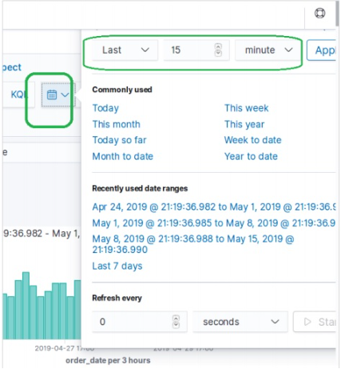

### <font style="color:rgb(51, 51, 51);">按字段过滤</font>
<font style="color:rgb(51, 51, 51);">也可以使用</font>**<font style="color:rgb(51, 51, 51);">Add Filter</font>**<font style="color:rgb(51, 51, 51);">如下所示的选项按字段过滤数据集。在这里，我们添加了一个或多个字段，并在应用过滤器后获得了相应的结果。在我们的示例中，我们选择字段</font>**<font style="color:rgb(51, 51, 51);">day_of_week</font>**<font style="color:rgb(51, 51, 51);">，然后选择该字段的运算符，</font>**<font style="color:rgb(51, 51, 51);">is</font>**<font style="color:rgb(51, 51, 51);">并将值设为</font>**<font style="color:rgb(51, 51, 51);">Sunday</font>**<font style="color:rgb(51, 51, 51);">。</font>

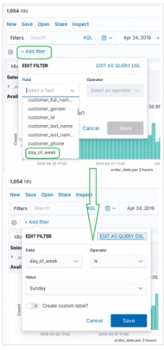

<font style="color:rgb(51, 51, 51);">接下来，我们按上述过滤条件单击“保存”。包含应用的过滤条件的结果集如下所示。</font>

  
 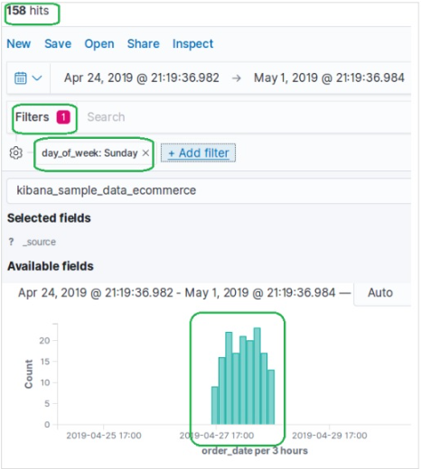

### <font style="color:rgb(51, 51, 51);">Elasticsearch 数据表</font>
<font style="color:rgb(51, 51, 51);">数据表是可视化类型，用于显示组合聚合的原始数据。使用数据表可以提供多种类型的聚合。为了创建数据表，我们应该完成此处详细讨论的步骤。</font>

### <font style="color:rgb(51, 51, 51);">可视化</font>
<font style="color:rgb(51, 51, 51);">在Kibana主屏幕中，我们找到选项名称Visualize，该名称使我们能够从Elasticsearch中存储的索引创建可视化和聚合。下图显示了该选项。</font>

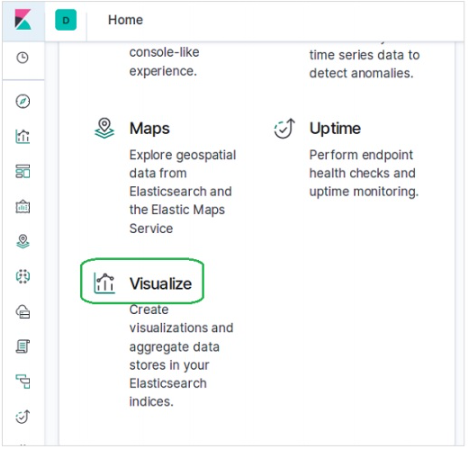

### <font style="color:rgb(51, 51, 51);">选择数据表</font>
<font style="color:rgb(51, 51, 51);">接下来，我们从可用的各种可视化选项中选择“数据表”选项。下图＆miuns;中显示了该选项。</font>


### <font style="color:rgb(51, 51, 51);">选择索引</font>
<font style="color:rgb(51, 51, 51);">然后，我们选择创建数据表可视化所需的索引。这个选择决定了我们将要使用的聚合类型。为此，我们从电子商务数据集中选择下面显示的特定字段。</font>

  
 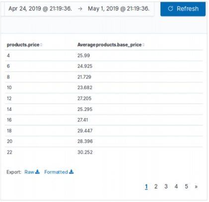

### <font style="color:rgb(51, 51, 51);">Elasticsearch 区域地图</font>
<font style="color:rgb(51, 51, 51);">区域映射会在地理映射上显示指标。在查看以不同强度锚定到不同地理区域的数据时很有用。较深的阴影通常表示较高的值，较浅的阴影通常表示较低的值。</font>

<font style="color:rgb(51, 51, 51);">创建此可视化的步骤详细说明如下-</font>

### <font style="color:rgb(51, 51, 51);">可视化</font>
<font style="color:rgb(51, 51, 51);">在这一步中，我们转到Kibana主屏幕左侧栏中的可视化按钮，然后选择添加新的可视化的选项。</font>

<font style="color:rgb(51, 51, 51);">以下屏幕显示了我们如何选择Region Map选项。</font>


### <font style="color:rgb(51, 51, 51);">选择索引</font>
<font style="color:rgb(51, 51, 51);">下一个屏幕提示我们选择用于创建“区域映射”的度量。在这里，我们选择“平均价格”作为索引，并选择“ country_iso_code”作为存储桶中将用于创建可视化文件的字段。</font>

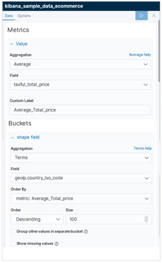

<font style="color:rgb(51, 51, 51);">一旦应用选择，下面的最终结果将显示“区域映射”。请注意标签中提到的颜色阴影及其值。</font>


### <font style="color:rgb(51, 51, 51);">Elasticsearch 饼图</font>
<font style="color:rgb(51, 51, 51);">饼图是最简单和著名的可视化工具之一。它表示数据为一个圆形的切片，每个切片的颜色不同。标签以及百分比数据值可以与圆一起显示。圆也可以采取甜甜圈的形状。</font>

### <font style="color:rgb(51, 51, 51);">可视化</font>
<font style="color:rgb(51, 51, 51);">在Kibana主屏幕中，我们找到选项名称Visualize，该选项使我们能够从Elasticsearch中存储的索引创建可视化和聚合。我们选择添加一个新的可视化并选择饼图作为如下所示的选项。</font>


### <font style="color:rgb(51, 51, 51);">选择索引</font>
<font style="color:rgb(51, 51, 51);">下一个屏幕提示我们选择将用于创建饼图的度量。这里我们选择基本单价作为度量，桶聚集作为直方图。另外，最小间隔选择为20。因此，价格将显示为以20为范围的值块。</font>

  
 

<font style="color:rgb(51, 51, 51);">应用选择后，以下结果显示了饼图。请注意标签中提到的颜色阴影及其值。</font>


### <font style="color:rgb(51, 51, 51);">饼图选项</font>
<font style="color:rgb(51, 51, 51);">转到饼图下方的选项选项卡时，我们可以看到各种配置选项，以更改饼图的外观以及数据显示的排列方式。在以下示例中，饼图显示为甜甜圈，标签显示在顶部。</font>


### <font style="color:rgb(51, 51, 51);">Elasticsearch 面积图和条形图</font>
<font style="color:rgb(51, 51, 51);">面积图是折线图的扩展，其中折线图和轴之间的区域以某些颜色突出显示。条形图表示将数据组织成一系列值，然后相对于轴进行绘制的图表。它可以由水平条或垂直条组成。</font>

<font style="color:rgb(51, 51, 51);">在本章中，我们将看到使用Kibana创建的所有这三种图形。如前几章所述，我们将继续使用电子商务索引中的数据。</font>

### <font style="color:rgb(51, 51, 51);">面积图</font>
<font style="color:rgb(51, 51, 51);">在Kibana主屏幕中，我们找到选项名称Visualize，该选项使我们能够从Elasticsearch中存储的索引创建可视化和聚合。我们选择添加一个新的可视化效果，然后选择“面积图”作为下图所示的选项。</font>

  
 

### <font style="color:rgb(51, 51, 51);">选择索引</font>
<font style="color:rgb(51, 51, 51);">下一个屏幕提示我们选择用于创建面积图的度量。在这里，我们选择总和作为聚合指标的类型。然后，我们选择total_quantity字段作为要用作度量的字段。在X轴上，我们选择了order_date字段，并使用给定的指标将系列划分为5</font>

<font style="color:rgb(51, 51, 51);">在运行上述配置时，我们得到以下区域图作为输出-</font>

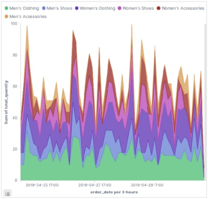

### <font style="color:rgb(51, 51, 51);">水平条形图</font>
<font style="color:rgb(51, 51, 51);">同样，对于水平条形图，我们从Kibana主屏幕中选择新的可视化效果，然后为“水平条形”选择选项。然后我们选择指标，如下图所示。在这里，我们选择“总和”作为归档命名产品数量的汇总。然后，我们选择带有日期直方图的存储桶作为现场订单日期。</font>


### <font style="color:rgb(51, 51, 51);">垂直条形图</font>
<font style="color:rgb(51, 51, 51);">对于垂直条形图，我们从Kibana主屏幕中选择新的可视化效果，然后选择“垂直条形”选项。然后我们选择指标，如下图所示。</font>

<font style="color:rgb(51, 51, 51);">在这里，我们选择“总和”作为名为“产品数量”的字段的汇总。然后，我们选择带有日期直方图的存储桶作为每周间隔的现场订购日期。</font>


<font style="color:rgb(51, 51, 51);">运行上述配置时，将生成如下图所示的图表-</font>


### <font style="color:rgb(51, 51, 51);">Elasticsearch 时间序列</font>
<font style="color:rgb(51, 51, 51);">时间序列表示特定时间序列中的数据序列。例如，从每月的第一天到最后一天的每一天的数据。数据点之间的间隔保持不变。包含时间成分的任何数据集都可以表示为时间序列。</font>

<font style="color:rgb(51, 51, 51);">在本章中，我们将使用示例电子商务数据集并绘制每天的订单数计数以创建时间序列。</font>


### <font style="color:rgb(51, 51, 51);">选择索引</font>
<font style="color:rgb(51, 51, 51);">首先，我们选择将用于创建时间序列的索引模式，数据字段和间隔。从示例电子商务数据集中，我们选择order_date作为字段，并选择1d作为间隔。我们使用</font>**<font style="color:rgb(51, 51, 51);">Panel Options</font>**<font style="color:rgb(51, 51, 51);">选项卡进行这些选择。另外，我们将此选项卡中的其他值保留为默认值，以获取时间序列的默认颜色和格式。</font>

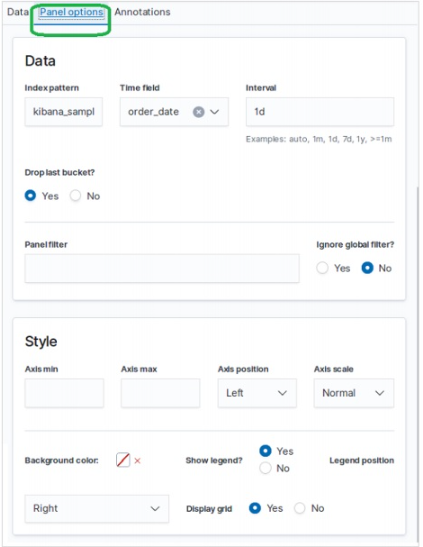

<font style="color:rgb(51, 51, 51);">在</font>**<font style="color:rgb(51, 51, 51);">Data</font>**<font style="color:rgb(51, 51, 51);">选项卡中，我们选择“计数”作为聚合选项，选择“按选项分组”作为所有内容，并为时间序列图贴上标签。</font>


### <font style="color:rgb(51, 51, 51);">结果</font>
<font style="color:rgb(51, 51, 51);">此配置的最终结果如下所示。请注意，我们在</font>**<font style="color:rgb(51, 51, 51);">Month to Date</font>**<font style="color:rgb(51, 51, 51);">此图中使用了一个时间段。不同的时间段将给出不同的结果。</font>

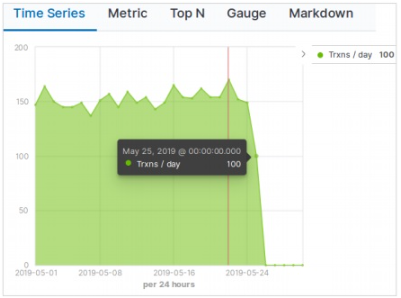

### <font style="color:rgb(51, 51, 51);">Elasticsearch 标签云</font>
<font style="color:rgb(51, 51, 51);">标签云以吸引人的形式表示文本，这些文本主要是关键字和元数据。它们以不同的角度对齐，并以不同的颜色和字体大小表示。它有助于找出数据中最突出的术语。可以由一个或多个因素（例如术语的频率，标签的唯一性或基于附加到特定术语的权重等）确定突出程度。下面我们将介绍创建标签云的步骤。</font>

### <font style="color:rgb(51, 51, 51);">可视化</font>
<font style="color:rgb(51, 51, 51);">在Kibana主屏幕中，我们找到选项名称Visualize，该选项使我们能够从Elasticsearch中存储的索引创建可视化和聚合。我们选择添加一个新的可视化并选择标签云作为如下所示的选项-</font>

  
 

### <font style="color:rgb(51, 51, 51);">选择索引</font>
<font style="color:rgb(51, 51, 51);">下一个屏幕提示我们选择将在创建标签云中使用的索引。在这里，我们选择计数作为聚合索引的类型。然后，我们选择productname字段作为要用作标签的关键字。</font>


<font style="color:rgb(51, 51, 51);">应用选择后，此处显示的结果将显示饼图。请注意标签中提到的颜色阴影及其值。</font>

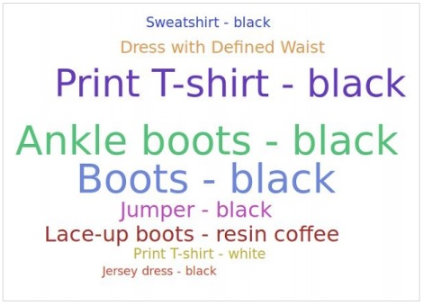

### <font style="color:rgb(51, 51, 51);">标签云选项</font>
<font style="color:rgb(51, 51, 51);">转到</font>**<font style="color:rgb(51, 51, 51);">options</font>**<font style="color:rgb(51, 51, 51);">标签云下的选项卡，我们可以看到各种配置选项，以更改标签云中的外观以及数据显示的排列方式。在下面的示例中，标签云显示，标签沿水平和垂直方向分布。</font>


### <font style="color:rgb(51, 51, 51);">Elasticsearch 热图</font>
<font style="color:rgb(51, 51, 51);">热图是一种可视化类型，其中不同的颜色阴影代表图形中的不同区域。该值可以连续变化，因此颜色的颜色阴影随该值而变化。它们对于表示连续变化的数据和离散数据都非常有用。</font>

<font style="color:rgb(51, 51, 51);">在本章中，我们将使用名为sample_data_flights的数据集来构建热图。在其中，我们考虑了名为航班的出发地国家和目的地国家的变量，并进行了计数。</font>

<font style="color:rgb(51, 51, 51);">在Kibana主屏幕中，我们找到选项名称Visualize，该选项使我们能够从Elasticsearch中存储的索引创建可视化和聚合。我们选择添加新的可视化效果，然后选择“热图”作为＆mimus;下面显示的选项。</font>

  
 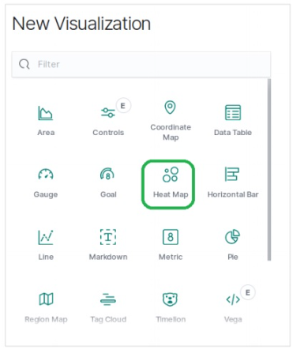

### <font style="color:rgb(51, 51, 51);">选择索引</font>
<font style="color:rgb(51, 51, 51);">下一个屏幕提示我们选择将在创建热图图表时使用的索引。在这里，我们选择计数作为聚合指标的类型。然后，对于Y轴中的存储桶，我们选择“条款”作为OriginCountry字段的汇总。对于X轴，我们选择与DestCountry相同的聚合作为要使用的字段。在这两种情况下，我们将存储桶的大小选择为5。</font>

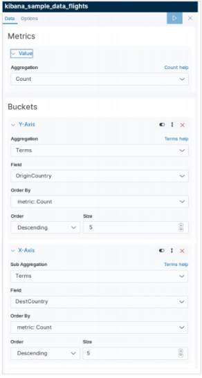

<font style="color:rgb(51, 51, 51);">运行上面显示的配置后，我们得到的热图图表如下所示。</font>

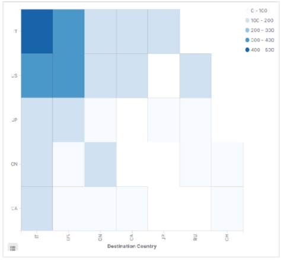

**<font style="color:rgb(51, 51, 51);">Note</font>**<font style="color:rgb(51, 51, 51);"> −必须将日期范围设置为“今年”，以便图形收集一年的数据以生成有效的热图。</font>

### <font style="color:rgb(51, 51, 51);">Elasticsearch 画布</font>
<font style="color:rgb(51, 51, 51);">画布应用程序是Kibana的一部分，它使我们能够创建动态，多页和像素完美的数据显示。它具有创建图表的能力，而不仅仅是图表和指标，这使其具有独特性和吸引力。在本章中，我们将看到画布的各种功能以及如何使用画布工作台。</font>

### <font style="color:rgb(51, 51, 51);">打开画布</font>
<font style="color:rgb(51, 51, 51);">转到Kibana主页，然后选择选项，如下图所示。它会打开您拥有的画布工作台列表。我们为研究选择电子商务收入跟踪。</font>

### <font style="color:rgb(51, 51, 51);">克隆工作台</font>
<font style="color:rgb(51, 51, 51);">我们克隆了</font>**<font style="color:rgb(51, 51, 51);">[eCommerce] Revenue Tracking</font>**<font style="color:rgb(51, 51, 51);">要在我们的研究中使用的工作台。要克隆它，我们突出显示具有此工作台名称的行，然后使用克隆按钮，如下图所示：</font>


<font style="color:rgb(51, 51, 51);">由于上述克隆，我们将获得一个名为的新工作台，</font>**<font style="color:rgb(51, 51, 51);">[eCommerce] Revenue Tracking – Copy</font>**<font style="color:rgb(51, 51, 51);">该工作台在打开时将显示以下信息图表。</font>

<font style="color:rgb(51, 51, 51);">它按类别描述了总销售额和收入以及精美的图片和图表。</font>


### <font style="color:rgb(51, 51, 51);">修改工作台</font>
<font style="color:rgb(51, 51, 51);">我们可以使用右侧选项卡中的可用选项来更改工作台中的样式和图形。在这里，我们旨在通过选择不同的颜色来更改工作台的背景颜色，如下图所示。颜色选择立即生效，我们得到如下所示的结果-</font>


### <font style="color:rgb(51, 51, 51);">Elasticsearch 日志UI</font>
<font style="color:rgb(51, 51, 51);">Kibana还可以帮助可视化来自各种来源的日志数据。日志是基础结构运行状况，性能需求和安全漏洞分析等的重要分析来源。Kibana可以连接到各种日志，例如Web服务器日志，elasticsearch日志和cloudwatch日志等。</font>

### <font style="color:rgb(51, 51, 51);">Logstash日志</font>
<font style="color:rgb(51, 51, 51);">在Kibana中，我们可以连接到logstash日志以进行可视化。首先，我们从Kibana主屏幕中选择“日志”按钮，如下所示-</font>


<font style="color:rgb(51, 51, 51);">然后，我们选择“更改源配置”选项，这为我们带来了选择Logstash作为源的选项。以下屏幕还显示了我们作为日志源的其他类型的选项。</font>

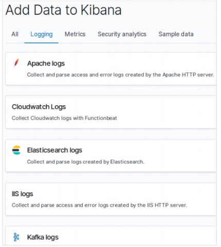


<font style="color:rgb(51, 51, 51);">您可以流传输数据以进行实时日志跟踪，也可以暂停流传输以专注于历史日志数据。在流式传输日志时，最新日志显示在控制台的底部。</font>

