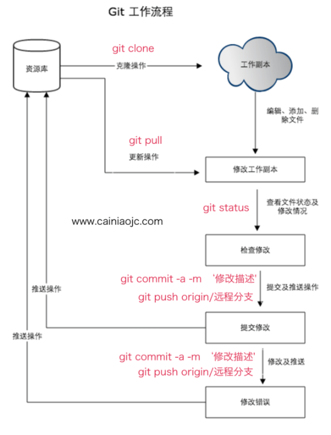
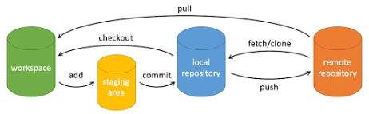
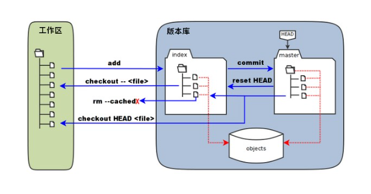

# Git教程
# <font style="color:rgb(51, 51, 51);">Git 安装</font>
<font style="color:rgb(51, 51, 51);">使用 Git 需要安装 Git 客户端。Git 支持 Linux、Unix、Mac和 Windows 等几乎所有平台。</font>

<font style="color:rgb(51, 51, 51);">Git 各平台安装包下载地址为：http://git-scm.com/downloads。</font>

<font style="color:rgb(51, 51, 51);"></font>

## <font style="color:rgb(51, 51, 51);">1. Linux 平台上安装 git</font>
<font style="color:rgb(51, 51, 51);">各 Linux 系统可以使用其安装包管理工具（apt-get、yum 等）进行安装。</font>

<font style="color:rgb(51, 51, 51);">由于Git 的工作需要调用 curl，zlib，openssl，expat，libiconv 等库的代码，需要先安装这些依赖工具。</font>

### <font style="color:rgb(51, 51, 51);">1）Centos/RedHat yum 安装 git</font>
<font style="color:rgb(51, 51, 51);">使用 yum 在 Centos/RedHat 系统的安装命令为：</font>

```bash
$ yum -y install git

# 验证安装是否成功
$ git --version
```

<font style="color:rgb(51, 51, 51);">如果安装过程中，系统缺失依赖包，可以先安装 git 的依赖包：</font>

```bash
$ yum -y install curl-devel expat-devel gettext-devel openssl-devel zlib-devel
```

### <font style="color:rgb(51, 51, 51);">2）Debian/Ubuntu apt-get 安装 git</font>
<font style="color:rgb(51, 51, 51);">使用 apt-get 在 Debian/Ubuntu 系统的安装命令为：</font>

```bash
$ apt-get -y install git

# 验证安装是否成功
$ git --version
```

<font style="color:rgb(51, 51, 51);">如果安装过程中，系统缺失依赖包，可以先安装 git 的依赖包：</font>

```bash
$ apt-get -y install libcurl4-gnutls-dev libexpat1-dev gettext libz-dev libssl-dev
```

### <font style="color:rgb(51, 51, 51);">3）Centos/RedHat 源码安装 git</font>
<font style="color:rgb(51, 51, 51);">我们可以使用源码包安装自己需要的版本，源码包下载地址：https://mirrors.edge.kernel.org/pub/software/scm/git/。</font>

```bash
########### 下载源码 ###########
# 安装 wget
$ yum install -y wget

# 下载源码
$ wget -o /tmp/git-2.21.0.tar.gz https://mirrors.edge.kernel.org/pub/software/scm/git/git-2.21.0.tar.gz

########### 解压编译 ###########
# 安装编译依赖
$ yum install -y curl-devel expat-devel gettext-devel openssl-devel zlib-devel gcc automake autoconf libtool make perl-ExtUtils-MakeMaker

# 解压
$ tar -zxf /tmp/git-2.21.0.tar.gz -C /tmp/

$ cd /tmp/git-2.21.0

# 检验相关依赖，设置安装路径
$ ./configure --prefix=/usr/local/git

# 编译安装
$ make && make install

########### 配置环境变量 ###########
# 配置环境变量
$ vi /etc/profile

# GIT_HOME
GIT_HOME=/usr/local/git
export PATH=$PATH:$GIT_HOME/bin

# 加载环境变量生效
$ source /etc/profile
```

### <font style="color:rgb(51, 51, 51);">4）Debian/Ubuntu 源码安装 git</font>
<font style="color:rgb(51, 51, 51);">我们可以使用源码包安装自己需要的</font>`<font style="color:rgb(199, 37, 78);background-color:rgb(249, 242, 244);">git版本</font>`<font style="color:rgb(51, 51, 51);">，源码包下载地址：https://mirrors.edge.kernel.org/pub/software/scm/git/</font>

```bash
########### 下载源码 ###########
# 安装 wget
$ apt-get install -y wget

# 下载源码
$ wget -o /tmp/git-2.21.0.tar.gz https://mirrors.edge.kernel.org/pub/software/scm/git/git-2.21.0.tar.gz

########### 解压编译 ###########
# 安装编译依赖
$ apt-get -y install libcurl4-gnutls-dev libexpat1-dev gettext libz-dev libssl-dev build-essential

# 解压
$ tar -zxf /tmp/git-2.21.0.tar.gz -C /tmp/

$ cd /tmp/git-2.21.0

# 检验相关依赖，设置安装路径
$ ./configure --prefix=/usr/local/git

# 编译安装
$ make && make install

########### 配置环境变量 ###########
# 配置环境变量
$ vi /etc/profile

# GIT_HOME
GIT_HOME=/usr/local/git
export PATH=$PATH:$GIT_HOME/bin

# 加载环境变量生效
$ source /etc/profile
```

<font style="color:rgb(51, 51, 51);"></font>

## <font style="color:rgb(51, 51, 51);">2. Windows 平台上安装 git</font>
<font style="color:rgb(51, 51, 51);">在 Windows 平台上安装 Git 可以使用 msysGit，msysGit 项目提供了安装包，可以到 GitHub 的页面上下载 exe 安装文件并运行：</font>

<font style="color:rgb(51, 51, 51);">安装包下载地址：https://gitforwindows.org/</font>

<font style="color:rgb(51, 51, 51);">如果官网下载慢，可以用国内的镜像：https://npm.taobao.org/mirrors/git-for-windows/。</font>

<font style="color:rgb(51, 51, 51);">完成安装之后，就可以使用命令行的 git 工具（已经自带了 ssh 客户端）了，另外还有一个图形界面的 Git 项目管理工具。</font>

<font style="color:rgb(51, 51, 51);">在开始菜单里找到"Git"->"Git Bash"，会弹出 Git 命令窗口，你可以在该窗口进行 Git 操作。</font>

<font style="color:rgb(51, 51, 51);"></font>

## <font style="color:rgb(51, 51, 51);">3. Mac 平台上安装 git</font>
### <font style="color:rgb(51, 51, 51);">1）命令行方式</font>
<font style="color:rgb(51, 51, 51);">使用 Homebrew 安装 git 的命令如下：</font>

```bash
$ brew install git
```

### <font style="color:rgb(51, 51, 51);">2）图形化方式</font>
<font style="color:rgb(51, 51, 51);">在 Mac 平台上安装 Git 最容易的当属使用图形化的 Git 安装工具，下载地址为：</font>

<font style="color:rgb(51, 51, 51);">http://sourceforge.net/projects/git-osx-installer/</font>

# <font style="color:rgb(51, 51, 51);">Git 配置</font>
<font style="color:rgb(51, 51, 51);">Git 提供了一个叫做 git config 的工具，专门用来配置或读取相应的工作环境变量。</font>

<font style="color:rgb(51, 51, 51);">这些环境变量，决定了 Git 在各个环节的具体工作方式和行为。这些变量可以存放在以下三个不同的地方：</font>

+ <font style="color:rgb(51, 51, 51);">/etc/gitconfig 文件：全局配置，系统中对所有用户都生效的配置。若使用 git config 时用 --system 选项，读写的就是这个文件。</font>
+ <font style="color:rgb(51, 51, 51);">~/.gitconfig 文件：用户目录下的配置文件只对该用户生效。若使用 git config 时用 --global 选项，读写的就是这个文件。</font>
+ <font style="color:rgb(51, 51, 51);">当前项目的 Git 目录中的配置文件（也就是工作目录中的 .git/config 文件）：这里的配置仅仅针对当前项目有效。每一个级别的配置都会覆盖上层的相同配置，所以 .git/config 里的配置会覆盖 /etc/gitconfig 中的同名变量。</font>

<font style="color:rgb(51, 51, 51);">在 Windows 系统上，Git 会找寻用户主目录下的 .gitconfig 文件。主目录即 $HOME 变量指定的目录，一般都是 C:\Documents and Settings\$USER。</font>

<font style="color:rgb(51, 51, 51);">此外，Git 还会尝试找寻 /etc/gitconfig 文件， Git 装在什么目录，就以此作为根目录来定位。</font>

<font style="color:rgb(51, 51, 51);"></font>

## <font style="color:rgb(51, 51, 51);">1. 用户信息</font>
<font style="color:rgb(51, 51, 51);">配置个人的用户名称和电子邮件地址：</font>

```bash
$ git config --global user.name "cainiaoplus"
$ git config --global user.email test@cainiaoplus.com
```

<font style="color:rgb(51, 51, 51);">如果用了</font><font style="color:rgb(51, 51, 51);"> </font>**<font style="color:rgb(51, 51, 51);">--global</font>**<font style="color:rgb(51, 51, 51);"> </font><font style="color:rgb(51, 51, 51);">选项，那么更改的配置文件就是位于你用户主目录下，以后你所有的项目都会默认使用这里配置的用户信息。</font>

<font style="color:rgb(51, 51, 51);">如果要在某个特定的项目中使用不同的名字或者邮件地址，只要去掉 --global 选项重新配置即可，新的配置保存在当前项目的 .git/config 文件里。</font>

<font style="color:rgb(51, 51, 51);"></font>

## <font style="color:rgb(51, 51, 51);">2. 文本编辑器</font>
<font style="color:rgb(51, 51, 51);">Git默认使用 Vi 或者 Vim文本编辑器。如果你有其他偏好，比如 Emacs 的话，可以重新设置：:</font>

```bash
$ git config --global core.editor emacs
```

<font style="color:rgb(51, 51, 51);"></font>

## <font style="color:rgb(51, 51, 51);">3. 差异分析工具</font>
<font style="color:rgb(51, 51, 51);">还有一个比较常用的是，在解决合并冲突时使用哪种差异分析工具。比如要改用 vimdiff 的话：</font>

```bash
$ git config --global merge.tool vimdiff
```

<font style="color:rgb(51, 51, 51);">Git 可以理解 kdiff3，tkdiff，meld，xxdiff，emerge，vimdiff，gvimdiff，ecmerge，和 opendiff 等合并工具的输出信息。</font>

<font style="color:rgb(51, 51, 51);">当然，你也可以指定使用自己开发的工具，具体怎么做可以参阅第七章。</font>

<font style="color:rgb(51, 51, 51);"></font>

## <font style="color:rgb(51, 51, 51);">4. 查看配置信息</font>
<font style="color:rgb(51, 51, 51);">要检查已有的配置信息，可以使用 git config --list 命令：</font>

```bash
$ git config --list
http.postbuffer=2M
user.name=runoob
user.email=test@runoob.com
```

<font style="color:rgb(51, 51, 51);">有时候会看到重复的变量名，那就说明它们来自不同的配置文件（比如 /etc/gitconfig 和 ~/.gitconfig），Git 实际采用的是最后一个。</font>

<font style="color:rgb(51, 51, 51);">这些配置我们也可以在</font><font style="color:rgb(51, 51, 51);"> </font>**<font style="color:rgb(51, 51, 51);">~/.gitconfig</font>**<font style="color:rgb(51, 51, 51);"> </font><font style="color:rgb(51, 51, 51);">或</font><font style="color:rgb(51, 51, 51);"> </font>**<font style="color:rgb(51, 51, 51);">/etc/gitconfig</font>**<font style="color:rgb(51, 51, 51);"> </font><font style="color:rgb(51, 51, 51);">看到，如下所示：</font>

```bash
vim ~/.gitconfig
```

<font style="color:rgb(51, 51, 51);">显示内容如下所示：</font>

```bash
[http]
    postBuffer = 2M
[user]
    name = cainiaoplus
    email = username@cainiaoplus.com
```

<font style="color:rgb(51, 51, 51);">也可以直接查看某个环境变量的设定，只要把特定的名字跟在后面即可，像这样：</font>

```bash
$ git config user.name
cainiaoplus
```

# <font style="color:rgb(51, 51, 51);">Git 工作流程</font>
<font style="color:rgb(51, 51, 51);">团队协作的开发过程中，大家需要遵循一个合理、清晰的 Git使用流程，否则随着项目资源的不断提交，项目很快就会变得难以协调和维护。</font>

<font style="color:rgb(51, 51, 51);">以下为我们通常使用 Git 的工作流程。</font>

<font style="color:rgb(51, 51, 51);"></font>

## <font style="color:rgb(51, 51, 51);">1. Git 基本工作流程</font>
1. <font style="color:rgb(51, 51, 51);">克隆远程资源到本地目录，作为工作目录。</font>
2. <font style="color:rgb(51, 51, 51);">在本地的克隆资源上添加、修改或删除文件。</font>
3. <font style="color:rgb(51, 51, 51);">如果远程资源有修改，需要同步远程的内容，更新本地的文件。</font>
4. <font style="color:rgb(51, 51, 51);">提交修改前，查看修改情况。</font>
5. <font style="color:rgb(51, 51, 51);">添加修改到缓冲区，提交修改到本地版本库。</font>
6. <font style="color:rgb(51, 51, 51);">提交修改后，将本地版本库推送到远程 Git 服务器。</font>

<font style="color:rgb(51, 51, 51);"></font>

## <font style="color:rgb(51, 51, 51);">2. Git 工作流程图</font>


## <font style="color:rgb(51, 51, 51);">3. Git 常用命令</font>
+ [<font style="color:rgb(51, 51, 51);">git clone</font>](https://www.cainiaoplus.com/git/git-clone.html)<font style="color:rgb(51, 51, 51);">：克隆远程资源。</font>
+ [<font style="color:rgb(51, 51, 51);">git pull</font>](https://www.cainiaoplus.com/git/git-pull.html)<font style="color:rgb(51, 51, 51);">：拉取远程文件到本地。</font>
+ [<font style="color:rgb(51, 51, 51);">git status</font>](https://www.cainiaoplus.com/git/git-status.html)<font style="color:rgb(51, 51, 51);">：查看修改情况。</font>
+ [<font style="color:rgb(51, 51, 51);">git add</font>](https://www.cainiaoplus.com/git/git-add.html)<font style="color:rgb(51, 51, 51);">：添加修改到缓冲区。</font>
+ [<font style="color:rgb(51, 51, 51);">git commit</font>](https://www.cainiaoplus.com/git/git-commit.html)<font style="color:rgb(51, 51, 51);">：提交修改到工作区。</font>
+ [<font style="color:rgb(51, 51, 51);">git push</font>](https://www.cainiaoplus.com/git/git-push.html)<font style="color:rgb(51, 51, 51);">：将本地的修改推送到远程 Git 服务器。</font>
+ [<font style="color:rgb(51, 51, 51);">git branch</font>](https://www.cainiaoplus.com/git/git-branch.html)<font style="color:rgb(51, 51, 51);">：查看当前使用的分支。</font>
+ [<font style="color:rgb(51, 51, 51);">git checkout</font>](https://www.cainiaoplus.com/git/git-branch.html)<font style="color:rgb(51, 51, 51);">：切换当前使用的分支。</font>

# <font style="color:rgb(51, 51, 51);">Git init clone 创建仓库</font>
<font style="color:rgb(51, 51, 51);">我们使用 Git 进行项目版本的管理，首先需要创建一个 Git 仓库。</font>

<font style="color:rgb(51, 51, 51);">有两种方式可以创建版本库：使用 git init 初始化一个新仓库以及使用git clone 克隆一个已存在的仓库。</font>

<font style="color:rgb(51, 51, 51);"></font>

## <font style="color:rgb(51, 51, 51);">1. git init 初始化仓库</font>
<font style="color:rgb(51, 51, 51);">我们可以使用一个已经存在的目录作为 Git 仓库。Git 使用</font><font style="color:rgb(51, 51, 51);"> </font>**<font style="color:rgb(51, 51, 51);">git init</font>**<font style="color:rgb(51, 51, 51);"> </font><font style="color:rgb(51, 51, 51);">命令来初始化一个 Git 仓库。</font>

```bash
git init
```

<font style="color:rgb(51, 51, 51);">在执行完成</font><font style="color:rgb(51, 51, 51);"> </font>**<font style="color:rgb(51, 51, 51);">git init</font>**<font style="color:rgb(51, 51, 51);"> </font><font style="color:rgb(51, 51, 51);">命令后，Git 仓库会生成一个 .git 目录，该目录包含了资源的所有元数据。</font>

<font style="color:rgb(51, 51, 51);">也可以使用指定的目录作为 Git 仓库。</font>

```bash
git init myproject
```

<font style="color:rgb(51, 51, 51);">初始化后，会在 myproject 目录下会出现一个名为 .git 的目录，所有 Git 需要的数据和资源都存放在这个目录中。</font>

<font style="color:rgb(51, 51, 51);">如果当前目录下有几个文件想要纳入版本控制，需要先用 git add 命令告诉 Git 开始对这些文件进行跟踪，然后提交：</font>

```bash
$ git add *.c
$ git add README
$ git commit -m "初始化项目版本"
```

<font style="color:rgb(51, 51, 51);">以上命令将目录下以 .c 结尾及 README 文件提交到仓库中。</font>

<font style="color:rgb(51, 51, 51);"></font>

## <font style="color:rgb(51, 51, 51);">2. git clone 克隆仓库</font>
<font style="color:rgb(51, 51, 51);">我们使用</font><font style="color:rgb(51, 51, 51);"> </font>**<font style="color:rgb(51, 51, 51);">git clone</font>**<font style="color:rgb(51, 51, 51);"> </font><font style="color:rgb(51, 51, 51);">从现有 Git 仓库中复制项目。</font>

<font style="color:rgb(51, 51, 51);">克隆仓库的命令格式为：</font>

git clone <repo>

<font style="color:rgb(51, 51, 51);">如果我们需要克隆到指定的目录，可以使用以下命令格式：</font>

```bash
git clone <repo> <directory>
```

**<font style="color:rgb(51, 51, 51);">参数说明：</font>**

+ **<font style="color:rgb(51, 51, 51);">repo:</font>**<font style="color:rgb(51, 51, 51);">Git 仓库。</font>
+ **<font style="color:rgb(51, 51, 51);">directory:</font>**<font style="color:rgb(51, 51, 51);">本地目录。</font>

<font style="color:rgb(51, 51, 51);">比如，要克隆 Ruby 语言的 Git 代码仓库 Grit，可以用下面的命令：</font>

```bash
$ git clone git://github.com/schacon/grit.git
```

<font style="color:rgb(51, 51, 51);">执行该命令后，会在当前目录下创建一个名为grit的目录，其中包含一个 .git 的目录，用于保存下载下来的所有版本记录。</font>

<font style="color:rgb(51, 51, 51);">如果要自己定义要新建的项目目录名称，可以在上面的命令末尾指定新的名字：</font>

```bash
$ git clone git://github.com/schacon/grit.git mygrit
```

<font style="color:rgb(51, 51, 51);"></font>

## <font style="color:rgb(51, 51, 51);">3. Git 仓库的配置</font>
<font style="color:rgb(51, 51, 51);">git 的设置使用 git config 命令。</font>

<font style="color:rgb(51, 51, 51);">显示当前的 git 配置信息：</font>

```bash
$ git config --list
credential.helper=osxkeychain
core.repositoryformatversion=0
core.filemode=true
core.bare=false
core.logallrefupdates=true
core.ignorecase=true
core.precomposeunicode=true
```

<font style="color:rgb(51, 51, 51);">编辑 git 配置文件:</font>$ git config -e    # 针对当前仓库 

<font style="color:rgb(51, 51, 51);">或者：</font>

$ git config -e --global   # 针对系统上所有仓库

<font style="color:rgb(51, 51, 51);">设置提交代码时的用户信息：</font>

```bash
$ git config --global user.name "cainiaoplus"
$ git config --global user.email test@cainiaoplus.com
```

<font style="color:rgb(51, 51, 51);">如果去掉 </font>**<font style="color:rgb(51, 51, 51);">--global</font>**<font style="color:rgb(51, 51, 51);"> 参数只对当前仓库有效。</font>

# <font style="color:rgb(51, 51, 51);">Git 基本操作</font>
<font style="color:rgb(51, 51, 51);">Git 的主要工作就是创建和保存项目的快照及以及对快照进行对比。</font>

<font style="color:rgb(51, 51, 51);">Git 常用的是以下 6 个命令：</font>**<font style="color:rgb(51, 51, 51);">git clone</font>**<font style="color:rgb(51, 51, 51);">、</font>**<font style="color:rgb(51, 51, 51);">git add</font>**<font style="color:rgb(51, 51, 51);"> 、</font>**<font style="color:rgb(51, 51, 51);">git commit</font>**<font style="color:rgb(51, 51, 51);">、</font>**<font style="color:rgb(51, 51, 51);">git pull</font>**<font style="color:rgb(51, 51, 51);">、</font>**<font style="color:rgb(51, 51, 51);">git push</font>**<font style="color:rgb(51, 51, 51);">、</font>**<font style="color:rgb(51, 51, 51);">git checkout</font>**<font style="color:rgb(51, 51, 51);">。</font>



**<font style="color:rgb(51, 51, 51);">说明：</font>**

+ <font style="color:rgb(51, 51, 51);">workspace：工作区</font>
+ <font style="color:rgb(51, 51, 51);">staging area：暂存区/缓存区</font>
+ <font style="color:rgb(51, 51, 51);">local repository：版本库或本地仓库</font>
+ <font style="color:rgb(51, 51, 51);">remote repository：远程仓库</font>

<font style="color:rgb(51, 51, 51);">一个简单的操作步骤：</font>

```bash
$ git init    
$ git add .    
$ git commit
```

+ <font style="color:rgb(51, 51, 51);">git init - 初始化仓库。</font>
+ <font style="color:rgb(51, 51, 51);">git add . - 添加文件到暂存区。</font>
+ <font style="color:rgb(51, 51, 51);">git commit - 将暂存区内容添加到仓库中。</font>

<font style="color:rgb(51, 51, 51);"></font>

## <font style="color:rgb(51, 51, 51);">1. 创建仓库</font>
<font style="color:rgb(51, 51, 51);">使用 git 对项目进行版本管理，首先要创建 git 仓库。</font>

<font style="color:rgb(51, 51, 51);">下表列出了 git 创建仓库的命令：</font>

| <font style="color:rgb(254, 254, 254);">命令</font> | <font style="color:rgb(254, 254, 254);">说明</font> |
| --- | --- |
| [<font style="color:rgb(51, 51, 51);">git init</font>](https://www.cainiaoplus.com/git/git-init.html) | <font style="color:rgb(51, 51, 51);">初始化仓库</font> |
| [<font style="color:rgb(51, 51, 51);">git clone</font>](https://www.cainiaoplus.com/git/git-clone.html) | <font style="color:rgb(51, 51, 51);">拷贝一份远程仓库，也就是下载一个项目。</font> |


<font style="color:rgb(51, 51, 51);"></font>

## <font style="color:rgb(51, 51, 51);">2. 修改提交</font>
<font style="color:rgb(51, 51, 51);">Git 的工作就是创建和保存你的项目的快照及与之后的快照进行对比。</font>

<font style="color:rgb(51, 51, 51);">下表列出了有关创建与提交你的项目的快照的命令：</font>

| <font style="color:rgb(254, 254, 254);">命令</font> | <font style="color:rgb(254, 254, 254);">说明</font> |
| --- | --- |
| [<font style="color:rgb(51, 51, 51);">git add</font>](https://www.cainiaoplus.com/git/git-add.html) | <font style="color:rgb(51, 51, 51);">添加文件到仓库</font> |
| [<font style="color:rgb(51, 51, 51);">git status</font>](https://www.cainiaoplus.com/git/git-status.html) | <font style="color:rgb(51, 51, 51);">查看仓库当前的状态，显示有变更的文件。</font> |
| [<font style="color:rgb(51, 51, 51);">git diff</font>](https://www.cainiaoplus.com/git/git-diff.html) | <font style="color:rgb(51, 51, 51);">比较文件的不同，即暂存区和工作区的差异。</font> |
| [<font style="color:rgb(51, 51, 51);">git commit</font>](https://www.cainiaoplus.com/git/git-commit.html) | <font style="color:rgb(51, 51, 51);">提交暂存区到本地仓库。</font> |
| [<font style="color:rgb(51, 51, 51);">git reset</font>](https://www.cainiaoplus.com/git/git-reset.html) | <font style="color:rgb(51, 51, 51);">回退版本。</font> |
| [<font style="color:rgb(51, 51, 51);">git rm</font>](https://www.cainiaoplus.com/git/git-rm.html) | <font style="color:rgb(51, 51, 51);">删除工作区文件。</font> |
| [<font style="color:rgb(51, 51, 51);">git mv</font>](https://www.cainiaoplus.com/git/git-mv.html) | <font style="color:rgb(51, 51, 51);">移动或重命名工作区文件。</font> |


<font style="color:rgb(51, 51, 51);"></font>

## <font style="color:rgb(51, 51, 51);">3. 远程操作</font>
| <font style="color:rgb(254, 254, 254);">命令</font> | <font style="color:rgb(254, 254, 254);">说明</font> |
| --- | --- |
| [<font style="color:rgb(51, 51, 51);">git remote</font>](https://www.cainiaoplus.com/git/git-remote.html) | <font style="color:rgb(51, 51, 51);">远程仓库操作</font> |
| [<font style="color:rgb(51, 51, 51);">git fetch</font>](https://www.cainiaoplus.com/git/git-fetch.html) | <font style="color:rgb(51, 51, 51);">从远程获取代码库</font> |
| [<font style="color:rgb(51, 51, 51);">git pull</font>](https://www.cainiaoplus.com/git/git-pull.html) | <font style="color:rgb(51, 51, 51);">下载远程代码并合并</font> |
| [<font style="color:rgb(51, 51, 51);">git push</font>](https://www.cainiaoplus.com/git/git-push.html) | <font style="color:rgb(51, 51, 51);">上传远程代码并合并</font> |


<font style="color:rgb(51, 51, 51);"></font>

## <font style="color:rgb(51, 51, 51);">4. 查看日志</font>
| <font style="color:rgb(254, 254, 254);">命令</font> | <font style="color:rgb(254, 254, 254);">说明</font> |
| --- | --- |
| [<font style="color:rgb(51, 51, 51);">git log</font>](https://www.cainiaoplus.com/git/git-commit-history.html) | <font style="color:rgb(51, 51, 51);">查看历史提交记录</font> |
| [<font style="color:rgb(51, 51, 51);">git blame <file></font>](https://www.cainiaoplus.com/git/git-commit-history.html) | <font style="color:rgb(51, 51, 51);">以列表形式查看指定文件的历史修改记录</font> |


# <font style="color:rgb(51, 51, 51);">Git branch 分支管理</font>
<font style="color:rgb(51, 51, 51);">每一种版本控制系统都以某种形式支持分支，使用分支就可以从开发主线上分离开来，在不影响主线的同时继续工作。 Git 的分支管理包括：查看分支、创建分支、切换分支、删除分支以及合并分支等命令。</font>

<font style="color:rgb(51, 51, 51);"></font>

## <font style="color:rgb(51, 51, 51);">1. 查看分支</font>
<font style="color:rgb(51, 51, 51);">查看分支的命令：</font>

git branch

<font style="color:rgb(51, 51, 51);">git branch 会列出本地的所有分支。</font>

<font style="color:rgb(51, 51, 51);">例如：</font>

```bash
$ git branch

develop
* master
```

<font style="color:rgb(51, 51, 51);">以上结果显示本地共有两个分支，分别为 master 和 develop 分支，其中前面有 ”*“ 的 master 分支为当前分支。</font>

<font style="color:rgb(51, 51, 51);">当你执行 git init 初始化仓库的时候，默认情况下 Git 就会为你创建 master 分支。</font>

<font style="color:rgb(51, 51, 51);"></font>

## <font style="color:rgb(51, 51, 51);">2. 创建分支</font>
<font style="color:rgb(51, 51, 51);">创建分支的命令：</font>

```bash
git branch (branchname)
```

<font style="color:rgb(51, 51, 51);">例如：</font>

```bash
$ git branch hotfix
```

<font style="color:rgb(51, 51, 51);">以上命令会创建一个 hotfix 分支。</font>

<font style="color:rgb(51, 51, 51);">使用创建分支命令后，当前分支不会自动切换到新创建的分支。</font>

<font style="color:rgb(51, 51, 51);"></font>

## <font style="color:rgb(51, 51, 51);">3. 切换分支</font>
```bash
git checkout (branchname)
```

<font style="color:rgb(51, 51, 51);">例如：</font>

```bash
$ git checkout hotfix

Switched to branch 'hotfix'
```

<font style="color:rgb(51, 51, 51);">运行命令后，当前分支切换到了 hotfix 分支。</font>

<font style="color:rgb(51, 51, 51);"></font>

## <font style="color:rgb(51, 51, 51);">4. 删除分支</font>
<font style="color:rgb(51, 51, 51);">删除分支命令：</font>

git branch -d (branchname)

<font style="color:rgb(51, 51, 51);">例如：我们要删除 hotfix 分支：</font>

```bash
$ git branch
  develop
  hotfix
* master

$ git branch -d hotfix
Deleted branch hotfix (was 3a1ae0e).

$ git branch
  develop
* master
```

<font style="color:rgb(51, 51, 51);">hotfix 分支已经被删除。</font>

<font style="color:rgb(51, 51, 51);"></font>

## <font style="color:rgb(51, 51, 51);">5. 合并分支</font>
<font style="color:rgb(51, 51, 51);">某分支修改完成后，一般会将它合并回到主分支。</font>

<font style="color:rgb(51, 51, 51);">使用以下命令将其它分支合并到当前分支中：</font>

```bash
git merge (branchname)
```

<font style="color:rgb(51, 51, 51);">我们在 hotfix 分支上创建一个了文件 test.txt，并将文件提交。</font>

```bash
# 查看所有分支，当前分支为 hotfix
$ git branch
  master
* hotfix

$ ls
test.txt

# 当前分支切换到 master 分支
$ git checkout master
Switched to branch 'master'

# 合并分支
$ git merge hotfix
Merge made by the 'recursive' strategy.
 test.txt | 1 +
 1 file changed, 1 insertion(+)
 create mode 100644 test.txt

# 合并后，master 分支下多了 test.txt 文件。
$ ls
test.txt
```

<font style="color:rgb(51, 51, 51);">合并完后就可以删除 hotfix 分支:</font>

```bash
$ git branch -d hotfix
Deleted branch hotfix (was c1501a2).
```

# <font style="color:rgb(51, 51, 51);">Git log 查看提交历史</font>
<font style="color:rgb(51, 51, 51);">查看 Git 提交历史常用两个命令：</font>

+ **<font style="color:rgb(51, 51, 51);">git log</font>**<font style="color:rgb(51, 51, 51);"> </font><font style="color:rgb(51, 51, 51);">- 查看总体历史提交记录。</font>
+ **<font style="color:rgb(51, 51, 51);">git blame <file></font>**<font style="color:rgb(51, 51, 51);"> </font><font style="color:rgb(51, 51, 51);">- 查看指定文件的历史修改记录。</font>

<font style="color:rgb(51, 51, 51);"></font>

## <font style="color:rgb(51, 51, 51);">1. git log 查看提交记录</font>
<font style="color:rgb(51, 51, 51);">在使用 Git 提交了若干更新之后，又或者克隆了某个项目，想回顾下提交历史，我们可以使用 git log 命令查看。</font>

<font style="color:rgb(51, 51, 51);">针对我们前一章节的操作，使用 git log 命令列出历史提交记录如下：</font>

```bash
$ git log
commit d5e9fc2c811e0ca2b2d28506ef7dc14171a207d9 (HEAD -> master)
Merge: c68142b 7774248
Author: cainiaoplus <test@cainiaoplus.com>
Date:   Fri May 3 15:55:58 2019 +0800

    Merge branch 'change_site'

commit c68142b562c260c3071754623b08e2657b4c6d5b
Author: cainiaoplus <test@cainiaoplus.com>
Date:   Fri May 3 15:52:12 2019 +0800

    修改代码

commit 777424832e714cf65d3be79b50a4717aea51ab69 (change_site)
Author: cainiaoplus <test@cainiaoplus.com>
Date:   Fri May 3 15:49:26 2019 +0800

    changed the cainiaoplus.php

commit c1501a244676ff55e7cccac1ecac0e18cbf6cb00
Author: cainiaoplus <test@cainiaoplus.com>
Date:   Fri May 3 15:35:32 2019 +0800
```

<font style="color:rgb(51, 51, 51);">我们可以用 --oneline 选项来查看历史记录的简洁的版本。</font>

```bash
$ git log --oneline
d5e9fc2 (HEAD -> master) Merge branch 'change_site'
c68142b 修改代码
7774248 (change_site) changed the cainiaoplus.php
c1501a2 removed test.txt、add cainiaoplus.php
3e92c19 add test.txt
3b58100 第一次版本提交
```

<font style="color:rgb(51, 51, 51);">这告诉我们的是，此项目的开发历史。</font>

<font style="color:rgb(51, 51, 51);">我们还可以用 --graph 选项，查看历史中什么时候出现了分支、合并。以下为相同的命令，开启了拓扑图选项：</font>

```bash
*   d5e9fc2 (HEAD -> master) Merge branch 'change_site'
|\  
| * 7774248 (change_site) changed the cainiaoplus.php
* | c68142b 修改代码
|/  
* c1501a2 removed test.txt、add cainiaoplus.php
* 3e92c19 add test.txt
* 3b58100 第一次版本提交
```

<font style="color:rgb(51, 51, 51);">现在我们可以更清楚明了地看到何时工作分叉、又何时归并。</font>

<font style="color:rgb(51, 51, 51);">你也可以用</font><font style="color:rgb(51, 51, 51);"> </font>**<font style="color:rgb(51, 51, 51);">--reverse</font>**<font style="color:rgb(51, 51, 51);"> </font><font style="color:rgb(51, 51, 51);">参数来逆向显示所有日志。</font>

```bash
$ git log --reverse --oneline
3b58100 第一次版本提交
3e92c19 add test.txt
c1501a2 removed test.txt、add cainiaoplus.php
7774248 (change_site) changed the cainiaoplus.php
c68142b 修改代码
d5e9fc2 (HEAD -> master) Merge branch 'change_site'
```

<font style="color:rgb(51, 51, 51);">如果只想查找指定用户的提交日志可以使用命令：git log --author , 例如，比方说我们要找 Git 源码中 Linus 提交的部分：</font>

```bash
$ git log --author=Linus --oneline -5
81b50f3 Move 'builtin-*' into a 'builtin/' subdirectory
3bb7256 make "index-pack" a built-in
377d027 make "git pack-redundant" a built-in
b532581 make "git unpack-file" a built-in
112dd51 make "mktag" a built-in
```

<font style="color:rgb(51, 51, 51);">如果你要指定日期，可以执行几个选项：--since 和 --before，但是你也可以用 --until 和 --after。</font>

<font style="color:rgb(51, 51, 51);">例如，如果我要看 Git 项目中三周前且在四月十八日之后的所有提交，我可以执行这个（我还用了 --no-merges 选项以隐藏合并提交）：</font>

```bash
$ git log --oneline --before={3.weeks.ago} --after={2010-04-18} --no-merges
5469e2d Git 1.7.1-rc2
d43427d Documentation/remote-helpers: Fix typos and improve language
272a36b Fixup: Second argument may be any arbitrary string
b6c8d2d Documentation/remote-helpers: Add invocation section
5ce4f4e Documentation/urls: Rewrite to accomodate transport::address
00b84e9 Documentation/remote-helpers: Rewrite description
03aa87e Documentation: Describe other situations where -z affects git diff
77bc694 rebase-interactive: silence warning when no commits rewritten
636db2c t3301: add tests to use --format="%N"
```

<font style="color:rgb(51, 51, 51);">更多 git log 命令可查看：http://git-scm.com/docs/git-log。</font>

<font style="color:rgb(51, 51, 51);"></font>

## <font style="color:rgb(51, 51, 51);">2. git blame 查看提交记录</font>
<font style="color:rgb(51, 51, 51);">如果要查看指定文件的修改记录可以使用 git blame 命令，格式如下：</font>git blame <file>

<font style="color:rgb(51, 51, 51);">git blame 命令是以列表形式显示修改记录，如下范例：</font>

```bash
$ git blame README 
^d2097aa (zhangsan 2020-08-25 14:59:25 +0800 1) # 张三测试内容
db9315b0 (lisi    2020-08-25 16:00:23 +0800 2) # 李四测试内容
```

# <font style="color:rgb(51, 51, 51);">Git tag 标签管理</font>
<font style="color:rgb(51, 51, 51);">当开发工作达到一个重要的阶段，我们希望永远记住那个特别的提交快照，就可以使用 git tag 给它打上标签。</font>

<font style="color:rgb(51, 51, 51);"></font>

## <font style="color:rgb(51, 51, 51);">1. Git 添加标签</font>
<font style="color:rgb(51, 51, 51);">添加标签的语法：</font>

```bash
git tag -a (tagname)
```

<font style="color:rgb(51, 51, 51);">例如：</font>

```bash
$ git tag -a v1.0
```

<font style="color:rgb(51, 51, 51);">当你执行 git tag -a 命令时，Git 会打开你的编辑器，让你写一句标签注解，就像你给提交写注解一样。</font>

<font style="color:rgb(51, 51, 51);">现在，注意当我们执行 git log --decorate 时，我们可以看到我们的标签了：</font>

```bash
commit a097a65e501fa4c15297c9663c24affbada4eb2a (HEAD -> master, tag: v1.0)
Author: cainiaoplus 
Date:   Sun May 9 15:29:40 2021 +0800

    this is v1.0 tag.
```

<font style="color:rgb(51, 51, 51);">如果我们忘了给某个提交打标签，又将它发布了，我们可以给它追加标签。</font>

<font style="color:rgb(51, 51, 51);">例如，假设我们发布了提交 85fc7e7，但是那时候忘了给它打标签。</font>

<font style="color:rgb(51, 51, 51);">我们现在也可以补打标签：</font>

```bash
$ git tag -a v0.9 85fc7e7
$ git log --oneline --decorate --graph
*   d5e9fc2 (HEAD -> master) Merge branch 'hotfix'
|\  
| * 7774248 (hotfix) changed the test.txt
* | c68142b 修改代码
|/  
* 3e92c19 add test.txt
* 3b58100 (tag: v0.9) 第一次版本提交
```

<font style="color:rgb(51, 51, 51);"></font>

## <font style="color:rgb(51, 51, 51);">2. Git 查看标签</font>
<font style="color:rgb(51, 51, 51);">如果我们要查看所有标签可以使用以下命令：</font>

```bash
git tag
```

<font style="color:rgb(51, 51, 51);">例如：</font>

```bash
$ git tag

v0.9
v1.0
```

<font style="color:rgb(51, 51, 51);"></font>

## <font style="color:rgb(51, 51, 51);">3. Git 指定标签信息</font>
```bash
git tag -a (tagname) -m (message)
```

<font style="color:rgb(51, 51, 51);">例如：</font>

```bash
git tag -a v1.0 -m "cainiaoplus.com tag"
```

<font style="color:rgb(51, 51, 51);"></font>

## <font style="color:rgb(51, 51, 51);">4. Git 删除标签</font>
```bash
git tag -d (tagname)
```

<font style="color:rgb(51, 51, 51);">例如：</font>

```bash
$git tag -d v1.0

Deleted tag 'v1.0' (was 403cd05)
```

# <font style="color:rgb(51, 51, 51);">Git 工作区、暂存区和版本库</font>
<font style="color:rgb(51, 51, 51);"></font>

## <font style="color:rgb(51, 51, 51);">1. 什么是工作区、暂存区和版本库</font>
+ **<font style="color:rgb(51, 51, 51);">Working Tree 工作区：</font>**<font style="color:rgb(51, 51, 51);">当前的工作区域，也就是我们项目所在的目录。</font>
+ **<font style="color:rgb(51, 51, 51);">Index/Stage 暂存区：</font>**<font style="color:rgb(51, 51, 51);">一般存放在 .git 目录下的 index 文件（.git/index）中，所以我们把暂存区有时也叫作索引（index）。当我们执行 git add 后，会将这些改变的文件內容加入 index 中。</font>
+ **<font style="color:rgb(51, 51, 51);">Repository 版本库：</font>**<font style="color:rgb(51, 51, 51);">工作区有一个隐藏目录 .git，用来存放 Git 的版本库，也就是使用 git commit 提交后的结果</font>

<font style="color:rgb(51, 51, 51);"></font>

## <font style="color:rgb(51, 51, 51);">2. 工作区、暂存区和版本库的关系</font>
<font style="color:rgb(51, 51, 51);">下面这个图展示了工作区、版本库中的暂存区和版本库之间的关系：</font>



+ <font style="color:rgb(51, 51, 51);">图中左侧为工作区，右侧为版本库。在版本库中标记为 "index" 的区域是暂存区（stage/index），标记为 "master" 的是 master 分支所代表的目录树。</font>
+ <font style="color:rgb(51, 51, 51);">图中我们可以看出此时 "HEAD" 实际是指向 master 分支的一个"游标"。所以图示的命令中出现 HEAD 的地方可以用 master 来替换。</font>
+ <font style="color:rgb(51, 51, 51);">图中的 objects 标识的区域为 Git 的对象库，实际位于 ".git/objects" 目录下，里面包含了创建的各种对象及内容。</font>
+ <font style="color:rgb(51, 51, 51);">当对工作区修改（或新增）的文件执行 git add 命令时，暂存区的目录树被更新，同时工作区修改（或新增）的文件内容被写入到对象库中的一个新的对象中，而该对象的ID被记录在暂存区的文件索引中。</font>
+ <font style="color:rgb(51, 51, 51);">当执行提交操作（git commit）时，暂存区的目录树写到版本库（对象库）中，master 分支会做相应的更新。即 master 指向的目录树就是提交时暂存区的目录树。</font>
+ <font style="color:rgb(51, 51, 51);">当执行 git reset HEAD 命令时，暂存区的目录树会被重写，被 master 分支指向的目录树所替换，但是工作区不受影响。</font>
+ <font style="color:rgb(51, 51, 51);">当执行 git rm --cached <file> 命令时，会直接从暂存区删除文件，工作区则不做出改变。</font>
+ <font style="color:rgb(51, 51, 51);">当执行 git checkout . 或者 git checkout -- <file> 命令时，会用暂存区全部或指定的文件替换工作区的文件。这个操作很危险，会清除工作区中未添加到暂存区的改动。</font>
+ <font style="color:rgb(51, 51, 51);">当执行 git checkout HEAD . 或者 git checkout HEAD <file> 命令时，会用 HEAD 指向的 master 分支中的全部或者部分文件替换暂存区和以及工作区中的文件。这个命令也是极具危险性的，因为不但会清除工作区中未提交的改动，也会清除暂存区中未提交的改动。</font>

# <font style="color:rgb(51, 51, 51);">Git 服务器搭建</font>
<font style="color:rgb(51, 51, 51);">由于 Git 是一个分布式版本控制系统，所以任何一台安装了 Git 的机器都可以作为远程仓库，提供给项目协助者公共使用。</font>

<font style="color:rgb(51, 51, 51);">我们将以 Centos 服务器为例搭建 Git 远程仓库。</font>

<font style="color:rgb(51, 51, 51);"></font>

## <font style="color:rgb(51, 51, 51);">1、安装Git</font>
<font style="color:rgb(51, 51, 51);">首先需要在 Centos 服务器上安装 Git。</font>

```bash
$ yum install curl-devel expat-devel gettext-devel openssl-devel zlib-devel perl-devel
$ yum install git
```

<font style="color:rgb(51, 51, 51);"></font>

## <font style="color:rgb(51, 51, 51);">2、创建 Git 组和用户</font>
<font style="color:rgb(51, 51, 51);">接下来我们创建一个 git 用户组和用户，用来运行 git 服务。</font>

```bash
$ groupadd git
$ useradd git -g git
```

<font style="color:rgb(51, 51, 51);"></font>

## <font style="color:rgb(51, 51, 51);">3、创建证书登录</font>
<font style="color:rgb(51, 51, 51);">收集所有需要登录的用户的公钥，公钥位于id_rsa.pub文件中，把我们的公钥导入到/home/git/.ssh/authorized_keys文件里，一行一个。</font>

<font style="color:rgb(51, 51, 51);">如果没有该文件创建它：</font>

```bash
$ cd /home/git/
$ mkdir .ssh
$ chmod 755 .ssh
$ touch .ssh/authorized_keys
$ chmod 644 .ssh/authorized_keys
```

<font style="color:rgb(51, 51, 51);"></font>

## <font style="color:rgb(51, 51, 51);">4、初始化 Git 仓库</font>
<font style="color:rgb(51, 51, 51);">首先我们选定一个目录作为Git仓库，假定是/home/gitrepo/cainiaoplus.git，在/home/gitrepo目录下输入命令：</font>

```bash
$ cd /home
$ mkdir gitrepo
$ chown git:git gitrepo/
$ cd gitrepo

$ git init --bare cainiaoplus.git
Initialized empty Git repository in /home/gitrepo/cainiaoplus.git/
```

<font style="color:rgb(51, 51, 51);">以上命令创建一个 Git 空仓库，服务器上的 Git 仓库通常都以.git结尾。然后，把仓库所属用户改为git：</font>

```bash
$ chown -R git:git cainiaoplus.git
```

<font style="color:rgb(51, 51, 51);"></font>

## <font style="color:rgb(51, 51, 51);">5、使用自建仓库</font>
<font style="color:rgb(51, 51, 51);">假定 192.168.1.100 为 Git 服务器 ip，我们就可以使用该服务器克隆项目了。</font>

```bash
$ git clone git@192.168.1.100:/home/gitrepo/cainiaoplus.git
Cloning into 'cainiaoplus'...
warning: You appear to have cloned an empty repository.
Checking connectivity... done.
```

# <font style="color:rgb(51, 51, 51);">git init 命令</font>
[<font style="color:rgb(51, 51, 51);">Git 基本操作</font>](https://www.cainiaoplus.com/git/git-basic-operations.html)

<font style="color:rgb(51, 51, 51);">git init 命令用来创建一个新的 Git 仓库。</font>

<font style="color:rgb(51, 51, 51);">git init 命令既可以用来初始化一个新的空仓库，也可以把一个已经存在的，没有版本控制的仓库转成 Git 仓库。</font>

<font style="color:rgb(51, 51, 51);">执行 git init 命令会在指定工程的根目录下创建一个 .git 的子文件夹。除了 .git 子文件夹，工程的其它文件都不会改变。</font>

<font style="color:rgb(51, 51, 51);"></font>

## <font style="color:rgb(51, 51, 51);">1. git init 命令的语法</font>
```bash
git init [--bare][directory]
```

### <font style="color:rgb(51, 51, 51);">1）git init</font>
<font style="color:rgb(51, 51, 51);">把当前目录变成一个 Git 仓库。</font>

### <font style="color:rgb(51, 51, 51);">2）git init directory</font>
<font style="color:rgb(51, 51, 51);">在指定的目录下创建 Git 仓库。执行这个命令将会创建一个叫 directory 的新文件夹，在这个文件夹里只有 .git 子文件夹。</font>

### <font style="color:rgb(51, 51, 51);">3）git init --bare directory</font>
<font style="color:rgb(51, 51, 51);">初始化一个没有工作文件夹的空的 Git 仓库。用来共享的 Git 仓库应该始终使用 --bare 选项来创建。通常情况下，用 --bare 选项初始化的仓库以 .git 作为后缀。举个例子，使用 --bare 选项创建的 project 仓库应该叫 project.git。</font>

### <font style="color:rgb(51, 51, 51);">4）有无 --bare 的异同</font>
<font style="color:rgb(51, 51, 51);">比较一下 git init directory 和 git init --bare directory：</font>

<font style="color:rgb(51, 51, 51);">首先执行 git init linux:</font>

```bash
[root@CentOS ~]# git init linux
Initialized empty Git repository in /root/linux/.git/
[root@CentOS ~]# ls -alt linux/
total 8
dr-xr-x---. 5 root root 4096 Jun  2 12:53 ..
drwxr-xr-x. 7 root root 4096 Jun  2 12:42 .git
drwxr-xr-x. 3 root root   17 Jun  2 12:42 .
[root@CentOS ~]# ls -alt linux/.git
total 20
drwxr-xr-x. 7 root root 4096 Jun  2 12:42 .
drwxr-xr-x. 4 root root   28 Jun  2 12:42 objects
-rw-r--r--. 1 root root   92 Jun  2 12:42 config
-rw-r--r--. 1 root root   23 Jun  2 12:42 HEAD
drwxr-xr-x. 2 root root   20 Jun  2 12:42 info
drwxr-xr-x. 2 root root 4096 Jun  2 12:42 hooks
-rw-r--r--. 1 root root   73 Jun  2 12:42 description
drwxr-xr-x. 2 root root    6 Jun  2 12:42 branches
drwxr-xr-x. 3 root root   17 Jun  2 12:42 ..
drwxr-xr-x. 4 root root   29 Jun  2 12:42 refs
```

<font style="color:rgb(51, 51, 51);">接着执行git init --bare bsd:</font>

```bash
[root@CentOS ~]# git init --bare bsd
Initialized empty Git repository in /root/bsd/
[root@CentOS ~]# ls -lt bsd
total 16
drwxr-xr-x. 4 root root   28 Jun  2 13:01 objects
-rw-r--r--. 1 root root   66 Jun  2 13:01 config
drwxr-xr-x. 2 root root    6 Jun  2 13:01 branches
-rw-r--r--. 1 root root   73 Jun  2 13:01 description
-rw-r--r--. 1 root root   23 Jun  2 13:01 HEAD
drwxr-xr-x. 2 root root 4096 Jun  2 13:01 hooks
drwxr-xr-x. 2 root root   20 Jun  2 13:01 info
drwxr-xr-x. 4 root root   29 Jun  2 13:01 refs
```

<font style="color:rgb(51, 51, 51);">可以看到所有的文件信息都直接创建在bsd目录下，而没有创建在.git文件夹下。</font>

<font style="color:rgb(51, 51, 51);"></font>

## <font style="color:rgb(51, 51, 51);">2. git init 命令的范例</font>
<font style="color:rgb(51, 51, 51);">例如我们在当前目录下创建一个名为 cainiaoplus 的项目：</font>

```bash
$ mkdir cainiaoplus
$ cd cainiaoplus
$ git init

Initialized empty Git repository in /root/cainiaoplus/.git/
# 初始化空 Git 仓库完毕。
```

<font style="color:rgb(51, 51, 51);">在项目目录 cainiaoplus 中生成了 .git 子目录，这就是项目的 Git 仓库，有关项目的快照数据全部存放在 .git 目录中。</font>

<font style="color:rgb(51, 51, 51);">.git 默认是隐藏的，可以用 ls -a 命令查看：</font>

```bash
$ ls -a
.    ..    .git
```

# <font style="color:rgb(51, 51, 51);">git clone 命令</font>
[<font style="color:rgb(51, 51, 51);">Git 基本操作</font>](https://www.cainiaoplus.com/git/git-basic-operations.html)

<font style="color:rgb(51, 51, 51);">git clone 用于克隆一个远程仓库到本地，以便在本地查看或者修改。</font>

<font style="color:rgb(51, 51, 51);"></font>

## <font style="color:rgb(51, 51, 51);">1. git clone 命令的语法</font>
 git clone [url] [directory]

+ <font style="color:rgb(51, 51, 51);">[url] 是要克隆的远程仓库地址。</font>
+ <font style="color:rgb(51, 51, 51);">[directory] 是本地的存储目录。如果未指定 directory，就会使用 url 最后一个 / 之后的项目名称。</font>

<font style="color:rgb(51, 51, 51);"></font>

## <font style="color:rgb(51, 51, 51);">2. git clone 命令的范例</font>
<font style="color:rgb(51, 51, 51);">克隆 Github 上的项目 https://github.com/owenliang/go-websocket：</font>

```bash
$ git clone https://github.com/owenliang/go-websocket
Cloning into 'go-websocket'...
remote: Enumerating objects: 18, done.
remote: Total 18 (delta 0), reused 0 (delta 0), pack-reused 18
Unpacking objects: 100% (18/18), done.
```

<font style="color:rgb(51, 51, 51);">拷贝完成后，在当前目录下会生成一个 go-websocket 目录：</font>

```bash
$ cd go-websocket/
$ ls
README.md	client.html	server.go
```

<font style="color:rgb(51, 51, 51);">查看所有文件和目录，包括隐藏的文件或目录。</font>

```bash
$ ls -a
.	.git	README.md	server.go
..	client.html

$ cd .git 
$ ls

HEAD        description    index        logs        packed-refs
config        hooks        info        objects        refs
```

<font style="color:rgb(51, 51, 51);">默认情况下，Git 会按照你提供的 url 所指向的项目的名称创建你的本地项目目录。</font>

<font style="color:rgb(51, 51, 51);">通常就是该 URL 最后一个 / 之后的项目名称。如果你想要一个不一样的名字，你可以在该命令后加上你想要的目录名称。</font>

<font style="color:rgb(51, 51, 51);">例如，以下范例拷贝远程 git 项目，本地项目名为</font><font style="color:rgb(51, 51, 51);"> </font>**<font style="color:rgb(51, 51, 51);">myproject</font>**<font style="color:rgb(51, 51, 51);">：</font>

```bash
$ git clone https://github.com/owenliang/go-websocket myproject
Cloning into 'myproject'...
remote: Enumerating objects: 18, done.
remote: Total 18 (delta 0), reused 0 (delta 0), pack-reused 18
Unpacking objects: 100% (18/18), done.
```

<font style="color:rgb(51, 51, 51);">拷贝完成后，在当前目录下会生成一个 go-myproject 目录。</font>

# <font style="color:rgb(51, 51, 51);">git add 命令</font>
[<font style="color:rgb(51, 51, 51);">Git 基本操作</font>](https://www.cainiaoplus.com/git/git-basic-operations.html)

<font style="color:rgb(51, 51, 51);">git add 命令用于把修改后的文件添加到暂存区。</font>

<font style="color:rgb(51, 51, 51);"></font>

## <font style="color:rgb(51, 51, 51);">1. git add 命令的语法</font>
### <font style="color:rgb(51, 51, 51);">1）添加一个或多个文件到暂存区</font>
```bash
git add [file1] [file2] ...
```

### <font style="color:rgb(51, 51, 51);">2）添加指定目录到暂存区，包括子目录</font>
```bash
git add [dir]
```

### <font style="color:rgb(51, 51, 51);">3）添加当前目录下的所有文件到暂存区</font>
```bash
git add .
```

<font style="color:rgb(51, 51, 51);"></font>

## <font style="color:rgb(51, 51, 51);">2. git add 命令的范例</font>
<font style="color:rgb(51, 51, 51);">以下范例我们添加两个文件：</font>

```bash
$ touch README      # 创建文件 README
$ touch hello.php   # 创建文件 hello.php
$ ls
README        hello.php
$ git status -s
?? README
?? hello.php
$
```

<font style="color:rgb(51, 51, 51);">git status 命令用于查看项目的当前状态。</font>

<font style="color:rgb(51, 51, 51);">接下来我们执行 git add 命令来添加文件：</font>

```bash
$ git add README hello.php
```

<font style="color:rgb(51, 51, 51);">再次执行 git status，就可以看到这两个文件已经添加。</font>

```bash
$ git status -s
A  README
A  hello.php
```

<font style="color:rgb(51, 51, 51);">在项目中，我们经常使用</font><font style="color:rgb(51, 51, 51);"> </font>**<font style="color:rgb(51, 51, 51);">git add .</font>**<font style="color:rgb(51, 51, 51);"> </font><font style="color:rgb(51, 51, 51);">命令来添加新的文件或者修改过的文件。</font>

# <font style="color:rgb(51, 51, 51);">git status 命令</font>
[<font style="color:rgb(51, 51, 51);">Git 基本操作</font>](https://www.cainiaoplus.com/git/git-basic-operations.html)

<font style="color:rgb(51, 51, 51);">git status 命令用于查看工作目录和暂存区的状态。</font>

<font style="color:rgb(51, 51, 51);">使用 git status 命令能够查看仓库中文件或者目录的变动情况，包括新建、修改或者删除等状态。</font>

<font style="color:rgb(51, 51, 51);">git status 不显示已经commit到项目历史中去的信息。</font>

<font style="color:rgb(51, 51, 51);"></font>

## <font style="color:rgb(51, 51, 51);">1. git status 命令的语法</font>
```bash
$ git status [options]
```

<font style="color:rgb(51, 51, 51);">其中 -s 参数用来获得简短输出结果。</font>

<font style="color:rgb(51, 51, 51);"></font>

## <font style="color:rgb(51, 51, 51);">2. git status 命令的范例</font>
<font style="color:rgb(51, 51, 51);">查看当前仓库的变动情况：</font>

```bash
$ git status

On branch master
Initial commit

Changes to be committed:
  (use "git rm --cached <file>..." to unstage)

    new file:   README
    new file:   hello.php
```

<font style="color:rgb(51, 51, 51);">使用 -s 参数来获得简短的输出结果：</font>

```bash
$ git status -s
AM README
A  hello.php
```

<font style="color:rgb(51, 51, 51);">其中AM 状态的意思是这个文件在我们将它添加到缓存之后又有改动。</font>

# <font style="color:rgb(51, 51, 51);">git diff 命令</font>
[<font style="color:rgb(51, 51, 51);">Git 基本操作</font>](https://www.cainiaoplus.com/git/git-basic-operations.html)

<font style="color:rgb(51, 51, 51);">git diff 命令用于比较 git 工作区、暂存区和版本库中文件内容的差异。</font>

<font style="color:rgb(51, 51, 51);"></font>

## <font style="color:rgb(51, 51, 51);">1. 查看工作区与暂存区的差异</font>
<font style="color:rgb(51, 51, 51);">git diff 不加参数，默认比较工作区与暂存区的所有文件的差异。</font>

```bash
git diff
```

<font style="color:rgb(51, 51, 51);">查看文件 filename 在工作目录与暂存区的差异。若是还没 add 进暂存区，则查看文件自身修改先后的差异。</font>

```bash
git diff <filename>
```

<font style="color:rgb(51, 51, 51);"></font>

## <font style="color:rgb(51, 51, 51);">2. 查看暂存区与 Git 仓库的差异</font>
<font style="color:rgb(51, 51, 51);">查看已经 add 进暂存区可是还没有 commit 的内容同最近一次 commit 时的内容的差异。</font>

```bash
git diff --cached <filename>
```

<font style="color:rgb(51, 51, 51);">也能够指定仓库版本：</font>

<font style="color:rgb(51, 51, 51);">> git diff --cached <commit> <filename></font>

<font style="color:rgb(51, 51, 51);"></font>

## <font style="color:rgb(51, 51, 51);">3. 查看工做目录与 Git 仓库的差异</font>
<font style="color:rgb(51, 51, 51);">查看工做目录同Git仓库指定 commit 的内容的差异。</font>

```bash
git diff <commit> <filename>
```

<font style="color:rgb(51, 51, 51);"><commit>=HEAD 时：查看工做目录同最近一次 commit 的内容的差异。</font>

<font style="color:rgb(51, 51, 51);"></font>

## <font style="color:rgb(51, 51, 51);">4. 查看 Git 仓库与 Git 仓库的差异</font>
<font style="color:rgb(51, 51, 51);">查看 Git 仓库任意两次 commit 之间的差异。</font>

```bash
git diff <commit> <commit>
```

<font style="color:rgb(51, 51, 51);"></font>

## <font style="color:rgb(51, 51, 51);">5. 常用约定和参数</font>
<font style="color:rgb(51, 51, 51);">以上命令能够不指定 <filename>，则对所有文件操做。 以上命令涉及和 Git仓库 对比的，都可指定 commit 的版本。</font>

+ <font style="color:rgb(51, 51, 51);">HEAD 表示最近一次 commit</font>
+ <font style="color:rgb(51, 51, 51);">HEAD^ 表示上次提交</font>
+ <font style="color:rgb(51, 51, 51);">HEAD~100 表示上100次提交</font>

<font style="color:rgb(51, 51, 51);"></font>

## <font style="color:rgb(51, 51, 51);">6. diff 文件的解释</font>
<font style="color:rgb(51, 51, 51);">使用 git diff 命令，会产生 diff 格式的输出。例如：</font>

```bash
@@ -6,16 +6,16 @@
         <id>
-            <column name="id" />
+            <column name="ID" />
             <generator class="identity" />
         </id>
 
         <property>
-            <column name="code" />
+            <column name="CODE" />
         </property>
 
         <property>
-            <column name="name" />
+            <column name="NAME" />
         </property>
```

<font style="color:rgb(51, 51, 51);">以上是 git diff 命令产生的比较的结果，分析如下：</font>

<font style="color:rgb(51, 51, 51);">- 表明修改前的文件，+ 表明修改后的文件。</font>

<font style="color:rgb(51, 51, 51);">@@ 后面的 第一个 6,16 指的是下边列出的内容是修改前的文件从第 6 行开始，连续 16 行。第二个 6,16 只的是下边的内容是修改后的文件从第 6 行开始，连续 16 行。</font>

# <font style="color:rgb(51, 51, 51);">git commit 命令</font>
[<font style="color:rgb(51, 51, 51);">Git 基本操作</font>](https://www.cainiaoplus.com/git/git-basic-operations.html)

<font style="color:rgb(51, 51, 51);">git commit 命令将暂存区内容添加到本地仓库中。</font>

<font style="color:rgb(51, 51, 51);"></font>

## <font style="color:rgb(51, 51, 51);">1. git commit 命令的语法</font>
### <font style="color:rgb(51, 51, 51);">1）提交暂存区的所有内容到本地本地仓库</font>
```bash
git commit -m [message]
```

<font style="color:rgb(51, 51, 51);">其中</font>**<font style="color:rgb(51, 51, 51);">[message]</font>**<font style="color:rgb(51, 51, 51);">可以是一些备注信息。</font>

### <font style="color:rgb(51, 51, 51);">2）提交暂存区的指定文件到本地仓库</font>
```bash
git commit [file1] [file2] ... -m [message]
```

### <font style="color:rgb(51, 51, 51);">3）直接提交暂存区的内容到本地仓库</font>
```bash
git commit -a
```

**<font style="color:rgb(51, 51, 51);">-a</font>**<font style="color:rgb(51, 51, 51);"> </font><font style="color:rgb(51, 51, 51);">参数设置修改文件后不需要执行 git add 命令，直接来提交</font>

<font style="color:rgb(51, 51, 51);"></font>

## <font style="color:rgb(51, 51, 51);">2. 设置提交代码时的用户信息</font>
<font style="color:rgb(51, 51, 51);">提交代码前，我们需要先设置提交的用户信息，包括用户名和邮箱：</font>

```bash
$ git config --global user.name 'cainiaoplus'
$ git config --global user.email admin@cainiaoplus.com
```

<font style="color:rgb(51, 51, 51);">如果去掉 --global 参数只对当前仓库有效。</font>

<font style="color:rgb(51, 51, 51);"></font>

## <font style="color:rgb(51, 51, 51);">3. git commit 命令的范例</font>
<font style="color:rgb(51, 51, 51);">我们对 hello.php 的内容进行改动，然后将暂存区的内容修改，提交到本地仓库中。</font>

<font style="color:rgb(51, 51, 51);">我们使用 -m 选项，在命令行中提供本次提交的注释。</font>

```bash
$ git add hello.php
$ git status -s
A  README
A  hello.php
$ git commit -m '第一次版本提交'
[master (root-commit) d32cf1f] 第一次版本提交
 2 files changed, 4 insertions(+)
 create mode 100644 README
 create mode 100644 hello.php
```

<font style="color:rgb(51, 51, 51);">现在我们已经记录了快照。如果我们再执行 git status:</font>

```bash
$ git status
# On branch master
nothing to commit (working directory clean)
```

<font style="color:rgb(51, 51, 51);">以上输出说明我们在最近一次提交之后，没有做任何改动，是一个 "working directory clean"，翻译过来就是干净的工作目录。</font>

<font style="color:rgb(51, 51, 51);">如果你没有设置 -m 选项，Git 会尝试为你打开一个编辑器以填写提交信息。 如果 Git 在你对它的配置中找不到相关信息，默认会打开 vim。屏幕会像这样：</font>

```bash
# Please enter the commit message for your changes. Lines starting
# with '#' will be ignored, and an empty message aborts the commit.
# On branch master
# Changes to be committed:
#   (use "git reset HEAD <file>..." to unstage)
#
# modified:   hello.php
#
~
~
".git/COMMIT_EDITMSG" 9L, 257C
```

<font style="color:rgb(51, 51, 51);">如果你觉得 git add 提交缓存的流程太过繁琐，Git 也允许使用 -a 选项跳过这一步。</font>

```bash
git commit -a
```

<font style="color:rgb(51, 51, 51);">我们先修改 hello.php 文件为以下内容：</font>

```bash
<?php
echo '菜鸟教程：www.cainiaoplus.com';
?>
```

<font style="color:rgb(51, 51, 51);">再执行 git commit 命令：</font>

```bash
$ git commit -a -m '修改 hello.php 文件'
[master 71ee2cb] 修改 hello.php 文件
 1 file changed, 1 insertion(+)
```

# <font style="color:rgb(51, 51, 51);">git rm 命令</font>
[<font style="color:rgb(51, 51, 51);">Git 基本操作</font>](https://www.cainiaoplus.com/git/git-basic-operations.html)

<font style="color:rgb(51, 51, 51);">git rm 命令用于删除文件。</font>

<font style="color:rgb(51, 51, 51);"></font>

## <font style="color:rgb(51, 51, 51);">1. git 本地数据管理的分区</font>
<font style="color:rgb(51, 51, 51);">git 的本地数据管理分为三个区：</font>

+ <font style="color:rgb(51, 51, 51);">工作区（Working Directory）：是可以直接编辑的地方。</font>
+ <font style="color:rgb(51, 51, 51);">暂存区（Stage/Index）：数据暂时存放的区域。</font>
+ <font style="color:rgb(51, 51, 51);">版本库（commit History）：存放已经提交的数据。</font>

<font style="color:rgb(51, 51, 51);">工作区的文件 git add 后到暂存区，暂存区的文件 git commit 后到版本库。</font>

<font style="color:rgb(51, 51, 51);"></font>

## <font style="color:rgb(51, 51, 51);">2. shell rm 命令</font>
<font style="color:rgb(51, 51, 51);">用于删除工作区的文件。</font>

```bash
$ rm test.txt
```

<font style="color:rgb(51, 51, 51);">使用 shell rm 命令删除工作区文件，然后查看状态：</font>

```bash
$ git status
On branch master
Changes not staged for commit:
  (use "git add/rm ..." to update what will be committed)
  (use "git checkout -- ..." to discard changes in working directory)

        deleted:    test.txt

no changes added to commit (use "git add" and/or "git commit -a")
```

<font style="color:rgb(51, 51, 51);">shell rm 命令只是删除了工作区的文件，并没有删除版本库的文件。如果要删除版本库文件，还需要执行下面的命令：</font>

```bash
$ git add test.txt
$ git commit -m "delete test"
```

<font style="color:rgb(51, 51, 51);">或者</font>

```bash
$ git commit -a -m "delete test"
```

<font style="color:rgb(51, 51, 51);">test.txt 文件从工作区和版本库中全部删除。</font>

<font style="color:rgb(51, 51, 51);"></font>

## <font style="color:rgb(51, 51, 51);">3. git rm 命令</font>
<font style="color:rgb(51, 51, 51);">删除工作区文件，并且将这次删除放入暂存区。</font>

**<font style="color:rgb(51, 51, 51);">注意</font>**<font style="color:rgb(51, 51, 51);">：要删除的文件必须没有经过修改，也就是说和当前版本库文件的内容相同，否则将会失败。</font>

<font style="color:rgb(51, 51, 51);">执行删除命令：</font>

```bash
$ git rm test.txt
rm 'test.txt'
```

<font style="color:rgb(51, 51, 51);">查看当前状态（成功删除了工作区文件，并且将这次删除放入暂存区。）：</font>

```bash
$ git status
On branch master
Changes to be committed:
  (use "git reset HEAD ..." to unstage)

        deleted:    test.txt
```

<font style="color:rgb(51, 51, 51);">然后提交到版本库：</font>

```bash
$ git commit -m "delete test"
[master f05b05b] delete test
 1 file changed, 3 deletions(-)
 delete mode 100644 test.txt
```

<font style="color:rgb(51, 51, 51);">成功删除了版本库中 test.txt 文件。</font>

  


<font style="color:rgb(51, 51, 51);">如果文件修改过内容，执行结果如下：</font>

```bash
error: the following file has local modifications:
    test.txt
(use --cached to keep the file, or -f to force removal)
```

<font style="color:rgb(51, 51, 51);"></font>

## <font style="color:rgb(51, 51, 51);">4. git rm -f 命令</font>
<font style="color:rgb(51, 51, 51);">强制删除工作区和暂存区文件，并且将这次删除放入暂存区。</font>

**<font style="color:rgb(51, 51, 51);">注意</font>**<font style="color:rgb(51, 51, 51);">：要删除的文件无论修改过还是未修改过，无论是在工作区还是暂存区，都会被强制删除。</font>

```bash
$ git rm -f test.txt
rm 'test.txt'
```

<font style="color:rgb(51, 51, 51);">查看状态（成功删除工作区和暂存区文件，并且将这次删除放入暂存区）：</font>

```bash
$ git status
On branch master
Changes to be committed:
  (use "git reset HEAD ..." to unstage)

        deleted:    test.txt
```

<font style="color:rgb(51, 51, 51);">然后提交到版本库：</font>

```bash
$ git commit -m "delete test"
[master 9d5d2d2] delete test
 1 file changed, 3 deletions(-)
 delete mode 100644 test.txt
```

<font style="color:rgb(51, 51, 51);">成功删除了工作区、暂存区和版本库的文件。</font>

<font style="color:rgb(51, 51, 51);"></font>

## <font style="color:rgb(51, 51, 51);">5. git rm --cached 命令</font>
<font style="color:rgb(51, 51, 51);">删除暂存区文件，但保留工作区的文件，并且将这次删除放入暂存区。</font>

<font style="color:rgb(51, 51, 51);">执行删除命令：</font>

```bash
$ git rm --cached test.txt
rm 'test.txt'
```

<font style="color:rgb(51, 51, 51);">查看状态（成功删除暂存区文件，保留工作区文件，并且将这次删除放入暂存区，注意这里文件取消了跟踪）。</font>

```bash
$ git status
On branch master
Changes to be committed:
  (use "git reset HEAD ..." to unstage)

        deleted:    test.txt

Untracked files:
  (use "git add ..." to include in what will be committed)

        test.txt
```

<font style="color:rgb(51, 51, 51);">然后提交到版本库：</font>

```bash
$ git commit -m "delete test"
[master 223d609] delete test
 1 file changed, 3 deletions(-)
 delete mode 100644 test.txt
```

<font style="color:rgb(51, 51, 51);">删除了暂存区和版本库的文件，但保留了工作区的文件。</font>

<font style="color:rgb(51, 51, 51);">如果文件有修改并 git add 到暂存区，再执行 git rm --cached 和 git commit，那么保留的工作区文件是修改后的文件，同时暂存区的修改文件和版本库的文件也被删了。</font>

# <font style="color:rgb(51, 51, 51);">git mv 命令</font>
[<font style="color:rgb(51, 51, 51);">Git 基本操作</font>](https://www.cainiaoplus.com/git/git-basic-operations.html)

<font style="color:rgb(51, 51, 51);">git mv 命令用于移动或重命名一个文件、目录或软连接。</font>

<font style="color:rgb(51, 51, 51);"></font>

## <font style="color:rgb(51, 51, 51);">1. git mv 命令的语法</font>
<font style="color:rgb(51, 51, 51);">git mv [file] [newfile]</font>

<font style="color:rgb(51, 51, 51);">如果新但文件名已经存在，但还是要重命名它，可以使用 -f 参数：</font>

<font style="color:rgb(51, 51, 51);">git mv -f [file] [newfile]</font>

<font style="color:rgb(51, 51, 51);">git mv 命令既可以重命名缓存区的文件，也可以重命名版本库的文件。</font>

<font style="color:rgb(51, 51, 51);">git mv 命令执行后的结果存放到缓冲区，需要执行 git commit 提交到版本库。</font>

<font style="color:rgb(51, 51, 51);"></font>

## <font style="color:rgb(51, 51, 51);">2. git mv 命令的范例</font>
<font style="color:rgb(51, 51, 51);">我们可以添加一个 README 文件：</font>

```bash
$ git add README
```

<font style="color:rgb(51, 51, 51);">然后对其重命名:</font>

```bash
$ git mv README  README.md
$ ls
README.md
```

# <font style="color:rgb(51, 51, 51);">git remote 命令</font>
[<font style="color:rgb(51, 51, 51);">Git 基本操作</font>](https://www.cainiaoplus.com/git/git-basic-operations.html)

**<font style="color:rgb(51, 51, 51);">git remote</font>**<font style="color:rgb(51, 51, 51);"> </font><font style="color:rgb(51, 51, 51);">命令用于一些对远程仓库的操作。</font>

<font style="color:rgb(51, 51, 51);"></font>

## <font style="color:rgb(51, 51, 51);">1. git remote 命令</font>
<font style="color:rgb(51, 51, 51);">git remote 命令可以查看当前配置中有哪些远程仓库，列出每个远程库的简短名字。</font>

<font style="color:rgb(51, 51, 51);">在克隆完某个项目后，我们可以看到一个名为 origin 的远程库，git 默认使用这个名字来标识克隆的原始仓库。</font>

<font style="color:rgb(51, 51, 51);">我们克隆一个远程仓库项目，查看一下本地配置中的远程仓库列表：</font>

```bash
$ git clone https://github.com/owenliang/go-websocket.git
$ cd go-websocket

# git remote 不带参数，列出已经存在的远程分支

$ git remote
origin
```

<font style="color:rgb(51, 51, 51);">其中：origin 是远程仓库的默认别名，在很多命令中可以直接代替远程仓库的 Url 使用。</font>

<font style="color:rgb(51, 51, 51);"></font>

## <font style="color:rgb(51, 51, 51);">2. git remote -v 命令</font>
<font style="color:rgb(51, 51, 51);">列出每个远程库的详细信息，在每一个名字后面列出其远程 url。</font>

<font style="color:rgb(51, 51, 51);">我们查看一下本地配置中的远程仓库详细列表：</font>

```bash
$ git remote -v

origin	https://github.com/owenliang/go-websocket.git (fetch)
origin	https://github.com/owenliang/go-websocket.git (push)
```

<font style="color:rgb(51, 51, 51);"></font>

## <font style="color:rgb(51, 51, 51);">3. git remote add 命令</font>
<font style="color:rgb(51, 51, 51);">用于添加本地配置中的一个远程仓库。</font>

```bash
git remote add [shortname] [url]
```

<font style="color:rgb(51, 51, 51);">[shortname] 为远程仓库的别名，比如 origin 是系统默认的远程仓库别名。</font>

<font style="color:rgb(51, 51, 51);">[url] 为远程仓库的 Url 地址，比如 https://github.com/owenliang/go-websocket.git。</font>

<font style="color:rgb(51, 51, 51);">我们添加一个远程仓库，别名为 myproject：</font>

```bash
$ git remote add myproject https://github.com/owenliang/go-websocket.git

$ git remote -v
myproject	https://github.com/owenliang/go-websocket.git (fetch)
myproject	https://github.com/owenliang/go-websocket.git (push)
origin	https://github.com/owenliang/go-websocket.git (fetch)
origin	https://github.com/owenliang/go-websocket.git (push)
```

<font style="color:rgb(51, 51, 51);"></font>

## <font style="color:rgb(51, 51, 51);">4. git remote rm 命令</font>
<font style="color:rgb(51, 51, 51);">用于删除本地配置中的一个远程仓库。</font>

```bash
git remote rm [shortname]
```

<font style="color:rgb(51, 51, 51);">[shortname] 为远程仓库的别名，比如 myproject。</font>

<font style="color:rgb(51, 51, 51);">我们删除本地配置中的一个远程仓库 myproject：</font>

```bash
$ git remote rm myproject

$ git remote -v
origin	https://github.com/owenliang/go-websocket.git (fetch)
origin	https://github.com/owenliang/go-websocket.git (push)
```

<font style="color:rgb(51, 51, 51);"></font>

## <font style="color:rgb(51, 51, 51);">5. git remote rename 命令</font>
<font style="color:rgb(51, 51, 51);">用于重命名本地配置中的一个远程仓库。</font>

```bash
git remote rename [shortname] [new shortname]
```

<font style="color:rgb(51, 51, 51);">[shortname] 为远程仓库的别名。</font>

<font style="color:rgb(51, 51, 51);">[new shortname] 为远程仓库的新的别名。</font>

<font style="color:rgb(51, 51, 51);">我们将本地配置中的远程仓库 myproject 改名为 myproject1：</font>

```bash
$ git remote rename myproject myproject1

$ git remote -v
myproject1	https://github.com/owenliang/go-websocket.git (fetch)
myproject1	https://github.com/owenliang/go-websocket.git (push)
origin	https://github.com/owenliang/go-websocket.git (fetch)
origin	https://github.com/owenliang/go-websocket.git (push)
```

# <font style="color:rgb(51, 51, 51);">git fetch 命令</font>
[<font style="color:rgb(51, 51, 51);">Git 基本操作</font>](https://www.cainiaoplus.com/git/git-basic-operations.html)

<font style="color:rgb(51, 51, 51);">git fetch 命令用于从远程仓库的分支获取最新的版本。</font>

<font style="color:rgb(51, 51, 51);">如果远程仓库的版本库有了更新，我们需要将这些更新取回本地，这时就要用到git fetch命令。</font>

<font style="color:rgb(51, 51, 51);"></font>

## <font style="color:rgb(51, 51, 51);">1. git fetch 命令的语法</font>
<font style="color:rgb(51, 51, 51);">获取特定某个远程仓库的特定分支的更新。</font>

```bash
git fetch [远程主机名] [分支名]
```

<font style="color:rgb(51, 51, 51);">如果省略分支名，那么就会把远程仓库的更新，全部取回本地。</font>

<font style="color:rgb(51, 51, 51);">git fetch命令通常用来查看其他人的进程，因为它取回的代码对你本地的开发代码没有影响。</font>

<font style="color:rgb(51, 51, 51);">例如：取回origin主机的master分支，如下：</font>

```bash
$ git fetch origin master
```

<font style="color:rgb(51, 51, 51);"></font>

## <font style="color:rgb(51, 51, 51);">2. git fetch 命令的范例</font>
<font style="color:rgb(51, 51, 51);">获取远程的 master 分支到本地的 temp 分支，对比后合并到本地的 master分支。</font>

```bash
## 将远程 origin 仓库的 master 分支代码下载到本地新建的 temp 分支
$ git fetch origin master:temp

## 比较本地代码与刚刚从远程下载下来的代码的区别
$ git diff temp

## 合并 temp 分支到本地的 master 分支;
$ git merge temp

## 如果不想保留temp分支，删除;
$ git branch -d temp
```

# <font style="color:rgb(51, 51, 51);">git pull 命令</font>
[<font style="color:rgb(51, 51, 51);">Git 基本操作</font>](https://www.cainiaoplus.com/git/git-basic-operations.html)

**<font style="color:rgb(51, 51, 51);">git pull</font>**<font style="color:rgb(51, 51, 51);"> </font><font style="color:rgb(51, 51, 51);">命令用于从远程获取代码并合并本地的版本。</font>

<font style="color:rgb(51, 51, 51);"></font>

## <font style="color:rgb(51, 51, 51);">1. git pull 命令的语法</font>
git pull <远程主机名> <远程分支名>:<本地分支名>

<font style="color:rgb(51, 51, 51);"></font>

## <font style="color:rgb(51, 51, 51);">2. git pull 命令的范例</font>
<font style="color:rgb(51, 51, 51);">1）拉取远程仓库，更新本地代码。</font>

```bash
$ git pull
$ git pull origin
```

<font style="color:rgb(51, 51, 51);">2）将远程主机 origin 的 master 分支拉取过来，与本地的 branch-test 分支合并。</font>

```bash
git pull origin master:branch-test
```

<font style="color:rgb(51, 51, 51);">3）如果远程分支是与当前分支合并，则冒号后面的部分可以省略。</font>

```bash
git pull origin master
```

# <font style="color:rgb(51, 51, 51);">git push 命令</font>
[<font style="color:rgb(51, 51, 51);">Git 基本操作</font>](https://www.cainiaoplus.com/git/git-basic-operations.html)

**<font style="color:rgb(51, 51, 51);">git push</font>**<font style="color:rgb(51, 51, 51);"> </font><font style="color:rgb(51, 51, 51);">命令用于从将本地的分支版本上传到远程并合并。</font>

<font style="color:rgb(51, 51, 51);"></font>

## <font style="color:rgb(51, 51, 51);">1. git push 命令的语法</font>
<font style="color:rgb(51, 51, 51);">git push <远程主机名> <本地分支名>:<远程分支名></font><font style="color:rgb(51, 51, 51);">如果本地分支名与远程分支名相同，则可以省略冒号：</font><font style="color:rgb(51, 51, 51);">git push <远程主机名> <本地分支名></font>

<font style="color:rgb(51, 51, 51);"></font>

## <font style="color:rgb(51, 51, 51);">2. git push 命令的范例</font>
<font style="color:rgb(51, 51, 51);">将本地的 master 分支推送到 origin 主机的 master 分支。</font>

```bash
$ git push origin master
```

<font style="color:rgb(51, 51, 51);">相等于：</font>

```bash
$ git push origin master:master
```

<font style="color:rgb(51, 51, 51);">如果本地版本与远程版本有差异，但又要强制推送可以使用 --force 参数：</font>

```bash
git push --force origin master
```

<font style="color:rgb(51, 51, 51);">删除主机但分支可以使用 --delete 参数，以下命令表示删除 origin 主机的 master 分支：</font>

```bash
git push origin --delete master
```

<font style="color:rgb(51, 51, 51);">使用 git push的范例。</font>

```bash
# 添加新文件
$ touch cainiaoplus-test.txt
$ git add cainiaoplus-test.txt
$ git commit -m "添加到远程"

master 69e702d] 添加到远程
 1 file changed, 0 insertions(+), 0 deletions(-)
 create mode 100644 runoob-test.txt

# 推送到远程仓库
$ git push origin master
```

<font style="color:rgb(51, 51, 51);">将本地的 master 分支推送到 origin 主机的 master 分支。</font>

# <font style="color:rgb(51, 51, 51);">git reset 命令</font>
[<font style="color:rgb(51, 51, 51);">Git 基本操作</font>](https://www.cainiaoplus.com/git/git-basic-operations.html)

<font style="color:rgb(51, 51, 51);">git reset 命令用于回退版本，可以退回指定的某一次提交的版本。</font>

<font style="color:rgb(51, 51, 51);"></font>

## <font style="color:rgb(51, 51, 51);">1. git reset 命令的语法</font>
```bash
git reset [--soft | --mixed | --hard] [commit]
```

<font style="color:rgb(51, 51, 51);">其中 [commit] 为提交点。</font>

<font style="color:rgb(51, 51, 51);"></font>

## <font style="color:rgb(51, 51, 51);">2. git HEAD 提交点</font>
<font style="color:rgb(51, 51, 51);">学习 git reset 命令之前，首先需要了解一个概念 HEAD。</font>

<font style="color:rgb(51, 51, 51);">HEAD 是本地版本库中当前分支引用的指针，它总是指向该分支上的最后一次提交。</font>

<font style="color:rgb(51, 51, 51);">用 HEAD 表示的提交点 commit：</font>

+ <font style="color:rgb(51, 51, 51);">HEAD 表示当前版本</font>
+ <font style="color:rgb(51, 51, 51);">HEAD^ 上一个版本</font>
+ <font style="color:rgb(51, 51, 51);">HEAD^^ 上上一个版本</font>
+ <font style="color:rgb(51, 51, 51);">...</font>

<font style="color:rgb(51, 51, 51);">可以使用 ～数字表示。</font>

+ <font style="color:rgb(51, 51, 51);">HEAD~0 表示当前版本</font>
+ <font style="color:rgb(51, 51, 51);">HEAD~1 上一个版本</font>
+ <font style="color:rgb(51, 51, 51);">HEAD^2 上上一个版本</font>
+ <font style="color:rgb(51, 51, 51);">...</font>

<font style="color:rgb(51, 51, 51);"></font>

## <font style="color:rgb(51, 51, 51);">3. git reset --mixed 命令</font>
<font style="color:rgb(51, 51, 51);">git reset –mixed 移动 HEAD 到指定的 commit，同时重置暂存区为指定 commit 的状态(将内容从 HEAD 复制到暂存区中)，但保留原先的工作目录，同时将添加暂存区的修改撤销到工作目录中。</font>

<font style="color:rgb(51, 51, 51);">git reset --mixed 有 取消暂存文件 的效果。实际上它与 git add 所做的操作相反，可以用该命令撤销 add 到暂存区的修改到工作区。</font>

<font style="color:rgb(51, 51, 51);">其中 --mixed 为默认，可以不用带该参数，也就是 git reset --mixed 等价于 git reset。</font>

<font style="color:rgb(51, 51, 51);">例如：</font>

```bash
# 回退所有内容到上一个版本
$ git reset HEAD^

# 回退 hello.php 文件的版本到上一个版本    
$ git reset HEAD^ hello.php

# 回退到指定版本
$ git reset 052e
```

<font style="color:rgb(51, 51, 51);"></font>

## <font style="color:rgb(51, 51, 51);">4. git reset --soft 命令</font>
<font style="color:rgb(51, 51, 51);">git reset –soft 只移动 HEAD 到指定的 commit，但保留原先暂存区和工作目录的内容，同时会将指定 commit 之后提交的内容设置到暂存区中。</font>

<font style="color:rgb(51, 51, 51);">git reset --soft</font><font style="color:rgb(51, 51, 51);"> </font><font style="color:rgb(51, 51, 51);">可以用于压缩最近的提交，用该命令将 HEAD 移动到一个旧一点的提交上，然后再 commit 就可以将多个最近的提交压缩为一个。</font>

<font style="color:rgb(51, 51, 51);"></font>

## <font style="color:rgb(51, 51, 51);">5. git reset --hard 命令</font>
<font style="color:rgb(51, 51, 51);">移动 HEAD 到指定的 commit，同时重置暂存区和工作目录到指定 commit。</font>

<font style="color:rgb(51, 51, 51);">这三个参数中，只有 soft 和 mixed 是安全的，hard 会令工作丢失，使用时应该小心。</font>

# <font style="color:rgb(51, 51, 51);">git cherry-pick 命令</font>
[<font style="color:rgb(51, 51, 51);">Git 基本操作</font>](https://www.cainiaoplus.com/git/git-basic-operations.html)

<font style="color:rgb(51, 51, 51);">git cherry-pick 命令用于将指定的提交（commit）应用于其他分支。</font>

<font style="color:rgb(51, 51, 51);">对于多分支的代码库，将代码从一个分支转移到另一个分支是常见需求。</font>

<font style="color:rgb(51, 51, 51);">这时分两种情况。一种情况是，你需要另一个分支的所有代码变动，那么就采用合并（git merge）。另一种情况是，你只需要部分代码变动（某几个提交），这时可以采用 git cherry-pick。</font>

<font style="color:rgb(51, 51, 51);"></font>

## <font style="color:rgb(51, 51, 51);">1. git cherry-pick 命令的语法</font>
<font style="color:rgb(51, 51, 51);">git cherry-pick <commitHash></font>

<font style="color:rgb(51, 51, 51);">上面命令就会将指定的提交 commitHash，应用于当前分支。这会在当前分支产生一个新的提交，当然它们的哈希值会不一样。</font>

<font style="color:rgb(51, 51, 51);"></font>

## <font style="color:rgb(51, 51, 51);">2. git cherry-pick 命令的范例</font>
<font style="color:rgb(51, 51, 51);">举例来说，代码仓库有 master 和 feature 两个分支。</font>

```bash
a - b - c - d   Master
        \
        e - f - g Feature
```

<font style="color:rgb(51, 51, 51);">现在将提交 f 应用到 master 分支。</font>

```bash
# 切换到 master 分支
$ git checkout master

# Cherry pick 操作
$ git cherry-pick f
```

<font style="color:rgb(51, 51, 51);">上面的操作完成以后，代码库就变成了下面的样子。</font>

```bash
a - b - c - d - f   Master
        \
        e - f - g Feature
```

<font style="color:rgb(51, 51, 51);">从上面可以看到，master 分支的末尾增加了一个提交 f。</font>

<font style="color:rgb(51, 51, 51);">git cherry-pick 命令的参数，不一定是提交的哈希值，分支名也是可以的，表示转移该分支的最新提交。</font>

```bash
$ git cherry-pick feature
```

<font style="color:rgb(51, 51, 51);">上面代码表示将feature分支的最近一次提交，转移到当前分支。</font>

<font style="color:rgb(51, 51, 51);"></font>

## <font style="color:rgb(51, 51, 51);">3. 转移多个提交</font>
<font style="color:rgb(51, 51, 51);">Cherry pick 支持一次转移多个提交。</font>

```bash
$ git cherry-pick <HashA> <HashB>
```

<font style="color:rgb(51, 51, 51);">上面的命令将 A 和 B 两个提交应用到当前分支。这会在当前分支生成两个对应的新提交。</font>

<font style="color:rgb(51, 51, 51);">如果想要转移一系列的连续提交，可以使用下面的简便语法。</font>

```bash
$ git cherry-pick A..B
```

<font style="color:rgb(51, 51, 51);">上面的命令可以转移从 A 到 B 的所有提交。它们必须按照正确的顺序放置：提交 A 必须早于提交 B，否则命令将失败，但不会报错。</font>

<font style="color:rgb(51, 51, 51);">注意，使用上面的命令，提交 A 将不会包含在 Cherry pick 中。如果要包含提交 A，可以使用下面的语法。</font>

```bash
$ git cherry-pick A^..B
```

<font style="color:rgb(51, 51, 51);"></font>

## <font style="color:rgb(51, 51, 51);">4. 配置项</font>
<font style="color:rgb(51, 51, 51);">git cherry-pick命令的常用配置项如下。</font>

+ <font style="color:rgb(51, 51, 51);">（1）-e，--edit  
</font><font style="color:rgb(51, 51, 51);">打开外部编辑器，编辑提交信息。</font>
+ <font style="color:rgb(51, 51, 51);">（2）-n，--no-commit  
</font><font style="color:rgb(51, 51, 51);">只更新工作区和暂存区，不产生新的提交。</font>
+ <font style="color:rgb(51, 51, 51);">（3）-x  
</font><font style="color:rgb(51, 51, 51);">在提交信息的末尾追加一行(cherry picked from commit ...)，方便以后查到这个提交是如何产生的。</font>
+ <font style="color:rgb(51, 51, 51);">（4）-s，--signoff  
</font><font style="color:rgb(51, 51, 51);">在提交信息的末尾追加一行操作者的签名，表示是谁进行了这个操作。</font>
+ <font style="color:rgb(51, 51, 51);">（5）-m parent-number，--mainline parent-number  
</font><font style="color:rgb(51, 51, 51);">如果原始提交是一个合并节点，来自于两个分支的合并，那么 Cherry pick 默认将失败，因为它不知道应该采用哪个分支的代码变动。  
</font><font style="color:rgb(51, 51, 51);">-m 配置项告诉 Git，应该采用哪个分支的变动。它的参数parent-number是一个从1开始的整数，代表原始提交的父分支编号。</font>

```bash
$ git cherry-pick -m 1 <commitHash>
```

<font style="color:rgb(51, 51, 51);">上面命令表示，Cherry pick 采用提交commitHash来自编号1的父分支的变动。</font>

<font style="color:rgb(51, 51, 51);">一般来说，1号父分支是接受变动的分支（the branch being merged into），2号父分支是作为变动来源的分支（the branch being merged from）。</font>

<font style="color:rgb(51, 51, 51);"></font>

## <font style="color:rgb(51, 51, 51);">5. 代码冲突</font>
<font style="color:rgb(51, 51, 51);">如果操作过程中发生代码冲突，Cherry pick 会停下来，让用户决定如何继续操作。</font>

+ <font style="color:rgb(51, 51, 51);">（1）--continue  
</font><font style="color:rgb(51, 51, 51);">用户解决代码冲突后，第一步将修改的文件重新加入暂存区（git add .），第二步使用下面的命令，让 Cherry pick 过程继续执行。</font>

```bash
$ git cherry-pick --continue
```

+ <font style="color:rgb(51, 51, 51);">（2）--abort  
</font><font style="color:rgb(51, 51, 51);">发生代码冲突后，放弃合并，回到操作前的样子。</font>
+ <font style="color:rgb(51, 51, 51);">（3）--quit  
</font><font style="color:rgb(51, 51, 51);">发生代码冲突后，退出 Cherry pick，但是不回到操作前的样子。</font>

<font style="color:rgb(51, 51, 51);"></font>

## <font style="color:rgb(51, 51, 51);">6. 转移到另一个代码库</font>
<font style="color:rgb(51, 51, 51);">Cherry pick 也支持转移另一个代码库的提交，方法是先将该库加为远程仓库。</font>

```bash
$ git remote add target git://gitUrl
```

<font style="color:rgb(51, 51, 51);">上面命令添加了一个远程仓库 target。然后，将远程代码抓取到本地。</font>

```bash
$ git fetch target
```

<font style="color:rgb(51, 51, 51);">上面命令将远程代码仓库抓取到本地。</font>

<font style="color:rgb(51, 51, 51);">接着，检查一下要从远程仓库转移的提交，获取它的哈希值。</font>

```bash
$ git log target/master
```

<font style="color:rgb(51, 51, 51);">最后，使用git cherry-pick命令转移提交。</font>

```bash
$ git cherry-pick <commitHash>
```

# <font style="color:rgb(51, 51, 51);">git config 命令</font>
[<font style="color:rgb(51, 51, 51);">Git 基本操作</font>](https://www.cainiaoplus.com/git/git-basic-operations.html)

<font style="color:rgb(51, 51, 51);">git config 命令用于查看或者设置 git 仓库的配置信息。</font>

<font style="color:rgb(51, 51, 51);"></font>

## <font style="color:rgb(51, 51, 51);">1. git config 命令的语法</font>
```bash
git config [<file-option>] [--type=<type>] [--show-origin] [-z|--null] name [value [value_regex]]
```

<font style="color:rgb(51, 51, 51);">git config 命令的选项比较多，我们着重介绍常用的配置命令。</font>

<font style="color:rgb(51, 51, 51);"></font>

## <font style="color:rgb(51, 51, 51);">2. 查看 git 配置信息</font>
### <font style="color:rgb(51, 51, 51);">1）查看 git 全部配置信息：</font>
```bash
# 查看全部配置信息
git config --list --global

# 或者
git config -l --global
```

### <font style="color:rgb(51, 51, 51);">2）查看 git 某项的配置信息</font>
```bash
# 查看 user.name 配置信息
git config --global user.name

# 查看 user.email 配置信息
git config --global user.email
```

<font style="color:rgb(51, 51, 51);">参数说明：</font>

<font style="color:rgb(51, 51, 51);">其中 --global 是作用域参数。还有 --local 和 --system。</font>

<font style="color:rgb(51, 51, 51);">--local 只对单个仓库有效。--system 对系统所有登录用户所有的仓库有效【很少用到】。--global 对当前用户所有的仓库有效【经常用到】。</font>

<font style="color:rgb(51, 51, 51);">如果不加作用域参数，默认是 --local。</font>

<font style="color:rgb(51, 51, 51);">如果 global 和 local 都配置了，那么当前仓库用的是 local 配置。</font>

<font style="color:rgb(51, 51, 51);"></font>

## <font style="color:rgb(51, 51, 51);">3. 初始化或者设置配置参数</font>
<font style="color:rgb(51, 51, 51);">设置配置项的语法格式：</font>

```bash
git config [--local|--global|--system] --unset section.key
```

<font style="color:rgb(51, 51, 51);">范例：设置用户名称和用户邮箱。</font>

```bash
git config --global user.name 'your username'
git config --global user.email 'your email address'
```

<font style="color:rgb(51, 51, 51);"></font>

## <font style="color:rgb(51, 51, 51);">4. 删除配置项</font>
<font style="color:rgb(51, 51, 51);">删除配置项的语法格式：</font>

```bash
git config [--local|--global|--system] --unset section.key
```

<font style="color:rgb(51, 51, 51);">范例：删除用户邮箱。</font>

```bash
git config --global --unset user.email 'your email address'
```

# <font style="color:rgb(51, 51, 51);">git branch 命令</font>
[<font style="color:rgb(51, 51, 51);">Git 分支管理</font>](https://www.cainiaoplus.com/git/git-branch.html)

<font style="color:rgb(51, 51, 51);">Git branch 命令包括：查看分支、新建分支、删除分支命令。</font>

<font style="color:rgb(51, 51, 51);"></font>

## <font style="color:rgb(51, 51, 51);">1. 查看分支</font>
### <font style="color:rgb(51, 51, 51);">1）查看本地分支的命令</font>
git branch

<font style="color:rgb(51, 51, 51);">git branch 会列出本地的所有分支。</font>

<font style="color:rgb(51, 51, 51);">例如：</font>

```bash
$ git branch

develop
* master
```

<font style="color:rgb(51, 51, 51);">以上结果显示本地共有两个分支，分别为 master 和 develop 分支，其中前面有 ”*“ 的 master 分支为当前分支。</font>

<font style="color:rgb(51, 51, 51);">当你执行 git init 初始化仓库的时候，默认情况下 Git 就会为你创建 master 分支。</font>

### <font style="color:rgb(51, 51, 51);">2）列出远程分支的命令</font>
git branch -r

### <font style="color:rgb(51, 51, 51);">3）列出所有本地分支和远程分支</font>
git branch -a

<font style="color:rgb(51, 51, 51);"></font>

## <font style="color:rgb(51, 51, 51);">2. 新建分支</font>
### <font style="color:rgb(51, 51, 51);">1）新建分支的命令</font>
```bash
git branch (branchname)
```

<font style="color:rgb(51, 51, 51);">例如：</font>

```bash
$ git branch hotfix
```

<font style="color:rgb(51, 51, 51);">以上命令会创建一个 hotfix 分支。</font>

<font style="color:rgb(51, 51, 51);">使用创建分支命令后，当前分支不会自动切换到新创建的分支。</font>

### <font style="color:rgb(51, 51, 51);">2）新建一个分支，指向指定commit</font>
```bash
git branch [branchname] [commit]
```

### <font style="color:rgb(51, 51, 51);">3）新建一个分支，与指定的远程分支建立追踪关系</font>
```bash
git branch --track [branchname] [remote-branch]
```

### <font style="color:rgb(51, 51, 51);">4）与指定的远程分支建立追踪关系</font>
```bash
git branch --set-upstream [branchname] [remote-branch]
```

<font style="color:rgb(51, 51, 51);"></font>

## <font style="color:rgb(51, 51, 51);">3. 删除分支</font>
<font style="color:rgb(51, 51, 51);">删除分支命令：</font>

git branch -d (branchname)

<font style="color:rgb(51, 51, 51);">例如：我们要删除 hotfix 分支：</font>

```bash
$ git branch
  develop
  hotfix
* master

$ git branch -d hotfix
Deleted branch hotfix (was 3a1ae0e).

$ git branch
  develop
* master
```

<font style="color:rgb(51, 51, 51);">hotfix 分支已经被删除。</font>

# <font style="color:rgb(51, 51, 51);">git checkout 命令</font>
[<font style="color:rgb(51, 51, 51);">Git 分支管理</font>](https://www.cainiaoplus.com/git/git-branch.html)

<font style="color:rgb(51, 51, 51);">git checkout 命令用于切换和创建分支。</font>

<font style="color:rgb(51, 51, 51);"></font>

## <font style="color:rgb(51, 51, 51);">1. 切换分支</font>
<font style="color:rgb(51, 51, 51);">git checkout 切换到指定分支，并更新工作区。</font>

```bash
git checkout [branch-name]
```

<font style="color:rgb(51, 51, 51);">例如：</font>

```bash
$ git checkout hotfix

Switched to branch 'hotfix'
```

<font style="color:rgb(51, 51, 51);">运行命令后，当前分支切换到了 hotfix 分支。</font>

<font style="color:rgb(51, 51, 51);"></font>

## <font style="color:rgb(51, 51, 51);">2. 切换到上一个分支</font>
<font style="color:rgb(51, 51, 51);">git checkout -</font>

<font style="color:rgb(51, 51, 51);">类似于 shell 命令的 cd - ，回退到上一个分支。</font>

<font style="color:rgb(51, 51, 51);"></font>

## <font style="color:rgb(51, 51, 51);">3. 创建并切换分支</font>
<font style="color:rgb(51, 51, 51);">git checkout -b [branch-name]</font>

<font style="color:rgb(51, 51, 51);">如果 branch-name 分支存在则只切换分支，若不存在则创建并切换到 branch-name 分支。</font>

<font style="color:rgb(51, 51, 51);">例如：</font>

```bash
$ git checkout -b test-branch

Switched to a new branch 'test-branch'
```

# <font style="color:rgb(51, 51, 51);">git tag 命令</font>
[<font style="color:rgb(51, 51, 51);">Git 基本操作</font>](https://www.cainiaoplus.com/git/git-basic-operations.html)

<font style="color:rgb(51, 51, 51);">git 可以给仓库历史中的某一个提交点打上标签，常常用于标记发布结点（ 比如：v1.0 、 v2.0 等）。在本节中，你将会学习如何列出已有的标签、如何创建和删除新的标签、以及不同类型的标签分别是什么。</font>

<font style="color:rgb(51, 51, 51);"></font>

## <font style="color:rgb(51, 51, 51);">1. Git 查看标签</font>
<font style="color:rgb(51, 51, 51);">如果我们要查看所有标签可以使用以下命令：</font>

```bash
git tag
```

<font style="color:rgb(51, 51, 51);">例如：</font>

```bash
$ git tag

v0.9
v1.0
```

<font style="color:rgb(51, 51, 51);"></font>

## <font style="color:rgb(51, 51, 51);">2. Git 添加标签</font>
<font style="color:rgb(51, 51, 51);">添加标签的语法：</font>

```bash
git tag -a (tagname)
```

<font style="color:rgb(51, 51, 51);">例如：</font>

```bash
$ git tag -a v1.0
```

<font style="color:rgb(51, 51, 51);">当你执行 git tag -a 命令时，Git 会打开你的编辑器，让你写一句标签注解，就像你给提交写注解一样。</font>

<font style="color:rgb(51, 51, 51);">现在，注意当我们执行 git log --decorate 时，我们可以看到我们的标签了：</font>

```bash
commit a097a65e501fa4c15297c9663c24affbada4eb2a (HEAD -> master, tag: v1.0)
Author: cainiaoplus 
Date:   Sun May 9 15:29:40 2021 +0800

    this is v1.0 tag.
```

<font style="color:rgb(51, 51, 51);">如果我们忘了给某个提交打标签，又将它发布了，我们可以给它追加标签。</font>

<font style="color:rgb(51, 51, 51);">例如，假设我们发布了提交 85fc7e7，但是那时候忘了给它打标签。</font>

<font style="color:rgb(51, 51, 51);">我们现在也可以补打标签：</font>

```bash
$ git tag -a v0.9 85fc7e7
$ git log --oneline --decorate --graph
*   d5e9fc2 (HEAD -> master) Merge branch 'hotfix'
|\  
| * 7774248 (hotfix) changed the test.txt
* | c68142b 修改代码
|/  
* 3e92c19 add test.txt
* 3b58100 (tag: v0.9) 第一次版本提交
```

<font style="color:rgb(51, 51, 51);"></font>

## <font style="color:rgb(51, 51, 51);">3. Git 指定标签信息</font>
```bash
git tag -a (tagname) -m (message)
```

<font style="color:rgb(51, 51, 51);">例如，添加一个 v1.0 标签，同时附加备注信息 “It is a cainiaoplus.com tag”：</font>

```bash
git tag -a v1.0 -m "It is a cainiaoplus.com tag"
```

<font style="color:rgb(51, 51, 51);"></font>

## <font style="color:rgb(51, 51, 51);">4. Git 删除标签</font>
```bash
git tag -d (tagname)
```

<font style="color:rgb(51, 51, 51);">例如：</font>

```bash
$git tag -d v1.0

Deleted tag 'v1.0' (was 403cd05)
```

<font style="color:rgb(51, 51, 51);"></font>

## <font style="color:rgb(51, 51, 51);">5. Git 查看标签的详情</font>
```bash
git show (tagname)
```

<font style="color:rgb(51, 51, 51);">例如：</font>

```bash
$git show v1.0

commit a83516d0fb5da5fd5ad749733a160219b5a5ceac (tag: v1.0) 
Author: cainiaoplus
```

<font style="color:rgb(51, 51, 51);"></font>

## <font style="color:rgb(51, 51, 51);">6. Git 推送标签</font>
```bash
git push origin (tagname)
```

<font style="color:rgb(51, 51, 51);">将 tagname 标签推送到远程版本库。</font>

# <font style="color:rgb(51, 51, 51);">git log 命令</font>
[<font style="color:rgb(51, 51, 51);">Git 基本操作</font>](https://www.cainiaoplus.com/git/git-basic-operations.html)

<font style="color:rgb(51, 51, 51);">git 可以给仓库历史中的某一个提交点打上标签，常常用于标记发布结点（ 比如：v1.0 、 v2.0 等）。</font>

<font style="color:rgb(51, 51, 51);"></font>

## <font style="color:rgb(51, 51, 51);">1. git log</font>
<font style="color:rgb(51, 51, 51);">git log 用于查看提交历史记录。</font>

```bash
$ git log
commit d5e9fc2c811e0ca2b2d28506ef7dc14171a207d9 (HEAD -> master)
Merge: c68142b 7774248
Author: cainiaoplus <test@cainiaoplus.com>
Date:   Fri May 3 15:55:58 2019 +0800

    Merge branch 'change_site'

commit c68142b562c260c3071754623b08e2657b4c6d5b
Author: cainiaoplus <test@cainiaoplus.com>
Date:   Fri May 3 15:52:12 2019 +0800

    修改代码

commit 777424832e714cf65d3be79b50a4717aea51ab69 (change_site)
Author: cainiaoplus <test@cainiaoplus.com>
Date:   Fri May 3 15:49:26 2019 +0800

    changed the cainiaoplus.php

commit c1501a244676ff55e7cccac1ecac0e18cbf6cb00
Author: cainiaoplus <test@cainiaoplus.com>
Date:   Fri May 3 15:35:32 2019 +0800
```

<font style="color:rgb(51, 51, 51);"></font>

## <font style="color:rgb(51, 51, 51);">2. git log --oneline</font>
<font style="color:rgb(51, 51, 51);">我们可以用 --oneline 选项来查看历史记录的简洁的版本。</font>

```bash
$ git log --oneline
d5e9fc2 (HEAD -> master) Merge branch 'change_site'
c68142b 修改代码
7774248 (change_site) changed the cainiaoplus.php
c1501a2 removed test.txt、add cainiaoplus.php
3e92c19 add test.txt
3b58100 第一次版本提交
```

<font style="color:rgb(51, 51, 51);">这告诉我们的是，此项目的开发历史。</font>

<font style="color:rgb(51, 51, 51);"></font>

## <font style="color:rgb(51, 51, 51);">3. git log --graph</font>
<font style="color:rgb(51, 51, 51);">我们还可以用 --graph 选项，查看历史中什么时候出现了分支、合并。以下为相同的命令，开启了拓扑图选项：</font>

```bash
*   d5e9fc2 (HEAD -> master) Merge branch 'change_site'
|\  
| * 7774248 (change_site) changed the cainiaoplus.php
* | c68142b 修改代码
|/  
* c1501a2 removed test.txt、add cainiaoplus.php
* 3e92c19 add test.txt
* 3b58100 第一次版本提交
```

<font style="color:rgb(51, 51, 51);">现在我们可以更清楚明了地看到何时工作分叉、又何时归并。</font>

<font style="color:rgb(51, 51, 51);"></font>

## <font style="color:rgb(51, 51, 51);">4. git log --reverse</font>
<font style="color:rgb(51, 51, 51);">我们可以用</font><font style="color:rgb(51, 51, 51);"> </font>**<font style="color:rgb(51, 51, 51);">--reverse</font>**<font style="color:rgb(51, 51, 51);"> </font><font style="color:rgb(51, 51, 51);">参数来逆向显示所有日志。</font>

```bash
$ git log --reverse --oneline
3b58100 第一次版本提交
3e92c19 add test.txt
c1501a2 removed test.txt、add cainiaoplus.php
7774248 (change_site) changed the cainiaoplus.php
c68142b 修改代码
d5e9fc2 (HEAD -> master) Merge branch 'change_site'
```

<font style="color:rgb(51, 51, 51);"></font>

## <font style="color:rgb(51, 51, 51);">5. git log --author</font>
<font style="color:rgb(51, 51, 51);">如果只想查找指定用户的提交日志可以使用命令：git log --author , 例如，比方说我们要找 Git 源码中 Linus 提交的部分：</font>

```bash
$ git log --author=Linus --oneline -5
81b50f3 Move 'builtin-*' into a 'builtin/' subdirectory
3bb7256 make "index-pack" a built-in
377d027 make "git pack-redundant" a built-in
b532581 make "git unpack-file" a built-in
112dd51 make "mktag" a built-in
```

<font style="color:rgb(51, 51, 51);"></font>

## <font style="color:rgb(51, 51, 51);">6. git log 指定日期</font>
<font style="color:rgb(51, 51, 51);">如果你要指定日期，可以执行几个选项：--since 和 --before，但是你也可以用 --until 和 --after。</font>

<font style="color:rgb(51, 51, 51);">例如，如果我要看 Git 项目中三周前且在四月十八日之后的所有提交，我可以执行这个（我还用了 --no-merges 选项以隐藏合并提交）：</font>

```bash
$ git log --oneline --before={3.weeks.ago} --after={2010-04-18} --no-merges
5469e2d Git 1.7.1-rc2
d43427d Documentation/remote-helpers: Fix typos and improve language
272a36b Fixup: Second argument may be any arbitrary string
b6c8d2d Documentation/remote-helpers: Add invocation section
5ce4f4e Documentation/urls: Rewrite to accomodate transport::address
00b84e9 Documentation/remote-helpers: Rewrite description
03aa87e Documentation: Describe other situations where -z affects git diff
77bc694 rebase-interactive: silence warning when no commits rewritten
636db2c t3301: add tests to use --format="%N"
```

<font style="color:rgb(51, 51, 51);"></font>

## <font style="color:rgb(51, 51, 51);">7. git log -p</font>
<font style="color:rgb(51, 51, 51);">我们可以用 git log -p filepath 查看某个文件的详细修改。</font>

```bash
commit 6dd9901d6270a867d9674d674f4923dd77530ab4 (HEAD -> develop, origin/develop, origin/HEAD)Merge: cc64f62 6eae8e6
Author: cainiaoplus <test@cainiaoplus.com>
Date:   Wed Jul 1 17:41:41 2020 +0800
    Merge branch 'bugfix/storage' into 'develop'
    set router
    See merge request std/stdcms!29
commit 6eae8e66c97d9d005121e69645018aba8a4c5fea
Author: cainiaoplus <test@cainiaoplus.com>
Date:   Wed Jul 1 17:33:45 2020 +0800
```

