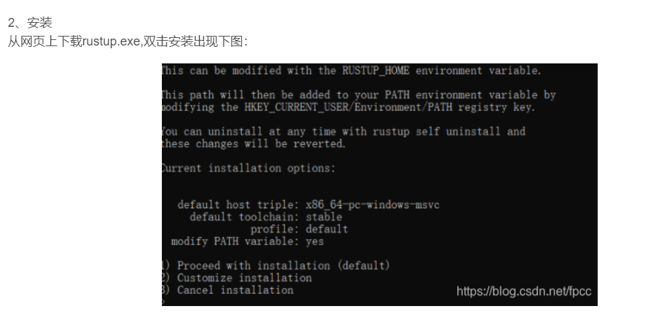
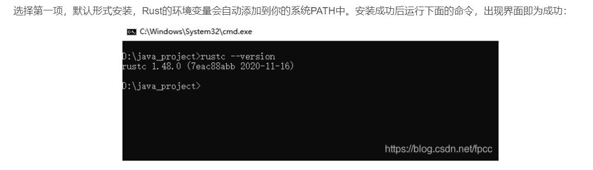

# rust学习
[https://www.rust-lang.org/zh-CN/tools/install](https://www.rust-lang.org/zh-CN/tools/install)

[rustup-init.exe.txt](https://www.yuque.com/attachments/yuque/0/2024/txt/40598547/1711108204174-8a2dda9a-ab58-4148-a9b9-e7d84d6912cd.txt)

**更新 Rust 工具链**: 确保您的 Rust 工具链是最新版本。您可以通过运行 **rustup update** 命令来更新您的 Rust 工具链。

