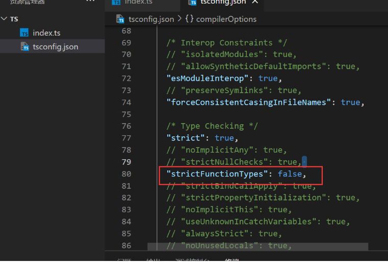
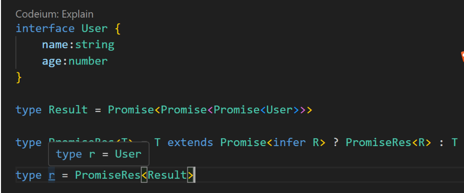

# typescript学习
```powershell
npm install typescript -g
```

# 类型
## <font style="color:rgb(77, 77, 77);">基础类型：</font>
<font style="color:rgb(77, 77, 77);">Boolean、Number、String、null、undefined 以及 </font><font style="color:rgb(254, 44, 36);">ES6</font><font style="color:rgb(77, 77, 77);"> 的  </font>[Symbol](http://es6.ruanyifeng.com/#docs/symbol)<font style="color:rgb(77, 77, 77);"> 和 </font><font style="color:rgb(254, 44, 36);">ES10</font><font style="color:rgb(77, 77, 77);"> 的 </font>[BigInt](https://developer.mozilla.org/zh-CN/docs/Web/JavaScript/Reference/Global_Objects/BigInt)<font style="color:rgb(77, 77, 77);">。</font>

<font style="color:rgb(77, 77, 77);">其中 ` 用来定义 </font>[<font style="color:rgb(77, 77, 77);">ES6 中的模板字符串</font>](http://es6.ruanyifeng.com/#docs/string%23%E6%A8%A1%E6%9D%BF%E5%AD%97%E7%AC%A6%E4%B8%B2)<font style="color:rgb(77, 77, 77);">，${expr} 用来在模板字符串中嵌入表达式。</font>

```typescript
let a: string = '123'
//普通声明

//也可以使用es6的字符串模板
let str: string = `dddd${a}`
```

## 任意类型
### <font style="color:rgb(79, 79, 79);">Any 类型 和 unknown 顶级类型</font>
```plain
nodejs 环境执行ts
npm i @types/node --save-dev （node环境支持的依赖必装）
npm i ts-node --g
```

```powershell
let anys:any = 123
anys = '123'
anys = true
```

## <font style="color:rgb(34, 34, 38);">接口和对象类型</font>
<font style="color:rgb(77, 77, 77);">在</font>[typescript](https://so.csdn.net/so/search?from=pc_blog_highlight&q=typescript)<font style="color:rgb(77, 77, 77);">中，我们定义对象的方式要用关键字</font>**<font style="color:rgb(77, 77, 77);">interface</font>**<font style="color:rgb(77, 77, 77);">（接口），我的理解是使用</font>**<font style="color:rgb(77, 77, 77);">interface</font>**<font style="color:rgb(77, 77, 77);">来定义一种约束，让数据的结构满足约束的格式。定义方式如下：</font>

```powershell
//这样写是会报错的 因为我们在person定义了a，b但是对象里面缺少b属性
//使用接口约束的时候不能多一个属性也不能少一个属性
//必须与接口保持一致
interface Person {
    b:string,
    a:string
}
 
const person:Person  = {
    a:"213"
}
//可选属性的含义是该属性可以不存在
//所以说这样写也是没问题的
interface Person {
    b?:string,
    a:string
}
 
const person:Person  = {
    a:"213"
}
//在这个例子当中我们看到接口中并没有定义C但是并没有报错
//应为我们定义了[propName: string]: any;
//允许添加新的任意属性
interface Person {
    b?:string,
    a:string,
    [propName: string]: any;
}
 
const person:Person  = {
    a:"213",
    c:"123"
}

//这样写是会报错的
//应为a是只读的不允许重新赋值
interface Person {
    b?: string,
    readonly a: string,
    [propName: string]: any;
}
 
const person: Person = {
    a: "213",
    c: "123"
}
 
person.a = 123

interface Person {
    b?: string,
    readonly a: string,
    [propName: string]: any;
    cb:()=>void
}
 
const person: Person = {
    a: "213",
    c: "123",
    cb:()=>{
        console.log(123)
    }
}
```

## <font style="color:rgb(34, 34, 38);">数组类型</font>
```typescript

//类型加中括号
let arr:number[] = [123]
//这样会报错定义了数字类型出现字符串是不允许的
let arr:number[] = [1,2,3,'1']
//操作方法添加也是不允许的
let arr:number[] = [1,2,3,]
arr.unshift('1')


var arr: number[] = [1, 2, 3]; //数字类型的数组
var arr2: string[] = ["1", "2"]; //字符串类型的数组
var arr3: any[] = [1, "2", true]; //任意类型的数组
let arr:Array<number> = [1,2,3,4,5]//数组泛型
interface NumberArray {//接口数组
  [index: number]: number;
}
let fibonacci: NumberArray = [1, 1, 2, 3, 5];
//表示：只要索引的类型是数字时，那么值的类型必须是数字。
let data:number[][] = [[1,2], [3,4]];//多维数组
```

### <font style="color:rgb(79, 79, 79);">arguments类数组</font>
```typescript
function Arr(...args:any): void {
  console.log(arguments)
  //错误的arguments 是类数组不能这样定义
  let arr:number[] = arguments
}
Arr(111, 222, 333)


function Arr(...args:any): void {
  console.log(arguments) 
  //ts内置对象IArguments 定义
  let arr:IArguments = arguments
}
Arr(111, 222, 333)

//其中 IArguments 是 TypeScript 中定义好了的类型，它实际上就是：
interface IArguments {
  [index: number]: any;
  length: number;
  callee: Function;
}
```

### <font style="color:rgb(79, 79, 79);">any 在数组中的应用</font>
<font style="color:rgb(77, 77, 77);">一个常见的例子数组中可以存在任意类型</font>

```typescript
let list: any[] = ['test', 1, [],{a:1}]
```


## <font style="color:rgb(79, 79, 79);">函数的类型</font>
```typescript
//注意，参数不能多传，也不能少传 必须按照约定的类型来
const fn = (name: string, age:number): string => {
    return name + age
}
fn('张三',18)
```

```typescript
//通过?表示该参数为可选参数
const fn = (name: string, age?:number): string => {
    return name + age
}
fn('张三')
```

```typescript
//函数的默认值
const fn = (name: string = "我是默认值"): string => {
    return name
}
fn()
```

```typescript
//定义参数 num 和 num2  ：后面定义返回值的类型
interface Add {
    (num:  number, num2: number): number
}
 
const fn: Add = (num: number, num2: number): number => {
    return num + num2
}
fn(5, 5)
 
 
interface User{
    name: string;
    age: number;
}
function getUserInfo(user: User): User {
  return user
}
```

```typescript
const fn = (array:number[],...items:any[]):any[] => {
       console.log(array,items)
       return items
}
 
let a:number[] = [1,2,3]
 
fn(a,'4','5','6')
```

<font style="color:rgb(77, 77, 77);">函数重载</font>

<font style="color:rgb(77, 77, 77);">重载是方法名字相同，而参数不同，返回类型可以相同也可以不同。</font>

<font style="color:rgb(77, 77, 77);">如果参数类型不同，则参数类型应设置为 </font>**<font style="color:rgb(77, 77, 77);">any</font>**<font style="color:rgb(77, 77, 77);">。</font>

<font style="color:rgb(77, 77, 77);">参数数量不同你可以将不同的参数设置为可选。</font>

```typescript
function fn(params: number): void
function fn(params: string, params2: number): void
function fn(params: any, params2?: any): void {
    console.log(params)
    console.log(params2)
}
fn(123)
fn('123',456)
```

# <font style="color:rgb(34, 34, 38);">类型断言 | 联合类型 | 交叉类型</font>
## <font style="color:rgb(79, 79, 79);">联合类型</font>
```typescript
//例如我们的手机号通常是13XXXXXXX 为数字类型 这时候产品说需要支持座机
//所以我们就可以使用联合类型支持座机字符串
let myPhone: number | string  = '010-820'
 
 
//这样写是会报错的应为我们的联合类型只有数字和字符串并没有布尔值
let myPhone: number | string  = true
```

<font style="color:rgb(77, 77, 77);">函数使用联合类型、</font>

```typescript
const fn = (something:number | boolean):boolean => {
     return !!something
}
```

## <font style="color:rgb(79, 79, 79);">交叉类型</font>
<font style="color:rgb(77, 77, 77);">多种类型的集合，联合对象将具有所联合类型的所有成员</font>

```typescript
interface People {
  age: number,
  height： number
}
interface Man{
  sex: string
}
const xiaoman = (man: People & Man) => {
  console.log(man.age)
  console.log(man.height)
  console.log(man.sex)
}
xiaoman({age: 18,height: 180,sex: 'male'});
```

## <font style="color:rgb(79, 79, 79);">类型断言</font>


```typescript
//语法：值 as 类型　或　<类型>值  value as string  <string>value
interface A {
       run: string
}
 
interface B {
       build: string
}
 
const fn = (type: A | B): string => {
       return type.run
}
//这样写是有警告的应为B的接口上面是没有定义run这个属性的
```

```typescript
interface A {
       run: string
}
 
interface B {
       build: string
}
 
const fn = (type: A | B): string => {
       return (type as A).run
}
//可以使用类型断言来推断他传入的是A接口的值
```

<font style="color:rgb(77, 77, 77);">需要注意的是，类型断言只能够「欺骗」TypeScript 编译器，无法避免运行时的错误，反而滥用类型断言可能会导致运行时错误：</font>

<font style="color:rgb(79, 79, 79);">使用any临时断言</font>

```typescript
window.abc = 123
//这样写会报错因为window没有abc这个东西
(window as any).abc = 123
//可以使用any临时断言在 any 类型的变量上，访问任何属性都是允许的。
```

<font style="color:rgb(77, 77, 77);">是对字面值的</font>**<font style="color:rgb(77, 77, 77);">断言</font>**<font style="color:rgb(77, 77, 77);">，与const直接定义常量是有区别的</font>

```typescript
const names = '小满'
names = 'aa' //无法修改
 
let names2 = '小满' as const
names2 = 'aa' //无法修改


// 数组
let a1 = [10, 20] as const;
const a2 = [10, 20];
 
a1.unshift(30); // 错误，此时已经断言字面量为[10, 20],数据无法做任何修改
a2.unshift(30); // 通过，没有修改指针
```

# <font style="color:rgb(34, 34, 38);">内置对象</font>
<font style="color:rgb(77, 77, 77);">JavaScript 中有很多</font>[内置对象](https://developer.mozilla.org/en-US/docs/Web/JavaScript/Reference/Global_Objects)<font style="color:rgb(77, 77, 77);">，它们可以直接在 </font>[TypeScript](https://so.csdn.net/so/search?q=TypeScript&spm=1001.2101.3001.7020)<font style="color:rgb(77, 77, 77);"> 中当做定义好了的类型。</font>

### <font style="color:rgb(79, 79, 79);">ECMAScript 的内置对象</font>
**<font style="color:rgb(77, 77, 77);">Boolean、Number、String、RegExp、Date、Error</font>**

```typescript
let b: Boolean = new Boolean(1)
console.log(b)
let n: Number = new Number(true)
console.log(n)
let s: String = new String('哔哩哔哩关注小满zs')
console.log(s)
let d: Date = new Date()
console.log(d)
let r: RegExp = /^1/
console.log(r)
let e: Error = new Error("error!")
console.log(e)
```

### <font style="color:rgb(79, 79, 79);">DOM 和 BOM 的内置对象</font>
**<font style="color:rgb(77, 77, 77);">Document、HTMLElement、Event、NodeList 等</font>**

```typescript
let body: HTMLElement = document.body;
let allDiv: NodeList = document.querySelectorAll('div');
//读取div 这种需要类型断言 或者加个判断应为读不到返回null
let div:HTMLElement = document.querySelector('div') as HTMLDivElement
document.addEventListener('click', function (e: MouseEvent) {
    
});
//dom元素的映射表
interface HTMLElementTagNameMap {
    "a": HTMLAnchorElement;
    "abbr": HTMLElement;
    "address": HTMLElement;
    "applet": HTMLAppletElement;
    "area": HTMLAreaElement;
    "article": HTMLElement;
    "aside": HTMLElement;
    "audio": HTMLAudioElement;
    "b": HTMLElement;
    "base": HTMLBaseElement;
    "bdi": HTMLElement;
    "bdo": HTMLElement;
    "blockquote": HTMLQuoteElement;
    "body": HTMLBodyElement;
    "br": HTMLBRElement;
    "button": HTMLButtonElement;
    "canvas": HTMLCanvasElement;
    "caption": HTMLTableCaptionElement;
    "cite": HTMLElement;
    "code": HTMLElement;
    "col": HTMLTableColElement;
    "colgroup": HTMLTableColElement;
    "data": HTMLDataElement;
    "datalist": HTMLDataListElement;
    "dd": HTMLElement;
    "del": HTMLModElement;
    "details": HTMLDetailsElement;
    "dfn": HTMLElement;
    "dialog": HTMLDialogElement;
    "dir": HTMLDirectoryElement;
    "div": HTMLDivElement;
    "dl": HTMLDListElement;
    "dt": HTMLElement;
    "em": HTMLElement;
    "embed": HTMLEmbedElement;
    "fieldset": HTMLFieldSetElement;
    "figcaption": HTMLElement;
    "figure": HTMLElement;
    "font": HTMLFontElement;
    "footer": HTMLElement;
    "form": HTMLFormElement;
    "frame": HTMLFrameElement;
    "frameset": HTMLFrameSetElement;
    "h1": HTMLHeadingElement;
    "h2": HTMLHeadingElement;
    "h3": HTMLHeadingElement;
    "h4": HTMLHeadingElement;
    "h5": HTMLHeadingElement;
    "h6": HTMLHeadingElement;
    "head": HTMLHeadElement;
    "header": HTMLElement;
    "hgroup": HTMLElement;
    "hr": HTMLHRElement;
    "html": HTMLHtmlElement;
    "i": HTMLElement;
    "iframe": HTMLIFrameElement;
    "img": HTMLImageElement;
    "input": HTMLInputElement;
    "ins": HTMLModElement;
    "kbd": HTMLElement;
    "label": HTMLLabelElement;
    "legend": HTMLLegendElement;
    "li": HTMLLIElement;
    "link": HTMLLinkElement;
    "main": HTMLElement;
    "map": HTMLMapElement;
    "mark": HTMLElement;
    "marquee": HTMLMarqueeElement;
    "menu": HTMLMenuElement;
    "meta": HTMLMetaElement;
    "meter": HTMLMeterElement;
    "nav": HTMLElement;
    "noscript": HTMLElement;
    "object": HTMLObjectElement;
    "ol": HTMLOListElement;
    "optgroup": HTMLOptGroupElement;
    "option": HTMLOptionElement;
    "output": HTMLOutputElement;
    "p": HTMLParagraphElement;
    "param": HTMLParamElement;
    "picture": HTMLPictureElement;
    "pre": HTMLPreElement;
    "progress": HTMLProgressElement;
    "q": HTMLQuoteElement;
    "rp": HTMLElement;
    "rt": HTMLElement;
    "ruby": HTMLElement;
    "s": HTMLElement;
    "samp": HTMLElement;
    "script": HTMLScriptElement;
    "section": HTMLElement;
    "select": HTMLSelectElement;
    "slot": HTMLSlotElement;
    "small": HTMLElement;
    "source": HTMLSourceElement;
    "span": HTMLSpanElement;
    "strong": HTMLElement;
    "style": HTMLStyleElement;
    "sub": HTMLElement;
    "summary": HTMLElement;
    "sup": HTMLElement;
    "table": HTMLTableElement;
    "tbody": HTMLTableSectionElement;
    "td": HTMLTableDataCellElement;
    "template": HTMLTemplateElement;
    "textarea": HTMLTextAreaElement;
    "tfoot": HTMLTableSectionElement;
    "th": HTMLTableHeaderCellElement;
    "thead": HTMLTableSectionElement;
    "time": HTMLTimeElement;
    "title": HTMLTitleElement;
    "tr": HTMLTableRowElement;
    "track": HTMLTrackElement;
    "u": HTMLElement;
    "ul": HTMLUListElement;
    "var": HTMLElement;
    "video": HTMLVideoElement;
    "wbr": HTMLElement;
}
```

## <font style="color:rgb(79, 79, 79);">定义Promise</font>
<font style="color:rgb(77, 77, 77);">如果我们不指定返回的类型TS是推断不出来返回的是什么类型</font>

<font style="color:rgb(77, 77, 77);">指定返回的类型</font>

<font style="color:rgb(77, 77, 77);">函数定义返回promise 语法规则:Promise<T> 类型 </font>

```typescript
function promise():Promise<number>{
   return new Promise<number>((resolve,reject)=>{
       resolve(1)
   })
}
 
promise().then(res=>{
    console.log(res)
})
```

# <font style="color:rgb(34, 34, 38);">Class类</font>
<font style="color:rgb(77, 77, 77);">ES6提供了更接近传统语言的写法，引入了Class（类）这个概念，作为对象的模板。通过class关键字，可以定义类。基本上，ES6的class可以看作只是一个</font>[语法糖](https://so.csdn.net/so/search?q=%E8%AF%AD%E6%B3%95%E7%B3%96&spm=1001.2101.3001.7020)<font style="color:rgb(77, 77, 77);">，它的绝大部分功能，ES5都可以做到，新的class写法只是让对象原型的写法更加清晰、更像</font>[面向对象编程](https://so.csdn.net/so/search?q=%E9%9D%A2%E5%90%91%E5%AF%B9%E8%B1%A1%E7%BC%96%E7%A8%8B&spm=1001.2101.3001.7020)<font style="color:rgb(77, 77, 77);">的语法而已。上面的代码用ES6的“类”改写，就是下面这样。</font>

```typescript
//定义类
class Person {
    constructor () {
 
    }
    run () {
        
    }
}
class Person {
    name:string
    age:number
    constructor (name:string,age:number) {
       this.name=name;
       this.age=age;
    }
    run () {
        
    }
}
```

## <font style="color:rgb(79, 79, 79);">类的修饰符</font>
### <font style="color:rgb(79, 79, 79);">总共有三个 public private protected</font>
```typescript
class Person {
    public name:string
    private age:number 
    protected some:any
    constructor (name:string,ages:number,some:any) {
       this.name = name
       this.age = ages
       this.some = some
    }
    run () {
 
    }
}
 
class Man extends Person{
    constructor () {
        super("张三",18,1)
        console.log(this.some)
    }
    create () {
       console.log(this.some)
    }
}
let xiaoman = new Person('小满',18,1)
let man = new Man()
man.some//保护属性  无法直接访问
```

## <font style="color:rgb(79, 79, 79);">static 静态属性 和 静态方法</font>
```typescript
class Person {
    public name:string
    private age:number 
    protected some:any
    static nb:string
    constructor (name:string,ages:number,some:any) {
       this.name = name
       this.age = ages
       this.some = some
      this.nb//我们用static 定义的属性 不可以通过this 去访问 只能通过类名去调用
      this.run()//static 静态函数 同样也是不能通过this 去调用 也是通过类名去调用
    }
    static run () {
       return this.test()
    }
//需注意： 如果两个函数都是static 静态的是可以通过this互相调用
    static test(){
      return 'aaa'
    }
  
}
 
class Man extends Person{
    constructor () {
        super("张三",18,1)
        console.log(this.some)
    }
    create () {
       console.log(this.some)
    }
}
let xiaoman = new Person('小满',18,1)
let man = new Man()
man.some//保护属性  无法直接访问
```

## <font style="color:rgb(79, 79, 79);">interface 定义 类</font>
```typescript
 
interface PersonClass {
    get(type: boolean): boolean
}
 
interface PersonClass2{
    set():void,
    asd:string
}
 
class A {
    name: string
    constructor() {
        this.name = "123"
    }
}
 
class Person extends A implements PersonClass,PersonClass2 {
    asd: string
    constructor() {
        super()
        this.asd = '123'
    }
    get(type:boolean) {
        return type
    }
    set () {
 
    }
}
```

## <font style="color:rgb(79, 79, 79);">抽象类 </font>
<font style="color:rgb(77, 77, 77);">应用场景如果你写的类实例化之后毫无用处此时我可以把他定义为抽象类</font>

<font style="color:rgb(77, 77, 77);">或者你也可以把他作为一个基类-> 通过继承一个派生类去实现基类的一些方法</font>

<font style="color:rgb(77, 77, 77);">我们看例子</font>

<font style="color:rgb(77, 77, 77);">下面这段代码会</font><font style="color:rgb(254, 44, 36);">报错</font><font style="color:rgb(13, 0, 22);">抽象类无法被实例化</font>

```typescript
abstract class A {
   public name:string
}
new A()
```

<font style="color:rgb(77, 77, 77);">例子2</font>

<font style="color:rgb(77, 77, 77);">我们在A类定义了 getName 抽象方法但为实现</font>

<font style="color:rgb(77, 77, 77);">我们B类实现了A定义的抽象方法 如不实现会报错 </font>**<font style="color:rgb(254, 44, 36);">我们定义的抽象方法必须在派生类实现</font>**

```typescript
abstract class A {
   name: string
   constructor(name: string) {
      this.name = name;
   }
   print(): string {
      return this.name
   }
 
   abstract getName(): string
}
 
class B extends A {
   constructor() {
      super('小满')
   }
   getName(): string {
      return this.name
   }
}
 
let b = new B();
 
console.log(b.getName());
```

### 案例
```typescript
/**
 * 1. 类的基本用法，包括继承和类型约束。
 * 2. 类的修饰符：readonly、private、protected、public。
 * 3. 超类（super）的工作原理。
 * 4. 静态方法的使用。
 * 5. get和set访问器的运用。
 */
interface Options {
    el: string | HTMLElement // 定义元素选择器或HTMLElement对象。
}

interface VueCls {
    init(): void // 初始化方法。
    options: Options // 组件选项。
}

interface Vnode {
    tag: string // 标签名。
    text?: string // 可选的文本内容。
    props?: {
        id?: number | string // 可选的id属性。
        key?: number | string | object // 可选的key属性。
    }
    children?: Vnode[] // 可选的子节点数组。
}

/**
 * Dom类提供创建和操作DOM元素的方法。
 */
class Dom {
    constructor() {
        // 构造函数，初始化Dom类实例。
    }

    /**
     * 创建一个HTMLElement。
     * @param el 要创建的元素的标签名。
     * @returns 返回创建的HTMLElement实例。
     */
    private createElement(el: string): HTMLElement {
        return document.createElement(el)
    }

    /**
     * 设置元素的文本内容。
     * @param el 要设置文本的Element。
     * @param text 要设置的文本内容。
     */
    protected setText(el: Element, text: string | null) {
        el.textContent = text;
    }

    /**
     * 渲染虚拟节点到实际的DOM元素。
     * @param createElement 要渲染的虚拟节点。
     * @returns 返回渲染后的HTMLElement。
     */
    protected render(createElement: Vnode): HTMLElement {
        const el = this.createElement(createElement.tag)
        if (createElement.children && Array.isArray(createElement.children)) {
            createElement.children.forEach(item => {
                const child = this.render(item)
                this.setText(child, item.text ?? null)
                el.appendChild(child)
            })
        } else {
            this.setText(el, createElement.text ?? null)
        }
        return el;
    }
}

/**
 * Vue类继承自Dom类，实现VueCls接口，提供组件初始化和挂载功能。
 */
class Vue extends Dom implements VueCls {
    options: Options // 组件选项。

    /**
     * Vue类的构造函数，初始化Vue实例。
     * @param options 组件的配置选项。
     */
    constructor(options: Options) {
        super()
        this.options = options;
        this.init()
    }

    /**
     * 静态方法，返回Vue库的版本号。
     * @returns 返回版本字符串。
     */
    static version () {
        return '1.0.0'
    }

    /**
     * 组件初始化方法，创建并挂载组件。
     */
    public init() {
        let app = typeof this.options.el == 'string' ? document.querySelector(this.options.el) : this.options.el;
        let data: Vnode = {
            tag: "div",
            props: {
                id: 1,
                key: 1
            },
            children: [
                {
                    tag: "div",
                    text: "子集1",
                },
                {
                    tag: "div",
                    text: "子集2"
                }
            ]
        }
        app?.appendChild(this.render(data))
        console.log(app);

        this.mount(app as Element)
    }

    /**
     * 将组件挂载到文档中。
     * @param app 要挂载的Element。
     */
    public mount(app: Element) {
        document.body.append(app)
    }
}

// 创建并初始化Vue实例。
const v = new Vue({
    el: "#app"
})
```

```typescript
<!DOCTYPE html>
<html lang="en">

<head>
    <meta charset="UTF-8">
    <meta name="viewport" content="width=device-width, initial-scale=1.0">
    <title>Document</title>
</head>

<body>
    <div id="app"></div>
    <script src="index.js"></script>
</body>

</html>
```

# <font style="color:rgb(34, 34, 38);">元组类型</font>
**<font style="color:rgb(77, 77, 77);">元组（Tuple）是固定数量的不同类型的元素的组合</font>**<font style="color:rgb(77, 77, 77);">。</font>

```typescript
let arr:[number,string] = [1,'string']
 
 
let arr2: readonly [number,boolean,string,undefined] = [1,true,'sring',undefined]
```

<font style="color:rgb(77, 77, 77);">元组类型还可以支持自定义名称和变为可选的</font>

```plain
let a:[x:number,y?:boolean] = [1]
```

## <font style="color:rgb(79, 79, 79);">越界元素</font>
```typescript
let arr:[number,string] = [1,'string']
arr.push(true)//error
```

## **<font style="color:rgb(79, 79, 79);">应用场景 例如定义excel返回的数据</font>**
```typescript
let excel: [string, string, number, string][] = [
    ['title', 'name', 1, '123'],
    ['title', 'name', 1, '123'],
    ['title', 'name', 1, '123'],
    ['title', 'name', 1, '123'],
    ['title', 'name', 1, '123'],
]
```

# <font style="color:rgb(34, 34, 38);">枚举类型</font>
### <font style="color:rgb(79, 79, 79);">数字枚举</font>
<font style="color:rgb(77, 77, 77);">例如 红绿蓝 Red = 0 Green = 1 Blue= 2 分别代表红色0 绿色为1 蓝色为2</font>

```typescript
enum Types{
  Red,
  Green,
  BLue
}
```

<font style="color:rgb(77, 77, 77);">这样写就可以实现应为ts定义的枚举中的每一个组员默认都是从0开始的所以也就是</font>

```typescript
enum Types{
   Red = 0,
   Green = 1,
   BLue = 2
}
//默认就是从0开始的 可以不写值
```

<font style="color:rgb(77, 77, 77);">增长枚举</font>

```typescript
enum Types{
  Red = 1,
  Green,
  BLue
}
```

<font style="color:rgb(77, 77, 77);">如上，我们定义了一个数字枚举， Red使用初始化为 1。 其余的成员会从 1开始自动增长。 换句话说， Type.Red的值为 1， Green为 2， Blue为 3。</font>

### <font style="color:rgb(79, 79, 79);">字符串枚举</font>
<font style="color:rgb(77, 77, 77);">字符串枚举的概念很简单。 在一个字符串枚举里，每个成员都必须用字符串</font>[<font style="color:rgb(77, 77, 77);">字面量</font>](https://so.csdn.net/so/search?q=%E5%AD%97%E9%9D%A2%E9%87%8F&spm=1001.2101.3001.7020)<font style="color:rgb(77, 77, 77);">，或另外一个字符串枚举成员进行初始化。</font>

```typescript
enum Types{
   Red = 'red',
   Green = 'green',
   BLue = 'blue'
}
```

<font style="color:rgb(77, 77, 77);">由于字符串枚举没有自增长的行为，字符串枚举可以很好的序列化。 换句话说，如果你正在调试并且必须要读一个数字枚举的运行时的值，这个值通常是很难读的 - 它并不能表达有用的信息，字符串枚举允许你提供一个运行时有意义的并且可读的值，独立于枚举成员的名字。</font>

### <font style="color:rgb(79, 79, 79);">异构枚举</font>
<font style="color:rgb(77, 77, 77);">枚举可以混合字符串和数字成员</font>

```typescript
enum Types{
   No = "No",
   Yes = 1,
}
```

### <font style="color:rgb(79, 79, 79);">接口枚举</font>
<font style="color:rgb(77, 77, 77);">定义一个枚举Types 定义一个接口A 他有一个属性red 值为Types.yyds</font>

<font style="color:rgb(77, 77, 77);">声明对象的时候要遵循这个规则</font>

```typescript
   enum Types {
      yyds,
      dddd
   }
   interface A {
      red:Types.yyds
   }
 
   let obj:A = {
      red:Types.yyds
   }
```

### **<font style="color:rgb(79, 79, 79);">const</font>**<font style="color:rgb(79, 79, 79);">枚举</font>
<font style="color:rgb(77, 77, 77);">let  和 var 都是不允许的声明只能使用const</font>

<font style="color:rgb(77, 77, 77);">大多数情况下，枚举是十分有效的方案。 然而在某些情况下需求很严格。 为了避免在额外生成的代码上的开销和额外的非直接的对枚举成员的访问，我们可以使用 </font><font style="color:rgb(77, 77, 77);">const</font><font style="color:rgb(77, 77, 77);">枚举。 常量枚举通过在枚举上使用 </font><font style="color:rgb(77, 77, 77);">const</font><font style="color:rgb(77, 77, 77);">修饰符来定义</font>

<font style="color:rgb(77, 77, 77);">const 声明的枚举会被编译成常量</font>

<font style="color:rgb(77, 77, 77);">普通声明的枚举编译完后是个对象</font>

```typescript
const enum Types{
   No = "No",
   Yes = 1,
}
```

### <font style="color:rgb(79, 79, 79);">反向映射</font>
<font style="color:rgb(77, 77, 77);">它包含了正向映射（ </font><font style="color:rgb(77, 77, 77);">name</font><font style="color:rgb(77, 77, 77);"> -> </font><font style="color:rgb(77, 77, 77);">value</font><font style="color:rgb(77, 77, 77);">）和反向映射（ </font><font style="color:rgb(77, 77, 77);">value</font><font style="color:rgb(77, 77, 77);"> -> </font><font style="color:rgb(77, 77, 77);">name</font><font style="color:rgb(77, 77, 77);">）</font>

<font style="color:rgb(77, 77, 77);">要注意的是 </font>_<font style="color:rgb(77, 77, 77);">不会</font>_<font style="color:rgb(77, 77, 77);">为字符串枚举成员生成反向映射。</font>

```typescript
enum Enum {
   fall
}
let a = Enum.fall;
console.log(a); //0
let nameOfA = Enum[a]; 
console.log(nameOfA); //fall
```

# <font style="color:rgb(34, 34, 38);">类型推论|类型别名</font>
### <font style="color:rgb(79, 79, 79);">什么是类型推论</font>
```typescript
let str = "小满zs"
```

<font style="color:rgb(77, 77, 77);">1.我声明了一个变量但是没有定义类型</font>

[TypeScript](https://so.csdn.net/so/search?q=TypeScript&spm=1001.2101.3001.7020)<font style="color:rgb(77, 77, 77);"> 会在没有明确的指定类型的时候推测出一个类型，这就是类型推论</font>

<font style="color:rgb(77, 77, 77);">所以TS帮我推断出来这是一个string类型,不能够在赋值给别的类型</font>

<font style="color:rgb(77, 77, 77);">2.如果你声明变量没有定义类型也没有赋值这时候TS会推断成any类型可以进行任何操作</font>

## <font style="color:rgb(79, 79, 79);">类型别名</font>
<font style="color:rgb(77, 77, 77);">type 关键字（可以给一个类型定义一个名字）多用于复合类型</font>

<font style="color:rgb(77, 77, 77);">定义类型别名</font>

```typescript
type str = string
let s:str = "我是小满"
console.log(s);
```

<font style="color:rgb(77, 77, 77);">定义函数别名</font>

```typescript
type str = () => string


let s: str = () => "我是小满"

console.log(s);
```

<font style="color:rgb(77, 77, 77);">定义联合类型别名</font>

```typescript
type str = string | number


let s: str = 123

let s2: str = '123'

console.log(s,s2);
```

<font style="color:rgb(77, 77, 77);">定义值的别名</font>

```typescript
type value = boolean | 0 | '213'


let s:value = true
//变量s的值  只能是上面value定义的值
```


**<font style="color:rgb(77, 77, 77);">type 和 interface 还是一些区别的 虽然都可以定义类型</font>**

<font style="color:rgb(77, 77, 77);">1.interface可以继承  type 只能通过 & 交叉类型合并</font>

<font style="color:rgb(77, 77, 77);">2.type 可以定义 联合类型 和 可以使用一些操作符 interface不行</font>

<font style="color:rgb(77, 77, 77);">3.interface 遇到重名的会合并 type 不行</font>

**<font style="color:rgb(77, 77, 77);">type高级用法</font>**

<font style="color:rgb(77, 77, 77);">左边的值会作为右边值的子类型遵循图中上下的包含关系</font>

```typescript
type a = 1 extends number ? 1 : 0 //1
 
type a = 1 extends Number ? 1 : 0 //1
 
type a = 1 extends Object ? 1 : 0 //1
 
type a = 1 extends any ? 1 : 0 //1
 
type a = 1 extends unknow ? 1 : 0 //1
 
type a = 1 extends never ? 1 : 0 //0
```

# <font style="color:rgb(34, 34, 38);">never类型</font>
[TypeScript](https://so.csdn.net/so/search?q=TypeScript&spm=1001.2101.3001.7020)<font style="color:rgb(77, 77, 77);"> 将使用 never 类型来表示不应该存在的状态(很抽象是不是)</font>


```typescript
// 返回never的函数必须存在无法达到的终点
 
// 因为必定抛出异常，所以 error 将不会有返回值
function error(message: string): never {
    throw new Error(message);
}
 
// 因为存在死循环，所以 loop 将不会有返回值
function loop(): never {
    while (true) {
    }
}
```

### <font style="color:rgb(79, 79, 79);">never 与 </font>**<font style="color:rgb(79, 79, 79);">void</font>**<font style="color:rgb(79, 79, 79);"> 的差异</font>
```typescript
//void类型只是没有返回值 但本身不会出错
function Void():void {
  console.log();
}

//只会抛出异常没有返回值
function Never():never {
  throw new Error('aaa')
}
```

<font style="color:rgb(77, 77, 77);">差异2   当我们鼠标移上去的时候会发现 只有void和number    never在联合类型中会被直接移除</font>

```typescript
type A = void | number | never
```

#### <font style="color:rgb(79, 79, 79);">never 类型的一个应用场景</font>
<font style="color:rgb(77, 77, 77);">举一个我们可能会见到的例子</font>

```typescript
type A = '小满' | '大满' | '超大满' 
 
function isXiaoMan(value:A) {
   switch (value) {
       case "小满":
           break 
       case "大满":
          break 
       case "超大满":
          break 
       default:
          //是用于场景兜底逻辑
          const error:never = value;
          return error
   }
}
```

<font style="color:rgb(77, 77, 77);">比如新来了一个同事他新增了一个篮球，我们必须手动找到所有 switch 代码并处理，否则将有可能引入 BUG 。</font>

<font style="color:rgb(77, 77, 77);">而且这将是一个“隐蔽型”的BUG，如果回归面不够广，很难发现此类BUG。</font>

<font style="color:rgb(77, 77, 77);">那 TS 有没有办法帮助我们在类型检查阶段发现这个问题呢？</font>

```typescript
type A = '小满' | '大满' | '超大满' | "小小满"
 
function isXiaoMan(value:A) {
   switch (value) {
       case "小满":
           break 
       case "大满":
          break 
       case "超大满":
          break 
       default:
          //是用于场景兜底逻辑
          const error:never = value;
          return error
   }
}
```

<font style="color:rgb(77, 77, 77);">由于任何类型都不能赋值给 never 类型的变量，所以当存在进入 default 分支的可能性时，TS的类型检查会及时帮我们发现这个问题</font>

# <font style="color:rgb(34, 34, 38);">symbol类型</font>
<font style="color:rgb(79, 79, 79);">自ECMAScript 2015起，</font>**<font style="color:rgb(79, 79, 79);">symbol</font>**<font style="color:rgb(79, 79, 79);">成为了一种新的原生类型，就像</font>**<font style="color:rgb(79, 79, 79);">number</font>**<font style="color:rgb(79, 79, 79);">和</font>**<font style="color:rgb(79, 79, 79);">string</font>**<font style="color:rgb(79, 79, 79);">一样。</font>

<font style="color:rgb(77, 77, 77);">symbol</font><font style="color:rgb(77, 77, 77);">类型的值是通过</font><font style="color:rgb(77, 77, 77);">Symbol</font><font style="color:rgb(77, 77, 77);">构造函数创建的。</font>

<font style="color:rgb(77, 77, 77);">可以传递参做为唯一标识 只支持 string 和 </font>[number类型](https://so.csdn.net/so/search?q=number%E7%B1%BB%E5%9E%8B&spm=1001.2101.3001.7020)<font style="color:rgb(77, 77, 77);">的参数</font>

```typescript
let sym1 = Symbol();
let sym2 = Symbol("key"); // 可选的字符串key
```

<font style="color:rgb(79, 79, 79);"></font>

```typescript
//Symbol的值是唯一的
const s1 = Symbol()
const s2 = Symbol()
// s1 === s2 =>false
```

```typescript
//用作对象属性的键
let sym = Symbol();
 
let obj = {
    [sym]: "value"
};
 
console.log(obj[sym]); // "value"
```

```typescript
//使用symbol定义的属性，是不能通过如下方式遍历拿到的
const symbol1 = Symbol('666')
const symbol2 = Symbol('777')
const obj1= {
   [symbol1]: '小满',
   [symbol2]: '二蛋',
   age: 19,
   sex: '女'
}
// 1 for in 遍历
for (const key in obj1) {
   // 注意在console看key,是不是没有遍历到symbol1
   console.log(key)
}
// 2 Object.keys 遍历
Object.keys(obj1)
console.log(Object.keys(obj1))
// 3 getOwnPropertyNames
console.log(Object.getOwnPropertyNames(obj1))
// 4 JSON.stringfy
console.log(JSON.stringify(obj1))
```

```typescript
//如何拿到

// 1 拿到具体的symbol 属性,对象中有几个就会拿到几个
Object.getOwnPropertySymbols(obj1)
console.log(Object.getOwnPropertySymbols(obj1))
// 2 es6 的 Reflect 拿到对象的所有属性
Reflect.ownKeys(obj1)
console.log(Reflect.ownKeys(obj1))
```

<font style="color:rgb(79, 79, 79);">Symbol.iterator 迭代器 和 生成器 for of</font>

<font style="color:rgb(77, 77, 77);">支持遍历大部分类型迭代器 arr nodeList argumetns set map 等</font>

```typescript
var arr = [1,2,3,4];
let iterator = arr[Symbol.iterator]();
 
console.log(iterator.next());  //{ value: 1, done: false }
console.log(iterator.next());  //{ value: 2, done: false }
console.log(iterator.next());  //{ value: 3, done: false }
console.log(iterator.next());  //{ value: 4, done: false }
console.log(iterator.next());  //{ value: undefined, done: true }
```

<font style="color:rgb(77, 77, 77);">测试用例</font>

```typescript
interface Item {
    age: number,
    name: string
}
 
const array: Array<Item> = [{ age: 123, name: "1" }, { age: 123, name: "2" }, { age: 123, name: "3" }]
 
type mapTypes = string | number
const map:Map<mapTypes,mapTypes> = new Map()
 
map.set('1','王爷')
map.set('2','陆北')
 
const obj = {
    aaa:123,
    bbb:456
}
 
let set:Set<number> = new Set([1,2,3,4,5,6])
// let it:Iterator<Item> = array[Symbol.iterator]()
const gen = (erg:any): void => {
    let it: Iterator<any> = erg[Symbol.iterator]()
    let next:any= { done: false }
    while (!next.done) {
        next =  it.next()
        if (!next.done) {
            console.log(next.value)
        }
    }
}
gen(array)
```

<font style="color:rgb(77, 77, 77);">我们平时开发中不会手动调用iterator 应为 他是有</font>[语法糖](https://so.csdn.net/so/search?q=%E8%AF%AD%E6%B3%95%E7%B3%96&spm=1001.2101.3001.7020)<font style="color:rgb(77, 77, 77);">的就是for of  记住 for of 是不能循环对象的因为对象没有 iterator  </font>

```typescript
for (let value of map) {
    console.log(value)
}
```

<font style="color:rgb(77, 77, 77);">数组解构的原理其实也是调用迭代器的</font>

```typescript
var [a,b,c] = [1,2,3]
 
var x = [...xxxx]
```

<font style="color:rgb(77, 77, 77);">数组解构的原理其实也是调用迭代器的</font>

```typescript
var [a,b,c] = [1,2,3]

var x = [...xxxx]
```

<font style="color:rgb(77, 77, 77);"> 那我们可以自己实现一个迭代器让对象支持for of</font>

```typescript

const obj = {
  max: 5,
  current: 0,
  [Symbol.iterator]() {
    return {
      max: this.max,
      current: this.current,
      next() {
        if (this.current == this.max) {
          return {
            value: undefined,
            done: true
          }
        } else {
          return {
            value: this.current++,
            done: false
          }
        }
      }
    }
  }
}
console.log([...obj])

for (let val of obj) {
  console.log(val);

}
```

<font style="color:rgb(77, 77, 77);">以下为这些symbols的列表：</font>

**<font style="color:rgb(77, 77, 77);">Symbol.hasInstance</font>**<font style="color:rgb(77, 77, 77);">  
</font><font style="color:rgb(77, 77, 77);">方法，会被instanceof运算符调用。构造器对象用来识别一个对象是否是其实例。</font>

**<font style="color:rgb(77, 77, 77);">Symbol.isConcatSpreadable</font>**<font style="color:rgb(77, 77, 77);">  
</font><font style="color:rgb(77, 77, 77);">布尔值，表示当在一个对象上调用Array.prototype.concat时，这个对象的数组元素是否可展开。</font>

**<font style="color:rgb(77, 77, 77);">Symbol.iterator</font>**<font style="color:rgb(77, 77, 77);">  
</font><font style="color:rgb(77, 77, 77);">方法，被for-of语句调用。返回对象的默认迭代器。</font>

**<font style="color:rgb(77, 77, 77);">Symbol.match</font>**<font style="color:rgb(77, 77, 77);">  
</font><font style="color:rgb(77, 77, 77);">方法，被String.prototype.match调用。正则表达式用来匹配字符串。</font>

**<font style="color:rgb(77, 77, 77);">Symbol.replace</font>**<font style="color:rgb(77, 77, 77);">  
</font><font style="color:rgb(77, 77, 77);">方法，被String.prototype.replace调用。正则表达式用来替换字符串中匹配的子串。</font>

**<font style="color:rgb(77, 77, 77);">Symbol.search</font>**<font style="color:rgb(77, 77, 77);">  
</font><font style="color:rgb(77, 77, 77);">方法，被String.prototype.search调用。正则表达式返回被匹配部分在字符串中的索引。</font>

**<font style="color:rgb(77, 77, 77);">Symbol.species</font>**<font style="color:rgb(77, 77, 77);">  
</font><font style="color:rgb(77, 77, 77);">函数值，为一个构造函数。用来创建派生对象。</font>

**<font style="color:rgb(77, 77, 77);">Symbol.split</font>**<font style="color:rgb(77, 77, 77);">  
</font><font style="color:rgb(77, 77, 77);">方法，被String.prototype.split调用。正则表达式来用分割字符串。</font>

**<font style="color:rgb(77, 77, 77);">Symbol.toPrimitive</font>**<font style="color:rgb(77, 77, 77);">  
</font><font style="color:rgb(77, 77, 77);">方法，被ToPrimitive抽象操作调用。把对象转换为相应的原始值。</font>

**<font style="color:rgb(77, 77, 77);">Symbol.toStringTag</font>**<font style="color:rgb(77, 77, 77);">  
</font><font style="color:rgb(77, 77, 77);">方法，被内置方法Object.prototype.toString调用。返回创建对象时默认的字符串描述。</font>

**<font style="color:rgb(77, 77, 77);">Symbol.unscopables</font>**<font style="color:rgb(77, 77, 77);">  
</font><font style="color:rgb(77, 77, 77);">对象，它自己拥有的属性会被with作用域排除在外。</font>

# <font style="color:rgb(34, 34, 38);">泛型</font>
[泛型](https://so.csdn.net/so/search?q=%E6%B3%9B%E5%9E%8B&spm=1001.2101.3001.7020)<font style="color:rgb(77, 77, 77);">在TypeScript 是很重要的东西 例如vue3 是用ts编写的 里面用到了非常多的泛型</font>

<font style="color:rgb(77, 77, 77);">ok:我们看一个小例子</font>

### <font style="color:rgb(79, 79, 79);">函数泛型</font>
<font style="color:rgb(77, 77, 77);">我写了两个函数一个是数字类型的函数，另一个是字符串类型的函数,其实就是类型不同，</font>

<font style="color:rgb(77, 77, 77);">实现的功能是一样的，这时候我们就可以使用泛型来优化</font>

```typescript
function num (a:number,b:number) : Array<number> {
    return [a ,b];
}
num(1,2)
function str (a:string,b:string) : Array<string> {
    return [a ,b];
}
str('独孤','求败')
```

<font style="color:rgb(77, 77, 77);">泛型优化</font>

<font style="color:rgb(77, 77, 77);">语法为函数名字后面跟一个<参数名> 参数名可以随便写 例如我这儿写了T</font>

<font style="color:rgb(77, 77, 77);">当我们使用这个函数的时候把参数的类型传进去就可以了 （也就是动态类型）</font>

```typescript
function Add<T>(a: T, b: T): Array<T>  {
    return [a,b]
}
 
Add<number>(1,2)
Add<string>('1','2')
```

<font style="color:rgb(77, 77, 77);">我们也可以使用不同的泛型参数名，只要在数量上和使用方式上能对应上就可以。</font>

```typescript
function Sub<T,U>(a:T,b:U):Array<T|U> {
  const params:Array<T|U> = [a,b]
  return params
}


Sub<Boolean,number>(false,1)
```

### <font style="color:rgb(79, 79, 79);">定义泛型接口</font>
<font style="color:rgb(77, 77, 77);">声明接口的时候 在名字后面加一个<参数></font>

<font style="color:rgb(77, 77, 77);">使用的时候传递类型</font>

```typescript
interface MyInter<T> {
   (arg: T): T
}
 
function fn<T>(arg: T): T {
   return arg
}
 
let result: MyInter<number> = fn
 
result(123)
```

### <font style="color:rgb(79, 79, 79);">对象字面量泛型</font>
```typescript
let foo: { <T>(arg: T): T }

foo = function <T>(arg:T):T {
  return arg
}

foo(123)
```

### <font style="color:rgb(79, 79, 79);">泛型约束</font>
<font style="color:rgb(77, 77, 77);">我们期望在一个泛型的变量上面，获取其</font><font style="color:rgb(77, 77, 77);">length</font><font style="color:rgb(77, 77, 77);">参数，但是，有的数据类型是没有</font><font style="color:rgb(77, 77, 77);">length</font><font style="color:rgb(77, 77, 77);">属性的</font>

```typescript
function getLegnth<T>(arg:T) {
  return arg.length
}
```

  
 <font style="color:rgb(77, 77, 77);">这时候我们就可以使用泛型约束</font>

<font style="color:rgb(77, 77, 77);">于是，我们就得对使用的泛型进行约束，我们约束其为具有length属性的类型，这里我们会用到interface,代码如下</font>

```typescript
interface Len {
   length:number
}
 
function getLegnth<T extends Len>(arg:T) {
  return arg.length
}
 
getLegnth<string>('123')
```

### <font style="color:rgb(79, 79, 79);">使用keyof 约束对象</font>
<font style="color:rgb(77, 77, 77);">其中使用了TS泛型和泛型约束。首先定义了T类型并使用extends关键字继承object类型的子类型，然后使用keyof操作符获取T类型的所有键，它的返回 类型是联合 类型，最后利用extends关键字约束 K类型必须为keyof T联合类型的子类型</font>

```typescript
function prop<T, K extends keyof T>(obj: T, key: K) {
   return obj[key]
}
 
 
let o = { a: 1, b: 2, c: 3 }
 
prop(o, 'a') 
prop(o, 'd') //此时就会报错发现找不到
```

### <font style="color:rgb(79, 79, 79);">泛型类</font>
<font style="color:rgb(77, 77, 77);">声明方法跟函数类似名称后面定义<类型></font>

<font style="color:rgb(77, 77, 77);">使用的时候确定类型new Sub<number>()</font>

```typescript
class Sub<T>{
   attr: T[] = [];
   add (a:T):T[] {
      return [a]
   }
}
 
let s = new Sub<number>()
s.attr = [1,2,3]
s.add(123)
 
let str = new Sub<string>()
str.attr = ['1','2','3']
str.add('123')
```

# <font style="color:rgb(34, 34, 38);">tsconfig.json配置文件</font>
### <font style="color:rgb(79, 79, 79);">生成tsconfig.json 文件</font>
<font style="color:rgb(77, 77, 77);">这个文件是通过tsc --init命令生成的</font>

```json
"compilerOptions": {
  "incremental": true, // TS编译器在第一次编译之后会生成一个存储编译信息的文件，第二次编译会在第一次的基础上进行增量编译，可以提高编译的速度
  "tsBuildInfoFile": "./buildFile", // 增量编译文件的存储位置
  "diagnostics": true, // 打印诊断信息 
  "target": "ES5", // 目标语言的版本
  "module": "CommonJS", // 生成代码的模板标准
  "outFile": "./app.js", // 将多个相互依赖的文件生成一个文件，可以用在AMD模块中，即开启时应设置"module": "AMD",
  "lib": ["DOM", "ES2015", "ScriptHost", "ES2019.Array"], // TS需要引用的库，即声明文件，es5 默认引用dom、es5、scripthost,如需要使用es的高级版本特性，通常都需要配置，如es8的数组新特性需要引入"ES2019.Array",
  "allowJS": true, // 允许编译器编译JS，JSX文件
  "checkJs": true, // 允许在JS文件中报错，通常与allowJS一起使用
  "outDir": "./dist", // 指定输出目录
  "rootDir": "./", // 指定输出文件目录(用于输出)，用于控制输出目录结构
  "declaration": true, // 生成声明文件，开启后会自动生成声明文件
  "declarationDir": "./file", // 指定生成声明文件存放目录
  "emitDeclarationOnly": true, // 只生成声明文件，而不会生成js文件
  "sourceMap": true, // 生成目标文件的sourceMap文件
  "inlineSourceMap": true, // 生成目标文件的inline SourceMap，inline SourceMap会包含在生成的js文件中
  "declarationMap": true, // 为声明文件生成sourceMap
  "typeRoots": [], // 声明文件目录，默认时node_modules/@types
  "types": [], // 加载的声明文件包
  "removeComments":true, // 删除注释 
  "noEmit": true, // 不输出文件,即编译后不会生成任何js文件
  "noEmitOnError": true, // 发送错误时不输出任何文件
  "noEmitHelpers": true, // 不生成helper函数，减小体积，需要额外安装，常配合importHelpers一起使用
  "importHelpers": true, // 通过tslib引入helper函数，文件必须是模块
  "downlevelIteration": true, // 降级遍历器实现，如果目标源是es3/5，那么遍历器会有降级的实现
  "strict": true, // 开启所有严格的类型检查
  "alwaysStrict": true, // 在代码中注入'use strict'
  "noImplicitAny": true, // 不允许隐式的any类型
  "strictNullChecks": true, // 不允许把null、undefined赋值给其他类型的变量
  "strictFunctionTypes": true, // 不允许函数参数双向协变
  "strictPropertyInitialization": true, // 类的实例属性必须初始化
  "strictBindCallApply": true, // 严格的bind/call/apply检查
  "noImplicitThis": true, // 不允许this有隐式的any类型
  "noUnusedLocals": true, // 检查只声明、未使用的局部变量(只提示不报错)
  "noUnusedParameters": true, // 检查未使用的函数参数(只提示不报错)
  "noFallthroughCasesInSwitch": true, // 防止switch语句贯穿(即如果没有break语句后面不会执行)
  "noImplicitReturns": true, //每个分支都会有返回值
  "esModuleInterop": true, // 允许export=导出，由import from 导入
  "allowUmdGlobalAccess": true, // 允许在模块中全局变量的方式访问umd模块
  "moduleResolution": "node", // 模块解析策略，ts默认用node的解析策略，即相对的方式导入
  "baseUrl": "./", // 解析非相对模块的基地址，默认是当前目录
  "paths": { // 路径映射，相对于baseUrl
    // 如使用jq时不想使用默认版本，而需要手动指定版本，可进行如下配置
    "jquery": ["node_modules/jquery/dist/jquery.min.js"]
  },
  "rootDirs": ["src","out"], // 将多个目录放在一个虚拟目录下，用于运行时，即编译后引入文件的位置可能发生变化，这也设置可以虚拟src和out在同一个目录下，不用再去改变路径也不会报错
  "listEmittedFiles": true, // 打印输出文件
  "listFiles": true// 打印编译的文件(包括引用的声明文件)
}

// 指定一个匹配列表（属于自动指定该路径下的所有ts相关文件）
"include": [
  "src/**/*"
],
// 指定一个排除列表（include的反向操作）
"exclude": [
  "demo.ts"
],
// 指定哪些文件使用该配置（属于手动一个个指定文件）
"files": [
  "demo.ts"
]
```

<font style="color:rgb(77, 77, 77);">介绍几个常用的</font>

## <font style="color:rgb(79, 79, 79);">1.include</font>
<font style="color:rgb(77, 77, 77);">指定编译文件默认是编译当前目录下所有的ts文件</font>

## <font style="color:rgb(79, 79, 79);">2.exclude</font>
<font style="color:rgb(77, 77, 77);">指定排除的文件</font>

## <font style="color:rgb(79, 79, 79);">3.target</font>
<font style="color:rgb(77, 77, 77);">指定编译js 的版本例如</font>[es5](https://so.csdn.net/so/search?q=es5&spm=1001.2101.3001.7020)<font style="color:rgb(77, 77, 77);">  es6</font>

## <font style="color:rgb(79, 79, 79);">4.allowJS</font>
<font style="color:rgb(77, 77, 77);">是否允许编译js文件</font>

## <font style="color:rgb(79, 79, 79);">5.removeComments</font>
<font style="color:rgb(77, 77, 77);">是否在</font>[编译过程](https://so.csdn.net/so/search?q=%E7%BC%96%E8%AF%91%E8%BF%87%E7%A8%8B&spm=1001.2101.3001.7020)<font style="color:rgb(77, 77, 77);">中删除文件中的注释</font>

## <font style="color:rgb(79, 79, 79);">6.rootDir</font>
<font style="color:rgb(77, 77, 77);">编译文件的目录</font>

## <font style="color:rgb(79, 79, 79);">7.outDir</font>
<font style="color:rgb(77, 77, 77);">输出的目录</font>

## <font style="color:rgb(79, 79, 79);">8.sourceMap</font>
<font style="color:rgb(77, 77, 77);">代码源文件</font>

## <font style="color:rgb(79, 79, 79);">9.strict</font>
[严格模式](https://so.csdn.net/so/search?q=%E4%B8%A5%E6%A0%BC%E6%A8%A1%E5%BC%8F&spm=1001.2101.3001.7020)

## <font style="color:rgb(79, 79, 79);">10.module</font>
<font style="color:rgb(77, 77, 77);">默认common.js  可选es6模式 amd  umd 等</font>

# <font style="color:rgb(34, 34, 38);">namespace命名空间</font>
<font style="color:rgb(77, 77, 77);">我们在工作中无法避免</font>[全局变量](https://so.csdn.net/so/search?q=%E5%85%A8%E5%B1%80%E5%8F%98%E9%87%8F&spm=1001.2101.3001.7020)<font style="color:rgb(77, 77, 77);">造成的污染，TypeScript提供了namespace 避免这个问题出现</font>

+ <font style="color:rgb(51, 51, 51);">内部模块，主要用于组织代码，避免命名冲突。</font>
+ <font style="color:rgb(51, 51, 51);">命名空间内的类默认私有</font>
+ <font style="color:rgb(51, 51, 51);">通过 </font><font style="color:rgb(51, 51, 51);">export</font><font style="color:rgb(51, 51, 51);"> 暴露</font>
+ <font style="color:rgb(51, 51, 51);">通过 </font><font style="color:rgb(51, 51, 51);">namespace</font><font style="color:rgb(51, 51, 51);"> 关键字定义</font>

<font style="color:rgb(79, 79, 79);">TypeScript与ECMAScript 2015一样，任何包含顶级</font>**<font style="color:rgb(79, 79, 79);">import</font>**<font style="color:rgb(79, 79, 79);">或者</font>**<font style="color:rgb(79, 79, 79);">export</font>**<font style="color:rgb(79, 79, 79);">的文件都被当成一个模块。相反地，如果一个文件不带有顶级的</font>**<font style="color:rgb(79, 79, 79);">import</font>**<font style="color:rgb(79, 79, 79);">或者</font>**<font style="color:rgb(79, 79, 79);">export</font>**<font style="color:rgb(79, 79, 79);">声明，那么它的内容被视为全局可见的（因此对模块也是可见的）</font>

<font style="color:rgb(77, 77, 77);">ok，让我们看一个小例子</font>

<font style="color:rgb(77, 77, 77);">命名空间中通过</font><font style="color:rgb(77, 77, 77);">export</font><font style="color:rgb(77, 77, 77);">将想要暴露的部分导出</font>

<font style="color:rgb(77, 77, 77);">如果不用export 导出是无法读取其值的</font>

```typescript
namespace a {
  export const Time: number = 1000
  export const fn = <T>(arg: T): T => {
    return arg
  }
  fn(Time)
}


namespace b {
  export const Time: number = 1000
  export const fn = <T>(arg: T): T => {
    return arg
  }
  fn(Time)
}

a.Time
b.Time
```

<font style="color:rgb(77, 77, 77);">嵌套命名空间</font>

```typescript
namespace a {
    export namespace b {
        export class Vue {
            parameters: string
            constructor(parameters: string) {
                this.parameters = parameters
            }
        }
    }
}
 
let v = a.b.Vue
 
new v('1')
```

<font style="color:rgb(77, 77, 77);">抽离命名空间</font>

<font style="color:rgb(77, 77, 77);">a.ts</font>

```typescript
export namespace V {
    export const a = 1
}
```

<font style="color:rgb(77, 77, 77);">b.ts</font>

```typescript
import {V} from '../observer/index'
 
console.log(V);
```

<font style="color:rgb(77, 77, 77);">//{a:1}</font>

<font style="color:rgb(77, 77, 77);">简化命名空间</font>

```typescript
namespace A  {
    export namespace B {
        export const C = 1
    }
}
 
import X = A.B.C
 
console.log(X);
```

# <font style="color:rgb(34, 34, 38);">模块解析</font>
<font style="color:rgb(77, 77, 77);">前端</font>[模块化规范](https://so.csdn.net/so/search?q=%E6%A8%A1%E5%9D%97%E5%8C%96%E8%A7%84%E8%8C%83&spm=1001.2101.3001.7020)<font style="color:rgb(77, 77, 77);">是有非常多的</font>

<font style="color:rgb(77, 77, 77);">在</font>[es6模块化](https://so.csdn.net/so/search?q=es6%E6%A8%A1%E5%9D%97%E5%8C%96&spm=1001.2101.3001.7020)<font style="color:rgb(77, 77, 77);">规范之前有</font>

[Commonjs](https://so.csdn.net/so/search?q=Commonjs&spm=1001.2101.3001.7020)<font style="color:rgb(77, 77, 77);"> </font><font style="color:rgb(77, 77, 77);">- > Nodejs</font>

```javascript
// 导入
require("xxx");
require("../xxx.js");
// 导出
exports.xxxxxx= function() {};
module.exports = xxxxx;
```

<font style="color:rgb(77, 77, 77);">AMD ->   requireJs</font>

```javascript
// 定义
define("module", ["dep1", "dep2"], function(d1, d2) {...});
// 加载模块
require(["module", "../app"], function(module, app) {...});
```

<font style="color:rgb(77, 77, 77);">CMD ->  seaJs</font>

```javascript
define(function(require, exports, module) {
  var a = require('./a');
  a.doSomething();
  
  var b = require('./b');
  b.doSomething();
});
```

<font style="color:rgb(77, 77, 77);">UMD ->  UMD是AMD和CommonJS的糅合</font>

```javascript
(function (window, factory) {
    // 检测是不是 Nodejs 环境
	if (typeof module === 'object' && typeof module.exports === "objects") {
        module.exports = factory();
    } 
	// 检测是不是 AMD 规范
	else if (typeof define === 'function' && define.amd) {
        define(factory);
    } 
	// 使用浏览器环境
	else {
        window.eventUtil = factory();
    }
})(this, function () {
    //module ...
});
```

<font style="color:rgb(77, 77, 77);">es6模块化规范出来之后上面这些模块化规范就用的比较少了</font>

<font style="color:rgb(77, 77, 77);">现在主要使用 import export </font>

#### <font style="color:rgb(79, 79, 79);">es6模块化规范用法</font>
<font style="color:rgb(77, 77, 77);">.1.默认导出 和 引入</font>

<font style="color:rgb(77, 77, 77);">默认导出可以导出任意类型，这儿举例导出一个对象，并且默认导出只能有一个</font>

<font style="color:rgb(77, 77, 77);">引入的时候名字可以随便起</font>

```javascript
//导出
export default {
    a:1,
}
//引入
import test from "./test";
```

<font style="color:rgb(77, 77, 77);">2.分别导出</font>

```javascript
export default {
    a:1,
}
 
export function add<T extends number>(a: T, b: T) {
    return a + b
}
 
export let xxx = 123
 
 
//引入
 
import obj,{xxx,add} from './test'
```

<font style="color:rgb(77, 77, 77);">3.重名问题 如果 导入的时候叫add但是已经有变量占用了可以用as重命名</font>

```javascript
import obj,{xxx as bbb,add} from './test'
 
console.log(bbb)
```

<font style="color:rgb(77, 77, 77);">4.动态引入</font>

<font style="color:rgb(77, 77, 77);">import只能写在顶层，不能掺杂到逻辑里面，这时候就需要动态引入了</font>

```javascript
if(true){
    import('./test').then(res => {
        console.log(res)
    })
}
```

# <font style="color:rgb(34, 34, 38);">声明文件d.ts</font>
## <font style="color:rgb(79, 79, 79);">声明文件 declare  </font>
<font style="color:rgb(77, 77, 77);">当使用第三方库时，我们需要引用它的声明文件，才能获得对应的代码补全、接口提示等功能。</font>

```javascript
declare var 声明全局变量
declare function 声明全局方法
declare class 声明全局类
declare enum 声明全局枚举类型
declare namespace 声明（含有子属性的）全局对象
interface 和 type 声明全局类型
/// <reference /> 三斜线指令
```

<font style="color:rgb(77, 77, 77);">例如我们有一个express 和 axios</font>


<font style="color:rgb(77, 77, 77);">发现express 报错了</font>

<font style="color:rgb(77, 77, 77);">让我们去下载他的声明文件</font>

<font style="color:rgb(77, 77, 77);">npm install @types/node -D</font>

<font style="color:rgb(77, 77, 77);">那为什么axios 没有报错</font>

<font style="color:rgb(77, 77, 77);">我们可以去node_modules 下面去找axios 的package json</font>


<font style="color:rgb(77, 77, 77);">发现axios已经指定了声明文件 所以没有报错可以直接用</font>

<font style="color:rgb(77, 77, 77);">通过语法declare 暴露我们声明的axios 对象</font>

<font style="color:rgb(254, 44, 36);">declare  const axios: AxiosStatic;</font>

<font style="color:rgb(13, 0, 22);">如果有一些第三方包确实没有声明文件我们可以自己去定义</font>

<font style="color:rgb(13, 0, 22);">名称.d.ts 创建一个文件去声明</font>

## <font style="color:rgb(79, 79, 79);">案例手写声明文件</font>
<font style="color:rgb(77, 77, 77);">index.ts</font>

```javascript
import express from 'express'
 
 
const app = express()
 
const router = express.Router()
 
app.use('/api', router)
 
router.get('/list', (req, res) => {
    res.json({
        code: 200
    })
})
 
app.listen(9001,()=>{
    console.log(9001)
})
```

<font style="color:rgb(77, 77, 77);">express.d.ts</font>

```javascript
declare module 'express' {
    interface Router {
        get(path: string, cb: (req: any, res: any) => void): void
    }
    interface App {
 
        use(path: string, router: any): void
        listen(port: number, cb?: () => void): void
    }
    interface Express {
        (): App
        Router(): Router
 
    }
    const express: Express
    export default express
}
```

## <font style="color:rgb(79, 79, 79);">关于这些第三发的声明文件包都收录到了 </font>[npm](https://www.npmjs.com/~types?activeTab=packages)
<font style="color:rgb(77, 77, 77);">npm js</font>

# <font style="color:rgb(34, 34, 38);">Mixins混入</font>
[TypeScript](https://so.csdn.net/so/search?q=TypeScript&spm=1001.2101.3001.7020)<font style="color:rgb(77, 77, 77);"> 混入 Mixins 其实vue也有mixins这个东西 你可以把他看作为合并</font>

### <font style="color:rgb(79, 79, 79);">1.对象混入</font>
<font style="color:rgb(77, 77, 77);">可以使用es6的Object.assign 合并多个对象</font>

<font style="color:rgb(77, 77, 77);">此时 people 会被推断成一个交差类型 Name & Age & sex;</font>

```javascript
interface Name {
    name: string
}
interface Age {
    age: number
}
interface Sex {
    sex: number
}
 
let people1: Name = { name: "小满" }
let people2: Age = { age: 20 }
let people3: Sex = { sex: 1 }
 
const people = Object.assign(people1,people2,people3)
```

### <font style="color:rgb(79, 79, 79);">2.类的混入</font>
<font style="color:rgb(77, 77, 77);">首先声明两个</font>[mixins](https://so.csdn.net/so/search?q=mixins&spm=1001.2101.3001.7020)<font style="color:rgb(77, 77, 77);">类 （严格模式要关闭不然编译不过）</font>

```javascript
class A {
    type: boolean = false;
    changeType() {
        this.type = !this.type
    }
}
 
 
class B {
    name: string = '张三';
    getName(): string {
        return this.name;
    }
}
```

<font style="color:rgb(77, 77, 77);">下面创建一个类，结合了这两个mixins</font>

<font style="color:rgb(77, 77, 77);">首先应该注意到的是，没使用</font><font style="color:rgb(77, 77, 77);">extends</font><font style="color:rgb(77, 77, 77);">而是使用</font><font style="color:rgb(77, 77, 77);">implements</font><font style="color:rgb(77, 77, 77);">。 把类当成了接口</font>

<font style="color:rgb(77, 77, 77);">我们可以这么做来达到目的，为将要mixin进来的属性方法创建出占位属性。 这告诉编译器这些成员在运行时是可用的。 这样就能使用mixin带来的便利，虽说需要提前定义一些占位属性</font>

```javascript
class C implements A,B{
    type:boolean
    changeType:()=>void;
    name: string;
    getName:()=> string
}
```

<font style="color:rgb(77, 77, 77);">最后，创建这个帮助函数，帮我们做混入操作。 它会遍历mixins上的所有属性，并复制到目标上去，把之前的占位属性替换成真正的实现代码</font>

<font style="color:rgb(254, 44, 36);">Object.getOwnPropertyNames()可以获取对象自身的属性，除去他继承来的属性，  
</font><font style="color:rgb(254, 44, 36);">对它所有的属性遍历，它是一个数组，遍历一下它所有的属性名</font>

```javascript
Mixins(C, [A, B])
function Mixins(curCls: any, itemCls: any[]) {
    itemCls.forEach(item => {
        Object.getOwnPropertyNames(item.prototype).forEach(name => {
            curCls.prototype[name] = item.prototype[name]
        })
    })
}
```

# <font style="color:rgb(34, 34, 38);">装饰器Decorator</font>
### <font style="color:rgb(79, 79, 79);">Decorator 装饰器是一项实验性特性，在未来的版本中可能会发生改变</font>
<font style="color:rgb(77, 77, 77);">它们不仅增加了代码的可读性，清晰地表达了意图，而且提供一种方便的手段，增加或修改类的功能</font>

<font style="color:rgb(77, 77, 77);">若要启用实验性的装饰器特性，你必须在命令行或tsconfig.json里启用编译器选项</font>


### <font style="color:rgb(79, 79, 79);">装饰器</font>
_<font style="color:rgb(77, 77, 77);">装饰器</font>_<font style="color:rgb(77, 77, 77);">是一种特殊类型的声明，它能够被附加到</font>[类声明](https://www.tslang.cn/docs/handbook/decorators.html#class-decorators)<font style="color:rgb(77, 77, 77);">，</font>[方法](https://www.tslang.cn/docs/handbook/decorators.html#method-decorators)<font style="color:rgb(77, 77, 77);">， </font>[访问符](https://www.tslang.cn/docs/handbook/decorators.html#accessor-decorators)<font style="color:rgb(77, 77, 77);">，</font>[属性](https://www.tslang.cn/docs/handbook/decorators.html#property-decorators)<font style="color:rgb(77, 77, 77);">或</font>[参数](https://www.tslang.cn/docs/handbook/decorators.html#parameter-decorators)<font style="color:rgb(77, 77, 77);">上。</font>

<font style="color:rgb(77, 77, 77);">首先定义一个类</font>

```typescript
class A {
    constructor() {
 
    }
}
```

<font style="color:rgb(77, 77, 77);">定义一个类装饰器函数 他会把ClassA的构造函数传入你的watcher函数当做第一个参数</font>

```typescript
const watcher: ClassDecorator = (target: Function) => {
    target.prototype.getParams = <T>(params: T):T => {
        return params
    }
}
```

<font style="color:rgb(77, 77, 77);">使用的时候 直接通过@函数名使用</font>

```typescript
@watcher
class A {
    constructor() {
 
    }
}
```

<font style="color:rgb(77, 77, 77);">验证</font>

```typescript
const a = new A();
console.log((a as any).getParams('123'));
```

### <font style="color:rgb(79, 79, 79);">装饰器工厂</font>
<font style="color:rgb(77, 77, 77);">其实也就是一个高阶函数 外层的函数接受值 里层的函数最终接受类的构造函数</font>

```typescript
const watcher = (name: string): ClassDecorator => {
    return (target: Function) => {
        target.prototype.getParams = <T>(params: T): T => {
            return params
        }
        target.prototype.getOptions = (): string => {
            return name
        }
    }
}
 
@watcher('name')
class A {
    constructor() {
 
    }
}
 
const a = new A();
console.log((a as any).getParams('123'));
```

### <font style="color:rgb(79, 79, 79);">装饰器组合</font>
<font style="color:rgb(77, 77, 77);">就是可以使用多个装饰器</font>

```typescript
const watcher = (name: string): ClassDecorator => {
    return (target: Function) => {
        target.prototype.getParams = <T>(params: T): T => {
            return params
        }
        target.prototype.getOptions = (): string => {
            return name
        }
    }
}
const watcher2 = (name: string): ClassDecorator => {
    return (target: Function) => {
        target.prototype.getNames = ():string => {
            return name
        }
    }
}
 
@watcher2('name2')
@watcher('name')
class A {
    constructor() {
 
    }
}
 
 
const a = new A();
console.log((a as any).getOptions());
console.log((a as any).getNames());
```

### <font style="color:rgb(79, 79, 79);">方法装饰器</font>
<font style="color:rgb(77, 77, 77);">返回三个参数</font>

1. <font style="color:rgb(51, 51, 51);">对于静态成员来说是类的构造函数，对于实例成员是类的原型对象。</font>
2. <font style="color:rgb(51, 51, 51);">成员的名字。</font>
3. <font style="color:rgb(51, 51, 51);">成员的</font>_<font style="color:rgb(51, 51, 51);">属性描述符</font>_<font style="color:rgb(51, 51, 51);">。</font>

```typescript
[
  {},
  'setParasm',
  {
    value: [Function: setParasm],
    writable: true,
    enumerable: false,
    configurable: true
  }
]
```

```typescript
const met:MethodDecorator = (...args) => {
    console.log(args);
}
 
class A {
    constructor() {
 
    }
    @met
    getName ():string {
        return '小满'
    }
}
 
 
const a = new A();
```

### <font style="color:rgb(79, 79, 79);">属性装饰器</font>
<font style="color:rgb(77, 77, 77);">返回两个参数</font>

1. <font style="color:rgb(51, 51, 51);">对于静态成员来说是类的构造函数，对于实例成员是类的原型对象。</font>
2. <font style="color:rgb(51, 51, 51);">属性的名字。</font>

<font style="color:rgb(77, 77, 77);">[ {}, 'name', undefined ]</font>

```typescript
const met:PropertyDecorator = (...args) => {
    console.log(args);
}
 
class A {
    @met
    name:string
    constructor() {
 
    }
   
}
 
 
const a = new A();
```

### <font style="color:rgb(79, 79, 79);">参数装饰器</font>
<font style="color:rgb(77, 77, 77);">返回三个参数</font>

1. <font style="color:rgb(51, 51, 51);">对于静态成员来说是类的构造函数，对于实例成员是类的原型对象。</font>
2. <font style="color:rgb(51, 51, 51);">成员的名字。</font>
3. <font style="color:rgb(51, 51, 51);">参数在函数参数列表中的索引。</font>

<font style="color:rgb(77, 77, 77);">[ {}, 'setParasm', 0 ]</font>

```typescript
const met:ParameterDecorator = (...args) => {
    console.log(args);
}
 
class A {
    constructor() {
 
    }
    setParasm (@met name:string = '213') {
 
    }
}
 
 
const a = new A();
```

<font style="color:rgb(77, 77, 77);">元数据存储</font>

```typescript
import 'reflect-metadata'
```

<font style="color:rgb(77, 77, 77);">可以快速存储元数据然后在用到的地方取出来 defineMetadata getMetadata</font>

```typescript
//1.类装饰器 ClassDecorator 
//2.属性装饰器 PropertyDecorator
//3.参数装饰器 ParameterDecorator
//4.方法装饰器 MethodDecorator PropertyDescriptor 'https://api.apiopen.top/api/getHaoKanVideo?page=0&size=10'
//5.装饰器工厂
import axios from 'axios'
import 'reflect-metadata'
const Base  = (base:string) => {
    const fn:ClassDecorator = (target) => {
        target.prototype.base = base;
    }
    return fn
} 
 
const Get = (url:string) => {
   const fn:MethodDecorator = (target:any,key,descriptor:PropertyDescriptor) => {
        axios.get(url).then(res=>{
            const key = Reflect.getMetadata('key',target)
            descriptor.value(key ? res.data[key] : res.data)
        })
        
   }
   return fn
}
 
const result = () => {
    const fn:ParameterDecorator = (target:any,key,index) => {
        Reflect.defineMetadata('key','result',target)
    }
    return fn
}
 
const Bt:PropertyDecorator = (target,key) => {
   console.log(target,key)
}
 
@Base('/api')
class Http {
    @Bt
    xiaoman:string
    constructor () {
        this.xiaoman = 'xiaoman'
    }
    @Get('https://api.apiopen.top/api/getHaoKanVideo?page=0&size=10')
    getList (@result() data:any) {
        // console.log(data)
         
    }
    // @Post('/aaaa')
    create () {
 
    }
}
 
const http = new Http() as any
 
// console.log(http.base)
```

# <font style="color:rgb(34, 34, 38);">webpack构建ts+vue3项目</font>
## <font style="color:rgb(79, 79, 79);">构建项目目录</font>
+ <font style="color:rgb(51, 51, 51);">src</font>
+ <font style="color:rgb(51, 51, 51);">-- main.ts</font>
+ <font style="color:rgb(51, 51, 51);">-- App.vue</font>
+ <font style="color:rgb(51, 51, 51);">--shim.d.ts</font>
+ <font style="color:rgb(51, 51, 51);">webpack.config.js</font>
+ <font style="color:rgb(51, 51, 51);">index.html</font>
+ <font style="color:rgb(51, 51, 51);">package.json</font>
+ <font style="color:rgb(51, 51, 51);">tsconfig.json</font>

## <font style="color:rgb(79, 79, 79);">基础构建</font>
```typescript

npm install webpack -D
npm install webpack-dev-server -D
npm install webpack-cli -D
```

[package.json](https://so.csdn.net/so/search?q=package.json&spm=1001.2101.3001.7020)<font style="color:rgb(77, 77, 77);"> </font><font style="color:rgb(77, 77, 77);">添加打包命令和 启动服务的命令</font>

```json
{
  "scripts": {
    "build": "webpack",
    "dev": "webpack-dev-server"
  }
}
```

<font style="color:rgb(77, 77, 77);">编写webpack.config.js</font><font style="color:rgb(77, 77, 77);"> </font>[配置文件](https://so.csdn.net/so/search?q=%E9%85%8D%E7%BD%AE%E6%96%87%E4%BB%B6&spm=1001.2101.3001.7020)<font style="color:rgb(77, 77, 77);">测试打包</font>

```javascript
const { Configuration } = require('webpack')
const path  = require('path')
/**
 * @type {Configuration}
 */
const config = {
    mode:"development", //开发模式
    entry:'./src/main.ts', //入口
    output:{
        path: path.resolve(__dirname, 'dist'), //出口目录
        filename: 'main.js', //出口文件
    }
}
 
module.exports = config
```

<font style="color:rgb(77, 77, 77);">tsconfig.json 增加</font>[配置项](https://so.csdn.net/so/search?q=%E9%85%8D%E7%BD%AE%E9%A1%B9&spm=1001.2101.3001.7020)

```javascript
  "include": [
    "src/**/*"
  ]
```

<font style="color:rgb(77, 77, 77);">运行npm run build 打包成功</font>

  
 

## <font style="color:rgb(79, 79, 79);">支持TypeScript </font>
<font style="color:rgb(77, 77, 77);">增加依赖</font>

```javascript
npm install ts-loader -D
npm install typescript -D
```

```javascript
const { Configuration } = require('webpack')
const path = require('path')
/**
 * @type {Configuration}
 */
const config = {
    mode: "development",
    entry: './src/main.ts',
    output: {
        path: path.resolve(__dirname, 'dist'),
        filename: 'main.js',
    },
    module: {
        rules: [
            {
                test: /\.ts$/,
                use: 'ts-loader' //支持解析ts文件
            }
        ]
    }
}
 
module.exports = config
```

## <font style="color:rgb(79, 79, 79);">支持vue</font>
<font style="color:rgb(77, 77, 77);">安装依赖</font>

```javascript
npm install vue-laoder -D
npm install html-webpack-plugin -D
```

<font style="color:rgb(77, 77, 77);">main.ts 引入Vue</font>

```javascript
import { createApp } from 'vue'
import App from './App.vue'
 
createApp(App).mount('#app')
```

<font style="color:rgb(77, 77, 77);">让ts识别.vue后缀</font>

```javascript
declare module "*.vue" {
    import { DefineComponent } from "vue"
    const component: DefineComponent<{}, {}, any>
    export default component
}
```

<font style="color:rgb(77, 77, 77);">初始化index.html 模板</font>

```javascript
<!DOCTYPE html>
<html lang="en">
<head>
    <meta charset="UTF-8">
    <meta name="viewport" content="width=device-width, initial-scale=1.0">
    <title>Document</title>
</head>
<body>
    <div id="app"></div>
</body>
</html>
```

增加vue-loader 和 插件


```javascript

const { Configuration } = require('webpack')
const { VueLoaderPlugin } = require('vue-loader')
const HtmlWepackPlugin = require('html-webpack-plugin')
const path = require('path')
/**
 * @type {Configuration}
 */
const config = {
    mode: "development",
    entry: './src/main.ts',
    output: {
        path: path.resolve(__dirname, 'dist'),
        filename: 'main.js',
    },
    stats: 'errors-only',
    plugins: [
        new VueLoaderPlugin(),
        new HtmlWepackPlugin({
            template: './index.html'
        })
    ],
    module: {
        rules: [
            {
                test: /\.ts$/,
                use:{
                    loader: 'ts-loader',
                    options:{
                        appendTsSuffixTo: [/\.vue$/]
                    }
                }
            },
            {
                test: /\.vue$/,
                use: 'vue-loader'
            }
        ]
    }
}
 
module.exports = config
```

## <font style="color:rgb(79, 79, 79);">支持css + less</font>
<font style="color:rgb(77, 77, 77);">安装依赖</font>

```bash
npm install css-loader style-loader less less-loader -D
```

```javascript
const { Configuration } = require('webpack')
const { VueLoaderPlugin } = require('vue-loader')
const HtmlWepackPlugin = require('html-webpack-plugin')
const path = require('path')
/**
 * @type {Configuration}
 */
const config = {
    mode: "development",
    entry: './src/main.ts',
    output: {
        path: path.resolve(__dirname, 'dist'),
        filename: 'main.js',
    },
    stats: 'errors-only',
    plugins: [
        new VueLoaderPlugin(),
        new HtmlWepackPlugin({
            template: './index.html'
        })
    ],
    module: {
        rules: [
            {
                test: /\.ts$/,
                use:{
                    loader: 'ts-loader',
                    options:{
                        appendTsSuffixTo: [/\.vue$/]
                    }
                }
            },
            {
                test: /\.vue$/,
                use: 'vue-loader'
            },
            {
                test: /\.css$/,
                use: ['style-loader', 'css-loader'] //从右向左解析
            },
            {
                test: /\.less$/,
                use: ['style-loader', 'css-loader', 'less-loader']
            }
        ]
    }
}
 
module.exports = config
```

## <font style="color:rgb(79, 79, 79);">代码分包</font>
<font style="color:rgb(77, 77, 77);">性能优化 默认把所有代码打包到一个js文件体积太大了我们可以进行代码分包减少体积</font>

```javascript
const { Configuration } = require('webpack')
const { VueLoaderPlugin } = require('vue-loader')
const HtmlWepackPlugin = require('html-webpack-plugin')
const path = require('path')
/**
 * @type {Configuration}
 */
const config = {
    mode: "development",
    entry: './src/main.ts',
    output: {
        path: path.resolve(__dirname, 'dist'),
        filename: '[chunkhash].js',
        clean: true
    },
    stats: 'errors-only',
    plugins: [
        new VueLoaderPlugin(),
        new HtmlWepackPlugin({
            template: './index.html'
        })
    ],
    optimization: {
        splitChunks: {
            cacheGroups: {
                moment: {
                    name: "moment",
                    test: /[\\/]node_modules[\\/]moment[\\/]/,
                    chunks: "all"
                },
                common:{
                    name: "common",
                    chunks: "all",
                    minChunks: 2
                }
            }
        }
    },
    module: {
        rules: [
            {
                test: /\.ts$/,
                use: {
                    loader: 'ts-loader',
                    options: {
                        appendTsSuffixTo: [/\.vue$/]
                    }
                }
            },
            {
                test: /\.vue$/,
                use: 'vue-loader'
            },
            {
                test: /\.css$/,
                use: ['style-loader', 'css-loader'] //从右向左解析
            },
            {
                test: /\.less$/,
                use: ['style-loader', 'css-loader', 'less-loader']
            }
        ]
    }
}
 
module.exports = config
```

## <font style="color:rgb(79, 79, 79);">单独提取css</font>
<font style="color:rgb(77, 77, 77);">目前是通过js动态插入style标签的方式进行的，但是我们希望通过link标签引入</font>

<font style="color:rgb(77, 77, 77);">安装依赖</font>

```javascript
npm install mini-css-extract-plugin -D
```

```javascript
const { Configuration } = require('webpack')
const { VueLoaderPlugin } = require('vue-loader')
const HtmlWepackPlugin = require('html-webpack-plugin')
const MimiCssExtractPlugin = require('mini-css-extract-plugin')
const path = require('path')
/**
 * @type {Configuration}
 */
const config = {
    mode: "development",
    entry: './src/main.ts',
    output: {
        path: path.resolve(__dirname, 'dist'),
        filename: '[chunkhash].js',
        clean: true
    },
    stats: 'errors-only',
    plugins: [
        new VueLoaderPlugin(),
        new HtmlWepackPlugin({
            template: './index.html'
        }),
        new MimiCssExtractPlugin()
    ],
    optimization: {
        splitChunks: {
            cacheGroups: {
                moment: {
                    name: "moment",
                    test: /[\\/]node_modules[\\/]moment[\\/]/,
                    chunks: "all"
                },
                common:{
                    name: "common",
                    chunks: "all",
                    minChunks: 2
                }
            }
        }
    },
    module: {
        rules: [
            {
                test: /\.ts$/,
                use: {
                    loader: 'ts-loader',
                    options: {
                        appendTsSuffixTo: [/\.vue$/]
                    }
                }
            },
            {
                test: /\.vue$/,
                use: 'vue-loader'
            },
            {
                test: /\.css$/,
                use: [MimiCssExtractPlugin.loader, 'css-loader'] //从右向左解析
            },
            {
                test: /\.less$/,
                use: [MimiCssExtractPlugin.loader, 'css-loader', 'less-loader']
            }
        ]
    }
}
 
module.exports = config
```

# <font style="color:rgb(34, 34, 38);">实战TS编写发布订阅模式</font>
概述


发布订阅模式是一种常见的设计模式，在许多场景中都有应用。我们可能已经在使用中接触过发布订阅模式，比如使用 addEventListener 方法来监听 DOM 事件、Vue 的事件总线机制等。


简单来说，发布订阅模式就像是你和大傻、二傻、三傻一起打篮球。大傻负责带球，二傻负责带水，三傻负责带球衣。只有当他们都准备完成后，才开始打球。

实际案例

在 JavaScript 中，我们可以使用 DOM 2 级事件的 addEventListener 方法来订阅和监听事件。

在 Electron 中，使用 IpcMain 和 ipcRender 来实现主进程和渲染进程之间的事件通信。

在 Webpack 中，使用 Hooks 机制来订阅和处理构建过程中的各个阶段。

在 Vue 2 中，可以使用事件总线（Event Bus）机制来实现组件之间的通信。

## <font style="color:rgb(79, 79, 79);">具体代码</font>
<font style="color:rgb(77, 77, 77);">on订阅/监听</font>

<font style="color:rgb(77, 77, 77);">emit 发布/注册</font>

<font style="color:rgb(77, 77, 77);">once 只执行一次</font>

<font style="color:rgb(77, 77, 77);">off解除绑定</font>

```javascript
interface EventFace {
    on: (name: string, callback: Function) => void;
    emit: (name: string, ...args: Array<any>) => void;
    off: (name: string, fn: Function) => void;
    once: (name: string, fn: Function) => void;
  }
  
  interface List {
    [key: string]: Array<Function>;
  }
  
  class Dispatch implements EventFace {
    list: List;
  
    constructor() {
      this.list = {};
    }
  
    // 订阅事件
    on(name: string, callback: Function) {
      const callbackList: Array<Function> = this.list[name] || [];
      callbackList.push(callback);
      this.list[name] = callbackList;
    }
  
    // 发布事件
    emit(name: string, ...args: Array<any>) {
      let eventName = this.list[name];
      if (eventName) {
        eventName.forEach(fn => {
          fn.apply(this, args);
        });
      } else {
        console.error('该事件未监听');
      }
    }
  
    // 解除绑定
    off(name: string, fn: Function) {
      let eventName = this.list[name];
      if (eventName && fn) {
        let index = eventName.findIndex(fns => fns === fn);
        eventName.splice(index, 1);
      } else {
        console.error('该事件未监听');
      }
    }
  
    // 一次性订阅
    once(name: string, fn: Function) {
      let decorator = (...args: Array<any>) => {
        fn.apply(this, args);
        this.off(name, decorator);
      };
      this.on(name, decorator);
    }
  }
  
  const o = new Dispatch();
  
  // 订阅事件 'abc'，输出参数和数字 1
  o.on('abc', (...arg: Array<any>) => {
    console.log(arg, 1);
  });
  
  // 一次性订阅事件 'abc'，输出参数和字符串 'once'，只会触发一次
  o.once('abc', (...arg: Array<any>) => {
    console.log(arg, 'once');
  });
  
  // 发布事件 'abc'，输出参数 1、true 和字符串 '小满'
  o.emit('abc', 1, true, '小满');
  
  // 再次发布事件 'abc'，输出参数 2、true 和字符串 '小满'
  o.emit('abc', 2, true, '小满');
```

# <font style="color:rgb(34, 34, 38);">weakMap，weakSet，set，map</font>
在es5的时候常用的Array object ，在es6又新增了两个类型，Set和Map，类似于数组和对象。


#### 1.set
集合是由一组无序且唯一(即不能重复)的项组成的，可以想象成集合是一个既没有重复元素，也没有顺序概念的数组


属性


size：返回字典所包含的元素个数


操作方法


add(value)：添加某个值，返回 Set 结构本身。


delete(value)：删除某个值，返回一个布尔值，表示删除是否成功。


has(value)：返回一个布尔值，表示该值是否为 Set 的成员。


clear()：清除所有成员，无返回值。


size: 返回set数据结构的数据长度

```javascript
let set:Set<number> = new Set([1,2,3,4])
 
set.add(5)
 
set.has(5)
 
set.delete(5)
 
set.size //4
```

<font style="color:rgb(77, 77, 77);">去重</font>

```javascript
let arr = [...new Set([1,1,1,2,2,3,4,5,5,5,5])]
 
console.log(arr); //[ 1, 2, 3, 4, 5 ]
```

#### <font style="color:rgb(79, 79, 79);">2.Map</font>
<font style="color:rgb(77, 77, 77);">它类似于对象，也是键值对的集合，但是“键”的范围不限于字符串，各种类型的值（包括对象）都可以当作键，是一种更完善的 Hash 结构实现。如果你需要“键值对”的数据结构，Map 比 Object 更合适</font>

```typescript
let obj = { name: '小满' }
let map: Map<object, Function> = new Map()

map.set(obj, () => 123)

map.get(obj)

map.has(obj)

map.delete(obj)

map.size
```

操作方法同set


#### 3.WeakSet 和 WeakMap
Weak 在英语的意思就是弱的意思，weakSet 和 weakMap 的键都是弱引用，不会被计入垃圾回收，我们来演示一下。


首先obj引用了这个对象 + 1，aahph也引用了 + 1，wmap也引用了，但是不会  + 1，应为他是弱引用，不会计入垃圾回收，因此 obj 和 aahph 释放了该引用 weakMap 也会随着消失的，但是有个问题你会发现控制台能输出，值是取不到的，应为V8的GC回收是需要一定时间的，你可以延长到500ms看一看，并且为了避免这个问题不允许读取键值，也不允许遍历，同理weakSet 也一样

```typescript
let obj:any = {name:'小满zs'} //1
let aahph:any = obj //2
let wmap:WeakMap<object,string> = new WeakMap()
 
wmap.set(obj,'爱安徽潘慧') //2 他的键是弱引用不会计数的
 
obj = null // -1
aahph = null;//-1
//v8 GC 不稳定 最少200ms
 
setTimeout(()=>{
    console.log(wmap)
},500)
```

# <font style="color:rgb(34, 34, 38);">TS进阶用法proxy & Reflect</font>
学习proxy对象代理


Proxy 对象用于创建一个对象的代理，从而实现基本操作的拦截和自定义（如属性查找、赋值、枚举、函数调用等）


target


要使用 Proxy 包装的目标对象（可以是任何类型的对象，包括原生数组，函数，甚至另一个代理）。


handler


一个通常以函数作为属性的对象，各属性中的函数分别定义了在执行各种操作时代理 p 的行为。


handler.get() 本次使用的get


属性读取操作的捕捉器。


handler.set() 本次使用的set


属性设置操作的捕捉器。

Reflect

与大多数全局对象不同Reflect并非一个构造函数，所以不能通过new运算符对其进行调用，或者将Reflect对象作为一个函数来调用。Reflect的所有属性和方法都是静态的（就像Math对象）


Reflect.get(target, name, receiver) 

Reflect.get方法查找并返回target对象的name属性，如果没有该属性返回undefined


Reflect.set(target, name,value, receiver) 

Reflect.set方法设置target对象的name属性等于value。

```typescript
type Person = {
    name: string,
    age: number,
    text: string
}
 
 
const proxy = (object: any, key: any) => {
    return new Proxy(object, {
        get(target, prop, receiver) {
            console.log(`get key======>${key}`);
            return Reflect.get(target, prop, receiver)
        },
 
        set(target, prop, value, receiver) {
            console.log(`set key======>${key}`);
 
            return Reflect.set(target, prop, value, receiver)
        }
    })
}
 
const logAccess = (object: Person, key: 'name' | 'age' | 'text') => {
    return proxy(object, key)
}
 
let man: Person = logAccess({
    name: "小满",
    age: 20,
    text: "我的很小"
}, 'age')
 
man.age  = 30
 
console.log(man);
```

<font style="color:rgb(77, 77, 77);">使用</font>[泛型](https://so.csdn.net/so/search?q=%E6%B3%9B%E5%9E%8B&spm=1001.2101.3001.7020)<font style="color:rgb(77, 77, 77);">+keyof优化</font>

```typescript
type Person = {
    name: string,
    age: number,
    text: string
}
 
 
const proxy = (object: any, key: any) => {
    return new Proxy(object, {
        get(target, prop, receiver) {
            console.log(`get key======>${key}`);
            return Reflect.get(target, prop, receiver)
        },
 
        set(target, prop, value, receiver) {
            console.log(`set key======>${key}`);
 
            return Reflect.set(target, prop, value, receiver)
        }
    })
}
 
 
const logAccess = <T>(object: T, key: keyof T): T => {
    return proxy(object, key)
}
 
let man: Person = logAccess({
    name: "小满",
    age: 20,
    text: "我的很小"
}, 'age')
 
 
let man2 = logAccess({
    id:1,
    name:"小满2"
}, 'name')
 
man.age = 30
 
console.log(man);
```

**<font style="color:rgb(77, 77, 77);">案例简单实现一个mobx观察者模式</font>**

```typescript
const list: Set<Function> = new Set()
 
const autorun = (cb: Function) => {
    if (cb) {
        list.add(cb)
    }
}
 
const observable = <T extends object>(params: T) => {
    return new Proxy(params, {
        set(target, key, value, receiver) {
            const result = Reflect.set(target, key, value, receiver)
            list.forEach(fn => fn())
            console.log(list)
            return result
        }
    })
}
 
const person = observable({ name: "小满", attr: "威猛先生" })
 
autorun(()=>{
    console.log('我变化了')
})
 
person.attr = '威猛个捶捶'
```

# <font style="color:rgb(34, 34, 38);">TypeScript类型守卫</font>
#### <font style="color:rgb(79, 79, 79);">类型守卫</font>
<font style="color:rgb(77, 77, 77);">在 TypeScript 中，类型守卫（</font><font style="color:rgb(199, 37, 78);background-color:rgb(249, 242, 244);">Type Guards</font><font style="color:rgb(77, 77, 77);">）是一种用于在运行时检查类型的机制。它们允许你在代码中执行特定的检查，以确定变量的类型，并在需要时执行相应的操作。</font>

1. <font style="color:rgba(0, 0, 0, 0.75);">typeof 类型收缩</font>

```plain
const isString = (str:any) => {
   return typeof str === 'string';
}
```

在这个例子里面我们声明一个函数可以接受任意类型，只筛选出字符串类型，进行类型收缩。

```typescript

instanceof
const isArr = (value:unknown) => {
    if(value instanceof Array){
        value.length
    }
}
```

使用 instanceof 类型守卫可以检查一个对象是否是特定类的实例


typeof 和 instanceof 区别

typeof 和 instanceof 是 TypeScript 中用于类型检查的两个不同的操作符，它们有不同的作用和使用场景。


typeof 和 instanceof 是 TypeScript 中用于类型检查的两个不同的操作符，它们有不同的作用和使用场景。

```typescript
const str = "Hello";
console.log(typeof str); // 输出: "string"

const num = 42;
console.log(typeof num); // 输出: "number"

const bool = true;
console.log(typeof bool); // 输出: "boolean"

```

注意事项：typeof 只能返回有限的字符串类型，包括 “string”、“number”、“boolean”、“symbol”、“undefined” 和 “object”。对于函数、数组、null 等类型，typeof 也会返回 “object”。因此，typeof 对于复杂类型和自定义类型的判断是有限的。


2. instanceof

作用：instanceof 操作符用于检查一个对象是否是某个类的实例。它通过检查对象的原型链来确定对象是否由指定的类创建。

```typescript
class Person {
  name: string;
  constructor(name: string) {
    this.name = name;
  }
}

const person = new Person("Alice");
console.log(person instanceof Person); // 输出: true

const obj = {};
console.log(obj instanceof Person); // 输出: false

```

注意事项：instanceof 操作符主要用于检查对象是否是特定类的实例，它无法检查基本类型。此外，它也无法检查对象是通过字面量创建的，因为字面量对象没有显式的构造函数。


**自定义守卫**

结合题目实现


实现一个函数支持任意类型

如果是对象，就检查里面的属性，

如果里面的属性是number就取两位，如果是string就去除左右空格

如果是函数就执行

```typescript
const isString = (str:any)=> typeof str === 'string'

const isNumber = (num:any)=> typeof num === 'number'

const isFn = (fn:any)=> typeof fn === 'function'

const isObj = (obj:any)=> ({}).toString.call(obj) === '[object Object]'

const fn = (data:any) => {
    let value;
    if(isObj(data)){
        Object.keys(data).forEach(key=>{
            value = data[key]
            if(isString(value)){
                data[key] = value.trim()
            }
            if(isNumber(value)){
                data[key] = value.toFixed(2)
            }
            if(isFn(value)){
                value()
            }
        })
    }
}
const obj = {
    a: 100.22222,
    b: ' test  ',
    c: function () {
        console.log(this.a);
        return this.a;
    }
}

fn(obj)

```

<font style="color:rgb(77, 77, 77);">乍一看没啥问题 一运行就报错</font>

<font style="color:rgb(77, 77, 77);">他说找不到a</font>

<font style="color:rgb(199, 37, 78);background-color:rgb(249, 242, 244);">当函数被单独调用时（例如 value()），函数内部的 this 会指向全局对象（在浏览器环境下是 window）</font>

<font style="color:rgb(77, 77, 77);">修改如下</font>

```typescript
const isString = (str:any)=> typeof str === 'string'

const isNumber = (num:any)=> typeof num === 'number'

const isFn = (fn:any)=> typeof fn === 'function'

const isObj = (obj:any)=> ({}).toString.call(obj) === '[object Object]'

const fn = (data:any) => {
    let value;
    if(isObj(data)){
        Object.keys(data).forEach(key=>{
            value = data[key]
            if(isString(value)){
                data[key] = value.trim()
            }
            if(isNumber(value)){
                data[key] = value.toFixed(2)
            }
            if(isFn(value)){
                data[key]() //修改这儿
            }
        })
    }
}
const obj = {
    a: 100.22222,
    b: ' test  ',
    c: function () {
        console.log(this);
        return this.a;
    }
}

fn(obj)

```

<font style="color:rgb(77, 77, 77);">第一个问题解决了</font>

<font style="color:rgb(77, 77, 77);">第二个问题是我们编写的时候没有代码提示很烦</font>

<font style="color:rgb(77, 77, 77);">这时候就需要自定义守卫了</font>

<font style="color:rgb(77, 77, 77);">类型谓词的语法形式。它表示当 </font><font style="color:rgb(199, 37, 78);background-color:rgb(249, 242, 244);">isString</font><font style="color:rgb(77, 77, 77);"> 返回 </font><font style="color:rgb(199, 37, 78);background-color:rgb(249, 242, 244);">true</font><font style="color:rgb(77, 77, 77);"> 时，</font><font style="color:rgb(199, 37, 78);background-color:rgb(249, 242, 244);">str</font><font style="color:rgb(77, 77, 77);"> 的类型被细化为 </font><font style="color:rgb(199, 37, 78);background-color:rgb(249, 242, 244);">string</font><font style="color:rgb(77, 77, 77);"> 类型</font>

```typescript
const isString = (str:any):str is string => typeof str === 'string'

const isNumber = (num:any):num is number => typeof num === 'number'

const isFn = (fn:any) => typeof fn === 'function'

const isObj = (obj:any) => ({}).toString.call(obj) === '[object Object]'

const fn = (data:any) => {
    let value;
    if(isObj(data)){
        Object.keys(data).forEach(key=>{
            value = data[key]
            if(isString(value)){
                data[key] = value.trim()
            }
            if(isNumber(value)){
                data[key] = value.toFixed(2)
            }
            if(isFn(value)){
                data[key]()
            }
        })
    }
}
const obj = {
    a: 100.22222,
    b: ' test  ',
    c: function () {
        console.log(this);
        return this.a;
    }
}

fn(obj)

```

# <font style="color:rgb(34, 34, 38);">TypeScript进阶类型兼容</font>
<font style="color:rgb(77, 77, 77);">所谓的类型兼容性，就是用于确定一个类型是否能赋值给其他的类型。</font>[typeScript](https://so.csdn.net/so/search?q=typeScript&spm=1001.2101.3001.7020)<font style="color:rgb(77, 77, 77);">中的类型兼容性是基于</font>**<font style="color:rgb(77, 77, 77);">结构类型</font>**<font style="color:rgb(77, 77, 77);">的（也就是形状），如果A要兼容B 那么A至少具有B相同的属性。</font>

### <font style="color:rgb(79, 79, 79);">1.协变 也可以叫鸭子类型</font>
<font style="color:rgb(77, 77, 77);">什么是鸭子类型？</font>

<font style="color:rgb(77, 77, 77);">一只鸟 走路像鸭子 ，游泳也像，做什么都像，那么这只鸟就可以成为鸭子类型。</font>

<font style="color:rgb(77, 77, 77);">举例说明</font>

```typescript
interface A {
    name:string
    age:number
}
 
interface B {
    name:string
    age:number
    sex:string
}
 
let a:A = {
    name:"老墨我想吃鱼了",
    age:33,
}
 
let b:B = {
    name:"老墨我不想吃鱼",
    age:33,
    sex:"女"
}
 
a = b
```

<font style="color:rgb(77, 77, 77);">A B 两个类型完全不同但是竟然可以赋值并无报错B类型充当A类型的子类型，当子类型里面的属性满足A类型就可以进行赋值，也就是说不能少可以多，这就是协变。</font>

### <font style="color:rgb(79, 79, 79);">2.逆变</font>
<font style="color:rgb(77, 77, 77);">逆变一般发生于函数的参数上面</font>

<font style="color:rgb(77, 77, 77);">举例说明</font>

```typescript
interface A {
    name:string
    age:number
}
 
interface B {
    name:string
    age:number
    sex:string
}
 
let a:A = {
    name:"老墨我想吃鱼了",
    age:33,
}
 
let b:B = {
    name:"老墨我不想吃鱼",
    age:33,
    sex:"女"
}
 
a = b
 
let fna = (params:A) => {
 
}
let fnb = (params:B) => {
    
}
 
fna = fnb //错误
 
fnb = fna //正确
```

<font style="color:rgb(77, 77, 77);">这里比较绕，注意看fna 赋值 给 fnb 其实最后执行的还是fna 而 fnb的类型能够完全覆盖fna 所以这一定是安全的，相反fna的类型不能完全覆盖fnb少一个sex所以是不安全的。</font>

### <font style="color:rgb(79, 79, 79);">3.双向协变</font>
<font style="color:rgb(77, 77, 77);">tsconfig strictFunctionTypes 设置为false 支持双向协变 fna fnb 随便可以来回赋值</font>

# <font style="color:rgb(34, 34, 38);">TS进阶用法-泛型工具</font>
## <font style="color:rgb(79, 79, 79);">TypeScript 泛型工具：提升类型灵活性和重用性</font>
<font style="color:rgb(77, 77, 77);">泛型工具是一组预定义的泛型类型和操作符，用于操作和转换类型。它们可以帮助我们编写更灵活、更通用的代码，并提高代码的可读性和可维护性。</font>

#### <font style="color:rgb(79, 79, 79);">Partial 和 Required</font>
<font style="color:rgb(77, 77, 77);">Partial</font><font style="color:rgb(77, 77, 77);"> 是一个泛型类型，用于将一个类型的所有属性变为可选。与之相反，</font><font style="color:rgb(77, 77, 77);">Required</font><font style="color:rgb(77, 77, 77);"> 是一个泛型类型，用于将一个类型的所有属性变为必选</font>

<font style="color:rgb(77, 77, 77);">Partial(可选)</font>

```typescript
interface User {
    name: string;
    age: number;
}
```

```typescript
type test = Partial<User>
 
//转换完成之后的结果
 
type test = {
    name?: string | undefined;
    age?: number | undefined;
}
 
//原理
type PratialUser<T,K extends keyof T> = {
    [P in K]?: T[P]
}
```

<font style="color:rgb(77, 77, 77);">Required(必选)</font>

```typescript
interface User {
    name?: string;
    age?: number;
}
//原理
type CustomRequired<T> = {
    [P in keyof T]-?: T[P]
}
 
type test = Required<User>
type test2 = CustomRequired<User>
 
//结果
interface User {
    name: string;
    age: number;
}
```

### <font style="color:rgb(79, 79, 79);">Pick 和 Exclude </font>
<font style="color:rgb(77, 77, 77);">pick用于从一个类型中选取指定的属性</font>

<font style="color:rgb(254, 44, 36);">原理：为什么要搞never？</font>

<font style="color:rgb(254, 44, 36);">因为never在联合类型中会被忽略</font>

```typescript
interface User {
  name?: string;
  age?: number;
}
//原理
type CoustomPick<T,K extends keyof T> = {
  [P in K]: T[P]
}

type test = Pick<User,'age'>

//结果
type test = {
  age?: number | undefined;
}
```

<font style="color:rgb(77, 77, 77);">Exclude 是一个类型操作符，用于从一个类型的属性集合中排除指定的属性</font>

```typescript
//原理
type CustomExclude<T,K> = T extends K ? never : T 
 
type test = Exclude<'a' | 'b' | 'c', 'a' | 'b'>
 
//结果
 
type test = "c"
```

### <font style="color:rgb(79, 79, 79);">Omit</font>
<font style="color:rgb(77, 77, 77);">用于创建一个新类型，该新类型从原始类型中排除指定的属性</font>

```typescript
interface User {
    address?: string;
    name?: string;
    age?: number;
}
//原理
type coustomOmit<T,K> = Pick<T,Exclude<keyof T,K>>
 
type test = Omit<User,'age'>
 
//结果
 
type test = {
    address?: string | undefined;
    name?: string | undefined;
}
```

# <font style="color:rgb(34, 34, 38);">TS进阶用法-泛型工具2</font>
## <font style="color:rgb(79, 79, 79);">Record</font>
[泛型](https://so.csdn.net/so/search?q=%E6%B3%9B%E5%9E%8B&spm=1001.2101.3001.7020)<font style="color:rgb(77, 77, 77);">工具Record接受两个泛型K,T</font>

<font style="color:rgb(77, 77, 77);">Record</font><font style="color:rgb(77, 77, 77);">工具类型有两个类型参数K和T，其中：</font>

+ <font style="color:rgb(51, 51, 51);">K表示创建的新对象需要具有哪些属性，属性可以只有一个，也可以有多个，多个属性时采用"联合类型"的写法。</font>
+ <font style="color:rgb(51, 51, 51);">T表示对象属性的类型。</font>

<font style="color:rgb(77, 77, 77);">案例 约束一个对象的</font><font style="color:rgb(254, 44, 36);">key，value</font>

```typescript
//record 约束对象的key和value
 
type Key = "c" | "x" | "k";
 
type Value = '唱' | '跳'  | 'rap' | '篮球'
 
let obj:Record<Key,Value> = {
    'c':'唱',
    "x":'跳',
    "k":'rap'
}
```

<font style="color:rgb(77, 77, 77);">Record 源码</font>

```typescript
type CustomRecord<K extends keyof any,T> = {
  [P in K]: T
}
```

<font style="color:rgb(77, 77, 77);">对象的key 只能是symbol string number 那么keyof any正好获取这三个类型</font>

<font style="color:rgb(77, 77, 77);">支持嵌套约束</font>

```typescript
//嵌套约束
let obj: CustomRecord<Key, Record<Key, Value>> = {
    'c': {
        'c': '唱',
        'x': '跳',
        'k': 'rap'
    },
    "x": {
        'c': '唱',
        'x': '跳',
        'k': 'rap'
    },
    "k": {
        'c': '唱',
        'x': '跳',
        'k': 'rap'
    }
}
```

## <font style="color:rgb(79, 79, 79);">ReturnType<Fn></font>
<font style="color:rgb(77, 77, 77);">这个工具主要适用于函数，能够</font>[提取函数](https://so.csdn.net/so/search?q=%E6%8F%90%E5%8F%96%E5%87%BD%E6%95%B0&spm=1001.2101.3001.7020)<font style="color:rgb(77, 77, 77);">所返回的类型。</font>

```typescript

const fn = () => [1,2,3,'sad'];
 
type num = ReturnType<typeof fn>;
```


<font style="color:rgb(77, 77, 77);">原理</font>

```typescript
type CustomFn<F extends Function>  = F extends (...args:any[])=> infer Res  ? Res :never;
```

# <font style="color:rgb(34, 34, 38);">TS进阶用法infer</font>
## <font style="color:rgb(79, 79, 79);">infer</font>
<font style="color:rgb(77, 77, 77);">言简意赅，infer就是</font>**<font style="color:rgb(77, 77, 77);">推导泛型参数</font>**

<font style="color:rgb(254, 44, 36);">infer声明只能出现在extends子语句中</font>

<font style="color:rgb(77, 77, 77);">简单的例子获取Promise的返回值</font>

```typescript
interface User {
    name:string
    age:number
}
 
type Result = Promise<User>
 
type PromiseRes<T> = T extends Promise<infer R> ? R : never
 
type r = PromiseRes<Result>
```


<font style="color:rgb(77, 77, 77);"> 如果遇到了多层的情况可以使用递归</font>

```typescript
interface User {
    name:string
    age:number
}
 
type Result = Promise<Promise<Promise<User>>>
 
type PromiseRes<T> = T extends Promise<infer R> ? PromiseRes<R> : T
 
type r = PromiseRes<Result>
```



<font style="color:rgb(77, 77, 77);">infer 的协变</font>

```typescript
let obj = {
    name:'小满',
    age:123
}
type protyKey<T> = T extends {name:infer N,age:infer A}  ? [N,A]  : T
 
type res = protyKey<typeof obj>
```

<font style="color:rgb(77, 77, 77);">获取对象属性的类型并且返回元组类型</font>

```typescript
let obj = {
    name:'小满',
    age:123
}
type protyKey<T> = T extends {name:infer U,age:infer U}  ? U  : T
 
type res = protyKey<typeof obj>
```

<font style="color:rgb(77, 77, 77);"> 如果同一个对象使用一个变量就会产生协变，返回值就是联合类型</font><font style="color:rgb(77, 77, 77);">infer的逆变</font>

```typescript
type FnType<T> = T extends {
    a:(args:infer U)=>void,
    b:(args:infer U)=>void
} ? U : never
 
type T = FnType<{a:(args:number)=>void,b:(args:string)=>void}>
```

<font style="color:rgb(77, 77, 77);">函数会产生逆变，此时返回的值是一个交叉类型 string & number 怎么可能一个类型同时是string又是number不可能所以是never</font>

#### <font style="color:rgb(79, 79, 79);">总结</font>
<font style="color:rgb(77, 77, 77);">在</font><font style="color:rgb(13, 0, 22);">协变</font><font style="color:rgb(77, 77, 77);">位置上同一个类型变量的多个候选类型会被推断为联合类型；在逆变位置上，同一个类型变量的多个候选类型则会被推断为交叉类型</font>

# <font style="color:rgb(34, 34, 38);">infer 类型提取</font>
<font style="color:rgb(77, 77, 77);">我们用infer 实现四个简单的例子</font>

#### <font style="color:rgb(79, 79, 79);">1.提取头部元素</font>
```typescript
type Arr = ['a','b','c']
 
type First<T extends any[]> =  T extends [infer First,...any[]] ? First : []
 
type a = First<Arr>
```

<font style="color:rgb(77, 77, 77);">类型参数 T 通过extends 约束 只能是数组类型，然后通过infer 声明局部 First 变量做提取，后面的元素可以是任意类型，然后把局部变量返回</font>

#### <font style="color:rgb(79, 79, 79);">2.提取尾部元素</font>
```typescript
type Arr = ['a', 'b', 'c']

type Last<T extends any[]> = T extends [...any[], infer Last,] ? Last : []

type c = Last<Arr>
```

<font style="color:rgb(77, 77, 77);">其实就是反过来就可以了</font>

#### <font style="color:rgb(79, 79, 79);">3.剔除第一个元素 Shift</font>
```plain
type Arr = ['a','b','c']

type First<T extends any[]> =  T extends [unknown,...infer Rest] ? Rest : []

type a = First<Arr>
```

<font style="color:rgb(77, 77, 77);">思路就是 我们除了第一个的元素把其他的剩余元素声明成一个变量 直接返回 就实现了我们的要求 剔除第一个元素</font>

#### <font style="color:rgb(79, 79, 79);">4.剔除尾部元素 pop</font>
```plain
type Arr = ['a','b','c']
type First<T extends any[]> =  T extends [...infer Rest,unknown] ? Rest : []
type a = First<Arr>
```

<font style="color:rgb(77, 77, 77);">道理一样的 反过来就行了</font>

# <font style="color:rgb(34, 34, 38);">infer 递归</font>
<font style="color:rgb(77, 77, 77);">有这么一个类型</font>

```typescript
type Arr = [1, 2, 3, 4]
```

<font style="color:rgb(77, 77, 77);">希望通过一个 ts 工具变成</font>

```typescript
type Arr = [4,3,2,1]
```

<font style="color:rgb(77, 77, 77);">完整代码</font>

```typescript
type Arr = [1, 2, 3, 4]

type ReveArr<T extends any[]> = T extends [infer First, ...infer rest] ? [...ReveArr<rest>, First] : T

type Res = ReveArr<Arr>
```

<font style="color:rgb(77, 77, 77);">具体思路 首先使用</font>[泛型](https://so.csdn.net/so/search?q=%E6%B3%9B%E5%9E%8B&spm=1001.2101.3001.7020)<font style="color:rgb(77, 77, 77);">约束 约束只能传入数组类型的东西  然后从数组中提取第一个，放入新数组的末尾，反复此操作，形成递归 满足结束条件返回该类型</font>

# <font style="color:rgb(34, 34, 38);">typescript封装LocalStorage并支持过期时间</font>
## <font style="color:rgb(79, 79, 79);">思考</font>
<font style="color:rgb(77, 77, 77);">在我们使用</font><font style="color:rgb(77, 77, 77);">cookie</font><font style="color:rgb(77, 77, 77);">的时候是可以设置有效期的，但是</font><font style="color:rgb(77, 77, 77);">localStorage</font><font style="color:rgb(77, 77, 77);">本身是没有该机制的，只能人为的手动删除，否则会一直存放在浏览器当中，可不可以跟cookie一样设置一个有效期。如果一直存放在浏览器又感觉有点浪费，那我们可以把</font><font style="color:rgb(77, 77, 77);">localStorage</font><font style="color:rgb(77, 77, 77);">进行二次封装实现该方案。</font>

## <font style="color:rgb(79, 79, 79);">实现思路</font>
<font style="color:rgb(77, 77, 77);">在存储的时候设置一个过期时间，并且存储的数据进行格式化方便统一校验，在读取的时候</font>[获取当前时间](https://so.csdn.net/so/search?q=%E8%8E%B7%E5%8F%96%E5%BD%93%E5%89%8D%E6%97%B6%E9%97%B4&spm=1001.2101.3001.7020)<font style="color:rgb(77, 77, 77);">进行判断是否过期，如果过期进行删除即可。</font>

## <font style="color:rgb(79, 79, 79);">代码实现</font>
**<font style="color:rgb(77, 77, 77);">目录结构</font>**

<font style="color:rgb(77, 77, 77);">enum ts 定义枚举</font>

```typescript
//字典 Dictionaries    expire过期时间key    permanent永久不过期
export enum Dictionaries {
  expire = '__expire__',
  permanent = 'permanent'
}
复制代码
```

<font style="color:rgb(77, 77, 77);">type ts 定义类型</font>

```typescript
import { Dictionaries } from "../enum"
export type Key = string //key类型
export type expire = Dictionaries.permanent | number //有效期类型
export interface Data<T> {  //格式化data类型
    value: T
    [Dictionaries.expire]: Dictionaries.expire | number
}
export interface Result<T> { //返回值类型
    message: string,
    value: T | null
}
export interface StorageCls { //class方法约束
    set: <T>(key: Key, value: T, expire: expire) => void
    get: <T>(key: Key) => Result<T | null>
    remove: (key: Key) => void
    clear: () => void
}
复制代码
```

<font style="color:rgb(77, 77, 77);">index.ts 主要逻辑实现</font>

```typescript
import { StorageCls, Key, expire, Data,Result } from "./type";
import { Dictionaries } from "./enum";
export class Storage implements StorageCls {
    //存储接受 key value 和过期时间 默认永久
    public set<T = any>(key: Key, value: T, expire: expire = Dictionaries.permanent) {
    //格式化数据
        const data = {
            value,
            [Dictionaries.expire]: expire
        }
        //存进去
        localStorage.setItem(key, JSON.stringify(data))
    }
 
    public get<T = any>(key: Key):Result<T | null> {
        const value = localStorage.getItem(key)
        //读出来的数据是否有效
        if (value) {
            const obj: Data<T> = JSON.parse(value)
            const now = new Date().getTime()
            //有效并且是数组类型 并且过期了 进行删除和提示
            if (typeof obj[Dictionaries.expire] == 'number' && obj[Dictionaries.expire] < now) {
                  this.remove(key)
                  return {
                     message:`您的${key}已过期`,
                     value:null
                  }
            }else{
            //否则成功返回
                return {
                    message:"成功读取",
                    value:obj.value
                }
            }
        } else {
           //否则key值无效
            console.warn('key值无效')
            return {
                message:`key值无效`,
                value:null
             }
        }
    }
    //删除某一项
    public remove(key:Key) {
        localStorage.removeItem(key)
    }
    //清空所有值
    public clear() {
       localStorage.clear()
    }
}
 
复制代码
```

[rollup](https://so.csdn.net/so/search?q=rollup&spm=1001.2101.3001.7020)<font style="color:rgb(77, 77, 77);">.js</font><font style="color:rgb(77, 77, 77);"> </font><font style="color:rgb(77, 77, 77);">简易打包暂时没有写的很复杂</font><font style="color:rgb(77, 77, 77);"> </font><font style="color:rgb(77, 77, 77);">所用到的依赖 rollup rollup-plugin-typescript2 typescript</font>

<font style="color:rgb(77, 77, 77);">旧版写法</font>

```typescript
import ts from 'rollup-plugin-typescript2'
import path from 'path'
export default {
     input:'./src/index.ts',
     output:{
         file:path.resolve(__dirname,'./dist/index.js')
     },
     plugins:[
        ts()
     ]
}
复制代码
```

<font style="color:rgb(77, 77, 77);">新版写法</font>

```typescript
import ts from 'rollup-plugin-typescript2'
import path from 'path'
import {fileURLToPath} from 'url'
const metaUrl = fileURLToPath(import.meta.url)
const dirName = path.dirname(metaUrl)
export default {
     input:'./src/index.ts',
     output:{
         file:path.resolve(dirName,'./dist/index.js')
     },
     plugins:[
        ts()
     ]
}
```

## <font style="color:rgb(79, 79, 79);">代码测试</font>
```typescript
<!DOCTYPE html>
<html lang="en">
 
<head>
    <meta charset="UTF-8">
    <meta http-equiv="X-UA-Compatible" content="IE=edge">
    <meta name="viewport" content="width=device-width, initial-scale=1.0">
    <title>Document</title>
</head>
 
<body>
    <script type="module">
        import { Storage } from './dist/index.js'
        const sl = new Storage()
        //五秒后过期
        sl.set('a', 123, new Date().getTime() + 5000)
 
        setInterval(() => {
            const a = sl.get('a')
            console.log(a)
        },500)
    </script>
</body>
 
</html>
复制代码
```

<font style="color:rgb(77, 77, 77);">测试五秒后过期增加计时器观察值</font>

<font style="color:rgb(77, 77, 77);">过期之后 成功删除 测试成功</font>


